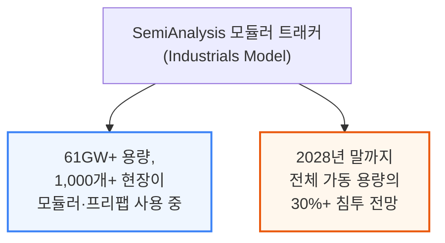
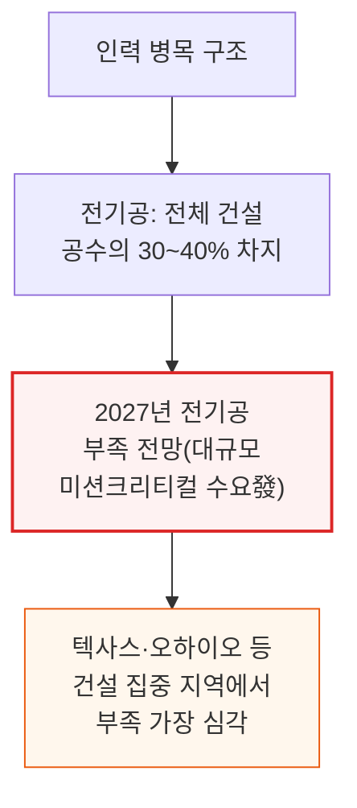
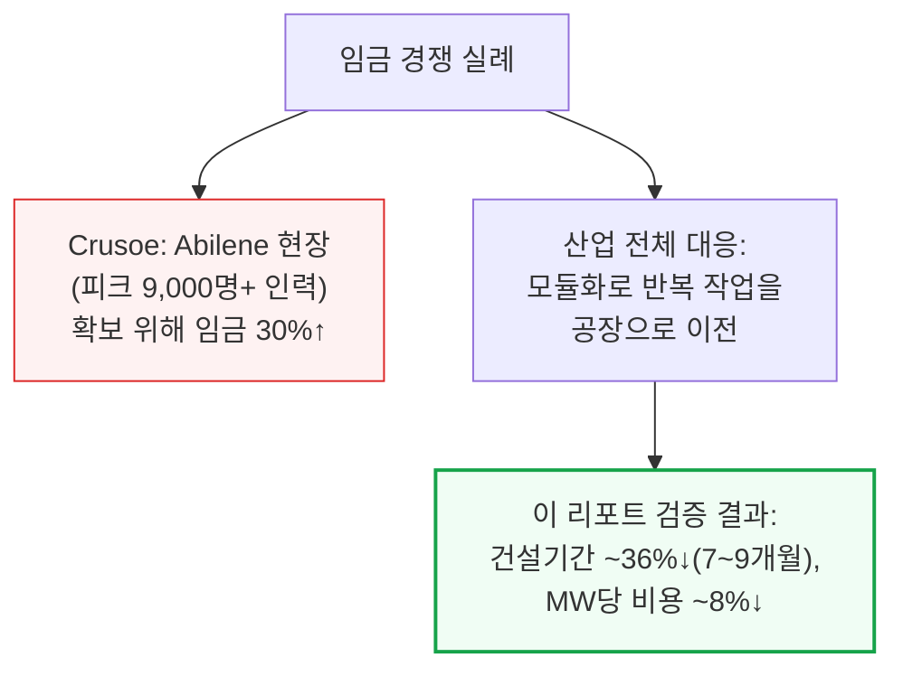
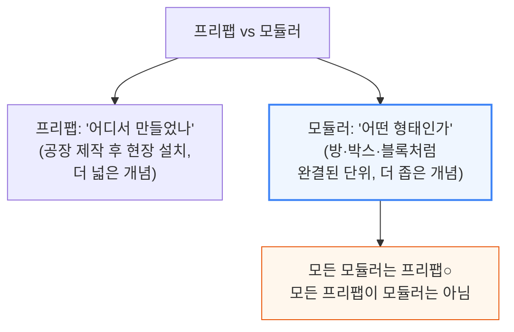
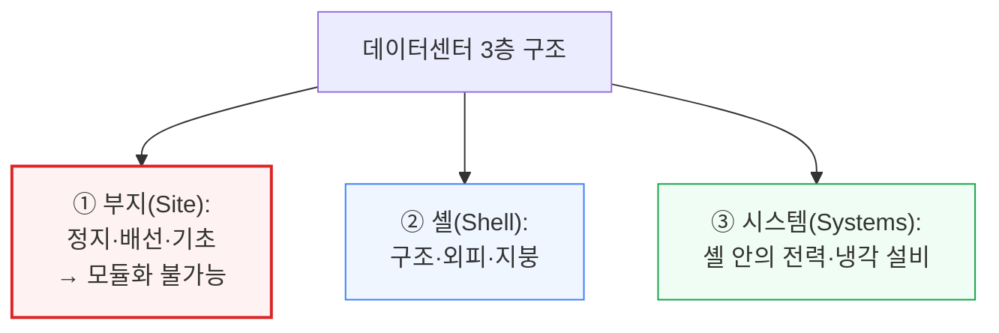
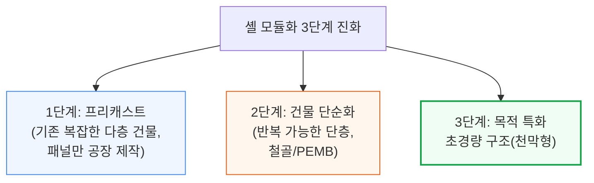
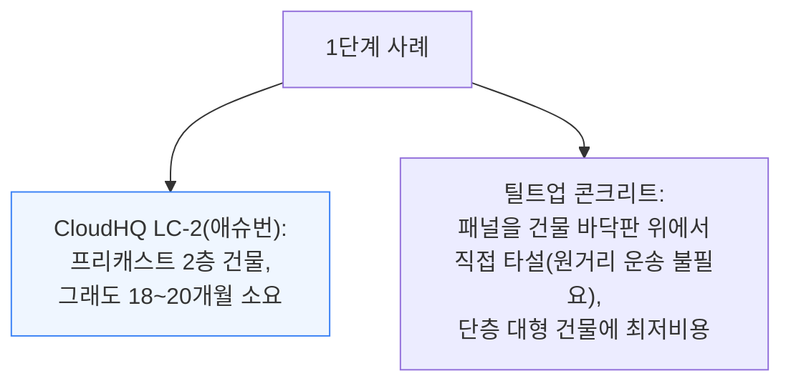
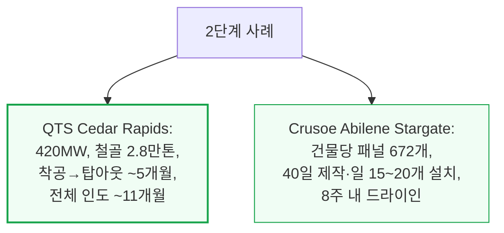
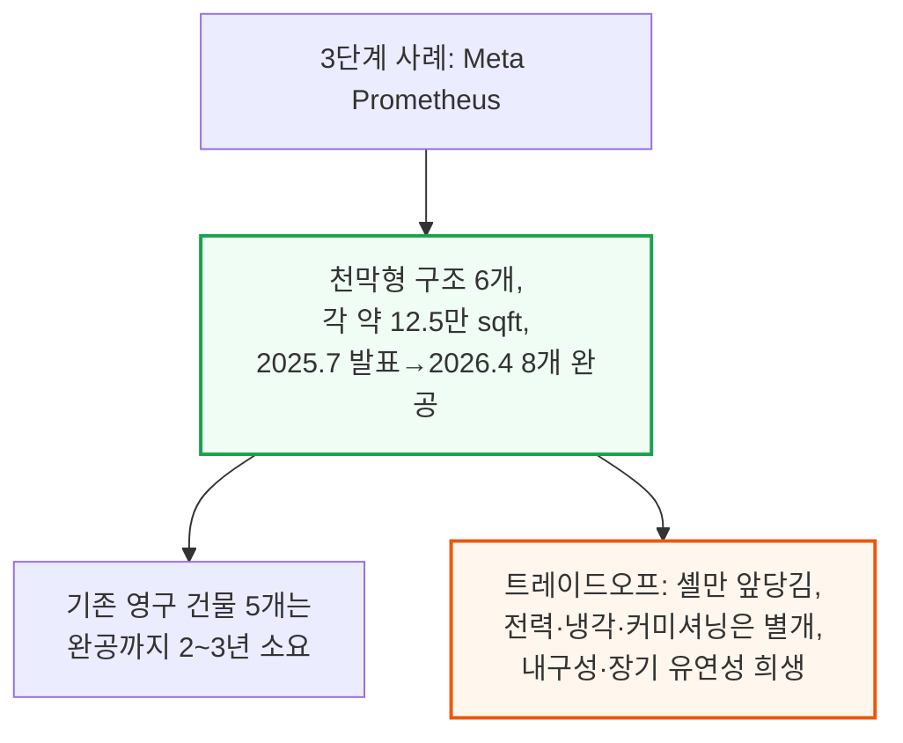

# The Wild Wild West Of LEGO Datacenters

> **출처**: [SemiAnalysis Newsletter](https://newsletter.semianalysis.com/p/the-wild-wild-west-of-lego-datacenters)
> **저자**: Nicolas Bontigui, Eric (Junqi) Wen, Jeremie Eliahou Ontiveros
> **발행일**: 2026-07-29

---

## 📑 목차

### 전체 섹션
 1. [개요 - 인력 문제와 모듈화의 부상](#1-개요---인력-문제와-모듈화의-부상)
 2. [모듈러 분류체계 - 프리팹 vs 모듈러, 부지·셸·시스템 3층 구조](#2-모듈러-분류체계---프리팹-vs-모듈러-부지셸시스템-3층-구조)
 3. [셸(외피) 모듈화 - 프리캐스트에서 텐트형 구조까지 3단계 진화](#3-셸외피-모듈화---프리캐스트에서-텐트형-구조까지-3단계-진화)
 4. [장비·서브시스템 모듈화 - 폼팩터 5단계 사다리와 전력·냉각 블록](#4-장비서브시스템-모듈화---폼팩터-5단계-사다리와-전력냉각-블록)
 5. [기타 모듈화와 공장 조립 화이트스페이스](#5-기타-모듈화와-공장-조립-화이트스페이스)
 6. [전체 시설 모듈화 - 컨테이너·올인원 프리팹 블록·Nvidia DSX 레퍼런스 설계](#6-전체-시설-모듈화---컨테이너올인원-프리팹-블록nvidia-dsx-레퍼런스-설계)
 7. [벤더 지형도와 통합 주체 - Operator-led·EPC-led·OEM-led 3가지 모델](#7-벤더-지형도와-통합-주체---operator-ledepc-ledoem-led-3가지-모델)
 8. [모듈화 사이클 5단계 - 설계·문서화·조립·운송·현장 커미셔닝](#8-모듈화-사이클-5단계---설계문서화조립운송현장-커미셔닝)
 9. [모듈러 가치제안 검증 - 속도·TCO·품질 실측과 벤더 주장 재평가](#9-모듈러-가치제안-검증---속도tco품질-실측과-벤더-주장-재평가)
10. [운영자별 모듈화 현황 - 하이퍼스케일러·GPU클라우드·코로케이션](#10-운영자별-모듈화-현황---하이퍼스케일러gpu클라우드코로케이션)
11. [승자와 패자 - 공급업체별 영향](#11-승자와-패자---공급업체별-영향)

---

## 🔑 용어 정리

본문을 순서대로 읽기 전에 알아두면 좋은 용어들입니다. 자세한 수치와 설명은 본문에서 처음 등장하는 위치에 나옵니다.

- **프리팹(Prefabrication) vs 모듈러(Modular)**: 프리팹은 "어디서 만들었나"에 대한 개념(공장에서 미리 만들어 완성품으로 배송)이고, 모듈러는 "어떤 형태인가"에 대한 개념(방·박스·블록처럼 완결된 단위로 만들어져 현장에서 볼트로 조립되는 것) — 모든 모듈러는 프리팹이지만, 모든 프리팹이 모듈러인 것은 아님
- **셸(Shell)**: 데이터센터의 골격·외피(벽·지붕) — 움직일 수 없는 부지 위에 세워지는 건물 그 자체(그 안에 전력·냉각 설비가 들어감)
- **EPC**: 설계(Engineering)·조달(Procurement)·시공(Construction)을 통째로 도급받아 수행하는 건설업체
- **OEM 주도 모델**: 장비 제조사가 자기 회사의 설비 스택 전체를 표준화된 완제품 패키지로 직접 판매하는 방식(예: Vertiv OneCore)
- **FAT(Factory Acceptance Test, 공장 수락 시험)**: 모듈이 공장을 떠나기 전, 실제 가동 조건 그대로 미리 켜서 정상 작동을 확인하는 시험
- **커미셔닝(Commissioning)**: 개별 장비 시험이 아니라 전기·냉각 시스템 전체를 현장에서 실제 조건(정전 시뮬레이션 등)으로 통째로 검증하는 마지막 단계 — 5단계(L1\~L5)로 진행
- **폼팩터 5단계 사다리**: 컴포넌트→스킷→모듈→컨테이너→프리팹 블록 순으로, 공장에서 얼마나 많은 부분을 미리 조립해서 보내는지를 나타내는 단계 구분
- **Nvidia DSX**: Nvidia가 발표한 AI 팩토리 전체(컴퓨트·네트워킹·전력·냉각·건축까지)의 표준 레퍼런스 설계

---

## 1. 개요 - 인력 문제와 모듈화의 부상

**📌 핵심:**
- 데이터센터 건설의 진짜 병목은 돈이 아니라 **숙련 인력(전기공·배관공)** — 자본을 아무리 쏟아도 전기공을 하루아침에 늘릴 수는 없음, SemiAnalysis는 지난 리포트들에서 부지·전력망 병목은 대부분 "해결 가능"하다고 봤지만 인력 병목만은 예외로 지목
- SemiAnalysis 추적 결과 전 세계 **61GW 이상의 용량, 1,000개+ 현장이 이미 어떤 형태로든 모듈러·프리팹 건설 방식을 사용** 중이며, 2028년 말까지 전체 가동 용량의 **30% 이상**이 모듈러 방식으로 지어질 전망
- Crusoe는 텍사스 Abilene 현장(피크 시 9,000명 이상 인력 필요)에 사람을 끌어오려고 **임금을 30% 인상**해야 했음 — 이는 인력 확보 경쟁이 이미 실제 비용으로 나타나고 있다는 증거
- 결론: 모듈화(반복 작업을 현장이 아닌 공장으로 빼내는 방식)는 인력 부족의 해법이자 속도 경쟁의 무기 — 이 리포트는 모듈러 건설이 **건설 기간을 약 36%(7\~9개월) 단축**하고 **MW당 비용을 약 8% 절감**한다는 것을 바닥부터 재구성해 검증

---

**📌 용어 풀이: 왜 지금 모듈화인가**
> - 콘크리트 벽이 완성된 패널로 도착하고, 전기·기계실이 이미 배선된 채 도착하며, 때로는 데이터 홀 전체가 트럭 짐칸에 실려 오는 것 — 이것이 "모듈러 건설"의 실제 모습으로, 마치 스파이더맨 레고 세트를 조립하듯 데이터센터를 조립하되 블록 하나의 무게가 22톤(5만 파운드)에 달하는 수준
> - Compass와 Switch가 데이터센터 건설의 일부를 공장으로 옮긴 최초의 운영사였고, 이후 AWS의 "Project Houdini"(화이트스페이스 조립을 공장화)와 Meta의 천막형("Tent") 데이터 홀 등으로 확산

---

## 2. 모듈러 분류체계 - 프리팹 vs 모듈러, 부지·셸·시스템 3층 구조

**📌 핵심:**
- 자주 혼동되는 두 개념을 먼저 구분: **프리팹(Prefabrication)**은 "어디서 만들었나"(공장 제작 후 현장 설치)를 뜻하고, **모듈러(Modular)**는 "어떤 형태인가"(방·박스·블록처럼 완결된 단위로 만들어져 현장에서 볼트로 조립되는 것)를 뜻함 — 모든 모듈러는 프리팹이지만, 모든 프리팹이 모듈러는 아님
- 데이터센터는 **부지(Site) → 셸(Shell) → 시스템(Systems)** 3개 층으로 볼 수 있음 — 부지는 땅을 고르고 배선하고 기초를 붓는 물리적 작업이라 **모듈화가 원천적으로 불가능**(땅에 직접 기초를 부어야 하기 때문), 셸은 건물의 골격·외피, 시스템은 셸 안에 들어가는 모든 전기·기계 설비
- 결론: 부지는 움직일 수 없으므로 모듈화 전략은 셸과 시스템 두 층에 집중 — 이 리포트도 바깥(셸)에서 안쪽(시스템)으로 순서대로 다룸

---

---

## 3. 셸(외피) 모듈화 - 프리캐스트에서 텐트형 구조까지 3단계 진화

**📌 핵심:**
- 셸 모듈화는 크게 3단계로 진화 — **1단계(프리캐스트)**: 기존과 같은 복잡한 다층 건물이지만 콘크리트 패널을 공장에서 만들어 크레인으로 조립(예: CloudHQ의 2층 LC-2 건물, 애슈번, 여전히 18\~20개월 소요), **2단계(건물 자체 단순화)**: 다층 건물 대신 반복 가능한 단층 구조로 전환, 철골 사용(예: QTS Cedar Rapids 420MW 캠퍼스는 철골 2만 8,000톤으로 착공→지붕 완성 약 5개월, 전체 건물 인도 약 11개월), **3단계(목적 특화 초경량 구조)**: 아예 더 가볍고 좁은 구조로 전환(Meta의 천막형 "Tent" 홀, 뉴올버니 Prometheus 캠퍼스에 2025년 7월 발표 후 2026년 4월까지 위성사진상 8개 완공 확인)
- Crusoe의 Abilene Stargate 캠퍼스는 2단계 방식의 대표 사례 — 건물당 공장제작 패널 약 672개를 40일 이내 제작해 하루 15\~20개씩 설치, **8주 이내에 드라이인(방수 완료) 상태 도달**
- 속도의 원천은 철골 자체가 아니라 철골이 가능하게 하는 것(반복 가능한 단층 구조, 적은 현장 접점, 여러 지역에 복제 가능한 공급망) — 다만 단층 캠퍼스는 부지 면적을 더 많이 요구, 새 AI 시장에서는 부지가 저렴해 속도가 면적 효율보다 중요하므로 수용 가능한 트레이드오프
- 결론: Meta의 천막형 구조는 셸(외피)만 앞당길 뿐 전력 연계·냉각·커미셔닝까지 앞당기는 것은 아니며, 영구 콘크리트·철골 건물 대비 내구성·장기 유연성을 희생하는 트레이드오프가 있음

---

**📌 용어 풀이: PEMB(사전 설계 금속 건물)와 철골 구조**
> - **PEMB(Pre-Engineered Metal Building)**: 가벼운 경량 철골 건물을 뜻하며 ① 주골조(구조의 뼈대) ② 부골조(주골조를 잇는 더 가벼운 지붕 도리 등) ③ 스킨(외부 기상으로부터 내부를 보호하는 얇은 금속 패널)의 3부분으로 구성 — 모든 부품이 절단·천공·라벨링까지 끝난 채 도착해 현장에서는 볼트 체결만 하면 됨
> - **구조용 철골(Structural Steel)**: PEMB보다 무겁고 열간 압연된 철골로, 더 넓은 경간·더 무거운 하중·더 복잡한 배치를 지원하지만 비용이 더 높음

---

*작성 진행률: 약 30% 완료 (1\~3장 완료)*
