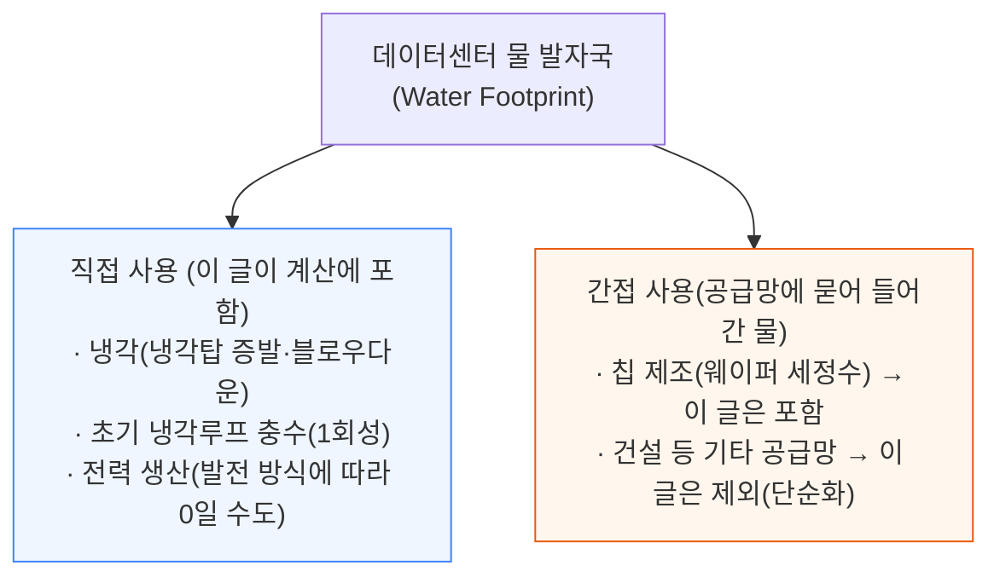
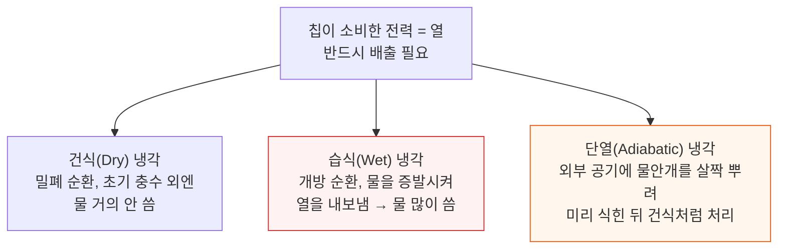
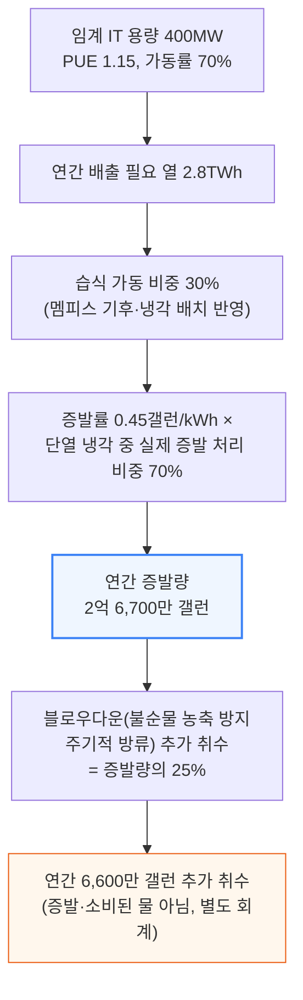
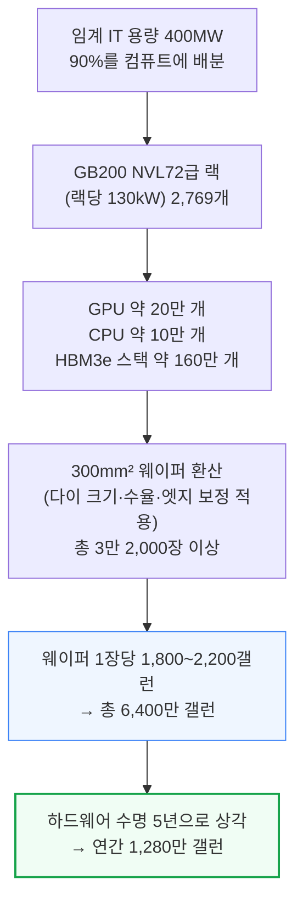
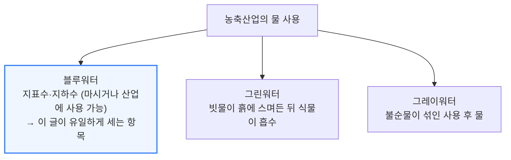
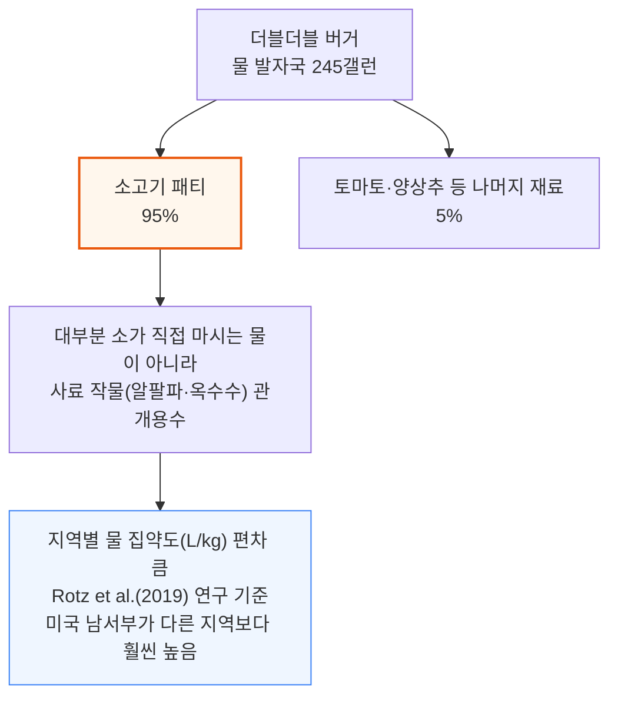
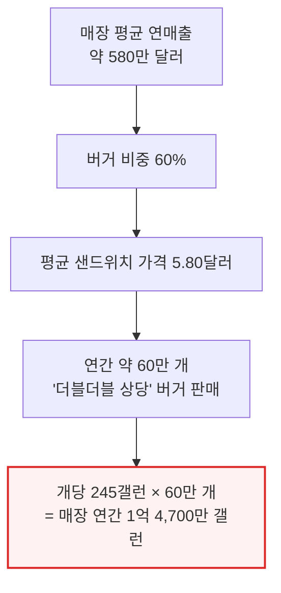
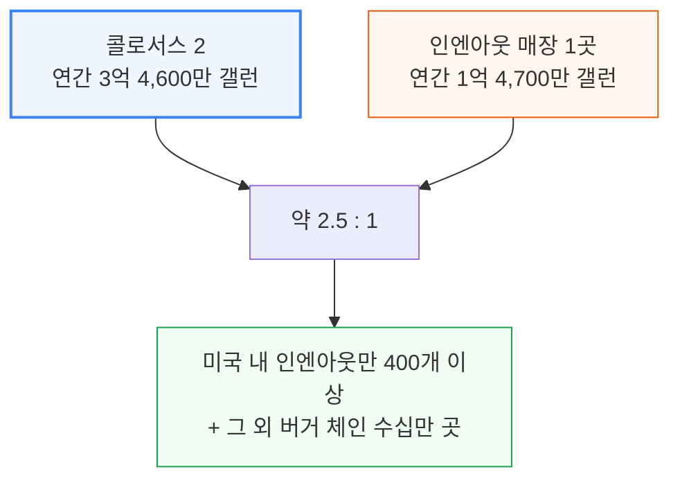
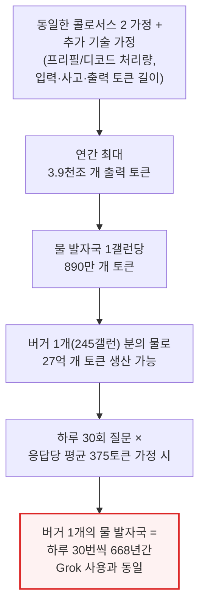
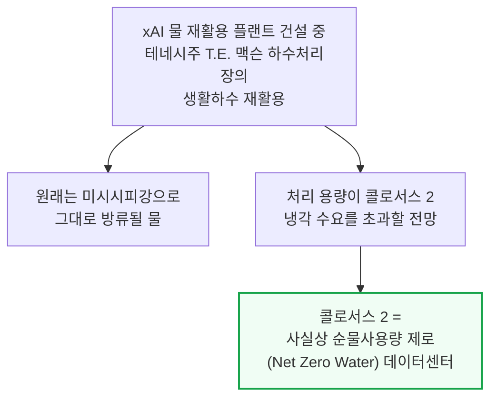

# From Tokens to Burgers: A Water Footprint Face-Off

> **출처**: [SemiAnalysis Newsletter](https://newsletter.semianalysis.com/p/from-tokens-to-burgers-a-water-footprint)
> **저자**: Nicolas Bontigui, Dylan Patel
> **발행일**: 2026-01-15

---

## 📑 목차

### 전체 섹션
1. [숫자가 놓치는 것 - 물 발자국 논쟁의 함정](#1-숫자가-놓치는-것---물-발자국-논쟁의-함정)
2. [1라운드: 콜로서스 2 - 냉각·발전·칩 제조의 물 발자국](#2-1라운드-콜로서스-2---냉각발전칩-제조의-물-발자국)
3. [2라운드: 인엔아웃 - 더블더블 버거 한 개의 물 발자국](#3-2라운드-인엔아웃---더블더블-버거-한-개의-물-발자국)
4. [판정 - 토큰당 물 발자국과 결론](#4-판정---토큰당-물-발자국과-결론)

---

## 🔑 용어 정리

본문을 순서대로 읽기 전에 알아두면 좋은 용어들입니다. 자세한 수치와 설명은 본문에서 처음 등장하는 위치에 나옵니다.

- **물 발자국 (Water Footprint)**: 어떤 활동이 직접·간접으로 소비하는 물의 총량 — 이 문서에서는 데이터센터의 냉각·발전·칩 제조를, 버거의 경우 소·채소 재배에 들어간 물까지 합산
- **건식(Dry) vs 습식(Wet) vs 단열(Adiabatic) 냉각**: 건식 냉각은 물을 거의 안 쓰는 밀폐 순환 방식, 습식 냉각은 물을 증발시켜 열을 내보내는 개방 순환 방식, 단열 냉각은 외부 공기에 물안개를 살짝 뿌려 미리 식힌 뒤 건식처럼 쓰는 절충 방식
- **PUE (Power Usage Effectiveness, 전력사용효율)**: 데이터센터가 실제 서버(IT 장비)에 쓰는 전력 대비 시설 전체가 끌어오는 총전력의 비율 — 1.15면 서버가 쓰는 전력의 15%가 냉각·조명 등 부대설비에 추가로 든다는 뜻
- **WUE (Water Usage Effectiveness, 물사용효율)**: 서버가 쓰는 전력 1kWh당 소비되는 물의 양(L/kWh) — 데이터센터 간 물 효율을 비교하는 표준 지표
- **블루워터·그린워터·그레이워터**: 블루워터는 마시거나 산업에 쓸 수 있는 지표수·지하수, 그린워터는 빗물이 흙에 스며든 뒤 식물이 흡수하는 물, 그레이워터는 불순물이 섞인 사용 후 물 — 셋을 섞어 계산하면 비교가 왜곡되므로 이 문서는 블루워터만 사용
- **블로우다운 (Blowdown)**: 냉각탑 안에서 물이 증발을 반복하며 불순물 농도가 올라가면, 일부를 배출하고 새 물로 채우는 주기적 방류 — 증발로 없어지는 물과 별개로 추가로 끌어오는(취수하는) 물

---

## 1. 숫자가 놓치는 것 - 물 발자국 논쟁의 함정

**📌 핵심:**
- 데이터센터 물 사용 논란이 커지면서 애리조나 등지에서 프로젝트가 중단·취소되는 사례까지 나왔지만, 저자들은 이 논쟁이 과장됐다고 봄 — 냉각 방식, 전력원, 입지, 그 지역 물 부족 여부 같은 핵심 변수가 자주 빠진 채 숫자만 단독으로 돌아다니기 때문
- 결정적 문제는 "물 사용량"을 잴 때 어디까지 셀지에 대한 **표준이 없다는 것** — 모델 학습에 쓴 물과 공급망(반도체 제조 등)에 묻어 들어간 물까지 포함할지, 아니면 시설 안에서 실제로 증발·소비된 물만 셀지에 따라 같은 시설도 결과가 크게 달라짐
- 이 글은 세계 최대급 데이터센터 중 하나(일론 머스크의 xAI, 콜로서스 2)와 인엔아웃(In-N-Out) 매장 한 곳의 연간 물 발자국을 같은 기준으로 계산해 나란히 비교
- 결론: "데이터센터가 물을 빨아들인다"는 헤드라인을 평가하려면 먼저 무엇을 물 사용으로 셀지부터 합의해야 하고, 이 글은 그 경계를 명시한 뒤 직접 계산해 비교치를 제시함

---

이 글이 물 발자국을 계산할 때 무엇을 포함하고 무엇을 뺐는지가 결론을 통째로 바꾸는 전제이므로, 본문에 들어가기 전 그 경계부터 명시합니다.

즉 이 글이 실제로 더하는 항목은 **냉각 + 전력 생산 + 칩 제조** 세 가지뿐이고, 데이터센터 건설 자체에 들어간 물이나 모델 학습 과정의 별도 물 사용은 "단순화를 위해" 계산에서 뺐습니다. 버거 쪽도 뒤에서 보듯 그레이워터·그린워터를 빼고 블루워터만 셉니다 — 두 대상을 같은 저울에 올리기 위한 전제입니다.

---

## 2. 1라운드: 콜로서스 2 - 냉각·발전·칩 제조의 물 발자국

**📌 핵심:**
- 콜로서스 2는 xAI가 미래 Grok 모델을 학습시킬 데이터센터로, 위성 사진과 현장 냉각 장비를 근거로 볼 때 현재 서버가 실제로 쓸 수 있는 전력(임계 IT 용량) 400MW에 근접 중이며 장기적으로 1GW 이상으로 확장 예정 — 이 글은 현재 400MW 상태 기준으로만 계산
- "콜로서스 2가 하루 최대 100만 갤런의 물을 쓸 수 있다"는 세간의 추정치는 근거 도출 과정이 불명확해, 저자들이 직접 재계산
- 냉각·전력 생산·칩 제조 세 항목을 합산한 결과 **연간 3억 4,600만 갤런(13억 1,000만 리터), 하루 평균 90만 갤런**의 물 발자국을 얻었고, 이는 WUE(물사용효율) 0.51L/kWh에 해당
- 결론: 세간의 "하루 100만 갤런" 추정치와 크게 다르지 않은 규모지만, 이번엔 항목별로 어떤 가정에서 그 숫자가 나왔는지 전부 추적 가능

---

### 냉각 - 건식·습식·단열의 차이가 물 사용을 가른다

칩이 쓰는 전력은 그대로 열로 바뀌어 반드시 밖으로 빼내야 하는데, 이때 쓰는 냉각 방식에 따라 물 사용량이 크게 달라집니다.

콜로서스 2는 이 중 건식과 단열 냉각을 섞은 하이브리드 구성입니다. 400MW 임계 IT 용량을 건식 냉각기 약 130대와 단열 냉각기 약 135대가 나눠 지탱합니다.

### 냉각 물 사용량 계산 - 267만 갤런이 아니라 2억 6,700만 갤런

여기서 중요한 회계상의 구분이 있습니다. 2억 6,700만 갤런은 실제로 증발해 대기로 사라지는(소비되는) 물이고, 6,600만 갤런은 블로우다운 때문에 추가로 끌어오지만(취수) 전량 증발하는 것은 아닌 물입니다.

이 글은 뒤에 나올 총합 3억 4,600만 갤런에 **두 항목을 모두** 포함시킵니다 — 즉 이 글의 "물 발자국"은 순수 소비량이 아니라 취수량까지 합친 수치입니다.

저자들은 습식 냉각기(칠러)가 건식보다 전력 효율이 훨씬 높다는 점도 짚으며, 미국 규제가 습식 냉각기 사용을 막지 말고 오히려 장려해야 한다는 의견을 덧붙입니다.

### 전력 생산 - 이번엔 물을 한 방울도 안 쓴다

콜로서스 2는 현재 Solar Turbines의 항공유도형(aeroderivative) 단순 사이클 가스터빈을 씁니다. 증기나 복합 사이클 없이 가스를 직접 태워 발전기를 돌리는 방식이라, 이 단계에서 소비되는 물은 0갤런입니다.

다만 앞으로 증기를 함께 활용하는 복합 사이클(CCGT) 터빈이 추가되면 이 물 사용 구조 자체가 바뀔 수 있다고 저자들은 지적합니다.

한 번만 발생하는 항목도 있습니다. 냉각 배관을 처음 채우는 초기 충수로, IT 루프는 랙당 약 40갤런에 왕복(주입·회수) 배관을 고려한 2배수, 여기에 완충탱크 분을 더합니다. 냉각탑 초기 충수는 앞서 계산한 습식 가동률과 10분치 유량을 기준으로 잡습니다. 규모가 작아 총합에 큰 영향은 없지만 회계상 포함합니다.

### 칩 제조 - 웨이퍼 한 장에 최대 2,200갤런

반도체 제조는 웨이퍼 세정·컨디셔닝에 여러 단계의 정제를 거친 초순수(ultra-pure water)를 씁니다. 이 6,400만 갤런은 칩을 만들 때 한 번 들어가는 물이라, 하드웨어를 5년 쓴다고 가정해 연간 수치로 나눠 반영합니다.

세 항목(냉각 증발 2억 6,700만 + 블로우다운 취수 6,600만 + 칩 제조 상각분 1,280만)을 더하면 **연간 3억 4,600만 갤런(13억 1,000만 리터), 하루 평균 90만 갤런**이 나오고, 이는 WUE 0.51L/kWh에 해당합니다.

세간에 떠돌던 "하루 최대 100만 갤런"과 크게 다르지 않은 규모지만, 이번엔 어떤 가정에서 이 숫자가 나왔는지 전부 짚을 수 있습니다.

---

## 3. 2라운드: 인엔아웃 - 더블더블 버거 한 개의 물 발자국

**📌 핵심:**
- 세간의 추정치는 버거 한 개당 약 650\~700갤런(약 2,650리터)이지만, 저자들은 콜로서스 2와 같은 방식으로 직접 계산 — 결과는 **버거 한 개당 245갤런(927리터)**으로 세간 추정치보다 훨씬 낮음
- 공정한 비교를 위해 블루워터만 세고, 소·채소를 키우는 지역별 물 집약도(캘리포니아 등 서부 해안 기준)를 반영 — 대표 메뉴 더블더블(Double-Double) 버거 재료를 성분별로 쪼개 무게 가중 계산
- 버거 물 발자국의 95%가 소고기 패티에서 나오며, 그중 대부분은 소가 직접 마시는 물이 아니라 사료(알팔파·옥수수 등)를 키우는 관개용수에서 간접적으로 발생
- 결론: 매장당 연간 약 60만 개의 더블더블 상당 버거가 팔린다고 추정하면, 매장 하나의 연간 물 발자국은 **1억 4,700만 갤런**

---

### 세 가지 물, 그리고 왜 블루워터만 세는가

콜로서스 2 쪽 계산도 냉각·발전·칩 제조에서 취수·소비된 물(블루워터 성격)만 셌기 때문에, 버거 쪽도 그린워터·그레이워터를 빼고 블루워터만 세야 같은 저울에 올릴 수 있습니다. 계산 범위도 단순화했습니다 — 더블더블 버거만 대상으로 하고, 다른 메뉴나 조리 과정에 쓰이는 물은 뺐습니다.

### 소고기 패티가 95%를 차지하는 이유

인엔아웃은 서부 해안(캘리포니아 등) 중심 매장망을 갖고 있고 "모든 소고기는 냉동하지 않은 신선육"이라고 밝히고 있어, 저자들은 서부 해안 지역의 물 집약도 수치를 쓰는 것이 타당하다고 판단했습니다. 캘리포니아산 신선 토마토·양상추 등 나머지 재료도 같은 기준(서부 해안 특화 수치)을 적용했습니다.

이렇게 계산한 결과가 **버거 한 개당 245갤런(927리터)**으로, 세간에 떠도는 650\~700갤런보다 훨씬 낮습니다. 저자들은 이 차이의 원인으로 세간 추정치가 그린워터(소의 전체 물 집약도에서 큰 비중을 차지)까지 섞어 셌거나, 도체 중량 대비 집약도와 뼈 없는 정육 대비 집약도를 구분하지 않았을 가능성을 지목합니다.

### 매장 하나가 파는 버거 수

---

## 4. 판정 - 토큰당 물 발자국과 결론

**📌 핵심:**
- 콜로서스 2의 연간 블루워터 발자국(3억 4,600만 갤런)은 인엔아웃 매장 한 곳(1억 4,700만 갤런)의 약 2.5배 — 세계 최대급 데이터센터 하나가 매장 2.5곳 분의 물을 쓰는 셈이고, 미국에만 인엔아웃 매장이 400곳 넘게 있고 다른 버거 체인까지 더하면 규모 차이는 훨씬 커짐
- 같은 가정으로 토큰 생산량까지 계산하면 콜로서스 2는 연간 최대 3.9천조 개(3.9 quadrillion) 출력 토큰을 만들 수 있어, **물 발자국 1갤런당 890만 개 토큰**이 나옴 — 버거 한 개(245갤런)와 같은 물로는 27억 개 토큰을 만들 수 있는 셈
- 하루 30회 질문, 응답당 평균 375토큰이라는 사용 시나리오를 적용하면, **버거 한 개의 물 발자국은 하루 30번씩 668년 동안 Grok을 쓰는 것과 같은 물의 양**
- 결론: xAI는 이미 테네시주 T.E. 맥슨(T.E. Maxson) 하수처리장의 생활하수를 재활용해 냉각수로 공급하는 재활용 플랜트를 짓고 있고, 이 플랜트 처리 용량이 콜로서스 2의 냉각 수요를 넘어설 것으로 예상돼 콜로서스 2는 사실상 순물사용량 제로(net zero water) 데이터센터가 될 수 있음

---

### 콜로서스 2 vs 인엔아웃 - 2.5배 차이의 실체

저자들은 "세계 최대급 데이터센터 하나가 매장 2.5곳 분량의 물만 쓴다"는 사실을 근거로, 데이터센터 감속을 물 사용 이유로 요구하는 목소리는 잘못된 문제를 겨냥하고 있다고 주장합니다.

물론 "그래도 버거는 기본 필요인 식량이고 토큰은 아니지 않냐"는 반박이 나올 법합니다. 이에 대해 저자들은, 모델이 점점 더 똑똑해지는 지금 시점엔 지능의 기본 단위인 토큰 하나에 얼마의 경제적 가치를 매길지 따지는 더 어려운 질문을 피해서는 안 된다고 답합니다.

### 토큰 대 갤런 - 버거 하나로 Grok을 얼마나 오래 쓸 수 있나

### 마지막 변수 - 물 재활용 플랜트

저자들은 이 글이 진지한 학술 논문이 아니라 논쟁에 새로운 각도를 더하려는 가벼운(하지만 근거 있는) 시도라고 밝히면서, 물 사용은 분명 중요한 문제지만 맥락 없이 숫자만 던지는 방식은 논쟁을 오히려 왜곡한다고 마무리합니다.

---

*작성 진행률: 100% 완료*
*업데이트: 원문 전체 4개 섹션(숫자가 놓치는 것\~판정) 변환 완료. 원문의 이미지·차트는 다이어그램으로 대체, 물 사용 회계 경계(직접/간접, 취수/소비, 블루·그린·그레이워터)를 명시적으로 옮김*
