# NAND Flash Monopoly Broken? Tokyo Electron Moly Dep + Cryo Etch Takes On Lam Research For The Future Of NAND

> **출처**: [https://newsletter.semianalysis.com/p/nand-flash-monopoly-broken-tokyo](https://newsletter.semianalysis.com/p/nand-flash-monopoly-broken-tokyo)
> **저자**: [[Dylan Patel]]
> **발행일**: 2023-07-17

📑 목차
 1. [서론: NAND만 살아남은 무어의 법칙](#1-서론-nand만-살아남은-무어의-법칙)
 2. [NAND 미세화의 4가지 경로](#2-nand-미세화의-4가지-경로)
 3. [3D 낸드 제조 공정 흐름](#3-3d-낸드-제조-공정-흐름)
 4. [NAND 시장 현황: 공급 과잉에서 다가오는 공급 부족으로](#4-nand-시장-현황-공급-과잉에서-다가오는-공급-부족으로)
 5. [고종횡비 식각 전쟁: 초저온 식각이 램리서치에 도전](#5-고종횡비-식각-전쟁-초저온-식각이-램리서치에-도전)
 6. [몰리브덴 증착: 차세대 워드라인 소재 전쟁](#6-몰리브덴-증착-차세대-워드라인-소재-전쟁)
 7. [결론: 10억 달러 규모의 점유율 이동](#7-결론-10억-달러-규모의-점유율-이동)
 8. [키옥시아와 웨스턴디지털의 합병](#8-키옥시아와-웨스턴디지털의-합병)

🔑 용어 정리
- **3D 낸드 (3D NAND)**: 메모리 셀을 평면에 늘어놓는 대신 수직으로 층층이 쌓아올려, 미세공정 없이도 저장 용량을 늘리는 낸드플래시 구조.
- **고종횡비 식각 (High Aspect Ratio Etch)**: 폭은 아주 좁은데 깊이는 그 수십 배에 달하는 구멍을 뚫는 정밀 화학 식각 공정 — 3D 낸드에서 층수를 늘릴수록 이 구멍도 더 깊이 뚫어야 함.
- **초저온 식각 (Cryo Etch)**: 식각 장비의 웨이퍼 받침대를 영하 수십도까지 얼려서 진행하는 차세대 식각 방식 — 구멍을 더 빠르고 곧게 뚫을 수 있음.
- **워드라인 (Word Line)**: 낸드 셀 하나하나에 전압을 걸어 데이터를 읽고 쓰게 하는 금속 배선층 — 층수만큼 워드라인도 늘어남.
- **웨이퍼 팹 장비 (WFE, Wafer Fab Equipment)**: 반도체 공장이 웨이퍼를 가공하는 데 쓰는 장비 전체를 가리키는 업계 용어이자, 장비업체 매출 규모를 재는 기준 지표.
- **몰리브덴 (Moly) 배선 소재**: 현재 워드라인을 채우는 텅스텐을 대체할 후보 금속 — 배선이 가늘어져도 저항이 덜 커져 신호 손실이 적음.
- **비트당 원가 (Cost per Bit)**: 저장 용량 1비트를 만드는 데 드는 제조원가 — NAND 업계가 서로의 기술 경쟁력을 비교하는 핵심 잣대.
- **하이브리드 본딩 (Hybrid Bonding)**: 로직 회로와 메모리 셀을 각각 다른 웨이퍼에서 만든 뒤 하나로 붙이는 결합 기술 — 두 공정을 동시에 진행할 수 있어 생산 속도가 빨라짐.

---

## 1. 서론: NAND만 살아남은 무어의 법칙

**📌 핵심:**
- 로직 반도체와 D램은 미세공정 개선 속도가 느려지며 무어의 법칙이 사실상 정체된 반면, NAND 플래시만은 2013년 도입된 **3D 낸드** 구조 덕분에 매년 급격한 원가 하락을 이어가고 있음
- 비결은 미세공정(리소그래피) 의존을 버리고 **층을 계속 더 쌓는 방식**으로 전환한 것 — 그 결과 3D 낸드 도입 이후 밀도가 매년 30%씩, 비트당 원가는 매년 21%씩 꾸준히 떨어짐
- 마이크론은 앞으로 NAND 비트당 원가 하락률이 기존 21%에서 **10%대 초중반**으로 둔화될 것으로 전망(D램은 한 자릿수 후반에 그침) — 낸드의 원가 우위는 여전하지만 예전만큼 가파르지는 않음
- 결론: 2018\~2022년 NAND 장비 투자액은 매년 약 150억 달러로 일정했는데도 총 생산능력은 매년 30% 넘게 늘었음(장비를 더 사서가 아니라 제조 효율이 좋아져서) — 이 리포트는 이 효율 개선의 핵심 무대인 증착·식각 공정에서 도쿄일렉트론(TEL)이 램리서치의 아성을 어떻게 흔드는지를 다룸

---

로직 반도체와 D램은 회로 선폭을 줄이는 미세공정 개선이 느려지며 사실상 정체 상태에 이르렀지만, NAND 플래시는 다른 길을 걸었습니다. 2013년 상용화된 **3D 낸드** 구조로 전환하면서, 미세공정이 아니라 셀을 위로 쌓는 방식으로 밀도를 계속 늘려온 것입니다.

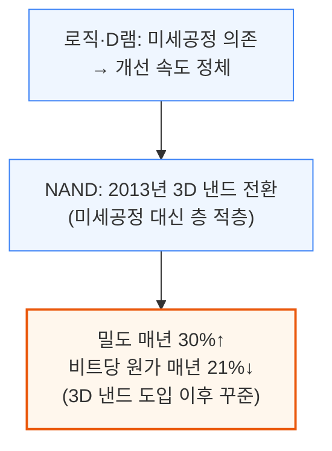

이 원가 하락 속도는 앞으로 둔화될 전망입니다. 마이크론은 NAND 비트당 원가 하락률이 기존 매년 21%에서 앞으로는 10%대 초중반으로 낮아질 것으로 보는 반면, D램은 원래도 한 자릿수 후반 하락에 그쳐 낸드보다 미세화가 훨씬 어렵다고 평가합니다.

이런 원가 개선이 가능했던 이유는 밀도를 늘리면서도 공정 단계 수를 크게 늘리지 않았기 때문입니다.
3D 낸드에서 가장 중요한 단계는 얇은 막을 쌓는 **증착**과, 그 막을 뚫고 내려가는 **고종횡비 식각**입니다.
램리서치는 이 중에서도 가장 핵심인 고종횡비 식각 분야의 오랜 선두주자입니다.

2018\~2022년 사이 NAND 팹의 장비 구매액은 매년 약 150억 달러로 거의 일정했는데도, 총 생산능력은 매년 30% 넘게 늘었습니다. 장비를 더 사서가 아니라 제조 효율 자체가 좋아졌기 때문입니다.
다만 같은 속도로 생산능력을 늘리려면 장비 혁신이 없는 한 투자액도 비례해서 커져야 하는데, 지금은 다운턴으로 대형 투자가 미뤄지고 있어 오히려 1.5년 뒤 공급 부족의 씨앗이 되고 있습니다.

이 리포트는 NAND 시장 현황과 미세화 기술, 제조 공정, 공급 과잉·부족 전망, 웨스턴디지털·키옥시아의 앞날을 다루며, 램리서치에서 도쿄일렉트론(TEL)으로 **10억 달러 이상**의 매출이 옮겨갈 수 있는 점유율 이동까지 살펴봅니다.

---

## 2. NAND 미세화의 4가지 경로

**📌 핵심:**
- NAND 용량을 늘리는 방법은 ① 셀당 저장 비트 수를 늘리는 **논리적 미세화**, ② 셀을 수직으로 더 높이 쌓는 **수직 미세화**, ③ 셀을 옆으로 더 촘촘히 배치하는 **수평 미세화**, ④ 회로 배치 구조를 바꾸는 **구조적 미세화** 4가지뿐
- 논리적 미세화(셀당 비트 수 증가)는 이미 한계 근접 — 비트를 늘릴수록 셀 하나가 저장하는 전자 수가 줄어 신뢰성이 나빠짐(예: Solidigm의 192단 PLC는 원가 구조가 나빠 양산 무산, 삼성 V9 세대는 QLC의 밀도 우위가 40%에서 20%로 축소)
- 수직 미세화(층수 늘리기)는 지난 10년간 밀도 향상의 주력이었지만, 현재 고종횡비 식각 장비로는 6\~7마이크로미터가 깊이 한계 — 이를 넘으려면 여러 층 덩어리(데크)를 따로 뚫어 붙이는 '스트링 스태킹'이 필요한데, 데크가 많을수록 정렬 오차 위험도 커짐
- 결론: 수평 미세화(구멍 간격 좁히기)와 구조적 미세화(로직 회로를 메모리 아래 또는 별도 웨이퍼에 배치)는 밀도 향상 폭이 작지만 비용은 거의 늘리지 않는 보완 수단 — 결국 남은 것은 식각 장비 자체의 깊이 한계를 뚫는 기술 혁신뿐이며, 이것이 도쿄일렉트론이 램리서치의 사업을 가져갈 수 있는 이유

---

NAND 저장 용량을 웨이퍼 한 장에서 최대한 끌어내는 방법은 크게 4가지뿐입니다. 아래는 각 방법의 원리와 한계입니다.

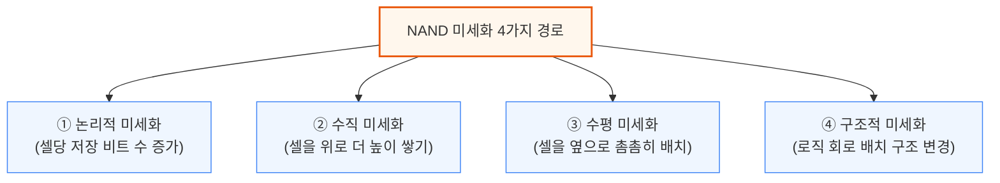

**① 논리적 미세화**는 셀 하나가 저장하는 비트 수를 늘리는 방법입니다. 비트 하나를 추가할 때마다 셀이 구분해야 하는 전압 단계 수는 2배씩 늘어납니다(1비트=2단계, 2비트=4단계, 3비트=8단계, 4비트=16단계, 5비트=32단계).
회로를 더 뚫지 않고도 용량을 늘리는 '공짜 미세화'처럼 보이지만, 문제는 전압 단계가 늘어날수록 셀 하나에 저장되는 전자 수가 줄어들어 오차와 열화에 훨씬 취약해진다는 점입니다.

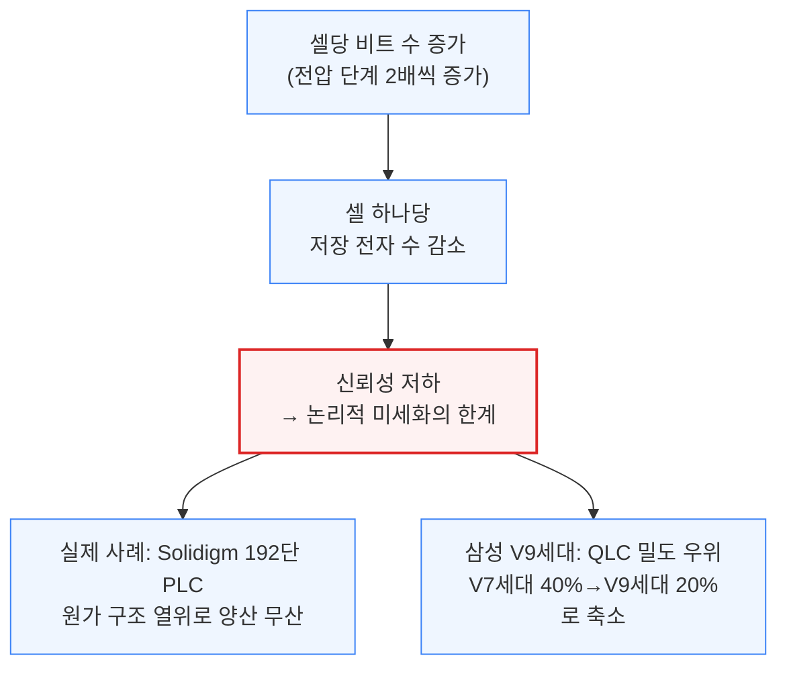

이런 이유로 마이크론과 SK하이닉스는 셀당 3비트(TLC)가 장기적으로 가장 원가 효율적인 방식이라고 보고 있습니다.

**② 수직 미세화**는 지난 10년간 밀도 향상을 이끈 주력 방식이지만, 현재 고종횡비 식각 장비의 깊이 한계(6\~7마이크로미터, 셀 하나 두께 약 40나노미터)에 부딪혀 최대 128단까지만 한 번에 뚫을 수 있습니다. 이를 넘어서려면 여러 층 덩어리를 따로 뚫은 뒤 위아래로 붙이는 '스트링 스태킹'이 필요합니다.

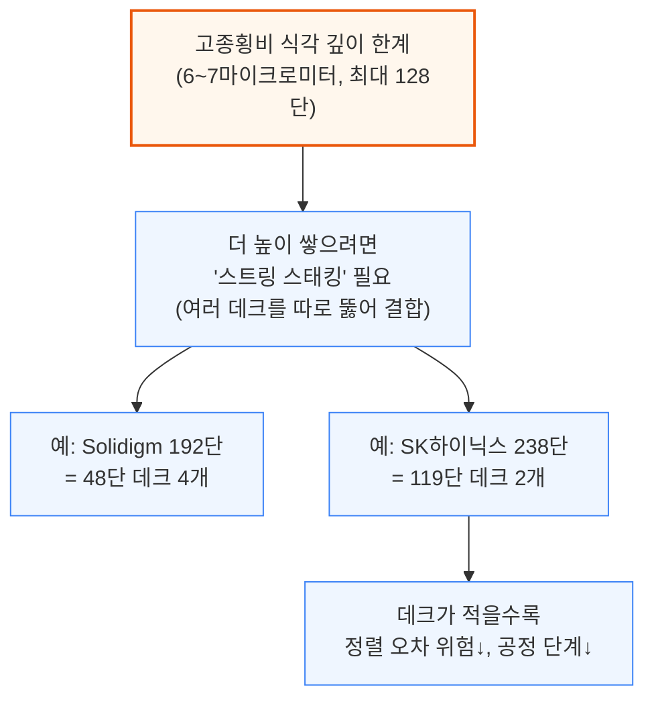

데크 수를 줄이는 유일한 방법은 셀 하나의 두께를 더 얇게 만들거나, 식각 장비 자체의 깊이 한계를 늘리는 것뿐입니다. 바로 이 지점이 도쿄일렉트론(TEL)이 램리서치의 사업을 가져갈 수 있는 이유이며, 뒤에서 다룰 증착 소재 변화도 이에 못지않은 파급력을 가질 것으로 봅니다.

**③ 수평 미세화**는 셀 구멍을 더 촘촘하게 배치하거나, 셀 구획을 나누는 슬릿의 면적 손실을 줄이는 방식입니다. 구멍 자체를 더 좁히는 방법은 이미 한계에 도달했지만, 슬릿 사이에 들어가는 구멍(필라) 개수를 늘려 면적 효율을 높이는 방식은 아직 여지가 있습니다.

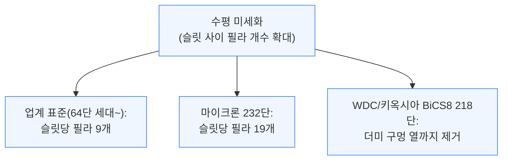

수평 미세화가 주는 밀도 향상 폭은 수직 미세화보다 작지만, 장비 투자를 추가로 늘리지 않고도 원가를 선형적으로 낮출 수 있다는 장점이 있습니다.

**④ 구조적 미세화**는 로직 회로(CMOS)를 어디에 배치하느냐를 바꾸는 방식입니다. 초기에는 로직 회로를 메모리 배열 옆에 뒀다가(CMOS Next to Array), 이후 메모리 배열 아래에 두어 면적을 절약했습니다(CMOS Under Array).
최근에는 로직을 아예 별도 웨이퍼에서 만든 뒤 메모리 웨이퍼와 하이브리드 본딩으로 붙이는 방식(CMOS Bonded Array)까지 등장했습니다.

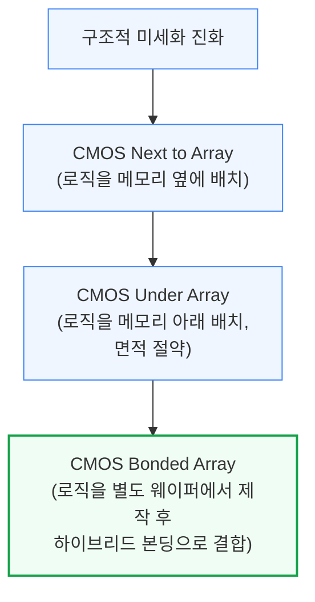

로직과 메모리를 별도 웨이퍼에서 동시에 만들면 공정 복잡도와 소요 시간이 줄어 본딩 비용 증가를 상쇄할 수 있습니다. YMTC가 64단 Xtacking 1.0에서 1.0마이크로미터 간격의 하이브리드 본딩으로 이 방식을 선도했고, WDC/키옥시아의 BiCS8 218단도 하이브리드 본딩을 채택할 예정입니다.

이 4가지 경로 중 대부분은 이미 한계에 근접했습니다. 그동안 밀도 향상의 주역이었던 수직 미세화조차 현재 장비로는 더 이상 밀어붙이기 어려운 상황입니다.

---

## 3. 3D 낸드 제조 공정 흐름

**📌 핵심:**
- 3D 낸드 제조는 산화막과 질화막을 20\~30나노미터씩 번갈아 쌓은 뒤(이론상 최대 250단 이상, 높이 약 7마이크로미터), 그 위에 폭보다 70배나 깊은 구멍을 뚫는 **고종횡비 식각**으로 시작
- 구멍을 뚫은 뒤에는 전하를 가두는 층을 채워 셀을 만들고, 다시 슬릿을 뚫어 질화막을 제거한 자리에 텅스텐 워드라인을 채우는 '금속 교체 게이트' 공정을 거침
- 여러 층 덩어리(데크)로 나눠 만드는 설계는 이 전체 과정(적층→구멍 뚫기→셀 형성→금속 채우기)을 데크 수만큼 반복해야 함
- 결론: 결국 3D 낸드의 밀도와 성능은 고종횡비 식각과 증착 기술의 한계에 좌우되며, 구멍을 뚫는 시간(비트당 공정 시간)이 늘어날수록 과거처럼 빠른 원가 하락을 기대하기 어려워짐

---

3D 낸드 한 층 한 층은 아래 순서로 만들어집니다. 먼저 산화막과 질화막을 20\~30나노미터 두께로 번갈아 쌓고(이론상 250단 이상, 높이 약 7마이크로미터까지 가능), 그 위에 두꺼운 하드마스크를 얹어 고종횡비 식각을 준비합니다.

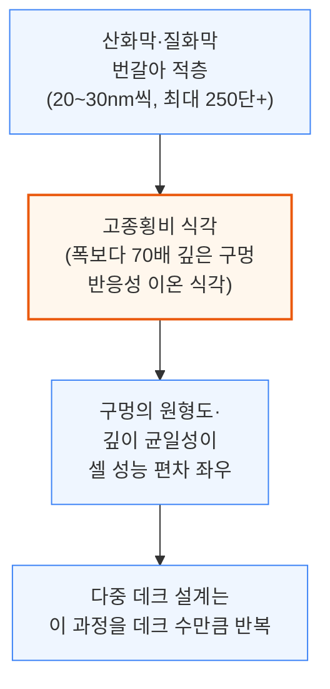

구멍이 뚫리면 그 안에 전하를 가두는 여러 층을 순서대로 채워 실제 저장 셀을 만듭니다(층을 채울수록 구멍이 점점 좁아짐).
이어서 슬릿을 층 전체에 뚫어 옆면을 노출시키고, 질화막을 제거한 자리에 원자층증착(ALD)으로 배리어를 입힌 뒤 텅스텐 워드라인을 채워 넣습니다.
마지막으로 배열 양옆에는 계단(스테어케이스) 구조를 식각해 각 워드라인 층에 수직으로 접속할 수 있게 만듭니다.

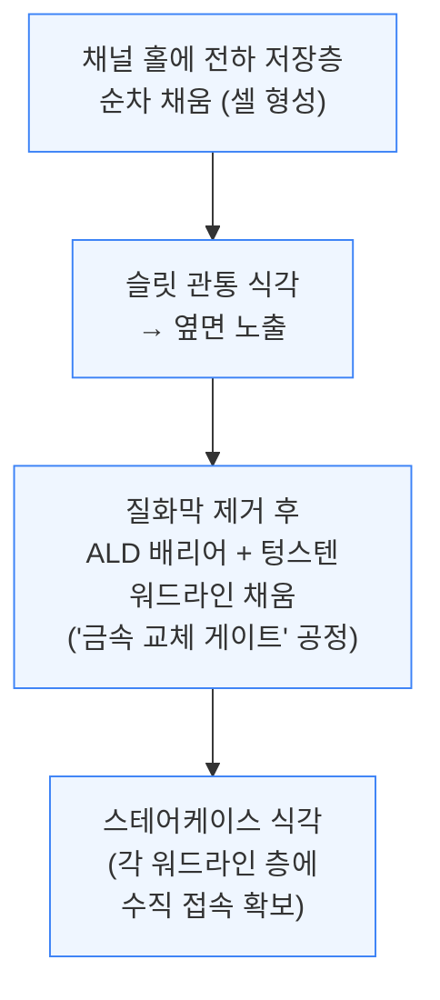

이 위에 비트라인과 금속 배선을 올려 워드라인 드라이버 등 주변 회로(CMOS)와 연결하면 하나의 3D 낸드 칩이 완성됩니다. 이처럼 3D 낸드는 처음부터 끝까지 고종횡비 식각과 증착 기술에 절대적으로 의존합니다.

앞서 설명했듯 가장 큰 병목은 채널 홀을 뚫는 시간입니다. 이 시간이 늘어날수록 비트당 공정 시간(=비트당 원가)의 하락 속도는 과거 추세보다 느려질 수밖에 없으며, 바로 이 지점이 이 리포트가 집중하는 주제입니다.

---

## 4. NAND 시장 현황: 공급 과잉에서 다가오는 공급 부족으로

**📌 핵심:**
- 반도체 다운턴으로 NAND 가동률은 60%대까지 떨어졌고, 1997년 이후 최악의 수급 불균형 — 3위 업체 삼성전자(시장점유율 34%)조차 기술 세대에서 SK하이닉스·마이크론(200단 이상)에 크게 뒤처져 여전히 128단 위주 생산
- 삼성전자는 올해 236단으로 세대를 건너뛰며 대규모 전환 투자를 단행 중이지만, 이는 오히려 회복을 늦춤 — 전환이 끝나면 비트 공급이 70% 더 늘어나 공급 과잉을 심화시키기 때문(대신 경쟁사들의 시장 통합을 압박하려는 삼성 최고위층의 의도적 전략)
- 중국 최대 낸드 업체 YMTC는 미국의 장비 수출 금지 대상에 올라 다운턴에도 투자를 이어가던 유일한 비경제적 공급자 역할을 더는 할 수 없게 됨 — 2024년은 2023년보다도 더 얇은 투자가 예상되고, 2025년에야 재고 소진과 낮은 가동률을 발판 삼아 본격 회복 전망
- 결론: 그런데도 램리서치 주가는 생성형 AI 훈풍을 타고 사상 최고치 부근에 있음 — 이는 NAND 매출의 26%를 차지하는(전체 웨이퍼 팹 장비 지출의 최대 비중) 램리서치가 회복을 이미 선반영했다는 뜻이며, 정작 회복이 눈에 보일 즈음엔 도쿄일렉트론과의 경쟁 구도가 이미 부각돼 있을 가능성

---

NAND 업계는 공급 과잉에 시달리고 있습니다. 가동률은 60%대까지 떨어졌고, 재고도 산더미처럼 쌓여 1997년 이후 최악의 수급 불균형을 겪는 중입니다.

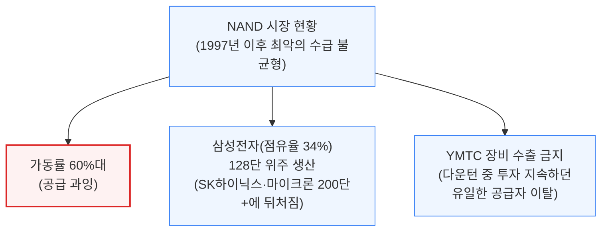

삼성전자는 이 격차를 만회하려 올해 대규모 생산라인을 236단으로 한 번에 전환하는 투자를 단행하고 있습니다. 문제는 이 전환이 끝나는 순간 비트 공급이 70% 더 늘어난다는 점 — 즉 올해 투자는 NAND 장비 지출을 잠시 떠받치지만, 회복 자체는 오히려 늦춥니다.

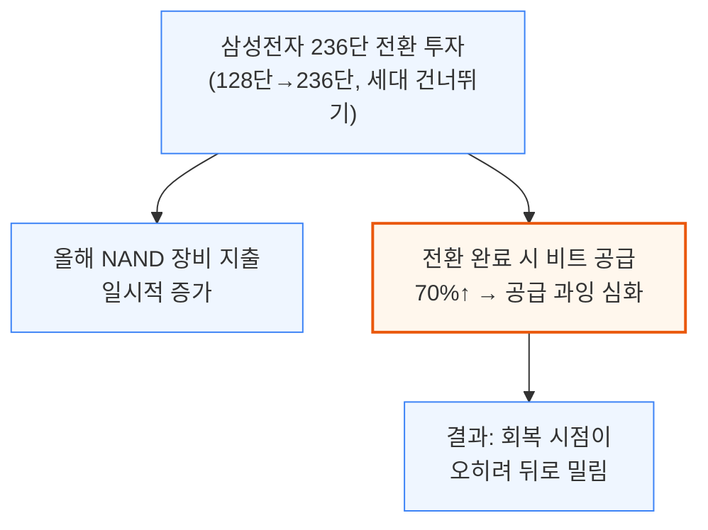

이 전략은 삼성 최고위층이 의도적으로 밀어붙이는 것으로, 손해를 감수하고서라도 원가 경쟁력이 약한 경쟁사들을 시장에서 밀어내 업계 통합을 유도하려는 목적입니다.

중국의 유일한 변수였던 YMTC도 더는 힘을 쓰지 못합니다. 다운턴 중에도 투자를 이어가며 비트 공급을 늘려온 유일한 '비경제적' 공급자가 이탈하면서, 2024년은 2023년보다도 얇은 투자가 예상됩니다.
재고 소진과 낮은 가동률이 버퍼 역할을 하는 2025년에야 본격적인 회복이 시작될 전망입니다.

그런데도 램리서치 주가는 생성형 AI 열풍에 힘입어 사상 최고치 부근에 있습니다.
마이크론처럼 AI 수혜가 뚜렷하지 않은 종목은 열기가 식는 반면, 램리서치는 NAND 노출도가 높다는 이유로 여전히 함께 묶여 오르는 상황 — 시장이 NAND 회복을 이미 선반영했다는 뜻입니다.

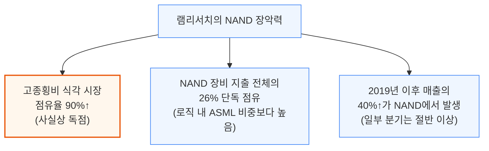

램리서치가 과거 최고 매출을 다시 넘어서려면 NAND 장비 지출이 의미 있게 회복돼야 하는데, 이는 램리서치가 지금의 압도적 점유율을 그대로 지킨다는 전제를 깔고 있습니다. 이번이 처음으로 진짜 경쟁자의 위협이 등장한 순간입니다.

---

## 5. 고종횡비 식각 전쟁: 초저온 식각이 램리서치에 도전

**📌 핵심:**
- NAND 제조에서 고종횡비 식각은 로직·D램보다 훨씬 비중이 높은 핵심 공정인데, 층을 뚫을수록 이온이 바닥까지 도달하는 힘이 약해져 식각 속도가 느려지는 '깊이 손실' 현상 때문에 7마이크로미터 스택 하나를 뚫는 데 50분\~1시간이 걸림
- 도쿄일렉트론(TEL)은 챔버 온도를 영하 60도까지 낮추는 **2세대 초저온 식각** 장비로 이 문제를 정면 돌파 — 이미 복수의 고객사에 복수의 장비를 출하했으며, HF 식각 가스 농도를 36%에서 91%로 높이고 인(P) 촉매를 추가해 식각 속도를 1세대 대비 2배로 끌어올림
- 이 장비는 10마이크로미터 깊이를 30분 만에 뚫어 기존 7마이크로미터 한계를 돌파 — 더 적은 데크로 같은 층수를 만들 수 있어 바닥 공간과 비트당 원가를 동시에 절감
- 결론: 램리서치도 수십 년째 초저온 식각을 연구해왔지만(CTO 릭 갓쇼도 "비용은 더 들지만 이득이 더 크다"고 인정), 2021년 실적발표에서 예고한 2022년 양산 공급은 실현되지 않았고 실제 고객사로부터 TEL 대비 총소유비용(TCO) 문제까지 확인돼 상용화 경쟁에서 TEL에 뒤처진 상태

---

NAND 제조에서 식각은 로직이나 D램보다 훨씬 비중이 높은 핵심 공정입니다. 층수가 늘수록 뚫어야 할 채널 홀도 더 깊어지는데, 문제는 이온이 구멍 안으로 깊이 들어갈수록 그 수가 줄어들어 식각 속도가 느려지는 '깊이 손실' 현상입니다.

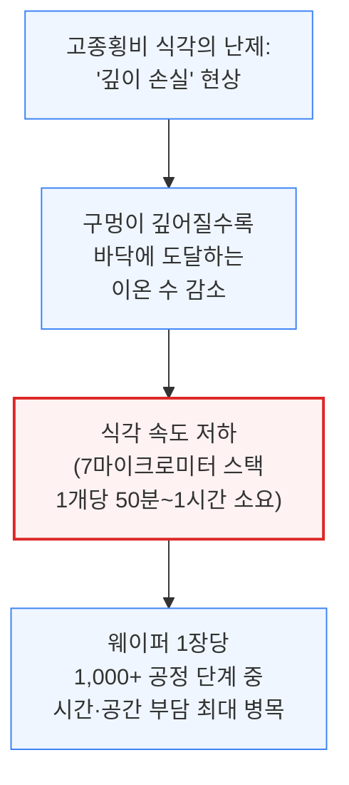

이 문제를 뚫는 유력한 해법이 **초저온 식각**입니다. 1980\~90년대부터 연구는 있었지만 실제 양산에 쓰인 적은 없었는데, 원리는 웨이퍼 받침대를 아주 차갑게 얼려 구멍 옆면을 저온으로 유지하면 이온이 덜 흩어지고 더 깊이까지 도달한다는 것입니다.

도쿄일렉트론(TEL)은 2023년 VLSI 학회에서 영하 60도로 작동하는 **2세대 초저온 식각** 장비를 공개했고, SemiAnalysis는 TEL이 이미 복수의 고객사에 복수의 장비를 출하한 사실을 확인했습니다.

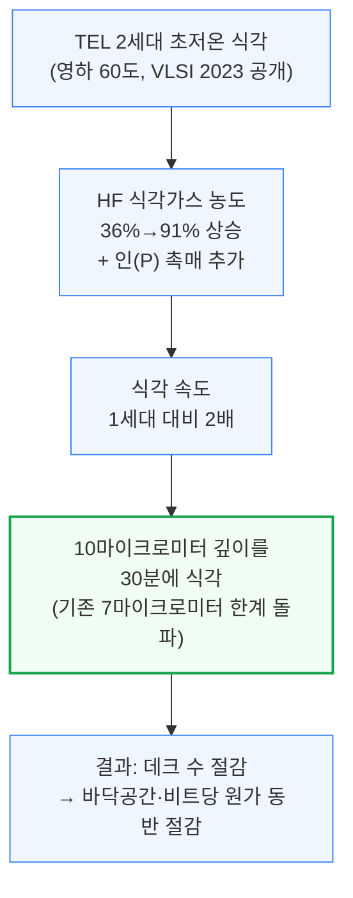

초저온 조건을 유지하려면 액화질소 공급 설비와 단열 처리가 추가로 필요해 장비 가격 자체는 비싸지지만, SemiAnalysis가 접촉한 한 대형 NAND 제조사는 "이득이 비용을 웃돈다"고 밝혔습니다.

램리서치도 수십 년째 초저온 식각을 연구해왔습니다. 릭 갓쇼 CTO는 "1980년대 중반부터 문헌에 있었던 기술이지만 시대를 너무 앞서갔다. 어려운 기술이지만 상당한 진전을 이뤘고, 비용이 더 들어도 이득이 더 크다"고 밝힌 바 있습니다.

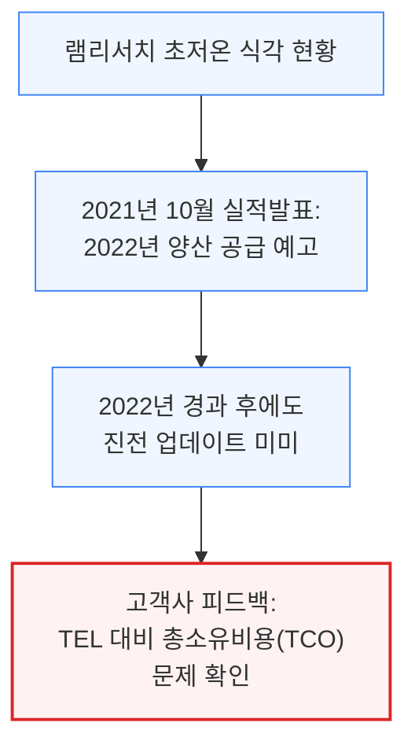

즉 램리서치는 기술적으로 아예 손을 놓은 것은 아니지만, 실제 고객사 상용 공급과 물량 확대 속도에서는 TEL에 뒤처져 있습니다. 참고로 초저온 식각은 NAND뿐 아니라 일부 3D D램 구조를 검토 중인 주요 D램 업체 2곳도 눈여겨보고 있어, NAND를 넘어 영향력이 커질 가능성이 있습니다.

---

## 6. 몰리브덴 증착: 차세대 워드라인 소재 전쟁

**📌 핵심:**
- 식각과 증착은 서로 맞물려 최적화되는 공정이라 램리서치는 식각 지배력을 발판 삼아 다른 증착 장비에서도 경쟁 우위를 확보해왔는데, 다가오는 소재 전환이 이 구도를 흔들 수 있음
- 현재 워드라인은 탄탈럼나이트라이드(TaN) 배리어 위에 텅스텐(W)을 채우는 방식인데, 배선이 가늘어질수록 텅스텐의 저항이 급격히 커지는 문제가 발생
- **몰리브덴(Moly)**은 얇은 두께에서도 텅스텐보다 저항이 낮은 금속으로, 400단 이상 NAND부터 텅스텐을 대체할 유력한 후보로 부상 — AMAT도 진입을 시도하지만 판도를 바꾸긴 어려워 사실상 TEL과 램리서치의 2파전
- 결론: 증착 소재 전환은 식각 깊이 한계 돌파와는 별개의 새로운 전선이며, 두 회사 모두 모든 NAND 고객사에 기술 시연을 진행 중이라 이 승부의 결과에 따라 장비업계 지형이 다시 한번 바뀔 수 있음

---

식각과 증착은 서로 맞물려 최적화되는 공정입니다. 램리서치가 식각에서 쌓은 지배력은 이 공정 최적화 경험 덕분에 다른 증착 장비 영역에서도 경쟁 우위로 이어져 왔습니다. 그런데 다가오는 소재 전환이 이 구도를 흔들 수 있습니다.

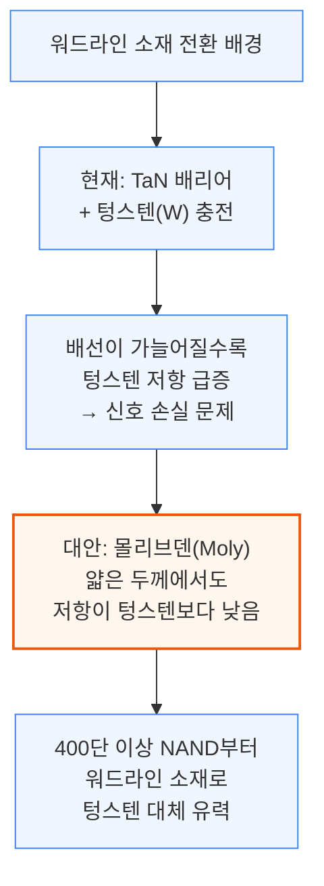

AMAT도 몰리브덴 증착 시장에 진입을 시도하고 있지만, SemiAnalysis는 AMAT이 이 시장의 판도를 바꾸긴 어렵다고 봅니다. 사실상 도쿄일렉트론과 램리서치, 두 회사만의 경쟁으로 좁혀지며 두 회사 모두 모든 NAND 고객사를 대상으로 기술 시연에 속도를 내고 있습니다.

이 소재 전환은 앞서 다룬 식각 깊이 한계 돌파와는 완전히 다른 별개의 전선입니다. 식각에서 TEL이 앞서가고 있는 가운데, 증착에서도 승부가 갈리면 장비업계 지형이 한 번 더 재편될 수 있습니다.

---

## 7. 결론: 10억 달러 규모의 점유율 이동

**📌 핵심:**
- TEL이 실제로 NAND 식각 시장을 얼마나 잠식할지는 아직 미지수지만, 이미 복수의 고객사에 장비를 출하했다는 사실만으로도 램리서치의 가장 크고 중요한 사업 부문에 부담 요인이 됨
- 로직 미세화에서 ASML이 갖는 위치를 NAND 미세화에서는 램리서치가 가져왔는데, 사업 실적이 실제로 흔들리기 전에 이 서사(내러티브) 자체가 먼저 주가에 반영될 수 있음
- TEL은 현재 고종횡비 식각 시장 점유율이 10% 미만이지만, 400단 이상 NAND 양산이 본격화되는 2025년에 초저온 식각과 몰리브덴 증착까지 동시에 따낼 경우 점유율을 최대 6%포인트 끌어올릴 수 있음
- 결론: 2025년 NAND 장비 투자 규모가 180억 달러로 반등한다고 가정하면, 이 점유율 이동은 TEL에 **10억 달러 이상**의 매출을 램리서치로부터 가져오는 결과로 이어질 전망

---

TEL이 채널 식각 시장에 실제로 얼마나 깊이 침투할지는 아직 지켜봐야 하지만, 복수의 고객사에 장비를 이미 출하한 사실 자체가 램리서치의 가장 중요한 사업 부문에 부담 요인입니다.
투자자들은 이 서사를 반영해 램리서치의 밸류에이션 프리미엄을 최소 AMAT 수준 이하로 낮춰 볼 필요가 있습니다.
로직 미세화에서 ASML이 갖는 위치를 NAND 미세화에서는 램리서치가 가져왔는데, 실적이 흔들리기 전에 이 서사 변화부터 먼저 주가에 반영될 가능성이 큽니다.

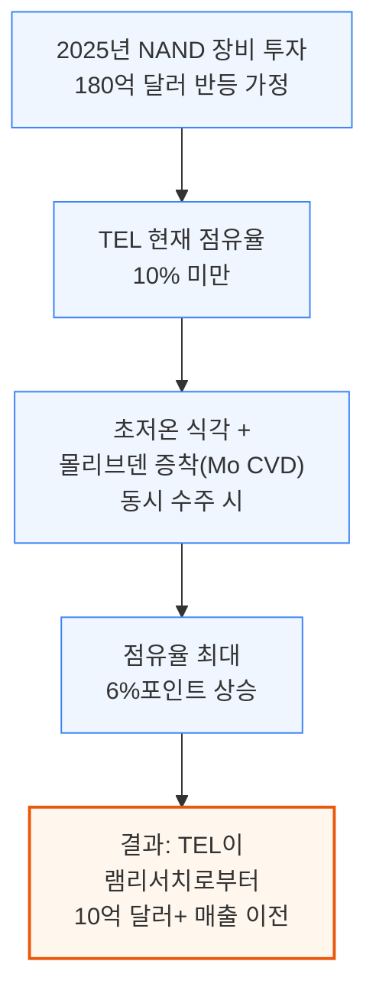

위에서 보듯, 램리서치의 26% 점유율과 TEL의 10% 미만 점유율 사이 격차는 초저온 식각·몰리브덴 증착이라는 두 신기술 전선의 승부에 따라 크게 좁혀질 수 있습니다.

---

## 8. 키옥시아와 웨스턴디지털의 합병

**📌 핵심:**
- 오래 거론되던 웨스턴디지털(WDC)과 키옥시아의 NAND 사업 합병이 임박 — WDC의 NAND 사업을 키옥시아와 합쳐 새 법인으로 만들고 이를 WDC 주주들에게 분사하는 구조로, 유력 인수 후보가 마이크론과 키옥시아 둘뿐이었을 만큼 좁은 매수자 풀이 인수가 아닌 합병으로 귀결된 배경
- WDC는 안정적인 현금창출원인 HDD 사업과 달리 NAND는 중기적으로 현금흐름이 마이너스인 사업으로 보고 분사를 원했지만 제값을 받길 원했고, 마이크론은 과거 제시한 인수가에서 WDC 눈높이에 크게 못 미쳐 결렬됐던 전력이 있음
- 키옥시아는 사모펀드 베인캐피털이 이끄는 컨소시엄 소유로, 이미 자사 지분 인수에 비싼 값을 치른 전력이 있어 추가로 WDC를 통째로 인수하기엔 자금 부담이 컸고, 두 회사가 이미 기술을 공유해 시너지도 제한적이라 합병이 더 합리적인 선택
- 결론: 삼성전자·SK하이닉스·마이크론은 D램에서 나오는 이익으로 NAND 적자를 메우고 있지만, 다른 수익원이 없는 독립 사업자 키옥시아·WDC는 그럴 수 없어 몸집을 키워 버티는 합병을 택했고, 여기에 YMTC의 시장 이탈까지 겹쳐 NAND 업계가 D램처럼 소수 과점 체제로 재편되는 쪽으로 한 발 더 다가감

---

오랫동안 거론되던 웨스턴디지털(WDC)과 키옥시아의 NAND 사업 합병이 임박했습니다. WDC의 NAND 사업을 키옥시아와 합쳐 새 법인을 만들고, 이를 WDC 주주들에게 분사하는 구조입니다.

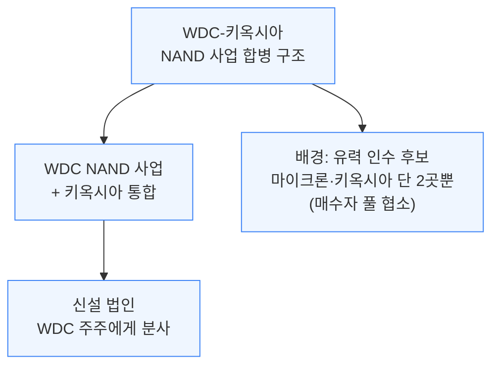

WDC는 안정적인 현금창출원인 HDD 사업과 달리, NAND는 중기적으로 현금흐름이 마이너스인 사업으로 보고 분사를 원해왔습니다.
다만 제값은 받아야 한다는 입장이 매각 협상을 어렵게 만들어, 과거 마이크론과의 협상도 결렬된 전력이 있습니다.

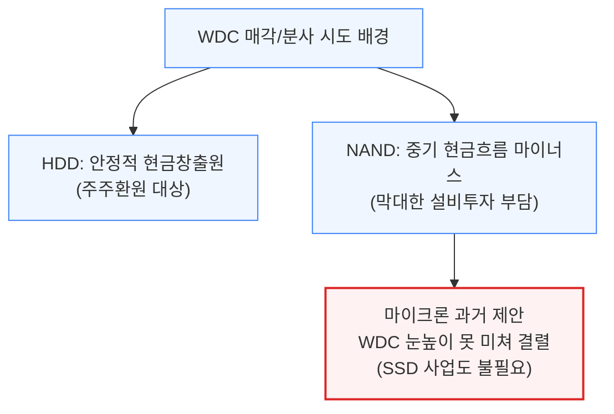

키옥시아는 사모펀드 베인캐피털이 이끄는 컨소시엄 소유입니다.
아래와 같은 이유로 WDC를 통째로 인수하기보다는 합병이 더 합리적인 선택이었습니다.

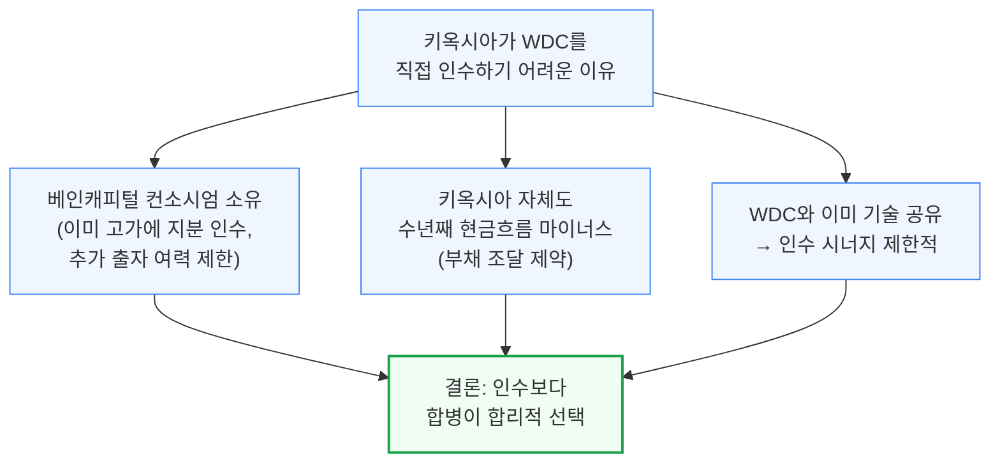

이 합병이 갖는 산업적 의미는 큽니다. 삼성전자·SK하이닉스·마이크론은 D램에서 나오는 막대한 이익으로 NAND 사업의 적자를 메우고 있어 NAND 자체가 독자 생존할 필요가 없는 구조입니다. 반면 다른 수익원이 없는 독립 사업자 키옥시아·WDC는 이런 여유가 없어, 몸집을 키워 버티는 합병을 선택할 수밖에 없었습니다.

여기에 미국의 장비 수출 제재로 YMTC가 시장에서 힘을 잃은 점까지 겹치면서, NAND 시장은 "투자자가 자본비용을 회수하기 어려운 구조"에서 벗어나 D램처럼 소수 대형 업체 중심의 과점 체제로 재편되는 쪽에 한 발 더 다가서고 있습니다.
YMTC는 제재가 없었다면 다운턴에도 투자를 이어가며 독립 사업자들(키옥시아·WDC)을 더 벼랑 끝으로 몰았을 비경제적 공급자였습니다.
이제는 나우라(Naura) 같은 대체 장비 공급사에 의존해야 해 비트 공급 증가 속도가 크게 둔화됐습니다(나우라는 미국 규제를 명백히 위반하며 YMTC에 계속 공급 중인 것으로 파악됨).

---

*작성 진행률: 100% 완료*
*업데이트: 결론(10억 달러 점유율 이동), 키옥시아-웨스턴디지털 합병 섹션까지 전체 8장 작성 완료*
