# EMIB-T Roadmap, Custom HBM, HBM4 Packaging Challenges, Microfluidic Cooling, Photonic Interconnects, and More

> **출처**: [SemiAnalysis Newsletter](https://newsletter.semianalysis.com/p/ectc2026)
> **저자**: Afzal Ahmad, DC, Gerald Wong, Dylan Patel
> **발행일**: 2026-07-02

---

## 📑 목차

### 전체 섹션
 1. [ECTC 2026 총정리 개요](#1-ectc-2026-총정리-개요)
 2. [인텔 EMIB-T 로드맵 - 브릿지 패키징의 다음 세대](#2-인텔-emib-t-로드맵---브릿지-패키징의-다음-세대)
 3. [마벨 커스텀 HBM - 표준을 버리고 얻는 것](#3-마벨-커스텀-hbm---표준을-버리고-얻는-것)
 4. [삼성 HBM 인터포저 - 배선 복잡도와 커패시터 배치](#4-삼성-hbm-인터포저---배선-복잡도와-커패시터-배치)
 5. [삼성 HBM 하이브리드 본딩 열특성](#5-삼성-hbm-하이브리드-본딩-열특성)
 6. [마이크로플루이딕 냉각 - TSMC와 마이크로소프트](#6-마이크로플루이딕-냉각---tsmc와-마이크로소프트)
 7. [마벨 광학 인터커넥트 - OMIB와 포토닉 패브릭](#7-마벨-광학-인터커넥트---omib와-포토닉-패브릭)
 8. [Lightmatter Passage M1000 - 멀티 레티클 포토닉 인터포저](#8-lightmatter-passage-m1000---멀티-레티클-포토닉-인터포저)
 9. [하이브리드 본딩 경쟁 - 저온·미세피치 접근법](#9-하이브리드-본딩-경쟁---저온미세피치-접근법)
10. [인터포저 대안 - 원형 웨이퍼 한계 우회](#10-인터포저-대안---원형-웨이퍼-한계-우회)
11. [열계면 소재(TIM) - 액체금속과 다이아몬드 접합](#11-열계면-소재tim---액체금속과-다이아몬드-접합)
12. [유리 기판 - SeWaRe 균열과의 싸움](#12-유리-기판---seware-균열과의-싸움)
13. [RDL 스케일링 - 서브마이크론 시대로](#13-rdl-스케일링---서브마이크론-시대로)
14. [적층 메모리 - 삼성의 TSV 없는 VCS 구조](#14-적층-메모리---삼성의-tsv-없는-vcs-구조)

---

## 🔑 용어 정리

본문을 순서대로 읽기 전에 알아두면 좋은 용어들입니다. 자세한 수치와 설명은 본문에서 처음 등장하는 위치에 나옵니다.

- **EMIB-T (Embedded Multi-die Interconnect Bridge with TSV)**: 인텔의 실리콘 브릿지 패키징 기술 — 패키지 전체를 덮는 판 대신, 필요한 자리에만 작은 실리콘 조각(브릿지)을 파묻어 옆 칩들을 초고속으로 연결
- **인터포저 (Interposer)**: 여러 칩(다이)을 패키지 안에서 이어주는 중간 배선판 — 브릿지가 필요한 부분에만 있는 국소 부품이라면, 인터포저는 패키지 전체를 덮는 배선판
- **커스텀 HBM (Custom HBM)**: 업계 표준(JEDEC) 규격 대신 메모리와 가속기 사이 연결 방식을 특정 회사에 맞춰 새로 설계한 HBM — 호환성을 포기하는 대신 전력·성능·면적을 더 아낄 수 있음
- **하이브리드 본딩 (Hybrid Bonding)**: 범프(금속 돌기) 없이 구리 면과 면을 직접 맞붙여 칩을 쌓는 차세대 적층 기술 — 더 촘촘하게 연결할 수 있지만 표면이 완벽히 평평하고 깨끗해야 함
- **마이크로플루이딕 냉각 (Microfluidic Cooling, 칩 내장형 물길 냉각)**: 냉각수를 칩 표면(또는 칩 내부에 새긴 미세 통로)에 직접 흘려보내는 냉각 방식 — 기존 냉각판보다 열원에 훨씬 가까이 접근해 더 많은 열을 뽑아냄
- **CPO (Co-Packaged Optics, 광학엔진 동일패키지 통합)와 포토닉 인터포저**: 빛으로 데이터를 주고받는 광통신 부품을 반도체 패키지 안에 함께 넣는 기술 — 전기 신호보다 멀리, 적은 전력으로 데이터 전송
- **RDL (Redistribution Layer, 재배선층)**: 칩의 원래 배선 위치를 패키지의 다른 위치로 옮겨주는 얇은 배선층 — 여러 칩을 하나의 패키지에 모을 때 배선을 다시 그려주는 역할
- **TIM (Thermal Interface Material, 열계면 소재)**: 칩과 방열판 사이의 미세한 틈을 메워 열이 잘 전달되게 하는 물질 — 틈에 남는 공기(단열재 역할)를 없애는 것이 목적

---

## 1. ECTC 2026 총정리 개요

**📌 핵심:**
- 트랜지스터 미세화 속도가 둔화되며 반도체 성능을 끌어올리는 주된 방법이 **첨단 패키징**으로 넘어갔는데, 이제는 AI 가속기가 너무 커지고 연결 속도 요구도 높아져 **패키지 자체가 한계**에 부딪히기 시작
- 원형 실리콘 인터포저는 패키지 크기·웨이퍼 활용률을 제약하고, HBM4E는 입출력 핀 수를 2배로 늘리며 속도까지 높이고, 수 킬로와트급 패키지는 기존 냉각 방식을 압도
- ECTC(반도체 패키징 최대 학회) 2026은 실제 상용 제품과 맞닿은 발표가 유독 많았음: 인텔은 EMIB-T 구조·로드맵을, 마벨은 커스텀 HBM으로 인터페이스 로직을 가속기 밖으로 빼내는 방법을, TSMC·마이크로소프트는 냉각수를 실리콘에 직접 주입하는 기술을, 마벨·Lightmatter는 광학 인터커넥트를 패키지에 통합하는 방법을 각각 공개
- 결론: 이 문서는 향후 수년간 AI 가속기 패키지를 좌우할 ECTC 2026의 핵심 기술 14개 주제를 정리함

---

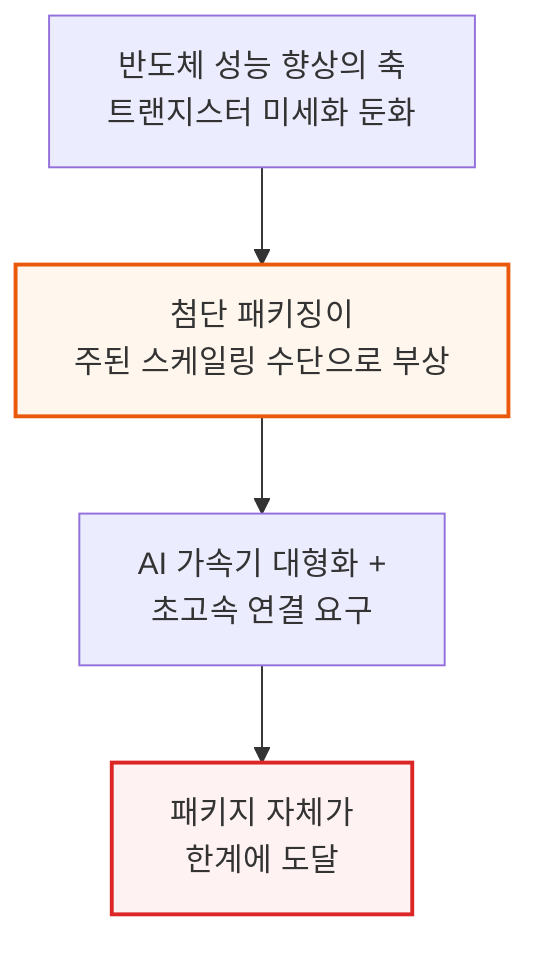

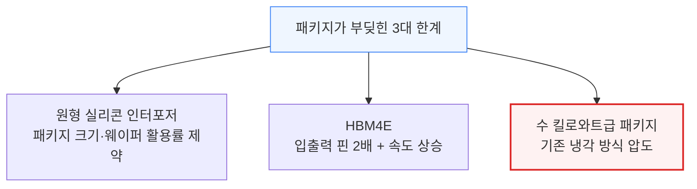

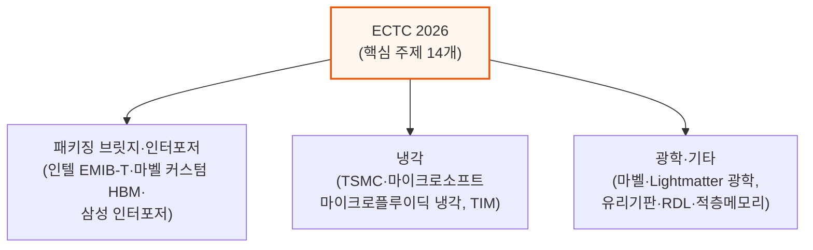

이번 ECTC는 인텔이 최다 발표(12건)를 낸 학회였고, 삼성이 11건으로 뒤를 이었습니다. 반면 TSMC는 단 3건에 그쳤는데, 이는 발표량이 적다기보다 상용화 임박 기술 위주로 선별 공개했기 때문으로 보입니다.

---

## 2. 인텔 EMIB-T 로드맵 - 브릿지 패키징의 다음 세대

**📌 핵심:**
- 인텔은 ECTC 최다 발표 기업(12건)이었고 핵심은 **EMIB-T** — TSV(관통전극)를 더한 차세대 EMIB로, 구글 TPU v9에 쓰일 것으로 예상되며 대형 AI 가속기 패키지에서 TSMC CoWoS의 가장 유력한 대안으로 꼽힘
- 범프(연결 돌기) 간격을 기존 45µm에서 **36/35µm로 축소**(범프 밀도 +65%)했고, 240×240mm(약 67레티클) 대형 패키지 시험차량까지 검증했으나 부스 샘플에서 **심각한 휨(warpage)**이 관찰됨
- 브릿지에 TSV를 추가해 전력을 브릿지로 직접 전달하는 방식으로 **DC 전압강하를 68\~80% 감소**시켰고, MIM 커패시터로 전력분배망(PDN) AC 임피던스를 **82% 이상 개선**
- 결론: EMIB-T는 12Gb/s 이상 HBM4E 신호 품질(등화기 적용 시 아이 폭 약 72.5%)까지 확보하며 격차를 좁히고 있지만, TSMC는 이미 커패시터 내장·전압조정기 통합·액티브 LSI를 양산 중이라 인텔은 여전히 추격 중

---

### 범프 피치 축소와 대형 패키지 검증

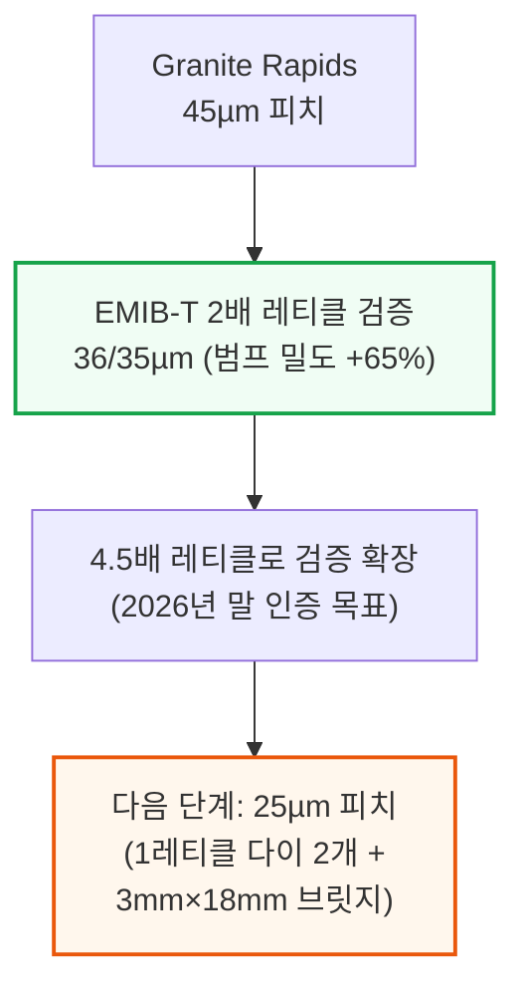

Granite Rapids-AP는 70mm×105mm(약 9레티클)의 대형 패키지였는데, EMIB-T는 이보다 훨씬 촘촘한 피치를 검증하고 있습니다. 다만 피치를 더 줄이면 새로운 문제가 생깁니다.

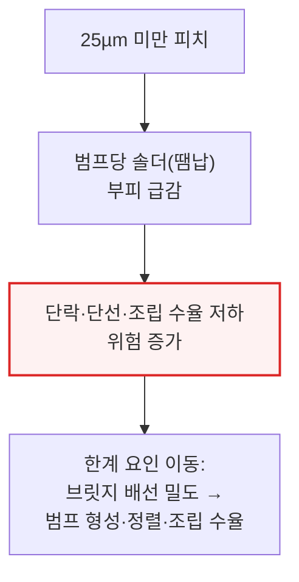

### 대형 패키지의 벽 - 쿼터패널과 휨(Warpage)

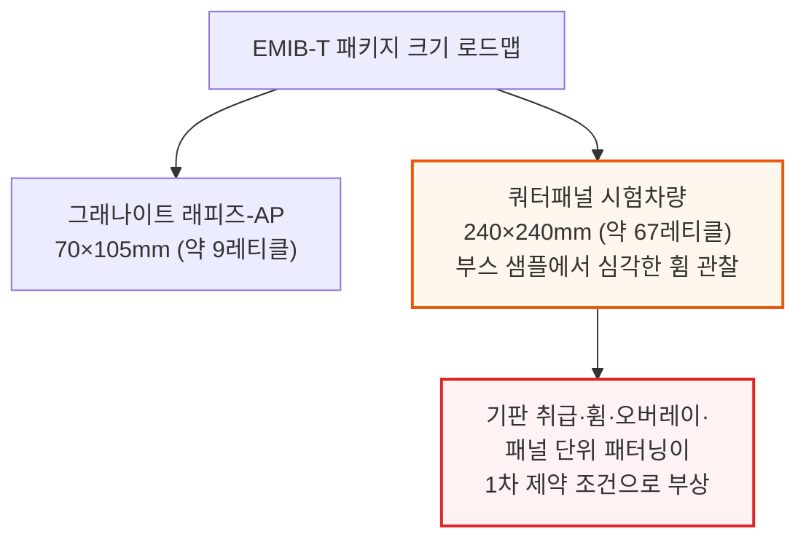

인텔은 전체 패널 크기까지도 가능하다고 밝혔지만, 실제로는 쿼터패널을 현실적 목표로 제시했습니다. 이 정도 크기에서는 첨단 리소그래피 기법으로 오버레이(패턴 정렬 정밀도)를 유지하는 방안도 함께 검토 중입니다.

### 브릿지 내부 구조 - TSV로 전력을 직접 전달

EMIB-T는 단순한 수동 배선 브릿지가 아닙니다. TSV, 추가 금속층, 전력망(Power Mesh), MIM 커패시터층까지 더해 브릿지 하나가 고밀도 신호와 수직 전력 전달을 동시에 감당합니다. 인텔이 공개한 단면에는 10개 금속층(그중 4개가 배선 전용층)과 M1\~M2 사이 MIM 커패시터가 포함돼 있습니다.

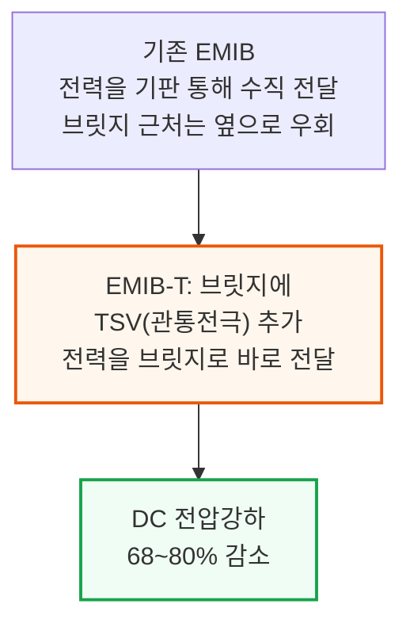

### HBM4E가 어려운 이유 - 신호와 전력의 동시 확장

HBM4E는 인터커넥트가 신호밀도와 전력전달을 동시에 확장해야 하는 난제를 안고 있습니다. HBM4는 HBM3 대비 핀 수가 2배로 늘고, PHY에는 VDDQ·VDDQL 같은 전력레일이 추가로 필요한데, 이 레일들이 배선 면적을 잠식해 남은 공간의 신호밀도를 더 끌어올립니다.

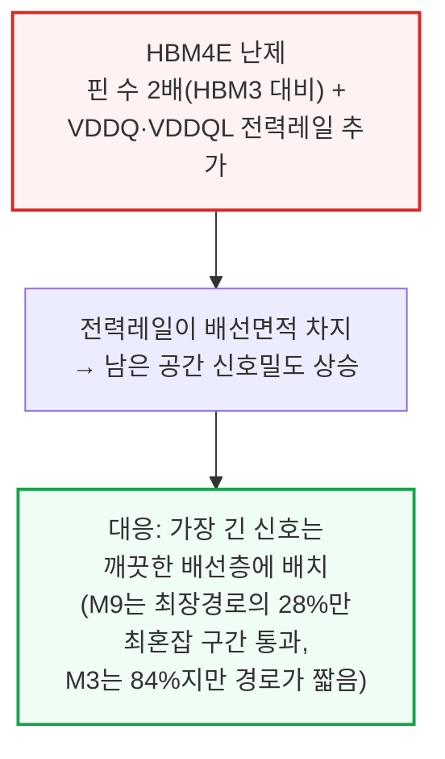

### MIM 커패시터와 신호 품질 - 실측 결과

전력전달은 브릿지 안으로도 이동하고 있습니다. EMIB-M이 도입한 M1\~M2 사이 MIM 커패시터를 EMIB-T가 계승해, 커패시턴스 밀도 500 fF/µm²(인텔 18A급과 비슷한 수준)를 달성했습니다.

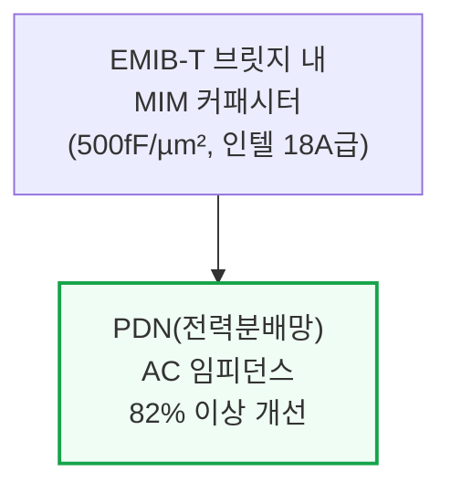

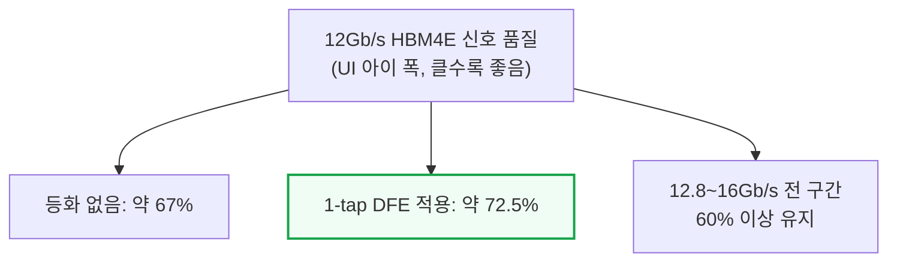

**📌 용어 풀이: DFE(결정귀환등화기)와 UI 아이 폭**
> - **DFE (Decision Feedback Equalizer)**: 신호가 패키지 배선을 지나며 이전 비트의 잔상이 다음 비트를 방해하는 간섭을 수신단에서 계산해 제거하는 회로
> - **UI 아이 폭 (Unit Interval Eye Width)**: 한 비트를 정확히 읽을 수 있는 시간 여유의 비율 — 클수록 신호를 오판독할 위험이 적음

### 향후 로드맵과 TSMC 대비 격차

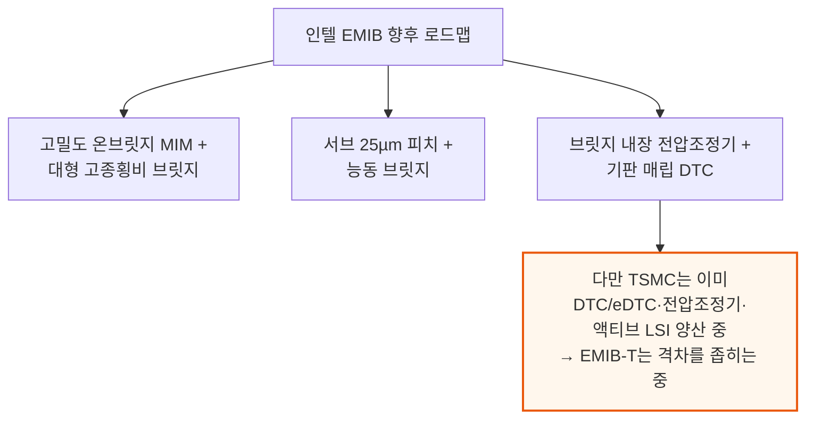

인텔은 기판 코어에 매립하는 딥트렌치 커패시터(DTC)와 베이스 다이 아래 매립하는 2.5 µF/mm² 이상의 eMIM-T 커패시터 개념도 공개했지만, 아직 실제 출하 제품에는 적용되지 않았습니다.

---

## 3. 마벨 커스텀 HBM - 표준을 버리고 얻는 것

**📌 핵심:**
- 표준 HBM은 JEDEC 규격에 따라 메모리와 가속기 사이 인터페이스가 고정돼 어떤 메모리사 제품과도 호환되지만, 패키지가 커지고 HBM 속도가 오를수록 전력·성능·면적 최적화가 어려워짐
- 마벨 커스텀 HBM은 D램 코어는 그대로 두고 **베이스 다이만 첨단 로직 공정으로 재설계** — HBM 컨트롤러·관리기능·커스텀 로직·확장 인터페이스까지 베이스 다이로 옮겨, 가속기 칩에서 HBM 관련 회로가 차지하는 면적을 **약 60% 절감**
- 예시 설계는 1024채널×32Gb/s로 **4.1TB/s**를 구현(2048비트 JEDEC HBM4(E) 16Gb/s와 동급 대역폭)하면서도, 인터포저 배선 길이를 6.5mm에서 **1.5mm로 단축**해 배선층 9개·2/2µm 배선폭을 그대로 유지
- 결론: 엔비디아 Feynman도 커스텀 HBM을 채택할 예정(현재 루빈 GPU 다이 면적의 약 16%가 HBM 관련 회로)이며, 확장 인터페이스로 LPDDR 등 추가 메모리를 붙일 수 있어 AMD MI450·MI500의 LPDDR 지원 전략과도 맞닿아 있음

---

### JEDEC 표준의 트레이드오프

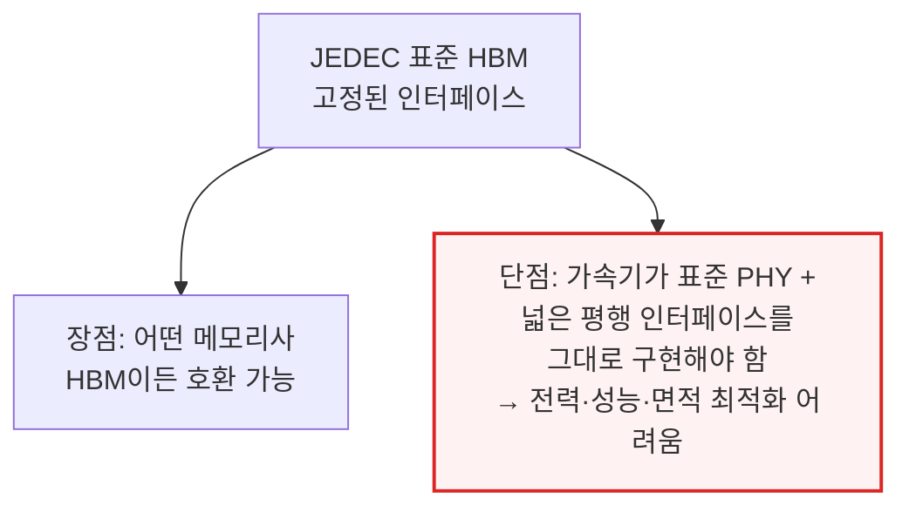

마벨은 2024년 Industry Analyst Day에서 커스텀 HBM을 처음 언급했고, Hot Chips 2025에서 베이스 다이 플로어플랜을, 이번 ECTC에서야 패키지 레벨 세부 설계를 공개했습니다.

### 커스텀 HBM 구조 - 베이스 다이로의 이전

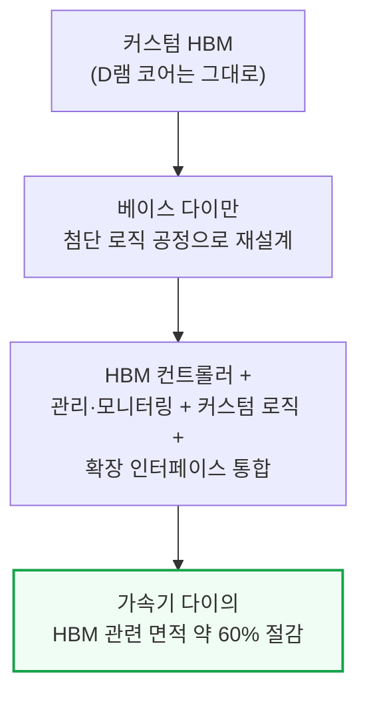

### 성능·배선 개선 실측치

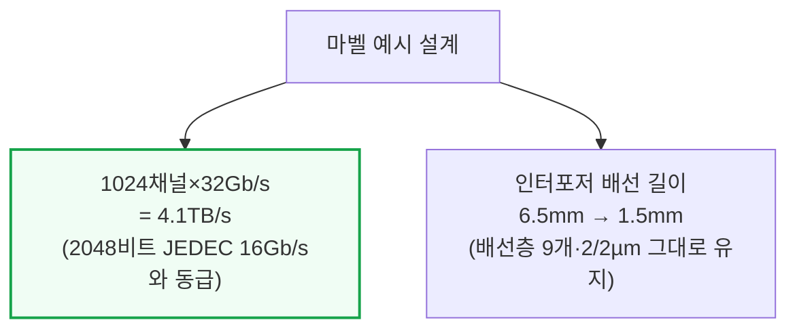

이 예시는 실리콘 대신 유기물 재배선층(RDL) 인터포저를 사용해 패키징 비용을 낮췄습니다. 유기 RDL은 CoWoS-S 실리콘 인터포저나 CoWoS-L·EMIB-T의 실리콘 브릿지보다 배선폭이 훨씬 굵어 레이아웃이 까다로운데, 마벨은 구간별 맞춤 차폐·배선 패턴으로 대역폭 밀도를 높이면서 신호 간섭을 제어했습니다.

### 확장 인터페이스와 업계 파급 효과

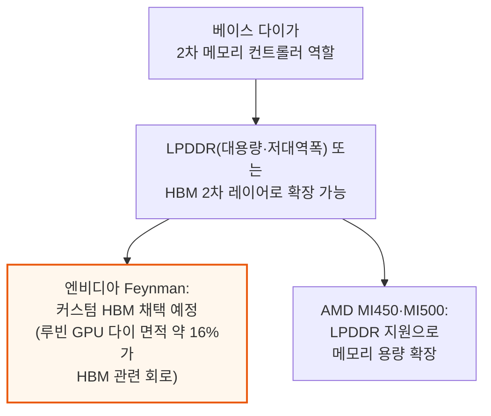

이런 확장 인터페이스는 모든 메모리 트래픽을 제한된 다이 가장자리로만 몰아넣지 않고, 베이스 다이가 2차 메모리 컨트롤러 역할을 하며 외부 I/O에 쓸 다이 가장자리 공간을 아끼면서도 용량을 늘릴 길을 열어줍니다.

---

## 4. 삼성 HBM 인터포저 - 배선 복잡도와 커패시터 배치

**📌 핵심:**
- HBM4E는 데이터 속도를 12Gb/s 이상으로 높이고 입출력 핀 수도 2배로 늘려 인터포저 배선 복잡도가 급증 — HBM3E 대비 인터포저 층수가 **2배**, HBM2 대비로는 **5배**까지 필요할 수 있고, 전력 소비도 HBM3E 대비 **86%**, HBM2 대비 **5.6배** 늘어날 전망
- 삼성은 **8층 실리콘 인터포저**를 제안해 예상 필요 층수보다 **20% 줄였음** — 신호 2개·접지 1개를 반복 배치해 고속 신호를 차폐하는 구조로, 전체 층의 75%를 신호 배선에 할당
- 인터포저의 핵심 요소인 **초고밀도 커패시터(UHC)**는 신호 배선도 몰려있는 M1층에만 배치 가능해 공간이 부족 — 배선이 한쪽으로 쏠리면 커패시터도 한쪽에 몰려 전력분배망(PDN)이 좌우 불균형해짐
- 결론: 삼성은 M1과 다른 층에 배선을 재분배해 UHC를 인터페이스 전체에 고르게 배치, PDN 임피던스와 전압 노이즈를 줄이면서 배선 밀도도 관리 가능한 수준으로 유지

---

### HBM 세대별 인터포저 부담 증가

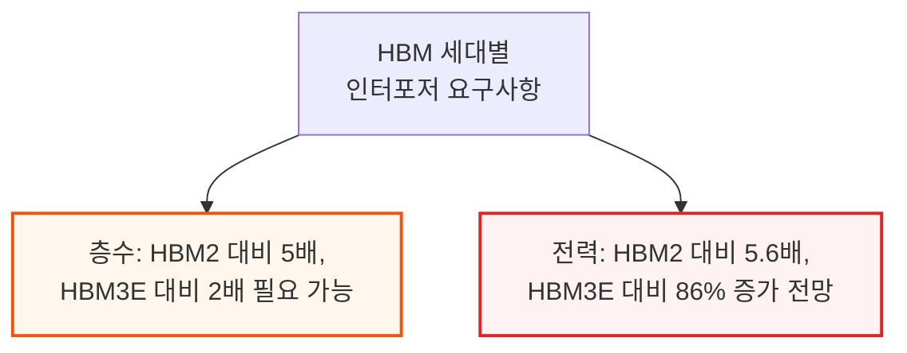

### 삼성의 대응 - 8층 인터포저와 신호 차폐

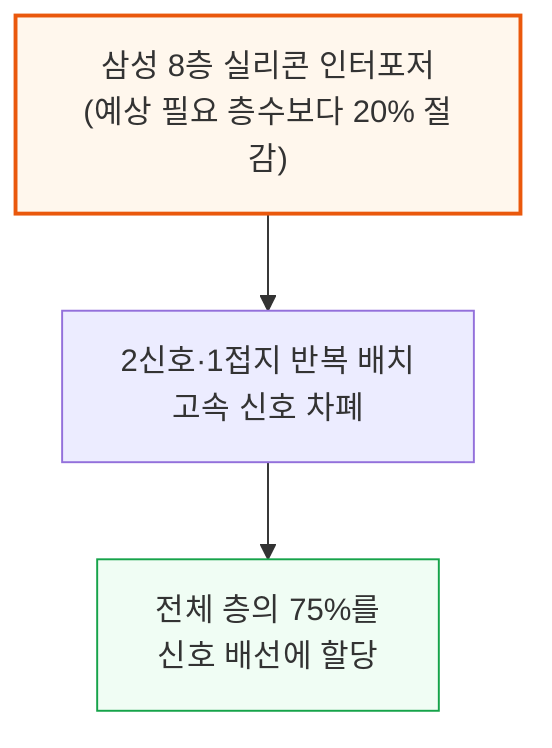

### 초고밀도 커패시터(UHC) 배치 문제

인터포저의 또 다른 핵심은 초고밀도 커패시터(UHC)입니다. 삼성은 정확한 구조를 밝히지 않았지만, 인텔 EMIB-T의 MIM 커패시터나 TSMC CoWoS의 DTC와 비슷한 개념으로 추정됩니다. 문제는 UHC를 배치할 수 있는 곳이 신호 배선도 몰려있는 M1층뿐이라는 점입니다.

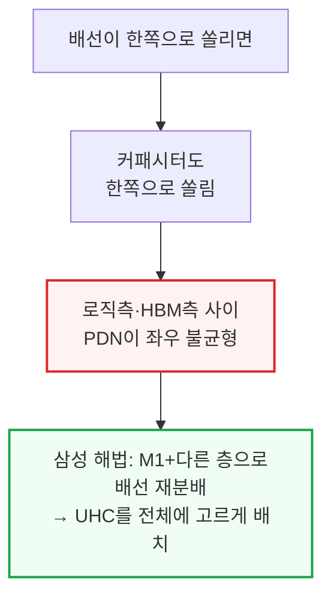

이 재배치로 PDN 임피던스와 전압 노이즈를 줄이면서도 배선 밀도는 관리 가능한 수준으로 유지할 수 있었습니다.

---

## 5. 삼성 HBM 하이브리드 본딩 열특성

**📌 핵심:**
- HBM 스택이 더 빠르고 높아지고 그 밑의 로직 다이도 더 많은 전력을 쓰면서, 16단(16-hi) HBM까지는 열저항이 괜찮지만 앞으로 **20단·24단** 스택에는 새로운 냉각 접근이 필요
- 삼성은 열압착본딩(TCB)과 하이브리드 구리본딩(HCB)을 비교(엔비디아 Blackwell과 유사한 GPU 다이 2개+HBM 8스택 구성) — HCB로 HBM 내부 열저항이 **공랭 12.2%·수랭 12.9%** 감소했지만, 시스템 전체 열저항 개선폭은 **공랭 3.5%·수랭 7.7%**로 더 작음
- 이유는 HCB가 열전달 경로의 일부만 개선하기 때문 — 내부저항·GPU-HBM 간섭은 각각 약 12.5%·9.8% 줄었지만, 열계면소재(TIM)·냉각까지 포함한 시스템 레벨 저항은 오히려 약 2.3% 늘어남
- 결론: HCB로 전환하면 동일 전력에서 흡기 온도를 1\~2°C 더 높이거나, 동일 온도에서 패키지 전력을 약 4% 더 올릴 수 있고 냉각 전력은 약 7% 절감 — 스택 레벨만 따로 보면 HCB의 열저항 개선폭은 기본 약 19%, 접합점 밀도를 2배·4배로 늘리면 각각 22.3%·29.1%까지 확대

---

### HBM 적층이 높아질수록 커지는 열 문제

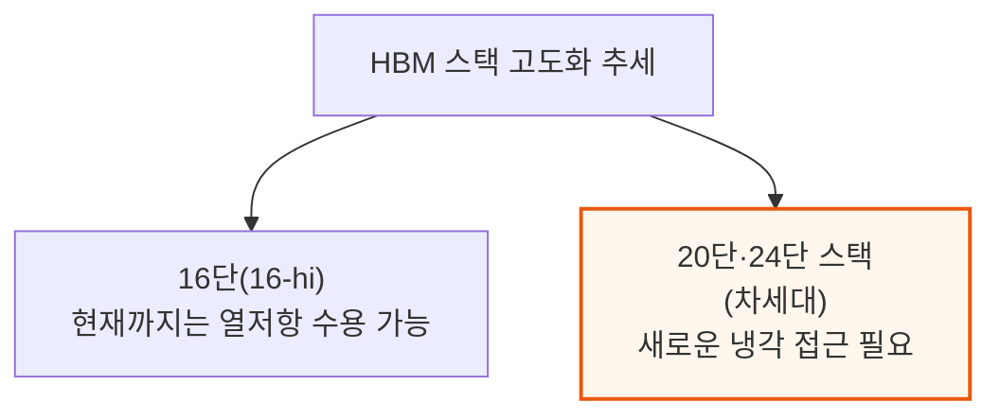

### TCB vs HCB - 실측 개선폭

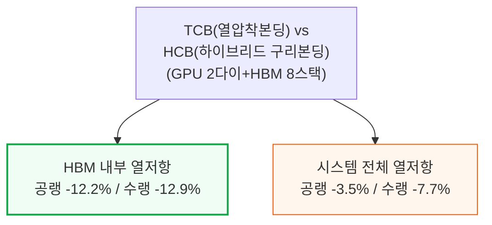

### 개선이 고르지 않은 이유 - 열전달 경로 3분해

```mermaid
flowchart TD
    Path["열전달 경로 3분해"] --> P1["내부저항: 약 -12.5%"]
    Path --> P2["GPU-HBM 간섭: 약 -9.8%"]
    Path --> P3["시스템 레벨(TIM+냉각):<br/>오히려 약 +2.3%"]

    style P1 fill:#f0fdf4,stroke:#16a34a
    style P2 fill:#f0fdf4,stroke:#16a34a
    style P3 fill:#fef2f2,stroke:#dc2626,stroke-width:2px
```

메모리 위주 워크로드처럼 베이스 다이로 전력이 더 이동할수록 병목 지점도 이동합니다. 이는 메모리 컨트롤러와 로직이 베이스 다이로 옮겨가는 커스텀 HBM(3장)에 특히 중요한데, GPU-HBM 간 간섭이 전체 열저항에서 차지하는 비중이 베이스 다이 전력 1배 기준 13%에서 3배 기준 5%로 줄어듭니다.

### HCB 전환 효과와 스택 레벨 개선폭

```mermaid
flowchart TD
    HCBSwitch["HCB 전환 시 효과<br/>(삼성 추정)"] --> Temp["흡기온도 +1~2°C<br/>(동일 패키지 전력 기준)"]
    HCBSwitch --> PkgPower["또는 패키지 전력<br/>약 +4% (동일 온도 기준)"]
    HCBSwitch --> CoolPower["냉각 전력<br/>약 -7%"]

    style HCBSwitch fill:#fff7ed,stroke:#ea580c,stroke-width:2px
    style CoolPower fill:#f0fdf4,stroke:#16a34a
```

```mermaid
flowchart TD
    Stack["스택 레벨 HCB 개선폭<br/>(TCB 대비)"] --> Base["기본 접합점 밀도: 약 -19%"]
    Stack --> D2["접합점 밀도 2배: -22.3%"]
    Stack --> D4["접합점 밀도 4배: -29.1%"]

    style Base fill:#f0fdf4,stroke:#16a34a
    style D4 fill:#f0fdf4,stroke:#16a34a,stroke-width:2px
```

---

## 6. 마이크로플루이딕 냉각 - TSMC와 마이크로소프트

**📌 핵심:**
- TSMC는 CoWoS-R(유기 인터포저, 휨 내성과 공정 호환성 우수) 기반 GPU 시험차량에 **실리콘 표면에 미세기둥(마이크로필러)을 직접 형성**해 냉각수를 칩 배면 바로 옆까지 접근시키는 방식을 시연 — 기존 뚜껑형 냉각판(1.9\~2.3kW)·무뚜껑 냉각판(2.5\~3.0kW)이 4LPM 이상에서 포화되는 반면, 마이크로필러는 8LPM에서 **5.3kW**까지 늘어나며 시험차량 전체 균일 방열 5kW 이상을 달성
- 마이크로소프트는 실제 엔비디아 GH200 GPU 실리콘에 **직선형 미세채널을 식각**해 접합부-흡기 열저항을 **51\~60% 감소**시켰고(HBM은 27\~37%, 여전히 냉각판+TIM 경유), 패키지 전체로는 **50% 열저항 감소**
- 마이크로소프트는 6개월간 약 4,370회 관측 중 잠재적 막힘 사례 단 9건, 6개월 후에도 실리콘 부식 없음이라는 신뢰성 데이터도 공개 — GH200 노드는 3주 반복 벤치마크 + 1주 연속 가동을 안정적 전력으로 완주
- 결론: 두 접근 모두 냉각수를 열원에 물리적으로 훨씬 가깝게 붙여 kW급 열을 처리하지만, 새 실링(밀봉) 소재·조립 공정이 필요해 아직 상용화 초기 단계 — TSMC는 이 기술 하나를 포함해 ECTC 발표가 3건에 그쳐 인텔(12건)·삼성(11건)보다 훨씬 적었음

---

### TSMC 마이크로필러 - 냉각 방식 3종 비교

```mermaid
flowchart TD
    Types["TSMC 냉각 방식 3종<br/>(CoWoS-R, 4 SoC + 8 HBM)"] --> Lid["뚜껑형 냉각판<br/>1.9~2.3kW (1~2LPM, 40℃수)"]
    Types --> NoLid["무뚜껑 냉각판<br/>2.5~3.0kW"]
    Types --> Pillar["마이크로필러<br/>(실리콘 배면 직접 형성)"]

    style Pillar fill:#fff7ed,stroke:#ea580c,stroke-width:2px
```

```mermaid
flowchart TD
    Flow["유량에 따른 방열량"] --> F2["2LPM: 무뚜껑 냉각판과 동률"]
    Flow --> F4["4LPM: 마이크로필러 4kW<br/>(뚜껑·무뚜껑은 여기서 포화<br/>— TIM이 병목)"]
    Flow --> F8["8LPM: 마이크로필러 5.3kW<br/>(전체 균일 방열 5kW 이상)"]

    style F8 fill:#f0fdf4,stroke:#16a34a,stroke-width:2px
```

마이크로필러는 CoW(칩온웨이퍼) 공정 이후 CoWoS-R 구조를 손상시키지 않고 형성해야 했고, 휨과 열팽창 불일치 속에서도 냉각수를 가두는 새 실링 소재가 필요했습니다. 시험차량은 MSL4(방습 등급) 테스트를 헬륨 누출·실링 박리 없이 통과했습니다.

### 마이크로소프트 - 실제 GH200 GPU에 미세채널 식각

TSMC가 미세기둥을 썼다면, 마이크로소프트는 GPU 실리콘에 직선형 미세채널을 직접 식각하는 방식을 택했습니다. 시험용 열더미가 아니라 실제 엔비디아 GH200 GPU로 HPCG·HPL 등 다양한 워크로드를 테스트해 실제 열분포·핫스팟을 더 정확히 포착할 수 있었습니다.

```mermaid
flowchart TD
    MS["마이크로소프트<br/>GH200 미세채널 냉각<br/>(1LPM 유량)"] --> GPU["GPU 접합부-흡기 열저항<br/>51~60% 감소"]
    MS --> HBM2["HBM 열저항<br/>27~37% 감소<br/>(여전히 냉각판+TIM 경유)"]
    GPU --> Total2["패키지 전체<br/>열저항 50% 감소"]

    style Total2 fill:#f0fdf4,stroke:#16a34a,stroke-width:2px
```

### 6개월 신뢰성 데이터

```mermaid
flowchart TD
    Reliability["6개월 신뢰성 관측<br/>(약 4,370회 관측)"] --> Clog["잠재적 막힘 사례<br/>단 9건 (초기 이후 감소 추세)"]
    Reliability --> Erosion["6개월 후에도<br/>실리콘 부식 없음"]
    Reliability --> Node["GH200 노드: 3주 반복 벤치마크<br/>+ 1주 연속 가동 완주<br/>(클러스터 레벨 MTBF는 검증 중)"]

    style Clog fill:#f0fdf4,stroke:#16a34a
    style Erosion fill:#f0fdf4,stroke:#16a34a
```

---

## 7. 마벨 광학 인터커넥트 - OMIB와 포토닉 패브릭

**📌 핵심:**
- 광학 인터커넥트·CPO는 이번 ECTC의 주요 화두 — 마벨은 올해 초 인수한 Celestial AI 기술을 바탕으로 **OMIB(광학 멀티칩 인터커넥트 브릿지)**와 **포토닉 패브릭**을 공개
- OMIB는 포토닉 집적회로(PIC)를 유기 RDL 인터포저 안에 필요한 곳에만 국소적으로 심고, 광학이 필요 없는 구간은 전기 브릿지로 대체 — XPU 다이 1개+EIC 6개, PIC 6개+전기브릿지 6개+DTC 12개를 매립한 시험차량에서 대역폭 밀도 **1.8Tbps/mm²**를 달성
- 단기적으로는 TSMC COUPE 같은 수직 적층형 광학엔진이 OMIB나 완전 포토닉 인터포저보다 현실적 — 마벨은 5nm EIC(TSMC N5 추정)로 56Gb/s×4쌍=224Gb/s 광엔진을 시연, MRM(마이크로링 변조기) 대신 **EAM(전기흡수 변조기)**을 채택(열안정성·파장범위 우위, 다만 SemiAnalysis는 대량생산 난이도를 우려)
- 결론: PIC(광집적회로)는 온도 변화에 민감 — 완전 부하 시 온도 상승이 기판 위에서는 5°C 미만인 반면 인터포저 위에서는 약 25°C, 브릿지에서는 약 20°C로 훨씬 큼(유기 기판의 낮은 열전도율과 mm급 공극이 오히려 PIC를 보호), 30ms 이내 발생하는 급격한 온도 변화에는 EAM의 전기적 바이어스 조정이 더 빠르게 대응

---

### OMIB - 필요한 곳에만 광학, 나머지는 전기

```mermaid
flowchart TD
    OMIB["OMIB<br/>(광학 멀티칩 인터커넥트 브릿지)"] --> Local["PIC를 유기 RDL 인터포저에<br/>필요한 구간에만 국소 매립"]
    Local --> Elec["광학이 불필요한 구간은<br/>전기 브릿지로 대체"]
    Elec --> Density["시험차량(XPU 1+EIC 6+<br/>PIC 6+전기브릿지 6+DTC 12)<br/>대역폭 밀도 1.8Tbps/mm²"]

    style Density fill:#f0fdf4,stroke:#16a34a,stroke-width:2px
```

PIC가 RDL에 매립되면 그레이팅 커플러(광 입출력 지점)가 몰딩(封止) 후 가려지는 문제가 있는데, 마벨은 몰딩 전에 그레이팅 영역 위에 실리콘/유리 광학 블록을 올려 광섬유 배열(FAU)까지 광경로를 유지했습니다. 조립 순서는 CoWoS-L과 비슷한 칩-라스트 방식으로, RDL 인터포저를 먼저 만들고 ASIC 다이·EIC를 마지막에 붙입니다.

### 단기 현실 - 수직 적층형 광학엔진

```mermaid
flowchart TD
    NearTerm["단기 현실적 방식"] --> Stack["TSMC COUPE류<br/>수직 적층형 광학엔진<br/>(OMIB·완전 포토닉 인터포저보다 실현 용이)"]
    Stack --> Marvell2["마벨: EIC+PIC를<br/>50µm 피치 마이크로범프로 연결<br/>후 기판/인터포저에 실장"]
    Marvell2 --> Choice["기판(UCIe-S류, 130µm C4)<br/>vs 인터포저(UCIe-A, 40~45µm)<br/>— 마벨은 기판 선호(단순성+열격리)"]

    style Choice fill:#fff7ed,stroke:#ea580c,stroke-width:2px
```

마벨은 5nm(TSMC N5 추정) EIC로 56Gb/s TX-RX 4쌍, 방향당 224Gb/s 광엔진을 테스트했습니다. 다른 업체가 선호하는 MRM(마이크로링 변조기) 대신 EAM(전기흡수 변조기)을 채택했는데, 열안정성과 넓은 동작 파장범위가 장점이지만 SemiAnalysis는 대량생산 난이도를 우려합니다.

### PIC 온도 특성 - 기판이 오히려 더 안전한 이유

```mermaid
flowchart TD
    Thermal["전부하 시<br/>PIC 온도 상승폭"] --> Sub["기판 실장: 5°C 미만"]
    Thermal --> Bridge["실리콘 브릿지: 약 20°C"]
    Thermal --> Interp["실리콘 인터포저: 약 25°C"]

    style Sub fill:#f0fdf4,stroke:#16a34a,stroke-width:2px
    style Interp fill:#fef2f2,stroke:#dc2626,stroke-width:2px
```

유기 기판은 열전도율이 낮고 공극이 mm 단위로 넓어 PIC를 열로부터 오히려 격리시키는 반면, UCIe-A 두 구성(인터포저·브릿지)은 XPU에 가까운 미세피치 실리콘이 저항 낮은 열전달 경로가 되고 공극도 약 100µm로 훨씬 좁아 PIC가 더 뜨거워집니다.

```mermaid
flowchart TD
    Transient["XPU 전력상태 변화 후<br/>약 30ms 내 온도 변화 속도"] --> Sub2["기판: 초당 약 10°C"]
    Transient --> Bridge2["브릿지: 초당 약 100°C"]
    Transient --> Interp2["인터포저: 초당 약 120°C"]
    Interp2 --> Resp["EAM은 전기적 바이어스로<br/>이 속도를 따라잡을 수 있음<br/>(링 변조기는 히터+피드백 루프라 더 느림)"]

    style Resp fill:#f0fdf4,stroke:#16a34a,stroke-width:2px
```

---

## 8. Lightmatter Passage M1000 - 멀티 레티클 포토닉 인터포저

**📌 핵심:**
- Lightmatter는 이번 ECTC에서 M1000의 조립 공정·광섬유 부착·패키징 결과를 훨씬 상세히 공개 — 시험차량은 칩온웨이퍼 방식으로 ASIC 칩렛 15개를 4타일 M1000 인터포저(약 2,100mm², Hot Chips 2025에서 공개한 8타일 4,000mm² 구성의 약 절반)에 붙임
- 타일 하나마다 127µm 피치 광도파로 32개가 있고, 전기신호·전력은 기판에서 176µm 피치 C4 범프 → 배면 RDL 2개층 → 126µm 깊이·10µm 폭 TSV를 거쳐 ASIC 칩렛에 도달 — 이 2,100mm² 인터포저는 7,200mm² 유기기판의 3분의 1 미만만 차지(로직 면적 대 패키지 크기 비율에 더 가까움)
- 이 정도 크기의 실리콘 인터포저를 유기 기판에 붙이면 심각한 휨이 생김 — 260°C 리플로우 온도에서 약 59µm, 실온 냉각 후에도 약 56µm 휨이 남아 조인트 형성을 위협했지만, Lightmatter는 자석 고정구로 기판을 평평하게 유지해 전기 조립 수율 **95% 이상**을 달성
- 결론: 열더미(4구역, 구역당 170W, 전체 면적 369mm²에 전력밀도 1.47W/mm²) 테스트에서 25°C 냉각수 1.8LPM/kW로 인터포저 온도를 약 100°C까지만 유지 — 이는 900W 이상·3레티클에 육박하는 실제 패키지에서 680W를 처리할 수 있음을 검증한 결과

---

### M1000 시험차량 구성

```mermaid
flowchart TD
    M1000["Lightmatter M1000<br/>4타일 인터포저(약 2,100mm²)"] --> Chiplet["ASIC 칩렛 15개<br/>칩온웨이퍼 방식으로 실장"]
    M1000 --> Wave["타일당 광도파로 32개<br/>(127µm 피치)"]
    M1000 --> Electric["전기신호·전력 경로:<br/>C4범프(176µm) → 배면RDL 2층<br/>→ TSV(126µm 깊이·10µm 폭)"]

    style M1000 fill:#fff7ed,stroke:#ea580c,stroke-width:2px
```

2,100mm² 인터포저는 7,200mm² 유기기판의 3분의 1 미만만 차지하는데, 이는 패키지 전체를 덮는 기존 실리콘·유기 RDL 인터포저보다 로직 면적 대 패키지 크기 비율에 더 가까운 형태입니다. 이것이 광학 아키텍처 자체의 특성인지, 이번 시험차량만의 설계 선택인지는 아직 불분명합니다.

### 대형 인터포저의 휨 문제와 해법

```mermaid
flowchart TD
    Warp["실리콘 인터포저를<br/>유기기판에 부착 시 휨"] --> Reflow["260°C 리플로우: 약 59µm"]
    Warp --> Cool["실온 냉각 후: 약 56µm"]
    Cool --> Risk2["118µm 두께 인터포저 +<br/>176µm 피치 C4범프<br/>→ 조인트 형성 위협"]
    Risk2 --> Fix2["자석 고정구로<br/>기판을 평평하게 유지<br/>→ 전기 조립 수율 95% 이상"]

    style Risk2 fill:#fef2f2,stroke:#dc2626,stroke-width:2px
    style Fix2 fill:#f0fdf4,stroke:#16a34a,stroke-width:2px
```

### 열더미 테스트 - 900W급 패키지 냉각 검증

```mermaid
flowchart TD
    ThermalChip["열더미 테스트<br/>(4구역×170W, 369mm²,<br/>전력밀도 1.47W/mm²)"] --> Coolant["25°C 냉각수<br/>1.8LPM/kW"]
    Coolant --> Temp2["인터포저 온도<br/>약 100°C로 유지"]
    Temp2 --> Valid["검증: 900W 이상·3레티클급<br/>실제 패키지에서<br/>680W 처리 가능"]

    style Valid fill:#f0fdf4,stroke:#16a34a,stroke-width:2px
```

---

## 9. 하이브리드 본딩 경쟁 - 저온·미세피치 접근법

**📌 핵심:**
- 하이브리드 구리본딩(HCB)은 여전히 HPC용으로 가장 촘촘한 피치·최고 입출력 밀도를 제공하지만, 접합면을 극도로 평평하고 깨끗하게 유지하면서 본딩 온도를 낮추는 것이 미해결 과제
- 두 가지 소재 접근이 두드러짐: ① **유기 유전체** — Mitsui Chemicals·ASE가 무가압 구리/폴리머 본딩을 200°C·10µm 피치로 시연, TOK·NYCU는 150°C·10초 본딩 공정을 시연 ② **미세결정립 구리** — 결정립계 밀도가 높아 저온에서도 구리 확산이 빨라짐, 인텔이 저온 유전체와 결합해 175\~200°C 어닐링 후 균일 웨이퍼 본딩(전기 수율 약 60%, 시험차량 한계상 하한치로 설명)을 달성
- 가장 공격적인 피치는 Applied Materials·EV Group의 **450nm 피치** 웨이퍼간(W2W) 본딩 — 2,000만 개 연결 체인에서 98% 수율을 기록, 탄소 함유 BTA 잔류물이 원인이던 단선 문제를 PVD TaN/Ta 배리어 스택으로 크게 개선
- 결론: 피치와 본딩 온도를 함께 낮추려면 구리·유전체·CMP·표면처리·어닐링을 전부 공동 최적화해야 함 — 휨 없고 균열 없는 하이브리드 본딩은 2027년 이후에도 계속 다듬어질 전망

---

### 두 가지 저온 본딩 소재 접근

```mermaid
flowchart TD
    Approach["하이브리드 본딩<br/>저온화 2대 접근"] --> Organic["① 유기 유전체<br/>(Mitsui·ASE: 200°C·10µm 피치<br/>TOK·NYCU: 150°C·10초 본딩)"]
    Approach --> FineGrain["② 미세결정립 구리<br/>(인텔: 175~200°C 어닐링,<br/>전기수율 약 60%)"]

    style Organic fill:#eff6ff,stroke:#3b82f6
    style FineGrain fill:#eff6ff,stroke:#3b82f6
```

유기 유전체는 기계적 유연성이 있어 입자·표면 거칠기에 대한 내성이 높고 본딩 응력도 줄어듭니다. 미세결정립 구리는 결정립계 밀도가 높아 저온에서도 확산이 빨라지고, 이후 결정립 성장이 전도성을 높입니다. 인텔의 실험은 목표인 다이-투-웨이퍼(D2W) 공정이 아니라 웨이퍼-투-웨이퍼(W2W) 시험차량으로 진행됐습니다.

### 가장 공격적인 피치 - 450nm

```mermaid
flowchart TD
    Extreme["Applied Materials+EV Group<br/>450nm 피치 W2W 본딩"] --> Yield["2,000만 연결 체인<br/>98% 수율"]
    Yield --> Cause["단선 원인: 구리 계면의<br/>탄소 함유 BTA 잔류물"]
    Cause --> Fix3["PVD TaN/Ta 배리어 스택으로<br/>수율 크게 개선<br/>(CEA-Leti: 무플라즈마 100°C<br/>어닐링으로 97% 이상 수율)"]

    style Yield fill:#f0fdf4,stroke:#16a34a,stroke-width:2px
    style Fix3 fill:#f0fdf4,stroke:#16a34a
```

이 결과들을 종합하면, 피치와 본딩 온도를 함께 낮추려면 구리·유전체·CMP·표면처리·어닐링 다섯 요소를 공동 최적화해야 휨과 균열이 없는 하이브리드 본딩을 만들 수 있습니다. 소재·장비 업체들의 개선 작업은 2027년 이후로도 이어질 전망입니다.

---

## 10. 인터포저 대안 - 원형 웨이퍼 한계 우회

**📌 핵심:**
- 패키지 크기가 원형 실리콘 인터포저의 실용 한계를 넘어서면서, 인텔 EMIB-T 외에도 인터포저 자체를 없애는 통합 방식이 여러 업체에서 등장 — 인텔·SPIL은 SRAM 칩렛을 팬아웃 임베디드 브릿지(FO-EB) 층에 넣어 25µm 피치 마이크로범프로 로직 다이와 수직 연결(비트당 0.24pJ에 265GB/s/mm² 이상 달성)
- Resonac은 320×320mm 패널에 5µm 마이크로비아·2/2µm 배선폭의 드라이필름 임베디드 브릿지 인터포저를, ASE는 600×600mm 패널 RDL을 300×300mm 패널 4개로 분할해 기존 장비로 조립하는 **패널 스케일 유기 인터포저**를 시연
- IBM의 **DBrM(다이렉트 브릿지 멀티다이)**은 칩렛을 가장자리부터 접합해 30µm 피치 실리콘 브릿지를 감싸는 견고한 서브조립을 만듦(굽힘 강도 30N 이상, 기존 언더필 전용 구조의 0.2N 대비 대폭 향상) — Unimicron은 인터포저도 임베디드 브릿지도 없이 얇은 실리콘 브릿지 하나로 칩렛을 기판에 직결하는 더 단순한 구조를 모델링
- 결론: CoWoS-R·CoWoS-L은 여전히 원형 웨이퍼로 RDL을 만들어 패키지 크기·웨이퍼 활용률에 제약이 있는 반면, 이런 대안들은 패널 단위나 재구성 포맷으로 전환하거나 인터포저를 아예 없애는 방향 — 향후 수년간 ASIC에 유사한 구조가 늘어날 전망

---

### 인터포저 없는 통합 방식 4가지

```mermaid
flowchart TD
    Alt["인터포저 대안<br/>(원형 웨이퍼 한계 우회)"] --> A1["인텔+SPIL: FO-EB<br/>SRAM 칩렛 수직연결<br/>(265GB/s/mm² @0.24pJ/b)"]
    Alt --> A2["Resonac·ASE: 패널스케일<br/>유기 인터포저<br/>(320~600mm 패널)"]
    Alt --> A3["IBM DBrM·Unimicron:<br/>실리콘 브릿지 직결<br/>(인터포저 자체 생략)"]

    style Alt fill:#fff7ed,stroke:#ea580c,stroke-width:2px
```

### IBM DBrM - 가장자리 접합으로 강도 확보

```mermaid
flowchart TD
    DBrM["IBM DBrM<br/>(30µm 피치 실리콘 브릿지)"] --> Edge["칩렛을 가장자리부터<br/>먼저 접합해 견고한<br/>서브조립 형성"]
    Edge --> Bend["굽힘 강도 30N 이상<br/>(기존 언더필 전용<br/>구조는 0.2N)"]

    style Bend fill:#f0fdf4,stroke:#16a34a,stroke-width:2px
```

Unimicron은 인터포저도 임베디드 브릿지도 없이, 얇은 실리콘 브릿지 하나로 칩렛 2개를 기판에 직결하는 더 단순한 구조를 시뮬레이션으로 검증했습니다. 다만 칩렛과 브릿지 사이 언더필이 마이크로범프 변형을 제어하는 데 필요하다는 결과도 함께 나왔습니다.

CoWoS-R·CoWoS-L은 원형 웨이퍼로 RDL을 만들어 패키지 크기와 웨이퍼 활용률에 여전히 제약이 있습니다. 이런 대안들은 패널 단위·재구성 포맷으로 전환하거나 인터포저를 아예 없애는 방향으로 가고 있어, 향후 수년간 ASIC에 비슷한 구조가 늘어날 것으로 보입니다.

---

## 11. 열계면 소재(TIM) - 액체금속과 다이아몬드 접합

**📌 핵심:**
- TSMC의 직접-실리콘 냉각은 TIM1을 아예 없애지만, 대부분의 근시일 시스템은 여전히 실리콘과 방열판 사이 더 나은 소재가 필요 — TSMC의 후공정 협력사 SPIL은 갈륨 기반 액체금속(LM) 복합소재로 실리콘 HS-TIM(5.7W/m·K)과 탄소섬유 HCF-TIM(10W/m·K)을 테스트, 둘 다 상용 실리콘 TIM(4W/m·K)보다 열저항이 낮음
- 신뢰성은 극명하게 갈림 — HCF-TIM은 150°C에서 1,000시간 후에도 **95% 커버리지**를 유지했지만, HS-TIM은 실리콘 매트릭스가 굳고 일부 박리되며 **75%**로 떨어짐
- Purdue·아베이루대·UCLA는 구리/주석 마이크로범프를 나노결정 다이아몬드에 매립해 유효 면내 열전도율 **500\~600W/m·K**(기존 언더필 마이크로범프의 약 20배)를 달성 — TIM1 대체가 아니라 3D 스택 접합층 내부에서 열을 옆으로 퍼뜨리는 용도이며 아직 단면 시험 구조 단계
- 결론: SiC를 TIM1이나 열솔루션 일부로 쓰는 논의는 거의 없었는데, 이는 성숙까지 갈 길이 상대적으로 멀다는 뜻으로 해석됨

---

### 액체금속 TIM 2종 - 성능은 좋으나 신뢰성 상반

```mermaid
flowchart TD
    LM["갈륨 기반 액체금속(LM) TIM<br/>(55×55mm FO-EB 패키지)"] --> HS["HS-TIM(실리콘계)<br/>5.7W/m·K"]
    LM --> HCF["HCF-TIM(탄소섬유계)<br/>10W/m·K"]
    HS --> Fail["150°C·1000시간 후<br/>커버리지 75%로 하락<br/>(매트릭스 경화·박리)"]
    HCF --> Pass["150°C·1000시간 후<br/>커버리지 95% 유지"]

    style Pass fill:#f0fdf4,stroke:#16a34a,stroke-width:2px
    style Fail fill:#fef2f2,stroke:#dc2626,stroke-width:2px
```

두 LM 기반 TIM 모두 기존 실리콘계 S-TIM(4W/m·K)보다 열저항을 낮췄지만, HCF-TIM이 성능·신뢰성 모두 앞섰습니다.

### 나노결정 다이아몬드 접합 - 3D 스택 내부의 열 확산

```mermaid
flowchart TD
    Diamond["구리/주석 마이크로범프를<br/>나노결정 다이아몬드에 매립"] --> Cond["유효 면내 열전도율<br/>500~600W/m·K<br/>(기존 언더필 대비 약 20배)"]
    Cond --> Use["용도: TIM1 대체가 아니라<br/>3D 스택 접합층 내부에서<br/>열을 옆으로 확산"]

    style Cond fill:#f0fdf4,stroke:#16a34a,stroke-width:2px
```

이 공정은 아직 초기 단계로, 실제 조립된 3D 스택이 아니라 단면 시험 구조로만 검증됐습니다. 한편 SiC를 TIM1이나 열솔루션 일부로 쓰는 논의는 이번 학회에서 거의 없어, 성숙까지는 갈 길이 상대적으로 멀어 보입니다.

---

## 12. 유리 기판 - SeWaRe 균열과의 싸움

**📌 핵심:**
- 유리 기판에 대한 관심은 올해 다소 잦아들었지만(혁신적 논문 감소), 여전히 미해결 과제인 **SeWaRe**(RDL 응력으로 유리 절단 가장자리에서 시작되는 옆방향 균열)를 둘러싼 연구는 계속됨 — Georgia Tech가 실험적으로 파괴 현상을 규명했고, Corning은 유한요소해석(FEA)·페리다이나믹스로 균열 전파를 모델링해 뻣뻣한 구리층은 균열을 유리 중심면 쪽으로, 유연한 폴리머층은 균열 경로를 바꾼다는 것을 확인
- STATS ChipPAC은 74×74mm 유리코어 패키지에서 **가장자리 코팅이 없으면 모든 테스트 구간에서 실패**했지만, 코팅을 하면 조립·신뢰성 테스트를 이상 없이 통과 — 코팅은 휨도 **33.5% 감소**시켜, 빌드업 풀백+가장자리 코팅이 사실상 유리코어 기판의 필수 요건으로 자리잡는 중
- 긍정적 소식은 인텔의 **510×515mm, 24층 유리코어 패널** — 구리로 완전히 채운 관통유리전극(TGV) + 임베디드 EMIB 브릿지 2개 + 광도파로까지 함께 형성한 업계 최초 사례로, 기존 유기기판 라인에서 처리했고 열충격 테스트 후에도 SeWaRe가 발생하지 않음
- 결론: Amkor·STATS ChipPAC은 얇은 유리코어로 유기기판 대비 기판 레벨 휨을 **30\~40% 감소**시켰다고 보고했지만, 조립 결함·TGV 충진 문제가 남아있어 유리 기판은 아직 양산 채택보다는 제조 개발 단계에 머물러 있음

---

### SeWaRe 균열 - 원인과 완화 방법

```mermaid
flowchart TD
    SeWaRe["SeWaRe<br/>(유리 절단 가장자리에서<br/>RDL 응력으로 시작되는 균열)"] --> Copper["뻣뻣한 구리층<br/>→ 균열을 유리 중심면으로 유도"]
    SeWaRe --> Polymer["유연한 폴리머층<br/>→ 균열 경로 변경"]
    Copper --> Fix4["Corning: 저CTE 폴리머 +<br/>적절한 유리 선택으로<br/>파괴 위험 감소"]
    Polymer --> Fix4

    style SeWaRe fill:#fef2f2,stroke:#dc2626,stroke-width:2px
    style Fix4 fill:#f0fdf4,stroke:#16a34a,stroke-width:2px
```

### 가장자리 코팅의 효과 - 실패에서 통과로

```mermaid
flowchart TD
    Test["STATS ChipPAC<br/>74×74mm 유리코어 패키지"] --> NoCoat["코팅 없음:<br/>모든 테스트 구간 실패"]
    Test --> Coat["가장자리 코팅:<br/>조립·신뢰성 테스트 통과<br/>+ 휨 33.5% 감소"]

    style NoCoat fill:#fef2f2,stroke:#dc2626,stroke-width:2px
    style Coat fill:#f0fdf4,stroke:#16a34a,stroke-width:2px
```

### 인텔의 업계 최초 대형 유리코어 패널

```mermaid
flowchart TD
    IntelGlass["인텔 510×515mm<br/>24층 유리코어 패널<br/>(업계 최초)"] --> Feature["구리 완전충진 TGV +<br/>임베디드 EMIB 브릿지 2개 +<br/>광도파로 동시 형성"]
    Feature --> Result2["기존 유기기판 라인 처리 +<br/>열충격 후 SeWaRe 미발생"]

    style Result2 fill:#f0fdf4,stroke:#16a34a,stroke-width:2px
```

Amkor·STATS ChipPAC은 얇은 유리코어로 유기기판 대비 기판 레벨 휨을 30\~40% 줄였다고 보고했지만, 조립 결함과 TGV 충진 문제가 남아있어 유리 기판은 아직 양산 채택보다 제조 개발 단계에 가깝습니다.

---

## 13. RDL 스케일링 - 서브마이크론 시대로

**📌 핵심:**
- RDL 배선폭/간격(L/S)은 패키지가 커지는 와중에도 계속 줄어드는 중 — 주된 동력은 **UCIe 3.0**(향후 ASIC-ASIC·ASIC-HBM 링크에 최대 64GT/s 지원)로, 이 고속 다이간 인터커넥트가 유기 인터포저가 커지고 촘촘해질수록 신호 품질 요구를 더 조여옴
- 로드맵은 2015년경 10/10µm에서 현재 **2/2µm**까지 왔고 다음 목표는 **1/1µm** — 서브마이크론 시대에 진입하려면 반가산 도금 대신 다마신 공정으로 전환해야 하며, CMP 평탄화와 저수축 유전체가 핵심 관문 기술로 부상
- Resonac은 320×320mm 유리패널에 폴리머 다마신+패널 CMP로 2/2µm 배선을, imec·Fujifilm은 300mm 웨이퍼에서 1/1µm 다마신을, Ushio는 510×515mm 전체 패널을 이음매 없이 16회 노광으로 1.5/1.5µm를 달성
- 결론: TSMC(가장 앞선 RDL 제조사)는 GUC와 함께 CoWoS-R의 근시일 한계로 꼽히는 8층 RDL에서 64비트 UCIe-A 인터페이스(TSMC N3)를 시연 — 45µm 범프 피치·6층 2/2µm 배선으로 32GT/s에서 실측 아이 폭 0.77UI를 달성해 유기 인터포저가 이종 칩렛 시스템의 신호·전력 무결성 요구를 충족할 수 있음을 보여줌

---

### RDL 배선폭 로드맵 - 10µm에서 1µm 이하로

```mermaid
flowchart TD
    R2015["2015년경<br/>10/10µm L/S"] --> R2now["현재<br/>2/2µm L/S"]
    R2now --> R2next["다음 목표<br/>1/1µm L/S"]
    R2next --> Shift2["반가산 도금 →<br/>다마신 공정 전환<br/>(CMP 평탄화·저수축<br/>유전체가 관건)"]

    style R2now fill:#fff7ed,stroke:#ea580c,stroke-width:2px
    style Shift2 fill:#f0fdf4,stroke:#16a34a,stroke-width:2px
```

이 미세화를 이끄는 것은 UCIe 3.0으로, 향후 ASIC-ASIC·ASIC-HBM 링크에 최대 64GT/s를 지원합니다. 이런 고속 다이간 인터커넥트는 유기 인터포저가 커지고 촘촘해질수록 신호 품질 요구조건을 더 까다롭게 만듭니다.

### 각 사의 서브마이크론 도전

```mermaid
flowchart TD
    Attempts["서브마이크론 L/S 도전"] --> Resonac2["Resonac: 320×320mm<br/>유리패널, 2/2µm<br/>(폴리머 다마신+패널CMP)"]
    Attempts --> Imec["imec+Fujifilm: 300mm 웨이퍼<br/>1/1µm 다마신"]
    Attempts --> Ushio["Ushio: 510×515mm 전체패널<br/>16회 노광, 이음매 없이<br/>1.5/1.5µm"]

    style Imec fill:#fff7ed,stroke:#ea580c,stroke-width:2px
```

Sumitomo Bakelite·Georgia Tech는 200°C의 비교적 낮은 온도에서 경화수축률 4%에 불과한 완전 이미드화 액상 유전체로 2/2µm L/S를 구현하기도 했습니다.

### TSMC+GUC - CoWoS-R 8층의 근시일 한계 실증

```mermaid
flowchart TD
    TSMCGUC["TSMC+GUC<br/>8층 CoWoS-R RDL<br/>(CoWoS-R 근시일 한계)"] --> Spec["64비트 UCIe-A(TSMC N3)<br/>45µm 범프 피치<br/>6층 2/2µm 배선+7층째 전력"]
    Spec --> Eye["실측 아이 폭<br/>32GT/s에서 0.77UI<br/>(시뮬레이션 36GT/s는 0.74UI)"]

    style Eye fill:#f0fdf4,stroke:#16a34a,stroke-width:2px
```

STCO(시스템-기술 공동최적화) 프레임워크는 접지-신호-접지 교차배치 전송선으로 크로스토크·스큐를 억제하고, C4측 IPD(집적수동소자)로 칩렛 마이크로범프의 전압 변동을 줄입니다. 이 결과는 유기 인터포저가 이종 칩렛 시스템의 신호·전력 무결성 요구를 충족할 수 있음을 보여줍니다.

---

## 14. 적층 메모리 - 삼성의 TSV 없는 VCS 구조

**📌 핵심:**
- 삼성은 TSV(관통전극)를 아예 쓰지 않는 D램 적층 방식 **VCS(수직 구리기둥 스택)**를 공개 — 실리콘에 비아를 뚫는 대신, 몰딩 컴파운드에 심은 56µm 미만 피치·30µm 미만 폭의 고종횡비 구리기둥으로 D램 다이 4개를 연결하고 패키지 기판도 RDL로 대체
- 배선이 짧아지며 전력 소비가 동일 속도 기준 0.646W→0.384W로 **41% 감소**했고, 신호 품질도 개선돼 전력은 8%만 더 들이고 최대 데이터 속도가 8.6Gb/s→**11.8Gb/s**로 상승
- 폼팩터도 크게 개선 — 패키지 높이·풋프린트가 각각 **40% 감소**하면서 대역폭은 **2.6배**, 입출력 수는 **6배** 증가
- 결론: 삼성의 초점은 모바일이지만, SemiAnalysis는 VCS 같은 접근이 향후 AI 가속기가 더 낮은 전력·더 작은 풋프린트로 더 높은 대역폭에 도달하는 데 도움이 되고, 서버 CPU용 SOCAMM 같은 고밀도 메모리 모듈에도 쓰일 수 있다고 전망

---

### VCS 구조 - TSV 대신 구리기둥

```mermaid
flowchart TD
    VCS["VCS(수직 구리기둥 스택)<br/>D램 다이 4개 적층"] --> Post["<56µm 피치·<30µm 폭<br/>고종횡비 구리기둥<br/>(몰딩 컴파운드에 매립)"]
    Post --> NoTSV["실리콘 관통비아(TSV)<br/>완전히 생략<br/>+ 기판도 RDL로 대체"]

    style NoTSV fill:#fff7ed,stroke:#ea580c,stroke-width:2px
```

### 전력·성능·폼팩터 개선 실측치

```mermaid
flowchart TD
    Result3["VCS vs 기존 와이어본드 스택"] --> Power2["전력: 0.646W→0.384W<br/>(동일 속도 기준 -41%)"]
    Result3 --> Speed2["속도: 8.6Gb/s→11.8Gb/s<br/>(전력은 8%만 증가)"]
    Result3 --> Form["폼팩터: 높이·풋프린트<br/>각각 -40%,<br/>대역폭 2.6배·입출력 6배"]

    style Power2 fill:#f0fdf4,stroke:#16a34a,stroke-width:2px
    style Form fill:#f0fdf4,stroke:#16a34a,stroke-width:2px
```

삼성의 현재 초점은 스마트폰 등 모바일 온디바이스 AI 메모리지만, 이 방식은 고전력 워크로드에도 유망합니다. SemiAnalysis는 VCS 및 유사 접근이 향후 AI 가속기가 더 낮은 전력·더 작은 풋프린트로 더 높은 대역폭에 도달하도록 돕고, 서버 CPU용 SOCAMM 같은 고밀도 메모리 모듈 구현에도 기여할 수 있다고 봅니다.

---

*작성 진행률: 100% 완료*
*업데이트: 13\~14장(RDL 스케일링, 적층 메모리) 작성 완료 — 원문 전체 14개 섹션(개요·EMIB-T·커스텀 HBM·삼성 인터포저·HBM 열특성·마이크로플루이딕 냉각·마벨 광학·Lightmatter·하이브리드 본딩·인터포저 대안·TIM·유리기판·RDL 스케일링·적층메모리) 변환 완료*
