# Long Live the Short King: Why 4-hi HBM Wins

> **출처**: [SemiAnalysis Newsletter](https://newsletter.semianalysis.com/p/long-live-the-short-king-why-4-hi)
> **저자**: Myron Xie, Bryan Shan, Harrison Barclay
> **발행일**: 2026-09-13

---

## 📑 목차

### 전체 섹션
1. [쌓아 올리던 HBM 용량 추세가 꺾였다](#1-쌓아-올리던-hbm-용량-추세가-꺾였다)
2. [스택을 낮춰도 대역폭은 그대로다](#2-스택을-낮춰도-대역폭은-그대로다)
3. [대역폭과 용량 - 추론에서는 대역폭이 왕이다](#3-대역폭과-용량---추론에서는-대역폭이-왕이다)
4. [대역폭과 용량의 최적 배합](#4-대역폭과-용량의-최적-배합)
5. [실측 실험 - KV캐시 오프로딩이 용량 압박을 던다](#5-실측-실험---kv캐시-오프로딩이-용량-압박을-던다)
6. [4-hi는 미래 대비를 포기하는 선택인가](#6-4-hi는-미래-대비를-포기하는-선택인가)
7. [HBM 웨이퍼당 토큰을 최대화한다](#7-hbm-웨이퍼당-토큰을-최대화한다)
8. [메모리 공급사에 미치는 영향](#8-메모리-공급사에-미치는-영향)

---

## 🔑 용어 정리

본문을 순서대로 읽기 전에 알아두면 좋은 용어들입니다. 자세한 수치와 설명은 본문에서 처음 등장하는 위치에 나옵니다.

- **HBM 스택 높이(4-hi/8-hi/12-hi)**: HBM 큐브 하나에 D램 다이를 몇 층 쌓았는지를 가리키는 말 — 층수가 낮을수록(4-hi) 용량은 작아지지만 대역폭은 그대로 유지된다
- **대역폭 vs 용량**: 대역폭은 1초에 얼마나 많은 데이터를 실어나르는지, 용량은 얼마나 많은 데이터를 담아둘 수 있는지를 뜻한다 — 어느 쪽이 병목인지에 따라 필요한 설계가 달라진다
- **KV캐시(KVCache)**: 토큰을 하나씩 만들 때마다 이전 계산을 되풀이하지 않도록, 앞서 계산해 둔 값을 저장해 두는 메모리 공간
- **HBM 웨이퍼**: HBM을 만드는 실리콘 원판 — 지금 이 원판 자체가 부족해 HBM 공급 전체를 제약하는 병목이다
- **동시성(Concurrency)**: 한 시점에 몇 명의 사용자 요청을 동시에 처리하고 있는지를 나타내는 수
- **BOM(Bill of Materials, 부품 원가)**: 칩·메모리 등 하드웨어를 만드는 데 들어가는 부품 값을 모두 더한 원가
- **PD 분리형 서빙(Prefill-Decode Disaggregation)**: 추론의 입력 처리(프리필)와 토큰 생성(디코드) 단계를 서로 다른 하드웨어 풀에 나눠 맡기는 방식

---

## 1. 쌓아 올리던 HBM 용량 추세가 꺾였다

**📌 핵심:**
- HBM은 SRAM(빠르지만 용량이 작다)과 DDR D램(용량은 크지만 느리다)의 중간에서 대역폭과 용량을 함께 챙기는 메모리라 AI 가속기의 주력 작업 메모리로 자리 잡았고, 세대마다 큐브 수·밀도·스택 높이가 함께 늘며 GPU당 HBM 용량이 계속 커져왔다
- 이 추세가 처음으로 꺾였다 — 차세대 루빈 울트라는 GPU당 HBM 용량이 192GB로, 기존 루빈·블랙웰 울트라의 288GB보다 33% 줄었고 불과 1년 전 업계가 기대하던 1TB(다이 4개 기준)를 다이 수 보정(4개→2개)해 비교해도 다이당 256GB에서 96GB로 줄어든 셈이다
- 원인은 한 가지가 아니다 — TSMC N3 로직과 CoWoS(TSMC 첨단 패키징) 확보 물량에 맞출 12-hi 큐브를 만들 HBM 웨이퍼 자체가 부족하고, 내년 부품 원가(BOM) 중 메모리가 가장 크게 오르는데, 엔비디아가 이런 결정을 내린 건 공급·비용 압박만이 아니라 늘어난 용량이 고객에게 실제로 필요하지 않다는 판단이 섰기 때문이다
- 결론: 지난 몇 년간 "더 많은 HBM"이 곧 "더 나은 성능"이던 공식이 깨졌다 — 이 글은 왜 4-hi(4층 스택)가 많은 추론 워크로드에서 오히려 최적 구성인지를 보여준다

---

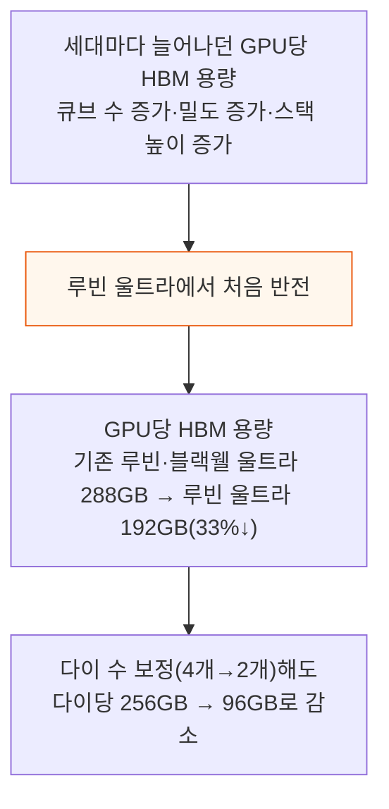

불과 1년 전만 해도 업계는 루빈 울트라가 GPU당 HBM 1TB를 실을 것으로 기대했다. 이는 당시 루빈 울트라가 연산 다이 4개를 쓸 것이라는 전망 아래 나온 숫자였고, 지금은 연산 다이가 2개로 줄었다.

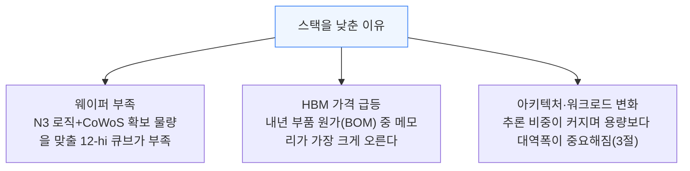

엔비디아는 다른 고객사보다 유리한 조건을 확보하고 있지만, GPU 수요가 공급을 크게 웃도는 시기에도 메모리 원가 상승분만큼은 마진을 일부 내줘야 하는 처지다. 이 글은 공급·비용 요인을 넘어, 많은 경우 GPU당 추가 HBM 용량이 그 비용만큼의 값어치를 하지 못하며 4-hi가 앞으로 최적 구성이 되는 경우가 많다는 점을 보이려 한다.

---

## 2. 스택을 낮춰도 대역폭은 그대로다

**📌 핵심:**
- 스택 높이를 낮춰 GPU당 용량을 줄여도 대역폭은 전혀 희생되지 않는다 — HBM4·HBM4E 큐브 1개가 갖는 데이터 통로(I/O) 총 2,048개는 스택 안의 다이 수만큼 나눠 쓰는데, 다이 1장이 받을 수 있는 통로는 최대 512개라 4-hi(4층)가 2,048개 통로를 전부 활용할 수 있는 가장 낮은 스택이다
- 반면 HBM 원가는 대역폭이 아니라 큐브에 담긴 D램 용량(GB)이 좌우한다 — 가격은 스택당 GB 기준으로 매겨지는데 고객이 실제로 얻는 가치는 대부분 대역폭이라, 스택을 낮출수록 $/대역폭이 유리해진다
- 결론: 낮은 스택은 성능은 그대로 두고 비용만 줄이는, 사실상 거저 얻는 이득에 가깝다

---

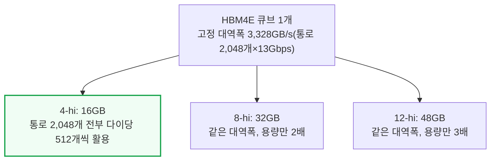

같은 큐브라도 스택을 더 쌓을수록 통로 2,048개를 더 많은 다이가 나눠 쓸 뿐, 큐브 전체의 대역폭 자체는 늘지 않는다. 반면 용량은 스택 높이에 비례해 커지고, HBM 가격은 이 용량(GB)에 매겨진다. 그래서 대역폭 1GB/s를 얻는 데 드는 비용은 스택이 낮을수록 싸진다.

---

## 3. 대역폭과 용량 - 추론에서는 대역폭이 왕이다

**📌 핵심:**
- AI 연산은 사전학습(가중치·그래디언트·활성값을 모두 저장해야 해 용량에 민감), 후속학습·강화학습(추론과 비슷하지만 배치가 커 용량도 필요), 추론 디코드(토큰마다 가중치와 사용자 KV캐시를 읽기만 해 대역폭에 민감) 세 갈래로 나뉜다
- 사전학습이 차지하는 연산 비중이 크게 줄고 후속학습·추론 비중이 커지면서, 전체 연산의 대다수가 이제 용량보다 대역폭에 민감한 쪽으로 넘어갔다 — 다만 용량이 무의미한 건 아니다, 세레브라스·Groq 같은 SRAM 머신의 약점이 바로 대역폭은 풍부해도 용량이 부족해 생기는 병목이다
- GPU당이 아니라 시스템 전체의 총 HBM 용량으로 보면 이야기가 또 달라진다 — 호퍼 시대 H100 HGX(총 640GB)는 라마 3.1 405B 가중치만으로 63%가 찼지만, GB300 NVL72는 스케일업 규모가 9배 커지고 GPU당 HBM도 2배(12-hi)로 늘어 총 용량이 H200 HGX 대비 18배가 됐다 — 이는 지금 가장 큰 오픈소스 모델 Kimi K3(2.8T)의 파라미터 증가율(약 7배)을 크게 앞선다
- 결론: 스케일업 규모가 커지는 속도가 모델 크기가 커지는 속도를 앞질러, GPU당 HBM 밀도를 낮춰도 될 여유가 생겼다 — 4비트 양자화(MXFP4)까지 반영하면 Kimi K3 2.8T 복제본 하나는 1,561GB로, GB300 NVL72가 가진 약 21TB의 8% 미만만 차지한다

---

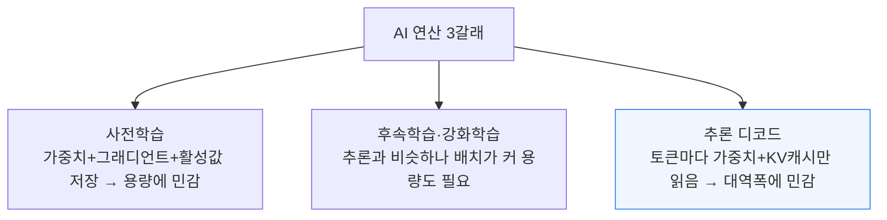

사전학습이 차지하던 연산 비중이 줄고 후속학습·추론이 커지면서, 이제 연산의 대다수는 용량보다 대역폭에 민감한 쪽에 있다. 다만 어느 정도 용량은 필요하다 — 모델 가중치와 사용자 KV캐시를 담을 최소한의 문턱값은 넘어야 하고, 그 문턱을 넘으면 추가 용량의 효용은 급격히 줄어든다(4절에서 정량화).

여기서 말하는 메모리는 칩 1개가 아니라 시스템 전체의 총 HBM이다. 최신 모델은 칩 1개 메모리에 다 들어가지 않아 여러 칩에 나눠 담아야 하고, 이 때문에 네트워킹이 시스템 설계의 핵심이 된다.

오늘날 프론티어 모델이 쓰는 MoE(전문가 혼합) 구조에서는, NVLink처럼 빠르고 지연이 짧은 통신으로 랙 전체를 하나의 스케일업 단위로 묶어 각 GPU에 소수의 전문가만 올리는 폭넓은 전문가 병렬화가 최적인 경우가 많다 — 이렇게 하면 각 전문가가 더 큰 배치를 처리해 연산·대역폭 활용도가 오르지만, 그 대가로 GPU 간 통신량이 크게 늘어난다.

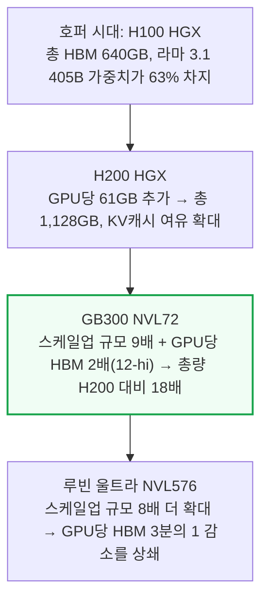

같은 기간 가장 큰 오픈소스 모델(Kimi K3, 2.8T)의 파라미터는 약 7배 늘었을 뿐이다 — 시스템 총 용량이 모델 크기보다 훨씬 빠르게 커진 덕분에, GPU당 HBM 밀도를 낮춰도 KV캐시를 담을 여유가 넉넉하다.

4비트 양자화(MXFP4)를 적용하면 Kimi K3 2.8T 복제본 1개는 1,561GB로, GB300 NVL72가 가진 약 21TB의 8% 미만만 차지한다.

---

## 4. 대역폭과 용량의 최적 배합

**📌 핵심:**
- 대역폭과 용량 사이에는 최적 비율이 있다 — 토큰 1개가 쓸 수 있는 대역폭으로 전체 용량을 몇 번 읽을 수 있는지를 계산해, 1보다 크면 대역폭이 남고(처리 속도를 더 올리는 데 재활용 가능) 1보다 작으면 용량이 남는다(쓰지 못한 채 비용만 무는 좌초 용량)
- 처리 속도(초당 토큰 수)가 오를수록 토큰당 쓸 수 있는 대역폭이 줄어 용량이 남아도는 쪽으로 기운다 — 다만 동시성(배치)을 늘리면 가중치 1회 읽기를 여러 요청에 나눠 쓰면서도 사용자마다 KV캐시를 따로 담아야 해 용량 소비가 늘어나므로, 배치를 키우는 워크로드는 대역폭이 아니라 용량이 병목이 되기 쉽다
- 루빈 울트라 NVL576에서 Kimi K3를 돌린 모델링 기준, 최소 응답 속도 105 tok/s/user에서는 12-hi가 8-hi보다 처리량 이점이 없고, 213 tok/s/user(2배)에서는 4-hi보다 높은 스택 전체가 이점을 잃는다 — 최대 처리량만 보면 8-hi가 4-hi보다 8%, 12-hi가 10% 높지만, BOM은 4-hi 대비 8-hi가 12.1%, 12-hi가 26.3% 더 비싸 처리량 증가분을 원가 증가분이 웃돈다
- 결론: 지금 메모리 가격에서는 8-hi·12-hi가 4-hi보다 토큰당 비용이 오히려 더 높다 — 이는 KV캐시를 다른 메모리로 내보내는 절약 기법(5절)을 반영하기 전 수치라, 실제로는 격차가 더 벌어질 수 있다

---

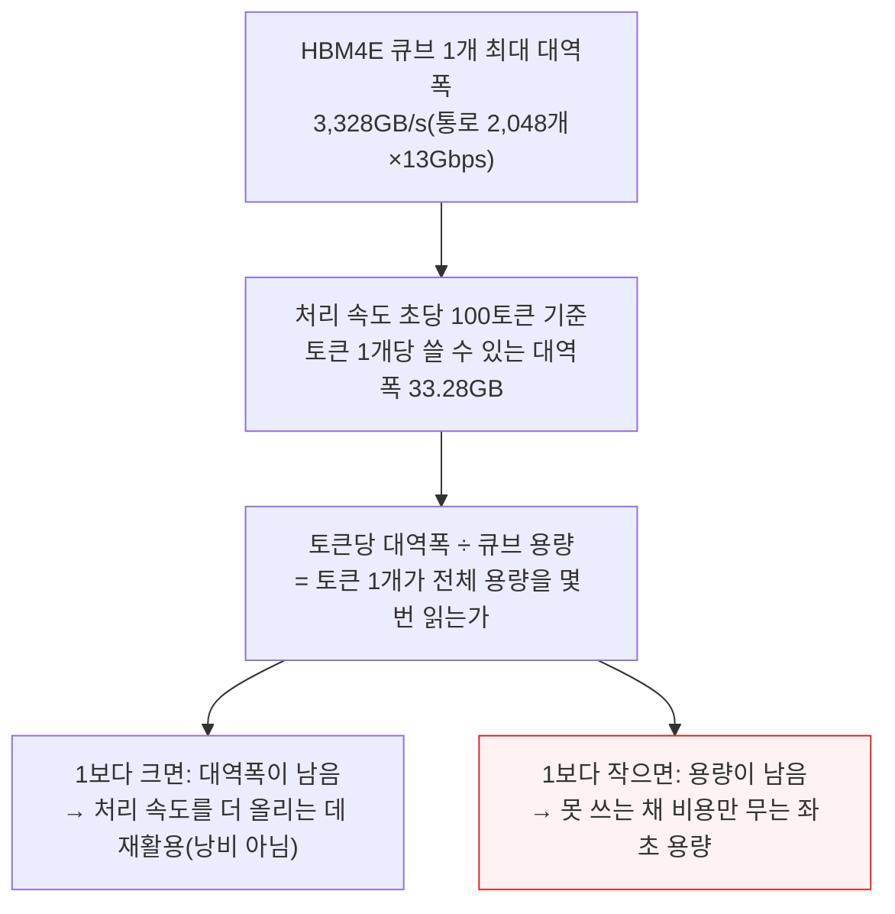

이 계산은 동시 사용자 1명을 가정한 단순화다. 실제로는 여러 사용자 요청을 한데 묶는 배치가 추론 경제성의 핵심이다.

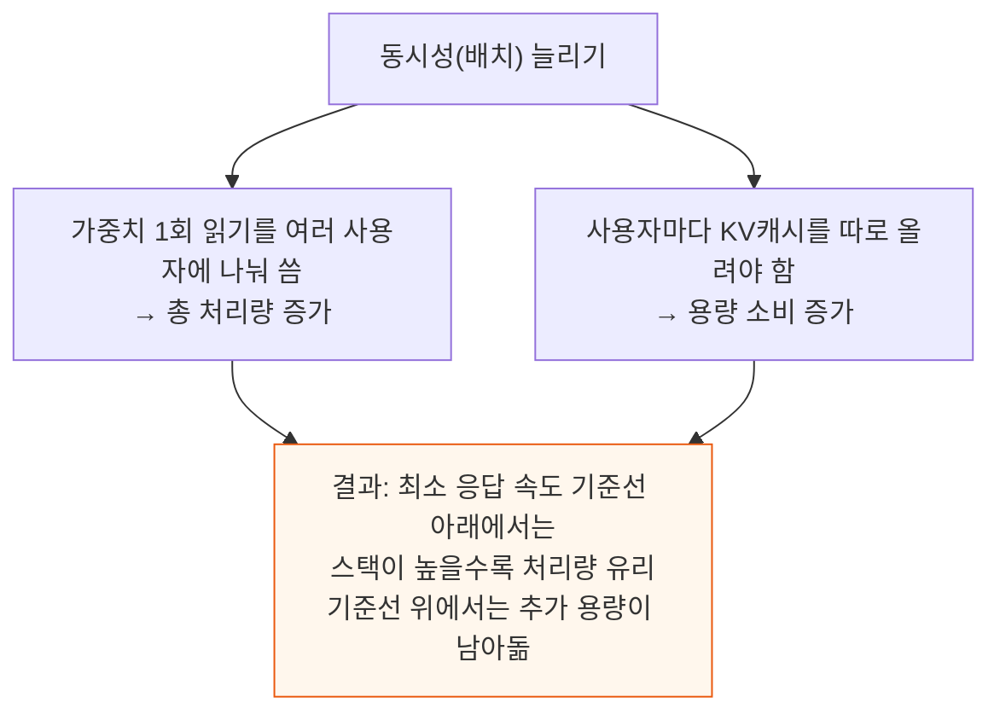

모델이 클수록(가중치가 HBM 용량에서 차지하는 비중이 클수록) 이 기준선은 더 높은 응답 속도 쪽으로 밀리고, 높은 스택이 주는 최대 처리량 이득도 커진다 — 스텝마다 가중치를 한 번 읽는 건 배치 크기와 무관해, 가중치 크기가 클수록 동시 사용자 1명이 늘 때마다 얻는 처리량 이득도 커지기 때문이다.

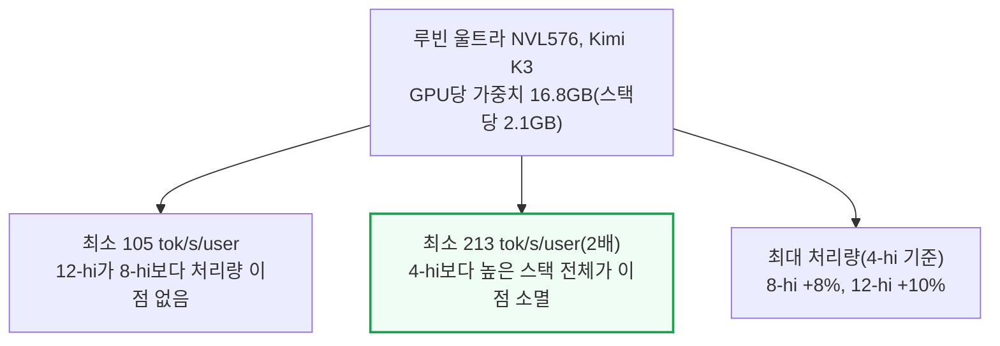

4-hi 기준 최대 처리량까지 내려서 보면, 4-hi는 8-hi·12-hi보다 2배 넘는 응답 속도를 낼 수 있다. 이는 이론상 최고 대역폭(루프라인)을 가정한 수치로, 실제 달성 대역폭은 이보다 낮아 기준선이 더 낮은 응답 속도 쪽으로 옮겨간다 — 결론의 방향은 같다.

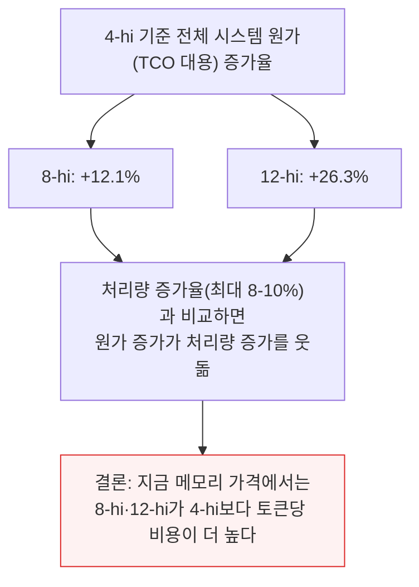

---

## 5. 실측 실험 - KV캐시 오프로딩이 용량 압박을 던다

**📌 핵심:**
- 모델 가중치만 HBM에 온전히 담긴다면, 당장 쓰지 않는("덜 뜨거운") KV캐시는 2차 저장소인 DDR D램으로 옮겨둘 수 있다 — 턴 사이 공백이 긴 에이전틱 워크로드에서는 이 KV캐시를 다시 계산하는 것보다 DRAM에 내보냈다 필요할 때 불러오는 편이 유리해, 이미 SemiAnalysis의 AgentX 벤치마크에서 일정 동시성 이상 구간의 최적 해법으로 나타난 적이 있다
- GB300 16장을 프리필 8장·디코드 8장으로 나눈 PD 분리형 서빙 구성으로 Kimi K3를 돌려, HBM 사용률을 정상(92%)보다 낮춘(85%) 제한 조건에서 실측했다 — HBM이 겨우 8% 줄었을 뿐인데도 GPU당 KV캐시 저장 공간은 20GB가 줄어, 집계 서빙 기준 KV 예산이 53GB에서 34GB로(36%↓), 분리 서빙 쌍 기준으로는 44GB에서 24GB로(44%↓) 줄었다
- 동시 요청 70개까지는 제한 조건도 정상 조건과 처리량이 거의 같았지만, 70개를 넘어서자 처리량이 약 30% 떨어졌다 — 이 지점에서 GPU의 KV 점유율이 100%에 도달해, 선점·재적재·대기열 지연이 겹쳤고 제한 조건은 같은 동시성에서 DRAM으로 옮긴 KV캐시를 10배 넘게 더 자주 읽어들였다
- 결론: KV캐시를 DDR D램으로 내보내는 절약 기법은 HBM 용량 압박을 실제로 크게 덜어준다 — 최신 DeepSeek v4.1 Flash처럼 활성 KV캐시 크기를 이전 세대 대비 약 75% 줄이는 기법까지 반영하면, 동시성을 늘려 HBM 용량을 다 채우기도 전에 워크로드가 연산·네트워크 병목으로 먼저 넘어가 높은 스택의 가치는 더 떨어진다

---

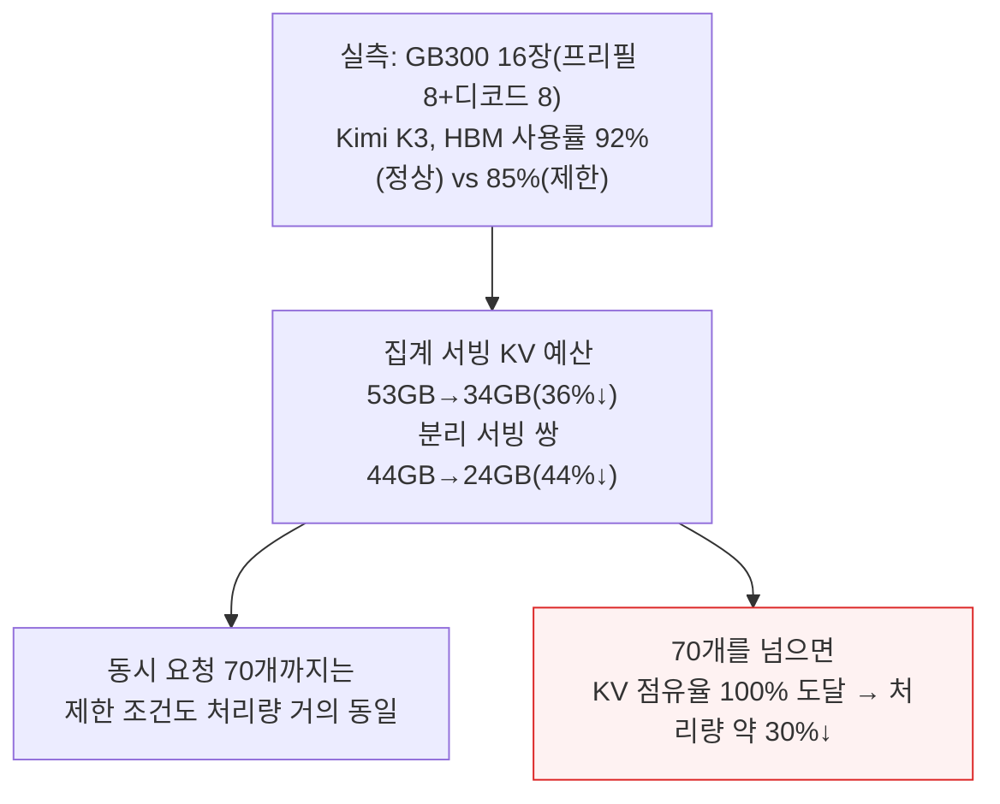

처리량이 떨어지는 구간에서 제한 조건은 같은 동시성의 정상 조건보다 DRAM에 저장된 KV캐시를 10배 넘게 더 자주 읽었다 — DRAM 오프로딩이 실제로 작동했다는 뜻이다.

다만 이 실험은 HBM을 8%만 줄인 결과라, 8-hi에서 4-hi로 갈 때의 50% 감소와는 규모가 다르다. Kimi K3를 GPU 8장에만 서빙해 가중치가 메모리의 상당 부분을 차지하는 조건이라 이 정도 감소로도 KV 예산이 크게 줄었다.

---

## 6. 4-hi는 미래 대비를 포기하는 선택인가

**📌 핵심:**
- 지금까지의 분석은 지금 모델(Kimi K3)을 미래 시스템(루빈 울트라 NVL576)에서 돌린 결과라 미래 워크로드의 용량 수요를 과소평가할 수 있다는 약점이 있다 — AI 서버는 5년 넘게 쓰이는데, 만약 미래 모델이 Kimi K3의 3배 크기(KV캐시도 3배)가 되면 12-hi는 4-hi보다 총 토큰 처리량이 47% 많고 8-hi는 36% 많다(다만 속도는 절반)
- BOM까지 반영하면 이 시나리오에서도 8-hi는 최소 응답 속도 180 tok/s/user 미만 구간에서만 원가 증가분보다 처리량 증가분이 커 이득이고, 12-hi는 어떤 구간에서도 원가 증가분을 처리량 증가분이 넘어서지 못해 이득이 없다
- 세 가지 반론이 이 우려를 상쇄한다 — ① 모델 성능은 이제 가중치를 늘리는 대신 강화학습과 추론(생각) 시간을 늘려 개선되는 쪽으로 옮겨갔고(GPT-6 아스트라의 루프 트랜스포머가 대표 사례), ② 4-hi가 설치 기반의 상당 부분을 차지하게 되면 연구자들이 그 하드웨어에 맞춰 모델을 설계하며 실제로 프론티어 랩의 하드웨어 팀이 4-hi를 가장 선호한다, ③ 모두의 궁극적 목표는 최대 토큰 서빙이고 4-hi가 그 목표에 가장 가까운 선택이다
- 결론: 미래 모델이 훨씬 커질 위험을 완전히 배제할 순 없지만, 모델 스케일링의 방향 자체가 가중치 확대에서 멀어지고 있어 4-hi가 감수하는 위험은 제한적이다

---

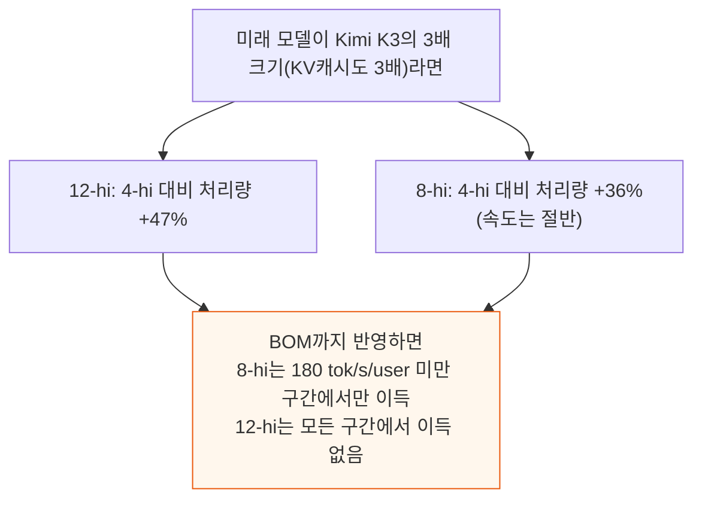

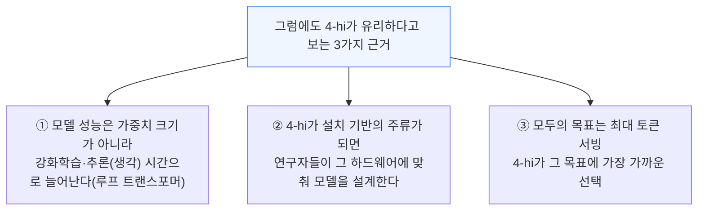

루프 트랜스포머는 같은 트랜스포머 층에 입력을 여러 차례 통과시켜, 가중치를 늘리지 않고도 깊이로 연산량을 확장하는 방식이다. 프론티어 랩 중에서도 하드웨어와 소프트웨어를 함께 설계하는 팀일수록 4-hi를 가장 강하게 지지한다는 점은, 이들이 이미 미래 모델이 그 방향(가중치보다 연산·추론 시간으로 확장하는 방향)으로 가고 있다고 내다본다는 신호로 읽힌다.

---

## 7. HBM 웨이퍼당 토큰을 최대화한다

**📌 핵심:**
- AI 인프라를 지을 때 부딪히는 희소 자원은 여럿이다 — 전력이 부족하면 토큰/와트를 최적화하고, 돈이 부족하면 성능/TCO를 최적화하듯, HBM 웨이퍼가 부족한 지금은 토큰/HBM 웨이퍼를 최적화해야 한다
- 4-hi 큐브는 8-hi·12-hi와 같은 대역폭을 내면서도 웨이퍼 1장에서 더 많은 큐브를 뽑아낼 수 있어, 웨이퍼 1장이 내는 총 대역폭이 12-hi 대비 3배, 8-hi 대비 2배가 된다 — 여기에 스택이 낮을수록 조립이 단순해 패키징 수율까지 높아지는 효과가 더해진다
- 4-hi 전환으로 8-hi 대비 웨이퍼당 뽑아낼 수 있는 큐브 수가 2배를 넘어설 수 있지만, 그 큐브가 실제로 쓰이려면 가속기와 함께 패키징돼 시스템으로 조립돼야 한다 — 그러면 병목이 HBM 웨이퍼에서 로직 웨이퍼(가속기·HBM 베이스 다이)·기판·PCB·조립 능력 같은 다른 공급망 구간으로 옮겨갈 뿐이며, SemiAnalysis는 이 나머지 공급망이 D램 공급 증설보다 빠르게 늘 수 있다고 본다
- 결론: 설령 나머지 공급망이 늘어난 큐브 수요를 다 못 따라가더라도, 4-hi로 아낀 웨이퍼는 HBM에 밀려 줄어든 서버 D램 등 다른 용도의 D램 공급으로 돌릴 수 있다

---

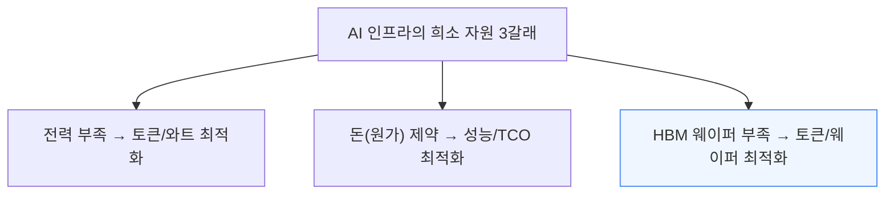

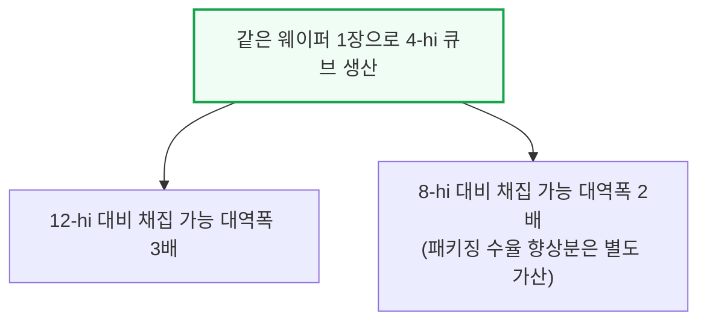

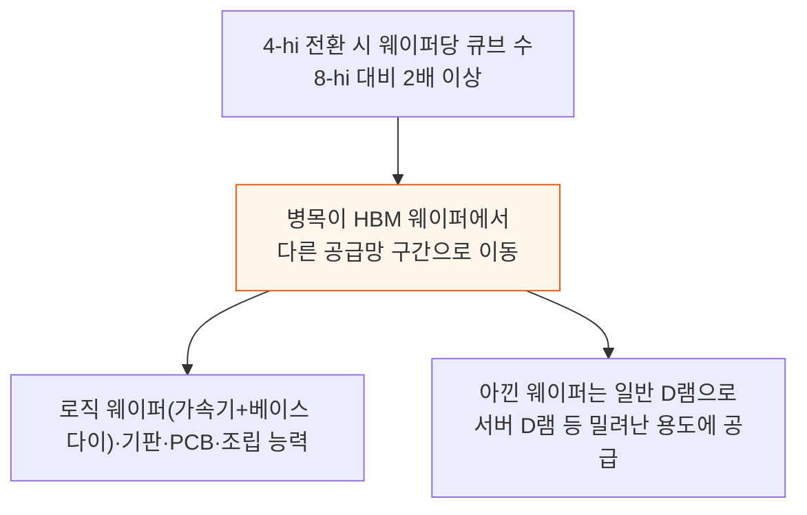

에이전틱 워크로드는 GPU가 토큰을 디코드하는 시간보다 CPU 관련 처리를 기다리는 시간이 많은 경우가 잦아, 서버 D램 공급이 넉넉해지는 효과는 이런 워크로드에도 직접 도움이 된다.

---

## 8. 메모리 공급사에 미치는 영향

**📌 핵심:**
- 주요 고객사들이 4-hi를 요청하고 있지만 지금 응하는 곳은 마이크론뿐이다 — 최소 2개 고객사向으로 테스트 중이고, 삼성전자와 SK하이닉스는 아직 4-hi 공급에 소극적이다
- 이유는 단순하다 — HBM은 스택당 값어치와 비트 수요를 함께 키워 D램 전체 수익성을 끌어올린 일등공신이자, 지금의 D램 공급난을 만든 주역 중 하나다 — 4-hi로 내려가는 건 이 흐름을 거스르는 선택이라 한국 공급사들이 주저하는 것도 당연하다
- SemiAnalysis는 공급사가 4-hi를 8-hi 대비 Gb당 약 10% 프리미엄에 판매하는 모델을 제시한다 — 스택이 낮을수록 베이스 다이 원가가 전체 원가에서 차지하는 비중이 커지는 만큼 그 부담을 상쇄하려는 가격 책정이지만, 그 대신 조립이 단순해 패키징 수율이 오르는 효과가 더해져 4-hi는 8-hi보다 오히려 마진이 더 높은 제품이 될 수 있다
- 결론: 고객사는 여전히 유리한 $/대역폭을 얻고 공급사는 더 높은 마진을 얻는 윈윈 구도가 가능하다 — 마이크론이 4-hi를 독점하는 동안 제조가 쉬운 제품에 프리미엄 마진을 누리겠지만, SemiAnalysis는 삼성전자와 SK하이닉스도 그 이익을 나눠 가지려 해 오래 버티지 않을 것으로 본다

---

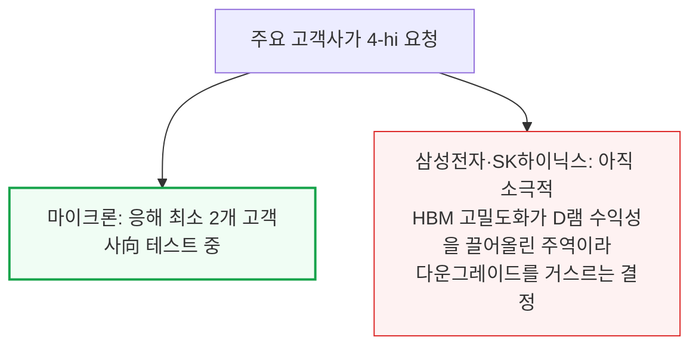

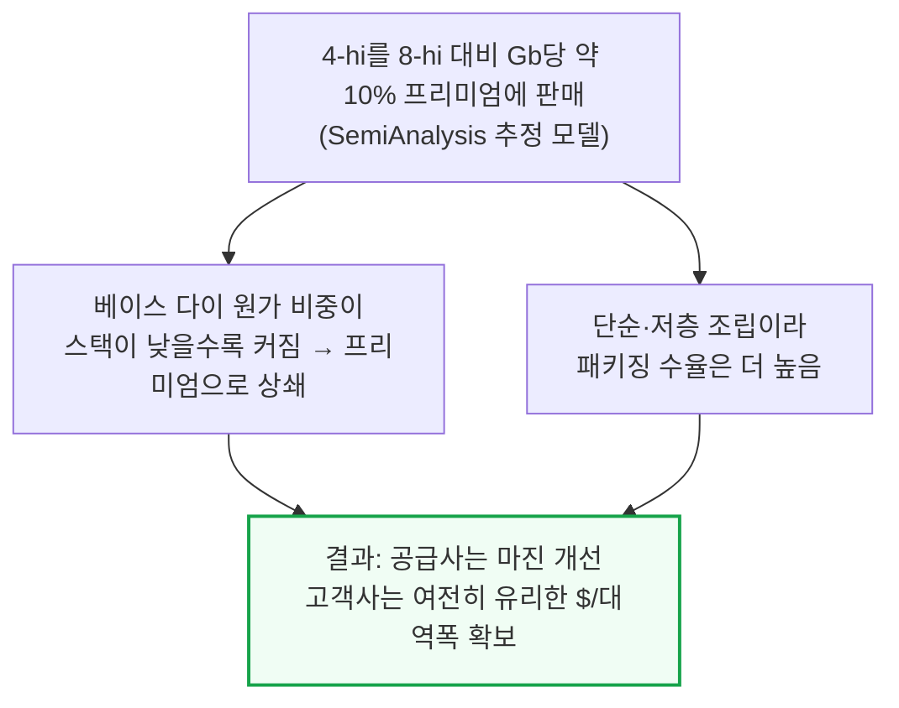

마이크론이 당분간 4-hi 유일 공급사로 남으면 제조가 더 쉬운 제품에서 프리미엄 마진을 누리게 된다. 삼성전자와 SK하이닉스가 이 구도를 오래 지켜만 보지는 않을 것으로 SemiAnalysis는 전망한다.

---

*작성 진행률: 100% 완료*
*업데이트: 전체 8개 섹션(HBM 용량 추세 반전, 스택-대역폭 무관계, 대역폭 vs 용량, 최적 배합 정량분석, KV캐시 오프로딩 실측, 미래 대비 반론, 웨이퍼당 토큰 최대화, 메모리 공급사 영향) 완료*
