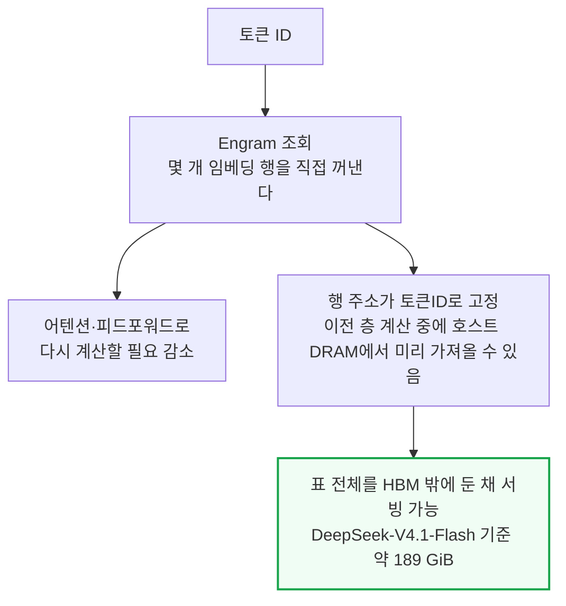
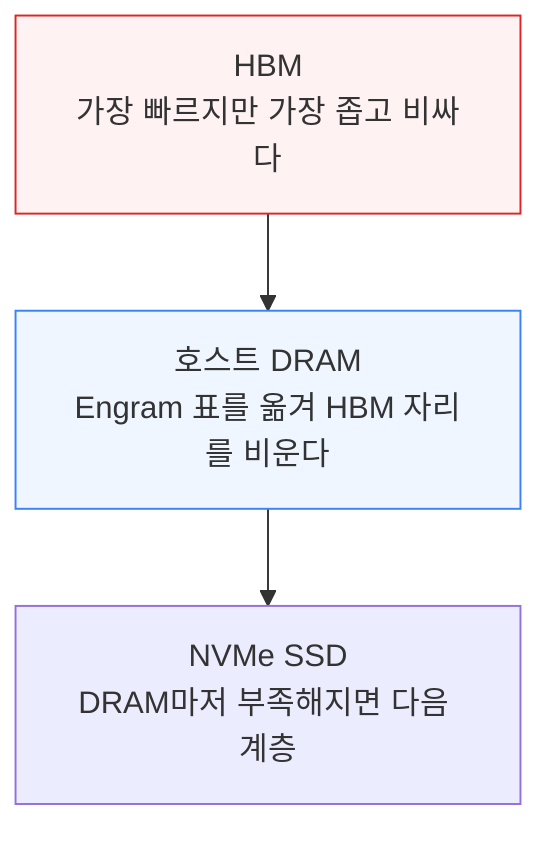
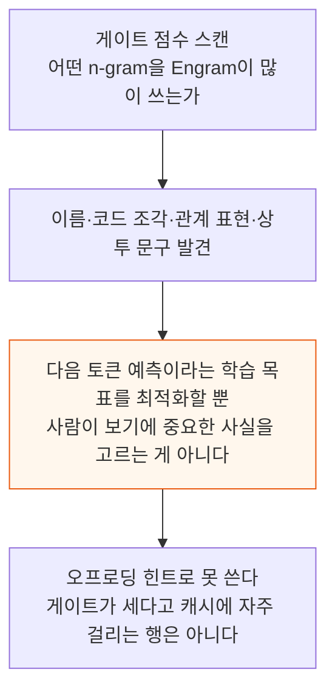

# Engrams Embedding Entendre: Codesign for Efficient DRAM/SSD Offloading

> **출처**: [SemiAnalysis Newsletter](https://newsletter.semianalysis.com/p/engrams-embedding-entendre-codesign)
> **저자**: Bryan Shan, Cam Quilici, Alec Ibarra
> **발행일**: 2026-09-18

---

## 📑 목차

### 전체 섹션
1. [Engram이란 무엇인가 - 메모리 요구량을 낮추는 모델 아키텍처](#1-engram이란-무엇인가---메모리-요구량을-낮추는-모델-아키텍처)
2. [Engram의 성능 개선 효과](#2-engram의-성능-개선-효과)
3. [무엇을 기억하는가](#3-무엇을-기억하는가)
4. [Engram을 제거하면 무슨 일이 벌어지나](#4-engram을-제거하면-무슨-일이-벌어지나)
5. [GPU별 에이전틱 추론 성능 격차 - InferenceX 실측](#5-gpu별-에이전틱-추론-성능-격차---inferencex-실측)
6. [DRAM·SSD 오프로딩이 성능과 비용에 미치는 영향](#6-dram·ssd-오프로딩이-성능과-비용에-미치는-영향)
7. [Engram의 구현 메커니즘 - DeepSeek·LongCat·Qwen 비교](#7-engram의-구현-메커니즘---deepseek·longcat·qwen-비교)

---

## 🔑 용어 정리

본문을 순서대로 읽기 전에 알아두면 좋은 용어들입니다. 자세한 수치와 설명은 본문에서 처음 등장하는 위치에 나옵니다.

- **Engram**: 표준 토큰 임베딩에 "여러 토큰을 한 번에 조회하는 표"를 더한 구조 — 자주 반복되는 짧은 패턴을 어텐션·피드포워드 층으로 다시 계산하지 않고 표에서 바로 꺼내 쓴다
- **HBM(High Bandwidth Memory, 고대역폭 메모리)**: GPU에 직접 탑재되는 메모리로 가장 빠르지만 용량이 좁고 비싸다 — 이 글의 핵심은 Engram 표를 여기서 밀어내는 방법이다
- **DRAM/SSD 오프로딩**: Engram 표처럼 큰 데이터를 GPU의 HBM 밖(호스트 서버의 DRAM 또는 SSD)에 두고, 필요할 때만 가져오는 방식
- **InferenceX**: SemiAnalysis가 만든 오픈소스 추론 성능 벤치마크 — 여러 제조사 GPU를 같은 모델·같은 조건에서 실측 비교한다
- **MoE(Mixture of Experts, 전문가 혼합)**: 입력마다 전체 네트워크 대신 일부 "전문가" 서브네트워크만 골라 활성화하는 모델 구조
- **UVA(Unified Virtual Addressing, 통합 가상 주소 지정)**: GPU가 호스트 서버의 DRAM을 마치 자기 메모리처럼 직접 읽을 수 있게 해주는 주소 체계
- **TP(Tensor Parallelism, 텐서 병렬화)**: 모델 하나를 여러 GPU에 쪼개 나눠 계산하는 방식 — 쪼개는 GPU 수(TP4, TP2 등)가 클수록 GPU 간 통신량이 늘어난다

---

## 1. Engram이란 무엇인가 - 메모리 요구량을 낮추는 모델 아키텍처

**📌 핵심:**
- Engram은 토큰 임베딩을 확장해, 자주 반복되는 짧은 패턴(2\~4개 토큰 묶음)을 몇 개 임베딩 행에서 직접 꺼내 쓰는 구조다 — 이 정보를 매번 어텐션·피드포워드 층으로 다시 계산할 필요가 줄어든다.
- 이 행들의 위치는 토큰 ID로 정해지기 때문에, 이전 층이 계산하는 동안 호스트 DRAM에서 미리 가져올 수 있다 — 그래서 Engram 표 전체를 GPU의 HBM 밖에 둔 채로 서빙할 수 있다(DeepSeek-V4.1-Flash 기준 표 크기 약 189 GiB).
- HBM에서 비워진 자리는 모델 가중치·KV캐시(토큰마다 이전 계산 결과를 저장해 두는 공간)로 돌려 더 많은 동시 요청을 처리할 수 있고, DRAM마저 부족해지면 NVMe SSD가 다음 저장 계층이 된다.
- 결론: Engram은 모델 품질을 유지하면서 필요한 HBM 용량을 줄이는 아키텍처 혁신이다 — HBM 수요 자체가 사라지는 건 아니지만, 모델 아키텍처가 메모리 제약을 계속 우회하는 방향으로 진화한다는 신호다.

---

이런 오프로딩 여지는 시점이 절묘하다. 엔비디아는 루빈 울트라의 GPU당 HBM 용량을 1,024GB 계획에서 약 200GB로 대폭 줄였는데, Engram처럼 아키텍처 쪽에서 HBM 필요량을 낮추는 혁신이 이 제약을 완화하는 데 도움이 될 수 있다.

추천 시스템(recsys) 업계는 이미 자주·최근 접근한 임베딩 행을 빠른 메모리에 캐시하고, 차가운(잘 안 쓰는) 행은 SSD로 백업해 두는 이 방식을 써왔다. 이번 보고서 뒷부분에서는 Engram 오프로딩 실험 결과와 함께, InferenceX의 공식 에이전틱 추론 서빙 결과(DeepSeek-V4.1-Flash 등 Engram 모델을 엔비디아 GPU 6종 전체와 AMD MI355X에서 실측)를 보여준다 — CUDA 해자(생태계 우위)는 이 인기 모델에서도 여전히 MI355X를 압도한다. 나아가 HBM 용량이 넉넉한 고급 SKU에서도, Engram을 HBM에 그대로 두는 것보다 DRAM으로 오프로드하는 편이 대부분의 성능-비용 구간(파레토)에서 더 나은 결과를 낸다는 점도 보인다.

이 벤치마크(InferenceX)는 구글 클라우드·마이크로소프트 애저·오라클·메타를 비롯한 컴퓨트 구매자 대부분이 재현·검증했고, vLLM·LMCache·SGLang·PyTorch·HuggingFace 같은 ML 커뮤니티와 OpenAI·MiniMax·ZAI·Qwen·Moonshot Kimi 등 주요 랩의 지지를 받는다. InferenceX는 TPUv7·Jalapeño·엔비디아 루빈 NVL72·AMD를 모두 갖춘(곧 SambaNova·Trainium도 추가) 세계 유일의 추론 벤치마크이며, AgentX 시나리오가 실제 에이전틱 추론 워크로드와 매우 흡사해 AMD도 MI455X UALoE72로 협업을 약속했다.

---

## 2. Engram의 성능 개선 효과

**📌 핵심:**
- DeepSeek이 원 논문에서 학습한 두 개의 Engram 모델은 공개하지 않아, 저자들이 fineweb-edu 데이터셋에 공개된 코드·학습 하이퍼파라미터로 재현했다 — 실행당 연산량은 약 6×10^18 FLOPs 규모다.
- 재현 실험에서도 원 논문과 같은 U자형 스케일링 곡선(전문가와 Engram에 배분하는 비율에 따라 손실이 U자로 변하는 패턴)이 나타났고, Engram을 더한 모델이 순수 MoE(전문가 혼합) 기반 모델보다 나은 성능을 보였다.
- DeepSeek의 또 다른 결과도 재현됐다 — Engram을 쓴 모델의 초반 층(layer) 표현이 Engram 없는 모델의 후반 층 표현과 비슷해졌다. Engram이 모델 초반부터 더 "성숙한" 표현을 만들어준다는 뜻이다.
- 결론: 실험실 재현에서도 Engram은 순수 MoE 대비 실질적인 품질 개선을 보였고, 모델이 정보를 처리하는 층 깊이 자체를 앞당기는 효과가 확인됐다.

---

## 3. 무엇을 기억하는가

**📌 핵심:**
- Engram의 게이트 점수를 들여다보면 DeepSeek-V4.1-Flash가 자주 불러 쓰는 n-gram(연속 토큰 묶음)에 이름, 코드 조각, 관계를 나타내는 표현, 상투 문구(라이선스 문구·API 뼈대·웹사이트 고정 문구 등)가 많다 — 예상 밖 사례로 게임 캐릭터 이름 "Wright : Ace Attorney"도 나왔다.
- 이는 Engram이 "중요한 사실"을 골라 저장하는 게 아니라 다음 토큰 예측이라는 학습 목표를 최적화할 뿐임을 보여준다 — 상투적인 텍스트도 예측을 쉽게 만들어주면 자리를 차지할 수 있다는 뜻이다. 다만 이 관찰만으로 "표 용량이 낭비된다"고 단정할 수는 없다 — 평가용 말뭉치 스캔은 학습 때 실제로 얼마나 노출됐는지도, 카테고리별로 용량을 얼마나 차지하는지도 밝히지 못한다.
- 오프로딩 관점에서는 이 게이트 점수를 "자주 쓰는 행을 미리 캐시에 올려두는 힌트"로 쓸 수 없다 — 게이트 점수가 세다고 캐시에 자주 걸리는 행이라는 보장이 없고, 게이트 점수를 계산하려면 이미 그 행을 가져와야 해서(키가 필요) 읽기를 건너뛰는 최적화 자체가 성립하지 않는다. 읽기 전에 미리 걸러내려면 별도의 "쓸모 예측기"가 따로 있어야 한다.
- 결론: Engram이 기억하는 내용은 사람의 직관과 다를 수 있고, 그 정보만으로는 오프로딩 캐시 전략을 세울 수 없다 — 캐싱은 여전히 다른 신호가 필요하다.

---

---

*작성 진행률: 약 45% 완료 (1\~3절 완료)*
