# How GLM5.3 Sparse Attention Affects HBM Memory Usage

> **출처**: [SemiAnalysis Newsletter](https://newsletter.semianalysis.com/p/sparse-savings-persistent-demand-inside-glm53)
> **저자**: Kimbo Chen, Alec Ibarra, Wenyao Gao
> **발행일**: 2026-09-28

희소 어텐션(전체 토큰이 아니라 가장 관련 높은 상위 k개 토큰만 읽는 방식)은 어텐션 연산의 메모리 읽기량을 줄이지만, 전체 메모리 용량 수요는 줄이지 못한다. 이 글은 Z.ai의 GLM-5.3을 사례로 서빙 비용, DeepSeek Sparse Attention 구조, 사후학습 설계, 사이버보안 능력을 차례로 다룬다. 비용 수치는 InferenceX의 9월 28일 AgentX 스냅샷에서 측정 곡선으로 추정한 값이다.

## 차례

1. [희소 어텐션과 메모리 용량](#s1)
2. [GLM-5.3 에이전틱 서빙 비용](#s2)
3. [서빙 엔진 최적화와 TileRT](#s3)
4. [DeepSeek Sparse Attention 구조](#s4)
5. [사후학습 설계](#s5)
6. [사이버보안 능력](#s6)

## 1. 희소 어텐션은 메모리 용량 병목을 없애지 못한다

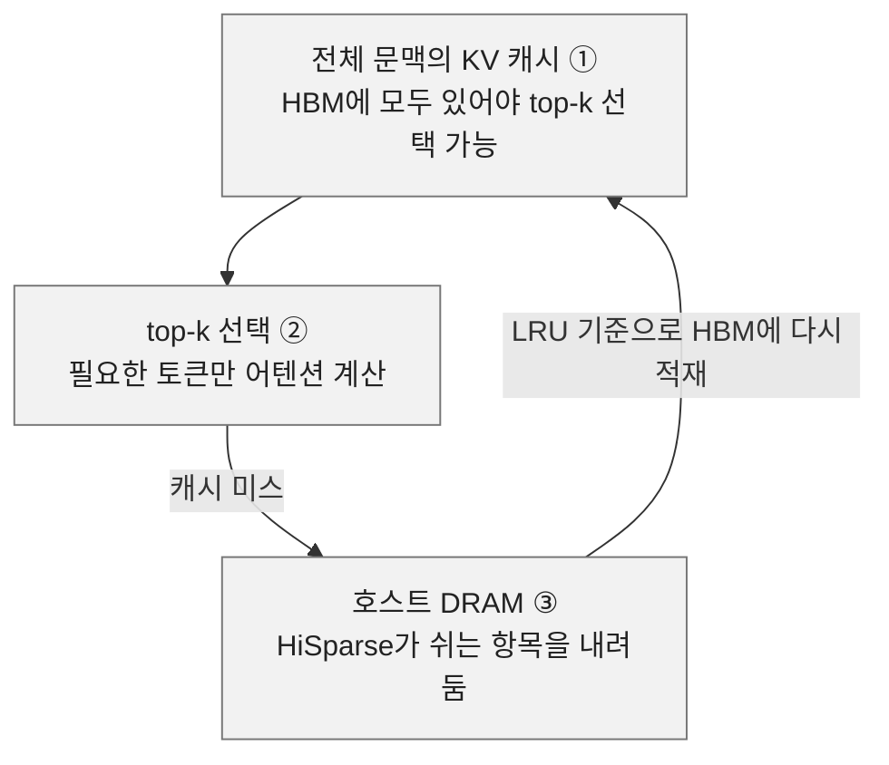

① KV 캐시(이전 토큰의 어텐션 계산에 쓰는 키·값 상태) 전체가 HBM(가속기에 붙은 고대역폭 메모리)에 있어야 선택 연산이 돈다. ② SDPA(어텐션의 핵심 점곱 연산)의 메모리 읽기량과 대역폭 수요는 준다. ③ 최근에 안 쓴 항목부터 내려보내는 LRU(Least Recently Used) 방식이다.

원문의 핵심 주장은 효율 개선이 곧 메모리 절감은 아니라는 것이다. 희소 어텐션만으로는 처리량이 메모리 용량에 묶인다.

SGLang 팀의 HiSparse는 이 한계를 시스템으로 넘는다. top-k 선택에서 캐시 미스가 나면 DRAM에서 HBM으로 토큰을 올리고, 쉬는 토큰은 DRAM으로 내린다. N층 KV 적재를 N-1층 실행과 겹쳐 미스 지연을 줄이며, 이 층별 겹치기는 선행 연구 HiCache에서 왔다. 동시 요청이 많고 문맥이 긴 환경에서 처리량이 크게 오르는 대가로 캐시 미스 입출력 부담이 생긴다.

저자는 희소 어텐션의 메모리 프로필만으로는 시스템의 KV 캐시 효율을 설명하지 못한다고 정리한다. 그래서 GLM-5 계열의 설계와 실제 서빙을 함께 본다.

## 2. GLM-5.3 에이전틱 서빙 비용은 목표 속도와 첫 토큰 제한에 따라 순위가 바뀐다

InferenceX에서 GB300(Dynamo-TRT-LLM)은 초당 150토큰 응답 속도 기준 모델 서빙 비용이 가장 낮았다. GB200은 Dynamo-SGLang 결과다. 비용은 하이퍼스케일러 규모의 인프라 소유·운영 모델로 추정했고, 총토큰에는 입력·출력과 여러 턴에서 재사용하는 캐시 입력 기록이 들어간다. 속도는 p90 상호작용성(사용자별 토큰 생성 속도의 90번째 백분위)으로 재고, 첫 토큰까지의 시간(TTFT)은 따로 평가한다.

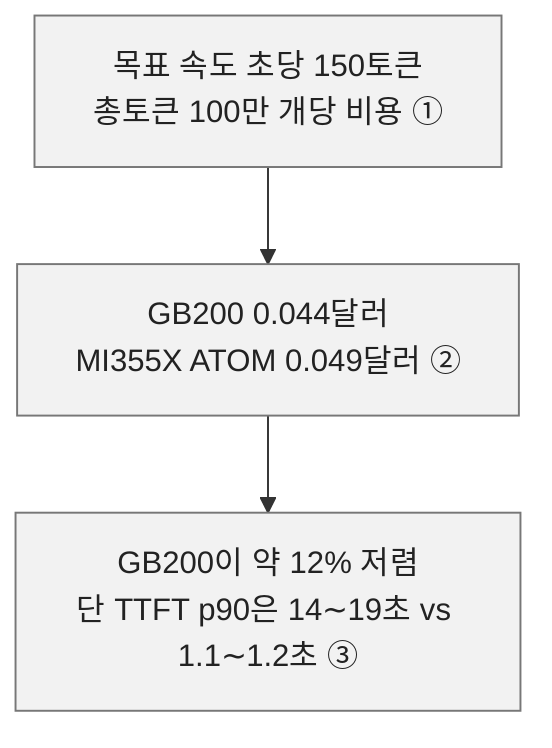

① 측정 곡선에서 추정한 값이며 150토큰에서 따로 시험하지 않았다. ② ATOM은 AMD의 서빙 엔진이다. ③ GB200 측정점은 목표 속도 양쪽 모두 첫 토큰을 14∼19초 기다렸고, 일부 최저 비용 실행은 더 오래 기다렸다.

Dynamo-SGLang끼리 보면 GB300은 GPU당 초당 총 13,950토큰으로 GB200의 11,873토큰보다 17.5% 높다. 그러나 GPU 시간당 가격을 GB300 2.31달러, GB200 1.86달러로 가정해, 높은 시간당 가격이 처리량 우위를 넘어선다.

AMD와는 목표 속도마다 순위가 다르다. ATOM이 100토큰에서 GB200보다 약 13% 싸고, GB200은 125토큰에서 약 5%, 150토큰에서 12% 싸다. 세 목표에서 어느 쪽도 일관된 우위가 없다. 출력 토큰만 세면 150토큰 기준 GB200이 100만 출력토큰당 5.92달러로 MI355X ATOM의 6.68달러보다 약 11% 싸다. 에이전트는 긴 입력 기록을 반복 재사용하고 새 텍스트는 적게 생성해서 이 지표가 쓸모 있다고 저자는 본다.

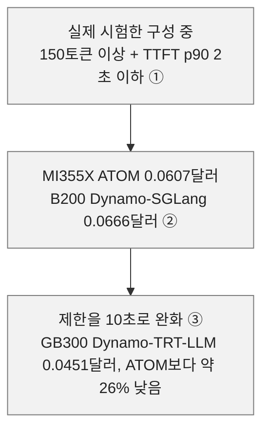

① 총토큰 100만 개당 비용으로 비교한다. ② ATOM이 약 9% 저렴하다. ③ 10초로 풀면 GB300이 자격을 얻는다.

## 3. 캐시를 GPU 밖으로 내보내고 서빙 엔진 실행 방식을 바꾼다

GLM-5.2·5.3은 KV 압축으로 토큰당 저장 상태를 줄이고, 희소 어텐션으로 어텐션마다 읽는 양을 줄인다. 에이전트가 이전 대화를 계속 들고 가야 하므로, 서빙 엔진이 캐시를 어디에 두고 어떻게 가져오는지가 이어서 결정된다.

B200 결과에서 동시 요청이 8개에서 16개로 늘면 GPU 메모리에서 재사용한 프롬프트 토큰 비중이 90.3%에서 54.8%로 떨어진다. 호스트 메모리 재사용은 6.0%에서 40.3%로 올라 이를 메우고, 전체 캐시 적중률은 모든 동시성에서 95%를 넘는다.

엔진의 prefill(입력 처리)·decode(답변 생성) 실행 방식도 성능을 바꾼다. GLM-5.2 연구 두 건이 예다.

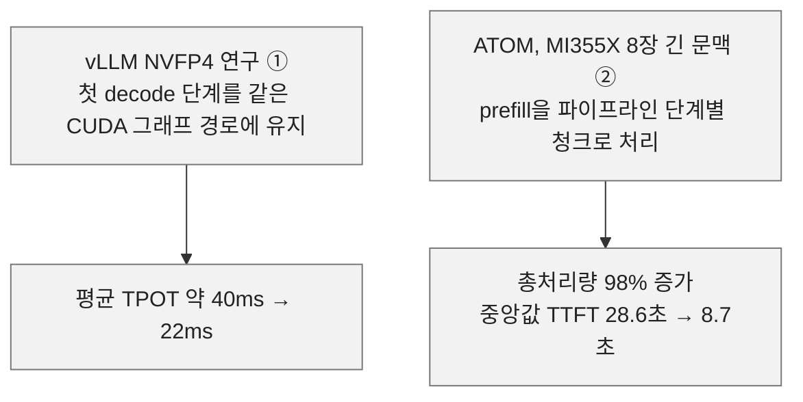

① TPOT는 출력 토큰 하나당 걸리는 시간이다. ② 두 연구는 서로 다른 조건이라 직접 비교하지 않는다.

TileRT는 decode를 하나의 지속 커널로 컴파일해 실행 호출 부담을 줄이고 연산·메모리 접근·통신을 겹치는 저지연 추론 엔진이다. 배치 처리량보다 사용자별 토큰 생성 속도를 우선하며 prefill은 vLLM이 맡는다. GLM-5.3은 AMD MI355X를 먼저 지원했다.

AgentX에서 FP8 TileRT MI355X는 최고 FP4 MI355X 구성보다 p90 상호작용성이 2배이고, GB300 NVL72보다 40% 높다. 예전에는 전용 하드웨어가 필요했던 서빙 지표다. 다만 TTFT는 최적이 아니며 KV 전송 최적화, FP4 지원, 더 큰 배치가 남은 과제다.

## 4. DeepSeek Sparse Attention은 인덱서와 희소 MLA로 이뤄진다

GLM-5 계열은 총 7,440억 매개변수에 활성 400억 매개변수인 MoE(토큰마다 일부 전문가만 쓰는 모델)다. 토큰마다 공유 전문가 1개와 256개 중 8개 라우팅 전문가를 쓰며, 희소도는 32다. DSA(DeepSeek Sparse Attention)는 DeepSeek V3.2에서 나왔고 상위 K 토큰을 고르는 라이트닝 인덱서와 희소 MLA(Multi-Latent Attention, 키·값을 압축 잠재 벡터로 두는 어텐션)로 구성된다.

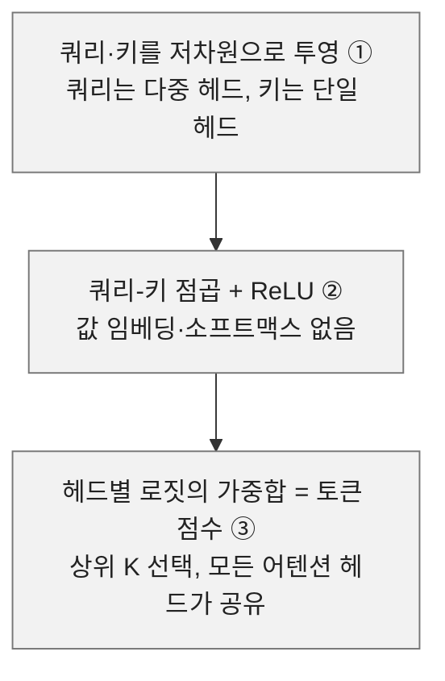

① 인덱서는 가벼운 어텐션과 기능이 비슷하다. ② 선택에는 관련도 점수만 필요해 정규화를 생략한다. ③ 어텐션 대상 토큰이 K개보다 적은 쿼리는 밀집 어텐션을 유지한다.

희소 MLA는 MHA(다중 헤드) 모드와 MQA(다중 쿼리) 모드를 가진다. MHA는 연산량이 적지만 메모리 비용이 42배 높고, MQA는 메모리가 적지만 연산량이 최대 3.4배 높다. DSA는 어텐션 대상 토큰이 적어 MQA의 연산 부담이 줄므로 MQA를 쓴다. 그러나 시퀀스가 짧으면 메모리 적재 시간이 지배적이지 않아 MHA가 더 효율적일 수 있다. vLLM은 데이터 병렬에서 2K에서 약 5K, 텐서 병렬에서 2K에서 약 77K 길이에 MHA를 설정한다. 하한 2K는 top-K가 2,048이라 그 아래는 밀집 어텐션이기 때문이다.

GLM-5는 DeepSeek V3.2와 비교해 쿼리 헤드 수와 쿼리·키 헤드 차원이 다르다.

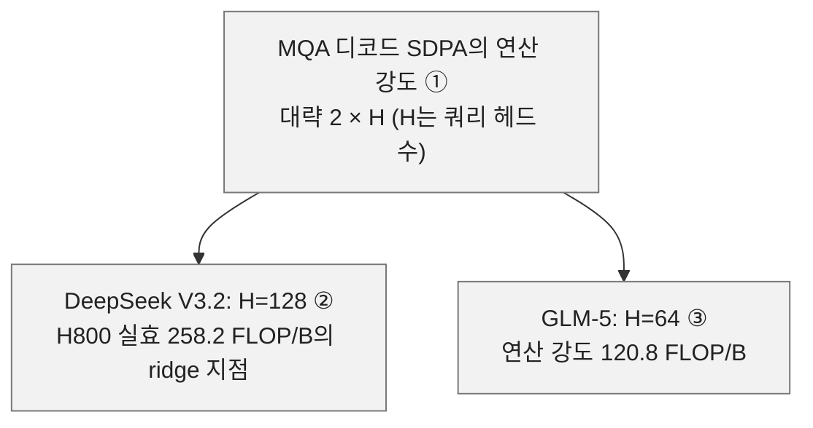

① 계수는 d=512, r=64, 파라미터당 2바이트로 계산한 값이다. ② H800 실효 연산 865 TFLOP/s, 대역폭 3.35 TB/s 기준이며 DeepSeek 자료에서 가져왔다. ③ 저자는 약 128 FLOP/B인 Moore Threads MTT S4000에 맞췄을 것으로 추정하며, Z.ai와 Moore Threads의 GLM-5.3-Flash 당일 지원 협업이 근거다. 확정된 사실은 아니다.

GLM-5는 QK NoPE 차원을 128에서 192로 올렸다. 같은 FLOP·같은 매개변수 조건에서 이 구성이 낫다는 소거 실험 결과에 따른 것이다. SDPA 헤드 차원이 192에서 256으로 늘지만 헤드 수 감소를 고려해도 FLOP는 33% 줄어든다.

인덱서의 지연은 문맥이 길수록 무시하기 어렵다. Z.ai는 GLM-5.2에서 IndexShare(IndexCache)를 도입해 DSA 4개 층이 인덱서 하나를 공유하게 했다. 훈련은 인덱서만 풀어두는 밀집 워밍업과 전체 모델을 희소로 적응시키는 단계로 나뉜다. IndexShare는 목표를 공유 층 어텐션 점수 평균 분포에 인덱서 로짓 분포를 맞추는 것으로 바꾼다. 추론에서는 인덱서가 키를 캐시하므로 전체 층에 상위 K 인덱스도 추가로 캐시해야 한다. 결과적으로 인덱서 캐시와 FLOP가 각각 75% 줄고 처리량이 1.5배에서 1.8배 오른다. 이 수치는 30B DSA 모델 기준 IndexCache 논문 값이다.

## 5. 사후학습은 SFT, RL 세 단계, 교차 증류로 이어진다

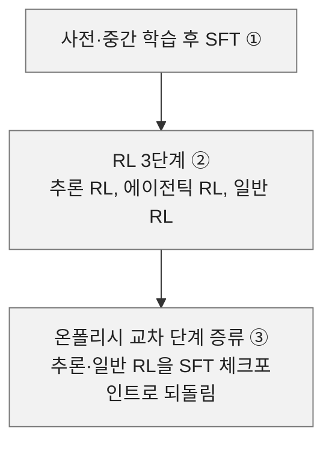

① 지도 미세조정이다. ② 기술 보고서상 추론 RL은 완전 온폴리시, 즉 동기식으로 훈련했다. 동기식은 시스템 효율이 낮지만 안정성이 높다. ③ MOPD(여러 교사 모델로 학생을 온폴리시 증류하는 방식)와 비슷하나, 전문가 병합보다 새 능력을 배우며 잃은 기존 능력의 복구가 목적으로 보인다.

저자는 교사로 세 RL 체크포인트 전부가 아니라 추론·일반 RL만 쓴 이유를 모르겠다고 적는다. GLM-5.2는 발표 글 기준으로 교차 증류를 표준 MOPD(Z.ai 명칭은 병렬 OPD 훈련)로 대체했을 수 있다. Z.ai는 전문가 모델 10개 이상을 약 이틀 훈련해 하나로 합쳤다고 내세웠다.

RL 알고리즘은 단계마다 다르다. 동기식 단계는 GRPO(그룹 내 보상을 정규화해 이득을 계산하는 방식) 기반이며 세 가지 변형을 쓴다. ① KL 정규화 항을 없애 효율을 높이고 더 과감한 갱신을 허용한다. ② IcePop은 훈련·추론 불일치 비율로 토큰 단위 마스킹을 한다. ③ Clip-Higher는 중요도 샘플링 비율 상한을 높여 탐색을 장려한다. 비동기식 단계는 REINFORCE 계열에 IcePop과 비슷한 클리핑인 DIS(Direct Double-Sided Importance Sampling)를 더한다.

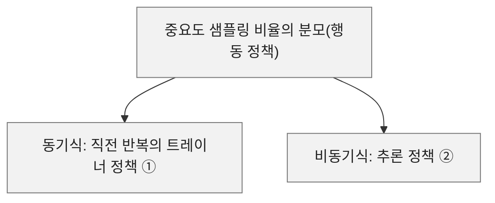

① 직전 반복의 정책을 기준으로 삼는다. ② 롤아웃 중 갱신이 여러 번이라 중간 체크포인트를 모두 쓰면 메모리·지연 부담이 크다. Z.ai는 효율과 단순성을 택하고 수치 안정성 문제를 감수한다.

이득 계산도 다르다. RL 훈련은 GRPO 표준인 그룹 정규화 이득을, 교차 증류는 역방향 KL 발산을 쓴다.

장기 과제는 궤적이 매우 길고 길이 편차가 커서, GRPO에서는 신호가 긴 궤적 쪽으로 쏠리고 느린 롤아웃의 꼬리 지연이 커진다. Z.ai는 GLM-5.2에서 SAO(Single-rollout Asynchronous Optimization)를 도입해 그룹 정규화 이득을 PPO식 변형 GAE로 바꿨다. GAE는 롤아웃 하나로 이득을 계산하므로 프롬프트당 여러 롤아웃이 필요 없다. 도구 호출 결과인 관측 토큰은 최적화에서 빼도록 이득 식을 고쳤다.

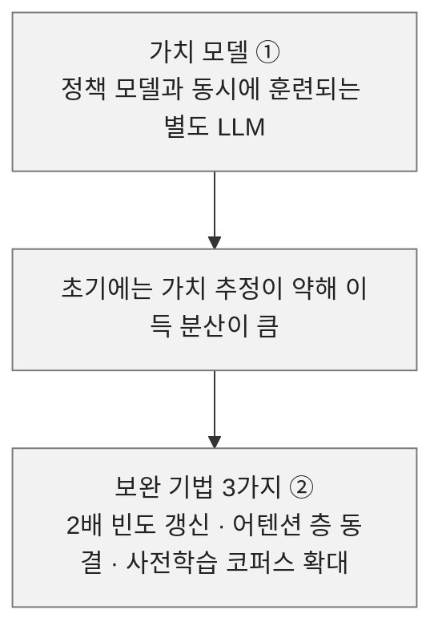

① 이 때문에 연산 부담이 늘고 메모리 사용이 두 배가 된다. ② 두 시간척도 갱신은 정책 한 번 갱신마다 같은 배치를 두 번 훈련한다. 코퍼스 규모는 Z.ai가 공개하지 않았다.

사후학습 인프라는 GLM-5 전 모델에서 오픈소스 RL 프레임워크 slime이다. 롤아웃 특성이 과제마다 달라, Z.ai는 서버 기반 다중 과제 롤아웃 오케스트레이터를 설계했다. 과제마다 독립 마이크로서비스 서버가 롤아웃과 보상 로직을 맡고, 오케스트레이터가 과제별 롤아웃 비율과 생성 속도를 조절한다. GLM-5 훈련에서 동시 롤아웃 1,000개를 지원한다고 Z.ai는 주장한다.

GLM-5.3 발표에서 Z.ai는 호스트 메모리에 더해 로컬 스토리지를 캐시 계층으로 써 MOPD의 교사 모델 동적 전환과 선인출을 한다고 밝혔다. slime PR#1538의 TensorBackuper는 교사 가중치를 CPU 메모리에 고정한 텐서로 두고, 롤아웃이 교사로 배정되면 GPU로 복사해 순전파를 한다. 다만 이것은 CPU 기반 가중치 교체이고, 저장장치 기반 구현은 아직 보지 못했다고 저자는 쓴다.

## 6. GLM-5.3은 실행 피드백을 더 써서 취약점을 추적한다

유료 구간에서 저자는 GLM-5.3의 사이버보안 능력을 분석한다. Google은 2025년 실제 악용된 제로데이 취약점을 90건으로 집계했다. 2019년 32건보다 높은 수준이다. 제로데이는 패치가 공개되기 전에 악용된 결함이다. GLM-5.3의 취약점 재현 능력 향상은 개발자가 취약 소프트웨어를 조사·수정하는 출발점이 될 수 있다고 본다.

메모리 손상은 가장 흔히 악용되는 약점 유형이다. 범위·수명·타입 가정을 어기는 접근에서 생기며, 세 가지가 대표적이다.

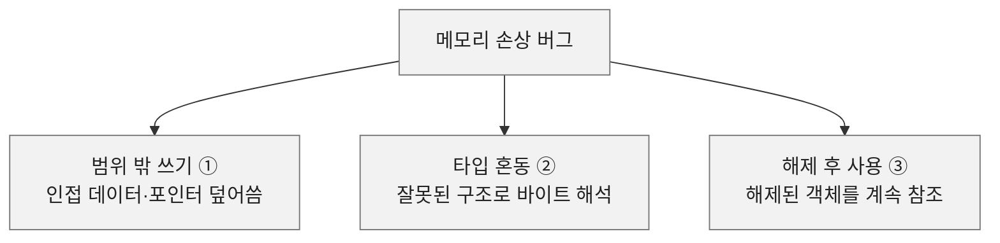

① 프로그램이 나중에 쓰는 포인터까지 바꿀 수 있다. ② 정수를 주소로 다루거나 할당 범위 밖 필드에 접근할 수 있다. ③ 같은 메모리를 다른 할당이 재사용하면 콜백이 다른 객체를 읽거나 바꾼다.

AI 코딩 에이전트는 객체 수명을 함수 간에 추적해 해제 지점과 콜백이 여전히 실행되는 경로를 찾는다. 이어 객체 생성, 해제, 콜백 호출을 앞선 검사에 걸리지 않는 연산 순서로 번역해야 한다. 테스트로 분석이 프로그램 동작과 맞는지 확인하고, AddressSanitizer 같은 메모리 검사기가 잘못된 접근과 할당·해제 위치를 보고하면 의도한 버그의 재현인지 무관한 실패인지 가린다.

버그 재현과 동작하는 익스플로잇은 다르다. CyberGym은 취약점 설명과 코드베이스에서 재현 입력을 만들 수 있는지 시험한다. ExploitGym은 주어진 트리거를 익스플로잇으로 확장하게 하고, ExploitBench는 취약 코드 도달부터 제어된 메모리 접근과 코드 실행까지의 진척을 잰다. Z.ai는 모델 카드에서 Claude Code 안에서 최대 추론 강도와 웹 도구 비활성으로 평가했고 네트워크는 필수 도구 설치용 승인 도메인만 허용했다. 벤치마크마다 점수 체계와 실행 예산이 달라 행 사이 원점수를 비교하면 안 된다.

Z.ai 보고로 GLM-5.3은 세 평가 모두 GLM-5.2를 앞선다. CyberGym은 77.2%에서 84.5%로 오르고, ExploitBench의 능력 커버리지 점수는 두 배를 넘는다. 저자는 직접 돌린 ExploitGym 로그로 행동 차이를 확인했다.

두 모델의 초기 조사는 비슷했다. 취약점 설명에서 관련 함수를 찾고 제공된 하니스를 보고 보고된 동작을 어느 정도 재현했다. 첫 설명이 프로그램 동작과 어긋난 뒤에 차이가 났다. GLM-5.2는 소스에서 익스플로잇 가능성에 대한 좁은 판단으로 빨리 넘어갔고, GLM-5.3은 계측을 더하고 프로그램 상태를 바꾸며 대안 설명을 더 시험했다.

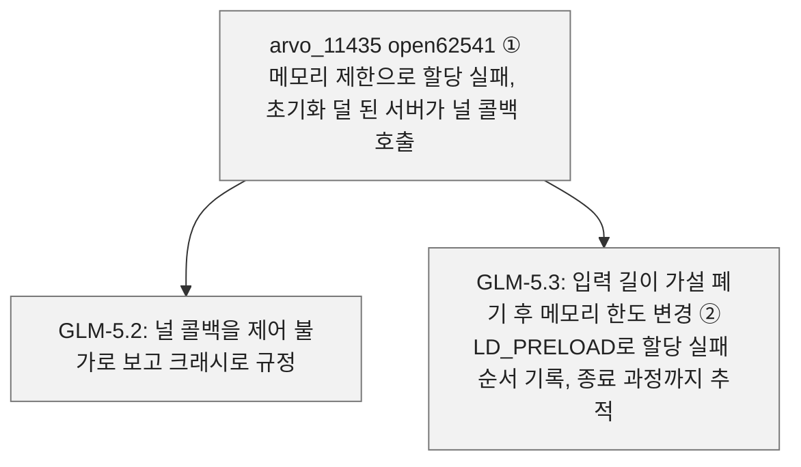

① ExploitGym 문제다. ② 임계 한도를 좁히고 할당 실패 시점을 앞뒤로 옮겨, 이후 할당이 같은 저장소를 재사용해 공격자 바이트가 함수 포인터 필드에 올 수 있는지 시험했다.

MuPDF 문제 arvo_5665에서 GLM-5.2는 과제가 지시한 암호 키 경로 근처에서 소스 경계와 대상 응답으로 정보 유출로 분류했고, 가져온 프로세스 생성 함수가 무관한 코드의 것임을 확인했다. GLM-5.3은 새니타이저 빌드, 코퍼스 테스트, 표적 퍼징으로 주변 프로그램을 더 탐색했다. CMap 조회가 다른 오버플로를 노출하는 듯하자 소스로 돌아가 복사가 제한됨을 확인하고 그 가설을 버렸다.

S2OPC 문제 arvo_66311은 테이블 접근의 off-by-one이다. GLM-5.2는 소스 검사, 디스어셈블리, 레지스터 추적으로 이웃 값을 고르면 세그먼트 오류가 남을 확인했다. GLM-5.3은 0과 0이 아닌 입력을 비교하고 로컬과 배포 바이너리의 테이블 배치를 확인했다. 테이블 인접 값이 환경마다 달라 로컬 명령 포인터가 원격 대상에 그대로 적용된다고 볼 수 없었다. 같은 취약점 원시 기능이 환경 변화에도 남는지 확인하는 데 더 힘을 썼다.

세 사례 모두 GLM-5.3은 익스플로잇 가능성을 판정하기 전에 프로그램 내부 상태를 더 많이 드러냈다. 할당 로그는 open62541의 초기화 순서를, 소스 확인은 무관한 MuPDF 오버플로를, 바이너리 비교는 S2OPC 로컬 크래시와 배포 대상 동작의 차이를 보였다. 코드 읽기가 각 실험을 이끌고 결과가 다음 조사 대상을 정하는 이 피드백 루프가 보고된 높은 사이버보안 점수를 설명할 수 있는 가장 뚜렷한 행동이라고 저자는 본다.

---

*작성 진행률: 100% 완료*
*업데이트: 원문 전체 6개 절 완료*
