# Co-Packaged Optics (CPO) Book – Scaling with Light for the Next Wave of Interconnect

> **출처**: [SemiAnalysis Newsletter](https://newsletter.semianalysis.com/p/co-packaged-optics-cpo-book-scaling)
> **저자**: Dylan Patel, Daniel Nishball, Myron Xie
> **발행일**: 2026-01-01

---

## 📑 목차

### Part 1 - CPO 총소유비용(TCO) 분석
 1. [서론 - CPO가 온다](#1-서론---cpo가-온다)
 2. [AI 클러스터 네트워킹 구성과 TCO 개관](#2-ai-클러스터-네트워킹-구성과-tco-개관)
 3. [CPO Scale-out 전력 예산](#3-cpo-scale-out-전력-예산)
 4. [CPO Scale-out 총소유비용(TCO)](#4-cpo-scale-out-총소유비용tco)
 5. [CPO는 Scale-up의 킬러 애플리케이션 - TAM과 구리 대 광](#5-cpo는-scale-up의-킬러-애플리케이션---tam과-구리-대-광)
 6. [CPO는 언제 주류가 되나 - 메타 신뢰성 데이터](#6-cpo는-언제-주류가-되나---메타-신뢰성-데이터)

### Part 2 - CPO 개념과 구현
 7. [CPO란 무엇인가 - NPO·OBO와 개념](#7-cpo란-무엇인가---npo·obo와-개념)
 8. [공동패키지 구리(CPC)와 CPO가 지금까지 늦었던 이유](#8-공동패키지-구리cpc와-cpo가-지금까지-늦었던-이유)
 9. [DSP 트랜시버에서 LPO로, LPO에서 CPO로](#9-dsp-트랜시버에서-lpo로-lpo에서-cpo로)
10. [왜 CPO인가 - I/O 병목과 SerDes 한계](#10-왜-cpo인가---io-병목과-serdes-한계)
11. [Wide I/O vs SerDes, 링크 신뢰성](#11-wide-io-vs-serdes-링크-신뢰성)

### Part 3 - CPO를 시장에 내놓기
12. [광엔진 제조와 시장 진입 - 호스트·광엔진 패키징](#12-광엔진-제조와-시장-진입---호스트·광엔진-패키징)
13. [TSMC COUPE - 업계 표준 통합 방식으로 부상](#13-tsmc-coupe---업계-표준-통합-방식으로-부상)
14. [FAU와 광섬유 커플링 - 엣지 vs 격자](#14-fau와-광섬유-커플링---엣지-vs-격자)
15. [레이저 타입과 파장분할다중화(WDM)](#15-레이저-타입과-파장분할다중화wdm)
16. [변조기 종류 - MZM·MRM·EAM](#16-변조기-종류---mzm·mrm·eam)
17. [광엔진 로드맵과 대역폭 확장 방법](#17-광엔진-로드맵과-대역폭-확장-방법)
18. [CPO 도입 속도와 표준화·서비스성 과제](#18-cpo-도입-속도와-표준화·서비스성-과제)

### Part 4 - 오늘과 내일의 CPO 제품
19. [엔비디아 CPO - Quantum-X와 Spectrum-X Photonics](#19-엔비디아-cpo---quantum-x와-spectrum-x-photonics)
20. [브로드컴 CPO 스위치 포트폴리오](#20-브로드컴-cpo-스위치-포트폴리오)
21. [인텔 CPO 로드맵과 미디어텍 CPO 계획](#21-인텔-cpo-로드맵과-미디어텍-cpo-계획)
22. [CPO 전문기업 ① - Ayar Labs·Nubis·Celestial AI](#22-cpo-전문기업-①---ayar-labs·nubis·celestial-ai)
23. [CPO 전문기업 ② - Lightmatter·Xscape·Ranovus·Scintil](#23-cpo-전문기업-②---lightmatter·xscape·ranovus·scintil)

### Part 5 - 엔비디아의 CPO 공급망
24. [엔비디아 CPO 공급망 전체 지도](#24-엔비디아-cpo-공급망-전체-지도)

---

## 🔑 용어 정리

본문을 순서대로 읽기 전에 알아두면 좋은 용어들입니다. 자세한 수치와 설명은 본문에서 처음 등장하는 위치에 나옵니다.

- **CPO(Co-Packaged Optics, 공동패키지 광학)**: 빛을 전기 신호로 바꾸는 광엔진을 GPU·스위치 칩과 같은 패키지 안에 붙여, 신호가 칩에서 패키지 밖 커넥터까지 이동하는 거리를 수십 cm에서 수 mm로 줄이는 방식
- **Scale-up vs Scale-out**: Scale-up은 한 대의 컴퓨터 안(또는 같은 랙 안)에서 GPU끼리 초고속으로 직접 연결하는 것(엔비디아 NVLink 등), Scale-out은 서버(랙)와 서버를 스위치로 묶어 클러스터 전체를 연결하는 것 — 이 글의 핵심 결론 중 하나는 CPO가 Scale-out보다 Scale-up에서 훨씬 더 절실하다는 것
- **DSP 트랜시버·LPO(Linear Pluggable Optics)**: DSP 트랜시버는 전기 신호를 광신호로 바꾸기 전에 신호를 다시 다듬어주는 칩(DSP)을 거치는 기존 방식의 광모듈, LPO는 이 DSP 칩을 없애고 스위치의 SerDes가 광신호 소자를 직접 구동하게 만든 절충안
- **SerDes(Serializer/Deserializer, 직렬화·역직렬화 회로)**: 여러 비트의 데이터를 한 줄의 고속 신호로 압축해 보내고 받는 쪽에서 다시 풀어내는 회로 — 데이터가 칩 밖으로 나가는 통로(I/O)의 속도를 좌우
- **TSMC COUPE(Compact Universal Photonic Engine)**: TSMC가 만든 광엔진 전용 제조·패키징 플랫폼 — 빛을 다루는 칩(PIC)과 전기 신호를 다루는 칩(EIC)을 만들고 붙이는 전 과정을 표준화
- **FAU(Fiber Attach Unit, 광섬유 부착 유닛)**: 광엔진에서 나오는 빛을 실제 광섬유 가닥에 정확히 맞춰 연결해주는 부품 — CPO 제조에서 가장 손이 많이 가고 까다로운 공정
- **WDM(Wavelength Division Multiplexing, 파장분할다중화)**: 서로 다른 색(파장)의 빛 여러 개를 광섬유 한 가닥에 동시에 실어 보내 전송 용량을 늘리는 기법
- **변조기(Modulator) - MZM·MRM·EAM**: 전기 신호를 빛에 새겨 넣는 부품 3종 — MZM(마흐-젠더 변조기)은 크지만 다루기 쉽고, MRM(마이크로링 변조기)은 작지만 온도에 예민하며, EAM(전기흡수 변조기)은 크기와 온도 안정성의 중간 지점

---

## 1. 서론 - CPO가 온다

**📌 핵심:**
- CPO(Co-Packaged Optics, 공동패키지 광학)는 데이터센터 연결 방식을 바꾸겠다고 오래 약속해왔지만 실제 배치 가능한 제품은 2025년에야 나옴 — 그동안은 플러그형 광모듈(트랜시버)이 저렴하고 익숙하고 표준 호환이라는 이유로 기본값 자리를 지킴
- AI 네트워킹의 대역폭 로드맵은 속도·거리·밀도·신뢰성 요구가 곧 트랜시버의 한계를 넘어설 전망 — 특히 Scale-up(랙 안에서 GPU끼리 초고속 직접 연결)에서 CPO가 사실상 핵심 기술로 떠오름
- 오늘날 구리 기반 Scale-up(엔비디아 NVLink)은 GPU당 7.2Tbit/s(차세대 루빈에서 14.4Tbit/s)를 내지만 구리선은 최대 2m까지만 도달해 Scale-up 규모가 랙 1\~2개로 묶임 — CPO는 이 거리 제약을 없애 같은 대역폭 밀도를 유지하면서 더 큰 Scale-up 규모를 열어줌
- 결론: 하이퍼스케일러들은 이미 Scale-up CPO 공급업체와 계약을 맺기 시작 — 셀레스티얼 AI는 2028년 말까지 연 10억 달러 매출 규모를 예상하며 주로 아마존 Trainium 4에 실릴 CPO Scale-up 솔루션이 견인할 것으로 전망. CPO를 둘러싼 질문은 이제 "왜"가 아니라 "언제, 어떻게"

---

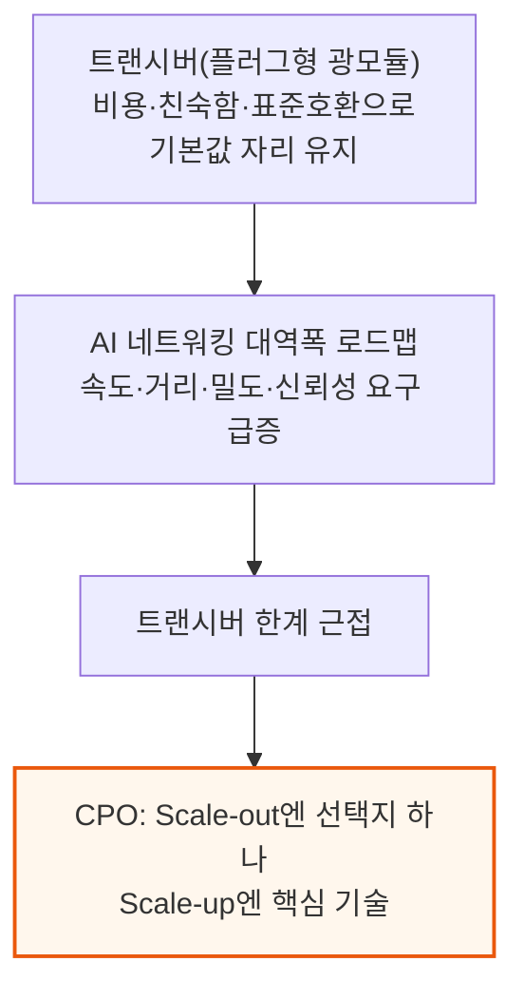
```mermaid
flowchart TD
    A["트랜시버(플러그형 광모듈)<br/>비용·친숙함·표준호환으로<br/>기본값 자리 유지"] --> B["AI 네트워킹 대역폭 로드맵<br/>속도·거리·밀도·신뢰성 요구 급증"]
    B --> C["트랜시버 한계 근접"]
    C --> D["CPO: Scale-out엔 선택지 하나<br/>Scale-up엔 핵심 기술"]

    style D fill:#fff7ed,stroke:#ea580c,stroke-width:2px
```

기존 방식은 스위치·GPU 칩에서 나온 전기 신호가 섀시 앞판의 트랜시버 케이지까지 15\~30cm를 구리선(LR SerDes)으로 이동한 뒤, 트랜시버 안의 DSP(Digital Signal Processor, 신호를 다시 다듬어주는 칩)가 신호를 복원·정리하고 나서야 광신호로 바뀝니다.
CPO는 광엔진을 XPU(가속기 칩)나 스위치 ASIC 바로 옆에 붙여 이 DSP를 아예 없애고, 저전력 SerDes만 쓰게 만듭니다.

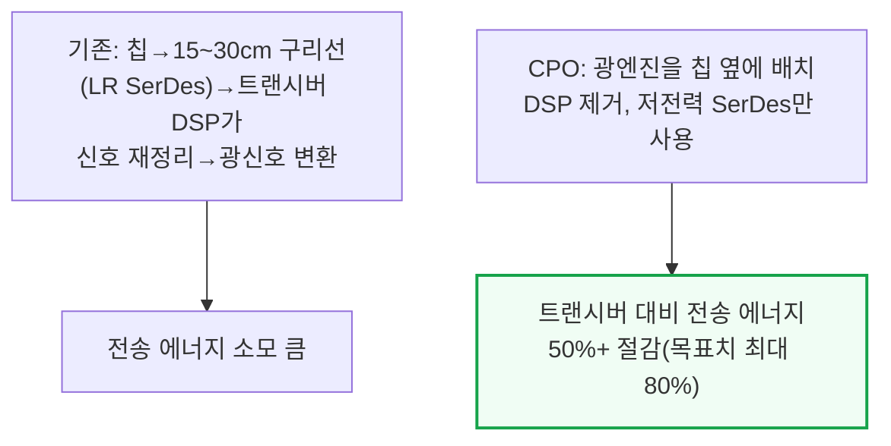
```mermaid
flowchart TD
    Old["기존: 칩→15~30cm 구리선<br/>(LR SerDes)→트랜시버 DSP가<br/>신호 재정리→광신호 변환"] --> P1["전송 에너지 소모 큼"]
    New["CPO: 광엔진을 칩 옆에 배치<br/>DSP 제거, 저전력 SerDes만 사용"] --> P2["트랜시버 대비 전송 에너지<br/>50%+ 절감(목표치 최대 80%)"]

    style P2 fill:#f0fdf4,stroke:#16a34a,stroke-width:2px
```

이 글은 5부로 구성됩니다.

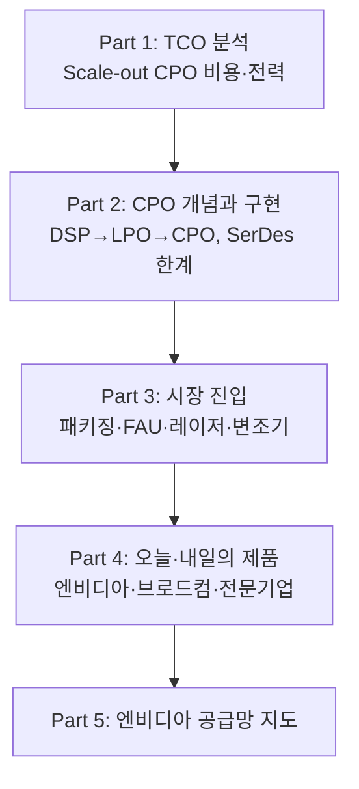
```mermaid
flowchart TD
    Pt1["Part 1: TCO 분석<br/>Scale-out CPO 비용·전력"] --> Pt2["Part 2: CPO 개념과 구현<br/>DSP→LPO→CPO, SerDes 한계"]
    Pt2 --> Pt3["Part 3: 시장 진입<br/>패키징·FAU·레이저·변조기"]
    Pt3 --> Pt4["Part 4: 오늘·내일의 제품<br/>엔비디아·브로드컴·전문기업"]
    Pt4 --> Pt5["Part 5: 엔비디아 공급망 지도"]
```

---

## 2. AI 클러스터 네트워킹 구성과 TCO 개관

**📌 핵심:**
- 대형 AI 클러스터의 네트워킹은 백엔드망(GPU끼리 학습·추론 데이터를 주고받는 통신망)·프론트엔드망·아웃오브밴드 관리망 3층 구조 — 요구조건이 가장 까다로운 백엔드망이 GB300 NVL72 3층 InfiniBand 클러스터 기준 네트워킹 비용의 85%, 네트워킹 전력의 86%를 차지
- 네트워킹 비용은 AI 서버 다음으로 클러스터 총비용에서 두 번째로 큰 항목 — GB300 NVL72 3층망에서 클러스터 총비용의 15%(4층망은 18%)를 차지하고, 이 중 광트랜시버가 네트워킹 비용의 60%(엔비디아 LinkX 트랜시버 기준), 네트워킹 전력의 45%를 잡아먹음
- GPU 수가 늘수록 더 많은 네트워킹 계층(2층→3층→4층)이 필요해져 비용·전력 부담이 커짐 — CPO는 계층 수를 그대로 두고도 비용·전력을 낮출 수 있고, 같은 계층 수로 더 많은 GPU를 연결해 총비용·전력을 더 크게 낮출 수도 있음
- 결론: 이 글은 CPO 배치가 당장 집중될 백엔드망(back-end fabric)에 초점을 맞춤

---

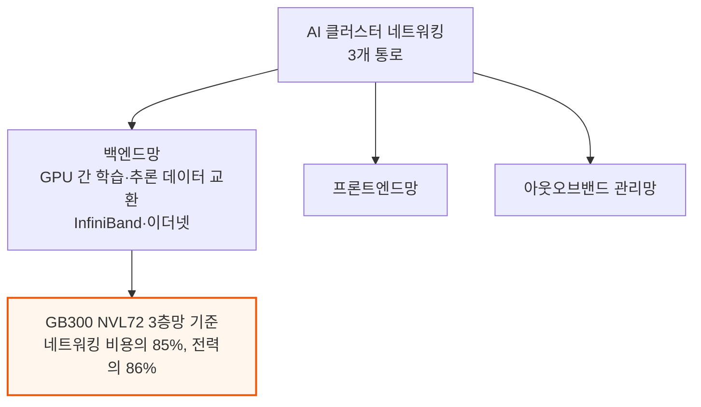
```mermaid
flowchart TD
    F["AI 클러스터 네트워킹<br/>3개 통로"] --> BE["백엔드망<br/>GPU 간 학습·추론 데이터 교환<br/>InfiniBand·이더넷"]
    F --> FE["프론트엔드망"]
    F --> OOB["아웃오브밴드 관리망"]
    BE --> Share["GB300 NVL72 3층망 기준<br/>네트워킹 비용의 85%, 전력의 86%"]

    style Share fill:#fff7ed,stroke:#ea580c,stroke-width:2px
```

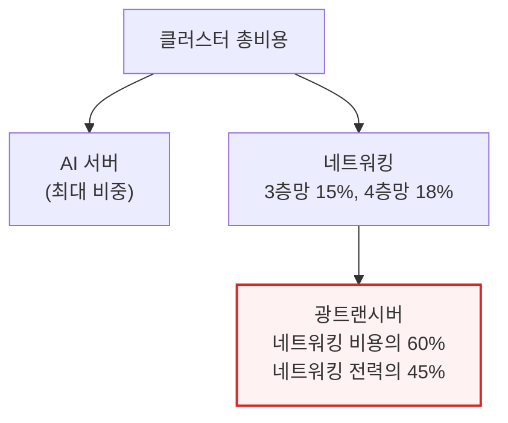
```mermaid
flowchart TD
    Cluster["클러스터 총비용"] --> Server["AI 서버<br/>(최대 비중)"]
    Cluster --> Net["네트워킹<br/>3층망 15%, 4층망 18%"]
    Net --> Trans["광트랜시버<br/>네트워킹 비용의 60%<br/>네트워킹 전력의 45%"]

    style Trans fill:#fef2f2,stroke:#dc2626,stroke-width:2px
```

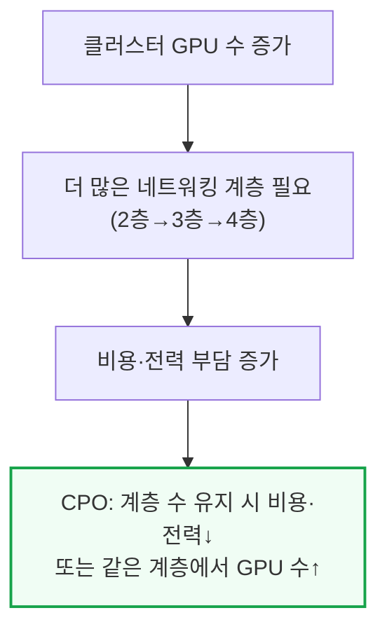
```mermaid
flowchart TD
    MoreGPU["클러스터 GPU 수 증가"] --> MoreLayer["더 많은 네트워킹 계층 필요<br/>(2층→3층→4층)"]
    MoreLayer --> CostUp["비용·전력 부담 증가"]
    CostUp --> CPOHelp["CPO: 계층 수 유지 시 비용·전력↓<br/>또는 같은 계층에서 GPU 수↑"]

    style CPOHelp fill:#f0fdf4,stroke:#16a34a,stroke-width:2px
```

---

## 3. CPO Scale-out 전력 예산

**📌 핵심:**
- 20만 대 GB300 NVL72(랙당 GPU 패키지 72개·컴퓨트 칩렛 144개) 클러스터를 3층망으로 구성하면 핵심 IT 전력 435MW가 필요한데 이 중 17MW를 광트랜시버 혼자 소모 — 트랜시버를 없애면 아낄 수 있는 전력이 상당함
- 트랜시버 1개(800G DSP 방식)의 소비전력은 16\~17W인데, CPO의 광엔진+외부 레이저 소스는 800G당 4\~5W(엔비디아 Q3450 CPO 스위치 기준)로 73% 낮음 — 메타가 ECOC 2025에서 발표한 실측치도 비슷한 폭(트랜시버 15W vs 브로드컴 Bailly CPO 스위치 5.4W, 65% 절감)
- 클러스터 전체로 보면 DSP에서 LPO(DSP를 없앤 절충형 광모듈)로만 바꿔도 트랜시버 전력 36%·네트워킹 전력 16% 감소, CPO로 완전히 전환하면 트랜시버 전력은 84% 줄지만 새로 늘어난 광엔진·레이저가 스위치 전력을 23% 늘림(그래도 순감소는 유지)
- 결론: 그런데 네트워킹은 애초에 클러스터 총전력의 9%에 불과 — 3층망에서 CPO로 네트워킹 전력을 23% 줄여도 클러스터 총전력은 2%만 줄고, 2층망으로 평탄화(계층을 하나 줄이는 것)해도 총전력 절감은 4%에 그침

---

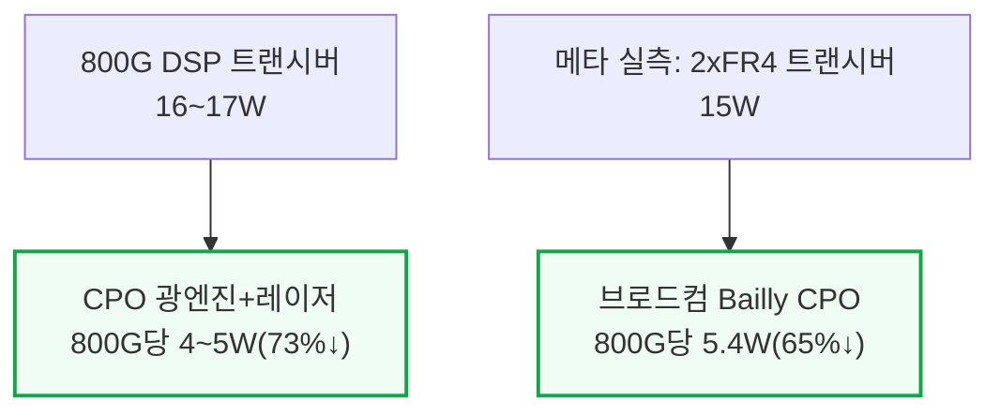
```mermaid
flowchart TD
    DSP["800G DSP 트랜시버<br/>16~17W"] --> Gap["CPO 광엔진+레이저<br/>800G당 4~5W(73%↓)"]
    Meta1["메타 실측: 2xFR4 트랜시버 15W"] --> Meta2["브로드컴 Bailly CPO<br/>800G당 5.4W(65%↓)"]

    style Gap fill:#f0fdf4,stroke:#16a34a,stroke-width:2px
    style Meta2 fill:#f0fdf4,stroke:#16a34a,stroke-width:2px
```

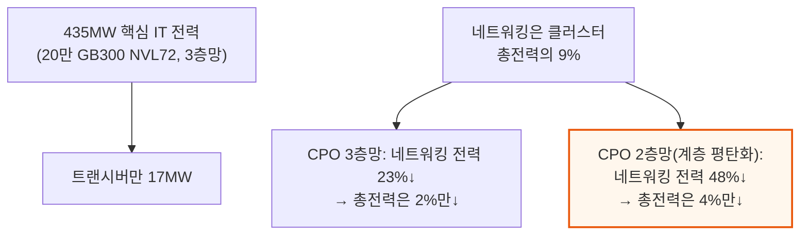
```mermaid
flowchart TD
    Total["435MW 핵심 IT 전력<br/>(20만 GB300 NVL72, 3층망)"] --> TransP["트랜시버만 17MW"]
    NetShare["네트워킹은 클러스터<br/>총전력의 9%"] --> CPO3["CPO 3층망: 네트워킹 전력 23%↓<br/>→ 총전력은 2%만↓"]
    NetShare --> CPO2["CPO 2층망(계층 평탄화):<br/>네트워킹 전력 48%↓<br/>→ 총전력은 4%만↓"]

    style CPO2 fill:#fff7ed,stroke:#ea580c,stroke-width:2px
```

고radix(포트 수가 많은) 스위치를 쓰면 셔플(신호를 여러 목적지로 흩뿌리는 작업)이 스위치 박스 안에서 처리돼, 겉으로는 포트 수가 매우 많은 스위치 하나로 보입니다. 이 덕분에 3층망을 2층망으로 평탄화할 수 있습니다.

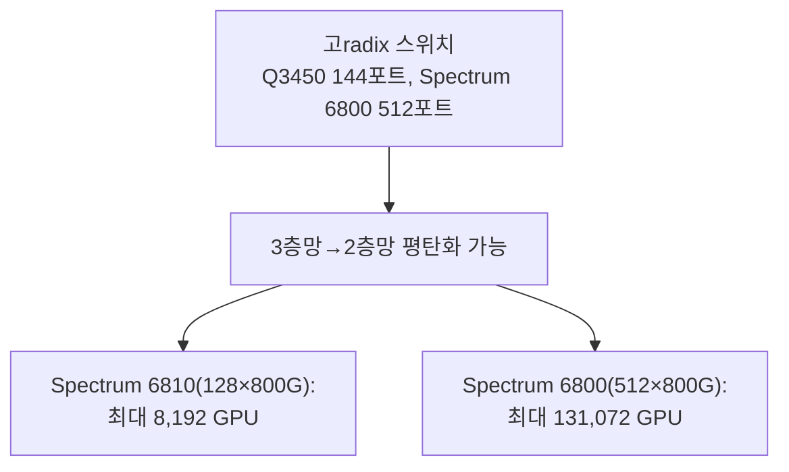
```mermaid
flowchart TD
    HighRadix["고radix 스위치<br/>Q3450 144포트, Spectrum 6800 512포트"] --> Flatten["3층망→2층망 평탄화 가능"]
    Flatten --> Cap1["Spectrum 6810(128×800G):<br/>최대 8,192 GPU"]
    Flatten --> Cap2["Spectrum 6800(512×800G):<br/>최대 131,072 GPU"]
```

---

## 4. CPO Scale-out 총소유비용(TCO)

**📌 핵심:**
- 엔비디아 Q3450 CPO 스위치의 광엔진 원가는 시스템당 약 $35\~40k(FAU 포함) — 같은 대역폭을 트랜시버로 채우면 원가 $72k로 오히려 광엔진보다 2배 비쌈
- 하지만 여기에 스위치 벤더의 60% 매출총이익률(마진)을 적용하면 광엔진 원가는 $80\~90k까지 뛰어 트랜시버 원가($72k)보다 오히려 비싸질 수 있음 — 소수 스위치 벤더가 마진을 얹는 CPO 구조가 다수 트랜시버 벤더 간 가격 경쟁이 있던 기존 구조의 이점을 상쇄
- 3층망 기준 CPO 전환 시 트랜시버를 안 사는 덕에 86% 절감되지만 마진이 실린 스위치 비용이 81% 늘어나 상쇄 — 결국 네트워킹 총비용은 31% 낮아지지만 클러스터 총비용은 3%만 낮아짐. 2층망으로 평탄화하면 클러스터 총비용 절감폭이 7%까지 커짐
- 결론: CPO Scale-out은 비용 최대 7%↓·전력 최대 4%↓ 효과뿐인데, 현장 정비 어려움·신뢰성 불안·소수 벤더 종속(협상력 상실)까지 감안하면 단기간 급속한 채택은 기대하기 어려움 — 실제로 하이퍼스케일러 사이에서 빠르게 퍼지고 있지도 않음

---

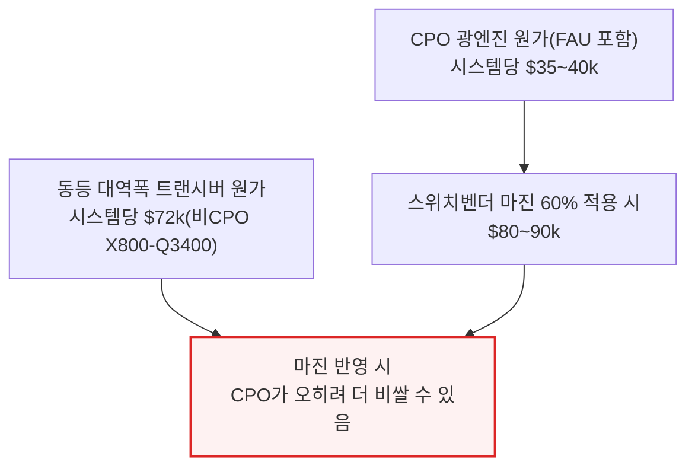
```mermaid
flowchart TD
    OE["CPO 광엔진 원가(FAU 포함)<br/>시스템당 $35~40k"] --> Margin["스위치벤더 마진 60% 적용 시<br/>$80~90k"]
    Trans["동등 대역폭 트랜시버 원가<br/>시스템당 $72k(비CPO X800-Q3400)"] --> Compare["마진 반영 시<br/>CPO가 오히려 더 비쌀 수 있음"]
    Margin --> Compare

    style Compare fill:#fef2f2,stroke:#dc2626,stroke-width:2px
```

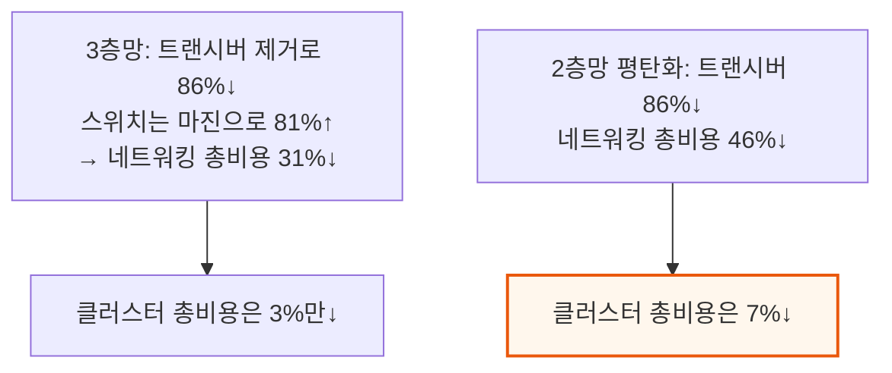
```mermaid
flowchart TD
    L3["3층망: 트랜시버 제거로 86%↓<br/>스위치는 마진으로 81%↑<br/>→ 네트워킹 총비용 31%↓"] --> ClusterL3["클러스터 총비용은 3%만↓"]
    L2["2층망 평탄화: 트랜시버 86%↓<br/>네트워킹 총비용 46%↓"] --> ClusterL2["클러스터 총비용은 7%↓"]

    style ClusterL2 fill:#fff7ed,stroke:#ea580c,stroke-width:2px
```

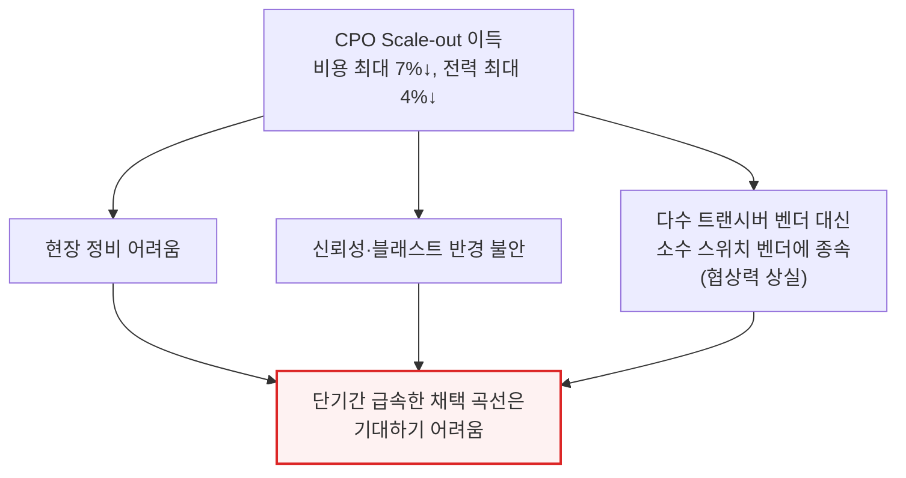
```mermaid
flowchart TD
    Savings["CPO Scale-out 이득<br/>비용 최대 7%↓, 전력 최대 4%↓"] --> Barrier1["현장 정비 어려움"]
    Savings --> Barrier2["신뢰성·블래스트 반경 불안"]
    Savings --> Barrier3["다수 트랜시버 벤더 대신<br/>소수 스위치 벤더에 종속<br/>(협상력 상실)"]
    Barrier1 --> Result["단기간 급속한 채택 곡선은<br/>기대하기 어려움"]
    Barrier2 --> Result
    Barrier3 --> Result

    style Result fill:#fef2f2,stroke:#dc2626,stroke-width:2px
```

---

## 5. CPO는 Scale-up의 킬러 애플리케이션 - TAM과 구리 대 광

**📌 핵심:**
- 구리 케이블은 200Gbit/s 레인 기준 최대 2m까지만 도달 — Scale-up "월드 사이즈"(하나의 Scale-up 영역 안에 묶을 수 있는 GPU 수)가 랙 1\~2개로 제한됨. CPO는 이 거리 제약을 없애 이론상 얼마든지 큰 Scale-up 영역을 만들 수 있게 함
- 엔비디아 GB200은 all-to-all(모든 GPU가 서로 직접 연결)로 묶는 GPU 수를 8개에서 72개로 늘려 큰 성능 도약을 이뤘고, 루빈 울트라용 Kyber 랙은 144개 GPU 패키지(576개 다이)까지 밀도를 끌어올림(GB200/300 NVL72 대비 4배) — 구리로 이 밀도를 유지하려니 전력·냉각·제조 난이도가 극한까지 치솟음
- Scale-up 인터커넥트의 대역폭 요구는 Scale-out보다 훨씬 큼 — 블랙웰의 NVLink 5는 GPU당 7,200Gbit/s(단방향)로, 백엔드 Scale-out(CX-8 NIC 기준 800Gbit/s)의 9배. 이 때문에 CPO 시장 규모(TAM)는 이미 Scale-out보다 Scale-up 쪽이 훨씬 큼
- 결론: 구리 레인당 대역폭을 늘리는 것도 점점 어려워짐(루빈은 양방향 SerDes로 224Gbit/s 송신+224Gbit/s 수신을 합쳐 2배 확장하지만, 진짜 단방향 448G는 시기가 불확실) — 반면 CPO는 보율(Baud rate)·파장분할다중화(DWDM)·광섬유쌍 추가·변조 방식이라는 여러 벡터를 동시에 조합해 계속 확장 가능

---

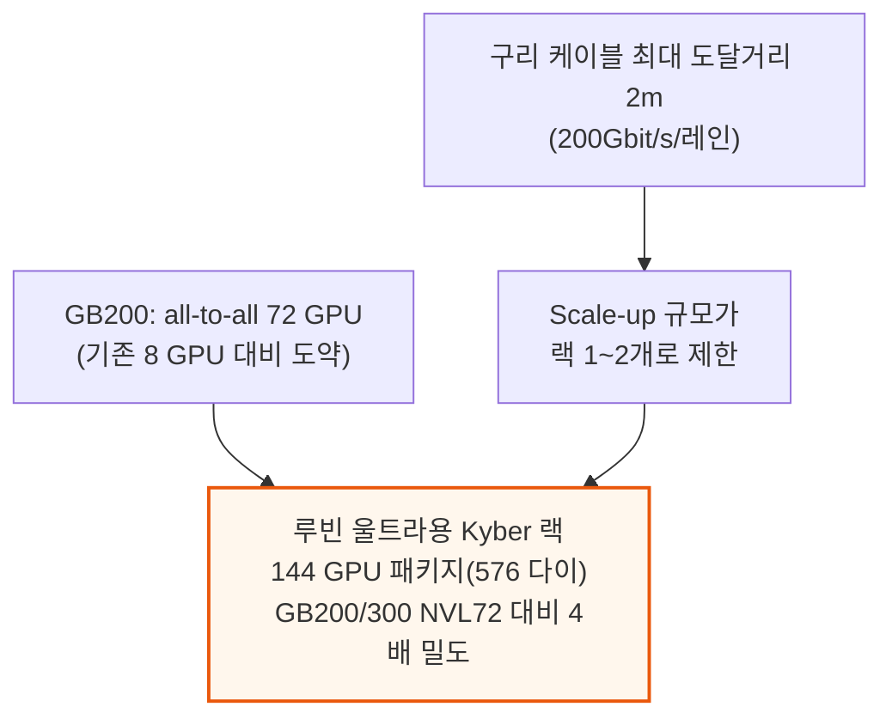
```mermaid
flowchart TD
    CuLimit["구리 케이블 최대 도달거리 2m<br/>(200Gbit/s/레인)"] --> WorldSize["Scale-up 규모가<br/>랙 1~2개로 제한"]
    GB200["GB200: all-to-all 72 GPU<br/>(기존 8 GPU 대비 도약)"] --> Kyber["루빈 울트라용 Kyber 랙<br/>144 GPU 패키지(576 다이)<br/>GB200/300 NVL72 대비 4배 밀도"]
    WorldSize --> Kyber

    style Kyber fill:#fff7ed,stroke:#ea580c,stroke-width:2px
```

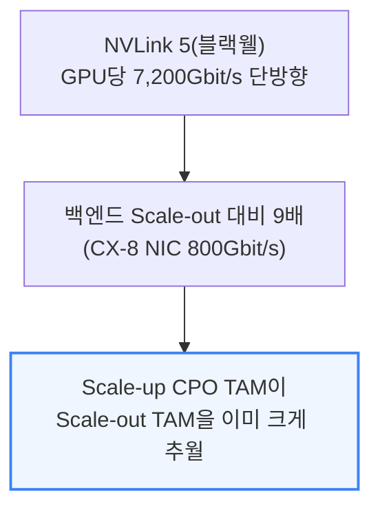
```mermaid
flowchart TD
    NVLink["NVLink 5(블랙웰)<br/>GPU당 7,200Gbit/s 단방향"] --> Ratio["백엔드 Scale-out 대비 9배<br/>(CX-8 NIC 800Gbit/s)"]
    Ratio --> TAMgrow["Scale-up CPO TAM이<br/>Scale-out TAM을 이미 크게 추월"]

    style TAMgrow fill:#eff6ff,stroke:#3b82f6,stroke-width:2px
```

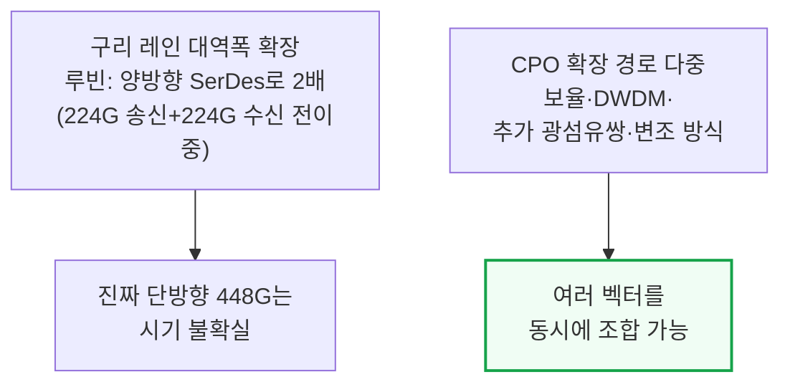
```mermaid
flowchart TD
    Copper["구리 레인 대역폭 확장<br/>루빈: 양방향 SerDes로 2배<br/>(224G 송신+224G 수신 전이중)"] --> Limit["진짜 단방향 448G는<br/>시기 불확실"]
    CPO["CPO 확장 경로 다중<br/>보율·DWDM·<br/>추가 광섬유쌍·변조 방식"] --> Flexible["여러 벡터를<br/>동시에 조합 가능"]

    style Flexible fill:#f0fdf4,stroke:#16a34a,stroke-width:2px
```

---

## 6. CPO는 언제 주류가 되나 - 메타 신뢰성 데이터

**📌 핵심:**
- 엔비디아가 루빈 울트라(Scale-up)가 아니라 Scale-out 스위치에서만 먼저 CPO를 내놓는 이유는 공급망 미성숙·제조 난이도·고객 불안 때문 — Quantum·Spectrum CPO 스위치는 공급망을 단련시키고 실제 신뢰성·정비성 데이터를 쌓는 예행연습 역할
- 메타가 브로드컴과 함께 ECOC 2025에서 발표한 실측 데이터가 힌트를 줌 — Bailly 51.2T CPO 스위치 15대로 104.9만 개(400G 포트 기준) 시간까지 장애·정정불가 오류(UCW) 0건, 15M 포트시간까지 확장한 데이터에서도 첫 400만 포트시간 동안 UCW 0건, 평균고장간격(MTBF)은 트랜시버(2xFR4) 50\~100만 시간 대비 CPO가 260만 시간으로 더 김
- 다만 15M 포트시간은 51.2T 스위치 15대를 약 325일(7,812시간) 돌린 것에 불과 — 저자들은 실험실 조건과 실제 데이터센터의 온도 변동(메타 Llama 3 논문은 1\~2% 온도 변동이 전력 소비에 영향을 준다고 보고), 먼지 등 변수가 다르다는 점을 지적. CPO의 미검출 장애율은 0.06%로 낮아 보이지만 장애 하나의 블래스트 반경(영향 범위)이 800G 포트 64개에 달함
- 결론: 이 데이터는 공포 조장이 아니라 더 큰 규모의 현장 실측이 필요하다는 근거 — 루빈 울트라의 Scale-out CPO는 2027년(실제로는 2027년 말로 예상)을 목표로 하지만 공급망이 수천만 개의 CPO 엔드포인트를 대지 못할 전망이라, 진짜 전환점은 그다음 세대인 파인만(Feynman)이 될 것으로 봄

---

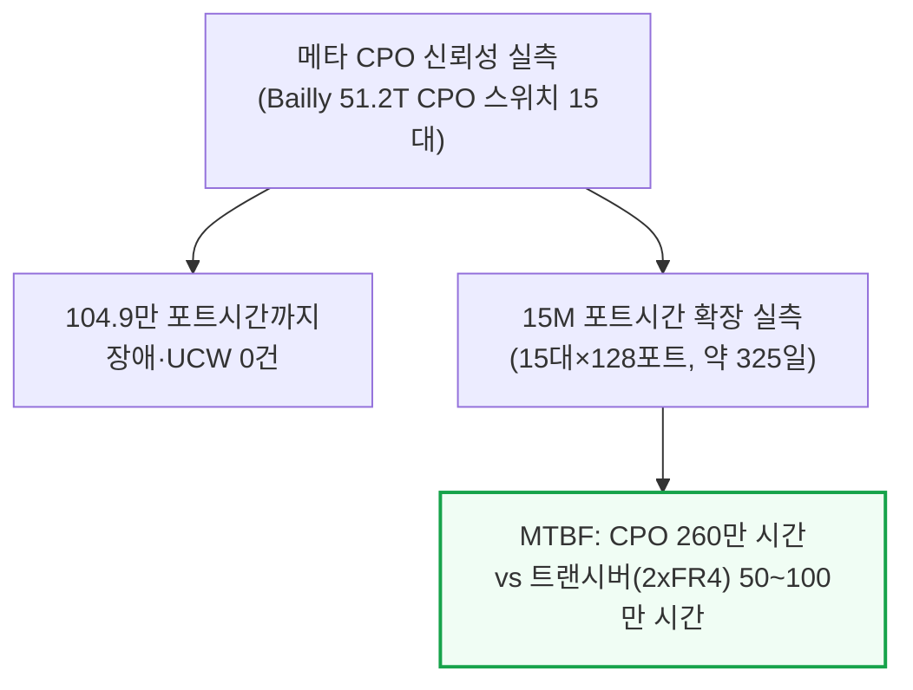
```mermaid
flowchart TD
    Test["메타 CPO 신뢰성 실측<br/>(Bailly 51.2T CPO 스위치 15대)"] --> P1["104.9만 포트시간까지<br/>장애·UCW 0건"]
    Test --> P2["15M 포트시간 확장 실측<br/>(15대×128포트, 약 325일)"]
    P2 --> P3["MTBF: CPO 260만 시간<br/>vs 트랜시버(2xFR4) 50~100만 시간"]

    style P3 fill:#f0fdf4,stroke:#16a34a,stroke-width:2px
```

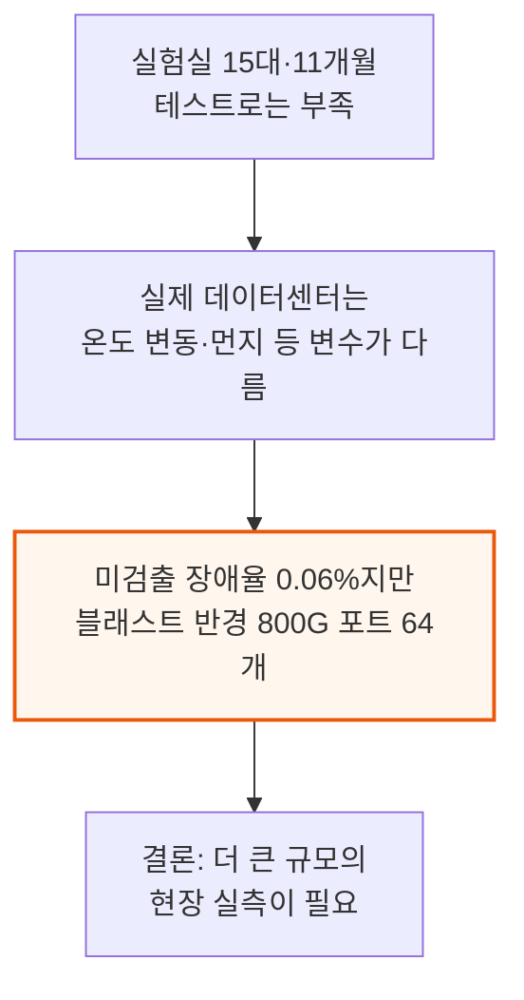
```mermaid
flowchart TD
    Lab["실험실 15대·11개월<br/>테스트로는 부족"] --> Prod["실제 데이터센터는<br/>온도 변동·먼지 등 변수가 다름"]
    Prod --> Dust["미검출 장애율 0.06%지만<br/>블래스트 반경 800G 포트 64개"]
    Dust --> Call["결론: 더 큰 규모의<br/>현장 실측이 필요"]

    style Dust fill:#fff7ed,stroke:#ea580c,stroke-width:2px
```

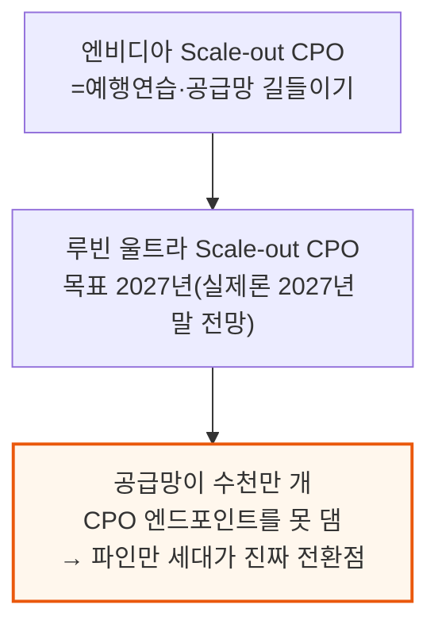
```mermaid
flowchart TD
    Now["엔비디아 Scale-out CPO<br/>=예행연습·공급망 길들이기"] --> Rubin["루빈 울트라 Scale-out CPO<br/>목표 2027년(실제론 2027년 말 전망)"]
    Rubin --> Feynman["공급망이 수천만 개<br/>CPO 엔드포인트를 못 댐<br/>→ 파인만 세대가 진짜 전환점"]

    style Feynman fill:#fff7ed,stroke:#ea580c,stroke-width:2px
```

---

## 7. CPO란 무엇인가 - NPO·OBO와 개념

**📌 핵심:**
- CPO는 빛을 전기 신호로 바꾸는 광엔진을 GPU·스위치 ASIC과 같은 패키지 안에 직접 붙이는 방식 — 신호가 몇 m 이상 이동해야 하면 구리로는 전달이 안 되기 때문에 결국 광신호로 바꿔야 하는데, 그 변환 지점을 최대한 칩 가까이로 당기는 것이 핵심
- 기존 방식은 스위치·칩에서 나온 전기 신호가 PCB를 거쳐 섀시 앞판·뒷판의 트랜시버 케이지까지 수십 cm 이상 이동한 뒤, 트랜시버 안의 DSP가 신호를 복원하고 나서야 광신호로 바뀜 — 이 과정에서 신호가 열화돼 이를 구동·복원하는 데 많은 전력과 회로가 필요
- CPO는 광엔진을 호스트 칩 바로 옆(처음엔 기판, 향후엔 인터포저)에 둬 전기 배선 거리를 수십 cm에서 수 mm로 줄임 — 전력 소모를 크게 낮추고 대역폭 밀도를 높이며 신호 열화 문제를 줄여 지연시간도 낮춤
- 결론: CPO와 기존 트랜시버 사이에는 두 가지 중간 단계가 있음 — NPO(광엔진이 별도 기판에 탈착 가능하게 붙는 방식)와 OBO(광엔진을 섀시 내부 시스템 PCB에 두는 방식). OBO는 CPO의 복잡성과 트랜시버의 한계를 동시에 물려받아 "최악의 조합"으로 평가됨

---

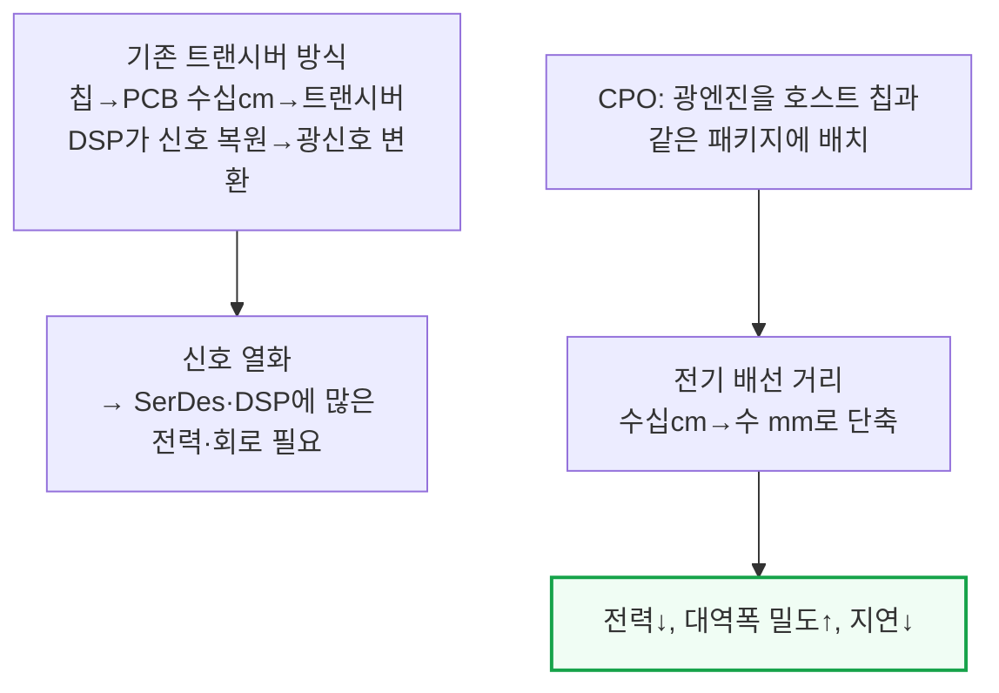
```mermaid
flowchart TD
    Old["기존 트랜시버 방식<br/>칩→PCB 수십cm→트랜시버<br/>DSP가 신호 복원→광신호 변환"] --> Deg["신호 열화<br/>→ SerDes·DSP에 많은<br/>전력·회로 필요"]
    New["CPO: 광엔진을 호스트 칩과<br/>같은 패키지에 배치"] --> Short["전기 배선 거리<br/>수십cm→수 mm로 단축"]
    Short --> Benefit["전력↓, 대역폭 밀도↑, 지연↓"]

    style Benefit fill:#f0fdf4,stroke:#16a34a,stroke-width:2px
```

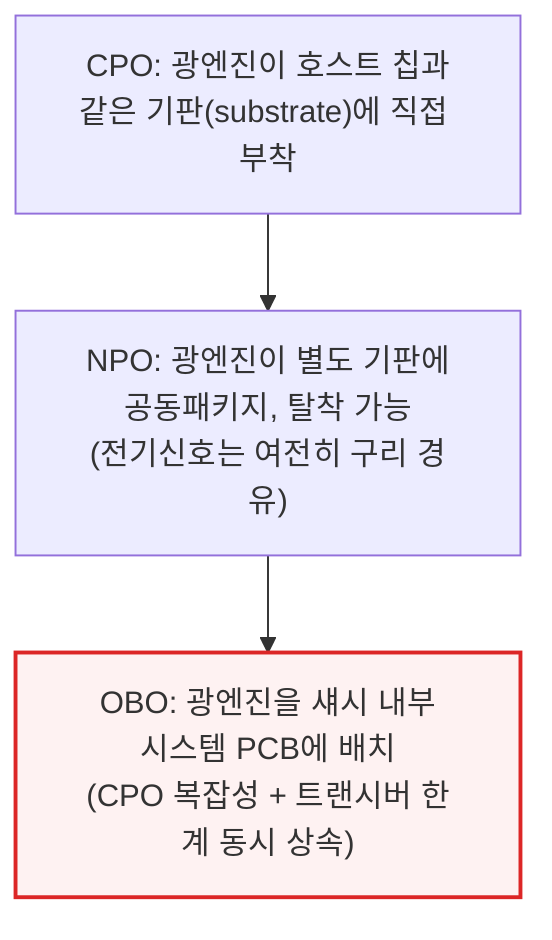
```mermaid
flowchart TD
    CPOx["CPO: 광엔진이 호스트 칩과<br/>같은 기판(substrate)에 직접 부착"] --> NPO["NPO: 광엔진이 별도 기판에<br/>공동패키지, 탈착 가능<br/>(전기신호는 여전히 구리 경유)"]
    NPO --> OBO["OBO: 광엔진을 섀시 내부<br/>시스템 PCB에 배치<br/>(CPO 복잡성 + 트랜시버 한계 동시 상속)"]

    style OBO fill:#fef2f2,stroke:#dc2626,stroke-width:2px
```

---

## 8. 공동패키지 구리(CPC)와 CPO가 지금까지 늦었던 이유

**📌 핵심:**
- CPC(Co-packaged Copper, 공동패키지 구리)는 CPO의 대안으로, 패키지 기판에서 바로 나오는 트윈액시얼(twin-axial) 구리 케이블을 씀 — 여전히 구리지만 절연이 좋아 신호 손실이 기존 전기 배선보다 훨씬 적고, 448G SerDes를 실현할 실질적인 경로로 꼽힘
- CPC는 기판이 수천 개 케이블에 전력·신호를 배선해야 하는 복잡도가 있지만 CPO보다는 훨씬 단순 — 랙 안 Scale-up처럼 거리가 짧은 용도에 특히 적합
- CPO가 기술적으로 우월한데도 채택이 더뎠던 이유는 ① 패키징 복잡도(광엔진 자체보다 패키징 비용이 더 큼)와 제조 난이도, ② 신뢰성·수율 문제, ③ 광·전기 부품을 밀착시키며 생기는 발열 관리 문제, ④ 업계 표준 부재 때문
- 결론: 가장 근본적인 고객 불안은 비용 통제력 상실 — 다수의 트랜시버 벤더를 경쟁시키기는 쉽지만 소수의 스위치 벤더에 종속되면 그러기 어려움. 반면 기존 플러그형 광모듈은 계속 성능이 좋아지고 있어 대부분의 용도에서 "이 정도면 충분"하고 고객 불안도 훨씬 적음

---

```mermaid
flowchart TD
    Flyover["기존 플라이오버 케이블<br/>PCB 배선 우회"] --> CPC["CPC(공동패키지 구리)<br/>소켓이 패키지 기판에서 시작<br/>트윈액시얼 케이블 사용"]
    CPC --> Benefit["신호 손실↓<br/>448G SerDes 실현 경로 제공"]
    CPC --> Limit["여전히 구리<br/>CPO보다 단순하지만<br/>수천 개 케이블 배선 복잡도↑"]

    style Benefit fill:#f0fdf4,stroke:#16a34a,stroke-width:2px
```

```mermaid
flowchart TD
    Reasons["CPO가 지금까지 늦은 이유"] --> R1["패키징 복잡도<br/>(광엔진 자체보다 비쌈)"]
    Reasons --> R2["신뢰성·수율·발열 관리 문제"]
    Reasons --> R3["업계 표준 부재"]
    Reasons --> R4["고객 불안: 소수 벤더에<br/>비용 통제력 넘겨줌"]

    style R4 fill:#fff7ed,stroke:#ea580c,stroke-width:2px
```

---

## 9. DSP 트랜시버에서 LPO로, LPO에서 CPO로

**📌 핵심:**
- DSP 트랜시버 안의 DSP 칩은 전력·비용 모두에서 가장 부담스러운 부품 — 800G SR8 트랜시버 기준 DSP가 모듈 전체 전력의 약 50%를 차지하고, 18k GB300 2층망 클러스터(트랜시버 4만 6,080개 필요) 전체로 보면 DSP 전력만 480kW(랙당 약 1.8kW)에 달함. 프리미엄 트랜시버는 클러스터 TCO의 약 10%까지 차지해 DSP가 "비용·전력 효율의 공공의 적 1호"로 불림
- 이 DSP를 없애려는 첫 시도가 LPO(Linear Pluggable Optics, DSP 없는 절충형 광모듈) — 스위치의 SerDes가 광소자를 직접 구동하게 해 DSP를 아예 빼지만, 실제로는 로이 응우옌(Loi Nguyen)이 2023년 SemiAnalysis 인터뷰에서 예측한 대로 널리 퍼지지 못함
- CPO는 LPO를 한 단계 더 밀어붙여, 광엔진을 호스트 칩과 같은 패키지에 둬 DSP 필요성 자체를 없앰 — 거리가 워낙 짧아지니 전력·면적을 많이 잡아먹는 장거리(LR) SerDes 대신 짧은 SerDes나 클럭 동기형 Wide I/O(한 번에 넓은 폭으로 신호를 주고받는 인터페이스)를 쓸 수 있게 됨
- 결론: 그런데도 CPO가 "20년째 코앞"이라는 말을 들어온 이유는 플러그형 트랜시버의 두 강점 때문 — ① OSFP·QSFP-DD 같은 표준 폼팩터와 OIF 표준 덕분에 벤더를 자유롭게 골라 협상력을 유지할 수 있다는 점, ② 원격 인력이 케이블을 뽑았다 꽂으면 끝나는 손쉬운 현장 정비. CPO는 광엔진 하나가 고장 나면 스위치 전체가 못 쓰게 될 위험이 있어, 최근에는 가장 고장이 잦은 레이저만이라도 탈착식 외부 광원으로 분리해 정비성을 보완하는 추세

---

```mermaid
flowchart TD
    DSPcost["800G SR8 트랜시버 기준<br/>DSP가 전체 전력의 ~50%"] --> Cluster["18k GB300 클러스터(2층망):<br/>DSP 전력만 480kW<br/>(랙당 약 1.8kW)"]
    DSPcost --> BOM["DSP가 트랜시버 BOM의 20~30%<br/>+ 프리미엄 트랜시버는<br/>클러스터 TCO의 약 10%"]

    style DSPcost fill:#fef2f2,stroke:#dc2626,stroke-width:2px
```

```mermaid
flowchart TD
    DSPx["DSP 트랜시버<br/>DSP가 신호 복원 후 광변환"] --> LPO["LPO: DSP 제거,<br/>SerDes가 광소자를 직접 구동"]
    LPO --> CPOx["CPO: 광엔진을 호스트 칩과<br/>같은 패키지로 이동<br/>DSP 필요성 자체가 사라짐"]

    style CPOx fill:#f0fdf4,stroke:#16a34a,stroke-width:2px
```

```mermaid
flowchart TD
    Pluggable["플러그형 트랜시버 장점"] --> Inter["높은 상호운용성<br/>(OSFP·QSFP-DD, OIF 표준)"]
    Pluggable --> Service["현장 정비 쉬움<br/>(원격 인력이 바로 교체)"]
    CPOcon["CPO 단점"] --> Fail["광엔진 장애 시<br/>스위치 전체 사용불가 위험"]
    CPOcon --> Laser["레이저가 최다 장애 지점<br/>→ 대부분 탈착식<br/>외부 레이저로 대응"]

    style Fail fill:#fef2f2,stroke:#dc2626,stroke-width:2px
```

---

## 10. 왜 CPO인가 - I/O 병목과 SerDes 한계

**📌 핵심:**
- DSP 제거 말고도 CPO의 큰 강점은 "대역폭 밀도÷에너지 소비"라는 지표(FoM, Figure of Merit)에서 나옴 — 전기 링크는 거리가 늘수록 이 지표가 지수적으로 나빠지고, 전기에서 광신호로 바꾸는 순간 효율이 한 자릿수(10배 안팎) 더 떨어짐(트랜시버까지 신호를 밀어내고 광용 DSP까지 돌려야 해서). CPO의 곡선은 이 지표에서 항상 플러그형보다 위에 있음 — "짧은 거리는 구리, 꼭 필요할 때만 광"이라는 원칙을 그대로 지키면서도 더 유리한 지점에서 시작
- 트랜지스터 밀도·연산력(FLOPs)은 꾸준히 늘었지만 칩 밖으로 데이터를 내보내는 통로(I/O)는 훨씬 느리게 확장 — 패키지 기판에 낼 수 있는 범프(연결점) 수가 물리적으로 제한돼 있어 이 통로 자체가 병목이 됨
- NVLink가 1.0에서 5.0으로 오면서 대역폭이 11배 이상 늘었는데, 그 동력은 레인(전선 가닥) 수 증가(32→36개, 거의 그대로)가 아니라 SerDes 레인 속도가 20G에서 200G로 10배 뛴 것 — NVLink 6.0은 200G SerDes를 유지한 채 레인 수를 2배로 늘려야 하는데, 이걸 같은 개수의 물리적 구리선으로 양방향 SerDes를 써서 편법으로 해결. 여기서 더 나아가긴 어려움 — 엔비디아의 경쟁우위인 NVLink가 AMD·하이퍼스케일러에 따라잡힐 빌미가 될 수 있음
- 결론: 해법은 전기로 신호를 밀어야 하는 거리를 최대한 줄이고, 호스트 ASIC에 최대한 가까운 곳에서 광신호로 넘기는 것 — 그래서 CPO가 인터커넥트의 "홀리 그레일(궁극의 목표)"로 불림. 거리가 짧아지면 SerDes 자체도 짧은 거리용으로 최적화할 수 있어 설계가 쉬워지고 전력·면적도 줄어듦

---

```mermaid
flowchart TD
    FoM["대역폭 밀도÷에너지 소비<br/>= 인터커넥트 품질 지표(FoM)"] --> Elec["전기 링크: 거리 늘수록<br/>FoM 지수적으로 악화"]
    Elec --> OptConv["광 변환 도입 시<br/>효율 한 자릿수(10배) 안팎 하락<br/>(트랜시버까지 신호 구동+광DSP 전력)"]
    CPOcurve["CPO의 FoM 곡선은<br/>플러그형보다 항상 위"] --> Rule["원칙: 짧은 거리는 구리,<br/>꼭 필요할 때만 광"]

    style CPOcurve fill:#f0fdf4,stroke:#16a34a,stroke-width:2px
```

```mermaid
flowchart TD
    Compute["트랜지스터 밀도·연산력(FLOPs)<br/>은 꾸준히 확장"] --> IO["I/O는 훨씬 느리게 확장<br/>(패키지 기판 범프 수 제한)"]
    IO --> Bottleneck["칩 밖으로 데이터를<br/>내보낼 통로(shoreline) 자체가 병목"]
    Bottleneck --> SerDesLim["224G SerDes조차<br/>도달에 어려움<br/>(속도 오를수록 손실 급증)"]

    style Bottleneck fill:#fff7ed,stroke:#ea580c,stroke-width:2px
```

```mermaid
flowchart TD
    NVLink1["NVLink 1.0→5.0<br/>대역폭 11배+↑"] --> Cause["레인 수는 32→36개로 거의 그대로<br/>(SerDes 속도 20G→200G, 10배↑가 주역)"]
    Cause --> NVLink6["NVLink 6.0: 200G SerDes 유지<br/>→ 레인 수를 2배로 늘려야 함<br/>(양방향 SerDes로 편법 해결)"]
    NVLink6 --> Risk["더 이상 늘리기 어려움<br/>NVLink 경쟁우위가<br/>AMD·하이퍼스케일러에 따라잡힐 위험"]

    style Risk fill:#fef2f2,stroke:#dc2626,stroke-width:2px
```

```mermaid
flowchart TD
    Compromise["해법: 전기 I/O 거리를<br/>최대한 줄이고<br/>가능한 한 칩 가까이서 광변환"] --> CPOgold["CPO = 인터커넥트의<br/>'홀리 그레일'"]
    CPOgold --> ShortSerDes["짧은 SerDes로 최적화 가능<br/>→ 설계 쉬움, 전력·면적↓"]

    style CPOgold fill:#f0fdf4,stroke:#16a34a,stroke-width:2px
```

---

## 11. Wide I/O vs SerDes, 링크 신뢰성

**📌 핵심:**
- 전기 신호를 먼 거리까지 몰 필요가 없어지면 직렬(SerDes) 방식을 완전히 벗어나 한 번에 넓은 폭으로 데이터를 주고받는 Wide I/O(예: UCIe 인터페이스)를 쓸 수 있음 — 인터포저용 UCIe-A는 mm당 약 10Tbit/s의 배선 밀도를 내는데, 이는 블랙웰의 패키지 외부 대역폭(mm당 약 0.4Tbit/s)과 비교가 안 될 정도로 큰 격차. 다만 이는 단순 비교가 아님 — CPO에서는 애초에 "먼 거리"라는 전제 자체가 사라지기 때문
- 이 정도 배선 밀도에 도달하려면 광엔진이 호스트와 인터포저를 공유해야 하는데, 이는 오늘날 현실과는 아직 거리가 먼 로드맵 — 그보다 앞서 나올 기판(substrate)용 UCIe-S는 mm당 약 1.8Tbit/s로, 224G SerDes(mm당 약 0.4Tbit/s)보다는 확실히 우위
- 그럼에도 브로드컴·엔비디아는 전기 SerDes 로드맵을 계속 유지 — SerDes를 더 확장할 수 있다고 판단하고, 광 채택 속도가 아직 느려 구리용 설계도 병행해야 하기 때문. 앞으로도 공동패키지 구리와 CPO가 한동안 공존하며 두 가지를 동시에 최적화해야 할 전망(설계 하나로 여러 테이프아웃을 피하려는 목적)
- 결론: 대형 AI 클러스터는 약 100만 개 링크를 플러그형 모듈로 운용하는데 하루 수십 건씩 링크 장애가 발생하고, 반품된 광모듈의 80%는 "이상 없음"으로 판정될 만큼 원인 특정이 어려운 '소프트' 장애가 많음 — CPO는 부품 수를 줄이고 신호 경로를 짧게 해 복잡도를 낮추고, 공장에서 '검증 완료' 상태로 조립돼 나와 현장 설치 변수 자체를 없앰

---

```mermaid
flowchart TD
    UCIe["UCIe-A(인터포저용)<br/>mm당 ~10Tbit/s 배선밀도"] --> Reticle["레티클급 칩 긴 변 기준<br/>최대 330Tbit/s(양쪽 660Tbit/s)"]
    Blackwell["블랙웰 패키지 외부 대역폭<br/>23.6Tbit/s(mm당 ~0.4Tbit/s)"] --> Gap["UCIe 대비 큰 격차<br/>(단, CPO에선 거리 제약이<br/>사라져 비교 전제 자체가 다름)"]
    UCIeS["UCIe-S(기판용)<br/>mm당 ~1.8Tbit/s<br/>(224G SerDes 대비 우위)"]

    style Reticle fill:#eff6ff,stroke:#3b82f6,stroke-width:2px
```

```mermaid
flowchart TD
    WideIO["Wide I/O가 이론상 더 우수"] --> ButStill["그런데도 엔비디아·브로드컴은<br/>전기 SerDes 로드맵 유지"]
    ButStill --> R1["SerDes를 계속 확장할 수 있다는 판단"]
    ButStill --> R2["광 채택 속도가 느려<br/>구리용 설계도 병행 필요"]
    ButStill --> R3["공동패키지 구리+CPO가<br/>당분간 공존할 전망"]
```

```mermaid
flowchart TD
    Today["대형 클러스터(약 100만 링크)<br/>하루 수십 건 링크 장애"] --> Soft["다수는 '소프트' 장애<br/>(반품 모듈의 80%가 '이상 없음')"]
    CPOfix["CPO의 신뢰성 개선 경로"] --> F1["부품 수 감소 → 복잡도↓"]
    CPOfix --> F2["신호 경로 단축 → 신호 무결성↑"]
    CPOfix --> F3["공장 출하 시 '검증 완료'<br/>상태로 조립 → 현장 설치 변수 제거"]

    style CPOfix fill:#f0fdf4,stroke:#16a34a,stroke-width:2px
```

---

## 12. 광엔진 제조와 시장 진입 - 호스트·광엔진 패키징

**📌 핵심:**
- CPO는 아직 대규모 채택에 걸맞은 물량으로 만들어진 적이 없음 — 브로드컴(Bailly·Humboldt)만 소량으로 양산 CPO 시스템을 출하했었고, 이제 엔비디아가 합류. 공급망 미성숙과 신뢰성 데이터 부족 탓에 고객사들도 아직 몸을 사림
- CPO가 자리 잡으려면 업계 리더가 먼저 물량을 실어 공급망이 양산 가능한 제조·검사 공정을 갖추도록 이끌어야 함 — 엔비디아가 그 역할을 맡아 공급망을 정비하는 중이며, 핵심 변수는 ① 호스트·광엔진 패키징 ② 광섬유·광섬유 커플링 ③ 레이저 소스·파장다중화 ④ 변조기 종류 네 가지
- 광엔진(Optical Engine, OE)은 빛을 다루는 PIC(Photonic Integrated Circuit, 광집적회로 — 광검출기·변조기)와 전기를 다루는 EIC(Electric Integrated Circuit, 전기집적회로 — 드라이버·수신증폭기)로 나뉘는데, 이 둘을 같은 웨이퍼에서 만드는 단일공정(모놀리식) 방식은 광공정이 35nm 이하로는 스케일링이 안 돼 EIC 성능이 제약됨 — 그래서 PIC·EIC를 따로 만들어 첨단 패키징으로 결합하는 이종집적 방식이 업계 주류로 이동 중이고, 그중에서도 3D 적층이 대역폭·전력효율에서 가장 앞섬
- 결론: 광엔진을 패키지에 붙이려면 기판 자체를 크게 키워야 함(엔비디아 Spectrum-X는 110×110mm로 블랙웰 패키지 70×76mm보다 훨씬 큼) — 게다가 광엔진 수십 개를 전부 양품으로 붙여야 완성되는 구조라 수율 난이도가 높아짐

---

```mermaid
flowchart TD
    OE["광엔진(OE) = PIC(광신호 처리)<br/>+ EIC(전기신호 처리)"] --> Mono["단일공정(모놀리식):<br/>같은 웨이퍼에서 제조<br/>(Ayar Labs 2세대 TeraPHY)"]
    OE --> Hetero["이종집적: PIC·EIC를<br/>따로 만들어 첨단 패키징으로 결합<br/>(업계 주류로 이동)"]
    Mono --> MonoLimit["광공정은 35nm 이하로<br/>못 내려가 EIC 성능 제약<br/>→ 스케일링에 한계"]
    Hetero --> HeteroBest["3D 적층이<br/>대역폭·전력효율 최고"]

    style HeteroBest fill:#f0fdf4,stroke:#16a34a,stroke-width:2px
```

```mermaid
flowchart TD
    Substrate["광엔진을 붙일 기판 확대 필요"] --> Compare["엔비디아 Spectrum-X:<br/>110×110mm 기판<br/>vs 블랙웰 패키지 70×76mm"]
    Compare --> Yield["광엔진 36개를 전부<br/>양품으로 플립칩 본딩해야 완성<br/>(수율 난이도↑)"]

    style Yield fill:#fff7ed,stroke:#ea580c,stroke-width:2px
```

---

## 13. TSMC COUPE - 업계 표준 통합 방식으로 부상

**📌 핵심:**
- TSMC는 원래 실리콘 포토닉스(광신호를 다루는 반도체 공정)에서 존재감이 약했지만, 최첨단 CMOS 공정(EIC용)과 유일하게 상용 규모로 검증된 다이-웨이퍼 하이브리드 본딩(더 짧은 배선으로 PIC·EIC를 붙이는 고성능 접합 방식) 능력을 앞세워 COUPE(Compact Universal Photonic Engine)라는 광엔진 전용 패키징 플랫폼으로 빠르게 CPO 진영의 핵심으로 부상
- 엔비디아가 GTC 2025에서 COUPE 기반 광엔진을 처음 공개했고, 이전 세대에서 다른 파트너와 협업하던 브로드컴도 향후 로드맵을 COUPE로 전환 — COUPE를 채택한다는 것은 사실상 "TSMC가 만든 PIC만 쓰겠다"는 약속과 같음(TSMC는 다른 파운드리가 만든 SiPho 웨이퍼는 패키징해주지 않기 때문)
- EIC는 첨단 N7 공정(고속 변조기 드라이버·수신증폭기+파장 안정화용 히터 제어 포함), PIC는 성숙한 SOI N65 공정으로 각각 만든 뒤 TSMC의 범프리스(범프 없이 직접 붙이는) SoIC 본딩으로 결합 — 배선 길이를 최소화해 동일 전력 기준 대역폭 밀도가 범프 방식보다 23배 이상 높음
- 결론: 현재는 광엔진을 기판에 배치하는 1단계지만, 목표는 I/O 밀도가 훨씬 높은 인터포저에 배치하는 것 — 이렇게 되면 광엔진 하나가 최대 12.8Tbit/s(mm당 약 4Tbit/s)까지 낼 수 있지만, 인터포저를 더 크게(더 비싸게) 만들어야 하는 과제가 남아 있음. 브로드컴도 기존 FOWLP(팬아웃 웨이퍼레벨 패키징) 방식이 레인당 100G를 넘어서지 못해 COUPE로 전환하는 중

---

```mermaid
flowchart TD
    TSMC["TSMC 강점: 첨단 CMOS(EIC)<br/>+ 하이브리드 본딩 패키징"] --> COUPE["COUPE 플랫폼:<br/>PIC+EIC 제조·통합 표준화"]
    COUPE --> Adopt["엔비디아 GTC 2025 첫 공개<br/>브로드컴·Ayar Labs도 전환"]
    COUPE --> Lockin["COUPE 채택 = TSMC가 만든<br/>PIC만 쓴다는 약속<br/>(타 파운드리 PIC는 패키징 안 함)"]

    style Lockin fill:#fff7ed,stroke:#ea580c,stroke-width:2px
```

```mermaid
flowchart TD
    Bump["범프 방식 통합"] --> LowDensity["대역폭 밀도 기준선"]
    SoIC["TSMC SoIC(범프리스) 본딩<br/>배선 길이 최소화"] --> HighDensity["동일 전력 기준<br/>대역폭 밀도 23배+"]

    style HighDensity fill:#f0fdf4,stroke:#16a34a,stroke-width:2px
```

```mermaid
flowchart TD
    Sub["1단계: 광엔진을 기판에 배치<br/>(현재 양산 시작)"] --> Inter["목표: 광엔진을 인터포저에 배치<br/>(I/O 밀도 훨씬 높음)"]
    Inter --> Spec["광엔진 1개당 최대 12.8Tbit/s<br/>(mm당 약 4Tbit/s)"]
    Inter --> Challenge["과제: 인터포저를<br/>더 크게(더 비싸게) 만들어야 함"]
```

---

## 14. FAU와 광섬유 커플링 - 엣지 vs 격자

**📌 핵심:**
- 광엔진에서 나온 빛을 실제 광섬유에 정확히 맞춰 연결하는 작업(광섬유 커플링)은 CPO에서 가장 까다로운 공정 중 하나 — FAU(Fiber Attach Unit, 광섬유 부착 유닛)가 이를 돕고, 방식은 크게 엣지 커플링(EC)과 격자 커플링(GC) 두 가지
- EC(엣지 커플링)는 칩 가장자리에서 광섬유를 정밀하게 맞대는 방식으로 손실이 적고 넓은 파장 범위·편광에 둔감하다는 장점이 있지만, 제작 공정이 복잡하고 1차원 구조라 붙일 수 있는 광섬유 수가 제한되며 다이 적층과도 호환되지 않음
- GC(격자 커플링)는 빛이 칩 위쪽에서 비스듬히 들어와 격자 구조가 빛을 아래 도파로로 꺾어 넣는 방식 — 광섬유를 여러 줄로 배치할 수 있어 밀도를 높이기 좋고, 기판 아래쪽에 자리할 필요가 없어 인터포저에도 배치 가능하며, 제조도 비교적 단순(2단계 식각)함. 다만 특정 파장 범위에서만 작동하고 편광에 민감하다는 한계가 있음
- 결론: 엔비디아와 TSMC 모두 GC를 선호 — 2차원 밀도, 작은 풋프린트, 쉬운 제조, 간편한 웨이퍼 단계 테스트가 이유. 그 대가로 광손실이 더 크고 파장 대역폭이 더 좁다는 점은 감수하는 선택

---

```mermaid
flowchart TD
    Fiber["광섬유↔칩 배선 결합 방법 2가지"] --> EC["엣지 커플링(EC)<br/>칩 가장자리에서 결합<br/>손실 적음·파장범위 넓음"]
    Fiber --> GC["격자 커플링(GC)<br/>칩 위쪽에서 비스듬히 결합<br/>여러 줄 배치 가능·제조 쉬움"]
    EC --> ECcon["단점: 1차원 구조라 밀도 제한<br/>다이 적층과 호환 안 됨"]
    GC --> GCcon["단점: 파장범위 좁음<br/>편광에 민감"]
```

```mermaid
flowchart TD
    NvidiaPref["엔비디아·TSMC는 GC 선호"] --> Why1["2차원 밀도(여러 줄 배치)"]
    NvidiaPref --> Why2["작은 풋프린트, 제조 쉬움"]
    NvidiaPref --> Why3["웨이퍼 단계 테스트 간편"]
    NvidiaPref --> Tradeoff["대가: 광손실 더 크고<br/>파장 대역폭 더 좁음"]

    style Tradeoff fill:#fff7ed,stroke:#ea580c,stroke-width:2px
```

---

## 15. 레이저 타입과 파장분할다중화(WDM)

**📌 핵심:**
- 레이저를 CPO에 넣는 방법은 크게 둘 — 레이저와 변조기를 같은 광칩에 통합하는 온칩 레이저는 설계가 간단하고 손실이 적지만, 레이저는 시스템에서 가장 고장이 잦은 부품이라 통합해버리면 고장 하나가 칩 전체를 마비시킬 위험(블래스트 반경)이 크고, 가장 뜨거운 호스트 칩 바로 옆에 있어 열에도 취약함
- 그래서 업계는 외부 광원(ELS, External Light Source) 방식으로 합의 — 레이저를 별도의 탈착식 모듈(대개 OSFP 폼팩터)로 분리해 광섬유로 연결하면, 레이저가 고장 나도 현장에서 쉽게 교체 가능
- 대신 대가가 있음 — 커넥터 손실·광섬유 커플링 손실·변조기 비효율로 여러 단계에서 출력이 새 나가 레이저 하나가 24.5dBm의 광출력을 내야 하고, 출력이 클수록 열이 더 나고 수명은 짧아짐 — 레이저와 열전냉각기(TEC)가 ELS 전력의 약 70%를 차지. 엔비디아는 루멘텀(단일 고출력 DFB)·Ayar Labs(DFB 어레이)·Innolume·Xscape·Enlightra·Iloomina 등을 레이저 파트너로 확보
- 결론: 파장분할다중화(WDM)는 서로 다른 색(파장)의 빛 여러 개를 광섬유 한 가닥에 동시에 실어 보내는 기법 — CPO는 광엔진에 붙일 수 있는 광섬유 수 자체가 제한적이라, 가닥 하나의 용량을 WDM으로 최대한 끌어올리는 것이 특히 중요

---

```mermaid
flowchart TD
    OnChip["온칩 레이저<br/>레이저+변조기를 같은 광칩에 통합"] --> Con1["가장 잘 고장 나는 부품<br/>→ 통합 시 블래스트 반경 큼"]
    OnChip --> Con2["열에 민감한데<br/>가장 뜨거운 호스트 칩 옆에 위치"]
    ELS["외부 광원(ELS)<br/>레이저를 별도 탈착식 모듈로 분리"] --> Pro["레이저 고장 시<br/>현장 정비 훨씬 쉬움"]
    ELS --> Con3["전력 소모↑<br/>(레이저+열전냉각기가<br/>ELS 전력의 약 70%)"]

    style Pro fill:#f0fdf4,stroke:#16a34a,stroke-width:2px
```

```mermaid
flowchart TD
    Fiber1["광섬유 한 가닥"] --> WDMx["여러 파장(색)의<br/>빛을 동시에 실어 보냄(WDM)"]
    WDMx --> CWDM["CWDM: 채널 적고<br/>간격 넓음(~20nm)"]
    WDMx --> DWDM["DWDM: 채널 많고<br/>간격 촘촘(<1nm, 최대 100+채널)"]
    WDMx --> Why["광섬유 개수가 제한적인 CPO에서<br/>가닥당 용량을 최대화하는 핵심 수단"]

    style Why fill:#eff6ff,stroke:#3b82f6,stroke-width:2px
```

---

## 16. 변조기 종류 - MZM·MRM·EAM

**📌 핵심:**
- 레이저 빛이 PIC에 들어오면 전기 신호를 빛에 새겨 넣는 변조 단계를 거치는데, 여기 쓰이는 변조기는 크게 3종 — MZM(마흐-젠더 변조기, 약 12,000㎛²)은 크지만 다루기 쉽고 온도에 둔감한 대신 전력을 많이 씀, MRM(마이크로링 변조기, 25\~225㎛²)은 훨씬 작고 전력 효율이 좋지만 온도에 매우 민감, EAM(전기흡수 변조기, 약 250㎛²)은 크기·성능이 그 중간이면서 온도 안정성은 셋 중 가장 뛰어남
- MRM은 70\~90pm/°C의 민감도를 가져 단 2°C만 변해도 공진 파장이 0.14nm 이동하는데, 이는 성능이 무너지는 기준선(0.1nm)을 넘어서는 수치라 정밀한 온도 제어가 필수 — 반면 EAM은 순간적인 35°C 온도 변화(주변온도 최대 80°C)까지 견뎌, 셀레스티얼 AI가 발열이 심한 XPU 바로 아래에 EAM을 배치할 수 있는 이유가 됨
- 벤더별 선택이 갈림 — 엔비디아·TSMC·Ayar Labs·Lightmatter·Ranovus는 대역폭 밀도가 높은 MRM을 선호(엔비디아는 CPO 시스템에 MRM을 처음 적용했다고 주장), Nubis는 상호운용성·성숙도를 앞세워 MZM을 고수, 셀레스티얼 AI는 열 안정성 때문에 EAM을 거의 유일하게 채택
- 결론: EAM은 밴드갭(band edge)이 원래 C-밴드(1530\~1565nm)에 있어 표준 O-밴드(1260\~1360nm) 레이저 생태계와 잘 안 맞고, 갈륨저마늄(GeSi) 소재의 신뢰성에 대한 업계 우려도 남아있어 대개 폐쇄형(book-ended) 시스템에 머무름 — 개방형 칩렛 생태계에 참여하기엔 아직 제약이 있음

---

```mermaid
flowchart TD
    Mod["변조기 3종<br/>(전기신호를 빛에 새김)"] --> MZM["MZM: 크기 大(~12,000㎛²)<br/>다루기 쉬움·온도 둔감<br/>전력 소모 큼"]
    Mod --> MRM["MRM: 크기 小(25~225㎛²)<br/>WDM에 최적·전력효율 좋음<br/>온도에 매우 민감"]
    Mod --> EAM["EAM: 크기 中(~250㎛²)<br/>온도 안정성 최고<br/>파장 대역 좁음"]
```

```mermaid
flowchart TD
    MRMsens["MRM 온도 민감도<br/>70~90pm/°C"] --> Shift["2°C 변화만으로<br/>공진 파장 0.14nm 이동"]
    Shift --> Collapse["0.1nm 넘으면 성능 붕괴<br/>→ 정밀 온도제어 필수"]
    EAMtol["EAM은 순간 35°C 변화도 견딤<br/>(주변온도 최대 80°C)"] --> CelestialUse["셀레스티얼 AI가 고발열 XPU<br/>바로 아래 EAM을 배치할 수 있는 이유"]

    style Collapse fill:#fef2f2,stroke:#dc2626,stroke-width:2px
    style CelestialUse fill:#f0fdf4,stroke:#16a34a,stroke-width:2px
```

```mermaid
flowchart TD
    Nvidia["엔비디아·TSMC·Ayar Labs·<br/>Lightmatter·Ranovus"] --> MRMchoice["MRM 선호<br/>(대역폭 밀도 우위)"]
    Nubis["Nubis"] --> MZMchoice["MZM 선호<br/>(상호운용성·성숙도)"]
    Celestial["셀레스티얼 AI"] --> EAMchoice["EAM 선호<br/>(열 안정성)"]
```

---

## 17. 광엔진 로드맵과 대역폭 확장 방법

**📌 핵심:**
- 오늘날 광엔진은 1.6\~3.2Tbit/s의 총대역폭을 냄(엔비디아 Quantum CPO 1.6T, Spectrum용 3.2T 예정) — 그런데 Spectrum-X의 3.2T 광엔진조차 아직 장거리(LR) SerDes로 구동하는 기존 플러그형보다 배선 밀도 우위가 없어, 앞으로 몇 배는 더 밀도를 끌어올려야 실질적인 이득이 생김
- 대역폭을 확장하는 전기 인터페이스 쪽 접근은 3가지 — ① 기존 전기 SerDes를 유지하되 단거리(SR)로 단순화하는 과도기 해법, ② UCIe 같은 Wide I/O를 저속(56G NRZ)으로 써서 값비싼 하이브리드 본딩을 피하는 방법(대신 광섬유 수가 병목이 되기 쉬움), ③ Wide I/O를 고속 PAM4로 직렬화한 뒤 WDM으로 파장을 더해 대역폭을 최대화하는 방법
- 광섬유 쪽 총대역폭은 광섬유 수 × 레인당 속도 × 파장 수 세 요소의 곱 — 광섬유 수는 현재 최소 피치 127µm(목표는 80µm)로 제한되고, 레인당 속도는 보율(초당 신호 수)을 100→200Gbaud로 올리거나 변조 방식을 NRZ→PAM4→PAM6/8로 고도화해 늘리며, 파장 수는 상용 제품이 8\~16개인데 Xscape는 최대 64개를 목표로 개발 중
- 결론: 업계는 "Fast and Narrow"(광섬유는 적게, 레인당 속도는 빠르게)와 "Slow and Wide"(광섬유는 촘촘하게 많이, 레인당 속도는 느리게)라는 두 갈래 철학으로 나뉘어 12.8Tbit/s 이상을 향한 확장 경로를 모색 중

---

```mermaid
flowchart TD
    Approach1["① 기존 전기 SerDes 유지<br/>(단거리 SerDes로 단순화)"] --> Interim["과도기 해법<br/>기존 구리·광 양쪽에 유연 대응"]
    Approach2["② Wide I/O(UCIe)를<br/>저속(56G NRZ)으로 사용"] --> Cheaper["하이브리드본딩 불필요할 수도<br/>단, 광섬유 개수가 병목 될 수 있음"]
    Approach3["③ Wide I/O + 고속 PAM4<br/>직렬화 후 WDM으로 파장 추가"] --> Max["대역폭 최대화<br/>(가장 복잡)"]
```

```mermaid
flowchart TD
    Total["광섬유 쪽 총대역폭<br/>= 광섬유 수 × 레인당 속도 × 파장 수"] --> V1["① 광섬유 수↑<br/>(현재 최소 피치 127µm,<br/>목표 80µm)"]
    Total --> V2["② 레인당 속도↑<br/>(보율 100→200Gbaud,<br/>NRZ→PAM4→PAM6/8)"]
    Total --> V3["③ 파장(WDM) 수↑<br/>(상용 8~16개,<br/>Xscape는 최대 64개 목표)"]
```

```mermaid
flowchart TD
    Strategy["대역폭 확장 철학 2갈래"] --> Fast["Fast and Narrow<br/>광섬유 적게, 레인당 빠르게"]
    Strategy --> Slow["Slow and Wide<br/>광섬유 많이(촘촘한 피치)<br/>레인당 느리게"]
```

---

## 18. CPO 도입 속도와 표준화·서비스성 과제

**📌 핵심:**
- 엔비디아의 첫 CPO 제품은 InfiniBand가 2025년 하반기, 이더넷이 2026년 하반기에 출시 — 2026년 총출하량은 1만\~1만5,000대 수준으로 전망되며, 이는 본격 양산이 아니라 시장 테스트와 공급망 길들이기 단계
- 상호운용성은 전기·광학·기계적 3층위로 나뉘는데, 기존 플러그형은 이 셋 모두 표준화(전기는 OIF, 광학은 IEEE 802.3의 PMD 규격, 기계적 형태는 MSA 다자간 협약)돼 있어 벤더를 자유롭게 섞어 쓸 수 있음 — CPO는 아직 "와일드웨스트" 단계라 일부 제품이 독자 폼팩터로 가고 있고, OIF가 고밀도 인터커넥트(CPX) 논의로 표준화를 추진 중
- 서비스성 문제의 핵심은 광섬유 커플링 — 플러그형은 미리 정렬된 표준 커넥터를 쓰지만, CPO는 섀시 안 비좁고 열이 많은 공간에서 서브마이크론 정밀도로 광섬유를 도파로에 맞춰야 함. 광학 부품은 온도·먼지·기계적 스트레스에 구리보다 훨씬 취약하고, 광섬유는 구부러짐에도 민감해 삽입손실 증가·단선 가속으로 이어짐
- 결론: 플러그형 트랜시버는 섀시 앞판에서 원격 인력이 순식간에 핫스왑하지만, CPO는 고장 난 FAU를 교체하려면 엔지니어가 섀시 안으로 들어가 다른 광섬유를 건드리지 않으면서 카세트를 통해 새 FAU를 다시 부착해야 함 — 훨씬 번거로운 작업

---

```mermaid
flowchart TD
    IB["InfiniBand CPO<br/>2025년 하반기 출시"] --> Eth["이더넷 CPO<br/>2026년 하반기 출시"]
    Eth --> Volume["2026년 총 출하량<br/>1만~1만5,000대 전망<br/>(시장 테스트·공급망 길들이기 단계)"]
```

```mermaid
flowchart TD
    Inter["상호운용성 3층위"] --> E["전기: OIF 표준"]
    Inter --> O["광학: IEEE 802.3 PMD 규격"]
    Inter --> M["기계적: MSA(다자간 협약)"]
    Plug["플러그형: 3층위 모두 표준화<br/>→ 벤더 자유롭게 조합"]
    CPOnow["CPO 현재: '와일드웨스트' 단계<br/>일부 독자 폼팩터"] --> Fix["OIF의 고밀도 인터커넥트(CPX)로<br/>표준화 추진 중"]
```

```mermaid
flowchart TD
    Pluggable["플러그형 트랜시버 교체<br/>=섀시 앞판에서 핫스왑"] --> Easy["원격 인력이 몇 초 만에 완료"]
    CPOrepl["CPO FAU 교체"] --> Hard["섀시 내부 진입→<br/>고장난 FAU 분리→<br/>다른 광섬유 안 건드리고 재장착"]

    style Hard fill:#fef2f2,stroke:#dc2626,stroke-width:2px
```

---

## 19. 엔비디아 CPO - Quantum-X와 Spectrum-X Photonics

**📌 핵심:**
- 엔비디아는 GTC 2025에서 CPO 기반 Scale-out 스위치 3종을 공개 — 2025년 하반기 출시되는 첫 제품 Quantum X800-Q3450은 144개의 물리 MPO 포트로 800G 논리 포트 144개 또는 1.6T 논리 포트 72개를 내며 총대역폭은 115.2T. 28.8Tbit/s급 스위치 ASIC 4개를 멀티플레인(각 물리 포트가 4개 ASIC 모두와 연결돼 데이터를 나눠 보내는 방식) 구성으로 묶어, 3층망 기준 최대 74만 6,496개 GPU까지 연결 가능한 클러스터를 만들 수 있음
- ASIC 1개당 탈착식 광서브어셈블리 6개(서브어셈블리 1개=광엔진 3개, 광엔진 1개=1.6Tbit/s)가 붙어 ASIC당 광엔진 18개·28.8Tbit/s를 냄 — 서브어셈블리가 탈착 가능하다는 점에서 엄밀히는 "NPO"에 가깝다는 지적도 있지만 성능 영향은 크지 않음. 광엔진 1개는 전기 쪽 200G PAM4 SerDes 8채널과 광 쪽 200G MRM(마이크로링 변조기) 8개로 구성되는데, 200G급 MRM을 양산한다는 것 자체가 "MRM은 저속(NRZ)에서만 가능하다"는 통념을 깬 성과
- Spectrum-X Photonics는 2026년 하반기 출시 예정으로 두 갈래 — Spectrum 6810(102.4T, 패키지 1개)과 대형 Spectrum 6800(409.6T, 패키지 4개) — Quantum-X와 달리 102.4T급 스위치 ASIC을 중심에 두고 224G SerDes I/O 칩렛 8개가 둘러싼 MCM(멀티칩모듈) 구조를 씀. 패키지 1개당 광엔진은 36개인데 그중 32개만 가동하고 나머지 4개는 예비용(광엔진이 기판에 납땜돼 있어 쉽게 교체할 수 없기 때문)
- 결론: Spectrum-X의 I/O 칩렛은 각각 12.8Tbit/s 단방향 대역폭(SerDes 64레인)을 내며 광엔진 4개씩과 연결되는데, 이 구조 덕분에 Quantum-X Photonics보다 훨씬 많은 총대역폭을 낼 수 있음

---

```mermaid
flowchart TD
    Q3450["Quantum X800-Q3450<br/>144 MPO 포트, 총대역폭 115.2T"] --> Multiplane["4개 스위치 ASIC(28.8T씩)을<br/>멀티플레인 구성으로 연결"]
    Multiplane --> Cluster["3층망 기준 최대 74만 6,496 GPU<br/>연결 가능"]
```

```mermaid
flowchart TD
    ASIC["ASIC 1개당<br/>탈착식 광서브어셈블리 6개"] --> Sub["서브어셈블리 1개=광엔진 3개<br/>(광엔진 1개=1.6Tbit/s)"]
    Sub --> Total["ASIC당 광엔진 18개<br/>=28.8Tbit/s"]
    Total --> Modulator["광엔진 1개=8채널<br/>200G PAM4 SerDes(전기)+<br/>200G MRM(광, PAM4)"]

    style Modulator fill:#f0fdf4,stroke:#16a34a,stroke-width:2px
```

```mermaid
flowchart TD
    Package["Spectrum-X 스위치 패키지<br/>(MCM, 102.4T ASIC+I/O칩렛 8개)"] --> S6810["Spectrum 6810<br/>패키지 1개=102.4T"]
    Package --> S6800["Spectrum 6800<br/>패키지 4개=409.6T"]
    Package --> OEcount["패키지당 광엔진 36개<br/>(32개 가동+4개 예비)"]
```

---

## 20. 브로드컴 CPO 스위치 포트폴리오

**📌 핵심:**
- 브로드컴은 실제로 CPO 시스템을 처음 출하한 회사 — 1세대 Humboldt(TH4)는 25.6Tbit/s 이더넷 스위치로 용량 절반만 광(12.8Tbit/s, 3.2Tbit/s 광엔진 4개)이었고 SiGe(실리콘저마늄) EIC를 씀. 2세대 Bailly는 51.2Tbit/s 전량 광 I/O로 전환하며 7nm CMOS EIC를 채택, 레인 수도 32개에서 64개로 늘림
- 패키징도 1세대 TSV에서 2세대 FOWLP(팬아웃 웨이퍼레벨 패키징, 휴대폰 시장에서 이미 검증된 방식)로 전환했지만, 브로드컴 자체 추정으로 FOWLP는 기생 커패시턴스(불필요한 전기 용량) 때문에 레인당 100G를 넘어서지 못함 — 경쟁력을 유지하려면 결국 TSMC COUPE로 갈아타야 함
- 올해 출시하는 Davisson(토마호크 6 기반)은 6.4T 광엔진 16개로 패키지당 102.4Tbit/s를 냄(TSMC N3 ASIC) — NTT는 브로드컴의 TH6 베어다이만 사서 자체 광엔진으로 독자 CPO 시스템을 만드는 것으로 알려져, 브로드컴 중심의 폐쇄형 생태계가 조금씩 열리는 신호
- 결론: 브로드컴의 CPO 경험은 OpenAI가 설계 파트너로 브로드컴을 택한 핵심 요인이 됐지만, 정작 브로드컴의 최대 ASIC 고객인 구글은 CPO 채택에 가장 소극적 — "성능보다 신뢰성"이라는 구글의 인프라 철학상 CPO의 신뢰성 불확실성이 걸림돌. COUPE 전환은 그동안 써온 엣지커플링+MZM(단순하지만 확장성 낮음) 조합을 격자커플링+MRM 중심으로 완전히 바꾸는 것이라, 가장 CPO 경험이 많은 브로드컴조차 사실상 처음부터 재설계해야 하는 상황

---

```mermaid
flowchart TD
    Humboldt["1세대 Humboldt(TH4)<br/>25.6T, 절반만 광(12.8T)<br/>SiGe EIC"] --> Bailly["2세대 Bailly<br/>51.2T, 전량 광 I/O<br/>7nm CMOS EIC"]
    Bailly --> Change["레인 수 32→64개로 확대<br/>패키징도 TSV→FOWLP 전환"]
```

```mermaid
flowchart TD
    Davisson["Davisson(토마호크 6 기반)<br/>광엔진 16개×6.4T=102.4T/패키지<br/>TSMC N3 ASIC"] --> CM["박스 조립: Micas·Celestica"]
    Davisson --> NTT["NTT: TH6 베어다이만 구매,<br/>자체 광엔진으로 독자 CPO 시스템 제작<br/>→ 개방형 생태계 확대"]
```

```mermaid
flowchart TD
    BroadcomExp["브로드컴의 CPO 경험"] --> OpenAI["OpenAI가 브로드컴을<br/>설계 파트너로 선택한 핵심 요인"]
    BroadcomExp --> Google["구글(브로드컴 최대 ASIC 고객)은<br/>정반대 — 신뢰성 최우선 철학상<br/>CPO 채택에 가장 소극적"]

    style Google fill:#fff7ed,stroke:#ea580c,stroke-width:2px
```

```mermaid
flowchart TD
    Old["기존 브로드컴 방식<br/>엣지커플링+MZM<br/>(단순하지만 확장성 낮음)"] --> New["COUPE 전환:<br/>격자커플링+MRM 중심"]
    New --> Restart["CPO 경험 가장 많은<br/>브로드컴도 사실상<br/>처음부터 재설계해야 함"]

    style Restart fill:#fef2f2,stroke:#dc2626,stroke-width:2px
```

---

## 21. 인텔 CPO 로드맵과 미디어텍 CPO 계획

**📌 핵심:**
- 인텔은 Intel Foundry Direct Connect 행사에서 4단계 CPO 로드맵을 공개 — 2023년 패키지 간 전기 I/O 개념(PCB 배선을 우회하는 고대역폭 단거리 전기 링크)으로 시작해, 2024년 1세대 CPO(다이렉트 파이버 어태치, OFC 2024에서 4Tbit/s 양방향 광컴퓨트 인터커넥트(OCI) 칩렛을 개념형 제온 CPU와 함께 시연, 효율 약 5pJ/bit)로 첫발을 뗌
- 2025년 2세대는 영구 고정형 광섬유 대신 탈착식 광 커넥터를 도입 — 유리 소재 광브리지를 패키지 옆면에 꽂아 3D 도파로와 정렬 구조를 내장, 표준 광섬유 커넥터와 연결하는 모듈형 조립 방식으로 전환해 서비스성을 개선
- 2027년 목표는 3D 적층 광학 — 다이(포토닉 인터포저 층과 로직 다이 사이)를 수직으로 짧은 자유공간·유리 내 광경로로 연결해 전기 병목을 더 줄이고 초고대역폭 칩렛 패브릭을 노림
- 결론: 커스텀 ASIC 설계사인 미디어텍은 속도 구간별로 다른 처방을 제시 — 레인당 200G까지는 근접패키지 구리(NPC, 피치 900µm 이상)로 충분하고, 200\~300G 구간은 공동패키지 구리(CPC, 피치 400µm 이상)가 유리하며, 레인당 400G를 넘어서면 결국 피치 약 130µm급의 진짜 CPO 아키텍처가 필요하다고 봄

---

```mermaid
flowchart TD
    Y2023["2023: 패키지 간<br/>전기 I/O 개념 정립"] --> Y2024["2024: 1세대 CPO<br/>다이렉트 파이버 어태치<br/>(OFC서 4T 양방향 OCI 칩렛 시연)"]
    Y2024 --> Y2025["2025: 2세대<br/>탈착식 광 커넥터<br/>(유리 광브리지)"]
    Y2025 --> Y2027["2027 목표: 3D 적층 광학<br/>(다이 사이 수직 광결합)"]

    style Y2027 fill:#eff6ff,stroke:#3b82f6,stroke-width:2px
```

```mermaid
flowchart TD
    Speed200["레인당 200G<br/>NPC(근접패키지 구리) 적합<br/>(피치 >900µm)"] --> Speed300["레인당 200~300G<br/>CPC(공동패키지 구리)로 전환<br/>(피치 >400µm)"]
    Speed300 --> Speed400["레인당 400G+<br/>CPO 필수<br/>(피치 ~130µm)"]

    style Speed400 fill:#fff7ed,stroke:#ea580c,stroke-width:2px
```

---

## 22. CPO 전문기업 ① - Ayar Labs·Nubis·Celestial AI

**📌 핵심:**
- 엔비디아·브로드컴·마벨은 각자 독자적인 CPO 솔루션을 밀고 나가는 반면, CPO 전문기업들은 이들과 다른 접근으로 경쟁 — Ayar Labs와 셀레스티얼 AI는 고객이 자사의 완결형(bookended) 솔루션을 통째로 채택해야 하는 폐쇄형 전략을, Nubis와 Ranovus는 개방형·표준 기반 전략을 택함(AMD는 아직 제품을 공개하지 않았지만 자체 포토닉 IP를 개발 중)
- Ayar Labs의 TeraPHY 칩렛은 세계 최초의 UCIe 광 리타이머 칩렛으로, 1세대(2Tbit/s, 10W)에서 3세대(TSMC COUPE 전환, 광엔진 1개당 13.5Tbit/s, Alchip과의 XPU 협업에서 광엔진 8개로 약 108Tbit/s)까지 세대를 거치며 GF 45nm 단일공정에서 TSMC COUPE 이종집적으로 전환 — Hot Chips 2025에서는 레이저 파장을 빠르게 스윕해 초당 800°C에 해당하는 온도 변화를 모사해도 비트오류가 없음을 입증
- Nubis(2025년 10월 시에나(Ciena)에 인수)는 표준 호환성을 최우선에 둬 MZM과 IEEE/OIF 표준 전기 인터페이스를 고수 — Vesta 100(1.6T 양방향, 6×7mm)은 칩 위쪽에서 결합하는 2D 광섬유 배열로 광섬유 36개(송신 16·수신 16·레이저 4)를 붙여 현존 최고밀도 FAU를 구현했고, Samtec과 협력해 구리 커넥터와 같은 풋프린트의 스냅인 광모듈도 선보임
- 결론: 셀레스티얼 AI는 광 인터포저(OMIB)를 ASIC 바로 아래 배치해 배선 병목·크로스토크를 피하는 "Photonic Fabric"으로 승부 — 전송 효율은 구리(224G SerDes, 약 10pJ/bit)의 4분의 1 이하(약 2.5pJ/bit+레이저 0.7pJ/bit)이고, 마벨이 최대 10억 달러(2028년 말 매출 기준)+22.5억 달러(누적 매출 20억 달러 달성 시 추가 지급) 규모로 인수하면서 부여한 아마존 워런트(행사가 $87.0029, 2030년까지)는 AWS 트레이니움 4 탑재를 강하게 시사

---

```mermaid
flowchart TD
    Giants["엔비디아·브로드컴·마벨<br/>각자 독자 CPO 솔루션"] --> Startups["CPO 전문기업들:<br/>별도 접근법으로 경쟁"]
    Startups --> Bookended["완전 폐쇄형(Bookended)<br/>Ayar Labs, 셀레스티얼 AI"]
    Startups --> Open["개방형·표준 기반<br/>Nubis, Ranovus"]
```

```mermaid
flowchart TD
    Gen1["1세대: GF 45nm<br/>단일공정(모놀리식)"] --> Gen2["2세대 'Eagle': 4Tbit/s 단방향<br/>16파장 DWDM, MRM 변조<br/>레이저는 Sivers SuperNova"]
    Gen2 --> Gen3["3세대: TSMC COUPE 전환<br/>13.5Tbit/s 단방향/광엔진<br/>광엔진 8개=~108Tbit/s(Alchip XPU)"]

    style Gen3 fill:#f0fdf4,stroke:#16a34a,stroke-width:2px
```

```mermaid
flowchart TD
    Test["Hot Chips 2025 발표<br/>레이저 파장을 스윕해<br/>급격한 온도 변화 모사"] --> Result["초당 800°C 변화까지<br/>비트오류 없이 견딤"]

    style Result fill:#f0fdf4,stroke:#16a34a,stroke-width:2px
```

```mermaid
flowchart TD
    Vesta["Vesta 100: 1.6T 양방향<br/>소켓형 광엔진(MZM 사용)<br/>6×7mm 풋프린트"] --> FAU2D["2D 광섬유 배열(위쪽 결합)<br/>광섬유 36개(송신16+수신16+레이저4)<br/>=현존 최고밀도 FAU"]
    FAU2D --> Bend["Sumitomo FlexBeamGuidE 광섬유로<br/>90도로 꺾어 배선"]
```

```mermaid
flowchart TD
    NextPIC["차세대 PIC<br/>16×200G/레인<br/>배선밀도 0.5Tbps/mm"] --> Samtec["Samtec 파트너십<br/>구리 커넥터와 동일 풋프린트<br/>스냅인 광모듈"]
    Samtec --> OpenEco["개방형 플러그형<br/>CPO 생태계 가능성"]
```

```mermaid
flowchart TD
    PFChiplet["PF 칩렛(TSMC 5nm)<br/>1세대 16T→2세대 64T<br/>UCIe로 XPU와 연결"] --> OMIB["OMIB(광 인터포저 브리지)<br/>ASIC 바로 아래 배치<br/>배선 병목·크로스토크 회피"]
    OMIB --> PFMA["PFMA: ASIC 16개를<br/>7.2T씩 연결(총 115.2T)<br/>HBM 대신 공유 메모리 풀"]
```

```mermaid
flowchart TD
    Copper2["기존 구리(224G SerDes)<br/>~10pJ/bit(양쪽 합산)"] --> Celestial2["셀레스티얼 AI 솔루션<br/>~2.5pJ/bit(+레이저 0.7pJ/bit)"]

    style Celestial2 fill:#f0fdf4,stroke:#16a34a,stroke-width:2px
```

```mermaid
flowchart TD
    Deal["마벨의 셀레스티얼 AI 인수"] --> RunRate["2028년 말까지<br/>연 매출 10억 달러 목표"]
    Deal --> Earnout["누적매출 20억 달러 달성 시<br/>추가 22.5억 달러 지급"]
    Warrant["아마존 워런트<br/>(행사가 $87.0029, ~2030년까지)"] --> Trainium["AWS 트레이니움 4에<br/>실릴 것을 강하게 시사"]

    style Trainium fill:#fff7ed,stroke:#ea580c,stroke-width:2px
```

셀레스티얼 AI의 변조기 선택(EAM)이 왜 열 안정성에 유리한지는 16절에서 다룬 내용과 이어집니다 — PF 칩렛의 EAM이 발열이 심한 XPU 바로 아래 인터포저에 있어도 견디는 것이 이 회사 아키텍처 전체의 전제입니다.
PFMA의 실제 구조는 16개 ASIC이 만드는 16-radix 스위치로, 각 XPU는 광섬유 1개만으로 스위치 박스 밖 포트 1개에 연결되고 all-to-all(전체 상호연결) 통신은 박스 안에서 처리됩니다.
GB200의 NVL576과 비슷한 2단 스위치 구도이지만 실제 트랜시버 없이 광패브릭으로 직접 연결한다는 차이가 있고, 스위치 ASIC 자체가 라우터이자 메모리 엔드포인트를 겸해 XPU당 붙일 수 있는 HBM 스택 수 제약을 우회합니다.

---

## 23. CPO 전문기업 ② - Lightmatter·Xscape·Ranovus·Scintil

**📌 핵심:**
- Lightmatter는 광 인터포저 제품 Passage M1000이 유명하지만, 실제 출시 순서는 2026\~27년 NPO(베이스보드에 납땜하는 광엔진, 하이퍼스케일러가 CPO 전환을 서두르지 않고 먼저 경험을 쌓게 하는 전략) → 2027\~28년 COUPE 정렬 CPO → 2029년 이후 플래그십 Passage M1000(4,000㎟급 광 인터포저) 순 — 자체 개발한 외부 광원 GUIDE는 InP 레이저 수백 개를 실리콘 칩 하나에 통합해 과잉 배치로 "자가 복구"가 가능하고, 엔비디아 Quantum-X가 ELS 18개를 쓰는 것과 달리 2개로 같은 대역폭을 커버할 수 있다고 주장
- Xscape Photonics의 ChromX는 프로그래머블 레이저 하나로 4\~16개 파장(향후 최대 128개 목표)을 만들어, 워크로드별 대역폭·거리 요구에 맞게 유연하게 조정하면서도 여러 개별 레이저를 쓰는 기존 CPO보다 전력·커플링 복잡도를 크게 줄임
- Ranovus는 폐쇄형이 아닌 이더넷 표준 호환을 내세우는 CPO 전문기업 — Odin 광엔진(마이크로링 변조기, 최대 64레인×100Gbit/s)으로 OCP 2024에서 미디어텍·제3자 8×100G 플러그형 모듈과의 상호운용성을 실증했고, AMD와도 800G 칩렛 상호운용을 시연
- 결론: Scintil은 III-V 레이저를 표준 실리콘 포토닉스 웨이퍼 위에 웨이퍼 단위로 직접 접합하는 SHIP 공정으로 레이저까지 내장된 단일공정 광집적칩(LEAF Light, 8\~16색 파장)을 만듦 — 여러 개별 레이저를 다중화하는 기존 방식보다 전송 에너지를 절반으로 줄일 수 있다고 주장(엔비디아가 Q3450 CPO 스위치에 쓰는 단일 파장·고속 변조 방식과 대비되는 다파장·저속 변조 접근)

---

```mermaid
flowchart TD
    NPO["2026~27: NPO 광엔진<br/>(베이스보드에 납땜, 탈부착 유연)"] --> CPO27["2027~28: CPO 본격화<br/>(COUPE 정렬)"]
    CPO27 --> M1000["2029년+: Passage M1000<br/>4,000㎟ 광 인터포저(플래그십)"]
```

```mermaid
flowchart TD
    GUIDE["GUIDE(초대규모 포토닉스 레이저)<br/>InP 레이저 수백 개를<br/>실리콘 칩 하나에 통합"] --> SelfRepair["과잉 배치로 '자가 복구' 가능<br/>(고장 다이오드는 건너뜀)"]
    GUIDE --> Compare["엔비디아 Quantum-X는<br/>ELS 18개 필요<br/>→ GUIDE는 2개로 대체 주장"]

    style Compare fill:#eff6ff,stroke:#3b82f6,stroke-width:2px
```

```mermaid
flowchart TD
    M1000x["Passage M1000: 4,000㎟<br/>광 인터포저(호스트 아래 배치)"] --> SerDesCount["초소형 SerDes 1,024개<br/>(기존 대비 약 8배 작음)"]
    SerDesCount --> TotalBW["총 I/O 대역폭 114Tbit/s"]
    M1000x --> Thermal["MRM은 초당 2,000°C<br/>온도급변까지 제어루프로 대응<br/>(0~105°C 구간 운용)"]
```

```mermaid
flowchart TD
    ChromX["ChromX 프로그래머블 레이저<br/>4~16파장(목표 최대 128파장)"] --> OneLaser["레이저 1개로<br/>여러 파장 생성"]
    OneLaser --> Simpler["다중 레이저 대비<br/>전력·커플링 복잡도 크게 감소"]

    style Simpler fill:#f0fdf4,stroke:#16a34a,stroke-width:2px
```

```mermaid
flowchart TD
    Odin["Odin 광엔진<br/>MRM, 최대 64레인×100Gbit/s"] --> Interop["OCP 2024에서<br/>미디어텍·서드파티 8×100G<br/>플러그형 모듈과 상호운용 실증"]
    Interop --> Pitch["차별점: 폐쇄형이 아닌<br/>이더넷 표준 호환 CPO"]
```

```mermaid
flowchart TD
    SiPhoWafer["표준 실리콘 포토닉스 웨이퍼<br/>(도파로·검출기·먹스 내장)"] --> Flip["웨이퍼 뒤집어<br/>새 핸들에 본딩, 기판 제거"]
    Flip --> IIIV["노출된 면에 III-V 소재 본딩<br/>→ 리소그래피로 레이저 패터닝"]
    IIIV --> Result["레이저까지 내장된<br/>단일공정 광집적칩(LEAF Light)"]

    style Result fill:#f0fdf4,stroke:#16a34a,stroke-width:2px
```

---

## 24. 엔비디아 CPO 공급망 전체 지도

**📌 핵심:**
- 엔비디아 CPO 공급망은 크게 5단계 — ① 레이저·외부 광원(ELS) ② FAU(광섬유 부착) ③ 셔플박스·MPO 커넥터·MT 페룰 ④ 광엔진 제조(TSMC)·OSAT(외주 패키징) ⑤ 전기광학(E/O) 테스트 장비. X800-Q3450은 ELS 모듈 18개(모듈당 CW DFB 레이저칩 8개, 칩당 약 350mW)를 쓰는데, 초기 물량은 루멘텀이 단독 공급하고 2026년 하반기 코히런트가 두 번째 공급사로 합류할 전망 — 후루카와·브로드컴도 프리미엄 진영이고 위안제·시자 등 중국계는 상대적으로 저렴하지만 고출력 CPO용 레이저에는 아직 진입장벽이 남아 있음
- FAU는 1.6T 광엔진 1개당 광섬유 20가닥(송신 8·수신 8·레이저 4)이 붙어 시스템 전체로는 1,440가닥에 달하는데, 커플링 손실을 재는 검사 장비가 아직 완전 자동화가 안 돼 코닝 추정으로 가닥당 10\~15분이 걸리는 수작업 의존 공정 — TFC Optical이 3년간 엔비디아와 공동 개발해온 이력으로 Q3450 FAU의 유력 공급사이고, Senko는 Spectrum X와 브로드컴 TH6 쪽에, FOCI는 Scale-up CPO 쪽에 강점
- 셔플박스(수천 가닥의 광섬유를 정리·배선하는 부품) 가격은 광섬유 수에 비례해 48가닥짜리 약 $150에서 500가닥짜리 약 $1,600까지 올라가고, 수천 가닥이 필요한 Q3450 기준으로는 $3,000를 넘김 — T&S Communications가 특허 낸 자동 정렬 장비로 선두를 지키며 코닝과 협업 관계(코닝이 고객사 배선 설계, T&S가 셔플박스 하도급)를 맺고 있음. MPO 커넥터(Q3450 1대당 144개)·MT 페룰은 US Conec·T&S·Senko·후쿠시마·FOCI 등이 나눠 공급
- 결론: 실제 제조·패키징은 TSMC(COUPE로 PIC·EIC 제조·통합)와 ASE/SPIL·Shunsin·Fabrinet 같은 OSAT(외주 반도체 조립·테스트) 업체가 맡음 — ASE는 향후 루빈랙 CPO까지 포함해 엔비디아 공급망의 핵심, Shunsin은 브로드컴과 밀접, Fabrinet은 원래 엔비디아 자체 광모듈 조립사였다가 광엔진 패키징·테스트·풀시스템 조립으로 영역을 넓히는 중. 테스트 장비 쪽은 아직 업계 표준 시험법이 정립되지 않은 상태로 Keysight(고속시험 프리미엄)·Ficontec(웨이퍼 단계 광테스트 강점)·Teradyne(광테스트 스타트업 인수로 진입) 등이 경쟁

---

```mermaid
flowchart TD
    Chain["엔비디아 CPO 공급망 5단계"] --> C1["① 레이저·ELS 모듈"]
    Chain --> C2["② FAU(광섬유 부착)"]
    Chain --> C3["③ 셔플박스·MPO 커넥터·MT 페룰"]
    Chain --> C4["④ OE 제조(TSMC)·OSAT 패키징"]
    Chain --> C5["⑤ E/O 테스트 장비"]
```

```mermaid
flowchart TD
    ELSx["X800-Q3450: ELS 모듈 18개<br/>(모듈당 CW DFB 레이저칩 8개,<br/>칩당 약 350mW)"] --> Premium["프리미엄: 루멘텀·코히런트·<br/>후루카와·브로드컴"]
    ELSx --> China2["중국계(가격 저렴): 위안제·시자"]
    Premium --> Lumentum["초기 물량 루멘텀 단독 공급<br/>2026년 하반기 코히런트 합류 전망"]
```

```mermaid
flowchart TD
    FAUx["FAU: 1.6T 광엔진 1개당<br/>광섬유 20개(송신8+수신8+레이저4)<br/>시스템당 총 1,440가닥"] --> TFC["TFC Optical: Q3450 FAU<br/>유력 공급사(3년 협업)"]
    FAUx --> Senko["Senko: Spectrum X·<br/>브로드컴 TH6 유력"]
    FAUx --> FOCI["FOCI: Scale-up CPO 쪽 집중"]
    FAUx --> Test["FAU 검사는 가닥당 10~15분<br/>(코닝 추정) — 여전히 수작업 의존"]
```

```mermaid
flowchart TD
    Shuffle["셔플박스: 광섬유 수에 비례한 가격<br/>(48가닥 ~$150 → 500가닥 ~$1,600)"] --> Q3450cost["Q3450(수천 가닥): $3,000+"]
    Shuffle --> TS["T&S Communications: 선두<br/>(코닝과 협업, 특허 보유)"]
    MPO["MPO 커넥터 144개/MT 페룰"] --> Suppliers["US Conec·T&S·Senko·<br/>후쿠시마·FOCI 등"]
```

```mermaid
flowchart TD
    OSAT["OSAT(외주 패키징)"] --> ASE["ASE/SPIL: 엔비디아 핵심<br/>(루빈랙 CPO 포함)"]
    OSAT --> Shunsin["Shunsin: 브로드컴과 밀접"]
    OSAT --> Fabrinet["Fabrinet: 엔비디아 자체<br/>광모듈 조립사→OE 영역 확장"]
    Test2["E/O 테스트 장비"] --> Keysight["Keysight: 고속시험 프리미엄"]
    Test2 --> Ficontec["Ficontec: 웨이퍼 단계<br/>광테스트 강점"]
```

---

*작성 진행률: 100% 완료*
*업데이트: 23\~24절(CPO 전문기업 Lightmatter·Xscape·Ranovus·Scintil, 엔비디아 CPO 공급망 전체 지도) 작성 — 전체 24개 섹션 완료*
