# Co-Packaged Optics (CPO) Book – Scaling with Light for the Next Wave of Interconnect

> **출처**: [SemiAnalysis Newsletter](https://newsletter.semianalysis.com/p/co-packaged-optics-cpo-book-scaling)
> **저자**: Dylan Patel, Daniel Nishball, Myron Xie
> **발행일**: 2026-01-01

---

## 📑 목차

### Part 1 - CPO 총소유비용(TCO) 분석
 1. [서론 - CPO가 온다](#1-서론---cpo가-온다)
 2. [AI 클러스터 네트워킹 구성과 TCO 개관](#2-ai-클러스터-네트워킹-구성과-tco-개관)
 3. [CPO Scale-out 전력 예산](#3-cpo-scale-out-전력-예산)
 4. [CPO Scale-out 총소유비용(TCO)](#4-cpo-scale-out-총소유비용tco)
 5. [CPO는 Scale-up의 킬러 애플리케이션 - TAM과 구리 대 광](#5-cpo는-scale-up의-킬러-애플리케이션---tam과-구리-대-광)
 6. [CPO는 언제 주류가 되나 - 메타 신뢰성 데이터](#6-cpo는-언제-주류가-되나---메타-신뢰성-데이터)

### Part 2 - CPO 개념과 구현
 7. [CPO란 무엇인가 - NPO·OBO와 개념](#7-cpo란-무엇인가---npo·obo와-개념)
 8. [공동패키지 구리(CPC)와 CPO가 지금까지 늦었던 이유](#8-공동패키지-구리cpc와-cpo가-지금까지-늦었던-이유)
 9. [DSP 트랜시버에서 LPO로, LPO에서 CPO로](#9-dsp-트랜시버에서-lpo로-lpo에서-cpo로)
10. [왜 CPO인가 - I/O 병목과 SerDes 한계](#10-왜-cpo인가---io-병목과-serdes-한계)
11. [Wide I/O vs SerDes, 링크 신뢰성](#11-wide-io-vs-serdes-링크-신뢰성)

### Part 3 - CPO를 시장에 내놓기
12. [광엔진 제조와 시장 진입 - 호스트·광엔진 패키징](#12-광엔진-제조와-시장-진입---호스트·광엔진-패키징)
13. [TSMC COUPE - 업계 표준 통합 방식으로 부상](#13-tsmc-coupe---업계-표준-통합-방식으로-부상)
14. [FAU와 광섬유 커플링 - 엣지 vs 격자](#14-fau와-광섬유-커플링---엣지-vs-격자)
15. [레이저 타입과 파장분할다중화(WDM)](#15-레이저-타입과-파장분할다중화wdm)
16. [변조기 종류 - MZM·MRM·EAM](#16-변조기-종류---mzm·mrm·eam)
17. [광엔진 로드맵과 대역폭 확장 방법](#17-광엔진-로드맵과-대역폭-확장-방법)
18. [CPO 도입 속도와 표준화·서비스성 과제](#18-cpo-도입-속도와-표준화·서비스성-과제)

### Part 4 - 오늘과 내일의 CPO 제품
19. [엔비디아 CPO - Quantum-X와 Spectrum-X Photonics](#19-엔비디아-cpo---quantum-x와-spectrum-x-photonics)
20. [브로드컴 CPO 스위치 포트폴리오](#20-브로드컴-cpo-스위치-포트폴리오)
21. [인텔 CPO 로드맵과 미디어텍 CPO 계획](#21-인텔-cpo-로드맵과-미디어텍-cpo-계획)
22. [CPO 전문기업 ① - Ayar Labs·Nubis·Celestial AI](#22-cpo-전문기업-①---ayar-labs·nubis·celestial-ai)
23. [CPO 전문기업 ② - Lightmatter·Xscape·Ranovus·Scintil](#23-cpo-전문기업-②---lightmatter·xscape·ranovus·scintil)

### Part 5 - 엔비디아의 CPO 공급망
24. [엔비디아 CPO 공급망 전체 지도](#24-엔비디아-cpo-공급망-전체-지도)

---

## 🔑 용어 정리

본문을 순서대로 읽기 전에 알아두면 좋은 용어들입니다. 자세한 수치와 설명은 본문에서 처음 등장하는 위치에 나옵니다.

- **CPO(Co-Packaged Optics, 공동패키지 광학)**: 빛을 전기 신호로 바꾸는 광엔진을 GPU·스위치 칩과 같은 패키지 안에 붙여, 신호가 칩에서 패키지 밖 커넥터까지 이동하는 거리를 수십 cm에서 수 mm로 줄이는 방식
- **Scale-up vs Scale-out**: Scale-up은 한 대의 컴퓨터 안(또는 같은 랙 안)에서 GPU끼리 초고속으로 직접 연결하는 것(엔비디아 NVLink 등), Scale-out은 서버(랙)와 서버를 스위치로 묶어 클러스터 전체를 연결하는 것 — 이 글의 핵심 결론 중 하나는 CPO가 Scale-out보다 Scale-up에서 훨씬 더 절실하다는 것
- **DSP 트랜시버·LPO(Linear Pluggable Optics)**: DSP 트랜시버는 전기 신호를 광신호로 바꾸기 전에 신호를 다시 다듬어주는 칩(DSP)을 거치는 기존 방식의 광모듈, LPO는 이 DSP 칩을 없애고 스위치의 SerDes가 광신호 소자를 직접 구동하게 만든 절충안
- **SerDes(Serializer/Deserializer, 직렬화·역직렬화 회로)**: 여러 비트의 데이터를 한 줄의 고속 신호로 압축해 보내고 받는 쪽에서 다시 풀어내는 회로 — 데이터가 칩 밖으로 나가는 통로(I/O)의 속도를 좌우
- **TSMC COUPE(Compact Universal Photonic Engine)**: TSMC가 만든 광엔진 전용 제조·패키징 플랫폼 — 빛을 다루는 칩(PIC)과 전기 신호를 다루는 칩(EIC)을 만들고 붙이는 전 과정을 표준화
- **FAU(Fiber Attach Unit, 광섬유 부착 유닛)**: 광엔진에서 나오는 빛을 실제 광섬유 가닥에 정확히 맞춰 연결해주는 부품 — CPO 제조에서 가장 손이 많이 가고 까다로운 공정
- **WDM(Wavelength Division Multiplexing, 파장분할다중화)**: 서로 다른 색(파장)의 빛 여러 개를 광섬유 한 가닥에 동시에 실어 보내 전송 용량을 늘리는 기법
- **변조기(Modulator) - MZM·MRM·EAM**: 전기 신호를 빛에 새겨 넣는 부품 3종 — MZM(마흐-젠더 변조기)은 크지만 다루기 쉽고, MRM(마이크로링 변조기)은 작지만 온도에 예민하며, EAM(전기흡수 변조기)은 크기와 온도 안정성의 중간 지점

---

## 1. 서론 - CPO가 온다

**📌 핵심:**
- CPO(Co-Packaged Optics, 공동패키지 광학)는 데이터센터 연결 방식을 바꾸겠다고 오래 약속해왔지만 실제 배치 가능한 제품은 2025년에야 나옴 — 그동안은 플러그형 광모듈(트랜시버)이 저렴하고 익숙하고 표준 호환이라는 이유로 기본값 자리를 지킴
- AI 네트워킹의 대역폭 로드맵은 속도·거리·밀도·신뢰성 요구가 곧 트랜시버의 한계를 넘어설 전망 — 특히 Scale-up(랙 안에서 GPU끼리 초고속 직접 연결)에서 CPO가 사실상 핵심 기술로 떠오름
- 오늘날 구리 기반 Scale-up(엔비디아 NVLink)은 GPU당 7.2Tbit/s(차세대 루빈에서 14.4Tbit/s)를 내지만 구리선은 최대 2m까지만 도달해 Scale-up 규모가 랙 1\~2개로 묶임 — CPO는 이 거리 제약을 없애 같은 대역폭 밀도를 유지하면서 더 큰 Scale-up 규모를 열어줌
- 결론: 하이퍼스케일러들은 이미 Scale-up CPO 공급업체와 계약을 맺기 시작 — 셀레스티얼 AI는 2028년 말까지 연 10억 달러 매출 규모를 예상하며 주로 아마존 Trainium 4에 실릴 CPO Scale-up 솔루션이 견인할 것으로 전망. CPO를 둘러싼 질문은 이제 "왜"가 아니라 "언제, 어떻게"

---

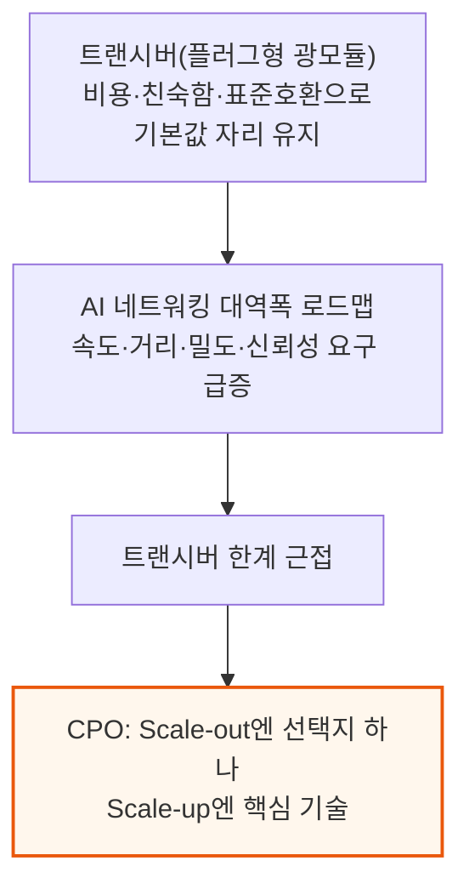
```mermaid
flowchart TD
    A["트랜시버(플러그형 광모듈)<br/>비용·친숙함·표준호환으로<br/>기본값 자리 유지"] --> B["AI 네트워킹 대역폭 로드맵<br/>속도·거리·밀도·신뢰성 요구 급증"]
    B --> C["트랜시버 한계 근접"]
    C --> D["CPO: Scale-out엔 선택지 하나<br/>Scale-up엔 핵심 기술"]

    style D fill:#fff7ed,stroke:#ea580c,stroke-width:2px
```

기존 방식은 스위치·GPU 칩에서 나온 전기 신호가 섀시 앞판의 트랜시버 케이지까지 15\~30cm를 구리선(LR SerDes)으로 이동한 뒤, 트랜시버 안의 DSP(Digital Signal Processor, 신호를 다시 다듬어주는 칩)가 신호를 복원·정리하고 나서야 광신호로 바뀝니다. CPO는 광엔진을 XPU(가속기 칩)나 스위치 ASIC 바로 옆에 붙여 이 DSP를 아예 없애고, 저전력 SerDes만 쓰게 만듭니다.

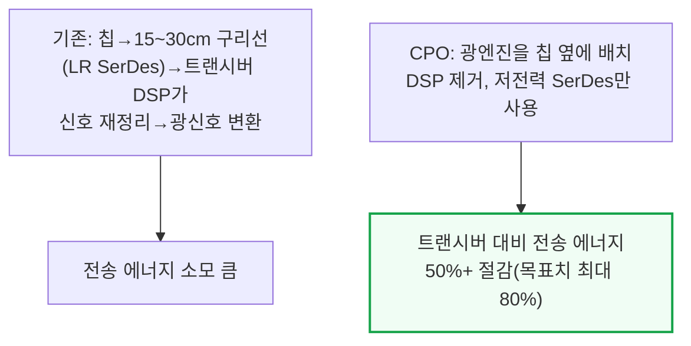
```mermaid
flowchart TD
    Old["기존: 칩→15~30cm 구리선<br/>(LR SerDes)→트랜시버 DSP가<br/>신호 재정리→광신호 변환"] --> P1["전송 에너지 소모 큼"]
    New["CPO: 광엔진을 칩 옆에 배치<br/>DSP 제거, 저전력 SerDes만 사용"] --> P2["트랜시버 대비 전송 에너지<br/>50%+ 절감(목표치 최대 80%)"]

    style P2 fill:#f0fdf4,stroke:#16a34a,stroke-width:2px
```

이 글은 5부로 구성됩니다.

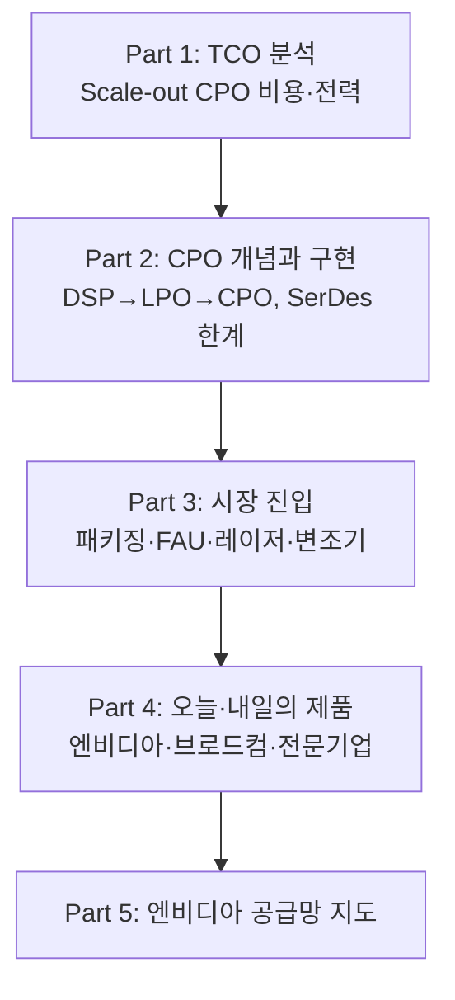
```mermaid
flowchart TD
    Pt1["Part 1: TCO 분석<br/>Scale-out CPO 비용·전력"] --> Pt2["Part 2: CPO 개념과 구현<br/>DSP→LPO→CPO, SerDes 한계"]
    Pt2 --> Pt3["Part 3: 시장 진입<br/>패키징·FAU·레이저·변조기"]
    Pt3 --> Pt4["Part 4: 오늘·내일의 제품<br/>엔비디아·브로드컴·전문기업"]
    Pt4 --> Pt5["Part 5: 엔비디아 공급망 지도"]
```

---

## 2. AI 클러스터 네트워킹 구성과 TCO 개관

**📌 핵심:**
- 대형 AI 클러스터의 네트워킹은 백엔드망(GPU끼리 학습·추론 데이터를 주고받는 통신망)·프론트엔드망·아웃오브밴드 관리망 3층 구조 — 요구조건이 가장 까다로운 백엔드망이 GB300 NVL72 3층 InfiniBand 클러스터 기준 네트워킹 비용의 85%, 네트워킹 전력의 86%를 차지
- 네트워킹 비용은 AI 서버 다음으로 클러스터 총비용에서 두 번째로 큰 항목 — GB300 NVL72 3층망에서 클러스터 총비용의 15%(4층망은 18%)를 차지하고, 이 중 광트랜시버가 네트워킹 비용의 60%(엔비디아 LinkX 트랜시버 기준), 네트워킹 전력의 45%를 잡아먹음
- GPU 수가 늘수록 더 많은 네트워킹 계층(2층→3층→4층)이 필요해져 비용·전력 부담이 커짐 — CPO는 계층 수를 그대로 두고도 비용·전력을 낮출 수 있고, 같은 계층 수로 더 많은 GPU를 연결해 총비용·전력을 더 크게 낮출 수도 있음
- 결론: 이 글은 CPO 배치가 당장 집중될 백엔드망(back-end fabric)에 초점을 맞춤

---

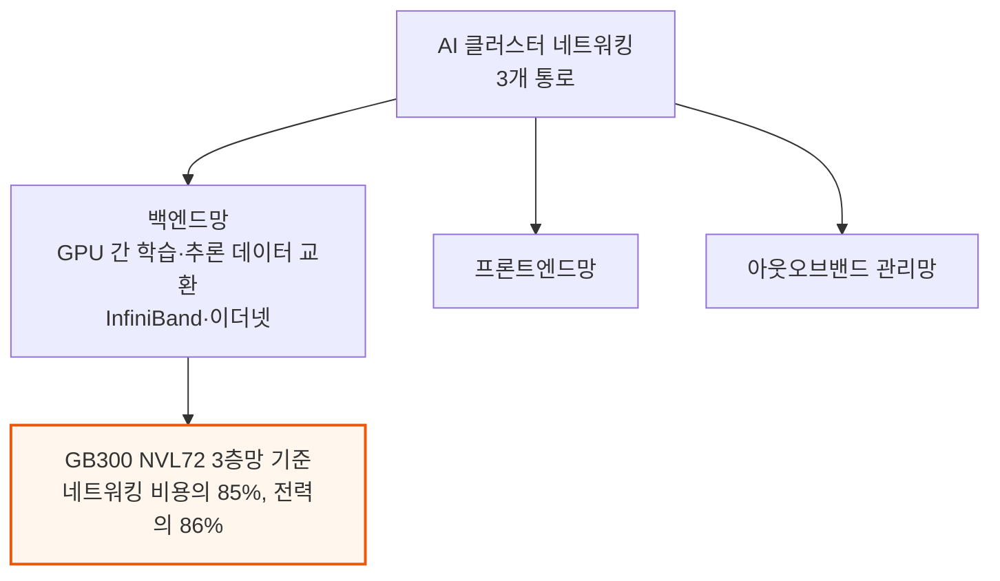
```mermaid
flowchart TD
    F["AI 클러스터 네트워킹<br/>3개 통로"] --> BE["백엔드망<br/>GPU 간 학습·추론 데이터 교환<br/>InfiniBand·이더넷"]
    F --> FE["프론트엔드망"]
    F --> OOB["아웃오브밴드 관리망"]
    BE --> Share["GB300 NVL72 3층망 기준<br/>네트워킹 비용의 85%, 전력의 86%"]

    style Share fill:#fff7ed,stroke:#ea580c,stroke-width:2px
```

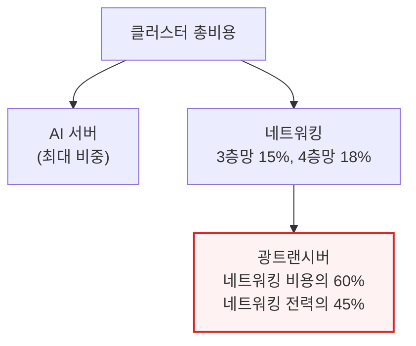
```mermaid
flowchart TD
    Cluster["클러스터 총비용"] --> Server["AI 서버<br/>(최대 비중)"]
    Cluster --> Net["네트워킹<br/>3층망 15%, 4층망 18%"]
    Net --> Trans["광트랜시버<br/>네트워킹 비용의 60%<br/>네트워킹 전력의 45%"]

    style Trans fill:#fef2f2,stroke:#dc2626,stroke-width:2px
```

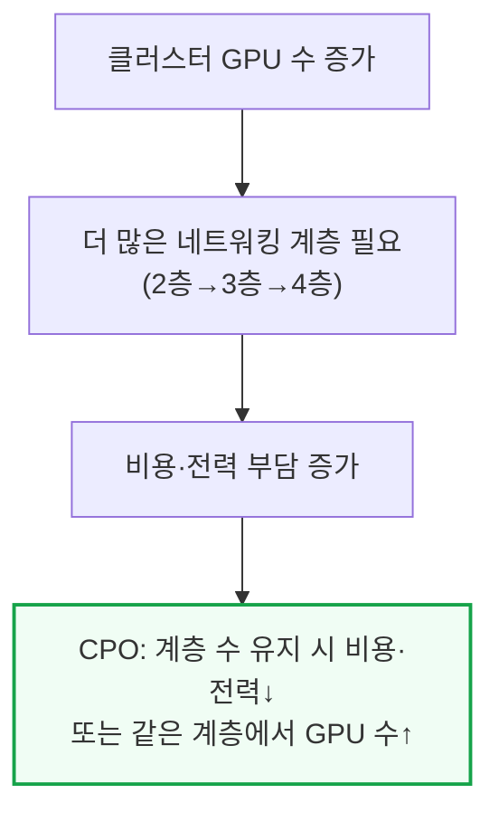
```mermaid
flowchart TD
    MoreGPU["클러스터 GPU 수 증가"] --> MoreLayer["더 많은 네트워킹 계층 필요<br/>(2층→3층→4층)"]
    MoreLayer --> CostUp["비용·전력 부담 증가"]
    CostUp --> CPOHelp["CPO: 계층 수 유지 시 비용·전력↓<br/>또는 같은 계층에서 GPU 수↑"]

    style CPOHelp fill:#f0fdf4,stroke:#16a34a,stroke-width:2px
```

---

## 3. CPO Scale-out 전력 예산

**📌 핵심:**
- 20만 대 GB300 NVL72(랙당 GPU 패키지 72개·컴퓨트 칩렛 144개) 클러스터를 3층망으로 구성하면 핵심 IT 전력 435MW가 필요한데 이 중 17MW를 광트랜시버 혼자 소모 — 트랜시버를 없애면 아낄 수 있는 전력이 상당함
- 트랜시버 1개(800G DSP 방식)의 소비전력은 16\~17W인데, CPO의 광엔진+외부 레이저 소스는 800G당 4\~5W(엔비디아 Q3450 CPO 스위치 기준)로 73% 낮음 — 메타가 ECOC 2025에서 발표한 실측치도 비슷한 폭(트랜시버 15W vs 브로드컴 Bailly CPO 스위치 5.4W, 65% 절감)
- 클러스터 전체로 보면 DSP에서 LPO(DSP를 없앤 절충형 광모듈)로만 바꿔도 트랜시버 전력 36%·네트워킹 전력 16% 감소, CPO로 완전히 전환하면 트랜시버 전력은 84% 줄지만 새로 늘어난 광엔진·레이저가 스위치 전력을 23% 늘림(그래도 순감소는 유지)
- 결론: 그런데 네트워킹은 애초에 클러스터 총전력의 9%에 불과 — 3층망에서 CPO로 네트워킹 전력을 23% 줄여도 클러스터 총전력은 2%만 줄고, 2층망으로 평탄화(계층을 하나 줄이는 것)해도 총전력 절감은 4%에 그침

---

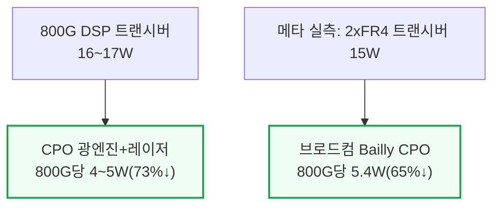
```mermaid
flowchart TD
    DSP["800G DSP 트랜시버<br/>16~17W"] --> Gap["CPO 광엔진+레이저<br/>800G당 4~5W(73%↓)"]
    Meta1["메타 실측: 2xFR4 트랜시버 15W"] --> Meta2["브로드컴 Bailly CPO<br/>800G당 5.4W(65%↓)"]

    style Gap fill:#f0fdf4,stroke:#16a34a,stroke-width:2px
    style Meta2 fill:#f0fdf4,stroke:#16a34a,stroke-width:2px
```

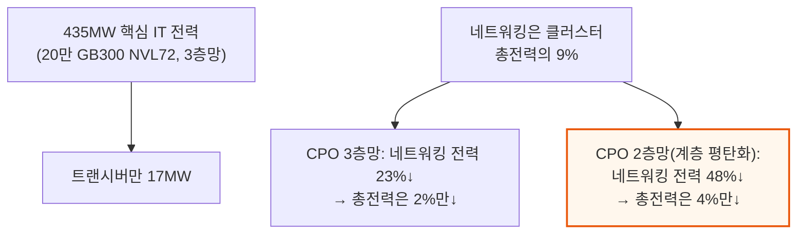
```mermaid
flowchart TD
    Total["435MW 핵심 IT 전력<br/>(20만 GB300 NVL72, 3층망)"] --> TransP["트랜시버만 17MW"]
    NetShare["네트워킹은 클러스터<br/>총전력의 9%"] --> CPO3["CPO 3층망: 네트워킹 전력 23%↓<br/>→ 총전력은 2%만↓"]
    NetShare --> CPO2["CPO 2층망(계층 평탄화):<br/>네트워킹 전력 48%↓<br/>→ 총전력은 4%만↓"]

    style CPO2 fill:#fff7ed,stroke:#ea580c,stroke-width:2px
```

고radix(포트 수가 많은) 스위치를 쓰면 셔플(신호를 여러 목적지로 흩뿌리는 작업)이 스위치 박스 안에서 처리돼, 겉으로는 포트 수가 매우 많은 스위치 하나로 보입니다. 이 덕분에 3층망을 2층망으로 평탄화할 수 있습니다.

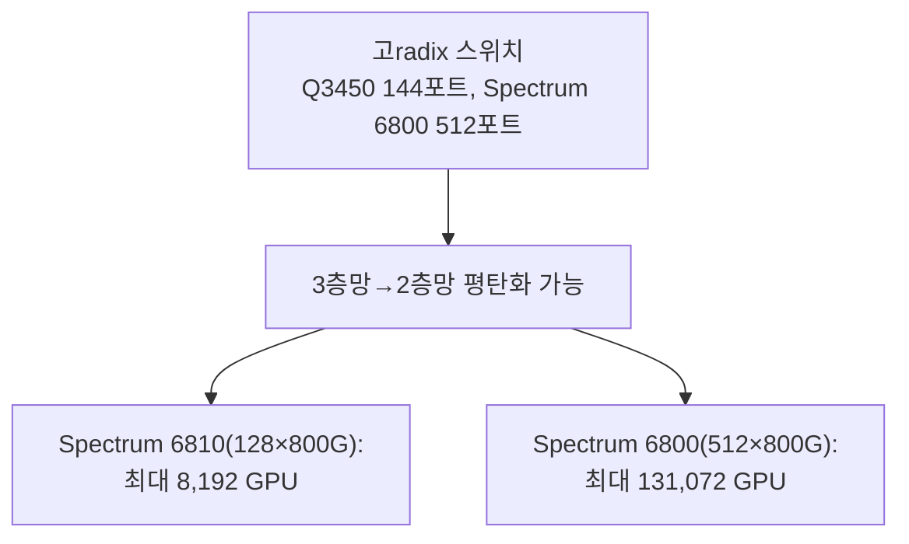
```mermaid
flowchart TD
    HighRadix["고radix 스위치<br/>Q3450 144포트, Spectrum 6800 512포트"] --> Flatten["3층망→2층망 평탄화 가능"]
    Flatten --> Cap1["Spectrum 6810(128×800G):<br/>최대 8,192 GPU"]
    Flatten --> Cap2["Spectrum 6800(512×800G):<br/>최대 131,072 GPU"]
```

---

## 4. CPO Scale-out 총소유비용(TCO)

**📌 핵심:**
- 엔비디아 Q3450 CPO 스위치의 광엔진 원가는 시스템당 약 $35\~40k(FAU 포함) — 같은 대역폭을 트랜시버로 채우면 원가 $72k로 오히려 광엔진보다 2배 비쌈
- 하지만 여기에 스위치 벤더의 60% 매출총이익률(마진)을 적용하면 광엔진 원가는 $80\~90k까지 뛰어 트랜시버 원가($72k)보다 오히려 비싸질 수 있음 — 소수 스위치 벤더가 마진을 얹는 CPO 구조가 다수 트랜시버 벤더 간 가격 경쟁이 있던 기존 구조의 이점을 상쇄
- 3층망 기준 CPO 전환 시 트랜시버를 안 사는 덕에 86% 절감되지만 마진이 실린 스위치 비용이 81% 늘어나 상쇄 — 결국 네트워킹 총비용은 31% 낮아지지만 클러스터 총비용은 3%만 낮아짐. 2층망으로 평탄화하면 클러스터 총비용 절감폭이 7%까지 커짐
- 결론: CPO Scale-out은 비용 최대 7%↓·전력 최대 4%↓ 효과뿐인데, 현장 정비 어려움·신뢰성 불안·소수 벤더 종속(협상력 상실)까지 감안하면 단기간 급속한 채택은 기대하기 어려움 — 실제로 하이퍼스케일러 사이에서 빠르게 퍼지고 있지도 않음

---

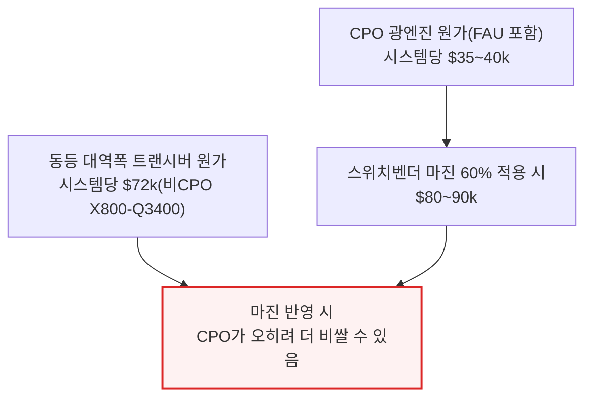
```mermaid
flowchart TD
    OE["CPO 광엔진 원가(FAU 포함)<br/>시스템당 $35~40k"] --> Margin["스위치벤더 마진 60% 적용 시<br/>$80~90k"]
    Trans["동등 대역폭 트랜시버 원가<br/>시스템당 $72k(비CPO X800-Q3400)"] --> Compare["마진 반영 시<br/>CPO가 오히려 더 비쌀 수 있음"]
    Margin --> Compare

    style Compare fill:#fef2f2,stroke:#dc2626,stroke-width:2px
```

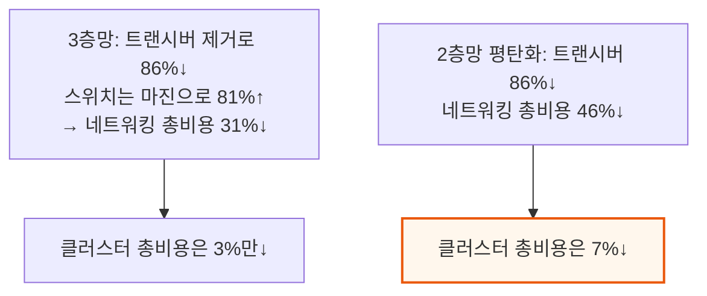
```mermaid
flowchart TD
    L3["3층망: 트랜시버 제거로 86%↓<br/>스위치는 마진으로 81%↑<br/>→ 네트워킹 총비용 31%↓"] --> ClusterL3["클러스터 총비용은 3%만↓"]
    L2["2층망 평탄화: 트랜시버 86%↓<br/>네트워킹 총비용 46%↓"] --> ClusterL2["클러스터 총비용은 7%↓"]

    style ClusterL2 fill:#fff7ed,stroke:#ea580c,stroke-width:2px
```

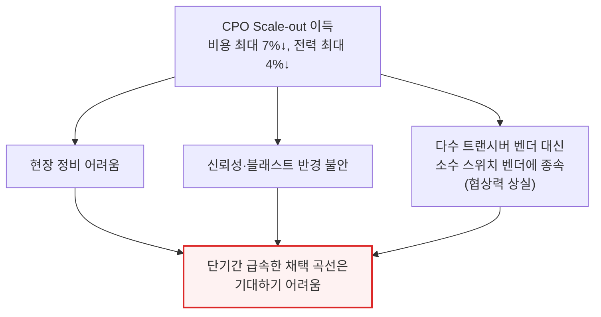
```mermaid
flowchart TD
    Savings["CPO Scale-out 이득<br/>비용 최대 7%↓, 전력 최대 4%↓"] --> Barrier1["현장 정비 어려움"]
    Savings --> Barrier2["신뢰성·블래스트 반경 불안"]
    Savings --> Barrier3["다수 트랜시버 벤더 대신<br/>소수 스위치 벤더에 종속<br/>(협상력 상실)"]
    Barrier1 --> Result["단기간 급속한 채택 곡선은<br/>기대하기 어려움"]
    Barrier2 --> Result
    Barrier3 --> Result

    style Result fill:#fef2f2,stroke:#dc2626,stroke-width:2px
```

---

## 5. CPO는 Scale-up의 킬러 애플리케이션 - TAM과 구리 대 광

**📌 핵심:**
- 구리 케이블은 200Gbit/s 레인 기준 최대 2m까지만 도달 — Scale-up "월드 사이즈"(하나의 Scale-up 영역 안에 묶을 수 있는 GPU 수)가 랙 1\~2개로 제한됨. CPO는 이 거리 제약을 없애 이론상 얼마든지 큰 Scale-up 영역을 만들 수 있게 함
- 엔비디아 GB200은 all-to-all(모든 GPU가 서로 직접 연결)로 묶는 GPU 수를 8개에서 72개로 늘려 큰 성능 도약을 이뤘고, 루빈 울트라용 Kyber 랙은 144개 GPU 패키지(576개 다이)까지 밀도를 끌어올림(GB200/300 NVL72 대비 4배) — 구리로 이 밀도를 유지하려니 전력·냉각·제조 난이도가 극한까지 치솟음
- Scale-up 인터커넥트의 대역폭 요구는 Scale-out보다 훨씬 큼 — 블랙웰의 NVLink 5는 GPU당 7,200Gbit/s(단방향)로, 백엔드 Scale-out(CX-8 NIC 기준 800Gbit/s)의 9배. 이 때문에 CPO 시장 규모(TAM)는 이미 Scale-out보다 Scale-up 쪽이 훨씬 큼
- 결론: 구리 레인당 대역폭을 늘리는 것도 점점 어려워짐(루빈은 양방향 SerDes로 224Gbit/s 송신+224Gbit/s 수신을 합쳐 2배 확장하지만, 진짜 단방향 448G는 시기가 불확실) — 반면 CPO는 보율(Baud rate)·파장분할다중화(DWDM)·광섬유쌍 추가·변조 방식이라는 여러 벡터를 동시에 조합해 계속 확장 가능

---

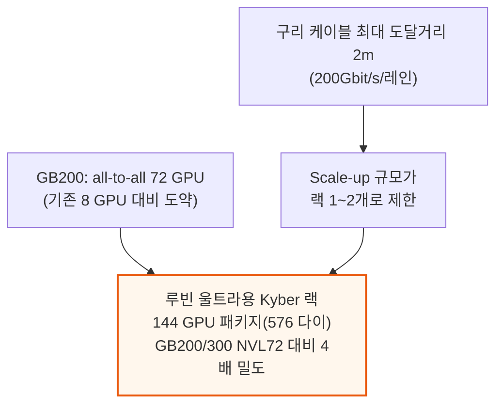
```mermaid
flowchart TD
    CuLimit["구리 케이블 최대 도달거리 2m<br/>(200Gbit/s/레인)"] --> WorldSize["Scale-up 규모가<br/>랙 1~2개로 제한"]
    GB200["GB200: all-to-all 72 GPU<br/>(기존 8 GPU 대비 도약)"] --> Kyber["루빈 울트라용 Kyber 랙<br/>144 GPU 패키지(576 다이)<br/>GB200/300 NVL72 대비 4배 밀도"]
    WorldSize --> Kyber

    style Kyber fill:#fff7ed,stroke:#ea580c,stroke-width:2px
```

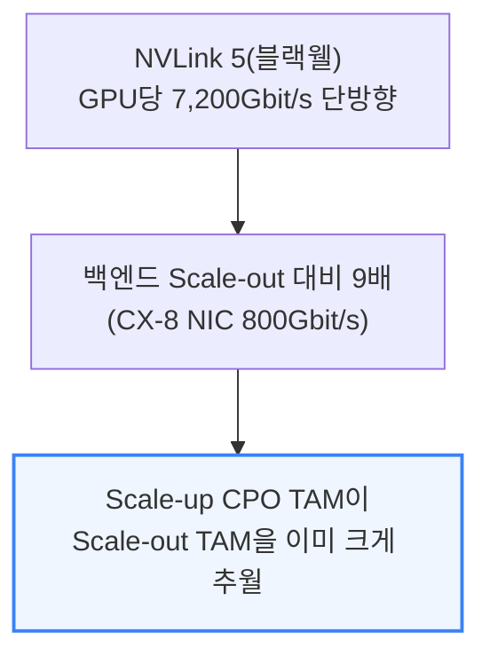
```mermaid
flowchart TD
    NVLink["NVLink 5(블랙웰)<br/>GPU당 7,200Gbit/s 단방향"] --> Ratio["백엔드 Scale-out 대비 9배<br/>(CX-8 NIC 800Gbit/s)"]
    Ratio --> TAMgrow["Scale-up CPO TAM이<br/>Scale-out TAM을 이미 크게 추월"]

    style TAMgrow fill:#eff6ff,stroke:#3b82f6,stroke-width:2px
```

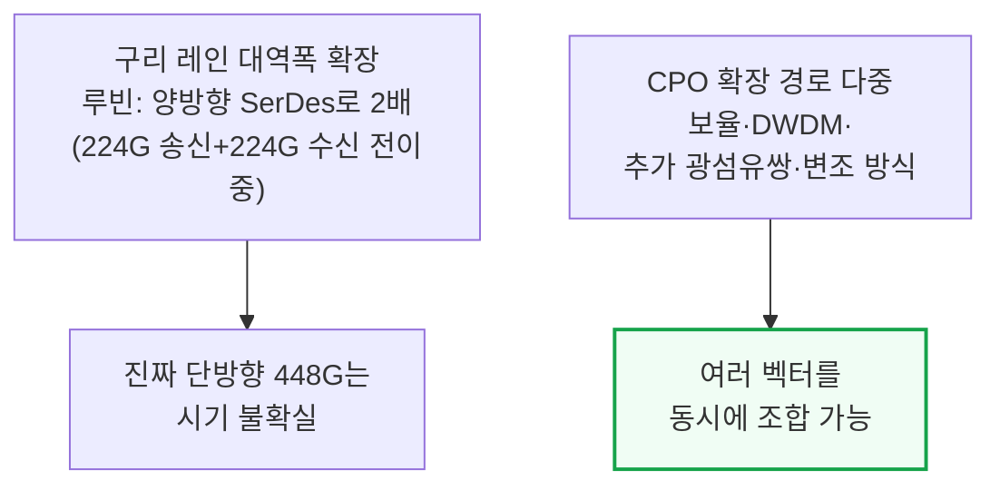
```mermaid
flowchart TD
    Copper["구리 레인 대역폭 확장<br/>루빈: 양방향 SerDes로 2배<br/>(224G 송신+224G 수신 전이중)"] --> Limit["진짜 단방향 448G는<br/>시기 불확실"]
    CPO["CPO 확장 경로 다중<br/>보율·DWDM·<br/>추가 광섬유쌍·변조 방식"] --> Flexible["여러 벡터를<br/>동시에 조합 가능"]

    style Flexible fill:#f0fdf4,stroke:#16a34a,stroke-width:2px
```

---

## 6. CPO는 언제 주류가 되나 - 메타 신뢰성 데이터

**📌 핵심:**
- 엔비디아가 루빈 울트라(Scale-up)가 아니라 Scale-out 스위치에서만 먼저 CPO를 내놓는 이유는 공급망 미성숙·제조 난이도·고객 불안 때문 — Quantum·Spectrum CPO 스위치는 공급망을 단련시키고 실제 신뢰성·정비성 데이터를 쌓는 예행연습 역할
- 메타가 브로드컴과 함께 ECOC 2025에서 발표한 실측 데이터가 힌트를 줌 — Bailly 51.2T CPO 스위치 15대로 104.9만 개(400G 포트 기준) 시간까지 장애·정정불가 오류(UCW) 0건, 15M 포트시간까지 확장한 데이터에서도 첫 400만 포트시간 동안 UCW 0건, 평균고장간격(MTBF)은 트랜시버(2xFR4) 50\~100만 시간 대비 CPO가 260만 시간으로 더 김
- 다만 15M 포트시간은 51.2T 스위치 15대를 약 325일(7,812시간) 돌린 것에 불과 — 저자들은 실험실 조건과 실제 데이터센터의 온도 변동(메타 Llama 3 논문은 1\~2% 온도 변동이 전력 소비에 영향을 준다고 보고), 먼지 등 변수가 다르다는 점을 지적. CPO의 미검출 장애율은 0.06%로 낮아 보이지만 장애 하나의 블래스트 반경(영향 범위)이 800G 포트 64개에 달함
- 결론: 이 데이터는 공포 조장이 아니라 더 큰 규모의 현장 실측이 필요하다는 근거 — 루빈 울트라의 Scale-out CPO는 2027년(실제로는 2027년 말로 예상)을 목표로 하지만 공급망이 수천만 개의 CPO 엔드포인트를 대지 못할 전망이라, 진짜 전환점은 그다음 세대인 파인만(Feynman)이 될 것으로 봄

---

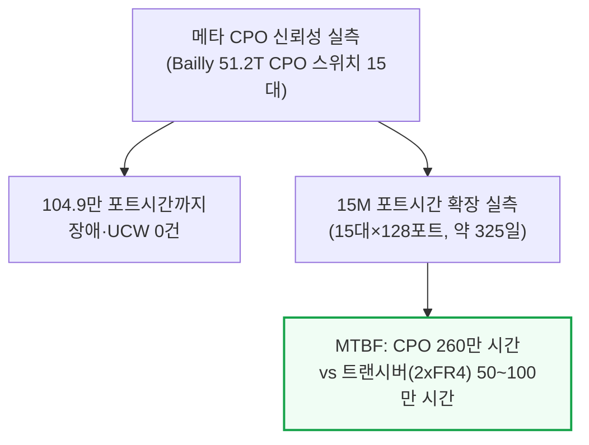
```mermaid
flowchart TD
    Test["메타 CPO 신뢰성 실측<br/>(Bailly 51.2T CPO 스위치 15대)"] --> P1["104.9만 포트시간까지<br/>장애·UCW 0건"]
    Test --> P2["15M 포트시간 확장 실측<br/>(15대×128포트, 약 325일)"]
    P2 --> P3["MTBF: CPO 260만 시간<br/>vs 트랜시버(2xFR4) 50~100만 시간"]

    style P3 fill:#f0fdf4,stroke:#16a34a,stroke-width:2px
```

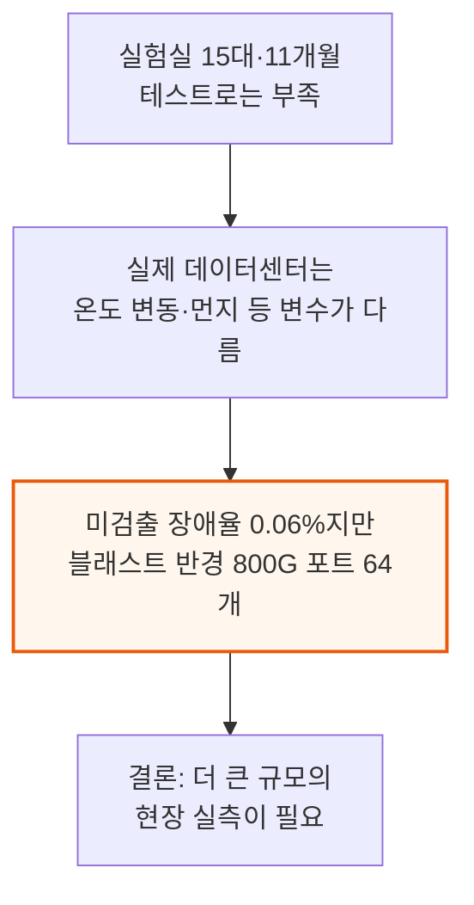
```mermaid
flowchart TD
    Lab["실험실 15대·11개월<br/>테스트로는 부족"] --> Prod["실제 데이터센터는<br/>온도 변동·먼지 등 변수가 다름"]
    Prod --> Dust["미검출 장애율 0.06%지만<br/>블래스트 반경 800G 포트 64개"]
    Dust --> Call["결론: 더 큰 규모의<br/>현장 실측이 필요"]

    style Dust fill:#fff7ed,stroke:#ea580c,stroke-width:2px
```

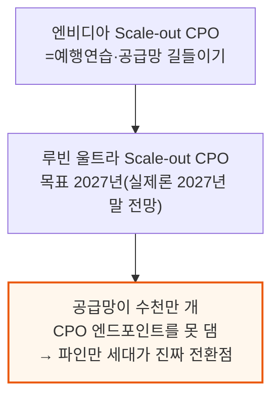
```mermaid
flowchart TD
    Now["엔비디아 Scale-out CPO<br/>=예행연습·공급망 길들이기"] --> Rubin["루빈 울트라 Scale-out CPO<br/>목표 2027년(실제론 2027년 말 전망)"]
    Rubin --> Feynman["공급망이 수천만 개<br/>CPO 엔드포인트를 못 댐<br/>→ 파인만 세대가 진짜 전환점"]

    style Feynman fill:#fff7ed,stroke:#ea580c,stroke-width:2px
```

---

## 7. CPO란 무엇인가 - NPO·OBO와 개념

**📌 핵심:**
- CPO는 빛을 전기 신호로 바꾸는 광엔진을 GPU·스위치 ASIC과 같은 패키지 안에 직접 붙이는 방식 — 신호가 몇 m 이상 이동해야 하면 구리로는 전달이 안 되기 때문에 결국 광신호로 바꿔야 하는데, 그 변환 지점을 최대한 칩 가까이로 당기는 것이 핵심
- 기존 방식은 스위치·칩에서 나온 전기 신호가 PCB를 거쳐 섀시 앞판·뒷판의 트랜시버 케이지까지 수십 cm 이상 이동한 뒤, 트랜시버 안의 DSP가 신호를 복원하고 나서야 광신호로 바뀜 — 이 과정에서 신호가 열화돼 이를 구동·복원하는 데 많은 전력과 회로가 필요
- CPO는 광엔진을 호스트 칩 바로 옆(처음엔 기판, 향후엔 인터포저)에 둬 전기 배선 거리를 수십 cm에서 수 mm로 줄임 — 전력 소모를 크게 낮추고 대역폭 밀도를 높이며 신호 열화 문제를 줄여 지연시간도 낮춤
- 결론: CPO와 기존 트랜시버 사이에는 두 가지 중간 단계가 있음 — NPO(광엔진이 별도 기판에 탈착 가능하게 붙는 방식)와 OBO(광엔진을 섀시 내부 시스템 PCB에 두는 방식). OBO는 CPO의 복잡성과 트랜시버의 한계를 동시에 물려받아 "최악의 조합"으로 평가됨

---

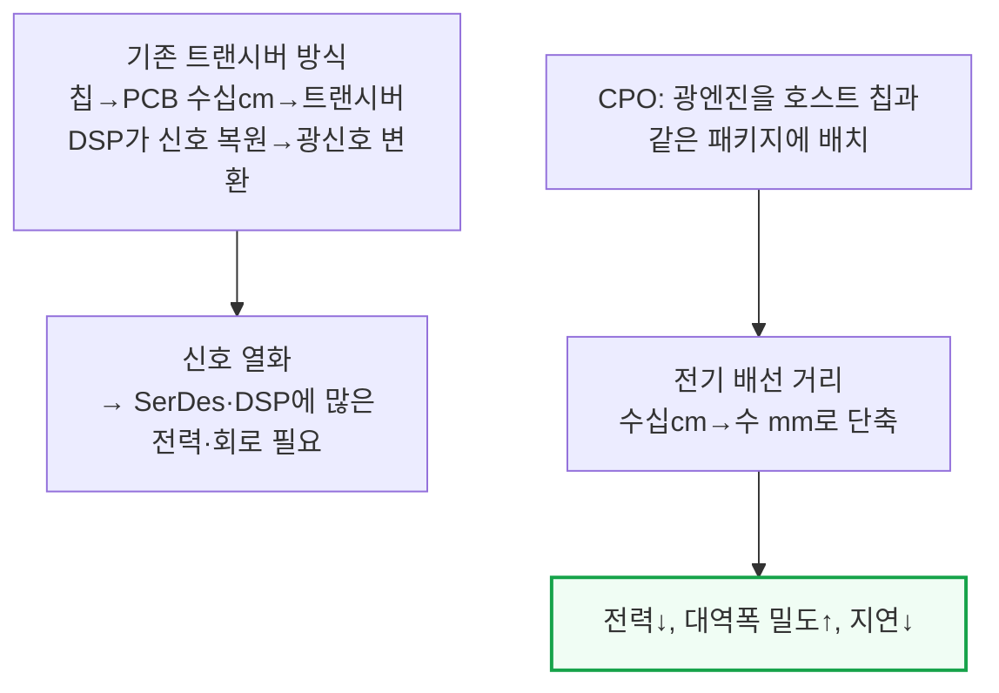
```mermaid
flowchart TD
    Old["기존 트랜시버 방식<br/>칩→PCB 수십cm→트랜시버<br/>DSP가 신호 복원→광신호 변환"] --> Deg["신호 열화<br/>→ SerDes·DSP에 많은<br/>전력·회로 필요"]
    New["CPO: 광엔진을 호스트 칩과<br/>같은 패키지에 배치"] --> Short["전기 배선 거리<br/>수십cm→수 mm로 단축"]
    Short --> Benefit["전력↓, 대역폭 밀도↑, 지연↓"]

    style Benefit fill:#f0fdf4,stroke:#16a34a,stroke-width:2px
```

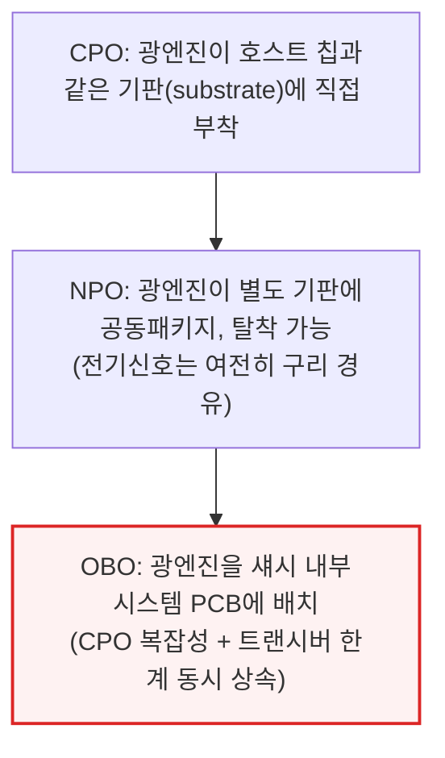
```mermaid
flowchart TD
    CPOx["CPO: 광엔진이 호스트 칩과<br/>같은 기판(substrate)에 직접 부착"] --> NPO["NPO: 광엔진이 별도 기판에<br/>공동패키지, 탈착 가능<br/>(전기신호는 여전히 구리 경유)"]
    NPO --> OBO["OBO: 광엔진을 섀시 내부<br/>시스템 PCB에 배치<br/>(CPO 복잡성 + 트랜시버 한계 동시 상속)"]

    style OBO fill:#fef2f2,stroke:#dc2626,stroke-width:2px
```

---

## 8. 공동패키지 구리(CPC)와 CPO가 지금까지 늦었던 이유

**📌 핵심:**
- CPC(Co-packaged Copper, 공동패키지 구리)는 CPO의 대안으로, 패키지 기판에서 바로 나오는 트윈액시얼(twin-axial) 구리 케이블을 씀 — 여전히 구리지만 절연이 좋아 신호 손실이 기존 전기 배선보다 훨씬 적고, 448G SerDes를 실현할 실질적인 경로로 꼽힘
- CPC는 기판이 수천 개 케이블에 전력·신호를 배선해야 하는 복잡도가 있지만 CPO보다는 훨씬 단순 — 랙 안 Scale-up처럼 거리가 짧은 용도에 특히 적합
- CPO가 기술적으로 우월한데도 채택이 더뎠던 이유는 ① 패키징 복잡도(광엔진 자체보다 패키징 비용이 더 큼)와 제조 난이도, ② 신뢰성·수율 문제, ③ 광·전기 부품을 밀착시키며 생기는 발열 관리 문제, ④ 업계 표준 부재 때문
- 결론: 가장 근본적인 고객 불안은 비용 통제력 상실 — 다수의 트랜시버 벤더를 경쟁시키기는 쉽지만 소수의 스위치 벤더에 종속되면 그러기 어려움. 반면 기존 플러그형 광모듈은 계속 성능이 좋아지고 있어 대부분의 용도에서 "이 정도면 충분"하고 고객 불안도 훨씬 적음

---

```mermaid
flowchart TD
    Flyover["기존 플라이오버 케이블<br/>PCB 배선 우회"] --> CPC["CPC(공동패키지 구리)<br/>소켓이 패키지 기판에서 시작<br/>트윈액시얼 케이블 사용"]
    CPC --> Benefit["신호 손실↓<br/>448G SerDes 실현 경로 제공"]
    CPC --> Limit["여전히 구리<br/>CPO보다 단순하지만<br/>수천 개 케이블 배선 복잡도↑"]

    style Benefit fill:#f0fdf4,stroke:#16a34a,stroke-width:2px
```

```mermaid
flowchart TD
    Reasons["CPO가 지금까지 늦은 이유"] --> R1["패키징 복잡도<br/>(광엔진 자체보다 비쌈)"]
    Reasons --> R2["신뢰성·수율·발열 관리 문제"]
    Reasons --> R3["업계 표준 부재"]
    Reasons --> R4["고객 불안: 소수 벤더에<br/>비용 통제력 넘겨줌"]

    style R4 fill:#fff7ed,stroke:#ea580c,stroke-width:2px
```

---

## 9. DSP 트랜시버에서 LPO로, LPO에서 CPO로

**📌 핵심:**
- DSP 트랜시버 안의 DSP 칩은 전력·비용 모두에서 가장 부담스러운 부품 — 800G SR8 트랜시버 기준 DSP가 모듈 전체 전력의 약 50%를 차지하고, 18k GB300 2층망 클러스터(트랜시버 4만 6,080개 필요) 전체로 보면 DSP 전력만 480kW(랙당 약 1.8kW)에 달함. 프리미엄 트랜시버는 클러스터 TCO의 약 10%까지 차지해 DSP가 "비용·전력 효율의 공공의 적 1호"로 불림
- 이 DSP를 없애려는 첫 시도가 LPO(Linear Pluggable Optics, DSP 없는 절충형 광모듈) — 스위치의 SerDes가 광소자를 직접 구동하게 해 DSP를 아예 빼지만, 실제로는 로이 응우옌(Loi Nguyen)이 2023년 SemiAnalysis 인터뷰에서 예측한 대로 널리 퍼지지 못함
- CPO는 LPO를 한 단계 더 밀어붙여, 광엔진을 호스트 칩과 같은 패키지에 둬 DSP 필요성 자체를 없앰 — 거리가 워낙 짧아지니 전력·면적을 많이 잡아먹는 장거리(LR) SerDes 대신 짧은 SerDes나 클럭 동기형 Wide I/O(한 번에 넓은 폭으로 신호를 주고받는 인터페이스)를 쓸 수 있게 됨
- 결론: 그런데도 CPO가 "20년째 코앞"이라는 말을 들어온 이유는 플러그형 트랜시버의 두 강점 때문 — ① OSFP·QSFP-DD 같은 표준 폼팩터와 OIF 표준 덕분에 벤더를 자유롭게 골라 협상력을 유지할 수 있다는 점, ② 원격 인력이 케이블을 뽑았다 꽂으면 끝나는 손쉬운 현장 정비. CPO는 광엔진 하나가 고장 나면 스위치 전체가 못 쓰게 될 위험이 있어, 최근에는 가장 고장이 잦은 레이저만이라도 탈착식 외부 광원으로 분리해 정비성을 보완하는 추세

---

```mermaid
flowchart TD
    DSPcost["800G SR8 트랜시버 기준<br/>DSP가 전체 전력의 ~50%"] --> Cluster["18k GB300 클러스터(2층망):<br/>DSP 전력만 480kW<br/>(랙당 약 1.8kW)"]
    DSPcost --> BOM["DSP가 트랜시버 BOM의 20~30%<br/>+ 프리미엄 트랜시버는<br/>클러스터 TCO의 약 10%"]

    style DSPcost fill:#fef2f2,stroke:#dc2626,stroke-width:2px
```

```mermaid
flowchart TD
    DSPx["DSP 트랜시버<br/>DSP가 신호 복원 후 광변환"] --> LPO["LPO: DSP 제거,<br/>SerDes가 광소자를 직접 구동"]
    LPO --> CPOx["CPO: 광엔진을 호스트 칩과<br/>같은 패키지로 이동<br/>DSP 필요성 자체가 사라짐"]

    style CPOx fill:#f0fdf4,stroke:#16a34a,stroke-width:2px
```

```mermaid
flowchart TD
    Pluggable["플러그형 트랜시버 장점"] --> Inter["높은 상호운용성<br/>(OSFP·QSFP-DD, OIF 표준)"]
    Pluggable --> Service["현장 정비 쉬움<br/>(원격 인력이 바로 교체)"]
    CPOcon["CPO 단점"] --> Fail["광엔진 장애 시<br/>스위치 전체 사용불가 위험"]
    CPOcon --> Laser["레이저가 최다 장애 지점<br/>→ 대부분 탈착식<br/>외부 레이저로 대응"]

    style Fail fill:#fef2f2,stroke:#dc2626,stroke-width:2px
```

---

## 10. 왜 CPO인가 - I/O 병목과 SerDes 한계

**📌 핵심:**
- DSP 제거 말고도 CPO의 큰 강점은 "대역폭 밀도÷에너지 소비"라는 지표(FoM, Figure of Merit)에서 나옴 — 전기 링크는 거리가 늘수록 이 지표가 지수적으로 나빠지고, 전기에서 광신호로 바꾸는 순간 효율이 한 자릿수(10배 안팎) 더 떨어짐(트랜시버까지 신호를 밀어내고 광용 DSP까지 돌려야 해서). CPO의 곡선은 이 지표에서 항상 플러그형보다 위에 있음 — "짧은 거리는 구리, 꼭 필요할 때만 광"이라는 원칙을 그대로 지키면서도 더 유리한 지점에서 시작
- 트랜지스터 밀도·연산력(FLOPs)은 꾸준히 늘었지만 칩 밖으로 데이터를 내보내는 통로(I/O)는 훨씬 느리게 확장 — 패키지 기판에 낼 수 있는 범프(연결점) 수가 물리적으로 제한돼 있어 이 통로 자체가 병목이 됨
- NVLink가 1.0에서 5.0으로 오면서 대역폭이 11배 이상 늘었는데, 그 동력은 레인(전선 가닥) 수 증가(32→36개, 거의 그대로)가 아니라 SerDes 레인 속도가 20G에서 200G로 10배 뛴 것 — NVLink 6.0은 200G SerDes를 유지한 채 레인 수를 2배로 늘려야 하는데, 이걸 같은 개수의 물리적 구리선으로 양방향 SerDes를 써서 편법으로 해결. 여기서 더 나아가긴 어려움 — 엔비디아의 경쟁우위인 NVLink가 AMD·하이퍼스케일러에 따라잡힐 빌미가 될 수 있음
- 결론: 해법은 전기로 신호를 밀어야 하는 거리를 최대한 줄이고, 호스트 ASIC에 최대한 가까운 곳에서 광신호로 넘기는 것 — 그래서 CPO가 인터커넥트의 "홀리 그레일(궁극의 목표)"로 불림. 거리가 짧아지면 SerDes 자체도 짧은 거리용으로 최적화할 수 있어 설계가 쉬워지고 전력·면적도 줄어듦

---

```mermaid
flowchart TD
    FoM["대역폭 밀도÷에너지 소비<br/>= 인터커넥트 품질 지표(FoM)"] --> Elec["전기 링크: 거리 늘수록<br/>FoM 지수적으로 악화"]
    Elec --> OptConv["광 변환 도입 시<br/>효율 한 자릿수(10배) 안팎 하락<br/>(트랜시버까지 신호 구동+광DSP 전력)"]
    CPOcurve["CPO의 FoM 곡선은<br/>플러그형보다 항상 위"] --> Rule["원칙: 짧은 거리는 구리,<br/>꼭 필요할 때만 광"]

    style CPOcurve fill:#f0fdf4,stroke:#16a34a,stroke-width:2px
```

```mermaid
flowchart TD
    Compute["트랜지스터 밀도·연산력(FLOPs)<br/>은 꾸준히 확장"] --> IO["I/O는 훨씬 느리게 확장<br/>(패키지 기판 범프 수 제한)"]
    IO --> Bottleneck["칩 밖으로 데이터를<br/>내보낼 통로(shoreline) 자체가 병목"]
    Bottleneck --> SerDesLim["224G SerDes조차<br/>도달에 어려움<br/>(속도 오를수록 손실 급증)"]

    style Bottleneck fill:#fff7ed,stroke:#ea580c,stroke-width:2px
```

```mermaid
flowchart TD
    NVLink1["NVLink 1.0→5.0<br/>대역폭 11배+↑"] --> Cause["레인 수는 32→36개로 거의 그대로<br/>(SerDes 속도 20G→200G, 10배↑가 주역)"]
    Cause --> NVLink6["NVLink 6.0: 200G SerDes 유지<br/>→ 레인 수를 2배로 늘려야 함<br/>(양방향 SerDes로 편법 해결)"]
    NVLink6 --> Risk["더 이상 늘리기 어려움<br/>NVLink 경쟁우위가<br/>AMD·하이퍼스케일러에 따라잡힐 위험"]

    style Risk fill:#fef2f2,stroke:#dc2626,stroke-width:2px
```

```mermaid
flowchart TD
    Compromise["해법: 전기 I/O 거리를<br/>최대한 줄이고<br/>가능한 한 칩 가까이서 광변환"] --> CPOgold["CPO = 인터커넥트의<br/>'홀리 그레일'"]
    CPOgold --> ShortSerDes["짧은 SerDes로 최적화 가능<br/>→ 설계 쉬움, 전력·면적↓"]

    style CPOgold fill:#f0fdf4,stroke:#16a34a,stroke-width:2px
```

---

## 11. Wide I/O vs SerDes, 링크 신뢰성

**📌 핵심:**
- 전기 신호를 먼 거리까지 몰 필요가 없어지면 직렬(SerDes) 방식을 완전히 벗어나 한 번에 넓은 폭으로 데이터를 주고받는 Wide I/O(예: UCIe 인터페이스)를 쓸 수 있음 — 인터포저용 UCIe-A는 mm당 약 10Tbit/s의 배선 밀도를 내는데, 이는 블랙웰의 패키지 외부 대역폭(mm당 약 0.4Tbit/s)과 비교가 안 될 정도로 큰 격차. 다만 이는 단순 비교가 아님 — CPO에서는 애초에 "먼 거리"라는 전제 자체가 사라지기 때문
- 이 정도 배선 밀도에 도달하려면 광엔진이 호스트와 인터포저를 공유해야 하는데, 이는 오늘날 현실과는 아직 거리가 먼 로드맵 — 그보다 앞서 나올 기판(substrate)용 UCIe-S는 mm당 약 1.8Tbit/s로, 224G SerDes(mm당 약 0.4Tbit/s)보다는 확실히 우위
- 그럼에도 브로드컴·엔비디아는 전기 SerDes 로드맵을 계속 유지 — SerDes를 더 확장할 수 있다고 판단하고, 광 채택 속도가 아직 느려 구리용 설계도 병행해야 하기 때문. 앞으로도 공동패키지 구리와 CPO가 한동안 공존하며 두 가지를 동시에 최적화해야 할 전망(설계 하나로 여러 테이프아웃을 피하려는 목적)
- 결론: 대형 AI 클러스터는 약 100만 개 링크를 플러그형 모듈로 운용하는데 하루 수십 건씩 링크 장애가 발생하고, 반품된 광모듈의 80%는 "이상 없음"으로 판정될 만큼 원인 특정이 어려운 '소프트' 장애가 많음 — CPO는 부품 수를 줄이고 신호 경로를 짧게 해 복잡도를 낮추고, 공장에서 '검증 완료' 상태로 조립돼 나와 현장 설치 변수 자체를 없앰

---

```mermaid
flowchart TD
    UCIe["UCIe-A(인터포저용)<br/>mm당 ~10Tbit/s 배선밀도"] --> Reticle["레티클급 칩 긴 변 기준<br/>최대 330Tbit/s(양쪽 660Tbit/s)"]
    Blackwell["블랙웰 패키지 외부 대역폭<br/>23.6Tbit/s(mm당 ~0.4Tbit/s)"] --> Gap["UCIe 대비 큰 격차<br/>(단, CPO에선 거리 제약이<br/>사라져 비교 전제 자체가 다름)"]
    UCIeS["UCIe-S(기판용)<br/>mm당 ~1.8Tbit/s<br/>(224G SerDes 대비 우위)"]

    style Reticle fill:#eff6ff,stroke:#3b82f6,stroke-width:2px
```

```mermaid
flowchart TD
    WideIO["Wide I/O가 이론상 더 우수"] --> ButStill["그런데도 엔비디아·브로드컴은<br/>전기 SerDes 로드맵 유지"]
    ButStill --> R1["SerDes를 계속 확장할 수 있다는 판단"]
    ButStill --> R2["광 채택 속도가 느려<br/>구리용 설계도 병행 필요"]
    ButStill --> R3["공동패키지 구리+CPO가<br/>당분간 공존할 전망"]
```

```mermaid
flowchart TD
    Today["대형 클러스터(약 100만 링크)<br/>하루 수십 건 링크 장애"] --> Soft["다수는 '소프트' 장애<br/>(반품 모듈의 80%가 '이상 없음')"]
    CPOfix["CPO의 신뢰성 개선 경로"] --> F1["부품 수 감소 → 복잡도↓"]
    CPOfix --> F2["신호 경로 단축 → 신호 무결성↑"]
    CPOfix --> F3["공장 출하 시 '검증 완료'<br/>상태로 조립 → 현장 설치 변수 제거"]

    style CPOfix fill:#f0fdf4,stroke:#16a34a,stroke-width:2px
```

---

## 12. 광엔진 제조와 시장 진입 - 호스트·광엔진 패키징

**📌 핵심:**
- CPO는 아직 대규모 채택에 걸맞은 물량으로 만들어진 적이 없음 — 브로드컴(Bailly·Humboldt)만 소량으로 양산 CPO 시스템을 출하했었고, 이제 엔비디아가 합류. 공급망 미성숙과 신뢰성 데이터 부족 탓에 고객사들도 아직 몸을 사림
- CPO가 자리 잡으려면 업계 리더가 먼저 물량을 실어 공급망이 양산 가능한 제조·검사 공정을 갖추도록 이끌어야 함 — 엔비디아가 그 역할을 맡아 공급망을 정비하는 중이며, 핵심 변수는 ① 호스트·광엔진 패키징 ② 광섬유·광섬유 커플링 ③ 레이저 소스·파장다중화 ④ 변조기 종류 네 가지
- 광엔진(Optical Engine, OE)은 빛을 다루는 PIC(Photonic Integrated Circuit, 광집적회로 — 광검출기·변조기)와 전기를 다루는 EIC(Electric Integrated Circuit, 전기집적회로 — 드라이버·수신증폭기)로 나뉘는데, 이 둘을 같은 웨이퍼에서 만드는 단일공정(모놀리식) 방식은 광공정이 35nm 이하로는 스케일링이 안 돼 EIC 성능이 제약됨 — 그래서 PIC·EIC를 따로 만들어 첨단 패키징으로 결합하는 이종집적 방식이 업계 주류로 이동 중이고, 그중에서도 3D 적층이 대역폭·전력효율에서 가장 앞섬
- 결론: 광엔진을 패키지에 붙이려면 기판 자체를 크게 키워야 함(엔비디아 Spectrum-X는 110×110mm로 블랙웰 패키지 70×76mm보다 훨씬 큼) — 게다가 광엔진 수십 개를 전부 양품으로 붙여야 완성되는 구조라 수율 난이도가 높아짐

---

```mermaid
flowchart TD
    OE["광엔진(OE) = PIC(광신호 처리)<br/>+ EIC(전기신호 처리)"] --> Mono["단일공정(모놀리식):<br/>같은 웨이퍼에서 제조<br/>(Ayar Labs 2세대 TeraPHY)"]
    OE --> Hetero["이종집적: PIC·EIC를<br/>따로 만들어 첨단 패키징으로 결합<br/>(업계 주류로 이동)"]
    Mono --> MonoLimit["광공정은 35nm 이하로<br/>못 내려가 EIC 성능 제약<br/>→ 스케일링에 한계"]
    Hetero --> HeteroBest["3D 적층이<br/>대역폭·전력효율 최고"]

    style HeteroBest fill:#f0fdf4,stroke:#16a34a,stroke-width:2px
```

```mermaid
flowchart TD
    Substrate["광엔진을 붙일 기판 확대 필요"] --> Compare["엔비디아 Spectrum-X:<br/>110×110mm 기판<br/>vs 블랙웰 패키지 70×76mm"]
    Compare --> Yield["광엔진 36개를 전부<br/>양품으로 플립칩 본딩해야 완성<br/>(수율 난이도↑)"]

    style Yield fill:#fff7ed,stroke:#ea580c,stroke-width:2px
```

---

## 13. TSMC COUPE - 업계 표준 통합 방식으로 부상

**📌 핵심:**
- TSMC는 원래 실리콘 포토닉스(광신호를 다루는 반도체 공정)에서 존재감이 약했지만, 최첨단 CMOS 공정(EIC용)과 유일하게 상용 규모로 검증된 다이-웨이퍼 하이브리드 본딩(더 짧은 배선으로 PIC·EIC를 붙이는 고성능 접합 방식) 능력을 앞세워 COUPE(Compact Universal Photonic Engine)라는 광엔진 전용 패키징 플랫폼으로 빠르게 CPO 진영의 핵심으로 부상
- 엔비디아가 GTC 2025에서 COUPE 기반 광엔진을 처음 공개했고, 이전 세대에서 다른 파트너와 협업하던 브로드컴도 향후 로드맵을 COUPE로 전환 — COUPE를 채택한다는 것은 사실상 "TSMC가 만든 PIC만 쓰겠다"는 약속과 같음(TSMC는 다른 파운드리가 만든 SiPho 웨이퍼는 패키징해주지 않기 때문)
- EIC는 첨단 N7 공정(고속 변조기 드라이버·수신증폭기+파장 안정화용 히터 제어 포함), PIC는 성숙한 SOI N65 공정으로 각각 만든 뒤 TSMC의 범프리스(범프 없이 직접 붙이는) SoIC 본딩으로 결합 — 배선 길이를 최소화해 동일 전력 기준 대역폭 밀도가 범프 방식보다 23배 이상 높음
- 결론: 현재는 광엔진을 기판에 배치하는 1단계지만, 목표는 I/O 밀도가 훨씬 높은 인터포저에 배치하는 것 — 이렇게 되면 광엔진 하나가 최대 12.8Tbit/s(mm당 약 4Tbit/s)까지 낼 수 있지만, 인터포저를 더 크게(더 비싸게) 만들어야 하는 과제가 남아 있음. 브로드컴도 기존 FOWLP(팬아웃 웨이퍼레벨 패키징) 방식이 레인당 100G를 넘어서지 못해 COUPE로 전환하는 중

---

```mermaid
flowchart TD
    TSMC["TSMC 강점: 첨단 CMOS(EIC)<br/>+ 하이브리드 본딩 패키징"] --> COUPE["COUPE 플랫폼:<br/>PIC+EIC 제조·통합 표준화"]
    COUPE --> Adopt["엔비디아 GTC 2025 첫 공개<br/>브로드컴·Ayar Labs도 전환"]
    COUPE --> Lockin["COUPE 채택 = TSMC가 만든<br/>PIC만 쓴다는 약속<br/>(타 파운드리 PIC는 패키징 안 함)"]

    style Lockin fill:#fff7ed,stroke:#ea580c,stroke-width:2px
```

```mermaid
flowchart TD
    Bump["범프 방식 통합"] --> LowDensity["대역폭 밀도 기준선"]
    SoIC["TSMC SoIC(범프리스) 본딩<br/>배선 길이 최소화"] --> HighDensity["동일 전력 기준<br/>대역폭 밀도 23배+"]

    style HighDensity fill:#f0fdf4,stroke:#16a34a,stroke-width:2px
```

```mermaid
flowchart TD
    Sub["1단계: 광엔진을 기판에 배치<br/>(현재 양산 시작)"] --> Inter["목표: 광엔진을 인터포저에 배치<br/>(I/O 밀도 훨씬 높음)"]
    Inter --> Spec["광엔진 1개당 최대 12.8Tbit/s<br/>(mm당 약 4Tbit/s)"]
    Inter --> Challenge["과제: 인터포저를<br/>더 크게(더 비싸게) 만들어야 함"]
```

---

## 14. FAU와 광섬유 커플링 - 엣지 vs 격자

**📌 핵심:**
- 광엔진에서 나온 빛을 실제 광섬유에 정확히 맞춰 연결하는 작업(광섬유 커플링)은 CPO에서 가장 까다로운 공정 중 하나 — FAU(Fiber Attach Unit, 광섬유 부착 유닛)가 이를 돕고, 방식은 크게 엣지 커플링(EC)과 격자 커플링(GC) 두 가지
- EC(엣지 커플링)는 칩 가장자리에서 광섬유를 정밀하게 맞대는 방식으로 손실이 적고 넓은 파장 범위·편광에 둔감하다는 장점이 있지만, 제작 공정이 복잡하고 1차원 구조라 붙일 수 있는 광섬유 수가 제한되며 다이 적층과도 호환되지 않음
- GC(격자 커플링)는 빛이 칩 위쪽에서 비스듬히 들어와 격자 구조가 빛을 아래 도파로로 꺾어 넣는 방식 — 광섬유를 여러 줄로 배치할 수 있어 밀도를 높이기 좋고, 기판 아래쪽에 자리할 필요가 없어 인터포저에도 배치 가능하며, 제조도 비교적 단순(2단계 식각)함. 다만 특정 파장 범위에서만 작동하고 편광에 민감하다는 한계가 있음
- 결론: 엔비디아와 TSMC 모두 GC를 선호 — 2차원 밀도, 작은 풋프린트, 쉬운 제조, 간편한 웨이퍼 단계 테스트가 이유. 그 대가로 광손실이 더 크고 파장 대역폭이 더 좁다는 점은 감수하는 선택

---

```mermaid
flowchart TD
    Fiber["광섬유↔칩 배선 결합 방법 2가지"] --> EC["엣지 커플링(EC)<br/>칩 가장자리에서 결합<br/>손실 적음·파장범위 넓음"]
    Fiber --> GC["격자 커플링(GC)<br/>칩 위쪽에서 비스듬히 결합<br/>여러 줄 배치 가능·제조 쉬움"]
    EC --> ECcon["단점: 1차원 구조라 밀도 제한<br/>다이 적층과 호환 안 됨"]
    GC --> GCcon["단점: 파장범위 좁음<br/>편광에 민감"]
```

```mermaid
flowchart TD
    NvidiaPref["엔비디아·TSMC는 GC 선호"] --> Why1["2차원 밀도(여러 줄 배치)"]
    NvidiaPref --> Why2["작은 풋프린트, 제조 쉬움"]
    NvidiaPref --> Why3["웨이퍼 단계 테스트 간편"]
    NvidiaPref --> Tradeoff["대가: 광손실 더 크고<br/>파장 대역폭 더 좁음"]

    style Tradeoff fill:#fff7ed,stroke:#ea580c,stroke-width:2px
```

---

*작성 진행률: 약 58% 완료*
*업데이트: 12~14절(광엔진 제조·패키징, TSMC COUPE, FAU·광섬유 커플링) 작성*
