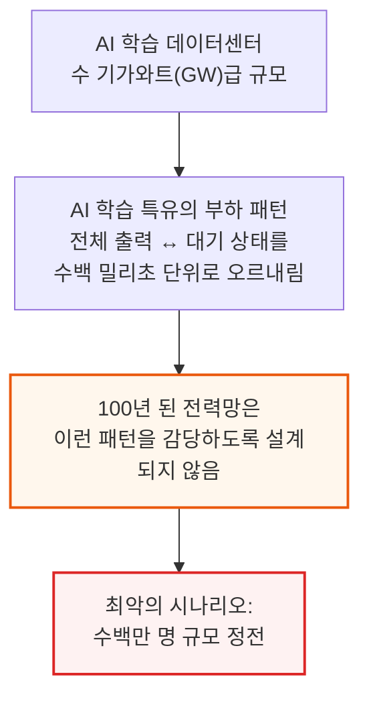
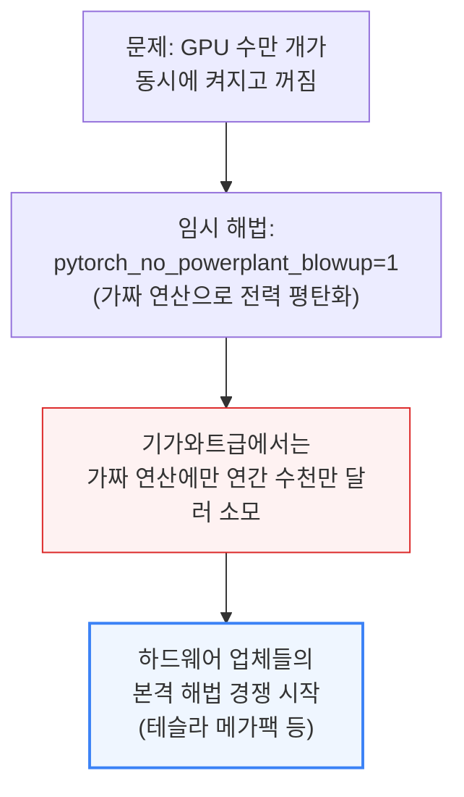
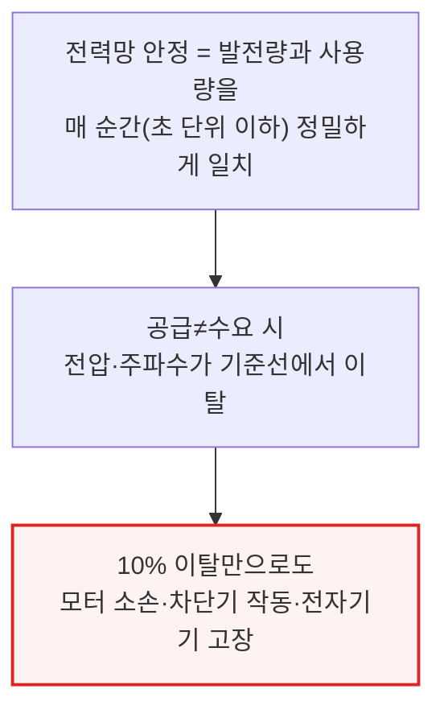
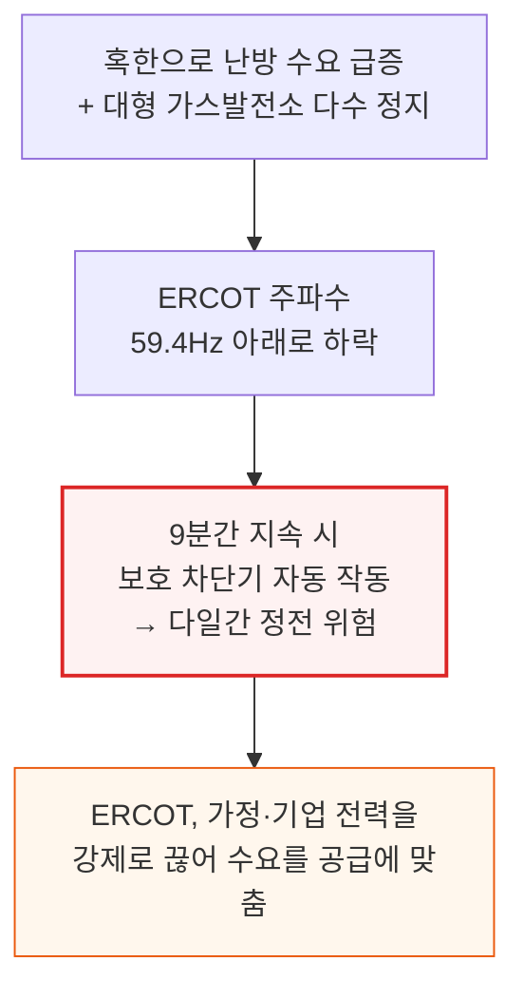
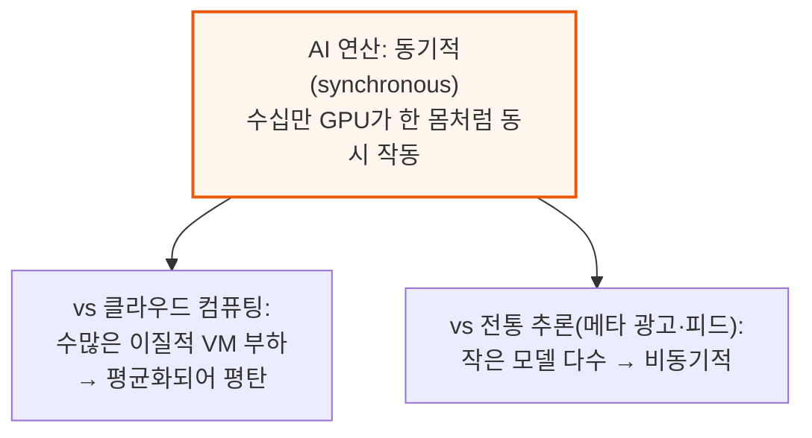
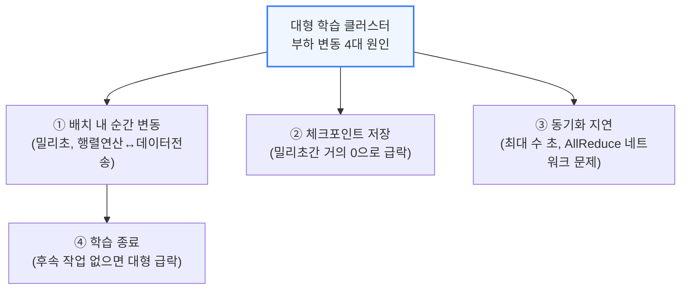
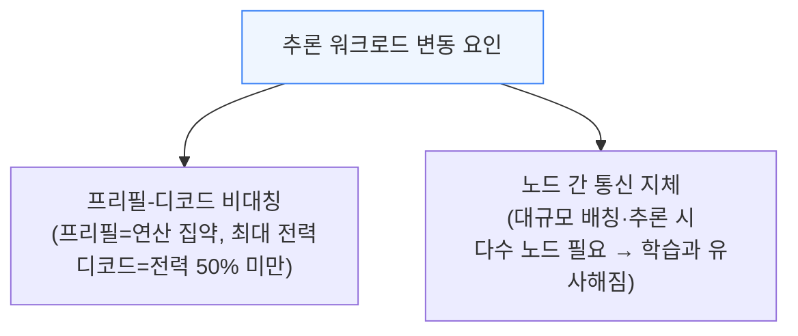

# AI Training Load Fluctuations at Gigawatt-scale - Risk of Power Grid Blackout?

> **출처**: [SemiAnalysis Newsletter](https://newsletter.semianalysis.com/p/ai-training-load-fluctuations-at-gigawatt-scale-risk-of-power-grid-blackout)
> **저자**: Jeremie Eliahou Ontiveros, Dylan Patel, Ajey Pandey
> **발행일**: 2025-06-25

---

## 📑 목차

### 전체 섹션
 1. [개요 - 100만 명을 정전시킬 수 있는 AI 학습 부하](#1-개요---100만-명을-정전시킬-수-있는-ai-학습-부하)
 2. [전력망 품질의 기초 - 왜 공급과 수요의 균형이 중요한가](#2-전력망-품질의-기초---왜-공급과-수요의-균형이-중요한가)
 3. [AI 부하 프로파일 - 학습과 추론이 왜 다른가](#3-ai-부하-프로파일---학습과-추론이-왜-다른가)
 4. [텍사스 전력망에 몰려드는 AI 데이터센터 - 108GW 대기열](#4-텍사스-전력망에-몰려드는-ai-데이터센터---108gw-대기열)
 5. [문제 1 - 초고속 전력 변동 관리](#5-문제-1---초고속-전력-변동-관리)
 6. [문제 2 - 연쇄 정전 위험(LVRT)](#6-문제-2---연쇄-정전-위험lvrt)
 7. [최악의 시나리오 - ERCOT 3단계 모델링과 이베리아 반도 사례](#7-최악의-시나리오---ercot-3단계-모델링과-이베리아-반도-사례)
 8. [해법의 방향 - 배터리 에너지 저장 시스템(BESS)의 가능성](#8-해법의-방향---배터리-에너지-저장-시스템bess의-가능성)
 9. [BESS의 활용 - 수요반응과 세 가지 최적 지점](#9-bess의-활용---수요반응과-세-가지-최적-지점)
10. [BESS의 비용과 한계](#10-bess의-비용과-한계)
11. [하드웨어 대안 - 랙 레벨 캐패시터와 UPS 재설계](#11-하드웨어-대안---랙-레벨-캐패시터와-ups-재설계)

---

## 🔑 용어 정리

본문을 순서대로 읽기 전에 알아두면 좋은 용어들입니다. 자세한 수치와 설명은 본문에서 처음 등장하는 위치에 나옵니다.

- **전력 품질 (Power Quality)**: 전력망의 전압·주파수가 정해진 기준값에서 얼마나 안정적으로 유지되는지를 뜻함 — 발전량과 사용량이 매 순간 딱 맞아야 유지됨
- **계통 관성 (System Inertia)**: 화력·원자력 발전기의 거대한 회전 자석이 갖는 물리적 관성 — 전력 수급이 살짝 어긋나도 이 회전 운동량이 완충 역할을 해 전압·주파수 급변을 막아줌
- **LVRT (Low Voltage Ride-Through, 저전압 통과)**: 먼 곳의 고장으로 전압이 순간적으로 뚝 떨어졌다가 다시 회복되는 짧은 이상 현상 — 데이터센터가 이 순간에 전력망에서 끊기지 않고 "버텨내는" 능력을 가리킴
- **ERCOT (Electric Reliability Council of Texas)**: 텍사스 전력망을 운영·감독하는 기관 — 미국 다른 지역과 거의 연결되지 않은 독립된 전력망이라 AI 데이터센터發 충격에 특히 취약
- **BESS (Battery Energy Storage System, 배터리 에너지 저장 시스템)**: 수백 메가와트\~기가와트급 대형 배터리 — 몇 초 안에 충전·방전하며 전력 변동을 흡수. 테슬라 메가팩이 대표 사례
- **수요반응 (Demand Response)**: 전력망이 부족할 때 데이터센터가 자발적으로 전력 사용을 줄이는 대가로 보상을 받는 제도 — 전력망 연결을 더 빨리 받을 수 있는 지렛대로 쓰임
- **UPS (Uninterruptible Power Supply, 무정전 전원 공급 장치)**: 전력망 전압이 흔들릴 때 즉시 배터리로 전환해 데이터센터 가동을 끊기지 않게 해주는 장치 — 단, 전압이 여러 번 반복해서 흔들리면 아예 전력망 연결을 끊어버림
- **동기 조상기 (Synchronous Condenser)**: 발전은 하지 않고 회전만 하는 거대한 전자기 플라이휠 — 재생에너지처럼 관성이 없는 전원 옆에 설치해 계통 관성을 인위적으로 보태주는 장비

---

## 1. 개요 - 100만 명을 정전시킬 수 있는 AI 학습 부하

**📌 핵심:**
- 대형 AI 연구소들이 짓는 수 기가와트(GW)급 데이터센터는 100년 된 전력망에 전례 없는 부담을 줌 — 규모 자체도 크지만, AI 학습 작업은 순식간에 최대 부하에서 거의 대기 상태로 떨어지는 독특한 부하 패턴을 가짐
- 메타의 라마 3 논문조차 겨우 H100 2만 4,000개(IT 전력 30MW) 규모 클러스터에서 이 전력 변동 문제를 언급함 — 수만 개 GPU가 체크포인트 저장이나 집단 통신 완료를 동시에 기다리며 초 단위로 수십 MW씩 전력이 출렁임
- 엔지니어들은 궁여지책으로 가짜 연산을 돌려 전력 소모를 평탄화하는 `pytorch_no_powerplant_blowup=1` 명령을 만들었지만, 기가와트급 규모에서는 이 가짜 연산에만 연간 수천만 달러가 듦 — 결국 하드웨어 업체들이 본격적인 해법을 들고 나섬
- 결론: 멤피스의 xAI "Colossus"는 테슬라 메가팩(BESS)을 택했고, 테슬라는 이를 업계 표준으로 밀고 있음 — 이 글은 테슬라가 시장을 장악할지, 아니면 신뢰할 만한 대안이 있는지를 전력망 기초부터 짚어봄

---

메타의 라마 3 논문은 이 문제를 다음과 같이 직접 언급했습니다.

> 학습 중에는 수만 개 GPU가 체크포인트 저장이나 집단 통신 완료를 동시에 기다리는 등의 이유로 동시에 전력 소모를 늘리거나 줄일 수 있습니다. 이 경우 데이터센터 전체의 전력 소모가 수십 메가와트 단위로 순간적으로 출렁이며 전력망의 한계를 시험할 수 있습니다. 앞으로 더 큰 라마 모델을 학습시킬수록 이는 계속되는 과제입니다.

---

## 2. 전력망 품질의 기초 - 왜 공급과 수요의 균형이 중요한가

**📌 핵심:**
- 전력망 엔지니어들이 워낙 일을 잘해서 "전력 품질"이라는 말이 일반인의 어휘에 등장할 일이 없었음 — 하지만 이는 발전량과 사용량을 매 순간 정밀하게 맞추는 작업 위에 서 있는 신뢰임
- 전력망은 60Hz(북미 기준)로 딱 맞춰진 교류(AC)로 돌아가는데, 공급과 수요가 어긋나면 전압·주파수가 기준선에서 벗어남 — 단 10%만 벗어나도 모터가 타거나 차단기가 내려가거나 전자기기가 고장 남
- 2021년 텍사스 한파가 실제 사례: 혹한으로 난방 수요가 급증하고 대형 가스발전소가 멈추자 주파수가 59.4Hz 아래로 떨어졌고, ERCOT(텍사스 전력망 운영기관)는 9분간 이 상태가 지속되면 자동으로 차단기가 내려가 다일간 정전이 온다는 위기에서 가정·기업 전력을 강제로 끊어 수요를 공급에 맞춤
- 결론: 가정용 수요는 예측 가능하고 제철소·반도체 공장·클라우드 데이터센터 같은 대형 부하도 대체로 안정적인 부하를 그려왔음 — 생성형 AI(GenAI)의 등장이 이 오랜 공식을 깨뜨림

---

### 2021년 텍사스 한파 - 실제로 벌어진 일

이 사례는 전력망 안정성이 공급과 수요의 안정된 균형에 얼마나 좌우되는지 보여줍니다. 다행히 가정용 수요는 예측 가능하고, 제철소·반도체 공장·클라우드 데이터센터 같은 대형 부하도 대체로 안정적이었습니다. 생성형 AI의 등장이 이 공식을 바꿉니다.

---

## 3. AI 부하 프로파일 - 학습과 추론이 왜 다른가

**📌 핵심:**
- AI 연산 시스템은 동기적(synchronous)임 — 대형 GPU 학습 작업 하나에 수십만 개 GPU가 마치 한 몸처럼 동시에 움직임. 이는 전통적인 컴퓨팅 부하와 정반대 패턴
- 클라우드 컴퓨팅은 수많은 서로 다른 고객에게 가상머신(VM)을 파는 사업이라 부하가 이질적으로 섞여 평탄해짐(100MW 데이터센터가 수백만 개 CPU 코어를 감당) — 메타의 광고·피드 추천 같은 전통 추론도 작은 모델 여러 개를 쓰기 때문에 비동기적
- 구글 클라우드가 발표한 자료에 따르면 클라우드 데이터센터 대비 AI 데이터센터의 부하 변동 폭이 약 15배(1.5MW → 15MW) 큼 — 학습 클러스터에서는 배치 내 순간 변동(밀리초 단위), 체크포인트 저장(순간적으로 0에 가깝게), 동기화 지연(최대 수 초), 학습 종료 시점(대형 부하 급락)까지 다양한 원인이 겹침
- 결론: 추론은 프리필(연산량 많음)과 디코드(연산량 적음) 두 단계로 나뉘고 노드 간 통신 지체도 있어 학습을 닮아가고 있지만, 학습만큼 심각하지는 않음 — 다만 스케일링 법칙과 강화학습(RL) 흐름을 고려하면 추론도 대규모 스케일아웃 클러스터에 의존하는 방향으로 갈 가능성이 큼

---

구글 클라우드가 OCP EMEA 서밋 2025에서 공개한 자료에 따르면, 클라우드 데이터센터와 AI 데이터센터의 부하 변동 폭 차이는 약 15배(1.5MW → 15MW)에 달합니다.

### 학습 클러스터 - 부하가 출렁이는 4가지 이유

이 목록이 전부는 아니며, 상당 부분은 소프트웨어·워크로드 관리 최적화로 부분적으로 완화할 수 있습니다. 하지만 문제 자체는 남아있고, AI 학습 부하는 이 점에서 매우 독특합니다. 결국 하드웨어 기반 해법이 필요합니다.

### 추론 워크로드 - 학습을 닮아가는 중

구글·메타·틱톡 등의 대규모 추론(DLRM) 사례를 보면 학습보다 변동 문제가 훨씬 덜합니다. 하지만 딥시크의 독특한 추론 배치 방식처럼, 소수 GPU로 수백만 사용자를 감당하는 신형 아키텍처가 등장하면서 추론도 점차 학습을 닮아가는 흐름입니다. 학습과 추론 모두 부하 변동 문제를 안고 있지만, 기가와트급 규모로 동기적으로 작동하는 학습 쪽이 훨씬 더 큰 도전입니다.

---

*작성 진행률: 약 27% 완료 (11개 섹션 중 3개 완료)*
*업데이트: 헤더·목차·용어정리 및 1\~3섹션(개요, 전력망 품질 기초, AI 부하 프로파일) 작성 완료*
