# AI Training Load Fluctuations at Gigawatt-scale - Risk of Power Grid Blackout?

> **출처**: [SemiAnalysis Newsletter](https://newsletter.semianalysis.com/p/ai-training-load-fluctuations-at-gigawatt-scale-risk-of-power-grid-blackout)
> **저자**: Jeremie Eliahou Ontiveros, Dylan Patel, Ajey Pandey
> **발행일**: 2025-06-25

---

## 📑 목차

### 전체 섹션
 1. [개요 - 100만 명을 정전시킬 수 있는 AI 학습 부하](#1-개요---100만-명을-정전시킬-수-있는-ai-학습-부하)
 2. [전력망 품질의 기초 - 왜 공급과 수요의 균형이 중요한가](#2-전력망-품질의-기초---왜-공급과-수요의-균형이-중요한가)
 3. [AI 부하 프로파일 - 학습과 추론이 왜 다른가](#3-ai-부하-프로파일---학습과-추론이-왜-다른가)
 4. [텍사스 전력망에 몰려드는 AI 데이터센터 - 108GW 대기열](#4-텍사스-전력망에-몰려드는-ai-데이터센터---108gw-대기열)
 5. [문제 1 - 초고속 전력 변동 관리](#5-문제-1---초고속-전력-변동-관리)
 6. [문제 2 - 연쇄 정전 위험(LVRT)](#6-문제-2---연쇄-정전-위험lvrt)
 7. [최악의 시나리오 - ERCOT 3단계 모델링과 이베리아 반도 사례](#7-최악의-시나리오---ercot-3단계-모델링과-이베리아-반도-사례)
 8. [해법의 방향 - 배터리 에너지 저장 시스템(BESS)의 가능성](#8-해법의-방향---배터리-에너지-저장-시스템bess의-가능성)
 9. [BESS의 활용 - 수요반응과 세 가지 최적 지점](#9-bess의-활용---수요반응과-세-가지-최적-지점)
10. [BESS의 비용과 한계](#10-bess의-비용과-한계)
11. [하드웨어 대안 - 랙 레벨 캐패시터와 UPS 재설계](#11-하드웨어-대안---랙-레벨-캐패시터와-ups-재설계)

---

## 🔑 용어 정리

본문을 순서대로 읽기 전에 알아두면 좋은 용어들입니다. 자세한 수치와 설명은 본문에서 처음 등장하는 위치에 나옵니다.

- **전력 품질 (Power Quality)**: 전력망의 전압·주파수가 정해진 기준값에서 얼마나 안정적으로 유지되는지를 뜻함 — 발전량과 사용량이 매 순간 딱 맞아야 유지됨
- **계통 관성 (System Inertia)**: 화력·원자력 발전기의 거대한 회전 자석이 갖는 물리적 관성 — 전력 수급이 살짝 어긋나도 이 회전 운동량이 완충 역할을 해 전압·주파수 급변을 막아줌
- **LVRT (Low Voltage Ride-Through, 저전압 통과)**: 먼 곳의 고장으로 전압이 순간적으로 뚝 떨어졌다가 다시 회복되는 짧은 이상 현상 — 데이터센터가 이 순간에 전력망에서 끊기지 않고 "버텨내는" 능력을 가리킴
- **ERCOT (Electric Reliability Council of Texas)**: 텍사스 전력망을 운영·감독하는 기관 — 미국 다른 지역과 거의 연결되지 않은 독립된 전력망이라 AI 데이터센터發 충격에 특히 취약
- **BESS (Battery Energy Storage System, 배터리 에너지 저장 시스템)**: 수백 메가와트\~기가와트급 대형 배터리 — 몇 초 안에 충전·방전하며 전력 변동을 흡수. 테슬라 메가팩이 대표 사례
- **수요반응 (Demand Response)**: 전력망이 부족할 때 데이터센터가 자발적으로 전력 사용을 줄이는 대가로 보상을 받는 제도 — 전력망 연결을 더 빨리 받을 수 있는 지렛대로 쓰임
- **UPS (Uninterruptible Power Supply, 무정전 전원 공급 장치)**: 전력망 전압이 흔들릴 때 즉시 배터리로 전환해 데이터센터 가동을 끊기지 않게 해주는 장치 — 단, 전압이 여러 번 반복해서 흔들리면 아예 전력망 연결을 끊어버림
- **동기 조상기 (Synchronous Condenser)**: 발전은 하지 않고 회전만 하는 거대한 전자기 플라이휠 — 재생에너지처럼 관성이 없는 전원 옆에 설치해 계통 관성을 인위적으로 보태주는 장비

---

## 1. 개요 - 100만 명을 정전시킬 수 있는 AI 학습 부하

**📌 핵심:**
- 대형 AI 연구소들이 짓는 수 기가와트(GW)급 데이터센터는 100년 된 전력망에 전례 없는 부담을 줌 — 규모 자체도 크지만, AI 학습 작업은 순식간에 최대 부하에서 거의 대기 상태로 떨어지는 독특한 부하 패턴을 가짐
- 메타의 라마 3 논문조차 겨우 H100 2만 4,000개(IT 전력 30MW) 규모 클러스터에서 이 전력 변동 문제를 언급함 — 수만 개 GPU가 체크포인트 저장이나 집단 통신 완료를 동시에 기다리며 초 단위로 수십 MW씩 전력이 출렁임
- 엔지니어들은 궁여지책으로 가짜 연산을 돌려 전력 소모를 평탄화하는 `pytorch_no_powerplant_blowup=1` 명령을 만들었지만, 기가와트급 규모에서는 이 가짜 연산에만 연간 수천만 달러가 듦 — 결국 하드웨어 업체들이 본격적인 해법을 들고 나섬
- 결론: 멤피스의 xAI "Colossus"는 테슬라 메가팩(BESS)을 택했고, 테슬라는 이를 업계 표준으로 밀고 있음 — 이 글은 테슬라가 시장을 장악할지, 아니면 신뢰할 만한 대안이 있는지를 전력망 기초부터 짚어봄

---

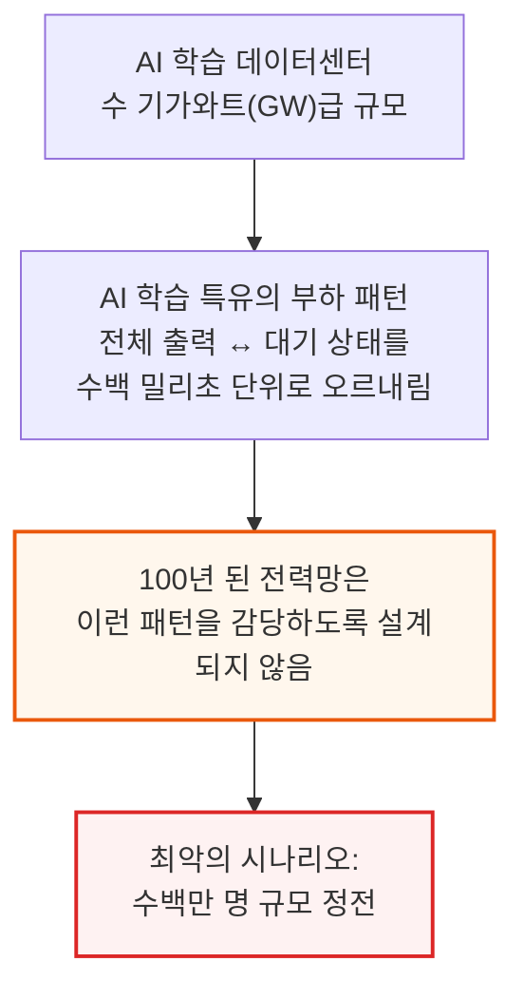
```mermaid
flowchart TD
    Scale["AI 학습 데이터센터<br/>수 기가와트(GW)급 규모"] --> Pattern["AI 학습 특유의 부하 패턴<br/>전체 출력 ↔ 대기 상태를<br/>수백 밀리초 단위로 오르내림"]
    Pattern --> Risk["100년 된 전력망은<br/>이런 패턴을 감당하도록 설계되지 않음"]
    Risk --> Worst["최악의 시나리오:<br/>수백만 명 규모 정전"]

    style Risk fill:#fff7ed,stroke:#ea580c,stroke-width:2px
    style Worst fill:#fef2f2,stroke:#dc2626,stroke-width:2px
```

메타의 라마 3 논문은 이 문제를 다음과 같이 직접 언급했습니다.

> 학습 중에는 수만 개 GPU가 체크포인트 저장이나 집단 통신 완료를 동시에 기다리는 등의 이유로 동시에 전력 소모를 늘리거나 줄일 수 있습니다. 이 경우 데이터센터 전체의 전력 소모가 수십 메가와트 단위로 순간적으로 출렁이며 전력망의 한계를 시험할 수 있습니다. 앞으로 더 큰 라마 모델을 학습시킬수록 이는 계속되는 과제입니다.

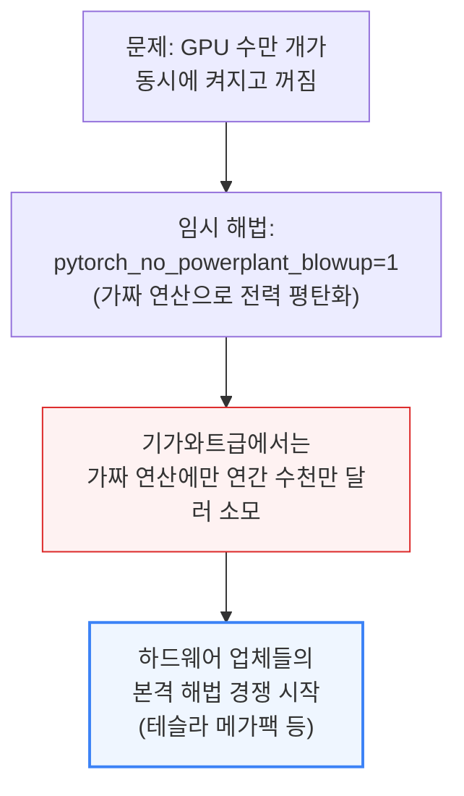
```mermaid
flowchart TD
    Problem["문제: GPU 수만 개가<br/>동시에 켜지고 꺼짐"] --> Bandaid["임시 해법:<br/>pytorch_no_powerplant_blowup=1<br/>(가짜 연산으로 전력 평탄화)"]
    Bandaid --> Cost["기가와트급에서는<br/>가짜 연산에만 연간 수천만 달러 소모"]
    Cost --> Hardware["하드웨어 업체들의<br/>본격 해법 경쟁 시작<br/>(테슬라 메가팩 등)"]

    style Cost fill:#fef2f2,stroke:#dc2626
    style Hardware fill:#eff6ff,stroke:#3b82f6,stroke-width:2px
```

---

## 2. 전력망 품질의 기초 - 왜 공급과 수요의 균형이 중요한가

**📌 핵심:**
- 전력망 엔지니어들이 워낙 일을 잘해서 "전력 품질"이라는 말이 일반인의 어휘에 등장할 일이 없었음 — 하지만 이는 발전량과 사용량을 매 순간 정밀하게 맞추는 작업 위에 서 있는 신뢰임
- 전력망은 60Hz(북미 기준)로 딱 맞춰진 교류(AC)로 돌아가는데, 공급과 수요가 어긋나면 전압·주파수가 기준선에서 벗어남 — 단 10%만 벗어나도 모터가 타거나 차단기가 내려가거나 전자기기가 고장 남
- 2021년 텍사스 한파가 실제 사례: 혹한으로 난방 수요가 급증하고 대형 가스발전소가 멈추자 주파수가 59.4Hz 아래로 떨어졌고, ERCOT(텍사스 전력망 운영기관)는 9분간 이 상태가 지속되면 자동으로 차단기가 내려가 다일간 정전이 온다는 위기에서 가정·기업 전력을 강제로 끊어 수요를 공급에 맞춤
- 결론: 가정용 수요는 예측 가능하고 제철소·반도체 공장·클라우드 데이터센터 같은 대형 부하도 대체로 안정적인 부하를 그려왔음 — 생성형 AI(GenAI)의 등장이 이 오랜 공식을 깨뜨림

---

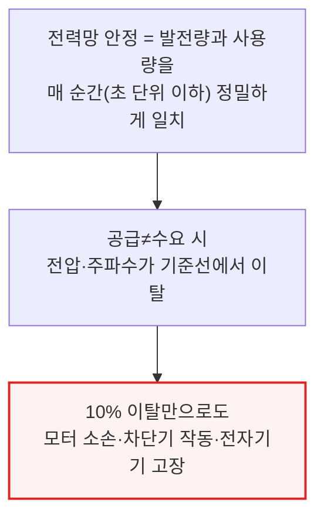
```mermaid
flowchart TD
    Balance["전력망 안정 = 발전량과 사용량을<br/>매 순간(초 단위 이하) 정밀하게 일치"] --> Deviate["공급≠수요 시<br/>전압·주파수가 기준선에서 이탈"]
    Deviate --> Swing["10% 이탈만으로도<br/>모터 소손·차단기 작동·전자기기 고장"]

    style Swing fill:#fef2f2,stroke:#dc2626,stroke-width:2px
```

### 2021년 텍사스 한파 - 실제로 벌어진 일

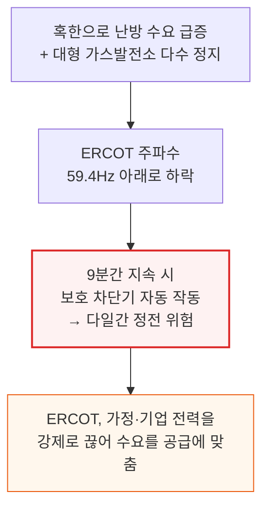
```mermaid
flowchart TD
    Cold["혹한으로 난방 수요 급증<br/>+ 대형 가스발전소 다수 정지"] --> Freq["ERCOT 주파수<br/>59.4Hz 아래로 하락"]
    Freq --> Threshold["9분간 지속 시<br/>보호 차단기 자동 작동<br/>→ 다일간 정전 위험"]
    Threshold --> Action["ERCOT, 가정·기업 전력을<br/>강제로 끊어 수요를 공급에 맞춤"]

    style Threshold fill:#fef2f2,stroke:#dc2626,stroke-width:2px
    style Action fill:#fff7ed,stroke:#ea580c
```

이 사례는 전력망 안정성이 공급과 수요의 안정된 균형에 얼마나 좌우되는지 보여줍니다. 다행히 가정용 수요는 예측 가능하고, 제철소·반도체 공장·클라우드 데이터센터 같은 대형 부하도 대체로 안정적이었습니다. 생성형 AI의 등장이 이 공식을 바꿉니다.

---

## 3. AI 부하 프로파일 - 학습과 추론이 왜 다른가

**📌 핵심:**
- AI 연산 시스템은 동기적(synchronous)임 — 대형 GPU 학습 작업 하나에 수십만 개 GPU가 마치 한 몸처럼 동시에 움직임. 이는 전통적인 컴퓨팅 부하와 정반대 패턴
- 클라우드 컴퓨팅은 수많은 서로 다른 고객에게 가상머신(VM)을 파는 사업이라 부하가 이질적으로 섞여 평탄해짐(100MW 데이터센터가 수백만 개 CPU 코어를 감당) — 메타의 광고·피드 추천 같은 전통 추론도 작은 모델 여러 개를 쓰기 때문에 비동기적
- 구글 클라우드가 발표한 자료에 따르면 클라우드 데이터센터 대비 AI 데이터센터의 부하 변동 폭이 약 15배(1.5MW → 15MW) 큼 — 학습 클러스터에서는 배치 내 순간 변동(밀리초 단위), 체크포인트 저장(순간적으로 0에 가깝게), 동기화 지연(최대 수 초), 학습 종료 시점(대형 부하 급락)까지 다양한 원인이 겹침
- 결론: 추론은 프리필(연산량 많음)과 디코드(연산량 적음) 두 단계로 나뉘고 노드 간 통신 지체도 있어 학습을 닮아가고 있지만, 학습만큼 심각하지는 않음 — 다만 스케일링 법칙과 강화학습(RL) 흐름을 고려하면 추론도 대규모 스케일아웃 클러스터에 의존하는 방향으로 갈 가능성이 큼

---

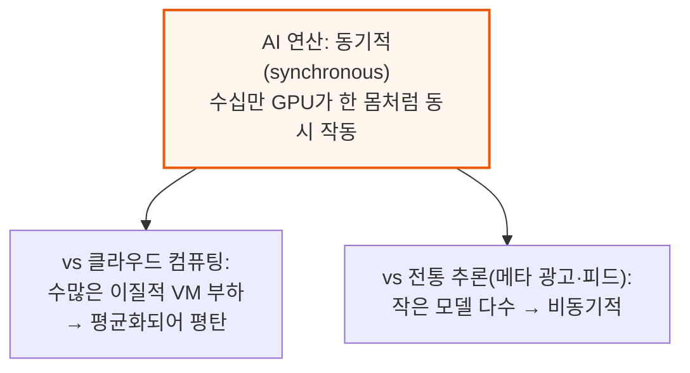
```mermaid
flowchart TD
    AI["AI 연산: 동기적(synchronous)<br/>수십만 GPU가 한 몸처럼 동시 작동"] --> VsCloud["vs 클라우드 컴퓨팅:<br/>수많은 이질적 VM 부하<br/>→ 평균화되어 평탄"]
    AI --> VsInfer["vs 전통 추론(메타 광고·피드):<br/>작은 모델 다수 → 비동기적"]

    style AI fill:#fff7ed,stroke:#ea580c,stroke-width:2px
```

구글 클라우드가 OCP EMEA 서밋 2025에서 공개한 자료에 따르면, 클라우드 데이터센터와 AI 데이터센터의 부하 변동 폭 차이는 약 15배(1.5MW → 15MW)에 달합니다.

### 학습 클러스터 - 부하가 출렁이는 4가지 이유

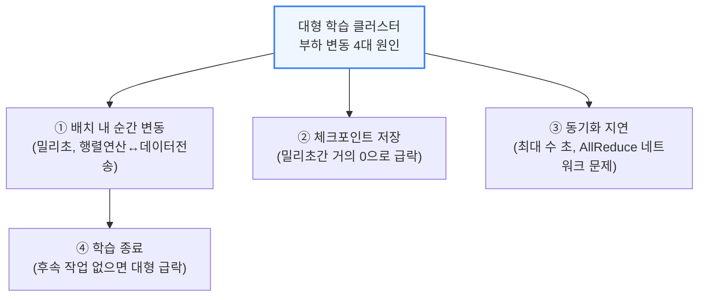
```mermaid
flowchart TD
    Causes["대형 학습 클러스터<br/>부하 변동 4대 원인"] --> C1["① 배치 내 순간 변동<br/>(밀리초, 행렬연산↔데이터전송)"]
    Causes --> C2["② 체크포인트 저장<br/>(밀리초간 거의 0으로 급락)"]
    Causes --> C3["③ 동기화 지연<br/>(최대 수 초, AllReduce 네트워크 문제)"]

    C1 --> C4["④ 학습 종료<br/>(후속 작업 없으면 대형 급락)"]

    style Causes fill:#eff6ff,stroke:#3b82f6,stroke-width:2px
```

이 목록이 전부는 아니며, 상당 부분은 소프트웨어·워크로드 관리 최적화로 부분적으로 완화할 수 있습니다. 하지만 문제 자체는 남아있고, AI 학습 부하는 이 점에서 매우 독특합니다. 결국 하드웨어 기반 해법이 필요합니다.

### 추론 워크로드 - 학습을 닮아가는 중

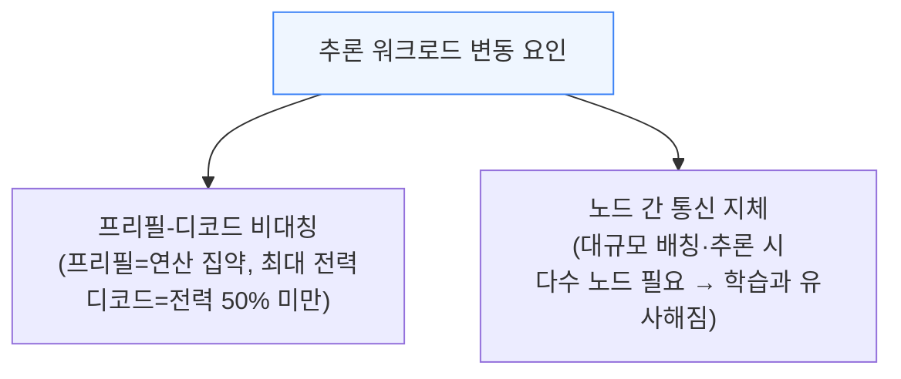
```mermaid
flowchart TD
    Infer["추론 워크로드 변동 요인"] --> Prefill["프리필-디코드 비대칭<br/>(프리필=연산 집약, 최대 전력<br/>디코드=전력 50% 미만)"]
    Infer --> Comm["노드 간 통신 지체<br/>(대규모 배칭·추론 시<br/>다수 노드 필요 → 학습과 유사해짐)"]

    style Infer fill:#eff6ff,stroke:#3b82f6
```

구글·메타·틱톡 등의 대규모 추론(DLRM) 사례를 보면 학습보다 변동 문제가 훨씬 덜합니다.
하지만 딥시크의 독특한 추론 배치 방식처럼, 소수 GPU로 수백만 사용자를 감당하는 신형 아키텍처가 등장하면서 추론도 점차 학습을 닮아가는 흐름입니다.
학습과 추론 모두 부하 변동 문제를 안고 있지만, 기가와트급 규모로 동기적으로 작동하는 학습 쪽이 훨씬 더 큰 도전입니다.

---

## 4. 텍사스 전력망에 몰려드는 AI 데이터센터 - 108GW 대기열

**📌 핵심:**
- 오늘날 최대 규모 AI 데이터센터의 스케일을 보면 문제의 크기가 드러남 — 오픈AI의 핵심 학습 클러스터 건물 하나가 IT 전력 약 300MW·명판 전력 약 400MW로 세계 최대 단일 건물이며(위스콘신 "자매 시설" 포함), 2025년 1월부터 짓기 시작한 두 번째 동일 건물까지 합치면 2026년 중반 이 캠퍼스는 기가와트급에 도달
- 이 규모가 ERCOT(텍사스 전력망 운영기관)의 주의를 끌었음 — 108GW가 넘는 "대형 부하"가 ERCOT 연계를 신청 중이며 대부분이 데이터센터, 이는 미국 전체 피크 수요 745GW와 비교해도 상당한 규모
- 단, 108GW라는 숫자 자체는 중복 신청이 섞여 있어 그대로 믿기는 어려움 — ERCOT의 데이터센터 수요 전망도 마찬가지로 SemiAnalysis는 자체 데이터센터 모델로 이를 별도 검증 중
- 결론: 북미 전체 전력망을 감독하는 NERC(North American Electric Reliability Corporation)도 우려를 표하며 주요 송전 사업자들에게 연계 검토 시 데이터센터 부하를 어떻게 모델링하는지 질의 — SemiAnalysis는 이 연구·회의록·신청서를 직접 파고들어 문제의 실체를 짚음

---

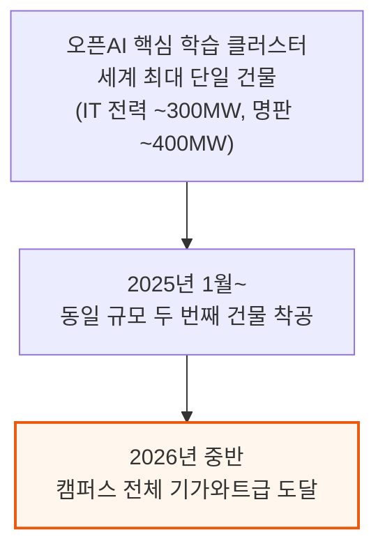
```mermaid
flowchart TD
    Cluster["오픈AI 핵심 학습 클러스터<br/>세계 최대 단일 건물<br/>(IT 전력 ~300MW, 명판 ~400MW)"] --> Second["2025년 1월~<br/>동일 규모 두 번째 건물 착공"]
    Second --> GW["2026년 중반<br/>캠퍼스 전체 기가와트급 도달"]

    style GW fill:#fff7ed,stroke:#ea580c,stroke-width:2px
```

### ERCOT 대기열 - 108GW vs 미국 전체 피크 745GW

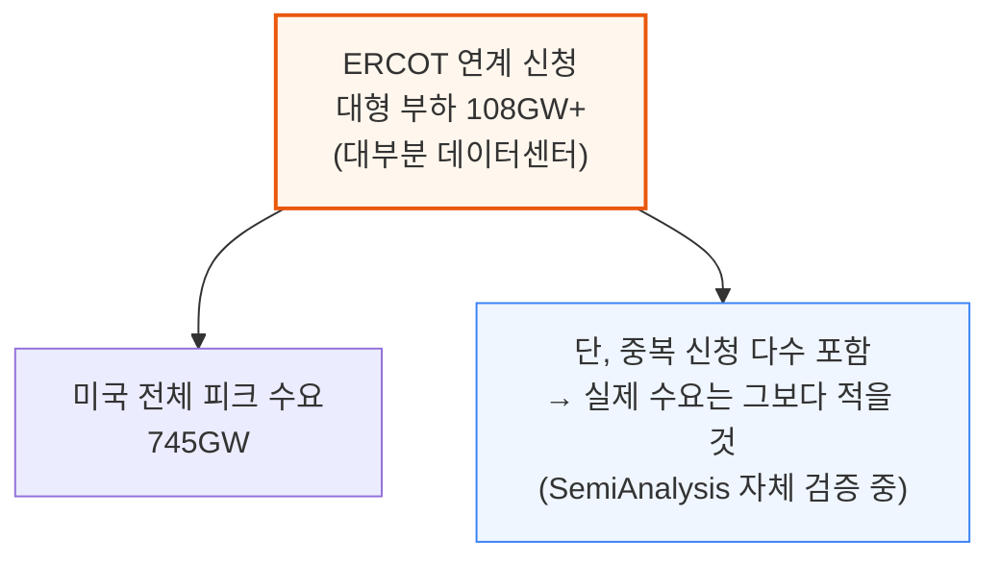
```mermaid
flowchart TD
    Queue["ERCOT 연계 신청<br/>대형 부하 108GW+<br/>(대부분 데이터센터)"] --> Compare["미국 전체 피크 수요<br/>745GW"]
    Queue --> Caveat["단, 중복 신청 다수 포함<br/>→ 실제 수요는 그보다 적을 것<br/>(SemiAnalysis 자체 검증 중)"]

    style Queue fill:#fff7ed,stroke:#ea580c,stroke-width:2px
    style Caveat fill:#eff6ff,stroke:#3b82f6
```

NERC(북미 전력망 신뢰도 감독기관)도 같은 문제의식을 갖고, 주요 송전 사업자들에게 연계 검토 과정에서 데이터센터 부하를 어떻게 모델링하는지 질의하고 있습니다. SemiAnalysis는 관련 연구·신청서·ERCOT 회의록을 직접 검토해 아래 내용을 정리했습니다.

---

## 5. 문제 1 - 초고속 전력 변동 관리

**📌 핵심:**
- 부하가 켜지고 꺼지며 변하는 것 자체는 새로운 일이 아니고, 전력 공급 측이 초 단위 이하로 맞춰 대응해온 지 수십 년 — 하지만 수백 메가와트를 순식간에 관리하는 것은 전례 없는 도전이며, 이것이 정확히 기가와트급 AI 데이터센터가 던지는 위협
- 발전기의 출력 조정 속도는 분당 메가와트(MW/min)로 측정되는 "램프 속도(ramp rate)"로 표현 — 화석연료 발전기는 분당 5\~50MW로 조정 가능하지만, 원자력 발전소는 전력망 변화에 반응하기엔 너무 느림
- 전통적으로 순간 단위 전압·주파수 균형은 화력·원자력 발전기의 거대한 회전 자석이 가진 "계통 관성"이 흡수해왔음 — 풍력·태양광 같은 간헐적 재생에너지는 직류(DC)를 만들어 인버터로 교류로 바꾸는 방식이라 이런 회전 관성이 없어 수급 불균형을 스스로 흡수하지 못함
- 결론: 재생에너지는 배터리와 짝짓지 않으면 화석연료 발전기처럼 분당 MW 단위로 즉시 출력을 조정할 수도 없음 — 이를 보완하려 캐패시터 뱅크, 동기 조상기, 정지형 무효전력 보상장치(STATCOM) 같은 전력 품질 전용 장비가 새로 등장

---

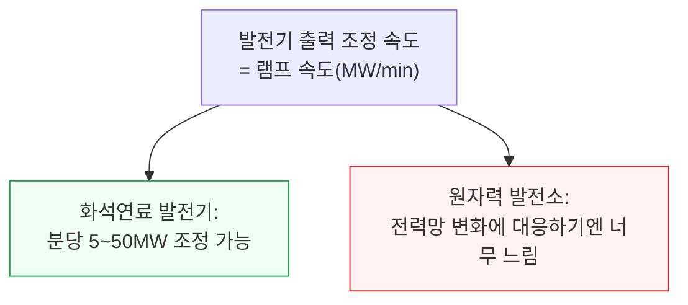
```mermaid
flowchart TD
    RampRate["발전기 출력 조정 속도<br/>= 램프 속도(MW/min)"] --> Fossil["화석연료 발전기:<br/>분당 5~50MW 조정 가능"]
    RampRate --> Nuclear["원자력 발전소:<br/>전력망 변화에 대응하기엔 너무 느림"]

    style Fossil fill:#f0fdf4,stroke:#16a34a
    style Nuclear fill:#fef2f2,stroke:#dc2626
```

### 계통 관성 - 순간 균형을 잡아온 물리적 완충장치

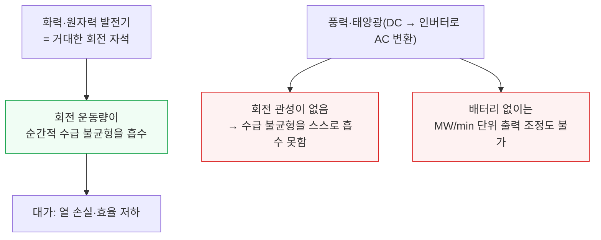
```mermaid
flowchart TD
    Inertia["화력·원자력 발전기<br/>= 거대한 회전 자석"] --> Absorb["회전 운동량이<br/>순간적 수급 불균형을 흡수"]
    Absorb --> Cost["대가: 열 손실·효율 저하"]

    Renewable["풍력·태양광(DC → 인버터로 AC 변환)"] --> NoInertia["회전 관성이 없음<br/>→ 수급 불균형을 스스로 흡수 못함"]
    Renewable --> NoRamp["배터리 없이는<br/>MW/min 단위 출력 조정도 불가"]

    style Absorb fill:#f0fdf4,stroke:#16a34a
    style NoInertia fill:#fef2f2,stroke:#dc2626
    style NoRamp fill:#fef2f2,stroke:#dc2626
```

이를 보완하기 위해 캐패시터 뱅크, 동기 조상기, 정지형 무효전력 보상장치(STATCOM) 같은 전력 품질 전용 장비들이 새롭게 쓰이고 있습니다.

---

## 6. 문제 2 - 연쇄 정전 위험(LVRT)

**📌 핵심:**
- ERCOT가 전력 품질 문제를 길게 논의했지만, 진짜 더 큰 우려는 연쇄 정전(cascading blackout)이었음 — 핵심은 LVRT(저전압 통과)라는 현상
- LVRT는 완전한 정전이 아니라 순간적인 전압 하강(예: 기준선 대비 30% 하강이 30밀리초\~5초 지속)임 — 먼 곳의 리클로저(recloser, 문제를 감지하면 스스로 껐다 켜는 자동 차단기)가 다람쥐·새 등 야생동물로 인한 단락을 처리하는 과정에서 이런 전압 하강이 발생
- 특정 회선에 직접 걸린 고장이면 해당 데이터센터만 짧게 정전되지만, 전력망 전체가 촘촘히 연결돼 있어 다른 회선의 고장도 전압 급락 형태로 데이터센터에 충격을 줌 — 데이터센터는 이 짧은 전압 하강 동안 전력망과 연결을 끊지 않고 "버텨야" 함
- 결론: 데이터센터는 UPS(무정전 전원 공급 장치)로 전압 하강에 즉시 대응하지만, 전압이 연속으로 여러 번 흔들리면 UPS가 아예 전력망 연결을 영구히 끊고 예비 발전(주로 디젤)으로 전환함 — 데이터센터 자체는 무중단이지만, 전력망 입장에선 순식간에 수백 메가와트\~기가와트 부하가 사라져 연쇄 정전으로 번질 수 있음(2024년 7월 버지니아에서 1.5GW 데이터센터가 실제로 이렇게 이탈한 전례가 있음)

---

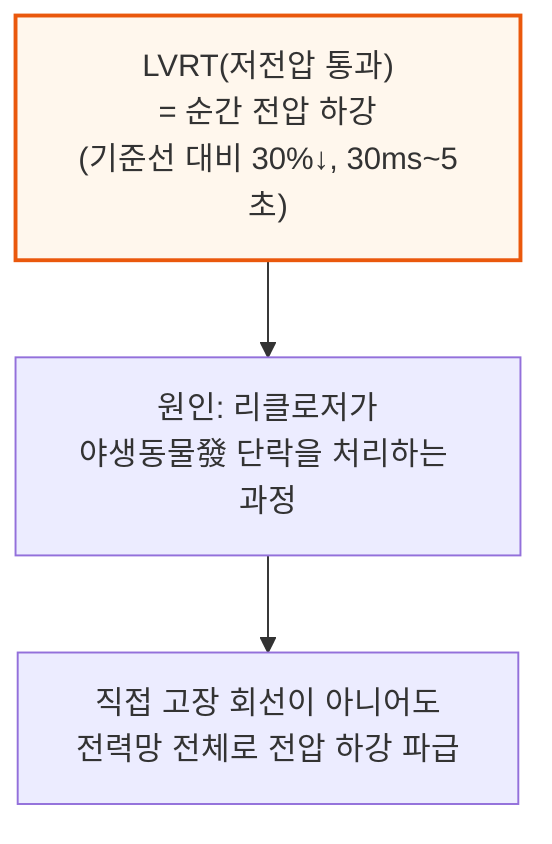
```mermaid
flowchart TD
    LVRT["LVRT(저전압 통과)<br/>= 순간 전압 하강<br/>(기준선 대비 30%↓, 30ms~5초)"] --> Cause["원인: 리클로저가<br/>야생동물發 단락을 처리하는 과정"]
    Cause --> Ripple["직접 고장 회선이 아니어도<br/>전력망 전체로 전압 하강 파급"]

    style LVRT fill:#fff7ed,stroke:#ea580c,stroke-width:2px
```

### UPS의 "삼진아웃" - 데이터센터는 멀쩡해도 전력망은 충격

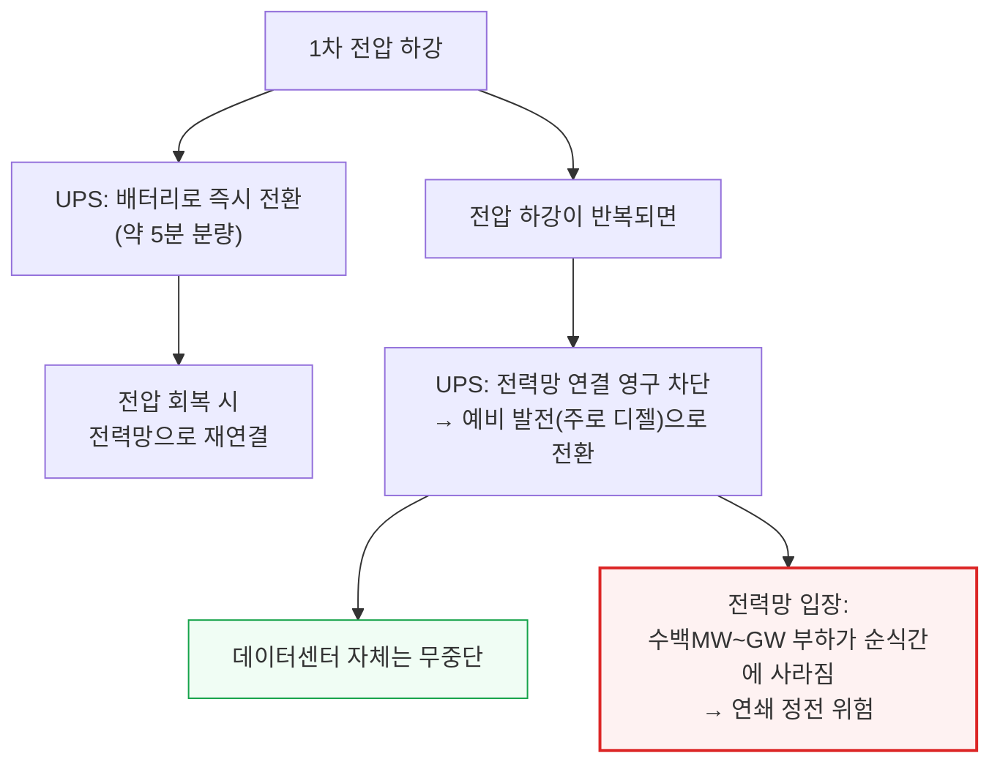
```mermaid
flowchart TD
    Sag1["1차 전압 하강"] --> UPS1["UPS: 배터리로 즉시 전환<br/>(약 5분 분량)"]
    UPS1 --> Recover["전압 회복 시<br/>전력망으로 재연결"]

    Sag1 --> Repeat["전압 하강이 반복되면"]
    Repeat --> UPS2["UPS: 전력망 연결 영구 차단<br/>→ 예비 발전(주로 디젤)으로 전환"]
    UPS2 --> Safe["데이터센터 자체는 무중단"]
    UPS2 --> GridShock["전력망 입장:<br/>수백MW~GW 부하가 순식간에 사라짐<br/>→ 연쇄 정전 위험"]

    style GridShock fill:#fef2f2,stroke:#dc2626,stroke-width:2px
    style Safe fill:#f0fdf4,stroke:#16a34a
```

2024년 7월, 버지니아에서 송전선 고장 하나로 1.5GW 규모 데이터센터들이 예상치 못하게 전력망에서 이탈해 예비 발전으로 전환한 사례가 있습니다. 도미니언 에너지가 대규모 정전 없이 수습했지만 급박한 조치가 필요했습니다. 앞으로의 부하 증가 추세와 AI 학습 부하 프로파일을 고려하면, 이런 일이 훨씬 흔해질 수 있습니다.

---

## 7. 최악의 시나리오 - ERCOT 3단계 모델링과 이베리아 반도 사례

**📌 핵심:**
- 2025년 5월 ERCOT 회의에서 발표된 두 건의 분석이 최악의 시나리오를 그려냄 — 하나는 데이터센터가 LVRT를 못 버티고 얼마나 이탈하는지(윤즈 청), 다른 하나는 그 이탈이 전력망 전체로 어떻게 번지는지(루이스 이노호사)를 모델링
- 청의 모델은 여름 피크(SP)·재생에너지 최대 발전 시점("덕 커브", HRML) 2가지 날씨 시나리오와, 전압 75% 미만 시 즉시 이탈·70% 전압을 20밀리초까지 버팀 2가지 대응 시나리오를 조합 — 서부 텍사스 변전소의 345kV 송전선 고장(오스틴 공급량의 약 1/6) 기준, 4가지 조합 모두 최소 1.5GW가 즉시 이탈했고, 최악(덕 커브+LVRT 미대응)에서는 서부 텍사스 데이터센터 전체(2.5GW)가 동시에 이탈
- 동기 조상기(SynCon)를 모든 서부 텍사스 데이터센터 연계점에 설치해도 여전히 1.3\~1.9GW가 이탈 위험에 노출됨 — 설치 비용은 MVA당 3만\~6만 달러, 1GW 데이터센터 기준 1,000만\~2,000만 달러
- 이노호사의 분석에 따르면 2.6GW 이상이 한꺼번에 이탈하면 ERCOT 전체 주파수가 위험 구간(60.4Hz)을 넘고, 2GW만 이탈해도 주파수 변화율(ROCOF)이 위험 수준에 도달하며, 2.5GW 이상이면 텍사스 전력망 광범위한 지역에서 전압 품질 문제가 발생 — 결론적으로 ERCOT 전체 2.6GW 또는 서부 텍사스 존 단독 2.0GW 이탈이 연쇄 정전의 임계선
- 결론: 이는 2025년 4월 28일 이베리아 반도 정전과 놀랍도록 닮은 경로임 — 발전 2.2GW가 예상치 못하게 이탈하며 27초 만에 스페인·포르투갈 전역이 붕괴됐는데, 텍사스도 외부 전력망 연결이 단 4개뿐이라 비슷한 규모(2\~2.5GW)의 데이터센터 이탈이 벌어지면 다람쥐 한 마리가 잘못된 순간 전선을 밟는 것만으로도 연쇄 정전이 시작될 수 있음

---

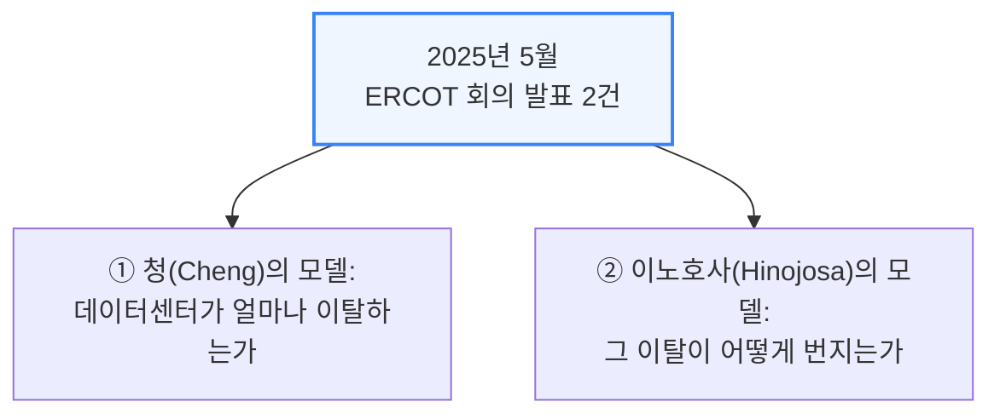
```mermaid
flowchart TD
    Meeting["2025년 5월<br/>ERCOT 회의 발표 2건"] --> P1["① 청(Cheng)의 모델:<br/>데이터센터가 얼마나 이탈하는가"]
    Meeting --> P2["② 이노호사(Hinojosa)의 모델:<br/>그 이탈이 어떻게 번지는가"]

    style Meeting fill:#eff6ff,stroke:#3b82f6,stroke-width:2px
```

### 청의 모델 - 4가지 조합 모두 최소 1.5GW 이탈

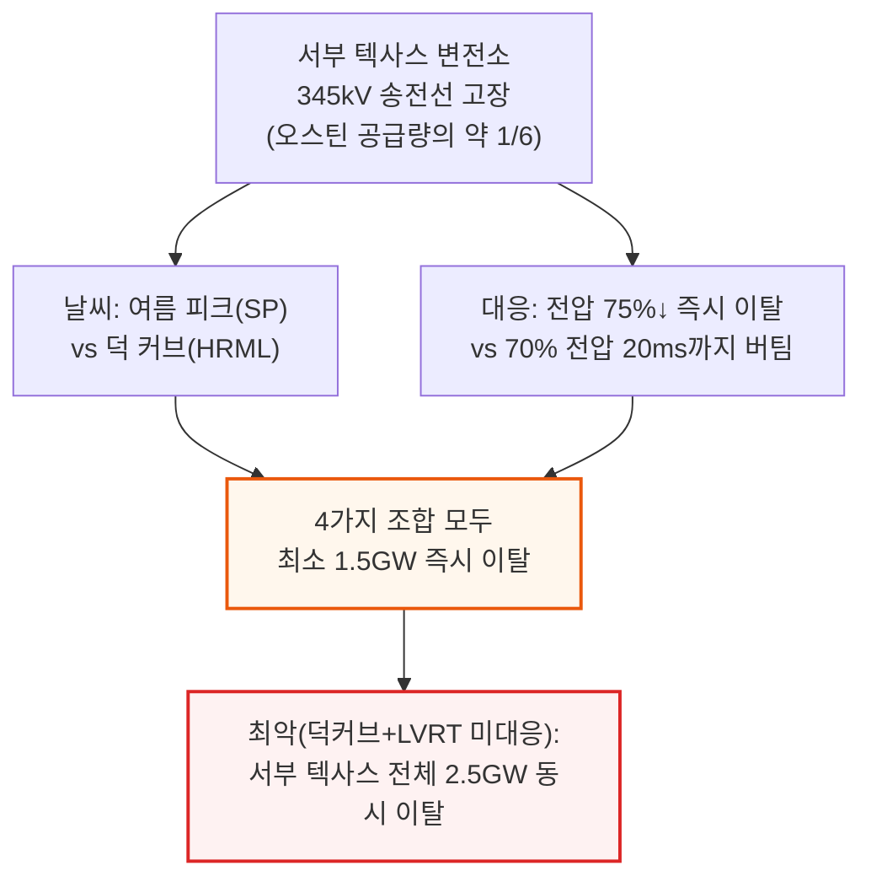
```mermaid
flowchart TD
    Vars["서부 텍사스 변전소<br/>345kV 송전선 고장<br/>(오스틴 공급량의 약 1/6)"] --> W1["날씨: 여름 피크(SP)<br/>vs 덕 커브(HRML)"]
    Vars --> W2["대응: 전압 75%↓ 즉시 이탈<br/>vs 70% 전압 20ms까지 버팀"]

    W1 --> Result["4가지 조합 모두<br/>최소 1.5GW 즉시 이탈"]
    W2 --> Result
    Result --> Worst["최악(덕커브+LVRT 미대응):<br/>서부 텍사스 전체 2.5GW 동시 이탈"]

    style Result fill:#fff7ed,stroke:#ea580c,stroke-width:2px
    style Worst fill:#fef2f2,stroke:#dc2626,stroke-width:2px
```

서부 텍사스 데이터센터 부하는 조만간 10GW를 빠르게 넘어설 전망이라, 이 2.5GW라는 숫자의 비중은 시간이 갈수록 오히려 작아질 수 있습니다.

### 동기 조상기로도 완전히는 못 막음

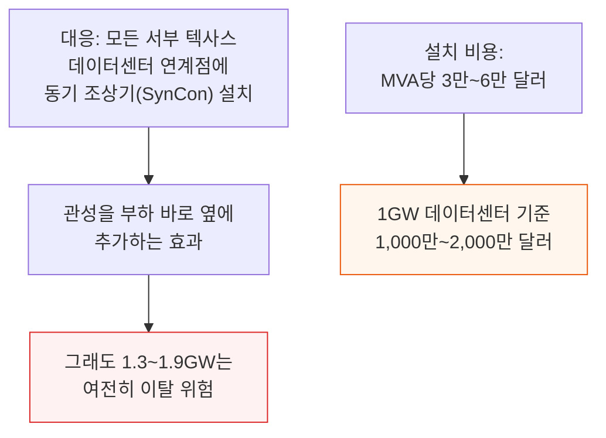
```mermaid
flowchart TD
    SynCon["대응: 모든 서부 텍사스<br/>데이터센터 연계점에<br/>동기 조상기(SynCon) 설치"] --> Effect["관성을 부하 바로 옆에<br/>추가하는 효과"]
    Effect --> StillRisk["그래도 1.3~1.9GW는<br/>여전히 이탈 위험"]

    Cost["설치 비용:<br/>MVA당 3만~6만 달러"] --> TotalCost["1GW 데이터센터 기준<br/>1,000만~2,000만 달러"]

    style StillRisk fill:#fef2f2,stroke:#dc2626
    style TotalCost fill:#fff7ed,stroke:#ea580c
```

### 이노호사의 모델 - 이탈이 연쇄 정전으로 번지는 임계선

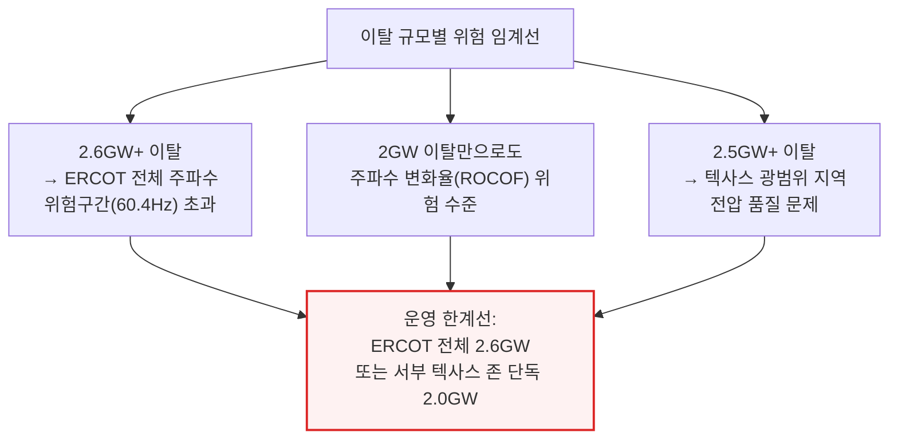
```mermaid
flowchart TD
    Thresh["이탈 규모별 위험 임계선"] --> T1["2.6GW+ 이탈<br/>→ ERCOT 전체 주파수<br/>위험구간(60.4Hz) 초과"]
    Thresh --> T2["2GW 이탈만으로도<br/>주파수 변화율(ROCOF) 위험 수준"]
    Thresh --> T3["2.5GW+ 이탈<br/>→ 텍사스 광범위 지역<br/>전압 품질 문제"]

    T1 --> Limits["운영 한계선:<br/>ERCOT 전체 2.6GW<br/>또는 서부 텍사스 존 단독 2.0GW"]
    T2 --> Limits
    T3 --> Limits

    style Limits fill:#fef2f2,stroke:#dc2626,stroke-width:2px
```

### 이미 벌어진 일 - 2025년 4월 이베리아 반도 정전

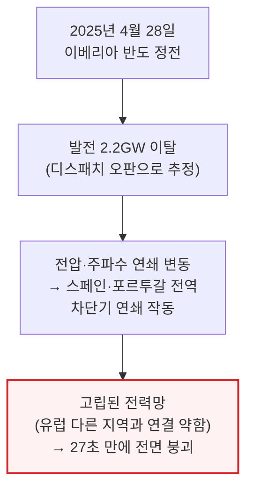
```mermaid
flowchart TD
    Iberia["2025년 4월 28일<br/>이베리아 반도 정전"] --> Trigger["발전 2.2GW 이탈<br/>(디스패치 오판으로 추정)"]
    Trigger --> Cascade["전압·주파수 연쇄 변동<br/>→ 스페인·포르투갈 전역<br/>차단기 연쇄 작동"]
    Cascade --> Collapse["고립된 전력망<br/>(유럽 다른 지역과 연결 약함)<br/>→ 27초 만에 전면 붕괴"]

    style Collapse fill:#fef2f2,stroke:#dc2626,stroke-width:2px
```

### 텍사스에서도 같은 일이 가능한 이유

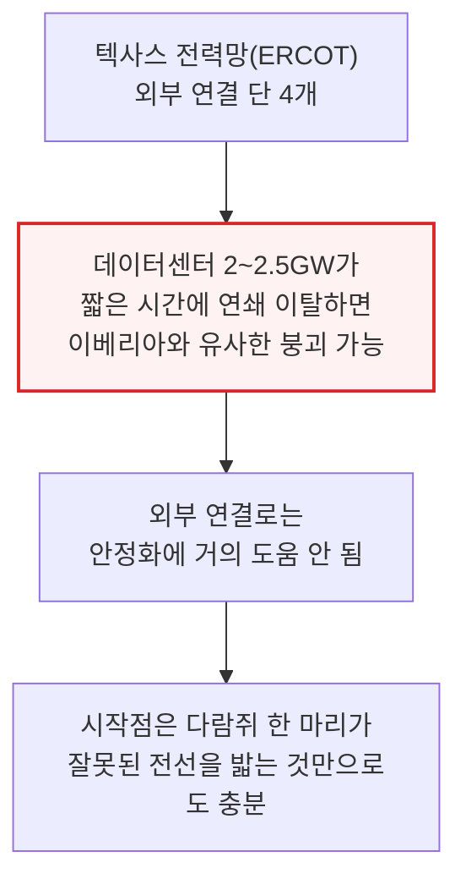
```mermaid
flowchart TD
    TX["텍사스 전력망(ERCOT)<br/>외부 연결 단 4개"] --> Similar["데이터센터 2~2.5GW가<br/>짧은 시간에 연쇄 이탈하면<br/>이베리아와 유사한 붕괴 가능"]
    Similar --> Isolated["외부 연결로는<br/>안정화에 거의 도움 안 됨"]
    Isolated --> Trigger2["시작점은 다람쥐 한 마리가<br/>잘못된 전선을 밟는 것만으로도 충분"]

    style Similar fill:#fef2f2,stroke:#dc2626,stroke-width:2px
```

---

## 8. 해법의 방향 - 배터리 에너지 저장 시스템(BESS)의 가능성

**📌 핵심:**
- 전력 품질을 떨어뜨린 책임은 원칙적으로 데이터센터 쪽에 있고, 문제를 일으키면 그 비용도 데이터센터가 부담해야 함 — 이 때문에 업계가 적극적으로 해법을 찾고 있음
- 테슬라는 수백 메가와트\~기가와트급 대형 배터리가 최선의 해법이라고 주장 — 2025년 5월 ERCOT 회의에서 메가팩 2 XL을 앞세운 발표 자료를 공개했는데, 같은 자료를 NERC 주최 대형부하 워크숍(2025년 4월)에서도 이미 썼던 것
- BESS(배터리 에너지 저장 시스템)의 핵심 강점은 수백 메가와트를 몇 초 안에 충전·방전할 수 있다는 점 — 데이터센터 부하 변동에 딱 맞는 반응 속도와 출력을 동시에 제공하는 유일한 해법이라는 게 테슬라의 주장
- 결론: 메가와트급 배터리를 인버터에 연결하면 "고속 주파수 응답(fast frequency response)"으로 전력 품질 문제를 관리할 수 있고, 발전기·UPS와 함께 배치하면 발전기 수명 연장 효과도 있음 — 다만 캐패시터 뱅크는 초 단위 평탄화가 안 되는 반면 BESS는 밀리초\~분 단위 전 구간에서 대응 가능하다는 게 테슬라의 차별화 포인트

---

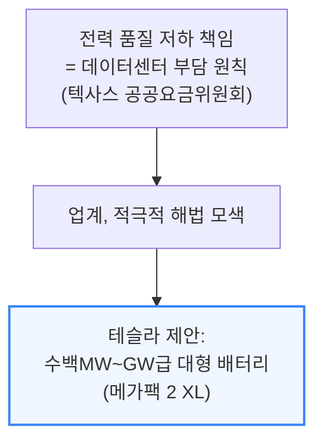
```mermaid
flowchart TD
    Rule["전력 품질 저하 책임<br/>= 데이터센터 부담 원칙<br/>(텍사스 공공요금위원회)"] --> Search["업계, 적극적 해법 모색"]
    Search --> Tesla["테슬라 제안:<br/>수백MW~GW급 대형 배터리<br/>(메가팩 2 XL)"]

    style Tesla fill:#eff6ff,stroke:#3b82f6,stroke-width:2px
```

### BESS의 핵심 강점 - 속도와 출력을 동시에

```mermaid
flowchart TD
    Feature["BESS 핵심 강점"] --> F1["수백MW를<br/>몇 초 안에 충전·방전"]
    Feature --> F2["데이터센터 부하 변동에<br/>맞는 반응 속도 + 출력"]

    F1 --> FFR["고속 주파수 응답<br/>(Fast Frequency Response)"]
    F2 --> FFR

    style FFR fill:#f0fdf4,stroke:#16a34a,stroke-width:2px
```

테슬라는 BESS를 발전기·UPS를 대체하는 게 아니라 함께 배치하는 용도로 제안합니다. BESS를 발전기와 직렬로 연결하면 발전기가 더 매끄럽게 작동해 수명이 늘어나는 효과도 있다고 설명합니다.

### BESS vs 캐패시터 뱅크 - 대응 가능한 시간 범위

```mermaid
flowchart TD
    CapBank["캐패시터 뱅크:<br/>초 단위 평탄화 불가"] --> Limited["부하 평탄화에 한계"]

    BESSRange["BESS:<br/>밀리초~초~분 단위<br/>전 구간 대응 가능"] --> Flexible["캐패시터·디젤발전·<br/>전력망 자원보다<br/>더 유연"]

    style BESSRange fill:#f0fdf4,stroke:#16a34a,stroke-width:2px
    style Flexible fill:#f0fdf4,stroke:#16a34a
```

BESS는 LVRT 대응도 개선할 수 있습니다. 테슬라는 메가팩을 기존 UPS의 "대체재"가 아니라 "보완재"로 설명합니다 — UPS가 전압이 반복해서 흔들려 전력망 연결을 끊으면, BESS가 전력망 쪽에서 부하를 충전하며 마치 정상 부하가 있는 것처럼 "흉내" 내 UPS가 수동으로 재설정될 시간을 벌어줍니다.

---

## 9. BESS의 활용 - 수요반응과 세 가지 최적 지점

**📌 핵심:**
- 테슬라는 BESS의 부가 효과로 수요반응(Demand Response, 전력망이 부족할 때 데이터센터가 스스로 전력 사용을 줄이는 대가로 보상받는 제도)을 제시함 — 텍사스 암호화폐 채굴업체를 제외하면 인센티브 부족으로 아직 채택률이 낮음
- 듀크대 연구에 따르면 새 부하가 연간 20\~90시간만 수요반응에 참여해도 ERCOT 전체는 추가 인프라 투자 없이 6.5\~14.7GW의 새 부하(데이터센터에 한정되지 않음)를 받아들일 수 있음 — 전력망 설비는 연중 단 0.25\~1%에 불과한 피크 시간대(늦여름 오후 열파, 태양광 발전이 꺼지는 시점)를 기준으로 설계되기 때문
- xAI가 멤피스에서 수요반응 프로그램에 참여한 것이 전력망 접속을 남들보다 훨씬 빠르게 받은 핵심 열쇠였음 — 온사이트 가스터빈으로 4개월 만에 클러스터를 가동했고, 별도 변전소까지 지어 부하 신청 후 1년도 안 돼 전력망에서 150MW를 끌어오는 데 성공
- 결론: 하지만 수요반응은 고객 쪽(불을 끄고 냉방을 줄여야 하는 부담, 예비전력 필수화, 24시간 전 예고·3시간 전 확정이라는 촉박한 배터리 충전 일정)과 전력회사 쪽(IT 인프라가 10\~20년 뒤처짐, 미성숙한 수요반응 관리 소프트웨어(DRMS), 인센티브 부족) 양쪽에 걸림돌이 많음 — ERCOT는 용량 가격 자체가 없는 "에너지 전용 시장"이라 인센티브가 특히 약함

---

```mermaid
flowchart TD
    DR["수요반응(Demand Response)<br/>= 전력 사용을 줄이는 대가로<br/>전력망이 보상"] --> Adoption["현재 채택률 낮음<br/>(텍사스 암호화폐 채굴업체 제외)<br/>인센티브 부족이 원인"]

    style DR fill:#eff6ff,stroke:#3b82f6,stroke-width:2px
```

### 왜 짧은 참여만으로도 큰 효과가 나는가

```mermaid
flowchart TD
    Duke["듀크대 연구:<br/>새 부하가 연 20~90시간만<br/>수요반응 참여"] --> Unlock["ERCOT 전체<br/>추가 인프라 투자 없이<br/>6.5~14.7GW 신규 부하 수용 가능"]
    Unlock --> Why["이유: 전력설비는<br/>연중 0.25~1%뿐인<br/>피크시간대 기준으로 설계<br/>(늦여름 오후 열파 등 예측 가능)"]

    style Unlock fill:#f0fdf4,stroke:#16a34a,stroke-width:2px
```

### xAI 멤피스 사례 - 수요반응이 전력망 접속을 앞당긴 실증

```mermaid
flowchart TD
    Xai["xAI 멤피스<br/>온사이트 가스터빈으로<br/>4개월 만에 클러스터 가동"] --> Sub["별도 변전소 건설"]
    Sub --> Fast["부하 신청 후 1년 이내<br/>전력망에서 150MW 확보<br/>(이례적으로 빠름)"]

    style Fast fill:#f0fdf4,stroke:#16a34a,stroke-width:2px
```

### 고객 측 걸림돌 - SOC(충전 상태) 관리의 딜레마

BESS는 부하를 강제로 끄는 대신 배터리를 방전해 수요를 줄이는 방식으로 이 부담을 덜어줄 수 있습니다. 다만 전력회사가 피크 발생 가능성은 24시간 전, 확정 시간대(3\~6시간 창)는 3시간 전에야 알려주기 때문에, 배터리를 미리 충전해두지 않으면 반응할 시간이 부족합니다.

```mermaid
flowchart TD
    Notice["전력회사 예고:<br/>가능성 24시간 전,<br/>확정 창(3~6시간) 3시간 전"] --> Charge["미리 충전 안 해두면<br/>반응할 시간 부족"]
    Charge --> Shift["다수 대형부하가<br/>선제 충전에 나서면<br/>피크 자체가 오후 1~2시로 당겨질 위험"]

    Trade["SOC(배터리 충전 상태)는<br/>수요반응과 LVRT 대응·정전 대비가<br/>서로 경합하는 자원"] --> Priority["한쪽에 쓰면<br/>다른 쪽 대비가 그만큼 줄어듦"]

    style Shift fill:#fff7ed,stroke:#ea580c
    style Priority fill:#fef2f2,stroke:#dc2626
```

### 전력회사 측 걸림돌과 약한 인센티브

```mermaid
flowchart TD
    UtilGap["전력회사의 구조적 약점"] --> U1["IT 인프라<br/>10~20년 뒤처짐"]
    UtilGap --> U2["수요반응 관리<br/>소프트웨어(DRMS) 미성숙"]
    UtilGap --> U3["피크 예측·고객 통보·<br/>정산까지 전 과정 미흡"]

    Market["ERCOT = 에너지 전용 시장<br/>(용량 가격 자체가 없음)"] --> Weak["수요반응 보상이<br/>노력 대비 미미<br/>(20MW 감축 기준 월 16만~30만 달러 수준,<br/>MISO·PJM $8~15/kW-month 준용 시)"]

    style Weak fill:#fef2f2,stroke:#dc2626
```

이 정도 보상은 데이터센터 전기요금 청구서에 5자리 수 크레딧 정도로 남아, 수요반응을 구현하는 데 들어간 노력과 자본에 비하면 반올림 오차이거나 사실상 모욕에 가깝다는 게 SemiAnalysis의 평가입니다.

---

## 10. BESS의 비용과 한계

**📌 핵심:**
- 테슬라는 메가팩 시스템의 순 비용에 대해 말을 아끼는데, 실제 비용이 상당하기 때문 — 라자드의 2024년 6월 균등화발전비용(LCOE) 보고서에 따르면 100MW BESS는 2시간 배터리 기준 3,800만\~8,000만 달러, 수요반응·예비전력에 필요한 4시간 배터리 기준으로는 7,600만\~1억 5,700만 달러
- 이 단가로 기가와트급 데이터센터에 필요한 BESS를 설치하면 비용이 거의 10억 달러에 육박함 — 이 가격대에서는 테슬라조차 BESS를 UPS나 디젤발전기의 대체재로 보지 않고, 건설 기간·초기 투자·부지·공급망 리스크가 추가로 얹히는 순수 추가 비용으로 인정
- SemiAnalysis는 데이터홀 내부(랙 레벨 슈퍼캐패시터·리튬이온 캐패시터·배터리), 그레이 스페이스(UPS), 데이터센터 외부(BESS) 세 갈래로 GPU 부하 변동 해법을 정리 — "전통" 방식(마이크로소프트·AWS 등 범용성 우선 하이퍼스케일러가 캐패시터를 보강한 "강화형 UPS" 채택, 베르티브·슈나이더·이튼 수혜)과 "AI 최적화" 방식(랙 내 캐패시터+수 분 배터리 조합, 엔비디아 800V DC 아키텍처 기반)으로 시장이 양분될 전망
- 결론: BESS는 오늘날 단독으로 24시간 무중단 가동을 보장할 만큼 빠르지 않아 UPS는 여전히 필요 — 다만 세 지점(시간 단축이 최우선인 학습 시설, 가스터빈 예비전력 시설, 온사이트 태양광 시설)에서는 뚜렷한 경제성이 있어 SemiAnalysis는 전반적으로 BESS의 미래를 낙관

---

```mermaid
flowchart TD
    Lazard["라자드 2024년 6월<br/>LCOE 보고서"] --> H2["2시간 배터리(100MW):<br/>3,800만~8,000만 달러"]
    Lazard --> H4["4시간 배터리(100MW):<br/>7,600만~1억 5,700만 달러<br/>(수요반응·예비전력용)"]

    H4 --> GWCost["기가와트급 데이터센터<br/>BESS 비용 ≈ 거의 10억 달러"]

    style GWCost fill:#fef2f2,stroke:#dc2626,stroke-width:2px
```

이 가격대에서는 테슬라조차 BESS를 UPS·디젤발전기의 대체재가 아니라, 건설 기간·초기 투자·부지·공급망 리스크가 그대로 얹히는 순수 추가 비용으로 인정합니다.

### 세 갈래 해법과 두 갈래 시장 전략

```mermaid
flowchart TD
    Three["GPU 부하 변동 해법<br/>3갈래"] --> Hall["데이터홀 내부:<br/>랙 레벨 슈퍼캐패시터·<br/>리튬이온 캐패시터·배터리"]
    Three --> Grey["그레이 스페이스: UPS"]
    Three --> Outside["데이터센터 외부: BESS"]

    style Three fill:#eff6ff,stroke:#3b82f6,stroke-width:2px
```

```mermaid
flowchart TD
    Split["시장 전략 양분"] --> Trad["'전통' 방식:<br/>마이크로소프트·AWS 등<br/>범용성(fungibility) 우선<br/>→ 강화형 UPS<br/>(베르티브·슈나이더·이튼 수혜)"]
    Split --> Opt["'AI 최적화' 방식:<br/>랙 내 캐패시터 + 수 분 배터리<br/>(엔비디아 800V DC 아키텍처)"]

    style Trad fill:#eff6ff,stroke:#3b82f6
    style Opt fill:#fff7ed,stroke:#ea580c,stroke-width:2px
```

BESS는 아직 단독으로 무중단 가동을 보장할 만큼 빠르지 않아 UPS를 대체하지 못하고, 피크 시프팅(peak-shaving) 용도로는 슈퍼캐패시터 대비 너무 비쌉니다.
이 때문에 UPS+디젤발전기 조합이 여전히 BESS의 직접 경쟁자입니다.
다만 향후 GaN 기반 전력전자 등으로 BESS 반응 속도가 개선되면 4시간 이상 예비전력까지 담당하며 디젤과 본격 경쟁할 가능성이 있습니다.

### BESS가 통하는 세 가지 지점

```mermaid
flowchart TD
    Sweet["BESS 경제성이 통하는<br/>세 가지 지점"] --> S1["① 속도 최우선 학습 시설<br/>(xAI 사례)<br/>디젤 대비 배포 빠르고<br/>대부분 정전을 버틸 만큼 충분"]
    Sweet --> S2["② 가스터빈 예비전력 시설<br/>(가스터빈 기동 = 분 단위)<br/>1시간 BESS가 좋은 조합"]
    Sweet --> S3["③ 온사이트 태양광 시설<br/>저렴한 전력 + 배터리로<br/>비용 추가 절감"]

    style Sweet fill:#f0fdf4,stroke:#16a34a,stroke-width:2px
```

디젤발전기는 가격이 BESS와 비슷하고 최소 24시간 이상 가동할 수 있지만 소요 시간이 18개월 이상이고 대기오염 허가 절차가 느립니다.
BESS는 배포가 더 빠르고 대부분의 정전을 무중단으로 버틸 만큼은 충분해, 학습 용도로는 그것으로 족하다는 게 SemiAnalysis의 판단입니다.
텍사스주 SB6 법안이 통과되면 가스터빈 예비전력 채택이 늘며 BESS 수요도 함께 늘어날 수 있습니다.

---

## 11. 하드웨어 대안 - 랙 레벨 캐패시터와 UPS 재설계

**📌 핵심:**
- 메타·구글은 오래전부터 BBU(리튬 배터리)를 랙 옆에 둬왔지만, 이는 밀리초 단위 피크 대응에는 최적이 아님 — 가장 비싼 해법인 데다 완전 충전 상태로 몇 분을 버티도록 설계돼 있고, 리튬 배터리는 자주 충전·방전하면 수명이 줄어듦
- 델타일렉트로닉스가 시연한 리튬이온 캐패시터(몇 초만 저장)는 전력망 쪽 변동 폭을 73%에서 6%로 줄였음 — 캐패시터 뱅크를 랙 크기로 줄인 "랙 레벨 캐패시터 뱅크(RLCB)"는 밀리초 단위 "떨림"은 흡수하지만, 여전히 수 초 안에 일어나는 수 메가와트급 변동에는 역부족(발전기 램프 속도가 분당 5\~50MW에 불과하기 때문)
- 캐패시터와 리튬이온 배터리를 결합한 "리튬이온 캐패시터"는 10\~15초까지 저장이 가능하며, 엔비디아의 신형 800V DC(±400V DC) 아키텍처와 함께 주류로 자리 잡는 중 — 이 아키텍처의 "정류기 랙"에는 배터리와 슈퍼캐패시터가 함께 들어가며(둘 중 하나만 넣을 수도 있음), 리튬이온 캐패시터는 BESS와 결합할 때, 기존 디젤·가스 예비전력 데이터센터는 캐패시터+3\~5분 배터리 조합을 택하는 흐름
- 결론: ERCOT 모델링이 지목한 진짜 취약점은 UPS의 "삼진아웃" 구조(전압이 반복해서 흔들리면 영구 차단)임 — ERCOT는 재프로그래밍으로 이를 막을 수 있다고 보지만 모든 UPS 업체가 지원하지는 않아, 그 대신 "보장된 신뢰성 부하(GRL)" 계약(설비별 맞춤 조건으로 특정 정전 상황에서도 이탈하지 않도록 설계)을 제안 — 결국 대부분의 해법은 추가 비용을 수반하지만, 전력 접속 자체를 얻기 위한 전제조건이며 AI 연구소들은 GPU를 더 빨리 확보하기 위해 이 프리미엄을 기꺼이 지불하는 국면

---

```mermaid
flowchart TD
    BBU["메타·구글의 기존 BBU<br/>(리튬 배터리, 몇 분 완전출력)"] --> Limit["밀리초 단위 피크 대응엔<br/>최적이 아님"]
    Limit --> L1["가장 비싼 해법"]
    Limit --> L2["잦은 충전·방전 시<br/>수명 단축"]

    style Limit fill:#fff7ed,stroke:#ea580c
```

### 델타일렉트로닉스 실증 - 변동 폭 73% → 6%

```mermaid
flowchart TD
    Delta["델타일렉트로닉스 시연:<br/>리튬이온 캐패시터<br/>(몇 초 저장)"] --> Before["적용 전: 전력망 변동 폭 73%"]
    Delta --> After["적용 후: 전력망 변동 폭 6%"]

    style After fill:#f0fdf4,stroke:#16a34a,stroke-width:2px
```

### RLCB(랙 레벨 캐패시터 뱅크) - 절반의 해법

```mermaid
flowchart TD
    RLCB["RLCB<br/>(캐패시터 뱅크를 랙 크기로 축소)"] --> Absorb["밀리초 단위 '떨림'<br/>흡수"]
    Absorb --> StillLimited["수 초 내 수MW급 변동엔<br/>여전히 역부족<br/>(발전기 램프 속도 분당 5~50MW)"]

    Combo["캐패시터 + 리튬이온 배터리<br/>= '리튬이온 캐패시터'"] --> Longer["10~15초까지 저장 가능"]

    style StillLimited fill:#fff7ed,stroke:#ea580c
    style Longer fill:#f0fdf4,stroke:#16a34a
```

800V DC 아키텍처의 "정류기 랙"에는 배터리와 슈퍼캐패시터가 함께 들어가며(경우에 따라 둘 중 하나만), 리튬이온 캐패시터는 BESS와 결합할 때 더 유리하고 기존 디젤·가스 예비전력 데이터센터는 캐패시터+3\~5분 배터리 조합을 택하는 흐름입니다. 이 아키텍처 전환은 공급망 전반에도 큰 영향을 미칩니다.

### UPS의 진짜 약점 - "삼진아웃" 구조와 재설계

```mermaid
flowchart TD
    ThreeStrikes["UPS '삼진아웃' 구조:<br/>전압 하강 반복 시<br/>영구 차단"] --> ERCOTfix["ERCOT 제안:<br/>재프로그래밍으로<br/>영구 차단 방지"]
    ERCOTfix --> NotAll["단, 모든 UPS 업체가<br/>지원하지는 않음"]

    NotAll --> GRL["대안: GRL<br/>(보장된 신뢰성 부하) 계약<br/>설비별 맞춤 조건으로<br/>특정 정전 상황에서도 이탈 방지"]

    style ThreeStrikes fill:#fef2f2,stroke:#dc2626,stroke-width:2px
    style GRL fill:#f0fdf4,stroke:#16a34a
```

GRL 계약의 궁극적 목표는 데이터센터가 가능한 한 온사이트 예비발전기를 쓰지 않고도 정전 상황을 버티게 만드는 것입니다.
결국 대부분의 해법은 추가 비용을 수반하지만, 이는 전력 접속 자체를 얻기 위한 전제조건입니다.
지금 같은 AI 투자 붐에서는 시장 진입 속도가 최우선 가치이고, GPU 클라우드 경제성상 전기요금·임대료가 조금 늘어도 최종 사용자 입장에서 재무 방정식 자체는 크게 바뀌지 않습니다.

---

*작성 진행률: 100% 완료*
*업데이트: 원문 전체 11개 섹션(개요\~하드웨어 대안) 변환 완료*
