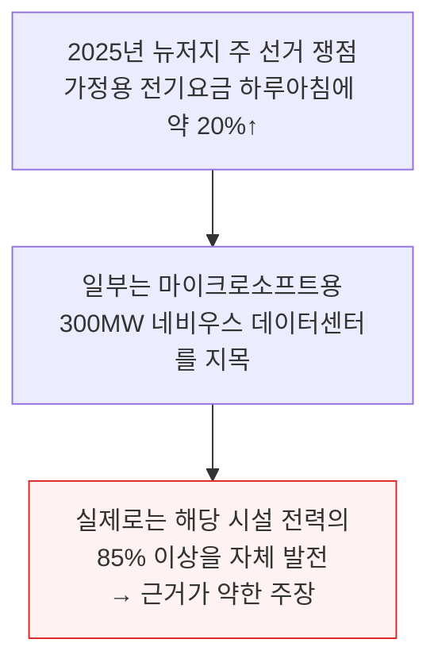
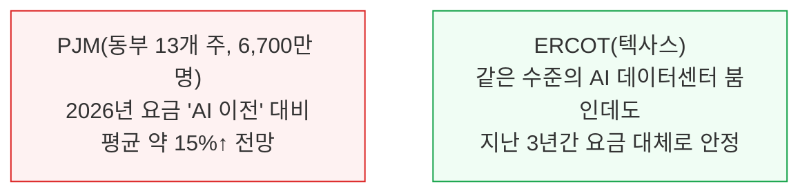
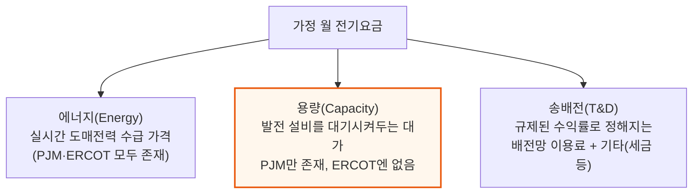
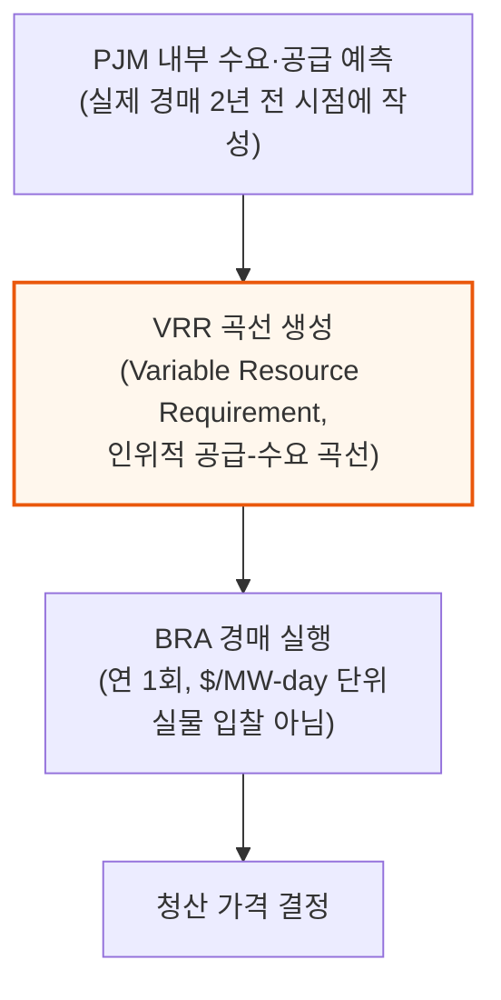
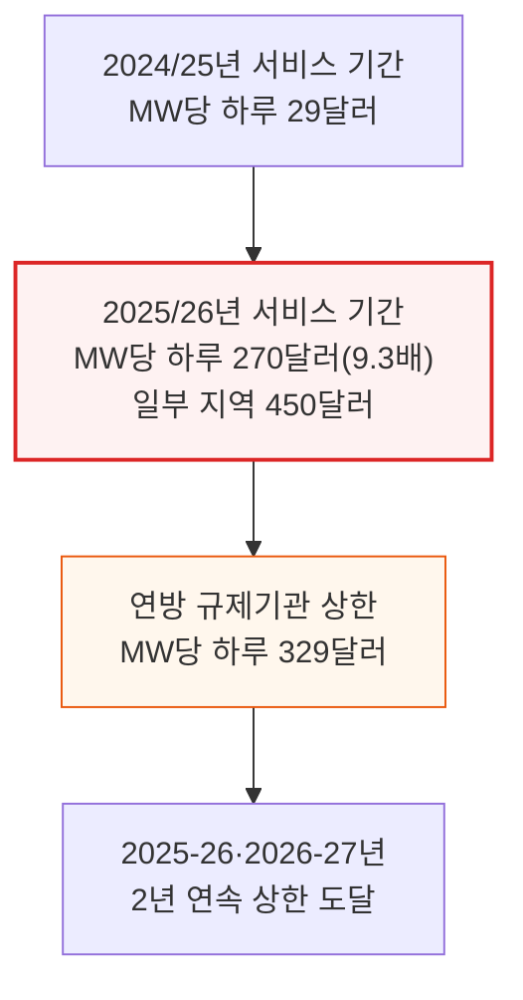

# Are AI Datacenters Increasing Electric Bills for American Households?

> **출처**: [SemiAnalysis Newsletter](https://newsletter.semianalysis.com/p/are-ai-datacenters-increasing-electric)
> **저자**: Aishwarya Mahesh, Jeremie Eliahou Ontiveros, Ajey Pandey
> **발행일**: 2026-03-03

---

## 📑 목차

### 전체 섹션
 1. [왜 이 논쟁이 벌어졌나 - 오해의 진원](#1-왜-이-논쟁이-벌어졌나---오해의-진원)
 2. [전기요금은 무엇으로 구성되는가 - 에너지·용량·송배전](#2-전기요금은-무엇으로-구성되는가---에너지용량송배전)
 3. [PJM의 160억 달러 시뮬레이션 - BRA 경매는 어떻게 작동하는가](#3-pjm의-160억-달러-시뮬레이션---bra-경매는-어떻게-작동하는가)
 4. [데이터센터가 범인으로 지목된 이유 - 감시기구의 반박 시뮬레이션](#4-데이터센터가-범인으로-지목된-이유---감시기구의-반박-시뮬레이션)
 5. [PJM 예측이 틀렸다는 증거 - 선물가격과 공급측 오류](#5-pjm-예측이-틀렸다는-증거---선물가격과-공급측-오류)
 6. [용량 요금이 가정 청구서에 미치는 영향](#6-용량-요금이-가정-청구서에-미치는-영향)
 7. [ERCOT - 같은 부하 증가, 요금 충격은 없었다](#7-ercot---같은-부하-증가-요금-충격은-없었다)
 8. [ERCOT의 수요 예측과 실제 - 더 많은 부하, 더 적은 희소성](#8-ercot의-수요-예측과-실제---더-많은-부하-더-적은-희소성)
 9. [겨울폭풍 펀 - 신뢰성 값을 치렀는데 신뢰성은 없었다](#9-겨울폭풍-펀---신뢰성-값을-치렀는데-신뢰성은-없었다)
10. [다음은 무엇인가 - 정치적 후폭풍과 규제 비대칭](#10-다음은-무엇인가---정치적-후폭풍과-규제-비대칭)
11. [승자와 패자 - 병목이 전력에서 실리콘으로 이동한다](#11-승자와-패자---병목이-전력에서-실리콘으로-이동한다)

---

## 🔑 용어 정리

본문을 순서대로 읽기 전에 알아두면 좋은 용어들입니다. 자세한 수치와 설명은 본문에서 처음 등장하는 위치에 나옵니다.

- **PJM**: 미국 동부 13개 주(뉴저지 포함)와 워싱턴DC를 관할하는 전력망 운영기구 — 세계 최대 데이터센터 밀집지인 북부 버지니아가 이 구역에 있음
- **ERCOT (Electric Reliability Council of Texas)**: 텍사스주 하나만 관할하는 독립 전력망 운영기구 — 연방 규제기관의 관할을 받지 않아 규정을 빠르게 바꿀 수 있음
- **용량(Capacity) 시장**: 실제로 쓰는 전기(에너지)와 별도로, "1년에 몇 시간만 켜질 발전 설비를 대기시켜 두는 값"을 미리 지불하는 제도 — PJM에는 있고 ERCOT에는 없음
- **BRA (Base Residual Auction, 기본잔여경매)**: PJM이 2년 뒤 필요한 용량을 미리 사들이기 위해 연 1회 여는 경매 — 실제 수급이 아니라 PJM의 내부 예측을 바탕으로 가격이 정해짐
- **VRR 곡선 (Variable Resource Requirement Curve)**: BRA 경매 가격을 결정하는 인위적인 공급-수요 곡선 — 실물 입찰이 아니라 PJM이 자체 예측 모델로 만든 시뮬레이션
- **IMM (Independent Market Monitor, 독립 시장 감시기구)**: 연방에너지규제위원회(FERC) 요구로 PJM 경매를 감시하는 독립 기관 — 데이터센터 부하를 뺀 대안 시뮬레이션을 돌려 실제 가격과 비교함
- **ORDC (Operating Reserve Demand Curve, 운영예비력 수요곡선)**: ERCOT가 쓰는 실시간 희소성 가격 산정 방식 — 수급이 빠듯해지면 자동으로 전기 가격을 끌어올려 발전 설비가 즉시 반응하게 만듦
- **온사이트 발전 (Behind-the-Meter Generation)**: 전력망 연결을 기다리지 않고 부지 안에 가스터빈 등을 직접 지어 그 자리에서 전기를 만드는 방식

---

## 1. 왜 이 논쟁이 벌어졌나 - 오해의 진원

**📌 핵심:**
- 2025년 뉴저지 주 선거 쟁점은 하루아침에 약 20% 뛴 가정용 전기요금 — 일부는 마이크로소프트용 300MW 네비우스 데이터센터를 원인으로 지목했지만, 이 시설은 전력의 85% 이상을 자체 발전해 쓰는 시설이라 근거가 약함
- PJM(동부 13개 주, 6,700만 명 관할)은 2026년 요금이 "AI 데이터센터 이전" 대비 평균 약 15% 오를 전망인 반면, 텍사스를 관할하는 ERCOT는 같은 수준의 AI 데이터센터 붐 속에서도 지난 3년간 요금이 대체로 안정적이었음
- 두 지역 모두 구글·앤트로픽·메타·오픈AI가 기가와트급 시설을 짓고 있어 데이터센터 부하 증가폭 자체는 비슷함 — 그런데도 요금 결과가 이렇게 갈리는 이유는 데이터센터가 아니라 **시장 설계(정부·규제기관이 정한 가격 결정 방식)의 차이**
- 결론: 실증적으로 보면 잘못은 AI가 아니라 정부 정책(시장 설계)에 있음 — 이 문서는 PJM과 ERCOT의 시장 설계를 비교해 그 이유를 규명함

---

두 지역을 나란히 놓고 보면 결과가 극명하게 갈립니다.

이 보고서는 미국에서 가장 큰 두 전력 시장이자 최대 AI 데이터센터 허브인 PJM과 ERCOT를 비교 분석합니다. PJM은 뉴저지를 포함한 동부 13개 주를, ERCOT는 텍사스 한 주를 관할합니다. PJM 관할지에는 구글이 오하이오주 콜럼버스 인근에서 제미나이 모델을 학습시키고 있고, 앤트로픽·아마존의 "프로젝트 레이니어", 메타의 "프로메테우스"가 인디애나·오하이오에 있으며, 세계 최대 데이터센터 허브인 북부 버지니아도 PJM 관할입니다. 반면 텍사스에서도 오픈AI·구글 딥마인드·앤트로픽이 대형 시설을 짓고 있지만, 텍사스 전력 선물 가격은 지난 1년간 몇 퍼센트만 움직였을 뿐 9배 급등이나 위기는 없었습니다.

---

## 2. 전기요금은 무엇으로 구성되는가 - 에너지·용량·송배전

**📌 핵심:**
- 가정 월 전기요금은 크게 4가지로 구성 — 에너지(실시간 도매전력 가격), 용량(발전 설비를 대기시켜두는 대가, PJM에만 존재), 송배전(규제된 수익률로 정해지는 배전망 이용료), 기타(세금·소매 부가금 등)
- 용량 시장의 목적은 여름·겨울 피크 시점에도 항상 전기가 부족하지 않게 하는 것 — 예를 들어 뉴욕시 하루 전력 수요는 평소 2GW씩 오르내리다가(일평균 피크 6\~8GW), 폭염이 오면 모두가 에어컨을 동시에 켜면서 10GW까지 치솟음
- PJM은 이 대기 설비 유지비를 연 1회 경매(가격은 뒤 섹션에서 다룸)로 정해 관할 내 모든 전기 소비자에게 나눠 부담시킴 — 2025/26년 이 가격이 전년 대비 9.3배 뛰었음
- 결론: ERCOT는 별도 용량 경매가 없는 "에너지 온리(energy-only)" 시장으로, 실시간 가격 신호만으로 부족분(희소성)을 해결하도록 설계됨 — 이 구조적 차이가 뒤에 나올 요금 격차의 출발점

---

📌 용어 풀이: 용량(Capacity)
> - **용량**: 1년 중 극소수의 피크 시간대에만 켜지는 발전 설비를 "항상 켤 수 있는 상태"로 대기시켜두는 대가 — PJM에서는 발전소 소유주에게 연중 95% 넘는 시간을 그냥 대기만 시키고도 돈을 지급
> - **에너지 온리 시장**: ERCOT처럼 별도의 용량 대금 없이, 실시간 가격이 오르내리는 것만으로 발전 설비가 대기·투자 여부를 스스로 판단하게 하는 시장 구조
> - **쉬운 비유**: 용량 요금은 "소방차를 화재가 안 나도 매달 대기시켜두는 값을 미리 걷는 것", 에너지 온리 시장은 "불이 났을 때만 출동비를 비싸게 쳐주는 것"

뉴욕시 사례가 이 변동폭을 잘 보여줍니다. 평소에도 하루 안에서 전력 수요가 2GW씩 오르내리고(일평균 피크 6\~8GW), 폭염 때는 모두가 에어컨을 동시에 켜면서 10GW까지 치솟습니다. 용량 시장은 이런 극단적인 순간에도 정전이 나지 않도록 발전 설비를 미리 확보해두는 제도입니다.

---

## 3. PJM의 160억 달러 시뮬레이션 - BRA 경매는 어떻게 작동하는가

**📌 핵심:**
- 용량 시장 설계의 핵심 문제는 가격이 실물 수급이 아니라 PJM이라는 중앙계획자의 예측 시뮬레이션으로 정해진다는 것 — 예측 오차가 나면 수십억 달러가 잘못 지출될 수 있고, 2025-26년 경매에서 그 규모가 160억 달러(PJM 관할 모든 가구·기업이 분담)
- BRA(기본잔여경매)는 2년 뒤 필요한 용량을 미리 사들이는 연 1회 경매 — 2024/25년 청산가는 MW당 하루 29달러였는데, 2025/26년엔 270달러로 9.3배 뛰었고 일부 지역은 450달러까지 나옴
- 연방 규제기관이 MW당 하루 329달러 상한을 걸었는데도 2025-26·2026-27년 경매가 2년 연속 상한에 도달 — 이 가격은 PJM 내부 예측 모델이 만든 VRR 곡선(인위적 공급-수요 곡선)에서 나온 것으로, 실물 입찰이 아님
- 결론: PJM은 이 급등을 폭염·데이터센터 부하 탓으로 돌렸지만, 가격 자체가 1년도 더 전에 PJM이 자체 설계한 시뮬레이션으로 정해진다는 점에서 그 설명은 PJM 자신의 책임을 가림

---

### BRA 경매는 어떻게 가격을 만드나

📌 용어 풀이: BRA와 VRR 곡선
> - **BRA (Base Residual Auction, 기본잔여경매)**: PJM이 2년 뒤(예: 2025년 말에 2027/28년분) 필요한 용량을 미리 확보하기 위해 여는 연 1회 경매 — 도매 에너지 시장이 $/MWh(실제 소비 전력량)로 거래되는 것과 달리, BRA는 $/MW-day(하루 단위로 대기시켜둔 최대 전력)로 거래됨
> - **VRR 곡선**: BRA 청산 가격을 만드는 인위적인 공급-수요 곡선 — 실제 시장 참여자의 입찰이 아니라 PJM 내부 예측 모델과 비공개 데이터로 만들어짐. 데이터센터 부하 전망이 조금만 바뀌어도 이 곡선의 청산점 근처 기울기가 크게 흔들려 가격이 급변할 수 있음

2025년 여름은 PJM 관할지에서 유독 더워, 6월 23\~24일이 역대 3\~4위 피크일로 기록됐지만 정전은 없었습니다 — 발전 용량이 충분했기 때문입니다. 문제는 그 신뢰성을 사는 값이 지나치게 비싸졌다는 점이며, PJM은 이 급등을 "극단적 날씨와 하이퍼스케일러(초대형 사업자) 데이터센터·AI 전력 수요" 탓으로 돌렸고 그 서사가 주류 언론에도 그대로 옮겨졌습니다. 하지만 이 설명은 가격이 1년 넘게 앞서 PJM 자체 시뮬레이션 모델로 정해진다는 사실을 가리는 측면이 있습니다.

---

*작성 진행률: 약 35% 완료 (1~3장)*
