# Are AI Datacenters Increasing Electric Bills for American Households?

> **출처**: [SemiAnalysis Newsletter](https://newsletter.semianalysis.com/p/are-ai-datacenters-increasing-electric)
> **저자**: Aishwarya Mahesh, Jeremie Eliahou Ontiveros, Ajey Pandey
> **발행일**: 2026-03-03

---

## 📑 목차

### 전체 섹션
 1. [왜 이 논쟁이 벌어졌나 - 오해의 진원](#1-왜-이-논쟁이-벌어졌나---오해의-진원)
 2. [전기요금은 무엇으로 구성되는가 - 에너지·용량·송배전](#2-전기요금은-무엇으로-구성되는가---에너지용량송배전)
 3. [PJM의 160억 달러 시뮬레이션 - BRA 경매는 어떻게 작동하는가](#3-pjm의-160억-달러-시뮬레이션---bra-경매는-어떻게-작동하는가)
 4. [데이터센터가 범인으로 지목된 이유 - 감시기구의 반박 시뮬레이션](#4-데이터센터가-범인으로-지목된-이유---감시기구의-반박-시뮬레이션)
 5. [PJM 예측이 틀렸다는 증거 - 선물가격과 공급측 오류](#5-pjm-예측이-틀렸다는-증거---선물가격과-공급측-오류)
 6. [용량 요금이 가정 청구서에 미치는 영향](#6-용량-요금이-가정-청구서에-미치는-영향)
 7. [ERCOT - 같은 부하 증가, 요금 충격은 없었다](#7-ercot---같은-부하-증가-요금-충격은-없었다)
 8. [ERCOT의 수요 예측과 실제 - 더 많은 부하, 더 적은 희소성](#8-ercot의-수요-예측과-실제---더-많은-부하-더-적은-희소성)
 9. [겨울폭풍 펀 - 신뢰성 값을 치렀는데 신뢰성은 없었다](#9-겨울폭풍-펀---신뢰성-값을-치렀는데-신뢰성은-없었다)
10. [다음은 무엇인가 - 정치적 후폭풍과 규제 비대칭](#10-다음은-무엇인가---정치적-후폭풍과-규제-비대칭)
11. [승자와 패자 - 병목이 전력에서 실리콘으로 이동한다](#11-승자와-패자---병목이-전력에서-실리콘으로-이동한다)

---

## 🔑 용어 정리

본문을 순서대로 읽기 전에 알아두면 좋은 용어들입니다. 자세한 수치와 설명은 본문에서 처음 등장하는 위치에 나옵니다.

- **PJM**: 미국 동부 13개 주(뉴저지 포함)와 워싱턴DC를 관할하는 전력망 운영기구 — 세계 최대 데이터센터 밀집지인 북부 버지니아가 이 구역에 있음
- **ERCOT (Electric Reliability Council of Texas)**: 텍사스주 하나만 관할하는 독립 전력망 운영기구 — 연방 규제기관의 관할을 받지 않아 규정을 빠르게 바꿀 수 있음
- **용량(Capacity) 시장**: 실제로 쓰는 전기(에너지)와 별도로, "1년에 몇 시간만 켜질 발전 설비를 대기시켜 두는 값"을 미리 지불하는 제도 — PJM에는 있고 ERCOT에는 없음
- **BRA (Base Residual Auction, 기본잔여경매)**: PJM이 2년 뒤 필요한 용량을 미리 사들이기 위해 연 1회 여는 경매 — 실제 수급이 아니라 PJM의 내부 예측을 바탕으로 가격이 정해짐
- **VRR 곡선 (Variable Resource Requirement Curve)**: BRA 경매 가격을 결정하는 인위적인 공급-수요 곡선 — 실물 입찰이 아니라 PJM이 자체 예측 모델로 만든 시뮬레이션
- **IMM (Independent Market Monitor, 독립 시장 감시기구)**: 연방에너지규제위원회(FERC) 요구로 PJM 경매를 감시하는 독립 기관 — 데이터센터 부하를 뺀 대안 시뮬레이션을 돌려 실제 가격과 비교함
- **ORDC (Operating Reserve Demand Curve, 운영예비력 수요곡선)**: ERCOT가 쓰는 실시간 희소성 가격 산정 방식 — 수급이 빠듯해지면 자동으로 전기 가격을 끌어올려 발전 설비가 즉시 반응하게 만듦
- **온사이트 발전 (Behind-the-Meter Generation)**: 전력망 연결을 기다리지 않고 부지 안에 가스터빈 등을 직접 지어 그 자리에서 전기를 만드는 방식

---

## 1. 왜 이 논쟁이 벌어졌나 - 오해의 진원

**📌 핵심:**
- 2025년 뉴저지 주 선거 쟁점은 하루아침에 약 20% 뛴 가정용 전기요금 — 일부는 마이크로소프트용 300MW 네비우스 데이터센터를 원인으로 지목했지만, 이 시설은 전력의 85% 이상을 자체 발전해 쓰는 시설이라 근거가 약함
- PJM(동부 13개 주, 6,700만 명 관할)은 2026년 요금이 "AI 데이터센터 이전" 대비 평균 약 15% 오를 전망인 반면, 텍사스를 관할하는 ERCOT는 같은 수준의 AI 데이터센터 붐 속에서도 지난 3년간 요금이 대체로 안정적이었음
- 두 지역 모두 구글·앤트로픽·메타·오픈AI가 기가와트급 시설을 짓고 있어 데이터센터 부하 증가폭 자체는 비슷함 — 그런데도 요금 결과가 이렇게 갈리는 이유는 데이터센터가 아니라 **시장 설계(정부·규제기관이 정한 가격 결정 방식)의 차이**
- 결론: 실증적으로 보면 잘못은 AI가 아니라 정부 정책(시장 설계)에 있음 — 이 문서는 PJM과 ERCOT의 시장 설계를 비교해 그 이유를 규명함

---

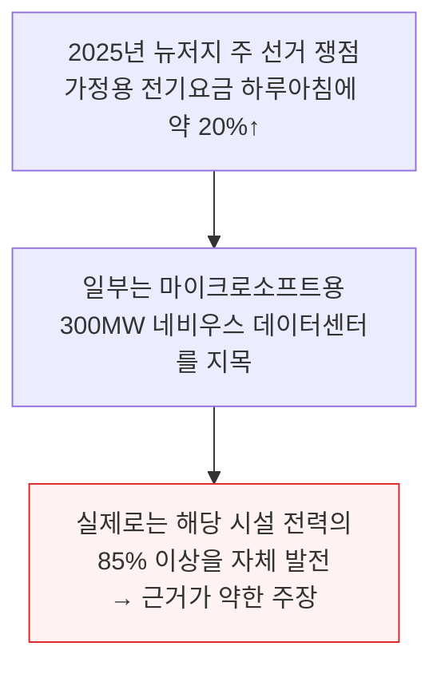

두 지역을 나란히 놓고 보면 결과가 극명하게 갈립니다.

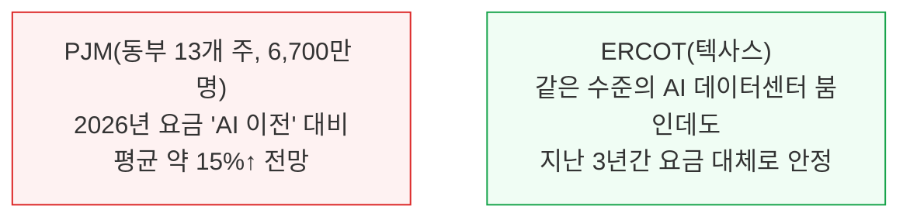

이 보고서는 미국에서 가장 큰 두 전력 시장이자 최대 AI 데이터센터 허브인 PJM과 ERCOT를 비교 분석합니다. PJM은 뉴저지를 포함한 동부 13개 주를, ERCOT는 텍사스 한 주를 관할합니다.

PJM 관할지에는 구글이 오하이오주 콜럼버스 인근에서 제미나이 모델을 학습시키고 있고, 앤트로픽·아마존의 "프로젝트 레이니어", 메타의 "프로메테우스"가 인디애나·오하이오에 있으며, 세계 최대 데이터센터 허브인 북부 버지니아도 PJM 관할입니다.

반면 텍사스에서도 오픈AI·구글 딥마인드·앤트로픽이 대형 시설을 짓고 있지만, 텍사스 전력 선물 가격은 지난 1년간 몇 퍼센트만 움직였을 뿐 9배 급등이나 위기는 없었습니다.

---

## 2. 전기요금은 무엇으로 구성되는가 - 에너지·용량·송배전

**📌 핵심:**
- 가정 월 전기요금은 크게 4가지로 구성 — 에너지(실시간 도매전력 가격), 용량(발전 설비를 대기시켜두는 대가, PJM에만 존재), 송배전(규제된 수익률로 정해지는 배전망 이용료), 기타(세금·소매 부가금 등)
- 용량 시장의 목적은 여름·겨울 피크 시점에도 항상 전기가 부족하지 않게 하는 것 — 예를 들어 뉴욕시 하루 전력 수요는 평소 2GW씩 오르내리다가(일평균 피크 6\~8GW), 폭염이 오면 모두가 에어컨을 동시에 켜면서 10GW까지 치솟음
- PJM은 이 대기 설비 유지비를 연 1회 경매(가격은 뒤 섹션에서 다룸)로 정해 관할 내 모든 전기 소비자에게 나눠 부담시킴 — 2025/26년 이 가격이 전년 대비 9.3배 뛰었음
- 결론: ERCOT는 별도 용량 경매가 없는 "에너지 온리(energy-only)" 시장으로, 실시간 가격 신호만으로 부족분(희소성)을 해결하도록 설계됨 — 이 구조적 차이가 뒤에 나올 요금 격차의 출발점

---

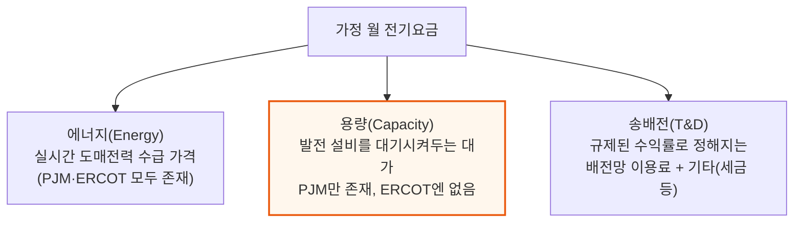

📌 용어 풀이: 용량(Capacity)
> - **용량**: 1년 중 극소수의 피크 시간대에만 켜지는 발전 설비를 "항상 켤 수 있는 상태"로 대기시켜두는 대가 — PJM에서는 발전소 소유주에게 연중 95% 넘는 시간을 그냥 대기만 시키고도 돈을 지급
> - **에너지 온리 시장**: ERCOT처럼 별도의 용량 대금 없이, 실시간 가격이 오르내리는 것만으로 발전 설비가 대기·투자 여부를 스스로 판단하게 하는 시장 구조
> - **쉬운 비유**: 용량 요금은 "소방차를 화재가 안 나도 매달 대기시켜두는 값을 미리 걷는 것", 에너지 온리 시장은 "불이 났을 때만 출동비를 비싸게 쳐주는 것"

뉴욕시 사례가 이 변동폭을 잘 보여줍니다. 평소에도 하루 안에서 전력 수요가 2GW씩 오르내리고(일평균 피크 6\~8GW), 폭염 때는 모두가 에어컨을 동시에 켜면서 10GW까지 치솟습니다. 용량 시장은 이런 극단적인 순간에도 정전이 나지 않도록 발전 설비를 미리 확보해두는 제도입니다.

---

## 3. PJM의 160억 달러 시뮬레이션 - BRA 경매는 어떻게 작동하는가

**📌 핵심:**
- 용량 시장 설계의 핵심 문제는 가격이 실물 수급이 아니라 PJM이라는 중앙계획자의 예측 시뮬레이션으로 정해진다는 것 — 예측 오차가 나면 수십억 달러가 잘못 지출될 수 있고, 2025-26년 경매에서 그 규모가 160억 달러(PJM 관할 모든 가구·기업이 분담)
- BRA(기본잔여경매)는 2년 뒤 필요한 용량을 미리 사들이는 연 1회 경매 — 2024/25년 청산가는 MW당 하루 29달러였는데, 2025/26년엔 270달러로 9.3배 뛰었고 일부 지역은 450달러까지 나옴
- 연방 규제기관이 MW당 하루 329달러 상한을 걸었는데도 2025-26·2026-27년 경매가 2년 연속 상한에 도달 — 이 가격은 PJM 내부 예측 모델이 만든 VRR 곡선(인위적 공급-수요 곡선)에서 나온 것으로, 실물 입찰이 아님
- 결론: PJM은 이 급등을 폭염·데이터센터 부하 탓으로 돌렸지만, 가격 자체가 1년도 더 전에 PJM이 자체 설계한 시뮬레이션으로 정해진다는 점에서 그 설명은 PJM 자신의 책임을 가림

---

### BRA 경매는 어떻게 가격을 만드나

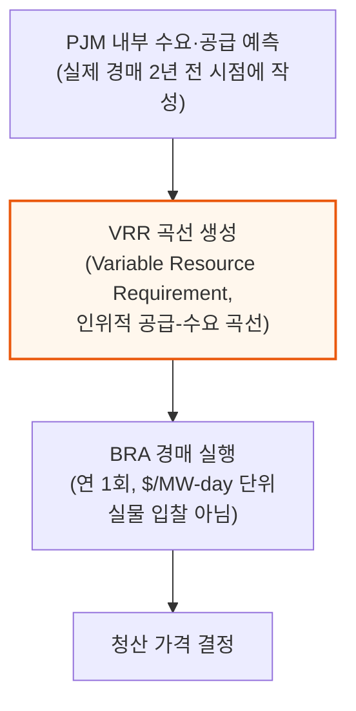

📌 용어 풀이: BRA와 VRR 곡선
> - **BRA (Base Residual Auction, 기본잔여경매)**: PJM이 2년 뒤(예: 2025년 말에 2027/28년분) 필요한 용량을 미리 확보하기 위해 여는 연 1회 경매 — 도매 에너지 시장이 $/MWh(실제 소비 전력량)로 거래되는 것과 달리, BRA는 $/MW-day(하루 단위로 대기시켜둔 최대 전력)로 거래됨
> - **VRR 곡선**: BRA 청산 가격을 만드는 인위적인 공급-수요 곡선 — 실제 시장 참여자의 입찰이 아니라 PJM 내부 예측 모델과 비공개 데이터로 만들어짐. 데이터센터 부하 전망이 조금만 바뀌어도 이 곡선의 청산점 근처 기울기가 크게 흔들려 가격이 급변할 수 있음

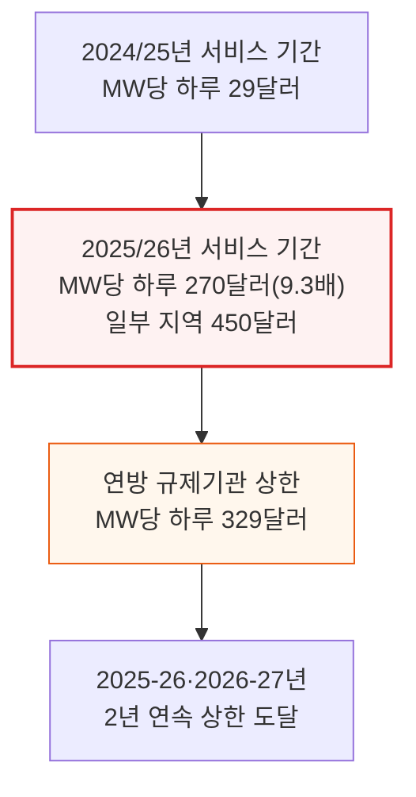

2025년 여름은 PJM 관할지에서 유독 더워, 6월 23\~24일이 역대 3\~4위 피크일로 기록됐지만 정전은 없었습니다 — 발전 용량이 충분했기 때문입니다.

문제는 그 신뢰성을 사는 값이 지나치게 비싸졌다는 점입니다. PJM은 이 급등을 "극단적 날씨와 하이퍼스케일러(초대형 사업자) 데이터센터·AI 전력 수요" 탓으로 돌렸고 그 서사가 주류 언론에도 그대로 옮겨졌습니다. 하지만 이 설명은 가격이 1년 넘게 앞서 PJM 자체 시뮬레이션 모델로 정해진다는 사실을 가리는 측면이 있습니다.

---

## 4. 데이터센터가 범인으로 지목된 이유 - 감시기구의 반박 시뮬레이션

**📌 핵심:**
- IMM(독립 시장 감시기구, FERC가 요구해 설치한 독립 기관)이 2025/26년 경매를 데이터센터 부하 없이 다시 돌려본 결과, 모든 데이터센터를 예측에서 빼면 PJM 피크부하가 7,927MW 줄고 총 용량대금은 93억 3,000만 달러(64%) 감소
- 이미 가동 중인 데이터센터만 반영한 시나리오에서도 피크부하 4,654MW·용량대금 77억 4,000만 달러(53%) 감소 — 데이터센터 부하 증가 하나만으로 용량 원가가 사실상 두 배 가까이 뛴 셈이고, 다른 어떤 요인도 이만큼 근접하지 못함
- 하지만 이 모든 시뮬레이션이 가리는 더 깊은 문제가 있음 — 요금을 좌우하는 BRA 경매 자체가 "또 다른 시뮬레이션"이라는 점. VRR 곡선은 PJM이 스스로 만든 예측을 바탕으로 한 인위적 곡선이라, 그 예측이 부정확하면 전체 용량 시장이 왜곡됨
- 결론: SemiAnalysis는 PJM의 예측이 실제로 부정확하다고 판단 — 원인은 수요 부족이 아니라 데이터센터 건설 지연, GPU 생산·조립 지연 등 공급망 문제(신형 하드웨어는 초기 가동이 버벅이며 완전 가동까지 예상보다 오래 걸림)

---

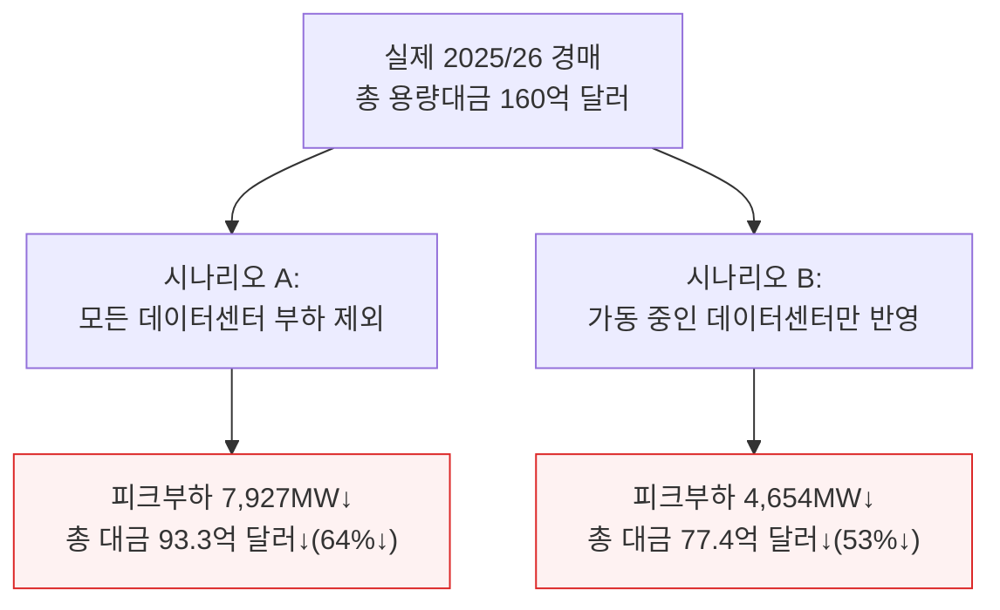

📌 용어 풀이: IMM
> - **IMM (Independent Market Monitor, 독립 시장 감시기구)**: 연방에너지규제위원회(FERC)가 요구해 설치한 독립 기관으로, PJM의 불투명한 경매 방법론에 드물게 외부 검증을 제공. 데이터센터 부하를 제외한 대안 시뮬레이션을 돌려 실제 경매 결과와 비교하는 방식으로 작업

IMM은 2025/26년 약 7.9GW, 2026/27년 약 12GW의 데이터센터發 추가 수요를 지목했습니다. 이 분석만 보면 "데이터센터가 범인"이라는 결론이 자연스럽습니다.

그러나 문제는 이 반박 시뮬레이션조차 원본 경매와 마찬가지로 PJM이 자체적으로 만든 예측을 기반으로 한다는 점입니다. SemiAnalysis는 모든 데이터센터의 정밀한 건설 일정을 추적하는 자체 방법론으로 PJM의 예측이 지나치게 낙관적이라고 판단합니다.

이는 수요 자체가 없어서가 아니라, 데이터센터 건설 지연, GPU 생산·조립 지연, 그 밖의 공급망 문제 때문입니다. 새 하드웨어 플랫폼은 초기에 버그가 많고 완전 가동까지 통상보다 오래 걸리는 경향이 있습니다.

---

## 5. PJM 예측이 틀렸다는 증거 - 선물가격과 공급측 오류

**📌 핵심:**
- PJM 도매 에너지 시장(실시간 가격)은 상대적으로 진짜 시장에 가까움 — 서부 허브 선물가격은 2028·2030년 인도분 기준 12\~20%만 올랐고, 이는 용량 시장의 9.3배 폭등과 전혀 다른 그림. 실제 돈을 걸고 위험을 지는 트레이더들은 PJM이 시뮬레이션한 만큼의 공포를 가격에 반영하지 않았음
- PJM 자체 데이터가 1년 앞도 못 내다본 전례를 보여줌 — 2024년 데이터센터 부하 전망은 2023년 전망보다 800MW 하향 조정됐고, 2025년엔 2024년 전망보다 다시 1.1GW 추가로 하향 조정됨
- 공급측 예측도 마찬가지로 흔들렸음 — 최근 4년간 PJM의 총 제공 용량이 약 35GW 감소했는데, 가장 큰 요인은 석탄발전소 폐쇄지만 PJM 자체의 산정 방식 변경으로도 약 20GW가 사라짐. 특히 천연가스 발전소 계산법을 바꾸면서 14GW가 하루아침에 증발
- 결론: 수요 예측은 매년 하향 조정되고 공급 예측은 방법론 변경만으로 요동치는데, 이 둘의 조합이 만드는 VRR 곡선을 그대로 가격 결정에 쓰는 구조 자체가 취약함

---

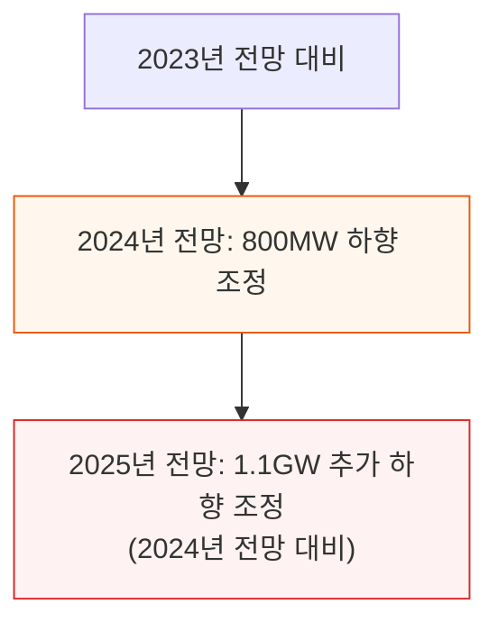

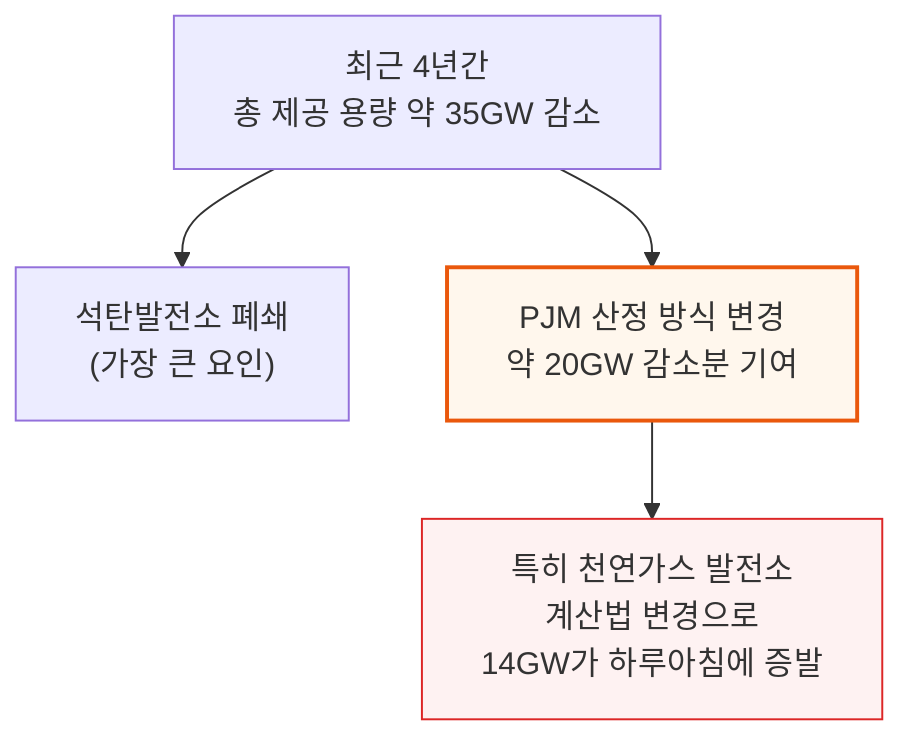

선물가격(forward price)은 미래 인도분 전력을 지금 사고파는 계약의 가격으로, 실물 자금이 걸린 시장 참여자들의 실시간 판단을 반영합니다. PJM 서부 허브 선물가격이 12\~20%만 오른 것은 트레이더들이 용량 시장의 9.3배 폭등만큼의 위기감을 실제로는 느끼지 않는다는 신호입니다.

---

## 6. 용량 요금이 가정 청구서에 미치는 영향

**📌 핵심:**
- 2026/27년 BRA 청산가 MW당 하루 329달러는 PJM 관할 모든 부하에 실질적인 원가 증가 — 이는 소매요금에 반영돼 최종적으로 총 160억 달러의 용량대금(MW당 약 12만 달러)으로 귀결
- 가구 청구서 환산 방법: PJM 평균 가구 월 전력 소비 880kWh × 부하율(평균사용량÷최대사용량 비율) 40%를 적용해 시간당 환산하면 34달러/MWh(3.4센트/kWh)가 나옴
- 3.4센트/kWh × 월 880kWh = 월 29.9달러 — 경매가 이미 확정됐으므로, PJM 관할 가정은 2년 전 대비 월 25\~30달러를 추가로 낼 것이 사실상 확정됨
- 결론: 이 인상분은 앞으로 오를 예상치가 아니라, 이미 낙찰된 경매가에서 역산되는 확정된 수치 — "AI가 전기요금을 올렸다"는 대중의 체감과 실제 청구서 인상액이 여기서 만나는 지점

---

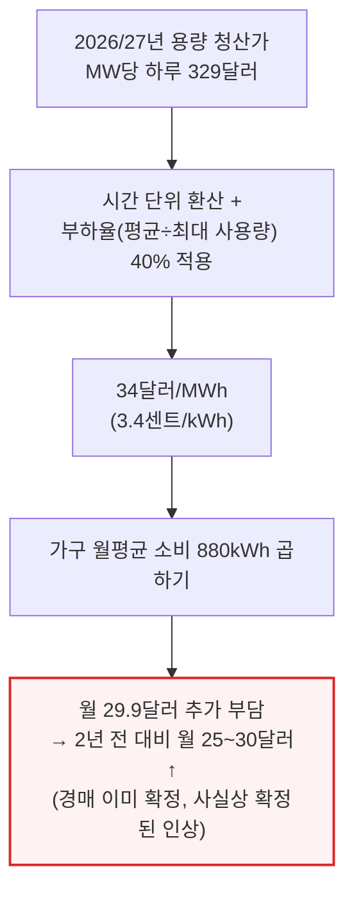

📌 용어 풀이: 부하율(Load Factor)
> - **부하율**: 특정 기간 동안의 평균 전력 사용량을 최대(피크) 사용량으로 나눈 비율 — 40%라는 값은 실측 데이터에서 흔히 관찰되는 값으로, 가정이 하루 중 최대치만큼 전기를 계속 쓰지는 않는다는 뜻
> - **쉬운 비유**: 피크 사용량이 자동차의 최고 속도라면, 부하율은 평균 주행 속도가 최고 속도의 몇 %인지를 나타내는 값

---

## 7. ERCOT - 같은 부하 증가, 요금 충격은 없었다

**📌 핵심:**
- ERCOT(텍사스 전력망 운영기구)는 이해하기 훨씬 단순한 시장 — PJM처럼 별도 용량 경매를 열지 않고, 실시간 가격만으로 수급을 맞추는 단일 메커니즘을 운용
- ORDC(운영예비력 수요곡선)라는 실시간 희소성 가격 가산 방식을 사용 — 수급이 빠듯해지면(예: 모두가 동시에 에어컨을 켤 때) 평소 10\~50달러/MWh였던 실시간 가격이 상한 5,000달러/MWh까지 치솟고, 송전 제약 지역엔 추가 가산금까지 붙음
- 이 구조 덕분에 연 100시간도 안 가동하는 가스 피커 발전소나 배터리 같은 설비도 채산이 맞음 — 50MW급 설비가 희소성 가격이 뜨는 그 짧은 시간에 연 수백만 달러를 벌 수 있기 때문. PJM은 중앙 운영자가 용량을 분석·보장하고 대금까지 지급하지만, ERCOT는 그런 보장이 없고 설비 소유주가 스스로 판단해 투자함
- 결론: 실시간 가격 신호 자체가 "시장이 부족하다"는 증거이자 대응 유인이 되는 구조 — 중앙계획 시뮬레이션 없이 시장 참여자의 실물 판단으로 수급을 조정

---

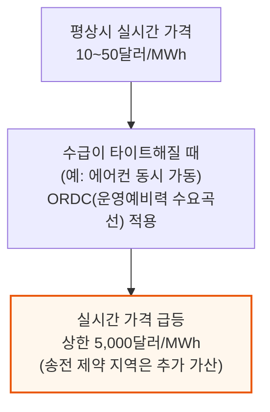

📌 용어 풀이: ORDC와 PJM의 구조적 차이
> - **ORDC (Operating Reserve Demand Curve, 운영예비력 수요곡선)**: 실시간 예비 전력이 줄어들수록 자동으로 가격을 끌어올리는 곡선 — 별도 경매 없이 실시간 시장 안에서 "희소성 가산금"을 계산해 붙임
> - **PJM vs ERCOT 책임 구조**: PJM은 중앙 운영자가 필요 용량을 분석·산정해 발전소 소유주에게 대금 지급을 보증하지만, ERCOT는 그런 중앙 보증이 없어 설비 소유주가 시장이 충분한지 스스로 판단해 투자 여부를 결정
> - **쉬운 비유**: PJM은 "관리자가 필요한 인원을 미리 계산해 대기 인력을 고용하고 월급을 주는 방식", ERCOT는 "바쁠 때 시급이 확 오르니 그때만 알아서 나오는 방식"

---

## 8. ERCOT의 수요 예측과 실제 - 더 많은 부하, 더 적은 희소성

**📌 핵심:**
- ERCOT도 수요 예측을 내놓는데 그 폭이 놀라움 — 2025년 4월 발표한 장기부하전망은 2030년까지 데이터센터 잠재 부하를 77.9GW로 잡았고, 이는 전년도 전망치 29.6GW의 2.6배가 넘는 이례적인 1년 만의 상향 조정
- 하지만 ERCOT는 이 전망이 그대로 실현되리라 보지 않고 자체적으로 대폭 할인 적용 — 일반 신청은 49.8%로, 임원 서명이 붙은 신청은 55.4%로 할인하고, 모든 가동 예정일을 180일 순연시킴. "삽을 뜨기 전까지는 개발사가 주장하는 수치를 100% 믿지 않는다"는 태도
- 결정적 차이는 ERCOT의 수요 전망이 가격에 직접 반영되지 않는다는 점 — PJM은 전망이 VRR 곡선을 거쳐 곧바로 용량 가격 상한을 결정하지만, ERCOT는 전망을 계통 계획·송전망 확장·자원 적정성 연구에만 활용하고 가격 결정 입력값으로 쓰지 않음
- 결론: 실제 계통도 이 접근이 통한다는 것을 증명 — 2024년 여름 90GW 넘는 역대 최고 피크, 2025년 5월 78.4GW의 봄철 최고 기록을 세우면서도 정전(brownout)은 없었음

---

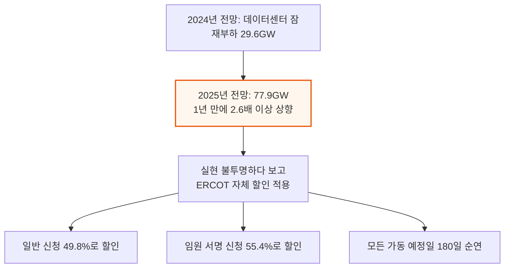

이 전망을 곧이곧대로 받아들이면 텍사스 전체 계통 하나가 기존 부하 위에 통째로 더 얹히는 수준의 구조적 수요 충격입니다. 하지만 실제로는 아무도 이 숫자를 그대로 믿지 않았고 시장도 대체로 무시했습니다.

그 결과로 나온 물리적 지표가 이를 뒷받침합니다 — 하이퍼스케일러(초대형 사업자) 수요가 이미 엄청난데도 브라운아웃(부분 정전)은 한 번도 없었고, 선물가격(2026·2028·2030년 인도분)도 지난 1년간 11\~17% 상승에 그쳐 PJM과 비슷한 수준일 뿐 9배 폭등은 없었습니다.

2024년 격년 ORDC 보고서에 따르면 온라인 예비력이 이전 주기보다 더 많이 확보돼 안정적인 성장이 가능했고, 태양광·풍력·배터리·가스 피커 발전소가 충분히 늘어 시스템을 뒷받침했습니다. 그 결과 희소성 가격이 걸리는 시간과 총 지출 자체가 오히려 과거보다 줄었습니다 — 전기 수요는 늘었는데도 희소성은 오히려 덜해진 셈입니다.

텍사스는 한 개 주만 관할하고 연방에너지규제위원회(FERC)의 관할을 받지 않아 규정을 더 빠르게 바꿀 수 있다는 점도 이런 대응력의 배경입니다.

---

## 9. 겨울폭풍 펀 - 신뢰성 값을 치렀는데 신뢰성은 없었다

**📌 핵심:**
- 2026년 1월 24\~27일 겨울폭풍 펀은 PJM의 사상 최고 2025/26년 용량 가격과 ERCOT의 시장 규율이 실전에서 처음 시험대에 오른 사건
- ERCOT는 사전 경계(Weather Watch) 수준을 유지한 채 무사히 넘김 — 수요는 전망치보다 낮게 나왔고 비상절차 발동도 없었으며 실시간 가격은 최고 300달러/MWh에 그침. 2021년 대참사였던 겨울폭풍 유리 이후의 개혁(가스 생산·발전 설비 방한 의무화 등)이 실전에서 효과를 증명
- PJM은 훨씬 나쁜 성적표를 받음 — 용량 시장이 이미 데이터센터 부하 위험을 반영해 사상 최고가를 매겼는데도, 설비 동파·연료 공급 실패로 발전용량 약 21GW(경매 낙찰분의 15%)가 이탈. 에너지부는 연방전력법 202(c)조 비상명령을 발동해 전국 데이터센터·산업시설의 백업발전 약 35GW(원래 BRA 경매 자격이 없던 자원)를 동원해야 했고, 실시간 가격은 평균 700달러/MWh(버지니아 도미니언 구역은 1,800달러/MWh)까지 치솟음
- 결론: PJM에서는 발전소가 실제로 못 켜져도 이미 낙찰만 되면 대금을 받는 구조라 방한 투자 유인이 약한 반면, ERCOT는 예비율이 빠듯할 때 실제로 발전·공급해야만 큰 수익이 나므로 설비를 실전에 대비시켜둘 유인이 강함 — PJM의 9.3배 인상은 신뢰성을 사는 값이었지만 실제로 신뢰성을 사지 못함

---

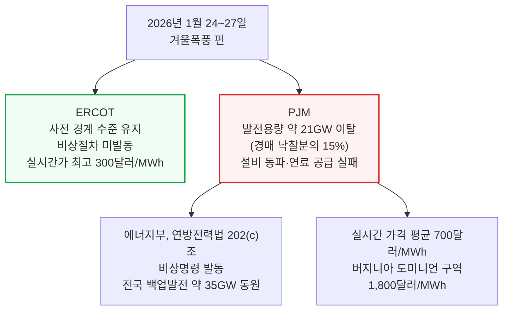

이 폭풍이 드러낸 것은 PJM 용량 시장의 근본적인 단절입니다. 높은 용량 가격은 데이터센터 부하 증가 전망을 근거로 매겨졌고 그 위험은 실제로 현실화됐습니다. 하지만 진짜 운영 실패의 원인은 방한 미비와 연료 인프라 취약성이었는데, 용량 시장은 이 문제를 해결할 유인을 애초에 제공하지 않았습니다.

ERCOT는 투기적인 데이터센터 성장분을 용량 요금에 미리 반영하지 않았는데도, 의무적인 운영 개혁만으로 실전 테스트를 통과했습니다 — 더 낮은 비용으로 더 나은 결과를 낸 셈입니다.

폭풍 중 확인된 데이터센터 백업발전 35GW는 데이터센터가 제대로 통합되면 계통 자원으로도 기능할 수 있음을 보여줍니다. ERCOT는 이 백업자원을 실제로 가동할 필요는 없었지만, 그 존재 자체가 두 시장 모두 사전 계획에 체계적으로 반영하지 못한 상당한 신뢰성 완충 여력이었습니다 — 규제기관과 투자자 모두가 주목해야 할, 아직 활용되지 않은 자산군입니다.

---

## 10. 다음은 무엇인가 - 정치적 후폭풍과 규제 비대칭

**📌 핵심:**
- 2025/26년 경매 급등 이후 펜실베이니아 주지사 조시 샤피로가 BRA 규칙이 부당하다며 FERC(연방에너지규제위원회)에 제소 — FERC 승인 합의로 2026/27·2027/28년 인도분에 한해 더 강한 가격상한(수집)이 걸렸고, 이 때문에 2027/28년 경매는 전년과 거의 같은 가격에 낙찰됨
- 다만 이 상한은 임시방편일 뿐 근본 구조는 그대로 — VRR 곡선도, 수요예측 방법론도 손대지 않았고, 오히려 예비마진이 PJM 자체 신뢰성 목표 아래로 줄어드는 새 문제를 만들어 신규 발전 투자 유인까지 약화시킴
- PJM은 확보되지 않은 대형 부하를 제한하는 NCBL(비용량담보부하) 규칙을 시도했지만 이해관계자 전원의 반대로 철회됐고, FERC의 대형부하·데이터센터 관련 사전규칙제정통지(ANOPR)도 연방 차원의 감독 강화 신호이긴 하나 실제 규칙 제정까지는 수년과 법적 다툼이 예상됨
- 결론: ERCOT는 텍사스주 하나만 관할해 주 의회·공공사업위원회(PUC)가 직접 규제하므로 SB6(대형부하 차단 권한 법안)를 단일 회기 안에 발의·서명·시행까지 끝냈지만, PJM은 13개 주+워싱턴DC를 관할하고 FERC(연방)의 규제를 받아 유사한 권한을 도입하려면 FERC 승인과 잠재적으로 연방 입법까지 필요해 수년이 걸림 — 이 규제 속도 차이는 10년 단위로 부지를 결정하는 하이퍼스케일러에게 현재 가격 차이만큼이나 중요한 변수

---

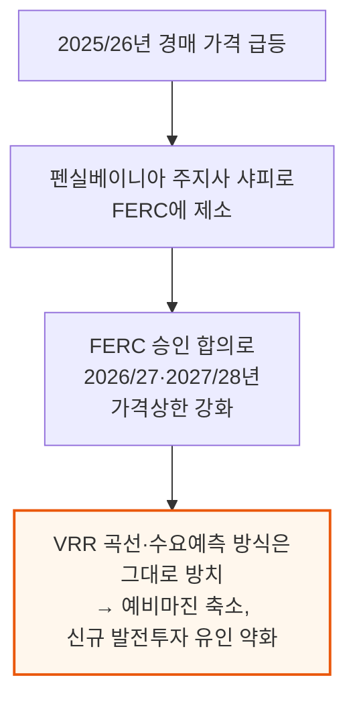

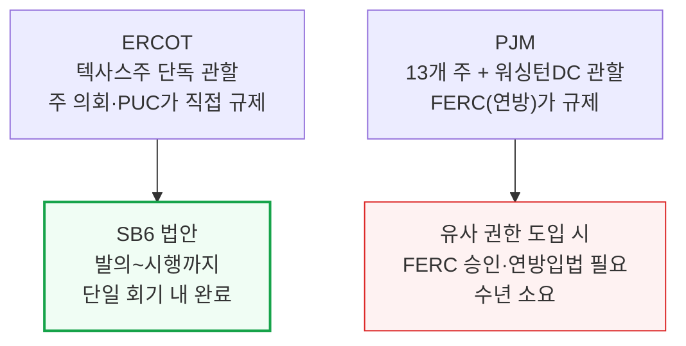

PJM이 시도한 NCBL(Non-Capacity-Backed Load, 비용량담보부하) 규칙은 자체 용량을 확보하지 못한 대형 부하를 강제로 줄이는 메커니즘이었지만, 이해관계자 전원이 반대해 철회됐습니다.

이 구조적 비대칭은 오래 지속될 성격이라 투자 판단에도 반영할 만합니다 — ERCOT는 앞으로도 PJM보다 빠르게 시장 규칙과 운영 요건을 바꿀 수 있을 것으로 보입니다.

---

## 11. 승자와 패자 - 병목이 전력에서 실리콘으로 이동한다

**📌 핵심:**
- SemiAnalysis의 데이터센터 산업 모델은 2025년 중반 이후 시장 병목이 크게 뒤집혔음을 보여줌 — 한때 핵심 병목이던 전력은 온사이트 가스(부지 안에서 직접 발전) 확산으로 완화 중이며, 2027년에는 AI·비AI 컴퓨트 수요보다 "진짜 가동 가능한" 데이터센터 공급이 더 많아지는 국면으로 전환
- 온사이트 가스 장비업체는 400MW 이상 수주 기준으로 한 달 전 12곳에서 현재 15곳으로 늘었고, 디젤 발전기 업체들도 전량 온사이트 가스로 갈아타는 중 — 디젤 백업의 첨부율(데이터센터 용량 1MW당 딸린 디젤 백업 MW)이 빠르게 낮아지는 것을 체감했기 때문. 이 전환만으로 온사이트 가스 시장 전체 제조 용량이 10GW 넘게 추가됨
- 병목은 전력에서 건설로도 옮겨가는 중 — ERCOT 데이터를 보면 "가동 승인"이 난 캠퍼스도 실제로는 전력을 다 못 끌어쓰는 경우가 흔한데, 변전소는 연결됐지만 건물·랙이 아직 완공되지 않았기 때문. SemiAnalysis 데이터센터 모델은 마이크로소프트·코어위브·오라클·네비우스의 지연을 시장보다 먼저 짚어낸 바 있음
- 결론: 2027년 이후 병목은 다시 실리콘(메모리·로직 반도체 공급 부족)으로 옮겨갈 전망 — 전력 병목이 풀리면서 순수하게 전력망에만 노출된 IPP(독립발전사업자, Vistra·Talen 등)는 하방 위험에 놓이는 반면, 온사이트 가스 장비업체(GEV·CAT·Bloom Energy 등)와 기존에 전력망을 이미 확보해둔 비트코인 채굴업체는 상대적으로 유리한 위치

---

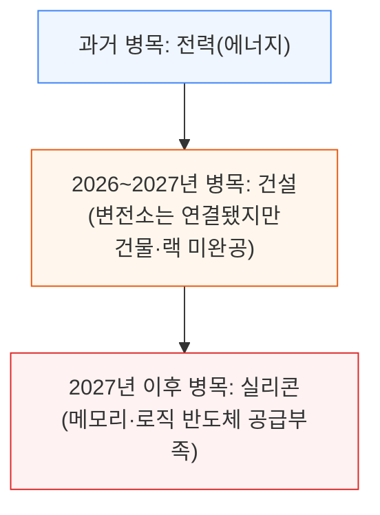

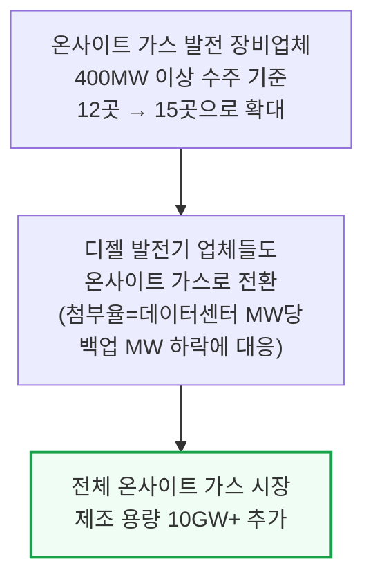

📌 용어 풀이: IPP와 첨부율
> - **IPP (Independent Power Producer, 독립발전사업자)**: 전력회사가 아니라 발전소를 짓고 전력망에 전기를 팔아 수익을 내는 민간 사업자 — Vistra, Constellation, Talen 등이 대표적. 병목이 전력에서 벗어나면 이들의 핵심 가치 제안이 희석됨
> - **첨부율 (Attach Rate)**: 데이터센터 용량 1MW당 딸려 오는 백업(디젤 등) 발전 용량의 비율 — 이 비율이 낮아진다는 것은 백업 수요 자체가 온사이트 가스 등 다른 방식으로 옮겨가고 있다는 신호

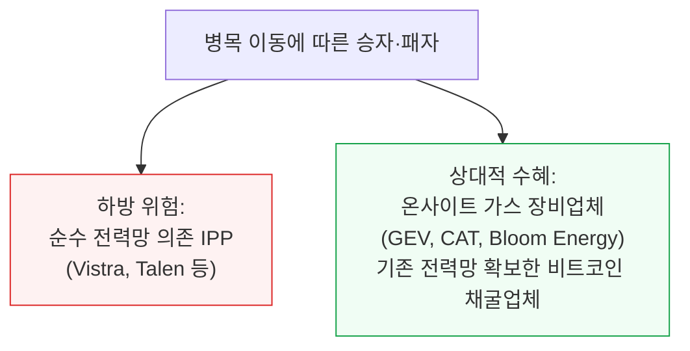

유틸리티(전력회사)들이 내놓는 2027년 이후 전망 상당수는 과장돼 있다는 것이 SemiAnalysis의 판단입니다.

ESA(에너지 공급계약)나 LOA(부하 확약서), "재무적 확약"을 근거로 든다 해도, 이런 확약은 하이퍼스케일러 입장에서 상대적으로 부담이 크지 않습니다 — 확약 상단인 MW당 10만 달러라 해도 데이터센터 건물(셸) 하나를 짓는 비용보다 100배, 엔비디아 클러스터 하나를 갖추는 비용보다 300배나 저렴하기 때문입니다.

SemiAnalysis의 별도 기관용 리포트 "AI의 중앙은행이 된 엔비디아"가 지적했듯, 하이퍼스케일러들은 전력을 지렛대 삼아 경쟁자를 시장에서 밀어내고 자체 커스텀 칩 채택을 강제하는 데 쓰고 있습니다.

이는 전력망 쪽에서 대규모 이중발주를 일으켜 여러 유틸리티가 수요 전망을 과대평가하게 만듭니다. 결국 전력 제약이 완화되면 핵심 전력망 병목에만 노출된 IPP는 하방 위험을 안게 됩니다.

크립토마이너(암호화폐 채굴업체)와 데이터센터 개발사에게는 경쟁이 더 치열해진다는 뜻이기도 합니다 — 전력망 전력은 여전히 프리미엄이지만 인도 시점은 갈수록 불확실해져(예: PJM에서 2027/28년에 약속된 MW는 상당한 불확실성에 노출), 시점을 확실히 통제할 수 있는 온사이트 발전이 선호되는 선택지로 부상하고 있습니다.

실제로 2028년 미국 신규 데이터센터 MW의 절반 넘게가 온사이트 발전으로 조달될 것으로 SemiAnalysis는 전망합니다. 다만 진짜로 확보되고 이미 가동 중인 전력망 전력은 여전히 프리미엄이며 매각 가능성이 높은데, 그중 최선의 시나리오는 변전소가 이미 지어지고 가동 중인 경우로 이는 기존 비트코인 채굴 자산을 매력적으로 만듭니다.

---

*작성 진행률: 100% 완료*
*업데이트: 원문 전체 11개 섹션(왜 이 논쟁이 벌어졌나\~승자와 패자) 변환 완료. 원문의 이미지·차트는 다이어그램·서술로 대체, 유료 구독자 전용 후반부(승자와 패자 섹션)까지 포함*
