# Stop Saying Half of 2026 US Datacenter Capacity Is Canceled

> **출처**: [SemiAnalysis Newsletter](https://newsletter.semianalysis.com/p/stop-saying-half-of-2026-us-datacenter)
> **저자**: Dylan Patel
> **발행일**: 2026-06-19

---

## 📑 목차

### 전체 섹션
 1. [서론: "절반이 취소됐다"는 주장의 출처](#1-서론-절반이-취소됐다는-주장의-출처)
 2. [데이터센터 지연의 3가지 유형](#2-데이터센터-지연의-3가지-유형)
 3. [유형 1: 신생 개발사의 과장된 발표](#3-유형-1-신생-개발사의-과장된-발표)
 4. [유형 2: 경험 부족 개발사의 낙관적 건설 일정](#4-유형-2-경험-부족-개발사의-낙관적-건설-일정)
 5. [유형 3: 인허가와 지역 반대에 발목 잡힌 프로젝트](#5-유형-3-인허가와-지역-반대에-발목-잡힌-프로젝트)
 6. [공포를 부추기는 3가지 노이즈](#6-공포를-부추기는-3가지-노이즈)
 7. [SemiAnalysis 2026년 전망이 흔들리지 않는 이유](#7-semianalysis-2026년-전망이-흔들리지-않는-이유)
 8. [초기 단계 프로젝트는 구조적 공급 과잉](#8-초기-단계-프로젝트는-구조적-공급-과잉)
 9. [선두 운영사의 제약 돌파 플레이북](#9-선두-운영사의-제약-돌파-플레이북)
10. [SemiAnalysis가 다르게 조사하는 방법](#10-semianalysis가-다르게-조사하는-방법)
11. [장비 공급사 우려도 근거가 약하다](#11-장비-공급사-우려도-근거가-약하다)
12. [2026년 하반기 주목할 변곡점](#12-2026년-하반기-주목할-변곡점)
13. [TeraWulf 주력 사이트의 지연 가능성](#13-terawulf-주력-사이트의-지연-가능성)

---

## 🔑 용어 정리

본문을 순서대로 읽기 전에 알아두면 좋은 용어들입니다. 자세한 수치와 설명은 본문에서 처음 등장하는 위치에 나옵니다.

- **바이브코딩(Vibe-coding) 예측 모델**: 개발자가 세부 로직을 하나하나 검증하지 않고 AI 코딩 도구(Claude Code 등)에게 대략적인 지시만 내려 빠르게 결과물을 뽑아내는 방식 — 데이터센터 예측에 쓰이면 보도자료 속 발표 용량을 검증 없이 그대로 확정치로 입력하는 문제가 생김
- **RPO (Remaining Performance Obligation, 잔여 계약이행 금액)**: 기업이 이미 계약을 맺었지만 아직 매출로 인식하지 못한 미래 수주 잔액 — 데이터센터·클라우드 기업의 향후 성장 체력을 가늠하는 지표로 쓰임
- **BTM (Behind-the-Meter, 계량기 뒤편 자가발전)**: 전력망에 연결하지 않고 부지 안에 발전기·터빈·연료전지를 직접 지어 전기를 공급하는 방식 — 그리드 연결 대기를 건너뛸 수 있음
- **인터커넥션 대기열 (Interconnection Queue, 그리드 연결 대기열)**: 발전·수요 설비가 전력망에 연결되기 전 통과해야 하는 심사·승인 절차의 대기 줄 — 신청 건수가 실제 그리드 용량을 훨씬 초과해 심사만 몇 년씩 걸림
- **모라토리엄 (Moratorium, 인허가 동결)**: 지자체·주 정부가 환경·에너지·경제 영향을 검토할 시간을 벌기 위해 신규 건설 인허가를 일시적으로 중단시키는 입법 조치
- **NIMBY (Not In My Backyard, 님비)**: "우리 동네에는 안 된다"는 지역 주민의 반대 운동 — 데이터센터의 소음·전력·수자원 사용에 대한 우려로 인허가 절차를 늦추거나 무산시킴
- **MEP (Mechanical, Electrical, Plumbing, 기계·전기·배관 설비 공사)**: 건물 골조(셸)가 다 올라간 뒤 냉각기·배전반·배관 등 실제 가동에 필요한 설비를 설치하는 공정 — 골조보다 훨씬 오래 걸리는 경우가 많아 완공 지연의 주요 원인이 됨

---

## 1. 서론: "절반이 취소됐다"는 주장의 출처

**📌 핵심:**
- 2026년 미국 데이터센터 용량의 절반이 지연·취소된다는 주장이 금융·소셜 미디어에 널리 퍼짐 — 출처는 블룸버그의 2026년 4월 1일 기사로, 원래는 "중국산 전기 장비 의존"이라는 공급망 리스크를 다뤘을 뿐인데 후속 매체들이 "절반 취소"로 자극적으로 재가공
- SemiAnalysis는 지난 6개월간 데이터센터 모델을 수십 차례 갱신했지만, 2026년 말 기준 북미 자체건설(Hyperscaler Self-build) 전망은 약 1%, 임대(Colocation) 전망은 5% 미만만 움직임 — "절반이 취소"라는 주장과 정면으로 배치
- 이 괴리의 원인은 근거 없이 급증한 바이브코딩(감으로 대충 코딩) 데이터센터 예측 모델 — Claude Code 같은 AI 코딩 도구로 보도자료를 그대로 사실로 취급해 만든 모델들이 줄줄이 등장했고, 전부 틀렸음
- 결론: SemiAnalysis는 한 주에 17만 달러 이상을 Claude Code에 직접 쓰는 헤비유저로서 이 도구가 어디서 틀리는지 정확히 알고 있으며, 이 리포트는 진짜 지연 사례와 가짜 공포 사례를 구분해 보여줌

---

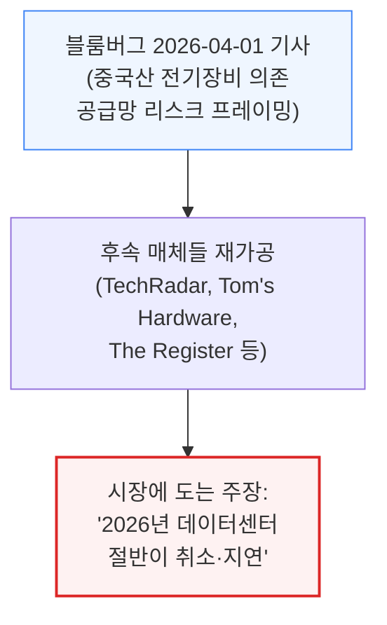

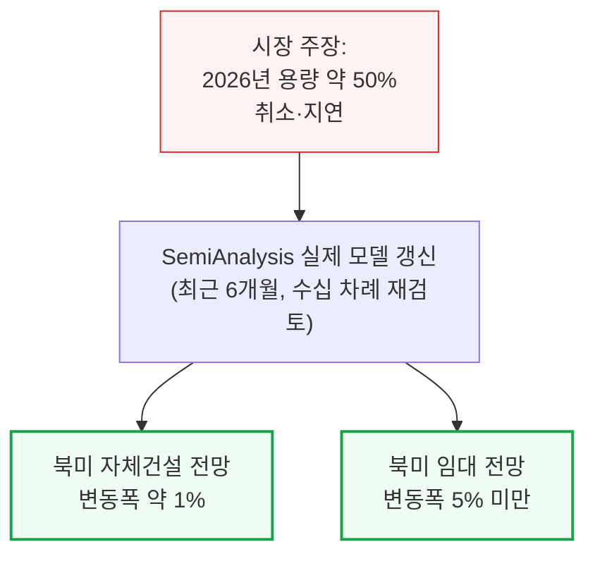

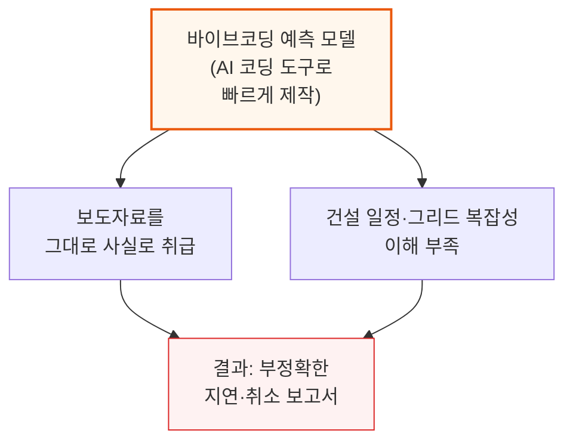

**📌 용어 풀이: 왜 SemiAnalysis 모델은 다른가**
> - Claude Code를 포함한 AI 코딩 도구 자체가 문제가 아니라, "GW급 발표를 검증 없이 확정치로 넣는" 사용 방식이 문제 — SemiAnalysis도 Claude Code를 적극 활용하지만, 실측 위성사진과 지역 인허가 서류로 매 발표를 교차검증
> - 아래는 그 트랙레코드 중 일부입니다.

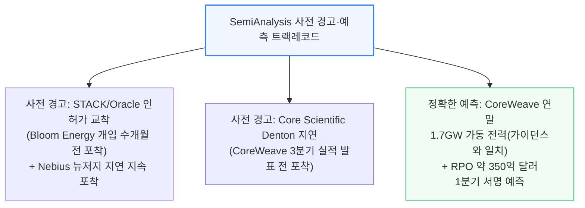

실제 지연·취소는 분명히 존재합니다. 다만 그 원인과 규모를 정확히 짚어내려면, 먼저 지연이 발생하는 유형부터 구분해야 합니다.

---

## 2. 데이터센터 지연의 3가지 유형

**📌 핵심:**
- SemiAnalysis는 데이터센터 지연을 3가지 유형으로 나눠 분석 — ① 신생 개발사의 과장된 발표 ② 경험 부족 개발사의 낙관적 건설 일정 ③ 인허가·지역 반대(NIMBY)에 발목 잡힌 자본력 있는 프로젝트
- 유형별로 원인과 대응이 다름: 유형①은 예측 단계에서 걸러내야 하고, 유형②는 건설 실무 지식으로 미리 반영하며, 유형③은 개별 인허가 절차를 계속 추적해야 함
- 바이브코딩 예측 모델이 가장 취약한 지점은 유형①(발표를 곧이곧대로 믿는 것) — SemiAnalysis는 발표 단계 프로젝트를 애초에 낮은 확률로 처리해 최종 모델에서 걸러냄
- 결론: 아래 3개 장에서 각 유형의 실제 사례를 하나씩 짚음

---

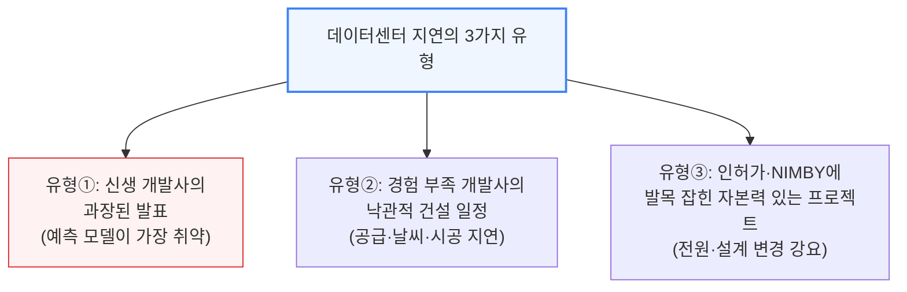

---

## 3. 유형 1: 신생 개발사의 과장된 발표

**📌 핵심:**
- 신규 진입자는 초기 단계 프로젝트인데도 GW급 규모와 공격적인 완공 일정을 발표해 주목을 끄는 경우가 많음 — 실제로는 부지 매입부터 데이터센터 완공까지 보통 4년 이상 걸림
- 무명 개발사가 2025년에 "2026년 가동"을 발표하면 경고 신호로 봐야 함 — 실제 사례 3건(Data City, APR Energy, Cloudburst) 모두 발표 시점에 위성사진상 물리적 진척이 거의 없었음
- Data City(5GW 캠퍼스, 300MW 2026년 목표)는 발표 후 "문의하기" 버튼만 남은 웹사이트로 방치됐고, APR Energy(400MW 텍사스, 2025년 6월 발표)는 아직 고객사도 없이 개발 파트너를 찾는 중이었음
- 결론: Cloudburst(1.2GW, 텍사스 산마르코스)처럼 실제 착공(2025년 11월)해 진척 중인 프로젝트도, 최초 발표(2025년 2월)의 "2026년 3분기 가동" 목표는 인허가도 안 끝난 상태에서 나온 비현실적 일정 — 바이브코딩 모델은 이런 초기 발표를 그대로 "지연된 2026년 용량"으로 잘못 집계

---

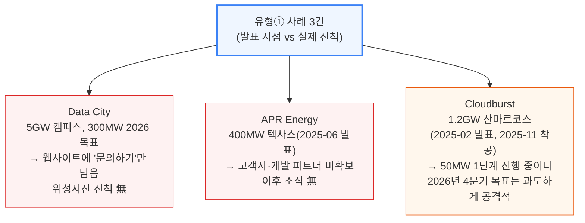

Cloudburst는 2026년 4월 지역 카운티로부터 100억 달러 이상 규모 프로젝트 승인을 받아내는 등 실제로 진척을 내고 있는 개발사입니다. 다만 셸(건물 골조) 착공조차 시작되지 않은 실시간 위성사진 기준으로는, 2026년 4분기 50MW 가동 목표가 여전히 무리한 일정입니다.

**📌 용어 풀이: 왜 "부지 매입 후 4년"이 기준선인가**
> - 데이터센터 하나가 완공되려면 부지 확보 → 전원 확보(그리드 연결 또는 자가발전) → 인허가 승인 → 장비 발주(변압기 등은 리드타임 1년 이상) → 셸 시공 → MEP(설비) 공사·시운전까지 순차적으로 거쳐야 함
> - 이 전체 사이클이 통상 4년 이상 걸리기 때문에, 2025년에 발표된 신규 프로젝트가 2026년 가동을 약속하면 이 사이클 대부분을 건너뛴 셈 — 검증되지 않은 발표라는 신호

---

## 4. 유형 2: 경험 부족 개발사의 낙관적 건설 일정

**📌 핵심:**
- 데이터센터 건설이 실제로 얼마나 걸리는지 모르는 신규(또는 경험 부족) 운영사가 야심찬 계획을 발표하는 유형 — SemiAnalysis는 지역 인허가 서류와 위성사진을 전 사이트에 대해 반복 대조해 이 낙관 편향을 걸러냄
- Nebius의 뉴저지 대표 캠퍼스(개발사 DataOne)는 최초 50MW를 4개월에 짓겠다고 발표(2025년 3월)했지만, 장비 공급 지연으로 6개월로 늘었고, 셸 완공 후 냉각기·배전반 설치(MEP)가 셸 공사보다 훨씬 오래 걸려 실제로는 10\~11개월이 걸림
- Core Scientific의 텍사스 덴튼 캠퍼스는 CoreWeave에 250MW를 2025년 말까지 공급하겠다고 약속했지만, 인허가 문제·GB200 설계 변경·날씨·변압기 폭발 사고까지 겹치며 목표를 지키지 못함 — SemiAnalysis는 위성사진으로 냉각기 미설치를 확인해 CoreWeave 실적 발표 전에 지연을 선제 경고
- 결론: 두 사례 모두 "10\~11개월 완공은 업계 기준으로는 여전히 빠른 편"이지만, 최초 발표된 4개월·연내 목표와 비교하면 뚜렷한 지연 — 경험 부족 개발사의 발표치를 그대로 믿으면 안 되는 이유

---

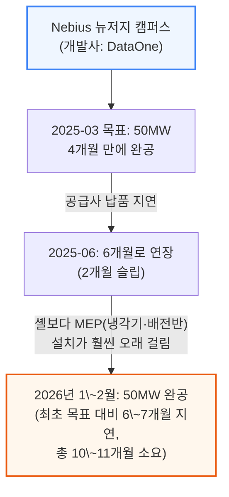

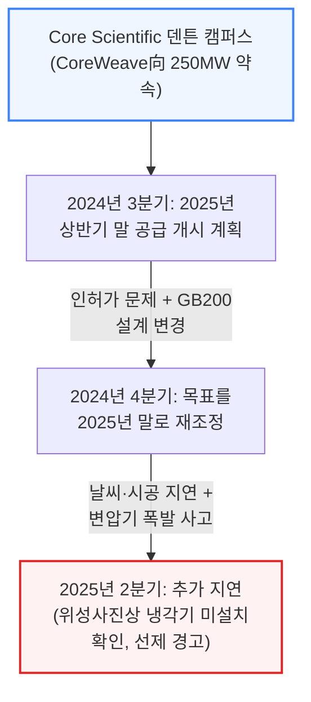

SemiAnalysis는 두 사례 모두 발표 직후부터 매달 위성사진으로 진척을 대조하며 지연을 실시간으로 갱신했습니다. Nebius의 연간 매출(ARR) 가이던스(연말 70\~90억 달러)가 이 사이트의 완공 시점에 달려 있어, 실제 완공월이 몇 달만 밀려도 매출 인식 시점에 영향을 줍니다.

**📌 용어 풀이: 셸 완공과 MEP 완공은 다른 이정표**
> - 셸(Shell): 건물 외벽·지붕 등 물리적 골조 — 위성사진으로 빠르게 확인 가능하고 상대적으로 빨리 올라감
> - MEP(기계·전기·배관 설비): 냉각기, 배전반, 배관 등 실제 서버를 가동시키는 데 필요한 설비 — 셸이 다 올라간 뒤에도 몇 개월씩 더 걸리는 경우가 흔함
> - 신규 개발사의 발표는 대개 "셸 완공"을 기준으로 낙관적 일정을 잡지만, 실제 가동 가능 시점은 MEP·시운전까지 끝나야 하므로 발표 시점보다 항상 뒤로 밀림

---

## 5. 유형 3: 인허가와 지역 반대에 발목 잡힌 프로젝트

**📌 핵심:**
- 자본력이 충분하고 진행 중인 프로젝트도 인허가·지역 반대(NIMBY)에 걸려 지연될 수 있음 — Oracle/STACK Infrastructure의 뉴멕시코 캠퍼스(Project Jupiter)가 대표 사례로, SemiAnalysis는 이 사이트를 2029년으로 지연 판정
- Oracle은 2026년 6월 실적 발표에서 2027년 상반기 고객 공급을 가이던스로 제시했지만, 연방에너지규제위원회(FERC) 기록과 SemiAnalysis의 건설 일정 추정 어느 쪽도 이를 뒷받침하지 않음
- 문제는 3가지가 겹침: ① 발전 방식이 두 개의 소규모 마이크로그리드로 쪼개져 대기오염 배출 규제 문턱(연간 250톤)에 근접 ② 대형 인프라(신규 가스관) 신설이 필요 ③ 조직화된 지역 반대가 매 단계 발목을 잡음
- 결론: 배출량 문턱을 피하려 터빈 방식을 연료전지(Bloom Energy)로 바꿨지만, 정작 발목을 잡은 건 가스관 40만 Dth/일 물량을 나를 단일 배관 노선의 인허가 — 주(州) 소유지 통행권 거부, 사적지보전 서명 누락 등이 겹치며 계약상 2026년 8월 가동 목표가 사실상 무산되고 첫 전력 공급 시점이 2029년으로 밀림

---

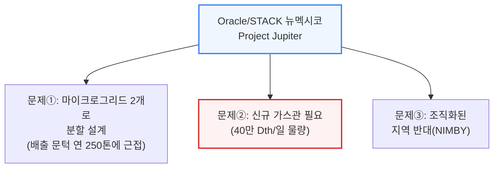

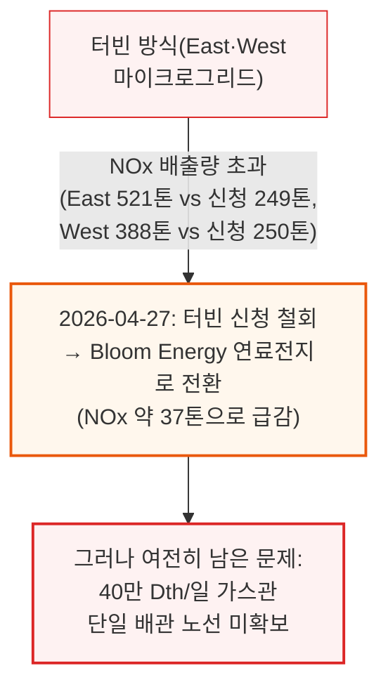

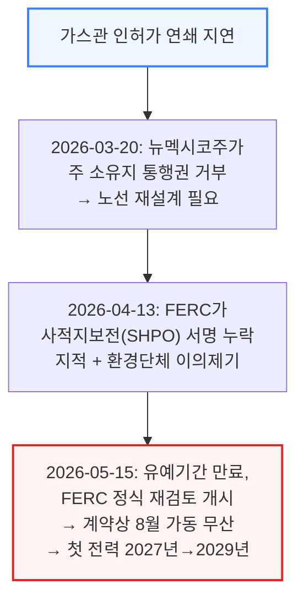

**📌 용어 풀이: NSR·PSD 배출 문턱이 왜 설계를 바꾸게 만드는가**
> - 미국 대기오염 규제(New Source Review)는 시설의 연간 오염물질 배출량이 일정 문턱(이 사례는 NOx 연 250톤)을 넘으면 "주요 배출원(major source)"으로 분류돼 훨씬 엄격하고 오래 걸리는 심사를 받게 함
> - Oracle/STACK은 문턱을 피하려 발전 시설을 2개의 소규모 마이크로그리드로 쪼갰지만, 각각의 신청 배출량이 문턱에 바짝 붙어 있어 심사 기관이 두 시설을 사실상 하나로 묶어 볼 위험이 컸음 — 결국 터빈 대신 배출량이 훨씬 적은 연료전지로 전환하는 결정으로 이어짐
> - 다만 발전 방식을 바꿔도 가스관이라는 별도 병목은 그대로 남았고, 이 병목이 최종적으로 사업 일정 전체를 지배함

NIMBY는 이런 자본력 있는 프로젝트를 통째로 죽이는 경우는 드물지만, 인허가·공청회·통행권 확보 단계마다 몇 달씩 시간을 더해 결국 계약상 마감을 넘기게 만듭니다.

---

## 6. 공포를 부추기는 3가지 노이즈

**📌 핵심:**
- 실제 지연 사례와 달리, 언론에 도는 "데이터센터 후퇴" 증거 대부분은 3가지 노이즈로 분류됨 — ① 모라토리엄(인허가 동결) ② 조직화된 지역 반대 ③ 애초에 비현실적이었던 발표 — 셋 다 실제 파이프라인과 거의 무관
- 모라토리엄: 2026년 4월 기준 최소 12개 주가 관련 법안을 발의했고 인디애나주 4개 카운티가 실제 시행했지만, 정작 그 지역에는 원래 데이터센터 계획 자체가 없었거나 초기 단계뿐이었음 — 메인주는 주 전체 데이터센터 금지 법안(LD 307)이 부결됐는데, 애초에 메인주 계획 물량은 5MW 미만
- NIMBY: STACK/Oracle처럼 실제 자본 투입된 프로젝트를 늦추는 경우는 드물고, 대부분 종이 위에만 있던 예비 인허가 신청을 무산시키는 수준(버지니아 프린스윌리엄 카운티 Compass 철회, 조지아주 재구획 반려 등)
- 결론: 근거 없는 발표의 극단 사례가 텍사스 ERCOT — 2026년 4월 기준 대형 부하 그리드 연결 신청이 410GW 이상(87%가 데이터센터)으로, 텍사스 전체 최대 수요(약 85GW)의 5배에 달하지만, SemiAnalysis가 실사 검증한 결과 이 중 311GW는 "유령 수요"로 판정 — 텍사스주가 2026년 부지 확보 증빙·최소 10만 달러 조사비·강제 감축 조항(SB6)을 도입하자 투기성 신청이 바로 줄어들기 시작

---

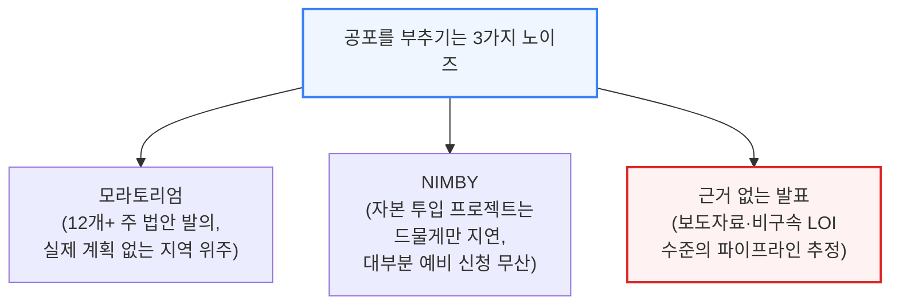

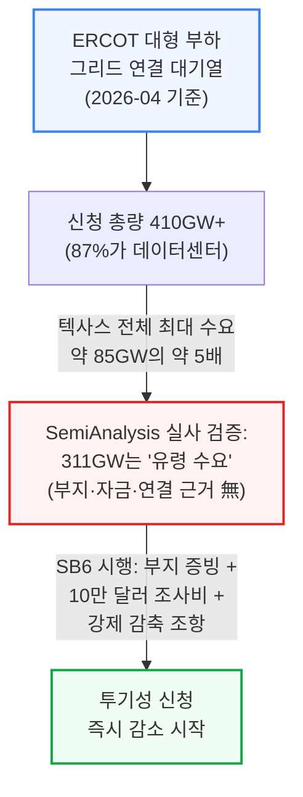

**📌 용어 풀이: 그리드 연결 신청이 왜 실제 수요보다 훨씬 부풀려지는가**
> - 그리드에 연결을 신청하는 데는 큰 비용이나 구속력이 없는 경우가 많아, 개발사·지주가 같은 부지나 미확정 프로젝트로 여러 건을 중복 신청하는 일이 흔함
> - ERCOT처럼 심사 문턱이 낮은 그리드일수록 이런 "일단 줄부터 서고 보자"는 신청이 쌓여, 대기열 총량이 실제 그리드가 감당할 수 있는 물리적 한계를 몇 배씩 초과하게 됨
> - 텍사스 SB6처럼 부지 확보 증빙·조사비·강제 감축 조항 같은 실질적 문턱을 도입하면, 이런 "유령 수요"가 걸러지면서 대기열이 현실적인 규모로 줄어드는 효과가 나타남

세 가지 노이즈 모두 헤드라인에서는 공포를 키우지만, 실제 2026년 인도 물량에는 거의 영향이 없습니다. 애초에 SemiAnalysis가 "구조적 공급 과잉" 단계로 분류해 둔 초기 단계 계층에 몰려 있기 때문입니다.

---

## 7. SemiAnalysis 2026년 전망이 흔들리지 않는 이유

**📌 핵심:**
- 앞선 3가지 노이즈(모라토리엄·NIMBY·근거 없는 발표)를 걷어내면 남는 질문은 하나 — "그런데도 왜 SemiAnalysis의 2026년 전망은 그대로인가"
- 답은 취소·지연이 몰리는 구간이 SemiAnalysis가 이미 "구조적 공급 과잉"으로 분류해둔 계층과 정확히 겹치기 때문 — 부지 확보·장비 발주·그리드 연결 계약·수직 시공이 진행 중인 "진짜 2026년 프로젝트"는 계속 일정대로 진행 중
- 하이퍼스케일러는 자체건설이든 임대든, 발표 단계 추적으로는 잡히지 않는 방식으로 이런 제약들을 이미 우회하고 있음(9장에서 상세)
- 결론: 헤드라인이 흔드는 건 SemiAnalysis 모델에 애초에 낮은 확률로 반영돼 있던 계층뿐 — 실제 반영된 물량은 그대로 진행 중이기 때문에 전망이 움직이지 않음

---

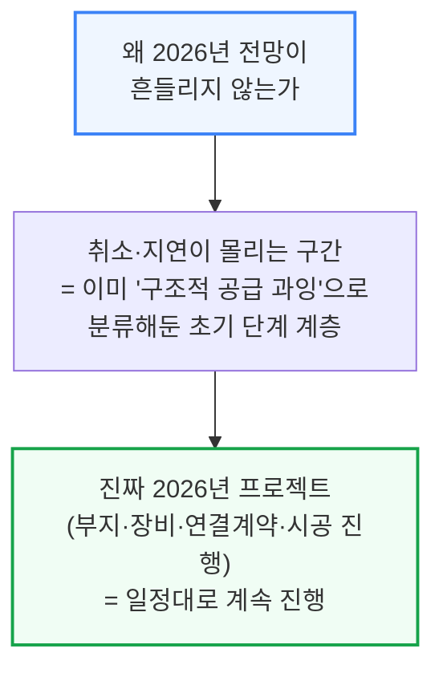

---

## 8. 초기 단계 프로젝트는 구조적 공급 과잉

**📌 핵심:**
- 프로젝트 취소의 대부분은 개발 최초 단계(인허가 승인·확정 임차인·수직 시공·그리드 연결 확보 같은 관문을 아직 통과하지 못한 발표 단계)에서 발생 — SemiAnalysis 모델은 이 계층을 처음부터 "2028년 이후에나 실현 가능"으로 분류
- 초기 단계에서 발표되는 물량이 실제로 지어질 수 있는 물량을 항상 초과하는 것은 정상적인 시장 특성 — 발표하는 데는 진입장벽이 거의 없지만, 실제로 짓는 데는 진짜 제약이 있기 때문에 생기는 비대칭
- 프로젝트가 이 고위험 초기 단계를 벗어나려면 아래 3가지 중 최소 2개, 가급적 3개를 모두 확보해야 함: ① 부지 확보(매입 완료·매매계약 체결·장기 토지임대·독점권 등) ② 확정된 전원 조달 방안(그리드 연결 또는 자가발전 조달) ③ 인허가 승인(건설 승인, 필요시 대기오염 배출 허가)
- 결론: 장기 리드타임 장비(변압기 등) 발주까지 더해지면 비로소 "진짜 2026년 프로젝트"로 인정 — 이 관문들을 통과하지 못한 발표는 몇 개가 취소돼도 실제 2026년 인도 물량에 영향이 없음

---

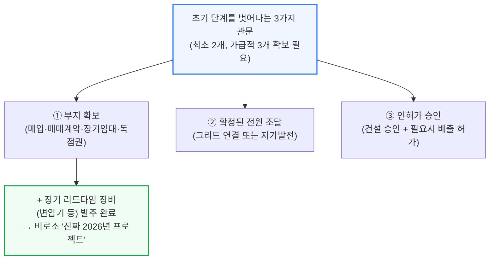

---

## 9. 선두 운영사의 제약 돌파 플레이북

**📌 핵심:**
- 하이퍼스케일러·선두 개발사는 여러 부지를 동시에 선점(랜드뱅킹)해두고, 정치적 플레이북(인허가·지역사회)과 물리적 플레이북(전력·장비)을 병행해 제약을 돌파함
- 정치적 플레이북은 오랜 현지 관계(부지 전문 변호사, 유틸리티 임원과의 관계, PILOT 세제 지원, 지역 워크포스 프로그램 등 지역사회 투자)로 공청회 전에 이미 반대 논리를 다 파악해둔 상태에서 진행 — 그래도 안 되면 표결 전에 조용히 철회하고 다른 우호적 관할구역으로 옮기거나 재설계해 재신청
- 물리적 플레이북(전력)은 그리드 연결 하나에만 의존하지 않고 3가지 경로를 병행 — ① 그리드에 직접 비용을 지불해 설비를 짓는 방식(Oracle-DTE, Meta-Entergy) ② 이미 그리드에 연결된(또는 곧 연결될) "전력이 딸린 땅"을 매매·임대 ③ 그리드를 아예 포기하고 부지 내 자가발전(BTM)으로 전환
- 결론: 물리적 플레이북(장비)은 3가지가 지난 12개월 새 예외적 사례에서 표준 관행으로 자리잡음 — ① 설계 단계부터 변압기·중저압 배전반 등 장기 리드타임 장비를 미리 확보 ② 중국산 장비를 공급망에 편입(xAI의 Sieyuan 변압기·차단기 추정 사례 등) ③ 모듈형·프리팹 건설로 숙련 인력 의존도를 낮춤

---

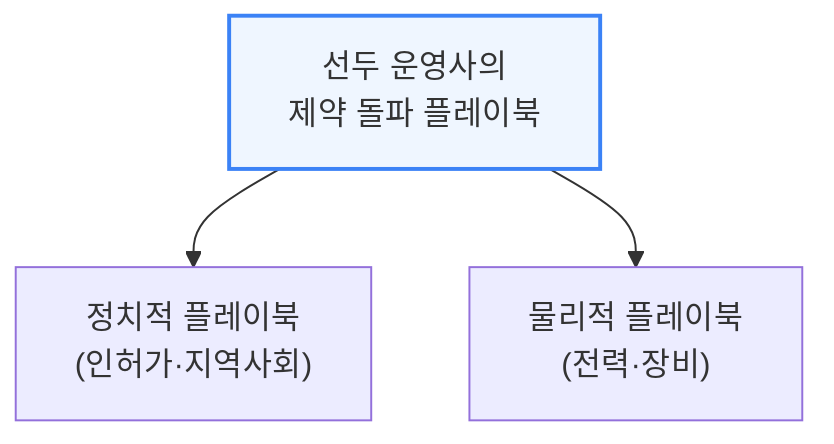

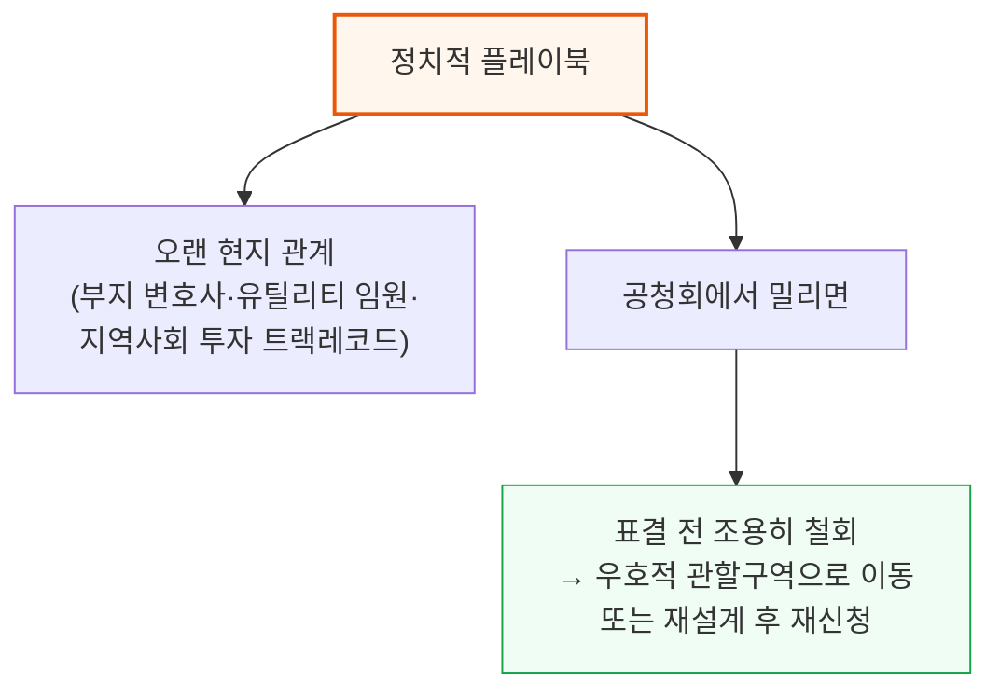

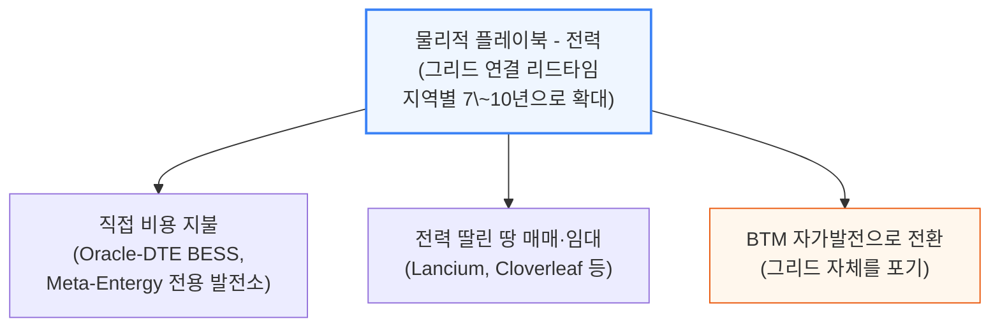

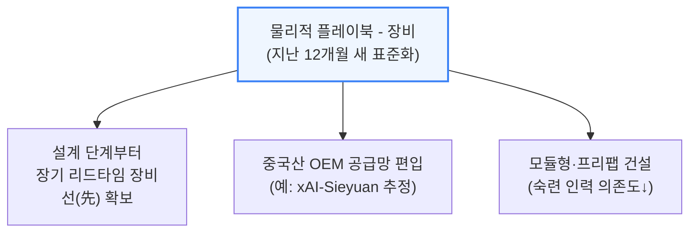

**📌 용어 풀이: 랜드뱅킹과 조용한 철회**
> - 랜드뱅킹(Land banking)은 당장 개발 계획이 없어도 여러 후보 부지를 미리 확보해두는 전략 — 한 부지가 인허가에서 막히면 곧바로 다른 부지로 갈아탈 수 있게 하는 보험
> - "조용한 철회"는 공식 표결에서 공개 부결당하면 다른 카운티가 그 기록을 인용해 추가 반대 근거로 삼을 수 있기 때문에, 개발사가 표결 전 스스로 신청을 접고 다른 곳으로 옮기는 방식 — 통계에는 "취소"로 잡히지만 실제로는 프로젝트가 다른 곳에서 계속됨

정치적 플레이북이 짓기 "권리"를 확보하는 절차라면, 물리적 플레이북은 그 권리를 실제 준공으로 이어지게 하는 절차입니다.

---

## 10. SemiAnalysis가 다르게 조사하는 방법

**📌 핵심:**
- 위와 같은 다양한 우회로가 있는데도 SemiAnalysis가 진짜 지연을 짚어낼 수 있는 이유는 조사 방식 자체가 다르기 때문 — 리서치 에이전트가 수천 개의 시·군·주·유틸리티 포털을 상시 모니터링하며, 상당수는 스캔한 PDF나 손글씨 문서로만 존재해 자동 수집이 까다로운 곳들
- 이렇게 수집한 신호를 실시간 위성사진과 병렬로 대조해, 가장 유명한 프로젝트뿐 아니라 미국 전체 파이프라인에 걸쳐 선제적인 지연 판정을 내림
- 공개 정보를 넘어서는 3가지 추가 확보 경로: ① 특정 부지·특정 날짜에 맞춘 위성 촬영을 상업 제공사보다 빠른 주기로 별도 발주 ② NIMBY 연합·시공사·지역 커뮤니티의 소셜미디어 여론 변화를 지역 언론보다 먼저 포착 ③ 현장 방문과 규제기관 직접 접촉으로 디지털화되지 않은 문서까지 확보
- 결론: 데이터센터 모델은 전력·산업재(Industrials) 팀의 전력망·장비·인력 시장 추적과 결합돼 있어, 모든 각도를 동시에 추적하면 어떤 프로젝트가 진짜 취소·지연 위험을 안고 있는지, 어떤 "지연"이 그냥 2026년에 애초에 실현 불가능했던 투기 물량을 시장이 걸러내는 것인지 구분하기 쉬워짐

---

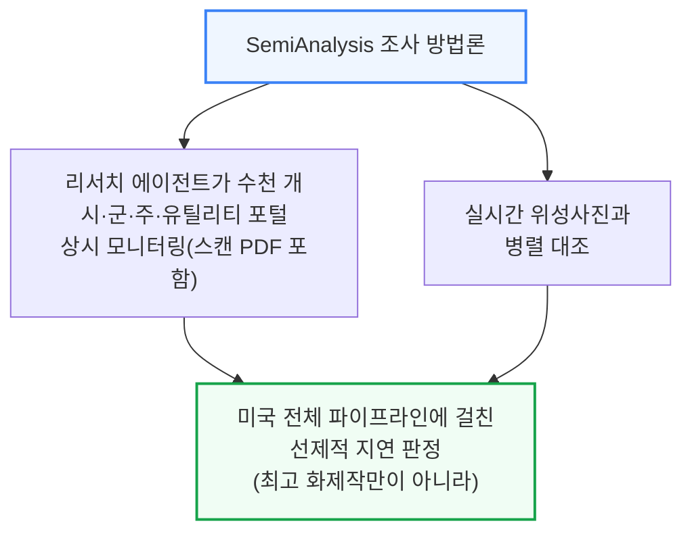

```mermaid
flowchart TD
    Beyond["공개 정보를 넘어서는<br/>3가지 확보 경로"] --> B1["맞춤형 위성 촬영<br/>(특정 부지·날짜,<br/>상업 제공사보다 빠른 주기)"]
    Beyond --> B2["소셜미디어 여론 추적<br/>(NIMBY 연합·시공사·<br/>지역 커뮤니티, 지역 언론보다 선제)"]
    Beyond --> B3["현장 방문 + 규제기관<br/>직접 접촉<br/>(디지털화 안 된 문서 확보)"]

    style Beyond fill:#fff7ed,stroke:#ea580c,stroke-width:2px
```

전력(Energy)·산업재(Industrials) 팀이 각각 그리드·장비·인력 시장을 추적한 결과가 데이터센터 모델과 결합돼, 프로젝트별로 진짜 취소 위험과 단순 시장 정화를 구분할 수 있게 합니다. 전체 조사 스택은 공개되지 않습니다.

---

## 11. 장비 공급사 우려도 근거가 약하다

**📌 핵심:**
- Vertiv 같은 장비 공급사 주가에 반영된 공포는 "데이터센터 취소 물결이 이미 쌓인 수주 잔고까지 갉아먹을 것"이라는 우려 — 그러나 SemiAnalysis 데이터센터 모델의 분기별 인도량 전망을 보면 실제 인도되는 MW는 오히려 가속 중
- 장비 리드타임은 여전히 김 — 변압기 안의 부품 하나에 불과한 라인드옵체인저 부싱(Reinhausen 등)조차 3\~5년 대기, GE Vernova·히타치에너지·미쓰비시전기 등 주요 제조사들은 핵심 라인이 3\~4년치 예약이 꽉 차 있음
- 증설도 느림 — 신규 공장 하나 짓는 데 2\~3년이 걸리며(히타치에너지의 사우스보스턴 신공장은 2025년 9월 발표, 가동은 2028년 예상), 이 공백기 동안 실제 물량 배분은 "선입금"으로 이뤄짐 — 자가발전(BTM) 설비는 대기열 자리를 확보하려면 보통 10\~15%를 선입금하는 게 표준 관행이 됐고, 이 구조적 공급 부족 덕에 Vertiv·Schneider 같은 데이터센터 전기설비 전문업체 마진이 20%를 넘김
- 결론: 취소되는 프로젝트는 애초에 장비를 발주하지도 않은 초기 단계 계층에 몰려 있어, 이런 프로젝트가 무산돼도 공급사 장부에서 빠지는 주문은 사실상 0 — 실제 수주 잔고에 있는 프로젝트는 이미 선입금하고 장기 리드타임 장비를 확보했으며 상당수는 착공까지 마쳤고, 드물게 진짜 주문이 취소돼도 3\~4년 치 대기열의 다음 구매자에게 그대로 재배정됨

---

```mermaid
flowchart TD
    Fear["장비 공급사 우려:<br/>취소 물결이 수주 잔고를<br/>갉아먹을 것"] --> Reality["실제: SemiAnalysis 모델상<br/>분기별 인도 MW는 가속 중"]

    style Fear fill:#fef2f2,stroke:#dc2626
    style Reality fill:#f0fdf4,stroke:#16a34a,stroke-width:2px
```

```mermaid
flowchart TD
    LeadTime["장비 리드타임 현황"] --> L1["탭체인저 부싱<br/>(Reinhausen 등): 3\~5년"]
    LeadTime --> L2["GE Vernova·히타치에너지·<br/>미쓰비시전기 주요 라인:<br/>3\~4년치 예약 완료"]
    LeadTime --> L3["증설 소요: 2\~3년<br/>(히타치 사우스보스턴 신공장<br/>2025-09 발표→2028년 가동)"]

    style LeadTime fill:#fff7ed,stroke:#ea580c,stroke-width:2px
```

```mermaid
flowchart TD
    Alloc["공백기 물량 배분 방식"] --> Prepay["선입금으로 대기열 확보<br/>(BTM 설비 기준 10\~15% 표준)"]
    Prepay --> Margin["Vertiv·Schneider 등<br/>데이터센터 전기설비 마진<br/>20% 이상"]
    Margin --> Cancel["취소 프로젝트는<br/>애초에 장비 미발주 계층<br/>→ 취소돼도 실제 주문 감소 0"]

    style Alloc fill:#eff6ff,stroke:#3b82f6,stroke-width:2px
    style Margin fill:#f0fdf4,stroke:#16a34a,stroke-width:2px
    style Cancel fill:#f0fdf4,stroke:#16a34a
```

SemiAnalysis 산업재(Industrials) 모델은 550개 이상의 데이터센터 장비 공급사를 75개 장비 세부 카테고리로 나눠 전 세계 6,000곳 이상의 생산시설과 매핑하고, 주요 공급사별 프로젝트 단위 익스포저까지 추적합니다 — 이를 통해 "위험에 노출된 수주 잔고"와 "이미 확정된 수주 잔고"를 구분합니다.

---

## 12. 2026년 하반기 주목할 변곡점

**📌 핵심:**
- 노이즈를 걷어내면 SemiAnalysis의 2026년 미국 데이터센터 전망은 대체로 그대로 — 이미 착공해 추적 중인 물량 기준으로 올해 24GW가 신규 가동될 예정이며, 금융 언론 헤드라인을 채우는 취소·지연은 애초에 걸러질 예정이었던 초기 발표 단계에 집중돼 있음
- 하반기에 지켜볼 변곡점 3가지: ① 주(州) 단위 모라토리엄 확산 — 메인주 LD 307은 부결됐지만 펜실베이니아의 3년 유예 법안 등 12개 주의 법안 물결이 실제 건설 가능 지도를 바꿀 수 있음 ② 3분기 장비 리드타임 발표 — 최근의 안정화가 취약한 수준이라, 다음 분기 OEM 코멘트리로 "장비 절벽" 우려가 현실화되는지 아니면 선입금 기반 공급이 계속 원활히 도는지 판가름
- ③ 지속되는 BTM(자가발전) 공급 신호 — 발전 장비 공급사들의 신규 진입이 계속되면 BTM 시나리오가 오히려 공급 과잉 쪽으로 기울 수 있음
- 결론: 다만 이런 변곡점들은 그리드 여유(헤드룸) 감소와 동시에 일어나고 있어, 단기적으로는 BTM 활용도가 낮아지고 2028년 이후 수요가 더 몰릴 가능성도 함께 지켜봐야 함

---

```mermaid
flowchart TD
    Watch["2026년 하반기<br/>3대 변곡점"] --> W1["① 주 단위 모라토리엄 확산<br/>(펜실베이니아 3년 유예 등<br/>12개 주 법안 물결)"]
    Watch --> W2["② 3분기 장비 리드타임 발표<br/>(안정화 지속 vs<br/>'장비 절벽' 현실화)"]
    Watch --> W3["③ 지속되는 BTM 공급 신호<br/>(신규 발전장비 진입<br/>→ 공급 과잉 가능성)"]

    style Watch fill:#eff6ff,stroke:#3b82f6,stroke-width:2px
    style W2 fill:#fff7ed,stroke:#ea580c
```

세 변곡점 모두 그리드 헤드룸 감소와 동시에 진행 중이어서, SemiAnalysis는 단기적으로 BTM 활용도가 낮아지고 2028년 이후 수요가 더 몰릴 가능성을 함께 주시하고 있습니다.

---

## 13. TeraWulf 주력 사이트의 지연 가능성

**📌 핵심:**
- TeraWulf는 2026년 2월 26일 실적 발표에서 레이크 마리너·애버내시 두 사이트 모두 2026년 말까지 인도하겠다고 재확인했지만, SemiAnalysis는 Fluidstack向 사이트가 가이던스보다 지연될 것으로 판단
- 레이크 마리너는 80MW 건물 1개가 2026년 완공 가능성이 있지만, 2026년 3월 착공한 나머지 80MW 건물까지 같은 해 안에 완공하는 것은 빠듯한 일정
- 애버내시는 2026년에 착공해 셸(골조) 시공 속도는 매우 빨랐지만, 앞서 4·13장에서 반복 확인된 패턴대로 MEP(설비)·시운전 일정이 쉽게 간과되는 부분이라 2026년 내 인도가 어려울 것으로 판단 — SemiAnalysis는 2027년 지연을 유지
- 결론: 두 사이트 모두 "셸이 빨리 올라간다"는 신호만으로 완공 시점을 낙관하면 안 된다는, 4장 Nebius 사례와 동일한 패턴을 반복 — 셸과 MEP는 별개의 이정표라는 점을 다시 한번 확인시켜주는 사례

---

```mermaid
flowchart TD
    TW["TeraWulf 2026-02-26<br/>실적 발표 가이던스<br/>(레이크 마리너·애버내시<br/>연내 인도 재확인)"] --> LM["레이크 마리너<br/>80MW 건물 1개: 2026년<br/>완공 가능성 有<br/>80MW 건물 2개(2026-03 착공):<br/>연내 완공은 빠듯"]
    TW --> AB["애버내시<br/>셸 시공은 매우 빠름<br/>but MEP·시운전 일정 간과 위험<br/>→ SemiAnalysis 판단: 2027년 지연"]

    style TW fill:#eff6ff,stroke:#3b82f6,stroke-width:2px
    style AB fill:#fef2f2,stroke:#dc2626,stroke-width:2px
```

두 사례 모두 4장의 Nebius 뉴저지 사례와 동일한 교훈을 줍니다 — 셸(골조)이 빠르게 올라가는 것과 실제 가동 가능 시점 사이에는, MEP 설비·시운전이라는 눈에 잘 띄지 않는 단계가 남아 있다는 점입니다.

---

*작성 진행률: 100% 완료*
*업데이트: 10\~13장(SemiAnalysis 조사 방법론, 장비 공급사 우려 반박, 2026년 하반기 변곡점, TeraWulf 지연 사례) 작성 완료 — 전체 13개 섹션 번역 완료*
