# US Grid Constraints: Towards 40GW+ of Behind-The-Meter Datacenter by 2028?

> **출처**: [SemiAnalysis Newsletter](https://newsletter.semianalysis.com/p/us-grid-constraints-towards-40gw)
> **저자**: Jeremie Eliahou Ontiveros
> **발행일**: 2026-06-26

---

## 📑 목차

### 전체 섹션
1. [서론: 전력망이 한계에 도달했다](#1-서론-전력망이-한계에-도달했다)
2. [전력 공급 예측의 3대 축: SemiAnalysis Energy Model 방법론](#2-전력-공급-예측의-3대-축-semianalysis-energy-model-방법론)
3. [가스 발전소, 왜 2028년까지 못 늘어나나](#3-가스-발전소-왜-2028년까지-못-늘어나나)
4. [재생에너지와 배터리 저장, ELCC로 보면 훨씬 작다](#4-재생에너지와-배터리-저장-elcc로-보면-훨씬-작다)
5. [전력망 여유 용량 (헤드룸), 2027년 적자 전환: ICAP vs UCAP](#5-전력망-여유-용량-헤드룸-2027년-적자-전환-icap-vs-ucap)
6. [BTM (자가발전)이 전력망 연결을 이기는 이유: 속도와 확실성](#6-btm-자가발전이-전력망-연결을-이기는-이유-속도와-확실성)
7. [ERCOT의 하이브리드 구조: BTM과 전력망을 잇는 다리](#7-ercot의-하이브리드-구조-btm과-전력망을-잇는-다리)
8. [BTM 부상의 승자와 패자](#8-btm-부상의-승자와-패자)

---

## 🔑 용어 정리

본문을 순서대로 읽기 전에 알아두면 좋은 용어들입니다. 자세한 수치와 설명은 본문에서 처음 등장하는 위치에 나옵니다.

- **BTM (Behind-The-Meter, 자가발전)**: 전력망을 거치지 않거나 최소한만 거치도록, 데이터센터 부지 안에 직접 발전소를 지어 전기를 공급하는 방식
- **ELCC (Effective Load Carrying Capability)**: 발전 설비가 명판 용량과 별개로, 전력망 신뢰도에 실제로 얼마나 기여하는지를 나타내는 "진짜 용량 가치" 지표
- **헤드룸 (Grid Headroom, 전력망 여유 용량)**: 전력망이 자기 수요와 필요 예비율을 다 채우고 남는, 새 부하를 받아들일 수 있는 여유 용량
- **ICAP (Installed Capacity)**: 발전기 명판 용량을 기준으로 계산한 예비율
- **UCAP (Unforced Capacity, 인정 용량)**: 고장 위험과 ELCC 할인까지 반영해, 실제로 믿을 수 있는 만큼만 인정한 용량 기준 예비율
- **ERCOT**: 텍사스 주 전력망을 독자적으로 운영하는 기관. 미국 대부분 지역과 달리 중앙 용량시장이 없음

---

## 1. 서론: 전력망이 한계에 도달했다

**📌 핵심:**
- 미국 데이터센터 신규 건설량이 **2026년 +21GW에서 2030년 +84GW로 4배** 증가 → 전력망이 이 속도를 못 따라가 자가발전(BTM)이 유일한 대안으로 떠오름
- 전력망이 매년 새로 확실하게 인정할 수 있는 발전 용량은 **15GW 안팎**(2020년대 말 20GW대로 소폭 증가)뿐 → 데이터센터를 포함한 전체 전력 수요 증가 속도를 따라가지 못함
- BTM 장비 시장 규모(TAM)가 **2029년 연 50GW를 돌파**할 전망 → Bloom Energy, Bergen Engines, Wärtsilä 등 신흥 업체가 이미 GE Vernova·Siemens의 터빈 공급 부족 우려를 뛰어넘어 성공 중
- 결론: 전력망 확충 속도가 데이터센터 수요 증가 속도에 못 미쳐, **2028년 이후 신규 데이터센터의 절반 이상이 BTM으로** 감

---

지금까지 미국 데이터센터 전력 수요의 대부분은 전력망이 감당해 왔습니다. 하지만 이제 전환점에 다다르고 있습니다. AI 랩(OpenAI, Anthropic 등)과 초대형 클라우드 사업자의 전력 수요가 끝없이 가속하는데, 전력망은 이 속도로 용량을 늘릴 수 없기 때문입니다.

약 1년 전 SemiAnalysis의 Onsite Gas 리포트는 BTM 가스 장비 시장에 신규 업체가 빠르게 늘어날 것이라고 처음 예측했습니다. 이후 Bloom Energy, Bergen Engines, Wärtsilä 같은 회사들이 크게 성공했고, GE Vernova(GEV)·Siemens의 터빈 공급 제약을 우회하는 일이 많은 이들의 우려보다 훨씬 쉬웠던 것으로 나타났습니다. 이번 리포트는 미국 전력망의 공급 능력을 직접 모델링해, BTM이 채워야 할 부족분의 규모를 계산합니다.

아래 다이어그램은 이 리포트 전체의 논리 흐름을 보여줍니다: 데이터센터 수요 급증(①) → 전력망 공급이 이를 못 따라가는 구조적 제약(②, 2\~5장) → 그 제약이 구매자를 BTM으로 밀어내는 선택(③, 6장) → BTM과 전력망을 잇는 실질적 다리와 그로 인한 승자·패자 재편(④, 7\~8장)까지의 전체 그림입니다.

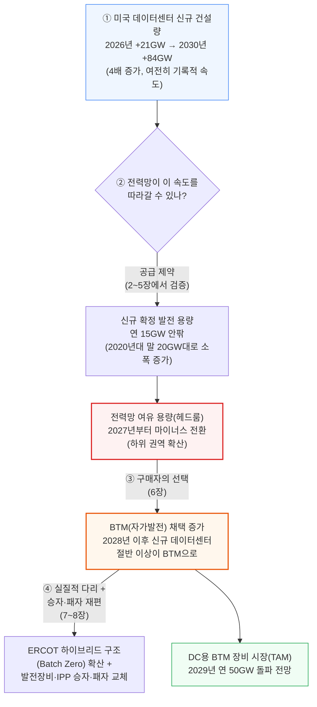
```mermaid
flowchart TD
    A["① 미국 데이터센터 신규 건설량<br/>2026년 +21GW → 2030년 +84GW<br/>(4배 증가, 여전히 기록적 속도)"] --> B{"② 전력망이 이 속도를<br/>따라갈 수 있나?"}
    B -->|"공급 제약<br/>(2~5장에서 검증)"| C["신규 확정 발전 용량<br/>연 15GW 안팎<br/>(2020년대 말 20GW대로 소폭 증가)"]
    C --> D["전력망 여유 용량(헤드룸)<br/>2027년부터 마이너스 전환<br/>(하위 권역 확산)"]
    D -->|"③ 구매자의 선택<br/>(6장)"| E["BTM(자가발전) 채택 증가<br/>2028년 이후 신규 데이터센터<br/>절반 이상이 BTM으로"]
    E -->|"④ 실질적 다리 +<br/>승자·패자 재편<br/>(7~8장)"| F["ERCOT 하이브리드 구조<br/>(Batch Zero) 확산 +<br/>발전장비·IPP 승자·패자 교체"]
    E --> G["DC용 BTM 장비 시장(TAM)<br/>2029년 연 50GW 돌파 전망"]

    style A fill:#eff6ff,stroke:#3b82f6
    style D fill:#fef2f2,stroke:#dc2626,stroke-width:2px
    style E fill:#fff7ed,stroke:#ea580c,stroke-width:2px
    style G fill:#f0fdf4,stroke:#16a34a
```

이 리포트는 전력망 제약과 그 해법으로서의 BTM에 집중하며, Load Flexibility(부하 유연화) 같은 대안은 이번 글의 범위 밖입니다 — 이는 향후 별도의 딥다이브에서 다룰 예정입니다. 다만 6장에서 BTM이 왜 Load Flexibility 같은 대안보다 유력한 해법이 될지는 간단히 짚습니다. 참고로 데이터센터 지연 관련 헤드라인이 과장된 경우가 많다는 점은 지난 리포트에서 설명한 바 있습니다.

---

## 2. 전력 공급 예측의 3대 축: SemiAnalysis Energy Model 방법론

**📌 핵심:**
- SemiAnalysis는 미국 전역 발전 자산 **4만 개**를 추적해 분기 단위로 가동 개시 시점(COD)을 예측하고, 각 발전소가 전력망에 실제로 기여하는 '진짜' 용량(ELCC)까지 계산해 공급을 추정함
- 이렇게 계산한 연간 신규 확정 용량은 **15GW 안팎**(2020년대 말 20GW대로 소폭 증가)에 불과 → 데이터센터를 포함한 전체 수요 증가 속도를 따라가지 못함
- 유틸리티가 "**2027년까지 500MW** 공급"을 약속해도, 변압기·차단기 조달 지연으로 실제로는 **2029년에야 공급**되는 사례가 흔함 → 개발자는 위약금도 없는 유틸리티 대신 수억 달러의 신용장·선급금을 떠안는 구조
- 결론: 전력망 공급자의 약속은 숫자로는 맞아도 시점이 안 맞음 → 이 불확실성 자체가 BTM을 매력적으로 만드는 핵심 이유

---

SemiAnalysis의 Energy Model은 세 가지 축으로 미국 전력 공급을 예측합니다: ① 데이터센터 전력 수요, ② 전력망 여유 용량(헤드룸), ③ 신규 전력망 공급.

①번은 칩 단위 AI 수요를 추적하는 Accelerator Model과, 구축 경제성("버블" 여부)을 검증하는 Tokenomics Model이 함께 뒷받침합니다. ②번 헤드룸 분석은 UCAP/ICAP 예비율 외에도 수급 증가 추세와 신뢰도 리스크까지 함께 모델링하며, ③번 공급 예측은 모든 연료 유형에 걸쳐 계산합니다. 세 축의 전체 흐름은 아래와 같습니다.

이 예측에 따르면, 연간 순수 신규 ELCC 용량은 **15GW 안팎**에 그치고, 2020년대 말까지 **20GW대**로 완만히 늘어나는 정도입니다. 이는 전력망 운영자가 데이터센터 같은 확정 부하(그리고 산업 설비·반도체 공장 등 다른 확정 부하)를 감당하기 위해 인정할 수 있는, 사실상 전체 "믿을 수 있는" 신규 용량입니다.

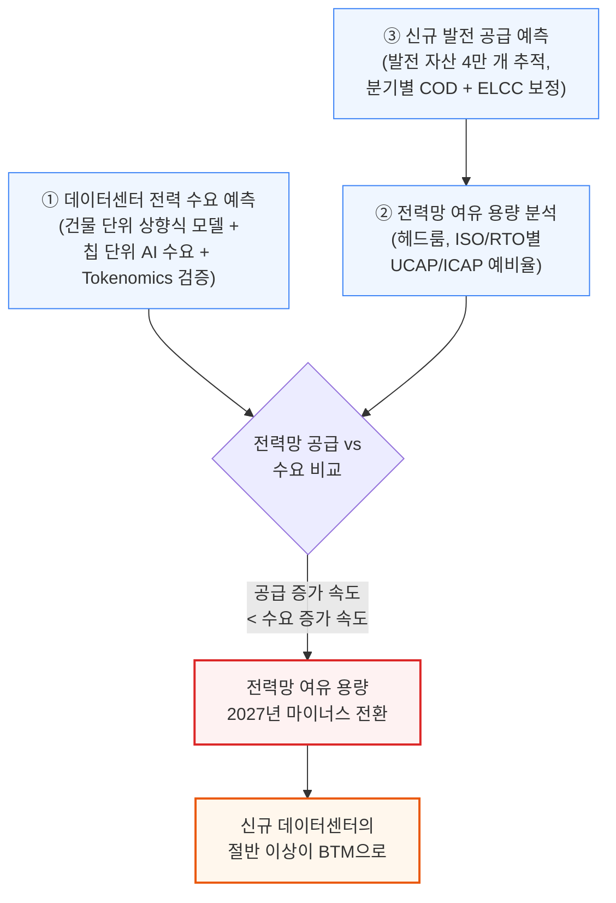
```mermaid
flowchart TD
    A["① 데이터센터 전력 수요 예측<br/>(건물 단위 상향식 모델 +<br/>칩 단위 AI 수요 + Tokenomics 검증)"] --> D{"전력망 공급 vs<br/>수요 비교"}
    C["③ 신규 발전 공급 예측<br/>(발전 자산 4만 개 추적,<br/>분기별 COD + ELCC 보정)"] --> B["② 전력망 여유 용량 분석<br/>(헤드룸, ISO/RTO별<br/>UCAP/ICAP 예비율)"]
    B --> D
    D -->|"공급 증가 속도<br/>&lt; 수요 증가 속도"| E["전력망 여유 용량<br/>2027년 마이너스 전환"]
    E --> F["신규 데이터센터의<br/>절반 이상이 BTM으로"]

    style A fill:#eff6ff,stroke:#3b82f6
    style B fill:#eff6ff,stroke:#3b82f6
    style C fill:#eff6ff,stroke:#3b82f6
    style E fill:#fef2f2,stroke:#dc2626,stroke-width:2px
    style F fill:#fff7ed,stroke:#ea580c,stroke-width:2px
```

**📌 용어 풀이: ISO / RTO, COD**
> - **ISO (Independent System Operator) / RTO (Regional Transmission Organization)**: 특정 지역의 전력망 운영과 도매 전력시장을 관리하는 기관. PJM, MISO, ERCOT 등이 대표적
> - **COD (Commercial Operation Date, 상업운전 개시일)**: 발전소가 건설을 마치고 실제로 전력망에 전기를 공급하기 시작하는 날짜. 신규 공급 예측의 기준점

이렇게 계산한 확정 공급에서 최고 수요와 필요 예비율을 뺀 값이 바로 **헤드룸(전력망 여유 용량)**입니다 — 시장이 자기 수요와 예비율을 다 채우고 남는, 새 부하를 받을 수 있는 여유분입니다(계산식과 ICAP·UCAP 기준 비교는 5장에서 상세히 다룹니다). 이 기준으로 보면 여유 용량은 이미 거의 0에 가까워졌고, 전국 곳곳의 필요 예비율 분석에 따르면 **2027년에는 마이너스로 전환**됩니다.

이 때문에 발전 용량 자체가 전력망 연결형 데이터센터 성장의 주요 병목이 될 전망입니다(송전망도 또 다른 병목이며, 이는 별도 후속 딥다이브 주제입니다). 데이터센터 운영사들은 이미 이를 직접 겪고 있습니다 — 유틸리티의 공급 약속이 실제로 어떻게 어긋나는지, 그리고 그 부담이 누구에게 넘어가는지는 다음과 같습니다.

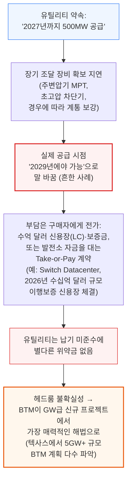
```mermaid
flowchart TD
    Promise["유틸리티 약속:<br/>'2027년까지 500MW 공급'"] --> Bottleneck["장기 조달 장비 확보 지연<br/>(주변압기 MPT,<br/>초고압 차단기,<br/>경우에 따라 계통 보강)"]
    Bottleneck --> Delay["실제 공급 시점<br/>'2029년에야 가능'으로<br/>말 바꿈 (흔한 사례)"]
    Delay --> Burden["부담은 구매자에게 전가:<br/>수억 달러 신용장(LC)·보증금,<br/>또는 발전소 자금을 대는<br/>Take-or-Pay 계약<br/>(예: Switch Datacenter,<br/>2026년 수십억 달러 규모<br/>이행보증 신용장 체결)"]
    Burden --> NoPenalty["유틸리티는 납기 미준수에<br/>별다른 위약금 없음"]
    NoPenalty --> Result["헤드룸 불확실성 →<br/>BTM이 GW급 신규 프로젝트에서<br/>가장 매력적인 해법으로<br/>(텍사스에서 5GW+ 규모<br/>BTM 계획 다수 파악)"]

    style Promise fill:#eff6ff,stroke:#3b82f6
    style Delay fill:#fef2f2,stroke:#dc2626,stroke-width:2px
    style NoPenalty fill:#fef2f2,stroke:#dc2626
    style Result fill:#fff7ed,stroke:#ea580c,stroke-width:2px
```

---

## 3. 가스 발전소, 왜 2028년까지 못 늘어나나

**📌 핵심:**
- 미국은 **2026\~2027년 두 해 동안 가스 발전소를 연간 10GW도 채 못 늘림**(2028년 이후에야 증가) → 위성사진으로 확인해도 지금 착공 단계인 발전소 자체가 부족하기 때문
- PJM(미국 최대 전력시장)만 봐도 계통연계 계약까지 마친 발전 프로젝트 **24GW가 2020년 이후 상업운전 전에 취소**됨(그중 가스가 13.5GW) → 원인은 인허가 거부·공급망 지연·자금 조달 실패
- 가스 발전 중 가장 흔한 방식(CCGT, 복합화력발전)은 연료 효율은 가장 좋지만 건설에 **4\~6년**이 걸림 → 반면 왕복동 엔진(RICE)이나 연료전지는 훨씬 빨리 지을 수 있어 데이터센터 업체들이 직접 자가발전용으로 확보 중
- 결론: 터빈·변압기 조달 기간이 과거 **18개월에서 3\~4년으로** 늘며 가스 발전소 개발 기간이 최소 4년으로 늘어남 → **2028년 이전 가스 증설은 사실상 불가능**

---

발전 자산 4만 개를 분석한 결과, 향후 2년간 확실하고 즉시 투입 가능한(dispatchable) 발전 용량이 거의 늘지 않는다는 미국 전력망의 핵심 난제가 드러납니다. 증설이 본격적으로 늘어나는 시점은 2028년 이후입니다.

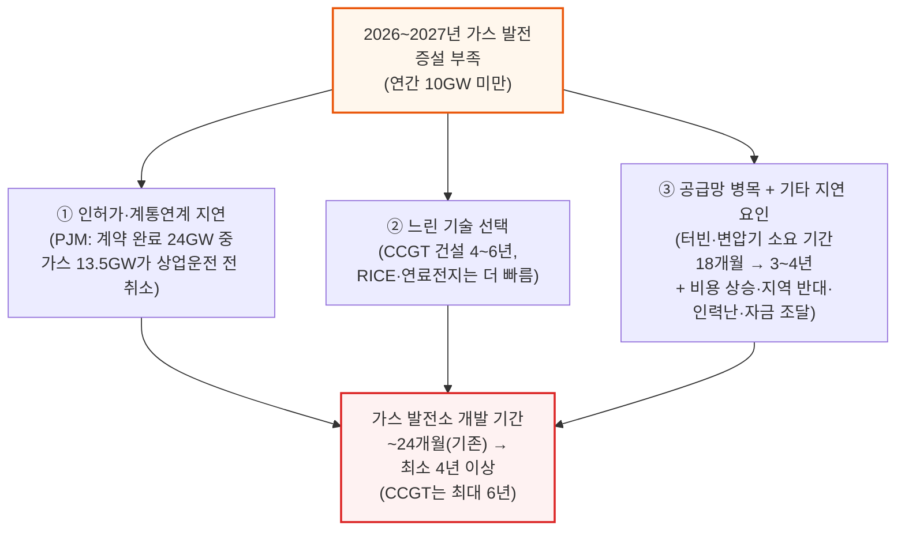
```mermaid
flowchart TD
    Root["2026~2027년 가스 발전<br/>증설 부족<br/>(연간 10GW 미만)"] --> C1["① 인허가·계통연계 지연<br/>(PJM: 계약 완료 24GW 중<br/>가스 13.5GW가 상업운전 전 취소)"]
    Root --> C2["② 느린 기술 선택<br/>(CCGT 건설 4~6년,<br/>RICE·연료전지는 더 빠름)"]
    Root --> C3["③ 공급망 병목 + 기타 지연 요인<br/>(터빈·변압기 소요 기간<br/>18개월 → 3~4년<br/>+ 비용 상승·지역 반대·<br/>인력난·자금 조달)"]

    C1 --> Result["가스 발전소 개발 기간<br/>~24개월(기존) →<br/>최소 4년 이상<br/>(CCGT는 최대 6년)"]
    C2 --> Result
    C3 --> Result

    style Root fill:#fff7ed,stroke:#ea580c,stroke-width:2px
    style Result fill:#fef2f2,stroke:#dc2626,stroke-width:2px
```

이 예측을 위해 SemiAnalysis는 Datacenter Model과 같은 방법론을 씁니다: 수십만 개의 실제 데이터를 실시간 위성사진으로 검증하며 건설 일정을 분석합니다. 이 결과, 2026\~2027년 상업운전이 가능할 정도로 공사가 진행된 발전소 자체가 충분히 보이지 않습니다.

2026\~2027년 부족은 단일 병목이 아니라 여러 병목이 쌓인 결과입니다. 그중 ①번(인허가·계통연계 지연)이 가장 큰 손실 구간으로, PJM 사례를 보면 대기열 자체보다 "전환율"(심사 통과 후 실제 상업운전까지 도달하는 비율)이 더 큰 병목임을 알 수 있습니다.

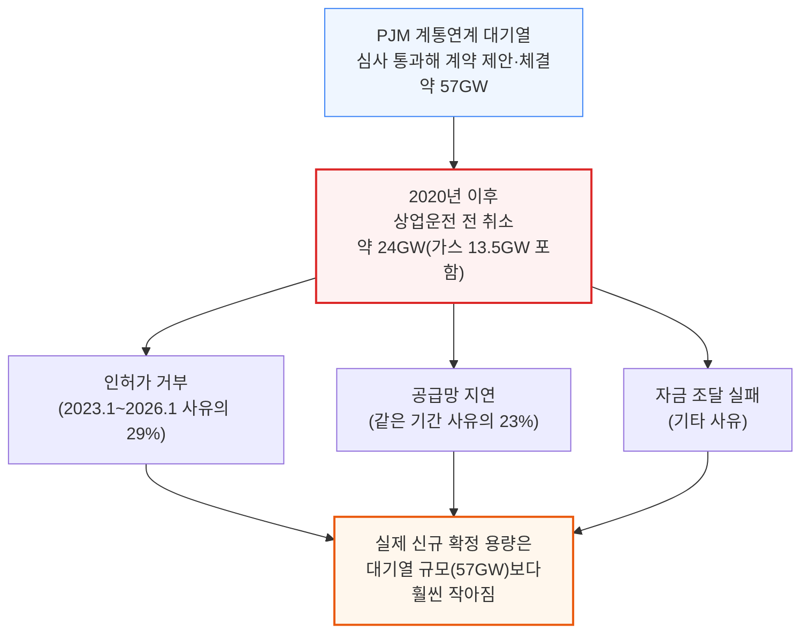
```mermaid
flowchart TD
    Queue["PJM 계통연계 대기열<br/>심사 통과해 계약 제안·체결<br/>약 57GW"] --> Cancel["2020년 이후<br/>상업운전 전 취소<br/>약 24GW(가스 13.5GW 포함)"]
    Cancel --> Reason1["인허가 거부<br/>(2023.1~2026.1 사유의 29%)"]
    Cancel --> Reason2["공급망 지연<br/>(같은 기간 사유의 23%)"]
    Cancel --> Reason3["자금 조달 실패<br/>(기타 사유)"]
    Reason1 --> Net["실제 신규 확정 용량은<br/>대기열 규모(57GW)보다<br/>훨씬 작아짐"]
    Reason2 --> Net
    Reason3 --> Net

    style Queue fill:#eff6ff,stroke:#3b82f6
    style Cancel fill:#fef2f2,stroke:#dc2626,stroke-width:2px
    style Net fill:#fff7ed,stroke:#ea580c,stroke-width:2px
```

(출처: "Powering Reliability through Market Design" 보고서 기준)

②번(느린 기술 선택) 문제는 SemiAnalysis의 Onsite Gas 딥다이브에서도 다룬 내용입니다 — 유틸리티가 주로 발주하는 기술과 데이터센터가 직접 확보하는 기술이 아래처럼 갈립니다.

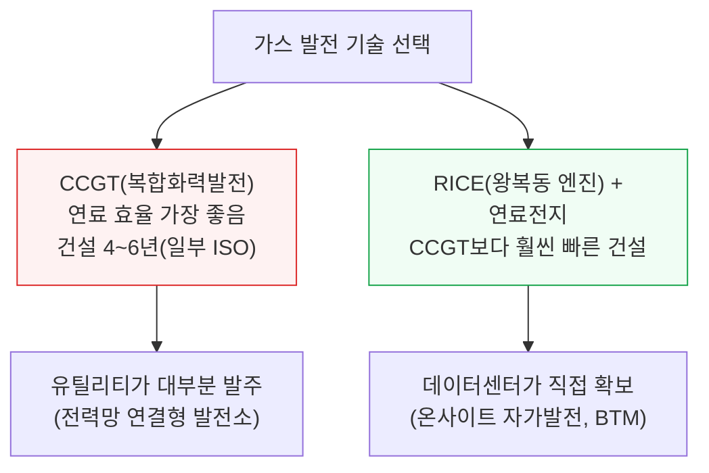
```mermaid
flowchart TD
    Choice["가스 발전 기술 선택"] --> CCGT["CCGT(복합화력발전)<br/>연료 효율 가장 좋음<br/>건설 4~6년(일부 ISO)"]
    Choice --> Fast["RICE(왕복동 엔진) +<br/>연료전지<br/>CCGT보다 훨씬 빠른 건설"]
    CCGT --> Utility["유틸리티가 대부분 발주<br/>(전력망 연결형 발전소)"]
    Fast --> DC["데이터센터가 직접 확보<br/>(온사이트 자가발전, BTM)"]

    style CCGT fill:#fef2f2,stroke:#dc2626
    style Fast fill:#f0fdf4,stroke:#16a34a
```

③번(공급망 병목)은 가스터빈과 발전기용 승압변압기(GSU, Generator Step-Up Transformer)의 소요 기간이 늘어난 것이 원인입니다.

**📌 용어 풀이: CCGT, RICE, 연료전지**
> - **CCGT (복합화력발전)**: 가스터빈으로 1차 발전 후, 남은 배기열로 증기터빈을 돌려 한 번 더 발전 → 연료 효율은 가장 좋지만 설비가 크고 복잡해 건설에 4\~6년 소요
> - **RICE (왕복동 엔진 발전기)**: 자동차·선박 엔진처럼 피스톤이 왕복 운동하며 발전하는 방식 → 모듈형이라 CCGT보다 훨씬 빨리 지을 수 있음
> - **연료전지 (Fuel Cell)**: 연소 과정 없이 수소 등의 화학반응으로 직접 전기를 만드는 장치 → RICE와 함께, 데이터센터가 자가발전용으로 직접 조달하는 대표적인 "빠른" 기술
> - **쉬운 비유**: CCGT는 맞춤 정장(오래 걸리지만 가장 효율적), RICE·연료전지는 기성복(빨리 입을 수 있음)

---

## 4. 재생에너지와 배터리 저장, ELCC로 보면 훨씬 작다

**📌 핵심:**
- 태양광·배터리 저장장치(BESS)는 매년 각각 **20GW 넘게** 새로 지어지지만, 전력망이 실제로 믿고 쓸 수 있는 용량(ELCC 기준)은 그중 일부에 불과 → 태양광은 대부분 같은 시간대(낮)에만 발전하기 때문에, 이미 깔린 태양광이 많을수록 다음 태양광 1GW의 가치는 계속 떨어짐(한계가치 체감)
- 텍사스(ERCOT)는 태양광이 낮 순수요를 크게 낮추면서, 송전 요금을 정하는 기준 시점(4CP)이 늦은 오후에서 **해가 지는 저녁 시간대로 밀려남** → 배터리가 이 저녁 시간대의 급격한 수요 상승을 떠받쳐야 하는 부담 증가
- 배터리도 지속시간을 4시간, 8시간으로 늘려도 근본 해법은 아님: 4시간 배터리가 많아지면 "4시간 이하 정전 위험"은 이미 해소돼 추가로 지어도 가치가 없고, 위험은 그다음 구간(4시간 초과)으로 옮겨갈 뿐
- 결론: 재생에너지·저장장치는 AI 전력 확보에 중요한 축이지만, **명판 용량(GW)과 전력망이 실제로 인정하는 용량(ELCC) 사이 격차**가 갈수록 벌어짐 → 이 격차가 다음 장의 '헤드룸 적자'를 만드는 핵심 원인

---

가스만 미국 전력망의 변수는 아닙니다. 재생에너지와 저장장치의 비중도 점점 커지고 있지만, 전력망 입장에서 이들의 실제 가치는 명판 숫자보다 훨씬 낮습니다. **ELCC(Effective Load Carrying Capability, 유효부하기여도)** 기준으로 왜 그런지는 아래 다이어그램의 인과관계로 설명됩니다.

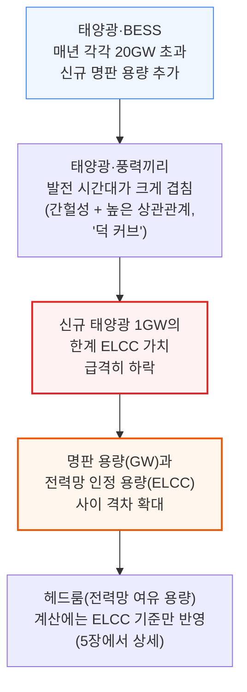
```mermaid
flowchart TD
    New["태양광·BESS<br/>매년 각각 20GW 초과<br/>신규 명판 용량 추가"] --> Corr["태양광·풍력끼리<br/>발전 시간대가 크게 겹침<br/>(간헐성 + 높은 상관관계,<br/>'덕 커브')"]
    Corr --> Diminish["신규 태양광 1GW의<br/>한계 ELCC 가치<br/>급격히 하락"]
    Diminish --> Gap["명판 용량(GW)과<br/>전력망 인정 용량(ELCC)<br/>사이 격차 확대"]
    Gap --> Headroom["헤드룸(전력망 여유 용량)<br/>계산에는 ELCC 기준만 반영<br/>(5장에서 상세)"]

    style New fill:#eff6ff,stroke:#3b82f6
    style Diminish fill:#fef2f2,stroke:#dc2626,stroke-width:2px
    style Gap fill:#fff7ed,stroke:#ea580c,stroke-width:2px
```

**📌 용어 풀이: ELCC (Effective Load Carrying Capability)**
> - 발전 설비가 전력망 전체 신뢰도에 실제로 얼마나 기여하는지를 계산한 "진짜" 용량 가치. 명판 용량이 아니라 "정전 위험을 얼마나 줄여주는가"를 기준으로 산정
> - 전력망 여유 용량(헤드룸)을 가늠하는 지표로도 쓰임: ELCC 여유가 있는 시장은 새 대형 부하(데이터센터 등)를 계통에 연결할 여지가 있지만, 없는 시장은 그렇지 못함
> - 각 전력시장(ISO)마다 자기 시스템 특성에 맞춰 독자적인 ELCC 산정 방식을 씀 → 같은 발전소라도 지역마다 인정받는 용량이 다름

텍사스(ERCOT)에서는 태양광·풍력이 빠르게 늘면서 가격 신호가 반대 방향으로 움직이는 문제가 겹쳤습니다: 매년 6\~9월 중 송전 요금을 결정하는 4번의 15분 구간인 **4CP(Four Coincident Peak)**가 재생에너지 확산 전후로 완전히 다른 시간대로 이동했습니다.

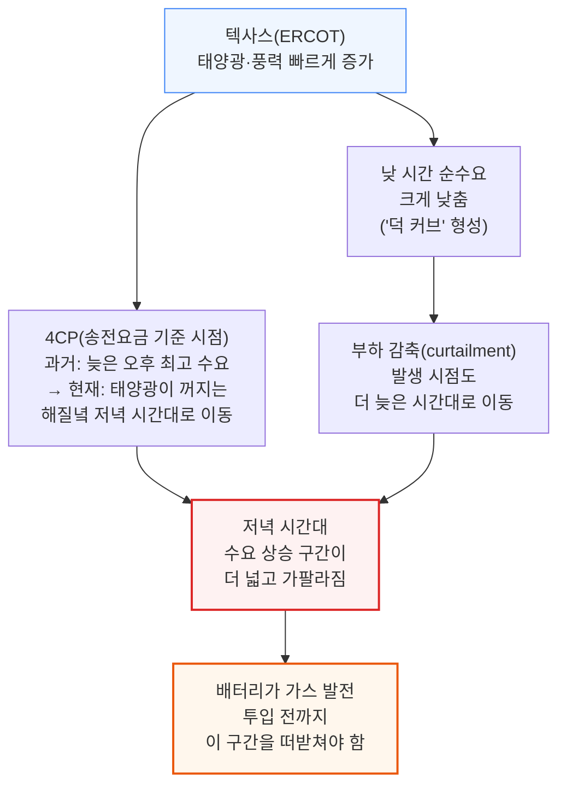
```mermaid
flowchart TD
    Solar["텍사스(ERCOT)<br/>태양광·풍력 빠르게 증가"] --> Effect1["낮 시간 순수요<br/>크게 낮춤<br/>('덕 커브' 형성)"]
    Solar --> Effect2["4CP(송전요금 기준 시점)<br/>과거: 늦은 오후 최고 수요<br/>→ 현재: 태양광이 꺼지는<br/>해질녘 저녁 시간대로 이동"]
    Effect1 --> Curtail["부하 감축(curtailment)<br/>발생 시점도<br/>더 늦은 시간대로 이동"]
    Effect2 --> Steep["저녁 시간대<br/>수요 상승 구간이<br/>더 넓고 가팔라짐"]
    Curtail --> Steep
    Steep --> Battery["배터리가 가스 발전<br/>투입 전까지<br/>이 구간을 떠받쳐야 함"]

    style Solar fill:#eff6ff,stroke:#3b82f6
    style Steep fill:#fef2f2,stroke:#dc2626,stroke-width:2px
    style Battery fill:#fff7ed,stroke:#ea580c,stroke-width:2px
```

이렇게 계속 줄어드는, 날씨에 좌우되는 가치를 정량화하려면 전용 지표가 필요합니다. 유틸리티와 전력망 계획 당국은 바로 이 목적으로 ELCC 개념을 씁니다. 각 시장은 자기 시스템 관점에서 자원을 판단하고, 시스템마다 특성이 다르기 때문에 ELCC 산정 방식도 시장마다 다릅니다.

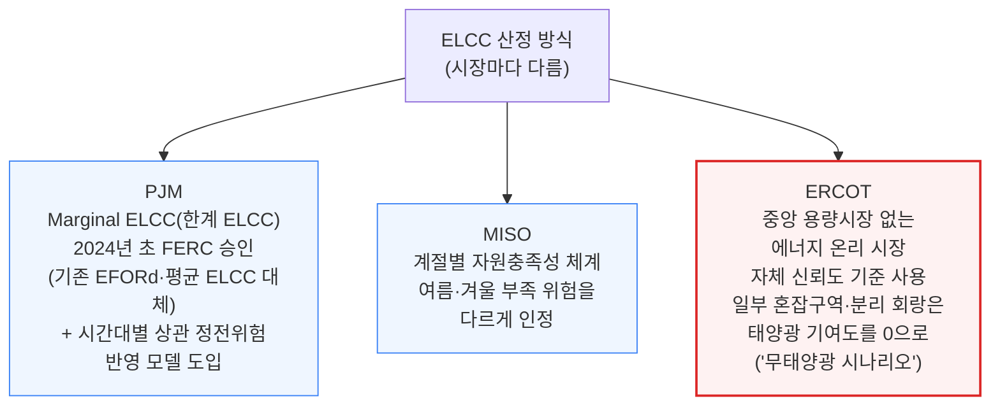
```mermaid
flowchart TD
    ELCC["ELCC 산정 방식<br/>(시장마다 다름)"] --> PJM["PJM<br/>Marginal ELCC(한계 ELCC)<br/>2024년 초 FERC 승인<br/>(기존 EFORd·평균 ELCC 대체)<br/>+ 시간대별 상관 정전위험<br/>반영 모델 도입"]
    ELCC --> MISO["MISO<br/>계절별 자원충족성 체계<br/>여름·겨울 부족 위험을<br/>다르게 인정"]
    ELCC --> ERCOT["ERCOT<br/>중앙 용량시장 없는<br/>에너지 온리 시장<br/>자체 신뢰도 기준 사용<br/>일부 혼잡구역·분리 회랑은<br/>태양광 기여도를 0으로<br/>('무태양광 시나리오')"]

    style PJM fill:#eff6ff,stroke:#3b82f6
    style MISO fill:#eff6ff,stroke:#3b82f6
    style ERCOT fill:#fef2f2,stroke:#dc2626,stroke-width:2px
```

그 결과 같은 태양광·저장장치 자산이라도 ISO에 따라 매우 다르게 인정받습니다.

**📌 용어 풀이: 시장별 ELCC 산정 방식 비교**
> - **PJM**: Marginal ELCC(한계 ELCC) — 2024년 FERC 승인, 시간대별 상관 정전 위험까지 반영하는 정교한 모델
> - **MISO**: 계절별 인정 방식 — 여름·겨울 등 계절마다 위험이 다르다고 보고 다르게 인정
> - **ERCOT**: 중앙집중형 ELCC 없음 — 자체 신뢰도 기준과 유효용량 지표 사용, 일부 혼잡 구역은 태양광 기여도를 사실상 0으로 처리("무태양광 시나리오")

지금까지는 태양광·풍력 이야기였습니다. 재생에너지 확대의 또 다른 축은 저장장치, 즉 BESS입니다. SemiAnalysis 예측에 따르면 앞으로 2시간·4시간 지속형 BESS의 비중이 늘어나는데, 왜 지속시간을 늘려도 근본적인 한계 ELCC 체감 문제가 사라지지 않는지는 아래 다이어그램에서 보여줍니다.

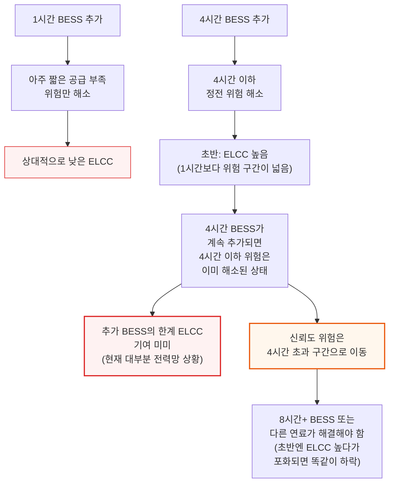
```mermaid
flowchart TD
    BESS1["1시간 BESS 추가"] --> Solve1["아주 짧은 공급 부족<br/>위험만 해소"]
    Solve1 --> Low1["상대적으로 낮은 ELCC"]

    BESS4["4시간 BESS 추가"] --> Solve4["4시간 이하<br/>정전 위험 해소"]
    Solve4 --> High4["초반: ELCC 높음<br/>(1시간보다 위험 구간이 넓음)"]
    High4 --> Saturate["4시간 BESS가<br/>계속 추가되면<br/>4시간 이하 위험은<br/>이미 해소된 상태"]
    Saturate --> LowMarginal["추가 BESS의 한계 ELCC<br/>기여 미미<br/>(현재 대부분 전력망 상황)"]
    Saturate --> Shift["신뢰도 위험은<br/>4시간 초과 구간으로 이동"]
    Shift --> Next["8시간+ BESS 또는<br/>다른 연료가 해결해야 함<br/>(초반엔 ELCC 높다가<br/>포화되면 똑같이 하락)"]

    style Low1 fill:#fef2f2,stroke:#dc2626
    style LowMarginal fill:#fef2f2,stroke:#dc2626,stroke-width:2px
    style Shift fill:#fff7ed,stroke:#ea580c,stroke-width:2px
```

재생에너지가 중요하지 않다는 뜻이 아닙니다. 여전히, 그리고 앞으로도 AI 인프라 구축의 중요한 한 축이지만 가장 중요한 축은 아니라는 것입니다. 요점은 명판 용량이 실제 확정 용량 기여도를 심하게 과장한다는 점입니다 — ELCC 기준으로 보면, 태양광·풍력·저장장치가 신규로 1GW씩 늘어날 때마다, 그 자원이 해결하던 위험이 이미 해소된 만큼 인정 비율이 가파르게, 그리고 계속 줄어듭니다. 명판 용량과 인정 용량 사이의 이 격차가 바로 한 시장이 실제로 얼마나 많은 신규 부하를 수용할 수 있는지를 결정합니다 — 다음 장에서 다룰 전력망 여유 용량(헤드룸)의 핵심 변수입니다.

---

## 5. 전력망 여유 용량 (헤드룸), 2027년 적자 전환: ICAP vs UCAP

**📌 핵심:**
- 헤드룸(전력망 여유 용량)은 "믿을 수 있는 공급(UCAP) − 최고 수요 − 필요 예비율"로 계산 → 이 값이 마이너스면 정전 위험 없이는 새 데이터센터를 수용할 수 없음
- PJM의 **2027/2028년 경매**에서 실제 예비율은 **14.4%**로, 목표치 20%에 약 **6,517MW(UCAP 기준)** 못 미침 → NERC(북미 전력 신뢰도 기구)도 북미 23개 지역 중 **13곳**이 향후 10년 내 공급 부족 위험에 처했다고 경고
- 명판 용량 기준(ICAP, 통상 15\~20% 예비율 요구)으로 보면 아직 여유가 있어 보이지만, 화력발전 고장 위험과 재생에너지·배터리의 ELCC 할인까지 반영한 **UCAP 기준으로 보면 이미 적자** → 두 기준의 차이가 클수록 "숫자상 여유"와 "실제 여유" 사이 괴리가 커짐
- 결론: UCAP 기준으로 전력망이 이미 적자에 들어선 지역이 늘고 있고, 그 시점이 바로 **2027년** → 그 이후 신규 대형 부하는 전력망만으로는 확보가 어려워짐

---

헤드룸(전력망 여유 용량)은 전력망이 자기 최고 수요와 필요 예비율을 채우고 남는, 새 부하를 받아들일 수 있는 용량입니다. SemiAnalysis는 각 ISO와 대형 비-ISO 시장의 지역 확정 공급과 예비율 요건을 바탕으로, 이 헤드룸을 하위 권역 단위로 모델링합니다. 헤드룸은 시장의 예비율이 목표치 아래로 떨어지는 순간 "적자(red)"로 전환됩니다 — 이 시점부터는 신뢰도를 깎지 않고는 데이터센터 같은 신규 대형 부하를 추가로 받을 여유 확정 용량이 없다는 뜻입니다. SemiAnalysis 분석에 따르면, 점점 더 많은 하위 권역이 **2027년까지** 이 문턱을 넘어섭니다.

헤드룸 계산 자체는 근본적으로 단순합니다: **총 인정 공급 − 최고 수요 − 필요 예비율**. 이 긴장은 PJM만의 문제가 아니라는 점은 아래 다이어그램에서 확인할 수 있습니다. 필요 예비율은 지역에 따라 전력망 계획 당국 또는 수직 통합 유틸리티가 정하는 규제적 수치로, 연도별로 바뀔 수 있지만 대체로 안정적으로 유지됩니다.

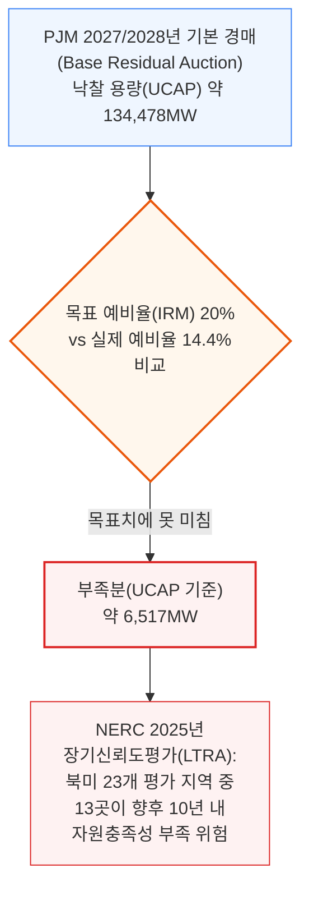
```mermaid
flowchart TD
    Auction["PJM 2027/2028년 기본 경매<br/>(Base Residual Auction)<br/>낙찰 용량(UCAP) 약 134,478MW"] --> Compare{"목표 예비율(IRM) 20%<br/>vs 실제 예비율 14.4%<br/>비교"}
    Compare -->|"목표치에 못 미침"| Shortfall["부족분(UCAP 기준)<br/>약 6,517MW"]
    Shortfall --> NERC["NERC 2025년<br/>장기신뢰도평가(LTRA):<br/>북미 23개 평가 지역 중<br/>13곳이 향후 10년 내<br/>자원충족성 부족 위험"]

    style Auction fill:#eff6ff,stroke:#3b82f6
    style Compare fill:#fff7ed,stroke:#ea580c,stroke-width:2px
    style Shortfall fill:#fef2f2,stroke:#dc2626,stroke-width:2px
    style NERC fill:#fef2f2,stroke:#dc2626
```

예비율에는 보통 두 가지 기준이 있습니다.

- **ICAP(Installed Capacity, 설비용량) 예비율**: ICAP는 명판 용량의 대용치입니다. ISO 전반에 걸쳐 흔한 요구 수준은 ICAP 기준 예비율 15\~20%입니다. 예를 들어 PJM은 "10년에 한 번" 정전 위험을 허용하는 LOLE(Loss-of-Load-Expectation) 기준에 맞춰 설비 규모를 정하는데, 현재 이는 약 20%의 설비예비율목표(IRM)에 해당합니다.
- **UCAP(Unforced Capacity, 인정 용량) 예비율**: 진짜 헤드룸 계산에 가장 중요하지만, 동시에 ISO·유틸리티의 정책에 따라 왜곡될 수도 있는 기준입니다. 실제로 헤드룸이 먼저 적자로 전환되는 것도 ICAP가 아니라 UCAP 기준입니다 — 왜 그런지는 아래 다이어그램에서 보여줍니다.

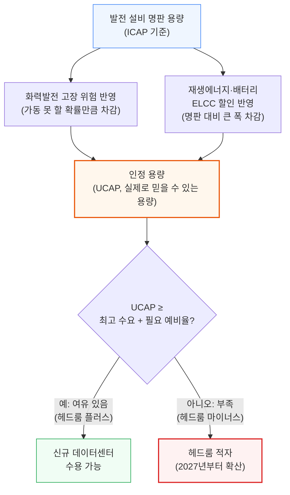
```mermaid
flowchart TD
    Nameplate["발전 설비 명판 용량<br/>(ICAP 기준)"] --> Derate1["화력발전 고장 위험 반영<br/>(가동 못 할 확률만큼 차감)"]
    Nameplate --> Derate2["재생에너지·배터리<br/>ELCC 할인 반영<br/>(명판 대비 큰 폭 차감)"]
    Derate1 --> UCAP["인정 용량<br/>(UCAP, 실제로 믿을 수 있는 용량)"]
    Derate2 --> UCAP
    UCAP --> Compare{"UCAP ≥<br/>최고 수요 + 필요 예비율?"}
    Compare -->|"예: 여유 있음<br/>(헤드룸 플러스)"| Green["신규 데이터센터<br/>수용 가능"]
    Compare -->|"아니오: 부족<br/>(헤드룸 마이너스)"| Red["헤드룸 적자<br/>(2027년부터 확산)"]

    style Nameplate fill:#eff6ff,stroke:#3b82f6
    style UCAP fill:#fff7ed,stroke:#ea580c,stroke-width:2px
    style Red fill:#fef2f2,stroke:#dc2626,stroke-width:2px
    style Green fill:#f0fdf4,stroke:#16a34a
```

**📌 용어 풀이: ICAP vs UCAP**
> - **ICAP (설비용량)**: 발전기 명판 용량 그대로 세는 "겉보기 예비율" — 고장 위험이나 재생에너지 할인을 반영하지 않음
> - **UCAP (인정 용량)**: 화력발전 고장 확률과 재생에너지·저장장치의 ELCC 할인을 모두 반영한 "실제로 믿을 수 있는 예비율"
> - **관계**: 같은 발전 설비라도 ICAP 기준 예비율은 넉넉해 보여도, UCAP 기준으로 보면 이미 적자인 경우가 많음 — 왜냐하면 ICAP는 "지어놓은 만큼" 세지만 UCAP는 "정전 없이 실제로 쓸 수 있는 만큼"만 세기 때문
> - **쉬운 비유**: ICAP는 통장 잔고 전체, UCAP는 당장 인출 가능한 금액에 가까움

다만 실제 헤드룸을 정확히 추정하는 일은 이보다 더 복잡합니다. 유틸리티 스스로도 자기 헤드룸을 제대로 파악하지 못하는 경우가 많고, 가장 뛰어난 데이터센터 개발사들은 이런 환경에서도 "숨어 있는" 헤드룸을 찾아내 성공적으로 확보하기도 합니다. 이 주제는 향후 딥다이브에서 더 깊이 다룰 예정입니다.

---

## 6. BTM (자가발전)이 전력망 연결을 이기는 이유: 속도와 확실성

**📌 핵심:**
- BTM(자가발전)은 전력망 연결 대비 확실한 속도 우위: BTM은 **2027\~2028년 가동**을 목표로 잡을 수 있지만, 전력망 연결은 걸핏하면 **2030년으로** 밀림 → 일정을 유틸리티가 아니라 구매자 자신이 통제한다는 점이 핵심
- AI 랩(OpenAI, Anthropic 등)에게 전력 비용은 전체 원가에서 미미한 비중 → 반면 **1GW를 확보하면 연간 수백억 달러 규모 매출**이 걸려 있어, 몇 년 지연될 위험을 감수할 이유가 없음
- 예전에는 안정성을 위해 발전기+배터리로 **파이브 나인(99.999%, 연간 다운타임 약 5분)**까지 갖췄지만, Meta 등은 이제 **투 나인(99%, 연간 다운타임 약 87시간)**까지 기준을 낮춤 → 발전기 없이도 되는 부지가 늘며 BTM 비용 장벽이 낮아짐
- 결론: 전력망이 못 미더운 지금, AI 랩은 "속도"와 "확실성"을 위해 다소 낮은 안정성을 감수하고 BTM을 선택 → 이것이 BTM이 전력망을 이기는 근본 이유

---

전력망 공급이 구조적으로 제약된 상황 — 확정 용량도 부족하고, 재생에너지·저장장치의 유효 기여도도 낮고, 헤드룸도 사라지고 있는 상황 — 에서는 결정이 구매자에게 넘어옵니다. 그리고 이제는 BTM이 가장 매력적인 선택지라는 게 SemiAnalysis의 판단입니다. 다소 의외로 들릴 수 있지만, 이 판단은 전력 수요의 근본 동인인 AI 랩의 행태에 근거합니다. OpenAI, Anthropic 같은 회사들이 이제 수요의 대부분을 차지하며, Amazon·Microsoft·Oracle 같은 회사가 짓는 데이터센터 용량의 상당 부분도 직간접적으로 이들이 대표합니다.

BTM이 전력망 연결 대비 갖는 핵심 우위는 **속도와 일정의 확실성**입니다. 앞서 설명했듯 유틸리티가 제시하는 일정은 신뢰하기 어렵고, 데이터센터 운영사에 약속했던 부하 공급 시점을 별다른 위약금 없이 미루거나 축소하는 경우가 흔합니다. AI 랩에게는 이 방식이 통하지 않는 이유는 이들의 비용·매출 구조에 있습니다.

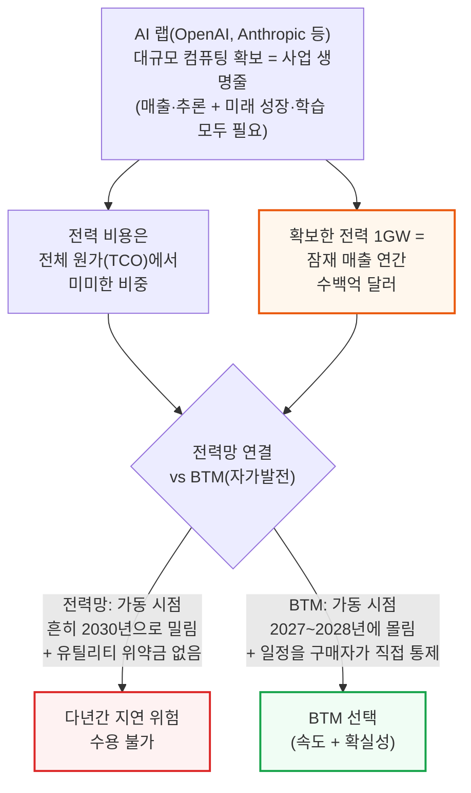
```mermaid
flowchart TD
    Buyer["AI 랩(OpenAI, Anthropic 등)<br/>대규모 컴퓨팅 확보 = 사업 생명줄<br/>(매출·추론 + 미래 성장·학습 모두 필요)"] --> Cost["전력 비용은<br/>전체 원가(TCO)에서<br/>미미한 비중"]
    Buyer --> Revenue["확보한 전력 1GW =<br/>잠재 매출 연간<br/>수백억 달러"]
    Cost --> Decision{"전력망 연결<br/>vs BTM(자가발전)"}
    Revenue --> Decision
    Decision -->|"전력망: 가동 시점<br/>흔히 2030년으로 밀림<br/>+ 유틸리티 위약금 없음"| GridCon["다년간 지연 위험<br/>수용 불가"]
    Decision -->|"BTM: 가동 시점<br/>2027~2028년에 몰림<br/>+ 일정을 구매자가 직접 통제"| BTMChoice["BTM 선택<br/>(속도 + 확실성)"]

    style Revenue fill:#fff7ed,stroke:#ea580c,stroke-width:2px
    style GridCon fill:#fef2f2,stroke:#dc2626,stroke-width:2px
    style BTMChoice fill:#f0fdf4,stroke:#16a34a,stroke-width:2px
```

BTM 대 전력망 논쟁에서 또 다른 핵심 변수는 백업 장비 수준(redundancy)과 가동률입니다 — 역사적으로 전력망 연결이 갖는 주요 강점이었습니다. 하지만 AI 랩과 일부 초대형 클라우드 사업자는 이 요구 수준을 완화하면서, BTM 도입의 기존 비용 장벽이 무너지고 있습니다.

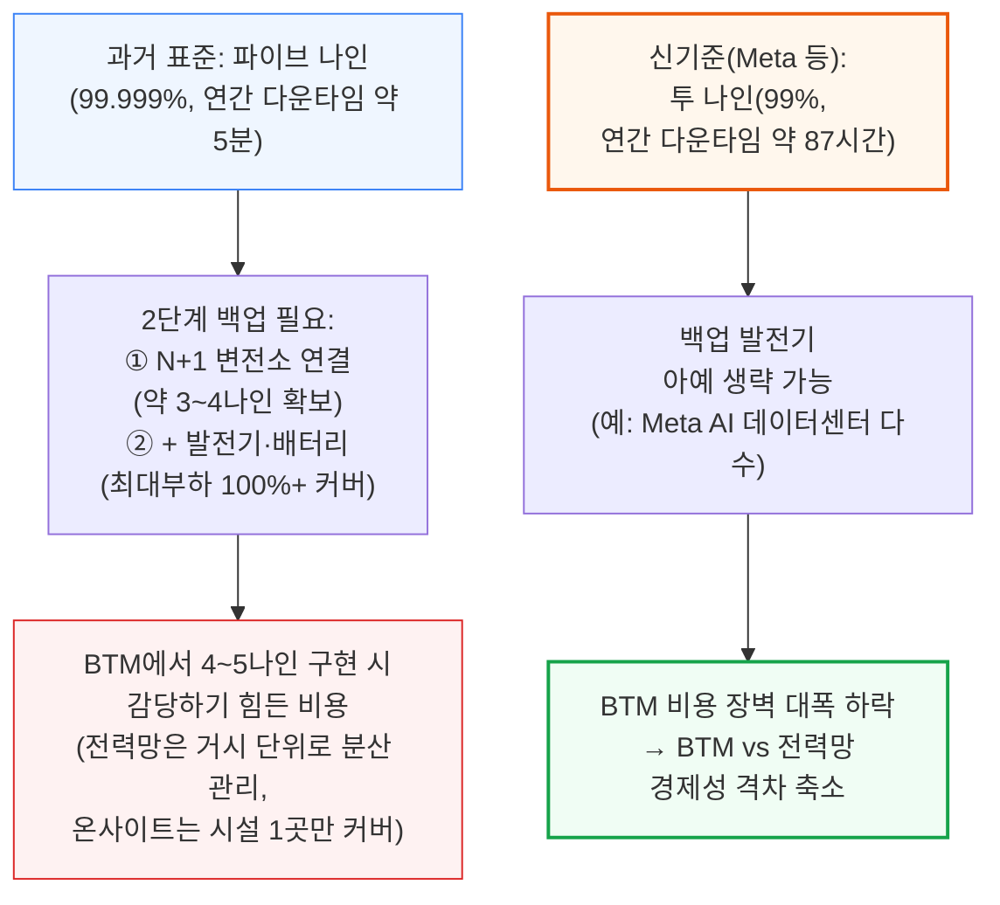
```mermaid
flowchart TD
    Old["과거 표준: 파이브 나인<br/>(99.999%, 연간 다운타임 약 5분)"] --> OldMethod["2단계 백업 필요:<br/>① N+1 변전소 연결<br/>(약 3~4나인 확보)<br/>② + 발전기·배터리<br/>(최대부하 100%+ 커버)"]
    OldMethod --> HighCost["BTM에서 4~5나인 구현 시<br/>감당하기 힘든 비용<br/>(전력망은 거시 단위로 분산 관리,<br/>온사이트는 시설 1곳만 커버)"]

    New["신기준(Meta 등):<br/>투 나인(99%,<br/>연간 다운타임 약 87시간)"] --> NoGenset["백업 발전기<br/>아예 생략 가능<br/>(예: Meta AI 데이터센터 다수)"]
    NoGenset --> LowCost["BTM 비용 장벽 대폭 하락<br/>→ BTM vs 전력망<br/>경제성 격차 축소"]

    style Old fill:#eff6ff,stroke:#3b82f6
    style HighCost fill:#fef2f2,stroke:#dc2626
    style New fill:#fff7ed,stroke:#ea580c,stroke-width:2px
    style LowCost fill:#f0fdf4,stroke:#16a34a,stroke-width:2px
```

**📌 용어 풀이: 나인(Nines) 표기**
> - 가동률(가동시간 비율)을 소수점 9의 개수로 표현하는 업계 관행
> - 쓰리 나인(99.9%) = 연간 약 8.8시간 다운타임, 포 나인(99.99%) = 약 53분, 파이브 나인(99.999%) = 약 5분
> - 투 나인(99%)은 연간 약 87시간(약 3.6일) 다운타임까지 허용한다는 뜻

다만 실제 관행은 다양합니다 — 일부 운영사는 BTM에서 전력망 연결(FTM)로 넘어가는 브릿지 구축 단계에서 발전기를 추가하지만, 전력망 연결형 데이터센터에서는 발전기를 아예 생략하는 경우가 많습니다.

발전기 추가가 합리적인 경우는, 가까운 미래에 전력망 연결을 계획하고 있어 발전 장비를 다른 곳에 재배치할 수 있거나, 전력망 연결형 BTM(하이브리드) 구조를 검토 중일 때(7장에서 자세히 다룹니다)입니다. 대부분의 BTM 부지는 영구 섬처럼 남을 계획이 아니라 계통연계 대기열이 풀릴 때까지의 다리 역할이며, 대기열이 오래 남을 것으로 예상될 때의 비용 계산은 아래와 같습니다. 다만 실제 다운타임을 지배하는 것은 전원 자체의 정전이 아니라 사람의 실수와 복구 시간이기 때문에, 발전기를 추가해도 얻는 가치는 제한적입니다.

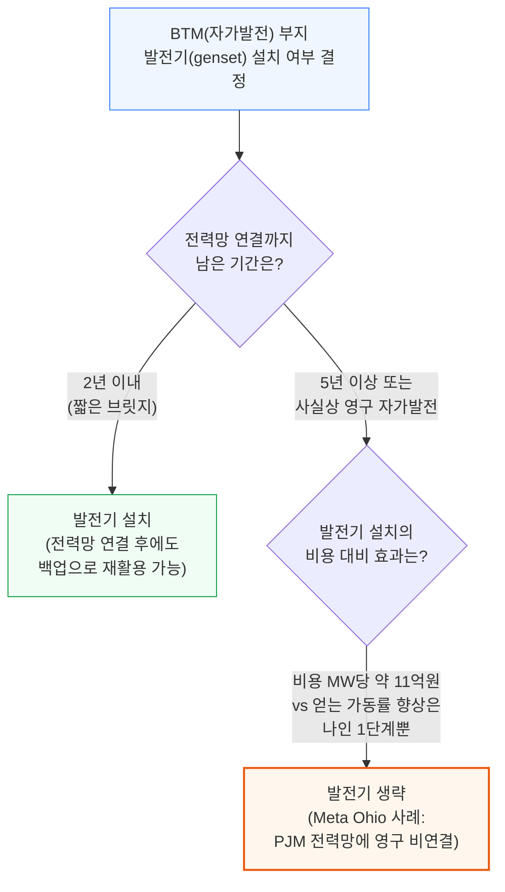
```mermaid
flowchart TD
    Start["BTM(자가발전) 부지<br/>발전기(genset) 설치 여부 결정"] --> Q1{"전력망 연결까지<br/>남은 기간은?"}
    Q1 -->|"2년 이내<br/>(짧은 브릿지)"| Short["발전기 설치<br/>(전력망 연결 후에도<br/>백업으로 재활용 가능)"]
    Q1 -->|"5년 이상 또는<br/>사실상 영구 자가발전"| Long{"발전기 설치의<br/>비용 대비 효과는?"}
    Long -->|"비용 MW당 약 11억원<br/>vs 얻는 가동률 향상은<br/>나인 1단계뿐"| Skip["발전기 생략<br/>(Meta Ohio 사례:<br/>PJM 전력망에 영구 비연결)"]

    style Start fill:#eff6ff,stroke:#3b82f6
    style Short fill:#f0fdf4,stroke:#16a34a
    style Skip fill:#fff7ed,stroke:#ea580c,stroke-width:2px
```

결국 판단은 입주사의 설계 요구사항, SLA(서비스 수준 계약), 그리고 해당 부지가 전력망 없이 얼마나 오래 운영될 것으로 예상하는지에 달려 있습니다. SemiAnalysis가 확인한 실제 패턴은 다음과 같습니다: BTM이 짧은 다리 역할(계통연계까지 2년 이내)일 때는 초기 건설·프로젝트 금융 단계에서부터 발전기를 사양에 포함하는 경향이 있습니다 — 전력망 가동과 그 이후의 백업 역할이 머지않았기 때문입니다. 반대로 훨씬 오래, 혹은 사실상 영구적으로 전력망 없이 운영될 것으로 예상되는 부지는 이 논리가 약해집니다 — 주력 온사이트 발전이 이미 자체 백업까지 갖추고 부하를 감당하므로, 수년간 놀리게 될 전력망 백업 설비는 투자를 미뤄도 되는 항목이 됩니다. Meta가 가장 명확한 사례입니다 — Meta의 오하이오 캠퍼스는 PJM 전력망에 아예 연결하지 않도록 설계되었고, 엘패소·루이지애나 부지는 근시일 내 계통연계가 아니라 전용 유틸리티급 가스 발전을 중심으로 지어졌습니다(자료: Meta Prometheus 데이터센터에는 발전기가 없음, SemiAnalysis Industrials Model). Cipher의 AWS 임차 Black Pearl 부지, Fluidstack의 여러 프로젝트도 비슷하게 전력망 백업용 발전기 설치 자체를 미루거나 생략하는 것으로 파악됩니다.

이것이 전력망이 무의미해졌다거나, 데이터센터의 가동률·신뢰도 요구가 더는 중요하지 않다는 뜻은 아닙니다. 오히려 이는 시장 참여자들이 AI 데이터센터의 폭발적인 전력 수요에 맞춰 어떻게 적응하고 있는지를 보여줍니다 — 갈 곳이 마땅치 않은 입주사들이 점점 더 이런 요구 수준에 관대해지고 있다는 것이 SemiAnalysis의 시각입니다.

### 그 밖의 대안: 이번 리포트의 범위 밖

전력망이 더 많은 데이터센터 부하 성장을 흡수할 수 있게 하는 유망한 대안도 여럿 있으며, 이것이 모두에게 가장 좋은 결과(더 낮은 전력 비용과 더 높은 신뢰도)라고 SemiAnalysis는 보고 있습니다. 다만 이번 리포트의 범위 밖이라 짧게만 짚습니다.

- **부하 유연화(Load Flexibility)**: 전력망 연결형 데이터센터가 연간 정해진 시간만큼 부하를 줄일 수 있다면 수십 GW를 쉽게 풀어낼 수 있습니다. PJM은 이를 워크로드 이전, 온사이트 백업 발전 가동, 배터리 방전 등으로 구체화하며, 이것이 신규 발전과 공급망이 계통연계 대기열을 통과할 때까지의 간극을 메울 수 있다고 보고 있습니다 — 단, 비상시 수동 조치가 아니라 시장 운영(dispatch)에 통합돼야 한다는 전제입니다. 다만 상업적·규제적 제약 때문에 폭넓은 도입은 당분간 더디게 진행될 것으로 SemiAnalysis는 조심스럽게 전망합니다.
- **계통연계 대기열·시장 인센티브 개혁**: 전력 확충에 더 시장 친화적인 접근을 취하면 유틸리티의 위험 감수 행태를 자극할 수 있지만, 일반 가정 보호와 AI 성장에 대한 방향성 베팅 사이에서 균형을 잡기가 매우 어렵습니다. 다만 초기 개혁 신호는 있습니다: FERC는 수요 측면에서 먼저 움직여, 2025년 12월 명령으로 PJM에 발전소 부지 데이터센터를 위한 명확한 공동입지 규칙과 신규 송전 서비스를 만들도록 지시했고, DOE(에너지부) 지시에 따라 20MW 초과 대형 부하의 신속 계통연계에 관한 규칙 제정(Docket RM26-4)도 개시했습니다. PJM의 요금 체계도 뒤따랐습니다: 2026년 6월 12일 FERC는 약 10개월짜리 단축형 발전기 계통연계 심사 절차인 **EIT(Expedited Interconnection Track)**를 신설하는 PJM의 개정안을 승인했습니다 — 2027/2028년 기본 경매가 PJM의 신뢰도 요구치보다 약 6.6GW 부족하게 마감된 데 대응한 조치입니다. ERCOT의 배치(batch) 방식 대형 부하 계통연계 절차 전환도 비슷한 시도입니다.
- **송전망 재투자**: 송전을 더 지으면 발전과 부하 성장 모두를 가능케 할 수 있지만, 이 시장은 여전히 과도하게 규제돼 있고 속도가 느립니다. 2030년대에는 최대 전력 오프테이커들이 부모회사 보증을 설 수 있을 만큼 신용도가 높아지면서 대규모 송전망 재투자가 본격화될 것으로 예상되지만, 지금 당장은 신규 대형 송전망 건설이 AI 구축 속도에 비해 너무 느립니다. 실제로 이 정도 규모의 부하 성장을 물리적으로 뒷받침할 수 있는 미국 송전 회랑은 손에 꼽을 정도이며, NERC 신뢰도 요건을 필요한 일정 안에 충족하는 것 자체가 이미 구속력 있는 제약입니다.

---

## 7. ERCOT의 하이브리드 구조: BTM과 전력망을 잇는 다리

**📌 핵심:**
- ERCOT(텍사스 전력망)는 데이터센터처럼 초대형 전력을 쓰는 시설을 심사하는 새 절차(**Batch Zero**)를 **2026년 7월 11일**부터 시행 → 핵심은 "전력망에서 얼마나 끌어써도 되는지"를 뜻하는 인출 한도 하나로 모든 구조를 정리
- 전력 조달 방법은 두 가지: 이미 있던 발전기를 옆에 붙이는 **NMA**(순계량 방식, 2025년 9월 1일 이전 가동 발전기만 해당), 새 발전기를 직접 지어 조달하는 **BYOG**(자체 발전설비 조달)
- 전력망 연결 방법은 세 가지: 부지 전체를 한 계량점으로 묶는 **PUN**, 여기에 전력망 인출 상한을 추가로 건 **WLPUN**(예: 1,000MW 부지가 전력망에서는 100MW만 인출), 자체 발전 없이 혼잡 시 실시간으로 사용량을 줄여주는 조건으로 빨리 연결해주는 **PCLR**
- 결론: 지금까지 알려진 텍사스 공동입지 프로젝트만 약 **2,885MW**(Crusoe, AWS, CyrusOne 등) → 기존 발전기를 활용하는 NMA 방식이 대다수를 차지하며 가장 빠르게 확산 중

---

한정된 전력망 헤드룸에 대응하기 위해, 시장은 온사이트 발전과 전력망 접속을 함께 유지하는 하이브리드 구조들을 점점 폭넓게 채택하고 있습니다 — 특히 텍사스(ERCOT)에서 이런 거래와 관심이 집중되고 있습니다. 연방 차원의 FERC와 텍사스의 ERCOT·PUCT(텍사스주 공공시설위원회)가 각각 빠르게 규칙을 정비하고 있습니다.

ERCOT에서는 **Batch Zero** 절차가 이런 구조들을 코드화하고 있습니다. 핵심은 모든 대형 부하에 대해 정하는 단일 숫자 — **최대 인출 한도(maximum withdrawal limit)**, 즉 온사이트 발전과 무관하게 그 부지가 전력망에서 끌어쓸 수 있는 양 — 입니다. 이를 규율하는 프레임워크(NPRR1325와 PGRR145)는 2026년 6월 1일 ERCOT 이사회가 승인했으며, 기존에 오래 자리 잡은 **PUN(사설 전력망)**에 더해 두 가지 신규 구조를 추가했습니다. 아래에서 조달 방식과 계량·연결 방식을 나눠 살펴보겠습니다.

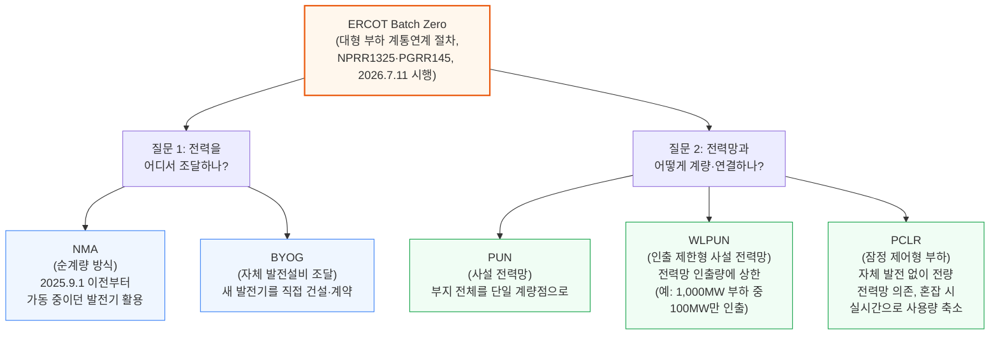
```mermaid
flowchart TD
    Batch["ERCOT Batch Zero<br/>(대형 부하 계통연계 절차,<br/>NPRR1325·PGRR145, 2026.7.11 시행)"] --> Q1["질문 1: 전력을<br/>어디서 조달하나?"]
    Batch --> Q2["질문 2: 전력망과<br/>어떻게 계량·연결하나?"]

    Q1 --> NMA["NMA<br/>(순계량 방식)<br/>2025.9.1 이전부터<br/>가동 중이던 발전기 활용"]
    Q1 --> BYOG["BYOG<br/>(자체 발전설비 조달)<br/>새 발전기를 직접 건설·계약"]

    Q2 --> PUN["PUN<br/>(사설 전력망)<br/>부지 전체를 단일 계량점으로"]
    Q2 --> WLPUN["WLPUN<br/>(인출 제한형 사설 전력망)<br/>전력망 인출량에 상한<br/>(예: 1,000MW 부하 중<br/>100MW만 인출)"]
    Q2 --> PCLR["PCLR<br/>(잠정 제어형 부하)<br/>자체 발전 없이 전량<br/>전력망 의존, 혼잡 시<br/>실시간으로 사용량 축소"]

    style Batch fill:#fff7ed,stroke:#ea580c,stroke-width:2px
    style NMA fill:#eff6ff,stroke:#3b82f6
    style BYOG fill:#eff6ff,stroke:#3b82f6
    style PUN fill:#f0fdf4,stroke:#16a34a
    style WLPUN fill:#f0fdf4,stroke:#16a34a
    style PCLR fill:#f0fdf4,stroke:#16a34a
```

### 전력 조달 방식: NMA vs BYOG

두 방식을 가르는 결정적 기준은 발전기가 "이미 있었는가, 새로 짓는가"입니다. 이 차이가 심사 절차와 가동 방식까지 다르게 만듭니다.

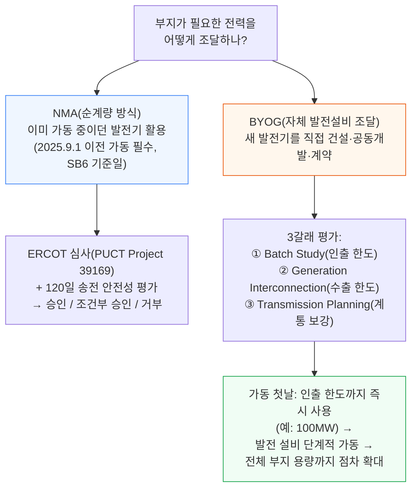
```mermaid
flowchart TD
    Q["부지가 필요한 전력을<br/>어떻게 조달하나?"] --> NMA["NMA(순계량 방식)<br/>이미 가동 중이던 발전기 활용<br/>(2025.9.1 이전 가동 필수, SB6 기준일)"]
    Q --> BYOG["BYOG(자체 발전설비 조달)<br/>새 발전기를 직접 건설·공동개발·계약"]

    NMA --> NMAProcess["ERCOT 심사(PUCT Project 39169)<br/>+ 120일 송전 안전성 평가<br/>→ 승인 / 조건부 승인 / 거부"]
    BYOG --> BYOGProcess["3갈래 평가:<br/>① Batch Study(인출 한도)<br/>② Generation Interconnection(수출 한도)<br/>③ Transmission Planning(계통 보강)"]
    BYOGProcess --> Ramp["가동 첫날: 인출 한도까지 즉시 사용<br/>(예: 100MW) →<br/>발전 설비 단계적 가동 →<br/>전체 부지 용량까지 점차 확대"]

    style NMA fill:#eff6ff,stroke:#3b82f6
    style BYOG fill:#fff7ed,stroke:#ea580c
    style Ramp fill:#f0fdf4,stroke:#16a34a
```

**📌 용어 풀이: NMA (Net-Metering Arrangement, 순계량 방식)**
> - 이미 가동 중이던 발전기를 신규 대형 부하 옆에 공동입지시켜, 그 부하가 온사이트 발전량을 넘어서 쓰는 만큼(잔여분)만 단일 계량기를 통해 전력망과 정산하고, 남는 발전량은 전력망으로 수출
> - 결정적 조건은 "연식"입니다: 텍사스 SB6(상원법안 6호)의 법적 기준일인 **2025년 9월 1일 이전**부터 가동 중이던 발전기여야 NMA로 인정
> - 이 조건 때문에 ERCOT의 순계량 방식 심사 절차(PUCT Project 39169)와 120일짜리 송전 안전성 평가 대상이 됨. ERCOT는 그 발전 용량을 전력망에서 빼내 부하에 재배정했을 때의 계통 영향을 심사하고, PUCT(텍사스주 공공시설위원회)는 승인·거부·조건부 승인(예: 전력망 비상시 부하 감축 의무, 또는 전력망이 빠듯할 때 발전기가 용량을 내놓도록 요구)을 결정
> - 핵심 질문은 "이미 존재하고 전력망을 지원해 온 발전을 민간 부하로 돌렸을 때, 나머지 시스템이 온전한가"

**📌 용어 풀이: BYOG (Bring Your Own Generation, 자체 발전설비 조달)**
> - 전력망 증설을 기다리는 대신, 대형 부하가 직접 새 발전 설비를 짓거나 공동개발하거나 계약해 근시일 내 가동 경로를 확보하는 방식
> - ERCOT는 이를 세 갈래로 나눠 평가: **Batch Study**(온사이트 발전과 무관하게 부지가 끌어쓸 수 있는 인출 한도 산정), **Generation Interconnection**(온사이트 발전이 전력망으로 되돌려 보낼 수 있는 수출 한도 산정), **Transmission Planning**(필요한 계통 보강 파악)
> - 부지가 실제로 쓸 수 있는 부하는 "인출 한도 + 가용 온사이트 발전량"이며, 계통 안정성 한도 안에서 단계적으로 가동됩니다: 첫날부터 인출 한도(예: 100MW)까지는 즉시 쓰고, 발전 설비가 하나씩 가동될 때마다 전체 용량까지 점차 늘려감
> - NMA와의 차이는 범주와 연식입니다 — BYOG는 "새 발전을 추가"하는 방식이며, 그 발전이 신규이기 때문에 SB6의 순계량 심사 대상에서 제외됨

### 계량·연결 방식: PUN, WLPUN, PCLR

**PUN(Private Use Network, 사설 전력망)**은 캠퍼스 전체 — 부하와 온사이트 발전 모두 — 를 단일 계통연계 지점(POI) 뒤에 두어, ERCOT가 개별 자원이 아니라 부지의 순 노출분만 계량하도록 하는 구조입니다. 이를 기반으로 Batch Zero는 두 가지 신규 구조를 추가했습니다.

**📌 용어 풀이: WLPUN (Withdrawal-Limited Private Use Network, 인출 제한형 사설 전력망)**
> - 새 발전을 직접 짓는 부하가, 전력망 인출량에 강제 상한을 거는 대가로 송전망만으로는 감당 못 할 더 많은 메가와트를 연결할 수 있게 하는 구조
> - 예: 1,000MW 부하가 전력망에서는 절대 100MW를 넘게 끌어쓰지 않고, 나머지는 온사이트 발전에 기대며, 남는 발전량은 SCED(경제급전)를 통해 수출
> - ERCOT는 이것이 "더 빠른 계통연계"가 아니라, 기존 송전 한도 안에서 원하는 부하의 더 많은 부분을 더 빨리 가동시키는 방법이라고 명확히 밝힘

**📌 용어 풀이: PCLR (Provisional Controllable Load Resource, 잠정 제어형 부하)**
> - 온사이트 발전이 필요 없는, 디스패치 가능하고 유연한 부하
> - 요청한 규모 전체로 연결되지만, ERCOT가 송전 제약 시 실시간으로 부하를 낮출 수 있음(예: 150MW 부하가 100MW로 축소)
> - 송전망이 보강되면서 이 상한은 정해진 종료일을 향해 점차 완화됨 → PCLR을 "확정 용량으로 가는 명시적 다리(bridge-to-firm)" 경로로 만드는 특징

### 텍사스 공동입지 거래 사례

ERCOT 공동입지 활동으로 지금까지 발표된 프로젝트의 대다수는 기존 발전을 활용하는 NMA 방식에 속합니다. 아래는 알려진 데이터센터 사례 몇 가지로, 공동입지 부문에서만 약 **2,885MW**가 보고되어 있으며 이 밖에도 더 있을 가능성이 있습니다.

| 기업 | 방식 | 규모 | 세부 내용 |
|---|---|---|---|
| Crusoe – Goodnight 캠퍼스 | NMA | 525.5MW 공동입지(265.5MW + 260MW), \~1GW IT 캠퍼스 목표 | TCEQ(텍사스 환경품질위원회) 대기배출 허가 신청 최대 933MW 규모 가스 발전, 그중 약 665MW는 GE Vernova LM2500 터빈 19기(기당 약 35MW)로 추정 |
| AWS – Comanche Peak | NMA | 1,200MW 공동입지 | Vistra의 Comanche Peak 원전(서머벨 카운티) 옆, 20년 전력구매계약(PPA), 2032년까지 전량 가동으로 램프업 |
| CyrusOne – Thad Hill Energy Center | NMA | 총 400MW(1단계 190MW + 2단계 210MW) | Calpine의 Thad Hill 발전소(보스크 카운티) 옆 |
| CyrusOne/Constellation – Freestone Energy Center | NMA | 최대 760MW(계약 380MW + 2단계 380MW 옵션) | Calpine/Constellation 소유 발전소 활용 |

---

## 8. BTM 부상의 승자와 패자

**📌 핵심:**
- GE Vernova(GEV)·Siemens Energy·MHI(미쓰비시중공업)는 대형 가스터빈 매출 대부분이 전력망용 발전소 수주에서 나옴 → 전력망 신규 가스 발주가 2028년 이후 정체될 전망이라 **2026년이 이들 터빈 수주의 정점**이 될 가능성
- 반면 자가발전(BTM)용 소형·고속 설비를 만드는 **Bloom Energy·INNIO·Wärtsilä·Bergen Engines**는 2028년 가동을 목표로 하는 데이터센터 수요를 흡수하며 수혜
- 텍사스(ERCOT)에서는 **NRG Energy**가 보유한 가스터빈을 활용해 최대 **5.4GW** 규모의 BYOG(자체 발전설비 조달) 거래를 준비 중 → 성사되면 연간 EBITDA 약 **25억 달러** 기여 전망(10\~20년 장기계약 기준)
- 결론: 전력망 대형 터빈 3사(GEV·Siemens·MHI)는 상대적 열세, BTM 전문 소형 발전 업체(Bloom 등)와 텍사스 가스 보유 IPP(NRG)는 상대적 수혜

---

이제 승자와 패자를 살펴보겠습니다. GEV 같은 터빈 제조사, Bloom·INNIO 같은 연료전지·RICE 공급사, NRG 같은 독립발전사업자(IPP)를 다룹니다. SemiAnalysis는 2024년 12월 Core Research 구독자들에게 Bloom을 최대 수혜주로 처음 지목한 바 있습니다.

BTM 대 전력망 구도에서는 발전 장비 업체(OEM)별 포지셔닝을 이해하는 게 중요합니다. 한 달 전 SemiAnalysis Energy Model 리포트 "Grid Bad, BTM Good"은 GEV, Siemens Energy, MHI를 이 흐름의 핵심 패자로 지목했는데, 앞서 다룬 전력망 가스 명판 용량 예측 대부분을 바로 이 세 회사가 담당합니다.

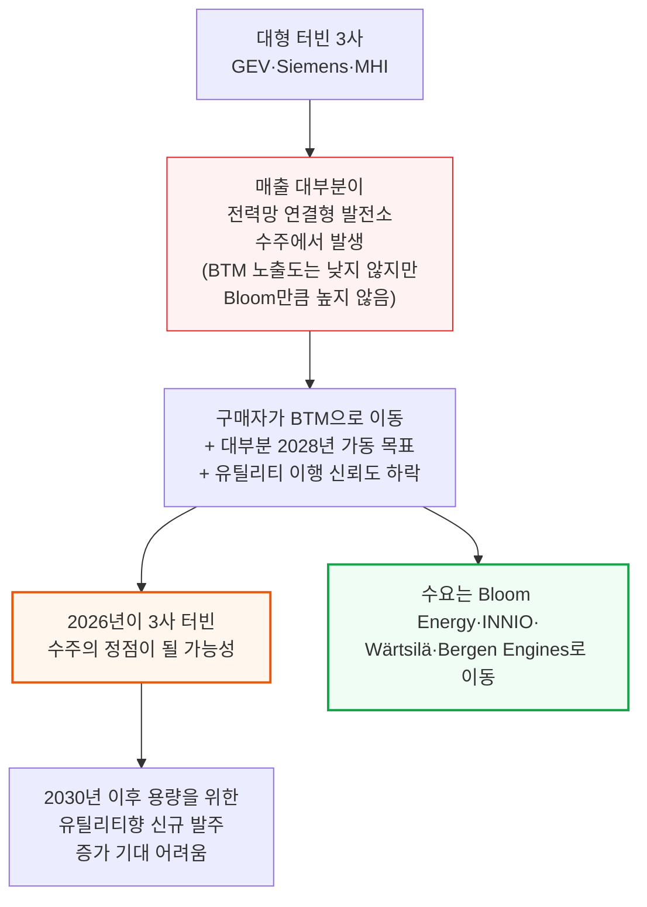
```mermaid
flowchart TD
    OEM["대형 터빈 3사<br/>GEV·Siemens·MHI"] --> Expose["매출 대부분이<br/>전력망 연결형 발전소<br/>수주에서 발생<br/>(BTM 노출도는 낮지 않지만<br/>Bloom만큼 높지 않음)"]
    Expose --> Shift["구매자가 BTM으로 이동<br/>+ 대부분 2028년 가동 목표<br/>+ 유틸리티 이행 신뢰도 하락"]
    Shift --> Peak["2026년이 3사 터빈<br/>수주의 정점이 될 가능성"]
    Peak --> Decline["2030년 이후 용량을 위한<br/>유틸리티향 신규 발주<br/>증가 기대 어려움"]
    Shift --> BTMOEM["수요는 Bloom Energy·INNIO·<br/>Wärtsilä·Bergen Engines로 이동"]

    style Expose fill:#fef2f2,stroke:#dc2626
    style Peak fill:#fff7ed,stroke:#ea580c,stroke-width:2px
    style BTMOEM fill:#f0fdf4,stroke:#16a34a,stroke-width:2px
```

"계약된 부하(contracted load)"의 급증이 지금까지 대규모 발주를 이끌어 왔지만, 여기에 앞서 다룬 자금 조달 어려움까지 겹치고 있습니다.

이는 전력망 제약과 전력 가격 상승에 노출된 Constellation(CEG)·Vistra·Talen(TLN) 같은 IPP에도 전반적으로 부정적입니다. 전력망 수요가 (상대적으로) 완화되고 BTM이 급증하면서, IPP는 부정적 영향에 노출됩니다. 다만 IPP 중에서도 ERCOT 쪽에는 흥미로운 기회가 보입니다.

### NRG: 잠재적 5.4GW ERCOT BYOG 플레이

ERCOT는 늘어나는 데이터센터 수요에 맞춰 헤드룸이 더 빠듯해질 것을 예상하고, BYOG 방식이 전력망에 연결될 수 있도록 제도적 기반을 마련하고 있는 것으로 보입니다. SemiAnalysis는 BYOG 기반 전력망 연결 구조를 앞으로 더 주목할 영역으로 보고 있으며, 향후 딥다이브에서 더 다룰 계획입니다.

SemiAnalysis는 NRG Energy가 ERCOT의 신규 BYOG/WLPUN 체계에서 수혜를 볼 유리한 위치에 있다고 봅니다.

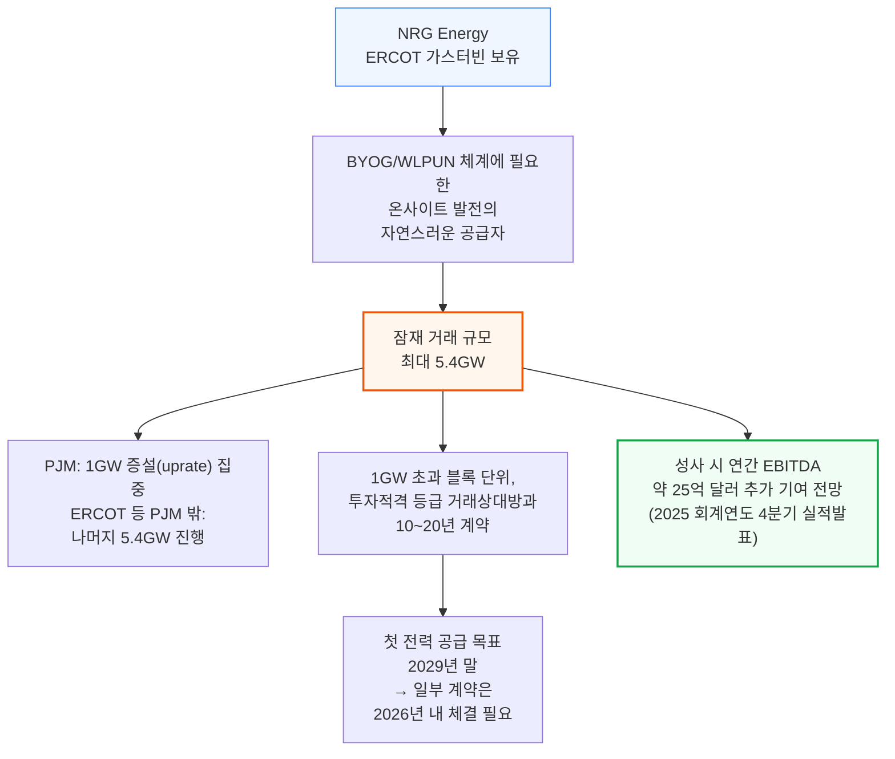
```mermaid
flowchart TD
    NRG["NRG Energy<br/>ERCOT 가스터빈 보유"] --> Fit["BYOG/WLPUN 체계에 필요한<br/>온사이트 발전의<br/>자연스러운 공급자"]
    Fit --> Deal["잠재 거래 규모<br/>최대 5.4GW"]
    Deal --> Split["PJM: 1GW 증설(uprate) 집중<br/>ERCOT 등 PJM 밖:<br/>나머지 5.4GW 진행"]
    Deal --> Terms["1GW 초과 블록 단위,<br/>투자적격 등급 거래상대방과<br/>10~20년 계약"]
    Terms --> First["첫 전력 공급 목표<br/>2029년 말<br/>→ 일부 계약은<br/>2026년 내 체결 필요"]
    Deal --> EBITDA["성사 시 연간 EBITDA<br/>약 25억 달러 추가 기여 전망<br/>(2025 회계연도 4분기 실적발표)"]

    style NRG fill:#eff6ff,stroke:#3b82f6
    style Deal fill:#fff7ed,stroke:#ea580c,stroke-width:2px
    style EBITDA fill:#f0fdf4,stroke:#16a34a,stroke-width:2px
```

참고로 최근 서부 텍사스에서 체결된 Microsoft-Chevron의 20년 계약(약 2.67GW 규모 Project Kilby)을 감안하면, NRG가 비슷한 장기·초대형 클라우드 앵커 고객 기반의 가스 거래를 성사시키지 못할 이유가 없다고 SemiAnalysis는 판단합니다. 다만 경영진은 여전히 전력망 연결형(front-of-the-meter) 발전을 단기 최우선 과제로 두고 있으며, 이는 최근 ERCOT의 PUN/BYOG 관련 결정들에서도 드러납니다.

> **Larry Coben — 2025 회계연도 4분기 실적발표, 2026년 2월 24일 (5.4GW의 지역 배분)**
> "적어도 초기에는 PJM에서 1GW 규모 증설(uprate)에 집중할 것 같습니다. 그게 더 빠르고 시장 진입도 빠르니까요. 수요는 텍사스에 있습니다. 만약 누군가 PJM에서 하길 원한다면 물론 그럴 유연성은 있지만, PJM에서는 1GW 증설에 집중하고 나머지 5.4GW는 PJM 밖에서 진행할 것 같습니다."

> **Larry Coben — 2025 회계연도 4분기 실적발표, 2026년 2월 24일 (거래 구조와 시점)**
> "1GW를 넘는 블록 단위를 보고 있습니다. 최소 10년, 흔히는 20년 계약을 투자적격 등급 회사들과 맺는 것을 보고 있습니다 — 이런 걸 실제로 가능하게 할 신용도를 뒷받침할 수 있는 곳들이죠. 계산은 여러분이 직접 해보실 수 있습니다. 마진도 알려드렸고, 용량 수치도 알려드렸으니까요. 첫 전력 공급은 2029년 말쯤 가능할 수 있고, 그 이후로는 매년 1GW씩, 어쩌면 그 이상씩 순차적으로 늘어날 것입니다."

> **Larry Coben — 2026 회계연도 1분기 사전 발언, 2026년 5월 6일 (SB6 / 배치 절차 속 BYOG)**
> "상원법안 6호(SB6)와 대형 부하 배치(Batch) 절차는 신규 수요가 전력망에 연결되는 방식에 더 많은 체계를 부여하고 있습니다. 저희는 이런 개혁을 지지합니다. PUCT와 ERCOT 팀이 초기 배치 절차에 BYOG(자체 발전설비 조달) 지원을 포함시켜 준 것에 특별히 감사드리고 싶습니다. 이는 신규 수요를 신규 공급과 맞추고 안정적인 시스템 성장을 뒷받침하는 중요한 진전입니다."

> **Rob Gaudette (사장 겸 CEO) — 2026 회계연도 1분기 실적발표, 2026년 5월 6일 (전력망 연결 우선 전략)**
> "저희의 최우선 과제는 전력망 연결형 발전, 전력망 연결형 데이터센터입니다. 그것이 시장에 옳은 방향이라고 믿기 때문입니다. 물론 모든 것을 살펴볼 것입니다. BTM(자가발전) 솔루션도 살펴볼 것이고, 모든 옵션을 다 검토할 것입니다. 다만 지금 저희가 나누고 있는 대화는 전력망 연결형 대화이고, 지난 12개월 동안 그래왔던 것처럼 순조롭게 진행되고 있습니다."
>
> "저는 전력망 연결형이 옳은 해법이라고 생각합니다. 저희는 이제 무언가를 빠르게 성사시킬 수 있는 단계에 와 있습니다."

### 승자·패자 요약

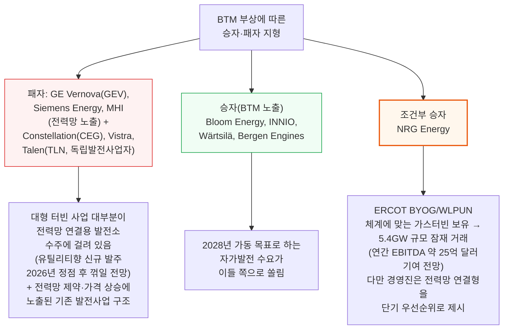
```mermaid
flowchart TD
    Landscape["BTM 부상에 따른<br/>승자·패자 지형"] --> Losers1["패자: GE Vernova(GEV),<br/>Siemens Energy, MHI<br/>(전력망 노출) +<br/>Constellation(CEG), Vistra,<br/>Talen(TLN, 독립발전사업자)"]
    Landscape --> Winners1["승자(BTM 노출)<br/>Bloom Energy, INNIO,<br/>Wärtsilä, Bergen Engines"]
    Landscape --> Cond["조건부 승자<br/>NRG Energy"]

    Losers1 --> Reason1["대형 터빈 사업 대부분이<br/>전력망 연결용 발전소<br/>수주에 걸려 있음<br/>(유틸리티향 신규 발주<br/>2026년 정점 후 꺾일 전망)<br/>+ 전력망 제약·가격 상승에<br/>노출된 기존 발전사업 구조"]
    Winners1 --> Reason2["2028년 가동 목표로 하는<br/>자가발전 수요가<br/>이들 쪽으로 쏠림"]
    Cond --> Reason4["ERCOT BYOG/WLPUN<br/>체계에 맞는 가스터빈 보유 →<br/>5.4GW 규모 잠재 거래<br/>(연간 EBITDA 약 25억 달러<br/>기여 전망)<br/>다만 경영진은 전력망 연결형을<br/>단기 우선순위로 제시"]

    style Losers1 fill:#fef2f2,stroke:#dc2626
    style Winners1 fill:#f0fdf4,stroke:#16a34a
    style Cond fill:#fff7ed,stroke:#ea580c,stroke-width:2px
```

---

*작성 진행률: 100% 완료*
*업데이트: 전체 8개 섹션 완료 (전력 공급 예측 방법론, 가스 발전 지연, ELCC, 헤드룸 적자, BTM 대 전력망 비교, ERCOT 하이브리드 구조, 승자·패자 분석까지 원문 전 구간 반영)*
