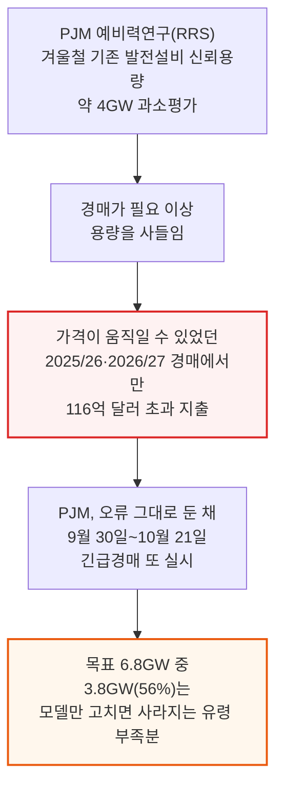
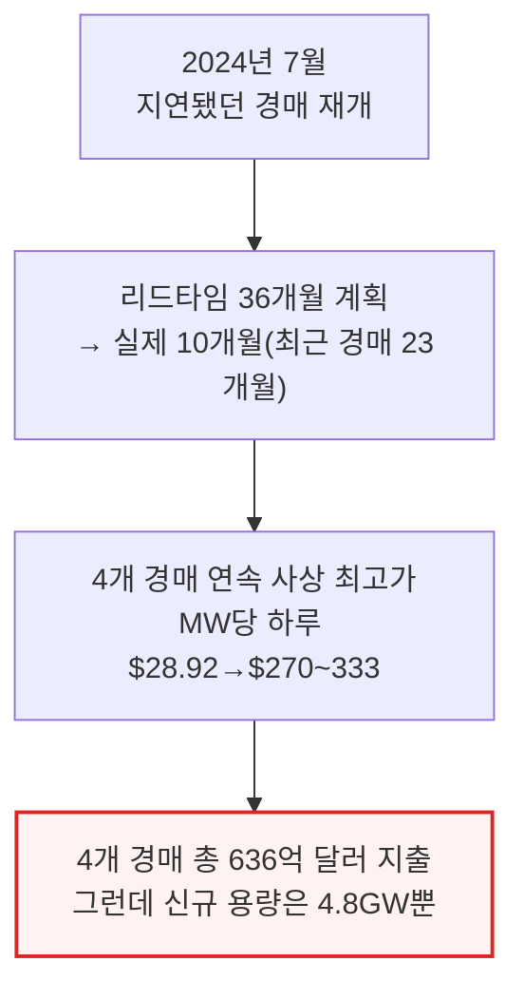
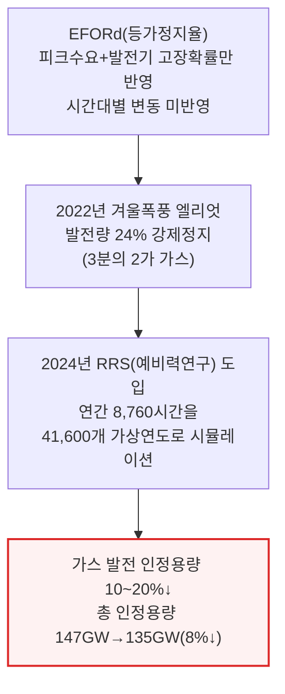
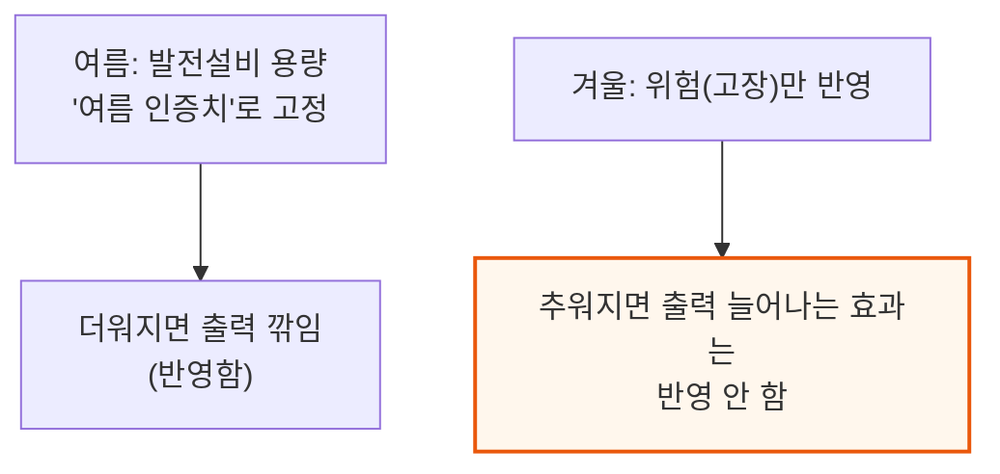
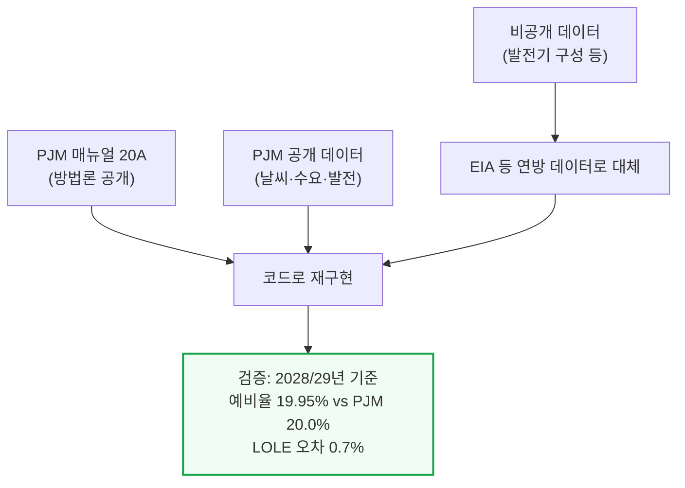

# $12B of US Ratepayers' Money Wasted on a Modeling Mistake and PJM Wants to Do It Again

> **출처**: [SemiAnalysis Newsletter](https://newsletter.semianalysis.com/p/12b-of-us-ratepayers-money-wasted)
> **저자**: Robert Boswall, Reyk Knuhtsen, Jeremie Eliahou Ontiveros (Nathan Iyer 공동 작업)
> **발행일**: 2026-08-16

---

## 📑 목차

### 전체 섹션
 1. [왜 이 리포트가 나왔나 - 맥락과 핵심 결론](#1-왜-이-리포트가-나왔나---맥락과-핵심-결론)
 2. [PJM 예비력연구(RRS)란 무엇인가 - EFORd에서 시간별 리스크 모델로](#2-pjm-예비력연구rrs란-무엇인가---eford에서-시간별-리스크-모델로)
 3. [블랙박스 재구성 - SemiAnalysis의 검증 방법](#3-블랙박스-재구성---semianalysis의-검증-방법)
 4. [빠진 4GW ① - 콜드에어 업리프트를 인정하지 않는 문제](#4-빠진-4gw-①---콜드에어-업리프트를-인정하지-않는-문제)
 5. [빠진 4GW ② - 방한 투자를 반영하지 않는 위험 계산](#5-빠진-4gw-②---방한-투자를-반영하지-않는-위험-계산)
 6. [두 효과의 중첩 - 왜 합계가 아니라 3.8GW인가](#6-두-효과의-중첩---왜-합계가-아니라-38gw인가)
 7. [경매 설계가 작은 오차를 큰돈으로 바꾸는 구조](#7-경매-설계가-작은-오차를-큰돈으로-바꾸는-구조)
 8. [실제로 낭비된 120억 달러 - 2025/26·2026/27 경매 역산](#8-실제로-낭비된-120억-달러---202526·202627-경매-역산)
 9. [가격상한과 공급 제약 - 2027/28·2028/29는 왜 안 바뀌었나](#9-가격상한과-공급-제약---202728·202829는-왜-안-바뀌었나)
10. [긴급경매의 위험 - 카운터파티 없는 계약](#10-긴급경매의-위험---카운터파티-없는-계약)
11. [거버넌스 마비 - 왜 고쳐지지 않았나](#11-거버넌스-마비---왜-고쳐지지-않았나)
12. [결론과 SemiAnalysis의 권고](#12-결론과-semianalysis의-권고)

---

## 🔑 용어 정리

본문을 순서대로 읽기 전에 알아두면 좋은 용어들입니다. 자세한 수치와 설명은 본문에서 처음 등장하는 위치에 나옵니다. PJM 용량시장의 기본 구조(용량 시장·BRA·VRR 곡선)는 앞선 기사 「데이터센터가 미국 가정의 전기요금을 올리는가」에서 이미 다뤘으므로, 여기서는 이 리포트에 새로 나오는 용어 위주로 정리합니다.

- **RRS (Reserve Requirement Study, 예비력연구)**: PJM이 매년 "10년에 하루만 정전이 나도 될 만큼" 필요한 발전 용량을 계산하는 핵심 시뮬레이션 모델 — 지금까지 PJM만 들여다볼 수 있던 블랙박스였는데, 이 리포트가 처음으로 역설계함
- **EFORd (Equivalent Demand Forced Outage Rate, 등가정지율)**: RRS 이전에 PJM이 쓰던 옛날 방식 — 피크 수요에 "발전기가 고장 날 확률"만 단순히 더해 필요 용량을 정함, 겨울철 동시다발 고장이나 태양광·배터리 같은 시간대별 변동을 못 잡는 한계가 있었음
- **콜드에어 업리프트(Cold Air Uplift)**: 추운 날 공기가 더 조밀해져 가스터빈이 같은 설비로도 더 많은 전기를 뽑아낼 수 있는 물리 현상 — PJM은 더운 날 출력이 깎이는 효과는 반영하면서 추운 날 출력이 느는 효과는 반영하지 않음
- **방한(Asset Winterization)**: 발전소가 한파에도 멈추지 않도록 배관·계기 보온과 연료 확보 등에 투자하는 것 — 2022년 겨울폭풍 엘리엇 이후 PJM 관할 가스발전소 약 700곳 중 400곳이 투자를 마쳤는데, RRS는 이 개선을 반영하지 않음
- **LOLE·EUE (신뢰성 지표)**: LOLE(손실부하기대치)는 "정전이 난 날의 수"만 세는 옛날 지표(1시간 정전과 9시간 정전을 같게 취급), EUE(기대공급부족량)는 정전의 규모·길이까지 반영하는 더 정교한 지표 — PJM은 시스템 전체는 LOLE로, 발전기별 기여도는 EUE로 서로 다른 잣대를 섞어 씀
- **VRR 곡선·BRA(기본잔여경매)**: BRA는 PJM이 2년 뒤 필요한 용량을 미리 사들이는 연 1회 경매, VRR 곡선은 그 경매의 청산가를 정하는 PJM 내부 예측 기반의 인위적 공급-수요 곡선
- **긴급경매(Reliability Backstop Auction)**: 4번의 정규 경매로도 필요 용량을 다 못 채운 PJM이 2026년 9월 30일\~10월 21일 별도로 여는 경매 — 2043년까지 가는 장기 계약을 새로 짓는 발전소와 맺음
- **IRAS (Interim Resource Adequacy Service, 임시자원적정성서비스)**: 2027/28년 이후 50MW 넘는 신규 대형 부하 중 중앙조달·자가공급·상대거래 어디에도 안 걸린 부하를 "비확정(non-firm)"으로 연결해, 용량 부족 시 수요반응 프로그램보다도 먼저 끊어버리는 제도

---

## 1. 왜 이 리포트가 나왔나 - 맥락과 핵심 결론

**📌 핵심:**
- SemiAnalysis는 앞서 PJM 관할 요금이 약 20% 뛴 원인을 분석했는데, 이번엔 에너지 모델팀이 6개월간 PJM의 핵심 시스템 모델("예비력연구", Reserve Requirement Study)을 역설계 — 지금까지 PJM만 들여다볼 수 있던 블랙박스를 처음으로 재구성함
- 역설계 결과: PJM은 이미 가동 중인 발전 설비의 신뢰 가능한 용량을 약 4GW 과소평가 — 겨울철 찬 공기가 가스터빈 출력을 높여주는 효과와, 2022년 겨울폭풍 엘리엇 이후 발전소들이 실제로 투자한 방한 조치를 모델이 반영하지 않기 때문
- 이 과소평가 탓에 PJM은 필요보다 많은 용량을 사들였고, 그 결과 가격이 실제로 움직일 수 있었던 2025/26·2026/27 두 경매에서만 116억 달러(민감도 범위 80억\~145억 달러)가 더 나감 — 2025\~2027년 누적으로는 약 120억 달러
- 결론: 그런데 PJM은 이 오류를 고치지 않은 채 9월 30일부터 10월 21일까지 "긴급경매"를 또 열 예정 — SemiAnalysis는 겨울 신뢰성을 제대로 계산하면 3.8GW(대형 가스발전소 8기, 오늘 짓는다면 약 100억 달러 상당)를 추가로 확보한 셈이 돼, 긴급경매 목표 6.8GW의 56%를 상쇄할 수 있다고 봄

---

이 리포트는 PJM(미국 동부 13개 주와 워싱턴DC를 관할하는 전력망 운영기구, 6,600만 명 관할)의 용량시장 구조 자체를 다룬 앞선 기사의 후속편입니다. 앞선 기사가 "PJM의 경매 설계와 수요·공급 모델링 방식이 요금 급등의 주범"이라는 정성적 논증이었다면, 이번 리포트는 그 모델링 오류의 크기를 직접 계산해 달러로 못 박은 정량 분석입니다.

2024년 7월 지연됐던 경매가 재개된 뒤 새 발전소의 리드타임(계약부터 가동까지 걸리는 기간)은 원래 36개월을 주려던 계획에서 실제로는 10개월로 줄었고, 가장 최근 경매도 23개월에 그쳤습니다. 그 사이 4개 경매가 연속으로 사상 최고가를 기록하며 MW당 하루 $28.92에서 $270\~333까지 치솟았고, 4개 경매 누적 지출은 636억 달러에 달했는데도 그 기간 새로 확보된 발전 용량은 4.8GW에 불과했습니다.

---

## 2. PJM 예비력연구(RRS)란 무엇인가 - EFORd에서 시간별 리스크 모델로

**📌 핵심:**
- PJM은 매년 자체 모델로 "10년에 하루만 정전이 나도 될 만큼(0.1 LOLE)" 충분한 발전 용량이 있는지 계산해 경매로 그 물량을 사들임 — 2024년까지는 EFORd(등가정지율)라는 단순 공식을 썼는데, 피크 수요에 "발전기 고장 확률"만 더하는 방식이라 겨울철 동시다발 고장이나 태양광·배터리 같은 시간대별 변동 자원을 제대로 못 잡음
- 2022년 겨울폭풍 엘리엇 때 PJM은 전체 발전량의 24%를 강제정지로 잃었고 그중 3분의 2가 가스발전 — 이 사건을 계기로 PJM은 2024년 RRS(예비력연구)로 모델을 전면 개편, 1년 8,760시간을 41,600개 가상 연도로 시뮬레이션하는 시간별 리스크 모델로 바꿈
- 개편 직후 가스 발전의 인정 용량이 10\~20% 깎였고, 그 결과 2024/25→2025/26년 사이 인정된 총 용량이 147GW에서 135GW로 8%(12GW) 줄어듦 — 대형 발전소 스무 기가 갑자기 증발한 셈이라 PJM은 그만큼을 새로 사들여야 했고, 이때부터 경매가가 폭등
- 결론: 문제는 RRS가 여름철 최고 수요 시점 기준으로 발전 설비 용량을 고정(여름 인증치)해두고, 겨울철엔 고장 위험만 반영하고 겨울철에 설비가 실제로 더 잘 도는 효과는 반영하지 않는다는 것 — 이 비대칭이 이어지는 두 섹션에서 다룰 4GW 과소평가의 근원

---

PJM은 여름철 피크 수요가 겨울철 난방 수요보다 항상 높기 때문에(에어컨 수요가 난방 수요를 넘어섬), 발전 설비 용량 자체는 여름 기준으로 잡아두는 것이 합리적이라는 입장입니다. 문제는 그 반대 방향입니다.

---

## 3. 블랙박스 재구성 - SemiAnalysis의 검증 방법

**📌 핵심:**
- PJM은 RRS의 방법론(매뉴얼 20A)과 상당수 데이터를 공개하지만 실제 발전기별 유형 구성은 비공개 — SemiAnalysis 에너지 모델팀은 6개월간 이 매뉴얼(2026년 6월 개정판)을 코드로 옮기고, 공개된 날씨·수요·발전 데이터를 그대로 넣어 돌리는 방식으로 모델을 재구성
- 공개되지 않은 값(해상풍력, 저장장치 상세 구성, 이중연료 가스발전 비중 등)은 미 에너지정보청(EIA) 등 연방 공개 데이터로 대체 — 이렇게 만든 재구성 모델은 2028/29년 경매 기준 PJM 공식 수치와 예비율 19.95% vs PJM 20.0%, 손실부하기대치(LOLE) 오차 0.7% 등 높은 정확도로 일치
- 다만 한계도 있음 — 지역별 송전 제약은 반영 못 하고(전체 시스템 단위로만 계산), 실제 입찰 데이터는 비공개라 경매 자체를 재현하진 못하며, 해상풍력·비양수 수력·저장장치 구성·이중연료 블록 4개 항목은 대체 데이터를 쓴 추정치
- 결론: 이 정도 정확도면 PJM이 반영하지 않는 두 가지 입력값(콜드에어 업리프트, 방한 반영)을 바꿔가며 "모델을 제대로 고쳤다면 얼마가 달랐을까"를 계산할 근거로 충분하다는 것이 SemiAnalysis의 판단

---

📌 용어 풀이: 검증 한계
> - **재구성 모델의 한계**: 지역별 송전 제약(MAAC·EMAAC·SWMAAC·DOM 등 zone)은 반영하지 못해 특정 지역의 병목 가격은 계산할 수 없음. 실제 발전기별 입찰가는 비공개라 경매 청산가를 직접 재현하지는 못하고, 공개된 수요곡선(VRR)에 결과를 대입하는 방식으로 검증
> - **미배분 3,546MW**: PJM 공식 154,234MW 인정용량 중 3,546MW는 공개 자료만으로는 어느 발전기인지 특정하지 못해, 시간별 물리 시뮬레이션 밖에서 "미배분 조정치"로 따로 처리

---

*작성 진행률: 약 25% 완료*
*업데이트: 원문 12개 섹션 중 1\~3장(맥락과 핵심 결론, RRS 개념, 모델 재구성 방법) 완료*
