# $12B of US Ratepayers' Money Wasted on a Modeling Mistake and PJM Wants to Do It Again

> **출처**: [SemiAnalysis Newsletter](https://newsletter.semianalysis.com/p/12b-of-us-ratepayers-money-wasted)
> **저자**: Robert Boswall, Reyk Knuhtsen, Jeremie Eliahou Ontiveros (Nathan Iyer 공동 작업)
> **발행일**: 2026-08-16

---

## 📑 목차

### 전체 섹션
 1. [왜 이 리포트가 나왔나 - 맥락과 핵심 결론](#1-왜-이-리포트가-나왔나---맥락과-핵심-결론)
 2. [PJM 예비력연구(RRS)란 무엇인가 - EFORd에서 시간별 리스크 모델로](#2-pjm-예비력연구rrs란-무엇인가---eford에서-시간별-리스크-모델로)
 3. [블랙박스 재구성 - SemiAnalysis의 검증 방법](#3-블랙박스-재구성---semianalysis의-검증-방법)
 4. [빠진 4GW ① - 콜드에어 업리프트를 인정하지 않는 문제](#4-빠진-4gw-①---콜드에어-업리프트를-인정하지-않는-문제)
 5. [빠진 4GW ② - 방한 투자를 반영하지 않는 위험 계산](#5-빠진-4gw-②---방한-투자를-반영하지-않는-위험-계산)
 6. [두 효과의 중첩 - 왜 합계가 아니라 3.8GW인가](#6-두-효과의-중첩---왜-합계가-아니라-38gw인가)
 7. [경매 설계가 작은 오차를 큰돈으로 바꾸는 구조](#7-경매-설계가-작은-오차를-큰돈으로-바꾸는-구조)
 8. [실제로 낭비된 120억 달러 - 2025/26·2026/27 경매 역산](#8-실제로-낭비된-120억-달러---202526·202627-경매-역산)
 9. [가격상한과 공급 제약 - 2027/28·2028/29는 왜 안 바뀌었나](#9-가격상한과-공급-제약---202728·202829는-왜-안-바뀌었나)
10. [긴급경매의 위험 - 카운터파티 없는 계약](#10-긴급경매의-위험---카운터파티-없는-계약)
11. [거버넌스 마비 - 왜 고쳐지지 않았나](#11-거버넌스-마비---왜-고쳐지지-않았나)
12. [결론과 SemiAnalysis의 권고](#12-결론과-semianalysis의-권고)

---

## 🔑 용어 정리

본문을 순서대로 읽기 전에 알아두면 좋은 용어들입니다. 자세한 수치와 설명은 본문에서 처음 등장하는 위치에 나옵니다. PJM 용량시장의 기본 구조(용량 시장·BRA·VRR 곡선)는 앞선 기사 「데이터센터가 미국 가정의 전기요금을 올리는가」에서 이미 다뤘으므로, 여기서는 이 리포트에 새로 나오는 용어 위주로 정리합니다.

- **RRS (Reserve Requirement Study, 예비력연구)**: PJM이 매년 "10년에 하루만 정전이 나도 될 만큼" 필요한 발전 용량을 계산하는 핵심 시뮬레이션 모델 — 지금까지 PJM만 들여다볼 수 있던 블랙박스였는데, 이 리포트가 처음으로 역설계함
- **EFORd (Equivalent Demand Forced Outage Rate, 등가정지율)**: RRS 이전에 PJM이 쓰던 옛날 방식 — 피크 수요에 "발전기가 고장 날 확률"만 단순히 더해 필요 용량을 정함, 겨울철 동시다발 고장이나 태양광·배터리 같은 시간대별 변동을 못 잡는 한계가 있었음
- **콜드에어 업리프트(Cold Air Uplift)**: 추운 날 공기가 더 조밀해져 가스터빈이 같은 설비로도 더 많은 전기를 뽑아낼 수 있는 물리 현상 — PJM은 더운 날 출력이 깎이는 효과는 반영하면서 추운 날 출력이 느는 효과는 반영하지 않음
- **방한(Asset Winterization)**: 발전소가 한파에도 멈추지 않도록 배관·계기 보온과 연료 확보 등에 투자하는 것 — 2022년 겨울폭풍 엘리엇 이후 PJM 관할 가스발전소 약 700곳 중 400곳이 투자를 마쳤는데, RRS는 이 개선을 반영하지 않음
- **LOLE·EUE (신뢰성 지표)**: LOLE(손실부하기대치)는 "정전이 난 날의 수"만 세는 옛날 지표(1시간 정전과 9시간 정전을 같게 취급), EUE(기대공급부족량)는 정전의 규모·길이까지 반영하는 더 정교한 지표 — PJM은 시스템 전체는 LOLE로, 발전기별 기여도는 EUE로 서로 다른 잣대를 섞어 씀
- **VRR 곡선·BRA(기본잔여경매)**: BRA는 PJM이 2년 뒤 필요한 용량을 미리 사들이는 연 1회 경매, VRR 곡선은 그 경매의 청산가를 정하는 PJM 내부 예측 기반의 인위적 공급-수요 곡선
- **긴급경매(Reliability Backstop Auction)**: 4번의 정규 경매로도 필요 용량을 다 못 채운 PJM이 2026년 9월 30일\~10월 21일 별도로 여는 경매 — 2043년까지 가는 장기 계약을 새로 짓는 발전소와 맺음
- **IRAS (Interim Resource Adequacy Service, 임시자원적정성서비스)**: 2027/28년 이후 50MW 넘는 신규 대형 부하 중 중앙조달·자가공급·상대거래 어디에도 안 걸린 부하를 "비확정(non-firm)"으로 연결해, 용량 부족 시 수요반응 프로그램보다도 먼저 끊어버리는 제도

---

## 1. 왜 이 리포트가 나왔나 - 맥락과 핵심 결론

**📌 핵심:**
- SemiAnalysis는 앞서 PJM 관할 요금이 약 20% 뛴 원인을 분석했는데, 이번엔 에너지 모델팀이 6개월간 PJM의 핵심 시스템 모델("예비력연구", Reserve Requirement Study)을 역설계 — 지금까지 PJM만 들여다볼 수 있던 블랙박스를 처음으로 재구성함
- 역설계 결과: PJM은 이미 가동 중인 발전 설비의 신뢰 가능한 용량을 약 4GW 과소평가 — 겨울철 찬 공기가 가스터빈 출력을 높여주는 효과와, 2022년 겨울폭풍 엘리엇 이후 발전소들이 실제로 투자한 방한 조치를 모델이 반영하지 않기 때문
- 이 과소평가 탓에 PJM은 필요보다 많은 용량을 사들였고, 그 결과 가격이 실제로 움직일 수 있었던 2025/26·2026/27 두 경매에서만 116억 달러(민감도 범위 80억\~145억 달러)가 더 나감 — 2025\~2027년 누적으로는 약 120억 달러
- 결론: 그런데 PJM은 이 오류를 고치지 않은 채 9월 30일부터 10월 21일까지 "긴급경매"를 또 열 예정 — SemiAnalysis는 겨울 신뢰성을 제대로 계산하면 3.8GW(대형 가스발전소 8기, 오늘 짓는다면 약 100억 달러 상당)를 추가로 확보한 셈이 돼, 긴급경매 목표 6.8GW의 56%를 상쇄할 수 있다고 봄

---

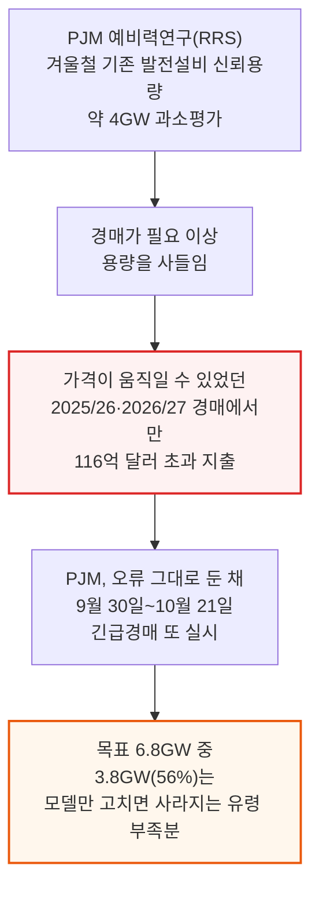

이 리포트는 PJM(미국 동부 13개 주와 워싱턴DC를 관할하는 전력망 운영기구, 6,600만 명 관할)의 용량시장 구조 자체를 다룬 앞선 기사의 후속편입니다. 앞선 기사가 "PJM의 경매 설계와 수요·공급 모델링 방식이 요금 급등의 주범"이라는 정성적 논증이었다면, 이번 리포트는 그 모델링 오류의 크기를 직접 계산해 달러로 못 박은 정량 분석입니다.

아래 그림은 2024년 7월 지연됐던 경매가 재개된 뒤 리드타임(계약부터 가동까지 걸리는 기간)이 어떻게 줄었고, 그 여파로 경매가·누적 지출이 어떻게 뛰었는지를 보여줍니다.

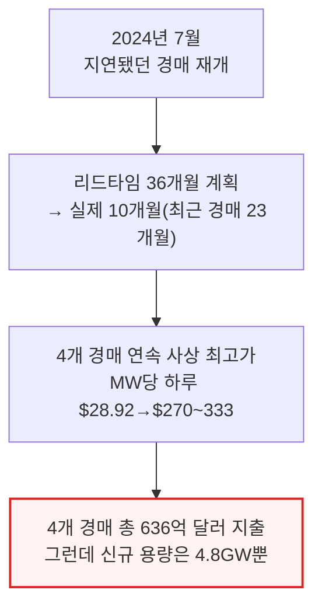

---

## 2. PJM 예비력연구(RRS)란 무엇인가 - EFORd에서 시간별 리스크 모델로

**📌 핵심:**
- PJM은 매년 자체 모델로 "10년에 하루만 정전이 나도 될 만큼(0.1 LOLE)" 충분한 발전 용량이 있는지 계산해 경매로 그 물량을 사들임 — 2024년까지는 EFORd(등가정지율)라는 단순 공식을 썼는데, 피크 수요에 "발전기 고장 확률"만 더하는 방식이라 겨울철 동시다발 고장이나 태양광·배터리 같은 시간대별 변동 자원을 제대로 못 잡음
- 2022년 겨울폭풍 엘리엇 때 PJM은 전체 발전량의 24%를 강제정지로 잃었고 그중 3분의 2가 가스발전 — 이 사건을 계기로 PJM은 2024년 RRS(예비력연구)로 모델을 전면 개편, 1년 8,760시간을 41,600개 가상 연도로 시뮬레이션하는 시간별 리스크 모델로 바꿈
- 개편 직후 가스 발전의 인정 용량이 10\~20% 깎였고, 그 결과 2024/25→2025/26년 사이 인정된 총 용량이 147GW에서 135GW로 8%(12GW) 줄어듦 — 대형 발전소 스무 기가 갑자기 증발한 셈이라 PJM은 그만큼을 새로 사들여야 했고, 이때부터 경매가가 폭등
- 결론: 문제는 RRS가 여름철 최고 수요 시점 기준으로 발전 설비 용량을 고정(여름 인증치)해두고, 겨울철엔 고장 위험만 반영하고 겨울철에 설비가 실제로 더 잘 도는 효과는 반영하지 않는다는 것 — 이 비대칭이 이어지는 두 섹션에서 다룰 4GW 과소평가의 근원

---

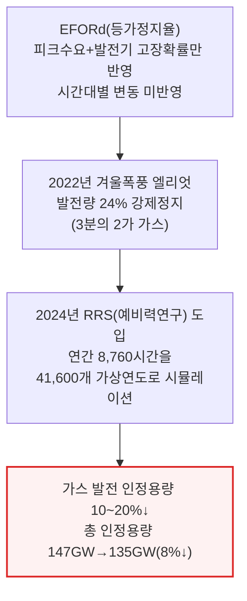

PJM은 여름철 피크 수요가 겨울철 난방 수요보다 항상 높기 때문에(에어컨 수요가 난방 수요를 넘어섬), 발전 설비 용량 자체는 여름 기준으로 잡아두는 것이 합리적이라는 입장입니다. 문제는 그 반대 방향입니다.

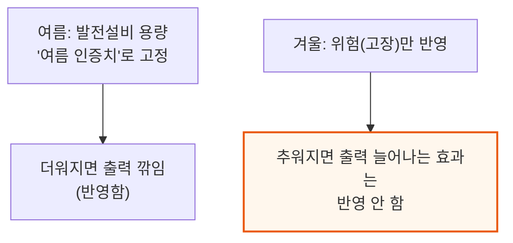

---

## 3. 블랙박스 재구성 - SemiAnalysis의 검증 방법

**📌 핵심:**
- PJM은 RRS의 방법론(매뉴얼 20A)과 상당수 데이터를 공개하지만 실제 발전기별 유형 구성은 비공개 — SemiAnalysis 에너지 모델팀은 6개월간 이 매뉴얼(2026년 6월 개정판)을 코드로 옮기고, 공개된 날씨·수요·발전 데이터를 그대로 넣어 돌리는 방식으로 모델을 재구성
- 공개되지 않은 값(해상풍력, 저장장치 상세 구성, 이중연료 가스발전 비중 등)은 미 에너지정보청(EIA) 등 연방 공개 데이터로 대체 — 이렇게 만든 재구성 모델은 2028/29년 경매 기준 PJM 공식 수치와 예비율 19.95% vs PJM 20.0%, 손실부하기대치(LOLE) 오차 0.7% 등 높은 정확도로 일치
- 다만 한계도 있음 — 지역별 송전 제약은 반영 못 하고(전체 시스템 단위로만 계산), 실제 입찰 데이터는 비공개라 경매 자체를 재현하진 못하며, 해상풍력·비양수 수력·저장장치 구성·이중연료 블록 4개 항목은 대체 데이터를 쓴 추정치
- 결론: 이 정도 정확도면 PJM이 반영하지 않는 두 가지 입력값(콜드에어 업리프트, 방한 반영)을 바꿔가며 "모델을 제대로 고쳤다면 얼마가 달랐을까"를 계산할 근거로 충분하다는 것이 SemiAnalysis의 판단

---

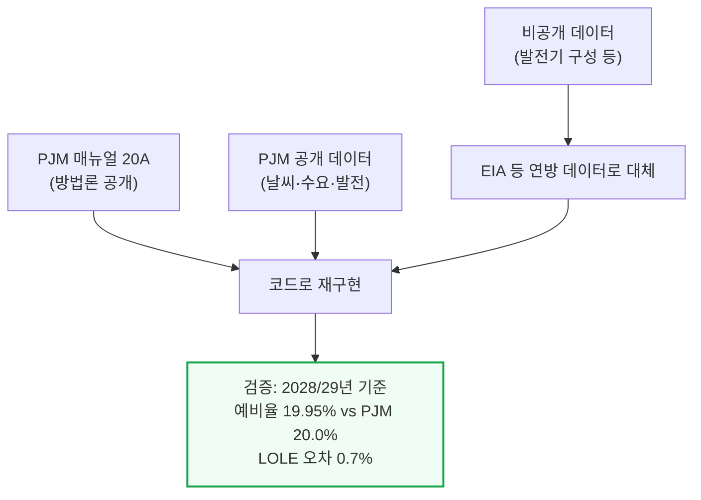

📌 용어 풀이: 검증 한계
> - **재구성 모델의 한계**: 지역별 송전 제약(MAAC·EMAAC·SWMAAC·DOM 등 zone)은 반영하지 못해 특정 지역의 병목 가격은 계산할 수 없음. 실제 발전기별 입찰가는 비공개라 경매 청산가를 직접 재현하지는 못하고, 공개된 수요곡선(VRR)에 결과를 대입하는 방식으로 검증
> - **미배분 3,546MW**: PJM 공식 154,234MW 인정용량 중 3,546MW는 공개 자료만으로는 어느 발전기인지 특정하지 못해, 시간별 물리 시뮬레이션 밖에서 "미배분 조정치"로 따로 처리

---

## 4. 빠진 4GW ① - 콜드에어 업리프트를 인정하지 않는 문제

**📌 핵심:**
- 가스터빈은 질량유량 기계 — 공기가 차가울수록 밀도가 높아져 같은 설비로도 더 많은 전기를 뽑아낼 수 있음. 연소터빈은 최대 25%까지 늘어나고 PJM 자체 등급표 평균은 겨울철 8.4%인데, 이 효과를 PJM 모델은 아예 반영하지 않음
- PJM은 여름엔 더위로 출력이 깎이는 효과(ambient derate)는 반영하면서 겨울엔 추위로 출력이 느는 효과(ambient uprate)는 반영 안 함 — E3(PJM이 고용한 외부 컨설턴트)가 2025년 12월 평가서에서 "PJM은 기온이 오를 때는 비대칭적으로 정격을 깎으면서 기온이 내려갈 때는 올리지 않는다"고 직접 지적
- PJM 자체 2025년 5월 민감도 분석에서도 이걸 반영하면 겨울철 손실부하시간이 33% 줄고 2026/27년 경매 기준 예비율이 1.1%p 낮아지는 것으로 나왔고, 명판 기준 8.5GW(최소 $1,500/kW 단가로 신규 가스발전소 130억 달러어치에 해당)에 달하는 것으로 PJM 스스로 측정했음에도 반영 안 함 — 이유는 "이 추가 용량이 계통 전체로 실제 전달 가능한지 확인하는 전달성(deliverability) 연구를 해야 한다"는 것인데, PJM은 이 연구를 아예 실행한 적이 없음
- 결론: SemiAnalysis 모델은 PJM의 겨울철 고장률은 그대로 두고 콜드에어 효과만 반영해 시간별로 41,600개 가상연도를 다시 돌린 결과 — 이 효과 하나만으로도 필요 용량이 연도별로 1.3\~2.2GW 줄어듦(2026/27년 기준 1.5GW)

---

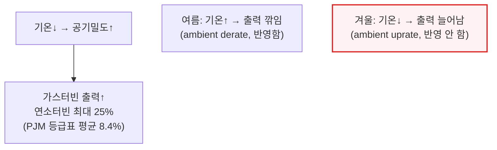

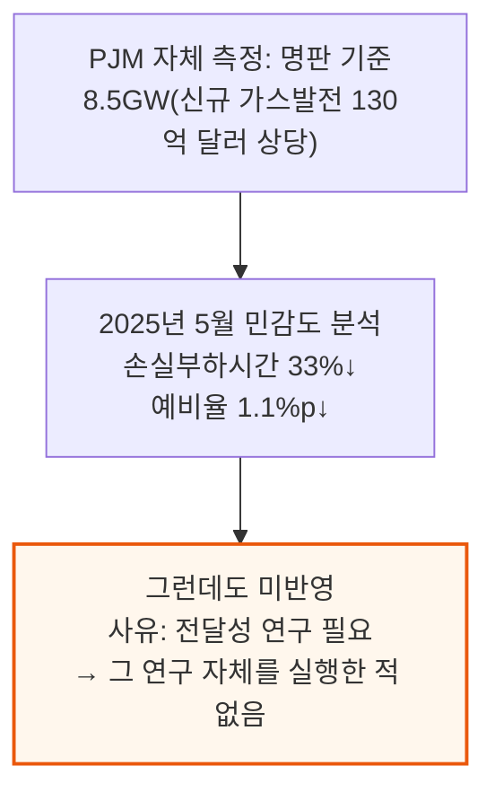

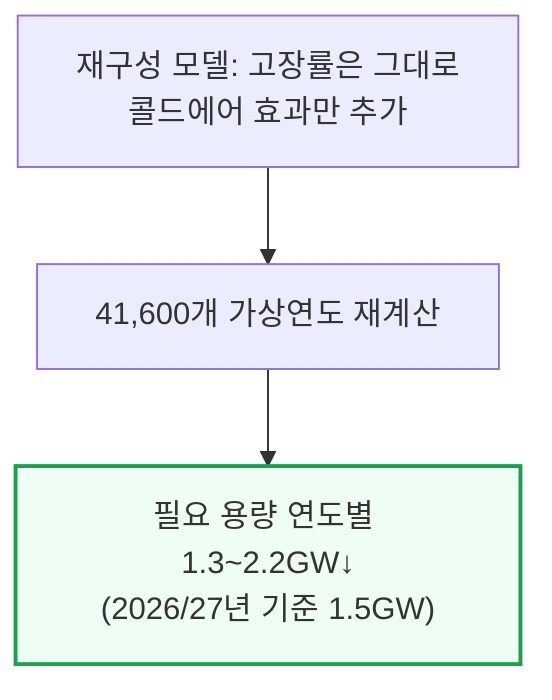

📌 용어 풀이: 콜드에어 업리프트가 왜 위험 상쇄로 이어지나
> - **이중계산 문제**: 겨울철 고장 위험은 그대로 반영하면서 겨울철 출력 증가 효과를 빼먹으면, 같은 추위를 "위험만 두 번" 계산하는 셈 — 실제로는 가스발전소 일부가 얼어붙어도 나머지 가동 중인 발전소들이 평소보다 더 많은 전기를 뽑아내 상당 부분을 상쇄함
> - **증기발전소도 혜택**: 냉각수 온도가 낮아지면 응축기 압력이 내려가 사이클 효율이 올라감 — 가스터빈뿐 아니라 증기발전소도 추운 날 출력이 늘어나는데 PJM 모델은 이를 여전히 여름철 기준으로 계산

---

## 5. 빠진 4GW ② - 방한 투자를 반영하지 않는 위험 계산

**📌 핵심:**
- PJM은 발전소의 고장 위험을 과거 실적으로만 계산 — 한 번 크게 고장 나면 그 기록이 시스템에서 빠지는 데 10년 넘게 걸림. 그래서 오늘날까지도 위험 계산에 가장 큰 영향을 주는 사건은 2013년 폴라보텍스, 두 번째가 2022년 겨울폭풍 엘리엇 — 아무리 투자하고 개선해도 이 판정을 못 뒤집음
- 그런데 실제로는 2023년 4월부터 한파 대비 계획·매년 훈련·저온 운전한계 보고가 의무화됐고, 2024년 1월까지 PJM 관할 가스발전소 약 700곳 중 400곳 이상이 방한 개선을 보고함 — 겨울폭풍 엘리엇 당시 46GW(24%)가 무너졌던 것과 비교하면, 이후 스톰 게리(2024년 1월, 16GW·9%)·MLK 한파(2025년 1월, 9%)·스톰 펀(2026년 1월, 18\~19GW·10%)까지 비슷한 한파에서도 고장률이 뚜렷이 낮아짐
- FERC·NERC 합동 조사(2023년 10월)는 엘리엇 당시 동파로 멈춘 설비의 최소 75%가 "이미 신고된 운전한계 기온보다 높은 온도"에서 멈췄다는 것을 확인 — 제대로 방한된 설비였다면 애초에 멈추지 않았을 고장이라는 뜻
- 결론: SemiAnalysis 모델은 각 발전기 유형의 연평균 고장률은 그대로 두고 "날씨에 따라 몰아서 고장 나는 정도(상관관계)"만 낮춰 재계산 — 2026/27년 경매 기준 방한 반영만으로 필요 용량이 최대 3GW(100% 반영 시) 줄어듦. 매우 보수적으로 2025/26년 방한률을 50%로 놓고 매년 10%p씩 올려 잡은 결과

---

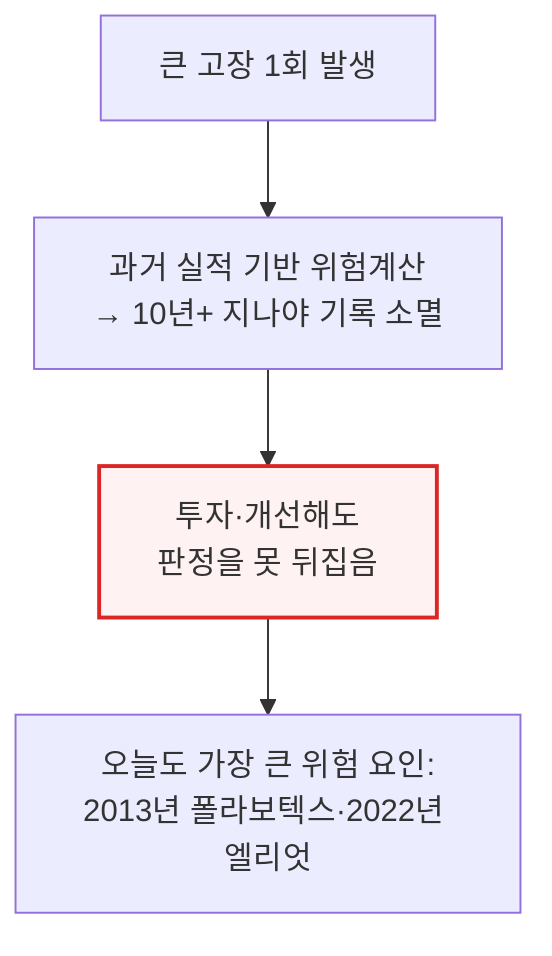

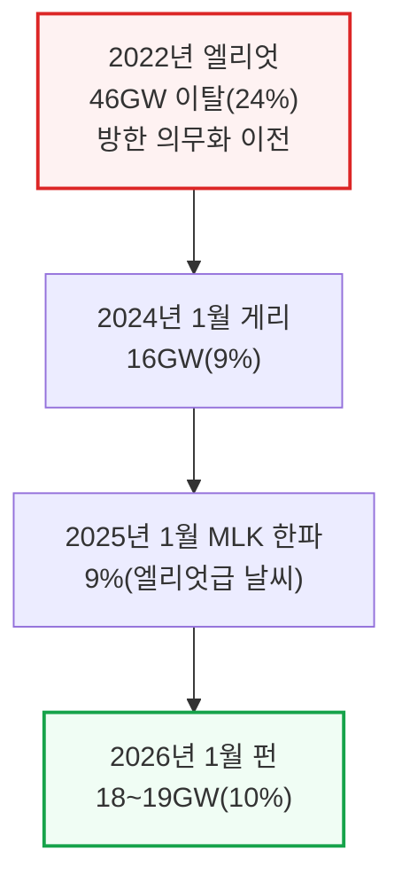

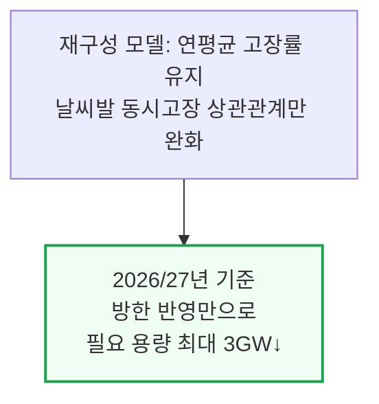

📌 용어 풀이: 방한 투자가 실제로 하는 일
> - **동파 고장의 실체**: 계기·감지선, 밸브, 연료 취급 설비 등 노출된 부품이 얼어 시동 자체가 안 걸리는 것 — 정작 필요한 순간에 멈추는 방식
> - **방한 반영의 의미**: 방한 투자를 인정한다고 해서 발전소가 "평균적으로 덜 고장 난다"고 가정하는 게 아님 — 다만 예전처럼 한파가 오면 수백 개 발전소가 한꺼번에 얼어붙는 상관관계는 더 이상 그대로 유지되지 않는다는 것만 반영. 실제로는 평균 고장률 자체도 낮아졌을 가능성이 크지만 SemiAnalysis는 이 부분은 보수적으로 반영하지 않음

---

## 6. 두 효과의 중첩 - 왜 합계가 아니라 3.8GW인가

**📌 핵심:**
- 콜드에어 업리프트(2026/27년 기준 1,535MW)와 방한 반영(100% 기준 3,143MW)을 단순히 더하면 4,678MW가 나오지만, 실제로 함께 반영하면 3,320MW에 그침 — 두 효과가 같은 "가장 추운 몇 시간"을 겨냥하기 때문에 중복이 생김
- PJM의 필요 용량은 사실상 시스템이 부족해질 확률이 가장 높은 극소수의 깊은 한파 시간대에 의해 결정됨 — 방한 효과(100% 기준)가 콜드에어 효과를 흡수하는 비율은 연도별로 76\~96%에 달하고, SemiAnalysis가 실제로 채택한 보수적 방한률(연도별로 단계적 상승)에서는 이 중첩 비율이 53\~69%
- 이렇게 중첩까지 반영해도 결론은 바뀌지 않음 — PJM이 이미 가진 설비의 신뢰 가능한 용량을 약 4GW 과소평가하고 있다는 것이 최종 수치이며, 2026/27년 경매 기준으로는 3.1\~3.3GW, 2028/29년 긴급경매가 노리는 해에는 3.8GW에 해당
- 결론: 3.8GW는 대형 가스발전소 8기 상당이고, 오늘 새로 짓는다면 약 100억 달러가 드는 규모 — PJM은 이 물량이 이미 계통에 존재한다는 사실을 인정하지 않은 채, 뒤에서 다룰 긴급경매로 또 그만큼을 새로 사려 하고 있음

---

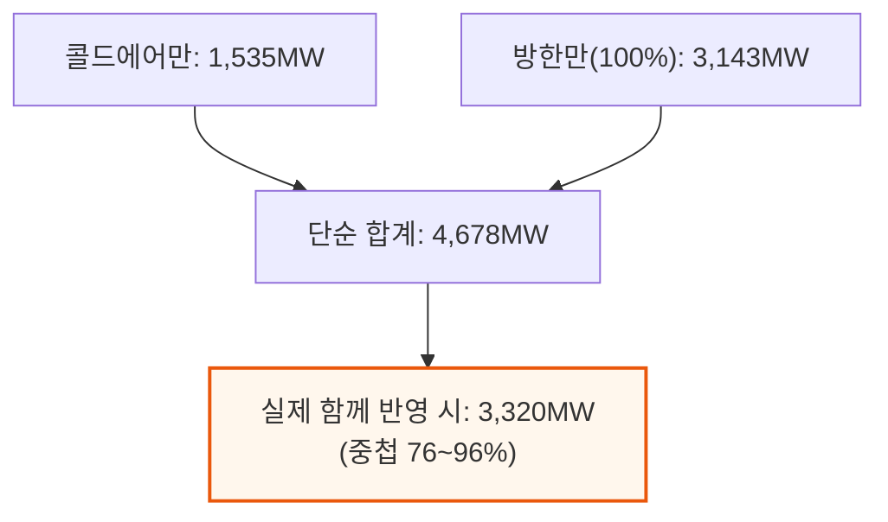

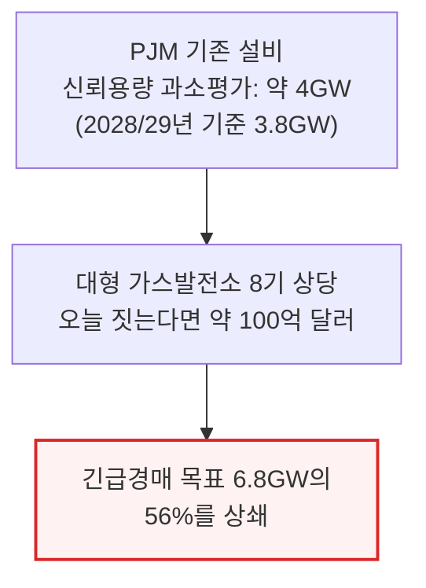

---

## 7. 경매 설계가 작은 오차를 큰돈으로 바꾸는 구조

**📌 핵심:**
- 전력시장엔 두 가지 원가가 있음 — 그날 발전기를 한 시간 더 돌리는 데 드는 단기한계비용(연료·인건비 등)과, 발전소를 짓고 유지하는 데 드는 장기한계비용(자본·고정유지비). 매일 도매 에너지시장은 단기한계비용으로만 청산되기 때문에, 이것만으로는 발전소가 지은 돈을 못 갚는 "missing money(못 메운 돈)" 구멍이 생김
- 이 구멍을 메우는 방법이 시장마다 다름 — ERCOT(텍사스)는 별도 시장 없이 부족할 때 실시간 가격을 극단적으로 띄워 이 돈을 벌게 하는 반면(에너지 온리 시장), PJM은 매년 별도 용량경매(BRA)를 열어 "발전소를 대기시켜 둔 값"을 따로 지급
- PJM의 독특한 점은 이미 지어진 발전소와 새로 지을 발전소를 같은 경매, 같은 청산가로 묶는다는 것 — 기존 발전소는 이미 지은 돈을 갚을 필요가 없어 하루 $8\~14만 받아도 채산이 맞는데(독립시장감시기구 IMM 자료, 2025년 기존 복합화력 발전소 중위값은 자본비용 회수 전에도 에너지·보조서비스 시장에서만 원가의 407%를 이미 벎), 새 발전소는 초기 투자와 리스크를 반영해 훨씬 높은 값을 부를 수밖에 없음
- 결론: 청산가는 "그 물량을 채우기 위해 필요한 마지막 입찰"이 정함 — 새 발전소 몇 곳이 비싼 값을 불러 청산가가 올라가면, 이미 지어져 하루 $8\~14면 충분한 기존 발전소 전체가 그 높은 값을 그대로 받아감. PJM 용량의 약 93%가 이런 식으로 하나의 한계가격 경매에서 정해지는데, 이 비율은 세계에서 유일하게 높음(MISO 15%, 뉴욕 월별 순환, 캘리포니아 상대거래, 텍사스는 경매 자체가 없음, 뉴잉글랜드는 이 설계를 최근 폐기)

---

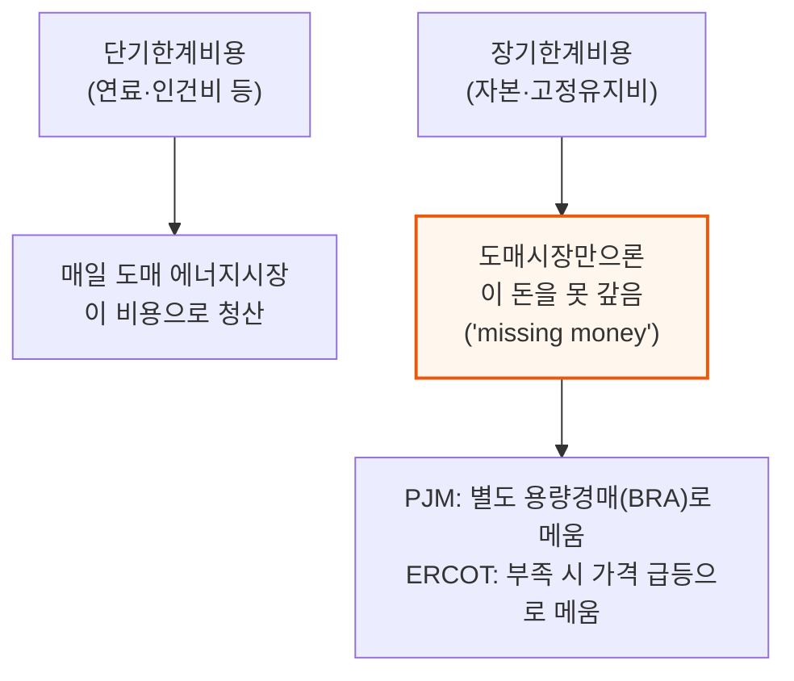

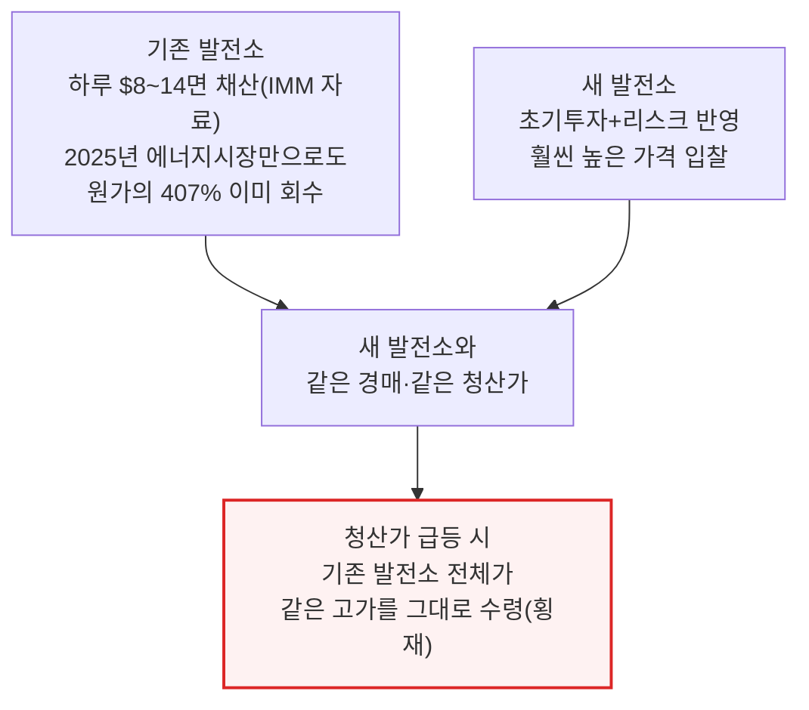

PJM의 공급곡선은 대부분 낮고 평평하다가 막판에 수직으로 치솟는 ㄱ자에 가까운 모양입니다. 2025/26년 경매에서 입찰의 첫 79%는 하루 $2\~5, 다음 20%는 $105까지 올랐고, 마지막 1%만 $352까지 치솟았는데 시장은 $270에 청산됐습니다.

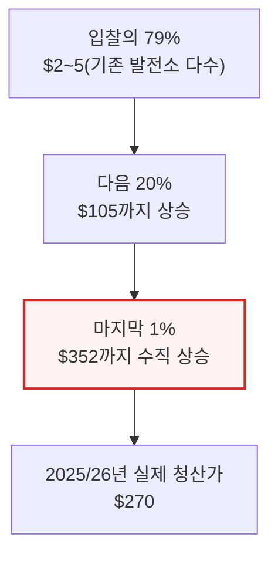

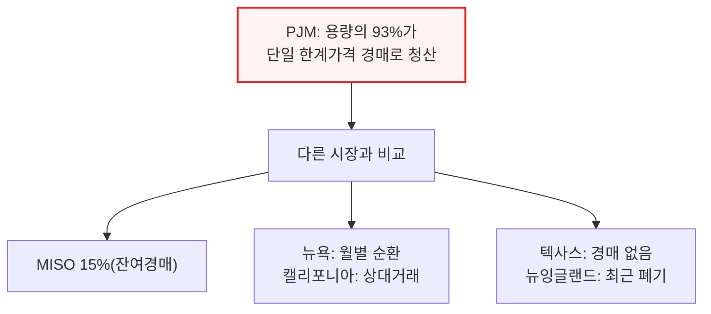

이 공급곡선이 한계 지점에서 수직으로 서 있다는 사실이 다음 섹션의 반직관적 결과 — "물량은 거의 그대로인데 가격은 절반"이라는 계산을 이해하는 열쇠입니다.

---

## 8. 실제로 낭비된 120억 달러 - 2025/26·2026/27 경매 역산

**📌 핵심:**
- 모델링을 고쳤다면 수요곡선(VRR)이 왼쪽으로 이동해 같은 물량이어도 더 낮은 가격에 청산됐을 것 — 2025/26년 경매는 실제로 135.7GW를 하루 $270에 사들였는데, 콜드에어·방한을 반영한 곡선으로는 목표 물량이 2.7GW 줄어 같은 135.7GW를 사더라도 청산가가 $135(50% 할인)에 그쳤을 것
- 물량 차이는 겨우 0.014GW(14MW)인데 가격 차이는 절반 — 이 작은 물량 차이가 하루 $135 절감×135.7GW×365일로 계산하면 67억 달러 절감. "물량은 거의 그대로인데 가격만 반토막"이라는 결과는 앞 섹션에서 본 PJM 공급곡선이 한계 지점에서 수직으로 서 있기 때문
- 2026/27년 경매는 최초로 정치적 가격상한($329)이 걸린 해 — 실제로는 필요물량 134.5GW에 0.3GW 못 미친 134.2GW를 상한가에 사들였는데, 모델을 고쳤다면 목표가 3.1GW 줄어 133.6GW를 $230에 살 수 있었음(0.6GW만 덜 사고도 예비율은 오히려 개선). 이 차액이 49억 달러
- 결론: 두 경매를 합치면 116억 달러(민감도 범위 80억\~145억 달러)가 낭비됨 — 참고로 독립시장감시기구(IMM)가 2024년 9월 콜드에어 효과만으로 별도 계산했을 때도 예비마진 고정 시 27억 달러, 고정 안 하면 최대 80억 달러라는 비슷한 규모를 이미 제시한 바 있어 이번 결과가 유별난 값이 아님을 뒷받침

---

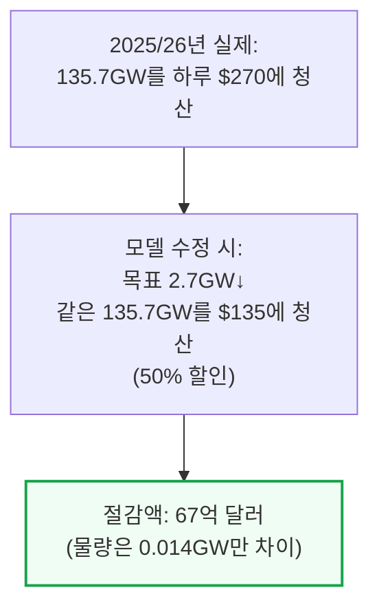

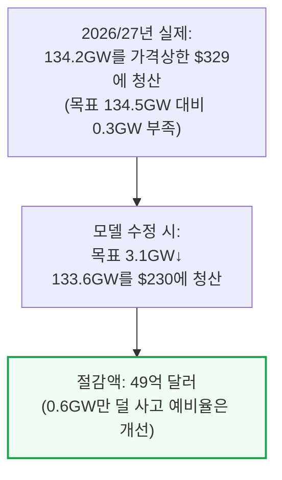

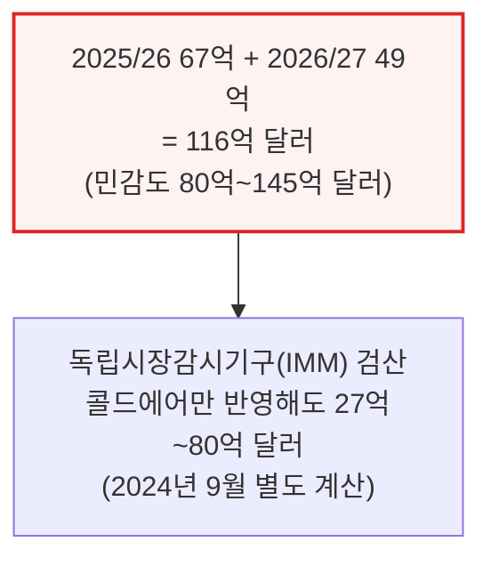

---

## 9. 가격상한과 공급 제약 - 2027/28·2028/29는 왜 안 바뀌었나

**📌 핵심:**
- 2027/28년 경매(2025년 12월)는 가격상한 $333.44에서 청산됐는데 필요물량보다 6.5GW나 부족 — 이런 상황에서는 모델을 고쳐 목표를 4.5GW 줄여도 공급곡선이 워낙 부족한 쪽에 있어 상한 아래에서 수요-공급이 만나지 못함. 즉 값은 안 바뀌고 여전히 상한가·여전히 부족
- 2028/29년 경매(2026년 7월)도 마찬가지 — 상한가 $325에서 청산됐지만 요구량 156,012.9MW 대비 6,831.3MW(약 6.8GW) 부족. 이 두 경매는 "모델을 고쳤어도 가격이나 물량이 달라지지 않았을 해"로, 2025/26·2026/27과 달리 116억 달러 절감 계산에 포함되지 않음
- 하지만 부족분(shortfall) 자체는 모델 오류의 영향을 그대로 받음 — 2028/29년의 6.8GW 부족분에 개선된 모델링을 적용하면 필요 부족분이 약 3GW로 줄어듦. 즉 진짜 부족한 건 6.8GW가 아니라 절반에 못 미치는 약 3GW
- 결론: 이 6.8GW vs 3GW 차이가 바로 다음 섹션에서 다룰 긴급경매(Reliability Backstop Auction)의 핵심 쟁점 — PJM은 실제보다 두 배 넘게 부풀려진 목표로 대형 조달에 나서려 하고 있음

---

```mermaid
flowchart TD
    A2728["2027/28년 경매(2025-12)<br/>가격상한 $333.44 청산<br/>필요물량 대비 6.5GW 부족"] --> NoChange1["모델 수정(4.5GW↓)해도<br/>여전히 상한가·여전히 부족<br/>→ 절감 없음"]
    A2829["2028/29년 경매(2026-07)<br/>가격상한 $325 청산<br/>156,012.9MW 요구 대비<br/>6,831.3MW 부족"] --> NoChange2["모델 수정해도<br/>값은 그대로<br/>→ 절감 없음"]

    style NoChange1 fill:#fff7ed,stroke:#ea580c
    style NoChange2 fill:#fff7ed,stroke:#ea580c
```

```mermaid
flowchart TD
    Gap["2028/29년 부족분<br/>PJM 공식: 6.8GW"] --> Fixed["모델링 개선 반영 시<br/>실제 부족분: 약 3GW"]
    Fixed --> Next["이 차이가<br/>긴급경매(Reliability Backstop Auction)<br/>목표 물량의 핵심 쟁점"]

    style Fixed fill:#fef2f2,stroke:#dc2626,stroke-width:2px
```

---

## 10. 긴급경매의 위험 - 카운터파티 없는 계약

**📌 핵심:**
- PJM은 이 긴급경매로 지어질 새 발전소와 2043년까지 가는 장기계약을 맺을 계획인데, 정작 그 대금을 낼 "새 대형 부하(신규 데이터센터 등)"는 아직 계약서에 서명하지 않은 가상의 존재 — 예상 수요가 끝내 나타나지 않아도 PJM은 발전소에 계속 대금을 지급해야 하고, PJM 자체 돈은 없으므로 그 돈은 결국 요금 청구서를 통해 주민에게 감(2032년 6월까지 가동한 신규 자원만 입찰 가능, 계약은 전부 2043년 종료 — 2032년 가동 발전소는 약 11년치 계약)
- 대금 배분 절차도 허술함 — 비용은 2026/27\~2028/29년 예상 부하증가율 기준으로 각 송전구역(zone)에 배분되고 이 배분 비율은 15년 내내 고정, 사후 정산(true-up)도 없음. 각 주가 자체 비용배분 정책을 통과시켜야 이 비용을 실제 대형 부하에 전가할 수 있는데 아직 어느 주도 통과시키지 않았고, 대형 부하는 스스로 발전소를 계약(자가공급)하면 아예 발을 뺄 수 있음 — 참여해도 인터커넥션 가속화 같은 혜택은 전혀 없음
- 비용 배분을 떠맡는 부하공급기관(LSE)은 매 인도연도 90일 이내에 MW당 150만 달러의 신용보증을 예치해야 하는데, 상한 평균가 $555/MW-day 기준 6.8GW 전체의 최대 잠재 부채는 약 210억 달러 — 그런데도 PJM 이사회는 회원사 3분의 2 이상이 찬성했던 "선구독형" 대안(대형 부하가 먼저 구독·서명한 뒤에야 용량을 조달하는 방식)을 스스로 뒤집고, 물량 확보가 불확실하다는 이유로 지금의 고위험 설계를 채택
- 결론: 평균가격상한($555)은 개별 계약이 아니라 포트폴리오 평균에만 적용돼 PJM 자체 예시에서도 $600짜리 입찰이 그대로 청산되고, "먼저 써낸 값 그대로 받는"(pay-as-bid) 방식이라 참여자들은 진짜 원가가 아니라 "청산될 것 같은 최고가"를 부르게 됨(PJM 자체 증인도 이렇게 증언) — 게다가 50MW 넘는 미참여 대형 부하는 IRAS(임시자원적정성서비스)로 비확정 연결돼 부족 시 수요반응 프로그램보다도 먼저 끊김. 스스로 발전소를 확보할 수 있는 부하일수록 이 경매를 피해 자가공급으로 가는 게 압도적으로 유리해, 결국 남는 위험은 다시 주민 요금청구서로 돌아옴

---

```mermaid
flowchart TD
    Sign["PJM, 신규 발전소와<br/>2043년까지 장기계약 체결<br/>(2032년 6월까지 가동한 자원만 입찰)"] --> Pay["발전소는 대기만 해도<br/>계속 대금 수령"]
    Pay --> Who["대금은 원래<br/>'신규 대형 부하'가 내야 함"]
    Who --> NoSign["그런데 그 부하는<br/>아직 계약서에 서명 안 한<br/>예상치일 뿐"]
    NoSign --> Fallback["수요 안 오면<br/>PJM 자체 돈 없음<br/>→ 결국 요금청구서로"]

    style Fallback fill:#fef2f2,stroke:#dc2626,stroke-width:2px
```

```mermaid
flowchart TD
    Alloc["비용 배분: 2026/27~2028/29<br/>예상 부하증가율 기준<br/>zone별 배분, 15년 고정"] --> NoTrueUp["사후 정산 없음"]
    StateReq["각 주가 자체<br/>비용배분 정책 통과시켜야 함"] --> NonePassed["현재 어느 주도<br/>통과 안 시킴"]
    OptOut["대형 부하, 자가공급 계약 시<br/>이 비용 자체를 피할 수 있음<br/>(가속화 혜택도 없음)"]

    style NonePassed fill:#fff7ed,stroke:#ea580c,stroke-width:2px
```

```mermaid
flowchart TD
    Credit["부하공급기관(LSE)<br/>MW당 150만 달러<br/>신용보증 예치(90일 이내)"] --> MaxLiab["상한평균가 $555 기준<br/>6.8GW 최대 잠재부채<br/>약 210억 달러"]
    Sub["회원 3분의 2+ 찬성<br/>'선구독형' 대안"] --> Override["PJM 이사회가<br/>자체 회원 결정을 뒤집고<br/>고위험 설계 채택"]

    style MaxLiab fill:#fef2f2,stroke:#dc2626,stroke-width:2px
    style Override fill:#fef2f2,stroke:#dc2626,stroke-width:2px
```

```mermaid
flowchart TD
    Cap["평균가격상한 $555<br/>(포트폴리오 평균에만 적용)"] --> Example["PJM 자체 예시:<br/>$600 입찰도 그대로 청산"]
    PayBid["pay-as-bid 방식<br/>(써낸 값 그대로 지급)"] --> Strategy["최적 전략: 진짜 원가 대신<br/>'청산될 것 같은 최고가'를 부름"]
    IRAS["IRAS: 50MW+ 미참여 부하<br/>비확정 연결"] --> Curtail["부족 시 수요반응보다도<br/>먼저 끊김"]

    style Example fill:#fef2f2,stroke:#dc2626,stroke-width:2px
    style Curtail fill:#fff7ed,stroke:#ea580c,stroke-width:2px
```

📌 용어 풀이: 왜 자가공급이 압도적으로 유리해지나
> - **자가공급(Self-Supply)**: 대형 부하가 스스로 발전소와 직접 계약해 필요한 용량을 확보하고, 그만큼 PJM 중앙경매에서 빠지는 방식(FRR, Fixed Resource Requirement) — 긴급경매의 불확실한 비용배분·비확정 연결 위험을 아예 피할 수 있어, 여력이 있는 부하일수록 이쪽을 택할 유인이 커짐
> - **역선택 위험**: 감당할 능력이 되는 대형 부하가 자가공급으로 이탈할수록, 남아서 긴급경매·IRAS에 걸리는 부하와 위험은 상대적으로 더 열악한 쪽에 쏠리고, PJM은 다시 과다조달에 나설 유인이 커지는 악순환

---

## 11. 거버넌스 마비 - 왜 고쳐지지 않았나

**📌 핵심:**
- PJM의 규칙 개정은 5개 동일 가중치 회원 부문에서 3분의 2 찬성이 있어야 통과되는 구조라, 어느 두 부문만 뭉쳐도 무엇이든 거부할 수 있음(이사회가 개입해 뒤집을 순 있지만 이번 모델링 문제에선 그러지 않았음 — 앞선 긴급경매 설계에서는 오히려 자기 회원들의 결정을 뒤집는 데는 개입함) — FERC(연방에너지규제위원회)가 9월 말까지 거버넌스를 개혁하지 않으면 직접 개입하겠다고 통보했지만, FERC는 선제적 권한보다 사후 대응 권한이 크고 이 통보 자체가 모델링·용량경매만 겨냥한 것도 아님
- 이 콜드에어·방한 반영 문제는 새로운 주장이 아님 — 2023년 PJM 스스로 여름·겨울을 나눈 완전한 2계절 용량시장을 제안했지만 독립시장감시기구(IMM) 등이 "설계에 더 시간이 필요하다"고 반대해 철회, 대신 연간 단일 계약 패키지만 신청해 FERC가 2024년 1월 승인(계절 구분 의무화는 요구하지 않음)
- 2024년 9월 IMM이 콜드에어만 반영해도 예비마진 고정 시 27억 달러, 고정 안 하면 최대 80억 달러를 절감할 수 있다고 결론 내렸고 "이 초과 겨울용량을 즉시 배정하지 못할 이유가 없다"고 권고 — 2025년 5월 PJM 자체 민감도 분석에서도 겨울 발전능력이 여름 인증치보다 8,561MW 높다는 사실을 스스로 확인했음에도, 같은 달 회원들은 관련 송전 작업을 "계절형 용량 설계를 다루기 전까지" 보류하기로 5분의 3.699 표만 얻어 미룸
- 결론: 2025년 7월 PJM 자체 태스크포스가 겨울 인증치 반영을 포함한 "Package C"를 178대 54(77%)로 통과시켰지만, 불과 26일 뒤인 8월 20일 상위 위원회가 가중치 30.7%로 부결시킴 — 발전사업자 측은 "겨울 인증치를 높이면 여름철 저조한 실적에 대한 페널티 기준이 함께 올라간다"고 반대했고, 소비자 측은 PJM 원안 대신 더 강한 대안 2개를 밀었다가 발전사업자들에게 다시 부결당하는 상호 거부권 교착이 이어짐. 2025년 12월 E3가 다시 계절·일별 인증(14개 권고사항 중 4번째)을 권고했지만 그 뒤로 표결 자체가 열리지 않았음

---

```mermaid
flowchart TD
    Rule["규칙 개정: 5개 부문<br/>동일 가중치 투표"] --> TwoThirds["3분의 2 찬성 필요"]
    TwoThirds --> Veto["어느 두 부문이든<br/>뭉치면 거부 가능"]
    Veto --> FERCDeadline["FERC: 9월 말까지<br/>미개혁 시 직접 개입 경고<br/>(단, FERC는 사후대응 권한 위주)"]

    style Veto fill:#fef2f2,stroke:#dc2626,stroke-width:2px
```

```mermaid
flowchart TD
    T2023["2023년: PJM 자체<br/>2계절 용량시장 제안 → 철회"] --> T202409["2024년 9월: IMM<br/>콜드에어 반영 시 27억~80억달러<br/>절감 가능 결론"]
    T202409 --> T202505["2025년 5월: PJM 자체 분석<br/>겨울 발전능력 8,561MW↑ 확인<br/>→ 그런데도 관련 작업 보류"]
    T202505 --> T202507["2025년 7월: 태스크포스<br/>Package C 178대54(77%) 통과"]
    T202507 --> T202508["2025년 8월 20일(26일 뒤):<br/>상위위원회 30.7%로 부결"]
    T202508 --> T202512["2025년 12월: E3도<br/>같은 권고(14개 중 4번째)<br/>→ 이후 표결 없음"]

    style T202508 fill:#fef2f2,stroke:#dc2626,stroke-width:2px
```

---

## 12. 결론과 SemiAnalysis의 권고

**📌 핵심:**
- PJM의 중앙집중형 용량시장은 성장이라는 첫 도전 앞에서 핵심 기능(부족분을 조달하는 것)에 실패 — 짧은 리드타임과 긴 인터커넥션 대기열로 공급을 조여놓고, 그렇게 오른 값을 기존 발전소에 횡재로 돌리는 구조가 됐음. 이제는 긴급경매라는 세 번째 시장까지 새로 만들면서, 낡은 모델링 오류를 새로운 장기 부채로 그대로 옮기고 있음
- SemiAnalysis의 핵심 권고 3가지 — ① 이번에 밝힌 모델링 개선(콜드에어·방한 반영)을 긴급경매를 포함한 모든 향후 경매에 즉시 적용 ② 2025/26·2026/27년 경매의 과다지출에 대한 공식 조사 착수 ③ 기존 발전소와 신규 발전소의 경매를 아예 분리
- 더 느슨하게 제안하는 것도 있음 — 새 대형 부하가 끝내 나타나지 않을 위험이 너무 큰 만큼 긴급경매 자체를 취소하고 인터커넥션 가속 계약 안에서만 직접 용량계약을 맺는 방안, 혹은 긴급경매를 유지하려면 기본잔여경매(BRA)의 가격상한을 더 낮춰 사실상 기존·신규 경매를 분리하는 단기 처방
- 결론: FERC는 8월 21일까지 이 긴급경매 신청에 대한 의견을 받고 있고 SemiAnalysis도 이 분석을 직접 제출할 예정 — 데이터센터는 규모의 경제로 시스템 원가를 낮춰 오히려 전기를 더 싸게 만들 잠재력이 있다는 것이 저자들의 시각이며, 주지사·소비자 옹호단체가 지금 주목해야 할 것은 AI가 아니라 PJM의 관료적 실패 그 자체

---

```mermaid
flowchart TD
    Rec["핵심 권고 3가지"] --> R1["① 모델링 개선을<br/>긴급경매+향후 모든 경매에 적용"]
    Rec --> R2["② 2025/26·2026/27년<br/>과다지출 공식 조사"]
    Rec --> R3["③ 기존·신규 발전소<br/>경매 분리"]

    style Rec fill:#eff6ff,stroke:#3b82f6,stroke-width:2px
```

```mermaid
flowchart TD
    Deadline["FERC 의견접수 마감<br/>8월 21일"] --> Submit["SemiAnalysis 분석 직접 제출"]
    Submit --> Ask["요청: 긴급경매 6.8GW 목표를<br/>계약 체결 전에 재계산할 것"]

    style Ask fill:#fff7ed,stroke:#ea580c,stroke-width:2px
```

이 리포트가 다룬 두 가지 모델링 결함(콜드에어 업리프트, 방한 반영)은 이전부터 논의됐지만 실제 반영으로 이어진 적은 없습니다.

공개된 정보만으로 PJM의 블랙박스를 역설계해 오류의 크기를 노출하는 것이 이번 작업의 목표였습니다. 저자들은 "우리가 절반만 맞았더라도 이 모델링을 시급히 고쳐야 한다"고 강조하면서도, 발전기별 정확한 구성 등 공개되지 않은 정보가 남아 있어 이 모델은 어디까지나 좋은 근사치라는 한계를 함께 명시합니다.

---

*작성 진행률: 100% 완료*
*업데이트: 원문 전체 12개 섹션(맥락과 핵심 결론\~결론과 권고) 변환 완료. 원문의 차트·이미지는 다이어그램·숫자 역산 과정으로 대체, 유료 구독자 전용 방법론 부록(Methodology Annex)의 핵심 수치는 각 섹션 본문에 통합*
