# What is So Hard About Behind-The-Meter Power For Datacenters? Part 1

> **출처**: [SemiAnalysis Newsletter](https://newsletter.semianalysis.com/p/what-is-so-hard-about-behind-the)
> **저자**: Ellie Holbrook, Robert Boswall, Jeremie Eliahou Ontiveros
> **발행일**: 2026-09-10

---

## 📑 목차

### 전체 섹션
 1. [지금 BTM에서 무슨 일이 벌어지고 있나](#1-지금-btm에서-무슨-일이-벌어지고-있나)
 2. [BTM이란 무엇인가](#2-btm이란-무엇인가)
 3. [BTM 프로젝트가 힘든 이유 - 여섯 관문](#3-btm-프로젝트가-힘든-이유---여섯-관문)
 4. [관문 0 - 계약과 뱅커빌리티](#4-관문-0---계약과-뱅커빌리티)
 5. [1단계 - 인허가](#5-1단계---인허가)
 6. [2단계 - 가스](#6-2단계---가스)
 7. [3단계 - 장비](#7-3단계---장비)
 8. [4단계 - 건설·시운전·인력](#8-4단계---건설시운전인력)
 9. [5단계 - 섬 운전의 물리학](#9-5단계---섬-운전의-물리학)
10. [가스 없이도 할 수 있는가](#10-가스-없이도-할-수-있는가)
11. [앞으로 어디로 가는가](#11-앞으로-어디로-가는가)
12. [승자와 패자](#12-승자와-패자)

---

## 🔑 용어 정리

본문을 순서대로 읽기 전에 알아두면 좋은 용어들입니다. 자세한 수치와 설명은 본문에서 처음 등장하는 위치에 나옵니다.

- **BTM(Behind-The-Meter, 계량기 뒤 전력)**: 전력망 계량기를 거치지 않고 데이터센터 부지 안에서 자체 발전한 전기를 그대로 쓰는 방식 — 이전 딥다이브의 "BYOG(자가 발전)"와 같은 대상을 가리키는 말
- **뱅커빌리티(Bankability)**: 은행·투자자가 돈을 빌려줄 만큼, 사업이 계약으로 수익과 상환 가능성을 확실히 보장하고 있는 정도
- **섬 운전(Islanding)**: 전력망과 완전히 끊긴 채 부지 자체 발전만으로 데이터센터 전체를 돌리는 운전 상태
- **PTE(Potential to Emit, 잠재배출량)**: 설비가 일 년 내내 최대로 가동했을 때 나올 것으로 계산되는 오염물질 총량 — 이 값의 크기에 따라 어떤 인허가 절차를 밟아야 하는지가 갈린다
- **PSD(Prevention of Significant Deterioration, 주요배출원 정밀심사)**: PTE가 연방 기준을 넘는 대형 설비에 적용되는 미국의 정밀 인허가 절차 — 대기질 모델링과 공개 의견 수렴을 거쳐야 한다
- **EaaS(Energy-as-a-Service, 에너지 서비스 사업자)**: 발전 장비만 파는 게 아니라 정해진 용량·가동률을 장기 계약으로 책임지고 전력 자체를 공급하는 새로운 형태의 전력회사
- **BESS(Battery Energy Storage System, 배터리 저장장치)·SynCon(Synchronous Condenser, 동기조상기)**: 발전기만으로 못 잡는 순간적인 부하 흔들림을 잡아주는 두 가지 보조 장치 — 배터리는 전기를 저장했다 즉시 내보내고, 동기조상기는 회전하는 무게로 관성을 흉내 낸다
- **관성(Inertia)·고장전류(Fault Current)**: 전력망이 평소 공짜로 제공해주는 두 가지 안전장치 — 관성은 주파수가 갑자기 흔들리지 않게 버텨주는 회전 질량의 힘, 고장전류는 회로가 끊어졌을 때 차단기가 그 사실을 알아채게 해주는 순간적인 대전류

---

## 1. 지금 BTM에서 무슨 일이 벌어지고 있나

**📌 핵심:**
- SemiAnalysis 에너지 모델은 BTM AI 컴퓨트향으로만 확정된(binding) 발주 **75GW**를 추적 중이며, 이 중 **20GW**가 2026년 2분기 한 분기에만 발주됐다 — 연말까지 실제로 가동되는 미국 데이터센터 IT 용량은 약 3GW지만, 향후 여러 해 연속 세 자릿수(%) 성장이 예상된다
- 경제성 논리는 단순하다: 1GW급 섬 운전 데이터센터의 발전소 건설비는 약 50억 달러인데, 추론 API 매출은 GW당 연 1,000억 달러(매출총이익률 90%대)까지 나올 수 있어 발전소 건설비를 **추론 매출 20일치**로 회수한다 — 그래서 비용을 2배 내거나 효율을 30% 낮추더라도 더 빨리 짓는 쪽을 택하는 것이 합리적 선택이 된다
- 마이크로소프트·구글·앤트로픽·메타·오픈AI 모두 올해 대규모 BTM 계약을 발표했고, 발전 장비 제조사는 1년 만에 12곳에서 22곳으로 늘었다
- 결론: 지난해까지 "과학 실험"·"멍청한 짓"이라 불렸던 BTM은 이제 모든 프런티어 AI 랩·하이퍼스케일러의 주력 전략이 됐지만, 발주와 완공 사이에는 상당한 실행 리스크가 남아 있다

---

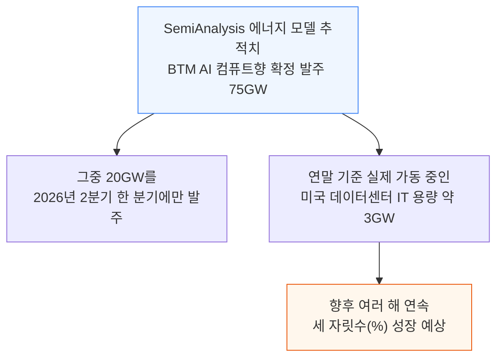

올해 들어 체결된 대표적인 계약들이다:

- **마이크로소프트**: 2026년 들어 현재까지 BTM 명판 용량 5GW 이상 계약 — Joulent·셰브런과 2.7GW, 크루소 같은 업체와의 턴키 임대로 2GW 이상
- **구글**: 그동안 온사이트 가스에 가장 소극적이었지만 암스트롱 카운티에 항공유도 가스터빈 930MW, 와이오밍에 Bloom Energy 연료전지 900MW, 여기에 미쓰비시 J클래스 터빈 1GW 이상을 배치 중
- **앤트로픽·메타**: 둘 다 Enchanted Rock(21.9리터 V12 가스엔진 기반 0.5MW 발전기 제조사)과 300\~500MW 규모 계약 체결 — 앤트로픽의 텍사스 플래그십 캠퍼스(구글이 뒷받침)는 별도로 1.5GW 이상의 오프그리드 발전을 추가
- **오픈AI**: 텍사스 셰클퍼드 카운티에 4.25MW급 옌바허 J624 엔진 500기 이상으로 짓는 1.4GW IT 용량 오프그리드 캠퍼스를 곧 가동 — 뉴멕시코 1.3GW 부지와 합치면 오라클과 맺은 1,500억 달러 이상의 계약이 BTM 전력에 의존

전력망은 이 속도를 따라가지 못한다. 새 발전소를 짓는 데는 5년 이상, 데이터센터를 전력망에 연결하는 데도 수년이 걸린다(자세한 내용은 [미국 전력망 제약](https://newsletter.semianalysis.com/p/us-grid-constraints-towards-40gw) 참고).

발전 장비 제조사도 빠르게 늘었다 — 1년 전 대형(수백MW급) 데이터센터 오프그리드 발주를 따낸 제조사가 12곳이었는데 지금은 22곳이다.

다만 빛이 있으면 그림자도 있다. 퍼밋 지연으로 오라클 Project Jupiter·Nebius 뉴저지 같은 대형 부지가 급하게 연료전지로 설계를 바꿨고, 파이프라인 지연이 오라클의 1.3GW 뉴멕시코 부지에 영향을 줬다.

신뢰성 문제에 대한 시장의 우려·인력난도 늘고 있고, 실패한 프로젝트에 묶여 있던 확정 발주분이 풀리며 터빈 중고 시장까지 생겨났다. 이 보고서는 발주에서 완공까지 이어지는 여섯 개 관문에서 무엇이 발목을 잡는지를 다룬다.

---

## 2. BTM이란 무엇인가

**📌 핵심:**
- "계량기(Meter)"는 부지의 전선과 전력망의 전선이 만나는 지점에 서서 전기를 세는 장치다 — 그 지점을 기준으로 전력망 쪽(변전소·철탑·발전소)이 "계량기 앞(front of the meter)", 부지 쪽(스위치기어·배터리·자가발전기)이 "계량기 뒤(behind the meter, BTM)"다
- BTM·오프그리드·섬 운전·co-located·마이크로그리드라는 말이 실무에서는 뒤섞여 쓰이지만, **전력망과 어떻게 연결돼 있는지(연결 구성)** 기준으로 네 갈래로 정리할 수 있다: 계통 공급형, 계통 병렬형, 수출 전용형, 완전 오프그리드
- 계통 병렬형 안에서도 자가발전 규모와 전력망 인출 한도의 조합에 따라 결과가 크게 갈린다 — 같은 1,000MW 데이터센터라도 어떤 조합이냐에 따라 자가발전 하나가 통째로 멈췄을 때 감당해야 할 부담이 다르다
- 결론: "섬 운전(Islanding)"은 하나의 운전 상태일 뿐이다 — 많은 BTM 프로젝트는 전력망 연결을 기다리는 동안의 "다리(bridge)"로 자가발전을 쓰다가, 연결이 되면 발전기를 백업으로 돌리는 쪽으로 계획을 짠다

---

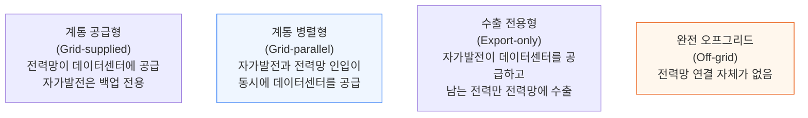

ERCOT의 WLPUN(Withdrawal-Limited Private Use Network, 인출 제한형 사설 전력망) 제도는 계통 병렬형 안에서 자가발전이 클수록 필요한 전력망 인출 용량(=송전 부담)이 줄어드는 것을 공식적으로 인정한다. 같은 1,000MW 데이터센터라도 자가발전과 인출 한도를 어떻게 조합하느냐에 따라 결과가 완전히 달라진다.

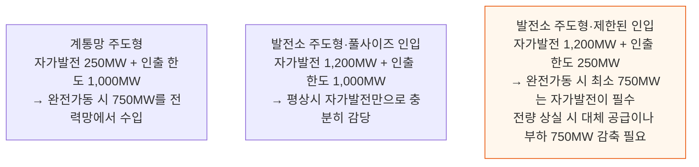

**📌 용어 풀이: 넷 메터링(Net Metering)과 두 가지 최근 사례**
> - 이 맥락에서 넷 메터링은 데이터센터의 소비량을 관련 발전량과 전력망 접점(계량·정산 경계)에서 상계하는 것을 뜻한다 — 가정용 태양광이 청구 주기 동안 수출분을 소비분에서 빼주는 방식과는 다르다
> - **프리스톤(Freestone) 사례**: ERCOT는 2026년 5월 텍사스 공공서비스위원회(PUCT)가 1,099MW 가스발전소와 760MW 데이터센터 사이의 넷 메터링을 승인했다고 밝혔다
> - **왜 수출 전용형은 오프그리드가 아닌가**: 데이터센터가 발전소의 전력망 연결형 교류 계통에 접속해 있다면, 순수출 상태에서도 그 전력망의 주파수 동역학과 관성 반응을 함께 나눠 받는다 — 잘 운영되는 전력망이라면 오히려 전기 품질·신뢰성이 좋아지는 효과도 있다
> - **텍사스의 규제 구분**: 텍사스 공공사업법 §39.169는 2025년 9월 1일 기준 독립 발전 자원으로 등록돼 있던 기존 발전소를 새 부하와 묶는 넷 메터링에는 ERCOT 통보와 PUCT 심사를 요구한다 — 2026년 5월까지 승인된 두 건 모두, 데이터센터는 소비를 줄이거나 백업으로 전환하고 발전소는 ERCOT 지시 후 30분 안에 전량을 전력망으로 되돌리도록 조건이 달렸다(기존 발전소 전력을 새 부하로 돌리면 전력망에 남는 공급이 줄어들기 때문)

전력망과의 연결 여부와 별개로, 실제 운전 방식도 시간에 따라 바뀐다. "섬 운전(Islanding)"은 전력망에 연결된 부지가 차단기를 열고 자체 발전만으로 돌아가는 하나의 **운전 상태**다.

미국 에너지부(DOE)는 "마이크로그리드"를 "명확한 전기적 경계 안에서 부하와 분산 에너지 자원이 전력망에 대해 하나의 제어 가능한 실체처럼 움직이는 집합"으로 정의하고, 계통 연결·섬 운전 모두 가능하다고 설명한다.

이 글에서는 계통에 연결돼 있으면서 분리도 가능한 것을 "분리 가능한 마이크로그리드", 아예 연결이 없는 것을 "오프그리드 마이크로그리드"로 구분한다.

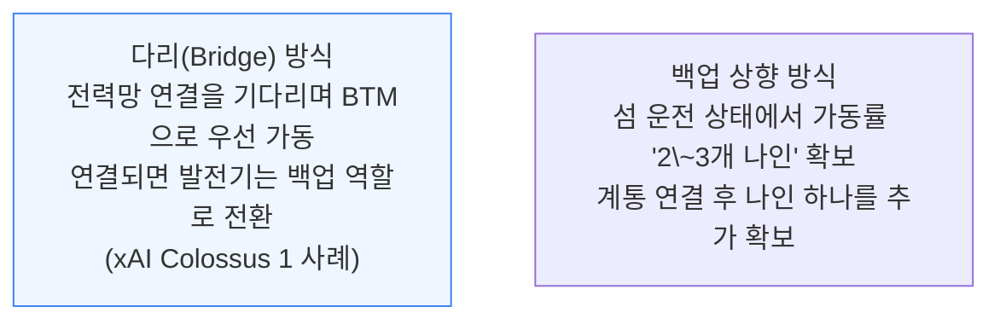

많은 BTM 프로젝트가 "마이크로그리드"라는 말을 느슨하게 쓰는데, 아마도 "가스"라고 직접 말하는 것을 피하려는 의도로 보인다.

---

## 3. BTM 프로젝트가 힘든 이유 - 여섯 관문

**📌 핵심:**
- 터빈 발주와 인근 파이프라인만으로는 프로젝트가 완성되지 않는다 — 보도자료와 첫 발전 사이에는 여섯 개의 관문이 버티고 있다: 계약과 뱅커빌리티, 인허가, 연료, 장비, 인력, 그리고 전력망 없이 돌아가는 전기적 물리학
- SemiAnalysis의 퍼밋 단위 추적 결과, 이미 확보된 발주 용량조차 이 관문 거의 전부에서 어려움을 겪고 있다
- 결론: 다음 절부터는 관문 0(계약·뱅커빌리티)에서 시작해 5단계(섬 운전의 물리학)까지 순서대로, 각 관문에서 실제로 무엇이 막히고 있는지를 짚는다

---

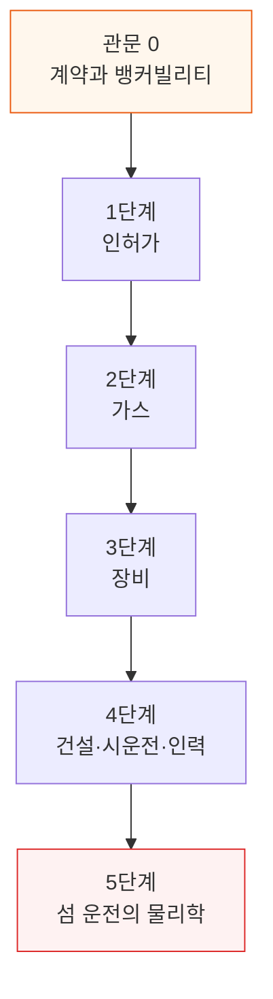

---

## 4. 관문 0 - 계약과 뱅커빌리티

**📌 핵심:**
- 전력망 연결은 전통적으로 매우 저렴했다 — 계통연계 신청과 신용장(letter of credit) 부담이 크지 않아, 자본 몇백만 달러만으로도 GW급 신뢰할 만한 부지를 만들 수 있었다. 섬 운전 데이터센터는 근본적으로 다르다 — 연결할 기존 인프라 자체가 없어서, GW당 약 50억 달러짜리 발전소 건설비를 처음부터 전부 자기 돈으로 감당해야 한다
- 이 때문에 전형적인 "닭과 달걀" 문제가 생긴다: 대출기관은 신뢰할 만한 오프테이커와 맺은 장기 전력판매계약(ESA)·SLA를 원하고, 오프테이커는 신뢰할 만한 일정과 설계를 원하며, 개발사는 그 일정·설계를 보여주려면 장비 계약금을 낼 초기 자본이 필요하다 — 가스 발전 장비 수요가 공급을 압도하는 상황이라, 그 초기 자본이 없으면 일정은 계속 밀린다
- 초기 성공 사례는 세 갈래로 갈렸다: ① xAI처럼 자체 자금(주로 지분투자)으로 발전소까지 통째로 짓는 완전 수직통합, ② 시공과 에너지를 모두 자체 역량으로 갖춘 종합 개발사가 온사이트 발전비까지 원가에 포함해 파는 방식(임대료 방식 기준 MW당 2,000만 달러를 흔히 넘김), ③ 데이터센터 개발사와 발전 개발사가 함께 영업하되 오프테이커와는 계약을 각각 따로 맺는 파트너십(일부 오라클 스타게이트 부지) — 이 경우 어느 한쪽이 늦으면 나머지가 헛돈을 쓰는 위험이 있다
- 결론: 전력망 헤드룸이 고갈되며 GW급 계통연계도 더는 저렴하지 않은 데다, 유틸리티 계약(ESA)은 지연·가동률 미달에 대한 위약금이 BTM 계약만큼 강하지 않다 — 그래서 자금조달 환경은 예전과 달리 BTM 쪽으로 점점 기울고 있다

---

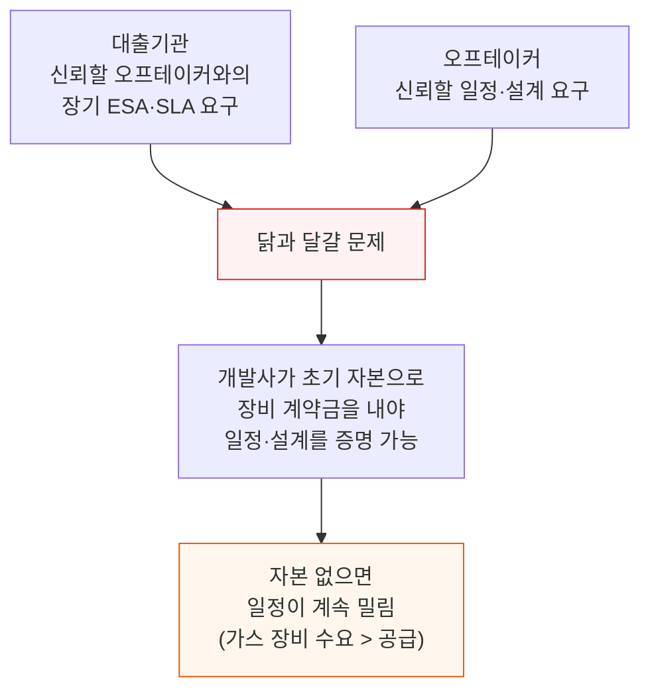

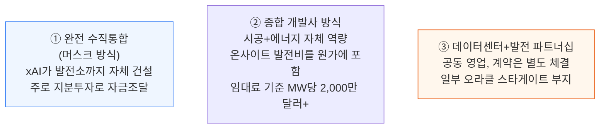

이 복잡함이 만들어낸 새로운 사업자가 EaaS(Energy-as-a-Service) 업체, 이른바 새로운 "BTM 유틸리티"다. VoltaGrid 같은 업체는 장비만 파는 게 아니라 확정 용량·가동률을 보장하는 장기 계약으로 전력 자체를 공급한다.

발전기 임대부터, 영구 발전소·파이프라인이 인허가·시공·시운전되는 동안 압축천연가스를 트럭으로 실어나르는 "가상 파이프라인"까지 다 한다. VoltaGrid는 Vantage Datacenters 같은 최상위 개발사와 수 GW 규모 계약을 따내며 이 흐름의 승자가 됐다.

Williams·Solaris도 급성장 중이며, Bloom Energy·Enchanted Rock처럼 제조사가 직접 EaaS로 나서는 경우도 늘고 있다.

이런 자본 장벽 때문에 BTM이 전력망보다 구조적으로 불리한가? **예전엔 그랬지만 지금은 아니다.** 미국 전력망 제약이 실시간으로 두 가지 방향에서 이를 뒤집고 있다.

① 전력망 여유 용량이 고갈되면서 GW급 신규 데이터센터는 이제 GW급 자가발전을 함께 지어야 해, 저렴한 GW급 계통연계 자체가 더는 존재하지 않는다.

② 대부분의 유틸리티는 느리고 불안정한데, 유틸리티 ESA는 지연·가동률 미달에 대한 위약금이 BTM 계약만큼 강하지 않다 — 속도와 실행 신뢰도가 중요한 GW급 프로젝트에서 BTM의 경쟁력이 점점 커지는 이유다.

그 결과 데이터센터 개발사들은 에너지 전담 조직을 자체적으로 키우며 BTM 발전소까지 포함한 완전 턴키 상품을 오프테이커에게 제시하는 쪽으로 더 정교해지고 있다.

---

## 5. 1단계 - 인허가

**📌 핵심:**
- 가장 빠른 주(州)에서도 온사이트 발전 대기오염 인허가(air permit)는 1년 이상 걸릴 수 있고, 실제로 이미 여러 프로젝트를 지연시키고 있다 — 그래서 어디에 신청서를 내느냐가 첫 번째 결정이다
- 모든 미국 대기오염 인허가는 잠재배출량(PTE)을 기준으로 삼는다 — PTE가 연 250톤을 넘기면 모델링·공개 의견수렴을 거치는 정밀심사(PSD)로 넘어가 몇 년이 더 걸릴 수 있고, 100톤을 넘기면 별도로 Title V 운영허가까지 필요하다 — 그 아래 구간에서는 주(州)마다 자기 기준을 따로 두고 있어 같은 설비도 주에 따라 절차가 완전히 다르다
- 연료전지는 화염 연소가 아니라 전기화학 반응으로 발전해 NOx 등 오염물질을 훨씬 적게 내뿜기 때문에, 같은 규모라도 정밀심사(PSD) 문턱을 피해가는 경우가 많다 — 다만 이는 규제가 가벼워지는 것이지 배출이 0이 되는 것은 아니고, 인허가 자체가 사라지는 것도 아니다
- 결론: 인허가를 받았다는 사실 자체는 입주 확정·자금조달·장비 구매·확정 가스 공급·착공 통지 중 어느 것도 증명하지 않는다 — 그래서 "인허가 완료"를 신규 BTM 프로젝트의 청신호로 보지 않는다

---

### 주(州)가 결정한다

물리적 난관 중 첫 번째는 인허가다. 지난 [온사이트 가스 딥다이브](https://newsletter.semianalysis.com/p/how-ai-labs-are-solving-the-power)에서 경고했던 대로, 가장 빠른 주에서도 온사이트 발전 대기오염 인허가는 1년 이상 걸릴 수 있다.

xAI Colossus 2의 사례가 이를 잘 보여준다. 부지는 테네시주 멤피스 툴레인로에 있지만, 발전소는 미시시피 경계 바로 건너편 사우스헤이븐(옛 듀크에너지 부지, xAI 계열사가 2025년 7월 매입)에 세웠다.

그 결과 대기오염 인허가 관할이 (Colossus 1 터빈을 인허가했던) 셸비 카운티에서 미시시피주로 넘어갔다. 미시시피는 이 터빈들을 최대 12개월간 인허가 없는 "임시" 설비로 가동하도록 허용했고, 2026년 3월 미시시피 퍼밋보드는 터빈 41기·1.2GW 규모 발전소를 영구 설비로 만장일치 승인했다.

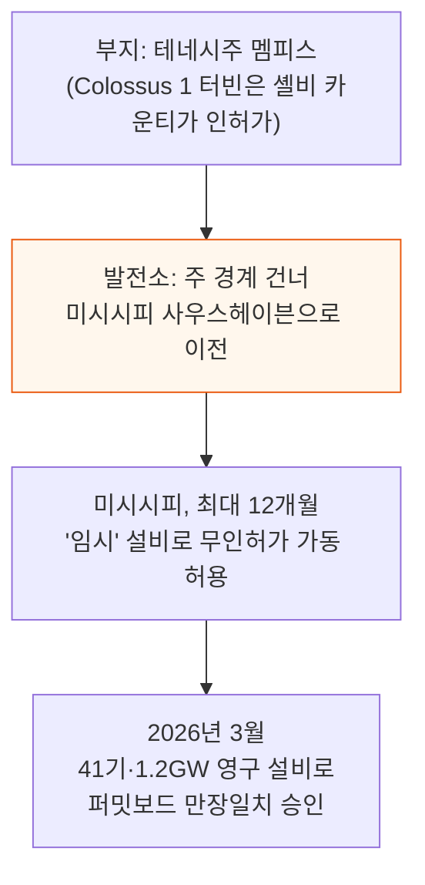

이 사례가 보여주는 더 넓은 교훈은, 개발사들이 이제 장비를 고르는 것만큼이나 관할구역도 신중히 고른다는 점이다. 같은 발전소라도 어떤 주에서는 표준 등록만 거치고, 어떤 주에서는 사안별 대기오염 인허가를 받아야 하며, 또 다른 주에서는 대기·입지·발전 승인을 각각 따로 받아야 한다.

이런 주 간 비대칭(그리고 저렴한 가스 가격)이 텍사스가 어느 주보다 많은 BTM 설비를 유치하는 이유다. 다만 절차 자체는 주가 결정해도 대부분의 기준은 연방이 정한다 — 환경보호청(EPA)이 핵심 대기질 기준·배출 정의·주요배출원 체계를 정하고, 주·지방정부가 이를 집행하며 자체 인허가 경로를 추가한다.

### 대기오염 인허가 문턱은 어떻게 작동하는가

PTE(Potential to Emit, 잠재배출량)는 설비가 일 년 내내 최대로 가동했을 때 오염물질별로 나올 것으로 계산되는 총량이다. 모든 미국 대기오염 인허가는 이 PTE를 시험한다. 가스발전기라면 질소산화물(NOx)과 일산화탄소(CO) 두 물질이 핵심이다.

연방 기준선은 둘이다 — 어느 오염물질이든 PTE가 연 250톤을 넘으면 모델링·공개 절차·최대 몇 년까지 늘어날 수 있는 정밀심사(주요배출원 심사)를 거쳐야 하고, 연 100톤을 넘으면 추가로 Title V 운영허가(연방 감독 2단계)까지 필요하다. 주(州)는 이 연방 기준선보다 낮은 자체 기준을 따로 둘 수 있다.

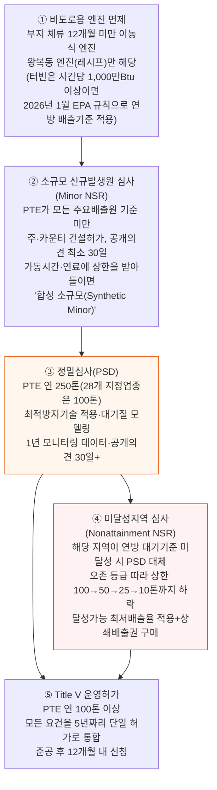

**📌 용어 풀이: 문턱 구간별 실제 사례와 세 가지 유의점**
> - 미시시피는 xAI의 사우스헤이븐 이동식 터빈을 주(州) 규칙으로 면제해줬는데, 이 결정은 현재 연방 법원에서 다퉈지고 있다
> - "합성 소규모(Synthetic Minor)"는 문턱을 넘을 수 있는 설비를 설치해두고, 가동시간·연료 사용에 집행 가능한 상한을 받아들여 배출량을 문턱 밑으로 묶어두는 전략이다 — 나중에 그 상한을 바꾸면 신규 설비처럼 전체 정밀심사를 다시 받아야 한다
> - 미달성지역 심사의 상한선은 지역마다 다르다: 댈러스·휴스턴은 25톤, 시카고·솔트레이크시티·라스베이거스는 50톤, 북버지니아·피닉스는 100톤이다
> - **유의점 1**: 단순 사이클 발전소의 250톤 기준선은 EPA의 공식 판단문이 아니라 (미시시피의 xAI 인허가를 포함한) 감독기관들의 일관된 관행에 근거한다
> - **유의점 2**: 주마다 연방 기준선 아래에서 다르게 움직인다 — 텍사스는 모든 신규 설비에 방지기술을 요구하고, 버지니아는 NOx 40톤을 넘으면 인허가하며, 캘리포니아 일부 지역은 하루 10파운드부터 규제를 건다
> - **유의점 3**: 어느 문턱 단계든 연방 배출기준은 그대로 적용된다 — 2026년 1월 규칙은 기저부하로 돌아가는 대형 신규 터빈에 NOx 5ppm 하한을 정해, 처음부터 선택적 촉매환원(SCR) 장치가 사실상 필수가 됐다

작은 배출률도 캠퍼스 규모가 되면 연간 총량이 커진다. 예컨대 통제된 NOx 배출률 kWh당 0.10g을 적용하면, 250MW를 연 8,760시간 가동할 때 배출량은 약 241 US 쇼트톤이 되고, 같은 계산으로 약 259MW에서 250톤 기준선에 닿는다.

실제 답은 장비의 배출 통제 수준, 적용 문턱, 감독기관이 몇 개 설비를 하나의 배출원으로 묶어 세느냐에 달려 있다.

그래서 개발사들은 발전소 규모와 운영 계획을 동시에 설계한다 — 프로젝트와 규정이 허용하면 1차분을 먼저 가동하며 더 큰 규모의 승인을 계속 진행하는 단계적 인허가도 가능하다. 다만 가동시간·배출 한도가 실제 운영 계획과 충돌하지 않고 집행 가능해야 하며, 감독기관은 캠퍼스 전체가 어떻게 돌아갈지에 대한 신뢰할 만한 계획을 요구한다.

### Project Jupiter - 초고속 설계 변경의 기록

오라클 Project Jupiter는 인허가가 어떻게 시설 전체의 재설계를 초고속으로 강제하는지 보여주는 사례다.

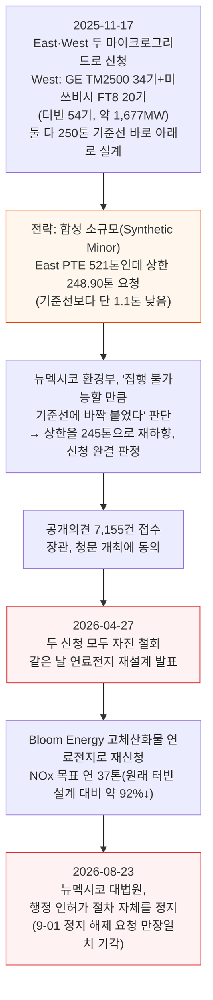

법원의 정지는 신청의 실체적 판단이 아니라 절차 자체를 멈춘 것이며, 감독기관의 결정 시한은 2026년 11월 23일이다.

### 연료전지라는 탈출구

연료전지는 인허가에서 가장 까다로운 부분을 피해가는 탈출구이지, 인허가 절차 자체를 없애주는 것은 아니다. 화염 연소가 아니라 전기화학 반응으로 발전하기 때문에 비슷한 규모의 터빈·왕복동 엔진 함대보다 NOx 등 통상 오염물질을 훨씬 적게 내뿜는다.

부지·구성에 따라 정밀심사(PSD) 문턱 아래로 유지돼 표준·소규모 경로를 탈 수 있다. 다만 여전히 인허가가 필요하고 CO₂와 소량의 다른 오염물질도 배출한다 — 규제 부담이 가벼워지는 것이지 배출이 0인 것은 아니다.

- **AEP 오하이오 · AWS 힐리아드 부지(72.9MW Bloom 설비)**: 주요배출원 문턱 아래에 머물렀지만, 그래도 오하이오 EPA 대기오염 인허가와 별도의 주 입지 승인이 필요했고, 인허가 자체는 2025년 11월 힐리아드시가 이의를 제기했다
- **Nebius 첫 미국 BTM 배치**: 기존 계획했던 연소식 발전을 328MW Bloom 연료전지로 교체(10년 전력계약), 더 빠른 배치와 가벼운 인허가 부담을 이유로 들었다
- **텍사스의 한 투기성 신청**: 560MW Bloom 연료전지 발전소가 900달러짜리 표준허가 수수료만 내고 2025년 12월 19일 접수에서 2026년 1월 14일 승인까지 갔다 — TCEQ는 이 설비가 PSD·Title V 어느 기준으로도 주요배출원이 아니라고 결론냈다

표준허가는 제안된 장비 구성이 미리 정해진 배출 범위 안에 들어맞는다는 사실만 확인해줄 뿐, 확정 입주사·자금조달·구매 완료된 장비·확정 가스 공급·착공 통지 중 어느 것도 증명하지 않는다. 그래서 "인허가 완료"를 신규 BTM 프로젝트의 청신호로 취급하지 않는다.

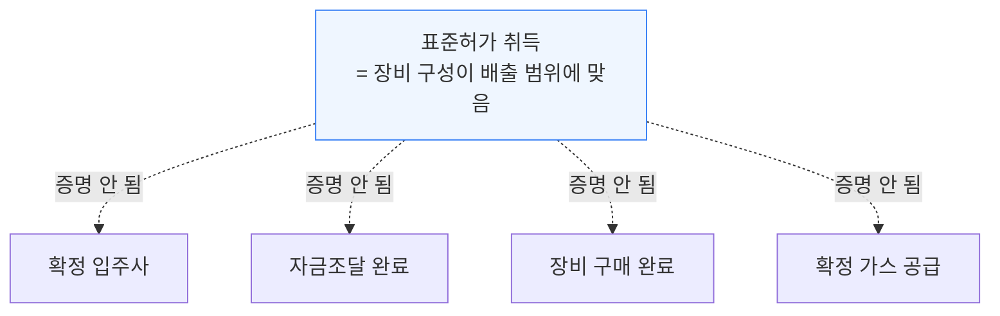

물 인허가도 자주 간과되는 제약이다. 라디에이터로 식히는 왕복동 엔진은 열을 그대로 공기 중에 버리므로 공정수 수요가 매우 낮다.

반면 일부 단일 사이클 터빈은 NOx 억제를 위한 물·증기 분사가 지속적인 물 수요를 만드는데, 건식 저배출(DLE) 연소는 이 분사 자체를 피한다 — 기술 이름표보다 실제 터빈 패키지가 무엇인지가 더 중요하다(예: Pratts FT8 MOBILEPAC은 물 분사 방식).

복합화력은 여기에 냉각 방식 결정이 하나 더 붙는다 — 습식 순환냉각은 증발·블로다운(용존물질 축적을 막기 위한 배출)으로 물을 잃고, 건식냉각은 그 열을 공기로 내보낸다.

---

## 6. 2단계 - 가스

**📌 핵심:**
- 미국은 천연가스가 남아돈다 — 고유가가 시추 유인을 유지시키고, 원유 채굴의 부산물로 나오는 가스도 팔 곳을 찾아야 하며, 애팔래치아·헤인즈빌은 원유와 무관한 건성 가스를 넉넉히 공급한다. 진짜 어려운 부분은 그 가스를 옮기는 것이다
- 지도에 그려진 파이프라인 한 줄만으로는 부족하다 — 확정(firm) 계약은 최대 일일 물량·수급 지점·최소 인도 압력까지 못박지만 임시(interruptible) 서비스는 배관이 빠듯해지면 끊길 수 있어, 진짜 중요한 것은 발전소 계량기까지 실제로 도달할 수 있는 확정 가스량이다
- 연료 계약·파이프라인 신청 서류는 어느 부지가 실제로 가스를 받을 가능성이 높은지 가려내는 단서가 된다 — 인근에 파이프라인이 있다는 사실 자체는 큰 의미가 없지만, 확정 수송계약·서명된 가스공급계약·감독기관에 접수된 파이프라인 신청서는 신뢰도를 보여준다
- 결론: 텍사스는 자체적으로 파이프라인을 놓을 수 있어 가장 빠르지만, 뉴멕시코 Project Jupiter처럼 계약상 마감일이 지나도록 경로 승인조차 못 받는 사례도 있다 — 지리에 따라 이 단계의 난이도가 완전히 갈린다

---

가스 자체는 넉넉해도 이를 발전소 계량기까지 확실히 가져오는 것은 별개의 문제다. 확정 계약은 최대 일일 물량·수급 지점·(합의 시) 최소 인도 압력까지 규정하지만, 임시 서비스는 배관망이 빠듯해지면 언제든 끊길 수 있다.

물리적 연료 시스템도 장애를 버텨야 해서, 부지에 따라 독립된 인입선 여러 개, 이중화된 내부 배관망, 저장 LNG, 이중연료 대응력, 입구 압력이 필요하면 이중화된 승압압축까지 갖춰야 한다.

가스 품질도 변수다 — 메탄가(methane number)·발열량·워비 지수(Wobbe index)가 장비의 연료 허용 범위를 벗어나면 제어를 바꾸거나 출력을 낮춰야 한다.


- **텍사스**: 크루소는 애빌린 Duroc 발전소까지 16인치 관을 자체 신청했고, Sweetwater 개발사 Trailblazer Infrastructure는 세금증분금융(TIF) 계획에 31마일 확장 구간 예산 1억 2,000만 달러를 반영했다 — 여기에 ERCOT의 연계 규정과 전국 최저 수준 가스 가격까지 더해져, 텍사스가 이 산업의 상당 부분을 유치하는 또 하나의 이유가 된다
- **루이지애나**: Energy Transfer 자회사 ETC Tiger Pipeline이 Franklin Farms 지선(13.2마일·36인치·일 10억 입방피트)을 지어 엔터지 루이지애나의 신규 복합화력을 공급하고, 그 전력이 다시 전력망을 거쳐 메타의 Hyperion 캠퍼스로 간다 — 하역사(shipper)는 메타가 아니라 엔터지라, 이는 BTM이 아니라 유틸리티가 공급하는 경로다. 압축 설비가 전혀 없는데도 2026년 7월 연방 신청부터 2028년 2월 상업운전까지 19개월이 걸린다
- **뉴멕시코**: 다시 오라클 Project Jupiter 이야기다 — 캠퍼스는 Transwestern이 짓는 Green Chile 파이프라인에서 가스를 받을 예정이었다. 계약상 상업운전일은 올해 8월 15일이었지만 경로 승인조차 나기 전에 그 날짜가 지나갔고, 8월 14일 Transwestern은 새 상업운전일을 2027년 2월 1일로 신청했다 — 연방 절차는 이례적으로 빠르게 움직이고 있지만(향후 두 달 안에 FERC 명령 필요), 그만큼 빠른 인허가를 받은 유사 사례는 기록에 없고 추적 중인 33개 유사 프로젝트 중 공개의견 마감 전에 승인된 사례도 없다 — 첫 가스 공급은 2027년 4\~5월, 2.45GW 완전 가동은 2028년 중반으로 추정하지만 그 전에 넘어야 할 관문이 여럿 남아 있다

두 가지 관찰도 눈에 띈다. Energy Transfer는 Nexus Hubbard 캠퍼스에 일 1억 5,000만 입방피트를 계약했는데, 이는 실제 발주된 왕복동 엔진 기준 약 750MW를 돌릴 수 있는 양이다.

그런데 이 캠퍼스의 대기오염 인허가는 5,230MW 규모 함대를 대상으로 하고 있어, 계약된 가스보다 약 7배 많은 양이 필요하다. 추가 가스 계약이 뒤따를 예정이거나, 인허가를 가스 계약에 앞선 헤지 수단으로 먼저 확보해둔 것으로 보인다.

리버티에너지는 PowerBridge와의 합작으로 서부 텍사스에 2GW 캠퍼스를 계획 중이다. 2027년 4분기 목표 1차분(300MW 이상)은 ERCOT의 Batch Zero 절차를 거쳐 BTM으로 먼저 가동하고, 2028년에는 규모 미정의 전력망 연결도 검토한다고 2026년 7월 22일 투자자들에게 밝혔다.

---

## 7. 3단계 - 장비

**📌 핵심:**
- 발전 장비는 여전히 크게 세 갈래다 — 가스터빈(산업용·항공유도·대형 프레임), 왕복동 엔진(레시프, 고속형·중속형), 연료전지(Bloom Energy 고체산화물이 수주의 사실상 전부) — 터빈이 초기 발주 대부분을 흡수하며 이미 매진돼 첫 납기 슬롯이 2030년 이후로 밀렸고, 유틸리티와도 슬롯을 다퉈야 한다
- 유틸리티는 레시프를 상대적으로 덜 원해서, BTM AI 컴퓨트 발주는 레시프 쪽으로 뚜렷하게 옮겨가고 있다 — 캐터필러는 대형 레시프 생산량을 2024년 대비 약 3배로, INNIO는 연간 생산능력을 2025년 3.5GW에서 2030년 약 10GW로 약 3배 늘릴 계획이다
- 공급 부족이 중고 시장까지 만들었다 — 확보된 납기 슬롯이 고정가 대비 16%, 모든 비용을 반영하면 46% 프리미엄에 거래된다는 것이 확인된 사례다 — 그 프리미엄으로 사는 것은 5년 뒤가 아니라 1\~2년 안(또는 그보다 빠른) 납기와 더 빠른 전력화다
- 결론: 발전 장비 자체보다 BoP(Balance of Plant, 변압기·중전압 스위치기어·e-하우스 등 주변 전기설비)가 새로운 병목으로 떠오르고 있다 — 이 설비들은 표준화돼 있어 데이터센터 자체의 전기설비 수요와도 겹치기 때문에 초과수요 상태다

---

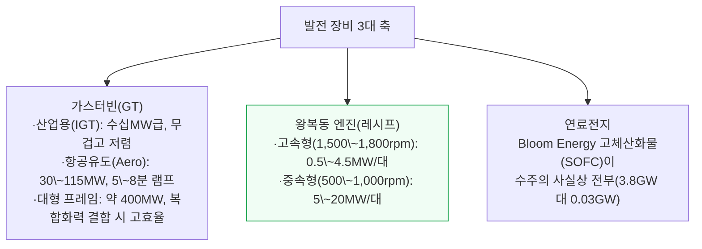

고속형 예시로는 INNIO 옌바허 Type 6·캐터필러 G3520이, 중속형 예시로는 Wärtsilä 34SG·31SG·50SG와 INNIO J920, Everllence 51/60G가 있다.

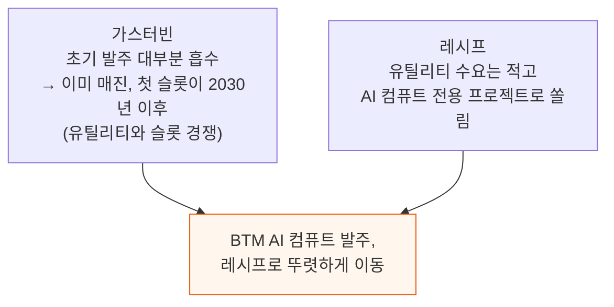

EROCK·FTAI Power·Dynamis 같은 신흥 업체와 INNIO·Wärtsilä·캐터필러·커민스·Bloom Energy가 GEV 같은 기존 강자보다 더 공격적으로 증설하며 데이터센터 시장에 더 많은 물량을 돌리고 있다.

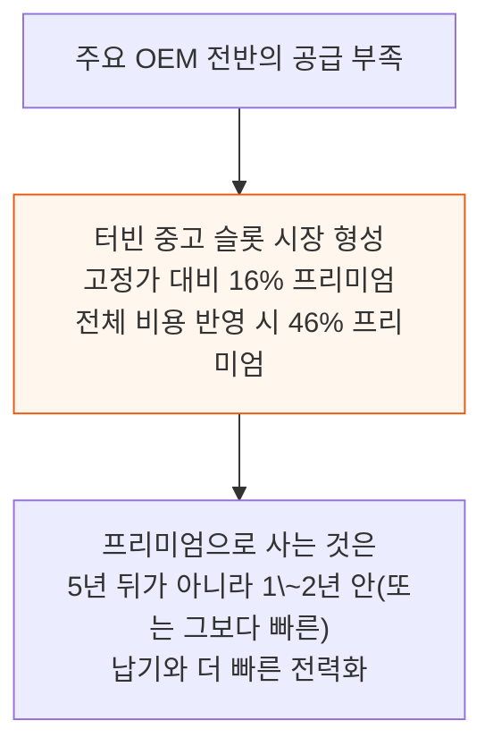

이 중고 시장의 배경에는 투기성 발주도 있다 — 실제 배치할 데이터센터 부지 없이 터빈을 사들이거나 최소구매계약에 계약금을 내는 경우로, 주로 가스터빈 시장(특히 GEV·지멘스 에너지 같은 기존 강자)에서 나타난다. 해당 장비는 여전히 품귀·고수요 상태라 일부 "투기꾼"은 앞서 본 중고가 프리미엄으로 상당한 보상을 받았다.

### BoP 없이는 BTM 발전소도 없다

발전 장비가 BTM 논의의 중심처럼 보이지만, 실제로는 BoP(Balance of Plant)로 관심이 옮겨가고 있다. 변압기·중전압 스위치기어·전기설비를 담는 e-하우스가 도착하지 않으면 발전 장비가 아무리 완비돼도 캠퍼스는 대기해야 한다.

집전 설비와 제어시스템이 여러 발전기의 출력을 하나로 묶어야 비로소 "발전소"가 완성된다.

이런 전기설비(대개 중전압, 규모에 따라 고전압)는 표준화돼 있는 데다 데이터센터 자체의 전기설비([전기 시스템 딥다이브](https://newsletter.semianalysis.com/p/datacenter-anatomy-part-1-electrical) 참고)와도 수요가 겹쳐 초과수요 상태다.

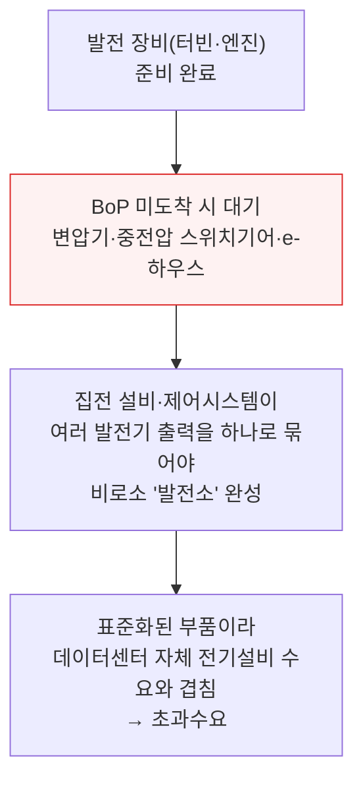

---

## 8. 4단계 - 건설·시운전·인력

**📌 핵심:**
- 자본·인허가·가스·장비가 다 풀려도 발전소를 짓고 계약된 SLA 수준으로 운영하려면 숙련 인력·시공사·EPC가 필요하다 — 데이터센터 건설 인력 부족은 2027년 기준 28만 8,000명으로 추산되고, 전기공이 현장 인시(人時)의 약 30%(물 냉각 확대로 2030년엔 약 40%까지 상승 전망)를 차지한다
- 기계·전기 작업을 공장으로 옮기는 모듈러·프리팹 방식은 현장 인력을 약 63%, 현장 면허 전기공 시수를 약 85% 줄여준다 — 그래서 프리팹 e-하우스·스키드형 발전소·완전 모듈러 상품이 확산되는 것은 일정 단축뿐 아니라 인력난 회피 수단이기도 하다
- 발전 유형마다 필요한 직군이 다르다 — 복합화력(CCGT)은 보일러메이커(미국 내 1만 200명, 연 이직 약 800명, 향후 감소 전망)·배관용접공 같은 희소 직군이 필수인 반면, 레시프는 이들 없이 전기공·밀라이트만 있으면 되지만 그 결과 발전소가 데이터센터 본체와 같은 인력을 놓고 경쟁하고, 연료전지는 희소 직군이 아예 필요 없지만 다GW 규모에서는 수백 개 뱅크+슈퍼커패시터·BESS로 전례 없는 구성이 된다
- 결론: 시운전은 끝이 아니다 — 영구 섬 운전 설비는 일상 운영감시·원격 모니터링·현장 대응·정기 정비·부품 재고까지 계속 필요해, Bloom Energy·EROCK·PROENERGY처럼 설치부터 유지보수(O&M)까지 수직통합하는 업체가 늘고 있다

---

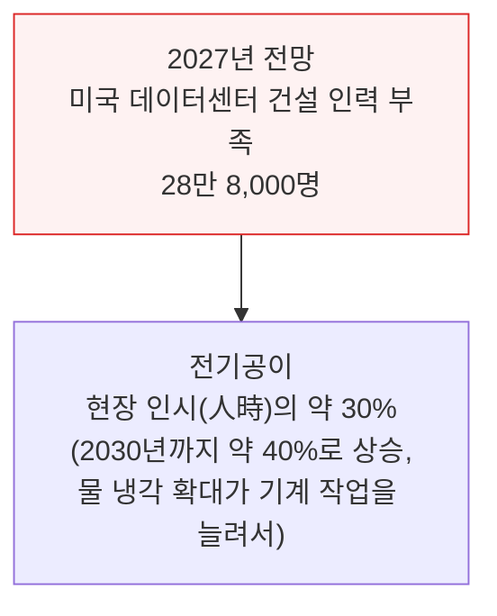

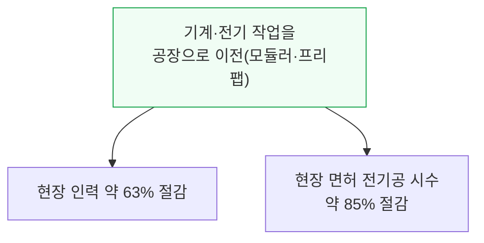

미국은 수십 년간 발전소를 지어온 나라라 인력 풀이 두텁고 비용도 데이터센터 건설보다 낮다. 대형 복합화력(CCGT)은 정점 인력이 MW당 시공인력 약 0.5명 수준이다.

캘리포니아 546MW 팔로마 발전소는 정점 인력 283명, 오하이오 1,875MW 건지 발전소는 15년 뒤 지어졌는데도 거의 1,000명 수준이었다. 그래서 GW급 캠퍼스에서 발전소 건설은 정점 인력의 5분의 1\~4분의 1 정도를 차지한다.

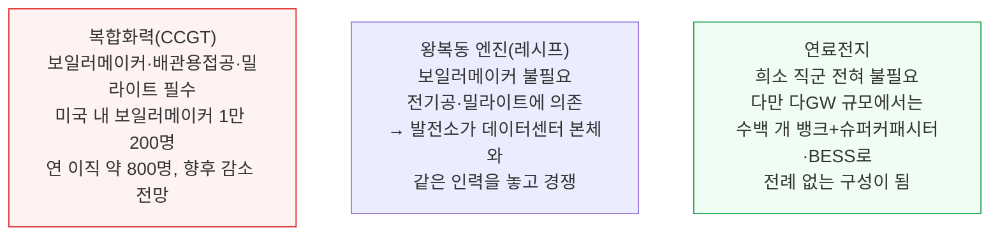

이런 이유로 "인력이 덜 드는" 발전 방식이 최종 고객에게 점점 더 매력적이다 — [2028년 미국 전력망이 여유 용량을 다 소진하는](https://newsletter.semianalysis.com/p/us-grid-constraints-towards-40gw) 이후에는 이런 방식이 데이터센터 전력 제약을 푸는 주된 수단이 될 것이다.

시운전을 마쳤다고 끝이 아니다. 영구 섬 운전 설비는 일상 운영감시·원격 모니터링·현장 대응·정기 정비·부품 재고·비계획 작업 대응 인력까지 계속 필요하며, 이 주기는 가동시간으로 측정된다.

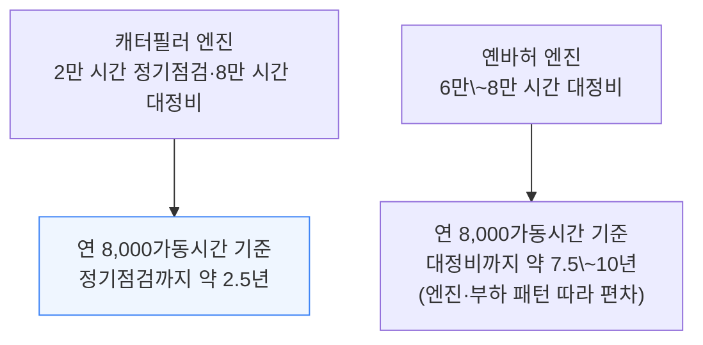

이 문제(희소 직군·지속 운영 부담)를 풀기 위해 일부 OEM은 수직통합으로 가고 있다. Bloom Energy가 대표적이다 — 터빈·엔진만큼 널리 검증되지 않은 기술이라 설치·O&M 대부분을 직접 맡아 직원을 채용·훈련한다.

트럭 개조형 소형 엔진을 쓰는 EROCK도 설치·O&M이 전통적인 터빈 발전소보다 훨씬 단순해 같은 전략을 쓰고, PROENERGY도 필요시 EPC·O&M을 직접 수행할 수 있는 대규모 자체 인력을 보유하고 있다고 밝힌다.

---

## 9. 5단계 - 섬 운전의 물리학

**📌 핵심:**
- xAI Colossus 1에서 가스터빈을 GPU 부하에 맞추는 일이 예상보다 훨씬 어려웠다 — 초당 여러 번 10\~20MW씩 요동치는 흔들림이 터빈-발전기 축의 비틀림 진동 모드를 자극해 축 수명을 갉아먹었고, xAI는 1차 대응으로 테슬라 메가팩(BESS) 150MW를 배치했다
- 현대 가스터빈을 인허가 가능하게 만들어주는 연소기 기술은 정격부하의 약 50%(터다운 개조 시 약 35%) 이상에서만 배출 성능을 유지한다 — AI 학습 부하처럼 크고 빠르게 흔들리는 부하가 이 하한선 밑으로 터빈을 밀어내면 파일럿 연료가 추가되거나 확산연소 모드로 전환되며 NOx·CO·미연탄화수소가 한꺼번에 급증한다 — 인허가 자체가 이 하한선을 전제로 작성돼 있다
- 전력망 연결 발전소는 관성(주파수 급변을 버텨주는 회전 질량)과 고장전류(차단기가 단락을 알아채고 끊게 해주는 순간 대전류)라는 두 가지를 전력망에서 공짜로 빌려 쓰는데, 섬 운전 발전소는 이 둘을 스스로 만들어야 한다 — 엔진·터빈은 고장 시 정격전류의 5\~10배를 공급하지만 배터리·태양광·연료전지는 전자장치가 약 1.2\~2배로 막아둬, 일반 과전류 보호장치가 이를 감지할 여유를 잃는다 — 인버터에만 의존해 지은 섬은 자기 회로의 단락조차 스스로 끊지 못할 수 있다
- 결론: 연료전지는 이 문제를 슈퍼커패시터로 푼다 — Bloom의 용량 비율은 출력 기준 약 3:2로 확인되는데, 이를 그대로 적용하면 Project Jupiter의 2.45GW는 약 1.6GW의 슈퍼커패시터를 필요로 해 기존 최대 선례(58MW)를 훌쩍 뛰어넘는 규모다

---

```mermaid
flowchart TD
    Jitter["xAI Colossus 1 실측<br/>초당 여러 번 10\~20MW 요동"] --> Torsion["터빈-발전기 축의<br/>비틀림 진동 모드를 자극<br/>→ 축 수명 소모"]
    Torsion --> Fix["1차 대응: 테슬라 메가팩(BESS) 150MW 배치"]
    Fix --> Battle["새로운 대립 구도:<br/>BESS 대 플라이휠·동기조상기(SynCon)"]

    style Torsion fill:#fef2f2,stroke:#dc2626
```

```mermaid
flowchart TD
    Floor["연소기 배출성능 유지 하한<br/>정격부하의 약 50%(터다운 개조 시 약 35%)"] --> Below["AI 학습 부하가<br/>이 하한 밑으로 떨어지면"]
    Below --> Spike["파일럿 연료 추가 또는<br/>확산연소 모드로 전환<br/>→ NOx·CO·미연탄화수소 모두 급증"]

    style Spike fill:#fef2f2,stroke:#dc2626
```

```mermaid
flowchart TD
    Grid2["전력망 연결 발전소<br/>전력망이 관성·고장전류를 대신 제공"] --> Island2["섬 운전 발전소는<br/>이 두 가지를 스스로 만들어야 함"]
    Island2 --> Engine["엔진·터빈<br/>고장 시 정격전류의 5\~10배 순간 공급"]
    Island2 --> Inverter["배터리·태양광·연료전지<br/>전자장치가 약 1.2\~2배로 제한<br/>→ 일반 과전류 보호장치의 여유 부족"]

    style Engine fill:#f0fdf4,stroke:#16a34a
    style Inverter fill:#fff7ed,stroke:#ea580c
```

연료전지는 스택이 램프업하는 동안 순간 부하 증가를 슈퍼커패시터가 대신 흡수하는 방식으로 이 문제에 답한다.

실사(channel check) 결과 Bloom의 용량 비율은 출력 기준 약 3:2로 확인되는데, 이를 그대로 적용하면 Project Jupiter의 2.45GW 규모는 약 1.6GW의 슈퍼커패시터를 필요로 한다 — 기존 최대 선례인 58MW를 훌쩍 뛰어넘는 규모다.

---

## 10. 가스 없이도 할 수 있는가

**📌 핵심:**
- 재생에너지는 연소원이 없어 인허가를 훨씬 쉽게 통과하고 연료비도 0이며 파이프라인도 필요 없다 — 하지만 발목을 잡는 건 전기적 물리학이다: 오프그리드에서는 모든 전력이 인버터를 거치는데, 인버터 기반 전원은 단락 시 정격전류의 아주 작은 배수만 내보내 일반 과전류 보호장치가 안정적으로 작동할 여유가 없다 — 그래서 재생에너지만으로 섬을 지으려면 그리드-포밍 인버터와 동기조상기(SynCon)를 추가로 사야 한다
- 크루소·레드우드 머티리얼즈의 네바다주 스팍스 마이크로그리드는 2025년 6월부터 태양광 12MW+2차전지 63MWh(전력망은 백업)로 가동 중이며, 2026년 3월 발표 기준 7개월 연속 가동 가용률 99.2%를 기록하고 20MW로 증설을 발표했다 — 미국 평균 전력망 가용률 약 99.93%(3개 나인)를 자체 발전만으로 맞추려면 설비를 그만큼 과잉 설계해야 한다
- 오프테이커들은 정전 허용치에 점점 관대해지고 있다 — 마이크로소프트는 애틀랜타 Fairwater 부지를 안정적인 유틸리티 전력을 이유로 선정하며 "3개 나인(99.9%) 비용으로 4개 나인(99.99%) 가용률"이 가능하다고 밝혔고, 이 덕분에 온사이트 발전·UPS·이중 배선을 GPU 함대에 아예 안 둘 수 있게 됐다
- 결론: 현재 여섯 관문을 전부 통과하는 방식은 없다 — 가스는 인허가와 압력 관련 희소 직군에서, 연료전지는 안정화 비용과 검증되지 않은 규모에서, 태양광·배터리는 섬 운전 자체의 전기적 물리학에서 각각 걸린다

---

```mermaid
flowchart TD
    Renew["재생에너지<br/>연소원 없음 → 인허가 수월<br/>연료비 0, 파이프라인 불필요"] --> Catch["함정: 전기적 물리학<br/>인버터 기반 전원은 단락 시<br/>정격전류의 작은 배수만 공급"]
    Catch --> Need["일반 과전류 보호장치가<br/>안정적으로 작동할 여유 부족<br/>→ 그리드-포밍 인버터+동기조상기(SynCon) 필요"]

    style Catch fill:#fef2f2,stroke:#dc2626
```

배터리는 가스 프로젝트 안에서도 자리를 확보하고 있다 — 순간 부하를 버텨주는 라이드스루, 부하 평탄화, 백업 전원 역할이다. 리버티에너지 최고재무책임자는 2026년 7월 23일 자사 데이터센터 고객 전반에서 배터리 출력 용량이 평균적으로 가스 용량의 50% 수준이라고 밝혔다.

```mermaid
flowchart TD
    Crusoe["크루소·레드우드 스팍스 마이크로그리드<br/>태양광 12MW+2차전지 63MWh<br/>전력망은 백업"] --> Result["2026-03 발표<br/>7개월 연속 가용률 99.2%<br/>→ 20MW로 증설"]
    Grid3["미국 평균 전력망 가용률<br/>약 99.93%(3개 나인)"] --> Overbuild["자체 발전만으로 맞추려면<br/>설비를 그만큼 과잉 설계해야 함"]

    style Result fill:#f0fdf4,stroke:#16a34a
```

```mermaid
flowchart TD
    MS["마이크로소프트 애틀랜타 Fairwater<br/>안정적 유틸리티 전력을 이유로 선정"] --> Deal["3개 나인(99.9%) 비용으로<br/>4개 나인(99.99%) 가용률 달성 가능"]
    Deal --> Skip["온사이트 발전·UPS·이중 배선을<br/>GPU 함대에서 생략 가능"]

    style Deal fill:#eff6ff,stroke:#3b82f6
```

SemiAnalysis 산업재 모델은 앤트로픽·오픈AI·메타를 포함한 30개 이상의 데이터센터 설계를 부품 단위까지 추적하는데, 전반적으로 이중화(Redundancy) 수준을 낮추는 뚜렷한 흐름이 확인된다.

```mermaid
flowchart TD
    Gas["가스<br/>인허가·압력 관련 희소 직군에서 걸림"]
    FuelCellG["연료전지<br/>안정화 비용·검증되지 않은 규모에서 걸림"]
    SolarG["태양광·배터리<br/>섬 운전 자체의 전기적 물리학에서 걸림"]

    style Gas fill:#fef2f2,stroke:#dc2626
    style FuelCellG fill:#fff7ed,stroke:#ea580c
    style SolarG fill:#fff7ed,stroke:#ea580c
```

---

## 11. 앞으로 어디로 가는가

**📌 핵심:**
- 온사이트 1차 전원을 쓰는 모든 데이터센터는 결국 같은 질문을 마주한다 — 전력망이 마침내 연결되면 이 발전 설비는 어떻게 되는가? 대부분의 부지는 영구 오프그리드가 아니라, 계통연계 대기열이 풀릴 때까지 빠르게 가동하기 위한 "다리"로 설계돼 있다
- Colossus 1처럼 터빈을 1차 전원에서 백업으로 전환하는 사례가 이미 나왔지만, 앞으로 가동될 수십 GW 규모 BTM 발전 장비 전부가 이 길을 따를 수는 없다 — 남은 선택지는 피커·예비전력으로 전환, 유틸리티 요금기저(rate base)로 매각, 다음 부지로 재배치, 컴퓨트와 무관하게 수요유연성 계층으로 남기 등이다
- 텍사스의 신규 대형부하 접속 유예(모라토리엄)는 BTM에 강한 순풍이다 — 대규모 하이퍼스케일 임대를 따내는 프로젝트일수록 점점 더 BTM 방식을 택하고 있는데, 일정에 대한 확실성을 훨씬 더 많이 제공할 수 있기 때문이다
- 결론: 전력망은 계속 확장되겠지만 AI 인프라 수요보다는 확실히 느릴 것이다 — 그래서 모든 BTM 발전소가 결국 전력망에 연결될 것으로 보지 않으며, 오히려 BTM 캠퍼스는 점점 더 커지고 다양한 에너지원을 통합한 진짜 마이크로그리드(혹은 매크로그리드)로 발전할 것으로 본다 — 이는 태양광·배터리에 강한 순풍이 될 전망이다

---

```mermaid
flowchart TD
    Q["전력망이 연결되면<br/>기존 BTM 발전 설비는 어떻게 되는가"] --> P1["피커·예비전력으로 전환"]
    Q --> P2["유틸리티 요금기저(rate base)로 매각<br/>또는 다음 부지로 재배치"]
    Q --> P3["컴퓨트와 무관한<br/>수요유연성 계층으로 잔류"]

    style Q fill:#eff6ff,stroke:#3b82f6
```

```mermaid
flowchart TD
    Grid4["전력망 확장 속도"] --> Slower["AI 인프라 수요 증가 속도보다<br/>확실히 느림"]
    Slower --> NotAll["모든 BTM 발전소가<br/>전력망에 연결되지는 않을 전망"]
    NotAll --> Bigger["BTM 캠퍼스는 더 커지고<br/>다양한 에너지원을 통합한<br/>진짜 마이크로그리드(혹은 매크로그리드)로 발전"]
    Bigger --> Solar2["태양광·배터리에<br/>강한 순풍"]

    style Bigger fill:#f0fdf4,stroke:#16a34a
    style Solar2 fill:#f0fdf4,stroke:#16a34a
```

---

## 12. 승자와 패자

**📌 핵심:**
- 왕복동 엔진(레시프) 시장에서는 캐터필러·INNIO·롤스로이스·커민스를 선호한다 — 캐터필러·INNIO는 공격적 증설과 탄탄한 PaaS 파트너십으로 계속 수주를 이어갈 전망이지만, INNIO는 VoltaGrid가 발주의 40% 이상을 차지하는 고객 집중 위험을 지켜봐야 한다 — 커민스·Generac은 당분간 백업 전력 위주로 남을 전망이다(커민스의 상시가동 전용 엔진은 2028년에야 출시)
- 새로운 부품 시장도 열렸다 — 전압·주파수 흔들림에도 부하를 끊지 않고 버텨야 하는 규제(ERCOT 라이드스루 등)가 중전압 UPS(MV UPS)라는 신품목을 만들었다 — 기존 저전압 UPS 대비 MW당 원가가 더 높지만(약 150만 달러 대 약 120만 달러) 저장용량이 60분으로 대폭 늘어난 대신이다 — ABB·ON.energy·Prolec GE·EPC Power가 주요 수혜자로 꼽히고, 크루소의 5GW 계약 하나만으로도 약 75억 달러 규모 관련 수요가 발생한다
- 건설 슈퍼사이클도 진행 중이다 — 복합화력(CCGT) 건설 단가는 2018년 준공 기준 kW당 약 750달러에서 지금은 약 2,000달러로 뛰었는데, 이 증가분의 절반 가까이가 EPC(약 40%는 장비 제조사)에게 돌아간다 — 이 기회의 규모와 EPC 병목의 심각성을 볼 때 Primoris를 선호한다
- 결론: 레시프 발주 하나만 놓고 봐도 지금 넣으면 약 20개월 안에 가동되는데, CCGT는 60개월 이상 걸린다 — 리드타임이 계속 늘어나는 지금도 이 격차는 BTM 장비 시장 재편의 핵심 근거로 남아 있다

---

```mermaid
flowchart TD
    CatI["캐터필러·INNIO<br/>공격적 증설+PaaS 파트너십<br/>→ 지속 수주 전망<br/>(INNIO는 VoltaGrid 발주 비중 40%+가 리스크)"]
    RR["롤스로이스<br/>수주 강한 성장세<br/>신규 상시가동 제품 수주는 아직<br/>(상대가치 기준 비쌈, 리버티에너지 의존)"]
    CumGen["커민스·Generac<br/>당분간 백업 전력 위주<br/>(커민스 전용 엔진 2028년 출시,<br/>본격 기회는 2031년 이후)"]

    style CatI fill:#f0fdf4,stroke:#16a34a
    style CumGen fill:#fff7ed,stroke:#ea580c
```

```mermaid
flowchart TD
    Reg["전압·주파수 흔들림에도<br/>부하를 끊지 않고 버텨야 하는 규제<br/>(ERCOT 라이드스루 등)"] --> MVUPS["신품목: 중전압 UPS(MV UPS)<br/>부지 진입점 한 곳에 두는 대형 배터리"]
    MVUPS --> Cost["MW당 원가 약 150만 달러<br/>(기존 저전압 UPS 약 120만 달러 대비 상승,<br/>대신 저장용량 5분→60분으로 대폭 증가)"]
    Cost --> Winner["수혜: ABB·ON.energy·Prolec GE·EPC Power<br/>크루소 5GW 계약만으로 약 75억 달러 수요"]

    style MVUPS fill:#eff6ff,stroke:#3b82f6
    style Winner fill:#f0fdf4,stroke:#16a34a
```

전통적인 UPS 강자인 Vertiv는 이 흐름에서는 대응이 늦었지만, 모듈러 데이터센터 비중이 MW당 매출 기여도를 크게 끌어올려주는 다른 사업 부문 덕분에 여전히 데이터센터 테마의 유효한 선택지로 본다.

```mermaid
flowchart TD
    Old["2018년 준공 CCGT<br/>건설 단가 kW당 약 750달러"] --> New["현재 건설 단가<br/>kW당 약 2,000달러"]
    New --> Split["증가분의 약 절반은 EPC에게<br/>(장비 제조사 몫은 약 40%)"]
    Split --> Pick["기회 규모+EPC 병목 심각성<br/>→ Primoris 선호"]

    style New fill:#fff7ed,stroke:#ea580c
    style Pick fill:#f0fdf4,stroke:#16a34a
```

레시프 발주는 지금 넣으면 약 20개월 안에 가동되는데, CCGT는 60개월 이상 걸린다 — 리드타임이 전반적으로 늘어나는 와중에도 이 격차가 BTM 장비 시장 재편을 계속 뒷받침하고 있다.

---

*작성 진행률: 100% 완료*
*업데이트: 10\~12절(가스 없이도 할 수 있는가·앞으로 어디로 가는가·승자와 패자) 작성 완료, 전체 12개 섹션 완료*
