# Everyone Says Datacenter Moratoriums Are Killing the US Buildout. We disagree

> **출처**: [SemiAnalysis Newsletter](https://newsletter.semianalysis.com/p/everyone-says-datacenter-moratoriums)
> **저자**: Maya Barkin, Reyk Knuhtsen, Jeremie Eliahou Ontiveros, Dylan Patel
> **발행일**: 2026-09-15

---

## 📑 목차

### 전체 섹션
1. [무엇이 문제인가 - 2026년 규제 지형](#1-무엇이-문제인가---2026년-규제-지형)
2. [방법론 - 유예 건수와 지연 MW는 다르다](#2-방법론---유예-건수와-지연-mw는-다르다)
3. [지방 유예 - 실제 위험은 어디에 있나](#3-지방-유예---실제-위험은-어디에-있나)
4. [뉴욕 - 첫 주 단위 유예, 행정명령 62호](#4-뉴욕---첫-주-단위-유예-행정명령-62호)
5. [텍사스 - 감사 지시는 요란하기만 하다](#5-텍사스---감사-지시는-요란하기만-하다)
6. [펜실베이니아 - 유예까지는 가지 않았다](#6-펜실베이니아---유예까지는-가지-않았다)
7. [오리건 - 파이프라인이 시작되기 전에 멈추는 유예](#7-오리건---파이프라인이-시작되기-전에-멈추는-유예)
8. [주 단위 유예는 왜 만들기 어려운가](#8-주-단위-유예는-왜-만들기-어려운가)
9. [누가 득을 보는가](#9-누가-득을-보는가)

---

## 🔑 용어 정리

본문을 순서대로 읽기 전에 알아두면 좋은 용어들입니다. 자세한 수치와 설명은 본문에서 처음 등장하는 위치에 나옵니다.

- **모라토리엄(Moratorium, 개발 유예)**: 몇 달에서 1년 정도, 지방·주 정부가 새 데이터센터의 승인·인허가·착공을 일시적으로 막는 법적 조치 — 이미 받은 승인을 취소하는 게 아니라 새 신청 접수만 멈추는 경우가 대부분
- **노출 MW(Exposed MW) vs 지연 MW(Delayed MW)**: 유예 구역 안에 부지가 있다는 사실(노출)과 그래서 실제로 준공일이 밀린다는 사실(지연)은 다르다 — 이 구분이 이 기사 전체를 관통하는 핵심 셈법
- **행정명령(Executive Order, EO)**: 주지사가 의회를 거치지 않고 단독으로 내리는 명령 — 빠르게 시행할 수 있지만 법적 근거가 약해 다음 행정부나 법원이 뒤집을 여지가 있다
- **ERCOT 배치제로(Batch Zero)**: 텍사스 전력망 운영기관 ERCOT이 밀려 있는 대형 부하 접속 신청(약 205GW, 326개 신청자)을 한 번에 몰아서 심사하는 일회성 절차
- **뉴욕주 환경보전부(DEC, Department of Environmental Conservation)**: 뉴욕에서 데이터센터가 재량적 환경 인허가를 받으려면 거쳐야 하는 주 기관 — 행정명령 62호가 멈춘 것이 바로 이 기관의 재량 인허가다
- **RDCD법(Responsible Data Center Development Act)**: 뉴욕주 의회가 통과시킨 더 강한 법안 — 20MW 이상 데이터센터에 1년 유예를 걸고, 전기·물 요금 체계·공청회·지역사회 보상 같은 영구 규정까지 담았지만 주지사가 서명을 거부했다
- **탈병합(Deannexation)**: 특정 토지를 시 경계 안에서 빼내 경계 밖으로 옮기는 절차 — 그 시가 만든 조례(유예 포함)의 관할에서 합법적으로 벗어나는 우회로

---

## 1. 무엇이 문제인가 - 2026년 규제 지형

**📌 핵심:**
- 두 달 사이 뉴욕·텍사스·펜실베이니아·오리건 4개 주가 데이터센터를 겨냥한 조치를 냈고, 지난 1.5년간 지방정부 300곳 이상이 유예·금지를 표결했다 — 하지만 SemiAnalysis는 실제로 프로젝트 단위까지 추적한 결과 **진짜 지연은 약 2.3GW**뿐이라고 본다
- SemiAnalysis 데이터센터 산업 모델은 2027년 미국 신규 IT 용량을 **38GW**(2026년의 2배 이상)로 예측하며, 이 중 22GW는 이미 수직 건설 중이고 16GW는 계획 단계지만 대부분 자금조달과 부지 조성이 끝난 상태다
- 텍사스의 행정 지연(3\~4개월)은 계통 연결이 필요 없는 자가발전(BTM, 계량기 뒤 자가발전) 프로젝트에는 오히려 순호재다 — 6월 기사에서 2028년부터 신규 용량의 절반 이상이 BTM으로 공급될 것이라 밝혔고, 지난주에는 BTM 장비 확정 발주가 75GW까지 쌓인 것을 확인했다
- 결론: 유예 건수를 세는 보도는 늘고 있지만, 유예가 실제로 막는 MW를 세면 이야기가 완전히 달라진다 — 본 기사는 그 차이를 필지 단위로 증명한다

---

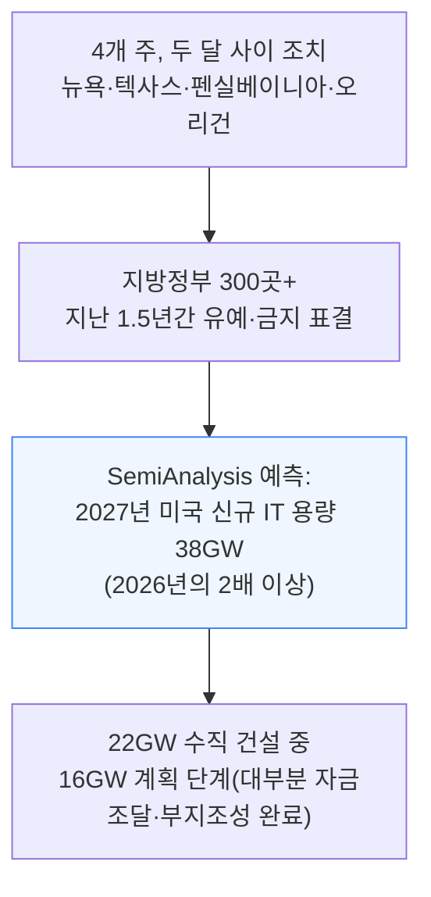

이 조사는 6,000개 이상의 데이터센터를 위성사진으로 추적하는 방법론에 기반하며, 지난 12개월간 2주 단위 업데이트에도 예측치는 거의 움직이지 않았다.

SemiAnalysis는 이전에도 비슷한 통념을 두 차례 반박했다. 1월에는 "데이터센터가 물을 다 빼앗는다"는 통념을, 6월에는 "2026년 미국 데이터센터 용량의 절반이 취소됐다"는 통념을 데이터로 깼다. 이번에는 유예 차례다.

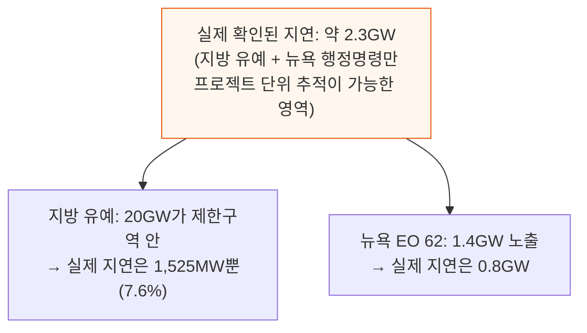

텍사스 ERCOT 대기열의 기저부하 프로젝트는 3\~4개월 정도 행정 지연을 더 받지만, 계통 연결이 필요 없는 BTM(계량기 뒤 자가발전) 프로젝트에는 오히려 순호재다. 6월 기사에서 2028년부터 신규 용량 절반 이상이 BTM으로 공급된다고 밝혔고, 지난주에는 BTM 장비 확정 발주가 75GW까지 쌓인 것을 확인했다.

**유예 건수는 실제 영향받는 MW 규모의 대체 지표가 될 수 없다** — 뒤에서 볼 브라운즈빌·스페이스X 탈병합 사례가 대표적인 허점이다. 유예가 실제로 영향을 미치려면 그 필지를 덮고 개발사가 아직 필요로 하는 승인을 막아야 한다. **그래서 실제 MW 영향은 필지 단위, 프로젝트 단위 분석으로만 확인할 수 있다.**

분명히 해두자면, 유예가 건설을 지연시킬 **수는 있다**. 다만 아직 그 정도 규모·강도에 이르지 못했을 뿐이며, 더 광범위하고 엄격해져야 실제 영향이 커진다. AI 랩들이 갈수록 수익을 내면서 데이터센터가 "정당한 몫" 이상을 지역에 내고 더 나은 이웃이 되는 것도 이런 반발을 상쇄하는 요인이다.

이 결론을 뒷받침하는 방법론은 다음과 같다.

- 400개 이상의 지방 조치·행동·제안을 17개 주에 걸쳐 추적하는 새 **데이터센터 유예 데이터베이스**(제안→발효→만료→해제→대체→기각까지 상태 추적)
- 6,000개 이상 시설을 다루는 프로젝트 단위 파이프라인(부동산 기록·인허가·전력사용 데이터·정보공개청구·위성사진)에 필지 단위로 매핑
- 리서치 에이전트로 보강한 분석팀이 각 제한의 관할 경계를 정확한 필지와 맞추고, 캠퍼스가 그 관할 안에 있는지, 개발사가 아직 확보 못 한 승인을 정말 필요로 하는지, 일정을 이미 막는 다른 요인은 없는지 실시간 위성사진으로 검증

수백 건의 제한과 수천 개 프로젝트를 이렇게 훑은 결과, 아래 네 가지 요인이 왜 수백 건이 적은 지연으로 이어지는지를 설명한다.

- ① 카운티 유예는 대개 시 경계에서 멈춘다
- ② 유예는 새 신청을 동결할 뿐 기존 승인을 취소하지 않는다
- ③ 짧은 유예는 2028년 이후 프로젝트가 그 승인을 필요로 하기 전에 만료된다
- ④ 소송이나 장비 리드타임 같은 다른 요인이 이미 일정을 막고 있을 수 있다

2026년 11월 선거를 앞두고, 유예는 개발을 영구히 막지 않으면서 지역 여론에 반응하는 손쉬운 수단이다 — 2026년 13개 법안이 본회의 표결에도 못 가고 폐기될 만큼, 이를 영구적 주 정책으로 바꾸는 일은 여전히 어렵다.

이 기사는 방법론과 지방 유예(20GW→1,525MW), 뉴욕·텍사스·펜실베이니아·오리건의 주 단위 조치, 추가 주 단위 유예 가능성, 마지막으로 누가 득을 보는지 순서로 이어진다.

---

## 2. 방법론 - 유예 건수와 지연 MW는 다르다

**📌 핵심:**
- 유예는 대부분 **새 신청 접수를 동결**하는 것이지 이미 내준 승인을 취소하는 게 아니다 — 목적은 100MW 이상 시설을 상정하지 않고 쓰인 낡은 조닝 규정을 정비할 시간을 버는 것과, 지역 반발에 영구 거부 대신 저비용으로 대응하는 것 둘 다다
- 유예 구역 노출과 실제 지연은 다르다 — 막 땅을 산 프로젝트는 인허가 한가운데인 프로젝트보다 훨씬 유연하고, 6개월 유예가 곧 6개월 지연을 뜻하지도 않는다(일정에 여유가 있거나 다른 제약이 이미 일정을 정하고 있으면 더더욱)
- 유예가 실제로 준공일을 움직이려면 **아홉 가지 조건이 동시에 전부** 참이어야 한다 — 필지에 닿고, 발효 중이고, 일정과 겹치고, 용도를 포괄하고, 그 승인이 실제로 필요하고, 재설계로 못 피하고, 프로젝트가 살아있고, 다른 우회로가 없고, 예외도 없어야 한다
- 결론: 이 조건 중 하나라도 어긋나면 유예는 무관해진다 — 그 누적 효과로 300건 이상의 지방 조치가 실제로는 약 1,525MW만 지연시킨다

---

모라토리엄(유예)은 100MW급 시설이 요구하는 전력·물·소음·토지 이용을 상상하지 못한 채 쓰인 낡은 조닝 규정을 정비할 시간을 벌어주려는 취지에서 나온다.

대부분의 경우 유예는 선출직 공무원에게 상대적으로 저비용인 대응 수단이기도 하다 — 투자·세수를 영구히 거부하지 않으면서 주민 목소리에 반응하고 있음을 보여주고, 전면 거부보다 법적 부담도 적다.

**유예 구역 노출(Exposed) MW가 곧 지연(Delayed) MW는 아니다.** 프로젝트가 유예 관할 안에 있어도 반드시 준공일이 밀리는 것은 아니다.
영향의 크기는 프로젝트가 개발 사이클의 어느 단계에 있느냐에 좌우된다 — 막 땅을 산 프로젝트는 인허가가 한창인 프로젝트보다 훨씬 유연하다.
일정 여유가 있거나 다른 제약이 이미 일정을 정하고 있다면, 6개월짜리 유예도 실제 준공을 6개월 늦추지 않는다.
6월 기사("2026년 미국 데이터센터 용량의 절반이 취소됐다는 말을 그만하라")에서 밝힌 대로, 초기 단계 지연은 근시일 내 용량 인도에 거의 영향이 없다.

유예가 실제로 프로젝트의 준공일을 움직이려면, **아래 조건이 동시에 전부** 참이어야 한다.

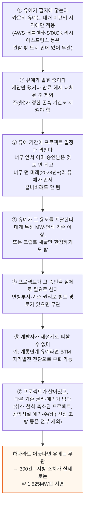

**노출은 반드시 프로젝트 단위, MW 트랜치 단위로 측정해야 하며, 한 주에서 몇 개 관할이 조치를 취했는지로 추론해서는 안 된다.**

### 사례: 펜실베이니아 스크랜턴 인근 노스포인트 캠퍼스

노스포인트의 스크랜턴 인근 캠퍼스는 유예가 실제로 작동하고 일정을 움직이는 드문 사례다.

- **필지에 닿음**: 부지가 타운십 안에 있고, 인접한 헤이즐턴시나 웨스트헤이즐턴 자치구 밖이 아니다
- **발효 중**: 타운십이 2026년 6월 결의안을 만장일치로 채택했다
- **일정과 겹침**: 유예 발효 당시 노스포인트는 필요한 특례 승인을 아직 받거나 신청하지 않았고, 첫 건물은 2026년 4분기 착공 예정이었다
- **용도를 포괄**: 결의안은 MW·면적 기준 없이 데이터센터 자체를 명시적으로 다룬다
- **승인이 실제로 필요**: 사유지라 지방 특례 승인과 부지개발 승인이 필요하고, 이를 우회할 연방 경로나 기존 권리가 없다
- **재설계로 못 피함**: 제한이 데이터센터 용도 자체에 걸려, 규모를 줄이거나 BTM으로 바꿔도 막힌 승인을 피할 수 없다
- **여전히 살아있음**: 노스포인트는 1억 6,500만 달러 규모 지역사회 보상 패키지까지 포함해 프로젝트를 계속 추진 중이다
- **우회로·예외 없음**: 개발협약·기득권 등 착공을 허용할 기존 권리가 없고, 공익시설 예외 등 관련 면제 대상도 아니다

이 모든 조건이 겹친 결과, 유예는 지방 인허가 절차를 2027년으로 밀어내는 결정적 제약이 됐다.

---

## 3. 지방 유예 - 실제 위험은 어디에 있나

**📌 핵심:**
- 2026년 9월 기준 전국 300곳 이상의 카운티·자치단체·타운십이 데이터센터 유예·금지를 채택했다(전체 데이터베이스는 400건 이상 추적) — 상위 4개 주(미시간·오하이오·노스캐롤라이나·조지아)가 전국 지방 조치의 약 절반을 차지해, **유예가 빠른 성장을 앞서기보다 뒤따라간다**는 것을 보여준다
- 2026년 8월 SemiAnalysis 자체 여론조사에서 미국인은 AI 전반에는 순호감(호감 46% vs 비호감 34%)이지만, 데이터센터 자체에는 순비호감(비호감 46%, 그중 강한 비호감 24% vs 호감 29%)이고 내 지역 신규 데이터센터에는 46%(강한 반대 30%)가 반대한다고 답했다
- 지방 유예 건수가 많다고 실제 위험 MW가 큰 것은 아니다 — 미시간은 전국에서 유예가 가장 많지만 파이프라인 노출은 사실상 0이고, 실제로 매핑한 결과 지방 유예로 진짜 지연되는 용량은 20GW 노출분의 **7.6%인 1,525MW**뿐이며 그마저 세 프로젝트에 집중돼 있다
- 결론: 개발사들은 유예에 부딪혀도 포기하지 않는다 — 부지 이전, 재설계 후 재신청, 소송, 관할권 이탈이라는 네 갈래로 대응하며, 영향받는 용량도 대부분 아직 착공 전인 초기 파이프라인에 몰려 있다

---

전국 300곳 이상의 카운티·자치단체·타운십·기타 지방정부가 데이터센터 유예·금지를 채택했다(2026년 9월 기준).
데이터베이스는 400건 이상의 지방 조치를 제안부터 발효·만료·해제·대체·기각까지 전 생애주기로 추적하며, 유예처럼 작동하는 영구적 조닝 코드상 금지·제한도 함께 포함한다.
300건 이상은 그중 발효된(일부 영구 금지 포함) 부분집합이고, 전체 데이터베이스는 모든 상태의 지방 제한을 아우른다.

지방 유예는 중서부·남부에 집중돼 있고, 빠른 인프라 성장이 일어나는 지역에 몰려 있다.

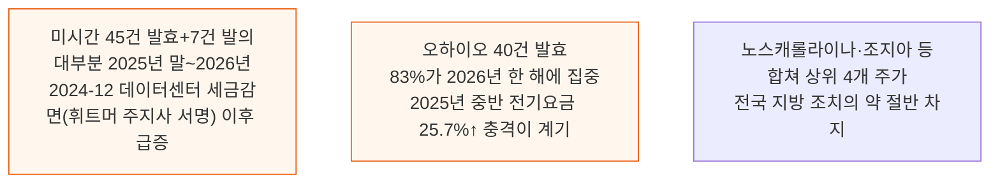

미시간 하월타운십은 2025년 11월 6개월 유예를 채택했고 2026년 5월 추가 6개월 연장을 표결했다. 오하이오 선버리시는 2026년 4월 15일 유예를 채택해 2027년 1월까지 효력이 있다.

지방 유예의 선행 지표는 조직화된 지역사회 반대다 — 만원 공청회, 청원, 주민모임, SNS 캠페인으로 미리 감지할 수 있다. Gallup 조사에서 반대자들은 에너지 사용·전기요금 인상을 가장 많이 지목했고, 물 소비·토지 이용·오염·교통도 함께 꼽았다.

SemiAnalysis는 2026년 8월 미국 유권자를 대상으로 데이터센터 여론·전기요금·프런티어 랩에 관한 자체 설문(Tokenomics 모델의 일부)을 실시했다.

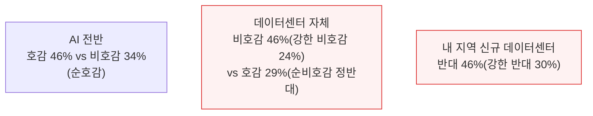

종말론적 AI 시나리오가 부각될수록 이 간극이 좁혀질 수도 있어, 2026년 중간선거까지 이 흐름을 계속 추적할 계획이다.

반대는 지역 간에도 번진다 — 애틀랜타 광역권 페이엣빌 지역 활동가들은 인근 카운티의 유예 사례를 인용하며 비슷한 제한을 요구했다.
선거철 정치도 반발을 키운다. 오하이오 공화당 주지사 후보 비벡 라마스와미는 8월에 "인근 주민 전기요금을 없애고, 재산세 전액을 주택 소유자 구제에 쓰고, 물·농지 보호 기준을 충족하지 않는 한 새 데이터센터를 승인하지 않겠다"고 공약했다.

**지방 유예가 많다고 위험 MW가 큰 것은 아니다.** 미시간은 유예 건수가 전국 최다지만 파이프라인 노출은 사실상 0이다 — 순서와 기존 조닝이 유예를 이기기 때문이다.

약 300건의 지방 유예·영구 금지 전부를 파이프라인에 매핑한 결과, 직접 영향은 미미하다. **오직 1,525MW만 직접 지연되며, 이는 제한구역 안 용량의 7.6%다.**
세 프로젝트가 사실상 이 전부를 차지한다. 활성 제한의 약 80%는 아예 모델링된 계획 용량이 없다 — 프로젝트가 존재하기 전이거나 이미 승인된 캠퍼스 뒤에 뒤늦게 나온 선제적 조례가 대부분이라는 뜻이다.

개발사들은 지방 제한에 크게 네 갈래로 대응하며, 어느 쪽도 포기는 아니다.

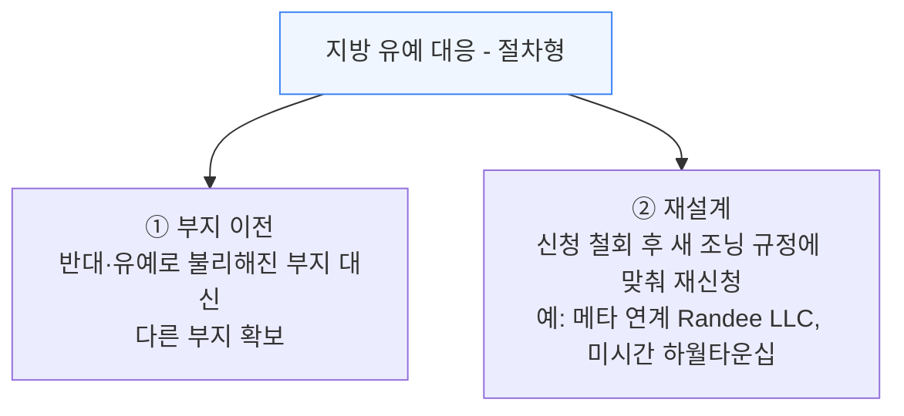

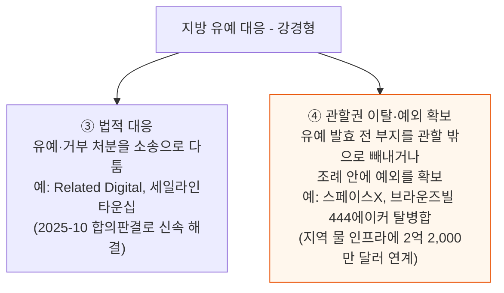

스페이스X는 물 인프라 투자 공약을 즉각 표결 요구에 연계해 지연 시 철회하겠다고 압박했다 — 그 결과 유예가 채택되기도 전에 부지가 관할 밖으로 빠져나갔다.

이처럼 유예는 대부분 프로젝트를 영구히 멈추기보다 지연·이전·재설계로 이어지며, 지방정부가 진행 중인 프로젝트의 규칙을 바꿀 때 소송이 더 흔해지고 있다. 그리고 영향받는 용량은 거의 전부 착공 전 파이프라인에 몰려 있어, 근시일 내 용량 추가에는 대체로 중요하지 않다.

---

## 4. 뉴욕 - 첫 주 단위 유예, 행정명령 62호

**📌 핵심:**
- 2026년 7월 14일 캐시 훅컬 뉴욕 주지사가 행정명령(EO) 62호에 서명해 미국 최초의 주 단위 데이터센터 인허가 유예를 만들었다 — 50MW 이상 신규 데이터센터의 재량적 주(州) 환경 인허가를 멈추고, 그사이 환경영향종합보고서(GEIS)를 작성한다
- 뉴욕주 의회가 통과시킨 더 강한 RDCD법(20MW 이상에 1년 유예 + 요금 체계·공청회·지역보상 등 영구 규정)은 훅컬이 서명을 거부했고, 대신 더 좁은 행정명령을 택했다 — 아직 승인받지 않은 프로젝트만 건드리기 때문에 **2026\~27년 예측치는 그대로 유지**된다
- 행정명령이 닿는 용량은 1.4GW지만 실제로 뭔가 제약을 받는 건 일부뿐이다 — 신청서가 이미 접수돼 있던 Stream Data Centers 약 340MW 캠퍼스가 습지 재조사 요구로 동결돼 최대 약 6개월 지연되고, 아직 신청 전인 나머지 프로젝트 중 Urbacon(6개월), Blockfusion(8\~10개월)이 유의미하게 늦어진다
- 결론: 1.4GW 노출 중 실제 행정명령발 지연은 **약 0.8GW**뿐이며 나머지 0.6GW는 큰 영향이 없다 — 단순히 유예 구역 MW를 합산하면 영향을 크게 과장하게 된다는 것을 뉴욕 사례가 보여주며, 지방 단위에서 20GW가 1,525MW로 좁혀지는 것과 같은 산수다

---

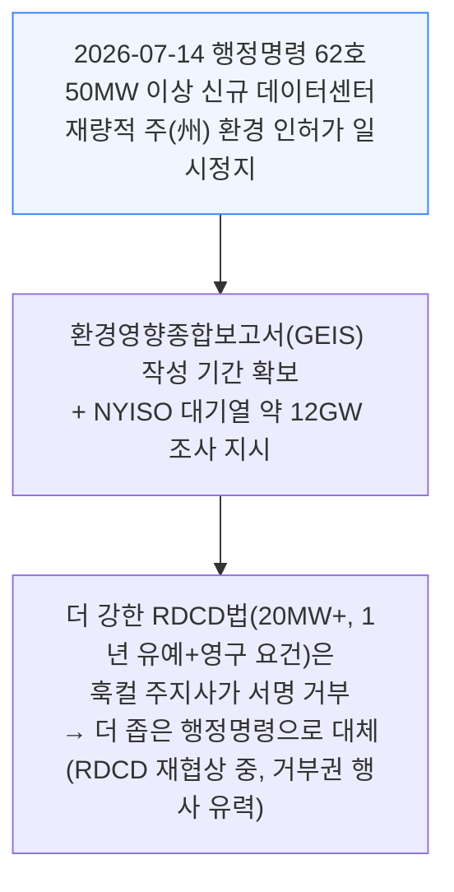

행정명령이 실제로 닿는 용량은 약 1.4GW다. 영향받는 프로젝트는 50MW 이상을 쓸 수 있고 뉴욕주 환경보전부(DEC)의 재량적 인허가가 필요한 계획 시설이며, 두 그룹으로 나뉜다.

- ① 2026년 7월 14일 이전에 신청은 냈지만 DEC가 완결로 판정하지 않은 프로젝트
- ② 재량적 DEC 승인이 필요하지만 아직 신청조차 하지 않았고, 일시정지가 2027년 7월 풀릴 때까지 신청해봐야 소용없는 프로젝트

첫 번째 그룹에 속하는 것은 단 한 곳, **Stream Data Centers의 약 340MW 캠퍼스**뿐이다 — 행정명령 발효 시점에 DEC에 신청서가 접수돼 있던 유일한 제안이다.
2026년 초 우수관리계획을 검토하던 DEC가 미비점을 발견해 습지 경계 재조사 자료를 제출할 때까지 인허가를 내주지 않았고, 이 신청은 이제 유예 기간 내내 공식적으로 동결된다. 최대 약 6개월 지연으로 추정한다.

나머지 프로젝트는 아직 신청 전이라 DEC에 걸려 있는 것 자체가 없지만, 행정명령이 각 프로젝트가 거쳐야 할 주 인허가 경로 자체를 막는다.

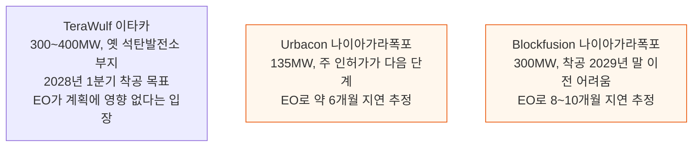

버펄로 인근 Riverview 캠퍼스(200MW)는 강한 지역 반대에 부딪혀 개발사가 이미 일시 보류한 상태라, 행정명령이 결정적 제약이 될 가능성은 낮다.

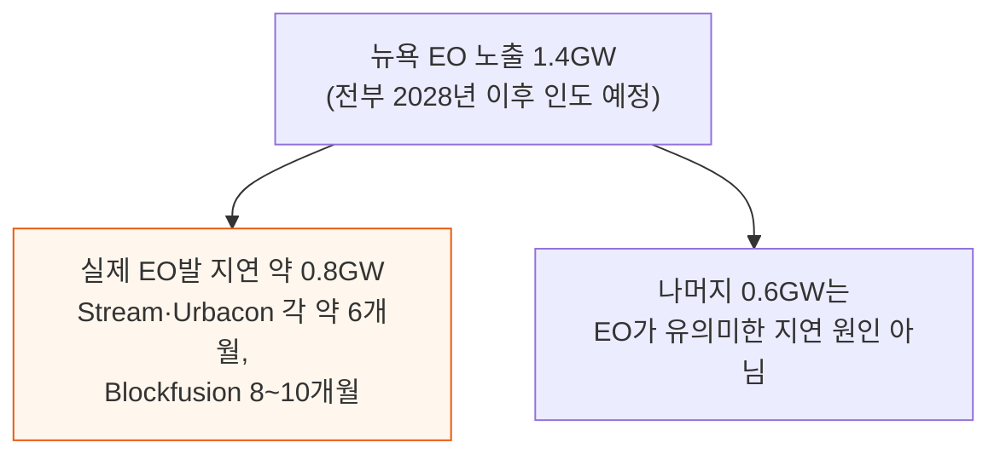

---

## 5. 텍사스 - 감사 지시는 요란하기만 하다

**📌 핵심:**
- 뉴욕 행정명령 3주 뒤인 2026년 8월 3일, 그레그 애벗 텍사스 주지사가 PUCT(텍사스 공공서비스위원회)와 ERCOT에 지시해 통계·검증 감사가 끝날 때까지 ERCOT 계통연결 절차를 밟는 데이터센터의 신규 접속 승인을 멈추게 했다 — ERCOT은 9월 3일 모든 배치제로(Batch Zero) 프로젝트를 기저부하(Base load)·조사대상(Studied load)·제외(Excluded) 셋으로 잠정 분류했다고 통보했다
- 기저부하는 이미 계통연결계약이 체결됐거나 가동 중인 프로젝트로 용량이 그대로 보존("모델에는 반영하되 재평가하지 않음")되지만, 조사대상은 시스템 전체 연구 결과가 나와야 MW 배정이 확정돼 이번 지연에 가장 크게 노출된다 — 그런데 그 연구 자체가 멈췄다: 원래 2027년 4월 9일까지 끝낼 계획이었지만 ERCOT의 채드 실리는 "그 날짜까지 못 끝낸다"고 밝혔고 새 일정도 아직 없다
- 기저부하 프로젝트는 최대 4개월 정도의 행정 지연에 그칠 것으로 추정한다 — 텍사스 농업부 장관 시드 밀러(공화)는 이 감사를 "허세뿐이고 실속은 없다"고 표현했는데, 실제로 SemiAnalysis도 이를 **11월 3일 주지사 선거를 앞둔 정치적 제스처**로 본다
- 결론: 이미 다른 모든 ERCOT 관문을 통과한 17개 시설(6.6GW)은 감사를 거쳐 계속 가동 절차를 밟고 있다 — 진짜 리스크는 절차가 아니라 정치다, 기본 시나리오는 ERCOT이 선거 이후인 12월 10일에 결과를 내는 것

---

ERCOT은 이 지시를 두 절차로 시행한다.

- **배치제로 감사**: 75MW 이상 대형 부하가 배치제로를 통과하기 위한 자격·확인서를 검증
- **지역사회 영향 감사**: 25MW 이상 미가동 컴퓨팅 부하의 정보를 수집

배치제로는 205GW·326개 신청자에 달하는 대형 부하 접속 신청 적체를 한꺼번에 평가하는 일회성 절차다. 애벗의 감사는 개발사에게 전력 조달 방식·물 소비·냉각 설계·세제 혜택·지역사회 영향·소유 구조까지 추가로 공개하도록 요구한다.

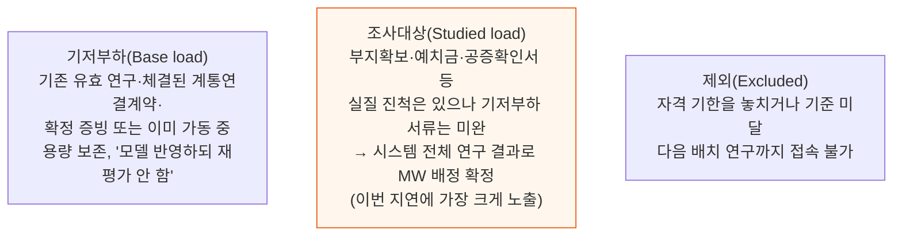

이 분류는 잠정적이며 검증 대상이다. ERCOT은 범주별 집계를 비공개로 송·배전사업자(TDSP/DSP)에만 통보했고, 개발사들이 각자 공시했다 — 갤럭시 디지털(Helios I·II), Hut 8, IREN, Cipher, CleanSpark가 각자 기저부하 분류를 자체 공시했다.

더 중요한 것은, 원래 9월 2일부터 2027년 4월 9일까지 조사대상의 실제 MW 배정을 정할 예정이던 배치제로 연구 자체가 멈춰 있다는 점이다.
ERCOT의 채드 실리는 "2027년 4월 9일까지 그 연구를 끝내지 못할 것"이라 밝혔고 아직 대체 일정도 내놓지 않았다. 이 지연은 장기부하전망(LTLF)·신뢰성 평가·2026년 12월 용량·수요·예비력(CDR) 보고서까지 줄줄이 밀어낸다.

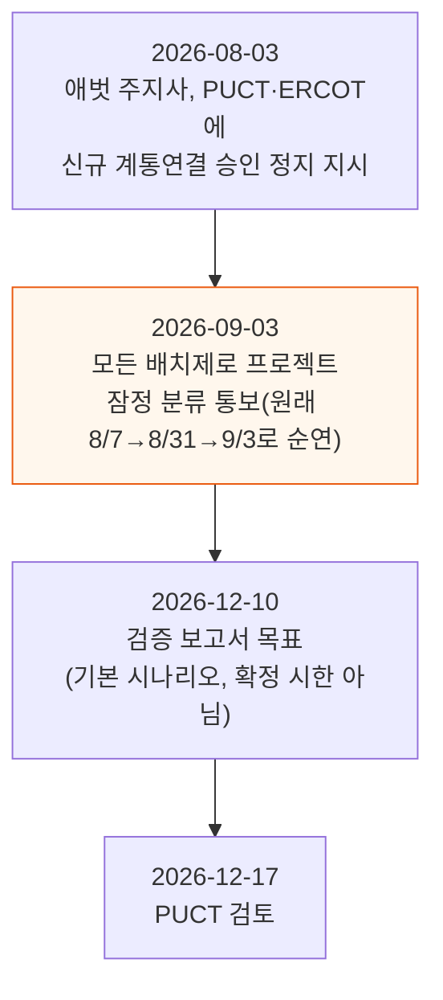

감사는 2026년 8월 7일 시작해 12월 10일 검증 보고서, 12월 17일 PUCT 검토로 이어진다. 자격을 갖춘 기저부하 프로젝트는 최대 4개월 정도의 행정 지연에 그칠 것으로 추정한다.
다만 SemiAnalysis는 이 감사 자체를 의미 있는 개발 중단으로 보지 않는다 — 오히려 **11월 3일 텍사스 주지사 선거**를 앞두고 커지는 반(反)데이터센터 정서에 대응하는 정치적 움직임으로 본다.
1년짜리 데이터센터 유예를 요구해온 텍사스 농업부 장관 시드 밀러(공화)조차 이 지시가 유예에 해당한다는 주장에 반박하며 "허세뿐이고 실속은 없는, 공허한 정치적 수사로 포장된 지시"라고 평했다.

추가 공개 요건은 ERCOT의 기존 재무·프로젝트 성숙도 요건 위에 한 겹의 심사를 더하는 정도이며, 진지한 기저부하 프로젝트는 충족할 수 있을 것으로 본다.

- 이미 다른 모든 ERCOT 관문을 통과한 17개 시설(6.6GW)은 감사를 거쳐 계속 가동 절차를 밟고 있다
- 2026년 12월 이후 가동 예정 프로젝트라면, 12월에 풀리는 일시정지는 사실상 비용이 안 될 수도 있다
- 조사대상(배정 대기 부하)은 연구가 언제 끝날지 정해지지 않아 더 오래 기다려야 한다

**진짜 리스크는 절차가 아니라 정치다** — 절차가 열려 있는 채로 끝이 정해지지 않았기 때문이다. 기본 시나리오는 ERCOT이 선거 이후인 12월 10일에 결과를 내는 것이지만, 확정 시한이 아니라 목표로 본다.

텍사스의 감사는 뉴욕과 비슷한 각본을 따른다 — 두 주지사 모두 데이터센터 개발이 선거 쟁점이 된 주에서 두 달 뒤 재선을 앞두고, 둘 다 스스로 통제·철회할 수 있는 일시정지를 택했다.
두 경우 모두 주지사가 선거 전 더 강한 감독 의지를 유권자에게 보여주면서, 친(親)유예 진영에는 더 강력한 수단을 넘기지 않는 효과를 낸다.

---

## 6. 펜실베이니아 - 유예까지는 가지 않았다

**📌 핵심:**
- 정치적 반발이 커지는 가운데도 펜실베이니아는 전면 유예 대신 행정명령(EO) 2026-05호를 택했다 — 조슈아 샤피로 주지사가 2026년 8월 18일 서명한 이 명령은, 개발사가 주지사의 책임있는 인프라 개발(GRID) 요건과 지역 승인을 확보하기 전까지 환경보호국(DEP)이 인허가 신청을 접수하지 못하게 한다
- GRID는 에너지 적정 요금·환경 보호·인력·경제 개발·투명성·지역사회 참여 기준을 아우르며, 이 명령은 모든 데이터센터 제안을 패스트트랙 인허가 절차에서 빼고 비밀유지계약(NDA) 사용도 금지한다
- 결론: 유예는 만료되지만 조건부 인허가 체계는 만료되지 않는다는 점에서, SemiAnalysis는 이 EO를 주 단위 일시정지로 세지 않는다 — 파이프라인에 미치는 효과는 완전한 중단이 아니라 인허가 전 실사가 길어지고 넓어지는 쪽이며, 투기성 프로젝트가 가장 크게 영향받는다

---

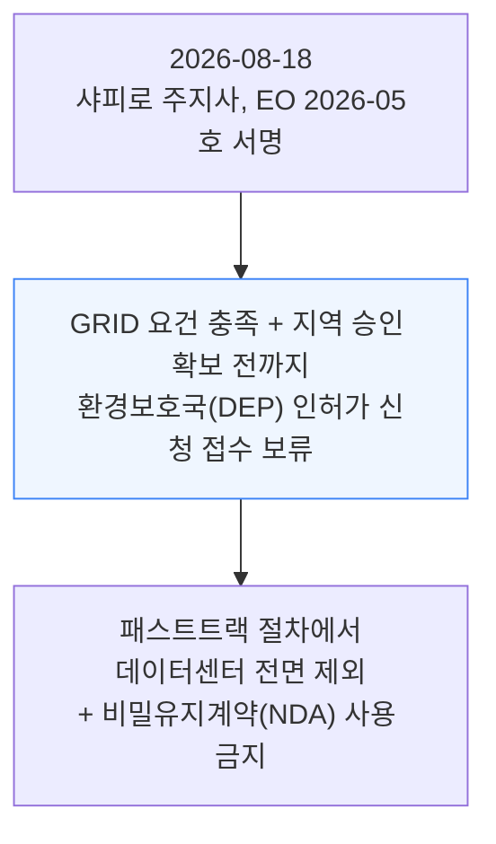

SemiAnalysis는 이 EO를 주 단위 일시정지로 세지 않는다 — 유예는 만료되지만 조건부 인허가 체계는 만료되지 않기 때문이다. 효과는 완전한 중단이 아니라 인허가 전 실사가 길어지고 넓어지는 쪽이며, 투기성 프로젝트가 가장 크게 영향받는다.

---

## 7. 오리건 - 파이프라인이 시작되기 전에 멈추는 유예

**📌 핵심:**
- 2026년 9월 8일 오리건 티나 코텍 주지사는 모든 주 기관에 데이터센터를 위한 주유(州有) 부지의 지역권·통행권·임대·매각·양도에 대한 미승인 요청을 즉시 정지하도록 지시했다 — 효력은 2027년 7월 1일까지이며, 인프라 용량·환경·지역사회·일자리에 미치는 장기 영향을 주(州) 차원에서 평가할 시간을 번다
- 이 조치는 오직 **주 소유 토지**에만 적용되고, 프로젝트가 **아직 땅조차 확보하지 못한 단계**에서 작동한다 — SemiAnalysis 파이프라인에 들어오는 최소 기준이 바로 부지 확보(Site Control)이므로, 이 지시로 막히는 프로젝트는 정의상 애초에 예측에 들어 있지 않았다
- 코텍 주지사실 스스로도 주가 진짜 주 단위 유예를 부과할 권한이 없다고 인정한다 — 뉴욕·텍사스와 마찬가지로 주지사가 통제·철회할 수 있는 행정 조치이며, 11월 재선을 앞두고 데이터센터가 선거 쟁점인 주에서 나온 신호 보내기용 제스처다
- 결론: 오리건의 일시정지는 SemiAnalysis 예측에 **영향이 없다** — 계획 용량 자체를 건드리지 않으면서 유권자에게 감독 의지만 보여주는 조치다

---

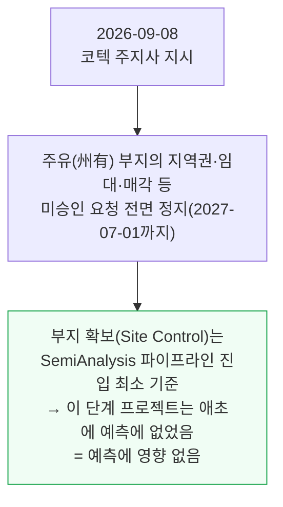

오리건의 일시정지는 SemiAnalysis 데이터센터 예측에 영향이 없다. 오직 주 소유 부동산에만 적용되고, 프로젝트가 땅 자체를 아직 확보하지 못한 단계에서 작동하기 때문이다.
부지 확보는 SemiAnalysis 파이프라인에 들어오는 최소 기준이므로, 이 지시로 막히는 제안은 정의상 원래부터 예측에 포함돼 있지 않았다.
진짜 주 단위 유예도 아니다 — 코텍 주지사실 스스로 주가 그럴 권한이 현재 없다고 인정한다. 뉴욕·텍사스처럼 주지사가 통제·철회할 수 있는 행정 조치이며, 데이터센터가 선거 쟁점인 주에서 11월 재선을 앞둔 현직 주지사가 내놓았다. 계획 용량은 건드리지 않으면서 유권자에게 감독 신호만 보내는 셈이다.

---

## 8. 주 단위 유예는 왜 만들기 어려운가

**📌 핵심:**
- 지방 유예가 많다고 주 단위 유예로 반드시 이어지는 것은 아니다 — 뉴욕은 압도적인 지방 물결 없이 행정명령으로 주 단위 조치를 냈고, 그 지방 유예는 9건뿐으로 미시간 45건·오하이오 40건·노스캐롤라이나 32건에 크게 못 미친다 — 2026년에는 17개 주가 유예·유사 조치를 검토했지만, 주 단위 조치는 여전히 지방 조치보다 만들기 어렵다
- 주 단위 유예는 입법(느리지만 포괄적, 거부권에 취약), 행정명령(빠르지만 좁고 법적 기반이 약함), 주민발의(가장 느리지만 가장 포괄적이고 거부권 면역)라는 세 경로로 만들 수 있고, 각각 속도·범위·정치적 위험의 트레이드오프가 다르다
- 2026년 죽은 13개 법안 중 본회의 표결까지 간 것은 거의 없다 — 조지아는 위원회에서 폐기, 사우스다코타 한 쌍은 상정 보류, 델라웨어·메릴랜드·미네소타·오클라호마·사우스캐롤라이나는 회기 종료로 자동 폐기, 버지니아는 이월, 메인은 주지사 데스크까지 갔지만 거부권이 행사되고 재의결도 실패했다
- 결론: 법안 대부분이 반대에 부딪혀 죽은 게 아니라, 의제를 결정할 힘을 가진 사람 누구도 그 법안을 떠안으려 하지 않아서 죽었다 — 이것이 주 단위 채널이 늘지 않고 정체돼 있다는 가장 강한 증거다

---

높은 지방 유예 밀도가 주 단위 유예와 상관관계를 보일 수는 있어도 확실한 인과관계로 이어지지는 않는다 — 뉴욕은 압도적인 지방 물결 없이 행정명령으로 주 단위 조치를 냈다.
2026년 17개 주가 유예나 유사 조치를 검토하며 상당한 관심을 끌었지만, 주 단위 조치는 여전히 지방 조치보다 만들기 어렵다.

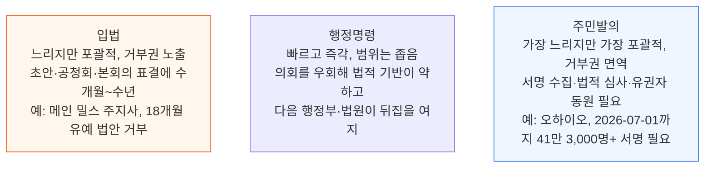

주민발의는 일단 투표용지에 오르면 개발사들의 반대 캠페인과 소송에 부딪힐 수 있다는 대가가 따른다.

**2026년 죽은 13개 법안 중 본회의 표결로 패배한 것은 거의 없다.**

- 조지아 — 위원회에서 폐기
- 사우스다코타 두 법안 — 같은 날 상정 보류로 폐기
- 델라웨어·메릴랜드·미네소타·오클라호마·사우스캐롤라이나 — 회기 종료(sine die)로 자동 폐기
- 버지니아 — 다음 회기로 이월
- 메인 — 주지사 데스크까지 간 유일한 법안, 거부권 행사 후 재의결도 실패

많은 경우 의회 지도부가 그 법안을 추진하는 데 정치적 자산을 쓰지 않기로 선택했다. 법안에 대한 반대가 아니라, 의제를 결정할 힘을 가진 사람 누구도 그 법안을 떠안으려 하지 않는다는 점이 핵심 제약이라는 것이, 주 단위 채널이 늘지 않고 정체돼 있다는 가장 강한 근거라고 본다.

---

## 9. 누가 득을 보는가

**📌 핵심:**
- 2026년 규제 물결의 가장 중요한 결과는 단순한 용량 지연이 아니라, **어디에 짓고, 어떤 프로젝트가 진행되고, 어떻게 전력을 공급받는지**의 구조 자체가 바뀌는 것이다
- 텍사스 감사는 완전 오프그리드 BTM(계량기 뒤 자가발전) 프로젝트에 순호재다 — 이 지시는 ERCOT 계통연결을 신청하는 데이터센터에만 적용되므로, 셰브런의 2.67GW 오프그리드 Project Kilby 발전소(퍼미언 분지 마이크로소프트 캠퍼스 약 2GW 공급)처럼 완전히 섬처럼 운영되는 프로젝트는 감사 범위 밖이다
- 발전 장비 공급사도 수혜자다 — 수년치 리드타임 때문에 대기열에 묶인 프로젝트가 온사이트 발전으로 쉽게 전환하지 못하니, 브리지 전력이나 신규 부지 수요가 이미 가득 찬 터빈·엔진·연료전지 수주잔고와 가스 중류(midstream) 물량에 그대로 더해진다
- 결론: 기존 인허가·자기 소유 토지도 유리해진다 — 미시간에서는 이미 데이터 처리 용도로 허가된 산업용지 위 캠퍼스가 전국에서 유예가 가장 많은 주에서도 무리 없이 통과했다, 기존 권리가 있는 땅과 사실상 조례상(by-right) 조닝·주(州) 선점 조항이 있는 관할은 재조닝이 필요한 그린필드 부지보다 점점 더 큰 인허가 우위를 갖는다

---

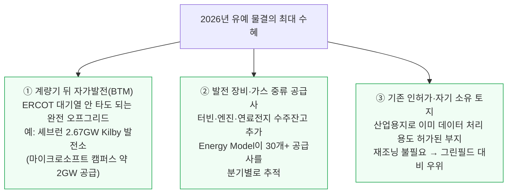

텍사스 감사는 정치적 소음과 별개로 BTM 개발에 강세 요인이다. 이 지시는 ERCOT을 통해 계통연결을 신청하는 데이터센터에만 적용되므로, 주된 수혜자는 이미 전력을 확보한 사업자와 온사이트 발전 장비 공급사다.
완전히 섬처럼 운영되는 프로젝트는 아예 범위 밖이다 — 대표적인 예가 셰브런의 2.67GW 오프그리드 Project Kilby 발전소로, 퍼미언 분지에서 약 2GW 규모 마이크로소프트 캠퍼스에 전력을 댄다. 감사가 진행되는 매달, 대기열이 필요 없다는 선택지의 가치는 계속 커진다.

발전 장비 공급사도 함께 득을 본다. 수년치 리드타임 때문에 대기열에 묶인 프로젝트가 온사이트 발전으로 쉽게 전환하지 못하는 사이, 브리지 전력과 신규 부지 수요가 이미 가득 찬 터빈·엔진·연료전지 수주잔고와 가스 중류(midstream) 물량에 그대로 더해진다.
SemiAnalysis Energy Model은 이 흐름을 분기별로 30개 이상 터빈·엔진·연료전지 공급사와 모든 BTM 데이터센터 전력 발주에 걸쳐 추적한다. 계통망만 막고 BTM은 건드리지 않는 제한은 이 수요에 그대로 더해지는 단순한 가산 효과다.

기존 권리가 있는 땅, 그리고 사실상 조례상(by-right) 조닝이나 주(州) 선점 조항이 있는 관할은 재조닝이 필요한 그린필드 부지보다 점점 더 큰 인허가 우위를 갖는다.

---

*작성 진행률: 100% 완료*
*업데이트: 7\~9절(오리건·주 단위 유예·누가 득을 보는가) 작성 완료, 전체 9개 섹션 완료*
