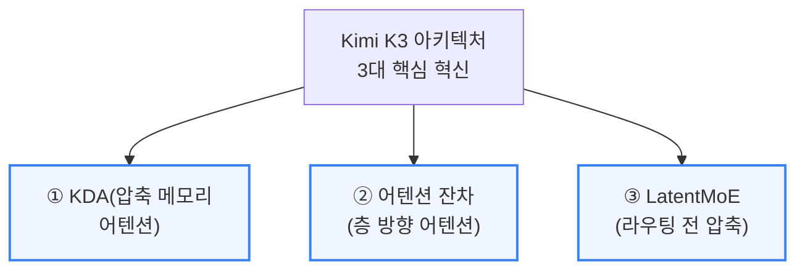
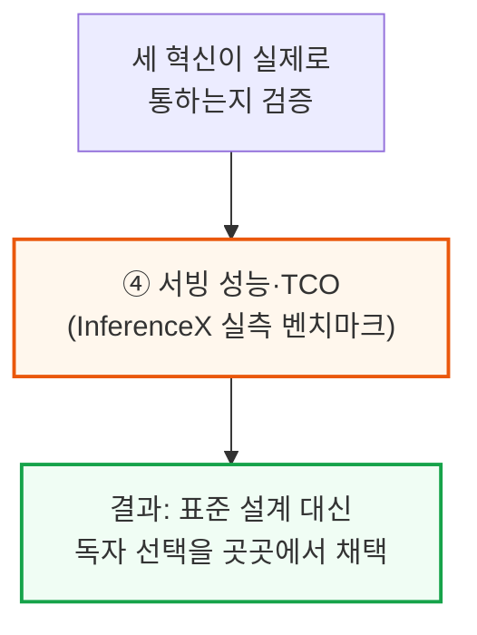
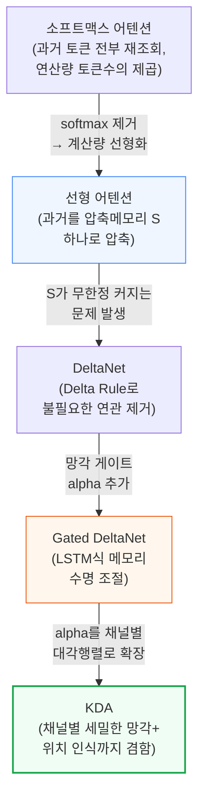
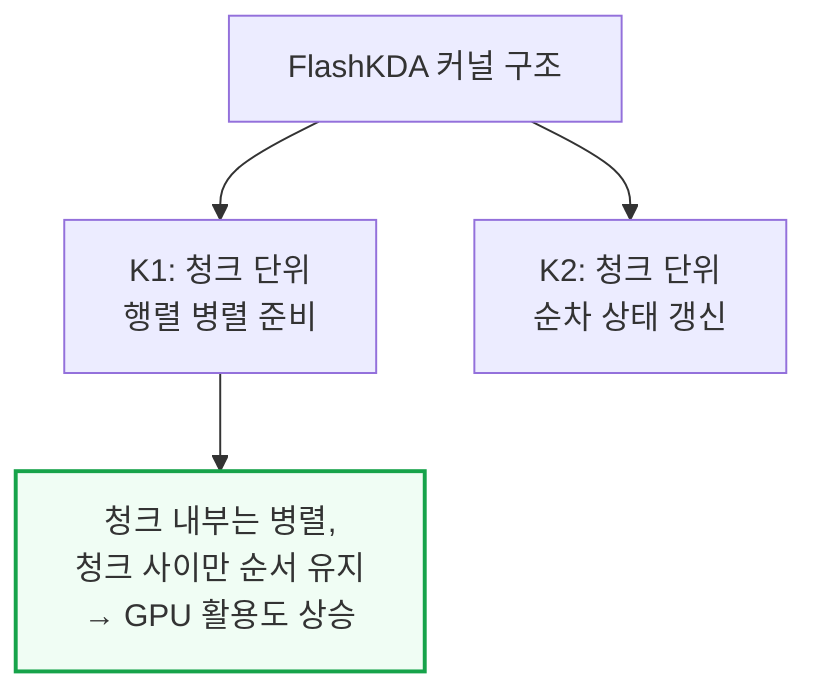
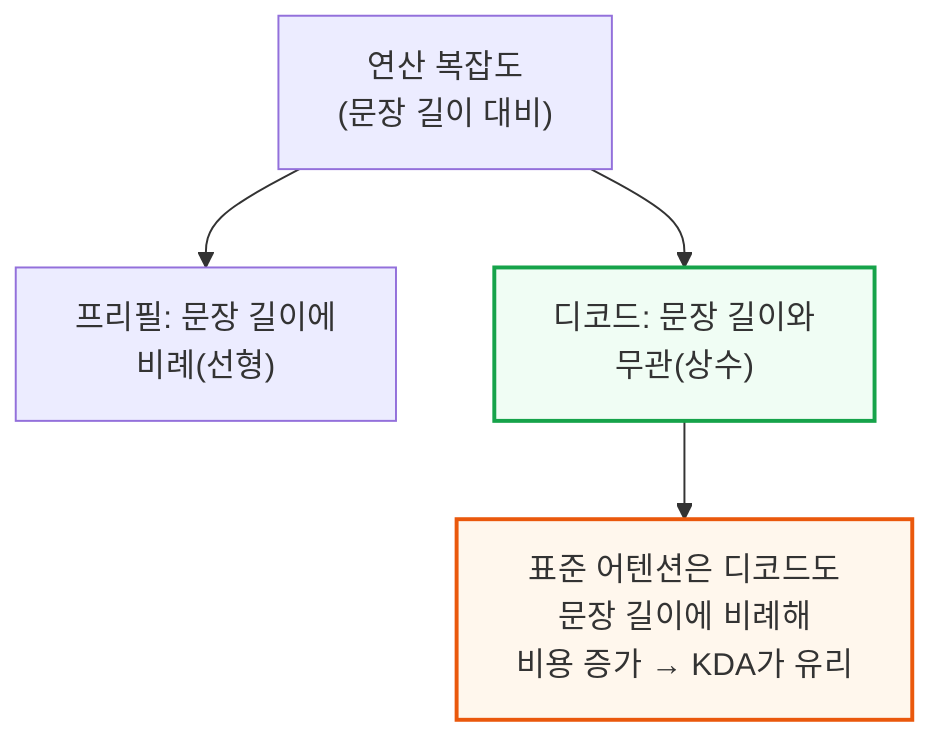

# Kimi K3, The Manos, The Mythos, The Legendos

> **출처**: [SemiAnalysis Newsletter](https://newsletter.semianalysis.com/p/kimi-k3-the-manos-the-mythos-the)
> **저자**: Kimbo Chen, Shubham Choudhari, Bryan Shan, Dylan Patel
> **발행일**: 2026-08-03

---

## 📑 목차

### 전체 섹션
 1. [개요 - Kimi K3와 이 문서의 목적](#1-개요---kimi-k3와-이-문서의-목적)
 2. [Kimi Delta Attention의 계보 - 선형 어텐션에서 DeltaNet, Gated DeltaNet을 거쳐 KDA까지](#2-kimi-delta-attention의-계보---선형-어텐션에서-deltanet-gated-deltanet을-거쳐-kda까지)
 3. [FlashKDA 알고리즘과 연산 복잡도 - 프리필은 선형, 디코드는 상수](#3-flashkda-알고리즘과-연산-복잡도---프리필은-선형-디코드는-상수)
 4. [Kimi Linear 아키텍처 - KDA·MLA 하이브리드 비율과 MLA vs GQA 선택](#4-kimi-linear-아키텍처---kdamla-하이브리드-비율과-mla-vs-gqa-선택)
 5. [KV 캐시 효율 - KV 처리량이라는 새 지표](#5-kv-캐시-효율---kv-처리량이라는-새-지표)
 6. [KV 캐시 저장 계층과 Prefix 캐시 관리의 딜레마](#6-kv-캐시-저장-계층과-prefix-캐시-관리의-딜레마)
 7. [어텐션 잔차 - 깊이 방향으로도 어텐션을 적용하다](#7-어텐션-잔차---깊이-방향으로도-어텐션을-적용하다)
 8. [블록 어텐션 잔차 - 통신량 절감과 학습·추론 최적화](#8-블록-어텐션-잔차---통신량-절감과-학습추론-최적화)
 9. [LatentMoE - 라우팅 전 압축으로 통신량 줄이기](#9-latentmoe---라우팅-전-압축으로-통신량-줄이기)
10. [Quantile 부하 분산(QB) - 하이퍼파라미터 없는 라우팅 균형](#10-quantile-부하-분산qb---하이퍼파라미터-없는-라우팅-균형)
11. [서빙 성능과 TCO - InferenceX 실측 벤치마크](#11-서빙-성능과-tco---inferencex-실측-벤치마크)

---

## 🔑 용어 정리

본문을 순서대로 읽기 전에 알아두면 좋은 용어들입니다. 자세한 수치와 설명은 본문에서 처음 등장하는 위치에 나옵니다.

- **KDA (Kimi Delta Attention)**: Kimi K3가 쓰는 선형 어텐션 계열 기법 — 과거 정보를 압축된 하나의 메모리에 담아 두고 필요할 때 꺼내 쓰는 방식
- **선형 어텐션(Linear Attention)**: 기존 어텐션이 과거 토큰을 전부 하나하나 다시 훑는 것과 달리, 과거 정보를 하나의 고정 크기 메모리로 압축해두고 그 메모리만 갱신하는 방식
- **DeltaNet → Gated DeltaNet**: 압축 메모리가 무한정 커지는 문제를 고치기 위해, 필요 없는 정보를 지우는 규칙(DeltaNet)과 정보를 서서히 잊는 장치(Gated DeltaNet)를 차례로 추가한 계보
- **MLA vs GQA**: 둘 다 메모리를 아끼는 어텐션 방식이지만, MLA는 생성(디코드)에 유리하고 GQA는 입력 처리(프리필)에 유리해 워크로드 성격에 따라 유불리가 갈림
- **KV 캐시와 KV 처리량(KV Throughput)**: KV 캐시는 지금까지 나온 대화 내용을 기억해두는 임시 저장공간, KV 처리량은 이 저장공간 크기를 입력 처리 시간으로 나눈 값으로 실제 서빙 효율을 재는 지표
- **Prefix 캐시(접두사 캐시)**: 이미 처리한 적 있는 앞부분 대화 내용을 다시 계산하지 않고 재사용하는 캐싱 기법
- **어텐션 잔차(Attention Residuals)**: 신경망의 층(레이어)이 깊어질수록 앞쪽 정보가 희미해지는 문제를 풀기 위해, 각 층이 이전 모든 층의 결과를 필요한 만큼 골라 참조하게 하는 기법
- **LatentMoE**: 여러 GPU에 전문가(Expert)를 나눠 놓은 MoE 구조에서, 토큰을 전문가에게 보내기 전에 압축해 통신량을 줄이는 기법

---

## 1. 개요 - Kimi K3와 이 문서의 목적

**📌 핵심:**
- Kimi K3는 공개 직후 여러 리더보드를 휩쓸며 오픈소스 최고 모델(오픈 프론티어 모델)로 자리잡음 — 다만 그 성능을 뒷받침하는 기술이 이례적이어서 커뮤니티도 놀란 상황
- 이 문서는 Kimi K3 아키텍처의 핵심 기술을 해설하는 안내서 — ① 압축 메모리 방식의 새 어텐션(KDA) ② 층(레이어)을 가로지르는 어텐션(어텐션 잔차) ③ 전문가에게 보내기 전 압축하는 라우팅(LatentMoE), 이 세 가지 혁신이 실제로 통하는지를 ④ 서빙 성능·비용(TCO) 실측으로 검증
- 결론: Kimi K3는 널리 쓰이는 표준 설계를 그대로 따르지 않고 여러 지점에서 독자적인 선택을 했다는 것이 이 문서 전체를 관통하는 메시지

---

---

## 2. Kimi Delta Attention의 계보 - 선형 어텐션에서 DeltaNet, Gated DeltaNet을 거쳐 KDA까지

**📌 핵심:**
- 표준 어텐션(소프트맥스 어텐션)은 지금까지 나온 토큰(단어)을 전부 하나하나 다시 훑어야 해서 연산량이 토큰 수의 제곱에 비례 — 선형 어텐션은 소프트맥스 연산을 없애 과거 정보를 하나의 고정 크기 메모리(행렬 S)로 압축, 연산량을 토큰 수에 비례하는 수준으로 줄임
- 문제는 압축 메모리 S가 오래된 정보와 새 정보를 뒤섞으며 무한정 커져 학습이 불안정해진다는 것 — DeltaNet은 "관련 없는 연관을 지운다"는 규칙(Delta Rule)으로 S의 성장을 억제하고, Gated DeltaNet은 LSTM식 망각 게이트(alpha)를 추가해 메모리 수명 자체를 조절
- KDA(Kimi Delta Attention)는 이 alpha를 하나의 숫자가 아니라 채널마다 다른 값을 갖는 대각행렬로 확장 — 채널별로 세밀하게 망각 속도를 조절할 수 있게 되고, 이 덕분에 MLA의 위치 인코딩(RoPE) 없이도 스스로 위치를 인식하는 역할까지 겸함
- 결론: 표준 어텐션이 "모든 과거를 다 기억"이라면 KDA는 "필요한 것만 요약해 계속 갱신되는 메모장" — 압축으로 얻는 속도와 압축이 낳는 불안정성 사이의 균형을 이 계보 전체가 다루는 문제로 이해하면 됨

---

**📌 용어 풀이: 압축 메모리를 "온라인 학습"으로 보는 관점**
> - 선형 어텐션의 갱신식은 "매 토큰마다 저장 행렬 S를 살짝 고쳐써서, 다음에 같은 키(key)로 물어봤을 때 더 정확한 값(value)을 꺼내도록 만드는" 학습 과정으로도 해석 가능 — 매 순간 조금씩 채점하고 고치는 셈
> - DeltaNet은 이 학습의 목표를 "값을 완벽히 재현"에서 "불필요하게 저장된 연관만 골라 지우기"로 바꿔, S가 계속 부풀어 오르는 것을 막음

---

## 3. FlashKDA 알고리즘과 연산 복잡도 - 프리필은 선형, 디코드는 상수

**📌 핵심:**
- Moonshot(Kimi 개발사)은 KDA 전용 커널 FlashKDA를 직접 개발해 오픈소스로 공개 — 문장을 한 토큰씩 순서대로 생성(디코드)할 때는 재귀식을 그대로 따르지만, 입력 처리(프리필) 시에는 토큰을 덩어리(청크)로 묶어 GPU에서 병렬 처리하도록 재구성
- FlashKDA는 커널 2개로 구성 — K1(청크 단위로 필요한 행렬을 미리 병렬 준비), K2(청크 단위로 순서대로 상태를 갱신) — 청크 안에서는 병렬, 청크 사이에서만 순서를 지키면 되어 GPU 활용도가 높아짐
- 복잡도 분석 결과 **프리필은 문장 길이에 비례(선형)**, **디코드는 문장 길이와 무관(상수)** — 표준 어텐션은 문장이 길어질수록 디코드 비용도 함께 늘어나는 것과 대조적으로, KDA는 문장이 아무리 길어져도 한 토큰을 생성하는 데 드는 비용이 일정하게 유지됨
- 결론: 이 "디코드가 상수 비용"이라는 성질이 KDA를 긴 문맥·에이전트형 워크로드에서 특히 유리하게 만드는 핵심 근거 — 다음 섹션(KV 캐시 효율)에서 이 성질이 실제 서빙에 어떤 영향을 주는지 다룸

---

---

*작성 진행률: 약 27% 완료 (11개 섹션 중 3개 완료)*
*업데이트: 개요, KDA 계보, FlashKDA 알고리즘 섹션 작성 완료*
