# The Coding Assistant Breakdown: More Tokens Please

> **출처**: [https://newsletter.semianalysis.com/p/the-coding-assistant-breakdown-more](https://newsletter.semianalysis.com/p/the-coding-assistant-breakdown-more)
> **저자**: [[Dylan Patel]]
> **발행일**: 2026-04-25

📑 목차
1. [서론: 코딩 에이전트 전쟁이 다시 뜨거워지다](#1-서론-코딩-에이전트-전쟁이-다시-뜨거워지다)
2. [신규 모델 총정리: GPT-5.5, Opus 4.7, DeepSeek V4](#2-신규-모델-총정리-gpt-55-opus-47-deepseek-v4)
3. [실사용 체감: 코덱스 vs 클로드 코드](#3-실사용-체감-코덱스-vs-클로드-코드)
4. [벤치마크 해부학: MMLU에서 SWE-bench, GDPval까지](#4-벤치마크-해부학-mmlu에서-swe-bench-gdpval까지)
5. [OpenAI의 벤치마크 취사선택, 무엇을 숨겼나](#5-openai의-벤치마크-취사선택-무엇을-숨겼나)
6. [하네스가 다르면 벤치마크 비교도 무의미하다](#6-하네스가-다르면-벤치마크-비교도-무의미하다)
7. [코딩 에이전트 전쟁, 최종 승자는 누구인가](#7-코딩-에이전트-전쟁-최종-승자는-누구인가)

🔑 용어 정리
- **하네스 (Harness)**: 모델을 감싸 코드를 읽고 도구를 쓰게 만드는 프로그램(코덱스 CLI, 클로드 코드 등) — 같은 모델도 하네스가 다르면 체감 성능이 달라짐
- **벤치마크 (Benchmark)**: "과제 + 채점 방식 + 하네스" 세 요소로 구성된 AI 성능 측정 도구
- **MMLU**: 57개 과목 객관식으로 AI 일반 지식을 재는 초창기 대표 벤치마크 — 2023년에 이미 사실상 만점에 가까워져 변별력을 잃음
- **SWE-bench**: 오픈소스 저장소의 버그 수정 이력으로 AI 코딩 실력을 재는 벤치마크 — 사람 검수 없이 자동 제작돼 채점 오류가 많았던 것으로 드러남
- **GDPval**: 금융분석가·간호사 등 44개 실제 직업의 업무를 재현해 "돈 되는 일" 수행 능력을 재는 벤치마크
- **코덱스 (Codex) / 클로드 코드 (Claude Code)**: 각각 OpenAI·Anthropic의 코딩 전용 AI 하네스 제품명
- **토큰당 비용 vs 과제당 비용**: 토큰 1개당 가격이 아니라 문제 하나를 실제로 풀기까지 드는 총비용 — 단가가 비싸도 토큰을 적게 쓰면 과제당 비용은 더 쌀 수 있음
- **MoE (혼합 전문가 구조)**: 총 파라미터 중 질문 하나에 실제로 켜지는 부분(활성 파라미터)만 계산에 쓰는 구조

---

## 1. 서론: 코딩 에이전트 전쟁이 다시 뜨거워지다

**📌 핵심:**
- SemiAnalysis가 2월 5일 "클로드 코드 변곡점"을 지목한 이후, 두 달 남짓 사이 OpenAI·Anthropic·DeepSeek 등 주요 랩이 한꺼번에 신규 코딩 모델을 쏟아냄
- GPT-5.5는 일부 작업에서 다른 모든 모델보다 **확연히 더 나은** 업계 최고 수준(frontier)에 도달 — 작년 11월 Opus 4.5 출시 이후 6개월간 OpenAI 모델이 업무용 1순위가 되지 못했던 것과는 큰 변화
- 결론: 이 문서는 GPT-5.5·Opus 4.7·DeepSeek V4를 실사용 기준으로 비교하고, 벤치마크의 신뢰 구간을 가른 뒤, 코딩 에이전트 시장의 승자를 전망

---

지난 2월 5일 클로드 코드 변곡점을 지목한 이후 주요 랩들의 모델 출시가 쏟아졌습니다.

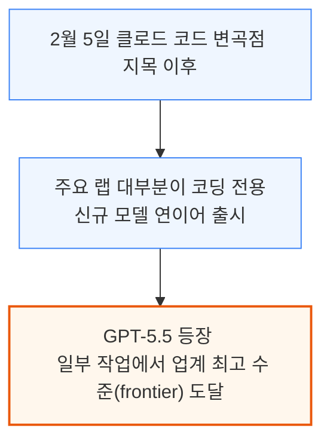

작년 11월 Opus 4.5 출시 이후 6개월간 OpenAI 모델은 세계 최고 수준이 아니었고 Opus가 주력 도구였습니다. GPT-5.5는 이제 일상 업무에 통합됐습니다.

---

## 2. 신규 모델 총정리: GPT-5.5, Opus 4.7, DeepSeek V4

**📌 핵심:**
- **GPT-5.5**: 새 사전학습("Spud") 첫 공개 모델, 입력 100만 토큰당 $5·출력 $30로 직전 버전 대비 **가격 2배**, Opus 4.7보다도 소폭 비쌈 — 벤치마크 점수는 오르면서 사용 토큰은 줄이는 "토큰 효율화"를 내세움
- **Opus 4.7**: Opus 4.6을 대체하는 소폭 개선판, 새 토크나이저(글자를 토큰으로 쪼개는 방식) 도입으로 토큰 사용량이 최대 **35% 증가**(=사실상 가격 35% 인상) — 3\~4월 사이 몇 주씩 방치된 버그 3건도 뒤늦게 시인
- **DeepSeek V4**: 컨텍스트(문맥 처리 범위)를 12만8천 토큰에서 **100만 토큰**으로 8배 확장, 그 대가로 추론 연산량 27%·캐시 메모리 10%까지 절감(캐시 메모리 **90% 감소**) — 다만 총 성능은 폐쇄형 최상위 모델에 여전히 못 미침
- 결론: 세 모델 모두 "더 적은 토큰으로 더 잘 푼다"는 토큰 효율 경쟁에 들어섰지만, 정작 청구 가격은 모델별로 최대 2배까지 벌어짐

---

### GPT-5.5: 첫 신규 사전학습, 그러나 가격은 2배

GPT-5.5는 "Spud" 코드명의 새 사전학습 기반 첫 공개 모델입니다. NVIDIA·OpenAI는 "10만 대 GB200 NVL72에서 학습"이라 표현했지만, 실제로는 이 규모의 사전학습이 아니라 후속 강화학습(RL) 단계만 이 규모로 진행됐습니다.

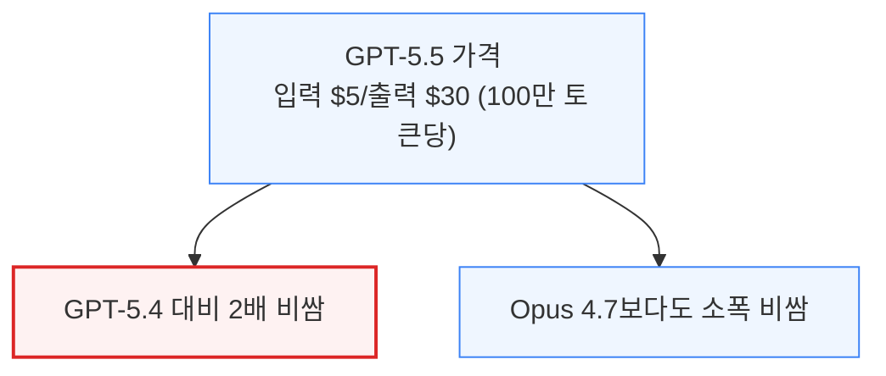

- 우선순위(priority) 등급: 표준가의 2.5배, 초당 50토큰 이상을 99% 보장(SLA)
- 패스트 모드: "속도 2.5배, 가격 6배"처럼 느슨한 약속 (SLA 없음)
- GPT-5.3-Codex-Spark: 세레브라스용 경량화(더 작고 단순한) 모델
- GPT-5.5 Pro: 연구·장시간 추론 전용, BrowseComp·FrontierMath 최고점, $30/$180
- 추론 강도 5단계(xhigh\~비추론): 높을수록 정확하지만 토큰·시간 증가

OpenAI는 GPT-5.5가 GPT-5.4보다 점수는 높으면서 토큰은 더 적게 쓴다는 "토큰 효율성"을 강조했습니다. SemiAnalysis는 **토큰당 비용이 아니라 과제당 비용**이 가격 경쟁력의 진짜 기준이라고 봅니다.

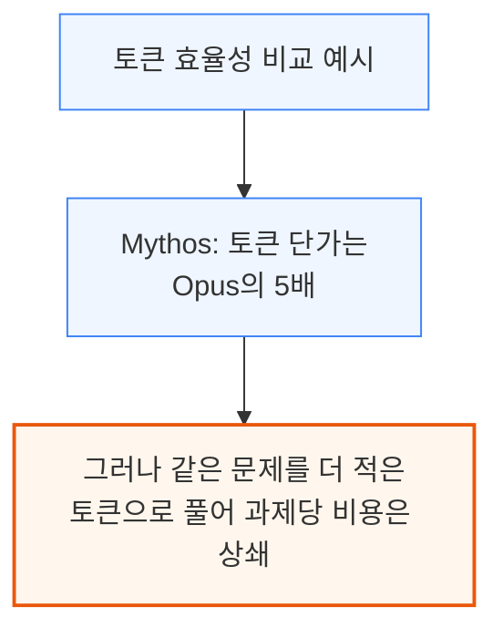

### Opus 4.7: 소폭 개선, 그러나 토큰 사용량 35% 증가

Opus 4.6을 대체하는 Opus 4.7은 점수가 소폭 오른 무난한 개선판이나, 패스트 모드가 아직 없어 마지못해 채택하는 분위기입니다.

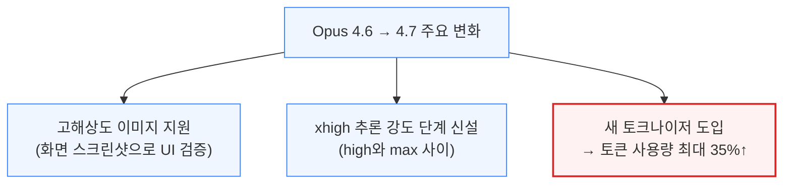

토큰 단가가 그대로면 이는 사실상 **가격 35% 인상**입니다. 4.7은 도구 호출을 줄이고 추론에 더 의존해, Anthropic은 보완책으로 강도를 xhigh·max로 올리라 권합니다 — 결국 "효율화" 발표와 반대로 토큰을 더 쓰게 됩니다.

4월 23일, 출시 일주일 뒤 Anthropic은 3\~4월 사이 발견된 버그 3건(3/4\~4/7, 3/26\~4/10, 4/16\~4/20 방치)을 시인하는 사후분석을 공개했습니다.

### DeepSeek V4: 컨텍스트 100만 토큰, 캐시 메모리 90% 절감

DeepSeek V4는 R1처럼 시장을 흔들지는 못했지만, 가중치·기술보고서·라이브러리(DeepEP, DeepGEMM, FlashMLA)를 모두 오픈소스로 공개했습니다.

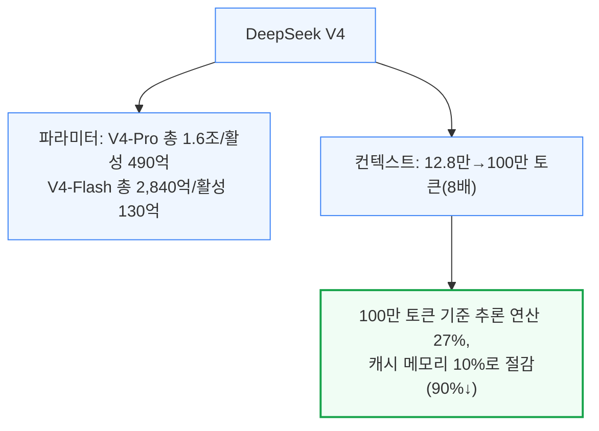

압축 희소 어텐션(CSA)·초압축 어텐션(HCA)·다양체 제약 하이퍼커넥션(mHC)이 장문맥 개선의 핵심 기술입니다.
V4 Pro는 최상위 모델과 대등하나 중국어 글쓰기는 Opus 4.7에 못 미치고, H200 처리량도 초당 약 150토큰으로 V3(1,300\~2,300토큰)보다 느립니다.
종합적으로 최상위 대체재는 아니지만 가장 저렴한 대안으로 자리잡을 전망입니다.

---

## 3. 실사용 체감: 코덱스 vs 클로드 코드

**📌 핵심:**
- SemiAnalysis 엔지니어 대부분이 기존엔 클로드만 썼지만, GPT-5.5 알파 테스트 이후 작업 성격에 따라 코덱스와 클로드를 오가는 방식으로 바뀜 — 코덱스는 코드베이스·인터넷 맥락을 깊이 끌어오고, 클로드는 대충 준 지시에서도 "진짜 의도"를 더 잘 파악
- 실제 테스트에서 Opus 4.6은 기존 대시보드를 그대로 복제했지만 코덱스는 지시받지 않은 부분(홈페이지)을 통째로 건너뜀 — 다만 코덱스가 채운 실제 수치는 클로드보다 훨씬 정확(클로드는 GPU 종류를 잘못 넣는 등 수치를 지어낸 사례 있음)
- 워크플로우는 "클로드로 설계·뼈대 작성 → 코덱스로 문제 해결·버그 수정"으로 자리잡는 중이나, 코덱스는 원격 제어·샌드박스 등 플러그인 기능이 클로드 코드보다 뒤처져 채택 속도를 늦춤
- 결론: GPT-5.5는 모델 자체 경쟁력을 갖췄지만, OpenAI가 Anthropic을 따라잡으려면 기능 출시 속도를 훨씬 끌어올려야 함

---

GPT-5.5 알파 테스트 전에는 거의 전원이 클로드만 썼고 ChatGPT는 Cursor 같은 래퍼로만 썼습니다. 이제는 작업 성격과 IDE 취향에 따라 두 모델을 오갑니다.

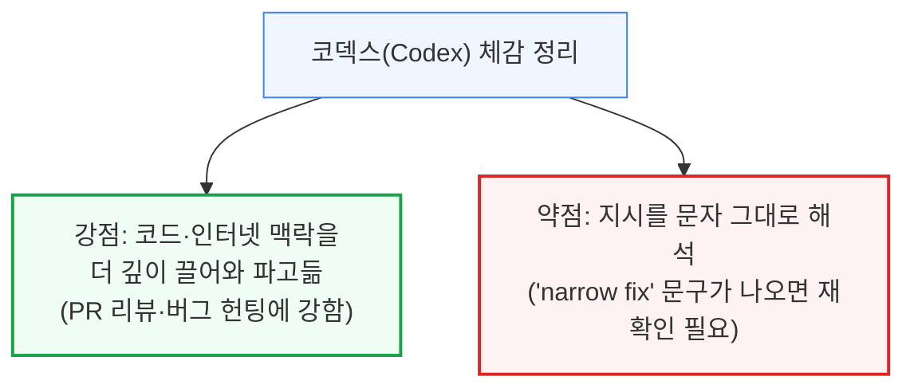

같은 지시("기존 대시보드를 참고해 신규 대시보드를 만들어라")를 준 실제 실험에서도 상반된 결과가 나왔습니다.

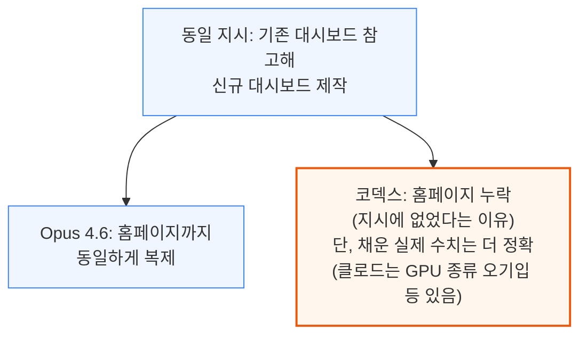

"코덱스는 좁고 명확한 문제를 깊게 풀고, 클로드는 열린 결말의 신규 프로젝트에 강하다"는 인상과 일치합니다. 이런 이유로 일부는 **클로드로 설계 → 코덱스로 문제 해결** 순서를 정착시켰습니다.

문제는 플러그인·기능입니다. 패스트 모드·100만 토큰 컨텍스트·원격 제어는 클로드 코드 전 플랫폼에서 가능하지만 코덱스는 아직 불가능해, 모델이 나아져도 채택은 늦어집니다.

---

## 4. 벤치마크 해부학: MMLU에서 SWE-bench, GDPval까지

**📌 핵심:**
- 벤치마크는 "과제 + 채점 방식 + 하네스" 3요소로 구성 — 과제·채점 방식만 뜯어봐도 점수를 믿을 수 있는지 판단 가능
- MMLU(57개 과목 객관식 1만5,908문항)는 2023년 3월 GPT-4가 86.4%로 사실상 만점(포화)에 도달해 변별력을 잃었고, 문항 자체의 **6.49%가 오류**로 확인
- SWE-bench(2023년)는 저장소 버그 이력에서 자동 추출한 2,294개 과제로 시작했으나 **사람 검수가 전혀 없어** 채점 오류가 다수 확인 → OpenAI의 500개 "검증판"(2024년 8월)조차 2026년 2월 신뢰 상실로 폐기, 이후 "SWE-bench Pro"로 대체
- GDPval(2025년 9월, 44개 직업)은 전문가가 만든 채점 기준(루브릭)으로 실제 업무를 재현하지만, 단일 턴(1회 지시)이라 반복·피드백 과정을 반영 못 하는 한계
- 결론: 벤치마크는 "포화 → 더 어려운 버전 등장 → 다시 포화"를 반복하며, 코딩·업무 벤치마크는 사람 검수 유무가 신뢰도를 가르는 핵심 변수

---

벤치마크는 항상 세 요소로 나뉩니다. 앞의 둘(과제·채점 방식)을 봐야 점수가 실제 실력을 재는지 알 수 있습니다.

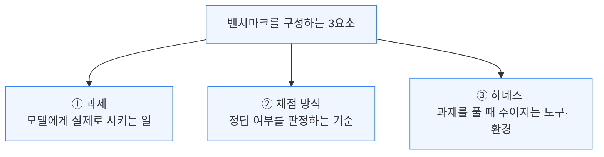

### MMLU류 객관식 벤치마크: 2023년에 이미 포화

2020년 공개된 MMLU는 57개 과목 1만5,908개 객관식으로, 채점이 쉬워(정답 알파벳만 확인) 초창기 표준이 됐습니다.

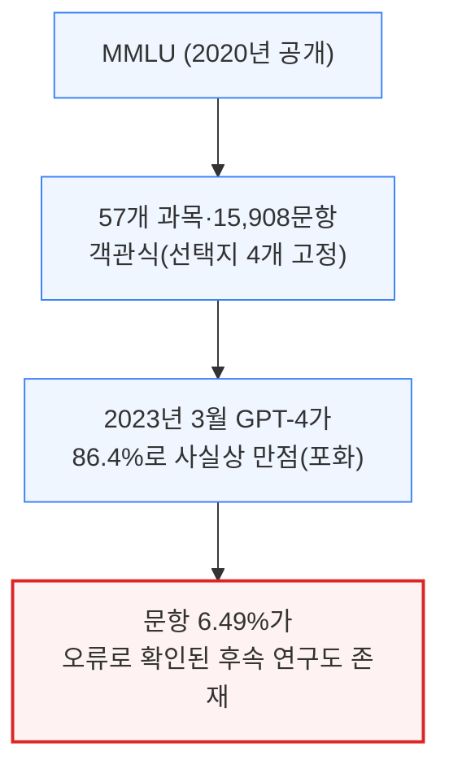

오늘날 대표 단답형 벤치마크는 2025년 1월 공개된 HLE(전문가 1,000명 이상이 만든 2,500문항)입니다. 다만 HLE도 화학·생물 문항의 **30%가 학술 문헌과 상충**한다는 연구가 있습니다.

### SWE-bench와 코딩 벤치마크: 검수 없는 자동 추출의 대가

2023년 공개된 SWE-bench는 django 등 12개 파이썬 저장소의 버그 수정 PR을 자동으로 걸러 만든 코딩 벤치마크입니다.

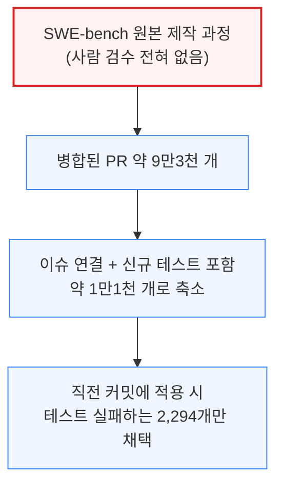

사람 검수가 없다 보니 불공정한 과제가 섞여, OpenAI는 2024년 8월 개발자 93명을 고용해 500개짜리 "SWE-bench Verified"를 냈지만 2026년 2월 스스로 폐기를 선언했습니다.

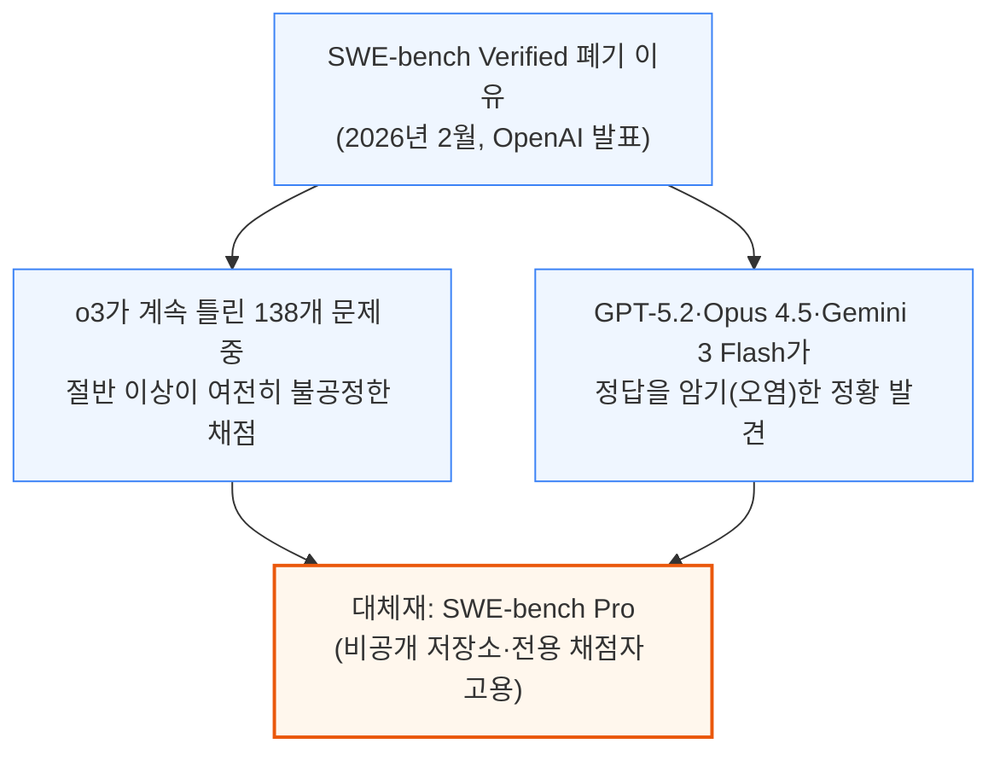

Terminal-bench, SWE-bench multilingual 등도 함께 쓰이지만, "완벽한 벤치마크는 없다"는 결론은 달라지지 않습니다.

### GDPval과 비코딩 업무 벤치마크: 실제 직업을 재현하지만 단일 턴 한계

GDPval(2025년 9월 공개)은 금융분석가부터 간호사까지 44개 직업의 전문가를 고용해 과제·모범답안·루브릭을 만들고, 오피스 프로그램·CAD 등 실제 업무 도구를 하네스로 제공합니다.

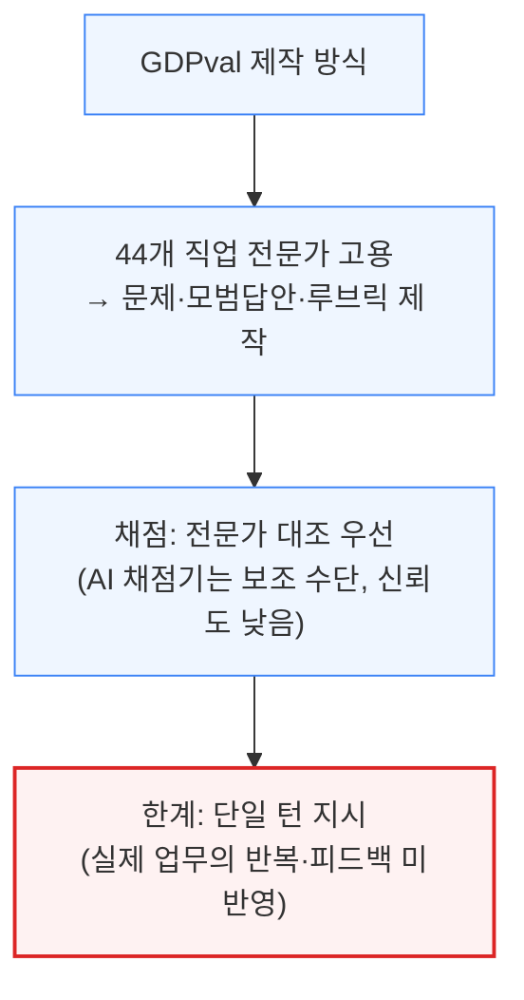

- Apex Agents(은행·컨설팅·법률), Finance Agent(SEC 공시 분석): 모두 LLM 심사관 채점
- BrowseComp(구글링 어려운 질문), OSWorld·Tau-bench(컴퓨터 조작·고객 서비스 시뮬레이션)

이들 대부분이 채점을 AI 심사관("LLM-as-a-judge")에 맡겨, 사람 검증 없는 신뢰도 문제가 반복됩니다.

---

## 5. OpenAI의 벤치마크 취사선택, 무엇을 숨겼나

**📌 핵심:**
- 회사가 "발표하지 않은" 벤치마크를 보면 더 많은 정보를 얻을 수 있음 — OpenAI는 한 달 앞선 Opus 4.6에 완패했을 가능성이 커, GPT-5.4 발표 때 Anthropic 모델과의 비교를 생략
- GPT-5.5 발표에는 클로드·제미나이가 다시 비교표에 등장 — 업계 최고 수준(frontier)에 복귀했다는 신호
- 그런데도 SWE-bench Pro를 업계 표준으로 밀던 자신의 주장과 달리, 발표에는 이 지표가 빠지고 낯선 "Expert-SWE"만 등장 — 블로그 맨 아래를 보면 이 벤치마크에서 GPT-5.5가 **Opus 4.7에 완패**(신모델 Mythos는 77.8%로 격차 더 큼)
- 결론: GPT-5.5는 일부 코딩 과제에서 낫지만 전 영역 압도는 아니라는 정성 평가와 정확히 일치 — "발표 안 한 벤치마크"가 종종 더 많은 진실을 말해줌

---

포화됐다고 여겨지던 SWE-bench Verified에서 10%p 이상 개선(Mythos 달성)한 것은 여전히 의미가 있지만, 회사가 "고르지 않은" 벤치마크도 눈여겨봐야 합니다.

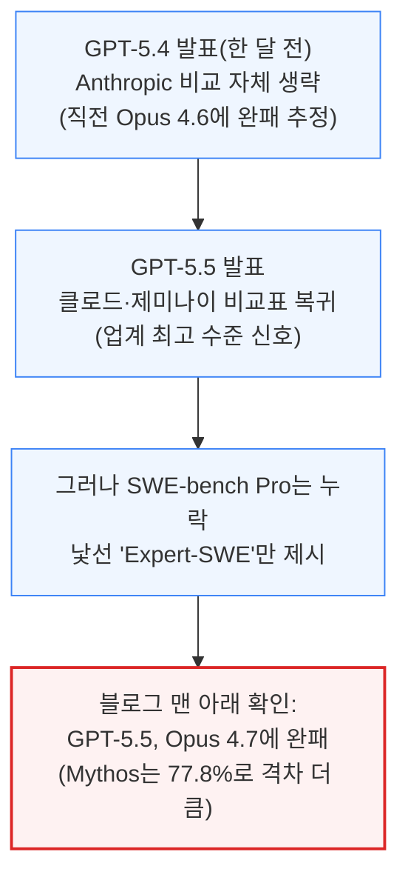

OpenAI는 지난 2월 SWE-bench Verified를 폐기하며 SWE-bench Pro를 새 표준으로 밀자던 회사입니다.
정작 자사 발표엔 이를 빼고 낯선 지표를 썼다는 것은, GPT-5.5가 이 영역에서 밀린다는 사실을 가리려 한 정황으로 해석됩니다. 앞서 실사용 비교에서 확인한 평가와 정확히 겹칩니다.

---

## 6. 하네스가 다르면 벤치마크 비교도 무의미하다

**📌 핵심:**
- SemiAnalysis가 자체 하네스로 GPT-5.5·5.4·Opus 4.6을 같은 조건에서 재측정한 결과는 두 회사의 공식 점수보다 전반적으로 낮음 — 두 랩이 비공개 전용 하네스로 점수를 극대화했고, SemiAnalysis는 비용 절감을 위해 과제 일부만 표본 추출(예: MCP atlas는 전체 36개 중 21개 서버만 테스트)했기 때문
- 같은 하네스로 비교하면 "공정"해 보이지만, 실제 사용자가 신경 쓰는 것은 모델 단독이 아니라 "코덱스 대 클로드 코드"라는 하네스+모델 결합 제품의 체감 성능
- 코덱스는 입력\~출력 토큰 비율이 **80:1**로 클로드 코드(100:1)보다 입력을 덜 써, 토큰 단가가 비싸도 과제당 비용은 오히려 코덱스가 저렴한 것으로 잠정 확인
- 결론: 하네스가 프롬프트 캐싱·입출력 비율·도구 사용 패턴까지 좌우해, 벤치마크 점수만으로 두 회사를 비교하는 것은 실제 제품 경쟁력 비교로는 불완전함

---

SemiAnalysis 자체 벤치마크 결과는 두 회사 공식 발표치보다 낮았습니다.

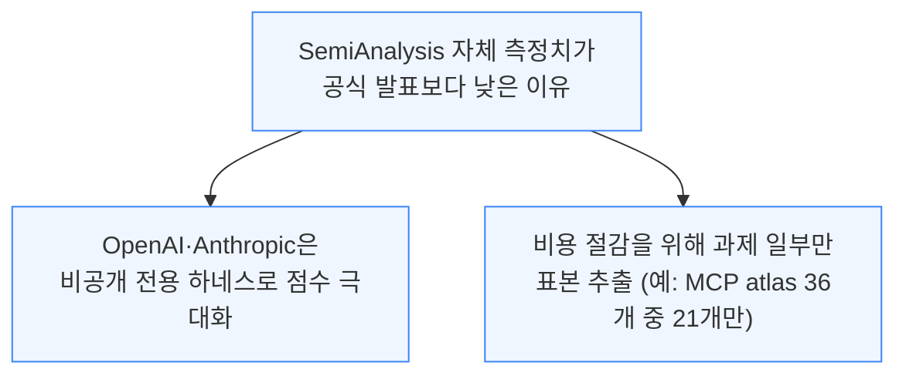

같은 하네스를 쓰면 "공정"해 보이지만, 정작 궁금한 것은 모델 단독이 아니라 실제 제품인 "코덱스 대 클로드 코드"입니다.

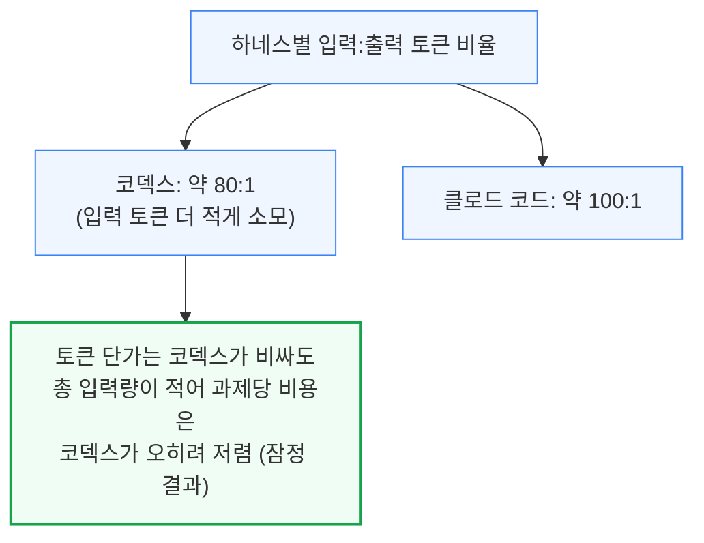

프롬프트 캐싱, 입출력 비율, 도구 호출 패턴은 모두 하네스가 좌우합니다.

---

## 7. 코딩 에이전트 전쟁, 최종 승자는 누구인가

**📌 핵심:**
- 현재는 사실상 **OpenAI vs Anthropic 2파전** — SpaceXAI가 커서(Cursor) 인수 이후 3위 후보로 거론되지만 큰 이변이 필요하고 구글·메타도 뒤처짐. 바이브 코딩 스타트업은 매출이 급성장해도 마진이 마이너스라 "하네스만 있고 모델은 없는" 반쪽 제품에 그침
- Anthropic 연매출은 **90억 → 400억 달러(추정)**로 급성장, 상당 부분이 클로드 코드 매출로 추정 — 약 **70%가 API**(배포 규모에 비례)라 무료 이용자 비중이 큰 ChatGPT보다 매출의 질이 높다는 평가
- 다만 Anthropic은 컴퓨팅 절반 이상을 고객 서비스에 안 내주려는 성향이 있어 이미 고가 물량 배분을 시도 중 — 밀려나는 수요가 OpenAI에게는 기회
- 결론: GPT-5.5는 여러 지표에서 Opus를 앞서 나쁜 모델이 아니며, 컴퓨팅 부족이 산업 제약인 한 OpenAI의 "코드 레드"는 곧 끝날 가능성 — 다만 Mythos 공개 이후에도 유지될지는 미지수

---

DeepSeek V4는 인상적이지만 폐쇄형과의 격차는 다시 벌어지는 중으로, 시장 구도는 아래와 같습니다.

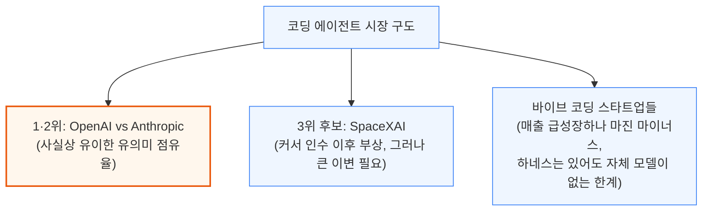

바이브 코딩 스타트업(Windsurf/Cognition, Replit, Vercel V0, Lovable 등) 전체 연매출을 합쳐도 여전히 수십억 달러 초반대에 불과합니다.

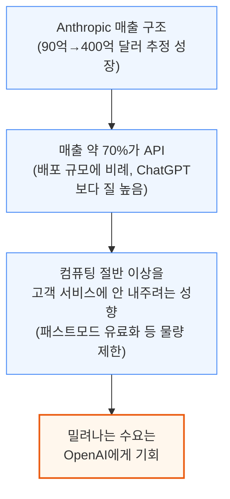

산업 전반의 컴퓨팅 부족이 계속되는 한, GPT-5.5처럼 이미 여러 지표에서 경쟁력을 갖춘 모델이 있는 OpenAI에게는 점유율을 지킬 기회입니다. 다만 Anthropic의 차세대 모델 Mythos 공개 이후에도 이 구도가 유지될지는 지켜봐야 합니다.

---

*작성 진행률: 100% 완료*
*업데이트: 7장(코딩 에이전트 전쟁 전망) 작성 완료, 원문 전 섹션 번역 완료*
