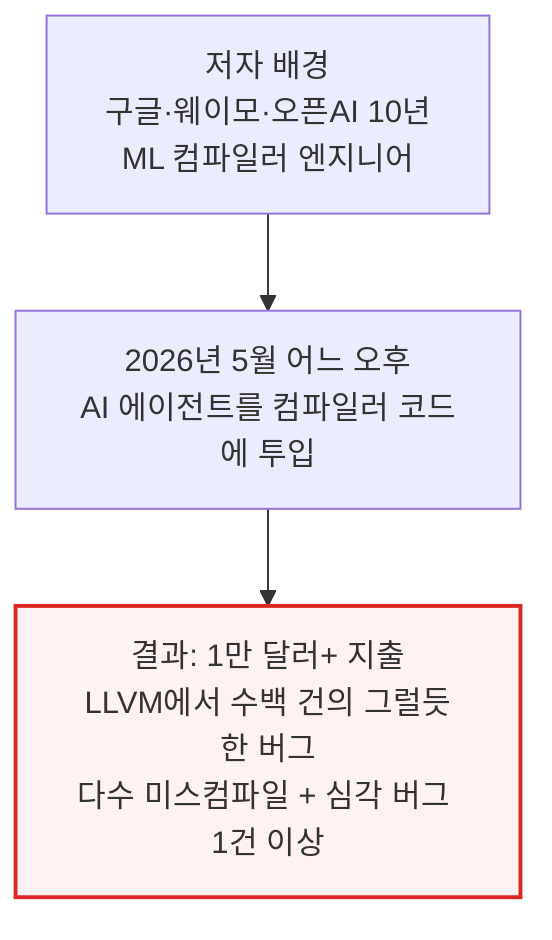
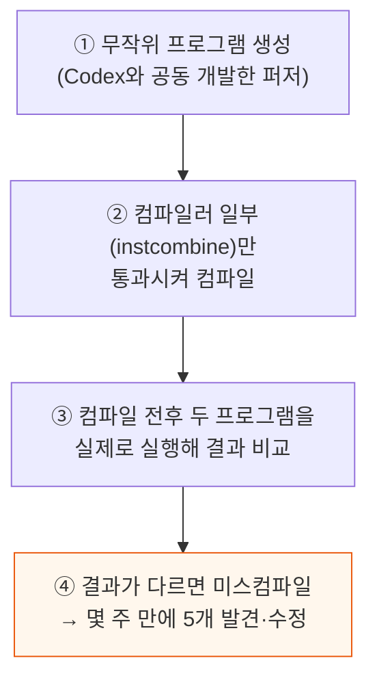
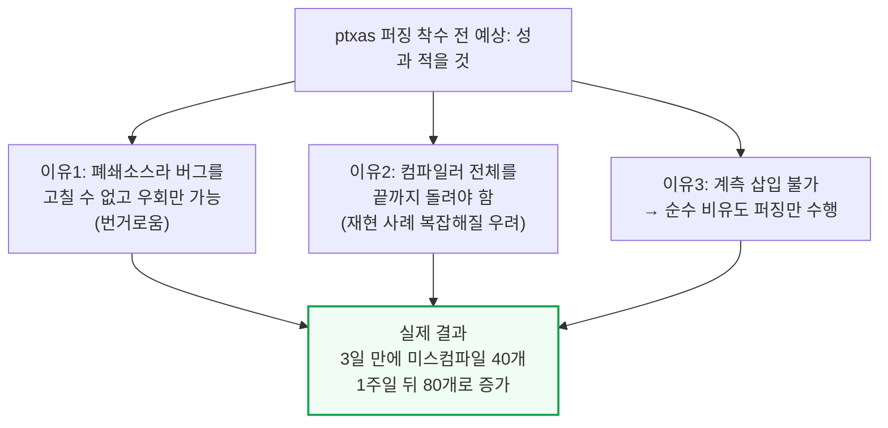
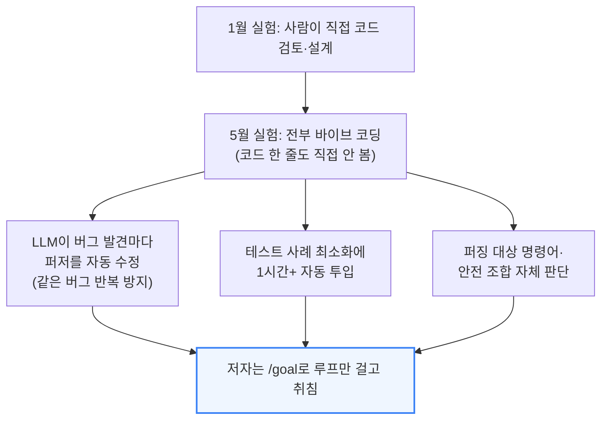
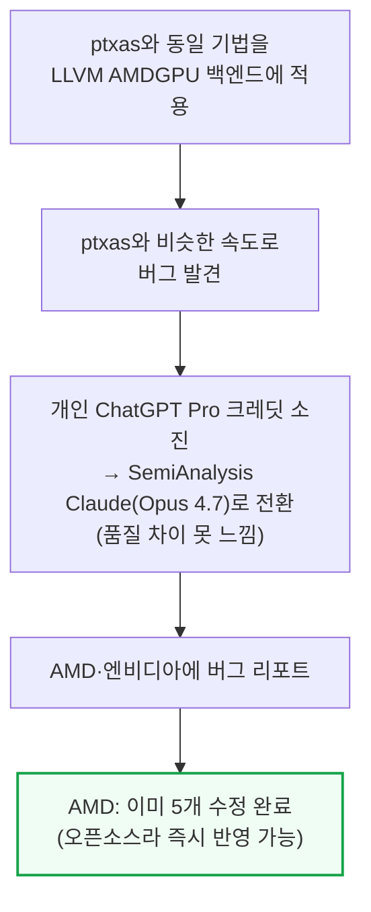
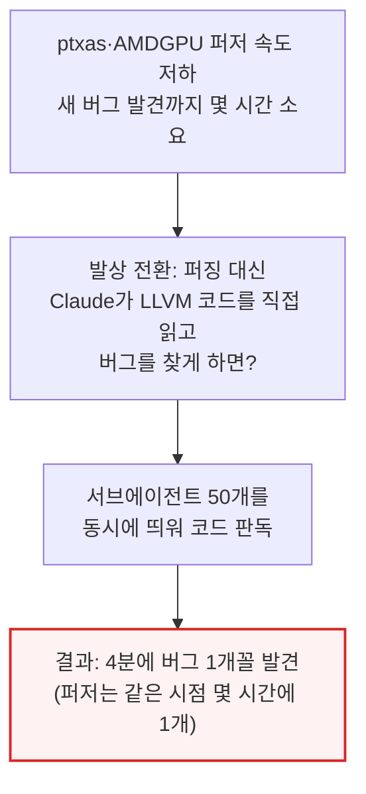

# Finding Miscompiles for Fun, Not Profit

> **출처**: [https://newsletter.semianalysis.com/p/finding-miscompiles-for-fun-not-profit](https://newsletter.semianalysis.com/p/finding-miscompiles-for-fun-not-profit)
> **저자**: Justin Lebar
> **발행일**: 2026-05-28

---

> **2026년 6월 1일 업데이트(저자 추가)**: 이 글을 발행한 다음 날 앤트로픽이 Opus 4.8과 Claude Code의 "울트라코드(ultracode)" 모드를 출시했다. 저자의 예비 실험(오차 범위 매우 큼)에 따르면 두 가지를 함께 쓰면 경미한 버그를 걸러내는 성능이 크게 좋아지고, 중간\~고위험 버그 1건당 비용이 이 글에서 설명한 작업 방식의 약 5분의 1 수준으로 떨어진다.

## 📑 목차

1. [서론 - 컴파일러 버그 사냥의 시작](#1-서론---컴파일러-버그-사냥의-시작)
2. [2026년 1월 - LLVM 퍼저 첫 실험](#2-2026년-1월---llvm-퍼저-첫-실험)
3. [2026년 5월 - ptxas로 확장, 예상을 뒤엎은 결과](#3-2026년-5월---ptxas로-확장-예상을-뒤엎은-결과)
4. [왜 이렇게 쉬웠나 - 모델 세대교체와 바이브 코딩](#4-왜-이렇게-쉬웠나---모델-세대교체와-바이브-코딩)
5. [AMDGPU 백엔드 확장과 버그 리포트 현황](#5-amdgpu-백엔드-확장과-버그-리포트-현황)
6. [방향 전환 - 퍼징에서 코드 판독 에이전트로](#6-방향-전환---퍼징에서-코드-판독-에이전트로)
7. [x86 백엔드와 버그 심각도 - 원자적 저장소 사례](#7-x86-백엔드와-버그-심각도---원자적-저장소-사례)
8. [비용 분석 - 퍼저 개발비 vs 에이전트 코드 판독비](#8-비용-분석---퍼저-개발비-vs-에이전트-코드-판독비)
9. [결론 - "이제는 그냥 비쌀 뿐"과 남은 질문](#9-결론---이제는-그냥-비쌀-뿐과-남은-질문)

---

## 🔑 용어 정리

본문을 순서대로 읽기 전에 알아두면 좋은 용어들입니다. 자세한 수치와 설명은 본문에서 처음 등장하는 위치에 나옵니다.

- **미스컴파일 (Miscompile)**: 컴파일러가 코드를 최적화하는 과정에서 실수를 저질러, 최적화 이전과 다르게 동작하는 결과물을 만들어내는 버그
- **퍼저(Fuzzer)와 퍼징(Fuzzing)**: 무작위로 생성한 입력을 프로그램에 밀어 넣어, 예상과 다르게 동작하는 지점을 자동으로 찾아내는 테스트 도구·기법
- **컴파일러 백엔드 (Backend)**: 컴파일러 중 특정 하드웨어(AMD GPU, x86 CPU 등)에 맞는 실제 기계어를 만들어내는 부분 — LLVM은 여러 하드웨어별 백엔드를 하나의 틀 안에서 관리
- **instcombine**: LLVM 컴파일러 안에서 자잘한 코드 패턴을 더 단순하고 빠른 형태로 바꿔주는 최적화 단계(peephole 최적화)
- **ptxas**: 엔비디아 GPU용 저수준 명령어(PTX)를 GPU가 실제로 실행할 기계어로 바꿔주는, 엔비디아의 비공개(폐쇄소스) 컴파일러
- **서브에이전트 (Subagent)**: AI 하나가 여러 개의 하위 작업 담당 AI를 동시에 띄워 병렬로 일을 시키는 방식 — 이 글에서는 컴파일러 코드를 읽고 버그를 찾는 역할
- **바이브 코딩 (Vibe Coding)**: 개발자가 코드를 직접 보거나 짜지 않고, AI에게 목표만 주고 결과물을 통째로 맡기는 개발 방식

---

## 1. 서론 - 컴파일러 버그 사냥의 시작

**📌 핵심:**
- 저자 저스틴 러바(Justin Lebar)는 구글·웨이모·오픈AI에서 10년간 ML용 컴파일러를 다뤄온 엔지니어(clang의 CUDA 지원, XLA:GPU, Triton, 오픈AI 자체 하드웨어 컴파일러 작업 경력)
- 2026년 5월 어느 하루 오후, AI 에이전트를 컴파일러 코드에 풀어놓고 **1만 달러 이상을 지출** — LLVM에서 수백 건의 그럴듯한 버그를 찾았고, 그중 다수가 미스컴파일, 최소 1건은 "꽤 심각한" 수준
- 저자는 이를 "커리어에서 가장 불안했던 경험 중 하나"라고 표현 — 도구 하나가 하루 만에 사람 10년 경력의 직관을 뒤흔든 사건이기 때문
- 결론: 이 글은 1월의 개인 프로젝트에서 5월의 대규모 에이전트 투입까지, 저자가 어떻게 여기에 이르렀는지와 그 과정에서 확인한 재현 가능한 방법을 그대로 기록한 것

---

---

## 2. 2026년 1월 - LLVM 퍼저 첫 실험

**📌 핵심:**
- 2026년 1월, 저자는 개인 프로젝트로 LLVM(clang·rustc·AMD GPU 컴파일러가 공유하는 컴파일러 기반)에서 버그를 찾기로 결심
- 오픈AI의 코딩 도구 Codex와 함께 퍼저를 공동 개발 — 무작위 프로그램을 만들고 컴파일러 일부를 통과시킨 뒤, 컴파일 전후 두 프로그램이 같은 결과를 내는지 실제로 실행해 비교하는 방식
- 몇 주 작업 끝에 instcombine(LLVM의 peephole 최적화 단계)에서 버그 5개를 찾아 직접 고침 — 이후 퍼저의 버그 발견 속도가 느려지자 흥미를 잃고 프로젝트를 중단
- 결론: 이 1월 실험이 5월 대규모 실험의 원형 — 같은 퍼징 아이디어를 대상만 바꿔 반복하게 됨

---

---

## 3. 2026년 5월 - ptxas로 확장, 예상을 뒤엎은 결과

**📌 핵심:**
- 2026년 5월 중순 SemiAnalysis에 계약직으로 합류한 뒤, 저자는 같은 퍼징 기법을 엔비디아의 저수준 컴파일러 ptxas에 적용 — 이번엔 성과가 적을 것으로 예상했던 이유가 3가지 있었음
- LLVM은 오픈소스라 버그를 찾으면 고치고 계속 진행 가능하지만, 폐쇄소스인 ptxas는 같은 버그를 다시 건드리지 않도록 퍼저를 수정하는 우회밖에 못함(번거로움) — 또 LLVM은 한 단계(pass)만 실행하면 되지만 ptxas는 컴파일러 전체를 끝까지 돌려야 해 재현 사례가 더 크고 복잡해질 것을 우려
- LLVM은 직접 빌드해 계측(instrumentation)을 넣어 퍼저가 "흥미로운" 입력을 고르게 도울 수 있지만, ptxas는 폐쇄형이라 AFL++의 사전컴파일 바이너리 계측 모드를 써야 하는데 속도 저하가 커서 사용하지 않고 순수 비유도(undirected) 퍼징만 수행
- 결론: 예상은 완전히 빗나감 — **3일 만에 40개, 1주일 뒤 80개**의 ptxas 미스컴파일 프로그램을 확보했고, 재현 사례 다수가 겉보기엔 평범한 명령어 시퀀스로 축소됨(코드는 [FuzzX 저장소](https://github.com/SemiAnalysisAI/FuzzX)에 공개)

---

---

## 4. 왜 이렇게 쉬웠나 - 모델 세대교체와 바이브 코딩

**📌 핵심:**
- 저자는 이번 ptxas 퍼저가 1월보다 훨씬 쉬웠던 이유를 모델 세대교체(ChatGPT 5.2 → 5.5)로 추정 — 이번엔 퍼저 코드를 한 줄도 직접 보지 않고 전부 바이브 코딩으로 완성
- LLM이 버그를 찾을 때마다 퍼저를 스스로 수정해 같은 버그에 반복해서 걸리지 않게 만들었고, 각 테스트 사례를 최소화하는 데만 1시간 이상을 쓰기도 함 — 어떤 PTX 명령어를 퍼징할지, 어떤 명령어 조합이 "안전한지(정의되지 않은 동작을 유발하지 않는지)"도 스스로 판단
- 저자가 한 일은 `/goal` 명령으로 루프를 걸어두고 잠자리에 든 것뿐
- 결론: 퍼징 자체가 버그를 찾는 건 놀랍지 않지만, 사람의 개입이 거의 없이 이 정도 속도로 찾은 것은 저자에게도 놀라운 결과

---

---

## 5. AMDGPU 백엔드 확장과 버그 리포트 현황

**📌 핵심:**
- 저자는 같은 기법을 LLVM의 AMDGPU 백엔드(AMD GPU용 기계어를 만드는 부분)에도 적용 — ptxas와 비슷한 속도로 버그를 찾음
- 개인 ChatGPT Pro 계정의 크레딧이 소진되자 SemiAnalysis의 Claude 계정(Opus 4.7)으로 전환 — ChatGPT 5.5와 품질 차이를 느끼지 못함
- 발견한 버그는 AMD와 엔비디아에 리포트했고, 이 글을 쓰는 시점 기준 AMD는 이미 5개를 수정 — AMDGPU 백엔드는 오픈소스라 수정사항을 즉시 반영 가능(폐쇄소스인 ptxas는 저자가 직접 고칠 수 없음)
- 결론: 오픈소스 여부가 "버그를 찾은 뒤 무엇을 할 수 있는가"를 가르는 핵심 변수 — LLVM 계열은 발견\~수정 반영까지의 순환이 훨씬 빠름

---

---

## 6. 방향 전환 - 퍼징에서 코드 판독 에이전트로

**📌 핵심:**
- ptxas·AMDGPU 퍼저 모두 속도가 느려지기 시작(새 버그를 찾는 데 점점 더 오래 걸림) — 저자는 거의 그만둘 뻔했지만, "Claude에게 그냥 LLVM 코드를 읽고 버그를 찾게 하면 어떨까"라는 생각이 떠오름("쓴 교훈(Bitter Lesson)" — 정교한 맞춤 기법보다 단순히 더 많은 연산을 투입하는 범용 방법이 결국 이긴다는 리처드 서튼의 관찰을 겨냥한 질문)
- Claude에게 한 번에 서브에이전트 50개를 띄워 버그를 찾게 지시 — 결과는 **4분에 1개꼴**로 버그 발견, 같은 시점 퍼저는 새 버그 하나 찾는 데 몇 시간이 걸리던 상황
- 결론: 버그를 "찾아내는(생성해서 실행 비교)" 방식에서 "코드를 읽고 판단하는" 방식으로 전환하자 발견 속도가 퍼징 대비 훨씬 빨라짐

---

---

*작성 진행률: 약 66% 완료*
*업데이트: 섹션 4\~6 작성 완료*
