# RL Environments and RL for Science: Data Foundries and Multi-Agent Architectures

> **출처**: [https://newsletter.semianalysis.com/p/rl-environments-and-rl-for-science](https://newsletter.semianalysis.com/p/rl-environments-and-rl-for-science)
> **저자**: [[Dylan Patel]]
> **발행일**: 2026-01-07

📑 목차
 1. [서론: 왜 RL 스케일링이 결정적인가](#1-서론-왜-rl-스케일링이-결정적인가)
 2. [스케일 AI의 몰락과 RL 환경 골드러시](#2-스케일-ai의-몰락과-rl-환경-골드러시)
 3. [코딩 환경은 어떻게 만들어지는가](#3-코딩-환경은-어떻게-만들어지는가)
 4. [데이터 파운드리와 전문 계약자](#4-데이터-파운드리와-전문-계약자)
 5. [랩별 구매 패턴: 앤트로픽·OpenAI·구글 딥마인드](#5-랩별-구매-패턴-앤트로픽openai구글-딥마인드)
 6. [AI 자동화는 당연한 결과가 아니다](#6-ai-자동화는-당연한-결과가-아니다)
 7. [에이전트 접근 차단과 플랫폼 정치](#7-에이전트-접근-차단과-플랫폼-정치)
 8. [RL as a Service: 기업용 RL 대행 시장](#8-rl-as-a-service-기업용-rl-대행-시장)
 9. [과학을 위한 RL: 피어리오딕 랩스와 미드트레이닝](#9-과학을-위한-rl-피어리오딕-랩스와-미드트레이닝)
10. [RL이 습식 실험실을 만나다: 제약 데이터 경쟁](#10-rl이-습식-실험실을-만나다-제약-데이터-경쟁)
11. [생물학 RL이 어려운 이유: 희소 보상과 롤아웃 병목](#11-생물학-rl이-어려운-이유-희소-보상과-롤아웃-병목)
12. [멀티 에이전트 아키텍처: 다음 스케일링 축](#12-멀티-에이전트-아키텍처-다음-스케일링-축)

🔑 용어 정리
- **RL 환경 (RL Environment)**: AI 모델에게 과제를 실제로 수행해보게 하고 그 결과에 따라 보상을 주는 시뮬레이션·소프트웨어 공간 — 강화학습(RL)의 "교재이자 시험장" 역할
- **데이터 파운드리 (Data Foundry)**: AI 랩을 대신해 학습용 과제·전문가 채점·RL 환경을 만들어 공급하는 외주 전문 업체
- **GDPval**: OpenAI가 만든 평가로, 44개 실제 직업의 업무를 전문가 결과물과 비교해 AI가 실제 업무에 얼마나 쓸모 있는지 재는 방식
- **미드트레이닝 (Mid-training)**: 사전학습과 강화학습(RL) 사이에 끼워 넣는 추가 학습 단계 — 최신 지식을 주입하거나 RL을 더 잘 받아들이도록 모델을 예열하는 역할
- **습식 실험실 (Wet Lab)**: 시험관·시약·로봇 장비로 실제 화학·생물 실험을 수행하는 물리적 실험실 (컴퓨터 시뮬레이션과 대비되는 개념)
- **롤아웃 (Rollout)**: 모델이 과제를 처음부터 끝까지 한 번 실제로 수행해보는 시행 단위 — RL은 이 시행을 여러 번 반복하며 보상이 높은 방향으로 모델을 조정
- **RL as a Service**: 기업이 자체 데이터·업무를 가지고 와 AI 모델을 자기 업무에 맞게 강화학습(RL)해주는 대행 서비스
- **멀티 에이전트 아키텍처 (Multi-Agent Architecture)**: 하나의 모델이 아니라 여러 AI 모델(에이전트)이 역할을 나눠 협업하며 하나의 문제를 함께 풀도록 짜는 구조

---

## 1. 서론: 왜 RL 스케일링이 결정적인가

**📌 핵심:**
- OpenAI는 o1·o3·GPT-5 시리즈까지 **같은 베이스 모델(GPT-4o)**을 계속 사용했는데도 18개월간 성능이 계속 향상 — 사전학습이 아니라 후속 학습 단계인 **강화학습(RL) 확대만으로** 이뤄낸 성과, 이제는 사전학습 문제도 해결해 두 축 모두 가동 가능
- OpenAI의 실제 업무 능력 평가 **GDPval**에서 최고 모델 GPT-5.2가 전문가 결과물과 **71% 비율로 동률·선호**됨 — 44개 직업·1,000개 이상 과제, 평균 14년 경력 전문가가 문제 제작
- OpenAI는 **2028년 3월까지 자율 AI 연구자** 확보를, Anthropic은 **2027년까지 클로드가 수년 걸릴 과학적 발견을 자율적으로** 해내는 것을 목표로 제시
- 결론: RL 스케일링은 사전학습처럼 인터넷 전체를 학습 재료로 쓸 수 없어 과제·환경을 하나하나 직접 만들어야 하며, 이 노동집약적 작업이 이번 문서의 핵심 주제인 "RL 환경 산업"을 만들어냄

---

지난해 6월 SemiAnalysis는 "RL 스케일링이 AI 능력 향상의 핵심 경로"라는 주장을 폈고, 이후 수개월간 이 주장이 사실로 확인됐습니다. OpenAI가 가장 뚜렷한 사례입니다.

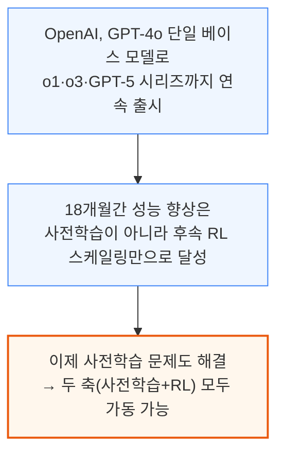

Anthropic·xAI, 특히 Google은 사전학습 확대에서도 상당한 성과를 얻어, 사전학습이 끝난 기술은 아닙니다. 다만 RL 확대는 사전학습과 근본적으로 다른 난제를 안고 있습니다.

- 사전학습: 인터넷 전체가 학습 재료
- RL: 모델이 풀어야 할 과제 자체를 하나하나 새로 만들어야 함(수학 문제에서 시작해 의료·금융 모델링 등 전문 분야로 확장 중)

과제·데이터를 모으는 방법은 수작업 제작 또는 실사용자의 고품질 데이터 큐레이션 두 가지입니다. 후자 덕분에 Windsurf·Cursor 같은 회사도 대형 랩만큼의 자원 없이 자체 경쟁력 있는 모델을 후속학습(post-train)할 수 있습니다.

이런 후속학습은 코딩 같은 능력뿐 아니라 엑셀·파워포인트 같은 일상 도구에서의 "실용성" 자체를 끌어올립니다. OpenAI는 이 실용성·능력 향상을 재기 위해 GDPval이라는 평가를 만들었습니다.

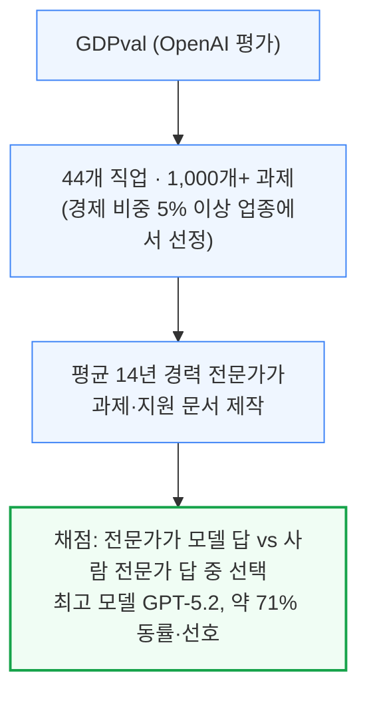

과제 예시로는 가상 인물의 세금 신고서 작성, 리조트 자문역으로서의 슬라이드 제작, 주어진 영상 소재로 광고 만들기 등이 있습니다. GDPval은 추상적 지능이 아니라 실제 업무 효용을 재는 방향으로 평가 트렌드가 이동하고 있음을 보여주는 대표 사례입니다 — 기존 평가 대부분이 수학 지식이나 박사급 과학 문제를 객관식으로 채점했던 것과 대비됩니다.

이런 흐름의 배경에는 모델이 점점 더 오래 자율적으로 작업할 수 있다는 공통된 관찰이 있습니다. AI 기업들은 이 능력이 결국 모델 스스로 다음 버전을 만드는 데 일조할 것으로 기대합니다.

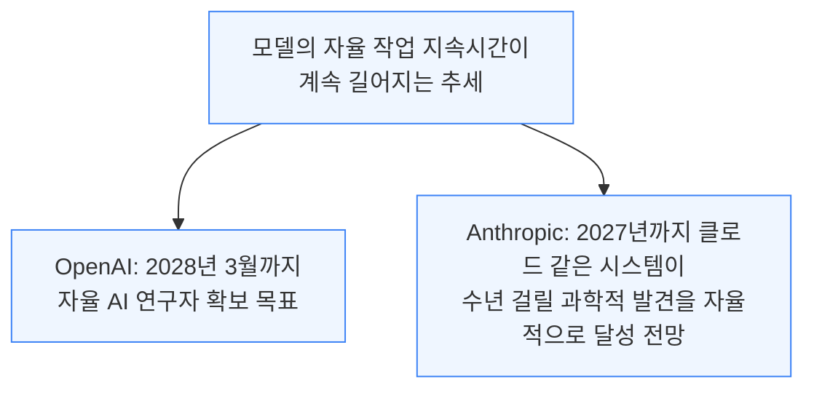

다만 이 여정에는 방대한 데이터·과제 큐레이션이 필요합니다. 예를 들어 컴퓨터 사용 환경은 인터넷상의 기존 웹사이트를 복제하는 등 상당한 소프트웨어 엔지니어링 노동을 요구해, 랩들은 이 작업 상당 부분을 외주화해왔습니다.

---

## 2. 스케일 AI의 몰락과 RL 환경 골드러시

**📌 핵심:**
- 스케일 AI는 한때 랩들의 최대 데이터 계약업체(2024년 매출 **14억 달러 이상**)였으나 **메타에 대부분 인수**된 뒤, 다른 랩들이 메타의 데이터 접근을 우려해 계약을 대부분 중단 — Surge 등 후발주자가 그 공백을 메우는 중
- "골드러시엔 삽을 팔아라"처럼 RL 스케일링 붐에선 RL 환경을 파는 스타트업이 **35개 이상** 등장 — 웹사이트를 복제하는 "UI 짐(UI Gym)"은 사이트당 약 **2만 달러**, OpenAI는 ChatGPT Agent 학습용으로 **수백 개** 구매
- 더 정교한 환경(슬랙·세일즈포스·지메일·아틀라시안 등)은 여러 플랫폼을 조합해 한 번에 끝나지 않는 **다중 턴(multi-turn)** 과제까지 구현 가능
- 결론: 환경은 1회성 구매 후 재사용되며, 과거 실행 기록(궤적·로그)은 이후 미드트레이닝 단계에 재투입돼 계속 가치를 만들어냄

---

스케일 AI는 모든 랩으로부터 상당한 지출을 받으며 2024년 매출 14억 달러 이상을 기록한, 역사적으로 최대 규모의 데이터 계약업체였습니다.

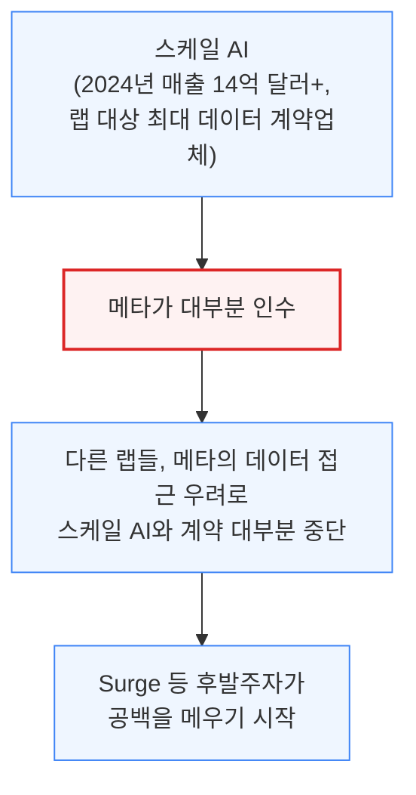

인수 이후 스케일 AI 인력 일부는 메타 슈퍼인텔리전스 그룹에 리더십·안전성·평가팀 위주로 합류했고, 조직 자체는 평가 제작과 일부 데이터 계약을 유지하지만 예전만큼 랩 전반에 서비스하지는 않습니다. 이 공백을 채우려 나선 것이 바로 RL 환경 스타트업들입니다.

골드러시 때는 삽을 팔듯, RL 스케일링 붐에서는 RL 환경 자체를 파는 것이 사업이 됐습니다. 이 목표만으로 35개 이상의 회사가 등장했습니다.

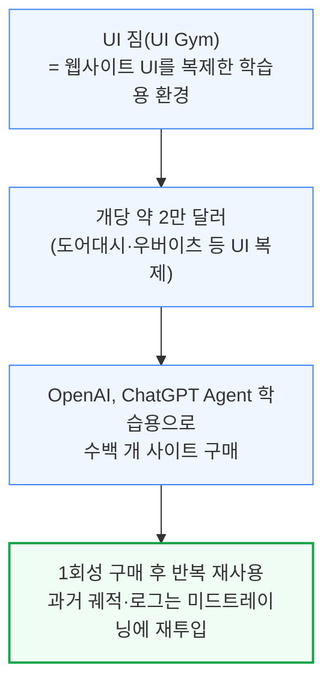

일부 업체는 단순 웹사이트를 넘어 슬랙·세일즈포스·AWS 터미널·마이크로소프트 원드라이브·지메일·디스코드·아틀라시안처럼 더 정교한 소프트웨어 플랫폼 환경으로 확장했습니다.

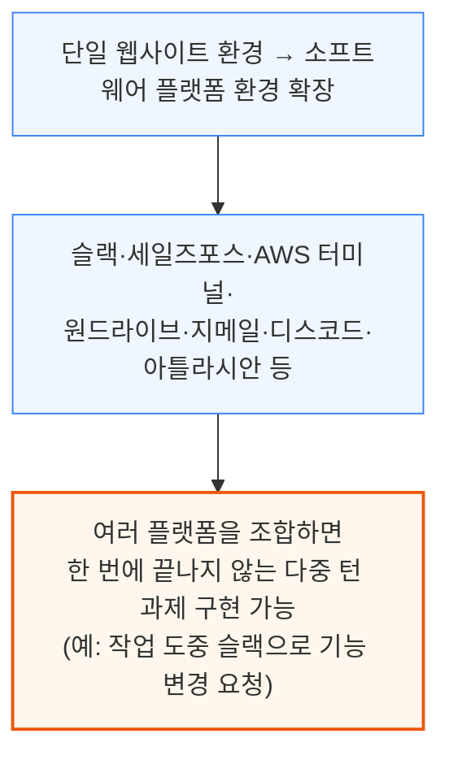

이런 환경을 만드는 회사로는 Habitat, DeepTune, Fleet, Vmax, Turing, Mechanize, Preference Model, Bespoke Labs, Veris.ai 등이 있습니다.

- 대부분 직원 20명 미만의 시드 단계 스타트업, 고객은 1\~3곳에 집중
- 대부분 비공개 독점 계약으로 랩에 환경을 제공
- 예외: Prime Intellect는 자사 환경을 오픈소스로 공개하고 "Environments Hub"로 RL 환경의 원스톱 허브를 지향

**📌 용어 풀이: HUD의 환경 툴링 구조**
> - HUD는 게임·브라우저·구글 시트 등 어떤 소프트웨어든 도커 컨테이너로 감싸 확장 가능한 RL 환경으로 만드는 툴링을 제공
> - 컨테이너는 두 층으로 구성: ① 실제 감싸인 소프트웨어(환경 백엔드) ② 그 위에서 에이전트의 도구 호출(예: `click(x,y)`)을 실제 동작으로 변환해주는 MCP 서버
> - 각 과제는 프롬프트·설정 조건·성공 기준으로 구성되며, 성공 여부가 보상 신호로 반환됨. 모든 도구 호출과 관찰 결과는 텔레메트리로 기록돼 디버깅과 이후 학습 단계에 재활용

---

## 3. 코딩 환경은 어떻게 만들어지는가

**📌 핵심:**
- 코딩 환경 수요가 워낙 높아 "비공개 깃허브 저장소 하나의 가치" 때문에 망한 스타트업이 인수되는 경우까지 있다고 추정 — SWE-rebench가 실제 제작 과정을 보여주는 대표 사례
- 깃허브 아카이브(3만개 저장소·45만개 PR)에서 시작해 엄격한 필터링(병합·설명 충실도·테스트 포함 여부 등)을 거쳐 최종 **2만1,336개** 과제만 채택 — 45만개 중 약 4.7%만 살아남는 낮은 수율
- SWE-smith는 부족한 수율을 보완하기 위해 **인위적으로 버그를 합성**(미묘한 오류 주입, AST 변환, PR 역전, 다중 파일 조합)하는 4가지 방법을 사용 — 실제 PR 채굴과 합성 생성은 상호 배타적이지 않고 함께 쓰이는 것으로 추정
- 결론: DeepSeek는 V3.2 학습에 2만4,667개 코딩 과제를 사용했고, Kimi 등은 1만 개 이상의 인스턴스를 동시 구동할 수 있는 인프라를 갖춤 — 과제가 어려울수록 더 많은 시도(롤아웃)가 필요하지만, 그만큼 각 시도는 느려지는 트레이드오프 존재

---

코딩 환경은 가장 수요가 높은 영역입니다. SWE-rebench는 수천 개의 파이썬 과제를 깃허브에서 자동으로 모아 환경이 실제로 어떻게 구축되는지 보여주는 대표 사례이며, 랩들도 비슷한 자동화 파이프라인을 쓸 것으로 추정됩니다.

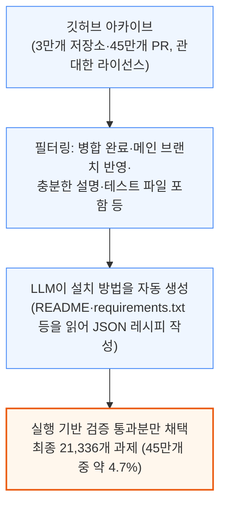

과제 하나가 유효하려면 패치 적용 전에는 최소 한 개 테스트가 실패하고, 패치 적용 후에는 그 테스트가 통과하며, 기존에 통과하던 테스트는 계속 통과해야 합니다. 이렇게 엄격한 기준 탓에 수율이 낮으며, SWE-smith는 이를 보완하기 위해 버그를 인위적으로 합성합니다.

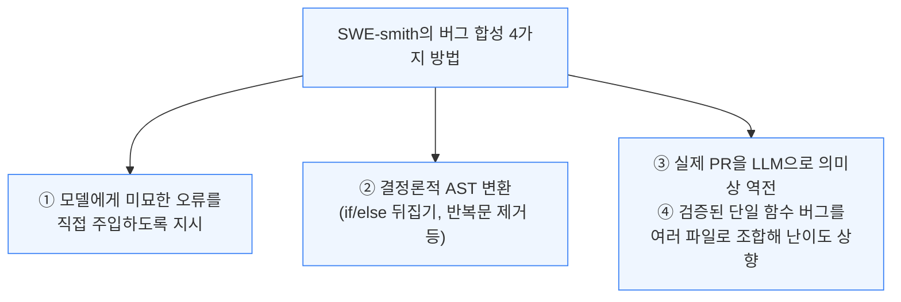

PR 채굴은 실제 개발 이력에서 나온 현실적인 버그 패턴을 담고, 합성 생성은 코드베이스 전체에 걸친 물량과 다양성을 제공합니다. 비공개 저장소에 접근 가능한 랩이라면 두 파이프라인을 함께 돌려 PR을 먼저 채굴한 뒤 합성 버그로 보강하는 방식이 유력한 실제 구축법으로 추정됩니다.

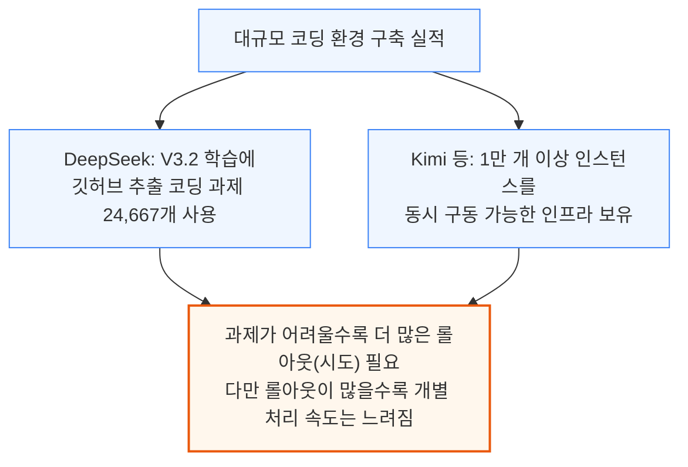

---

## 4. 데이터 파운드리와 전문 계약자

**📌 핵심:**
- 환경 자체는 소프트웨어 엔지니어가 만들지만, 워크플로우 설계·채점 기준은 재무·의료·법률 등 **도메인 전문 계약자**가 담당 — 최소 분기 단위 계약으로 과제 설계·기대 답안 작성·보상 신호 지정·채점까지 수행
- Mercor, Handshake, **Surge**(추정 연매출 **10억 달러**에 근접), Aboda.ai 등이 전문가 채용을 대행하며, 이들 다수가 원래 AI 면접·구직 매칭 업체로 출발했다가 랩과 전문가를 잇는 역할이 더 값어치 있다는 것을 발견
- Surge는 서구 랩뿐 아니라 문샷·Z.ai 같은 **중국 랩에도 국제적으로 서비스** 중인 것으로 추정 — Kimi K2 Thinking과 GLM-4.6의 능력 향상 상당 부분이 이런 RL 환경 접근에서 비롯된 것으로 분석
- 결론: 중국 VC들이 자국산 데이터 파운드리를 육성 중이나, Qwen은 현재 사전학습 연산의 약 **5%**만 후속학습에 투입할 정도로 아직 초기 단계 — 자국 파운드리가 성공하면 컴퓨팅이 허락하는 한 전환이 급가속될 전망

---

환경은 소프트웨어 엔지니어가 만들지만, 실제 업무 워크플로우는 재무·의료·법률 등 도메인 전문가가 정의·설명·채점합니다.

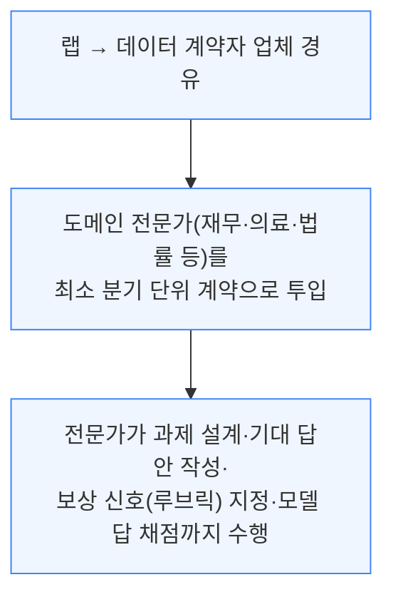

GDPval 같은 평가를 만들 때 동원되는 전문가도 바로 이런 계약자입니다. Mercor, Handshake, Surge, Aboda.ai 같은 업체가 이 전문가 채용을 대행하며, 대부분 AI 면접·구직 매칭 업체로 출발했다가 랩-전문가 연결 역할이 더 값어치 있음을 발견했습니다.

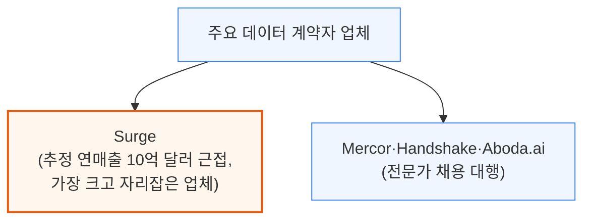

코딩 수요가 가장 크지만, 사진·음악·디자인 같은 비전문 영역 지출도 늘고 있습니다. 랩들은 과제 수뿐 아니라 폭과 다양성까지 늘리려 하기 때문입니다. 매출은 주로 서구 랩(Anthropic, OpenAI, Google)에 집중되지만, Surge는 문샷·Z.ai 같은 중국 랩에도 국제적으로 서비스하는 것으로 추정됩니다.

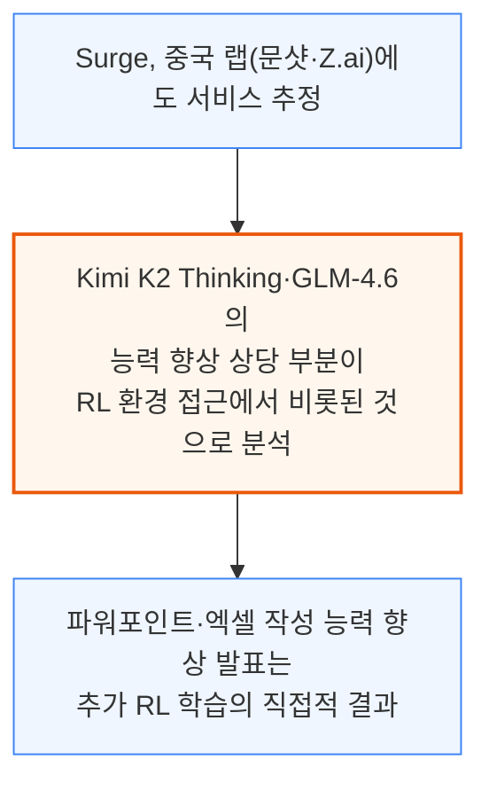

중국 VC들은 자국 생태계에 더 저렴하게 서비스할 자국산 데이터 파운드리 경쟁자를 육성 중입니다. 다만 대부분의 중국 랩은 아직 RL 스케일링 초기 단계로, Qwen은 현재 사전학습 연산의 약 5%만 후속학습에 투입합니다. 자국 파운드리가 성공하면, 컴퓨팅이 허락하는 한 이 전환은 급가속될 전망입니다.

계약자는 완전한 해답과 설명을 제공하거나, 모델 출력에 오류 피드백을 다는 방식으로 채점하기도 합니다. 이 데이터는 어떤 언어로든 수집한 뒤 다른 모델로 번역할 수 있습니다.

Mercor 같은 업체는 채점 루브릭도 대량 생산합니다. 현재는 대부분 사람이 작성하지만, LLM Data Company 같은 곳은 모델이 직접 루브릭을 쓰게 하는 실험도 진행 중입니다. 모든 랩의 목표가 결국 "AI가 AI 연구를 자동화"하는 것이기에, 장기적으로 자동화된 루브릭의 신뢰도·품질도 향상될 전망입니다.

---

## 5. 랩별 구매 패턴: 앤트로픽·OpenAI·구글 딥마인드

**📌 핵심:**
- **Anthropic**은 RL 환경 시장에서 가장 공격적인 구매자 — **10여 개 이상**의 RL 환경 업체와 계약해 신규 업체의 첫 고객이 되는 경우가 많고, 다양한 벤더 생태계를 유지해 비용을 낮추는 전략을 구사(단, 벤더 다수 관리에 따른 관리 부담은 감수)
- **OpenAI**는 Anthropic보다 적은 수의 벤더에서 구매하지만 총 데이터 지출은 더 많음 — Surge·Mercor·Handshake 등 제3자 의존도를 낮추려 자체 사내 인간 데이터팀을 구축 중(xAI도 출범 때부터 같은 전략)
- **구글 딥마인드**의 조달은 상대적으로 분산적(팀별 개별 추진)이나, 이미 시트·슬라이드·문서·드라이브·지도 등 **자체 플랫폼**을 보유해 신규 플랫폼을 만들 필요가 없고 수억 명의 실사용 신호를 PM 조직이 직접 관찰 가능 — 구글 제미나이 3의 후속학습 투입 연산은 제미나이 2.5 프로(사전학습의 5% 미만) 대비 확대됐으나 여전히 다른 랩 대비 작은 것으로 추정
- 결론: 구글은 지메일 등 자사 제품의 스크래핑 요율을 낮추는 등 방어적 태세도 병행 — AGI로 가는 길이 결국 "환경을 계속 쌓아 올리는 것"인지에 대한 의문이 다음 절 주제로 이어짐

---

Anthropic은 RL 환경 시장에서 가장 공격적인 구매자로, 수십 개 신생 업체의 첫 고객이 되어 독점 계약과 구축 노하우까지 제공합니다.

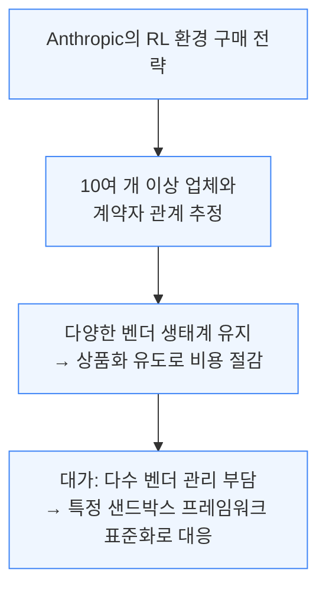

코드가 여전히 중심이지만, 컴퓨터 사용·생물학 등 다른 영역으로도 확장하는 중입니다. OpenAI는 다른 전략을 씁니다.

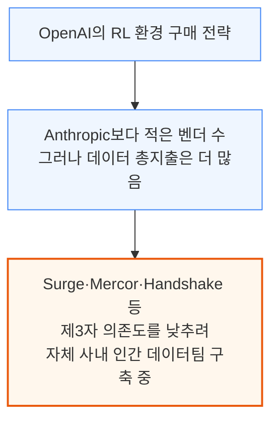

OpenAI가 더 많이 지출하는 이유는 동시에 확장하는 영역이 많기 때문입니다 — ChatGPT Agent는 UI 짐(gym)을 대량 사용하고, IMO 금메달을 딴 GPT-5.1 코덱스 맥스 버전은 대량의 수학·코드 데이터로부터 이득을 봤으며, 소비자용 모델은 여러 프로그램의 데이터를 혼합해 씁니다.

여러 프로그램에서 모인 데이터는 미드트레이닝 단계로 재투입되며, 사내 인간 데이터팀이 커질수록 벤더 마진을 아껴 같은 비용으로 더 많은 데이터를 모을 수 있습니다.

구글 딥마인드는 앞의 두 랩과 결이 다른 강점을 갖고 있습니다.

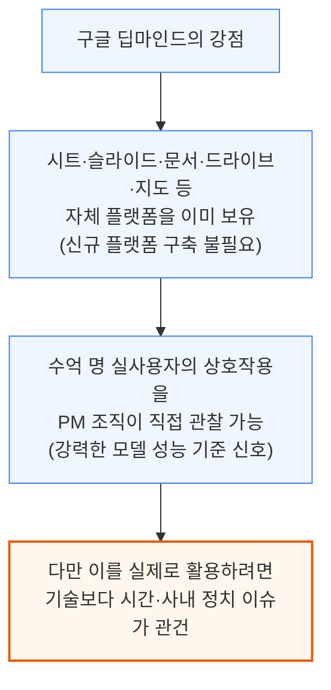

구글은 제미나이 2.5 프로 출시 당시 사전학습 대비 5% 미만의 소규모 연산만 후속학습에 투입했고, 제미나이 3에서는 이를 확대했지만 여전히 다른 랩 대비 작은 것으로 추정됩니다. 동시에 지메일 등 자사 제품의 스크래핑 요율을 낮추는 방어적 조치도 병행해, 외부 업체가 앱을 스크래핑해 복제 목업을 만들기 어렵게 만들고 있습니다.

장기적으로 이 모델들이 얼마나 유용해질지는 다음 질문으로 이어집니다 — AGI로 가는 길은 결국 환경을 계속 쌓아 올리는 것뿐일까요?

---

## 6. AI 자동화는 당연한 결과가 아니다

**📌 핵심:**
- 화이트칼라 업무의 AI 자동화에 대한 추측이 많지만, OpenAI GDPval 논문 자체가 **반대 증거** — 사람 전문가가 AI보다 더 빠르고 더 저렴하게 과제를 끝냈다는 결과가 나와, 능력 향상이 곧 "자동화"가 아니라 **"증강(augmentation)"**으로 이어짐을 시사
- 과거 영상 인식 모델의 발전으로 방사선과가 자동화될 것이라는 예측이 널리 퍼졌지만 실현되지 않음 — 방사선 진단은 단순 스캔 판독보다 훨씬 복잡한 업무였기 때문
- 컨설팅·소프트웨어 엔지니어링 같은 전문직은 증강으로 갈 가능성이 높지만, 콜센터처럼 **짧고 반복적인 과업**은 자동화 가능성이 더 높은 것으로 추정
- 결론: 능력만이 도입을 결정짓지 않음 — 웹 제공업체·기업의 방어적 태세 같은 장벽도 도입 속도를 좌우하며, 이는 특히 에이전트에게 두드러짐(다음 절 주제)

---

화이트칼라 업무의 AI 자동화를 둘러싼 추측이 무성하지만, 실제로는 정반대 결과가 관찰되는 사례가 있습니다.

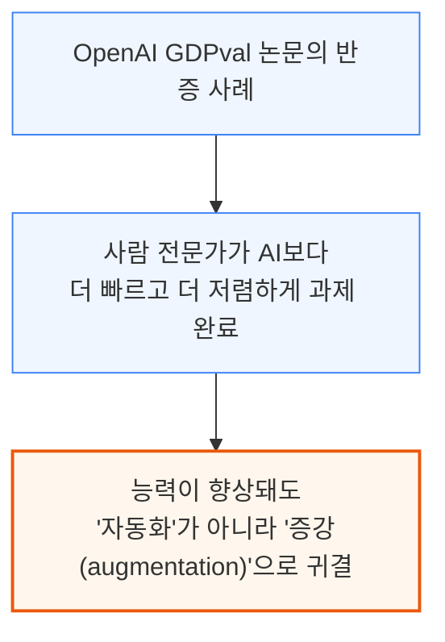

AI 붐 이전에도 비슷한 과잉 예측이 있었습니다.

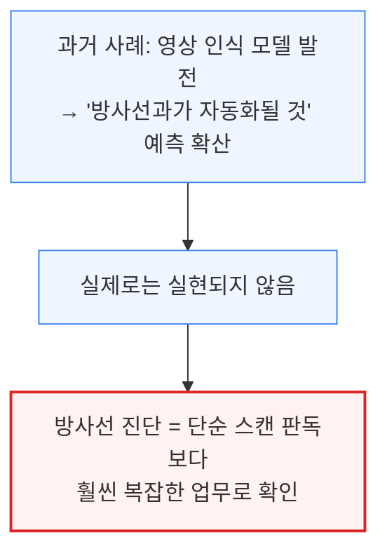

모델이 대부분 노동자를 증강하는 방향으로 갈 가능성은 컨설팅·소프트웨어 엔지니어링 같은 전문직에서 높지만, 콜센터처럼 짧고 반복적인 과업에는 해당하지 않을 가능성이 큽니다. 능력과는 별개로 도입 자체를 가로막는 장벽도 존재하는데, 대표적으로 웹 제공업체와 기업의 방어적 태세를 꼽을 수 있습니다.

---

## 7. 에이전트 접근 차단과 플랫폼 정치

**📌 핵심:**
- ChatGPT Agent와 아마존 사이의 갈등이 대표 사례 — 에이전트가 대신 쇼핑하면 광고 노출을 우회당하는 아마존 입장에서는 자체 모델(Nova·Rufus)로 생태계를 제한하거나, 접근권을 협상 카드로 쓸 유인이 있음
- OpenAI는 아마존과 쇼핑 플랫폼 접근을 협상 중이며, 이는 **아마존 클라우드·칩 사용** 조건과 결부될 가능성 — 구글·메타·마이크로소프트·X도 반독점 우려가 허용하는 한 자사 생태계 접근을 최대한 제한할 전망
- 이런 거래의 핵심은 **무료 이용자의 수익화** — OpenAI는 이미 쇼피파이·엣시와 연동한 "Instant Checkout"을 발표(SemiAnalysis가 8월에 에이전트의 잠재 경로로 미리 지목한 방향)
- 결론: 엔터프라이즈 영역에서는 많은 기업이 자체 에이전트를 직접 구축하며, 특정 과업·워크로드에 맞춰 "RL as a Service"를 대행해주는 스타트업과 계약하는 경우가 늘고 있음(다음 절 주제)

---

에이전트도 주요 사이트에서 차단당할 수 있으며, ChatGPT Agent와 아마존 사이의 갈등이 이를 잘 보여줍니다.

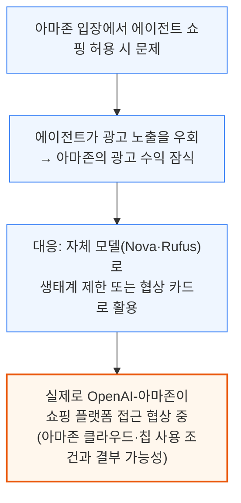

구글·메타·마이크로소프트·X 등도 반독점 우려가 허용하는 한 자사 생태계 접근을 최대한 제한할 것으로 예상됩니다. 이런 거래의 핵심에는 무료 이용자의 수익화가 있습니다 — OpenAI는 이미 쇼피파이·엣시와 연동한 "Instant Checkout"을 발표했으며, 이는 SemiAnalysis가 8월에 에이전트의 잠재 경로로 미리 지목했던 방향입니다.

엔터프라이즈 영역에서는 많은 기업이 자체 에이전트를 직접 구축하며, 특정 과업이나 워크로드에 맞춰 "RL as a Service"를 제공하는 스타트업과 계약하는 경우가 늘고 있습니다.

---

## 8. RL as a Service: 기업용 RL 대행 시장

**📌 핵심:**
- RL은 모델에게 도구 사용법을 가르치는 데 특히 효과적 — RunRL·Osmosis 같은 소규모 YC 스타트업부터 Applied Compute·Adaptive ML 같은 숙련 연구자 창업 회사까지, 오픈소스 툴링을 활용해 대기업에 맞춤 RL을 대행
- 후속학습을 마친 모델은 임대 서버(대표적으로 **Baseten**)에서 구동되며, 세일즈포스·AWS 터미널 업무나 지라 티켓 처리, SEC 공시 자료 추출용 MCP 신뢰도 개선 등이 전형적인 목표 업무
- OpenAI의 자체 "강화 파인튜닝(RFT)" 서비스는 실제로는 불안정하고 비용이 비싸 대다수 고객이 이탈 — 그 결과 YC 스타트업들이 마진 적자를 감수하면서도 OpenAI 대비 **5분의 1 가격**으로 서비스해 점유율을 늘리는 중
- 결론: 장기적으로는 대형 랩이 대형 고객(수백만 달러 지출 가능)을 겨냥한 전담 조직(OpenAI "전략적 배치팀", Anthropic "현장 파견 엔지니어")으로 시장 대부분을 흡수할 전망 — Anthropic은 저렴한 Trainium(낮은 HBM 원가) 물량을 앞세워 RL 서비스에서 마진을 확보할 것으로 추정

---

RL은 모델에게 도구 사용법을 가르치는 데 특히 효과적이며, 이를 활용해 오픈소스 툴링 기반의 맞춤 RL 대행 서비스가 생겨났습니다.

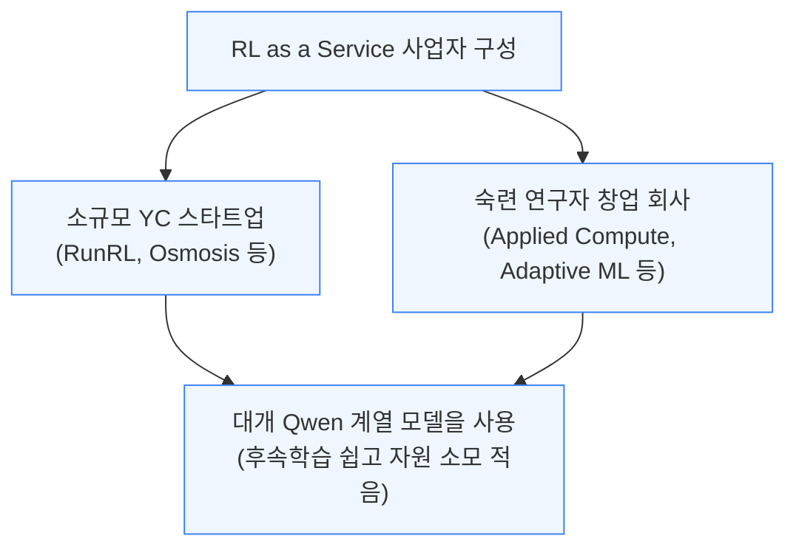

맞춤 후속학습을 마친 모델은 Baseten 같은 임대 서버에서 구동됩니다. 전형적인 목표 업무로는 세일즈포스·AWS 터미널 작업, 지라 티켓 생성·종결, SEC 공시 자료를 추출하는 MCP 신뢰도 개선 등이 있습니다.

랩들도 이 시장에 뛰어들었지만, OpenAI의 자체 서비스는 아직 고전 중입니다.

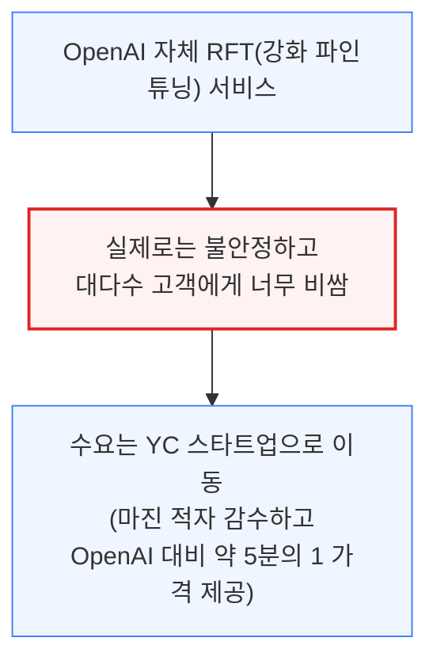

장기적으로는 이 구도가 바뀔 전망입니다. OpenAI는 수백만 달러를 지출할 수 있는 대형 엔터프라이즈를 "전략적 배치팀"을 통해 직접 공략 중이며, 실제로 2025년 엔터프라이즈 매출 성장이 소비자 매출 성장을 앞질렀습니다. Anthropic도 이 시장에 진입했습니다.

```mermaid
flowchart TD
    A["Anthropic의 RL as a Service 전략"] --> B["OpenAI보다 안정적이고<br/>표본 효율적인 자체 RFT 유사 서비스 추정"]
    A --> C["'현장 파견 엔지니어' 채용 확대<br/>(OpenAI 전략적 배치팀과 유사 역할)"]
    B --> D["저렴한 Trainium 물량 확보<br/>(HBM 원가가 낮아 총소유비용↓)<br/>→ 처리량 최적화 시 강한 마진 확보 가능"]
    C --> D

    classDef default fill:#eff6ff,stroke:#3b82f6,stroke-width:1px;
    classDef success fill:#f0fdf4,stroke:#16a34a,stroke-width:2px;
    class D success;
```

RL 워크로드는 대부분 추론(메모리 병목)이라, Trainium처럼 총소유비용이 낮은 칩은 처리량을 충분히 최적화하면 강한 마진을 낼 수 있는 위치에 섭니다.

ThinkingMachines의 Tinker, Applied Compute, Adaptive ML 등도 RL as a Service를 제공하며, 지금까지는 셋 모두 OpenAI·Anthropic보다 이 시장에서 더 성공적이라는 평가입니다.

---

## 9. 과학을 위한 RL: 피어리오딕 랩스와 미드트레이닝

**📌 핵심:**
- LLM은 실험을 탐색·계획·제안할 수 있고, 도구만 갖춰지면 직접 실행까지 가능 — RL은 실험 결과를 다시 모델 개선에 쓸 수 있는 정보로 바꿔주는 **자기개선 루프**를 가능케 함
- **피어리오딕 랩스(Periodic Labs)**는 물리적 실험에 뿌리를 둔 보상으로 폐쇄 루프 RL 시스템을 구축 — 모델이 소형 전문 모델 등 도구로 가설을 검증하고, 점점 더 정밀한 시뮬레이터로 아이디어를 거른 뒤 실제 물리 실험으로 확인하는 과정을 대학원생의 전형적 연구 워크플로우에 빗댐
- **미드트레이닝**(사전학습과 RL 사이 추가 학습 단계)은 지식 최신화·도메인 특화·RL 준비의 역할 — 메타는 코드 특화 모델에 **1조 토큰**을 미드트레이닝에 투입했고, OpenAI는 이보다 **5\~10배 많은** 양을 쓰는 것으로 추정
- 결론: 이전 세대 모델이 RL을 거치며 만든 실행 궤적(롤아웃)은 이후 세대의 미드트레이닝 데이터로 재투입되며, 데이터센터급 실험 인프라 구축은 피어리오딕뿐 아니라 딥마인드도 2026년 자동화 소재과학 연구소 출범으로 뒤따름

---

LLM은 실험을 탐색·계획·제안하고, 적절한 도구만 있으면 직접 실행까지 할 수 있습니다. RL은 이 실험 결과를 모델이 다시 학습할 수 있는 정보로 바꿔, 조건이 맞으면 자기개선 루프를 만듭니다. 피어리오딕 랩스가 이런 접근의 대표 사례입니다.

```mermaid
flowchart TD
    A["피어리오딕 랩스<br/>(랩 생성 데이터로 훈련하는 AI 과학자 지향)"] --> B["폐쇄 루프 RL: 보상을<br/>실제 물리 실험에 근거"]
    B --> C["모델이 소형 전문 모델 등 도구로<br/>가설을 시험·검증"]
    C --> D["점점 정밀한 시뮬레이터로 아이디어 검증<br/>→ 이후 실제 물리 실험으로 확인<br/>(대학원생의 전형적 연구 워크플로우와 유사)"]

    classDef default fill:#eff6ff,stroke:#3b82f6,stroke-width:1px;
    classDef highlight fill:#fff7ed,stroke:#ea580c,stroke-width:2px;
    class D highlight;
```

이 구조에서 하위 에이전트는 각자 잘하는 일(예: 소재 특성 분석 같은 물리적 도구 조율)을 맡고, 범용 LLM은 오케스트레이션(조율)을 담당합니다. 오픈소스 모델을 출발점으로 삼고 미드트레이닝으로 능력을 확장할 수 있습니다.

**📌 용어 풀이: 미드트레이닝이 하는 일**
> - 미드트레이닝은 사전학습과 동일한 다음 토큰 예측 방식이지만, 사전학습과 RL 사이에 추가로 끼워 넣는 학습 단계
> - 역할: ① 모델의 지식 기준 시점(cutoff date) 갱신 ② 특정 주제의 도메인 지식 강화 ③ 고연산 RL을 받아들이기 좋은 상태로 모델을 예열
> - OpenAI 모델이 새로운 기준 시점을 갖게 되는 것도 이 미드트레이닝을 추가로 거쳤기 때문

```mermaid
flowchart TD
    A["미드트레이닝 투입 규모 비교"] --> B["메타: 코드 특화 모델에<br/>1조 토큰 투입"]
    B --> C["OpenAI: 메타 대비<br/>5~10배 많은 양 투입 추정"]
    A --> D["메타 발견: 미드트레이닝 효과는<br/>이후 단계(SFT 등)를 거친 뒤에도 유지"]

    classDef default fill:#eff6ff,stroke:#3b82f6,stroke-width:1px;
    classDef highlight fill:#fff7ed,stroke:#ea580c,stroke-width:2px;
    class C highlight;
```

미드트레이닝에 추가되는 대표적 데이터가 바로 이전 세대 모델이 RL을 거치며 남긴 실행 궤적(롤아웃)입니다. 이 데이터를 확보하기 위해 피어리오딕은 대규모 물리 실험실을 직접 구축 중이며, 이는 딥마인드가 2026년 자동화 소재과학 연구소를 출범시키는 것과 같은 흐름입니다.

자체 실험을 직접 돌리면 입력 변수와 결과를 완전히 파악할 수 있는데, 이는 서로 결과가 어긋나는 경우가 많은 기존 논문만 학습해서는 보장되지 않는 장점입니다. 실험실 노동이 특히 많이 필요한 또 다른 영역이 바로 생물학이며, 랩마다 접근 방식이 크게 갈립니다.

---

## 10. RL이 습식 실험실을 만나다: 제약 데이터 경쟁

**📌 핵심:**
- 생물학의 병목은 두 가지 — "유망한 신약 후보를 얼마나 빨리 찾는가"와 "찾은 후보를 얼마나 빨리 개발·승인까지 끌고 가는가" — OpenAI와 Anthropic이 이 파이프라인의 서로 다른 부분을 공략
- **OpenAI**는 초기 발견 단계를 겨냥 — GPT-5가 사람 개입 없이 프로토콜 수정을 제안하고 실험 결과를 받아 반복하는 폐쇄 루프를 시연했고, 실험 수행을 위한 기초 로봇 시스템까지 자체 구축
- **Anthropic**은 신약 개발·승인 단계를 겨냥 — "Claude for Life Sciences"는 벤치링·10x 지노믹스·펍메드 등에 바로 연결되는 커넥터를 갖춘 플랫폼으로, 실질적으로 생명과학용 코파일럿 역할
- 결론: 두 회사 모두 결국 파이프라인 전체로 수렴할 가능성이 있으나, 현재는 OpenAI가 문샷형 프로젝트를, Anthropic이 실용적 엔터프라이즈 솔루션을 좇는 구도 — 생물학 데이터 확보를 위해 **Medra** 같은 로봇 자동화 실험실 전문 업체가 새로운 역할로 부상

---

생물학에는 두 가지 근본 병목이 있습니다. "유망한 신약 후보를 더 빨리 찾는 방법"과 "찾은 후보의 개발·승인을 더 빨리 진행하는 방법"입니다. OpenAI와 Anthropic 모두 제약사와 파트너십을 맺었지만, 파이프라인의 서로 다른 부분을 겨냥합니다.

```mermaid
flowchart TD
    A["생물학 파이프라인의 두 병목"] --> B["① 신약 후보 발견 속도<br/>→ OpenAI가 집중"]
    A --> C["② 신약 개발·승인 속도<br/>→ Anthropic이 집중"]

    classDef default fill:#eff6ff,stroke:#3b82f6,stroke-width:1px;
```

```mermaid
flowchart TD
    A["OpenAI 접근"] --> B["GPT-5가 사람 개입 없이<br/>프로토콜 수정 제안→실험 결과 수신→반복"]
    B --> C["실험 수행용 기초 로봇 시스템까지 자체 구축<br/>목표: 유망 후보 발견 속도 자체를 높임"]

    classDef default fill:#eff6ff,stroke:#3b82f6,stroke-width:1px;
    classDef highlight fill:#fff7ed,stroke:#ea580c,stroke-width:2px;
    class C highlight;
```

```mermaid
flowchart TD
    A["Anthropic 접근: Claude for Life Sciences"] --> B["벤치링·10x 지노믹스·펍메드 등<br/>기존 서비스에 바로 연결되는 커넥터 제공"]
    B --> C["신약 임상시험 반복 속도 향상 목표<br/>= 생명과학용 (기능하는) 코파일럿"]

    classDef default fill:#eff6ff,stroke:#3b82f6,stroke-width:1px;
    classDef success fill:#f0fdf4,stroke:#16a34a,stroke-width:2px;
    class C success;
```

두 회사 모두 결국 파이프라인 전체로 수렴할 가능성이 있지만, 현재 구도는 OpenAI가 문샷형(달 탐사식 도전) 프로젝트를, Anthropic이 더 평범하지만 실용적인 엔터프라이즈 솔루션을 좇는 모습으로 갈립니다. 장기적 경쟁력은 각 회사가 파이프라인의 더 많은 단계를 얼마나 빠르게 흡수하느냐로 판가름 날 전망입니다.

이 모든 과정에는 모델 학습용 방대한 생물학 데이터가 필요합니다. Mercor 같은 업체는 랩의 자금을 기꺼이 받겠지만, 대량의 생물학 데이터를 공급할 만한 ML·물리적 인프라는 갖추지 못했습니다. 이 지점에서 등장하는 것이 Medra 같은 업체입니다.

```mermaid
flowchart TD
    A["Medra의 역할"] --> B["파운데이션 모델을 직접 만들거나<br/>신약을 설계하지는 않음"]
    A --> C["로봇 수백 대 규모의<br/>자동화 생물학 실험실을 구축<br/>(피어리오딕과 유사한 접근)"]
    C --> D["실험 인프라와 검증된 데이터를<br/>생성해 파운데이션 모델 회사에 공급"]

    classDef default fill:#eff6ff,stroke:#3b82f6,stroke-width:1px;
    classDef highlight fill:#fff7ed,stroke:#ea580c,stroke-width:2px;
    class D highlight;
```

로봇화는 더 일관된 결과와 빠른 반복을 가능케 하지만, 셋업을 최적화하고 시스템을 견고하게 만드는 데는 상당한 학습 곡선이 따릅니다. 실험실 자동화는 수십 년 된 난제로, 개선은 갑작스러운 돌파구보다는 범위를 좁히는 방향에서 나올 가능성이 큽니다.

이는 후속학습이 사전학습과 얼마나 다른지도 보여줍니다 — OpenAI와 구글 딥마인드가 서로 다른 실험 집합을 골라 최적화한다면, 그 결과물인 모델과 애플리케이션도 서로 달라질 수밖에 없습니다. 이런 초특화는 "모델은 다 비슷비슷해진다(commoditization)"는 통념과 정반대입니다.

RL 환경은 이제 물리적 세계로 번지고 있습니다. 도커 컨테이너로 마음대로 띄우는 소프트웨어가 아니라, 사람이나 로봇이 직접 수행하고 재료·전기·장비·실험실 공간에 실비가 드는 실험이 됐다는 뜻입니다.

생물학 실험 1건은 수백\~수천 달러와 몇 시간이 드는 반면 코딩 과제는 사소한 비용으로 64번까지 시도·채점할 수 있어, 달러당 얻는 데이터 격차가 큽니다. 이는 물리적 RL을 실현할 더 효율적인 알고리즘·아키텍처 설계의 필요성을 키웁니다.

---

## 11. 생물학 RL이 어려운 이유: 희소 보상과 롤아웃 병목

**📌 핵심:**
- 생물학 실험은 완료까지 며칠씩 걸리는 경우가 많아 **롤아웃(시행)이 길어지고**, 그만큼 보상이 드물게만 주어지는 **희소 보상** 문제가 발생 — 신호가 적을수록 모델이 학습할 단서도 줄어듦
- 대응책은 최종 결과가 아니라 **중간 단계마다 보상**을 주는 것 — OpenAI의 신규 평가 "Frontier Science"가 실제로 이 방식(루브릭 기반 단계별 채점)을 채택해 채점 기간(시간 지평)을 잘게 쪼갬
- 긴 롤아웃은 **GPU 활용률**에도 악영향 — 이를 보완하는 "인플라이트 가중치 업데이트"(뒤처진 시행이 오래된 KV 캐시로 계속 진행되는 동안 가중치를 교체) 기법으로 동일 시간 대비 **2배** 반복 횟수 개선 사례 확인
- 결론: 생물학은 알파폴드(단백질 데이터 은행 17만 개 샘플)나 FutureHouse의 Ether0(오픈 반응 데이터베이스)처럼 오픈소스 데이터가 비교적 풍부해 다른 과학 분야보다 유리하지만, 제약사가 쥔 비공개 데이터와 프론티어 랩의 ML 역량을 결합하는 파트너십이 앞으로 더 늘어날 전망

---

생물학 실험은 완료까지 걸리는 시간이 천차만별이며, 특히 며칠씩 걸리는 실험이 많습니다. 이런 긴 시행(롤아웃)은 보상이 드물게만 주어지는 희소 보상 문제로 이어져, 모델이 학습할 신호 자체가 줄어듭니다.

```mermaid
flowchart TD
    A["생물학 실험 = 완료까지 며칠 소요<br/>(긴 롤아웃 필요)"] --> B["보상이 드물게만 주어짐<br/>(희소 보상)"]
    B --> C["모델이 학습할 신호(단서) 자체가 부족"]

    classDef default fill:#eff6ff,stroke:#3b82f6,stroke-width:1px;
    classDef danger fill:#fef2f2,stroke:#dc2626,stroke-width:2px;
    class C danger;
```

대응책은 최종 결과가 아니라 중간 단계 자체에 보상을 주는 것입니다. 무엇이 "올바른 단계"인지 판단하기 어렵지만, 루브릭(채점 기준표)으로 근사할 수 있습니다.

```mermaid
flowchart TD
    A["단계별 보상 방식"] --> B["최종 결과가 아니라<br/>모델의 과정·사고 자체를 보상"]
    B --> C["루브릭으로 '올바른 단계' 근사<br/>(OpenAI 'Frontier Science' 평가가 실제 채택)"]
    C --> D["과제를 개별 보상 단위로 쪼개<br/>채점 시간 지평 자체를 단축"]

    classDef default fill:#eff6ff,stroke:#3b82f6,stroke-width:1px;
    classDef success fill:#f0fdf4,stroke:#16a34a,stroke-width:2px;
    class D success;
```

긴 롤아웃은 GPU 활용률에도 나쁜 영향을 줘, 많은 랩이 "인플라이트 가중치 업데이트" 같은 기법을 쓰고 있습니다.

```mermaid
flowchart TD
    A["인플라이트 가중치 업데이트"] --> B["가중치를 교체하는 동안<br/>뒤처진(straggler) 롤아웃은<br/>오래된 KV 캐시로 계속 진행"]
    B --> C["학습을 멈추지 않고<br/>뒤처진 시행도 완료 가능"]
    C --> D["동일한 총 소요시간(wall clock) 대비<br/>반복 횟수 약 2배 개선"]

    classDef default fill:#eff6ff,stroke:#3b82f6,stroke-width:1px;
    classDef success fill:#f0fdf4,stroke:#16a34a,stroke-width:2px;
    class D success;
```

또 다른 병목은 가용 데이터 자체입니다. 과학 문헌은 기본적인 질문에서조차 결과가 서로 어긋나는 경우가 많아 신뢰할 만한 학습셋 구성이 어렵습니다.

그나마 생물학은 오픈소스 데이터가 비교적 흔한 편입니다 — 알파폴드는 단백질 데이터 은행(17만 개 샘플)으로 학습됐고, FutureHouse의 Ether0는 오픈 반응 데이터베이스를 썼으며, EvE 같은 노력도 이어지고 있습니다.

다만 제약사는 여전히 대량의 비공개 데이터셋을 쥐고 있습니다. 앞으로는 ML 역량이 부족한 제약사와, 생물학 데이터·임상 지식이 부족한 프론티어 랩 사이의 파트너십이 더 늘어날 전망입니다. 여러 장벽에도 불구하고 손쉽게 딸 수 있는 성과가 워낙 많아, 과학용 고연산 RL에 대한 투자는 빠르게 큰 가치를 만들어낼 것으로 예상됩니다.

RL 스케일링이 이끈 진전은 대부분 지금까지 설명한 방식에 의존해왔습니다. 아직 갈 길이 멀지만, 이제 막 초기 성과를 보이기 시작한 또 다른 축이 있습니다 — 현재 모델로도 가능하지만, 비용이 훨씬 높은 방식입니다.

---

## 12. 멀티 에이전트 아키텍처: 다음 스케일링 축

**📌 핵심:**
- 서로 다른 여러 모델을 하나의 문제 해결에 함께 사고하도록 묶는 방식이 새로운 확장 축 — Grok 4 헤비, 제미나이 딥싱크, GPT-5 프로가 대표적으로 이 원리로 동작하며, 답 취합 방식은 다수결부터 모델 간 합의, 별도 심사 모델 판정까지 다양
- 구글 **알파에볼브**가 이 방식이 대중화된 첫 사례 — 샘플러(과거 해법 DB에서 프롬프트 조립)·앙상블(신규 해법 생성)·평가(검증) 세 역할을 진화적 루프로 묶어, 개선폭이 특정 수준에 도달하거나 추가 사이클의 한계효용이 줄어들면 루프를 종료
- 4개의 o4-미니 하위 에이전트가 실제 SG랭 커널에서 평균 **1.3배 속도 개선**을 낸 사례처럼, 역할을 분담한 서브에이전트 협업(테스트·프로파일링·계획·구현)만으로도 능력 자체의 향상 없이 결과물 품질을 끌어올릴 수 있음 — 재귀적 언어 모델(orchestrator가 다른 모델을 재귀 호출)처럼 오히려 비용이 줄어드는 사례도 보고됨
- 결론: OpenAI는 알파고식 셀프플레이 원리를 LLM에 접목하는 실험을 활발히 진행해 이 분야 선두로 평가되며, Claude Code처럼 단순한 아이디어를 엮은 결과물이 이미 연 매출 10억 달러 규모 제품이 됐다는 점은 더 정교한 멀티 에이전트 협업이 실전 배치될 때의 잠재력을 시사

---

여러 모델을 하나의 문제 해결에 함께 사고하도록 묶는 것이 새로운 확장 축으로 떠올랐습니다. Grok 4 헤비, 제미나이 딥싱크, GPT-5 프로가 대표적으로 이런 원리로 동작합니다.

```mermaid
flowchart TD
    A["멀티 에이전트 사고 결합 원리<br/>(Grok 4 헤비 · 제미나이 딥싱크 · GPT-5 프로)"] --> B["여러 에이전트가 각자 답을 생성"]
    B --> C["답 취합 방식은 다양<br/>(다수결 · 모델 간 합의 · 별도 심사 모델 판정)"]

    classDef default fill:#eff6ff,stroke:#3b82f6,stroke-width:1px;
```

이런 시스템이 처음 대중화된 사례는 구글의 알파에볼브입니다.

```mermaid
flowchart TD
    A["알파에볼브(구글)<br/>= 역할이 다른 여러 에이전트를 한 루프에 결합"] --> B["샘플러: 과거 발견된 해법 DB에서<br/>프롬프트 조립"]
    A --> C["앙상블: 신규·개선된 해법 생성"]
    A --> D["평가 시스템: 답 검증"]
    B --> E["진화적 루프로 결합,<br/>결과는 검증자가 계속 확인"]
    C --> E
    D --> E
    E --> F["특정 개선폭 달성 또는<br/>추가 사이클의 한계효용 감소 시 루프 종료"]

    classDef default fill:#eff6ff,stroke:#3b82f6,stroke-width:1px;
    classDef highlight fill:#fff7ed,stroke:#ea580c,stroke-width:2px;
    class F highlight;
```

이후 특정 평가에 특화된 아키텍처들이 등장했습니다. 연구자 제레미 브레넌은 Grok 4 기반 멀티 에이전트로 ARC-AGI 최고 기록을 세웠는데, Grok 4가 과제별 지침을 생성하면 다른 에이전트가 학습 예제로 시험하고, 완벽한 해법이면 고정해 최종 테스트에 적용하며 아니면 반복 개선하는 비교적 단순한 방식입니다.

다른 사례는 하위 에이전트만으로 구성됩니다.

```mermaid
flowchart TD
    A["o4-미니 하위 에이전트 4개 협업<br/>(실제 SG랭 커널 대상)"] --> B["① 테스트 에이전트<br/>커널 통과·실패 여부 검증"]
    A --> C["② 프로파일링 에이전트<br/>성능 격차 상세 분석"]
    A --> D["③ 계획 에이전트(목표 수정 설계)<br/>④ 구현 에이전트(실제 수정 적용)"]
    B --> E["평균 1.3배 속도 개선 달성<br/>(모델 능력 향상 없이 협업만으로)"]
    C --> E
    D --> E

    classDef default fill:#eff6ff,stroke:#3b82f6,stroke-width:1px;
    classDef success fill:#f0fdf4,stroke:#16a34a,stroke-width:2px;
    class E success;
```

이런 협업 구조는 모델 자체의 능력 향상을 전제하지 않습니다. 추론 비용은 훨씬 높아지지만, 풀 수 있는 문제의 가치가 실행 비용보다 크면 남는 장사이며, 특히 과학·코딩 분야에서 두드러질 전망입니다.

"재귀적 언어 모델"(오케스트레이터가 과업 전반에 걸쳐 다른 모델을 재귀 호출하는 방식)처럼 비용이 오히려 줄어드는 사례도 보고됩니다 — 문맥을 하위 에이전트와 오케스트레이터 사이에 영리하게 분할해 장문맥 평가에서 특히 강했습니다.

OpenAI는 셀프플레이 같은 아이디어와 알파고의 원리를 LLM에 접목하는 실험을 활발히 진행 중이며, 이 분야의 선두로 평가됩니다. 알파고가 특별했던 이유는 사람이 아니라 자기 자신과 대국하며 체스·바둑에서 초인적 성능을 달성했기 때문입니다.

현재의 LLM 멀티 에이전트 시스템은 아직 원시적이며, 원리상 모델 하나를 반복문(for loop)에서 돌리는 것과 크게 다르지 않습니다. 그럼에도 실전 효과는 강력합니다 — Claude Code는 자율 에이전트를 엮는 단순한 아이디어만으로 이미 연 매출 10억 달러 규모 제품이 됐습니다.

사람이 개인보다 집단으로 더 큰 프로젝트를 해내듯, 에이전트 협업 아키텍처가 개선될수록 LLM이 다룰 수 있는 프로젝트 규모도 커질 전망입니다. 더 정교한 멀티 에이전트 협업이 실전 배치될 때의 모습이 관전 대목입니다.

---

*작성 진행률: 100% 완료*
*업데이트: 생물학 RL의 희소 보상·롤아웃 병목, 멀티 에이전트 아키텍처까지 원문 전 섹션 번역 완료*
