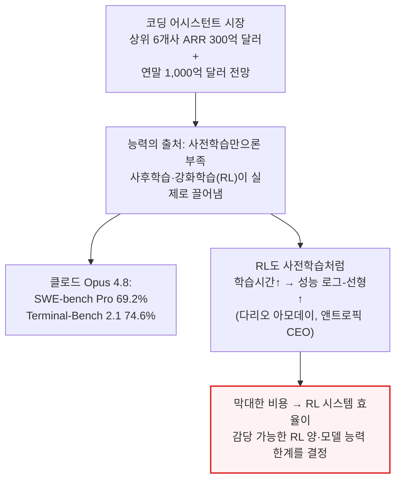
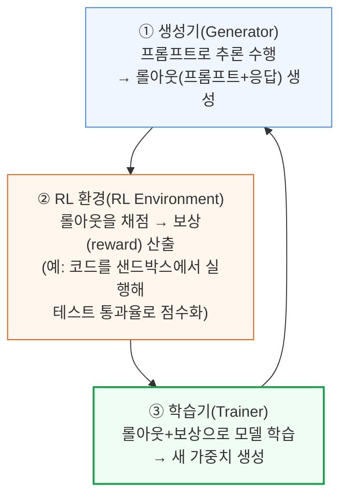
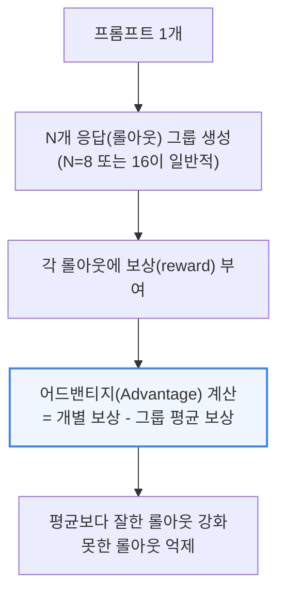
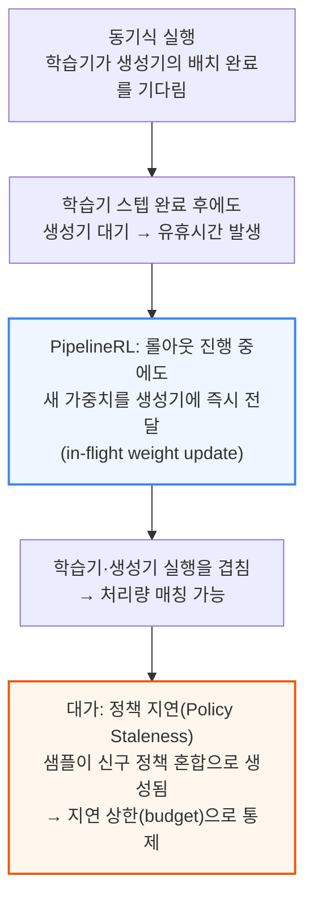
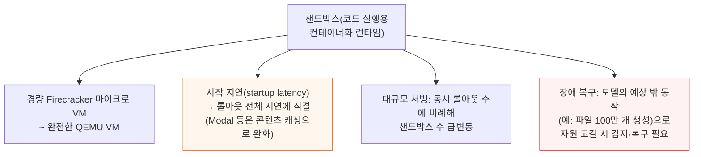
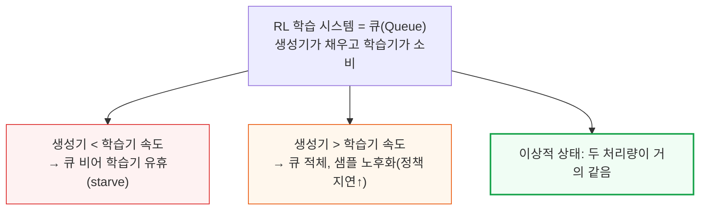
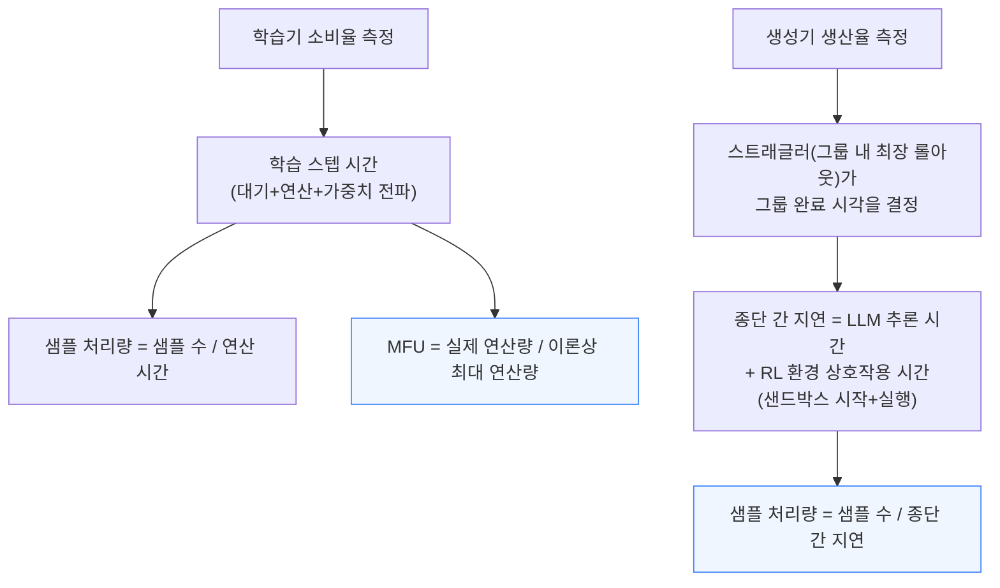

# RL Systems Mind the Gap: Matching Trainer and Generator Throughput

> **출처**: [https://newsletter.semianalysis.com/p/rl-systems-mind-the-gap-matching](https://newsletter.semianalysis.com/p/rl-systems-mind-the-gap-matching)
> **저자**: Kimbo Chen, Cheang Kang Wen, Dylan Patel
> **발행일**: 2026-06-16

---

## 📑 목차

### 전체 섹션
 1. [서론 - RL 학습 비용의 구조](#1-서론---rl-학습-비용의-구조)
 2. [세 주체 - 생성기·RL 환경·학습기](#2-세-주체---생성기rl-환경학습기)
 3. [RL 알고리즘 기초 - GRPO](#3-rl-알고리즘-기초---grpo)
 4. [동기식에서 비동기식으로 - PipelineRL과 정책 지연](#4-동기식에서-비동기식으로---pipelinerl과-정책-지연)
 5. [RL 환경과 샌드박스](#5-rl-환경과-샌드박스)
 6. [처리량 매칭 프레임워크 - 학습기와 생성기 처리량 정량화](#6-처리량-매칭-프레임워크---학습기와-생성기-처리량-정량화)
 7. [처리량을 제약하는 요인들](#7-처리량을-제약하는-요인들)
 8. [정책 지연과 움직이는 목표](#8-정책-지연과-움직이는-목표)
 9. [사례 연구 1 - 긴 응답과 초기 탐색 단계](#9-사례-연구-1---긴-응답과-초기-탐색-단계)
10. [사례 연구 2 - 잦은 도구 호출과 쉬운 과제](#10-사례-연구-2---잦은-도구-호출과-쉬운-과제)
11. [사례 연구 3 - 샌드박스 확장 문제](#11-사례-연구-3---샌드박스-확장-문제)
12. [사례 연구 4 - 부분 롤아웃과 상태 유지형 샌드박스](#12-사례-연구-4---부분-롤아웃과-상태-유지형-샌드박스)
13. [소프트웨어 사용 경험 - Prime RL·slime·Modal](#13-소프트웨어-사용-경험---prime-rlslimemodal)
14. [오픈소스 RL 프레임워크의 역사](#14-오픈소스-rl-프레임워크의-역사)
15. [결론과 향후 계획](#15-결론과-향후-계획)
16. [RL 학습 TCO 분석 - 서버 비용과 Tinker 비교](#16-rl-학습-tco-분석---서버-비용과-tinker-비교)

---

## 🔑 용어 정리

본문을 순서대로 읽기 전에 알아두면 좋은 용어들입니다. 자세한 수치와 설명은 본문에서 처음 등장하는 위치에 나옵니다.

- **세 주체 (생성기·RL 환경·학습기)**: RL(강화학습) 학습 시스템을 이루는 세 부품 — 생성기(Generator)는 모델이 답을 만들게 하고, RL 환경(RL Environment)은 그 답을 채점해 보상을 매기고, 학습기(Trainer)는 그 결과로 모델을 실제로 업데이트함
- **GRPO (Group-Relative Policy Optimization)**: 같은 문제에 여러 개의 답(롤아웃)을 만들게 한 뒤, 그룹 평균보다 잘한 답은 강화하고 못한 답은 억제하는 방식으로 모델을 학습시키는 오픈소스 표준 RL 알고리즘
- **PipelineRL과 비동기 RL**: 학습기가 다음 가중치를 다 만들 때까지 생성기가 기다리지 않고, 롤아웃이 진행 중인 와중에도 새 가중치를 받아 계속 작업하게 하는 방식 — 학습기와 생성기가 서로 다른 속도로 돌 수 있게 해줌
- **정책 지연 (Policy Staleness)**: 어떤 답(롤아웃)을 만들 때 쓰인 모델 버전과, 그 답으로 학습할 때 학습기가 실제로 쓰고 있는 모델 버전 사이의 간극 — 너무 벌어지면 학습이 불안정해짐
- **샌드박스 (Sandbox)**: 모델이 생성한 코드를 실제로 실행해보는 격리된 실행 환경 — 가벼운 마이크로 가상머신부터 완전한 가상머신까지 다양하며, 시작 지연·확장성·안정성이 RL 학습 속도를 좌우함
- **처리량 매칭 (Throughput Matching)과 MFU**: 생성기가 답을 만드는 속도와 학습기가 그 답을 소비하는 속도를 맞추는 것이 이 글 전체의 핵심 틀 — MFU(Model FLOPs Utilization)는 GPU가 이론상 낼 수 있는 연산 능력 중 실제로 학습에 쓰인 비율
- **PD 분리 (Prefill-Decode Disaggregation)**: 추론 과정을 프롬프트를 읽어들이는 단계(프리필)와 답을 한 토큰씩 만들어내는 단계(디코드)로 나눠 서로 다른 GPU에 맡기는 방식 — 두 단계의 연산 특성이 달라 따로 최적화하면 더 빠름
- **TCO(총소유비용)와 WACC**: TCO는 GPU 구매비뿐 아니라 전력·시설·감가상각까지 합친 실제 총비용, WACC(Weighted Average Cost of Capital, 가중평균자본비용)는 이 감가상각을 시간당 비용으로 환산할 때 쓰는 자본비용률

---

## 1. 서론 - RL 학습 비용의 구조

**📌 핵심:**
- 코딩 어시스턴트는 세계 최대 B2B SaaS 시장 — 상위 6개 업체 연매출(ARR)만 300억 달러 이상, 연말까지 1,000억 달러를 넘어설 전망(SemiAnalysis 토크노믹스 모델 추산)
- 이런 코딩 능력은 사전학습만으로 나오지 않고, 사전학습 이후에 진행하는 **강화학습(RL, Reinforcement Learning)**이 실제로 능력을 끌어냄 — 클로드 Opus 4.8은 SWE-bench Pro 69.2%, Terminal-Bench 2.1에서 74.6%를 기록했는데, 이 점수의 상당 부분이 RL 학습에서 나옴
- 앤트로픽 CEO 다리오 아모데이는 RL도 사전학습처럼 학습 시간을 늘릴수록 성능이 로그-선형으로 오르는 스케일링 법칙을 보인다고 설명 — 문제는 이 스케일링이 막대한 비용이 들어, RL 시스템을 얼마나 효율적으로 짜느냐가 "얼마나 많은 RL을 감당할 수 있는가", 나아가 "모델 능력이 어디까지 갈 수 있는가"를 직접 결정
- 결론: 이 글은 오픈소스 RL 프레임워크로 직접 학습 실험을 하고 가격을 호스팅형 RL 서비스인 Tinker(Thinking Machines Lab)와 비교해, RL 시스템 효율의 핵심이 **학습기(Trainer)와 생성기(Generator)의 처리량을 맞추는 것**임을 보임

---

이 글의 핵심 질문은 "무엇이 RL 학습 시스템의 효율을 좌우하는가"입니다. SemiAnalysis는 오픈 모델·오픈소스 RL 프레임워크로 직접 학습 실험을 수행하고, 그 결과를 호스팅형 RL 학습 서비스인 Tinker의 가격과 비교했습니다. 그 결론은 시스템 효율이 **학습기와 생성기의 처리량을 서로 맞추는 것**으로 귀결된다는 것입니다.

---

## 2. 세 주체 - 생성기·RL 환경·학습기

**📌 핵심:**
- 오픈소스 RL 학습 시스템은 **생성기(Generator)·RL 환경(RL Environment)·학습기(Trainer)** 세 주체로 구성 — 사전학습과 달리 데이터셋이 정답을 미리 주지 않고, 시스템 스스로 학습 신호를 만들어냄
- 생성기는 데이터셋의 프롬프트로 추론(inference)을 수행해 **롤아웃(Rollout)**(프롬프트+모델 응답)을 만들고, RL 환경은 그 롤아웃을 채점해 보상(reward)을 매김 — 예를 들어 코딩 환경은 생성된 코드를 샌드박스에서 실제 실행해 테스트 케이스 통과율로 점수를 매김
- 학습기는 생성기가 만든 롤아웃과 보상을 받아 모델을 학습시켜 새 가중치(weights)를 만들고, 이를 다시 생성기에 전달 — 이 한 바퀴가 RL 학습의 한 스텝(step)을 완성
- 결론: 세 주체가 순환 고리를 이루기 때문에, 어느 한쪽이 느려지면 나머지가 기다려야 함 — 이 순환 고리의 속도를 맞추는 문제가 이 글 전체를 관통하는 주제

---

사전학습은 인터넷 텍스트라는 정답(다음 토큰)이 이미 주어져 있지만, RL은 데이터셋이 프롬프트만 줄 뿐 정답을 주지 않습니다. 대신 시스템이 스스로 생성기·환경·학습기의 순환을 통해 학습 신호를 만들어내야 합니다.

---

## 3. RL 알고리즘 기초 - GRPO

**📌 핵심:**
- 사전학습이 다음 단어를 맞출 확률(로그우도)을 최대화하는 것과 달리, RL 학습은 기대 보상을 최대화 — 오픈소스 표준은 **GRPO(Group-Relative Policy Optimization)**로, 대부분의 오픈웨이트 모델이 이 계열의 변형을 사용
- GRPO는 같은 프롬프트에 여러 개의 응답(롤아웃)을 만들어 하나의 그룹을 구성하고, 각 롤아웃에 보상을 매긴 뒤 **어드밴티지(Advantage)**(그룹 평균 대비 얼마나 잘했는지)를 계산 — 평균보다 잘한 롤아웃은 강화하고 못한 롤아웃은 억제
- 그룹 안의 모든 롤아웃이 똑같은 보상을 받으면(문제가 너무 쉬워 전부 통과하거나, 너무 어려워 전부 실패) 어드밴티지가 전부 0이 돼 학습 신호가 사라짐 — 정답률(solve rate)이 100%나 0%에 가까울 때 이런 현상이 발생
- 결론: GRPO의 학습 신호는 그룹 내 보상의 분산에서 나오므로, 문제 난이도를 정답률이 극단으로 쏠리지 않는 "생산적인 중간 구간"으로 유지하는 것이 RL 학습 설계의 핵심 과제

---

📌 용어 풀이: 왜 정답률이 극단으로 쏠리면 학습이 멈추나
> - 그룹 안의 모든 롤아웃이 같은 보상을 받으면, 각 롤아웃의 보상이 곧 그룹 평균과 같아져 어드밴티지가 0이 됨 — "다른 것보다 잘했다/못했다"라는 상대적 신호 자체가 없어지는 것
> - 극단적인 경우는 균일 분포(uniform distribution)일 때, 즉 문제가 너무 쉬워 전원 통과하거나 너무 어려워 전원 실패할 때(정답률 100%에 가깝거나 0%에 가까울 때) 발생

---

## 4. 동기식에서 비동기식으로 - PipelineRL과 정책 지연

**📌 핵심:**
- GRPO가 기반한 고전적 정책 경사(policy gradient) 알고리즘은 한 그룹의 롤아웃이 전부 같은 정책(같은 가중치)에서 나왔다고 가정 — 이 때문에 생성기는 현재 배치를 다 끝내기 전엔 가중치를 갱신할 수 없고, 학습기는 학습 스텝을 마쳐도 생성기를 기다려야 함(동기식 실행) → 시스템 효율이 크게 떨어짐
- **PipelineRL**은 롤아웃이 진행 중인 와중에도 학습기가 새 가중치를 생성기에 밀어 넣는 방식(in-flight weight update)으로 비동기성을 도입 — 학습기가 생성기의 롤아웃과 실행을 겹칠 수 있게 함
- 대가는 **정책 지연(Policy Staleness)**: 한 샘플(롤아웃+보상)이 신구 정책이 섞인 채로 만들어짐 — 너무 오래된(stale) 샘플은 모델 학습을 저해하므로, PipelineRL은 지연 정도에 상한(bound)을 두는 처리량 매칭 방식으로 작동
- 결론: 동기식 실행은 대규모에서 컴퓨트 낭비가 너무 커 실용적이지 않아 비동기 기법이 필수가 됐고, PipelineRL은 오픈소스 RL 학습의 사실상 표준 구현으로 자리잡음

---

📌 용어 풀이: 정책 지연은 왜 생기나
> - 학습기가 소비하는 단위인 "샘플"은 롤아웃과 그에 매겨진 보상으로 정의됨. in-flight 가중치 갱신을 쓰면 하나의 샘플이 생성되는 동안에도 정책(가중치)이 바뀔 수 있어, 신구 정책이 섞인 채로 샘플이 만들어짐
> - PipelineRL의 실험 결과 RL 알고리즘은 어느 정도의 정책 지연은 견딜 수 있지만, 너무 오래된 샘플은 학습을 저해함 — 즉 PipelineRL의 본질은 "지연 상한이 있는 처리량 매칭 기법"

---

## 5. RL 환경과 샌드박스

**📌 핵심:**
- RL 환경은 실무적으로 **샌드박스(Sandbox)**(코드 실행용 컨테이너화 런타임)로 구현 — 환경 복잡도에 따라 가벼운 Firecracker 마이크로 가상머신부터 완전한 QEMU 가상머신까지 다양
- 생성기와 RL 환경 사이의 상호작용 지연이 롤아웃 전체 지연에 직결되는데, 샌드박스 시작 지연(startup latency)이 주요 오버헤드 중 하나 — Modal 같은 샌드박스 서비스 업체는 콘텐츠 주소 지정 캐싱(content-addressed caching) 같은 기법으로 이 지연을 줄임
- 대규모 서빙도 난제: 샌드박스 개수는 동시 진행 중인 롤아웃 수에 비례해 늘어나고, 롤아웃이 잘리거나(pruned) 완료되면서 살아있는 샌드박스 수가 크게 출렁임 — 게다가 모델이 학습 중 파일을 백만 개 만드는 등 예상 밖 동작으로 샌드박스 자원을 고갈시킬 수 있어, 이런 장애를 감지·복구하는 오케스트레이션이 필요
- 결론: 샌드박스는 RL 학습의 숨은 병목 — 시작 지연·확장성·장애 복구 세 가지 모두 갖춰야 대규모 RL 학습이 안정적으로 돌아감

---

---

## 6. 처리량 매칭 프레임워크 - 학습기와 생성기 처리량 정량화

**📌 핵심:**
- SemiAnalysis는 RL 학습 시스템을 하나의 큐(queue)로 봄 — 생성기가 롤아웃을 큐에 채워 넣고 학습기가 이를 꺼내 씀. 생성기가 학습기보다 느리면 큐가 비어 학습기가 굶주리고(idle), 생성기가 더 빠르면 큐가 쌓이며 샘플이 오래돼 정책 지연 문제가 생김
- 이상적인 시스템에서는 학습기의 소비율(consumption rate)과 생성기의 생산율(production rate)이 거의 같아야 함 — 학습기 쪽은 학습 스텝 시간(신규 샘플 대기 유휴 시간+연산 시간+가중치 전파 시간)을 재고, 이를 뒤집어 **샘플 처리량**(초당 샘플 수)을 구함. GPU당 초당 연산량(FLOP/s)과 **MFU(Model FLOPs Utilization)**로 하드웨어 효율도 함께 측정
- 생성기 쪽은 **스트래글러(Straggler)**(그룹 내에서 가장 오래 걸리는 롤아웃)가 그룹 전체의 완료 시각을 결정하므로, 종단 간(end-to-end) 지연을 측정해 평균 샘플 처리량을 추정 — 이 지연은 다시 LLM 추론 시간과 RL 환경 상호작용 시간(샌드박스 시작+실행)으로 쪼갤 수 있음
- 결론: "학습기 소비율 ≈ 생성기 생산율"이라는 큐 관점이 이 글 전체를 관통하는 분석틀 — 이어지는 사례 연구들은 전부 이 두 처리량이 왜, 얼마나 어긋났는지를 진단하는 구조

---

📌 용어 풀이: 스트래글러(Straggler)가 왜 중요한가
> - 그룹 안의 롤아웃들은 응답 길이가 제각각인데, GRPO는 그룹 전체가 다 모여야 어드밴티지를 계산할 수 있음
> - 따라서 그룹에서 가장 늦게 끝나는 롤아웃(스트래글러) 하나가 그룹 전체의 완료 시각을 결정 — 응답 길이 편차가 클수록 스트래글러로 인한 지연 손실도 커짐

---

*작성 진행률: 약 40% 완료 (1\~6장)*
*업데이트: PipelineRL·정책 지연, RL 환경과 샌드박스, 처리량 매칭 프레임워크(정량화) 작성 완료*
