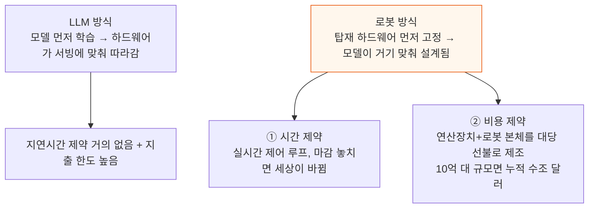
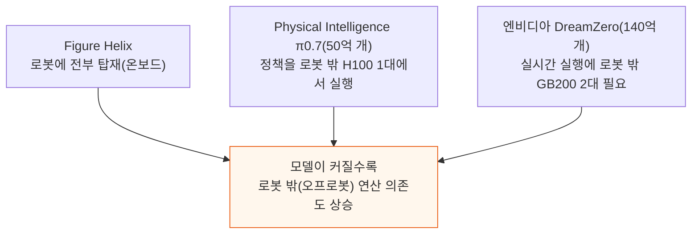
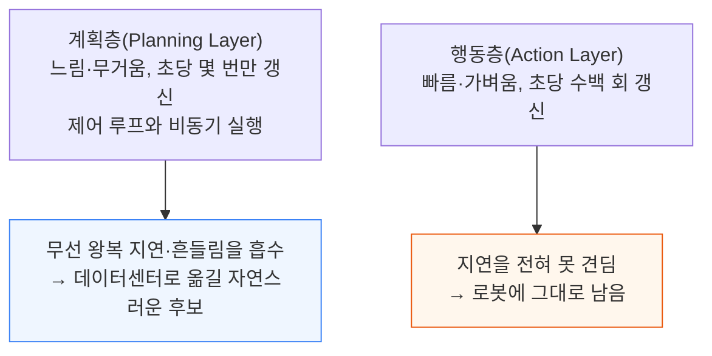
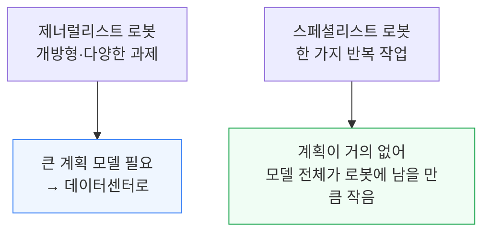
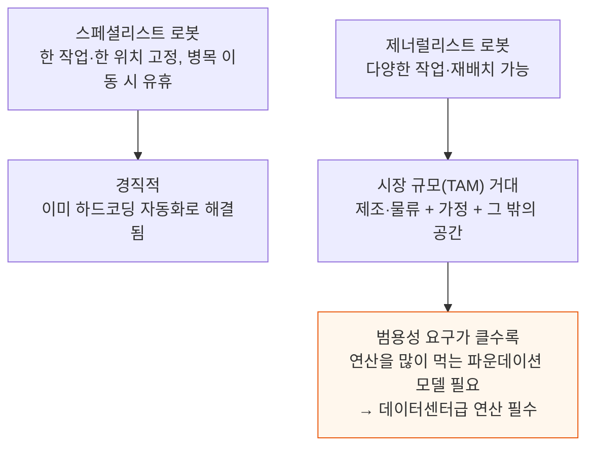
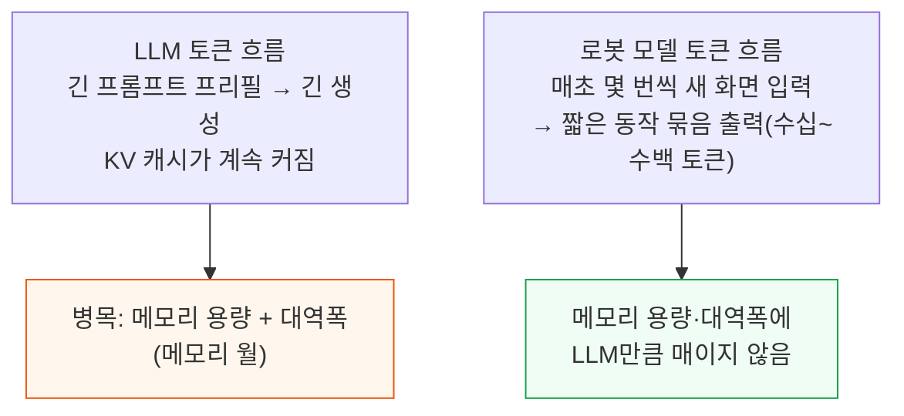
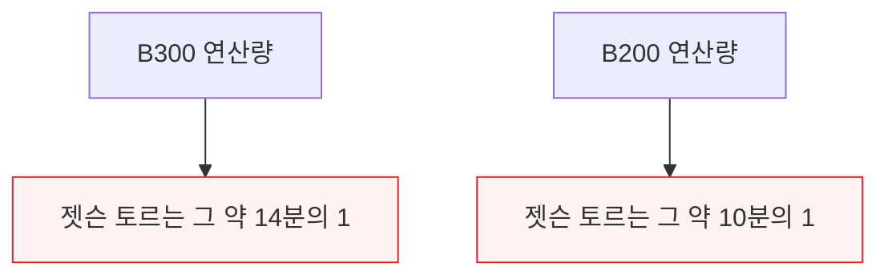
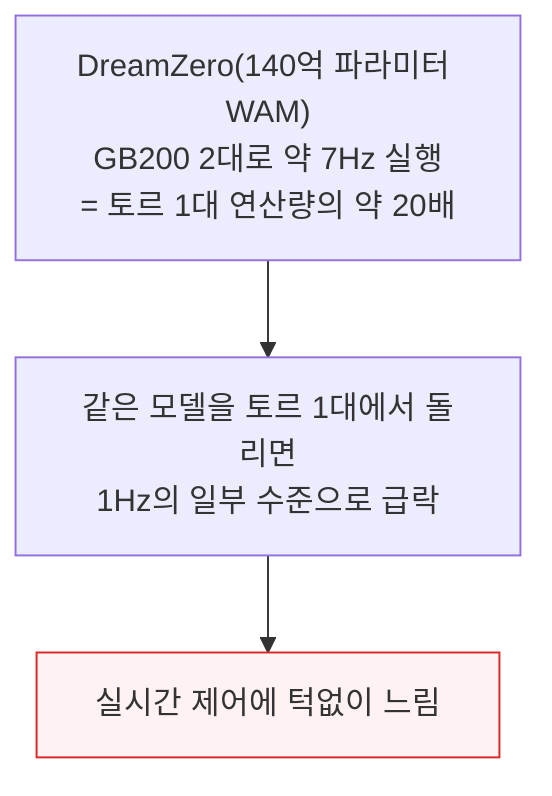

# Where Does a Robot Think – On-Device vs Datacenter Inference

> **출처**: [SemiAnalysis Newsletter](https://newsletter.semianalysis.com/p/where-does-a-robot-think-on-device)
> **저자**: Ivan Chiam, Zane Fong, Bryan Shan
> **발행일**: 2026-09-09

---

## 📑 목차

### 전체 섹션
 1. [임바디먼트 문제 - 하드웨어가 모델을 결정한다](#1-임바디먼트-문제---하드웨어가-모델을-결정한다)
 2. [로봇 모델은 아직 작다](#2-로봇-모델은-아직-작다)
 3. [로봇 속 모델 - 계획층과 행동층](#3-로봇-속-모델---계획층과-행동층)
 4. [데이터센터 GPU가 더 적합한 이유](#4-데이터센터-gpu가-더-적합한-이유)
 5. [LLM 대 로봇 모델 - 토큰이 흐르는 방식](#5-llm-대-로봇-모델---토큰이-흐르는-방식)
 6. [VLA와 WAM - 프런티어 로봇 모델은 연산을 많이 먹는다](#6-vla와-wam---프런티어-로봇-모델은-연산을-많이-먹는다)
 7. [로봇 모델을 기기 밖으로 내보내기](#7-로봇-모델을-기기-밖으로-내보내기)
 8. [전력 - 배터리로는 데이터센터 GPU를 못 돌린다](#8-전력---배터리로는-데이터센터-gpu를-못-돌린다)
 9. [공급망의 벽 - 웨이퍼와 D램](#9-공급망의-벽---웨이퍼와-d램)
10. [TCO 판정 - B300 서버 한 대 대 토르 56개](#10-tco-판정---b300-서버-한-대-대-토르-56개)
11. [어디서 통하고 어디서 안 통하는가 - 네트워크 층](#11-어디서-통하고-어디서-안-통하는가---네트워크-층)
12. [결론 - 로봇의 뇌는 데이터센터에 있다](#12-결론---로봇의-뇌는-데이터센터에-있다)

---

## 🔑 용어 정리

본문을 순서대로 읽기 전에 알아두면 좋은 용어들입니다. 자세한 수치와 설명은 본문에서 처음 등장하는 위치에 나옵니다.

- **임바디먼트(Embodiment)**: 지능이 화면 뒤 소프트웨어에 머물지 않고 로봇처럼 물리적 몸을 얻어 세상을 인지하고 행동하는 것
- **계획층(Planning Layer)·행동층(Action Layer)**: 무겁고 느린 계획층이 초당 몇 번만 "무엇을 할지" 정하고, 가볍고 빠른 행동층이 그 계획을 초당 수백 번 모터 명령으로 바꾸는 2단 구조
- **VLA(Vision Language Action 모델)**: 카메라 영상과 언어 지시를 받아 곧바로 모터 명령을 내놓는 로봇 모델
- **WAM(World Action Model, 세계 행동 모델)**: 행동을 바로 정하지 않고 미래 영상을 먼저 생성한 뒤 그 영상에서 행동을 뽑아내는 로봇 모델
- **데이터센터 GPU**: 로봇이 아니라 냉각 설비를 갖춘 서버실에 앉아, 통신망을 통해 여러 로봇의 두뇌 역할을 대신 해주는 대형 연산 칩
- **젯슨 토르(Jetson Thor)**: 엔비디아가 만든 로봇 탑재용 소형 연산 칩 — 로봇의 온보드 두뇌
- **D램(DRAM)·웨이퍼(Wafer)**: 데이터를 저장하는 메모리(D램)와 그 메모리·칩을 찍어내는 둥근 실리콘 원판(웨이퍼) — AI 가속기가 이 생산 능력을 얼마나 가져가는지가 로봇용 칩 공급을 좌우한다
- **TCO(Total Cost of Ownership, 총소유비용)**: 칩 구매비뿐 아니라 전력·운영비까지 다 합쳐 실제로 얼마가 드는지 나타내는 비용

---

## 1. 임바디먼트 문제 - 하드웨어가 모델을 결정한다

**📌 핵심:**
- AI는 지금까지 화면 뒤에서만 일해왔다 — 챗봇(질문에 답하기) → 에이전틱 AI(컴퓨터에서 도구를 쓰며 실제 작업 수행) → 이제는 화면을 넘어 세상을 인지하고 행동하는 물리적 AI(로봇)로 넘어가는 중이다
- LLM은 모델을 먼저 만들고 하드웨어가 거기에 맞춘다 — 하이퍼스케일러는 지연시간 제약이 거의 없고 지출 한도가 높아, 학습에 데이터와 연산을 최대한 쏟아붓고 나온 모델을 서빙할 방법을 나중에 찾는다
- 로봇은 순서가 뒤집힌다 — 로봇에 실제로 올릴 수 있는 것부터 먼저 정하고, 그 안에서 돌아갈 모델을 만든다. 이유는 둘이다 — ① 시간(로봇은 실시간 제어 루프라 마감을 놓치면 세상이 바뀌어 행동이 쓸모없어짐) ② 비용(제조사가 연산장치와 로봇 본체를 함께 만들어 대당 선불로 부담 — 로봇 10억 대 규모면 누적 비용이 수조 달러까지 갈 수 있음)
- 결론: 로봇에서는 탑재 하드웨어가 고정값이고 모델이 거기 맞춰 설계된다 — 지능은 무한정 키우는 것이 아니라 지연시간과 대당 경제성에 맞춰 배급하는 자원이 된다

---

이 두 제약 때문에 로봇의 지능은 화면 뒤 LLM처럼 무한정 키우는 자원이 아니라, 지연시간과 대당 경제성에 맞춰 배급하는 자원이 된다. 하이퍼스케일러 수준의 자금을 투입해도 자본 대부분은 연산장치가 아니라 로봇과 공장 자체에 들어가야 한다.

---

## 2. 로봇 모델은 아직 작다

**📌 핵심:**
- 프런티어 LLM은 이미 파라미터 수조 개까지 갔지만, 프런티어 로봇 모델은 아직 50\~140억 개 수준이다 — Physical Intelligence의 π0.7이 50억 개, 엔비디아 DreamZero가 140억 개
- LLM에서는 스케일링 법칙(모델을 키울수록 풀 수 있는 문제 범위가 넓어지는 경향)이 꾸준히 들어맞았고, 초기 결과는 로봇에서도 비슷할 조짐을 보인다 — 데이터 부족이라는 걸림돌은 세계 모델(World Model)과 로봇이 직접 겪은 데이터 수집(Embodied Data)으로 풀리는 중이지만, 로봇은 LLM이 겪은 적 없는 데이터 희소성·현실 세계 상호작용 비용이라는 제약이 있어 스케일링이 LLM만큼 통할지는 아직 열린 물음이다
- 로봇 모델을 어디서 돌릴지를 두고 업계는 갈린다 — Figure는 자체 모델 Helix를 로봇에 전부 탑재해서 돌리고, Physical Intelligence의 π0.7은 정책을 로봇 밖 H100 한 대에서 돌리며, 엔비디아의 DreamZero(140억 개, 영상 확산 방식 세계 행동 모델)는 실시간으로 돌리려면 로봇 밖 GB200 두 대가 필요하다
- 결론: 앞으로는 온보드(로봇 탑재)와 오프로봇(데이터센터) 방식이 섞인 절충이 불가피하다 — 엔비디아·구글 딥마인드 같은 대형 로봇 모델 개발사는 무거운 인지 작업을 클라우드 GPU에 맡기고 로봇에는 저수준 제어·안전용 소형 모델만 남기는 방향으로 기운다

---

로봇 밖으로 GPU를 옮기면 얻는 이득이 있지만 지연시간 문제도 따라온다 — 통신 상태가 나쁜 환경에서는 클라우드 방식 자체가 불가능하다. 그럼에도 뒤에서 살펴볼 것처럼 오프로봇 연산은 여러 경우에 이득이자 필수가 된다.

Dyna·Sunday 같은 소형 업체는 초기엔 좁고 통제된 환경에서 배포하기 때문에 젯슨이나 소비자용 GPU에 들어가는 모델을 먼저 택할 수 있지만, 배포 규모가 커지면 결국 성능과 경제성이 가장 좋은 온보드·오프로봇 조합으로 수렴할 것으로 본다.

---

## 3. 로봇 속 모델 - 계획층과 행동층

**📌 핵심:**
- 로봇 제어에는 두 갈래가 있다 — 하나는 엔지니어가 모든 동작의 규칙과 수식을 직접 짜는 하드코딩 방식(공장에서 수십 년간 써온 임베디드 방식)이고, 이 글이 다루는 것은 대형 파운데이션 모델이 로봇을 움직이는 데이터 기반 제너럴리스트 로봇공학이다
- 데이터 기반 로봇 모델도 구조가 갈린다 — 카메라 입력에서 모터 명령까지 모델 하나가 직행하는 단일형(monolithic)도 있고, 크고 느린 모델이 "무엇을 할지" 정하면 작고 빠른 모델이 그것을 초당 수백 번 모터 명령으로 바꾸는 계층형(hierarchical)도 있다 — 이 글의 논지는 뇌가 계획층과 행동층으로 나뉘는 계층형 모델에 대한 것이다
- 계획층은 느리고 무거우며 초당 몇 번만 갱신되고 제어 루프와 비동기로 돌아간다 — 다음 계획이 아직 오는 중이어도 행동층은 가장 최근 계획대로 계속 움직이기 때문에, 계획층은 무선 왕복 통신의 지연과 흔들림(jitter)을 흡수할 수 있지만 초당 수백 헤르츠로 도는 행동층은 그 지연을 전혀 못 견딘다 — 그래서 계획층이 데이터센터로 옮겨갈 자연스러운 후보이고, 빠른 제어 루프는 로봇에 남는다
- 결론: 계획이 얼마나 필요한지는 로봇 임무가 얼마나 범용적인지에 비례한다 — 개방형 과제를 다루는 제너럴리스트는 크고 무거운 계획 모델이 필요해 데이터센터로 밀려나지만, 한 가지 반복 작업만 하는 스페셜리스트는 계획이 거의 없어 모델 전체가 로봇에 남을 만큼 작다

---

---

## 4. 데이터센터 GPU가 더 적합한 이유

**📌 핵심:**
- 스페셜리스트 로봇(한 가지 작업만 하는 로봇)은 사실 이미 풀린 문제다 — 공장은 수십 년간 하드코딩 자동화로 돌아갔다, 다만 이건 최신 AI가 아니다. 문제는 경직성이다 — 한 작업, 한 위치에 고정돼 병목이 다른 곳으로 옮겨가면 그대로 놀게 된다
- 제너럴리스트(다양한 작업을 소화하는 로봇)가 프런티어인 이유는 로봇 한 대가 여러 일을 감당하고 병목이 어디로 옮겨가든 재배치되며 제품 구성 변화와 정형화되지 않은 자잘한 작업까지 커버하기 때문이다 — 도요타 생산방식(TPS)이 보여준 "다기능 작업자가 낭비를 줄이고 경제적 효율을 높인다"는 교훈과 같은 원리다
- 제너럴리스트 로봇의 시장 규모(TAM)는 제조·물류를 넘어 가정과 그 밖의 공간까지 걸쳐 있어 막대하다
- 결론: 더 범용적인 로봇을 원할수록 연산을 많이 먹는 파운데이션 모델과 데이터센터급 연산이 필요해진다 — 모든 로봇이 최대 범용성을 필요로 하는 건 아니고 많은 작업은 작은 모델로 충분하지만, 유연한 범용 로봇의 프런티어에서는 데이터센터급 연산이 필수가 된다

---

---

## 5. LLM 대 로봇 모델 - 토큰이 흐르는 방식

**📌 핵심:**
- LLM은 토큰을 크고 불규칙하게(버스트) 주고받는다 — 긴 프롬프트를 한 번에 읽어들이고(프리필) 이어서 긴 답변을 생성하는 동안, 이전 토큰들의 정보를 담은 KV 캐시가 계속 커진다 — 이 캐시를 담을 용량과 매 토큰마다 가중치·캐시를 옮기는 대역폭이 병목(메모리 월)이 돼, LLM 서빙은 대역폭에 매인다
- 로봇 모델은 정반대다 — 크게 몰아치지 않고 메트로놈처럼 작고 꾸준한 흐름을 유지한다 — 로봇은 질문 하나에 답하고 멈추는 게 아니라 움직이는 세상과 닫힌 루프로 계속 얽혀 있어서, 매초 몇 번씩 새 화면을 받아 짧은 동작 묶음을 내보낸다
- 각 화면은 전용 하드웨어(ISP·영상 압축 전용 칩)에서 수십에서 수백 토큰 수준의 고정된 작은 크기로 압축된다 — 그 결과 로봇 모델은 LLM만큼 메모리 용량과 대역폭에 매이지 않는다
- 결론: LLM은 "긴 글을 한 번에 쏟아내는" 부담이 병목이고, 로봇 모델은 "짧은 신호를 끊임없이 주고받는" 리듬이 특징이라 병목의 성격 자체가 다르다

---

---

## 6. VLA와 WAM - 프런티어 로봇 모델은 연산을 많이 먹는다

**📌 핵심:**
- 프런티어 로봇 모델의 발목을 잡는 것은 메모리일 때도 있지만 대개는 연산량(FLOPs)이다 — VLA(비전-언어-행동 모델)는 이전 스페셜리스트 정책보다 자릿수가 다르게 큰 수십억 파라미터급 모델이고, 그중 비전·언어 단계(작업량의 대부분)는 웬만한 GPU에서도 연산이 병목이다
- WAM(세계 행동 모델)은 한 술 더 뜬다 — 행동을 바로 이름 붙이는 대신 예측한 미래 영상을 먼저 생성하고 거기서 반복적인 잡음 제거(디노이징) 과정을 거쳐 행동을 뽑아내므로, 행동 하나에 모델 전체를 여러 번 통과시켜야 할 수도 있다
- 엣지 반도체는 이를 따라가지 못한다 — 최고 사양 로봇 두뇌인 엔비디아 젯슨 토르도 B200 한 대 연산량의 약 10분의 1, B300의 약 14분의 1에 불과하다 — DreamZero(140억 파라미터 WAM)는 약 7Hz로 돌리는 데만 GB200 두 대가 필요했는데, 이는 토르 한 대가 낼 수 있는 연산량의 약 20배 수준이다
- 결론: DreamZero를 토르 한 대에서 돌리면 속도가 1Hz의 일부 수준으로 떨어져, 실시간 제어에는 턱없이 느려진다 — 프런티어 로봇 모델은 로봇에 탑재된 칩만으로는 애초에 실시간으로 못 돌아간다

---

---

*작성 진행률: 약 55% 완료*
*업데이트: 데이터센터 GPU 적합성·LLM 대 로봇 모델 토큰 흐름·VLA와 WAM 3개 섹션 추가*
