# Where Does a Robot Think – On-Device vs Datacenter Inference

> **출처**: [SemiAnalysis Newsletter](https://newsletter.semianalysis.com/p/where-does-a-robot-think-on-device)
> **저자**: Ivan Chiam, Zane Fong, Bryan Shan
> **발행일**: 2026-09-09

---

## 📑 목차

### 전체 섹션
 1. [임바디먼트 문제 - 하드웨어가 모델을 결정한다](#1-임바디먼트-문제---하드웨어가-모델을-결정한다)
 2. [로봇 모델은 아직 작다](#2-로봇-모델은-아직-작다)
 3. [로봇 속 모델 - 계획층과 행동층](#3-로봇-속-모델---계획층과-행동층)
 4. [데이터센터 GPU가 더 적합한 이유](#4-데이터센터-gpu가-더-적합한-이유)
 5. [LLM 대 로봇 모델 - 토큰이 흐르는 방식](#5-llm-대-로봇-모델---토큰이-흐르는-방식)
 6. [VLA와 WAM - 프런티어 로봇 모델은 연산을 많이 먹는다](#6-vla와-wam---프런티어-로봇-모델은-연산을-많이-먹는다)
 7. [로봇 모델을 기기 밖으로 내보내기](#7-로봇-모델을-기기-밖으로-내보내기)
 8. [전력 - 배터리로는 데이터센터 GPU를 못 돌린다](#8-전력---배터리로는-데이터센터-gpu를-못-돌린다)
 9. [공급망의 벽 - 웨이퍼와 D램](#9-공급망의-벽---웨이퍼와-d램)
10. [TCO 판정 - B300 서버 한 대 대 토르 56개](#10-tco-판정---b300-서버-한-대-대-토르-56개)
11. [어디서 통하고 어디서 안 통하는가 - 네트워크 층](#11-어디서-통하고-어디서-안-통하는가---네트워크-층)
12. [결론 - 로봇의 뇌는 데이터센터에 있다](#12-결론---로봇의-뇌는-데이터센터에-있다)

---

## 🔑 용어 정리

본문을 순서대로 읽기 전에 알아두면 좋은 용어들입니다. 자세한 수치와 설명은 본문에서 처음 등장하는 위치에 나옵니다.

- **임바디먼트(Embodiment)**: 지능이 화면 뒤 소프트웨어에 머물지 않고 로봇처럼 물리적 몸을 얻어 세상을 인지하고 행동하는 것
- **계획층(Planning Layer)·행동층(Action Layer)**: 무겁고 느린 계획층이 초당 몇 번만 "무엇을 할지" 정하고, 가볍고 빠른 행동층이 그 계획을 초당 수백 번 모터 명령으로 바꾸는 2단 구조
- **VLA(Vision Language Action 모델)**: 카메라 영상과 언어 지시를 받아 곧바로 모터 명령을 내놓는 로봇 모델
- **WAM(World Action Model, 세계 행동 모델)**: 행동을 바로 정하지 않고 미래 영상을 먼저 생성한 뒤 그 영상에서 행동을 뽑아내는 로봇 모델
- **데이터센터 GPU**: 로봇이 아니라 냉각 설비를 갖춘 서버실에 앉아, 통신망을 통해 여러 로봇의 두뇌 역할을 대신 해주는 대형 연산 칩
- **젯슨 토르(Jetson Thor)**: 엔비디아가 만든 로봇 탑재용 소형 연산 칩 — 로봇의 온보드 두뇌
- **D램(DRAM)·웨이퍼(Wafer)**: 데이터를 저장하는 메모리(D램)와 그 메모리·칩을 찍어내는 둥근 실리콘 원판(웨이퍼) — AI 가속기가 이 생산 능력을 얼마나 가져가는지가 로봇용 칩 공급을 좌우한다
- **TCO(Total Cost of Ownership, 총소유비용)**: 칩 구매비뿐 아니라 전력·운영비까지 다 합쳐 실제로 얼마가 드는지 나타내는 비용

---

## 1. 임바디먼트 문제 - 하드웨어가 모델을 결정한다

**📌 핵심:**
- AI는 지금까지 화면 뒤에서만 일해왔다 — 챗봇(질문에 답하기) → 에이전틱 AI(컴퓨터에서 도구를 쓰며 실제 작업 수행) → 이제는 화면을 넘어 세상을 인지하고 행동하는 물리적 AI(로봇)로 넘어가는 중이다
- LLM은 모델을 먼저 만들고 하드웨어가 거기에 맞춘다 — 하이퍼스케일러는 지연시간 제약이 거의 없고 지출 한도가 높아, 학습에 데이터와 연산을 최대한 쏟아붓고 나온 모델을 서빙할 방법을 나중에 찾는다
- 로봇은 순서가 뒤집힌다 — 로봇에 실제로 올릴 수 있는 것부터 먼저 정하고, 그 안에서 돌아갈 모델을 만든다. 이유는 둘이다 — ① 시간(로봇은 실시간 제어 루프라 마감을 놓치면 세상이 바뀌어 행동이 쓸모없어짐) ② 비용(제조사가 연산장치와 로봇 본체를 함께 만들어 대당 선불로 부담 — 로봇 10억 대 규모면 누적 비용이 수조 달러까지 갈 수 있음)
- 결론: 로봇에서는 탑재 하드웨어가 고정값이고 모델이 거기 맞춰 설계된다 — 지능은 무한정 키우는 것이 아니라 지연시간과 대당 경제성에 맞춰 배급하는 자원이 된다

---

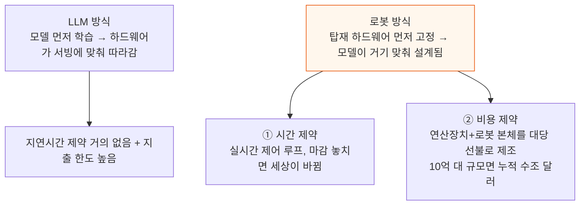

이 두 제약 때문에 로봇의 지능은 화면 뒤 LLM처럼 무한정 키우는 자원이 아니라, 지연시간과 대당 경제성에 맞춰 배급하는 자원이 된다. 하이퍼스케일러 수준의 자금을 투입해도 자본 대부분은 연산장치가 아니라 로봇과 공장 자체에 들어가야 한다.

---

## 2. 로봇 모델은 아직 작다

**📌 핵심:**
- 프런티어 LLM은 이미 파라미터 수조 개까지 갔지만, 프런티어 로봇 모델은 아직 50\~140억 개 수준이다 — Physical Intelligence의 π0.7이 50억 개, 엔비디아 DreamZero가 140억 개
- LLM에서는 스케일링 법칙(모델을 키울수록 풀 수 있는 문제 범위가 넓어지는 경향)이 꾸준히 들어맞았고, 초기 결과는 로봇에서도 비슷할 조짐을 보인다 — 데이터 부족이라는 걸림돌은 세계 모델(World Model)과 로봇이 직접 겪은 데이터 수집(Embodied Data)으로 풀리는 중이지만, 로봇은 LLM이 겪은 적 없는 데이터 희소성·현실 세계 상호작용 비용이라는 제약이 있어 스케일링이 LLM만큼 통할지는 아직 열린 물음이다
- 로봇 모델을 어디서 돌릴지를 두고 업계는 갈린다 — Figure는 자체 모델 Helix를 로봇에 전부 탑재해서 돌리고, Physical Intelligence의 π0.7은 정책을 로봇 밖 H100 한 대에서 돌리며, 엔비디아의 DreamZero(140억 개, 영상 확산 방식 세계 행동 모델)는 실시간으로 돌리려면 로봇 밖 GB200 두 대가 필요하다
- 결론: 앞으로는 온보드(로봇 탑재)와 오프로봇(데이터센터) 방식이 섞인 절충이 불가피하다 — 엔비디아·구글 딥마인드 같은 대형 로봇 모델 개발사는 무거운 인지 작업을 클라우드 GPU에 맡기고 로봇에는 저수준 제어·안전용 소형 모델만 남기는 방향으로 기운다

---

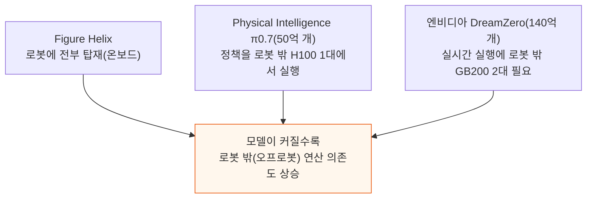

로봇 밖으로 GPU를 옮기면 얻는 이득이 있지만 지연시간 문제도 따라온다 — 통신 상태가 나쁜 환경에서는 클라우드 방식 자체가 불가능하다. 그럼에도 뒤에서 살펴볼 것처럼 오프로봇 연산은 여러 경우에 이득이자 필수가 된다.

Dyna·Sunday 같은 소형 업체는 초기엔 좁고 통제된 환경에서 배포하기 때문에 젯슨이나 소비자용 GPU에 들어가는 모델을 먼저 택할 수 있지만, 배포 규모가 커지면 결국 성능과 경제성이 가장 좋은 온보드·오프로봇 조합으로 수렴할 것으로 본다.

---

## 3. 로봇 속 모델 - 계획층과 행동층

**📌 핵심:**
- 로봇 제어에는 두 갈래가 있다 — 하나는 엔지니어가 모든 동작의 규칙과 수식을 직접 짜는 하드코딩 방식(공장에서 수십 년간 써온 임베디드 방식)이고, 이 글이 다루는 것은 대형 파운데이션 모델이 로봇을 움직이는 데이터 기반 제너럴리스트 로봇공학이다
- 데이터 기반 로봇 모델도 구조가 갈린다 — 카메라 입력에서 모터 명령까지 모델 하나가 직행하는 단일형(monolithic)도 있고, 크고 느린 모델이 "무엇을 할지" 정하면 작고 빠른 모델이 그것을 초당 수백 번 모터 명령으로 바꾸는 계층형(hierarchical)도 있다 — 이 글의 논지는 뇌가 계획층과 행동층으로 나뉘는 계층형 모델에 대한 것이다
- 계획층은 느리고 무거우며 초당 몇 번만 갱신되고 제어 루프와 비동기로 돌아간다 — 다음 계획이 아직 오는 중이어도 행동층은 가장 최근 계획대로 계속 움직이기 때문에, 계획층은 무선 왕복 통신의 지연과 흔들림(jitter)을 흡수할 수 있지만 초당 수백 헤르츠로 도는 행동층은 그 지연을 전혀 못 견딘다 — 그래서 계획층이 데이터센터로 옮겨갈 자연스러운 후보이고, 빠른 제어 루프는 로봇에 남는다
- 결론: 계획이 얼마나 필요한지는 로봇 임무가 얼마나 범용적인지에 비례한다 — 개방형 과제를 다루는 제너럴리스트는 크고 무거운 계획 모델이 필요해 데이터센터로 밀려나지만, 한 가지 반복 작업만 하는 스페셜리스트는 계획이 거의 없어 모델 전체가 로봇에 남을 만큼 작다

---

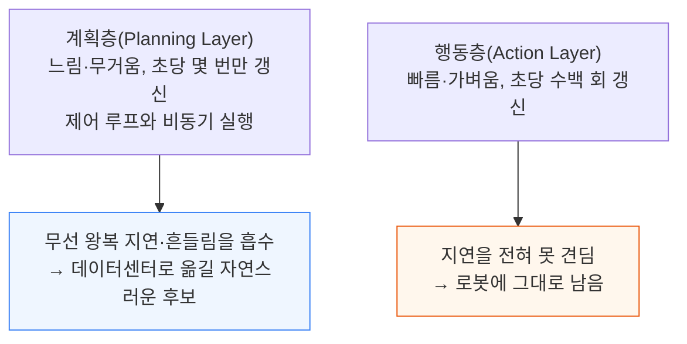

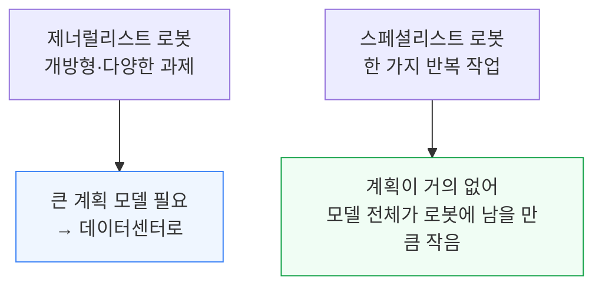

---

## 4. 데이터센터 GPU가 더 적합한 이유

**📌 핵심:**
- 스페셜리스트 로봇(한 가지 작업만 하는 로봇)은 사실 이미 풀린 문제다 — 공장은 수십 년간 하드코딩 자동화로 돌아갔다, 다만 이건 최신 AI가 아니다. 문제는 경직성이다 — 한 작업, 한 위치에 고정돼 병목이 다른 곳으로 옮겨가면 그대로 놀게 된다
- 제너럴리스트(다양한 작업을 소화하는 로봇)가 프런티어인 이유는 로봇 한 대가 여러 일을 감당하고 병목이 어디로 옮겨가든 재배치되며 제품 구성 변화와 정형화되지 않은 자잘한 작업까지 커버하기 때문이다 — 도요타 생산방식(TPS)이 보여준 "다기능 작업자가 낭비를 줄이고 경제적 효율을 높인다"는 교훈과 같은 원리다
- 제너럴리스트 로봇의 시장 규모(TAM)는 제조·물류를 넘어 가정과 그 밖의 공간까지 걸쳐 있어 막대하다
- 결론: 더 범용적인 로봇을 원할수록 연산을 많이 먹는 파운데이션 모델과 데이터센터급 연산이 필요해진다 — 모든 로봇이 최대 범용성을 필요로 하는 건 아니고 많은 작업은 작은 모델로 충분하지만, 유연한 범용 로봇의 프런티어에서는 데이터센터급 연산이 필수가 된다

---

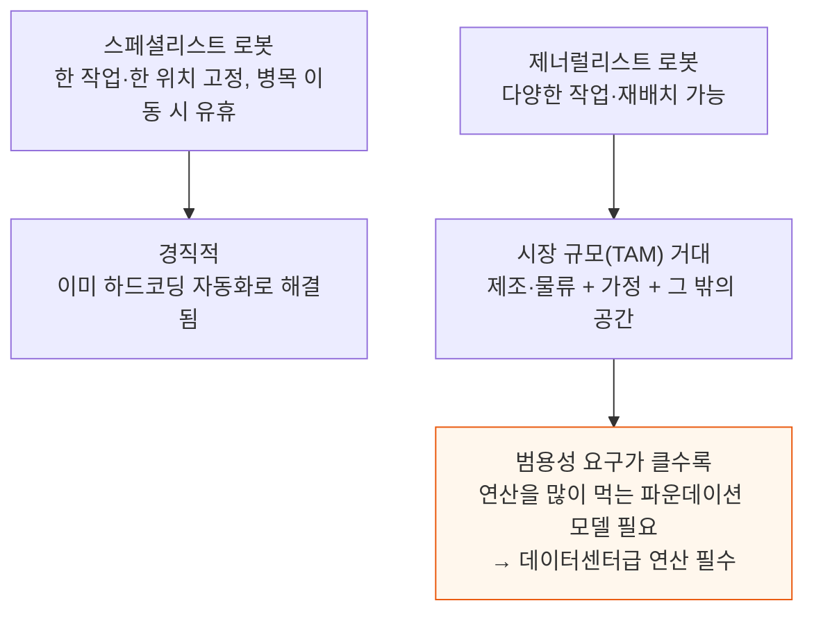

---

## 5. LLM 대 로봇 모델 - 토큰이 흐르는 방식

**📌 핵심:**
- LLM은 토큰을 크고 불규칙하게(버스트) 주고받는다 — 긴 프롬프트를 한 번에 읽어들이고(프리필) 이어서 긴 답변을 생성하는 동안, 이전 토큰들의 정보를 담은 KV 캐시가 계속 커진다 — 이 캐시를 담을 용량과 매 토큰마다 가중치·캐시를 옮기는 대역폭이 병목(메모리 월)이 돼, LLM 서빙은 대역폭에 매인다
- 로봇 모델은 정반대다 — 크게 몰아치지 않고 메트로놈처럼 작고 꾸준한 흐름을 유지한다 — 로봇은 질문 하나에 답하고 멈추는 게 아니라 움직이는 세상과 닫힌 루프로 계속 얽혀 있어서, 매초 몇 번씩 새 화면을 받아 짧은 동작 묶음을 내보낸다
- 각 화면은 전용 하드웨어(ISP·영상 압축 전용 칩)에서 수십에서 수백 토큰 수준의 고정된 작은 크기로 압축된다 — 그 결과 로봇 모델은 LLM만큼 메모리 용량과 대역폭에 매이지 않는다
- 결론: LLM은 "긴 글을 한 번에 쏟아내는" 부담이 병목이고, 로봇 모델은 "짧은 신호를 끊임없이 주고받는" 리듬이 특징이라 병목의 성격 자체가 다르다

---

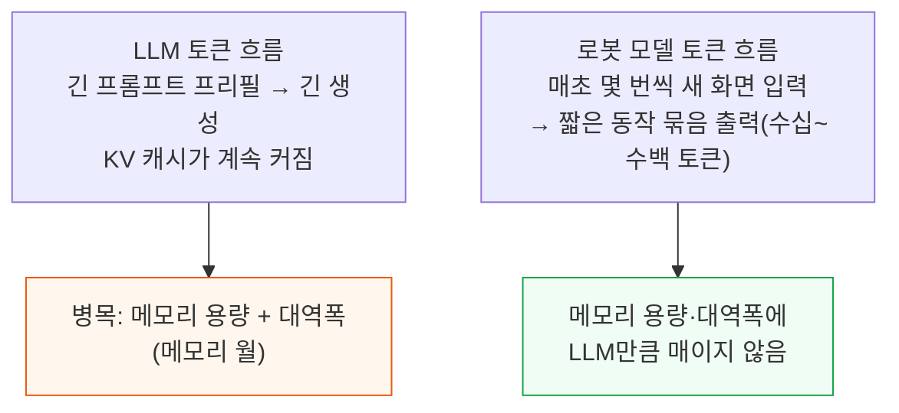

---

## 6. VLA와 WAM - 프런티어 로봇 모델은 연산을 많이 먹는다

**📌 핵심:**
- 프런티어 로봇 모델의 발목을 잡는 것은 메모리일 때도 있지만 대개는 연산량(FLOPs)이다 — VLA(비전-언어-행동 모델)는 이전 스페셜리스트 정책보다 자릿수가 다르게 큰 수십억 파라미터급 모델이고, 그중 비전·언어 단계(작업량의 대부분)는 웬만한 GPU에서도 연산이 병목이다
- WAM(세계 행동 모델)은 한 술 더 뜬다 — 행동을 바로 이름 붙이는 대신 예측한 미래 영상을 먼저 생성하고 거기서 반복적인 잡음 제거(디노이징) 과정을 거쳐 행동을 뽑아내므로, 행동 하나에 모델 전체를 여러 번 통과시켜야 할 수도 있다
- 엣지 반도체는 이를 따라가지 못한다 — 최고 사양 로봇 두뇌인 엔비디아 젯슨 토르도 B200 한 대 연산량의 약 10분의 1, B300의 약 14분의 1에 불과하다 — DreamZero(140억 파라미터 WAM)는 약 7Hz로 돌리는 데만 GB200 두 대가 필요했는데, 이는 토르 한 대가 낼 수 있는 연산량의 약 20배 수준이다
- 결론: DreamZero를 토르 한 대에서 돌리면 속도가 1Hz의 일부 수준으로 떨어져, 실시간 제어에는 턱없이 느려진다 — 프런티어 로봇 모델은 로봇에 탑재된 칩만으로는 애초에 실시간으로 못 돌아간다

---

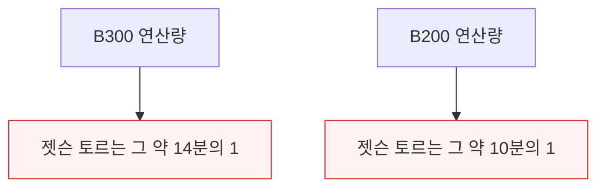

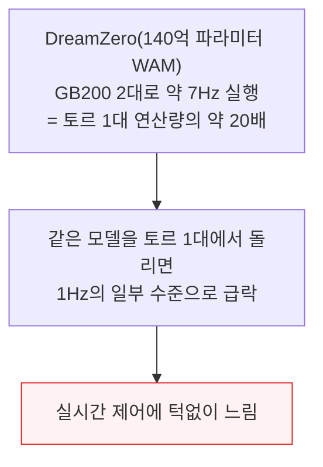

---

## 7. 로봇 모델을 기기 밖으로 내보내기

**📌 핵심:**
- 젯슨 토르가 못 따라간다면 무거운 연산은 데이터센터로 넘기고, 로봇에는 안전 루프와 고빈도 제어 루프만 남긴 뒤 통신 성능에 집중 투자해야 한다 — 여기서 지켜야 할 기준이 글래스-투-글래스 지연시간(카메라가 장면을 담은 순간부터 그 판단이 로봇의 동작으로 나타나는 순간까지 걸리는 시간) 예산이다
- 화면 데이터를 전송할 때 병목이 가장 크게 드러난다 — 압축 전용 칩 하나만으로는 부족하고 촬영부터 압축까지 전체 영상 처리 경로를 다 손봐야 한다: 잡음이 적을수록 압축이 쉬우므로 렌즈·저조도 센서 성능·신호 대 잡음비(SNR)·발열 관리·ISP(신호 처리 칩)를 압축에 유리하게 최적화해야 한다
- 이 최적화의 목표는 사람이 보기 좋은 화면이 아니라 모델이 잘 알아보는 화면과 낮은 전송량이다 — WAM이 일반 영상 생성 모델의 추가 디노이징 단계를 필요로 하지 않는 것과 같은 이유로, 여기서도 "예쁜 화면"이 아니라 "모델이 쓰기 좋은 화면"을 최적화한다
- 결론: 통신망은 변동이 크므로 ISP와 압축 전송량을 실시간으로 조정(WebRTC와 비슷한 방식)해야 하고, 하드웨어는 원래 휴대폰처럼 다운로드에 최적화된 것이 아니라 로봇의 고화질 원격 측정값을 계속 내보내는 업로드에 최적화돼야 한다 — 그럼에도 통신이 끊기는 순간을 위한 안전 우선 대체 루프(지연시간 감시기·하트비트 타임아웃)는 반드시 따로 필요하다

---

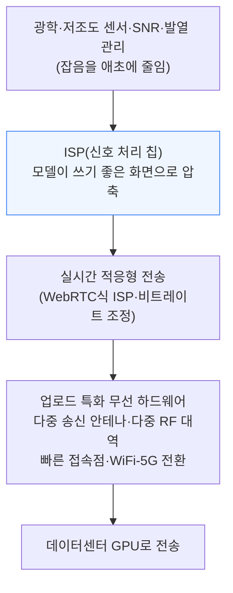

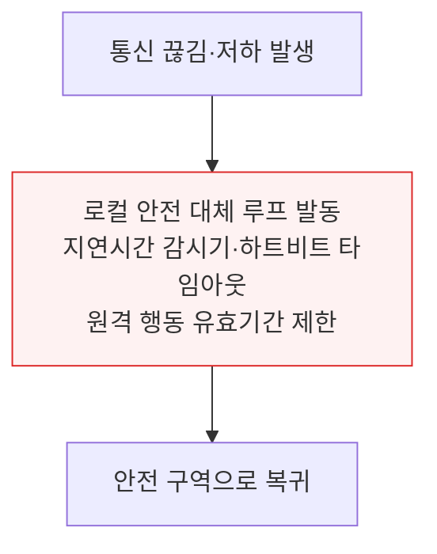

기존 휴대폰 칩셋은 다운로드 속도를 우선했지만, 로봇은 고화질 원격 측정값을 계속 내보내야 해 업로드 용량이 훨씬 더 중요하다. 접속점 전환(핸드오버) 순간은 지연시간 예산을 일시적으로 다 써버릴 수 있어, 흔들림(지터)이 가장 큰 적이다.

---

## 8. 전력 - 배터리로는 데이터센터 GPU를 못 돌린다

**📌 핵심:**
- 데이터센터 GPU 한 대(블랙웰)는 1.2\~1.4kW를 끌어 쓰고 물로 식혀야 하며 서버랙에 들어가는 크기다 — 반면 휴머노이드 로봇은 배터리에 약 2kWh만 저장하고 평상시 몇백 와트, 최대치에도 1\~2kW만 쓴다(전체 포함)
- 그래서 로봇 탑재 두뇌는 40\~130W짜리 젯슨 토르로 맞춰져 있다 — 데이터센터 GPU를 로봇에 얹으면 칩 하나가 로봇 전체보다 더 많은 전력을 끌어 쓰고, 감당 못할 냉각이 필요해지며, 배터리를 몇 분 만에 바닥낸다
- 오프로딩(연산을 로봇 밖으로 넘기는 것)은 이 전력 제약을 통째로 비켜간다 — 로봇은 20\~30W짜리 인지용 연산 보드와 무선 통신 보드만 얹고 데이터센터 GPU에 접속하면 된다
- 결론: 배터리로 감당할 수 있는 전력 예산 안에서 데이터센터급 연산을 얹을 방법은 없다 — 전력 제약 하나만으로도 무거운 연산은 로봇 밖에 둘 수밖에 없다

---

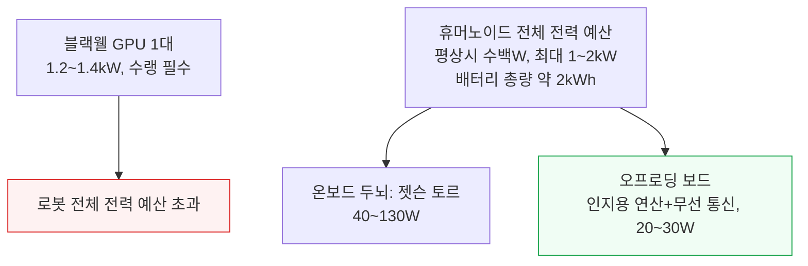

---

## 9. 공급망의 벽 - 웨이퍼와 D램

**📌 핵심:**
- 엔비디아의 가속기 생산은 사실상 전부 데이터센터용이다 — 호퍼가 2023\~2024년 길게 램프업한 뒤 2025\~2026년 블랙웰이 물량을 장악하는 동안, 로봇용 라인 젯슨은 2026년까지도 거의 안 보이는 얇은 조각으로 남는다 — 로봇 시장이 아직 작고 실제 물량이 몇 년 뒤 이야기라 만들 이유가 적기 때문이다
- 마진도 같은 이야기를 한다 — 블랙웰 데이터센터 GPU의 매출총이익률은 70%대 중후반인데 젯슨 모듈은 60%대 중반에 그쳐, 엔비디아는 희소한 최신 공정 웨이퍼를 데이터센터에 몰아줄 유인이 훨씬 크다 — 젯슨 토르 같은 로봇 칩은 연산 대비 필요한 메모리량도 훨씬 많아 걸림돌이 하나 더 있다
- 로봇용 칩은 공정 노드에서도 데이터센터와 정면으로 겹친다 — 이전 세대 오린은 삼성 SF8 공정으로 분리돼 있었지만, 현재 세대 토르는 블랙웰과 같은 TSMC N4로 격차를 좁혔고, 다음 세대는 루빈과 같은 N3로, 그다음은 파인만과 같은 N2로 이동할 전망이다 — 저물량·저마진 젯슨은 최신 공정 웨이퍼를 항상 줄 뒤에서 기다려야 한다
- 결론: 정작 로봇이 쓰는 웨이퍼 물량 자체는 크지 않다 — 2030년 젯슨급 칩 100만 개(개당 약 400㎟)를 만들어도 연간 약 1만 장의 웨이퍼로, 데이터센터 GPU 램프업에 비하면 반올림 오차 수준이다. 진짜 물음은 물량이 아니라 실리콘 효율이다 — 같은 규모의 로봇 함대를 굴린다면 로봇마다 칩을 심는 쪽과 데이터센터 GPU 하나로 여러 로봇의 인지를 대신 처리하는 쪽 중 어느 쪽이 최신 공정 실리콘을 덜 쓰는가

---

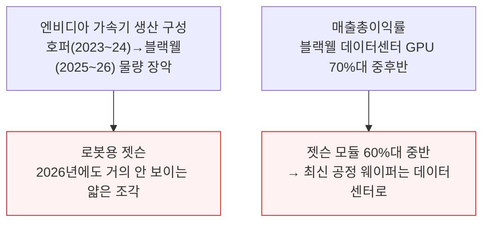

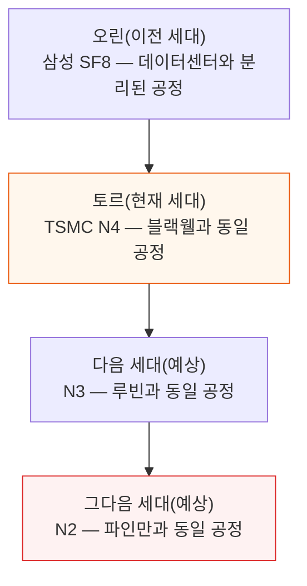

로봇용 웨이퍼 수요 자체는 아직 병목이 아니다 — 2030년 젯슨급 칩 100만 개를 찍어도 연간 약 1만 장의 웨이퍼면 충분해, 데이터센터 GPU 램프업에 비하면 반올림 오차 수준이다. 공급이 진짜 빠듯해지는 시점은 로봇이 연간 수천만 개 단위의 칩을 필요로 할 때이며, 이는 2030년을 훌쩍 넘긴 뒤의 일이다.

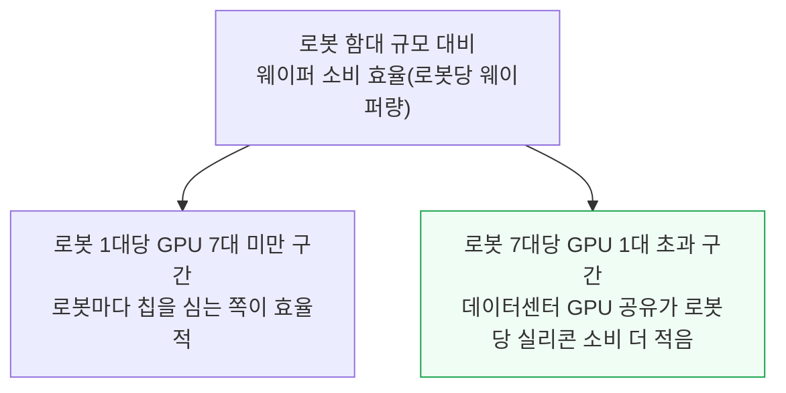

D램도 같은 이야기를 반복한다 — 젯슨 세비어 32GB, AGX 오린 64GB, 현재 젯슨 토르 128GB LPDDR5X로 세대마다 탑재량이 늘고 있다. D램 웨이퍼 생산 능력 자체는 커지지만 늘어난 물량 대부분이 AI 가속기용 HBM으로 흡수돼, 로봇 두뇌가 의존하는 범용 LPDDR은 갈수록 줄어드는 비HBM 웨이퍼를 다른 수요처와 나눠 써야 한다.

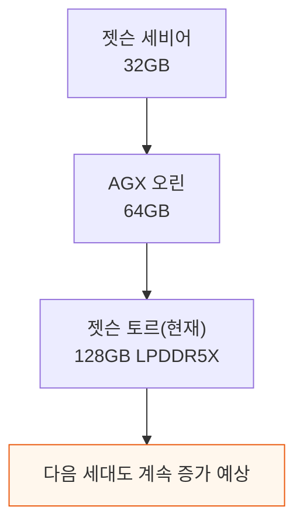

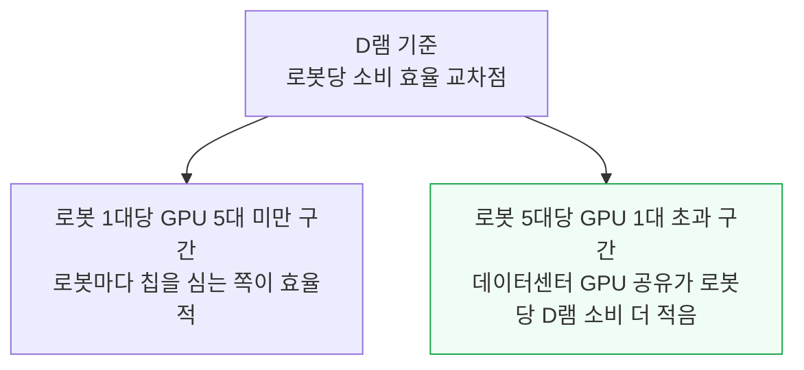

---

## 10. TCO 판정 - B300 서버 한 대 대 토르 56개

**📌 핵심:**
- RoboArena 1위 모델 DreamZero를 실제 B300에서 최적화(CUDA 그래프·DiT 캐싱·NVFP4 양자화 등)해 돌려보니, DreamZero는 한 번의 추론에 수천 개 토큰 분량의 영상 잠재값을 한꺼번에 처리해 배치 크기 1에서도 이미 연산이 꽉 찬다 — 그래서 배치를 늘려도 이득이 없고, 대신 B300 한 대가 로봇을 순서대로 돌아가며 처리(시간 분할)하는 방식이 맞다. π0·GR00T 같은 VLA는 반대로 대역폭이 병목이라 배치를 묶을수록 처리량이 거의 선형으로 늘어난다
- 통신 왕복시간 10ms(로봇 근처 온프레미스 GPU 가정)를 전제로, 한 번의 추론이 로봇에게 다음 1.6초의 동작을 사 준다 — 이 1.6초가 네트워크·대기열·연산을 다 합친 지연시간 예산이다. 요청 100개 중 99개가 이보다 빠른 p99 지연시간 기준으로, B300 한 대가 처리할 수 있는 최대 로봇 수는 7대이고 이때 p99는 1.16초로 예산 안에 들며 놓친 동작 묶음은 0건이다
- 로봇 56대를 기준으로 두 시나리오를 비교하면, 오프로드(B300 NVL8 서버 1대 + 로봇당 무선 보드 1개)는 총 자본지출 약 54만 2천 달러·시간당 총소유비용(TCO) $18.32인 반면, 온로봇(토르 56개, 대당 3,500달러에 기판·저장장치·냉각·배터리 증설·무선 통신까지 포함)은 총 자본지출 약 23만 달러·시간당 TCO $6.58로, 가동률을 따지기 전에는 온로봇이 더 싸 보인다(PFLOP당 시간당 비용 오프로드 $0.15 vs 온로봇 $0.11)
- 결론: 승부를 가르는 건 가동률이다 — 가정용 로봇은 하루 1\~2시간(전체 시간의 4\~8%)만 일하고, Figure의 BMW 공장 배치는 하루 약 10시간·가동률 40% 수준인 반면 공유 GPU 서버는 하루 종일 여러 로봇을 돌려 가동률 약 90%에 이른다 — 가동률까지 반영하면 오프로드 시나리오의 PFLOP당 TCO($0.17)는 온로봇($0.28)의 약 60%에 그쳐, 로봇 4대당 GPU 1대 이상부터는 오프로드가 유리해진다

---

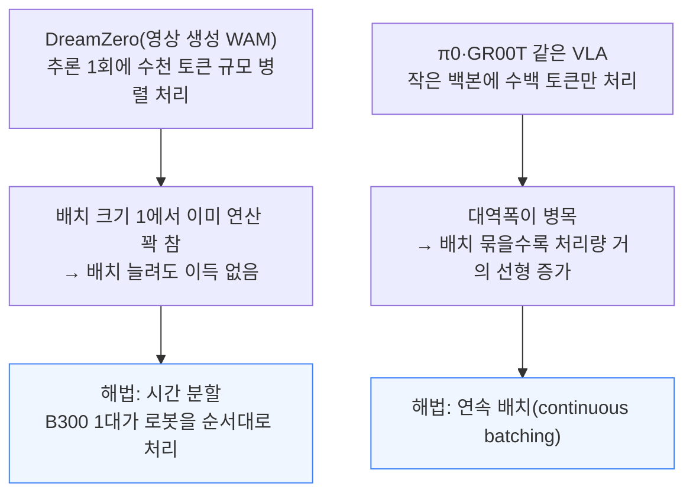

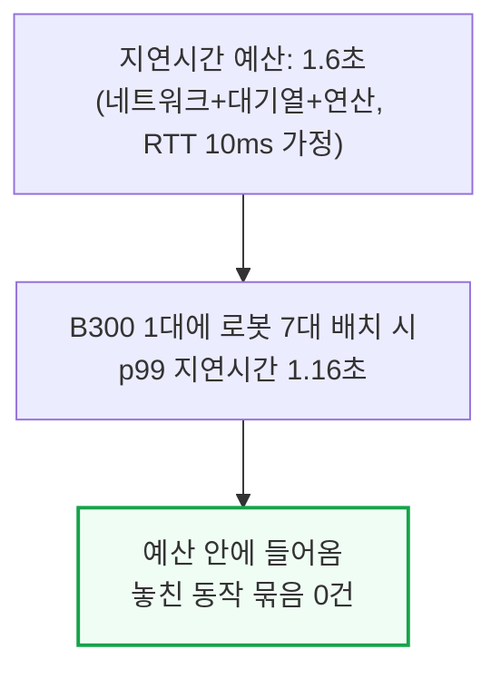

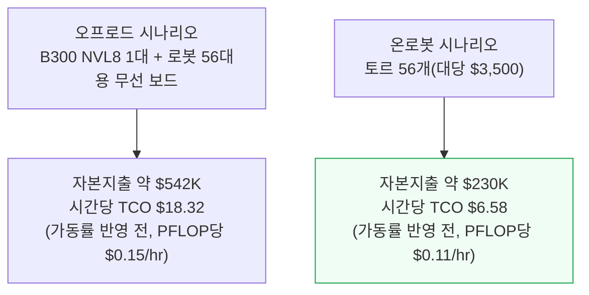

가동률을 반영하기 전에는 온로봇이 PFLOP당 비용에서 앞선다. 로봇과 GPU 둘 다 자산 대부분이 고정자본이라 실제로 얼마나 일하느냐에 따라 시간당 비용이 갈리는데, 여기서 승부가 뒤집힌다.

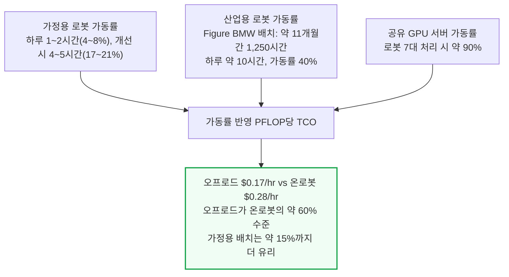

민감도 분석에서는 GPU 서버 가동률이 높고 로봇 자체 가동률이 낮을수록 오프로드가 압도적으로 유리해진다. 반대로 GPU 서버 가동률이 낮고 로봇 자체 가동률이 높은 일부 구간에서만 온로봇이 유리해진다.

표준적인 산업 배치 기준으로는 로봇 4대당 GPU 1대 이상부터 오프로드가 유리해진다. 극히 소규모 배치(온사이트 서버 1대가 대부분 놀 때)를 빼면 오프로드가 전반적으로 설득력 있는 선택지다 — 이 경우에도 서버를 통째로 소유하는 대신 필요한 만큼 빌리는 방법이 있다.

---

## 11. 어디서 통하고 어디서 안 통하는가 - 네트워크 층

**📌 핵심:**
- 오프디바이스(로봇 밖 연산)를 어디서나 쉽게 쓸 수 있는 건 아니다 — 동굴·폐허·재난 현장처럼 예측 불가능하게 가려지고 무선 환경을 아예 갖출 수 없는 곳은 통신망 자체가 안정적으로 존재할 수 없어 온디바이스에 의존할 수밖에 없다
- 노지 농업이나 오지는 스타링크 같은 위성 통신이 커버는 하지만 지연시간과 흔들림이 더 커서, 모델의 지연시간 예산에 따라 온디바이스·오프디바이스를 섞어 쓰게 된다. 가정은 벽에 막힌 신호 사각지대와 이웃과 나눠 쓰는 광케이블 혼잡이 변수지만 전용 라우터로 풀 수 있는 수준이다
- 공장·창고는 움직이는 금속 설비로 가득해 전파가 가장 나쁘게 반사·간섭되는 환경이지만, 역설적으로 가장 많이 통제할 수 있는 공간이기도 하다 — URLLC(초저지연 통신 프로토콜)와 사설 5G 대역을 최적화하면 10밀리초 미만의 무선 지연시간을 달성할 수 있고, GPU를 같은 건물 안 몇백 피트 거리에 두면 인터넷 구간 자체를 없앨 수 있다
- 결론: 안전을 위한 로컬 대체 루프는 어떤 환경에서든 타협 불가능하다 — 무선망 가동률이 99.99%를 넘겨야 하고, 그래도 통신이 끊기는 순간 로봇을 안전 구역으로 되돌리는 100% 안전 전용의 단순 제어 루프가 반드시 뒤를 받쳐줘야 한다 — 오늘날 창고의 무인운반차(AGV)가 무선이 끊기면 그 자리에 멈추는 것과 같은 원리다

---

```mermaid
flowchart TD
    Impossible["동굴·폐허·재난 현장<br/>통신망 자체가 존재 불가 → 온디바이스만 가능"]
    Cond["노지 농업·오지<br/>위성통신(스타링크) 커버 가능하나 지연·흔들림 큼<br/>→ 모델 지연 예산에 따라 혼합"]
    Home2["가정<br/>벽 사각지대·이웃과 광케이블 혼잡<br/>→ 전용 라우터로 해결 가능"]
    Factory["공장·창고<br/>전파 환경은 최악이지만 통제력은 최대<br/>→ 사설 5G·건물 내 GPU로 10ms 미만 달성 가능"]

    style Impossible fill:#fef2f2,stroke:#dc2626
    style Factory fill:#f0fdf4,stroke:#16a34a
```

지연시간 예산이 넉넉하면 건물 안에 별도로 GPU를 두지 않아도 된다 — 실제로 한 로봇 파운데이션 모델 개발사는 완성차 업체와 산업 제조사를 위해 현장에 GPU 없이 인근 도시권의 클라우드 가용 영역에서 프로덕션 추론을 서빙하고 있다.

로봇은 어차피 데이터 업로드·원격조작용으로 클라우드와 통신하므로, 추론은 기존에 깔린 통신 인프라 위에 얹히는 것일 뿐 추가 비용은 연산뿐이다.

국가·규제 환경도 변수다 — 심층 패킷 검사를 하는 국가 방화벽은 지연시간·흔들림을 크게 악화시킬 수 있어, 미국처럼 무선 환경이 좋은 나라는 오프디바이스 로봇공학에 유리하고 중국처럼 패킷 검사가 깊은 나라는 온디바이스 쪽으로 더 밀릴 수 있다.

```mermaid
flowchart TD
    Fallback2["안전 대체 원칙"] --> Uptime["무선망 가동률 99.99% 목표"]
    Fallback2 --> Local2["통신 끊김 시<br/>100% 안전 전용 로컬 제어 루프로 복귀"]
    Local2 --> Example["예: 창고 AGV는 무선 끊기면<br/>그 자리에 정지"]

    style Fallback2 fill:#fff7ed,stroke:#ea580c
```

---

## 12. 결론 - 로봇의 뇌는 데이터센터에 있다

**📌 핵심:**
- 앞으로 늘어날 로봇 배치의 상당 부분에서 로봇의 뇌는 데이터센터에 두는 쪽이 맞다 — 대량 보급의 걸림돌은 가격이고, 로봇마다 연산장치를 심는 대신 데이터센터에서 GPU를 여러 로봇이 나눠 쓰게 하는 것이 가격을 낮출 강력한 지렛대다
- 오프로딩은 로봇 회사의 가장 큰 고민도 해결한다 — 로봇이 팔리기 몇 달 전에 사둔 칩은 그대로 죽은 자본이 되고, 창고에 대기 중인 로봇 1만 대는 감가상각되는 3천만 달러짜리 재고일 뿐이지만, 오프로드한 연산은 이미 다른 일을 하며 돈을 벌고 있는 공유 GPU다
- 공급 측면도 같은 방향을 가리킨다 — 최신 공정 웨이퍼와 D램은 이미 대부분 배정돼 있고 LLM이 그 공급을 계속 먹어치우는 한 엔비디아가 로봇 칩 쪽으로 물량을 돌릴 이유는 적어, 오프로딩은 이 흐름과 싸우는 대신 올라타는 선택이다
- 결론: 오프로딩이 만능은 아니다 — 통신망이 버텨줘야 하고 환경마다 사정이 다 다르다(공장은 저지연으로 설계 가능, 가정은 적절한 장비로 해결 가능, 노지는 지연시간 예산에 달려 있고, 동굴·재난 현장은 아예 배제된다), 안전 우선 로컬 대체 루프는 어디서든 타협 불가능하다 — 하지만 통신망을 믿을 만하게 만들 수 있는 곳에서는 경제성이 이기고, 그 격차는 로봇 함대가 커지고 가동 시간이 늘수록 더 벌어진다. 남은 것은 실행이고, 승자는 데이터센터를 로봇 바로 옆처럼 느끼게 만드는 소수의 팀이 될 것이다

---

```mermaid
flowchart TD
    Price["대량 보급의 걸림돌: 가격"] --> Lever["로봇마다 칩을 심지 않고<br/>데이터센터 GPU를 공유하는 것이 가격 인하 지렛대"]
    Lever --> DeadCapital["해소: 판매 전 대기 재고가<br/>죽은 자본에서 이미 돈 버는 공유 자산으로 전환"]
    Lever --> Supply2["공급망도 같은 방향<br/>웨이퍼·D램은 이미 LLM에 배정, 오프로딩이 그 흐름에 올라탐"]

    style Lever fill:#f0fdf4,stroke:#16a34a,stroke-width:2px
```

```mermaid
flowchart TD
    Universal["오프로딩은 만능이 아님<br/>환경마다 통신 여건이 다름"] --> Workable["공장: 저지연 설계 가능<br/>가정: 적절한 장비로 해결 가능"]
    Universal --> Limited["노지: 지연시간 예산에 좌우<br/>동굴·재난 현장: 아예 배제"]

    style Limited fill:#fef2f2,stroke:#dc2626
```

---

*작성 진행률: 100% 완료*
*업데이트: TCO 판정(B300 대 토르 56개)·네트워크 층·결론 3개 섹션 추가, 전체 12개 섹션 완료*
