# A Brain Too Big to Carry — On-Device vs Datacenter Inference

> **출처**: [SemiAnalysis Newsletter](https://newsletter.semianalysis.com/p/a-brain-too-big-to-carry-on-device)
> **저자**: Ivan Chiam, Gianluca Bencomo, Zane Fong
> **발행일**: 2026-09-14

---

## 📑 목차

### 전체 섹션
 1. [로봇에서는 하드웨어가 모델을 정한다](#1-로봇에서는-하드웨어가-모델을-정한다)
 2. [로봇 모델은 아직 작다](#2-로봇-모델은-아직-작다)
 3. [로봇 모델의 층 구조와 네트워크 지연](#3-로봇-모델의-층-구조와-네트워크-지연)
 4. [공급망의 현실과 실리콘 효율](#4-공급망의-현실과-실리콘-효율)
 5. [TCO 판정 세 가지 시나리오](#5-tco-판정-세-가지-시나리오)
 6. [보스턴 다이내믹스 시스템 2는 로봇 밖에 둔다](#6-보스턴-다이내믹스-시스템-2는-로봇-밖에-둔다)
 7. [애질리티와 번 로보틱스 연산은 로봇 안에](#7-애질리티와-번-로보틱스-연산은-로봇-안에)
 8. [선데이와 위브 가정용 로봇의 와이파이 문제](#8-선데이와-위브-가정용-로봇의-와이파이-문제)
 9. [네트워크 벽이란 무엇인가](#9-네트워크-벽이란-무엇인가)
10. [벽을 오르는 방법과 오를 주체](#10-벽을-오르는-방법과-오를-주체)

---

## 🔑 용어 정리

본문을 순서대로 읽기 전에 알아두면 좋은 용어들입니다. 자세한 수치와 설명은 본문에서 처음 등장하는 위치에 나옵니다.

- **임바디먼트(Embodiment)**: AI가 화면 뒤 소프트웨어에 머물지 않고 로봇이라는 물리적 몸을 갖고 세상에서 행동하는 것
- **시스템 1·시스템 2**: 보스턴 다이내믹스의 용어 — 시스템 2는 작업 지시를 짧은 단계로 쪼개는 계획자, 시스템 1은 카메라 영상과 짧은 지시를 받아 모터를 움직이는 모델(VLA)
- **VLA(Vision Language Action 모델)**: 카메라 영상과 언어 지시를 받아 곧바로 로봇의 동작을 내놓는 모델
- **지터(Jitter)와 꼬리 지연**: 평균 지연이 아니라 명령이 도착하는 간격이 들쭉날쭉한 정도, 그리고 가끔 터지는 1초짜리 지연 — 로봇은 이 두 가지에서 멈춘다
- **젯슨 토르(Jetson Thor)**: 엔비디아가 만든 로봇 탑재용 연산 칩 — 지금 살 수 있는 가장 좋은 로봇 연산 장치
- **오프로드(Offload)**: 연산 일부를 로봇 밖 데이터센터 GPU로 넘기는 방식 — 반대는 로봇 안에서 전부 처리하는 온디바이스
- **TCO(Total Cost of Ownership, 총소유비용)**: 장비 구매비에 전력·설치 공간 같은 운영비까지 합친 실제 비용
- **네트워크 벽(Network Wall)**: 무선망이 로봇을 위해 설계되지 않아, 로봇 연산을 밖으로 내보낼 때 부딪히는 신뢰성 한계

---

## 1. 로봇에서는 하드웨어가 모델을 정한다

**📌 핵심:**
- AI는 지금까지 화면 뒤에서만 일했다 — 챗봇이 질문에 답했고, 에이전트가 소프트웨어를 몰아 여러 단계 작업을 끝냈고, 다음 단계가 물리 세계에서 움직이는 로봇이다
- LLM은 모델을 먼저 키운 뒤 서빙 방법을 찾지만, 로봇은 순서가 뒤집힌다 — 시간(마감을 놓치면 행동이 이미 낡음)과 비용(제조사가 대당 선불로 연산 장치를 부담) 두 제약 때문이다
- 로봇이 10억 대에 이르면 이 선불 비용이 수조 달러가 될 수 있다
- 결론: 로봇에서는 탑재 하드웨어가 고정값이고 모델이 거기에 맞춰 설계된다 — 지능은 지연과 대당 경제성에 맞춰 배급하는 자원이 된다

---

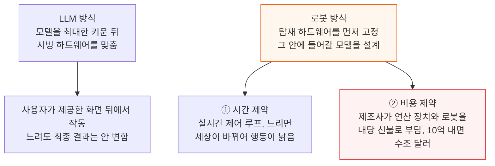

이 두 제약 때문에 최전선 로봇 모델의 크기는 저렴하고 실시간으로 돌릴 수 있는 하드웨어가 정한다.

---

## 2. 로봇 모델은 아직 작다

**📌 핵심:**
- 최전선 LLM은 이미 파라미터 수조 개에 이르렀지만, 범용 로봇 모델은 수십억 개 수준이다 — Physical Intelligence의 π0 계열 약 30억, π0.7 50억, 바이트댄스 GR-3 40억, Generalist 약 100억, 엔비디아 DreamZero 140억
- 이 숫자는 LLM의 파라미터 수보다 의미가 약하다 — 로봇 연구소는 품질과 비용이 아니라 "데이터가 받쳐 주는 크기"와 "젯슨이나 H100에 지연 한도 안에서 올라가는 크기"로 모델을 고르기 때문이다
- 결론: 로봇 모델 크기는 제약이 어디 있는지를 알려 줄 뿐, 크기가 어디서 멈출지를 알려 주지는 않는다

---

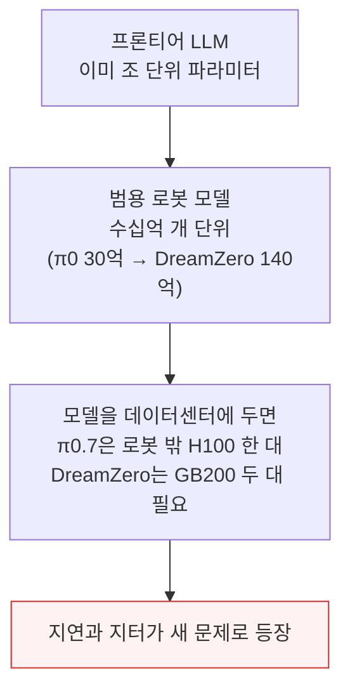

LLM에서는 스케일링 법칙(모델을 키울수록 풀 수 있는 문제 범위가 넓어지는 경향)이 꾸준히 맞았고, Generalist와 Dyna 같은 회사의 초기 결과는 로봇도 같은 방식으로 커진다고 시사한다. 문제는 확장이 되느냐가 아니라 투입 요소가 따라오느냐다.

- ① 데이터가 제약의 하나다. 인터넷 규모의 로봇 경험 데이터는 없고, 실제 상호작용 데이터는 느리고 비싸서 사람이 직접 모으는 체화 데이터와 세계 모델이 부상했다.
- ② 네트워크가 또 하나의 제약이다. 최전선 모델이 이미 로봇보다 커졌다.

이 글은 로봇 모델이 어디까지 커질지 불확실하다고 본다. 추세선은 위를 향하지만 효율 개선이 반대쪽으로 끌어당긴다.

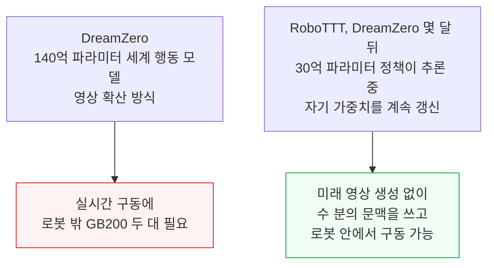

- 모델이 어떤 크기에 정착하든 저자의 견해는 여러 방식이 공존하리라는 것이다.
- 일부 로봇은 인지를 전부 로봇 안에서 돌리고, 일부는 일부를 데이터센터 GPU로 넘긴다.
- 진짜 지능이 필요한 범용 로봇에는 로봇 밖 연산이 유리하다고 본다.
- 로봇의 연산·전력 한도를 벗어나고, 추론을 함대 전체로 풀링할 수 있기 때문이다.
- 네트워크 과제가 따르지만 점점 현실적인 선택지라고 평가한다.

---

## 3. 로봇 모델의 층 구조와 네트워크 지연

**📌 핵심:**
- 범용 로봇이라면 모델은 세 층이다 — 계획층(지시와 장면을 해석해 다음 할 일 결정), 동작층(짧은 동작 시퀀스·자세·속도로 변환), 서보·안전 루프(상태 추정, 접촉·미끄러짐 반응, 균형 유지, 구동기 명령)
- 100Hz 루프는 10ms마다 출력을 내야 하는데 일반 무선 왕복만 10\~50ms라, 대략 100Hz 위는 로봇 밖으로 못 나간다
- 대략 20Hz 아래 계획층은 5Hz 기준 결정당 200ms가 있어 왕복 10\~50ms가 여유롭게 들어간다 — 진짜 문제는 평균 지연이 아니라 지터다
- 결론: 지터를 잡는 것이 계획층 오프로드를 실제로 가능하게 하는 열쇠다

---

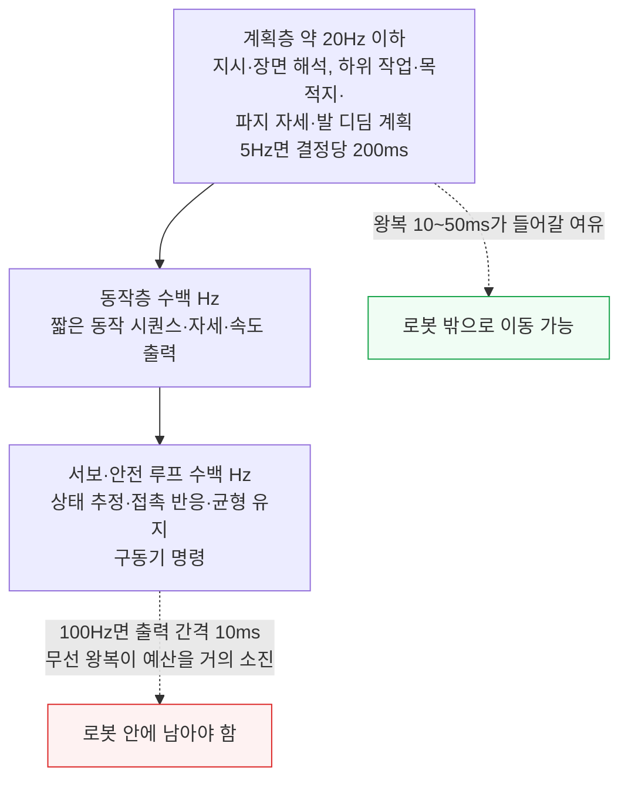

잘 설계한 링크는 왕복이 10ms 미만이고, 튜닝이 잘된 네트워크 스택이면 오프로드 가능 경계를 20Hz 위로 올릴 수도 있다. 고정 지연은 시스템이 그 사이 로봇과 주변이 얼마나 움직일지 알기에 미리 계획할 수 있다.

지터는 명령이 불규칙한 간격으로 도착해 다음 갱신이 언제 올지 모른다는 점에서 더 어렵다. 최악 지연에 맞춰 버퍼를 두면 변동 지연이 예측 가능 지연이 되지만, 모든 동작이 최악 지연의 비용을 치른다.

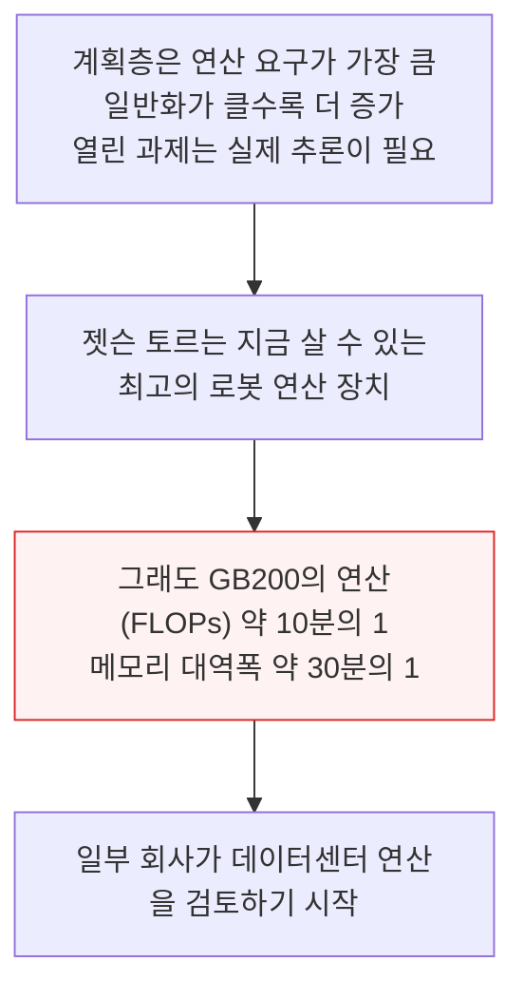

원문에는 이 구간에 도표 이미지가 있으나, 본문에 명시된 값은 위와 같다.

---

## 4. 공급망의 현실과 실리콘 효율

**📌 핵심:**
- 엔비디아 가속기 생산은 거의 전부 데이터센터용이다 — 호퍼(2023\~2024)에서 블랙웰(2025\~2026)로 넘어가며, 로봇용 젯슨은 2026년에도 겨우 보이는 얇은 띠다
- 블랙웰 데이터센터 GPU의 매출총이익률은 70%대 중후반, 젯슨 모듈은 60%대 중반이라 엔비디아는 귀한 최첨단 웨이퍼를 데이터센터에 배정할 이유가 크다
- 그러나 로봇의 웨이퍼 수요 자체는 부담이 아니다 — 2030년 젯슨급 100만 개(각 약 400mm²)는 연 약 1만 장일 뿐이다
- 결론: 진짜 물음은 웨이퍼 확보가 아니라 실리콘 효율이다 — 로봇 약 7대당 GPU 1대부터는 공유 GPU가, D램은 로봇 약 5대당 GPU 1대부터 공유 GPU가 덜 쓴다

---

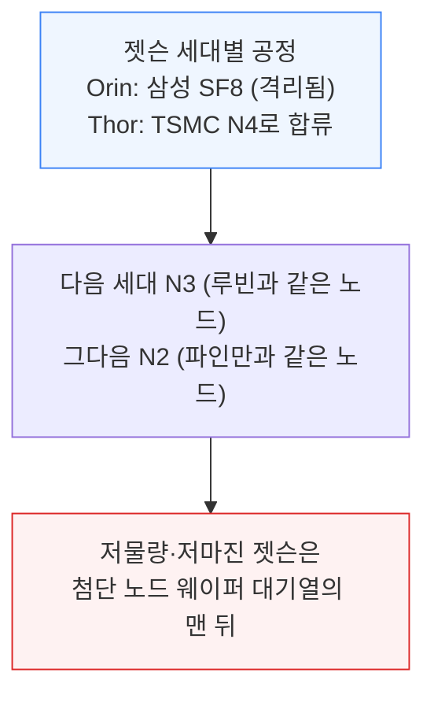

로봇이 더 능력 있는 모델을 돌릴수록 칩도 최첨단 공정에 머물러야 하고, 그러면 데이터센터 가속기 전체 로드맵이 다투는 바로 그 노드를 쓰게 된다. 수요가 오면 가격이 오르고 젯슨 마진이 반등하겠지만, 지금은 시장이 작아 엔비디아가 엣지 칩 생산을 늘릴 이유가 거의 없다.

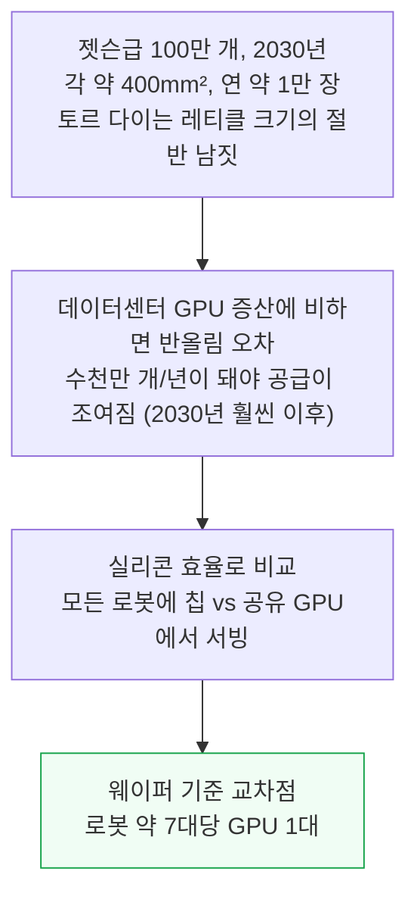

D램도 병목이다. 젯슨은 세대마다 D램이 늘었다 — 젯슨 자비에 32GB, AGX 오린 64GB, 토르 128GB(LPDDR5X)이며 앞으로도 더 늘어난다. D램 웨이퍼 총량은 계속 커지지만 늘어난 몫 대부분을 AI 가속기용 HBM이 흡수한다. 그래서 로봇 두뇌가 의존하는 범용·LPDDR 공급은 줄어드는 비HBM 웨이퍼를 두고 경쟁하게 된다.

D램이 부족한 자원일 때도 로봇당 D램을 덜 쓰는 쪽이 확장된다. 온보드 칩과 공유 데이터센터 GPU의 교차점은 로봇 약 5대당 GPU 1대이고, 그보다 많이 묶으면 로봇마다 칩을 넣는 것보다 공유 GPU가 로봇당 D램을 덜 쓴다.

원문에는 세대별 생산량·웨이퍼 배정을 보여 주는 도표가 있으나 본문이 밝힌 값은 위가 전부다.

---

## 5. TCO 판정 세 가지 시나리오

**📌 핵심:**
- 웨이퍼와 D램은 어느 방식이 확장되는지를 말할 뿐 어느 쪽이 싼지는 말하지 않는다 — B300 서버, RTX 6000 Pro 서버, 로봇마다 젯슨 토르 세 가지로 같은 로봇 함대를 서빙하는 비용을 비교했다
- 이용률 반영 전 FP4 연산 PFLOP당 TCO는 B300 0.15달러, 토르 0.16달러, RTX 6000 Pro 0.39달러(시간당) — RTX 6000 Pro는 성능 대비 비용이 약해 이후 비교에서 빠진다
- 이용률을 넣으면 토르 온로봇 0.37달러에 비해 B300 오프로드는 0.17달러로 온로봇의 약 46%
- 결론: 산업 현장 배치 기준 로봇 5대당 B300 1대부터 오프로드가 이긴다 — 가정 배치에서는 약 12%까지 낮아진다

---

비교 대상은 엔비디아 RoboTTT다. 공개 코드와 가중치가 없어, 실제 GR00T N1.7 체크포인트의 동작 헤드에 TTT(추론 중 자기 가중치를 갱신하는 블록) 16개를 끼워 넣은 재구성으로 측정했다. 논문의 연산·메모리 특성에 맞춘 것이지 정확도를 맞춘 것이 아니라 서빙 비용만 잰다.

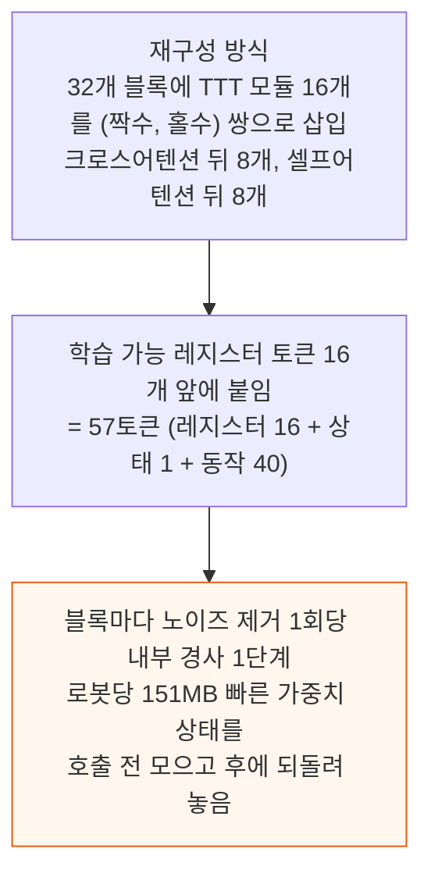

이 방식은 출력 동작은 그대로 두면서도 전체 FLOPs·메모리 이동·상태 교체 비용을 지불하므로 RoboTTT형 추론의 서빙 비용을 보여 준다. 학습하지 않은 빠른 가중치는 발산해 쓰레기를 내므로 작업 성공률은 측정 대상이 아니다. 500ms 동작 덩어리 마감 안에서 B300 한 장은 로봇 12대, RTX PRO 6000 한 장은 4대를 감당한다.

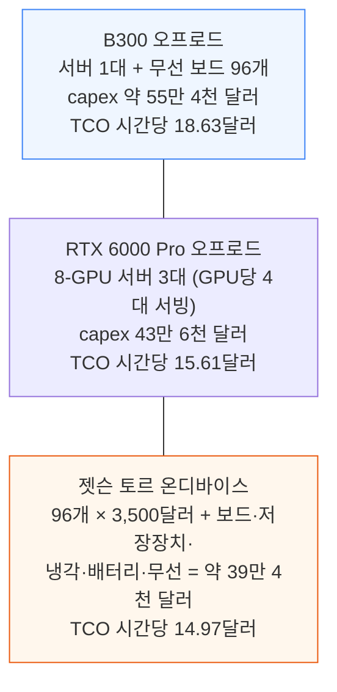

- 세 시나리오 모두 로봇 96대 기준이고 기계 부품·로봇 외피처럼 공통 부분은 비용에서 뺐다.
- B300 시나리오는 로봇 12대당 GPU 1장(p99 기준)이며 코로케이션과 전력 같은 운영비를 포함한 소유자·운영자 경제성이지 클라우드 임대 견적이 아니다.
- 토르의 수명은 4년으로 잡았다.
- 랙 안 GPU는 움직이지 않지만 로봇 섀시의 칩은 진동·충격·물 튐을 받아 더 빨리 닳기 때문이다.
- 일부 운영자는 4년 미만이라고 말했으나 4년이 합리적이라고 봤다.

자본비용(WACC)은 온디바이스가 더 높을 수 있다. 주식으로 자금을 대는 신생 로봇 회사가 부채 중심 네오클라우드나 자체 서버를 굴리는 대기업보다 높다. 하지만 이미 수명을 짧게 잡았으므로 세 시나리오 모두 같은 WACC를 보수적으로 썼다.

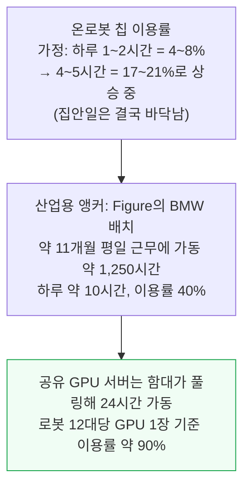

로봇과 그 뒤의 GPU는 거의 전부 고정 자본이라 놀아도 비용이 같고, 생산 시간당 비용은 가동률에 반비례한다. 이용률을 반영한 기본 사례(온로봇 40%, 서버 90%)에서는 B300 오프로드 FP4 PFLOP당 0.17달러, 토르 0.37달러로 오프로드가 온로봇의 약 46%에 그친다.

- 민감도 분석에서 GPU 서버 이용률이 높고 온디바이스 이용률이 낮은 오른쪽 위로 갈수록 오프로드가 크게 유리하다.
- 현재 산업 배치는 약 46%, 가정 배치는 약 12%다.
- B300 클라우드 서버가 만성적으로 놀고 온디바이스 이용률이 만성적으로 높은 오른쪽 아래 몇몇 경우에서만 온디바이스가 이긴다.
- 배칭 가정을 바꾸면 표준 산업 배치에서는 B300 GPU당 로봇 5대 이상부터 PFLOP당 TCO가 오프로드 쪽으로 기운다.

로봇 몇 대를 위해 서버 한 대가 대부분 놀게 되는 작은 배치만 예외인데, 그때도 서버를 통째로 사지 않고 필요한 만큼 컴퓨트를 임대할 수 있다고 저자는 본다. 원문에는 이 구간의 도표들이 있으나 본문의 수치만 옮겼다.

---

## 6. 보스턴 다이내믹스 시스템 2는 로봇 밖에 둔다

**📌 핵심:**
- 서면상 오프로드가 TCO에서 이기지만, 아직 양산한 곳이 없어 TCO가 오늘의 선택을 정하지는 않는다 — 실제로 납품하는 회사는 연산을 로봇에 두는 쪽과 일부를 밖에 두는 쪽 두 진영으로 갈린다
- 갈리는 기준은 로봇에 필요한 범용성, 무선 환경의 나쁜 정도, 고객 현장을 얼마나 바꿀 수 있는지다
- 보스턴 다이내믹스는 계획자(시스템 2)를 구글 TPU에서 로봇 밖으로 돌리고, 동작 모델(시스템 1)은 로봇 안 젯슨 토르에 둔다
- 결론: 자동차 공장 같은 범용 작업은 프론티어급 모델이 필요하고, 그런 모델은 로봇에 안 들어가 네트워크 문제를 감수하고 밖으로 뺀다

---

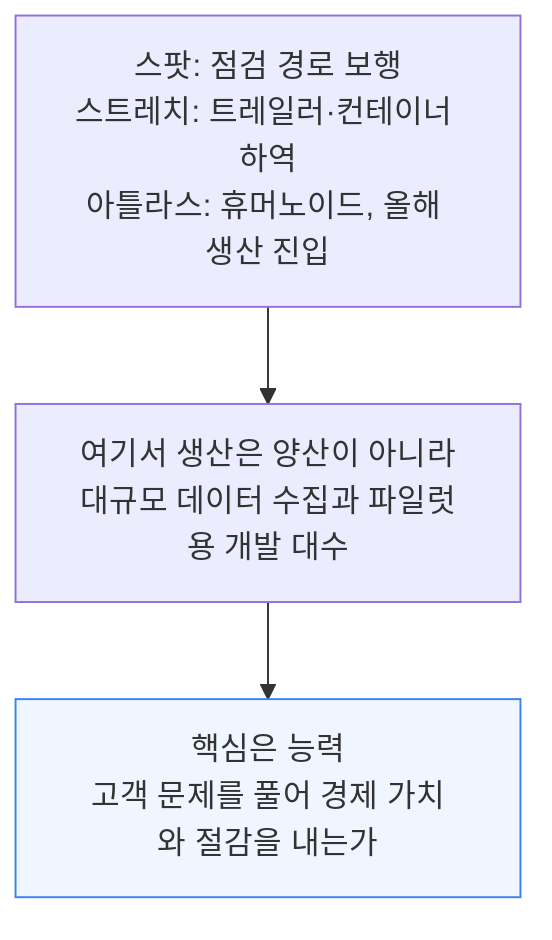

- 자동차 공장에는 자동화가 안 되는 작업이 가득하다.
- 부품 순서 맞추기·키팅·라인 옆으로 부품 옮기기, 바퀴를 차에 볼트로 조이는 조립이 그렇다.
- 차 한 대에 부품이 수만 개이고, 한 라인이 5\~10개 모델을 열두 가지 넘는 색으로 동시에 돌리며, 모델 구성은 연식마다 바뀐다.
- 단계마다 전용 솔루션을 맞추는 건 이 규모에서 빠르지도 경제적이지도 않아, 전통 자동화의 한계가 거기서 온다.
- 그래서 공장 작업에는 전문 기계 수천 대가 아니라 범용 로봇이 필요하다.

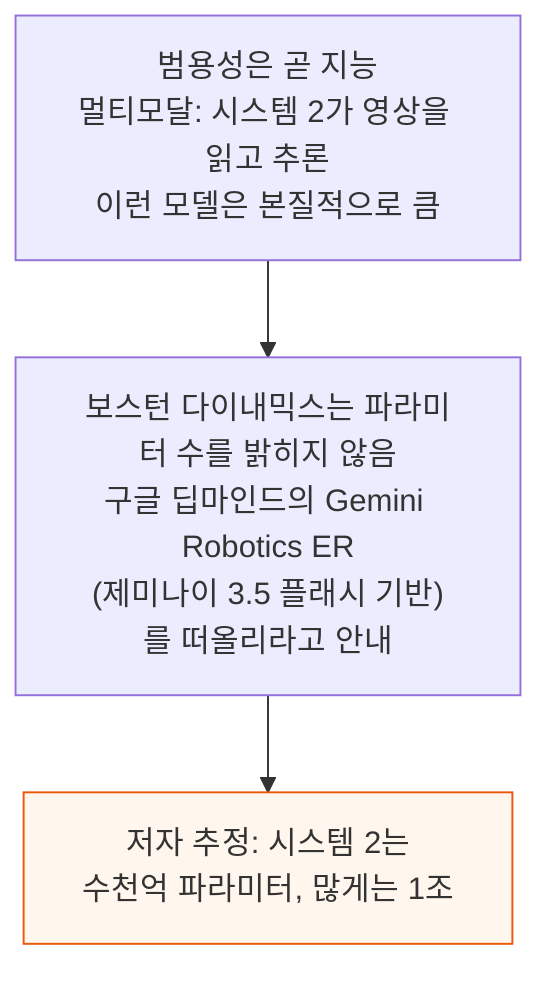

구글은 파라미터 수를 공개하지 않으므로 이 크기는 저자 추정이다.

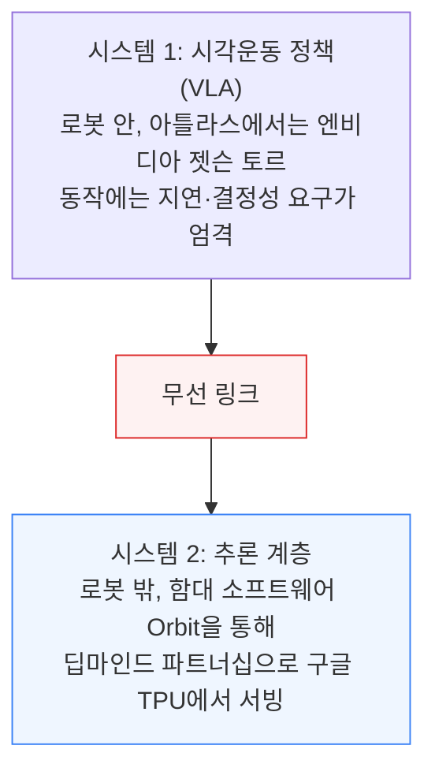

- 보스턴 다이내믹스는 이야기를 나눈 회사 중 고수준 추론을 무선 링크 반대편에 의도적으로 두는 몇 안 되는 곳이다.
- 이상적으로는 시스템 2도 로봇 위에 두고 무선 링크를 없애는 편이 낫다.
- 그러나 들고 다닐 만큼 작은 모델은 아직 공장 작업에 충분히 추론하지 못하고, 회사는 기다리기보다 지금 똑똑한 제품을 내는 쪽을 택했다.
- 임베디드 실리콘이 강해지거나 작은 모델이 추론을 잘 배우면 간극이 줄 수 있으나, 지금은 기기 밖이 통하는 방식이다.

- 시스템 2는 계획자다.
- 제조 실행 시스템(MES)의 작업 지시, 예컨대 "작업 345를 실행해 결과를 재고 통 5에 넣어라"를 받아 행동할 수 있을 만큼 단순한 단계로 쪼갠다.
- 시스템 1은 VLA, 즉 실제로 로봇을 움직이는 모델로, 카메라 시야와 짧은 지시("캔을 집어 초록 점이 찍힌 통에 넣어라")를 받아 모터 동작으로 바꾼다.
- 동작에는 엄격한 지연·결정성 요구가 있어 로봇 안에서 돈다.

- 공장의 재고 통 5는 VLA에게 아무 의미가 없다.
- 그래서 시스템 2가 로봇 시야 안에서 알맞은 통에 초록 점을 찍어 준다.
- 지저분한 현실을 시스템 1이 이해하는 말로 번역하는 일이 시스템 2의 핵심 업무이고, 초록 점은 시스템 1이 무엇에 반응할지 조종하는 여러 기법 중 하나다.
- 시스템 2는 감독도 한다.
- 작업을 지켜보고 시스템 1의 오작동을 잡고 진행도를 추적한다.
- 그 때문에 호출이 예상보다 훨씬 잦아, 가정은 몇 초에서 10초마다 한 번 질의, 경우에 따라 초당 한두 번이다.

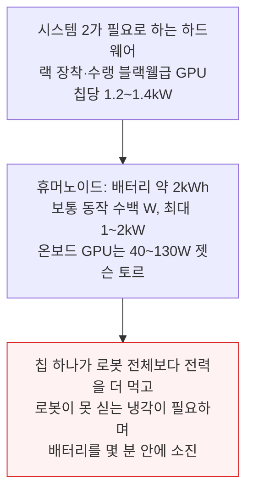

- 시스템 2를 밖에 두면 최전선 모델을 쓸 수 있는 대신 네트워크, 특히 신뢰성과 지터를 내줘야 한다.
- 평균 지연은 덜 문제이고 꼬리가 문제다.
- 가끔 터지는 1초짜리 지연이 로봇을 작업 도중 얼어붙게 한다.
- 추론이 무선 링크 반대편에 놓이면 네트워크가 로봇공학의 가장 큰 문제가 되고, 보스턴 다이내믹스에는 로봇 안 무선 스택·고객 인프라·주파수·프로토콜 설계를 맡은 팀이 여럿 있다.
- 이 부분은 9절에서 다룬다.

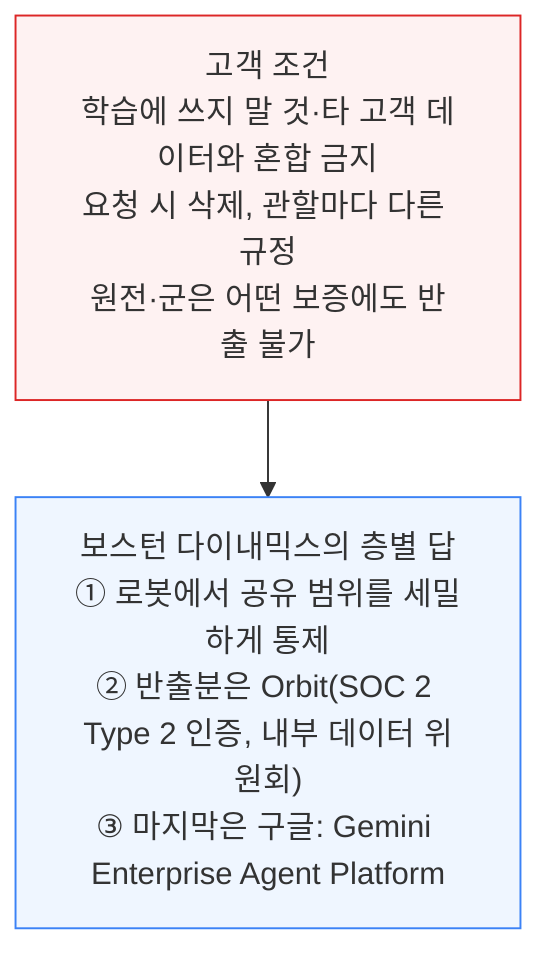

- 로봇은 사실상 누군가의 공장 바닥 영상을 내보내는 셈이라 데이터 보안이 또 하나의 쟁점이다.
- 추론을 위해 로봇이 올리는 모든 이미지가 구글 쪽도 지난다.
- 구글 클라우드의 엔터프라이즈급 에이전트 인프라이고 요구가 매우 높은 고객이 이미 받아들인 곳이다.
- 회사의 내기는 데이터가 제대로 다뤄진다는 것을 확실히 입증하면 고객이 반출을 받아들이리라는 것이다.
- 민감한 기업이 학습 금지 보증 아래 앤트로픽에 질의를 보내는 것과 같은 논리다.

---

## 7. 애질리티와 번 로보틱스 연산은 로봇 안에

**📌 핵심:**
- 애질리티 로보틱스는 창고·공장용 이족 휴머노이드 디짓을 만들며, 서드파티 기반 모델을 후속 학습해 전부 젯슨급 가속기 위에서 로봇 안에서 돌린다
- 클라우드에는 함대 관리·작업 배정·현장 지도·무선 업데이트만 둔다 — 로봇이 30\~60초 분량 작업을 미리 쥐고 있어 다음 작업이 10초 늦게 와도 상관없기 때문이다
- 나머지는 로봇 안 GPU 진영이다 — 공장은 무선에 가장 험한 환경이고, 네트워크를 고치려면 고객 인프라를 건드려야 하는데 애질리티는 기존 현장에 최소 변경으로 넣고 싶어 한다
- 결론: 안전 판단은 로봇을 떠날 수 없다 — 링크 단절 자체가 고장 모드가 되기 때문이다

---

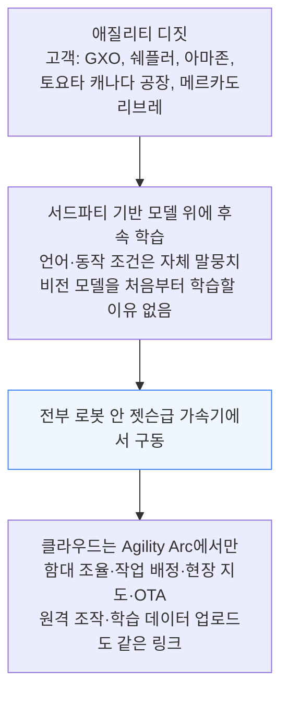

이 분업은 조율 계층이 지연 변동을 견디는 반면 제어는 못 견디기 때문에 성립한다. 로봇은 앞에 30\~60초 분량의 작업을 쌓아 두고 있어 다음 작업 덩어리가 10초 안 와도 일을 계속한다.

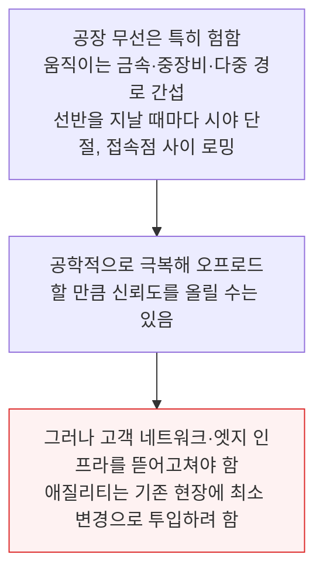

- 안전도 연산을 로봇에 두게 만든다.
- 지금 디짓은 물리적으로 막힌 작업 셀 안에서만 움직인다.
- 동적으로 안정적인 로봇 중 사람 가까이서 일하도록 안전 인증을 받은 것은 아직 없기 때문이다.
- 균형을 잡는 이족 로봇은 능동 제어로 서 있어야 하고 전원을 잃으면 쓰러질 수 있어, 미국 산업안전보건청(OSHA) 규제 환경은 디짓과 사람 사이의 물리적 분리를 요구한다.

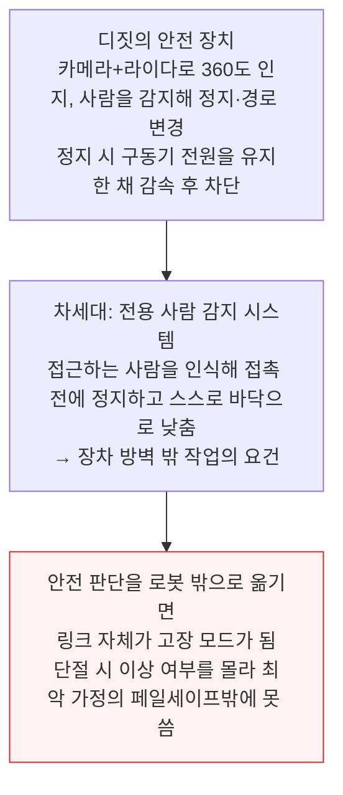

그래서 복잡한 안전 판단은 항상 로봇에 남아야 한다고 글은 결론짓는다.

- 번 로보틱스는 창고와 경공업 환경에 주로 로봇을 투입한다.
- 로봇 네모(Nemo)는 바퀴 베이스 위에 양팔 상체를 얹은 이중 팔 모바일 매니퓰레이터로, 팔 길이 700mm와 1,000mm 두 가지가 있다.
- 매사추세츠와 캘리포니아 물류 회사에 투입됐고, 생명과학 시약 회사 AbClonal에서는 시약·아이스팩의 회수·포장·운송이라는 콜드체인 작업을 자동화한다.
- 가동률이 더 높을 수 있는 경공업으로도 확장 중이다.

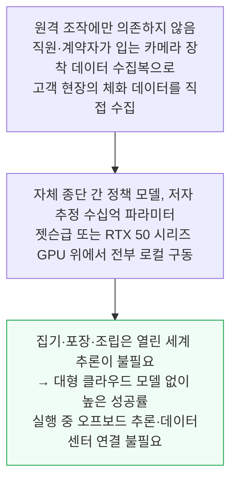

---

## 8. 선데이와 위브 가정용 로봇의 와이파이 문제

**📌 핵심:**
- 가정용 로봇 선데이 로보틱스는 처음에 클라우드 추론을 가정했다가 가정 시험 이틀 만에 방향을 뒤집어 추론을 완전히 로봇 안으로 옮겼다
- 이유는 지연이 아니라 지터다 — 집 와이파이의 사각지대·이웃 간섭·잘못 설정된 메시 라우터·비대칭 링크 때문에 99% 성공률을 몇 시간 유지하려는 로봇은 화상통화처럼 가끔의 끊김을 넘길 수 없다
- 위브 로보틱스도 수십억 파라미터 모델을 로봇에서 돌릴 것으로 보이지만, 데이터 업로드와 원격 조종사 개입이 와이파이에 의존해 네트워크에서 자유롭지 않다
- 결론: 모델이 클수록 일반화가 잘되지만 클라우드는 연결 상태에 의존하게 만든다 — 선데이는 이 상충을 로봇 안으로 풀었다

---

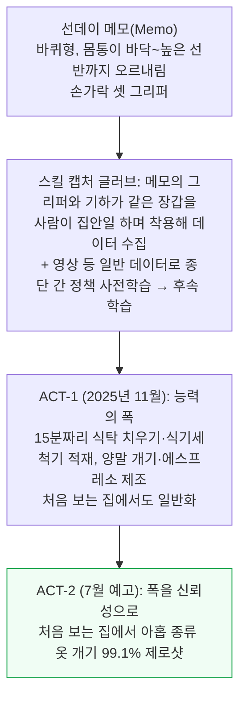

선데이가 가장 중시하는 발견은 사전학습 규모를 키워야 후속 학습이 일반화된다는 점이고, 시연 하나로 새 행동을 가르쳐 옮길 수 있을 정도다. 표본 내(in-domain)는 후속 학습 데이터가 나온 선데이 실험실, 표본 밖(out-of-domain)은 보류된 집과 물건이다.

```mermaid
flowchart TD
    N["사전학습 없음<br/>실험실 96%, 처음 보는 집 14%<br/>교과서적 과적합"] --> Y["전체 사전학습 말뭉치<br/>실험실 100%, 처음 보는 집 100%<br/>격차 소멸"]
    style N fill:#fef2f2,stroke:#dc2626
    style Y fill:#f0fdf4,stroke:#16a34a
```

범용성은 사전학습 규모에서 나오고, 사전학습 규모를 흡수하려면 모델이 커야 한다. 낯선 사람의 세탁실에서 통하는 정책은 작지 않다. 그래서 선데이는 클라우드 추론을 가정하고 출발했고, 실험실에서는 더 많은 연산·쉬운 디버깅·연구자에게 익숙한 환경이라 합리적이었다. 하지만 실제 가정에서 ACT-2를 시험한 지 이틀 만에 방침을 뒤집었다.

```mermaid
flowchart TD
    W["집 와이파이<br/>사각지대·이웃 간섭·잘못 설정된 메시 라우터·비대칭 링크"] --> J["지연은 대체로 괜찮음, 문제는 지터<br/>몇 시간 동안 99% 성공률을 지켜야 하는 로봇은<br/>화상통화처럼 끊김을 넘길 수 없음"]
    J --> S["대안도 실패<br/>스타링크: 위성이 몇 분 만에 하늘을 지나<br/>접시 시야각 100도 안의 나무·지붕선마다 통과 때 끊김<br/>5G 라우터도 같은 방식으로 끊김"]
    S --> R["선데이의 결정: 모델을 로봇 GPU 안에서 전부 구동<br/>클라우드를 핵심 경로에서 제거, 네트워크 없이 작동"]
    style J fill:#fef2f2,stroke:#dc2626
    style R fill:#eff6ff,stroke:#3b82f6
```

- 위브 로보틱스도 가정용이다.
- 첫 배치 로봇 아이작 0는 책상에 앉아 가져온 빨래를 갠다.
- 올가을 출시 예정인 아이작 1은 바퀴 베이스와 늘어나는 몸통을 더해 직접 더러운 옷을 찾고 갠 옷을 정리하고 침대를 정돈하고 장난감과 신발을 제자리에 돌려놓는다.
- 위브는 자체 VLA를 학습하면서 Physical Intelligence 모델도 돌린다.
- 최전선에 가까이 있기 위해 자체 모델을 만들되 고객에게 더 나은 경험을 주는 것이면 무엇이든 쓰므로 Pi 래퍼도 폐쇄형도 아니다.
- 두 모델 모두 수십억 파라미터 범위로 보이고 로봇에 올라갈 만큼 작아 추론을 로컬에서 돌릴 것으로 저자는 예상한다.

```mermaid
flowchart TD
    I["추론을 로봇에서 해도 네트워크에서 자유롭지 않음<br/>와이파이 링크가 나르는 것: 몸 감각·영상 데이터(학습용 업로드)<br/>어려울 때 원격 조종사가 개입"] --> L["링크가 나쁘면 양방향 트래픽이 죽음<br/>가정은 벽과 장애물로 약한 지점·사각지대<br/>일반 라우터는 핸드오프용이 아님<br/>공유 광통신망이라 이웃이 링크를 갉아먹고 로봇이 일하는 시간대와 겹침"]
    L --> N["위브는 가정 환경 변경을 요구하지 않음<br/>새 라우터·추가 접속점 없음 → 적응을 전부 로봇이 떠안음"]
    style N fill:#fff7ed,stroke:#ea580c
```

---

## 9. 네트워크 벽이란 무엇인가

**📌 핵심:**
- 지금 배치 대부분이 추론을 로봇에 두고, 거의 모든 회사가 같은 이유를 댄다 — 네트워크다. 기기 밖으로 낸 회사는 이 문제만 다루는 팀을 여럿 두고 있다
- 로봇 모델을 밖에서 돌리기 어려운 이유는 세 가지다 — ① 임바디먼트(로봇 몸체가 신호를 방해) ② 네트워크(와이파이·5G가 로봇용으로 설계되지 않음) ③ 환경(RF 통제가 가능한 공간이어야 함)
- 자율주행은 온디바이스가 필수인 대표 사례이고, 가정과 공장은 RF를 통제할 만한 공간이라 오프로드가 가능하다
- 결론: 저자는 네트워크 문제가 풀릴 수 있다고 보고, 풀릴수록 더 많은 배치가 로봇 밖으로 나갈 것으로 본다

---

```mermaid
flowchart TD
    E["① 임바디먼트<br/>금속 몸체가 자기 신호를 막고 반사<br/>방향이 바뀌면 안테나 위치도 변함<br/>모터·전자장치가 같은 주파수에 잡음"] --> W["오프로드 로봇 정책을<br/>돌리기 어렵게 만드는 세 가지"]
    N["② 네트워크<br/>와이파이·5G 인프라는 로봇 대상이 아님<br/>집에서 소파에 앉아 넷플릭스 보는 용도"] --> W
    V["③ 환경<br/>RF 통제가 가능한 공간이어야 함<br/>오프로드가 어디서 되고 안 되는지 결정"] --> W
    style W fill:#fef2f2,stroke:#dc2626
```

네트워크 문제의 핵심은 상향 링크다. 로봇은 넷플릭스 크기의 영상을 쏟아내지만 방향은 데이터센터 쪽이고, 그것도 움직이면서 보낸다. 기존 인프라는 하향 링크를 기준으로 만들어졌다. 가끔 패킷이 떨어지거나 지연이 튀는 것은 넷플릭스에는 괜찮지만 로봇에는 사고가 날 수 있는 일이다.

```mermaid
flowchart TD
    A["기존 접속점·칩셋·알고리즘의 한계<br/>우선순위가 거꾸로, 상향 MIMO 지원이 드묾<br/>UDP 스트림의 신뢰성 중복 장치 없음<br/>접속점 간 저지연 핸드오프 없음<br/>상향 스케줄링은 뒷전"] --> B["모든 것이 통계적인데 필요한 것은 결정적<br/>+ 공유 광통신망: 이웃이 넷플릭스를 켜는 순간<br/>일하는 휴머노이드는 말 그대로 사람을 해칠 수 있음"]
    style B fill:#fef2f2,stroke:#dc2626
```

환경이 핵심 과제이며 오프로드가 어디서 되고 안 되는지를 결정한다.

```mermaid
flowchart TD
    D["자율주행: 온디바이스가 엄격히 필수<br/>범위가 방대하고 RF 통제가 거의 불가능<br/>고속 이동으로 지연 예산이 0에 가깝고 핸드오프 잦음<br/>학습 문제도 휴머노이드 노동보다 단순해 모델이 로봇에 들어감"] --> D2["오프보드는 함대 관리로 축소 — 느리고 저빈도 루프"]
    H["오프로드의 환경 전제<br/>RF를 통제할 만큼 구조화된<br/>소~중형 공간: 가정과 공장"] --> H2["그래도 쉽지는 않음 — 벽·금속·다른 전자기기가 RF를 바꿈"]
    style D2 fill:#fef2f2,stroke:#dc2626
    style H fill:#f0fdf4,stroke:#16a34a
```

- 집에서 식기세척기를 켜면 RF 환경이 바뀌고, 공장에서 중장비를 돌리면 옆에 사각지대가 생긴다.
- 접속점 배치가 매우 중요하고 환경이 시간에 따라 바뀔 것까지 예상해야 한다.
- 접속점 사이를 옮겨 갈 때(핸드오프) 일반 라우터는 100ms에서 수 초까지 침묵한다.
- 이것이 물건을 조작하는 도중에 일어나면 정책이 죽거나 원격 조종사가 버벅인다.
- 복구에 몇 초가 더 걸리면 그사이 휴머노이드가 바닥에 쓰러질 수 있다.

```mermaid
flowchart TD
    HM["가정: 집마다 RF 퍼즐이 다름<br/>신호 차단·반사물 위치 예측 불가"] --> FC["공장: 구조는 있으나 방해 요소가 훨씬 많음<br/>신호를 반사·차단하는 촘촘한 금속 랙<br/>스펙트럼 전체에 간섭을 뿌리는 모터·기계<br/>매일 옮겨 사각지대도 함께 이동하는 재고·장비<br/>같은 상향 링크 시간을 다투는 수십 대 로봇"]
    style FC fill:#fff7ed,stroke:#ea580c
```

---

## 10. 벽을 오르는 방법과 오를 주체

**📌 핵심:**
- 일부는 평범한 공학으로 풀린다 — 전송 계층은 대개 수정된 WebRTC(재전송 없는 UDP, 여러 안테나로 반복해 신뢰성 확보, 패킷 중요도 인식, 최신성 우선)이고 이미 만드는 팀이 있어 노하우는 범용품이다
- 진짜 벽은 기존 하드웨어 문제이고, 저자는 네 가지가 어렵고 효과가 크다고 본다 — 환경부터 고칠 것, 부하를 줄일 것, 상향 링크를 최대화할 것, 모든 것을 한 시계에 맞출 것
- 오프로드는 응용 하나씩 진행된다 — RF 통제 가능성, 과제의 지연 예산, 데이터센터 GPU를 쓸 만큼의 복잡성 세 질문이 정한다
- 결론: 200B 파라미터 모델로 자동차 공장의 잡무를 전부 자동화하고 같은 바닥의 수십 대 로봇과 조율하는 과제는 데이터센터를 쓸 이유가 충분하다

---

**먼저 로봇이 아니라 환경부터 고친다.** 가장 효과가 큰 수정은 접속점(AP)이다. 하향 중심으로 고정 단말을 위한 소비자·기업용 접속점과 정반대로 설계해야 한다.

```mermaid
flowchart TD
    AP["로봇용 접속점의 요건 ①~③"] --> A1["① 로봇 인지 상향 스케줄링<br/>로봇 상향 트래픽을 가정·공장 트래픽 앞에 배정<br/>고정 주기의 예약 슬롯, 접속점이 입장 통제<br/>스케줄러가 로봇이 돌리는 모델을 알아야 함"]
    AP --> A2["② 위치 인지 빔포밍<br/>접속점이 로봇의 위치와 이동 방향을 알고<br/>그 움직임을 앞서 조향·배정·핸드오프"]
    AP --> A3["③ 중앙 집중 시각 동기<br/>현장당 시각 기준 하나를 무선으로 전 로봇에 보증과 함께 배포<br/>일반 접속점은 제공 못 함"]
    style AP fill:#eff6ff,stroke:#3b82f6
```

```mermaid
flowchart TD
    AP2["로봇용 접속점의 요건 ④~⑥"] --> B1["④ 다중 링크 운용<br/>대역·와이파이·5G를 가로질러 동시에 사용<br/>같은 관측을 복제하거나 분할<br/>단일 링크로는 불가능한 신뢰성·지연 개선"]
    AP2 --> B2["⑤ 깨끗한 스펙트럼<br/>가능하면 6GHz — 혼잡이 없고 채널 폭이<br/>재전송 없는 전달이 현실적이게 하는 처리량 여유"]
    AP2 --> B3["⑥ 빠른 다중 접속점 핸드오프<br/>실제 건물은 무선기가 둘 이상 필요<br/>이동은 관측 주기 안에 끝나야 함 — 200ms면 여러 프레임 손실"]
    style AP2 fill:#eff6ff,stroke:#3b82f6
```

배치도 하드웨어만큼 중요하다. 짐작이 아니라 측정하고 최적화해야 한다. 로봇의 작업 경로를 따라 RF 조사를 하고, 사각지대를 지도화하며, 로봇의 평소 높이와 진행 방향에 맞춰 안테나 방향을 고른다.

- 와이파이는 빠르고 부하를 감당하므로 집과 공장 바닥 대부분을 지배한다.
- 그러나 모든 곳을 덮지는 못한다.
- 사설이든 공중이든 5G가 옥외 경로, 큰 현장, 와이파이 혼잡을 통제하지 못하는 곳을 채운다.
- 둘은 하나의 스케줄러 아래 공존하고 로봇이 빠르게 오가야 한다.
- 현장이 통신사에 의존하면 마지막 단계는 상향 우선순위와 GPU 클러스터까지의 전용 광통신망을 통신사와 협의하는 것이다.
- 그래야 정해진 경로가 접속점에서 끊기지 않는다.

```mermaid
flowchart TD
    S["부하 줄이기<br/>네트워크는 대역폭이 한정<br/>이미지 센서가 로봇 상향 링크의 거의 전부<br/>→ 네트워킹보다 먼저 인지의 문제"] --> M["상향 링크 최대화<br/>메인보드는 상향용으로 설계: 소비자 모듈의 1~2 스트림이 아닌 4x4 상향 MIMO<br/>하향이 아닌 상향 처리량 기준 칩셋, 무선 통신용 운영체제<br/>접속점 스케줄에 참여하는 무선기: 자기 슬롯을 알고 주기에 맞춰 채우고 밖에서는 조용"]
    M --> C["전부 한 시계에<br/>서브 밀리초 동기: 메인보드의 좋은 수정 발진기 + 함대 전체 무선 시각 동기<br/>모든 로봇이 같은 박자로 촬영·인코딩·전송"]
    style C fill:#f0fdf4,stroke:#16a34a
```

- 모든 것을 한 시계에 맞춰야 하는 까닭은 데이터센터 GPU가 배치 효율이 커질수록 온디바이스 연산을 비용에서 이기고, 배칭에는 여러 로봇의 관측이 시각을 맞춰 도착해야 지연 예산 안에 들어오기 때문이다.
- GPU 오케스트레이션은 이 박자를 기준으로 짠다.
- 스케줄러가 다음 관측 프레임이 언제 도착할지 알고 연산을 미리 예약했다가 프레임이 완성되는 즉시 돌린다.
- 늦은 관측은 대기열이 아니라 다음 배치로 보내, 지연 예산을 기다림이 아닌 추론에 쓴다.
- 박자를 지키는 메인보드, 이를 강제하는 접속점, 부하를 줄이는 인지 스택이 합쳐지면 지연을 부풀리지 않고 대규모로 배칭하는 시스템이 되고, 이것이 모델을 기기 밖에서 돌리는 경제성의 핵심이다.

```mermaid
flowchart TD
    Q["벽을 오를 응용을 정하는 세 질문"] --> Q1["① RF를 얼마나 통제할 수 있나<br/>공장·가정은 측정·조율·로봇용 구축 가능<br/>거리를 도는 로봇은 통제 최소 → 두뇌는 로봇 안"]
    Q --> Q2["② 과제의 지연 예산은<br/>약 100Hz 위는 로봇을 못 떠남<br/>수 Hz의 계획층은 수백 ms 여유, 문제는 지터"]
    Q --> Q3["③ 데이터센터 GPU를 쓸 만큼 복잡한가<br/>단일 작업 로봇 팔의 단순 정책은 이유 없음<br/>200B 모델이 자동차 공장 잡무를 자동화하고<br/>수십 대 로봇과 조율하면 이유 충분"]
    style Q fill:#eff6ff,stroke:#3b82f6
```

환경을 오프로드용으로 맞추는 일이 어렵기 때문에 한 응용씩 일어난다고 저자는 본다.

---

*작성 진행률: 100% 완료*
*업데이트: 원문 전 섹션(도입·로봇 모델 입문·공급망·TCO·배치 현장 5개사·네트워크 벽·누가 오를 것인가) 10개 절로 반영*
