# Fab Whack-A-Mole: Chinese Companies are Evading U.S. Sanctions

> **출처**: [SemiAnalysis Newsletter](https://newsletter.semianalysis.com/p/fab-whack-a-mole-chinese-companies)
> **저자**: Dylan Patel, Sravan Kundojjala
> **발행일**: 2024-10-28

---

## 📑 목차

### 전체 섹션
1. [서론 - AI 패권 경쟁과 중국의 인프라 우위](#1-서론---ai-패권-경쟁과-중국의-인프라-우위)
2. [기존 규제와 그 허점](#2-기존-규제와-그-허점)
3. [화웨이 팹 네트워크](#3-화웨이-팹-네트워크)
4. [장비업체는 정말 타격받았나](#4-장비업체는-정말-타격받았나)
5. [앞으로의 규제 방향](#5-앞으로의-규제-방향)

---

## 🔑 용어 정리

본문을 순서대로 읽기 전에 알아두면 좋은 용어들입니다. 자세한 수치와 설명은 본문에서 처음 등장하는 위치에 나옵니다.

- **WFE(Wafer Fab Equipment, 반도체 제조 장비)**: 반도체를 깎고 새기고 쌓는 공정에 실제로 쓰이는 장비 전체를 가리키는 말
- **엔티티 리스트(Entity List)**: 미국 정부가 첨단 기술 수출을 금지·제한하는 개별 기업 명단
- **최소기준(de minimis)과 역외제품규정(FDPR, Foreign Direct Product Rule)**: 외국산 장비라도 미국산 부품·기술이 일정 비율 넘게 들어가면 미국 수출통제를 적용하는 기준 — 현재는 25% 초과가 그 문턱선이다
- **웨이퍼 브릿지**: 두 공장 건물을 자동 이송 궤도로 이어 웨이퍼를 오가게 해, 서류상 별개 회사인 두 팹을 사실상 하나의 생산라인으로 묶는 구조
- **N+2·N+3 공정**: SMIC가 극자외선(EUV) 장비 없이 기존 심자외선(DUV) 장비를 여러 겹 겹쳐 써서 만든 세대별 미세공정 이름
- **하프피치(half-pitch)**: 반도체 회로 선폭을 재는 척도 하나로, 계산법에 따라 같은 칩도 규제 대상 여부가 달라질 수 있다
- **EUV(극자외선 노광장비, Extreme Ultraviolet Lithography)**: 가장 미세한 회로를 새기는 데 쓰는 최첨단 노광장비

---

## 1. 서론 - AI 패권 경쟁과 중국의 인프라 우위

**📌 핵심:**
- AI 경쟁력은 이제 국가안보 문제다 — 전문가 수준 과학·공학이나 AGI(범용인공지능)가 실제로 가능해진다면, 중국이 미국보다 6개월\~1년 먼저 이를 달성하는 상황은 그대로 안보 위협이 된다
- 미국은 최대 학습 클러스터가 약 10만 개 GPU 규모이고 이후 성장은 규제·산업 생산능력에 막혀 있어, 미국 AI 기업들은 아직 검증되지 않은 방식인 "여러 데이터센터에 나눠 학습"으로 대응하는 중이다
- 반면 중국은 전력·부지 확보에 거의 제약이 없다 — 기가와트 규모 알루미늄 제련소를 6개월 안에 데이터센터로 바꿀 수 있어, 칩 공급만 해결되면 총 연산량에서 미국을 추월할 수 있는 조건이다
- 결론: 중국의 알려진 최대 클러스터는 아직 미국 최대 클러스터의 3분의 1 규모지만, 각지에 흩어진 칩을 한곳에 모으면 1년 안에 미국을 넘어서는 클러스터가 나올 수 있다

---

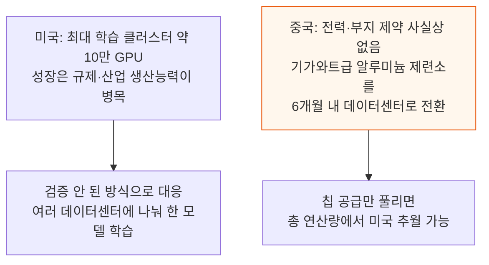

미국의 대중 수출통제는 첨단 칩부터 WFE까지 AI 공급망 전체를 겨냥한다.

규제 당국과 중국 공급망 사이에는 고양이와 쥐 추격전이 벌어진다 — 눈에 띄는 위반은 잡아내 중국의 진전을 늦춰왔지만, H100 같은 GPU는 재수출로 여전히 일부 유통된다.

하지만 미국이 남겨둔 허점도 그만큼 크다. 화웨이는 TSMC의 허술한 최종고객 확인을 피해 비트메인·소프그 등을 거쳐 첨단 웨이퍼 수천 장을 확보했다 — 명백한 집행 실패다.

다만 SMIC 자체 생산에 비하면 적은 규모다. 화웨이는 SMIC의 국산 N+2(약 7나노급)·N+3(약 6나노급) 공정으로 Ascend 910B 연산 다이를 이미 수만 장 생산했다.

SMIC의 팹 2곳은 웨이퍼 브릿지로 연결돼, 생산 공정상으로는 사실상 하나의 클린룸이다.

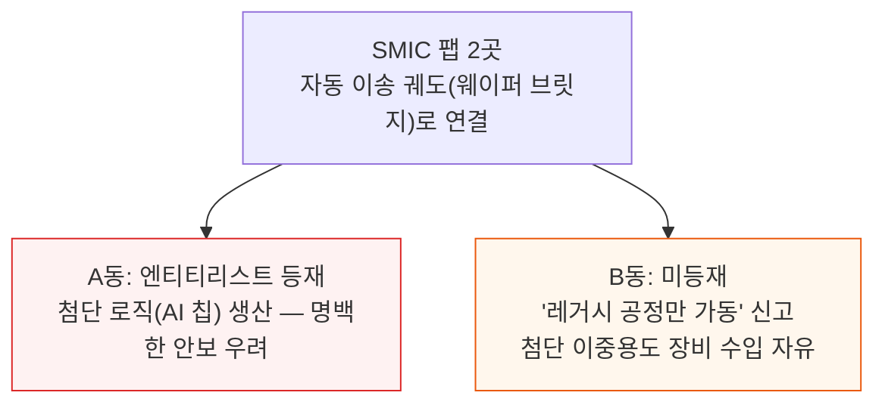

규제상 두 동은 별개 회사지만, 웨이퍼 브릿지로 아무것도 주고받지 않는다고 믿기는 어렵다.

화웨이는 SMIC 외에도 새 팹 네트워크를 위해 장비를 공격적으로 사들인다 — 중국 정부가 미는 제재 회피 계획으로, 공급망 전 단계 국산화가 목표다(3절에서 다룬다).

이는 앞으로 수출통제가 어떤 모습이어야 하는지를 묻는다. 엔티티 리스트는 쉽게 우회되지만 고칠 수 있다 — FDPR을 최강도로 적용해 최소기준 25%가 아니라 미국산 콘텐츠가 조금이라도 있으면 통제하는 안이다.

장비업체 로비는 사업 피해를 이유로 완화·철회를 주장하지만 과장이다 — 완화는 공급업체와 국가안보 모두에 해가 되는 자충수다.

이 보고서는 다음 네 가지를 다룬다.

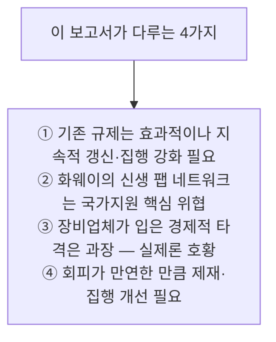

SemiAnalysis는 이 주제를 2022년 첫 규제부터 꾸준히 추적해왔다.

---

## 2. 기존 규제와 그 허점

**📌 핵심:**
- 서방의 수출통제는 중국의 첨단 반도체 진전을 확실히 늦췄다 — SMIC의 N+2 공정이 2023년에야 양산에 들어간 반면 TSMC는 이미 2020년에 N5, 2018년에 N7을 양산해, 첨단 로직 기술 격차는 약 5년으로 벌어져 있다
- 하지만 규제의 실제 집행에는 최소 3가지 허점이 있다 — ① 오프쇼어 제조(미국 밖 공장에서 만든 장비는 미국인이 관여하지 않으면 합법적으로 중국에 판매 가능) ② 최종용도 우회(레거시 공정만 신고한 팹이 웨이퍼 브릿지로 첨단 팹과 연결) ③ 이름 바꿔치기(CXMT가 하프피치 계산법 변경 하나로 규제 대상에서 벗어남)
- 결론: 규제가 없었다면 SMIC 같은 로직 팹은 정부 보조금 없이는 경제성이 없었을 것 — 하지만 시행 방식의 허점이 그 효과를 갉아먹고 있다

---

첨단 SoC, 특히 대형 다이 HPC 칩은 파라미터 수율이 낮다고 알려졌다. 보조금 없이는 경제성이 안 나지만, 필요 규모는 중국이 전기차·철강·태양광에 쏟은 지원보다 훨씬 작다.

중국 정부가 국산 대체재 개발에 힘을 싣는 것 자체가 규제 효과의 신호다. 다만 규제가 완벽하거나 영원히 작동한다는 뜻은 아니다.

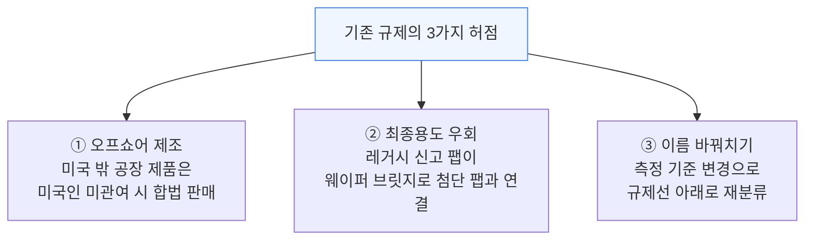

### 오프쇼어 제조

예: 2나노급 GAA 트랜지스터에 필수인 등방성 식각 장비는 램리서치의 미국 공장에서는 중국 수출이 금지된다.

같은 장비를 말레이시아 공장에서 만들면, 제조·판매·설치·정비에 미국인이 관여하지 않는 한 엔티티 리스트 팹에도 합법적으로 팔 수 있다. 어플라이드 머티리얼즈·KLA(싱가포르)와 부품업체 UCTT도 같은 방식을 쓴다 — 지금 규제에서는 합리적 기업이라면 다 택할 길이다.

### 최종용도 우회

레거시 공정만 신고한 팹은 EUV 스캐너 등 극소수 통제 품목만 빼면 첨단 장비를 그대로 수입할 수 있다 — 옆 건물의 첨단 팹과 자동 이송 궤도로 연결돼 있어도 문제 삼지 않는다.

더 쉬운 방법은 장비를 창고로 들여왔다가 나중에 원하는 팹으로 옮기는 것이다. 형식적 준수 선언이 법적 방어막이 되는 동안 설치는 계속된다.

### 이름 바꿔치기

CXMT의 첨단 D램은 하프피치 18나노로 2022년 규제 대상이었다.

2023년 규제에서 하프피치 계산법이 바뀌며 CXMT는 최소기준선 위로 다시 올라가 규제 대상에서 벗어났다 — 실제 공정은 하나도 바뀌지 않았는데도. 공정 이름도 17\~18.5나노에서 19나노로 바꿨다.

겨우 1\~2나노 차이로 문턱을 벗어난 이 규칙 변경은, CXMT에서 30억 달러 넘는 매출을 올린 어플라이드 머티리얼즈의 로비와도 무관치 않아 보인다.

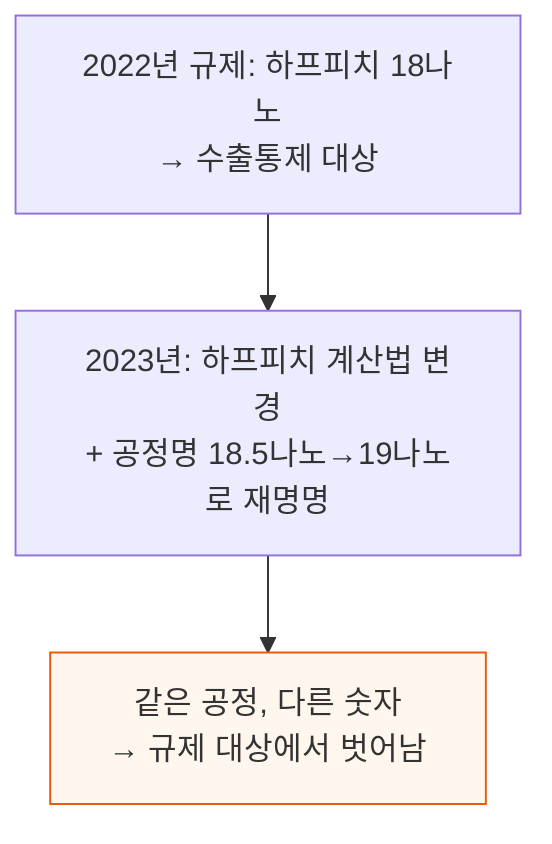

---

## 3. 화웨이 팹 네트워크

**📌 핵심:**
- 화웨이는 국가안보 우려가 가장 큰 제재 회피 사례다 — 중국 정부의 대대적 지원 아래 인수·창업을 거듭해 웨이퍼 제조 원자재·장비·광학·칩 생산(특수공정·메모리·첨단 로직)·칩 설계까지 AI·모바일 생태계 전 단계를 아우르는 기업군을 갖췄다
- 엔티티 리스트의 결정적 구멍은 화웨이가 지배하는 상류 기업 다수가 명단에 없다는 점이다 — 예를 들어 미등재 GaN 스타트업 펭진(Pengjin)은 엔티티리스트에 오른 첨단 로직 업체 PXW 바로 건너편에 클린룸을 짓고 있고, 선전 펜선(Pensun)도 SMIC 바로 옆에 있다 — 둘 다 "이웃과는 아무것도 공유하지 않는다"는 전제로 첨단 장비를 자유롭게 수입한다
- 화웨이 팹 네트워크는 2022년 사실상 지출 0에서 2024년 73억 달러(전년 대비 27% 증가)로 늘어 세계 4위 WFE 구매자가 됐고, 협력사 SMIC·CXMT까지 더하면 TSMC 다음으로 세계 2위 구매자다 — 화웨이는 국가로부터 연 300억 달러 규모 자금 지원을 받는 국영기업에 가깝다
- 결론: 화웨이 계열사 스웨이슈어(Swaysure)는 서방보다 앞서 메모리월(Memory Wall — AI 하드웨어·모델 발전을 막는 큰 장벽)을 뚫는 커패시터 없는 3D D램을 개발 중이다 — 규제 회피가 단순 추격을 넘어 일부 영역에서는 선두를 위협하는 단계로 가고 있다

---

닛케이·블룸버그가 보도했고 최근 미 하원 중국공산당 특별위원회도 상무부에 서한으로 지적했지만, 아직 충분한 관심을 받지 못한다.

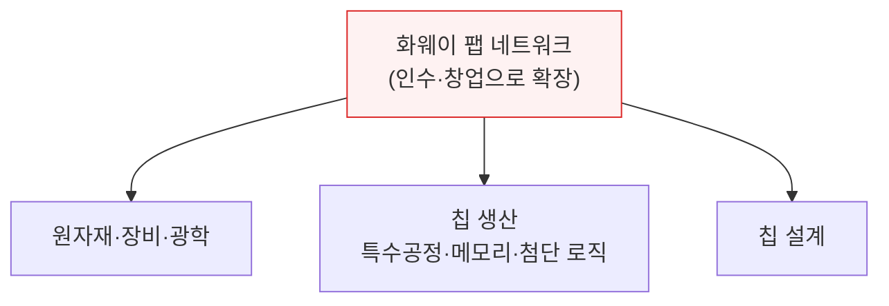

엔티티 리스트를 들여다보면 구멍이 보인다 — 화웨이가 지배해도 명단에 없는 상류 기업이 여럿이고, 이들은 등재 계열사와 무관하다고 주장하며 첨단 장비를 자유롭게 수입한다.

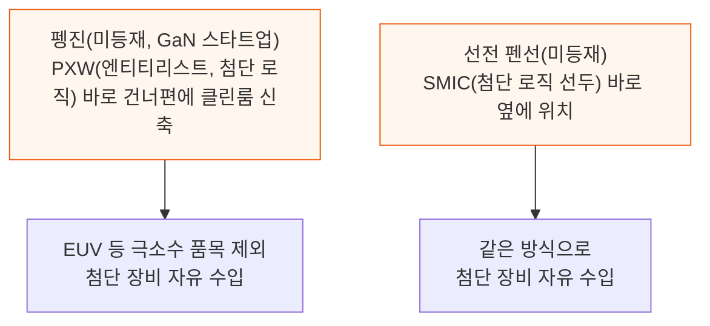

껍데기 회사와 규제의 경주에서는 껍데기 쪽이 훨씬 빠르다.

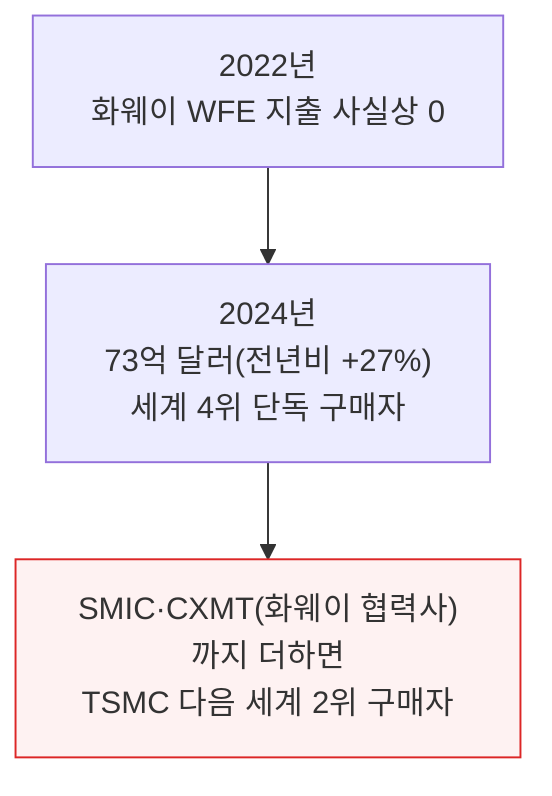

화웨이는 자유시장 경쟁자가 아니라 국가가 뒷받침하는 기업이다 — 지난해에만 300억 달러 규모의 국가 자금을 지원받은 것으로 알려졌다.

일부 영역에서는 화웨이가 서방보다 더 앞선 칩을 개발 중이기도 하다 — 계열사 스웨이슈어(Swaysure)는 메모리월을 돌파하는 커패시터 없는 3D D램을 갖고 있다.

---

*작성 진행률: 약 60% 완료*
*업데이트: 서론·기존 규제와 그 허점·화웨이 팹 네트워크 3개 섹션 완료*

---

## 4. 장비업체는 정말 타격받았나

**📌 핵심:**
- 캘리포니아 로프그렌 하원의원과 파딜라 상원의원은 상무부에 보낸 서한에서 "일부 기업은 죽음의 소용돌이(death spiral)에 빠질 위험까지 있다"고 주장했지만, 규제 시행 2년간의 실제 실적 데이터는 정반대를 보여준다
- 반도체 업황이 전반적으로 침체했던 시기에도 어플라이드 머티리얼즈·램리서치·KLA 같은 미국 장비업체들의 매출은 역대 최고 수준을 유지했고 영업이익률은 오히려 커졌다 — 실적 발표에서 경영진들도 "제재로 인한 유의미한 추가 타격은 없다"(어플라이드 머티리얼즈 CFO)고 반복해서 밝혔고, 램리서치는 최대 중국 고객(낸드 고객)이 규제로 사라진 지 1년 만에 매출을 회복했다
- 시장점유율은 규제보다 중국의 국산 대체가 장기적으로 더 큰 영향을 미친다 — 예를 들어 식각 장비에서 미국 기업(램리서치·어플라이드 머티리얼즈)을 금지해도 그 빈자리는 일본 TEL이 아니라 상하이 AMEC 같은 중국 국산 업체가 채워갈 공산이 크다(중국 정부의 최우선 원칙이 자국산 구매이기 때문)
- 결론: 규제가 단기적 충격은 주지만 존립을 위협하지는 않는다 — 오히려 태양광·리튬이온 배터리처럼 중국이 기술을 베껴 저가로 시장을 장악하는 "중국 기술 사이클"이 장기적으로 서방 장비업체에 더 큰 위협이며, 지금 첨단 장비를 중국에 파는 것은 이 사이클을 앞당길 뿐이다

---

로비 활동은 공포·불확실성·의심(FUD)을 퍼뜨리며 규제가 미래 사업에 해를 끼친다고 주장한다. 그러나 두 가지 이유로 이는 쉽게 반박된다.

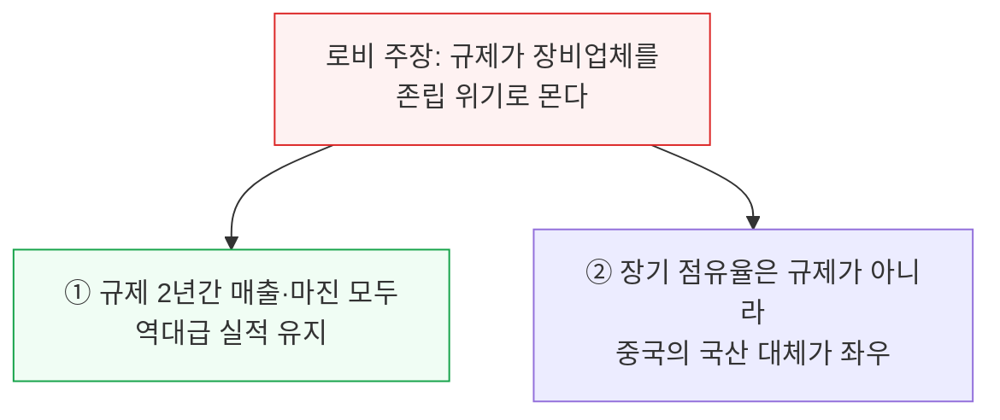

실제 실적 발표 인용을 보면 로비에서 그리는 위기감과는 결이 다르다.

> 만약 [중국으로] 수출이 허용되지 않았다면, 세계 어딘가 다른 곳에서 생산돼 출하됐을 것이다.
> — 브라이스 힐, 어플라이드 머티리얼즈 CFO, 2023 회계연도 3분기 실적발표

> 2023년 어플라이드는 5년 연속 웨이퍼 제조 장비 시장보다 빠르게 성장했습니다. 중국 시장의 10% 이상을 제한하는 무역규정이라는 역풍 속에서도 이를 달성했습니다.
> — 게리 디커슨, 어플라이드 머티리얼즈 CEO, 2024 회계연도 2분기 실적발표

> [2023년 규제 업데이트로부터] 유의미한 추가 타격은 예상하지 않습니다. 4분기(2023년) 중국 사업은 예상대로 성장했습니다.
> — 브라이스 힐, 어플라이드 머티리얼즈 CFO, 2023 회계연도 4분기 실적발표

> 최대 고객[중국 낸드 고객]이 규제로 빠져나갔던 2022년은 강했는데 2023년에 사라졌습니다... 2023년에서 2024년으로 오며 보이는 성장세는 완전히 다른 매출 구성에서 나온 것으로, 중국 국내 낸드는 사실상 없습니다.
> — 더글러스 베팅어, 램리서치 CFO, 2024 회계연도 4분기 실적발표

> [중국] 시장점유율은 계속 견고합니다. 몇 년 전부터 레거시 시장 기회에 집중해왔고, 오래된 제품 라인부터 모든 가격대에서 가장 경쟁력 있는 위치를 지키고 있습니다.
> — 릭 월리스, KLA CEO, 2023 회계연도 4분기 실적발표

2025년에도 주요 반도체 장비업체들은 모두 역대 최고 실적을 예고한다. 이것이 "죽음의 소용돌이"에 빠진 기업의 모습인가? 분명 아니다.

단기 충격이 있어도 몇 분기 안에 중국 외 고객이 빈자리를 채운다. 경영진은 사업을 지킬 책무가 있으니 "부당한 피해" 서사는 감안해서 볼 필요가 있다.

제재가 비용을 전혀 안 준다는 뜻은 아니다 — 다만 그 비용은 단기적이고 회복 가능해, 국가안보를 위해 치를 만한 가치가 있다.

흔한 반론은 "미국만 규제하면 외국 장비가 자리를 채울 뿐"이라는 것 — 미국만 빠지고 규제 목적도 실패하는 양패구상이다. 다만 어차피 대체될 기술이면 규제와 무관하게 중국 기업에 점유율을 뺏긴다.

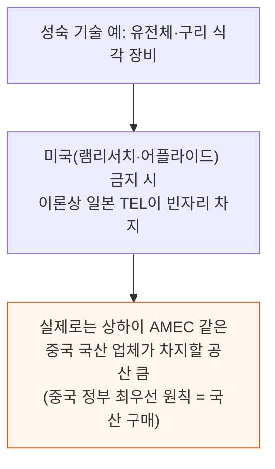

첨단 장비일수록 경쟁 공급자가 적다 — 3D 낸드용 극저온 식각 장비는 램리서치와 TEL만 만들 수 있다.

램을 금지하면 TEL이 중국 시장을 얻는다(TEL 장비가 더 우수하다는 평가도 있다). 다만 TEL 장비에도 미국산 설계·소프트웨어·부품이 들어 있다.

이런 경우엔 미국과 동맹국이 함께 규제하는 다자간 방식이 낫다 — 대안은 최소기준을 0%로 낮춰 미국산 콘텐츠가 조금이라도 든 TEL 장비 전부를 막는 것이다.

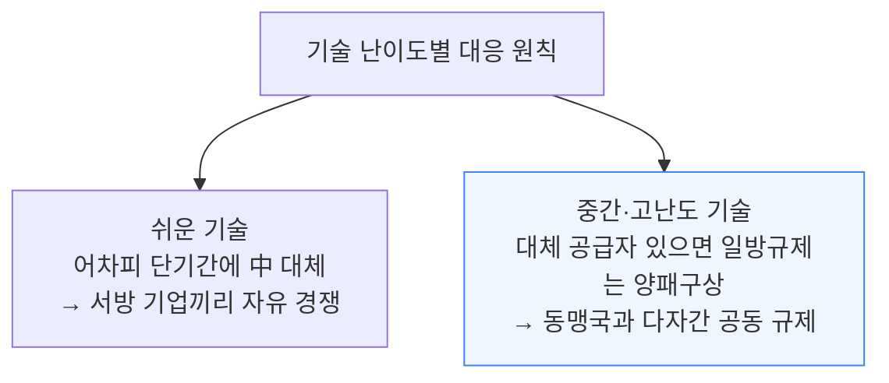

"쉬운" 기술도 반도체에서는 다른 산업의 웬만한 기술보다 복잡해 대규모로 수입된다는 점은 유념할 만하다.

"중국 기술 사이클"(경쟁사가 기술을 습득·복제해 싼값에 시장을 장악하는 패턴)은 장기적으로 이 기업들에도 적용될 공산이 크다 — 태양광·리튬이온 배터리·곧 레거시 칩까지 이미 사례가 있다.

반도체 장비도 예외는 아니다 — Aixtron은 이미 기술이 복제당해 점유율을 잃었다. 지금 장비를 파는 것은 이 과정을 앞당길 뿐, 국산 장비를 외산 옆에 두고 데이터를 학습시키는 사례도 많다.

---

## 5. 앞으로의 규제 방향

**📌 핵심:**
- 규제가 미국 장비업체에 큰 타격을 주지 않으면서도 실행할 수 있다는 점, 그리고 현재 규제에 여러 결함이 있다는 점을 확인했으니, 이제 개선 방향을 살펴봐야 한다 — 첫 규제는 챗GPT가 나오기 한 달 전에 나왔을 만큼 미국 정부는 AI의 전략적 중요성을 일찍 정확히 알아챘다
- 가장 강력한 대안은 최소기준을 0%로 낮추는 것이다 — 미국산 콘텐츠가 조금이라도 들어간 장비는 전부 규제 대상 판매·정비에 미국 정부 허가가 필요해진다는 뜻으로, 이렇게 하면 미국이 원할 때 중국의 생산능력 확장을 즉시 멈출 수 있고 기존 팹도 6개월 안에 심각하게 마비되거나 가동 불능이 될 수 있다
- 다만 이 조치는 대가가 크다 — 네덜란드(ASML) 등 동맹국의 외교적 반발, 중국의 강한 보복, 그리고 공급망에서 미국산 콘텐츠·인력·생산을 아예 빼려는 역유인(예: 윈도우 운영체제조차 완전히 대체하기 어려움)이 그 대가다
- 결론: 현재는 다운스트림(칩)에 강하고 업스트림(장비·부품)으로 갈수록 느슨해지는 비대칭 구조라 중국이 장비 국산화를 키우게 방치하는 셈이다 — EUV 스캐너는 막으면서 그 안의 핵심 부품인 자이스 광학계는 막지 않는 것처럼, 100개 미만의 핵심 부품에 업스트림 규제를 더 강하게 걸어야 한다

---

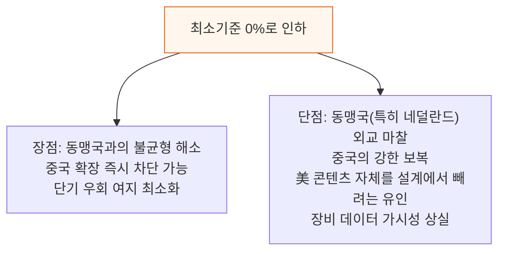

0% 기준은 효과적이지만 비용이 크다. AI가 앞으로 10년 사회를 바꿀 것이라면 적용해야 한다 — 안 했을 때의 안보 위험이 너무 크다.

업스트림 규제도 개선이 필요하다.

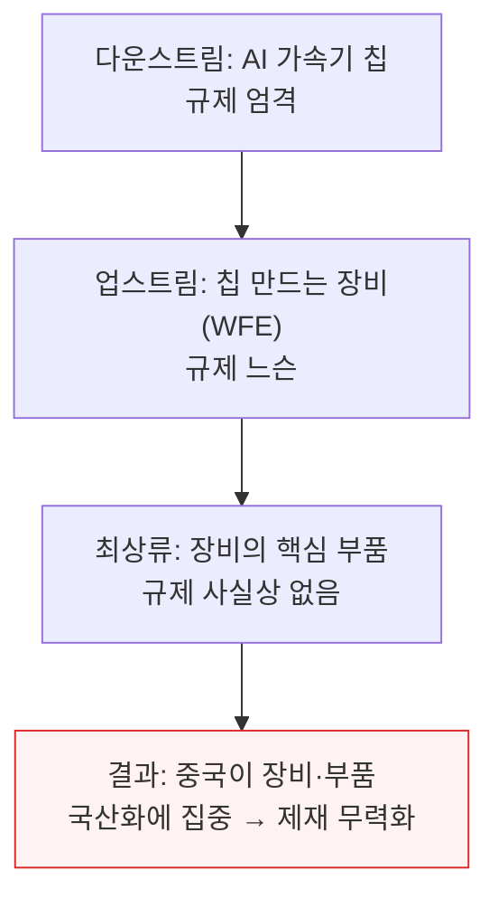

EUV 스캐너의 대중 수출은 막혀 있지만, 자이스(Zeiss)의 EUV 광학계는 규제 대상이 아니다 — 앞뒤가 안 맞는다.

투영 광학계는 EUV의 가장 중요한 부품이라는 데 다들 동의할 것이다. 볼트 하나까지 다 막을 순 없지만, 투영 광학계·정밀 마스크 스테이지·고주파 플라즈마 발생기 등 핵심 부품 100개 미만은 반드시 통제해야 한다.

상류 부품을 자국 내에 묶어두면 마진이 겹겹이 쌓인다.

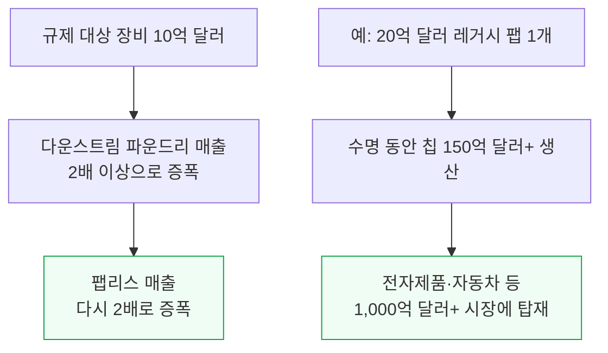

중국 정부가 화웨이를 통해 비용 전체를 사실상 보조해, 파운드리·팹리스·제조사는 마진을 남길 필요가 거의 없다. 진짜 병목은 웨이퍼 장비와 그 부품뿐이라, 여기를 반드시 통제해야 한다.

여기서는 첨단 로직·D램에 초점을 맞췄다. 레거시 공정은 중국이 이미 방대한 내수 생산능력을 갖춰 추가 규제 효과가 크지 않을 수 있다 — 별도 보고서에서 다룰 사안이다.

다만 첨단 공정을 함께 돌리는 팹까지 "레거시"라는 이유로 규제 대상에서 빠지지 않도록 시행 방식은 신중해야 한다.

정리하면, 수출통제를 개선할 실용적이고 효과적인 방법이 있고, 이런 개선이 장비업체에 부당한 피해를 주지도 않는다 — 규제는 더 강화돼야 한다.

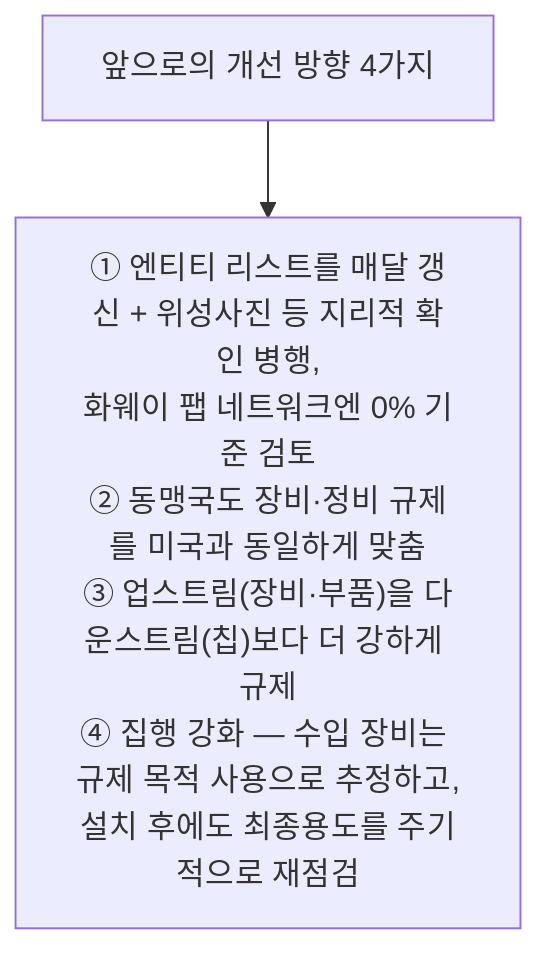

동맹국 설득 논리는 다음 분기가 아니라 다음 10년이다 — AI 역량을 갖춘 중국은 동맹국 안보에도 안 맞고, 동맹국 기업도 장기적으로는 손해를 본다.

---

*작성 진행률: 100% 완료*
*업데이트: 장비업체 영향 분석·앞으로의 규제 방향 섹션 추가, 전체 5개 섹션 완료*
