# Apple-TSMC: The Partnership That Built Modern Semiconductors

> **출처**: [SemiAnalysis Newsletter](https://newsletter.semianalysis.com/p/apple-tsmc-the-partnership-that-built)
> **저자**: Sravan Kundojjala, Gerald Wong, Dylan Patel, Jeff Koch
> **발행일**: 2026-01-08

---

## 📑 목차

### 전체 섹션
 1. [서론 - 2013년 100억 달러 베팅](#1-서론---2013년-100억-달러-베팅)
 2. [앵커 테넌트 - 애플 없이는 TSMC도 없다](#2-앵커-테넌트---애플-없이는-tsmc도-없다)
 3. [1단계: 자체 칩을 만들기로 한 이유와 구애 (2007\~2014)](#3-1단계-자체-칩을-만들기로-한-이유와-구애-20072014)
 4. [2단계: 애플이 TSMC를 만들다 (2014\~2020)](#4-2단계-애플이-tsmc를-만들다-20142020)
 5. [3단계: 상호 종속 (2020\~2023)](#5-3단계-상호-종속-20202023)
 6. [4단계: 분산된 의존 - 킹메이커는 여전한가 (2023\~현재)](#6-4단계-분산된-의존---킹메이커는-여전한가-2023현재)
 7. [5단계: TSMC를 넘어서 (2027년 이후)](#7-5단계-tsmc를-넘어서-2027년-이후)
 8. [제조 거점 지도 - Fab 18과 첨단 패키징](#8-제조-거점-지도---fab-18과-첨단-패키징)
 9. [지리적 집중 리스크 - 대만 의존](#9-지리적-집중-리스크---대만-의존)
10. [애플의 5대 인수 - 반도체 제국을 만든 거래들](#10-애플의-5대-인수---반도체-제국을-만든-거래들)
11. [글로벌 설계 조직과 DTCO](#11-글로벌-설계-조직과-dtco)
12. [실리콘 성능의 진화 - A/M 시리즈](#12-실리콘-성능의-진화---am-시리즈)
13. [애플 웨이퍼 수요 - 노드·칩·기기별 경제학](#13-애플-웨이퍼-수요---노드칩기기별-경제학)
14. [웨이퍼 수요 예측 (2026\~2030)](#14-웨이퍼-수요-예측-20262030)
15. [칩 시리즈별 분석과 기기 다각화](#15-칩-시리즈별-분석과-기기-다각화)
16. [AI가 애플을 추월하다 - 첨단 공정의 주인이 바뀌다](#16-ai가-애플을-추월하다---첨단-공정의-주인이-바뀌다)
17. [애플이 TSMC를 보조하는 방식 - KGD 모델과 비닝](#17-애플이-tsmc를-보조하는-방식---kgd-모델과-비닝)
18. [패키징 경제학 - InFO vs CoWoS](#18-패키징-경제학---info-vs-cowos)
19. [애플의 원가 절감 - 사내 칩의 수익성](#19-애플의-원가-절감---사내-칩의-수익성)
20. [경쟁사 복제 시도와 애플이 팹을 짓지 않는 이유](#20-경쟁사-복제-시도와-애플이-팹을-짓지-않는-이유)
21. [애플이 만든 산업 - 폭스콘·ASML·TSMC](#21-애플이-만든-산업---폭스콘asmltsmc)
22. [다음 10년 - 엔비디아와의 경쟁, 애리조나 질문](#22-다음-10년---엔비디아와의-경쟁-애리조나-질문)

---

## 🔑 용어 정리

본문을 순서대로 읽기 전에 알아두면 좋은 용어들입니다. 자세한 수치와 설명은 본문에서 처음 등장하는 위치에 나옵니다.

- **앵커 테넌트(Anchor Tenant)**: 새 공장·신규 설비 투자의 위험을 먼저 떠안아주는 대형 고객 — 이 고객의 확정 주문이 있어야 나머지 투자자·고객이 안심하고 뒤따라옴
- **파운드리(Foundry) vs IDM(Integrated Device Manufacturer)**: 파운드리는 설계 없이 남의 칩을 위탁 생산만 하는 회사(TSMC), IDM은 설계부터 생산까지 자체적으로 다 하는 회사(과거 인텔) — 파운드리는 여러 고객의 물량을 모아 한 공장을 계속 채울 수 있어 첨단 공정 투자 회수가 유리함
- **KGD(Known Good Die) 모델**: 새 공정 초기엔 불량률이 높은데, 웨이퍼 전체가 아니라 실제로 정상 작동하는 칩(다이)에 대해서만 값을 치르는 가격 방식 — 불량 비용을 제조사(TSMC)가 떠안는 대신 고객(애플)은 막대한 물량을 확약
- **InFO vs CoWoS**: 둘 다 TSMC의 첨단 패키징(여러 칩·메모리를 하나로 묶는 후공정) 기술 — InFO는 D램을 SoC 위에 쌓아 두께를 줄이는 애플 아이폰용 방식, CoWoS는 HBM 메모리를 GPU 옆에 나란히 놓아 대역폭을 늘리는 엔비디아 AI 칩용 방식
- **DTCO(Design-Technology Co-Optimization)**: 칩을 설계하는 회사(애플)와 공정을 만드는 회사(TSMC)가 트랜지스터 구조 자체를 처음부터 함께 조율하는 협업 방식 — 일반 고객은 완성된 공정에 맞춰 설계만 하지만, 애플은 공정 규격 자체를 TSMC와 같이 정함
- **TSMC 노드 명명법(N-시리즈 vs A-시리즈)**: TSMC가 회사 안에서 실제로 쓰는 세대 명칭 — 예를 들어 N2는 2나노미터급 공정, 그다음 세대인 A16·A14는 나노미터보다 작은 단위(옹스트롬, Å)를 쓴다는 뜻에서 "A"로 표기가 바뀜 (숫자가 작을수록 더 미세한 최신 공정)
- **Fab 18**: 대만 타이난에 있는 TSMC의 최첨단 공장 — 아이폰·맥의 최신 칩(3나노급)이 여기서 나와 사실상 "애플의 공장"으로 불림
- **비닝(Binning)**: 생산 과정에서 일부 회로가 고장 난 칩을 버리지 않고, 고장 난 부분을 끄고 성능을 낮춰 하위 등급 제품으로 재판매하는 방식 — 불량품도 돈이 되게 만드는 수율 관리 기법

---

## 1. 서론 - 2013년 100억 달러 베팅

**📌 핵심:**
- 2013년 TSMC 창업자 모리스 창은 고객 단 하나(애플)를 믿고 20나노미터 공정에 100억 달러를 걸었음 — "회사를 걸었지만 질 거라곤 생각하지 않았다"는 게 창의 회고
- 애플이 TSMC에 쓰는 연간 금액은 2014년 20억 달러에서 2025년 240억 달러로 12년 만에 12배 증가, TSMC 매출에서 차지하는 비중도 9%에서 한때 25%까지 올라갔다가 2025년 20%로 안정
- 애플은 20나노 이후 거의 모든 신규 공정 출시 때 50% 넘는 물량을 가져갔고 일부는 거의 100%에 달해, 사실상 TSMC의 수율 학습 곡선(신공정 초기 불량률을 낮춰가는 과정) 비용을 애플이 대신 치른 셈
- 결론: 이 리포트는 2010년 인텔의 거절부터 시작해 5단계로 이어진 애플-TSMC 관계를 SemiAnalysis의 파운드리 산업 모델과 애플 웨이퍼 수요 모델 데이터로 추적함

---

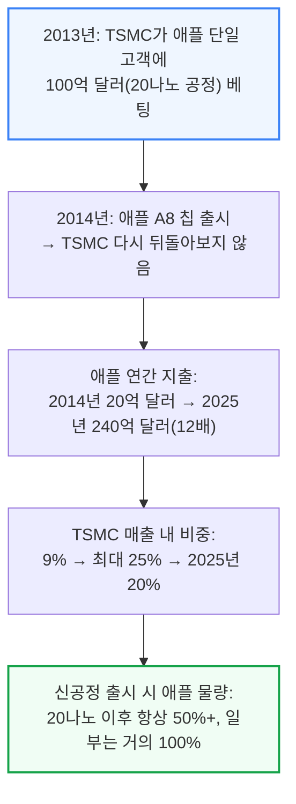

이 리포트가 다루는 5단계는 다음과 같습니다. 각 단계는 이후 섹션에서 순서대로 자세히 다룹니다.

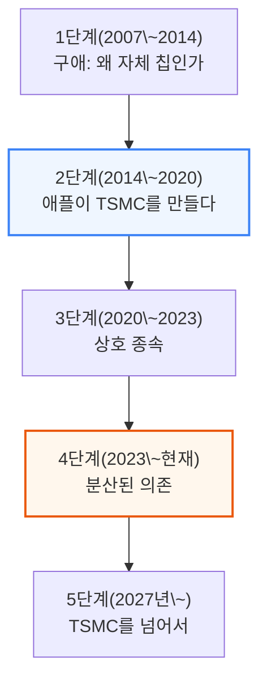

---

## 2. 앵커 테넌트 - 애플 없이는 TSMC도 없다

**📌 핵심:**
- 애플 효과는 TSMC의 설비 투자(공장·장비 신설 비용) 추이에 그대로 드러남 — 애플 이전(2005\~2009년) 연평균 24억 달러였던 투자가 2019\~2022년에는 4년간 980억 달러로, 그 이전 14년 누적치를 넘어섬
- 애플의 제조 구매 확약(향후 물량을 미리 약속하는 계약) 규모는 2010년 87억 달러에서 2022년 710억 달러로 늘었고, TSMC에 직접 낸 돈은 2013년 거의 0에서 2025년 230억 달러+로 커짐 — 10년 넘게 애플은 최첨단 공정에 선제적으로 자금을 대는 유일한 회사였음
- 2020년대 들어 엔비디아의 AI발 현금 창출력이 커지며 상황이 바뀜 — TSMC 매출 중 HPC(고성능컴퓨팅, 서버·AI 가속기용) 비중이 2020년 36%에서 2025년 58%로, 스마트폰 비중은 46%에서 29%로 뒤집힘
- 결론: 이제 애플과 엔비디아 둘 다 TSMC 로드맵에 선자금을 댈 수 있는 회사가 됨 — TSMC는 앵커 테넌트(신규 투자 위험을 먼저 떠안는 대형 고객)를 하나가 아니라 둘 가진 셈

---

📌 용어 풀이: 앵커 테넌트가 왜 필요한가
> - 첨단 공정 공장 하나를 새로 짓는 데 드는 돈은 수백억 달러 단위 — 이 돈을 갚으려면 공장을 처음부터 가득 채워 돌려야 함
> - 신생 공정은 초기엔 불량률이 높아 이익을 못 냄 — 이 손실을 감수하고도 대량으로 사줄 첫 고객이 없으면 다음 세대 공정 투자 자체가 불가능
> - 애플은 이 역할을 10년 넘게 홀로 맡았고, 이제 엔비디아가 두 번째 앵커 테넌트로 합류

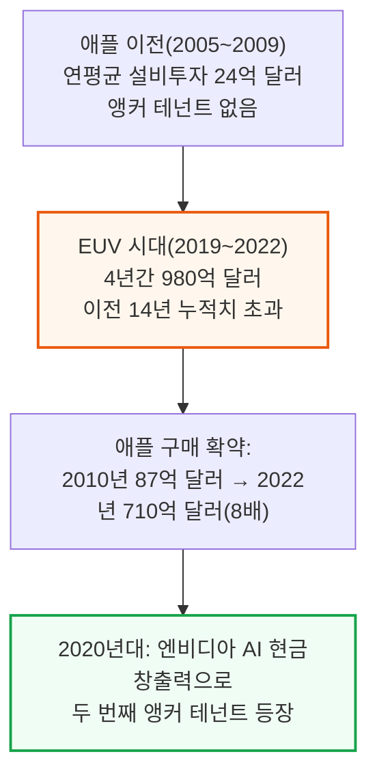

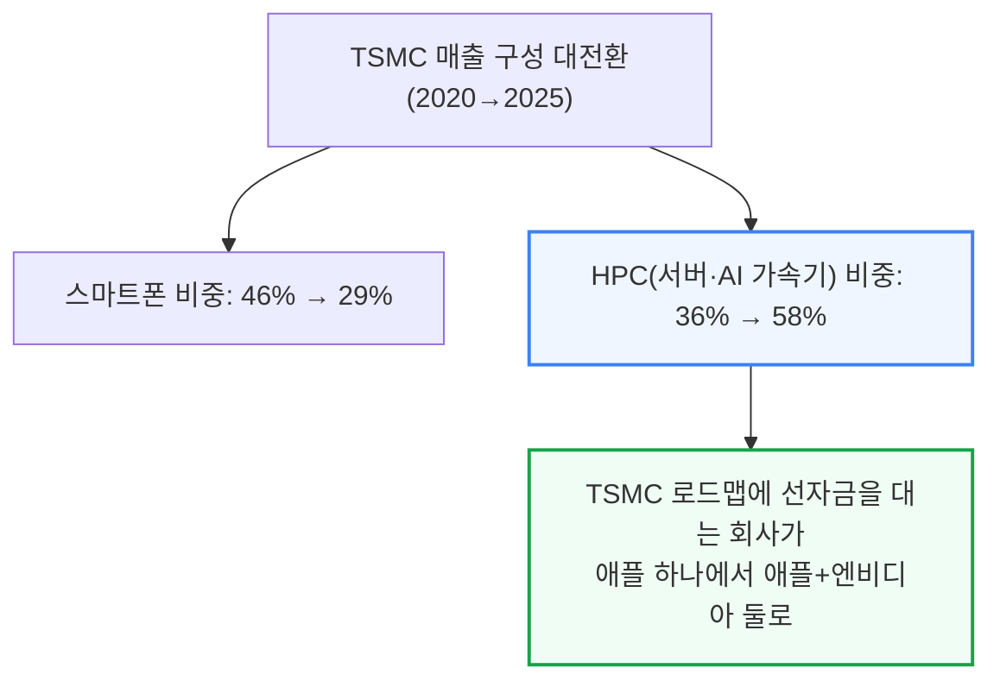

한편 이 플랫폼 전환을 "영구적 밀려남"으로 보는 시각이 많지만, 저자들은 노드 세대에 따라 애플의 위상이 다시 회복된다고 봅니다(자세한 노드별 전망은 14장에서 다룹니다). 애플도 정체된 것은 아닙니다 — N-시리즈·C-시리즈 같은 신규 칩군이 2030년 웨이퍼 수요의 15%를 차지할 전망이고, 아이폰이 애플 웨이퍼 믹스에서 차지하는 비중은 74%에서 57%로 낮아지며 맥·커스텀 칩이 그 자리를 채우고 있습니다(자세한 내용은 15장). 인텔·퀄컴·브로드컴을 밀어내며 아낀 돈은 연 70억 달러+에 달하고(19장), 애플은 지난 10년간 공급망 전반에 3,000억 달러+의 설비투자를 유발했습니다(21장).

---

## 3. 1단계: 자체 칩을 만들기로 한 이유와 구애 (2007\~2014)

**📌 핵심:**
- 2007년 첫 아이폰은 삼성 부품(애플리케이션 프로세서·디스플레이·플래시메모리)에 크게 의존했는데, 삼성이 18개월 뒤 스마트폰 시장에 직접 뛰어들며 갤럭시 S 디자인을 두고 소송전까지 벌어져 애플의 불안이 커짐
- 스티브 잡스는 2008년 자체 칩 설계를 결정 — 이유는 다섯 가지: ① 삼성 경쟁 심화 ② 안드로이드+퀄컴 조합(윈텔 모델의 재현)이 소프트웨어 차별화를 갉아먹을 우려 ③ iOS 전용 최적화로 성능 확보 ④ 얇은 폼팩터에 필요한 와트당 성능 ⑤ 공급사 마진 제거로 수익 확보
- 팹리스(공장 없이 설계만 하는 회사) 방식을 택한 애플은 2008년 P.A. Semi(2억 7,800만 달러)를 인수해 초저전력 설계 엔지니어 150명을 확보했고, 이 중 인텔·IBM 출신 조니 스루지(현재 하드웨어 기술 담당 수석부사장)가 합류
- 결론: 2010\~2014년 "구애" 기간 동안 애플은 삼성 대안으로 글로벌파운드리스·자체 팹까지 검토했지만, 인텔은 물량 대비 마진이 낮다며 거절했고 TSMC의 모리스 창은 이를 성장 기회로 받아들여 20나노 전용 생산라인을 짓기로 함

---

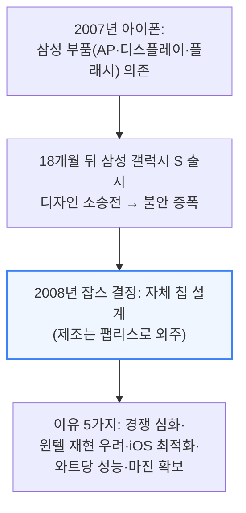

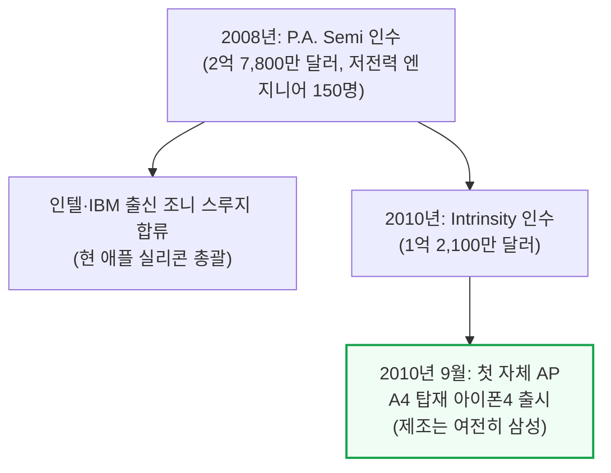

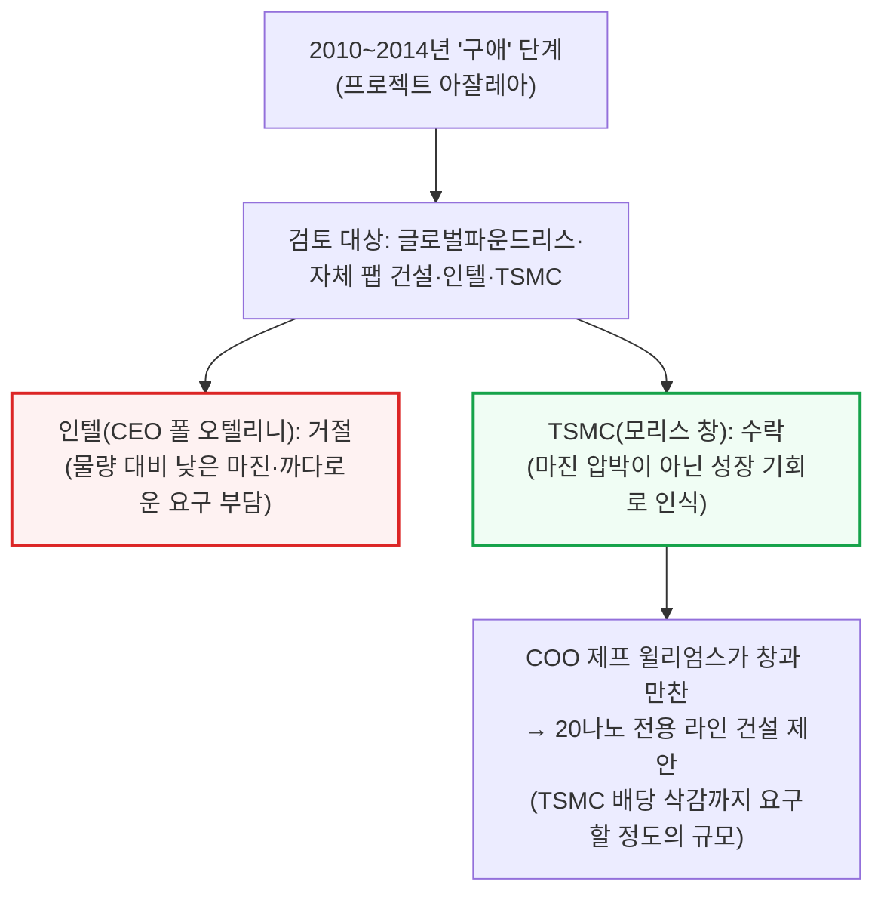

> _"먼저, 만약 우리가 이걸 한다면 더 나은 제품을 만들 수 있는가? 그게 첫 번째 질문이다. 칩에 관한 게 아니다. 애플은 칩 회사가 아니다."_
> — 조니 스루지, 애플 하드웨어 기술 담당 수석부사장

당시 TSMC는 16나노로 투자 우선순위를 옮기던 중이었지만, 애플이 요구한 자본·생산능력 규모는 전례가 없었습니다. TSMC는 부채로 자금을 조달해 이 베팅에 응했고, 결정 당시엔 양쪽 모두에게 성공이 보장된 상태가 아니었습니다.

---

## 4. 2단계: 애플이 TSMC를 만들다 (2014\~2020)

**📌 핵심:**
- 2014년 A8 칩 출시 이후 6년간 애플은 TSMC가 최첨단 공정에 600\~800억 달러를 투자하도록 이끌었음 — 아이폰의 연간 2억 대 기본 물량이 없었다면 TSMC는 인텔·삼성을 따돌린 R&D 속도를 감당하지 못했을 것
- 2015년 14나노 물량을 삼성과 나눠야 했을 때 삼성이 60% 넘는 몫을 가져가 TSMC 경영진이 충격받았지만, TSMC는 곧바로 차세대 10나노 개발을 가속화하며 대응 — "나이트호크(Night Hawk)" 팀이 24시간 매달려 수율 문제를 해결하며 지금까지 이어지는 신뢰를 쌓음
- 2016년 애플이 자금을 댄 InFO(Integrated Fan-Out) 패키징은 더 얇은 폰과 나은 발열 처리를 가능케 했고, 이는 오늘날 AI 가속기를 뒷받침하는 첨단 패키징 생태계의 토대가 됨
- 결론: 팀 쿡은 훗날 모리스 창에게 "인텔은 파운드리 하는 법을 모른다"고 말했는데, 이는 문화 차이를 요약함 — TSMC는 유연성과 헌신으로 애플의 연간 사이클에 로드맵을 맞췄지만, 인텔은 표준화된 제품 방식에 갇혀 있었고 이는 오늘날 인텔 IDM 2.0 전환의 최대 걸림돌로 남아 있음

---

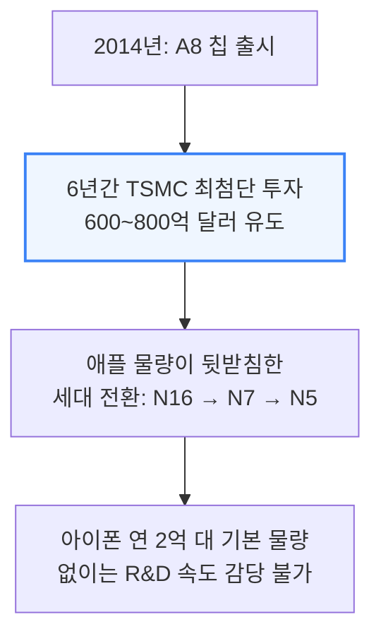

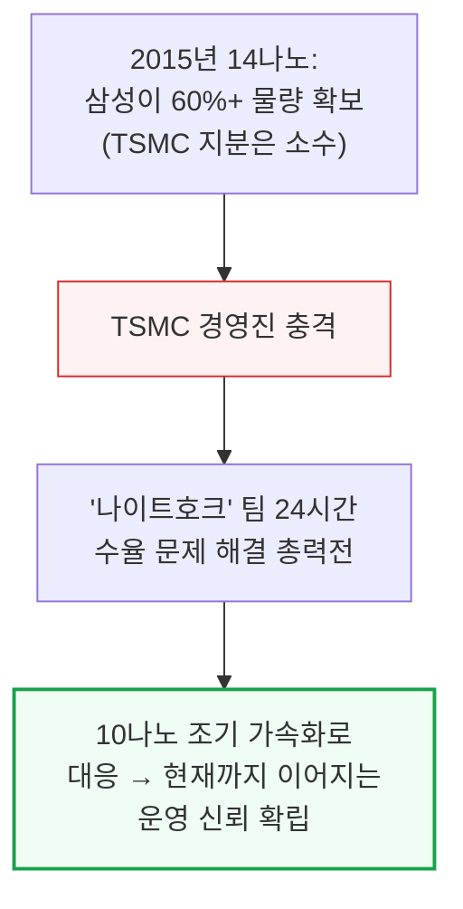

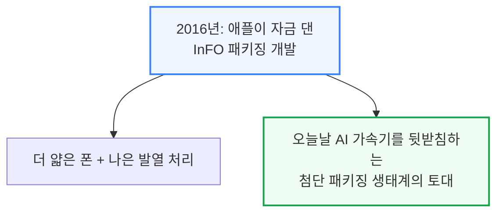

> _"인텔은 파운드리 하는 법을 모른다."_
> — 팀 쿡이 모리스 창에게 (Acquired.fm 인터뷰 중 창의 회고)

애플이 TSMC에 처음 제시한 총마진은 약 40%로 당시 TSMC 평균 마진과 비슷한 수준이었지만, 현재 애플 사업에서 나오는 마진은 이보다 훨씬 높다고 알려져 있습니다. 저자들은 "만약 2014년 애플이 인텔을 택했다면"이란 반사실적 질문도 던집니다 — 인텔은 연 150억 달러+의 확정 파운드리 매출을 얻었을 것이고, 그 매출 없이 TSMC가 지금 같은 지배력에 도달했을 가능성은 낮으며, 인텔 파운드리는 지금보다 10년은 더 성숙했을 것 — 저자들은 이를 "파운드리 역사상 가장 큰 실책"으로 평가합니다.

---

## 5. 3단계: 상호 종속 (2020\~2023)

**📌 핵심:**
- 2020년에 이르자 관계는 "서로 이득"에서 "서로 못 떠남"으로 바뀜 — 애플은 M-시리즈·A-시리즈를 필요한 물량·수율로 만들 수 있는 다른 파운드리가 지구상에 없었고, 삼성의 3나노 수율은 30\~40%로 TSMC의 80%+에 크게 못 미쳤음
- 다른 파운드리로 옮기는 데 드는 재설계·재인증 비용만 20\~50억 달러로 추산됨 — 제품 전환 주기 리스크(아이폰 연례 출시가 휴가철에 맞춰져 있는 것)까지 고려하면 전환 비용은 더 커짐
- TSMC도 애플을 잃을 수 없었음 — 아이폰이 TSMC 총매출의 22\~25%를 차지했고 3나노 생산능력의 70%+를 채웠으며, 애플 주문은 3년 전에 확정돼 TSMC가 유틸리티 회사 수준의 확신으로 설비투자를 계획할 수 있게 함
- 결론: 인텔·삼성으로 옮기면 수율 학습이 따라잡을 때까지 2\~3년간 열등한 제품을 내놓아야 하는 위험이 있어, 양사는 사실상 갈라설 수 없는 관계로 굳어짐

---

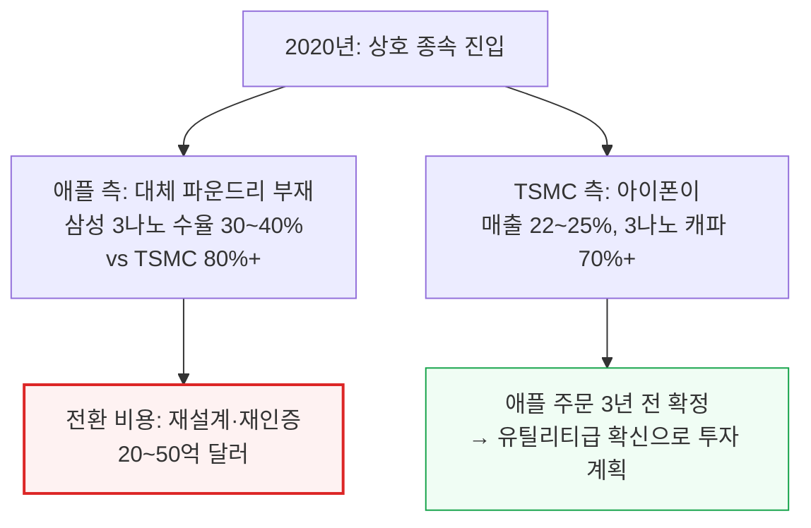

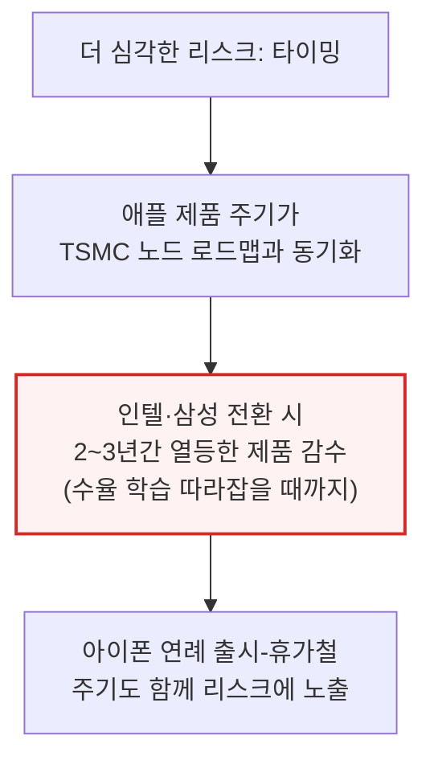

---

## 6. 4단계: 분산된 의존 - 킹메이커는 여전한가 (2023\~현재)

**📌 핵심:**
- 오랫동안 신주(TSMC 본사)와 쿠퍼티노(애플 본사)는 한 팀처럼 무어의 법칙(트랜지스터 밀도가 주기적으로 2배씩 느는 추세)을 밀어붙였음 — 애플의 "원팀" 방식은 수백 명 엔지니어를 TSMC 본사에 상주시켜 사실상 TSMC를 쿠퍼티노의 연장선으로 취급
- 생성형 AI가 TSMC 고객 구성을 바꾸고 있음 — 2020년 1분기 스마트폰이 TSMC 매출의 49%, HPC가 30%였는데 2025년 3분기엔 HPC가 57%로 치솟고 스마트폰은 2위 성장동력으로 밀림
- 애플은 여전히 N2(2나노) 앵커 고객이지만 다른 회사들과 치열하게 경쟁해야 하고, A16(1.6나노)에서는 HPC 업체들이 애플을 앞지를 가능성이 큼(HPC 특화 노드이기 때문) — 자세한 노드별 수치는 14장에서 다룸
- 결론: 애플은 예측 가능한 기준 수요(baseline)로 신공장의 고정비를 정당화하고, 엔비디아는 고마진 상방을 제공하는 구조 — TSMC는 이제 앵커 테넌트를 하나가 아니라 둘 가진 회사가 됨

---

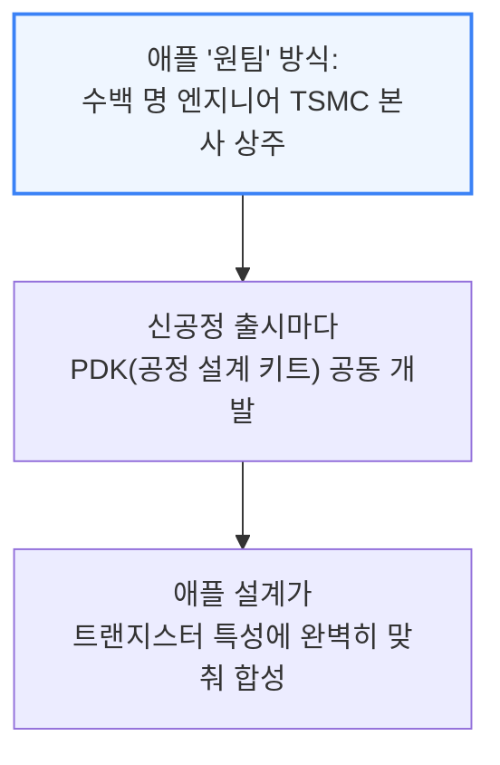

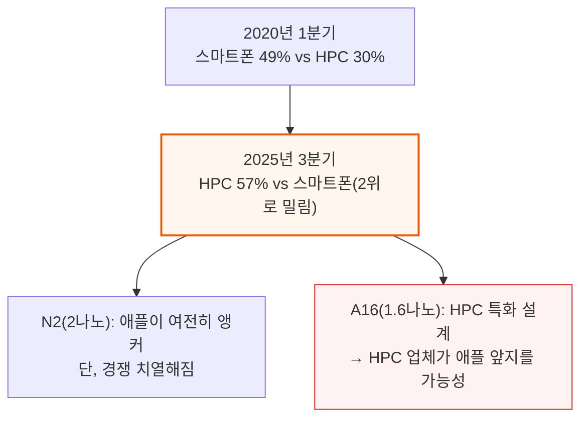

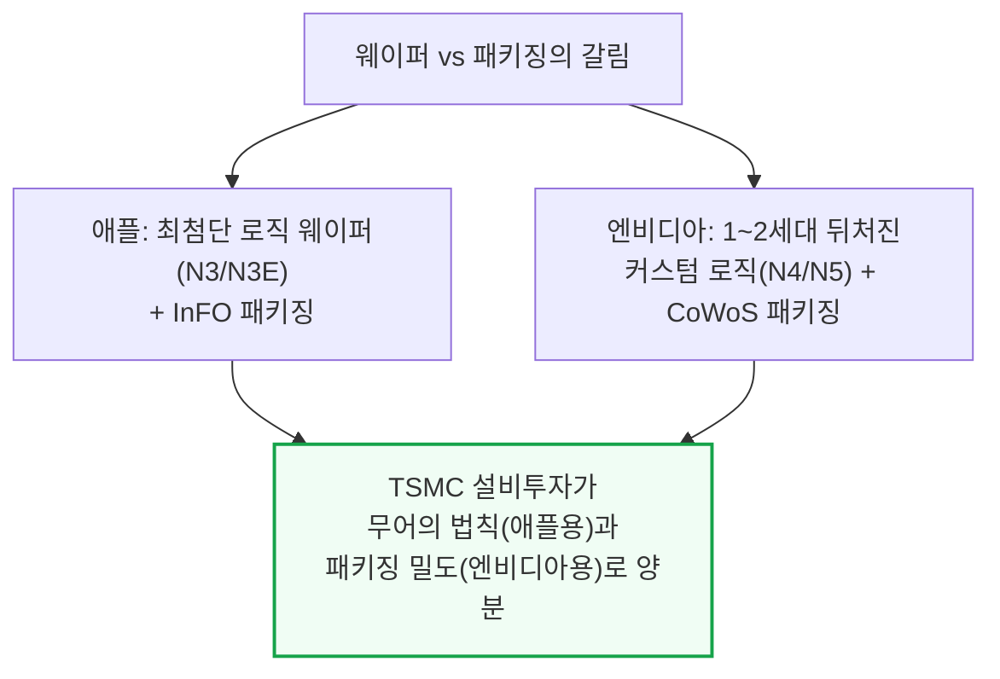

InFO와 CoWoS의 구체적 매출 추이는 18장(패키징 경제학)에서 다룹니다. 요약하면 애플이 만든 InFO는 2018년 6억 달러에서 2025년 84억 달러로 14배 성장했지만, 엔비디아·AMD 수요로 큰 CoWoS가 이를 앞질러 2025년 96억 달러(InFO의 2.5배)에 도달했습니다. 애플과 엔비디아는 오늘은 같은 패키징 라인을 두고 경쟁하지 않지만(애플은 AP3, 엔비디아는 AP5/AP6), M5/M6 울트라가 SoIC·WMCM 같은 3D 패키징을 쓰기 시작하면 AP6·AP7에서 같은 자원을 두고 경쟁하게 될 전망입니다.

---

*작성 진행률: 약 40% 완료 (서론\~4단계)*
*업데이트: 2단계(2014\~2020)·3단계(2020\~2023)·4단계(2023\~현재) 작성 완료*
