# Apple-TSMC: The Partnership That Built Modern Semiconductors

> **출처**: [SemiAnalysis Newsletter](https://newsletter.semianalysis.com/p/apple-tsmc-the-partnership-that-built)
> **저자**: Sravan Kundojjala, Gerald Wong, Dylan Patel, Jeff Koch
> **발행일**: 2026-01-08

---

## 📑 목차

### 전체 섹션
 1. [서론 - 2013년 100억 달러 베팅](#1-서론---2013년-100억-달러-베팅)
 2. [앵커 테넌트 - 애플 없이는 TSMC도 없다](#2-앵커-테넌트---애플-없이는-tsmc도-없다)
 3. [1단계: 자체 칩을 만들기로 한 이유와 구애 (2007\~2014)](#3-1단계-자체-칩을-만들기로-한-이유와-구애-20072014)
 4. [2단계: 애플이 TSMC를 만들다 (2014\~2020)](#4-2단계-애플이-tsmc를-만들다-20142020)
 5. [3단계: 상호 종속 (2020\~2023)](#5-3단계-상호-종속-20202023)
 6. [4단계: 분산된 의존 - 킹메이커는 여전한가 (2023\~현재)](#6-4단계-분산된-의존---킹메이커는-여전한가-2023현재)
 7. [5단계: TSMC를 넘어서 (2027년 이후)](#7-5단계-tsmc를-넘어서-2027년-이후)
 8. [제조 거점 지도 - Fab 18과 첨단 패키징](#8-제조-거점-지도---fab-18과-첨단-패키징)
 9. [지리적 집중 리스크 - 대만 의존](#9-지리적-집중-리스크---대만-의존)
10. [애플의 5대 인수 - 반도체 제국을 만든 거래들](#10-애플의-5대-인수---반도체-제국을-만든-거래들)
11. [글로벌 설계 조직과 DTCO](#11-글로벌-설계-조직과-dtco)
12. [실리콘 성능의 진화 - A/M 시리즈](#12-실리콘-성능의-진화---am-시리즈)
13. [애플 웨이퍼 수요 - 노드·칩·기기별 경제학](#13-애플-웨이퍼-수요---노드칩기기별-경제학)
14. [웨이퍼 수요 예측 (2026\~2030)](#14-웨이퍼-수요-예측-20262030)
15. [칩 시리즈별 분석과 기기 다각화](#15-칩-시리즈별-분석과-기기-다각화)
16. [AI가 애플을 추월하다 - 첨단 공정의 주인이 바뀌다](#16-ai가-애플을-추월하다---첨단-공정의-주인이-바뀌다)
17. [애플이 TSMC를 보조하는 방식 - KGD 모델과 비닝](#17-애플이-tsmc를-보조하는-방식---kgd-모델과-비닝)
18. [패키징 경제학 - InFO vs CoWoS](#18-패키징-경제학---info-vs-cowos)
19. [애플의 원가 절감 - 사내 칩의 수익성](#19-애플의-원가-절감---사내-칩의-수익성)
20. [경쟁사 복제 시도와 애플이 팹을 짓지 않는 이유](#20-경쟁사-복제-시도와-애플이-팹을-짓지-않는-이유)
21. [애플이 만든 산업 - 폭스콘·ASML·TSMC](#21-애플이-만든-산업---폭스콘asmltsmc)
22. [다음 10년 - 엔비디아와의 경쟁, 애리조나 질문](#22-다음-10년---엔비디아와의-경쟁-애리조나-질문)

---

## 🔑 용어 정리

본문을 순서대로 읽기 전에 알아두면 좋은 용어들입니다. 자세한 수치와 설명은 본문에서 처음 등장하는 위치에 나옵니다.

- **앵커 테넌트(Anchor Tenant)**: 새 공장·신규 설비 투자의 위험을 먼저 떠안아주는 대형 고객 — 이 고객의 확정 주문이 있어야 나머지 투자자·고객이 안심하고 뒤따라옴
- **파운드리(Foundry) vs IDM(Integrated Device Manufacturer)**: 파운드리는 설계 없이 남의 칩을 위탁 생산만 하는 회사(TSMC), IDM은 설계부터 생산까지 자체적으로 다 하는 회사(과거 인텔) — 파운드리는 여러 고객의 물량을 모아 한 공장을 계속 채울 수 있어 첨단 공정 투자 회수가 유리함
- **KGD(Known Good Die) 모델**: 새 공정 초기엔 불량률이 높은데, 웨이퍼 전체가 아니라 실제로 정상 작동하는 칩(다이)에 대해서만 값을 치르는 가격 방식 — 불량 비용을 제조사(TSMC)가 떠안는 대신 고객(애플)은 막대한 물량을 확약
- **InFO vs CoWoS**: 둘 다 TSMC의 첨단 패키징(여러 칩·메모리를 하나로 묶는 후공정) 기술 — InFO는 D램을 SoC 위에 쌓아 두께를 줄이는 애플 아이폰용 방식, CoWoS는 HBM 메모리를 GPU 옆에 나란히 놓아 대역폭을 늘리는 엔비디아 AI 칩용 방식
- **DTCO(Design-Technology Co-Optimization)**: 칩을 설계하는 회사(애플)와 공정을 만드는 회사(TSMC)가 트랜지스터 구조 자체를 처음부터 함께 조율하는 협업 방식 — 일반 고객은 완성된 공정에 맞춰 설계만 하지만, 애플은 공정 규격 자체를 TSMC와 같이 정함
- **TSMC 노드 명명법(N-시리즈 vs A-시리즈)**: TSMC가 회사 안에서 실제로 쓰는 세대 명칭 — 예를 들어 N2는 2나노미터급 공정, 그다음 세대인 A16·A14는 나노미터보다 작은 단위(옹스트롬, Å)를 쓴다는 뜻에서 "A"로 표기가 바뀜 (숫자가 작을수록 더 미세한 최신 공정)
- **Fab 18**: 대만 타이난에 있는 TSMC의 최첨단 공장 — 아이폰·맥의 최신 칩(3나노급)이 여기서 나와 사실상 "애플의 공장"으로 불림
- **비닝(Binning)**: 생산 과정에서 일부 회로가 고장 난 칩을 버리지 않고, 고장 난 부분을 끄고 성능을 낮춰 하위 등급 제품으로 재판매하는 방식 — 불량품도 돈이 되게 만드는 수율 관리 기법

---

## 1. 서론 - 2013년 100억 달러 베팅

**📌 핵심:**
- 2013년 TSMC 창업자 모리스 창은 고객 단 하나(애플)를 믿고 20나노미터 공정에 100억 달러를 걸었음 — "회사를 걸었지만 질 거라곤 생각하지 않았다"는 게 창의 회고
- 애플이 TSMC에 쓰는 연간 금액은 2014년 20억 달러에서 2025년 240억 달러로 12년 만에 12배 증가, TSMC 매출에서 차지하는 비중도 9%에서 한때 25%까지 올라갔다가 2025년 20%로 안정
- 애플은 20나노 이후 거의 모든 신규 공정 출시 때 50% 넘는 물량을 가져갔고 일부는 거의 100%에 달해, 사실상 TSMC의 수율 학습 곡선(신공정 초기 불량률을 낮춰가는 과정) 비용을 애플이 대신 치른 셈
- 결론: 이 리포트는 2010년 인텔의 거절부터 시작해 5단계로 이어진 애플-TSMC 관계를 SemiAnalysis의 파운드리 산업 모델과 애플 웨이퍼 수요 모델 데이터로 추적함

---

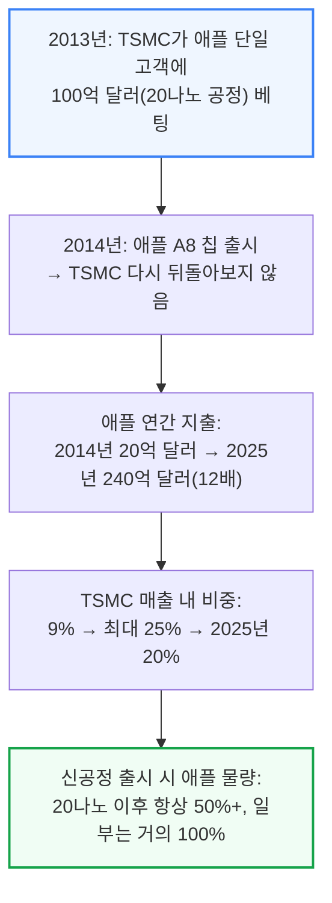
```mermaid
flowchart TD
    Bet["2013년: TSMC가 애플 단일 고객에<br/>100억 달러(20나노 공정) 베팅"] --> A8["2014년: 애플 A8 칩 출시<br/>→ TSMC 다시 뒤돌아보지 않음"]
    A8 --> Growth["애플 연간 지출:<br/>2014년 20억 달러 → 2025년 240억 달러(12배)"]
    Growth --> Share["TSMC 매출 내 비중:<br/>9% → 최대 25% → 2025년 20%"]
    Share --> Node["신공정 출시 시 애플 물량:<br/>20나노 이후 항상 50%+, 일부는 거의 100%"]

    style Bet fill:#eff6ff,stroke:#3b82f6,stroke-width:2px
    style Node fill:#f0fdf4,stroke:#16a34a,stroke-width:2px
```

이 리포트가 다루는 5단계는 다음과 같습니다. 각 단계는 이후 섹션에서 순서대로 자세히 다룹니다.

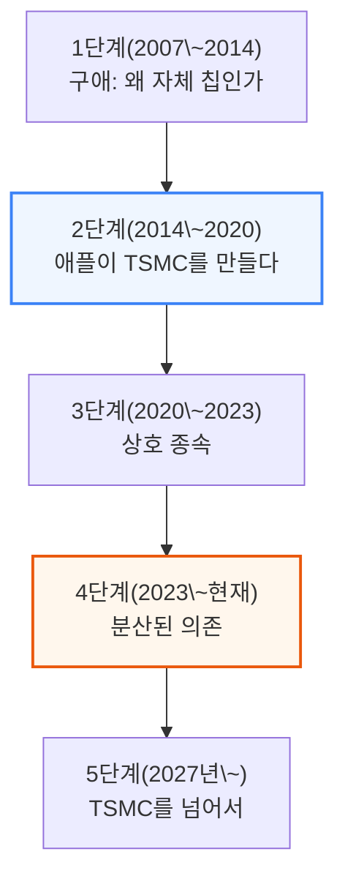
```mermaid
flowchart TD
    P1["1단계(2007\~2014)<br/>구애: 왜 자체 칩인가"] --> P2["2단계(2014\~2020)<br/>애플이 TSMC를 만들다"]
    P2 --> P3["3단계(2020\~2023)<br/>상호 종속"]
    P3 --> P4["4단계(2023\~현재)<br/>분산된 의존"]
    P4 --> P5["5단계(2027년\~)<br/>TSMC를 넘어서"]

    style P2 fill:#eff6ff,stroke:#3b82f6,stroke-width:2px
    style P4 fill:#fff7ed,stroke:#ea580c,stroke-width:2px
```

---

## 2. 앵커 테넌트 - 애플 없이는 TSMC도 없다

**📌 핵심:**
- 애플 효과는 TSMC의 설비 투자(공장·장비 신설 비용) 추이에 그대로 드러남 — 애플 이전(2005\~2009년) 연평균 24억 달러였던 투자가 2019\~2022년에는 4년간 980억 달러로, 그 이전 14년 누적치를 넘어섬
- 애플의 제조 구매 확약(향후 물량을 미리 약속하는 계약) 규모는 2010년 87억 달러에서 2022년 710억 달러로 늘었고, TSMC에 직접 낸 돈은 2013년 거의 0에서 2025년 230억 달러+로 커짐 — 10년 넘게 애플은 최첨단 공정에 선제적으로 자금을 대는 유일한 회사였음
- 2020년대 들어 엔비디아의 AI발 현금 창출력이 커지며 상황이 바뀜 — TSMC 매출 중 HPC(고성능컴퓨팅, 서버·AI 가속기용) 비중이 2020년 36%에서 2025년 58%로, 스마트폰 비중은 46%에서 29%로 뒤집힘
- 결론: 이제 애플과 엔비디아 둘 다 TSMC 로드맵에 선자금을 댈 수 있는 회사가 됨 — TSMC는 앵커 테넌트(신규 투자 위험을 먼저 떠안는 대형 고객)를 하나가 아니라 둘 가진 셈

---

📌 용어 풀이: 앵커 테넌트가 왜 필요한가
> - 첨단 공정 공장 하나를 새로 짓는 데 드는 돈은 수백억 달러 단위 — 이 돈을 갚으려면 공장을 처음부터 가득 채워 돌려야 함
> - 신생 공정은 초기엔 불량률이 높아 이익을 못 냄 — 이 손실을 감수하고도 대량으로 사줄 첫 고객이 없으면 다음 세대 공정 투자 자체가 불가능
> - 애플은 이 역할을 10년 넘게 홀로 맡았고, 이제 엔비디아가 두 번째 앵커 테넌트로 합류

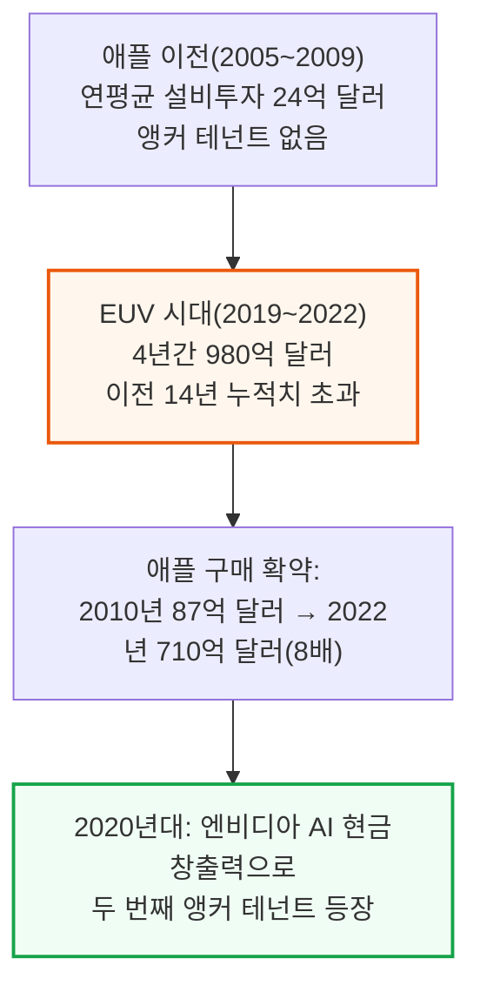
```mermaid
flowchart TD
    Pre["애플 이전(2005~2009)<br/>연평균 설비투자 24억 달러<br/>앵커 테넌트 없음"] --> Post["EUV 시대(2019~2022)<br/>4년간 980억 달러<br/>이전 14년 누적치 초과"]
    Post --> Obl["애플 구매 확약:<br/>2010년 87억 달러 → 2022년 710억 달러(8배)"]
    Obl --> New["2020년대: 엔비디아 AI 현금창출력으로<br/>두 번째 앵커 테넌트 등장"]

    style Post fill:#fff7ed,stroke:#ea580c,stroke-width:2px
    style New fill:#f0fdf4,stroke:#16a34a,stroke-width:2px
```

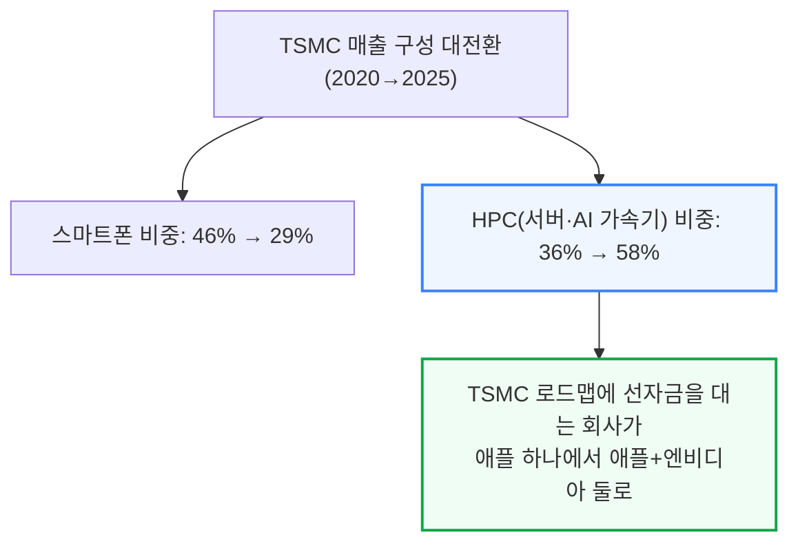
```mermaid
flowchart TD
    Shift["TSMC 매출 구성 대전환(2020→2025)"] --> Smart["스마트폰 비중: 46% → 29%"]
    Shift --> HPC["HPC(서버·AI 가속기) 비중: 36% → 58%"]
    HPC --> Two["TSMC 로드맵에 선자금을 대는 회사가<br/>애플 하나에서 애플+엔비디아 둘로"]

    style HPC fill:#eff6ff,stroke:#3b82f6,stroke-width:2px
    style Two fill:#f0fdf4,stroke:#16a34a,stroke-width:2px
```

한편 이 플랫폼 전환을 "영구적 밀려남"으로 보는 시각이 많지만, 저자들은 노드 세대에 따라 애플의 위상이 다시 회복된다고 봅니다(자세한 노드별 전망은 14장에서 다룹니다).
애플도 정체된 것은 아닙니다 — N-시리즈·C-시리즈 같은 신규 칩군이 2030년 웨이퍼 수요의 15%를 차지할 전망입니다.
아이폰이 애플 웨이퍼 믹스에서 차지하는 비중은 74%에서 57%로 낮아지며 맥·커스텀 칩이 그 자리를 채우고 있습니다(자세한 내용은 15장).
인텔·퀄컴·브로드컴을 밀어내며 아낀 돈은 연 70억 달러+에 달하고(19장), 애플은 지난 10년간 공급망 전반에 3,000억 달러+의 설비투자를 유발했습니다(21장).

---

## 3. 1단계: 자체 칩을 만들기로 한 이유와 구애 (2007\~2014)

**📌 핵심:**
- 2007년 첫 아이폰은 삼성 부품(애플리케이션 프로세서·디스플레이·플래시메모리)에 크게 의존했는데, 삼성이 18개월 뒤 스마트폰 시장에 직접 뛰어들며 갤럭시 S 디자인을 두고 소송전까지 벌어져 애플의 불안이 커짐
- 스티브 잡스는 2008년 자체 칩 설계를 결정 — 이유는 다섯 가지: ① 삼성 경쟁 심화 ② 안드로이드+퀄컴 조합(윈텔 모델의 재현)이 소프트웨어 차별화를 갉아먹을 우려 ③ iOS 전용 최적화로 성능 확보 ④ 얇은 폼팩터에 필요한 와트당 성능 ⑤ 공급사 마진 제거로 수익 확보
- 팹리스(공장 없이 설계만 하는 회사) 방식을 택한 애플은 2008년 P.A. Semi(2억 7,800만 달러)를 인수해 초저전력 설계 엔지니어 150명을 확보했고, 이 중 인텔·IBM 출신 조니 스루지(현재 하드웨어 기술 담당 수석부사장)가 합류
- 결론: 2010\~2014년 "구애" 기간 동안 애플은 삼성 대안으로 글로벌파운드리스·자체 팹까지 검토했지만, 인텔은 물량 대비 마진이 낮다며 거절했고 TSMC의 모리스 창은 이를 성장 기회로 받아들여 20나노 전용 생산라인을 짓기로 함

---

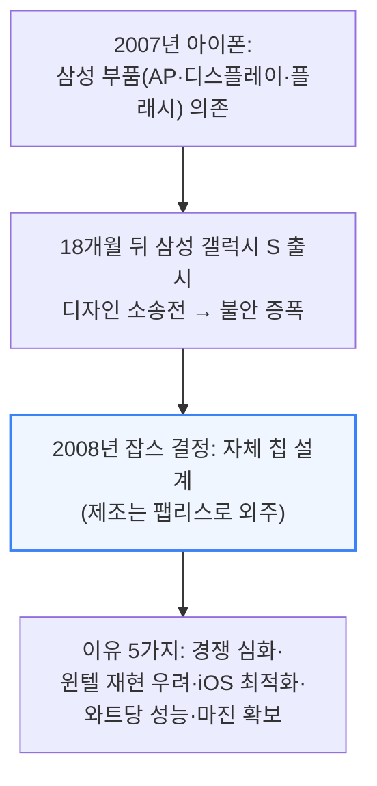
```mermaid
flowchart TD
    Iphone2007["2007년 아이폰:<br/>삼성 부품(AP·디스플레이·플래시) 의존"] --> Rival["18개월 뒤 삼성 갤럭시 S 출시<br/>디자인 소송전 → 불안 증폭"]
    Rival --> Jobs["2008년 잡스 결정: 자체 칩 설계<br/>(제조는 팹리스로 외주)"]
    Jobs --> Reasons["이유 5가지: 경쟁 심화·<br/>윈텔 재현 우려·iOS 최적화·<br/>와트당 성능·마진 확보"]

    style Jobs fill:#eff6ff,stroke:#3b82f6,stroke-width:2px
```

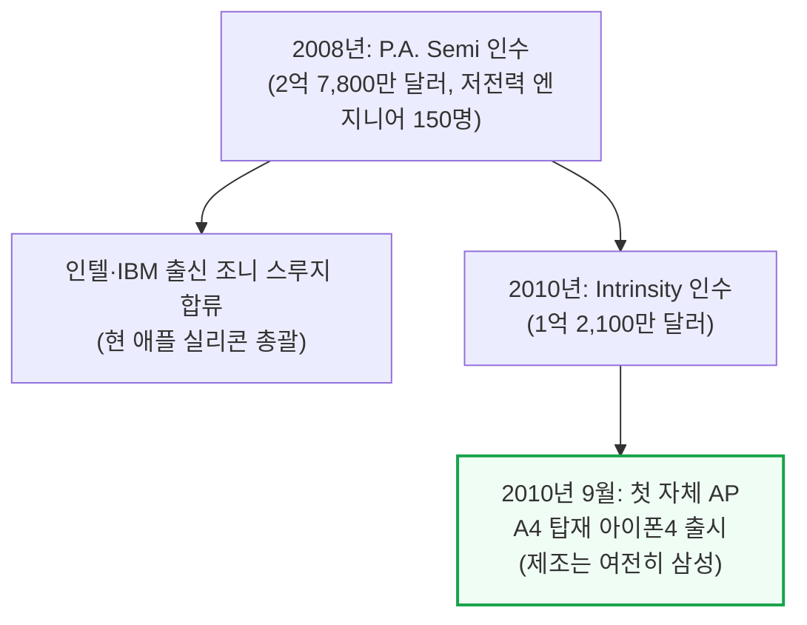
```mermaid
flowchart TD
    PASemi["2008년: P.A. Semi 인수<br/>(2억 7,800만 달러, 저전력 엔지니어 150명)"] --> Srouji["인텔·IBM 출신 조니 스루지 합류<br/>(현 애플 실리콘 총괄)"]
    PASemi --> Intrinsity["2010년: Intrinsity 인수<br/>(1억 2,100만 달러)"]
    Intrinsity --> A4["2010년 9월: 첫 자체 AP<br/>A4 탑재 아이폰4 출시<br/>(제조는 여전히 삼성)"]

    style A4 fill:#f0fdf4,stroke:#16a34a,stroke-width:2px
```

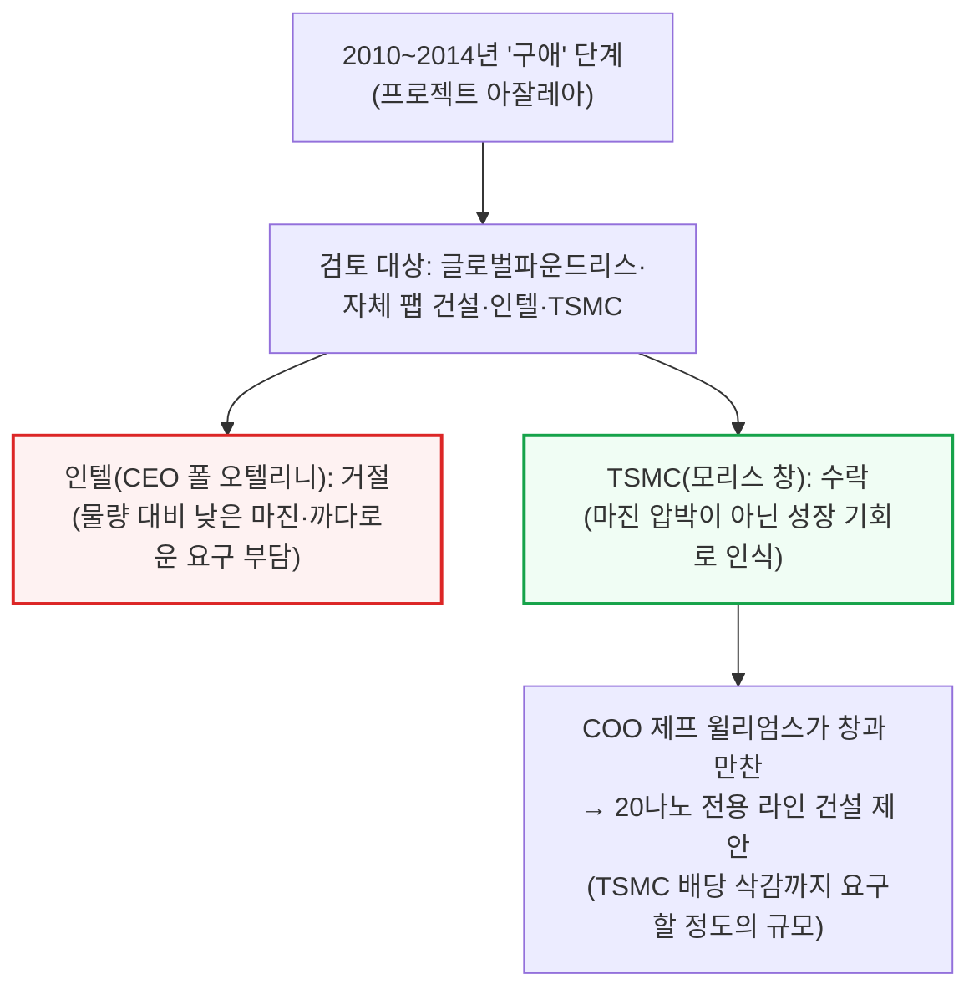
```mermaid
flowchart TD
    Courtship["2010~2014년 '구애' 단계<br/>(프로젝트 아잘레아)"] --> Options["검토 대상: 글로벌파운드리스·<br/>자체 팹 건설·인텔·TSMC"]
    Options --> Intel["인텔(CEO 폴 오텔리니): 거절<br/>(물량 대비 낮은 마진·까다로운 요구 부담)"]
    Options --> TSMC["TSMC(모리스 창): 수락<br/>(마진 압박이 아닌 성장 기회로 인식)"]
    TSMC --> Dinner["COO 제프 윌리엄스가 창과 만찬<br/>→ 20나노 전용 라인 건설 제안<br/>(TSMC 배당 삭감까지 요구할 정도의 규모)"]

    style Intel fill:#fef2f2,stroke:#dc2626,stroke-width:2px
    style TSMC fill:#f0fdf4,stroke:#16a34a,stroke-width:2px
```

> _"먼저, 만약 우리가 이걸 한다면 더 나은 제품을 만들 수 있는가? 그게 첫 번째 질문이다. 칩에 관한 게 아니다. 애플은 칩 회사가 아니다."_
> — 조니 스루지, 애플 하드웨어 기술 담당 수석부사장

당시 TSMC는 16나노로 투자 우선순위를 옮기던 중이었지만, 애플이 요구한 자본·생산능력 규모는 전례가 없었습니다. TSMC는 부채로 자금을 조달해 이 베팅에 응했고, 결정 당시엔 양쪽 모두에게 성공이 보장된 상태가 아니었습니다.

---

## 4. 2단계: 애플이 TSMC를 만들다 (2014\~2020)

**📌 핵심:**
- 2014년 A8 칩 출시 이후 6년간 애플은 TSMC가 최첨단 공정에 600\~800억 달러를 투자하도록 이끌었음 — 아이폰의 연간 2억 대 기본 물량이 없었다면 TSMC는 인텔·삼성을 따돌린 R&D 속도를 감당하지 못했을 것
- 2015년 14나노 물량을 삼성과 나눠야 했을 때 삼성이 60% 넘는 몫을 가져가 TSMC 경영진이 충격받았지만, TSMC는 곧바로 차세대 10나노 개발을 가속화하며 대응 — "나이트호크(Night Hawk)" 팀이 24시간 매달려 수율 문제를 해결하며 지금까지 이어지는 신뢰를 쌓음
- 2016년 애플이 자금을 댄 InFO(Integrated Fan-Out) 패키징은 더 얇은 폰과 나은 발열 처리를 가능케 했고, 이는 오늘날 AI 가속기를 뒷받침하는 첨단 패키징 생태계의 토대가 됨
- 결론: 팀 쿡은 훗날 모리스 창에게 "인텔은 파운드리 하는 법을 모른다"고 말했는데, 이는 문화 차이를 요약함 — TSMC는 유연성과 헌신으로 애플의 연간 사이클에 로드맵을 맞췄지만, 인텔은 표준화된 제품 방식에 갇혀 있었고 이는 오늘날 인텔 IDM 2.0 전환의 최대 걸림돌로 남아 있음

---

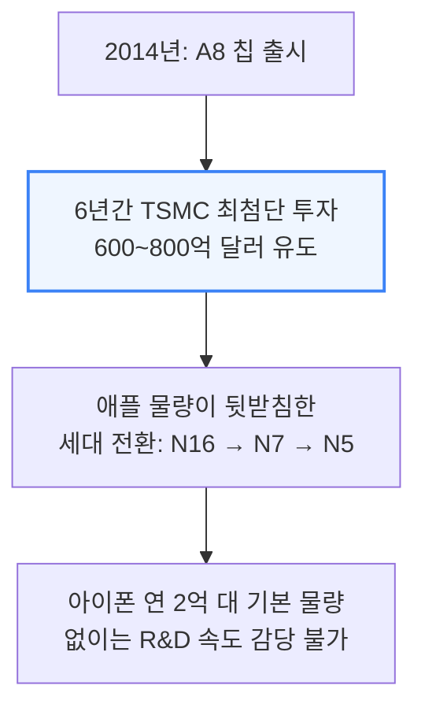
```mermaid
flowchart TD
    A8["2014년: A8 칩 출시"] --> Invest["6년간 TSMC 최첨단 투자<br/>600~800억 달러 유도"]
    Invest --> Nodes["애플 물량이 뒷받침한<br/>세대 전환: N16 → N7 → N5"]
    Nodes --> RD["아이폰 연 2억 대 기본 물량<br/>없이는 R&D 속도 감당 불가"]

    style Invest fill:#eff6ff,stroke:#3b82f6,stroke-width:2px
```

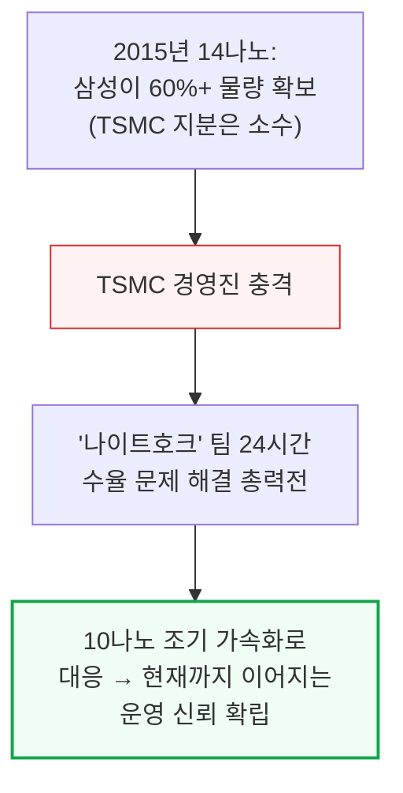
```mermaid
flowchart TD
    Share2015["2015년 14나노:<br/>삼성이 60%+ 물량 확보<br/>(TSMC 지분은 소수)"] --> Shock["TSMC 경영진 충격"]
    Shock --> Nightwork["'나이트호크' 팀 24시간<br/>수율 문제 해결 총력전"]
    Nightwork --> Trust["10나노 조기 가속화로<br/>대응 → 현재까지 이어지는<br/>운영 신뢰 확립"]

    style Shock fill:#fef2f2,stroke:#dc2626
    style Trust fill:#f0fdf4,stroke:#16a34a,stroke-width:2px
```

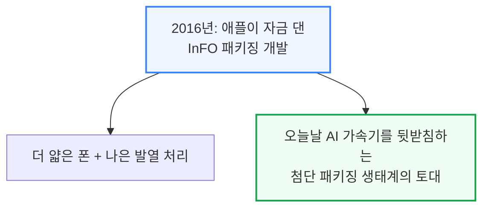
```mermaid
flowchart TD
    InFO["2016년: 애플이 자금 댄<br/>InFO 패키징 개발"] --> Thin["더 얇은 폰 + 나은 발열 처리"]
    InFO --> Foundation["오늘날 AI 가속기를 뒷받침하는<br/>첨단 패키징 생태계의 토대"]

    style InFO fill:#eff6ff,stroke:#3b82f6,stroke-width:2px
    style Foundation fill:#f0fdf4,stroke:#16a34a,stroke-width:2px
```

> _"인텔은 파운드리 하는 법을 모른다."_
> — 팀 쿡이 모리스 창에게 (Acquired.fm 인터뷰 중 창의 회고)

애플이 TSMC에 처음 제시한 총마진은 약 40%로 당시 TSMC 평균 마진과 비슷한 수준이었지만, 현재 애플 사업에서 나오는 마진은 이보다 훨씬 높다고 알려져 있습니다.
저자들은 "만약 2014년 애플이 인텔을 택했다면"이란 반사실적 질문도 던집니다 — 인텔은 연 150억 달러+의 확정 파운드리 매출을 얻었을 것이고, 그 매출 없이 TSMC가 지금 같은 지배력에 도달했을 가능성은 낮습니다.
인텔 파운드리는 지금보다 10년은 더 성숙했을 것 — 저자들은 이를 "파운드리 역사상 가장 큰 실책"으로 평가합니다.

---

## 5. 3단계: 상호 종속 (2020\~2023)

**📌 핵심:**
- 2020년에 이르자 관계는 "서로 이득"에서 "서로 못 떠남"으로 바뀜 — 애플은 M-시리즈·A-시리즈를 필요한 물량·수율로 만들 수 있는 다른 파운드리가 지구상에 없었고, 삼성의 3나노 수율은 30\~40%로 TSMC의 80%+에 크게 못 미쳤음
- 다른 파운드리로 옮기는 데 드는 재설계·재인증 비용만 20\~50억 달러로 추산됨 — 제품 전환 주기 리스크(아이폰 연례 출시가 휴가철에 맞춰져 있는 것)까지 고려하면 전환 비용은 더 커짐
- TSMC도 애플을 잃을 수 없었음 — 아이폰이 TSMC 총매출의 22\~25%를 차지했고 3나노 생산능력의 70%+를 채웠으며, 애플 주문은 3년 전에 확정돼 TSMC가 유틸리티 회사 수준의 확신으로 설비투자를 계획할 수 있게 함
- 결론: 인텔·삼성으로 옮기면 수율 학습이 따라잡을 때까지 2\~3년간 열등한 제품을 내놓아야 하는 위험이 있어, 양사는 사실상 갈라설 수 없는 관계로 굳어짐

---

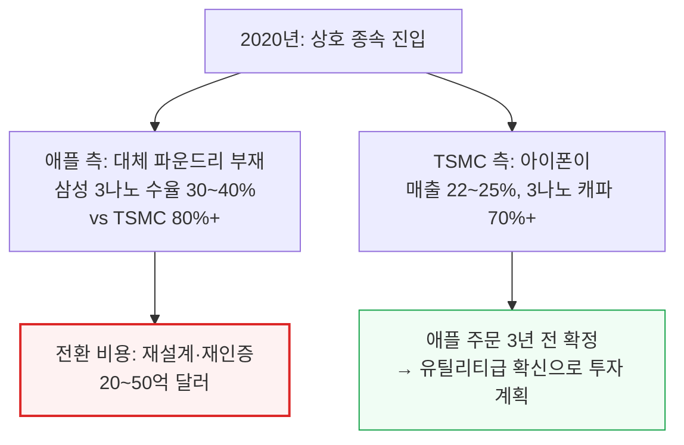
```mermaid
flowchart TD
    LockIn["2020년: 상호 종속 진입"] --> AppleSide["애플 측: 대체 파운드리 부재<br/>삼성 3나노 수율 30~40%<br/>vs TSMC 80%+"]
    LockIn --> TSMCSide["TSMC 측: 아이폰이<br/>매출 22~25%, 3나노 캐파 70%+"]
    AppleSide --> Cost["전환 비용: 재설계·재인증<br/>20~50억 달러"]
    TSMCSide --> Plan["애플 주문 3년 전 확정<br/>→ 유틸리티급 확신으로 투자 계획"]

    style Cost fill:#fef2f2,stroke:#dc2626,stroke-width:2px
    style Plan fill:#f0fdf4,stroke:#16a34a
```

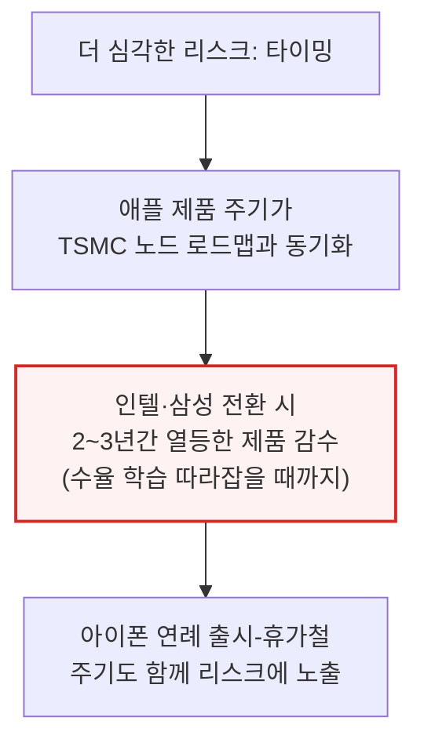
```mermaid
flowchart TD
    Timing["더 심각한 리스크: 타이밍"] --> Sync["애플 제품 주기가<br/>TSMC 노드 로드맵과 동기화"]
    Sync --> Switch["인텔·삼성 전환 시<br/>2~3년간 열등한 제품 감수<br/>(수율 학습 따라잡을 때까지)"]
    Switch --> Holiday["아이폰 연례 출시-휴가철<br/>주기도 함께 리스크에 노출"]

    style Switch fill:#fef2f2,stroke:#dc2626,stroke-width:2px
```

---

## 6. 4단계: 분산된 의존 - 킹메이커는 여전한가 (2023\~현재)

**📌 핵심:**
- 오랫동안 신주(TSMC 본사)와 쿠퍼티노(애플 본사)는 한 팀처럼 무어의 법칙(트랜지스터 밀도가 주기적으로 2배씩 느는 추세)을 밀어붙였음 — 애플의 "원팀" 방식은 수백 명 엔지니어를 TSMC 본사에 상주시켜 사실상 TSMC를 쿠퍼티노의 연장선으로 취급
- 생성형 AI가 TSMC 고객 구성을 바꾸고 있음 — 2020년 1분기 스마트폰이 TSMC 매출의 49%, HPC가 30%였는데 2025년 3분기엔 HPC가 57%로 치솟고 스마트폰은 2위 성장동력으로 밀림
- 애플은 여전히 N2(2나노) 앵커 고객이지만 다른 회사들과 치열하게 경쟁해야 하고, A16(1.6나노)에서는 HPC 업체들이 애플을 앞지를 가능성이 큼(HPC 특화 노드이기 때문) — 자세한 노드별 수치는 14장에서 다룸
- 결론: 애플은 예측 가능한 기준 수요(baseline)로 신공장의 고정비를 정당화하고, 엔비디아는 고마진 상방을 제공하는 구조 — TSMC는 이제 앵커 테넌트를 하나가 아니라 둘 가진 회사가 됨

---

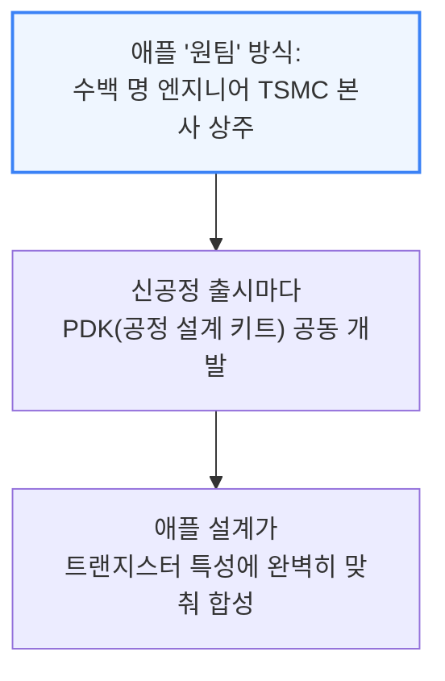
```mermaid
flowchart TD
    OneTeam["애플 '원팀' 방식:<br/>수백 명 엔지니어 TSMC 본사 상주"] --> PDK["신공정 출시마다<br/>PDK(공정 설계 키트) 공동 개발"]
    PDK --> Sync["애플 설계가<br/>트랜지스터 특성에 완벽히 맞춰 합성"]

    style OneTeam fill:#eff6ff,stroke:#3b82f6,stroke-width:2px
```

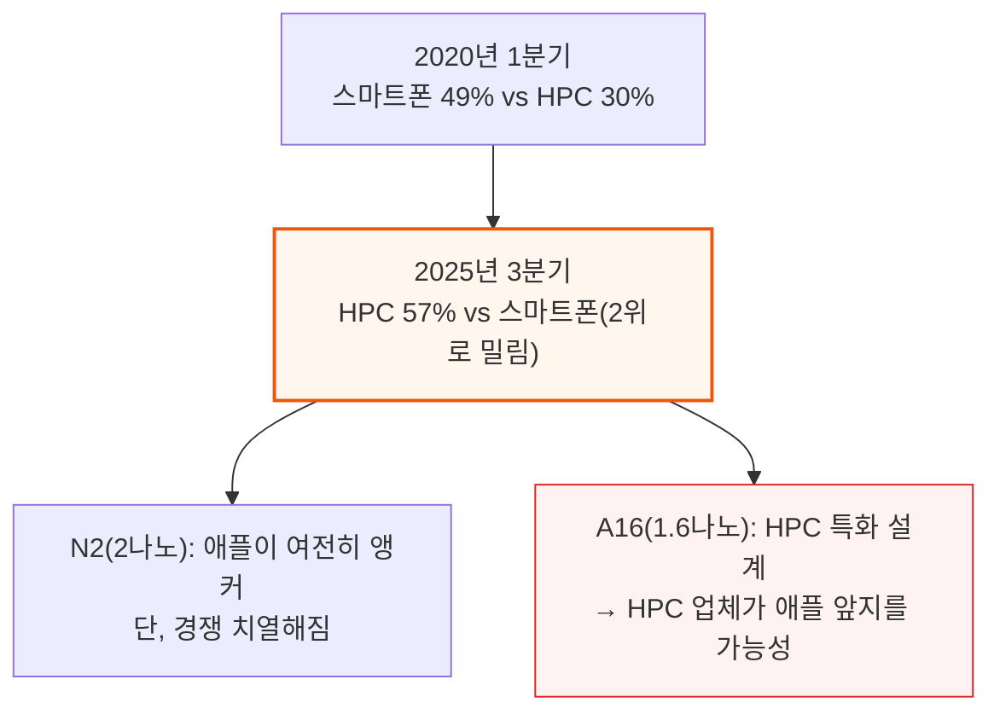
```mermaid
flowchart TD
    Q2020["2020년 1분기<br/>스마트폰 49% vs HPC 30%"] --> Q2025["2025년 3분기<br/>HPC 57% vs 스마트폰(2위로 밀림)"]
    Q2025 --> N2["N2(2나노): 애플이 여전히 앵커<br/>단, 경쟁 치열해짐"]
    Q2025 --> A16["A16(1.6나노): HPC 특화 설계<br/>→ HPC 업체가 애플 앞지를 가능성"]

    style Q2025 fill:#fff7ed,stroke:#ea580c,stroke-width:2px
    style A16 fill:#fef2f2,stroke:#dc2626
```

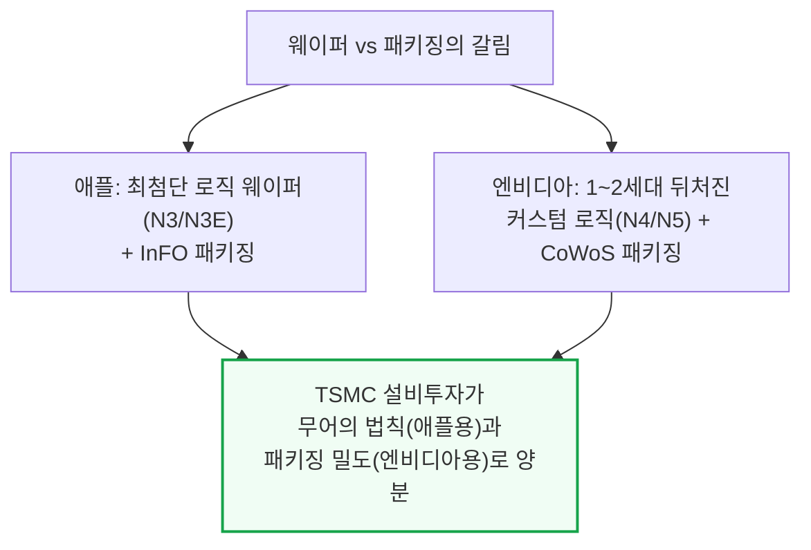
```mermaid
flowchart TD
    Divergence["웨이퍼 vs 패키징의 갈림"] --> AppleBuy["애플: 최첨단 로직 웨이퍼(N3/N3E)<br/>+ InFO 패키징"]
    Divergence --> NvidiaBuy["엔비디아: 1~2세대 뒤처진<br/>커스텀 로직(N4/N5) + CoWoS 패키징"]
    AppleBuy --> TwoAnchor["TSMC 설비투자가<br/>무어의 법칙(애플용)과<br/>패키징 밀도(엔비디아용)로 양분"]
    NvidiaBuy --> TwoAnchor

    style TwoAnchor fill:#f0fdf4,stroke:#16a34a,stroke-width:2px
```

InFO와 CoWoS의 구체적 매출 추이는 18장(패키징 경제학)에서 다룹니다.
요약하면 애플이 만든 InFO는 2018년 6억 달러에서 2025년 84억 달러로 14배 성장했지만, 엔비디아·AMD 수요로 큰 CoWoS가 이를 앞질러 2025년 96억 달러(InFO의 2.5배)에 도달했습니다.
애플과 엔비디아는 오늘은 같은 패키징 라인을 두고 경쟁하지 않지만(애플은 AP3, 엔비디아는 AP5/AP6), M5/M6 울트라가 SoIC·WMCM 같은 3D 패키징을 쓰기 시작하면 AP6·AP7에서 같은 자원을 두고 경쟁하게 될 전망입니다.

---

## 7. 5단계: TSMC를 넘어서 (2027년 이후)

**📌 핵심:**
- 애플은 실제로 대안을 찾고 있음 — 인텔의 18A-P 공정(2026년 말 출하)은 2016년 삼성을 떠난 이후 처음으로 이론상 실현 가능한 대안으로, 애플이 저위험 제품(기본형 M-시리즈)부터 검증해볼 만한 후보
- 기본형 M-시리즈 웨이퍼의 20%를 인텔로 옮긴다고 가정하면 다이당 평균판매가(ASP) 1만 8,000달러 기준 인텔에 6억 3,000만 달러의 파운드리 매출을 안겨줄 수 있음 — 기본형 M-시리즈 다이 크기(150\~170mm²)는 현재 팬서레이크 실적 기준 70%+ 수율이 가능할 것으로 추정
- 애플의 실제 다변화 전략은 첨단 A/M-시리즈를 옮기는 게 아니라 PMIC(전력관리반도체)·디스플레이 드라이버·오디오·연결성 칩 같은 주변부 제품에 집중 — 2016년 삼성을 떠난 뒤 처음으로 삼성 파운드리와 재접촉해 이미지센서(CIS)를 텍사스 오스틴 공장에서 생산하는 전략적 계약도 체결
- 결론: 인텔은 2014년에도 애플을 놓쳤던 전례가 있고, "문이 완전히 닫히진 않았다"는 게 저자들 평가 — 애플이 실제로 인텔을 쓸지는 여전히 열린 질문

---

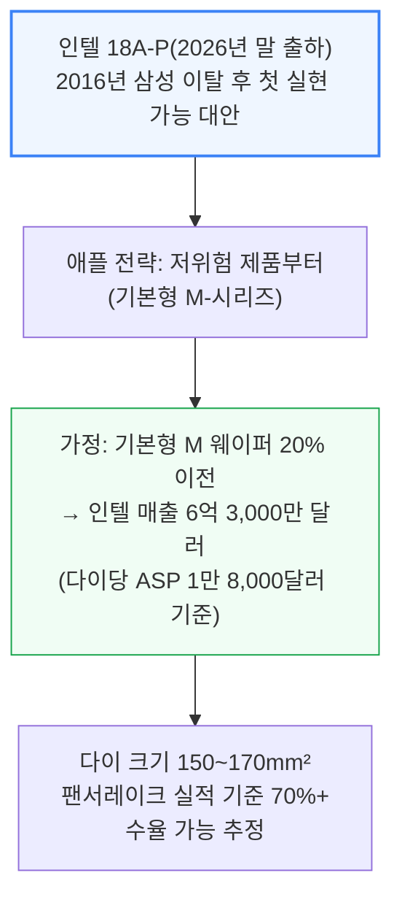
```mermaid
flowchart TD
    Intel18A["인텔 18A-P(2026년 말 출하)<br/>2016년 삼성 이탈 후 첫 실현 가능 대안"] --> LowRisk["애플 전략: 저위험 제품부터<br/>(기본형 M-시리즈)"]
    LowRisk --> Revenue["가정: 기본형 M 웨이퍼 20% 이전<br/>→ 인텔 매출 6억 3,000만 달러<br/>(다이당 ASP 1만 8,000달러 기준)"]
    Revenue --> Yield["다이 크기 150~170mm²<br/>팬서레이크 실적 기준 70%+<br/>수율 가능 추정"]

    style Intel18A fill:#eff6ff,stroke:#3b82f6,stroke-width:2px
    style Revenue fill:#f0fdf4,stroke:#16a34a
```

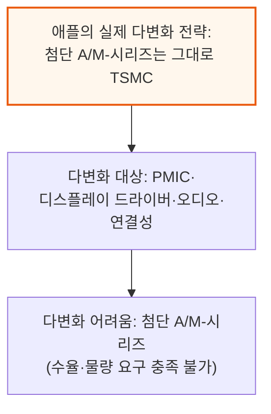
```mermaid
flowchart TD
    Real["애플의 실제 다변화 전략:<br/>첨단 A/M-시리즈는 그대로 TSMC"] --> Where["다변화 대상: PMIC·<br/>디스플레이 드라이버·오디오·연결성"]
    Where --> Hard["다변화 어려움: 첨단 A/M-시리즈<br/>(수율·물량 요구 충족 불가)"]

    style Real fill:#fff7ed,stroke:#ea580c,stroke-width:2px
```

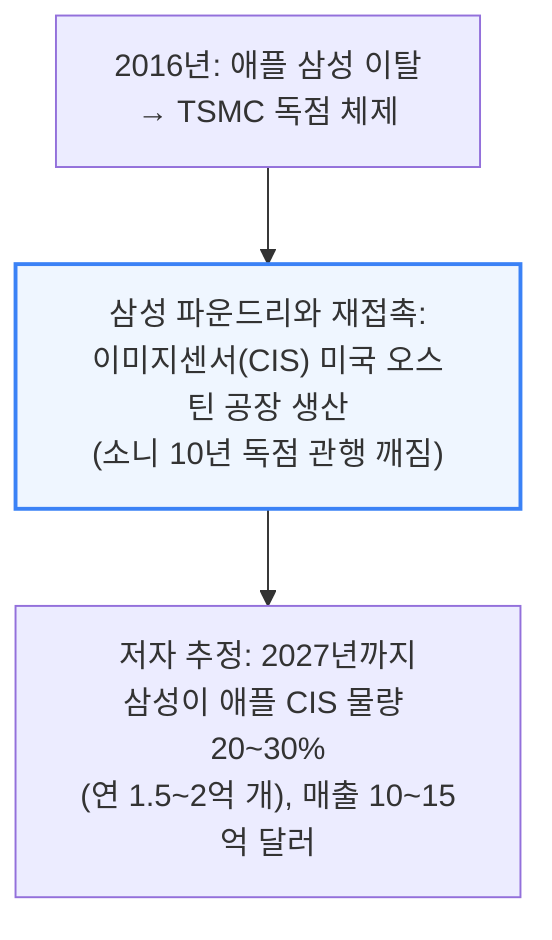
```mermaid
flowchart TD
    Samsung2016["2016년: 애플 삼성 이탈<br/>→ TSMC 독점 체제"] --> CIS["삼성 파운드리와 재접촉:<br/>이미지센서(CIS) 미국 오스틴 공장 생산<br/>(소니 10년 독점 관행 깨짐)"]
    CIS --> Estimate["저자 추정: 2027년까지<br/>삼성이 애플 CIS 물량 20~30%<br/>(연 1.5~2억 개), 매출 10~15억 달러"]

    style CIS fill:#eff6ff,stroke:#3b82f6,stroke-width:2px
```

인텔 18A-P는 백사이드 전력 공급(PowerVia)을 갖춰 18A 대비 와트당 성능 8% 개선을 제공합니다. 이 밖에 저위험 후보로 인텔16(구세대 성숙 공정, 아일랜드 팹)이 있지만 저자들은 애플 물량을 감당할 캐파는 부족하다고 봅니다 — Wi-Fi/블루투스, 디스플레이 드라이버, 전력관리 같은 더 작은 칩 정도가 현실적 후보입니다.

---

## 8. 제조 거점 지도 - Fab 18과 첨단 패키징

**📌 핵심:**
- TSMC는 노드·패키징별로 특화된 여러 GigaFab(초대형 공장)에서 연간 10억 개 넘는 애플 칩을 생산 — 애플 공급망은 대만 서부 회랑에 깊이 뿌리내려 있지만, 지정학적 위험 분산 목적으로 애리조나 확장이 진행 중(자세한 내용은 22장)
- 애플은 InFO-PoP(D램을 SoC 위에 쌓아 두께를 최소화하는 패키지온패키지 방식)를 쓰는 반면, 엔비디아는 HBM을 GPU 옆에 나란히 두는 CoWoS를 씀 — 이 기술 차이가 애플이 삼성을 떠난 결정적 이유 중 하나(더 얇은 폰·나은 발열)
- 대만 타이난의 Fab 18은 TSMC의 최첨단 생산 거점이자 사실상 "애플의 공장" — A19 Pro, A18 Pro, M3, M4, M5가 모두 이곳 3나노 라인에서 나옴
- 결론: 남대만 한 지역에 생산이 집중된 것은 애플 공급망의 핵심 지정학적 취약점 — 애플은 AP3(InFO) 라인을 지배하고 엔비디아는 AP5/AP6(CoWoS)를 두고 경쟁 중이지만, M5/M6 울트라가 SoIC·WMCM 3D 패키징을 도입하면 AP6·AP7에서 자원 경쟁이 벌어질 전망

---

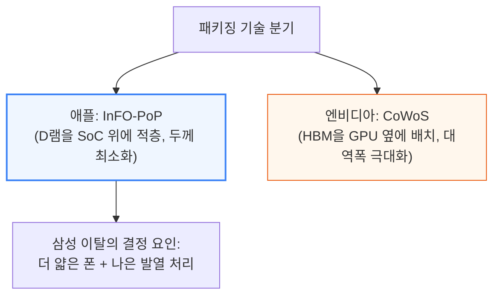
```mermaid
flowchart TD
    Pkg["패키징 기술 분기"] --> AppleP["애플: InFO-PoP<br/>(D램을 SoC 위에 적층, 두께 최소화)"]
    Pkg --> NvidiaP["엔비디아: CoWoS<br/>(HBM을 GPU 옆에 배치, 대역폭 극대화)"]
    AppleP --> Reason["삼성 이탈의 결정 요인:<br/>더 얇은 폰 + 나은 발열 처리"]

    style AppleP fill:#eff6ff,stroke:#3b82f6,stroke-width:2px
    style NvidiaP fill:#fff7ed,stroke:#ea580c
```

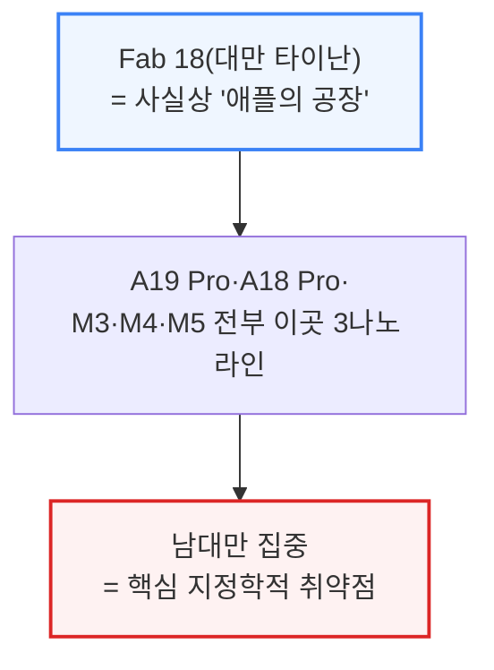
```mermaid
flowchart TD
    Fab18["Fab 18(대만 타이난)<br/>= 사실상 '애플의 공장'"] --> Chips["A19 Pro·A18 Pro·<br/>M3·M4·M5 전부 이곳 3나노 라인"]
    Chips --> Risk["남대만 집중<br/>= 핵심 지정학적 취약점"]

    style Fab18 fill:#eff6ff,stroke:#3b82f6,stroke-width:2px
    style Risk fill:#fef2f2,stroke:#dc2626,stroke-width:2px
```

```mermaid
flowchart TD
    Today["오늘: 애플·엔비디아<br/>같은 패키징 라인 두고<br/>경쟁하지 않음"] --> AP3["애플: AP3(InFO) 지배"]
    Today --> AP56["엔비디아: AP5/AP6(CoWoS) 경쟁"]
    AP3 --> Future["M5/M6 울트라의 SoIC·WMCM 도입<br/>→ AP6/AP7 자원 경쟁 시작 전망"]
    AP56 --> Future

    style Future fill:#fff7ed,stroke:#ea580c,stroke-width:2px
```

---

## 9. 지리적 집중 리스크 - 대만 의존

**📌 핵심:**
- 애플의 대만 집중은 방 안의 코끼리(모두가 알지만 말 안 하는 문제) — 첨단 A-시리즈·M-시리즈 칩 거의 전량이 중국 본토에서 100마일 떨어진 섬 하나에서 만들어짐
- TSMC 애리조나는 명목상의 다변화 수단일 뿐, 현재 증설 속도로는 2028년 이전엔 대만 의존도를 유의미하게 낮추지 못함 — 현재 최첨단 생산의 5% 미만이 애리조나산
- 이 비중이 2028년까지 10\~15%로 오르면 애플이 대만 리스크를 실제로 심각하게 여기고 있다는 신호로 해석 가능하지만, 5%에 머문다면 애리조나는 순수한 보험 성격에 그친다는 게 저자들 판단
- 결론: 대만 집중은 단기간에 해소될 문제가 아니며, 애리조나 확장 속도 자체가 애플의 위기 인식을 가늠하는 지표가 됨(애리조나 원가 구조는 22장에서 상세히 다룸)

---

```mermaid
flowchart TD
    Concentration["애플 첨단 칩 생산:<br/>거의 전량 대만 단일 섬<br/>(중국 본토서 100마일)"] --> Arizona["TSMC 애리조나:<br/>현재 최첨단 생산의 5% 미만"]
    Arizona --> Signal2028["2028년까지 10~15%로 상승<br/>→ 애플이 대만 리스크를<br/>실제로 심각하게 여긴다는 신호"]
    Arizona --> Stay5["5%에 머무름<br/>→ 순수 보험 성격에 그침"]

    style Concentration fill:#fef2f2,stroke:#dc2626,stroke-width:2px
    style Signal2028 fill:#fff7ed,stroke:#ea580c
```

---

## 10. 애플의 5대 인수 - 반도체 제국을 만든 거래들

**📌 핵심:**
- 애플의 반도체 철학은 "제품을 차별화하는 핵심 기술을 직접 통제한다"는 것 — 2010년 A4로 시작해 오디오(H-시리즈)·보안(T-시리즈)·무선(W-시리즈)·초광대역(U-시리즈)·공간 컴퓨팅(R-시리즈)까지 거의 모든 핵심 서브시스템을 내재화
- 5대 인수는 각각 특정 기능을 애플 것으로 만듦: P.A. Semi(2008년, A4의 기반) → AuthenTec(2012년, Touch ID·시큐어 엔클레이브·훗날 애플페이 1.5조 달러+ 거래액) → PrimeSense(2013년, Face ID) → 인텔 모뎀 사업(2019년, C1 모뎀) → 이매지네이션 결별(2017년, 자체 GPU)
- 결론: 2012년 3억 5,600만 달러짜리 AuthenTec 인수 하나가 10년 뒤 1,000억 달러+ 규모 서비스 사업(애플페이 포함)의 토대가 됐다는 점은, 작은 반도체 설계 결정이 수십 년 뒤 사업 구조 전체를 좌우할 수 있음을 보여줌

---

```mermaid
flowchart TD
    Philosophy["애플 반도체 철학:<br/>제품 차별화 핵심 기술은 직접 통제"] --> Series["A4(2010)에서 시작해<br/>H·T·W·U·R-시리즈까지 내재화"]
    Series --> Modem["2019년 인텔 모뎀 인수:<br/>퀄컴 대체 마지막 퍼즐"]

    style Philosophy fill:#eff6ff,stroke:#3b82f6,stroke-width:2px
```

```mermaid
flowchart TD
    PA["① P.A. Semi(2008, 2억 7,800만 달러)"] --> A4Design["A4 설계<br/>(짐 켈러가 개발 주도,<br/>이후 AMD 젠 아키텍처 설계)"]
    Auth["② AuthenTec(2012, 3억 5,600만 달러)"] --> TouchID["Touch ID(13개월 뒤 출시)<br/>+ 시큐어 엔클레이브"]
    Prime["③ PrimeSense(2013, 3억 6,000만 달러)"] --> FaceID["Face ID<br/>(적외선 점 3만 개로 3D 얼굴 인식)"]

    style TouchID fill:#f0fdf4,stroke:#16a34a
```

```mermaid
flowchart TD
    Intel2019["④ 인텔 모뎀 사업(2019, 10억 달러)<br/>엔지니어 2,200명·특허 1만 7,000건"] --> C1["C1 모뎀:<br/>5년 개발 끝에 아이폰16e(2025) 탑재"]
    C1 --> QcomOut["2027~2028년 퀄컴 완전 배제 목표"]
    Img["⑤ 이매지네이션 결별(2017)<br/>GPU IP 라이선스 종료 통보"] --> A11["A11(2017-09):<br/>첫 자체 GPU, 성능 30%↑"]

    style C1 fill:#eff6ff,stroke:#3b82f6,stroke-width:2px
    style A11 fill:#f0fdf4,stroke:#16a34a
```

시큐어 엔클레이브는 애플페이(2014년)를 가능케 했고, 애플페이는 2024년까지 1조 5,000억 달러+의 거래액을 처리했습니다 — 3억 5,600만 달러 인수가 연 수십억 달러 규모 금융 서비스 사업을 정당화한 셈입니다.
이매지네이션은 2017년 발표 직후 주가가 하루 만에 70% 폭락하며 거의 파산 직전까지 몰렸다가 중국계 사모펀드에 매각됐고, 2020년 양사는 다년 라이선스 계약으로 분쟁을 마무리했습니다.

---

## 11. 글로벌 설계 조직과 DTCO

**📌 핵심:**
- 애플은 4개 대륙 15개+ 설계 거점에서 8,000명 넘는 반도체 엔지니어를 운영 — 이스라엘 헤르츨리야 팀은 인텔 이스라엘 출신(펜티엄M·코어·샌디브릿지 설계 경력) 다수를 영입해 애플의 CPU 성능을 이끄는 Firestorm·Avalanche·Everest 코어를 설계
- 샌디에이고 사무실은 퀄컴 본사 바로 근처에 자리 잡고 전직 퀄컴·인텔 엔지니어들로 채워져 있는데, 이는 애플의 모뎀 설계 조직이 목표를 명확히 하고 있음을 보여줌(퀄컴 모뎀 작동 방식을 아는 사람들이 그걸 뛰어넘도록 설계)
- DTCO(설계-공정 공동 최적화)를 통해 애플은 TSMC와 함께 공정 설계 키트(PDK)를 공동 정의 — TSMC가 애플 전담으로 수백 명 엔지니어를 배치해 사실상 "가상 IDM(설계+제조 일체형 회사)" 관계를 형성
- 결론: 애플이 더 넓은 메모리 버스나 특정 트랜지스터 구조가 필요하다고 하면 TSMC가 PDK 자체를 맞춰 조정 — 일반 고객은 완성된 공정에 설계를 맞추지만 애플은 공정 자체를 함께 만듦

---

```mermaid
flowchart TD
    Global["글로벌 설계 조직:<br/>4개 대륙 15개+ 거점, 엔지니어 8,000명+"] --> Israel["이스라엘 헤르츨리야:<br/>인텔 출신(펜티엄M·코어·샌디브릿지)<br/>→ Firestorm·Avalanche·Everest 코어 설계"]
    Global --> SD["샌디에이고: 퀄컴 본사 인근<br/>전직 퀄컴·인텔 엔지니어로 모뎀 설계"]

    style Israel fill:#eff6ff,stroke:#3b82f6,stroke-width:2px
```

```mermaid
flowchart TD
    DTCO["DTCO(설계-공정 공동 최적화)"] --> PDK["애플·TSMC가 PDK<br/>(공정 설계 키트)를 공동 정의"]
    PDK --> Virtual["TSMC가 애플 전담<br/>엔지니어 수백 명 배치<br/>= 사실상 '가상 IDM'"]
    Virtual --> Custom["애플 요구(넓은 메모리 버스 등)에 맞춰<br/>TSMC가 PDK 자체를 조정"]

    style Virtual fill:#f0fdf4,stroke:#16a34a,stroke-width:2px
```

---

## 12. 실리콘 성능의 진화 - A/M 시리즈

**📌 핵심:**
- 애플의 성능 우위는 10년 전 내린 아키텍처 결단에서 비롯됨 — 인텔·퀄컴이 5GHz+ 클록 속도 경쟁을 벌일 때 애플은 "넓고 느리게(wide and slow)", 즉 낮은 주파수에서 사이클당 더 많은 일을 처리하는 방식을 택함
- 2020년 A14/M1에서 8-와이드 디코드(한 사이클에 8개 명령을 동시 해석)를 경쟁사보다 4년 앞서 도입했지만 2024\~2025년 인텔·AMD·퀄컴이 모두 8-와이드에 따라붙으며 디코드 폭은 더 이상 애플만의 해자가 아니게 됨
- 애플이 여전히 앞서는 곳은 캐시 계층 — 대형 L1, 공유 L2에 더해 CPU·GPU·신경망 엔진이 D램을 거치지 않고 데이터를 공유하는 시스템 레벨 캐시(SLC)를 둠, SLC 크기는 경쟁사(8\~10MB) 대비 3\~4배(32MB)이며 CPU·GPU 완전 공유까지 갖춘 곳은 애플뿐(AMD 스트릭스 헤일로는 크기는 비슷해도 CPU 코어가 접근 불가)
- 결론: 신경망 엔진 성능은 A11의 0.6TOPS에서 A17/A18의 35TOPS로 폭발적으로 성장 — "AI PC" 유행이 시작되기 훨씬 전부터 온디바이스 AI로 전략을 튼 셈이며, 통합 메모리 아키텍처(CPU·GPU가 같은 메모리 주소를 직접 읽는 구조)는 200억 토큰급 LLM을 한 번만 불러오면 신경망 엔진·GPU가 동시에 접근할 수 있게 함

---

```mermaid
flowchart TD
    Bet["애플 아키텍처 결단:<br/>'넓고 느리게'(wide and slow)"] --> Decode["2020년 A14/M1:<br/>8-와이드 디코드 4년 선행"]
    Decode --> Caught["2024~2025년: 인텔·AMD·퀄컴<br/>모두 8-와이드 도달 → 해자 소멸"]

    style Decode fill:#eff6ff,stroke:#3b82f6,stroke-width:2px
    style Caught fill:#fff7ed,stroke:#ea580c
```

```mermaid
flowchart TD
    SLC["애플이 여전히 앞서는 곳:<br/>시스템 레벨 캐시(SLC)"] --> Size["크기: 32MB<br/>(경쟁사 8~10MB 대비 3~4배)"]
    SLC --> Share["CPU·GPU·신경망 엔진<br/>완전 공유(경쟁사는 부분적)"]
    Share --> Strix["예: AMD 스트릭스 헤일로<br/>크기는 비슷해도 CPU는 접근 불가"]

    style Size fill:#f0fdf4,stroke:#16a34a,stroke-width:2px
```

```mermaid
flowchart TD
    NPU["신경망 엔진(NPU) 성능"] --> A11["A11(2017): 0.6 TOPS"]
    NPU --> A1718["A17/A18(2023~24): 35 TOPS<br/>(58배 성장)"]
    A1718 --> Early["'AI PC' 유행 훨씬 전부터<br/>온디바이스 AI로 전략 전환"]

    style A1718 fill:#f0fdf4,stroke:#16a34a,stroke-width:2px
```

📌 용어 풀이: 통합 메모리 아키텍처(Unified Memory Architecture)
> - 일반 PC는 CPU·GPU가 별도 메모리를 써서 데이터를 복사해 옮겨야 함 — 이 복사 과정이 지연·전력 낭비를 만듦
> - 애플 실리콘은 GPU가 CPU와 똑같은 메모리 주소를 직접 읽음 — 200억 토큰급 LLM을 한 번만 불러오면 신경망 엔진과 GPU가 동시에 접근 가능(복사 페널티 제거)
> - 퀄컴은 공유 LPDDR5X를 쓰지만 애플만큼 세밀한 일관성(coherency)은 없고, AMD 스트릭스 헤일로의 MALL은 GPU 전용

2024\~2025년 변화를 정리하면 ① 디코드 폭 동률화(인텔·AMD·퀄컴 모두 8-와이드) ② 퀄컴 SLC 8MB 추가·인텔 메모리사이드 캐시 8MB 추가입니다.
③ 퀄컴 오라이온이 애플과 L1 크기·지연에서 동률(오리지널 누비아 설계팀이 애플 출신 다수) ④ 안드로이드 벤치마크의 격차 축소 ⑤ 샤오미 XRing 자체 칩의 수직 통합 심화도 함께 진행됐습니다.
그럼에도 32MB SLC, 완전한 CPU/GPU 일관성, 열 공동 설계(예: 아이폰17 프로의 베이퍼챔버가 A19 프로 발열 예산에 맞춰 공동 설계됨) 3박자는 애플 고유 강점으로 남아 있습니다.

---

## 13. 애플 웨이퍼 수요 - 노드·칩·기기별 경제학

**📌 핵심:**
- 애플의 TSMC 웨이퍼 수요는 2014\~2025년 3.2배(연평균 11%) 늘었지만, 이 총량 수치는 실제 흐름을 가림 — 성장은 완만한 곡선이 아니라 "계단식"으로, 몇 년간 정체됐다가 노드 전환 때마다 급증하는 패턴이 반복됨
- 2014\~2017년 16나노·20나노 램프업과 아이폰 물량에 힘입어 연 10%대 꾸준한 성장을 보이다 2018\~2019년엔 N7 양산 개시에도 총수요가 옆걸음, 2020년엔 N5 램프업+맥 실리콘 출시로 단 1년 만에 37% 폭증(전체 기간 중 가장 가파른 구간), 2024년엔 2013년 이후 처음으로 전년 대비 감소(N5가 N3보다 빠르게 꺾인 여파)를 겪고 2025년 다시 급반등
- 신공정 출시 시점의 애플 점유율은 볼록(convex) 곡선을 그리며 갈수록 커짐 — 20나노(2014년) 정점 77% → 16나노(2016년) 46% → N7(2018년) 47% → N5(2021년) 75% → N3(2023년) 92%, TSMC 최첨단 노드 수율 학습 곡선의 거의 전부를 애플이 자금을 대는 셈
- 결론: 애플이 TSMC 총매출에서 차지하는 비중은 10년간 17\~24% 밴드 안에서 오르내림 — 신노드를 이끌 때 정점을 찍고 다른 고객이 따라붙으면 다시 가라앉는 패턴이 반복되며, 2020년 이상치를 빼면 연평균 성장률은 11%가 아니라 8%에 가까움

---

```mermaid
flowchart TD
    Total["2014~2025년 웨이퍼 수요:<br/>3.2배 성장(연평균 11%)"] --> Stairs["실제 패턴: 계단식<br/>(다년 정체 + 노드 전환 시 급증)"]
    Stairs --> Y1417["2014~2017: 연 10%대<br/>(16나노·20나노+아이폰)"]
    Stairs --> Y1819["2018~2019: 옆걸음<br/>(N7 양산에도 정체)"]
    Stairs --> Y2020["2020: 37% 급증<br/>(N5+맥 실리콘 동시 램프)"]
    Stairs --> Y2024["2024: 전년比 감소<br/>(2013년 이후 최초)"]

    style Y2020 fill:#f0fdf4,stroke:#16a34a,stroke-width:2px
    style Y2024 fill:#fef2f2,stroke:#dc2626
```

```mermaid
flowchart TD
    NodeShare["신노드 출시 시<br/>애플 점유율(볼록 곡선)"] --> N20["20나노(2014): 77%"]
    NodeShare --> N16["16나노(2016): 46%"]
    NodeShare --> N7["N7(2018): 47%"]
    NodeShare --> N5["N5(2021): 75%"]
    NodeShare --> N3["N3(2023): 92%"]

    style N3 fill:#f0fdf4,stroke:#16a34a,stroke-width:2px
```

```mermaid
flowchart TD
    Band["애플의 TSMC 총매출 비중:<br/>10년간 17~24% 밴드"] --> Peak["2023년 정점 24%<br/>(N3 출시 연도)"]
    Band --> Trough["2025년 저점 17%<br/>(AI 가속기가 최첨단 캐파 흡수)"]
    Trough --> CAGR["2020년 이상치 제외 시<br/>실질 CAGR 11% → 8%"]

    style Peak fill:#f0fdf4,stroke:#16a34a
    style Trough fill:#fff7ed,stroke:#ea580c
```

N2는 TSMC 역사상 가장 다변화된 신노드 출시가 될 전망입니다.
애플이 2026년 다시 최대 점유율을 가져가지만 그 비중은 50% 미만으로, 퀄컴(스냅드래곤8 엘리트2)·AMD(베니스·MI450x)·미디어텍(디멘시티9600)·브로드컴(ASIC)·인텔(노바레이크)이 곧바로 뒤따릅니다.
과거 최첨단 노드는 모바일 편중(애플이 정점에서 90%+)이었지만, N2는 출시 첫날부터 스마트폰·PC·서버·네트워킹으로 수요가 분산되는 첫 사례입니다.

---

## 14. 웨이퍼 수요 예측 (2026\~2030)

**📌 핵심:**
- N2는 2025년 23만 4,000장으로 양산에 들어가 2027년 77만 8,000장까지 급성장하지만 애플 점유율은 정점에서 48%로, 75%(N5)·92%(N3)에서 크게 낮아짐 — 10년 만에 처음으로 최신 최첨단 노드에서 지배적 고객 지위를 내줌
- N3는 2025년 63만 9,000장 정점 이후 2027년 35만 7,000장, 2030년 14만 1,000장으로 5년간 78% 급감 — 어떤 이전 노드보다 빠른 쇠퇴로, 빠져나간 캐파는 AI 가속기가 흡수(TSMC는 이미 N3 캐파를 3\~4만 WSPM 추가 확장)
- N5는 유일하게 U자형 회복을 보임 — 2025년 15만 7,000장까지 바닥을 찍은 뒤 2030년 43만 4,000장으로 반등, 이는 보급형 맥·구형 아이폰·모뎀/연결성 칩(C-시리즈/N-시리즈) 등 저가 제품으로 용도가 재배치되기 때문
- 결론: 1.4나노는 2029년 30만 7,000장으로 시작해 2030년 80만 8,000장까지 폭증(N5 사상 최대치 68만 9,000장 초과)하며 애플 점유율이 67%로 회복 — A16(N2)은 백사이드 전력 공급·게이트올어라운드 트랜지스터가 HPC 열 예산에 맞춰 설계돼 엔비디아에 유리한 반면, A14는 모바일·HPC 동시 설계로 애플에 다시 유리해지는 구조

---

```mermaid
flowchart TD
    N2["N2(2025~2027)"] --> N2Vol["234K → 778K 웨이퍼"]
    N2 --> N2Share["애플 점유율 정점: 48%<br/>(N5의 75%, N3의 92%에서 하락)"]
    N2Share --> First["10년 만에 처음<br/>최신 노드 비지배적 고객"]

    style First fill:#fef2f2,stroke:#dc2626,stroke-width:2px
```

```mermaid
flowchart TD
    N3["N3 쇠퇴(2025→2030)"] --> N3Peak["2025년 639K 정점"]
    N3Peak --> N3Down["2027년 357K → 2030년 141K<br/>(5년간 78% 감소)"]
    N3Down --> AI["빠져나간 캐파는<br/>AI 가속기가 흡수<br/>(TSMC N3 3~4만 WSPM 추가 증설)"]

    style N3Down fill:#fef2f2,stroke:#dc2626,stroke-width:2px
```

```mermaid
flowchart TD
    N5["N5 U자형 회복"] --> Bottom["2025년 157K 바닥"]
    Bottom --> Recover["2030년 434K 반등"]
    Recover --> Why["원인: 보급형 맥·구형 아이폰·<br/>C/N-시리즈 모뎀 칩으로<br/>저가 재배치(ASP는 하락)"]

    style Recover fill:#f0fdf4,stroke:#16a34a,stroke-width:2px
```

```mermaid
flowchart TD
    A14["1.4나노(2029~2030)"] --> Ramp["307K(2029) → 808K(2030)<br/>N5 사상 최대치(689K) 초과"]
    Ramp --> AppleBack["애플 점유율 67% 회복<br/>(N3 이후 최고)"]
    AppleBack --> Why2["A16(N2)은 HPC 특화 설계<br/>→ 엔비디아 유리<br/>A14는 모바일+HPC 동시 설계<br/>→ 애플 다시 유리"]

    style AppleBack fill:#f0fdf4,stroke:#16a34a,stroke-width:2px
```

새 칩군인 N-시리즈·C-시리즈는 2025년 처음 등장해 2030년까지 애플 증분 웨이퍼 수요의 3분의 1가량을 차지할 전망입니다.
N-시리즈는 첫해에 월 4,500장에서 1만 1,400장으로 2.5배 늘어난 뒤 4년간 거의 정체되는데, 이는 신경망 엔진·전용 AI 가속기처럼 기기 채택률에 연동해 완만히 성장하는 프로필을 시사합니다.
C-시리즈는 2025\~2028년 월 3,100장에서 1만 7,000장으로 6배 성장한 뒤 정체되는 오목(concave) 곡선을 그리는데, 이는 비전 프로 등 신제품이 초기 얼리어답터 수요 뒤 성장이 둔화하는 전형적 패턴입니다.
2030년까지 두 칩군을 합치면 애플 월간 웨이퍼 수요의 15%를 차지하게 되며, 이는 2024년까지만 해도 존재하지 않던 물량입니다.

애플의 연간 TSMC 지출은 2014년 23억 달러에서 2030년 750억 달러 근처로 32배 늘어날 전망이며, 유일한 감소 연도는 2023년(N5→N3 전환 공백으로 1.3% 감소)이었습니다.
TSMC 매출 내 애플 비중은 2021년 25.5%로 정점을 찍은 뒤 19\~26% 사이를 오갔는데, 이는 애플 지출 자체는 계속 느는데 TSMC의 AI발 매출이 그만큼 빠르게 자라기 때문입니다.
애플의 웨이퍼 물량 증가도 파동형입니다 — 2020\~2021년(N5+애플 실리콘 동시 램프)에 각각 25%·23%로 가장 가팔랐고, 2023\~2024년엔 데이터셋에서 유일하게 2년 연속 마이너스를 기록했습니다.
2026년 17%+ 반등이 N2 램프와 신규 칩군의 시작을 알립니다.

---

## 15. 칩 시리즈별 분석과 기기 다각화

**📌 핵심:**
- A-시리즈는 성숙기에 접어듦 — 2014\~2030년 CAGR이 2% 미만이고 2017\~2019년, 2022\~2024년엔 아예 성장이 0에 가깝거나 소폭 감소, 2030년까지 A-시리즈 비중은 2014년 92%에서 30% 미만으로 축소
- M-시리즈는 성장 스토리 — 2020\~2023년 CAGR이 170%를 넘었지만 곡선은 오목해 2023년 이후 8%대로 급격히 둔화, 그럼에도 2030년까지 A-시리즈 수요의 60%까지 따라붙어 신카테고리(AI 중심 맥 등)가 재가속하면 2035년 이전 역전 가능성도 존재
- 2014년 아이폰이 애플 월간 웨이퍼 소비의 74%를 차지했지만 2025년 57%로 낮아지고 맥 실리콘(M1 이전엔 존재하지 않던 카테고리)이 12%, 성숙 공정 칩 등 "기타" 카테고리가 7%에서 14%로 두 배 늘며 5개 제품 라인이 물량을 나눠 가지는 구조로 다각화
- 결론: 단위 대수와 실리콘 가치는 분리되고 있음 — A-시리즈 단위 판매량은 2017년 이후 거의 정체됐는데도 웨이퍼 가치는 거의 3배로 늘어(더 큰 다이·더 비싼 노드·더 많은 실리콘 콘텐츠), 아이폰 한 대가 만드는 파운드리 매출은 7년 전의 약 3배

---

```mermaid
flowchart TD
    ASeries["A-시리즈: 성숙기"] --> Slow["2014~2030 CAGR 2% 미만<br/>일부 구간 성장 0"]
    Slow --> Share2030["2030년 비중: 92%(2014) → 30% 미만"]

    style Share2030 fill:#fff7ed,stroke:#ea580c
```

```mermaid
flowchart TD
    MSeries["M-시리즈: 성장 스토리"] --> Early["2020~2023 CAGR 170%+"]
    Early --> Slowdown["2023년 이후 8%대로 급둔화<br/>(오목 곡선)"]
    Slowdown --> Catch["2030년까지 A-시리즈의 60%<br/>→ 재가속 시 2035년 전 역전 가능"]

    style Early fill:#f0fdf4,stroke:#16a34a,stroke-width:2px
```

```mermaid
flowchart TD
    Mix["애플 월간 웨이퍼 믹스<br/>(2018→2025)"] --> Iphone["아이폰: 74% → 57%"]
    Mix --> Mac["맥 실리콘: 0% → 12%(신규)"]
    Mix --> Other["기타(성숙 공정 등): 7% → 14%(2배)"]
    Iphone --> Diversify["5개 제품 라인이 물량 분산<br/>→ 아이폰 사이클 의존도 하락"]

    style Diversify fill:#f0fdf4,stroke:#16a34a,stroke-width:2px
```

```mermaid
flowchart TD
    Decouple["단위 대수 vs 실리콘 가치 분리"] --> AUnit["A-시리즈 단위 판매:<br/>2017년 이후 거의 정체"]
    AUnit --> AValue["A-시리즈 웨이퍼 가치:<br/>같은 기간 거의 3배"]
    AValue --> PerDevice["아이폰 1대당 파운드리 매출:<br/>7년 전 대비 약 3배"]

    style PerDevice fill:#f0fdf4,stroke:#16a34a,stroke-width:2px
```

M-시리즈도 같은 패턴을 압축된 형태로 보입니다 — 단위 대수는 2020\~2030년 72배 늘었지만 가치는 222배 늘어 단위당 실리콘 콘텐츠가 기하급수적으로 늘고 있음을 보여줍니다.
기기 출하 자체는 성숙 단계입니다 — 애플은 연 6억 대+ 기기를 출하하지만 2020\~2021년 20%+ 였던 성장률은 예측 기간 동안 약 3%로 압축됩니다.
아이팟·에어팟·워치는 빠르게 정점을 찍은 뒤 저성장으로 안정화됐고, 비전 프로는 2030년까지도 6억 대 기반 대비 반올림 오차 수준에 머물지만 C-시리즈 칩이 대수 대비 불균형하게 많은 웨이퍼 캐파를 소모합니다.
2024년 예측치에 처음 등장한 "서버" 항목은 애플의 자체 데이터센터 실리콘(코드명 발트라, Baltra) 야심이 소문 이상이라는 신호로 해석됩니다.

---

## 16. AI가 애플을 추월하다 - 첨단 공정의 주인이 바뀌다

**📌 핵심:**
- N5에서는 2023년까지 애플의 분기별 웨이퍼 수요가 엔비디아·브로드컴·아마존·AMD를 합친 것보다 많았지만, 이 서열이 뒤집힘 — 2025년 4분기 기준 엔비디아 한 회사가 애플의 A-시리즈+M-시리즈 전체보다 많은 N5 웨이퍼를 소비
- N3에서 격차는 더 커짐 — 애플이 2023년 92%를 선점했지만 AI 가속기(엔비디아 블랙웰 후속 주도)가 뒤따르며 2026년 2분기까지 AI 생태계의 N3 수요가 애플의 거의 3배(전환은 18개월도 안 걸림), 2027년 4분기엔 엔비디아 혼자만으로도 애플의 전체 최첨단 포트폴리오를 넘어설 전망
- TSMC 매출의 플랫폼 전환도 뚜렷 — 2012\~2021년엔 스마트폰(애플·퀄컴 주도)이 매년 HPC를 앞섰지만 2022년 HPC가 처음 역전, 2025년 HPC 매출은 710억 달러+로 스마트폰(350억 달러)의 2배 이상, HPC는 연 22% CAGR로 스마트폰(11%)의 2배 속도로 성장
- 결론: 애플의 TSMC 총매출 비중은 2023년 24%에서 2025년 17%로 하락했지만 절대 지출액은 계속 상승 — 아이폰 1대당 파운드리 매출은 2012년 이후 3배로 늘어 약 28달러에 달해, 점유율은 잃어도 대당 가치는 어느 때보다 높음

---

```mermaid
flowchart TD
    N5["N5 순위 역전"] --> Before["~2023년: 애플 분기 수요가<br/>엔비디아+브로드컴+아마존+AMD 합계보다 많음"]
    Before --> After["2025년 4분기: 엔비디아 단독이<br/>애플 A+M 시리즈 전체를 초과"]

    style After fill:#fef2f2,stroke:#dc2626,stroke-width:2px
```

```mermaid
flowchart TD
    N3["N3 순위 역전(더 극적)"] --> Apple2023["2023년: 애플 92% 선점"]
    Apple2023 --> AI2026["2026년 2분기: AI 생태계 수요가<br/>애플의 거의 3배(전환 18개월 이내)"]
    AI2026 --> Nvidia2027["2027년 4분기: 엔비디아 단독이<br/>애플 전체 최첨단 포트폴리오 초과 전망"]

    style AI2026 fill:#fef2f2,stroke:#dc2626,stroke-width:2px
```

```mermaid
flowchart TD
    Platform["TSMC 매출 플랫폼 전환"] --> Era1["2012~2021: 스마트폰이<br/>매년 HPC 앞섬"]
    Era1 --> Era2["2022: HPC 최초 역전"]
    Era2 --> Now["2025: HPC 710억 달러+<br/>vs 스마트폰 350억 달러<br/>(HPC 22% CAGR vs 11%)"]

    style Now fill:#fff7ed,stroke:#ea580c,stroke-width:2px
```

```mermaid
flowchart TD
    ShareDown["애플 TSMC 매출 비중:<br/>2023년 24% → 2025년 17%"] --> ValueUp["아이폰 대당 파운드리 매출:<br/>2012년 이후 3배(약 28달러)"]
    ValueUp --> Net["점유율은 하락해도<br/>대당 가치는 사상 최고"]

    style Net fill:#f0fdf4,stroke:#16a34a,stroke-width:2px
```

애플이 손 놓고 있는 것은 아닙니다 — 2029년 1.4나노 램프에서 67% 점유율 회복이 예상되고, 애플 서버급 자체 실리콘 소문(발트라)은 HPC 영역 진출 가능성을 시사합니다.
다만 AI 웨이퍼 수요가 애플의 2배 속도로 크고 하이퍼스케일러들이 수십억 달러 규모 선지급 계약을 쓰는 지금, 세계에서 가장 중요한 스마트폰 고객조차 파운드리에서 주목받기 위해 경쟁해야 하는 국면이라는 게 저자들 평가입니다.

---

## 17. 애플이 TSMC를 보조하는 방식 - KGD 모델과 비닝

**📌 핵심:**
- 표면적으로는 웨이퍼 가격이 고정된 것처럼 보이지만 실제로는 공정 노드의 수명 주기에 따라 진화하는 동적 위험 분담 계약 — 신공정 초기(예: A17 프로용 N3)엔 수율이 55%까지 낮을 수 있어 표준 웨이퍼 가격(장당 2만 달러)을 그대로 적용하면 애플에 치명적
- 대신 애플은 KGD(정상 작동 다이만 결제) 방식으로 초기 물량을 계약 — TSMC가 불량 비용을 떠안는 대신 애플은 다른 고객이 따라올 수 없는 대량 물량(초기 캐파의 50\~100%)을 확약해 수율이 성숙 단계에 도달하면 표준 웨이퍼 가격으로 전환
- 비닝(일부 회로가 고장 난 칩을 등급 낮춰 재판매)도 수율 최적화 수단 — M-시리즈는 M3 맥스가 GPU 30코어\~40코어 버전으로 나뉘는 등 극단적 비닝을 하고, A-시리즈도 A18 vs A18 프로(GPU 5코어 vs 6코어)로 N3E 수율 비용을 상쇄하기 시작
- 결론: 2020년 5나노 양산 초기 Fab 18 고객은 단 4곳(애플 사실상 독점)이었지만 2024년 45곳으로 늘어남 — 이는 "애플 웨이브" 3단계(① 앵커: 애플 독점 → ② 대중화: AMD·엔비디아·퀄컴 개방 → ③ 플랫포마이제이션: 애플이 업계 R&D를 대신 내고 12\~18개월 독점권 확보)를 그대로 보여줌

---

```mermaid
flowchart TD
    Problem["신공정 초기 수율 문제:<br/>N3 초기 수율 55%까지 저하"] --> KGD["KGD 모델: 정상 다이만 결제<br/>(TSMC가 불량 비용 부담)"]
    KGD --> Volume["대가: 애플이 초기 캐파<br/>50~100% 확약"]
    Volume --> Mature["수율 성숙 시<br/>표준 웨이퍼 가격으로 전환"]

    style KGD fill:#eff6ff,stroke:#3b82f6,stroke-width:2px
```

```mermaid
flowchart TD
    Binning["비닝(등급 낮춰 재판매)"] --> M["M-시리즈: 극단적 비닝<br/>(M3 맥스 30코어~40코어 GPU)"]
    Binning --> A["A-시리즈: 제한적이지만 확대 중<br/>(A18 5코어 vs A18프로 6코어 GPU)"]
    A --> Cost["N3E 수율 비용 상쇄 목적"]

    style M fill:#f0fdf4,stroke:#16a34a
```

```mermaid
flowchart TD
    Wave["'애플 웨이브' 3단계"] --> P1["① 앵커: 신공장 개소<br/>애플 사실상 독점(2020년 Fab 18 고객 4곳)"]
    P1 --> P2["② 대중화: 애플이 조기 수용자<br/>프리미엄 확보 후<br/>AMD·엔비디아·퀄컴에 개방"]
    P2 --> P3["③ 플랫포마이제이션:<br/>애플이 업계 R&D를 사실상 대신 지불하며<br/>12~18개월 독점권 확보"]
    P3 --> P2024["2024년 Fab 18 고객: 45곳"]

    style P2024 fill:#fff7ed,stroke:#ea580c,stroke-width:2px
```

📌 용어 풀이: 왜 KGD·비닝이 중요한가
> - 신공정은 처음엔 절반 가까이가 불량품 — 표준 가격을 그대로 매기면 고객이 손해를 봄
> - KGD는 이 리스크를 제조사(TSMC)가 지고, 대신 고객(애플)이 거대 물량을 미리 확약하는 거래
> - 비닝은 불량품도 "덜 좋은 등급"으로 팔아 버려지는 실리콘을 최소화하는 수율 관리 기법

TSMC의 설비투자 궤적은 3개 시대로 나뉩니다.
애플 이전(2005\~2009년) 연평균 24억 달러 → 애플 이후(2010\~2018년) 연 80억 달러(A-시리즈 물량이 더 큰 베팅을 정당화) → EUV 시대(2019\~2022년) 4년간 980억 달러(그 이전 14년 누적 920억 달러를 초과).
애플은 2014년 20나노 A8 출시 이후 TSMC 최첨단 캐파의 730억 달러(전체 최첨단 설비투자의 47%)를 사실상 자금 지원한 것으로 추산됩니다.
이는 애플의 매출 비중(22\~25%)이 시사하는 430억 달러보다 1.7배 많은 수준으로, 20나노·10나노·N3 출시 초기 거의 전량을 애플이 가져간 프리미엄이 반영된 결과입니다.
TSMC R&D는 2010년 10억 달러 미만에서 2025년 80억 달러+로 8배 늘었지만 매출 대비 비중은 2015\~2019년 8%대에서 최근 7% 밑으로 낮아졌습니다.
이는 R&D를 덜 써서가 아니라 AI발 매출이 R&D 필요분보다 더 빨리 커졌기 때문입니다.
TSMC 상위 10대 고객 매출 비중은 2000년 44%에서 2025년 78%로 늘었고, 애플이 나머지 9곳 평균 대비 갖는 매출 배수는 2020년 4.6배에서 2025년 2.9배로 좁혀졌습니다.
이는 애플이 줄어서가 아니라 AI 고객군(2023년 +37%, 2024년 +40%)이 훨씬 빠르게 크기 때문입니다.

---

## 18. 패키징 경제학 - InFO vs CoWoS

**📌 핵심:**
- 애플이 TSMC의 첨단 패키징 사업 자체를 개척함 — InFO는 2016년 A10과 함께 시작해 2018년 6억 달러에서 2025년 38억 달러로 성장했지만, 2018년 반올림 오차 수준(1억 1,800만 달러)이었던 CoWoS는 2025년 96억 달러로 이를 앞지름 — 역전은 AI 수요가 폭발한 2022년에 일어남
- 애플은 2020년 TSMC 비웨이퍼(패키징) 매출의 78%를 차지하며 정점을 찍었음(당시 InFO는 A-시리즈용으로 확장 중이었고 CoWoS 고객은 소수) — 이 비중은 2024년 36%, 2025년 30%까지 낮아졌지만 애플의 절대 패키징 매출 자체는 계속 성장 중
- 결론: 애플이 InFO로 TSMC의 첨단 패키징 사업을 만들었다면, 이제 그 사업을 이끄는 건 엔비디아의 CoWoS 수요 — 두 회사가 만든 하나의 산업 안에서 리더십만 바뀐 셈

---

```mermaid
flowchart TD
    InFOStart["InFO(2016, A10과 함께 시작)"] --> InFO2018["2018년: 6억 달러"]
    InFO2018 --> InFO2025["2025년: 38억 달러"]
    CoWoSStart["CoWoS(엔비디아·AMD向 AI 패키징)"] --> CoWoS2018["2018년: 1억 1,800만 달러<br/>(반올림 오차 수준)"]
    CoWoS2018 --> CoWoS2025["2025년: 96억 달러<br/>(InFO를 역전, 2022년 교차)"]

    style InFO2025 fill:#eff6ff,stroke:#3b82f6,stroke-width:2px
    style CoWoS2025 fill:#fff7ed,stroke:#ea580c,stroke-width:2px
```

```mermaid
flowchart TD
    Share2020["2020년: 애플이 TSMC<br/>비웨이퍼 매출의 78% 차지(정점)"] --> Share2024["2024년: 36%"]
    Share2024 --> Share2025["2025년: 30%"]
    Share2025 --> Note["애플 절대 패키징 매출은<br/>계속 성장, 비중만 하락"]

    style Share2020 fill:#eff6ff,stroke:#3b82f6
    style Note fill:#f0fdf4,stroke:#16a34a
```

---

## 19. 애플의 원가 절감 - 사내 칩의 수익성

**📌 핵심:**
- 인텔을 버리고 자체 맥 실리콘으로 간 결정은 애플 공급망 역사상 가장 수익성 높은 결정 — 2020년 이전 애플은 발열 문제까지 있는 인텔 CPU 하나에 약 250달러를 지불했지만, M-시리즈 칩의 애플 제조원가는 약 40\~50달러로 추정
- 맥 총마진은 2019년 28.5%에서 2025년 39.5%로 11%p 확대됐고, 이는 400억 달러 규모 맥 사업에서 연 약 44억 달러의 추가 총이익으로 환산됨 — M-시리즈 원가(N3 웨이퍼·패키징·수율 손실 포함 약 77달러)와 인텔 코어i9 평균판매가(150달러+)를 비교하면 연 65백만 대 맥 물량 기준 47억 7,000만 달러의 총이익 상승, 10억 달러 초기개발비 대비 손익분기 물량은 1,400만 대
- 퀄컴 탈피(C1 모뎀)에는 6억 달러가 아니라 60억 달러가 들어감 — 인텔 모뎀 사업 인수 10억 달러, 엔지니어 2,200명, 마스크셋·인증 비용 포함 — 손익분기 물량은 13억 대(아이폰 생산량 약 5년치)로, 2027\~2028년 퀄컴 완전 배제 시점부터는 절감액이 순수 마진 확대로 전환
- 결론: 인텔 CPU(연 50억 달러)·퀄컴 모뎀(연 12억 달러)·브로드컴 Wi-Fi/블루투스(연 7억 달러)·GPU/NPU IP(연 5억 달러+) 대체를 합치면 연간 75억 달러+의 절감 효과 — 애플 전체 제품 총마진은 2018년 34.4%에서 2025년 36.8%로 개선됐고, 맥이 이 개선을 주도하는 가운데 아이폰도 자체 실리콘 성숙과 함께 뒤따름

---

```mermaid
flowchart TD
    Intel["인텔 CPU 시절(2019년 이전):<br/>맥 총마진 28.5%<br/>(CPU 원가 약 250달러)"] --> M["M-시리즈 전환 후(2025):<br/>맥 총마진 39.5%<br/>(제조원가 약 40~50달러)"]
    M --> Profit["11%p 확대 = 연 약 44억 달러<br/>추가 총이익(400억 달러 규모 맥 사업 기준)"]

    style Profit fill:#f0fdf4,stroke:#16a34a,stroke-width:2px
```

```mermaid
flowchart TD
    Modem["C1 모뎀(퀄컴 대체) 경제성"] --> Cost["개발비 60억 달러<br/>(인텔 모뎀 인수 10억+엔지니어 2,200명+마스크·인증)"]
    Cost --> BreakEven["손익분기 물량: 13억 대<br/>(아이폰 약 5년 생산분)"]
    BreakEven --> Savings["단가 절감: 대당 5달러<br/>× 2억 5,000만 대 = 연 12억 달러"]

    style Cost fill:#fff7ed,stroke:#ea580c,stroke-width:2px
    style Savings fill:#f0fdf4,stroke:#16a34a
```

```mermaid
flowchart TD
    Total["연간 사내 칩 절감액 합계<br/>75억 달러+"] --> IntelS["인텔 CPU 대체: 연 50억 달러"]
    Total --> QcomS["퀄컴 모뎀 대체: 연 12억 달러"]
    Total --> BcmS["브로드컴 Wi-Fi/BT 대체: 연 7억 달러"]
    Total --> IpS["GPU/NPU IP 등: 연 5억 달러+"]
    Total --> Margin["전체 제품 총마진:<br/>34.4%(2018) → 36.8%(2025)"]

    style Total fill:#eff6ff,stroke:#3b82f6,stroke-width:2px
    style Margin fill:#f0fdf4,stroke:#16a34a
```

Wi-Fi 7 자체 개발(N1 칩)도 브로드컴의 11달러짜리 결합 칩을 원가 8.7달러 자체 설계로 대체해, 대당 2.3달러 절감 × 3억 대 iOS 기기 = 연 7억 달러 총이익 회수 효과를 냅니다.
개발비는 2억 5,000만 달러로 비교적 적어 손익분기 물량 1억 1,000만 대는 양산 첫해 안에 도달할 전망입니다.
이런 절감은 매년 반복·누적됩니다 — 세대마다 이전 설계 자산을 물려받고, M-시리즈 개발비는 맥·아이패드·비전 프로 전체로 상각되기 때문입니다.
안드로이드 진영은 여전히 애플이 이제 직접 만드는 칩을 퀄컴·미디어텍에 값을 치르고 사야 합니다.
애플이 사내 칩을 늘릴수록 TSMC 매출도 늘어나는 구조 — M-시리즈는 TSMC의 애플 매출을 50억 달러 끌어올렸고, C-시리즈·N-시리즈 웨이퍼는 앞으로 최대 30억 달러를 추가로 더할 전망입니다.

---

## 20. 경쟁사 복제 시도와 애플이 팹을 짓지 않는 이유

**📌 핵심:**
- 화웨이·삼성·샤오미·ZTE·구글 등이 애플식 수직 통합을 따라 하려 했지만 일관된 전략을 완성하지 못함 — 화웨이는 리소그래피·팹·메모리까지 애플보다 훨씬 넓은 영역에 투자했지만 수출 통제로 TSMC 접근이 끊겼고 중국의 첨단 공정 캐파 한계가 발목을 잡음
- 삼성은 엑시노스 애플리케이션 프로세서·모뎀으로 A-시리즈 전략을 거의 복제했지만 캐파·수율 한계로 여전히 퀄컴 같은 외부 칩 회사에 의존
- 애플은 현금 2,000억 달러로 이론상 어떤 파운드리도 능가할 자금력이 있지만, 첨단 팹을 처음부터 짓는 경제성은 쿠퍼티노에도 감당하기 벅참 — TSMC 수준 능력을 따라잡으려면 연 500억 달러+ 설비투자(TSMC의 300\~350억 달러 대비 더 많음)가 필요하고, TSMC가 보유한 공정 엔지니어 7만 명+이라는 인적 자본 밀도는 처음부터 쌓아야 함
- 결론: 애플이 자체 팹을 지을 유일한 시나리오는 대만이 접근 불가능해지는 경우인데, 그 시점엔 이미 반도체 산업 전체가 붕괴한 상태 — TSMC 애리조나는 그 상황에 대비한 애플의 보험 정책에 가까움(투자자본이익률(ROIC)이 마이너스인 팹 소유 대신 TSMC를 서비스처럼 쓰는 편이 35\~40%의 법인 영업이익률 유지에 유리하며, 애플이 쓰는 1달러는 TSMC의 1.5달러 설비투자를 정당화함)

---

```mermaid
flowchart TD
    Copy["애플식 수직 통합 복제 시도"] --> Huawei["화웨이: 리소그래피·팹·메모리까지<br/>확장했지만 수출통제+캐파 한계"]
    Copy --> Samsung["삼성: 엑시노스로<br/>A-시리즈 전략 근접 복제<br/>수율·캐파 한계로 여전히 외부 의존"]

    style Huawei fill:#fef2f2,stroke:#dc2626
```

```mermaid
flowchart TD
    Cash["애플 현금 2,000억 달러<br/>→ 이론상 파운드리 능가 가능"] --> Reality["실제 경제성: 첨단 팹 신설엔<br/>연 500억 달러+ 설비투자 필요<br/>(TSMC 300~350억 달러보다 많음)"]
    Reality --> Human["TSMC 공정 엔지니어 7만 명+<br/>= 처음부터 쌓아야 할 인적 자본"]
    Human --> ROIC["팹 소유 시 투자자본이익률 마이너스<br/>→ 법인 영업이익률 35~40% 훼손"]

    style Reality fill:#fff7ed,stroke:#ea580c,stroke-width:2px
    style ROIC fill:#fef2f2,stroke:#dc2626
```

```mermaid
flowchart TD
    OnlyCase["애플이 팹을 지을<br/>유일한 시나리오"] --> Taiwan["대만 접근 불가능해지는 경우"]
    Taiwan --> Collapse["그 시점엔 이미<br/>반도체 산업 전체가 붕괴한 상태"]
    Collapse --> Insurance["→ TSMC 애리조나 =<br/>애플의 보험 정책"]

    style Insurance fill:#f0fdf4,stroke:#16a34a,stroke-width:2px
```

---

## 21. 애플이 만든 산업 - 폭스콘·ASML·TSMC

**📌 핵심:**
- 애플 수요는 반도체 생태계 전반에 수백억\~수천억 달러 규모의 설비투자를 촉발함 — 연 6억 대+ 기기를 출하하며 정밀 제조 투자를 가장 많이 유발하는 단일 회사가 됨
- 폭스콘 매출은 2006년 약 400억 달러에서 2024년 2,080억 달러(신주 대만달러 6조 8,600억)로 성장, 24개국 230개+ 공장에 성수기 인력 90만 명을 운영 — 애플이 직접 만든 조립 제국
- ASML은 애플에서 직접 매출을 받은 적이 없지만, 애플의 첨단 칩 수요가 TSMC의 EUV 리소그래피 장비 수요를 견인 — TSMC는 ASML 최대 고객이고, ASML 시가총액은 2010년 약 150억 유로에서 2024년 3,800억 유로+로 애플-TSMC 시대 25배 성장
- 결론: 애플의 시가총액 3조 달러가 지난 10년간 공급망 전반에 3,000억 달러+ 설비투자를 유발했고, 여러 회사가 매출의 40\~75%를 애플에 의존 — 애플이 직접 접촉하지 않는 3단계 아래 공급망까지 애플의 물량 요구가 "보이지 않는 손"으로 작동

---

```mermaid
flowchart TD
    Apple3T["애플 시가총액 3조 달러"] --> Foxconn["폭스콘: 매출 400억(2006)<br/>→ 2,080억 달러(2024)<br/>230개+ 공장, 24개국"]
    Apple3T --> ASML["ASML: 시총 150억 유로(2010)<br/>→ 3,800억 유로+(2024, 25배)<br/>(TSMC 최대 고객 경유)"]
    Apple3T --> TSMCcap["TSMC: 설비투자 5배 증가(2015년 이후)<br/>2024년 298억 달러, 2025년 목표 400~420억 달러"]

    style Foxconn fill:#eff6ff,stroke:#3b82f6
    style ASML fill:#fff7ed,stroke:#ea580c
```

```mermaid
flowchart TD
    Invisible["애플의 '보이지 않는 손'"] --> Layer["3단계 아래 공급망까지<br/>물량 요구가 파급"]
    Layer --> Capex["10년간 3,000억 달러+<br/>공급사 설비투자 유발"]
    Capex --> Dependent["여러 회사가<br/>매출의 40~75%를 애플에 의존"]

    style Capex fill:#f0fdf4,stroke:#16a34a,stroke-width:2px
```

TSMC는 2025년 한 해만 9개 신규 공장을 짓고 있으며, 애플 물량이 그 최첨단 캐파의 대부분을 소비합니다. 애플은 ASML로부터 직접 아무것도 사지 않지만, TSMC를 거쳐 EUV 장비 수요를 만들어낸 사실상의 원인 제공자입니다.

---

## 22. 다음 10년 - 엔비디아와의 경쟁, 애리조나 질문

**📌 핵심:**
- TSMC N2(2025\~2026)는 구조적 전환점 — 처음으로 애플이 최첨단 캐파 우선순위를 두고 진짜 경쟁에 직면함, 엔비디아 H100/H200/B100은 개당 2만 5,000\~4만 달러에 팔리는 반면 애플 A18 프로는 아이폰 소매가 1,099\~1,199달러(내재 칩 ASP 100\~150달러)에 그쳐 엔비디아의 웨이퍼당 매출이 애플의 3\~5배에 달할 가능성
- TSMC는 양쪽을 다 잃지 않으려 함 — 애플은 락인 시대 계약상 확정 물량을 보장받고, 엔비디아는 공격적 팹 증설로 나오는 증분 캐파를 가져가는 절충 구조지만, 저자들은 엔비디아가 갈수록 더 큰 발언권을 갖게 될 것으로 봄(애플 물량 정체까지 겹치면 더욱)
- 애리조나 웨이퍼 원가는 대만 Fab 18 대비 2.4배 높음 — 인건비 3배, 건설비 4배, 원자재 2배(전기·수도만 절반 이상 저렴하지만 이 절감분이 인건비·건설비 격차를 덮지 못함) — 대만의 "N-2 원칙"(해외 공장은 본토 대비 최소 2세대 뒤처진 공정만 허용)에 따라 대만이 1.2\~1.4나노를 개발할 즈음에야 애리조나가 1.6나노를 받을 수 있음
- 결론: 애리조나는 이미 가동 중(2분기 2025년 기준 월 1만 5,000장에서 2만 4,000장으로 증설 중)이고 수율은 같은 램프 단계의 대만보다 4%p 앞섰다고 보고되지만, TSMC 총 N5/N3 캐파의 15% 미만에 불과 — 대만 리스크를 헤지할 뿐 대체하지는 못하며, 애플이 지정학적 재앙 없이 애리조나로 주력 생산을 옮길 경제적 유인은 없음

---

```mermaid
flowchart TD
    N2Turn["N2(2025~2026): 애플이<br/>첫 진짜 캐파 경쟁 직면"] --> ASP["ASP 비교: 엔비디아 칩<br/>2만 5,000~4만 달러<br/>vs 애플 A18프로 내재 칩가 100~150달러"]
    ASP --> RevPerWafer["엔비디아 웨이퍼당 매출<br/>애플 대비 3~5배 가능성"]

    style RevPerWafer fill:#fff7ed,stroke:#ea580c,stroke-width:2px
```

```mermaid
flowchart TD
    Arizona["애리조나 원가<br/>대만 Fab 18 대비 2.4배"] --> Labor["인건비 3배"]
    Arizona --> Const["건설비 4배"]
    Arizona --> Material["원자재 2배<br/>(전기·수도만 절반 이하로 저렴)"]
    Labor --> Rule["대만 'N-2 원칙':<br/>해외 팹은 본토 대비<br/>최소 2세대 뒤처진 공정만"]

    style Arizona fill:#fef2f2,stroke:#dc2626,stroke-width:2px
```

```mermaid
flowchart TD
    Status["애리조나 현황(2025년 2분기)"] --> Capa["월 1.5만→2.4만 장 증설 중"]
    Capa --> Yield["수율: 같은 램프 단계 대만보다<br/>4%p 높다는 보고"]
    Yield --> Share15["단, TSMC 전체 N5/N3<br/>캐파의 15% 미만"]
    Share15 --> Hedge["결론: 대만 리스크 헤지용<br/>대체 수단 아님"]

    style Hedge fill:#fff7ed,stroke:#ea580c,stroke-width:2px
```

현재 최첨단 생산의 5%가 애리조나산이며, 이 비중이 2028년까지 10\~15%로 오르면 애플이 대만 리스크를 실제로 심각하게 걱정한다는 신호, 5%에 머문다면 순수 보험 성격에 그친다는 판단(9장과 동일 기준)은 여기서도 유효합니다.
A16 vs A14 노드 최적화 구도(2·6·14장에서 다룬 내용)도 다음 10년의 핵심 변수로 재확인됩니다 — 시장은 애플의 N2 점유율 하락을 영구적 밀려남으로 읽지만, 노드 로드맵 자체는 다른 이야기를 합니다.
A16은 엔비디아의 노드이고, A14는 애플의 컴백 무대입니다.

---

## 부록 - 저자 추정과 확인된 수치의 구분

이 리포트는 SemiAnalysis의 파운드리 산업 모델·애플 웨이퍼 수요 모델에 기반한 저자들의 자체 분석과 예측을 담고 있습니다. 회사 발표·업계 공개 자료로 뒷받침되는 항목: TSMC 분기별 매출 구성(스마트폰\~HPC 비중), 애플-TSMC 지출 총액 추이, 5대 인수의 금액·시점, C1 모뎀 출시 시점, 삼성 CIS 계약 체결 사실.

반면 다음은 저자들의 자체 모델 기반 추정치입니다: 노드별(N2\~1.4나노) 애플 점유율 전망, 2026\~2030년 웨이퍼 수요 예측, KGD 계약의 구체적 가격 구조, M-시리즈·C1 모뎀·Wi-Fi 7 칩의 제조원가와 손익분기 물량, 애리조나 수율 우위 4%p, 애플의 TSMC 설비투자 기여분(730억 달러) 산출.

---

*작성 진행률: 100% 완료*
*업데이트: 원문 전체 22개 섹션(서론\~다음 10년) 변환 완료*
