# EDA Market Primer - Market Dynamics, Cadence, Synopsys, Siemens, China EDA Rise

> **출처**: [SemiAnalysis Newsletter](https://newsletter.semianalysis.com/p/eda-market-primer)
> **저자**: Sravan Kundojjala, Dylan Patel, Gerald Wong
> **발행일**: 2026-02-05

---

## 📑 목차

### 전체 섹션
 1. [서론 - EDA가 존재하는 이유](#1-서론---eda가-존재하는-이유)
 2. [EDA를 사는 사람들 - 7대 고객군](#2-eda를-사는-사람들---7대-고객군)
 3. [RTL에서 실리콘까지 - 설계 파이프라인과 매출 성장 동력](#3-rtl에서-실리콘까지---설계-파이프라인과-매출-성장-동력)
 4. [EDA 시장 규모와 구조](#4-eda-시장-규모와-구조)
 5. [라이선스 모델 - 좌석, 토큰, ELA](#5-라이선스-모델---좌석-토큰-ela)
 6. [하드웨어 라이선스, 지역별 가격, M&A가 미치는 영향](#6-하드웨어-라이선스-지역별-가격-ma가-미치는-영향)
 7. [시놉시스 - 350억 달러 플랫폼 베팅](#7-시놉시스---350억-달러-플랫폼-베팅)
 8. [케이던스 - 벼랑 끝에서 최고 마진으로](#8-케이던스---벼랑-끝에서-최고-마진으로)
 9. [지멘스 EDA - 봉쇄 지위](#9-지멘스-eda---봉쇄-지위)
10. [경쟁 구도 - 2026년 케이던스의 추격](#10-경쟁-구도---2026년-케이던스의-추격)
11. [경쟁 해자 - 락인 구조와 PDK 모트](#11-경쟁-해자---락인-구조와-pdk-모트)
12. [칩 설계 비용과 재무 프로필](#12-칩-설계-비용과-재무-프로필)
13. [IP 사업과 중국 EDA](#13-ip-사업과-중국-eda)
14. [고객 락인 매트릭스와 향후 5대 변수](#14-고객-락인-매트릭스와-향후-5대-변수)
15. [파괴 리스크와 투자 관점 - 결론](#15-파괴-리스크와-투자-관점---결론)

---

## 🔑 용어 정리

본문을 순서대로 읽기 전에 알아두면 좋은 용어들입니다. 자세한 수치와 설명은 본문에서 처음 등장하는 위치에 나옵니다.

- **EDA (Electronic Design Automation, 전자설계자동화)**: 엔지니어가 작성한 회로 설계도를 실제 제조 가능한 칩 레이아웃으로 자동 변환해주는 소프트웨어 — 이 툴 없이는 현대 칩을 설계할 수 없음
- **RTL (Register Transfer Level)**: 엔지니어가 칩이 어떻게 동작해야 하는지를 코드로 적는 설계 언어 수준 — 이 코드가 EDA 툴을 거쳐 실제 트랜지스터 배치로 변환됨
- **PPA (Performance, Power, Area, 성능·전력·면적)**: 모든 칩 설계가 맞닥뜨리는 3중 트레이드오프 — 빠르게 돌리면서 전력을 덜 쓰고 면적도 작게 만드는 균형점을 찾는 작업
- **ELA (Enterprise License Agreement, 전사 라이선스 계약)**: 개별 툴을 하나씩 사는 게 아니라, 여러 툴을 묶어 몇 년 단위로 계약하는 대형 고객 전용 방식
- **토큰 라이선스**: 엔지니어 1명당 1개 좌석을 사는 방식이 아니라, 회사 전체가 쓸 컴퓨트 사용량을 미리 사두고 여러 엔지니어가 풀(pool)에서 나눠 쓰는 과금 방식
- **PDK (Process Design Kit, 공정설계키트)**: 파운드리의 제조 공정과 EDA 툴을 잇는 "번역기" 역할의 데이터 묶음 — 이게 없으면 설계도를 실제 웨이퍼로 만들 수 없음
- **R-squared (결정계수, 락인 지수)**: 한 고객사의 R&D 지출 증가가 EDA 매출 증가를 얼마나 정확히 예측하는지 보여주는 통계 상관도 — 1에 가까울수록 그 고객의 EDA 의존(락인)이 강하다는 뜻
- **COT (Customer-Owned Tooling, 고객 직접 보유 툴)**: 고객사가 EDA 라이선스를 자기 이름으로 직접 보유하고 설계를 스스로 통제하는 방식 — 반대는 벤더나 위탁 설계업체가 라이선스를 대신 들고 있는 방식

---

## 1. 서론 - EDA가 존재하는 이유

**📌 핵심:**
- 지구상 모든 첨단 칩은 시놉시스(Synopsys)·케이던스(Cadence)·지멘스 EDA(Siemens EDA), 단 3개 회사의 소프트웨어로 설계됨 — 이 Big-3가 합산 점유율 85%를 넘고, 10년 넘게 매년 매출이 성장한 업종
- 2025년 기준 매출은 시놉시스 80억 달러(Ansys 포함)·케이던스 53억 달러·지멘스 EDA 추정 22\~25억 달러로, Big-3 합산 약 160억 달러 — 소형 벤더와 중국 EDA까지 더한 전체 EDA+IP 시장은 180억 달러
- EDA 매출은 연 13% 성장하는데 반도체 R&D는 연 7% 성장 — 이 6%p 격차는 2018년 이후 벌어졌고, 하이퍼스케일러 AI 칩 개발과 에뮬레이션 하드웨어, 첨단 공정 검증 비용 급증이 원인
- 결론: EDA는 반도체 R&D 예산의 9\~12%(IP 포함 시 12\~15%)에 불과한 작은 조각이지만, 대체 불가능한 유일한 투입재라서 가격 결정력이 업계 전체를 압도

---

### Big-3 매출 지도 - 160억 달러 과점

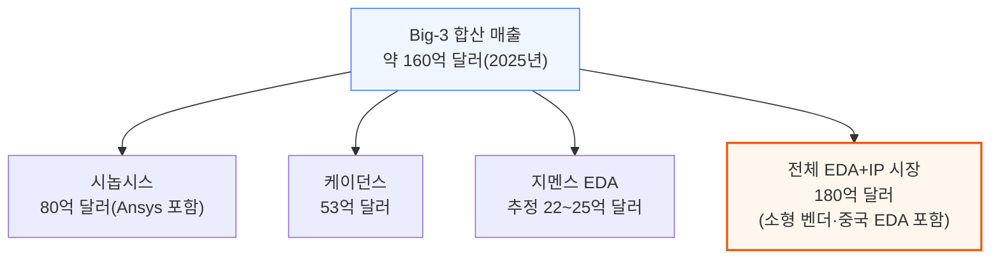

### EDA가 반도체 R&D보다 2배 가까이 빨리 크는 이유

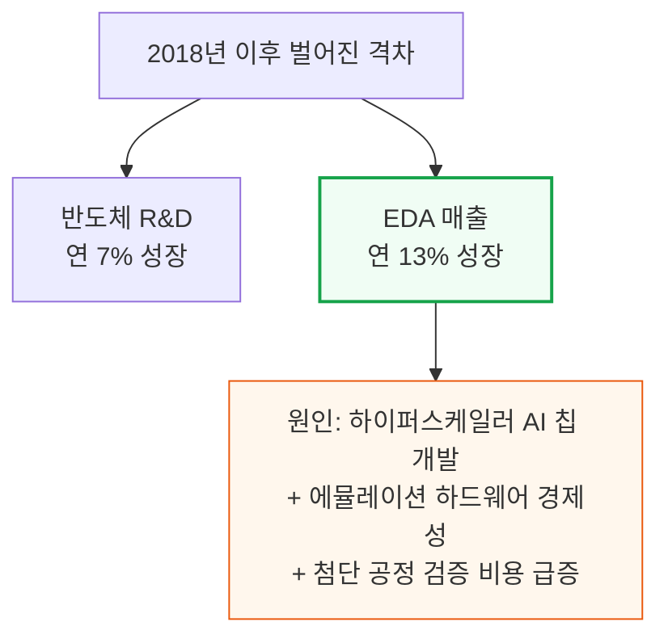

시놉시스 CEO 사신 가지(Sassine Ghazi)는 2025년 초, 반도체 R&D 집약도가 매출 대비 약 6%에서 9%로 높아지고 있다고 언급했습니다. AI 워크로드의 복잡성이 원인입니다.
EDA 벤더는 이 흐름에서 이중으로 수혜를 봅니다 — ① 그들이 파는 R&D 예산 자체가 커지고 ② 검증 강도·AI 툴 프리미엄·공정 전환 가격 정책으로 그 예산에서 차지하는 몫도 함께 커지기 때문입니다.

### EDA가 존재하는 이유 - 4가지 핵심 기능

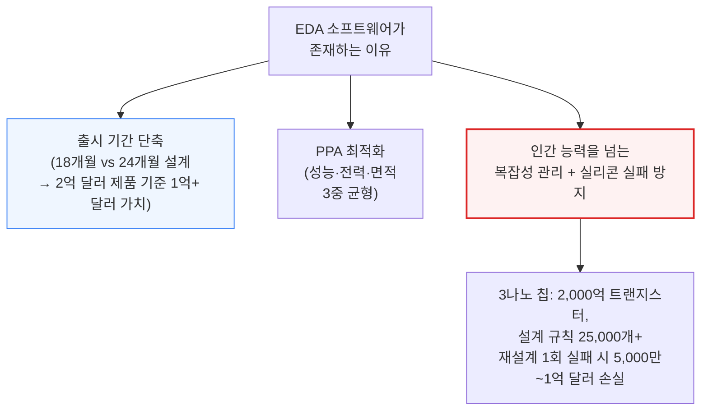

📌 용어 풀이: 왜 EDA 없이는 첨단 칩을 설계할 수 없나
> - 현대 플래그십 칩은 500억\~2,000억 개 트랜지스터를 담고 있고, 3나노 공정에서는 파운드리가 요구하는 설계 규칙만 25,000개가 넘음 — 이 정도 규모는 사람이 수작업으로 검토할 수 있는 범위를 완전히 벗어남(65나노 이후로 수작업 설계는 사실상 불가능해짐)
> - 검증해야 할 공정-전압-온도(PVT) 조합도 28나노에서 5\~7개였던 것이 3나노에서는 20\~30개 이상으로 늘어남 — EDA의 자동 최적화가 유일한 실현 경로

---

## 2. EDA를 사는 사람들 - 7대 고객군

**📌 핵심:**
- 약 180억 달러 EDA+IP 시장을 떠받치는 고객은 7개 유형 — 팹리스 설계사(엔지니어당 연 8\~15만 달러 지출)가 전통적으로 최대 그룹이지만, 이제는 시스템 기업(구글·아마존·MS·메타 등)이 EDA 수요의 45%를 차지하며 가장 빠르게 크는 그룹으로 부상
- 애플은 M시리즈·A시리즈·모뎀 프로그램에 8,000명 이상의 칩 설계 엔지니어를 고용 중이고, 테슬라도 FSD·Dojo 칩을 자체 설계 — 자동차 OEM·1차 협력사(콘티넨탈·보쉬·덴소)까지 처음으로 칩 설계에 뛰어드는 중
- 위탁 ASIC 설계사(브로드컴 ASIC 그룹, 마벨 커스텀 실리콘, Alchip, GUC)는 고객사당 EDA 지출이 가장 큰 그룹 — 브로드컴 ASIC 그룹 한 곳만 연간 2\~5억 달러를 EDA 툴·IP·에뮬레이션 하드웨어에 지출하는 것으로 추정
- 결론: 시스템 기업의 부상이 중요한 이유는 이들의 지출이 기존 반도체 R&D 예산에 얹히는 "순증분"이기 때문 — 전통 팹리스 시장이 정체돼도 EDA 매출은 계속 클 수 있는 구조

---

### 7대 고객군 - 팹리스부터 IP 기업까지

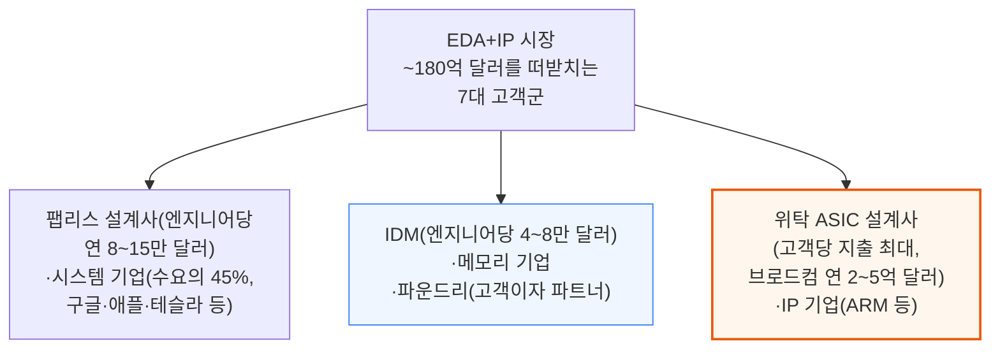

📌 용어 풀이: 시스템 기업 수요가 왜 "순증분"인가
> - 하이퍼스케일러·자동차 OEM 등은 지난 10년 안에 처음 EDA 고객이 된 회사들 — 이들이 없었다면 존재하지 않았을 지출이라, 전통 반도체 R&D 예산이 정체돼도 EDA 시장 전체는 계속 성장할 수 있음
> - 애플 8,000명+ 칩 엔지니어, 테슬라 FSD·Dojo 자체 설계, 자동차 OEM·1차 협력사의 신규 진입이 대표 사례

파운드리(TSMC·삼성 파운드리·인텔 파운드리·글로벌파운드리·라피더스)는 고객이자 파트너이기도 합니다. EDA 벤더와 양산 24개월 전부터 PDK(공정설계키트)를 공동 개발하고, 테이프아웃(설계 확정) 시 고객이 반드시 써야 할 툴까지 지정해 생태계 전체에 특정 서명(signoff) 소프트웨어를 사실상 강제합니다.

---

## 3. RTL에서 실리콘까지 - 설계 파이프라인과 매출 성장 동력

**📌 핵심:**
- 칩 설계는 RTL 코드 작성 → 합성(시놉시스 Design Compiler, 점유율 84\~85%) → 배치·배선(P&R) → 서명(signoff) 검증(시놉시스 PrimeTime 90%+) → 물리 검증(지멘스 Calibre 85%+) → 테이프아웃 순으로 이어지는 순차 파이프라인 — 7/5/3나노 기준 12\~24개월 소요
- 검증(verification)이 설계 시간·예산의 60\~70%를 차지하며 연 15%+씩 성장 — 하드웨어 에뮬레이션만으로도 15억 달러+ 시장이고, PCIe Gen6·HBM4·UCIe 등 신규 프로토콜이 나올 때마다 검증 대상이 계속 늘어남
- EDA 매출 성장을 반도체 R&D 성장보다 끌어올리는 구조적 동력은 4가지 — ① 공정 전환(3나노 툴이 28나노 툴보다 3\~5배 비쌈) ② 검증 강도 증가 ③ AI 가속기 확산(하이퍼스케일러 커스텀 실리콘이 5년 전 거의 없던 150\~200억 달러 규모 신규 수요 창출) ④ 락인에서 나오는 가격 결정력(고객 유지율 95%+ · 연 3\~7% 계약상 인상)
- 결론: 한 툴을 바꾸면 그 뒤 모든 단계(배치·배선·서명·물리 검증)를 다시 돌려야 함 — 개별 툴의 우수성보다 이 순차적 종속 관계 자체가 락인의 본질

---

### 설계 파이프라인 - RTL부터 테이프아웃까지, 한 단계 바꾸면 전부 다시

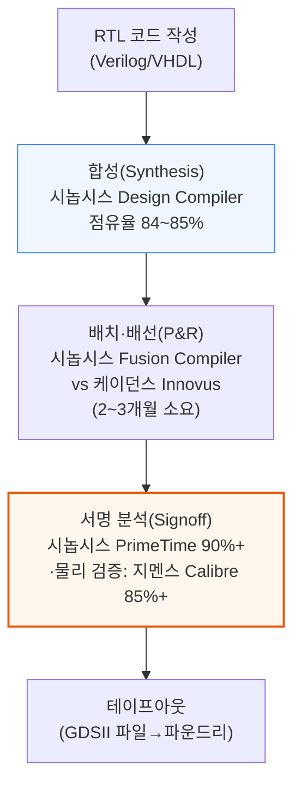

📌 용어 풀이: 왜 "플로우 자체가 락인"인가
> - 합성 툴을 바꾸면 배치·배선, 서명 검증, 물리 검증을 전부 다시 돌려야 함 — 개별 툴 하나의 성능 차이보다, 이 순차 종속 관계를 끊는 비용이 훨씬 크다는 게 핵심
> - 7/5/3나노 기준 전체 파이프라인은 12\~24개월 소요, 그중 검증 단계가 8\~15개월(65%)로 가장 김

### 설계 시간 배분 - 검증이 65%를 먹는다

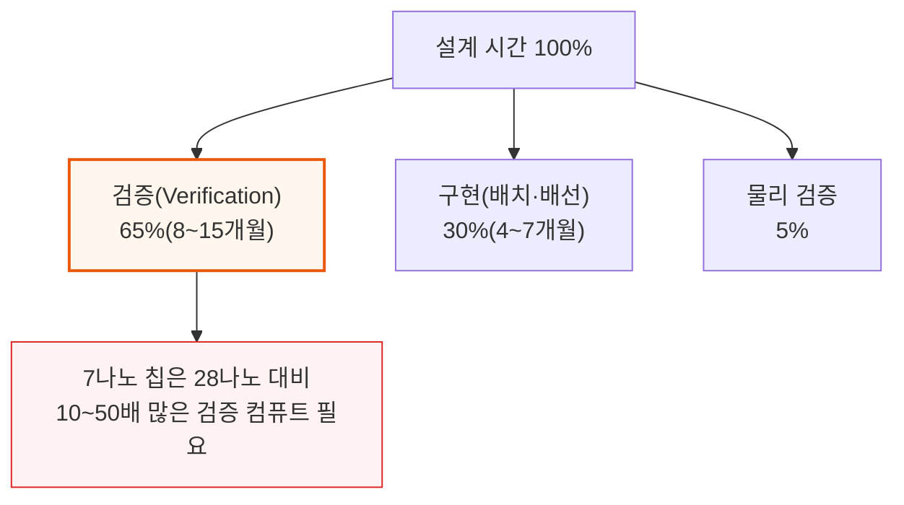

기능 시뮬레이션(시놉시스 VCS 45\~50%, 케이던스 Xcelium 40\~45%)은 수십억 개의 테스트 벡터를 돌리고, 하드웨어 에뮬레이션(케이던스 Palladium 55\~60%, 시놉시스 ZeBu 35\~40%)은 설계를 물리적 하드웨어에 얹어 SoC 전체를 검증합니다.
플래그십 AI 칩 한 개는 6\~12개월간 에뮬레이션을 계속 돌려야 할 정도로 검증 부담이 큽니다.

### EDA 매출이 R&D보다 빨리 크는 4가지 구조적 동력

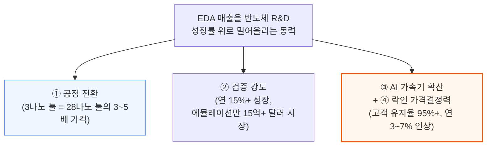

구글 TPU, 아마존 Trainium, 마이크로소프트 Maia, 메타 MTIA 등 하이퍼스케일러 커스텀 실리콘은 5년 전만 해도 거의 없던 150\~200억 달러 규모의 신규 칩 설계 수요를 만들어냈고, 이는 전통 R&D 예산에 완전히 얹히는 순증분입니다.
2020년에 서명한 1,000만 달러짜리 ELA는 엔지니어를 추가하지 않아도 2025년 1,200\~1,400만 달러로 갱신됩니다 — 계약상 인상과 락인이 결합된 결과입니다.

이 격차는 2018년부터 시작됐습니다. 그 전까지 EDA 매출은 파운드리 R&D 지출과 거의 1:1로 움직였지만, 하이퍼스케일러 AI 칩 개발과 에뮬레이션 하드웨어 경제성, 첨단 공정 검증 비용이 모두 설계 복잡성보다 빠르게 늘며 EDA 매출을 R&D 추세선 위로 끌어올렸습니다.
시놉시스의 350억 달러 Ansys 인수로 전체 목표 시장(TAM)은 **310억 달러**(EDA+IP 180억 + 시뮬레이션 100억 + 시스템 소프트웨어 30억)까지 확장됐는데, 이는 이 과점 3사가 유일한 인접 시장까지 흡수했다는 의미입니다.

---

## 4. EDA 시장 규모와 구조

**📌 핵심:**
- 2025년 전체 EDA 시장은 180억 달러, 2030년까지 280\~300억 달러로 성장 전망 — 나머지 10\~15%는 수십 개 벤더에 흩어져 있고, Ansys(Synopsys 편입 전)·Keysight(15억 달러)·Zuken(5억 달러, PCB/IC 패키징)이 독립 벤더 중 최대
- Big-3 바깥에서 핵심 EDA 카테고리 5%를 넘는 벤더는 하나도 없음 — 르네사스는 자사 부품 포트폴리오 판촉·BoM 최적화 목적으로 알티움(Altium, 59억 달러, 2024년)을 인수, 알티움은 PCB 설계 매출만으로 연 2.8억 달러
- 첨단 공정(7나노 이하) 툴별 점유율은 지난 10년간 거의 고정 — 유일하게 움직인 카테고리는 배치·배선(P&R)으로, 케이던스 Innovus가 2015\~2020년 사이 시놉시스 ICC2 대비 10\~15%p를 뺏은 뒤 안정화(시놉시스가 Fusion Compiler를 내놓으면서)
- 결론: 나머지 카테고리는 전부 "잠겨있다(locked)"고 봐도 될 정도로 안정적 — SNPS+CDNS 합산 점유율은 복잡성이 커질수록 상승 추세, 즉 과점이 시간이 갈수록 강화되는 구조

---

### 시장 규모 - 180억에서 280\~300억 달러로

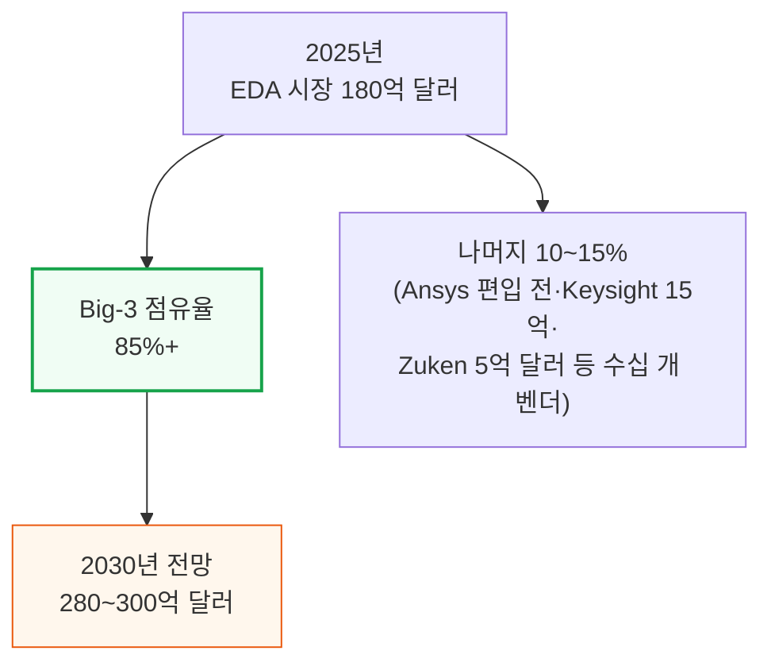

### 첨단 공정 툴별 점유율 - 10년째 거의 고정

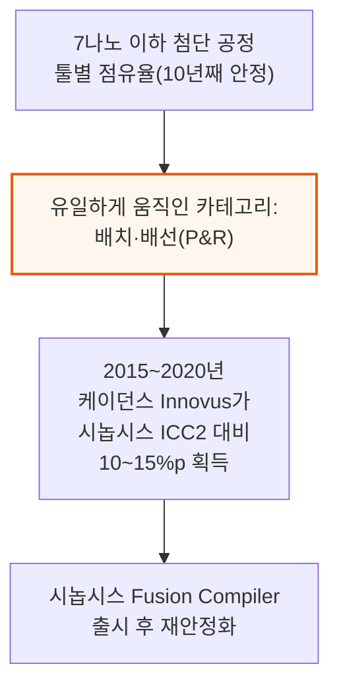

📌 용어 풀이: 왜 "나머지는 전부 잠겨있다"고 하나
> - 합성·서명 검증·물리 검증 등 P&R을 제외한 나머지 카테고리는 지난 10년간 점유율 변화가 사실상 없었음 — 한 번 특정 벤더의 플로우로 설계를 시작하면, 다음 세대·다음 회사에서도 같은 벤더를 계속 쓰게 되는 락인 구조 때문
> - SNPS+CDNS 합산 점유율은 오히려 시간이 갈수록 상승하는 추세 — 설계 복잡성이 커질수록 대형 2사로 수렴

---

## 5. 라이선스 모델 - 좌석, 토큰, ELA

**📌 핵심:**
- EDA 가격은 의도적으로 불투명 — 벤더들은 가격표를 공개하지 않고 모든 계약을 개별 협상함. 좌석(Seat) 기반은 엔지니어 1명이 툴 1개를 쓰는 전통 방식으로, 소규모 고객·특정 툴에 여전히 사용되지만 벤더 매출 상한이 headcount에 묶임
- 토큰(Token) 기반은 좌석이 아니라 컴퓨트 용량 풀을 사고 여러 엔지니어가 나눠 쓰는 최신 모델 — 고객은 피크 사용량 기준으로 사지만 평균 가동률은 60\~70%뿐이라 30\~40%의 여유분이 그대로 벤더의 추가 이익
- 토큰 모델이 성장하는 이유 4가지 — ① 총 지출 증가(사용 안 한 여유분도 이미 지불) ② 좌석 추가 승인 절차 없이 사용량만 늘리면 됨(마찰 없는 확장) ③ AI 툴(DSO.ai·Cerebrus)이 토큰을 3\~5배 빨리 소진 ④ 클라우드 EDA가 컴퓨트 시간당 과금이라 테이프아웃 몰림 구간의 사용 폭증까지 다 잡아냄
- 결론: 시놉시스는 2024년 투자자의 날에서 AI 강화 툴 갱신이 기본 계약가 대비 **약 20% 매출 상승 효과**를 낸다고 밝힘 — headcount는 그대로인데 토큰 소비만 늘어난 결과

---

### 좌석 vs 토큰 - 왜 벤더는 토큰을 밀어붙이나

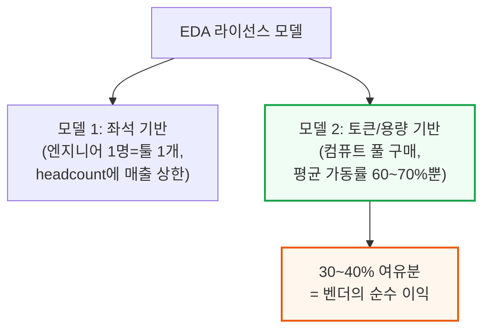

### 토큰 모델이 성장하는 4가지 이유

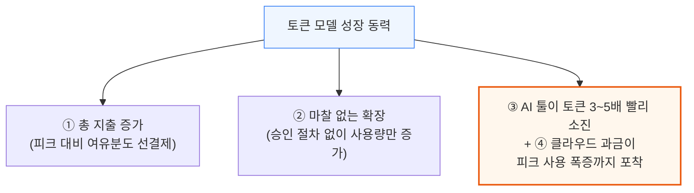

시놉시스 DSO.ai, 케이던스 Cerebrus 같은 AI 툴은 수백 번의 자동 설계 반복을 돌리며 매 반복마다 토큰을 소모합니다. 클라우드 EDA(시놉시스 on AWS, 케이던스 on Azure)는 컴퓨트 시간 단위로 과금하기 때문에, 테이프아웃 몰림 구간의 사용 폭증이 좌석 라이선스라면 절대 못 잡아낼 매출을 만들어냅니다.

### ELA(전사 라이선스 계약) - 상위 50\~100개 고객의 실제 거래 단위

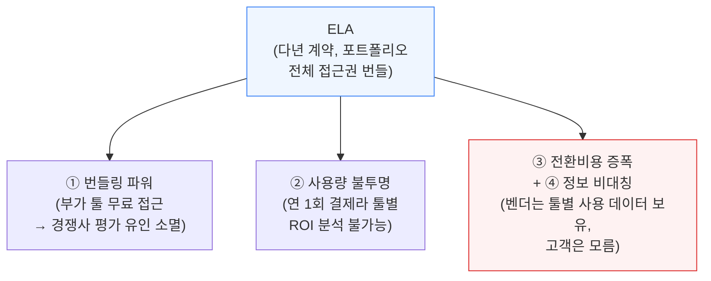

📌 용어 풀이: 번들링이 왜 경쟁을 막나
> - 시놉시스 ELA에 합성·P&R·서명 검증이 다 포함돼 있으면, 이미 무료로 쓸 수 있는 케이던스 Genus를 굳이 따로 평가할 이유가 없어짐 — "무료 부가 기능"이 경쟁 배제 도구로 작동
> - ARM도 비슷한 모델(Flexible Access)을 씀 — 연회비로 전체 IP 포트폴리오를 마음껏 평가하게 해주고, 실제 양산 시에만 칩당 로열티를 받는 방식. 2019년 이후 ARM 신규 계약의 70%+가 이 모델을 채택

---

## 6. 하드웨어 라이선스, 지역별 가격, M&A가 미치는 영향

**📌 핵심:**
- 에뮬레이션 하드웨어(케이던스 Palladium, 시놉시스 ZeBu)는 소프트웨어가 아니라 자본재 경제학을 따름 — 5,000만 달러어치 Palladium 시스템을 한 번 설치하면 감가상각 5\~7년 동안 고객이 사실상 묶임, 시스템당 연 300\~500만 달러 소프트웨어·유지보수료까지 별도 발생
- 고객사 M&A 발생 시 EDA 매출에 미치는 영향은 시나리오별로 다름 — 같은 벤더를 쓰던 회사끼리 합치면 총 지출이 10\~20% 감소(볼륨 할인), 다른 벤더를 쓰던 회사끼리 합치면 이긴 벤더가 좌석을 흡수하고 진 벤더는 2\~3년에 걸쳐 계약이 소멸
- AMD의 자일링스 인수(490억 달러, 2022년)처럼 두 벤더가 통합 계약을 놓고 경쟁이 붙으면, 이긴 벤더는 더 큰 계약을 얻지만 경쟁적 가격 인하로 마진은 눌림 — 반도체 업계 통합의 EDA 매출 순효과는 소폭 마이너스(ELA 개수 감소)지만, 살아남은 회사가 더 복잡한 칩을 더 많이 설계해 상쇄
- 결론: EDA 매출은 헤드카운트가 아니라 6가지 원천에서 성장 — 헤드카운트는 연 3\~5%만 크는데 EDA 매출은 연 12\~15% 성장, 그 차이는 공정 전환·검증 강도·AI 프리미엄 등에서 나옴 — 오래된 시대(perpetual license, 영구 라이선스) 대비 지금은 업데이트가 연회비에 포함돼 있어 결제를 멈추면 접근 자체가 끊김

---

### 하드웨어 라이선스 - 자본재 경제학의 4가지 락인

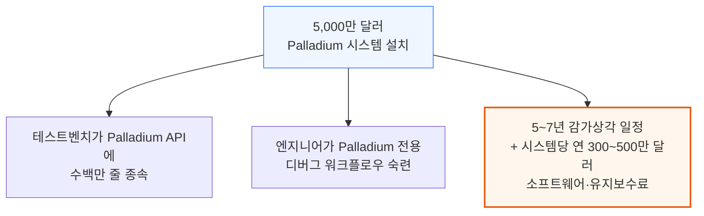

### 고객사 M&A가 EDA 매출에 미치는 영향 - 시나리오 3가지

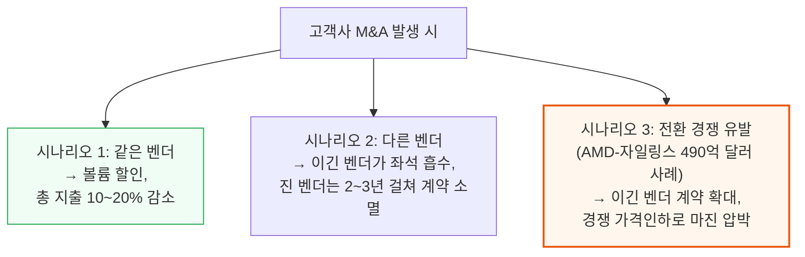

반도체 업계 통합의 EDA 매출 순효과는 소폭 마이너스입니다 — 독립 고객 수가 줄면 별도 ELA 개수도 줄기 때문입니다. 하지만 살아남은 회사는 규모가 더 크고 더 복잡한 칩을 설계하며 엔지니어당 지출도 늘어나, 역사적으로 이 복잡성 증가분이 통합 할인분을 상쇄하고도 남았습니다.

### 헤드카운트를 넘어서는 6가지 매출 성장 원천

EDA 매출은 연 12\~15% 성장하는데 전세계 반도체 설계 인력은 연 3\~5%만 성장합니다. 이 격차는 공정 전환 비용, 검증 강도 증가, AI 프리미엄, 락인 가격결정력 등 앞서 다룬 구조적 동력에서 옵니다.

📌 용어 풀이: 업데이트 요금은 어떻게 받나
> - 과거 영구 라이선스(perpetual license) 시절엔 연 15\~20% 유지보수료를 내고 업데이트를 받았고, 불황기엔 업데이트를 건너뛰고 옛 버전으로 버티는 "메인터넌스 휴가"가 가능했음
> - 지금의 시간 기반(time-based) 모델은 업데이트가 연회비에 포함돼 있어 항상 최신 버전을 쓰지만, 결제를 멈추면 접근 자체가 끊김 — 이 전환(2005\~2015년, 약 10년 소요)이 EDA 벤더의 사업 품질을 영구적으로 개선

시놉시스와 케이던스 모두 현재 매출의 70\~83%가 시간 기반/구독 계약에서 나오고, 나머지는 하드웨어 선납·IP 마일스톤·영구 라이선스에서 발생합니다. 최근 에뮬레이션 하드웨어 판매가 늘면서 선납 비중은 오히려 커지는 추세입니다.

### 갱신 엔진 - 백로그와 계약상 인상이 만드는 자기강화 매출

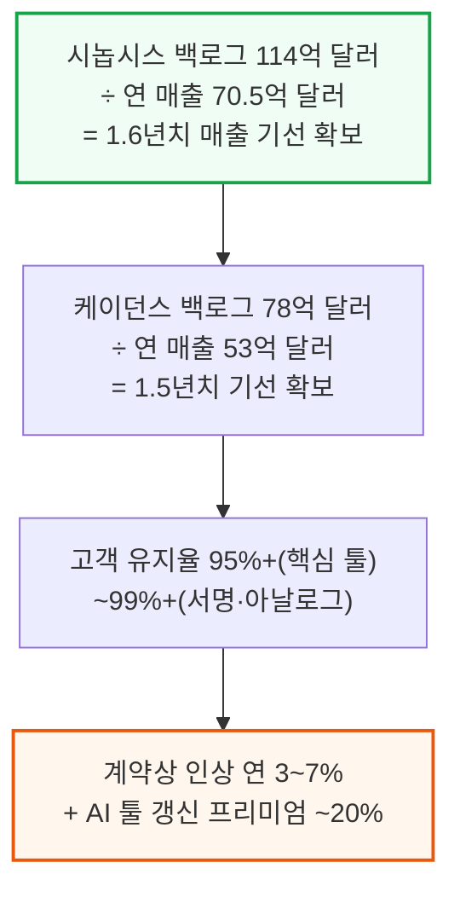

2020년에 서명한 1,000만 달러짜리 연간 ELA는 계약상 인상·AI 프리미엄·검증 확대에 힘입어 2025년 1,200\~1,400만 달러로 갱신됩니다. 경영진은 이를 "가치 창출"로 설명하고 조달팀은 "연례 인플레이션"으로 보는데, 저자들은 둘 다 맞는 말이라고 짚습니다.

대부분의 EDA 경쟁 평가는 실제 전환 시도라기보다 협상 지렛대로 쓰입니다. 고객이 평가를 발표하면 기존 벤더가 15\~25% 할인을 제시하고, 고객은 평가를 끝까지 마치지 않고 그 조건을 수락하는 패턴이 전형적입니다.

---

## 7. 시놉시스 - 350억 달러 플랫폼 베팅

**📌 핵심:**
- 시놉시스 전략은 "플랫폼 극대화" — 설계 플로우의 모든 툴을 소유하고, IP를 교차 판매하고, 인접 시뮬레이션 영역까지 확장. 350억 달러 규모 Ansys 인수(2025년 7월 완료)로 칩 설계에서 시스템 레벨 시뮬레이션(열·구조·전자기·CFD)까지 사업을 확장
- 마진은 FY2006 14%에서 FY2024 37.3%까지 23%p 상승 — ① 영구 라이선스→시간 기반 전환 ② 검증/IP 믹스가 고마진 제품 위주로 이동 ③ AI 툴이 15\~25% 프리미엄을 받으면서 추가 비용은 거의 없음 ④ 플랫폼 교차 판매로 고객 획득 비용 절감, 4가지 구조적 요인이 원인
- FY2026은 전환기 — Ansys가 가린 유기적(organic) 사업은 사실 둔화 중. FY25 Ansys 제외 유기적 매출은 15% 발표치 대비 실제 약 3%에 그쳤고, IP 매출은 4분기 중 3개 분기에서 전분기 대비 감소(13% CAGR 추세 이탈) — 인텔이 외부 파운드리 공정 기준(18A→18A-P)을 바꾸면서 시놉시스가 준비한 IP의 램프업 시점이 밀린 게 주요 원인
- 결론: 백로그 114억 달러가 소프트웨어 회사로서는 이례적인 매출 가시성을 제공하지만, 중국 매출은 수출 규제로 FY25 22% 감소(전체 매출 비중 16%→12%) — 인텔이라는 20년 이상 최대 고객 관계에서도 케이던스가 처음으로 파고들 틈이 열리는 중

---

### Ansys 인수 - 칩 설계에서 시스템 시뮬레이션까지

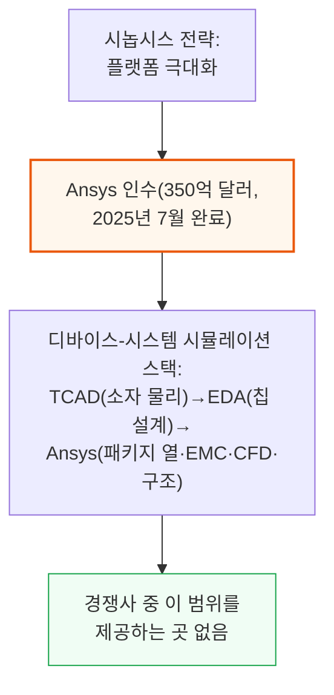

📌 용어 풀이: 왜 700W GPU에 시스템 시뮬레이션이 필요한가
> - 현대 칩은 혼자 존재하지 않음 — 700W짜리 데이터센터 GPU는 복잡한 냉각으로 열을 방출해야 하고, 자동차 SoC는 진동하는 엔진 블록 위에서 전자기 호환성(EMC) 요건을 맞춰야 함
> - 전통 EDA는 패키지 경계에서 멈추지만, 시놉시스-Ansys 결합은 소자 물리부터 패키지 열까지 전체를 커버 — 2024년 투자자의 날 기준 3년차 4억 달러 비용 시너지, 4년차 4억 달러 매출 시너지, 장기적으로 연 10억 달러+ 매출 시너지를 목표로 제시

인수 리스크로는 통합 복잡성(다른 고객·영업 방식·조직 문화), 레버리지(인수 완료 시점 약 3.9배, 2년 내 2배 미만 목표), 밸류에이션(매출의 12배인 350억 달러), 경영진의 핵심 EDA 경쟁 집중력 분산 등이 꼽힙니다.

### 마진 계단 - FY2006 14%에서 FY2024 37.3%로

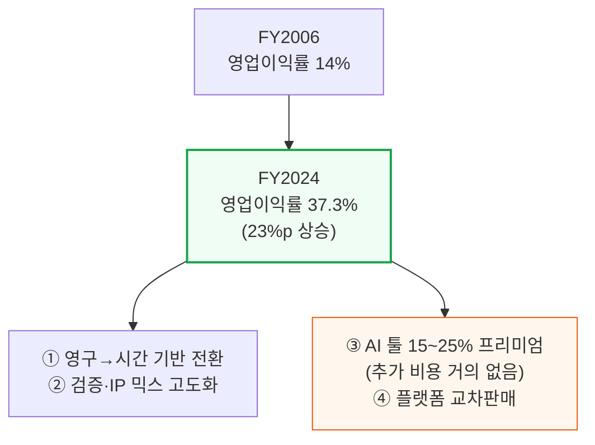

경영진은 2011년 애널리스트들에게 "매출 성장 기회가 보이면 그쪽에 집중하고, 성장이 어려워지면 즉시 영업이익률에 압력을 가하는 쪽으로 전환한다"고 밝혔습니다. Magma·Coverity·Black Duck 같은 주요 인수는 일시적으로 마진을 100\~200bp 압박한 뒤 체계적으로 회복하는 패턴을 20년째 반복 중입니다.

### CEO 교체 - 창업자에서 운영자로

Aart de Geus(1986\~2023년 CEO, 現 이사회 의장)에서 사신 가지(2024년 1월\~)로의 전환은 어조 변화가 뚜렷합니다.
가지 취임 첫 해에 소프트웨어 인테그리티 그룹을 21억 달러에 매각하고 350억 달러에 Ansys를 인수하며, "전통 반도체 vs AI 인프라 고객"을 구분하는 "두 시장 이야기(tale of two markets)" 프레임을 제시했습니다. 이는 비전 선언보다 재무 프레임워크를 앞세우는 가지 특유의 분석적 접근을 상징합니다.

### FY2026 전환기 - Ansys가 가린 유기적 둔화

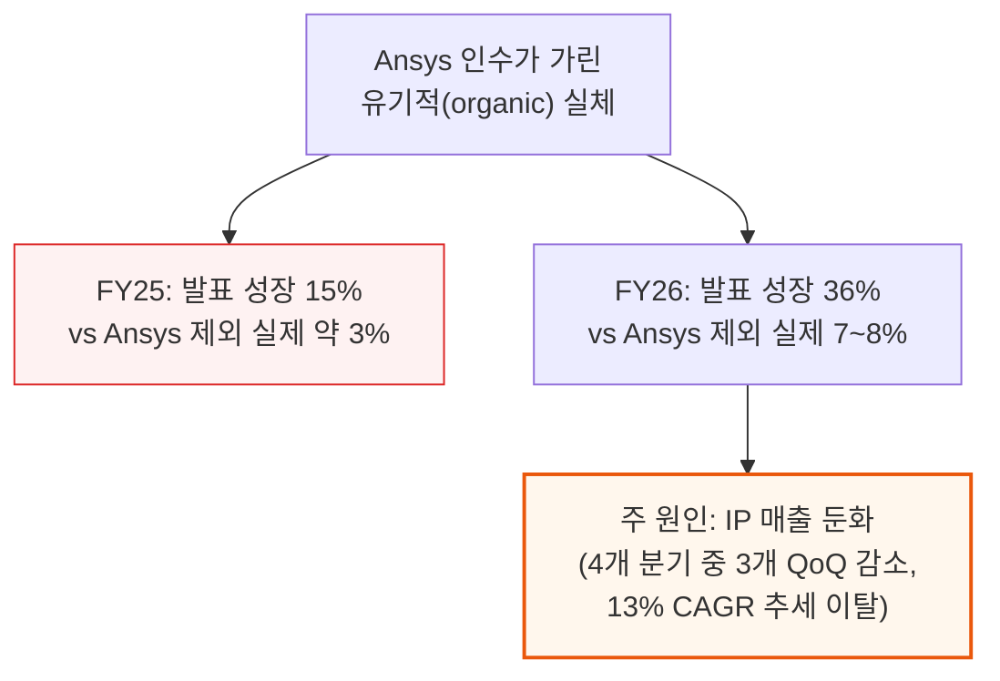

📌 용어 풀이: 인텔 18A-P가 왜 IP 매출에 타격을 줬나
> - 시놉시스는 인텔의 외부 파운드리 기준 노드였던 18A에 맞춰 IP를 준비했지만, 인텔이 외부 고객들을 18A-P(그리고 그 다음 14A)로 밀어붙이면서 시놉시스가 준비한 IP의 양산 램프업 시점 자체가 뒤로 밀림
> - HPC IP 타이틀 커버리지 공백도 겹쳐, 경영진은 FY26 IP 성장을 "미미한 수준(저 한 자릿수%)"으로 가이던스 — 장기 목표였던 중간 두 자릿수%와는 거리가 멂

중국 매출도 유기적 약세를 더했습니다. Ansys 제외 기준 중국 매출은 FY25에 22% 감소했고, 매출 비중은 FY24 16%에서 FY25 12%로 줄었습니다. 경영진은 "우리가 팔 수 없는 회사들이 대안을 찾고 있고, 그 대안은 대체로 중국 현지 EDA·IP 기업"이라고 직접 인정했습니다.

### 인텔 고객 집중 - 20년 넘은 의존 관계에 생긴 균열

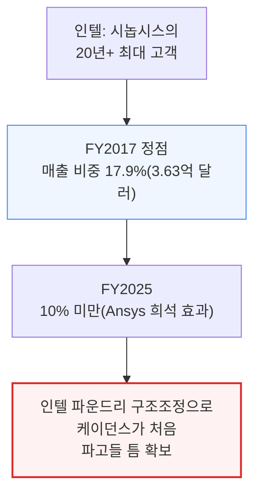

인텔은 여전히 시놉시스 최대 고객이지만, 인텔 파운드리의 구조조정과 리더십 교체가 EDA 스택 전반에서 경쟁 재평가 기회를 만들었습니다. 모든 파운드리 전환은 경쟁 재평가의 창을 열지만, 인텔의 현재 전환은 10년 만에 가장 큰 창입니다.

---

## 8. 케이던스 - 벼랑 끝에서 최고 마진으로

**📌 핵심:**
- 마이크 피스터 CEO 시절(2004\~2008년) 멘토 그래픽스에 적대적 인수를 시도했다가 참패 — 단 1년 만에 매출 36% 급감, 주당 6.57달러 GAAP 손실, 2억 달러 영업권 손상까지 발생한 "거의 죽을 뻔한" 경험이 지금 케이던스 문화의 뿌리
- 립부 탄(Lip-Bu Tan)이 2009년 1월 바닥에서 CEO 취임 — 2009\~2013년 매출 71% 성장, 비GAAP 영업이익률 거의 0%에서 24%로, 영업현금흐름은 2,600만 달러에서 3억 6,800만 달러로 확대. 15년간 마진을 -11%에서 42.5%까지 53%p 끌어올림("증분 매출의 50%를 영업이익으로 떨어뜨린다"는 운영 원칙을 7년 넘게 달성)
- 아날로그 설계 툴 버추오소(Virtuoso)는 40년간 축적된 방법론이 툴 안에 녹아있어 대체 불가 — 450개+ 고객, 수십 년간 대형 고객 이탈 기록 없음. 에뮬레이션 하드웨어 팔라디움(Palladium)은 10년째 하드웨어 리드를 유지, 2025년 1,000개+ AI 지원 테이프아웃 기록
- 결론: 아니루드 데브간(Anirudh Devgan, 2021년 12월 CEO 취임)이 "3대 지평선" 전략(수평선 1: 데이터센터 AI / 수평선 2: 자동차·물리적 AI / 수평선 3: 생명과학)으로 케이던스를 "계산 소프트웨어 회사"로 재정의 — 지평선 3(신약 개발용 분자 도킹)이 성공하면 EDA 카테고리 자체를 초월한다는 것이 가장 비주류적인 베팅

---

### 근사 죽음의 경험 - 마이크 피스터의 적대적 인수 실패

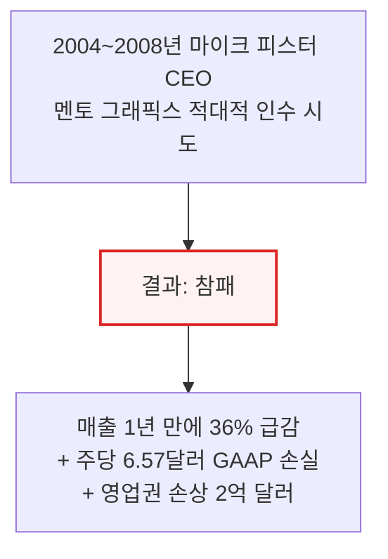

### 립부 탄의 턴어라운드 - -11%에서 42.5% 마진으로, 15년

```mermaid
flowchart TD
    Tan["2009년 1월<br/>립부 탄 CEO 취임(바닥)"] --> Early["2009~2013년<br/>매출 71% 성장,<br/>영업현금흐름 2,600만→3.68억 달러"]
    Early --> Rule["운영 원칙: 증분 매출의<br/>50%를 영업이익으로<br/>(7년+ 연속 달성)"]
    Rule --> Result["15년 만에<br/>마진 -11%→42.5%<br/>(53%p 상승)"]
    style Tan fill:#eff6ff,stroke:#3b82f6
    style Result fill:#f0fdf4,stroke:#16a34a,stroke-width:2px
```

### 버추오소와 팔라디움 - 대체 불가능한 두 프랜차이즈

```mermaid
flowchart TD
    Two2["케이던스 양대 프랜차이즈"] --> Virt["버추오소(아날로그 설계)<br/>40년 축적 방법론,<br/>450+ 고객, 이탈 기록 없음"]
    Two2 --> Pall["팔라디움(에뮬레이션)<br/>10년 하드웨어 리드,<br/>2025년 1,000+ AI 테이프아웃"]
    style Virt fill:#f0fdf4,stroke:#16a34a
    style Pall fill:#fff7ed,stroke:#ea580c,stroke-width:2px
```

📌 용어 풀이: Virtuoso가 대체 불가능한 이유
> - 아날로그 설계 방법론이 40년간 버추오소 안에서 진화해왔음 — 매칭·노이즈·선형성에 대한 암묵지가 툴에 축적돼 있어 더 나은 알고리즘을 짠다고 복제할 수 있는 게 아니라, 수십 년간 고객 피드백이 켜켜이 쌓여야만 만들어짐
> - 2024년 1분기 출시된 Virtuoso Studio는 1년 안에 시가총액 상위 20개 반도체 회사 중 18곳이 이전

디지털 격차도 빠르게 좁혀지는 중입니다 — 2014년 연 10건이던 디지털 풀플로우 신규 수주가 2024년 단일 연도 36건까지 늘었습니다. Cerebrus AI(자동 설계 최적화)는 2023년 1분기 180건이던 테이프아웃이 2025년 1분기 1,000건+로, 2년도 안 돼 5.6배 증가했으며 상위 10개 디지털 고객 100%가 이미 채택했습니다.

MediaTek은 다이 면적 5% 축소·전력 6%+ 절감을, 르네사스는 첨단 공정 CPU에서 총 네거티브 슬랙(설계 타이밍 여유) 75% 개선을, 삼성 SARC는 생산성 4배 향상을 각각 Cerebrus로 달성했습니다.

### 3대 지평선 전략 - 데이터센터 AI에서 생명과학까지

```mermaid
flowchart TD
    H["아니루드 데브간의<br/>3대 지평선 전략"] --> H1["지평선 1(현재~3년):<br/>데이터센터 AI<br/>(핵심 EDA·IP·에뮬레이션)"]
    H --> H2["지평선 2(3~7년):<br/>자동차·물리적 AI<br/>(BETA CAE·MSC Software 인수)"]
    H --> H3["지평선 3(5~10년+):<br/>생명과학<br/>(OpenEye, 분자 도킹 TAM 20억 달러)"]
    style H1 fill:#f0fdf4,stroke:#16a34a
    style H3 fill:#fff7ed,stroke:#ea580c,stroke-width:2px
```

지평선 3(생명과학)은 데브간의 가장 비주류적인 베팅입니다 — 트랜지스터 배치를 최적화하던 알고리즘이 분자 도킹 최적화에도 통한다는 논리로, 성공하면 케이던스는 EDA 카테고리 자체를 초월하게 됩니다.
2024년 립부 탄이 복귀를 타진했을 때 이사회는 데브간을 재신임했고, 립부 탄은 인텔 CEO로 자리를 옮겼습니다 — 이례적으로 공개된 전환이었지만 거버넌스의 안정성과 데브간 전략에 대한 확신을 상징했습니다.

---

## 9. 지멘스 EDA - 봉쇄 지위

**📌 핵심:**
- 물리 검증 툴 Calibre는 업계 표준 — TSMC가 테이프아웃 조건으로 "Calibre-clean" DRC/LVS를 지정하고 삼성·인텔도 동일 요구, 이 툴 하나가 다른 카테고리에서 무슨 일이 벌어지든 지멘스 EDA의 시장 관련성을 영구히 보장
- 1989년 매출 3.8억 달러로 업계 1위였던 멘토 그래픽스는 전체 소프트웨어 스위트를 처음부터 다시 짜는 "Release 8.0" 프로젝트가 수년간 일정을 어기며 실패, 1991년 첫 분기 손실을 시작으로 6,160만 달러 연간 손실과 인력 15% 감축까지 초래 — 이후 웰리 라인스(1993\~2017년) CEO가 M&A로 재건해 칼 아이칸·엘리엇 매니지먼트의 행동주의 압박 끝에 2017년 지멘스에 45억 달러로 매각, 2021년 지멘스 EDA로 리브랜딩
- 지멘스 소유는 양날의 검 — 산업 대기업의 교차 보조금·티캠센터(Teamcenter) PLM 번들링 장점이 있지만, EDA가 지멘스 전체 매출의 5% 미만이고 독립 주가가 없어 인수에 쓸 통화가 없으며, 실적도 Digital Industries Software에 묻혀 불투명
- 결론: 2024\~2025년 3사 모두 동시에 시뮬레이션/CAE 기업을 인수하는 "무브-포-무브" 경쟁이 벌어졌고, 지멘스는 알테어(Altair)를 인수해 이 삼각 경쟁의 세 번째 다리를 완성 — Q1 FY2026 기준 EDA·시뮬레이션이 Digital Industries Software 전체 성장률(7%)보다 11% 성장률로 앞서 나가는 중

---

### Calibre 봉쇄 지위 - "다른 게 다 무너져도 이건 안 무너진다"

```mermaid
flowchart TD
    Calibre["Calibre 물리 검증<br/>(DRC/LVS)"] --> Mandate["TSMC·삼성·인텔 모두<br/>'Calibre-clean' 테이프아웃 지정"]
    Mandate --> Perm["다른 카테고리 결과와 무관하게<br/>지멘스 EDA 시장 관련성 영구 보장"]
    style Calibre fill:#f0fdf4,stroke:#16a34a,stroke-width:2px
    style Perm fill:#fff7ed,stroke:#ea580c,stroke-width:2px
```

### Release 8.0 참사 - 멘토가 1위에서 3위로 추락한 이유

```mermaid
flowchart TD
    R8["1989년 멘토 그래픽스<br/>매출 3.8억 달러, 업계 1위"] --> Rewrite["전체 소프트웨어<br/>처음부터 재작성 시도<br/>('Release 8.0')"]
    Rewrite --> Fail2["수년째 일정 지연,<br/>1991년 첫 분기 손실"]
    Fail2 --> Result2["연 손실 6,160만 달러<br/>+ 인력 15% 감축<br/>+ 1992년 출시해도 버그투성이"]
    style Rewrite fill:#fef2f2,stroke:#dc2626,stroke-width:2px
    style Result2 fill:#fef2f2,stroke:#dc2626
```

📌 용어 풀이: 왜 이것이 "업계 교훈"인가
> - 이 사건은 세 가지를 설명함 — ① 멘토가 왜 1위에서 3위로 추락해 다시 회복하지 못했는지 ② Big-3 전부가 처음부터 만들지 않고 인수를 택하는 이유(시놉시스-Ansys, 케이던스-BETA CAE, 지멘스-Altair) ③ 스타트업이 EDA 플랫폼을 백지에서 재작성해 따라잡을 수 없는 이유 — 코드베이스 복잡성이 클린시트 접근을 매번 이김

웰리 라인스(1993\~2017년) CEO는 대신 M&A로 멘토를 재건해 Calibre·PCB 툴·임베디드 소프트웨어·자동차 전자를 하나의 포트폴리오로 조립했습니다. 칼 아이칸(2011년), 엘리엇 매니지먼트(2016년)의 행동주의 압박 끝에 지멘스가 2017년 45억 달러에 인수, 2021년 지멘스 EDA로 리브랜딩했습니다.

### 지멘스 소유의 양면 - 교차보조금 vs 예산 경쟁

```mermaid
flowchart TD
    Owner["지멘스 소유"] --> Pro["장점: 산업 대기업<br/>교차보조금 + Teamcenter PLM 번들"]
    Owner --> Con["단점: EDA가 지멘스<br/>전체 매출 5% 미만,<br/>독립 주가 없어 인수 통화 부재"]
    Con --> Compete["자동화·헬스케어·에너지와<br/>모기업 자본 배정 경쟁"]
    style Pro fill:#f0fdf4,stroke:#16a34a
    style Con fill:#fef2f2,stroke:#dc2626,stroke-width:2px
```

### 3사 동시 인수 - 시뮬레이션 군비 경쟁

2024\~2025년 Big-3 전부가 동시에 시뮬레이션/CAE 기업을 인수하는 "무브-포-무브" 경쟁을 벌였습니다 — 시놉시스는 Ansys(350억 달러), 케이던스는 BETA CAE·MSC Software, 지멘스는 알테어(Altair, 약 100억 달러)를 인수하며 EDA-CAE 경계가 영구히 사라지는 중입니다.

지멘스는 2025년 DAC(Design Automation Conference)에서 Aprisa AI(디지털 구현), Calibre Vision AI(DRC 위반 클러스터링, 디버그 시간 절반 단축), Solido AI(커스텀/아날로그 설계) 3개 AI 제품군을 출시하며 자사 85%+ Calibre 설치 기반을 겨냥한 첫 본격 AI 진출을 시작했습니다.

시스템 레벨 자동차 검증 툴 PAVE360은 차량 전체 시뮬레이션·소프트웨어-하드웨어 공동 검증을 제공하며, EDA와 인접하되 다른 구매자(차량 통합팀·1차 협력사)를 겨냥한 8\~12억 달러 규모(2030년 전망) 기회를 시놉시스·케이던스와 직접 경쟁 없이 포착합니다.

Q1 FY2026 기준 지멘스 Digital Industries Software 사업은 11% 성장했고, 그중 EDA·시뮬레이션이 특히 두 자릿수 성장을 견인 — PLM(시뮬레이션 제외)은 7% 성장에 그쳐, EDA·시뮬레이션이 전체 지멘스 소프트웨어 포트폴리오보다 빠르게 크고 있음을 보여줍니다.

---

## 10. 경쟁 구도 - 2026년 케이던스의 추격

**📌 핵심:**
- 2025년 케이던스와 시놉시스의 경쟁 균형이 뚜렷이 이동 — 케이던스 유기적 매출은 FY25 약 14% 성장한 반면 시놉시스는 Ansys 제외 기준 약 7\~8%에 그침. 케이던스 IP는 25% 가까이 성장했는데 시놉시스는 FY26 IP를 "미미한 해"로 가이던스
- 케이던스는 하드웨어(Palladium Z3, 신규 고객 30+), IP(HBM4·224G SerDes·LPDDR6), 디지털(신규 풀플로우 로고 25개) 전 영역에서 점유율을 뺏는 중이고, 전통적으로 시놉시스 텃밭이던 인텔에서도 처음 발판을 마련
- 시뮬레이션 군비 경쟁이 지난 10년 중 가장 큰 구조 변화 — 시놉시스 Ansys(350억)·케이던스 BETA CAE(12.4억)+MSC Software(32.5억)·지멘스 Altair(약 100억) 3사 인수 총 시뮬레이션 TAM이 150억 달러를 넘고, 승자는 향후 3\~5년의 통합 실행력이 가름
- 결론: 시놉시스는 여전히 서명·합성에서 결정적 우위(PrimeTime·Design Compiler 봉쇄 지위)를 지키고 있어 "케이던스가 전방위로 이긴다"는 단순 서사는 아니지만, 2026년 방향성은 유기적 성장·IP 모멘텀·하드웨어 점유율 확대 3가지 모두에서 케이던스 쪽으로 기움

---

### 2025\~2026년 경쟁 균형 이동 - 케이던스가 앞서는 3가지 지표

```mermaid
flowchart TD
    Shift["2025~2026년<br/>경쟁 균형 이동"] --> G1["유기적 매출 성장<br/>케이던스 ~14% vs<br/>시놉시스(Ansys 제외) 7~8%"]
    Shift --> G2["IP 성장<br/>케이던스 ~25% vs<br/>시놉시스 FY26 '미미한 해'"]
    Shift --> G3["하드웨어·디지털 점유율<br/>(Palladium Z3, 신규 로고 25개,<br/>인텔 첫 발판 마련)"]
    style G1 fill:#f0fdf4,stroke:#16a34a,stroke-width:2px
    style G2 fill:#f0fdf4,stroke:#16a34a
```

서사가 "시놉시스가 아날로그 빼고 전 영역을 지배"에서 "케이던스가 전방위 경쟁력을 갖춤"으로 바뀌었습니다. 시놉시스가 여전히 더 큰 회사이고 첨단 공정 인증 이력도 더 깊지만, 케이던스가 지금은 더 깔끔한 실행 스토리를 보여주고 있고 인텔 파운드리 구조조정 관련 부담도 상대적으로 덜합니다.

### 시뮬레이션 군비 경쟁 - 150억 달러 TAM을 두고 3사 격돌

```mermaid
flowchart TD
    Race["시뮬레이션 인수 경쟁<br/>(TAM 150억+ 달러)"] --> A1["시놉시스: Ansys<br/>(350억 달러, 최광범위 포트폴리오)"]
    Race --> A2["케이던스: BETA CAE(12.4억)<br/>+ MSC Software(32.5억)<br/>(소규모·순차적, 낮은 통합 리스크)"]
    Race --> A3["지멘스: Altair<br/>(약 100억 달러,<br/>최고 산업 고객 기반)"]
    style A1 fill:#fff7ed,stroke:#ea580c,stroke-width:2px
    style A3 fill:#eff6ff,stroke:#3b82f6
```

IP가 새로운 경쟁 격전지로 떠올랐습니다. 케이던스 IP는 2025년 25% 성장하며 3년 연속 강한 성장을 기록한 반면, 시놉시스는 FY26 IP를 저 한 자릿수% 성장으로 인정했습니다. 케이던스는 TSMC·삼성·인텔·라피더스에 걸친 다중 파운드리 검증이라는 구조적 순풍을 갖고 있고, 시놉시스는 인텔 18A IP 창을 놓친 상태입니다.

시놉시스는 여전히 서명·합성에서 결정적 우위를 유지합니다 — PrimeTime과 Design Compiler가 파운드리 인증 요건에 힘입어 봉쇄 지위를 지키고 있고, Ansys 인수는 시뮬레이션에서 100억+ 달러 목표 시장을 추가하며 케이던스가 비슷한 규모로 대응하기 힘든 교차판매 기회를 만듭니다.
시놉시스의 AI 툴 가격결정력(갱신 시 약 20% 상승, 700개+ 테이프아웃에서 검증)과 시놉시스-Ansys의 디바이스-투-시스템 시뮬레이션 스택도 경쟁사가 대응할 수 없는 영역입니다.

---

## 11. 경쟁 해자 - 락인 구조와 PDK 모트

**📌 핵심:**
- 대부분의 독점은 시간이 갈수록 약해지지만, EDA 전환 비용은 반대 방향으로 **누적**됨 — 6단계 락인이 겹겹이 쌓여 있어, 고객이 시놉시스를 쓴 매년이 그 다음 해보다 이탈 비용을 더 키움(데이터 포맷·방법론·파운드리 인증·IP 통합·에뮬레이션 하드웨어·지원 관계 순으로 누적)
- 3사 각각 점유율 80%를 넘는 프랜차이즈 툴을 하나씩 보유 — 시놉시스는 디지털 합성·서명(Design Compiler 70\~75%, PrimeTime 85%+), 케이던스는 아날로그·에뮬레이션(Virtuoso 80%+, Palladium 55\~60%), 지멘스는 물리 검증(Calibre 85%+) — 경쟁사가 서로의 프랜차이즈를 공격하면 상호 파괴로 이어지기 때문에 균형이 안정적
- 설계 스타트(design start) 데이터로 검증된 95%+ 첨단 공정 점유율 — 65나노 정점(2007년 4분기) 551건(추정 업계 전체 700\~800건 중 70\~75%), 핀펫 정점(2017년 4분기) 320건(추정 350\~400건 중 80\~90%)이 시놉시스 몫. TSMC Fab 18 하나만 봐도 이용 고객이 2020년 4곳에서 2024년 45곳(11배), 연간 테이프아웃이 8건에서 262건(33배)으로 급증
- 결론: PDK(공정설계키트)는 신규 진입자가 아예 시작조차 못 하게 만드는 모트 — 3나노 PDK는 약 200GB·25,000개+ 설계 규칙·36\~42개월 개발 기간이 필요하고, TSMC가 시놉시스·케이던스와 공동 개발하는 동안 소형 벤더는 18개월 뒤처진 v0.9\~v1.0을 받음. TSMC의 SiP(사전 검증된 IP) 라이브러리도 2010년 3,000개에서 2025년 93,000개로 31배 성장해 격차가 계속 벌어짐

---

### 6단계 락인 - 매년 이탈 비용이 커지는 구조

```mermaid
flowchart TD
    Moat["6단계 락인<br/>(매년 이탈 비용 누적)"] --> M1["① 데이터 포맷 락인<br/>(전환 시 18~24개월,<br/>3,000만+ 달러 소요)"]
    Moat --> M2["② 방법론 락인<br/>+ ③ 파운드리 인증 락인<br/>(TSMC가 특정 툴 지정)"]
    Moat --> M3["④ IP 통합 락인<br/>+ ⑤ 에뮬레이션 하드웨어 락인<br/>(5~7년 감가상각)<br/>+ ⑥ 지원·에스컬레이션 락인"]
    style M1 fill:#fef2f2,stroke:#dc2626,stroke-width:2px
    style M3 fill:#fff7ed,stroke:#ea580c
```

📌 용어 풀이: 데이터 포맷 락인이 왜 가장 무거운가
> - 500억\~2,000억 개 트랜지스터를 담은 칩 설계는 벤더 전용 파일 포맷(시놉시스 Milkyway/ICC2, 케이던스 OpenAccess/Innovus)으로 인코딩돼 있고, 서로 호환되지 않음
> - 벤더를 바꾸려면 테라바이트 단위 설계 데이터를 다시 인코딩해야 하는데, 플래그십 7나노 SoC 기준 18\~24개월과 3,000만 달러+ 엔지니어링 비용이 들고 테이프아웃 일정 리스크까지 떠안아야 함 — 어떤 설계팀도 자발적으로 받아들이지 않는 비용

### 프랜차이즈 툴 3인방 - 경쟁이 서로를 공격 못 하는 이유

```mermaid
flowchart TD
    Fran["3사 각자의 프랜차이즈<br/>(점유율 80%+, 대체 리스크 0에 근접)"] --> F1["시놉시스: 디지털 합성·서명<br/>(Design Compiler 70~75%,<br/>PrimeTime 85%+)"]
    Fran --> F2["케이던스: 아날로그·에뮬레이션<br/>(Virtuoso 80%+,<br/>Palladium 55~60%)"]
    Fran --> F3["지멘스: 물리 검증<br/>(Calibre 85%+)"]
    style Fran fill:#eff6ff,stroke:#3b82f6
    style F1 fill:#f0fdf4,stroke:#16a34a
```

경쟁 균형이 안정적인 이유는 어떤 벤더도 자기 프랜차이즈를 지키면서 경쟁사의 프랜차이즈를 없앨 수 없기 때문입니다 — 시놉시스는 아날로그에서 케이던스를 밀어내지 못하고, 케이던스는 합성에서 시놉시스를 밀어내지 못하며, 지멘스는 물리 검증을 잃지 않습니다. 경쟁사의 프랜차이즈를 공격하면 상호 파괴로 이어지기 때문에 과점이 유지됩니다.

### 설계 스타트 증거 - 95%+ 점유율의 프로젝트 단위 실증

```mermaid
flowchart TD
    DS["시놉시스 설계 스타트<br/>(2004~2019년 분기 공시)"] --> P1["65나노 정점(2007Q4)<br/>551건 / 업계 추정 700~800건<br/>= 70~75% 점유"]
    DS --> P2["핀펫 정점(2017Q4)<br/>320건 / 업계 추정 350~400건<br/>= 80~90% 점유"]
    P2 --> Stop["2019년 이후 공시 중단<br/>(반독점 리스크 부담 때문,<br/>점유율 하락 신호 아님)"]
    style P2 fill:#f0fdf4,stroke:#16a34a,stroke-width:2px
    style Stop fill:#fff7ed,stroke:#ea580c
```

TSMC Fab 18(타이난 N5/N3 메가팹)은 첨단 공정 테이프아웃이 얼마나 빨리 느는지 보여주는 단일 사례입니다 — 이용 고객이 2020년 4곳에서 2024년 45곳으로 11배, 연간 테이프아웃은 8건에서 262건으로 33배 증가했습니다.
이 262건 전부가 파운드리가 강제하는 서명 스택(시놉시스 PrimeTime·지멘스 Calibre)과 구현 플로우(시놉시스 Fusion Compiler 또는 케이던스 Innovus)를 거쳤습니다. Fab 18 한 곳에서만 2020\~2025년 누적 100억 달러+의 EDA 관련 지출이 발생한 것으로 추정됩니다.

### PDK 모트 - 신규 진입자가 시작조차 못 하는 이유

```mermaid
flowchart TD
    PDK["PDK 규모·복잡성 진화"] --> P180["180나노: 약 2GB,<br/>설계 규칙 500개,<br/>개발 12~18개월"]
    PDK --> P7["7나노: 약 100GB,<br/>설계 규칙 15,000개,<br/>개발 30~36개월"]
    PDK --> P3["3나노: 약 200GB,<br/>설계 규칙 25,000개+,<br/>개발 36~42개월"]
    style P180 fill:#eff6ff,stroke:#3b82f6
    style P3 fill:#fef2f2,stroke:#dc2626,stroke-width:2px
```

TSMC가 시놉시스·케이던스와 공동 개발한 PDK는 노드 양산 선언 시점 기준 이미 24개월간 최적화·인증 작업을 마친 상태이지만, 소형 벤더는 v0.9\~v1.0 버전을 받아 18개월 뒤처집니다. 소형 벤더가 7나노 역량을 갖출 때쯤이면 업계는 이미 3나노로 넘어가 있는 식으로, 이 격차는 매 노드마다 복리로 커집니다.

TSMC의 SiP(Silicon IP) 라이브러리는 2010년 약 3,000개에서 2025년 93,000개로 31배 성장했고, 2022\~2023년 AI 가속기 붐 동안 연간 증가율이 33\~45%까지 가속했습니다.
이 라이브러리 격차는 가장 정량화하기 쉬운 파운드리-EDA 락인의 형태입니다. 경쟁 파운드리가 N2·14A에서 성능·전력·면적(PPA)을 따라잡아도 약 9만 개 항목의 생태계 격차를 좁히는 데는 10년 가까이 걸릴 것으로 전망됩니다.

---

## 12. 칩 설계 비용과 재무 프로필

**📌 핵심:**
- 3나노 칩 설계 비용은 평균 5억 5,000만 달러, 2나노는 6억 5,000만 달러+ — 이 평균은 대형 플래그십 프로그램(애플 M시리즈 세대당 10억+, NVIDIA 데이터센터 GPU 아키텍처당 10억+)에 의해 위로 왜곡돼 있고, 7나노→2나노 두 세대 만에 비용이 2.6배로 뜀
- EDA 툴 자체는 첨단 공정 설계 비용의 8\~12%에 불과하지만 **유일하게 대체 불가능한 투입재** — 엔지니어는 채용 가능, 컴퓨트는 임대 가능, IP는 자체 개발 가능, 마스크는 여러 벤더에서 조달 가능하지만 EDA 툴만은 대안이 없어 20% 가격 인상이 전체 설계 비용에 겨우 2%만 더할 뿐인데도 벤더가 이를 밀어붙일 수 있음
- 2022\~2023년 반도체 다운턴에서도 EDA는 절대 매출이 줄지 않고 17\~21% 성장에서 15% 성장으로 "둔화"만 함 — 동종업계가 매출 7\~39% 급감을 겪은 것과 대조적인 경험. ① 설계 지출은 제조 지출보다 훨씬 끈끈 ② 시간 기반 라이선스가 백로그를 만듦(시놉시스 1.6년치, 케이던스 1.5년치) ③ 서명 툴은 선택이 아닌 필수 ④ 첨단 공정 R&D는 오히려 경기 역행적 ⑤ 하이퍼스케일러 예산은 반도체 경기와 무상관, 5가지 구조적 이유
- 결론: 재무 프로필은 시놉시스 FY2025 매출 70.5억 달러(+15%)·비GAAP 영업이익률 42.1%(Q1 FY26), 케이던스 FY2025 매출 53.0억 달러(+14%)·영업이익률 44.6%(EDA 업계 최고), 지멘스 EDA 추정 매출 22\~25억 달러·영업이익률 25\~30% — "고객의 선택은 지불하거나 칩 설계를 그만두거나 둘 중 하나"라는 유틸리티식 협상력을 보여줌

---

### 설계 비용 - 28나노 4,000만에서 3나노 5.5억 달러로

```mermaid
flowchart TD
    C28["28나노<br/>총비용 4,000만 달러<br/>(EDA/IP/에뮬레이션 700만, 10%대)"] --> C7["7나노<br/>총비용 2.5억 달러<br/>(EDA 몫 5,000만, 15~20%)"]
    C7 --> C3["3나노<br/>총비용 5.5억 달러<br/>(EDA 몫 1.15억, 20%+)"]
    style C28 fill:#eff6ff,stroke:#3b82f6
    style C3 fill:#fef2f2,stroke:#dc2626,stroke-width:2px
```

📌 용어 풀이: EDA 몫이 왜 노드가 갈수록 커지나
> - 공정이 미세화될수록 설계 규칙 복잡성이 자릿수 단위로 늘고, 서명이 필요한 조건(코너)이 5\~7개에서 20\~30개+로 늘며, 검증 컴퓨트는 세대마다 10배씩 증가
> - EDA 툴은 전체 설계 비용의 8\~12%뿐이지만 유일하게 대체 불가능한 투입재라, 20% 가격 인상이 전체 비용엔 2%만 더할 뿐 — 고통스럽지만 프로젝트를 죽일 정도는 아닌 수준으로 가격을 책정할 여지가 큼

플래그십 프로그램은 팀 규모·주기·검증 범위가 훨씬 커서 평균의 2\~5배를 씁니다 — 애플 M시리즈는 500명+ 엔지니어·4년+ 주기에 세대당 10억+ 달러, NVIDIA 데이터센터 GPU는 1,000명+ 엔지니어에 주요 아키텍처당 10억+ 달러, 퀄컴 플래그십 SoC는 400명+ 엔지니어에 총 5억+ 달러를 투입합니다.
AMD MI300은 13개 칩렛(CPU 3개·GPU 6개·I/O 4개 다이 + HBM3 8개 스택)을 하나의 패키지에 담아 EDA 지출이 7,500만\~1억 500만 달러로 추정되는데, 다이가 많을수록 독립 설계 플로우가 늘어 EDA 지출도 함께 늘어납니다.

### 경기 저항성 - 다운턴에도 절대 매출이 줄지 않는 5가지 이유

```mermaid
flowchart TD
    Cycle["2022~2023년 반도체 다운턴에서도<br/>EDA는 절대 매출 감소 없음<br/>(17~21%→15% 성장으로 '둔화'만)"] --> R1["① 설계 지출이<br/>제조 지출보다 끈끈<br/>+ ② 백로그(1.5~1.6년치)"]
    Cycle --> R2["③ 서명 툴은<br/>선택이 아닌 필수<br/>+ ④ 첨단 R&D는 경기 역행적"]
    Cycle --> R3["⑤ 하이퍼스케일러 예산은<br/>반도체 경기와 무상관<br/>(연 3~5억+ 달러)"]
    style Cycle fill:#f0fdf4,stroke:#16a34a,stroke-width:2px
    style R3 fill:#fff7ed,stroke:#ea580c
```

메모리 기업들이 2022년 즉시 자본지출을 40% 삭감했지만 설계팀은 해고하지 않았습니다 — 설계 주기가 2\~3년이라, 다운턴을 신제품 없이 통과하면 시장 점유율을 영구히 잃기 때문입니다.

### 재무 프로필 - 3사 비교

```mermaid
flowchart TD
    Fin["FY2025 재무 프로필"] --> S["시놉시스<br/>매출 70.5억(+15%)<br/>영업이익률 42.1%(Q1FY26)<br/>백로그 114억(1.6년치)"]
    Fin --> C["케이던스<br/>매출 53.0억(+14%)<br/>영업이익률 44.6%(업계 최고)<br/>백로그 78억(1.5년치)"]
    Fin --> Si["지멘스 EDA<br/>추정 매출 22~25억<br/>영업이익률 25~30%<br/>Calibre 점유율 85%+"]
    style C fill:#f0fdf4,stroke:#16a34a,stroke-width:2px
    style S fill:#eff6ff,stroke:#3b82f6
```

마진 확대 스토리가 곧 락인 스토리입니다. 시놉시스와 케이던스는 유틸리티처럼 협상합니다 — 고객의 선택지는 지불하거나 칩 설계를 그만두거나 둘 중 하나뿐이며, 중간 경로는 없습니다.

---

## 13. IP 사업과 중국 EDA

**📌 핵심:**
- EDA 벤더의 IP 시장은 2025년 30억 달러+ 규모로 EDA 툴 본업(12\~14% CAGR)보다 빠른 18% CAGR로 성장 — ARM과 달리 EDA 회사는 인터페이스 IP(PCIe·HBM·UCIe 등)와 기반 IP(표준 셀 라이브러리)에 집중하며, 로열티 없이 대부분 건당 라이선스로 판매(ARM은 반대로 매출의 55%가 로열티)
- 위탁 ASIC 설계사(브로드컴 ASIC 그룹 연 2\~5억 달러)와 하이퍼스케일러 커스텀 실리콘(COT, 고객 직접 보유 툴)이 다음 EDA 수요의 핵심 — 하이퍼스케일러 ASIC EDA 지출은 2027년까지 13\~23억 달러로, 2025년 기준의 3배 규모로 성장 전망
- 중국은 서방 EDA 매출 15억 달러+가 걸린 10년 이상의 전략적 리스크 — 2019년 화웨이 엔티티리스트 등재를 시작으로 2025년 5월 중국向 EDA 수출 전면 허가제(6주 만에 중국의 희토류 영구자석 수출 제한 보복으로 철회)까지 이어진 5단계 수출 통제 타임라인
- 결론: 중국 상장 EDA 3사(엠피리언·프리마리우스·세미트로닉스) 2024년 합산 매출은 3억 800만 달러(세계 점유율 1.8%)로 대규모 영업 적자 상태 — 엠피리언은 매출의 71%를 R&D에 쏟고도 시놉시스 R&D 예산(19.2억 달러)의 6.25%(1.22억 달러)뿐이라 "16배 예산 격차를 현금을 태우며 유지하는" 구조, 첨단 공정 로직 EDA에서 중국의 자립도는 사실상 0

---

### IP 사업 - 30억+ 달러, 18% CAGR로 툴 본업 추월

```mermaid
flowchart TD
    IP["EDA 벤더 IP 사업<br/>2025년 30억+ 달러<br/>(18% CAGR, 툴 본업 12~14%보다 빠름)"] --> Focus["집중 영역: 인터페이스 IP<br/>(PCIe·HBM·UCIe)<br/>+ 기반 IP(표준 셀 라이브러리)"]
    IP --> Model2["ARM과 달리 로열티 없이<br/>대부분 건당 라이선스<br/>(ARM은 매출 55%가 로열티)"]
    style IP fill:#f0fdf4,stroke:#16a34a,stroke-width:2px
    style Model2 fill:#eff6ff,stroke:#3b82f6
```

플래그십 AI 칩 한 개는 인터페이스 IP 라이선싱에만 1,000만\~1,500만 달러를 씁니다(전통 데이터센터 CPU는 200\~500만 달러) — AI 인프라 확산이 IP 수요를 배가시키는 구조입니다.

### 위탁 ASIC과 하이퍼스케일러 COT - 다음 수요의 핵심

```mermaid
flowchart TD
    Turnkey["위탁 ASIC 설계사<br/>(브로드컴 연 2~5억 달러,<br/>Alchip·GUC·마벨 합산 2~4억)"] --> COT2["하이퍼스케일러 ASIC/COT<br/>2025년 기준의 3배 규모로<br/>2027년까지 13~23억 달러"]
    COT2 --> Mix["Full COT(1.6배 프리미엄)<br/>vs Hybrid COT(1.2배 프리미엄)<br/>믹스 전환이 구조적 순풍"]
    style COT2 fill:#fff7ed,stroke:#ea580c,stroke-width:2px
    style Mix fill:#f0fdf4,stroke:#16a34a
```

📌 용어 풀이: Hybrid COT vs Full COT
> - 오늘날 하이퍼스케일러 ASIC 실리콘의 약 99%는 Hybrid COT(고객이 아키텍처·IP를 결정하고 벤더가 물리 구현을 대행)로, EDA 프리미엄이 벤더 설계 ASIC 대비 1.2배
> - Full COT(고객이 시놉시스·케이던스 스택을 직접 라이선스, 애플 M시리즈·테슬라 AI4\~6·구글 Axion 등)는 1.6배 프리미엄 — 이 믹스가 Full COT 쪽으로 옮겨갈수록 EDA 지출 강도가 계속 커짐

### 중국 수출 통제 타임라인 - 2019\~2025년

```mermaid
flowchart TD
    T1["2019년 5월<br/>화웨이 엔티티리스트 등재<br/>(EDA 수출 첫 무기화)"] --> T2["2022~2024년<br/>GAAFET 통제 도입·확대<br/>(3나노+ 게이트올어라운드 설계 SW)"]
    T2 --> T3["2025년 5월<br/>중국向 EDA 수출 전면 허가제"]
    T3 --> T4["2025년 7월<br/>중국 희토류 수출 제한 보복<br/>→ 6주 만에 규제 철회"]
    style T3 fill:#fef2f2,stroke:#dc2626,stroke-width:2px
    style T4 fill:#fff7ed,stroke:#ea580c
```

시놉시스 실적발표 어조는 10년에 걸쳐 뚜렷이 바뀌었습니다 — 2022년 4분기 "재무적으로 중요하지 않다"에서 2023년 4분기 "좀 더 신중한 접근이 적절하다", 2024년 4분기 "중국 매출·성장이 확실히 둔화됐다", 2025년 1분기 "중국은 그 자체로 회사 평균 성장률을 밑돌 것"으로 이어졌습니다.

### 중국 EDA 벤더 재무 - 16배 예산 격차를 현금 태우며 유지

```mermaid
flowchart TD
    China2["중국 상장 EDA 3사<br/>2024년 합산 매출 3.08억 달러<br/>(세계 점유율 1.8%)"] --> Emp["엠피리언: 매출 1.72억,<br/>R&D 비중 71%(1.22억 달러),<br/>영업이익률 -22%"]
    Emp --> Gap["시놉시스 R&D 19.2억 달러 대비<br/>16배 격차,<br/>대규모 적자로 유지"]
    style China2 fill:#eff6ff,stroke:#3b82f6
    style Gap fill:#fef2f2,stroke:#dc2626,stroke-width:2px
```

중국은 설비 제약에도 7나노 칩을 만들 수 있습니다(SMIC가 DUV 노광의 다중 패터닝으로 실증 — 비효율적이고 저수율이지만 작동은 함).
하지만 경쟁력 있는 EDA 툴은 만들 수 없는데, 소프트웨어 복잡성에는 물리적 천장이 없기 때문입니다. 흔히 인용되는 "자립도 10%"는 허수 지표이고, 진짜 질문인 첨단 공정 로직 EDA에서는 자국 역량이 사실상 0입니다.

인텔·삼성 모두 자체 P&R·합성 툴을 내부 개발했다가 첨단 공정에서 결국 포기했고, TSMC는 아예 경쟁력 있는 EDA를 개발하지 않고 Big-3와의 OIP(Open Innovation Platform) 파트너십에 투자했습니다.
200억 달러+ R&D 예산을 가진 기업들도 전체 스택에서 경쟁력 있는 툴을 유지하지 못했다면, 정책 주도 개발은 훨씬 더 불리한 승산에 직면합니다.

가장 가능성 높은 시나리오는 양극화입니다 — 중국이 성숙 공정(28나노+)용 툴은 갖추되, 첨단 공정은 계속 서방 기업이 지키는 구도입니다.

---

## 14. 고객 락인 매트릭스와 향후 5대 변수

**📌 핵심:**
- R-squared(결정계수) 분석으로 상위 20개 팹리스 기업의 R&D 지출과 EDA 매출 상관도를 계산 — 메모리 컨트롤러(0.96)·혼합신호/전력(0.97)·AI/GPU/HPC(0.94)가 가장 강한 락인, IP 라이선싱(0.38)·고재사용 설계(0.33)가 가장 약한 락인을 보임
- NVIDIA의 R-squared는 2019년 0.91에서 2024년 0.94로, AMD는 0.91에서 0.93으로 오히려 상승 — 아키텍처 복잡성과 노드 전환이 세대를 거듭할수록 락인을 강화한다는 의미이며, 상위 20개 기업이 EDA 매출의 60%+를 차지하는 구조가 갈수록 굳어짐
- 앞으로의 5대 변수 — ① 인텔 파운드리(생태계 발전이 EDA 벤더 언급 횟수로 검증, 18년간 분기당 0\~1회이던 것이 2025년 1분기 6회로 급증) ② AI 툴 프리미엄(약 20% 상승, DSO.ai 로고 2021년 4개→2024년 35개) ③ 에이전틱 AI 전환(좌석당 과금→설계 복잡도 기반 과금) ④ 클라우드 EDA(2030년까지 EDA 매출의 25\~30% 전망) ⑤ 자동차·엣지 AI(2030년까지 50\~70억 달러 TAM)
- 결론: EDA 성장은 세그먼트별로 다르게 나타남 — NVIDIA R&D 20% 증가가 브로드컴 R&D 20% 증가보다 EDA TAM에 더 크게 기여하기 때문에, 전체 반도체 R&D는 EDA 매출을 전망하는 잘못된 분모라는 것이 저자들의 결론

---

### R-squared 락인 강도 - 세그먼트별 격차

```mermaid
flowchart TD
    RS["고객 세그먼트별<br/>R-squared(EDA 락인 강도)"] --> High["극단적 락인(0.9대):<br/>혼합신호/전력 0.97<br/>메모리 컨트롤러 0.96<br/>AI/GPU/HPC 0.94"]
    RS --> Low["약한 락인:<br/>IP 라이선싱 0.38<br/>고재사용 설계(Synaptics) 0.33"]
    style High fill:#fef2f2,stroke:#dc2626,stroke-width:2px
    style Low fill:#f0fdf4,stroke:#16a34a
```

📌 용어 풀이: R-squared가 왜 높거나 낮은가
> - 높은 락인 3요인 — ① 매 세대 처음부터 설계(메모리 컨트롤러는 DDR 세대마다, AI/GPU는 매년 새 아키텍처) ② 혼합신호 복잡성(아날로그/전력 블록은 노드 간 이식 불가) ③ 첨단 공정 채택(7/5/3나노는 프리미엄 가격이 상관도를 증폭)
> - 낮은 락인 요인 — IP 라이선싱(램버스처럼 한 번 설계해 널리 라이선스, R&D가 포트폴리오 확장용) / 고재사용 설계(시냅틱스처럼 터치·바이오메트릭 변형이 EDA 작업을 최소화)

### NVIDIA·AMD 락인 강화 추세 - 시간이 갈수록 더 갇힌다

```mermaid
flowchart TD
    Trend2["대표 사례: 락인이<br/>시간이 갈수록 강화"] --> NV["NVIDIA R-squared<br/>0.91(2019)→0.94(2024)"]
    Trend2 --> AMD["AMD R-squared<br/>0.91(2019)→0.93(2024)"]
    NV --> Top20["상위 20개 기업이<br/>EDA 매출 60%+ 차지<br/>(집중도 계속 심화)"]
    style NV fill:#fff7ed,stroke:#ea580c,stroke-width:2px
    style Top20 fill:#fef2f2,stroke:#dc2626
```

### 앞으로의 5대 변수

```mermaid
flowchart TD
    Next["EDA 산업을 바꿀<br/>5대 변수"] --> F1["① 인텔 파운드리 와일드카드<br/>(벤더 언급 0~1회→6회 급증)"]
    Next --> F2["② AI 툴 프리미엄 20%<br/>+ ③ 에이전틱 AI 전환<br/>(좌석 과금→복잡도 기반 과금)"]
    Next --> F3["④ 클라우드 EDA<br/>(2030년 매출의 25~30% 전망)<br/>+ ⑤ 자동차·엣지 AI<br/>(2030년 TAM 50~70억 달러)"]
    style F1 fill:#eff6ff,stroke:#3b82f6
    style F3 fill:#fff7ed,stroke:#ea580c,stroke-width:2px
```

DSO.ai 채택은 2021년 4개 로고에서 2024년 35개로 늘었고, 테이프아웃은 50건에서 700건+로 확대됐습니다. 고객당 약 20% 매출 상승 효과를 내며 EDA TAM에 연 2%p 가까이 추가 성장을 더하고 있습니다.

시놉시스는 향후 12\~24개월 안에 조직들이 "에이전트엔지니어(AgentEngineer)"를 배치할 것으로 전망합니다 — 설계 공간 최적화(2018년)→생성형 어시스턴트(2023\~2024년)→자율 에이전트(2026\~2027년)로 진화하는 흐름이며, 이 전환은 매출 모델 자체를 좌석당 과금에서 설계 복잡도 기반 과금으로 바꿉니다.

클라우드 EDA는 스타트업의 진입 장벽을 낮추지만 총 지출을 줄이지는 않습니다 — 3년 주기로 보면 비용이 수렴하고, 진짜 이점은 속도(법인 설립 며칠 뒤부터 설계 시작 가능)입니다. 2030년까지 클라우드가 전체 EDA 매출의 25\~30%를 차지할 수 있다는 전망입니다.

2015년 자동차 한 대의 반도체 콘텐츠는 300\~400달러였지만 2025년 레벨2+ ADAS 탑재 전기차는 1,500\~2,500달러, 2030년 자율주행차는 3,000\~5,000달러까지 갈 수 있어 15년 만에 콘텐츠가 7\~15배 성장합니다.
자동차·엣지 AI 합산 TAM은 오늘 25\~40억 달러에서 2030년 50\~70억 달러로 성장할 전망이며, 이는 데이터센터·스마트폰 TAM과 별개로 순증되는 규모입니다.

---

## 15. 파괴 리스크와 투자 관점 - 결론

**📌 핵심:**
- AI가 EDA를 대체할 것이라는 질문이 2025\~2026년 투자자들이 가장 많이 묻는 질문 — 두 CEO 모두 2026년 2월 실적발표에서 정면으로 반박: 시놉시스 CEO는 "결정론적이고 실리콘으로 입증된 정확성이 필요한데, 확률적 AI 모델은 이를 대체할 수 없다"고, 케이던스 CEO는 "AI 툴 사용이 늘수록 오히려 우리 툴 사용량도 함께 늘어난다"고 강조
- AI가 EDA를 강화하는 구조적 이유 3가지 — ① 모든 PVT 코너에서 100% 정확해야 하는 결정론적 요구를 확률적 AI가 대체 불가 ② 수천 건의 테이프아웃과 실패 사례까지 축적된 학습 데이터 모트가 수십 년치 깊이 ③ AI 툴이 오히려 EDA 소비를 늘림(에이전틱 워크플로우가 자동 설계 반복마다 토큰·컴퓨트를 소모)
- 오픈소스 EDA는 130나노까지만 유효(OpenROAD의 45나노 역량과 3나노 사이 격차는 설계 규칙 10,000개+), 파운드리 수직 통합은 TSMC·삼성·인텔 모두 1990\~2000년대 시도 후 포기, 칩렛은 EDA TAM을 압축이 아니라 확장(다이가 많을수록 설계 플로우도 늘어남) — 진짜 우려는 중국(15억+ 달러 리스크)과 반독점(저확률·고충격)뿐
- 결론: EDA는 반도체 업계에서 가장 방어력이 강한 사업 모델 — 매년 누적되는 전환 비용이 다음 해의 장벽을 더 높이는 구조이며, 2026년 4대 촉매(Ansys 통합 시너지, 케이던스 IP 모멘텀 지속, 인텔 파운드리 생태계 확대, 중국 수출 통제의 안정적 규제 프레임 정착)가 이 락인 복리 논제를 검증하는 시험대

---

### AI 디스럽션 반박 - 두 CEO의 2026년 2월 실적발표 발언

```mermaid
flowchart TD
    Q["투자자 질문:<br/>AI가 EDA를 대체하는가"] --> SNPS15["시놉시스: '결정론적·<br/>실리콘 입증 정확성 필요,<br/>확률적 AI가 대체 불가'"]
    Q --> CDNS15["케이던스: 'AI 툴 사용 증가가<br/>오히려 우리 툴 사용량도<br/>함께 늘림'"]
    SNPS15 --> Why3["3가지 구조적 이유:<br/>결정론적 정확성 요구·<br/>수십 년 학습데이터 모트·<br/>AI가 소비를 늘림"]
    CDNS15 --> Why3
    style Why3 fill:#f0fdf4,stroke:#16a34a,stroke-width:2px
```

📌 용어 풀이: 왜 AI가 EDA를 파괴하지 못하나
> - 첫째, EDA는 모든 공정-전압-온도(PVT) 코너에서 100% 정확해야 하는데 확률적 AI 모델은 이런 결정론적 보장을 할 수 없음
> - 둘째, 시놉시스·케이던스는 수천 건의 테이프아웃(실패 사례 포함)에서 나온 학습 데이터를 수십 년째 축적해왔음
> - 셋째, 에이전틱 워크플로우가 자동 설계 반복을 수백 번 돌릴 때마다 토큰·컴퓨트를 소모하므로, AI 도입이 오히려 같은 EDA 벤더의 매출을 늘림

### 파괴 리스크 6가지 평가

```mermaid
flowchart TD
    Risk3["파괴 리스크 평가"] --> Low3["낮음: 오픈소스 EDA(130나노 한계)<br/>· 파운드리 수직통합(90년대 시도 후 포기)<br/>· 칩렛(TAM 압축 아닌 확장)"]
    Risk3 --> Real["실질적 우려: 중국<br/>(15억+ 달러 리스크, 10년+ 시계)<br/>· 반독점(저확률·고충격)"]
    style Low3 fill:#f0fdf4,stroke:#16a34a
    style Real fill:#fff7ed,stroke:#ea580c,stroke-width:2px
```

칩렛은 EDA TAM을 압축하는 게 아니라 확장합니다 — AMD MI300의 칩렛 13개는 각각 완전한 설계 플로우를 거쳐야 해서, 다이가 많을수록 설계도 많아지고 EDA 지출도 늘어나며, 다이 간 인터페이스·패키지 검증·열 공동 시뮬레이션이라는 새로운 목표시장까지 추가로 열립니다.

### 투자 관점 - 업사이드와 다운사이드

```mermaid
flowchart TD
    Invest["투자 관점"] --> Up["업사이드: AI 가속기 확산·<br/>검증 경제성(15%+ CAGR)·<br/>패키징 신규 TAM(15억+)·<br/>하이퍼스케일러 ASIC"]
    Invest --> Down["다운사이드: 중국 영구 제재<br/>(-15억 달러)·하이퍼스케일러<br/>ASIC 통합·반도체 침체·<br/>AI의 EDA 파괴 가능성"]
    style Up fill:#f0fdf4,stroke:#16a34a,stroke-width:2px
    style Down fill:#fef2f2,stroke:#dc2626,stroke-width:2px
```

EDA 벤더는 모든 첨단 칩의 인에이블링 레이어이며 대체재가 없습니다. 어떤 경쟁사가 제시할 수 있는 할인폭보다 전환 비용이 항상 더 큽니다. 파운드리 인증은 기존 벤더를 전제로 설계돼 있고, 락인은 대부분의 기술 시장과 반대로 시간이 갈수록 약해지지 않고 깊어집니다.

### 2026년 4대 촉매

```mermaid
flowchart TD
    Cat["2026년 논제를<br/>검증할 4대 촉매"] --> C1["① Ansys 통합 시너지<br/>(1H26 첫 공동 물리 솔루션)"]
    Cat --> C2["② 케이던스 IP 모멘텀 지속<br/>(2025년 25% 성장 이어가기)"]
    Cat --> C3["③ 인텔 파운드리 생태계 확대<br/>+ ④ 중국 수출 통제<br/>안정적 규제 프레임 정착"]
    style C1 fill:#eff6ff,stroke:#3b82f6
    style C3 fill:#fff7ed,stroke:#ea580c,stroke-width:2px
```

R-squared 데이터가 보여주듯 가장 설계 집약적인 고객일수록 시간이 갈수록 *더* 락인되는 현상(NVIDIA R-squared 0.91→0.94)이 EDA 프리미엄 밸류에이션을 정당화하는 구조적 논거입니다.
2025년 5\~7월의 6주짜리 사건(광범위한 EDA 제재가 감당 불가능한 보복 비용을 초래한다는 것을 증명)을 거친 뒤, 중국 수출 통제 정책이 벤더와 투자자 모두가 믿고 예측할 수 있는 안정적 규제 프레임을 정착시킬지가 2026년의 관전 포인트입니다.
이 리포트의 데이터는 세 조건(락인의 영속성·성장성·인접 시장으로의 확장) 모두를 오늘 시점에서 뒷받침하며, 2026년의 촉매들이 이 복리 논제를 가속시킬지 아니면 첫 실질적 저항에 부딪힐지를 가를 것입니다.

---

*작성 진행률: 100% 완료*
*업데이트: 원문 전체 섹션(서론\~투자 관점) 변환 완료*
