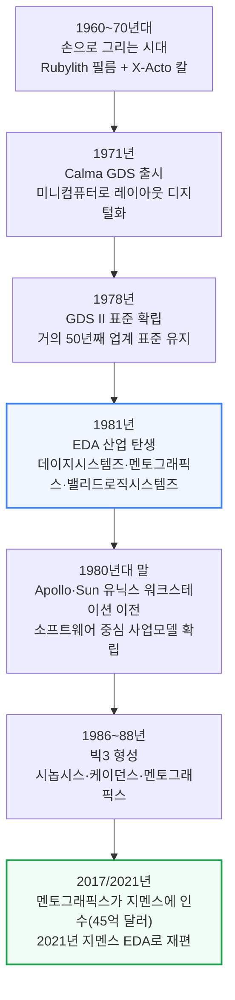
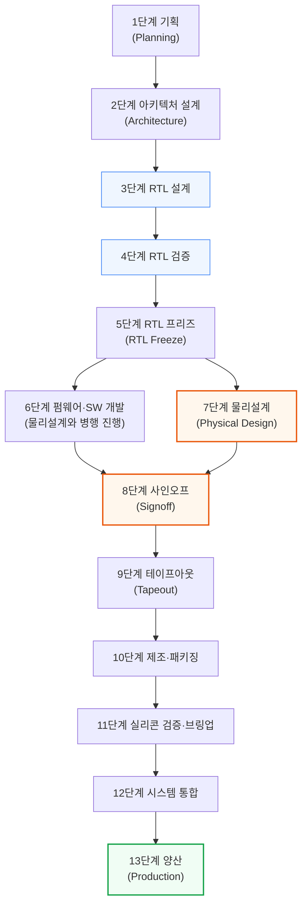
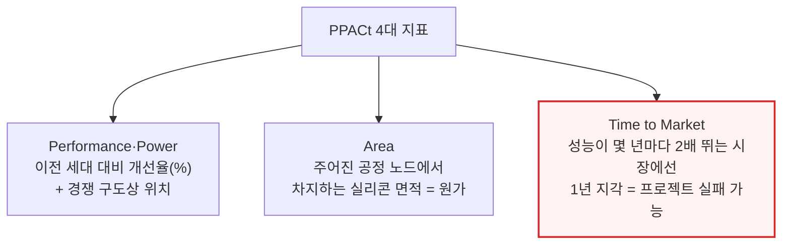
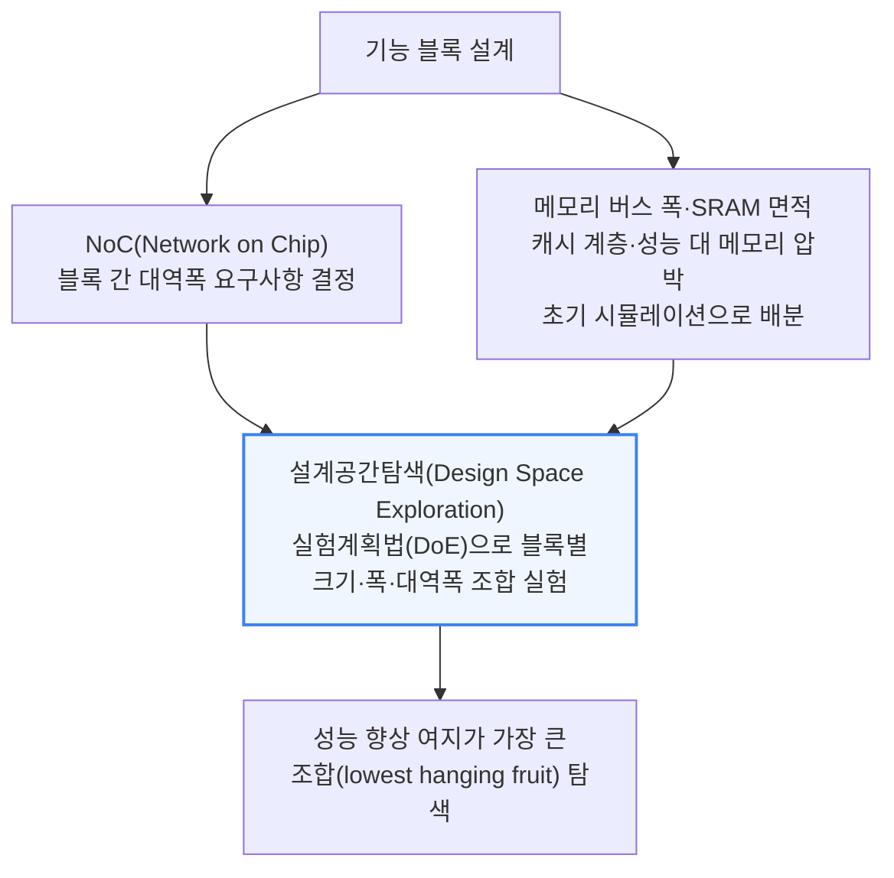
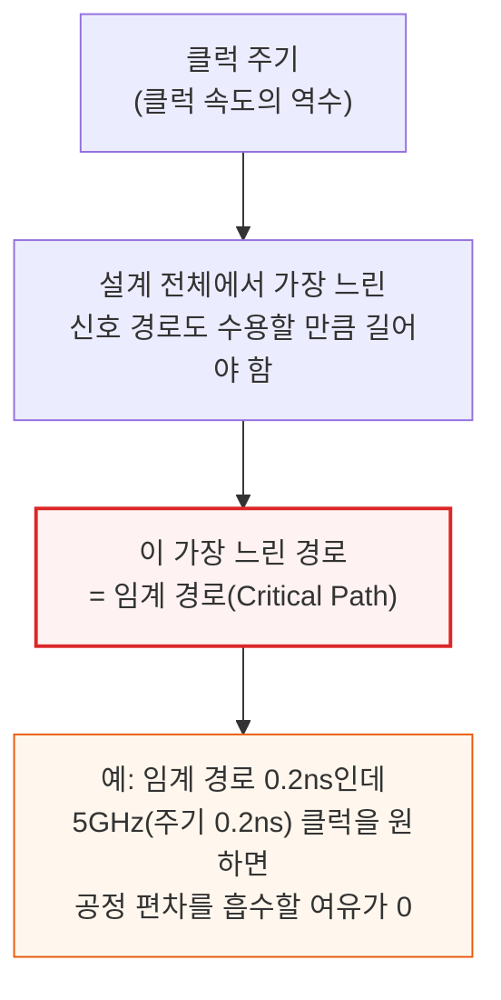
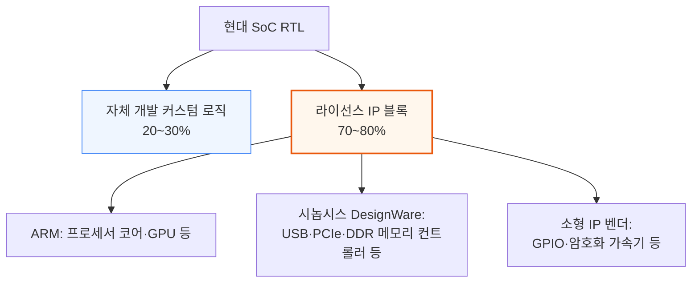
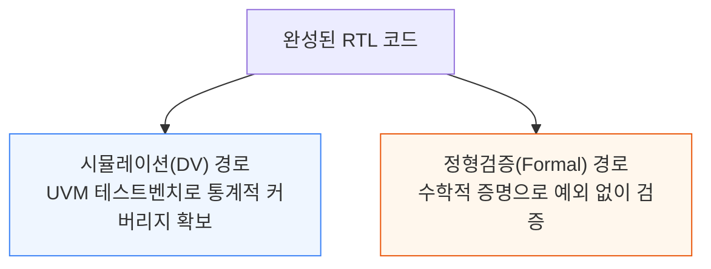
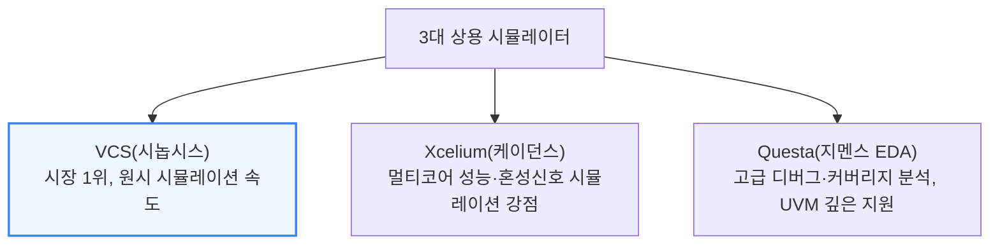
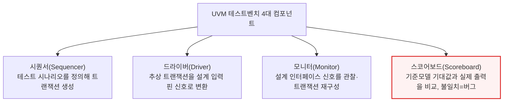
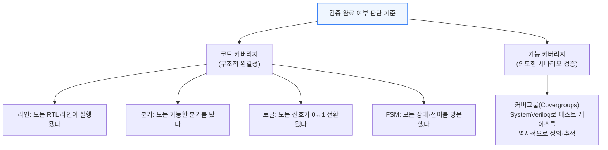

# The EDA Primer: From RTL to Silicon

> **출처**: [SemiAnalysis Newsletter](https://newsletter.semianalysis.com/p/the-eda-primer-from-rtl-to-silicon)
> **저자**: Gerald Wong, Dylan Patel, Sravan Kundojjala
> **발행일**: 2026-05-12

---

## 📑 목차

### 전체 섹션
 1. [EDA의 탄생 - 손으로 긋던 시절부터 빅3까지](#1-eda의-탄생---손으로-긋던-시절부터-빅3까지)
 2. [칩 설계 13단계 전체 흐름](#2-칩-설계-13단계-전체-흐름)
 3. [1단계 기획과 2단계 아키텍처 설계](#3-1단계-기획과-2단계-아키텍처-설계)
 4. [3단계 RTL 설계](#4-3단계-rtl-설계)
 5. [4단계 RTL 검증](#5-4단계-rtl-검증)
 6. [5단계 RTL 프리즈와 커버리지 마감](#6-5단계-rtl-프리즈와-커버리지-마감)
 7. [6단계 펌웨어·소프트웨어 병행 개발](#7-6단계-펌웨어소프트웨어-병행-개발)
 8. [7단계 물리설계 ① - 논리합성과 등가성 검증](#8-7단계-물리설계-①---논리합성과-등가성-검증)
 9. [7단계 물리설계 ② - 로직게이트와 표준셀 라이브러리](#9-7단계-물리설계-②---로직게이트와-표준셀-라이브러리)
10. [7단계 물리설계 ③ - 공정설계키트(PDK)](#10-7단계-물리설계-③---공정설계키트pdk)
11. [7단계 물리설계 ④ - 배치·배선 도구와 통합 플로우](#11-7단계-물리설계-④---배치배선-도구와-통합-플로우)
12. [8단계 사인오프](#12-8단계-사인오프)
13. [9단계 테이프아웃](#13-9단계-테이프아웃)
14. [10단계 제조와 패키징](#14-10단계-제조와-패키징)
15. [11단계 실리콘 검증과 브링업](#15-11단계-실리콘-검증과-브링업)
16. [12단계 시스템 통합과 13단계 양산](#16-12단계-시스템-통합과-13단계-양산)
17. [파운드리 안의 EDA - TCAD·DTCO·STCO](#17-파운드리-안의-eda---tcaddtcosto)
18. [칩 설계 현장의 민낯 - 일정 압축과 인력난](#18-칩-설계-현장의-민낯---일정-압축과-인력난)

---

## 🔑 용어 정리

본문을 순서대로 읽기 전에 알아두면 좋은 용어들입니다. 자세한 수치와 설명은 본문에서 처음 등장하는 위치에 나옵니다.

- **RTL (Register Transfer Level)**: 엔지니어가 "이 클럭에 어떤 레지스터가 어떤 값을 받는다"를 코드로 적는 설계 언어 수준 — 이 코드가 EDA 툴을 거쳐 실제 트랜지스터 배치로 변환됨
- **EDA (Electronic Design Automation, 전자설계자동화)**: 엔지니어가 작성한 회로 설계도를 실제 제조 가능한 칩 레이아웃으로 자동 변환해주는 소프트웨어 — 이 툴 없이는 1980년대 중반 이후 설계된 칩은 하나도 존재할 수 없음
- **논리합성 (Logic Synthesis)**: RTL 코드를 실제 논리 게이트들의 연결 지도(넷리스트)로 자동 변환하는 작업 — 수천 개 대안 구현 중 타이밍·면적·전력 균형이 가장 좋은 조합을 툴이 찾아냄
- **배치·배선 (Place and Route)**: 논리합성이 만든 수백만 개 게이트를 실제 칩 위 정확한 좌표에 배치하고, 그 사이를 금속 배선으로 연결하는 물리설계 단계
- **PDK (Process Design Kit, 공정설계키트)**: 파운드리의 제조 공정과 EDA 툴을 잇는 번역기 역할의 데이터 묶음 — 이게 없으면 설계도를 실제 웨이퍼로 만들 수 없음
- **사인오프 (Signoff)**: 물리설계가 끝난 레이아웃이 실제로 동작하고 제조 가능한지 마지막으로 전수 검증하는 관문 — 이걸 통과해야 파운드리로 설계도를 보낼 수 있음
- **테이프아웃 (Tapeout)**: 사인오프를 통과한 최종 레이아웃 파일(GDSII)을 파운드리에 보내는 milestone — 옛날에 이 파일을 자기테이프 릴에 담아 보내던 관행에서 유래한 이름
- **DTCO·STCO (설계-공정 공동최적화)**: DTCO는 칩 설계와 트랜지스터 공정을 동시에 조율해 성능·전력·면적을 끌어올리는 작업, STCO는 그 조율 범위를 칩 하나를 넘어 여러 다이·패키지 단위로 확장한 것

---

## 1. EDA의 탄생 - 손으로 긋던 시절부터 빅3까지

**📌 핵심:**
- 1960\~70년대엔 칩 회로를 사람이 직접 그렸음 — 붉은 셀로판 필름(Rubylith)을 칼로 오려 한 층씩 만들었고, 칼이 한 번 삐끗하면 몇 주 작업이 날아감
- 1978년 GDS II(마스크 데이터 교환 표준 파일 형식)가 나온 뒤 거의 50년이 지난 지금도 그대로 업계 표준으로 쓰임
- 1981년 세 회사(데이지시스템즈·멘토그래픽스·밸리드로직시스템즈)가 몇 달 간격으로 등장하며 EDA 산업이 시작됐고, 이후 시놉시스·케이던스·지멘스 EDA "빅3" 체제로 재편
- 결론: 1987년 시놉시스의 논리합성 툴 등장이 수천 개를 손으로 배치하던 방식에서 수십억 개 트랜지스터를 자동 설계하는 시대로의 도약을 열었음

---

칩 설계 자동화는 하루아침에 생긴 게 아니라, 손 작업의 한계가 임계점을 넘으면서 단계적으로 자동화된 결과입니다.

인텔 8080까지도 이 Rubylith 방식으로 설계됐습니다. 붉은 셀로판 필름을 라이트 테이블 위에서 칼로 오려 층별 도면을 만들고, 완성된 원판을 최대 100배 축소 인화해 실제 제조용 포토마스크를 만드는 방식이었습니다.

1971년 Calma가 인텔에 납품한 GDS(Graphic Design System)가 최초의 자동화 시도였습니다. 이후 1978년 나온 GDS II의 스트림 파일 형식이 마스크 데이터를 주고받는 사실상의 표준이 됐고, 후속 규격인 OASIS와 함께 거의 50년이 지난 지금도 그대로 쓰입니다.

1981년 세 회사가 몇 달 간격으로 등장하며 EDA 산업이 본격 시작됐습니다. 데이지시스템즈(Daisy Systems), 멘토그래픽스(Mentor Graphics), 밸리드로직시스템즈(Valid Logic Systems) — 흔히 "DMV"로 불리는 이 세 회사가 회로도 캡처·시뮬레이션·논리검증 같은 설계 전반부(프론트엔드) 작업을 컴퓨터로 옮겨왔습니다. 1980년대 말에는 셋 다 Apollo·Sun Microsystems의 표준 유닉스 워크스테이션으로 옮겨가며, 오늘날까지 이어지는 소프트웨어 중심 사업 모델을 확립했습니다.

### 빅3의 형성

오늘날 EDA 시장은 세 회사가 지배합니다. **시놉시스(Synopsys)**는 1986년 제너럴일렉트릭 연구그룹 출신 아트 드 지우스(Aart de Geus) 등이 창업했고, 1987년 세계 최초 상업용 **논리합성(Logic Synthesis, RTL 코드를 실제 논리 게이트 연결 지도로 자동 변환하는 작업)** 툴인 Design Compiler를 출시했습니다. 이 도약으로 손으로 배치하던 수천 개 트랜지스터가 오늘날 설계하는 수십억 개 트랜지스터로 뛰어올랐습니다.

**케이던스(Cadence Design Systems)**는 1988년 SDA Systems와 ECAD의 합병으로 출범해 빠르게 IC 레이아웃·배치배선 툴 시장 선두가 됐습니다. **멘토그래픽스**는 DMV 창립 3사 중 하나였다가 **2017년 지멘스에 45억 달러에 인수**되고 2021년 **지멘스 EDA**로 재편되며, 지멘스 디지털인더스트리 포트폴리오에 깊은 검증·물리설계 전문성을 더했습니다.

논리합성은 단순히 설계 속도만 높인 게 아니라 가능한 것의 범위 자체를 바꿨습니다. 수동으로 게이트를 배치하던 방식을 추상화로 걷어내면서, 오늘날의 수십억 트랜지스터급 SoC(System on Chip, 여러 기능을 한 칩에 통합한 시스템)를 만드는 수백만 배 규모의 설계 복잡도 증가를 감당할 수 있게 됐습니다.

---

## 2. 칩 설계 13단계 전체 흐름

**📌 핵심:**
- 칩 하나를 만드는 과정은 13개 구간으로 이어진 다년간의 릴레이 경주와 같음 — 한 구간에서 바통을 놓치면 전체 일정이 몇 달, 심하면 몇 분기씩 밀림
- 흐름은 기획 → 아키텍처 → RTL 설계·검증 → 물리설계 → 사인오프 → 테이프아웃 → 제조 → 실리콘 검증 → 양산 순으로 이어짐
- 이 글이 다루는 순서는 단순화한 "워터폴(waterfall, 폭포수형 순차 진행)" 그림일 뿐, 실제로는 각 단계가 크게 겹치고 되돌아가는 반복이 일어남
- 결론: 검증 단계에서 발견된 아키텍처 버그가 RTL을 다시 고치게 만들고, 물리설계에서 타이밍이 실패하면 다시 앞 단계로 돌아가는 식으로 수십 개 피드백 루프가 동시에 돌아가는데, 이걸 사람이 손으로 추적할 수 없기 때문에 EDA 툴이 필요함

---

아래는 이 문서 전체가 따라가는 뼈대입니다. 이후 모든 섹션은 이 13단계 중 어디에 해당하는지 제목에 표시합니다.

6단계(펌웨어·소프트웨어 개발)와 7단계(물리설계)가 5단계에서 동시에 갈라지는 이유는, 소프트웨어 팀이 실리콘이 나올 때까지 기다릴 여유가 없기 때문입니다. RTL이 얼어붙는(freeze) 순간부터 두 팀이 각자의 트랙을 병행해서 달리다가 8단계 사인오프에서 다시 합류합니다.

이 그림은 단순화한 워터폴(순서대로 한 방향으로만 흐르는) 뷰일 뿐입니다. 실제로는 각 단계가 크게 겹치고 서로 되돌아갑니다. 검증 중에 발견된 아키텍처 버그는 RTL을 다시 고치게 만들고, 물리설계에서 타이밍이 실패하면 엔지니어들이 임계 경로(critical path, 신호가 가장 늦게 도착하는 경로)를 다시 최적화하러 돌아갑니다. 현대 SoC 프로그램 하나가 이런 피드백 루프를 동시에 수십 개씩 관리하는데, 이게 바로 사람 손으로는 다 추적할 수 없어 EDA 툴이 반드시 필요한 이유입니다.

---

## 3. 1단계 기획과 2단계 아키텍처 설계

**📌 핵심:**
- 1단계 기획에서는 칩이 맡을 역할과 목표 시장을 정하고, PPACt(성능·전력·면적·시간, 아래 설명)라는 4대 지표로 기획을 관리 — 성장이 빠른 시장에서는 1년만 늦어도 프로젝트 자체가 실패할 수 있음
- 2단계 아키텍처 설계에서는 각 기능 블록에 면적을 미리 배분하는 플로어플랜(floorplan, 칩 내부 구역 배치도)을 그리고, 설계공간탐색(Design Space Exploration)으로 블록 크기·대역폭 조합을 실험
- AI 가속기라면 이 단계에서 데이터플로우 가속기를 추가하거나 행렬곱 엔진 폭을 두 배로 늘리는 식으로 설계 공간을 넓힘
- 결론: 두 단계 모두 아직 코드 한 줄 쓰기 전이지만, 여기서 정한 면적·전력·일정 목표가 이후 모든 단계의 제약 조건이 됨

---

### 1단계: 기획 - PPACt로 프로젝트를 관리한다

칩 설계 부서는 보통 CPU·가속기 같은 특정 칩 계열에 전문화돼 있습니다. 제품 요구사항과 상위 스펙은 현재 세대 제품과 목표 시장 내 경쟁사 분석을 기준으로 정해집니다. 초안 개념(strawman)은 여러 설계팀 IP 블록의 투입 일정에 맞춰 빠르게 수정되고, 이전 프로젝트의 사후분석(post-mortem)에서 얻은 교훈이 지식 기반으로 축적돼 무엇이 통했고 어떤 목표가 그 일정엔 과욕이었는지 판단하는 데 쓰입니다.

이 타당성 조사가 통과하려면 경영진의 승인(그린라이트)이 필요합니다. 각 회사는 정해진 R&D 예산과 유한한 엔지니어링 인력 안에서 움직여야 하고, 진행 중인 다른 프로젝트와 일정을 조율해 마감을 엄격히 지켜야 엔지니어를 다음 프로젝트에 투입할 수 있습니다. 웨이퍼·메모리·패키징 수요를 미리 공급사에 전달해 생산 능력(캐파)을 확보하는 일도 이 단계부터 갈수록 중요해지고 있습니다.

### 2단계: 아키텍처 설계 - 면적을 먼저 나눠주는 설계공간탐색

기획과 밀접하게 맞물려, 아키텍처 단계는 설계공간탐색(Design Space Exploration)과 함께 진행됩니다. 상위 플로어플랜(floorplan) 도면이 각 로직·IO 블록 설계팀이 작업할 면적 경계 상자를 초기에 정하고, 각 기능 블록은 더 작은 요소들로 쪼개져 설계 전반에 반복 배치됩니다. 이 면적 예산은 설계 도중 늘어날 수도 있는데, 명령어 집합(ISA)에 새 명령어를 지원하는 연산 요소가 추가되거나, AI 가속기라면 데이터플로우 가속기를 붙이고 행렬곱(Matrix Multiplication) 엔진 폭을 두 배로 늘리는 식의 기능 추가가 나중에 반영되기 때문입니다.

이 탐색 작업은 갈수록 AI로 가속되고 있습니다. PPA(성능·전력·면적) 개선이라는 목표를 다차원 입력 공간에서 검증 가능한 보상 함수로 정의할 수 있기 때문입니다. 시놉시스의 DSO.ai 같은 자체 AI 탐색 툴이, 팹리스 설계사들이 그동안 내부적으로 해오던 AI 기반 경로 탐색·기획 가속 시도들을 뒤따르고 있습니다. 이 부분의 심층 분석은 이 시리즈의 Part 3에서 다룰 예정입니다.

---

## 4. 3단계 RTL 설계

**📌 핵심:**
- RTL(Register Transfer Level) 코드는 매 클럭 신호마다 어떤 레지스터가 어떤 값을 받는지 사람과 합성 툴이 함께 읽을 수 있는 언어로 적은 것 — 칩 설계 엔지니어링 시간의 대부분이 이 RTL을 쓰고 검증하는 데 들어감
- 신호가 전선을 타고 이동하는 시간(배선 지연)이 트랜지스터 자체가 스위칭하는 시간(게이트 지연)보다 첨단 공정으로 갈수록 더 커지는데, 이 둘을 합친 가장 느린 경로(임계 경로)가 칩이 낼 수 있는 최고 클럭 속도를 결정
- 현대 SoC RTL의 70\~80%는 자체 개발이 아니라 ARM 코어·시놉시스 DesignWare 같은 라이선스 IP 블록 — 커스텀 PCIe Gen 6 컨트롤러를 처음부터 만드는 대신 검증까지 끝난 IP를 사는 게 훨씬 저렴
- 결론: RTL 설계는 "코드를 짠다"기보다 타이밍 물리·상태 논리·외부 IP 통합이라는 세 가지 제약을 동시에 만족시키는 작업

---

### 신호 타이밍 - 임계 경로가 클럭 속도의 천장을 정한다

트랜지스터는 순식간에 스위칭하지 않습니다. 입력이 바뀐 뒤 출력이 안정되기까지 걸리는 전파 지연(propagation delay)에는 두 요소가 있습니다. 게이트 지연(트랜지스터 자체가 스위칭하는 속도)과 배선 지연(전기 신호가 금속 배선을 타고 다음 게이트까지 이동하는 시간)입니다. 첨단 공정으로 갈수록 트랜지스터는 더 빨리 스위칭하는데 반해 데이터 경로는 설계가 복잡해지며 길어져, 배선 지연이 게이트 지연을 압도하게 됩니다.

디지털 칩은 클럭 신호로 모든 동작을 동기화합니다. 정확한 동작을 보장하는 두 가지 타이밍 제약이 있습니다. **셋업 타임(Setup Time)**은 클럭 신호가 도착하기 전 최소한 얼마 동안 입력 데이터가 안정돼 있어야 하는지를, **홀드 타임(Hold Time)**은 클럭 신호 도착 후 얼마 동안 데이터가 안정돼 있어야 하는지를 규정합니다.

이 때문에 타이밍 최적화는 칩 설계에서 가장 많은 노력이 들어가는 작업 중 하나이며, 성능과 복잡도 사이의 수많은 트레이드오프를 동반합니다.

### 상태 요소 - 플립플롭이 쌓여 유한상태기계를 만든다

조합논리(combinational logic)는 입력에서 출력을 계산하지만, 카운터나 프로세서 파이프라인 단계, 프로토콜 엔진 같은 유용한 기능을 만들려면 여기에 메모리를 결합해야 합니다. 이 메모리 레지스터는 **플립플롭(flip-flop)**으로 구현되며, 매 클럭 에지마다 1비트를 붙잡아 유지하는 아주 작은 1비트 메모리 역할을 합니다. 여러 플립플롭이 조합논리와 함께 연결돼 **유한상태기계(Finite State Machine, FSM)**를 이루며, 정해진 상태 시퀀스를 한 클럭 사이클씩 순차적으로 밟아 나갑니다. 이것이 순차논리(sequential logic)이며, 칩이 연산을 수행하는 기반입니다. 즉 RTL은 매 클럭 사이클마다 데이터가 레지스터와 조합논리 사이에서 어떻게 움직이는지를 기술하는 추상화입니다.

### RTL을 쓰고 검사하기

RTL은 하드웨어 기술 언어(HDL)로 작성합니다. 오늘날 지배적인 선택은 **SystemVerilog**로, 기존 Verilog 언어에 설계·검증 기능을 모두 확장한 버전입니다. 더 오래된 대안인 VHDL은 여전히 항공우주·레거시 애플리케이션에 남아 있습니다. RTL을 다 쓰면 린팅(linting, 시뮬레이션 없이 하는 정적 분석)을 거쳐 코딩 실수·경쟁 조건·문법 오류를 잡아냅니다. 시놉시스의 **VC SpyGlass**가 업계 표준 린팅 툴로, 간헐적 실리콘 오작동을 일으킬 수 있는 미묘한 문제까지 짚어냅니다. 컴파일러의 경고 플래그와 비슷하지만 대가가 훨씬 큰 버전인 셈입니다.

### IP 통합 - RTL의 70~80%는 사오는 것

IP 라이선싱은 순전히 경제성 문제입니다. 커스텀 PCIe Gen 6 컨트롤러를 처음부터 만들려면 PCI-SIG 규격 준수를 증명할 전담 I/O 설계·검증 팀을 새로 꾸려야 합니다. 반면 라이선스를 받으면 그 비용의 일부만으로 이미 규격 검증까지 끝난 블록을 손에 넣습니다. 다만 IP 통합 자체는 쉽지 않은데, 이는 뒤 섹션(칩 설계 현장의 민낯)에서 다룹니다.

---

## 5. 4단계 RTL 검증

**📌 핵심:**
- RTL이 완성되면 시뮬레이션(소프트웨어로 설계를 돌려 입력을 넣고 출력을 확인하는 방식)으로 버그를 찾는데, VCS(시놉시스)·Xcelium(케이던스)·Questa(지멘스 EDA) 3개 상용 시뮬레이터가 시장을 나눠 가짐 — 대형 칩 설계사 대부분이 이 중 2개 이상을 함께 라이선스
- 복잡한 SoC 하나의 전체 회귀 테스트는 수만 개 테스트 케이스에 코어-시간 기준 수천 시간이 들 수 있어, 사내 서버만으로는 부족해 AWS·Azure 클라우드로 처리 능력을 보충
- UVM(Universal Verification Methodology)이라는 업계 표준 테스트벤치 구조로 시퀀서·드라이버·모니터·스코어보드 네 컴포넌트를 정의해 재사용 가능한 검증 환경을 만듦
- 결론: 시뮬레이션이 통계적 신뢰도로 칩 전체를 훑는다면, 정형검증(Formal Verification, 수학적 증명으로 모든 경우의 수를 증명)은 특정 블록의 특정 속성을 예외 없이 증명 — 둘은 대체재가 아니라 서로 보완하는 관계

---

RTL 검증은 검증공학자(Verification Engineer)가 칩 설계 조직에서 가장 빠르게 늘어나는 직군이 될 만큼 인력이 많이 필요한 단계입니다. 설계가 복잡해질수록 서로 맞물려 검증해야 할 항목이 늘어나는데, 업계는 여전히 이 인력을 채용 속도로 따라잡지 못하고 있습니다.

### 시뮬레이션 - 3강 체제와 클라우드 버스트

대형 칩 설계사 대부분이 이 중 최소 2개를 함께 라이선스합니다. 복잡한 SoC의 전체 회귀 테스트 스위트를 수만 개 테스트 케이스로 돌리면 실행 한 번에 수천 코어-시간이 소요될 수 있는데, 사내 전용 검증 서버만으로는 이제 부족한 경우가 많아 테이프아웃 직전 몰리는 기간엔 AWS·Azure 클라우드 시뮬레이션으로 순간 처리 능력을 보충합니다. 여기서 생성되는 데이터량도 어마어마해, 칩 하나의 전체 정의와 테스트 항목만 담는 데도 수 페타바이트 저장 공간이 필요합니다.

### UVM 테스트벤치 - 4개 컴포넌트로 표준화된 재사용 구조

RTL 시뮬레이션은 **UVM(Universal Verification Methodology)**이라는 구조로 짜입니다. 재사용 가능한 테스트벤치를 만들기 위한 SystemVerilog 라이브러리·방법론의 업계 표준으로, 2011년 Accellera가 표준화하기 전에는 팀마다 제각각 테스트벤치 구조를 만들었습니다.

이 테스트벤치는 **제약 랜덤 검증(Constrained Random Verification)**에 쓰입니다. 모든 테스트 케이스를 일일이 손으로 쓰는 대신, 엔지니어는 합법적 주소 범위·유효한 패킷 형식·프로토콜 규칙 같은 제약 조건만 정의합니다. 툴이 그 범위 안에서 수백만 개 입력 조합을 무작위로 생성해, 지정된 테스트만으로는 잡지 못했을 구석진 버그를 찾아냅니다. 표본 범위가 넓어 자원 소모가 크지만, 지정 테스트만 쓰는 방식보다 버그 검출에 대체로 더 효과적입니다.

### 정형검증 - 수학적 증명으로 예외를 없앤다

정형검증은 시뮬레이션과 근본적으로 다른 접근입니다. 특정 입력을 넣고 출력을 확인하는 대신, SAT 솔버·모델 체커 같은 수학적 증명 엔진으로 설계 속성이 모든 가능한 입력·상태 시퀀스에서 성립함을 완전히 증명합니다. 속성이 깨질 수 있다면 툴이 정확히 어떻게 깨지는지 반례를 제시합니다. 검증 대상 속성은 보통 SystemVerilog Assertions(SVA)로 정의합니다.

대표 툴은 **JasperGold**(케이던스)와 **VC Formal**(시놉시스)입니다. 정형검증은 프로토콜 준수(예: 핸드셰이크 신호가 3사이클 넘게 유지되지 않는다), 제어 로직의 정확성, 보안 속성(예: 이 레지스터는 상위 권한 소프트웨어 전용이다) 검증에 강합니다. 다만 확장성에 한계가 있어, 버스 폭이 넓은 데이터패스 위주 설계에서는 정형 엔진이 용량 한계에 부딪힙니다. 실무에서는 정형검증이 특정 블록의 핵심 속성을 예외 없이 증명하고, 시뮬레이션이 칩 전체를 통계적 신뢰도로 훑는 식으로 두 방식이 서로 보완합니다.

---

## 6. 5단계 RTL 프리즈와 커버리지 마감

**📌 핵심:**
- 검증이 끝났는지 판단하는 기준은 두 가지 커버리지 — 코드 커버리지(RTL 구조를 얼마나 실행했는지)와 기능 커버리지(의도한 시나리오를 실제로 테스트했는지)
- 테스트 케이스의 90%는 빠르게 통과하지만 나머지 10%(진짜 어려운 코너 케이스)를 채우는 데 몇 주가 걸리기도 함
- 모든 커버리지 목표를 채우고 목표 심각도 이상의 미해결 버그가 없으면 RTL 프리즈(더 이상 기능 변경 불가) 마일스톤에 도달
- 결론: 프리즈 이후 수정은 반드시 재검증과 등가성 검사가 필요한 정식 절차인 ECO(Engineering Change Order)를 거쳐야 하고, 이 경계가 프론트엔드 설계와 백엔드 물리설계를 분리하는 기준이 됨

---

기능 커버리지는 "우리가 신경 쓰는 시나리오를 실제로 테스트했는가", "아직 신경 써야 할 코너 케이스가 남았는가(예: 같은 주소로의 동시 쓰기, FIFO 버퍼가 가득 찬 상태에서 인터럽트 대기)"를 확인합니다. 테스트 케이스의 90%는 빠르게 끝나지만, 남은 10%를 채우는 커버리지 마감(Coverage Closure)은 다른 테스트의 제약·예외 조건을 추가·수정하며 표적 테스트를 새로 쓰는 데 몇 주씩 걸리기도 합니다. 테스트 케이스가 구체적이고 복잡할수록 그 설계가 취약한지 판단하는 데 필요한 지식도 전문화되는데, 설계사들은 과거 설계에서 쌓은 방대한 학습 이력을 근거로 어떤 테스트를 우선할지 정합니다.

모든 커버리지 목표가 채워지고 목표 심각도 이상의 미해결 버그가 없으면 프로젝트의 RTL이 얼어붙습니다(freeze). 이 공식 마일스톤을 **RTL 프리즈**라고 하며, 이 시점부터는 어떤 RTL 기능 변경도 허용되지 않습니다. 이후 수정은 재검증과 등가성 검사가 필요한 **ECO(Engineering Change Order)**라는 정식 절차를 반드시 거쳐야 합니다. ECO는 나중에 발견된 버그를 고치거나 타이밍을 조정하기 위해 설계 후반부에도 필요할 수 있습니다. RTL 프리즈는 다음 단계인 물리설계가 확고한 기준선 위에서 작업을 시작할 수 있게 해주는, 프론트엔드 설계와 백엔드 물리설계를 가르는 경계선입니다.

검증은 종종 칩 설계에서 화려하지 않은 뒷단 취급을 받지만, 새 아키텍처 개발에서는 핵심적인 단계입니다. 칩을 설계하는 것 자체는 쉽지만, 모든 시나리오에서 설계가 제대로 동작한다는 걸 아는 것은 어렵습니다.

---

*작성 진행률: 약 40% 완료 (섹션 1~6)*
*업데이트: 3단계 RTL 설계, 4단계 RTL 검증, 5단계 RTL 프리즈·커버리지 마감 작성 완료*
