# The EDA Primer: From RTL to Silicon

> **출처**: [SemiAnalysis Newsletter](https://newsletter.semianalysis.com/p/the-eda-primer-from-rtl-to-silicon)
> **저자**: Gerald Wong, Dylan Patel, Sravan Kundojjala
> **발행일**: 2026-05-12

---

## 📑 목차

### 전체 섹션
 1. [EDA의 탄생 - 손으로 긋던 시절부터 빅3까지](#1-eda의-탄생---손으로-긋던-시절부터-빅3까지)
 2. [칩 설계 13단계 전체 흐름](#2-칩-설계-13단계-전체-흐름)
 3. [1단계 기획과 2단계 아키텍처 설계](#3-1단계-기획과-2단계-아키텍처-설계)
 4. [3단계 RTL 설계](#4-3단계-rtl-설계)
 5. [4단계 RTL 검증](#5-4단계-rtl-검증)
 6. [5단계 RTL 프리즈와 커버리지 마감](#6-5단계-rtl-프리즈와-커버리지-마감)
 7. [6단계 펌웨어·소프트웨어 병행 개발](#7-6단계-펌웨어소프트웨어-병행-개발)
 8. [7단계 물리설계 ① - 논리합성과 등가성 검증](#8-7단계-물리설계-①---논리합성과-등가성-검증)
 9. [7단계 물리설계 ② - 로직게이트와 표준셀 라이브러리](#9-7단계-물리설계-②---로직게이트와-표준셀-라이브러리)
10. [7단계 물리설계 ③ - 공정설계키트(PDK)](#10-7단계-물리설계-③---공정설계키트pdk)
11. [7단계 물리설계 ④ - 배치·배선 도구와 통합 플로우](#11-7단계-물리설계-④---배치배선-도구와-통합-플로우)
12. [8단계 사인오프](#12-8단계-사인오프)
13. [9단계 테이프아웃](#13-9단계-테이프아웃)
14. [10단계 제조와 패키징](#14-10단계-제조와-패키징)
15. [11단계 실리콘 검증과 브링업](#15-11단계-실리콘-검증과-브링업)
16. [12단계 시스템 통합과 13단계 양산](#16-12단계-시스템-통합과-13단계-양산)
17. [파운드리 안의 EDA - TCAD·DTCO·STCO](#17-파운드리-안의-eda---tcaddtcosto)
18. [칩 설계 현장의 민낯 - 일정 압축과 인력난](#18-칩-설계-현장의-민낯---일정-압축과-인력난)

---

## 🔑 용어 정리

본문을 순서대로 읽기 전에 알아두면 좋은 용어들입니다. 자세한 수치와 설명은 본문에서 처음 등장하는 위치에 나옵니다.

- **RTL (Register Transfer Level)**: 엔지니어가 "이 클럭에 어떤 레지스터가 어떤 값을 받는다"를 코드로 적는 설계 언어 수준 — 이 코드가 EDA 툴을 거쳐 실제 트랜지스터 배치로 변환됨
- **EDA (Electronic Design Automation, 전자설계자동화)**: 엔지니어가 작성한 회로 설계도를 실제 제조 가능한 칩 레이아웃으로 자동 변환해주는 소프트웨어 — 이 툴 없이는 1980년대 중반 이후 설계된 칩은 하나도 존재할 수 없음
- **논리합성 (Logic Synthesis)**: RTL 코드를 실제 논리 게이트들의 연결 지도(넷리스트)로 자동 변환하는 작업 — 수천 개 대안 구현 중 타이밍·면적·전력 균형이 가장 좋은 조합을 툴이 찾아냄
- **배치·배선 (Place and Route)**: 논리합성이 만든 수백만 개 게이트를 실제 칩 위 정확한 좌표에 배치하고, 그 사이를 금속 배선으로 연결하는 물리설계 단계
- **PDK (Process Design Kit, 공정설계키트)**: 파운드리의 제조 공정과 EDA 툴을 잇는 번역기 역할의 데이터 묶음 — 이게 없으면 설계도를 실제 웨이퍼로 만들 수 없음
- **사인오프 (Signoff)**: 물리설계가 끝난 레이아웃이 실제로 동작하고 제조 가능한지 마지막으로 전수 검증하는 관문 — 이걸 통과해야 파운드리로 설계도를 보낼 수 있음
- **테이프아웃 (Tapeout)**: 사인오프를 통과한 최종 레이아웃 파일(GDSII)을 파운드리에 보내는 milestone — 옛날에 이 파일을 자기테이프 릴에 담아 보내던 관행에서 유래한 이름
- **DTCO·STCO (설계-공정 공동최적화)**: DTCO는 칩 설계와 트랜지스터 공정을 동시에 조율해 성능·전력·면적을 끌어올리는 작업, STCO는 그 조율 범위를 칩 하나를 넘어 여러 다이·패키지 단위로 확장한 것

---

## 1. EDA의 탄생 - 손으로 긋던 시절부터 빅3까지

**📌 핵심:**
- 1960\~70년대엔 칩 회로를 사람이 직접 그렸음 — 붉은 셀로판 필름(Rubylith)을 칼로 오려 한 층씩 만들었고, 칼이 한 번 삐끗하면 몇 주 작업이 날아감
- 1978년 GDS II(마스크 데이터 교환 표준 파일 형식)가 나온 뒤 거의 50년이 지난 지금도 그대로 업계 표준으로 쓰임
- 1981년 세 회사(데이지시스템즈·멘토그래픽스·밸리드로직시스템즈)가 몇 달 간격으로 등장하며 EDA 산업이 시작됐고, 이후 시놉시스·케이던스·지멘스 EDA "빅3" 체제로 재편
- 결론: 1987년 시놉시스의 논리합성 툴 등장이 수천 개를 손으로 배치하던 방식에서 수십억 개 트랜지스터를 자동 설계하는 시대로의 도약을 열었음

---

### 왜 지금 EDA가 병목인가

AI 수요가 컴퓨트 폭발을 이끌면서, 칩 설계 자체가 새로운 병목이 되고 있습니다.

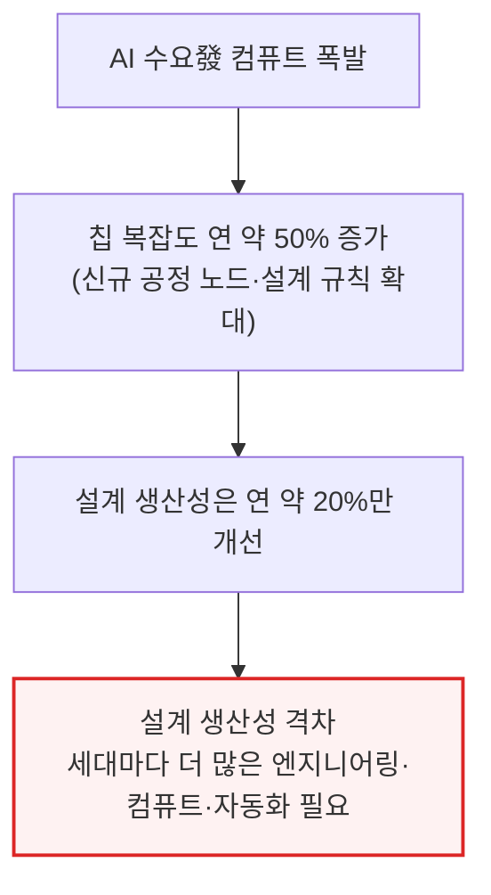

- AMD MI455X 예시: 2nm·3nm 공정 로직 다이 12개에 트랜지스터 3,200억 개를 하이브리드 본딩 3D 적층·HBM4 메모리·224G SerDes로 통합 — 이 규모는 엔지니어를 더 뽑거나 검증 서버를 더 사는 것만으로 해결되지 않음
- 신규 SoC 설계에 수억 달러를 쓰고도 성공은 보장 안 됨 — 여러 차례 스테핑에 새 마스크셋이 필요하고, 첨단 마스크셋 하나가 수천만 달러라 재작업(respin)마다 재무제표에 타격을 주며 양산 시작이 몇 달씩 밀림
- **검증(Verification)**은 설계에 따라 전체 프로젝트 노력의 최대 70%를 소비 — 검증공학자가 칩 개발에서 가장 빠르게 느는 직군인데도 업계는 채용 속도를 못 따라잡음
- 미국 반도체 인력의 3분의 1이 55세 이상, 신규 졸업자 파이프라인은 그 공백을 메우기엔 턱없이 부족 — 애플의 New Silicon Initiative 같은 교육 투자도 전자공학 인력 수요 폭증에 비하면 미미한 수준

칩 설계 자동화는 하루아침에 생긴 게 아니라, 손 작업의 한계가 임계점을 넘으면서 단계적으로 자동화된 결과입니다.

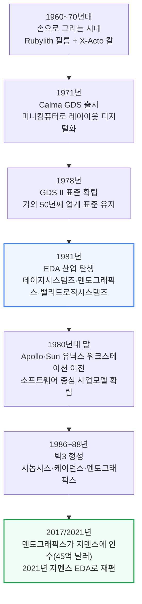

인텔 8080까지도 이 Rubylith 방식으로 설계됐습니다.

- **Rubylith 방식**: 라이트 테이블 위에서 필름을 칼로 오려 층별 도면을 만들고, 완성된 원판을 최대 100배 축소 인화해 실제 제조용 포토마스크로 만듦
- **1971년 Calma GDS**: 인텔에 납품된 최초의 자동화 시도로, 레이아웃을 미니컴퓨터로 디지털화·편집
- **1978년 GDS II**: 스트림 파일 형식이 마스크 데이터를 주고받는 사실상 표준이 됐고, 후속 규격 OASIS와 함께 거의 50년째 그대로 쓰임
- **1981년 "DMV"**: 데이지시스템즈·멘토그래픽스·밸리드로직시스템즈가 회로도 캡처·시뮬레이션·논리검증 같은 설계 전반부(프론트엔드) 작업을 컴퓨터로 옮겨옴
- **1980년대 말**: 셋 다 Apollo·Sun Microsystems의 표준 유닉스 워크스테이션으로 이전, 오늘날까지 이어지는 소프트웨어 중심 사업 모델 확립

### 빅3의 형성

- **시놉시스(Synopsys)**: 1986년 제너럴일렉트릭 연구그룹 출신 아트 드 지우스(Aart de Geus) 등이 창업, 1987년 세계 최초 상업용 논리합성(Logic Synthesis, RTL 코드를 실제 논리 게이트 연결 지도로 자동 변환하는 작업) 툴인 Design Compiler 출시
- **케이던스(Cadence Design Systems)**: 1988년 SDA Systems와 ECAD의 합병으로 출범, 빠르게 IC 레이아웃·배치배선 툴 시장 선두가 됨
- **멘토그래픽스**: DMV 창립 3사 중 하나였다가 2017년 지멘스에 45억 달러에 인수되고 2021년 지멘스 EDA로 재편, 지멘스 디지털인더스트리 포트폴리오에 깊은 검증·물리설계 전문성을 더함

논리합성은 설계 속도만 높인 게 아니라 가능한 것의 범위 자체를 바꿨습니다. 수동으로 게이트를 배치하던 방식을 추상화로 걷어내면서, 오늘날의 수십억 트랜지스터급 SoC(System on Chip, 여러 기능을 한 칩에 통합한 시스템)를 만드는 수백만 배 규모의 설계 복잡도 증가를 감당할 수 있게 됐습니다.

---

## 2. 칩 설계 13단계 전체 흐름

**📌 핵심:**
- 칩 하나를 만드는 과정은 13개 구간으로 이어진 다년간의 릴레이 경주와 같음 — 한 구간에서 바통을 놓치면 전체 일정이 몇 달, 심하면 몇 분기씩 밀림
- 흐름은 기획 → 아키텍처 → RTL 설계·검증 → 물리설계 → 사인오프 → 테이프아웃 → 제조 → 실리콘 검증 → 양산 순으로 이어짐
- 이 글이 다루는 순서는 단순화한 "워터폴(waterfall, 폭포수형 순차 진행)" 그림일 뿐, 실제로는 각 단계가 크게 겹치고 되돌아가는 반복이 일어남
- 결론: 검증 단계에서 발견된 아키텍처 버그가 RTL을 다시 고치게 만들고, 물리설계에서 타이밍이 실패하면 다시 앞 단계로 돌아가는 식으로 수십 개 피드백 루프가 동시에 돌아가는데, 이걸 사람이 손으로 추적할 수 없기 때문에 EDA 툴이 필요함

---

아래는 이 문서 전체가 따라가는 뼈대입니다. 이후 모든 섹션은 이 13단계 중 어디에 해당하는지 제목에 표시합니다.

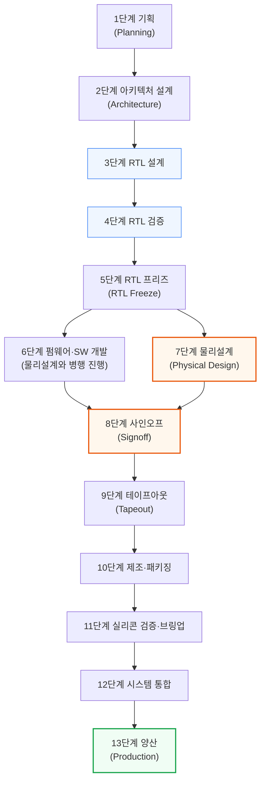

- 6단계(펌웨어·SW)와 7단계(물리설계)가 5단계에서 동시에 갈라지는 이유: 소프트웨어 팀이 실리콘이 나올 때까지 기다릴 여유가 없어, RTL이 얼어붙는 순간부터 두 트랙이 병행 진행되다 8단계 사인오프에서 다시 합류
- 이 그림은 단순화한 워터폴 뷰일 뿐 — 검증 중 발견된 아키텍처 버그가 RTL을 다시 고치게 만들고, 물리설계 타이밍 실패는 임계 경로(critical path, 신호가 가장 늦게 도착하는 경로) 재최적화로 되돌아감
- 현대 SoC 프로그램 하나가 이런 피드백 루프를 동시에 수십 개씩 관리하는데, 이게 사람 손으로는 다 추적할 수 없어 EDA 툴이 반드시 필요한 이유

---

## 3. 1단계 기획과 2단계 아키텍처 설계

**📌 핵심:**
- 1단계 기획에서는 칩이 맡을 역할과 목표 시장을 정하고, PPACt(성능·전력·면적·시간, 아래 설명)라는 4대 지표로 기획을 관리 — 성장이 빠른 시장에서는 1년만 늦어도 프로젝트 자체가 실패할 수 있음
- 2단계 아키텍처 설계에서는 각 기능 블록에 면적을 미리 배분하는 플로어플랜(floorplan, 칩 내부 구역 배치도)을 그리고, 설계공간탐색(Design Space Exploration)으로 블록 크기·대역폭 조합을 실험
- AI 가속기라면 이 단계에서 데이터플로우 가속기를 추가하거나 행렬곱 엔진 폭을 두 배로 늘리는 식으로 설계 공간을 넓힘
- 결론: 두 단계 모두 아직 코드 한 줄 쓰기 전이지만, 여기서 정한 면적·전력·일정 목표가 이후 모든 단계의 제약 조건이 됨

---

### 1단계: 기획 - PPACt로 프로젝트를 관리한다

- 설계 부서는 CPU·가속기 같은 특정 칩 계열에 전문화 — 요구사항·상위 스펙은 현재 세대 제품과 목표 시장 내 경쟁사 분석 기준으로 정함
- 초안 개념(strawman)은 여러 설계팀 IP 블록의 투입 일정에 맞춰 빠르게 수정되고, 이전 프로젝트 사후분석(post-mortem)에서 얻은 교훈이 지식 기반으로 축적됨

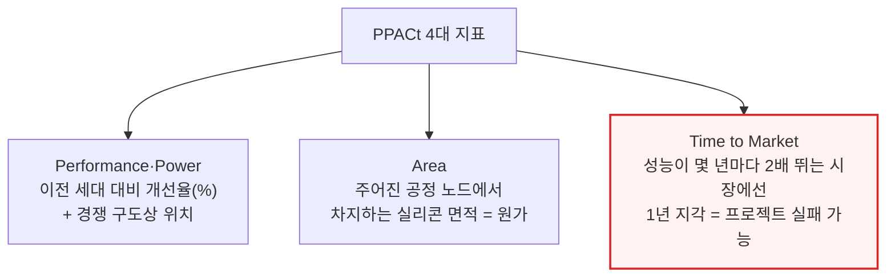

- 타당성 조사는 경영진 승인(그린라이트) 통과가 필요하고, 정해진 R&D 예산·유한한 인력 안에서 다른 프로젝트와 일정을 조율해 마감을 지켜야 엔지니어를 다음 프로젝트에 투입 가능
- 웨이퍼·메모리·패키징 수요를 미리 공급사에 전달해 생산 능력(캐파)을 확보하는 일도 이 단계부터 갈수록 중요

### 2단계: 아키텍처 설계 - 면적을 먼저 나눠주는 설계공간탐색

- 상위 플로어플랜(floorplan) 도면이 각 로직·IO 블록 설계팀이 작업할 면적 경계 상자를 초기에 정하고, 각 기능 블록은 더 작은 요소로 쪼개져 반복 배치됨
- 면적 예산은 설계 도중 늘어날 수 있음 — 예: 명령어 집합(ISA)에 새 명령어 지원 요소 추가, AI 가속기라면 데이터플로우 가속기 추가·행렬곱 엔진 폭 2배 확장

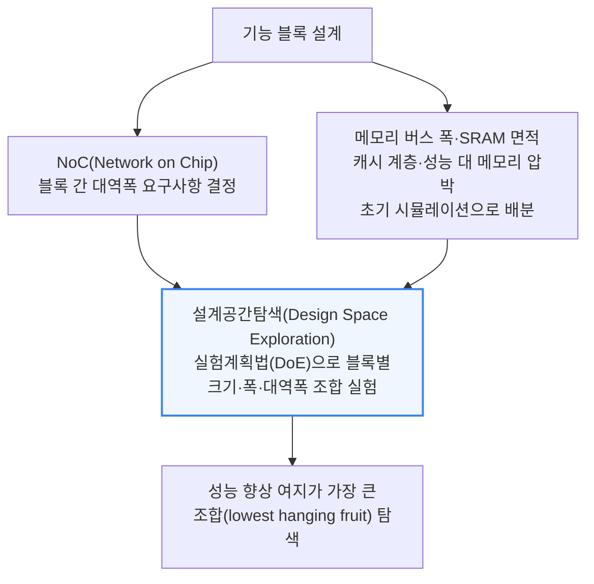

- 이 탐색은 갈수록 AI로 가속됨 — PPA(성능·전력·면적) 개선을 다차원 입력 공간의 검증 가능한 보상 함수로 정의할 수 있기 때문
- 시놉시스의 DSO.ai 같은 자체 AI 탐색 툴이, 팹리스 설계사들의 내부 AI 기반 경로 탐색·기획 가속 시도를 뒤따르고 있음(심층 분석은 이 시리즈 Part 3에서)

---

## 4. 3단계 RTL 설계

**📌 핵심:**
- RTL(Register Transfer Level) 코드는 매 클럭 신호마다 어떤 레지스터가 어떤 값을 받는지 사람과 합성 툴이 함께 읽을 수 있는 언어로 적은 것 — 칩 설계 엔지니어링 시간의 대부분이 이 RTL을 쓰고 검증하는 데 들어감
- 신호가 전선을 타고 이동하는 시간(배선 지연)이 트랜지스터 자체가 스위칭하는 시간(게이트 지연)보다 첨단 공정으로 갈수록 더 커지는데, 이 둘을 합친 가장 느린 경로(임계 경로)가 칩이 낼 수 있는 최고 클럭 속도를 결정
- 현대 SoC RTL의 70\~80%는 자체 개발이 아니라 ARM 코어·시놉시스 DesignWare 같은 라이선스 IP 블록 — 커스텀 PCIe Gen 6 컨트롤러를 처음부터 만드는 대신 검증까지 끝난 IP를 사는 게 훨씬 저렴
- 결론: RTL 설계는 "코드를 짠다"기보다 타이밍 물리·상태 논리·외부 IP 통합이라는 세 가지 제약을 동시에 만족시키는 작업

---

### 신호 타이밍 - 임계 경로가 클럭 속도의 천장을 정한다

- 전파 지연(propagation delay)은 게이트 지연(트랜지스터 자체가 스위칭하는 속도)과 배선 지연(전기 신호가 배선을 타고 다음 게이트까지 이동하는 시간), 두 요소로 구성
- 첨단 공정일수록 트랜지스터는 더 빨리 스위칭하는데 데이터 경로는 설계 복잡도 증가로 길어져, 배선 지연이 게이트 지연을 압도하게 됨
- 셋업 타임(Setup Time): 클럭 신호 도착 전 입력 데이터가 안정돼 있어야 하는 최소 시간
- 홀드 타임(Hold Time): 클럭 신호 도착 후 데이터가 안정돼 있어야 하는 최소 시간

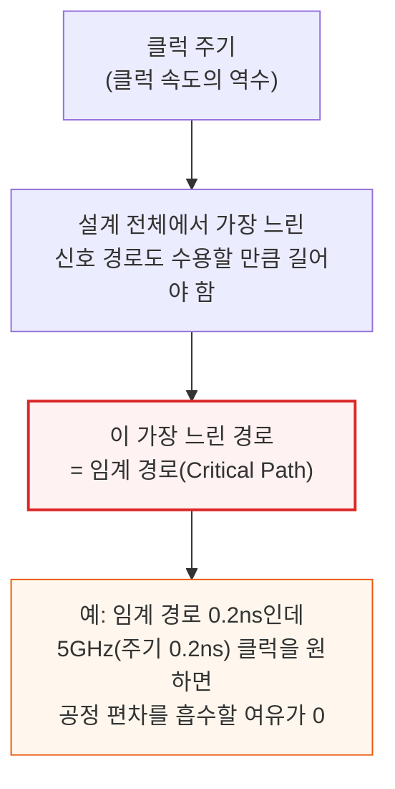

타이밍 최적화는 칩 설계에서 가장 많은 노력이 들어가는 작업 중 하나이며, 성능과 복잡도 사이의 수많은 트레이드오프를 동반합니다.

### 상태 요소 - 플립플롭이 쌓여 유한상태기계를 만든다

- 조합논리(combinational logic)는 입력에서 출력을 계산하지만, 카운터·프로세서 파이프라인 단계 같은 유용한 기능을 만들려면 메모리와 결합해야 함
- 플립플롭(flip-flop): 매 클럭 에지마다 1비트를 붙잡아 유지하는 아주 작은 1비트 메모리 레지스터
- 유한상태기계(Finite State Machine, FSM): 여러 플립플롭이 조합논리와 함께 연결돼 정해진 상태 시퀀스를 한 클럭 사이클씩 순차적으로 밟는 순차논리(sequential logic)
- 즉 RTL은 매 클럭 사이클마다 데이터가 레지스터와 조합논리 사이에서 어떻게 움직이는지 기술하는 추상화

### RTL을 쓰고 검사하기

- 오늘날 지배적 선택은 SystemVerilog(기존 Verilog 언어에 설계·검증 기능을 확장) — VHDL은 여전히 항공우주·레거시 애플리케이션에 남아 있음
- RTL을 다 쓰면 린팅(linting, 시뮬레이션 없이 하는 정적 분석)을 거쳐 코딩 실수·경쟁 조건·문법 오류를 잡아냄
- 시놉시스의 VC SpyGlass가 업계 표준 린팅 툴로, 간헐적 실리콘 오작동을 일으킬 수 있는 미묘한 문제까지 짚어냄 — 컴파일러 경고 플래그와 비슷하지만 대가가 훨씬 큰 버전

### IP 통합 - RTL의 70\~80%는 사오는 것

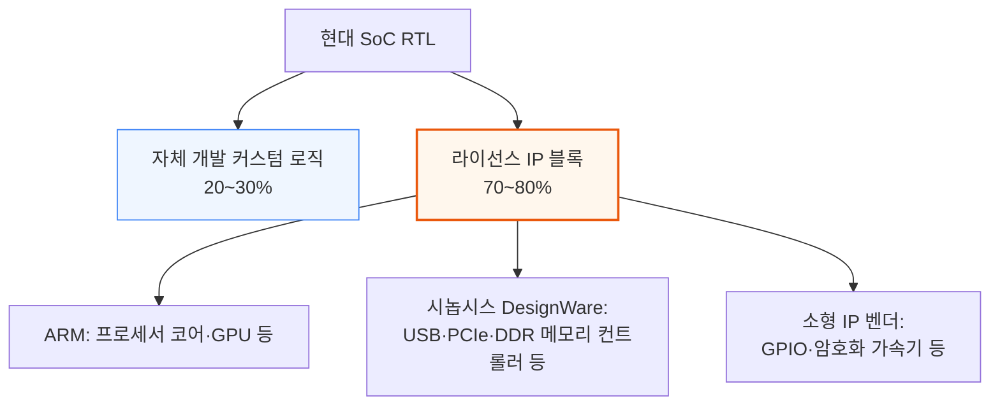

- IP 라이선싱은 순전히 경제성 문제 — 커스텀 PCIe Gen 6 컨트롤러를 처음부터 만들려면 규격 준수를 증명할 전담 I/O 설계·검증 팀이 필요
- 반면 라이선스는 그 비용의 일부만으로 검증까지 끝난 블록을 손에 넣음. 다만 IP 통합 자체는 쉽지 않은데, 이는 뒤 섹션(칩 설계 현장의 민낯)에서 다룸

---

## 5. 4단계 RTL 검증

**📌 핵심:**
- RTL이 완성되면 시뮬레이션(소프트웨어로 설계를 돌려 입력을 넣고 출력을 확인하는 방식)으로 버그를 찾는데, VCS(시놉시스)·Xcelium(케이던스)·Questa(지멘스 EDA) 3개 상용 시뮬레이터가 시장을 나눠 가짐 — 대형 칩 설계사 대부분이 이 중 2개 이상을 함께 라이선스
- 복잡한 SoC 하나의 전체 회귀 테스트는 수만 개 테스트 케이스에 코어-시간 기준 수천 시간이 들 수 있어, 사내 서버만으로는 부족해 AWS·Azure 클라우드로 처리 능력을 보충
- UVM(Universal Verification Methodology)이라는 업계 표준 테스트벤치 구조로 시퀀서·드라이버·모니터·스코어보드 네 컴포넌트를 정의해 재사용 가능한 검증 환경을 만듦
- 결론: 시뮬레이션이 통계적 신뢰도로 칩 전체를 훑는다면, 정형검증(Formal Verification, 수학적 증명으로 모든 경우의 수를 증명)은 특정 블록의 특정 속성을 예외 없이 증명 — 둘은 대체재가 아니라 서로 보완하는 관계

---

검증공학자(Verification Engineer)는 칩 설계 조직에서 가장 빠르게 늘어나는 직군입니다. 설계가 복잡해질수록 서로 맞물려 검증해야 할 항목이 늘어나는데, 업계는 여전히 이 인력을 채용 속도로 따라잡지 못하고 있습니다.

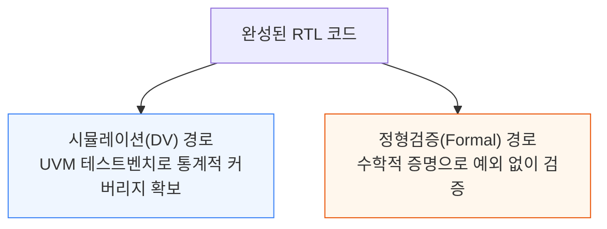

### 시뮬레이션 - 3강 체제와 클라우드 버스트

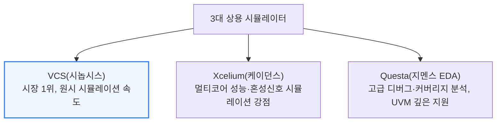

- 대형 칩 설계사 대부분이 이 중 최소 2개를 함께 라이선스
- 수만 개 테스트 케이스로 돌리는 전체 회귀 테스트는 실행 한 번에 수천 코어-시간이 소요될 수 있어, 사내 전용 서버만으로 부족한 경우가 많음
- 테이프아웃 직전 몰리는 기간엔 AWS·Azure 클라우드 시뮬레이션으로 순간 처리 능력을 보충
- 생성되는 데이터량도 어마어마해, 칩 하나의 전체 정의·테스트 항목만 담는 데도 수 페타바이트 저장 공간이 필요

### UVM 테스트벤치 - 4개 컴포넌트로 표준화된 재사용 구조

RTL 시뮬레이션은 **UVM(Universal Verification Methodology)** 구조로 짜입니다. 재사용 가능한 테스트벤치를 만들기 위한 SystemVerilog 라이브러리·방법론의 업계 표준으로, 2011년 Accellera가 표준화하기 전에는 팀마다 제각각 테스트벤치 구조를 만들었습니다.

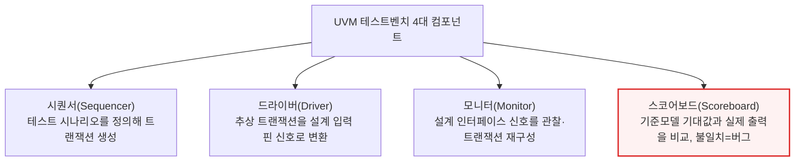

- 이 테스트벤치는 제약 랜덤 검증(Constrained Random Verification)에 쓰임 — 테스트 케이스를 손으로 쓰는 대신 합법적 주소 범위·유효한 패킷 형식 같은 제약만 정의
- 툴이 그 범위 안에서 수백만 개 입력 조합을 무작위로 생성해, 지정 테스트만으로는 못 잡을 구석진 버그를 찾아냄
- 자원 소모는 크지만 지정 테스트만 쓰는 방식보다 버그 검출에 대체로 더 효과적

### 정형검증 - 수학적 증명으로 예외를 없앤다

- 특정 입력을 넣고 출력을 확인하는 대신, SAT 솔버·모델 체커 같은 수학적 증명 엔진으로 설계 속성이 모든 가능한 입력·상태 시퀀스에서 성립함을 완전히 증명
- 속성이 깨질 수 있다면 툴이 정확히 어떻게 깨지는지 반례를 제시 — 검증 대상 속성은 보통 SystemVerilog Assertions(SVA)로 정의
- 대표 툴: JasperGold(케이던스), VC Formal(시놉시스)
- 강점: 프로토콜 준수(예: 핸드셰이크 신호가 3사이클 넘게 유지되지 않는다), 제어 로직 정확성, 보안 속성(예: 이 레지스터는 상위 권한 소프트웨어 전용이다)
- 한계: 확장성 — 버스 폭이 넓은 데이터패스 위주 설계에서는 정형 엔진이 용량 한계에 부딪힘

실무에서는 정형검증이 특정 블록의 핵심 속성을 예외 없이 증명하고, 시뮬레이션이 칩 전체를 통계적 신뢰도로 훑는 식으로 두 방식이 서로 보완합니다.

---

## 6. 5단계 RTL 프리즈와 커버리지 마감

**📌 핵심:**
- 검증이 끝났는지 판단하는 기준은 두 가지 커버리지 — 코드 커버리지(RTL 구조를 얼마나 실행했는지)와 기능 커버리지(의도한 시나리오를 실제로 테스트했는지)
- 테스트 케이스의 90%는 빠르게 통과하지만 나머지 10%(진짜 어려운 코너 케이스)를 채우는 데 몇 주가 걸리기도 함
- 모든 커버리지 목표를 채우고 목표 심각도 이상의 미해결 버그가 없으면 RTL 프리즈(더 이상 기능 변경 불가) 마일스톤에 도달
- 결론: 프리즈 이후 수정은 반드시 재검증과 등가성 검사가 필요한 정식 절차인 ECO(Engineering Change Order)를 거쳐야 하고, 이 경계가 프론트엔드 설계와 백엔드 물리설계를 분리하는 기준이 됨

---

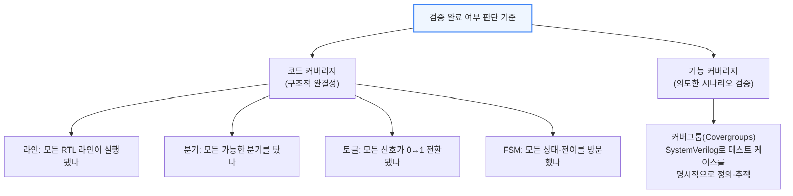

- 기능 커버리지는 "우리가 신경 쓰는 시나리오를 실제로 테스트했는가", "아직 남은 코너 케이스가 있는가(예: 같은 주소 동시 쓰기, FIFO 버퍼 가득 찬 상태에서 인터럽트 대기)"를 확인
- 테스트 케이스 90%는 빠르게 끝나지만, 남은 10%를 채우는 커버리지 마감(Coverage Closure)은 다른 테스트의 제약·예외 조건을 추가하며 표적 테스트를 새로 쓰는 데 몇 주씩 걸림
- 테스트 케이스가 구체적·복잡할수록 필요한 지식도 전문화되는데, 설계사는 과거 설계에서 쌓은 학습 이력을 근거로 어떤 테스트를 우선할지 정함

모든 커버리지 목표가 채워지고 목표 심각도 이상의 미해결 버그가 없으면 프로젝트의 RTL이 얼어붙습니다(freeze).

- 이 공식 마일스톤을 **RTL 프리즈**라 하며, 이 시점부터 RTL 기능 변경은 불가
- 이후 수정은 재검증·등가성 검사가 필요한 **ECO(Engineering Change Order)**라는 정식 절차를 반드시 거쳐야 함
- ECO는 나중에 발견된 버그를 고치거나 타이밍을 조정하기 위해 설계 후반부에도 필요할 수 있음
- RTL 프리즈는 물리설계가 확고한 기준선 위에서 시작할 수 있게 해주는, 프론트엔드와 백엔드를 가르는 경계선

검증은 종종 화려하지 않은 뒷단 취급을 받지만, 새 아키텍처 개발에서는 핵심적인 단계입니다. 칩을 설계하는 것 자체는 쉽지만, 모든 시나리오에서 설계가 제대로 동작한다는 걸 아는 것은 어렵습니다.

---

## 7. 6단계 펌웨어·소프트웨어 병행 개발

**📌 핵심:**
- 칩 개발이 이미 몇 년씩 걸리다 보니, 소프트웨어 팀은 실리콘이 도착할 때까지 기다릴 수 없음 — 첫 실리콘이 팹에서 돌아오기 **전에** OS·펌웨어·드라이버가 상당 부분 완성돼 있어야 함
- 이를 가능하게 하는 것이 사전 실리콘 하드웨어 에뮬레이션(Pre-Silicon Hardware Emulation) — RTL 설계를 대규모 FPGA 배열에 매핑해 50MHz 속도로 칩 기능을 돌림
- 순수 소프트웨어 RTL 시뮬레이션보다 최대 1,000배 빠른 이 에뮬레이션 덕분에 펌웨어 팀이 실리콘 도착 몇 달 전부터 리눅스를 부팅하고 펌웨어·소프트웨어 검증을 마칠 수 있음
- 결론: ZeBu(시놉시스)·Palladium(케이던스) 두 플랫폼이 시장을 양분하며, 최신 세대는 각각 최대 230억\~480억 게이트 규모 설계를 에뮬레이션할 수 있음

---

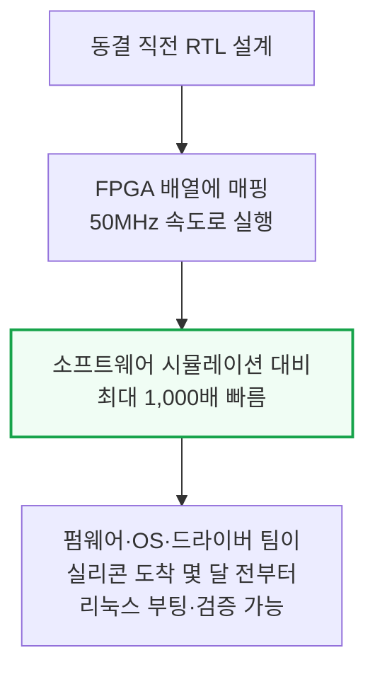

- 에뮬레이터 안에서는 프로그래머블 로직 소자들이 배선을 다시 구성해 각 설계의 논리 구조를 대략 맞춤
- 두 지배적 플랫폼: 시놉시스 **ZeBu**, 케이던스 **Palladium**
- 시놉시스 최신 ZeBu-200 클러스터는 최대 230억 게이트 에뮬레이션, 이전 세대 대비 최대 2배 빠른 실행 성능
- 케이던스 Palladium Z3는 최대 480억 게이트까지 확장 가능, Z2 세대보다 1.5배 빠름
- 이 시스템들 덕분에 펌웨어 팀은 실리콘 도착 몇 달 전부터 리눅스 부팅·펌웨어 테스트·소프트웨어 검증 진행 가능

---

## 8. 7단계 물리설계 ① - 논리합성과 등가성 검증

**📌 핵심:**
- 논리합성(Logic Synthesis)은 RTL 코드를 파운드리 표준셀 라이브러리의 게이트로 이뤄진 넷리스트(연결 지도)로 바꾸는 작업 — 타이밍·면적·전력이라는 서로 충돌하는 목표를 맞추려고 수천 개 대안 구현을 탐색
- 원조이자 여전히 지배적인 툴은 시놉시스 Design Compiler, 케이던스는 Genus를 내놓음 — 시놉시스는 합성과 배치·배선을 하나로 묶은 Fusion Compiler로 통합 흐름을 밀고 있음(아래 ④에서 자세히 설명)
- 합성이 끝나면 등가성 검증(Equivalence Checking)으로 RTL과 게이트 넷리스트가 입출력 단위로 완전히 동일한지 수학적으로 증명 — 클럭트리 삽입·스캔체인 연결·라우팅 최적화·모든 ECO마다 반복 실행
- 결론: 등가성 검증은 합성 툴 스스로가 실수로 만들어낼 수 있는 오류를 잡는 안전망으로, 물리설계 전 구간에서 계속 반복됨

---

### 논리합성 - RTL을 게이트 지도로 바꾼다

이 시점까지 칩은 상위 수준 RTL 설명으로만 존재합니다. 물리설계에 들어가기 전 반드시 거쳐야 할 번역 단계가 있습니다.

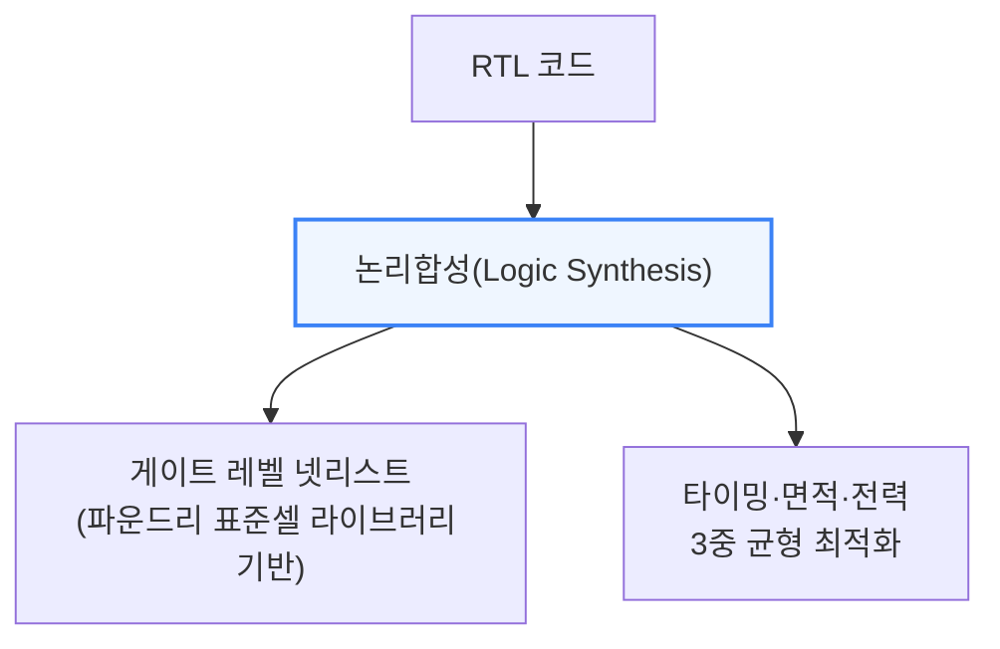

- 합성 툴은 RTL이 기술한 기능을 수행할 논리 게이트의 정확한 조합·연결 순서를 결정하며 넷리스트를 최적화
- 타이밍(정해진 클럭 사이클 안에 연산을 끝낼 수 있는가), 면적(정해진 공간에 게이트를 몇 개까지 넣을 수 있는가), 전력(동적·정적 누설로 몇 와트가 빠지는가) 세 목표를 조율
- 반복 로직 최소화, 여러 기능 간 게이트 공유, 임계 경로 부담을 줄이는 리타이밍(retiming) 같은 기법으로 수천 개 대안 구현을 탐색해 균형점을 찾음

- 원조이자 여전히 지배적인 툴은 시놉시스 **Design Compiler**(NXT·Ultra 등 여러 버전, 그래픽 인터페이스 Design Vision 제공)
- 케이던스는 **Genus**를 합성 툴로 제공
- 시놉시스는 합성과 배치·배선을 하나로 묶어 RTL·타이밍·레이아웃을 넘나들며 확인할 수 있는 **Fusion Compiler**를 밀고 있음(통합 EDA 흐름은 ④에서 자세히 설명)

### 등가성 검증 - 합성 툴 자신의 실수를 잡는 안전망

- RTL이 게이트 레벨 넷리스트로 합성된 뒤, 합성 툴 자체가 버그를 만들어내지 않았는지 확인 필요
- **등가성 검증(Equivalence Checking)**: RTL과 게이트 넷리스트가 입력마다 출력마다 기능적으로 완전히 동일함을 수학적으로 증명하는 정형기법
- 표준 툴: Formality(시놉시스), Conformal LEC(케이던스)

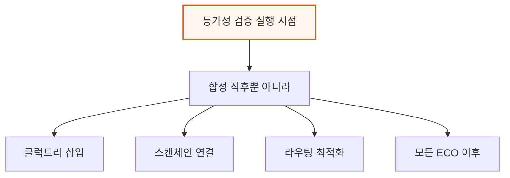

각 변환 단계마다 오류가 끼어들 잠재적 경로가 생깁니다. 등가성 검증은 이렇게 툴 자신이 만들어낼 수 있는 오류를 잡는 안전망 역할을 물리설계 전 구간에서 계속 수행합니다.

---

## 9. 7단계 물리설계 ② - 로직게이트와 표준셀 라이브러리

**📌 핵심:**
- 합성 툴이 고르는 로직게이트는 미리 설계·검증된 표준셀 라이브러리(Standard Cell Library)에서 가져오는 것 — 파운드리나 IP 벤더가 제공하는, 설계 규칙을 지키는 부품 카탈로그
- TSMC N2 같은 첨단 공정의 표준셀 라이브러리는 수만 개 개별 셀을 담고 있고, 각 게이트는 배선 접근성에 따른 여러 레이아웃 옵션과 여러 구동 강도(drive strength) 옵션을 가짐
- 인텔 초기 18A는 문턱전압(threshold voltage) 옵션이 4개(그나마 3개만 사용)로 TSMC의 6개보다 적어, 같은 성능이라도 파레토 최적 곡선에 오르기 더 어려웠음 — 18AP에서 이 격차를 메움
- 결론: 표준셀 라이브러리는 파운드리가 제조 능력·설계 규칙·공정 특성을 EDA 툴이 소비할 수 있는 형태로 담아내는 파운드리의 핵심 상업적 접점 — 다른 파운드리로 설계를 "이식"할 때 이 라이브러리를 옮기는 작업이 전체 툴 흐름에서 가장 파급력이 큰 재작업

---

### 로직게이트 - 불 함수를 물리적으로 구현한다

- 합성 툴은 표준셀 라이브러리 안의 로직게이트 중에서 고름 — 각 게이트는 정해진 이진 입력 조합을 출력으로 바꾸는 불(Boolean) 함수를 수행, 입출력 조합은 진리표(Truth Table)로 정리
- 기본 로직게이트 7종: INV(반전)·NAND·AND·OR·NOR·XOR·XNOR
- 표준셀 안 트랜지스터가 실제 연산을 수행 — 출력 전압을 "1"이면 공급전압(Vdd)으로, "0"이면 접지(Vss)로 끌어당김

### 표준셀 라이브러리 - 벽돌처럼 쌓이는 부품 카탈로그

- 게이트는 매번 새로 설계하지 않고, 파운드리·서드파티 IP 벤더가 제공하는 미리 설계·특성화된 카탈로그인 **표준셀 라이브러리**에서 레이아웃을 가져다 씀
- 각 셀은 높이가 고정, 폭만 가변적이라 벽돌처럼 다이(die) 위 가로 줄에 촘촘히 배치됨
- 이 표준화된 레이아웃(PMOS가 NMOS 위에 오는 2단 구조, 전력 배선용 표준 피치)이 자동화된 배치·배선을 가능하게 하는 핵심 전제

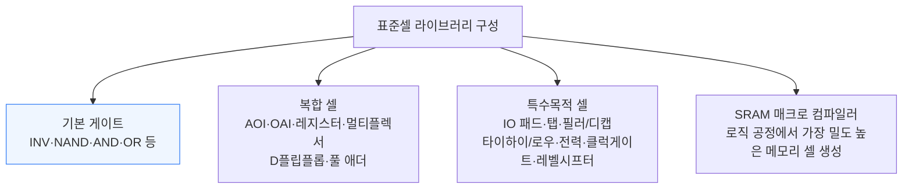

- TSMC N2 같은 첨단 공정 표준셀 라이브러리는 수만 개 개별 셀을 담고 있음
- 각 게이트는 배선 경로·핀 접근성에 따른 여러 레이아웃 옵션과, 출력이 여러 입력을 동시에 구동할 때 쓰는 여러 구동 강도(drive strength) 옵션을 가짐 — 구동전류가 높을수록 누설전력도 커 필요한 곳에만 선택적 사용
- TSMC 최신 공정은 문턱전압(Threshold Voltage, VT) 옵션 6종 제공, 인텔 초기 18A는 4개(실사용 3개)뿐 — 같은 성능이라도 파레토 최적 곡선에 오르기 더 어려웠고, 18AP가 이 격차를 메움
- 합성 툴은 타이밍·전력 제약에 따라 셀 크기를 고름 — 선택 가능한 조합이 수백만 개라 EDA 툴 없이는 이 최적화가 불가능

- 무어의 법칙 둔화로 새 노드들은 참신한 면적 스케일링 기법으로 레이아웃 복잡도를 더 키움 — TSMC N3 FinFlex, N2 NanoFlex는 서로 다른 셀 높이의 표준셀을 한 다이에 섞어 씀
- 각 노드마다 고밀도(HD)·고성능(HP) 등 셀 치수·전력 특성이 다른 라이브러리 옵션 제공, 게이트올어라운드(GAA) 공정(SF3·18A·N2)은 셀 높이마다 여러 나노시트 폭 옵션까지 선택 가능
- 설계자는 칩 각 구역마다 다른 라이브러리를 조합해 새 공정에서 최고 PPA를 뽑아낼 수 있음 — 예: 애플은 고성능 CPU 코어에 TSMC 3-2 FinFlex, 나머지 다이엔 밀도 높고 전력 낮은 2-1 FinFlex 사용

표준셀 라이브러리는 파운드리가 칩 설계사와 만나는 핵심 상업적 접점입니다. 팹리스 기업이 설계를 새 파운드리로 "이식"할 때, 이 라이브러리를 옮기는 작업이 가장 먼저 이뤄지는 동시에 전체 툴 흐름에서 가장 큰 재작업을 촉발하는 단계입니다.

---

## 10. 7단계 물리설계 ③ - 공정설계키트(PDK)

**📌 핵심:**
- 표준셀 아래 트랜지스터 층부터 그 위 배선층까지, 배치·배선 툴이 알아야 할 모든 물리·전기 파라미터는 파운드리가 제공하는 PDK(Process Design Kit, 공정설계키트)라는 파일 묶음에 담김
- PDK는 완성본이 아니라 0.1(초기 TCAD 시뮬레이션 전용) → 0.5(초기 실리콘 데이터 반영) → 0.9(전체 PVT 코너 실측 완료) → 1.0(양산용 최종본)까지 버전이 올라가며, 인텔 18A는 이 과정에 2022년부터 2024년까지 걸림
- 접근 권한은 4단계 등급으로 통제 — 애플·AMD·엔비디아 같은 앵커 고객은 양산 3년 전부터 공정 개발 자체에 관여하지만, 파운드리의 실제 물리적 제조 레시피(도핑 프로파일·공정 온도 등)는 어떤 등급도 볼 수 없음
- 결론: 유일하게 완전 오픈소스로 풀린 양산 PDK는 구글·SkyWater의 SKY130(130nm) 정도로, 교육·오픈소스 연구용으로는 귀중하지만 20년 넘은 구세대 공정

---

### 공정 코너 - 제조 편차까지 라이브러리에 담는다

물리설계 툴은 제조 편차라는 현실도 반영해야 합니다. 공정(Process)·전압(Voltage)·온도(Temperature), 이 셋을 합쳐 PVT라 부르는데, 이 조합에 따라 셀의 속도·전력 소비가 크게 달라질 수 있습니다.

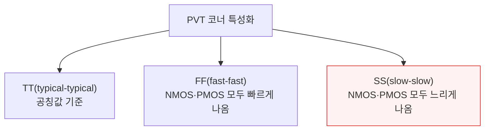

- FS·SF처럼 NMOS·PMOS 간 편차가 어긋나는 코너도 있음 — 대칭 코너와 달리 회로 균형에 영향을 주는 방식이 까다로움
- 전압은 공칭 공급전압 중심으로 변동(예: 공칭 0.75V에 -10%/+10% 코너) — 낮을수록 스위칭은 느려지고 전력은 줄어듦
- 온도 범위는 용도별로 다름 — 소비자용 0\~105℃, 자동차용 -40\~125℃
- 설계는 가장 느린 코너에서 타이밍을, 가장 누설이 큰 코너에서 전력 예산을 동시에 맞춰야 함

### 금속 배선 - 층마다 역할이 다르다

- 가장 낮은 금속층 M0·M1은 셀 안에서 트랜지스터를 핀에 연결 — 얇고 저항이 높아 셀 내부 짧은 거리용, 다이 전체를 가로지르는 신호 배선엔 쓰지 않음
- 교대로 배치된 금속층은 방향이 서로 수직 — 홀수 층은 남북, 짝수 층은 동서 방향 배선
- 준글로벌 금속층(M3\~M5)은 블록 레벨 배선(기능 유닛 안 표준셀끼리 연결), 위로 갈수록 두껍고 넓어져 저항이 줄어듦
- 가장 두꺼운 최상위 금속층은 전력분배망·글로벌 클럭트리 전용

전체 금속층 수는 칩 복잡도에 따라 저가형 모바일 SoC의 10층부터 고성능 AI 프로세서의 19층까지 다양합니다. 인텔 18A 같은 후면전력공급(Backside Power Delivery) 방식은 전력과 신호 배선을 물리적으로 분리해 기생 커패시턴스·신호 간섭을 줄이면서 배선 툴이 활용할 차원을 하나 더 열어줍니다.

### PDK - 파운드리와 EDA 툴을 잇는 번역기

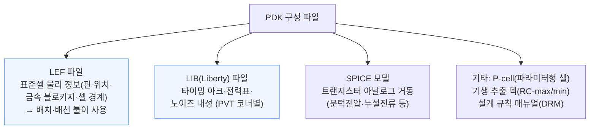

DRM(Design Rule Manual)은 최소 간격·최소 폭·인클로저 규칙 같은 수천 개 기하학적 제약을 담고 있습니다. GDS(GDSII 스트림) 레이아웃 파라미터도 함께 제공될 수 있는데, 모든 트랜지스터·금속층의 정확한 실물 레이아웃 예시로 이 파일이 최종적으로 테이프아웃 때 파운드리로 보내집니다.

### PDK 버전 - 0.1에서 1.0까지

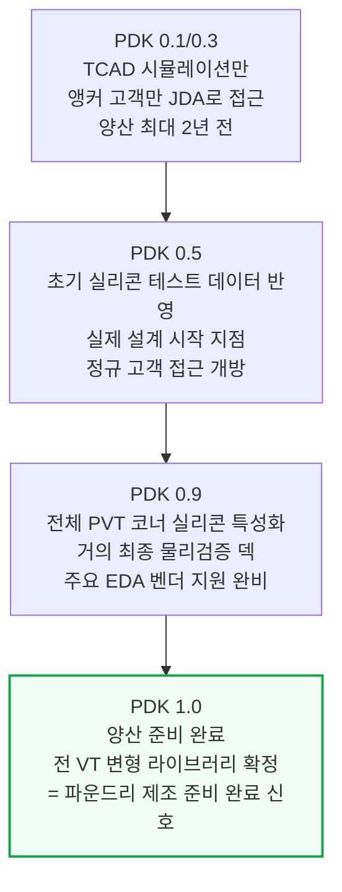

각 주요 버전 사이에는 파운드리가 설계 규칙을 조이고 모델 불확실성을 줄이며, 실제 제조 데이터에서 발견된 제조성설계(DFM, Design for Manufacturability) 핫스팟 규칙을 더하는 점진적 릴리스를 계속 냅니다.

### PDK 라이선싱 - 4단계 접근 등급

파운드리 PDK는 예외 없이 NDA로 보호되며, 사업 관계와 IP 보안을 함께 반영한 엄격한 등급 체계로 접근이 통제됩니다.

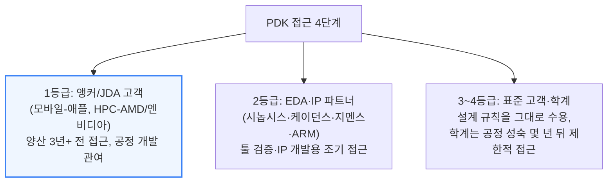

- 1등급 고객조차 파운드리의 물리적 제조 레시피는 절대 볼 수 없음 — 칩 설계사는 전기적 특성만 보면 되고, 도핑 프로파일·공정 온도까지 알 필요는 없음
- PDK는 파운드리와 고객 사이 IP를 보호하면서도 팹리스 모델을 가능하게 하는 추상화 계층
- 인텔 18A 실제 타임라인: 2022-09 PDK 0.3 배포 → 2023-03 PDK 0.5 → 2023-09 PDK 0.9 임박 발표 → 2024-07 PDK 1.0 배포 → 2026-01 18A 기반 Panther Lake CPU 출시

### 오픈소스 PDK - SKY130이 유일한 예외

- 파운드리 PDK가 철저히 비밀에 부쳐지다 보니, 완전 오픈소스로 공개된 양산용 PDK는 손에 꼽음
- 2020년 구글이 SkyWater Technology와 공개한 **SKY130**(원래 사이프레스 반도체가 개발한 130nm 공정) — SPICE 모델·DRC/LVS 덱·표준셀 라이브러리·IO 셀까지 RTL에서 실리콘까지 전 과정 요소가 아파치 2.0 라이선스로 GitHub 공개
- GF180MCU와 iHP130도 비슷하게(혹은 더) 오래된 공정으로 오픈소스

20년 넘은 공정이지만 교육과 오픈소스 연구, 물리설계용 오픈소스 모델 학습에는 핵심적인 역할을 해왔습니다. OpenROAD(배치·배선)와 OpenLane(자동화 플로우 오케스트레이션)이 이 생태계를 이룹니다.

구글은 여러 MPW(Multi-Project Wafer) 셔틀런에 자금을 대 커뮤니티 설계 칩을 무료로 제조해줬지만, 아쉽게도 이 분야 지원을 중단했습니다.

---

## 11. 7단계 물리설계 ④ - 배치·배선 도구와 통합 플로우

**📌 핵심:**
- 배치·배선(Place and Route)을 지배하는 두 플랫폼은 IC Compiler II(시놉시스)와 Innovus(케이던스) — 오늘날 첨단 노드 테이프아웃의 사실상 전부를 처리하며, 어느 쪽을 쓸지는 팀이 수십 개 프로젝트에 걸쳐 쌓은 노하우로 정해져 교체 비용이 큼
- 이 툴들은 플로어플래닝(구획 배치)·전력계획·배치(수백만 개 셀 위치 지정)·배선·클럭트리합성·테스트설계(DFT)까지 6가지 기능을 순환하며 최적 PPA를 찾음
- 전통적으로 RTL→합성→배치배선→사인오프가 각자 따로 도는 사일로 구조였다면, 시놉시스 Fusion Compiler와 케이던스 iSpatial은 합성·배치배선·타이밍 분석을 하나의 데이터 모델로 묶은 통합 흐름을 도입
- 결론: 통합 흐름의 철학은 "왼쪽으로 당기기(Shift Left)" — 사인오프급 정밀 분석을 설계 앞 단계로 최대한 당겨와 뒤늦은 낭패를 미리 막는 것

---

### 배치·배선 도구의 6대 기능

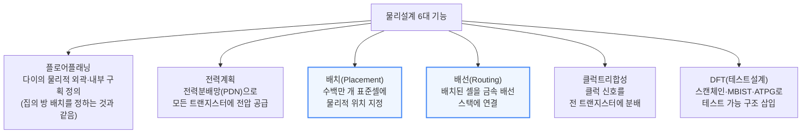

- **플로어플래닝**: SRAM·PLL·아날로그 IP 같은 대형 매크로 블록을 배치하고 다이 둘레에 IO 핀 위치를 정함
- **전력계획**: 전력분배망(PDN)을 세움 — 수평·수직 전력 스트라이프와 비아 스택이 격자형 전력망을 이뤄 트랜지스터에 전압 공급, 다중 전압 도메인·전력게이팅(유휴 구역 전력 선택적 차단)까지 다루며 목표는 IR 드롭(전압 강하) 최소화. 부동소수점 유닛·텐서코어처럼 밀도 높은 핫스팟일수록 균일한 전압 공급이 중요
- **배치**: 수백만 개 표준셀에 위치 지정 — 글로벌 배치가 배선 길이를 최적화하고 혼잡을 최소화, 상세 배치가 격자 행에 고정하며 겹침을 해소. ECO 디버깅용 필러·탭셀·여분셀도 함께 추가
- **배선**: 배치된 모든 셀을 신호·전력 양쪽으로 금속 배선 스택에 연결 — 로컬·준글로벌·글로벌 배선이 전력·클럭 타이밍 예산을 동시에 맞춤, 고혼잡 구역은 셀을 흩어 면적 활용도를 낮춤
- **클럭트리합성**: 중앙 소스에서 클럭 도메인 안 모든 트랜지스터까지 클럭 신호를 분배 — 목표는 스큐(skew, 클럭 도착 시각 차이) 최소화. 블록마다 다른 클럭 도메인이면 클럭도메인교차(CDC) 처리 필요
- **DFT(Design for Test)**: 스캔체인·DFT 접근 패드로 테스트 장비가 패턴을 주입·결과를 읽게 함, MBIST(메모리 내장자가진단)가 메모리 칩용 온칩 테스트 로직 추가, ATPG(자동테스트패턴생성)가 최적 입력 벡터 집합 계산

물리설계는 여러 최적화 루프를 반복하며 진행됩니다. 버퍼 삽입·게이트 재조정·의도적 스큐·논리 재매핑·홀드 픽싱 같은 기법을 반복해 최적 PPA에 도달합니다.

### 통합 플로우 - 사일로를 걷어내는 Shift Left

전통적으로 칩 설계 흐름의 각 단계는 별도 사일로로 돌아갔습니다. RTL 팀이 코드를 짜서 합성 팀에 넘기고, 합성이 넷리스트를 만들어 배치배선 팀에 넘기고, 배치배선이 레이아웃을 만들어 사인오프 팀에 넘기는 식입니다. 후반부에서 고쳐야 할 문제가 발견되면 조율이 악몽으로 변해 일정이 몇 주씩 밀리곤 했습니다.

```mermaid
flowchart TD
    Old["전통 방식: 사일로형<br/>RTL → 합성 → 배치배선 → 사인오프<br/>순차 핸드오프, 뒤늦은 발견 시 큰 재작업"] --> New["통합 플로우: Shift Left<br/>모든 단계를 동시에 반영"]
    New --> FC["시놉시스 Fusion Compiler<br/>단일 데이터 모델로<br/>합성+배치배선+타이밍분석 통합"]
    New --> iSp["케이던스 iSpatial<br/>Innovus 배치·최적화 엔진을<br/>Genus 합성 툴에 직접 내장"]

    style Old fill:#fef2f2,stroke:#dc2626
    style New fill:#f0fdf4,stroke:#16a34a,stroke-width:2px
```

시놉시스 **Fusion Compiler**가 첫 번째 주요 해법으로, 단일 데이터 모델 위에서 합성·배치배선·타이밍 분석을 하나의 엔진으로 통합합니다. 케이던스는 Innovus 엔진을 Genus에 직접 내장하는 **iSpatial**로 대응했습니다.

통합 흐름의 철학이 바로 "왼쪽으로 당기기(Shift Left)"입니다 — 사인오프급 분석을 앞 단계로 당겨와 뒤늦은 낭패를 피하는 것입니다.

---

## 12. 8단계 사인오프

**📌 핵심:**
- RTL이 RTL 프리즈로 잠기듯, 물리설계도 사인오프 전 물리검증(Physical Verification)을 거침 — 사인오프는 설계가 모든 동작 조건·전력 시나리오에서 기능적으로도 제조 가능성 측면에서도 실제로 동작함을 증명하는 관문
- 시놉시스 IC Validator·케이던스 Pegasus·지멘스 Calibre 세 툴이 이 검문소를 지키며, DRC(기하 규칙)·LVS(레이아웃-회로도 일치)·ERC(전기 규칙)·STA(정적 타이밍 분석)·전력 사인오프 다섯 항목을 통과해야 함
- 첨단 노드는 설계 규칙 매뉴얼이 1,000쪽을 넘고 수천 개 기하 규칙을 강제하는데, 이걸 통과 못 하면 기능적 ECO(예비셀 재배치, 최하위 금속층만 재마스크)나 타이밍 ECO(셀 재조정, 전체 마스크셋 교체 필요할 수도)로 되돌아감
- 결론: 사인오프를 통과한 GDSII 파일이라야 비로소 다음 단계인 테이프아웃으로 넘어갈 수 있음

---

```mermaid
flowchart TD
    PV["사인오프 5대 관문"] --> DRC["DRC<br/>최소 배선폭·간격·블로키지·밀도<br/>기하 규칙 (매뉴얼 1,000쪽+)"]
    PV --> LVS["LVS<br/>레이아웃이 의도한 회로<br/>연결과 정확히 일치하는지 확인"]
    PV --> ERC["ERC<br/>플로팅 노드·단락된 전원 등<br/>전기 규칙 위반 검출"]

    PV --> STA["STA(정적 타이밍 분석)<br/>모든 경로가 셋업·홀드<br/>제약을 만족하는지 확인"]
    PV --> Power3["전력 사인오프<br/>IR 드롭·일렉트로마이그레이션<br/>한계 검사"]

    style DRC fill:#eff6ff,stroke:#3b82f6
    style STA fill:#fff7ed,stroke:#ea580c,stroke-width:2px
```

- **DRC**: 최소 배선폭·간격·강제 블로키지·패턴 밀도 한계 같은 파운드리 기하학적 제약 준수 여부 — 첨단 노드는 규칙이 수천 개, 매뉴얼이 1,000쪽 넘음
- **LVS**: 물리 레이아웃이 의도한 회로 연결을 단락·개방 없이 정확히 구현했는지 증명 — 레이아웃에서 넷리스트를 추출해 원래 게이트 레벨 넷리스트와 비교
- **ERC**: 플로팅 노드, 단락된 전원 같은 전기적 위반 검출, 전류 밀도 한계·ESD(정전기 방전) 신뢰성도 검사
- **STA**: 모든 타이밍 경로가 셋업·홀드 제약을 만족하는지 검증 — PrimeTime(시놉시스)·Tempus(케이던스)는 PVT 코너와 DVFS 곡선을 동시에 훑는 MCMM(Multi-Corner Multi-Mode) 분석까지 지원
- **전력 사인오프**: IR 드롭 분석으로 전력분배망이 정적·동적 조건 모두에서 충분한 전압을 공급하는지 검증, 구리를 서서히 이동시켜 단락·개방을 일으키는 일렉트로마이그레이션 한계도 검사 — RedHawk-SC(시놉시스)·Voltus(케이던스)

사인오프를 통과하지 못하면 ECO로 돌아갑니다. 기능적 ECO는 미리 배치한 예비셀(spare cell)을 재활용해 가장 아래 금속층 정도의 새 마스크만 필요합니다.

PrimeTime이 유도하는 타이밍 ECO는 셀 크기를 재조정·재매핑하며 전체 마스크셋 교체가 필요할 수도 있습니다. 각 유형은 유연성과 비용·소요 시간을 맞바꾸는데, 구체적 메커니즘은 뒤쪽 스테핑(Stepping) 섹션에서 설명합니다.

---

## 13. 9단계 테이프아웃

**📌 핵심:**
- 모든 사인오프 검사를 통과하면 설계는 GDSII 또는 OASIS 파일(모든 층의 기하학적 형상을 기술하는 업계 표준 포맷)로 내보내져 파운드리로 전송됨 — 이 milestone이 테이프아웃
- 이름은 옛날에 GDSII 파일을 자기테이프 릴에 담아 보내던 관행에서 유래 — 지금은 파일 전송이지만 용어는 그대로 남음
- 파일이 도착하면 첫 마스크셋 설계가 시작되고, OPC(Optical Proximity Correction, 광학근접보정) 알고리즘이 SRAF(Sub-Resolution Assist Features, 해상도 이하 보조 패턴)를 더해 리소그래피 공정 중 발생하는 광학적 왜곡을 미리 보정
- 결론: 테이프아웃은 설계 단계가 끝나고 제조 단계가 시작되는 분기점으로, 이 이후 되돌리는 모든 수정은 새 마스크 비용을 수반

---

```mermaid
flowchart TD
    Sign["사인오프 통과한 설계"] --> Export["GDSII/OASIS 파일로 내보내기<br/>(모든 층 기하 형상 기술)"]
    Export --> Send["파운드리로 전송<br/>= 테이프아웃(Tapeout)"]
    Send --> OPC["OPC(광학근접보정)<br/>SRAF로 리소그래피 광학 왜곡 미리 보정"]
    OPC --> Mask["마스크 제작 시작"]
    Mask --> Fab2["웨이퍼 제조(Fabrication) 시작"]

    style Send fill:#fef2f2,stroke:#dc2626,stroke-width:2px
```

"테이프아웃"이라는 이름 자체가 GDSII 파일을 자기테이프 릴에 담아 보내던 옛 관행에서 나온 말입니다. 지금은 파일 전송이지만, 설계 단계가 끝나고 제조 단계로 넘어가는 분기점을 가리키는 용어로 그대로 굳어졌습니다.

---

## 14. 10단계 제조와 패키징

**📌 핵심:**
- 테이프아웃부터 첫 실리콘이 도착하기까지 통상 8\~12주가 걸리는데, 우선순위가 높은 핫랏(Hot Lot)을 구매하면 웨이퍼 생산 사이클을 몇 주 앞당길 수 있어 브링업 엔지니어가 더 일찍 디버깅을 시작할 수 있음
- 디버깅 전에 반드시 패키징이 필요 — 연약한 다이를 보호하고, 실리콘 표면의 작은 IO 범프를 소켓에 꽂을 수 있는 안정적 패키지로 끌어내는 작업
- 첨단 프로세서에서는 이 단계에서 이종집적(Heterogeneous Integration, 칩렛 여러 개를 한 패키지에 통합)과 첨단 패키징이 개입 — TSMC CoWoS 같은 2.5D 인터포저와 3D 다이 스태킹이 대표적
- 결론: 이런 첨단 패키징 기술은 리소그래피 장비 한 대가 노광할 수 있는 최대 다이 크기(레티클 한계, 26×33mm)를 넘어 성능을 확장하는 수단

---

```mermaid
flowchart TD
    Tapeout2["테이프아웃 완료"] --> Fab3["웨이퍼 제조<br/>8~12주 소요<br/>(핫랏 구매 시 단축 가능)"]
    Fab3 --> Pkg["패키징 필요<br/>다이 보호 + IO 범프를<br/>소켓 가능한 패키지로 끌어냄"]
    Pkg --> Adv["첨단 프로세서:<br/>이종집적(칩렛)·첨단 패키징"]
    Adv --> CoWoS["예: TSMC CoWoS<br/>2.5D 인터포저·3D 다이 스태킹으로<br/>레티클 한계(26×33mm) 넘어 확장"]

    style Adv fill:#fff7ed,stroke:#ea580c,stroke-width:2px
```

- 제조 공정은 통상 8\~12주 — 우선순위 높은 웨이퍼 셔틀인 핫랏(Hot Lot) 구매로 사이클 타임을 몇 주 단축 가능
- 디버깅 전 반드시 패키징 필요 — 연약한 다이 보호, 작은 IO 범프를 신뢰성 있는 소켓 패키지로 끌어내는 작업
- 첨단 프로세서는 이종집적(칩렛 통합)·첨단 패키징 개입 — 패키지 하나에 여러 다이, 3D 스태킹, TSMC CoWoS 같은 2.5D 인터포저로 레티클 한계(26×33mm)를 넘어 성능 확장

---

## 15. 11단계 실리콘 검증과 브링업

**📌 핵심:**
- 테라다인·어드밴테스트 같은 ATE(자동테스트장비)가 생산라인에서 나오는 칩 전량을, ATPG가 미리 만들어둔 테스트 벡터로 검사 — 양산 단계에서는 이를 최종테스트(Final Test)라 부르며 결과는 단순 합격·불합격
- 첫 칩(A0 실리콘)이 목표 성능·전력·신뢰성을 조정 없이 바로 통과하는 것이 이상적이지만, 실제로는 부팅조차 안 되는 경우도 있어 대부분 팀이 여러 차례 스테핑(재설계·재마스크)을 예산에 반영
- HTOL(고온동작수명시험)이라는 가속 번인 테스트로 정상 사용 온도보다 높은 조건에서 조기 고장(신뢰성 곡선의 "초기 불량기") 개체를 걸러내며, 항공우주·자동차용은 최대 1,000시간까지 스트레스 테스트
- 결론: 마지막 단계인 스피드 비닝(binning)에서 같은 설계도 제조 편차에 따라 등급이 갈려, 인텔의 i5/i7/i9 라인업이나 엔비디아 GPU의 SM(스트리밍 멀티프로세서) 일부 비활성화가 여기서 나옴

---

### 브링업 - ATE와 프로브 카드로 첫 실리콘을 시험한다

```mermaid
flowchart TD
    Silicon["팹에서 돌아온 첫 실리콘"] --> ATE["ATE(자동테스트장비)<br/>테라다인·어드밴테스트<br/>ATPG 테스트 벡터로 전수 검사"]
    Silicon --> JTAG["JTAG 디버그 인터페이스<br/>포스트실리콘 에러타 디버깅 직접 접근"]
    ATE --> FT["양산 단계 = 최종테스트(FT)<br/>단순 합격/불합격 판정"]
    JTAG --> Probe["프로브 카드<br/>패키지 밖 모든 신호선에<br/>오실로스코프 연결"]

    style ATE fill:#eff6ff,stroke:#3b82f6
```

초기 브링업에서는 여러 차례 테스트 라운드를 거치며 버그가 발견되고, FPGA 에뮬레이터에서 개발한 원래 펌웨어를 업데이트해 우회책(workaround)을 반영합니다. 시놉시스 TestMAX 제품군이 설계 단계 ATPG부터 수율 진단, DFT 구조, 칩 테스트·결과 기록 관리 소프트웨어까지 폭넓게 커버합니다.

### 번인 테스트 - 초기 불량품을 미리 걸러낸다

- HTOL(High Temperature Operating Life, 고온동작수명시험): 정상 사용 온도보다 높은 조건에서 가속 번인, 기대 수명 동안의 열 사이클을 못 버틸 결함 칩을 걸러냄
- 이런 "초기 불량(infant mortality)" 개체를 미리 제거하면 고객이 초기 고장 제품을 받을 확률이 크게 줄어듦
- 테스트 시간은 평균 72\~168시간, 항공우주·자동차 같은 신뢰성 결정적 응용은 최대 1,000시간까지 스트레스 테스트
- 저가형 소비자용 기기는 배치마다 일부 칩만 무작위 확장 테스트 — JEDEC 표준 HTOL은 JESD47, 패키지 신뢰성은 JESD22

### 스테핑 - A0에서 시작해 몇 번을 더 고치는가

- 팹에서 돌아온 첫 칩 = A0 실리콘 — 이상적으론 별도 조정 없이 목표를 통과하지만, 첫 칩이 아예 부팅되지 않는 경우도 있음
- 대부분 팀이 여러 차례 스테핑(설계를 새 GDSII로 갱신해 마스크 제작·제조를 다시 파운드리에 보내는 것)을 위한 추가 개발 시간을 예산에 반영

```mermaid
flowchart TD
    Step["스테핑 종류"] --> Major["메이저 스테핑 (A0→B0)<br/>DE→DV→PV 전체 흐름 재실행<br/>새 커버리지 마감·전체 마스크셋 교체"]
    Step --> Minor2["마이너 스테핑 (A0→A1)<br/>금속층만 소폭 마스크 변경<br/>회로 편집으로 사전 검증된 수정 반영"]

    style Major fill:#fef2f2,stroke:#dc2626
    style Minor2 fill:#fff7ed,stroke:#ea580c
```

- 인텔 사례처럼 여러 차례 엔지니어링 샘플(ES) 버전이 만들어진 뒤, 양산 웨이퍼가 돌기 전 최종 인증 샘플(Qualification Sample)로 마무리
- 스테핑엔 B1이나(장기 지연된 인텔 사파이어 래피즈 사례처럼) E5 같은 코드네임이 붙음
- 회로 편집은 고급 FIB(Focused Ion Beam, 집속이온빔) 툴로 점퍼 배선을 추가·인터커넥트 패턴을 바꾸면서도 칩을 계속 동작 상태로 유지해 수정안을 테스트 가능
- 설계는 버퍼·여분셀과 배선 여유 공간을 미리 마련해 이 과정을 수용 — 시간이 많이 들어 주로 다음 스테핑 레이아웃 변경을 물리적으로 미리 검증하는 용도로 사용

### 비닝 - 같은 칩도 등급이 갈린다

- 스피드 비닝(Speed Binning): 각 칩을 점점 높은 주파수에서 테스트해 가장 높은 클럭에서 통과한 칩을 프리미엄 제품으로 판매 — 편차는 제조 과정의 자연스러운 변동성에서 나옴
- 이 단계 칩은 모두 정상 동작하지만, 일부는 목표 주파수를 내려면 조금 더 높은 전압이 필요
- 수율 하베스팅(Yield Harvesting): 일부 코어·하위 컴포넌트가 결함이면 퓨즈로 차단하고 더 낮은 성능으로 할인 판매

비닝 덕분에 인텔은 Core i5·i7·i9라는 유명한 제품 라인업을 만들 수 있었고, 엔비디아 GPU는 수율 하베스팅 때문에 모든 SM(스트리밍 멀티프로세서)이 활성화된 개체가 거의 없습니다.

---

## 16. 12단계 시스템 통합과 13단계 양산

**📌 핵심:**
- 검증된 칩은 레퍼런스 보드에 실려 저장장치·네트워킹 장비와 연결되고, 드라이버·BIOS·OS 지원이 SLT(System Level Testing, 시스템레벨테스트)로 검증됨
- ES(엔지니어링 샘플) 실리콘이 실린 보드가 파트너·개발자에게 샘플로 제공되는 RVP(Reference Validation Platform, 레퍼런스검증플랫폼)를 통해, 주요 앱 개발사들이 칩 출시 첫날부터 소프트웨어를 지원할 수 있도록 미리 최적화 작업을 시작함
- 양산 준비가 끝난 스테핑이 만족스러운 수율로 인증되면 본격 양산에 들어가지만, 그 뒤로도 고객에게 반품된 불량 실리콘의 결함분석(FA)이 계속되며 TSMC와 함께하는 지속개선프로세스(CIP)로 수율을 계속 끌어올림
- 결론: 시놉시스 Avalon 같은 FA 툴이 결함을 회로도상 정확한 게이트·배선까지 지도로 매핑해, 양산이 시작된 뒤에도 설계 개선이 끊이지 않고 이어짐

---

```mermaid
flowchart TD
    Val["검증된 칩"] --> Board["레퍼런스 보드 장착<br/>드라이버·BIOS·OS<br/>SLT(시스템레벨테스트)로 검증"]
    Board --> RVP["RVP(레퍼런스검증플랫폼)<br/>파트너·개발자에 ES 실리콘 샘플 제공"]
    RVP --> Day1["출시 첫날 소프트웨어 지원<br/>미리 최적화 완료"]
    Day1 --> Ramp["양산(Production) 램프업"]
    Ramp --> CIP["TSMC CIP(지속개선프로세스)<br/>+ FA(결함분석)로 수율 계속 개선"]

    style Ramp fill:#f0fdf4,stroke:#16a34a,stroke-width:2px
```

양산이 시작된 뒤에도 작업은 끝나지 않습니다. 고객에게서 반품된 불량 실리콘의 결함분석(Failure Analysis)이 설계의 마지막 결함을 소규모 개정으로 바로잡는 데 도움을 줍니다.

설계사들은 TSMC와 함께 지속개선프로세스(CIP) 흐름으로 계속 협업하며 칩 수율을 개선합니다. FA 엔지니어는 시놉시스 **Avalon** 같은 툴로 결함을 회로도에 매핑해, 어떤 게이트·배선이 영향을 받는지 식별합니다.

---

## 17. 파운드리 안의 EDA - TCAD·DTCO·STCO

**📌 핵심:**
- EDA는 팹리스 설계사만 쓰는 게 아니라 파운드리 안에서도 차세대 공정 노드를 시뮬레이션·설계하는 데 광범위하게 쓰임 — 대표 툴군이 TCAD(Technology CAD)로, 실제 실리콘 실험에 수천만 달러를 쓰기 전에 새 트랜지스터 구조를 소프트웨어로 먼저 설계
- DTCO(설계-공정 공동최적화)는 "공정 엔지니어가 개발하고 담을 넘겨 설계자에게 던진다"는 수십 년 관행을 허물고, 공정 개발 첫날부터 칩 레벨 PPA 지표로 공정 옵션을 평가 — 애플·엔비디아·AMD는 자체 파운드리 전담 부서로 TSMC와 커스텀 셀 라이브러리를 짜서 표준 라이브러리 대비 PPA를 최대 15%까지 끌어올림
- STCO(시스템-기술 공동최적화)는 DTCO를 칩 하나를 넘어 여러 다이·패키지 단위로 확장한 것 — 인텔 Ponte Vecchio GPU가 5개 공정 노드에 걸친 다이 47개를 EMIB·Foveros로 붙이려다 STCO 부족으로 몇 년 지연되고 목표 성능에 크게 못 미친 대표 반례
- 결론: 단일 다이 스케일링이 물리·경제적 한계에 부딪힌 지금, DTCO·STCO는 업계가 세대별 성능 향상을 계속 만들어내는 사실상 유일한 경로

---

### TCAD - 실리콘을 만들기 전에 소프트웨어로 먼저 만든다

```mermaid
flowchart TD
    TCAD["TCAD(Technology CAD)<br/>물리 시뮬레이션 계층"] --> Process2["Sentaurus Process<br/>이온주입·산화·박막증착·<br/>식각·리소그래피 패터닝 시뮬레이션<br/>→ 나노미터급 도펀트 프로파일 예측"]
    TCAD --> Device2["Sentaurus Device<br/>3D 구조를 받아 전기적 거동<br/>(I-V 곡선·커패시턴스·누설전류·<br/>항복전압) 시뮬레이션"]

    style Process2 fill:#eff6ff,stroke:#3b82f6
    style Device2 fill:#eff6ff,stroke:#3b82f6
```

- 지배적 툴 스위트는 시놉시스 **Sentaurus** — 두 엔진이 순차적으로 맞물려 공정 레시피를 넣으면 결과 소자 형상을 시뮬레이션
- GAA(게이트올어라운드) 세대와 그 너머 CFET, 루테늄 같은 신소재까지 복잡한 트랜지스터 설계를 반복 개선하는 데 필수
- 시놉시스 **Mystic**: 소자 시뮬레이션 결과에서 컴팩트 모델 파라미터(BSIM-CMG 같은 SPICE 모델)를 추출 — 실제 실리콘이 존재하기 몇 달 전, 회로 설계자가 작업을 시작할 수 있는 가장 초기 버전 PDK 0.1의 재료가 됨
- 시놉시스 **QuantumATK**: 원자 단위 재료 연구 — 밀도범함수이론(DFT)·비평형 그린함수(NEGF)로 양자 수송·전자 터널링을 모델링, 문턱전압을 정밀 제어하는 일함수 금속화(Work Function Metallization) 공정에 특히 유용

### 설계 피드백 루프 - 고객이 다음 세대 공정을 함께 만든다

실측된 트랜지스터 특성, IR 드롭, 수율 지도 같은 실리콘 측정 데이터가 파운드리의 차세대 PDK 개발과 설계팀의 다음 노드 기획에 곧바로 피드백됩니다. 모범 사례(Best Known Methods, BKM)가 노드 수명 동안 계속 다듬어지며, 고객이 파운드리의 다음 세대 공정 정의를 함께 만드는 생산적인 피드백 루프를 형성합니다.

### DTCO - 공정과 설계 사이 담을 허문다

수십 년간 칩 제조는 엄격한 핸드오프를 따랐습니다. 공정 엔지니어가 트랜지스터 기술을 개발·특성화한 뒤 "담 너머로 던지면", 설계자는 받은 것을 그대로 써야 했습니다. **DTCO(Design Technology Co-Optimization)**는 이 담을 허물어, 공정 개발 첫날부터 칩 레벨 PPA 지표로 공정 옵션을 평가합니다.

```mermaid
flowchart TD
    D1["Sentaurus TCAD<br/>(소자 물리)"] --> D2["Mystic<br/>(PDK)"]
    D2 --> D3["SiliconSmart/HSPICE<br/>(셀 특성화)"]
    D3 --> D4["IC Compiler II/StarRC/PrimeTime<br/>(칩 레벨 PPA 평가)"]
    D4 --> D1

    style D4 fill:#f0fdf4,stroke:#16a34a,stroke-width:2px
```

- 이렇게 결과가 공정 엔지니어에게 되먹임되는 툴 체인 전체가 DTCO 흐름 — 공정 변수를 조정해 설계 규칙을 보수적인 획일적 표준셀보다 더 밀어붙일 수 있게 됨
- 애플·엔비디아·AMD처럼 규모가 큰 기업들은 자체 파운드리 전담 부서로 TSMC와 커스텀 셀 라이브러리를 설계, 표준 라이브러리 대비 PPA를 최대 15%까지 끌어올림
- 배선 가능성 개선은 지연시간 감소·성능 향상·전력 저감뿐 아니라, 혼잡 구역 면적 활용도 상승으로 면적 절감까지 이어짐
- TSMC FinFlex·NanoFlex 같은 새 트랜지스터 스킴은 성능·누설 특성이 다른 표준셀 열을 활용하려면 DTCO를 사실상 필수로 만듦
- 인텔 18A·TSMC A16의 후면전력공급 설계는 트랜지스터 층 양면을 두르는 새 배선 방식으로 신호·전력 배선의 또 다른 차원을 열어줌

### STCO - 칩을 넘어 시스템 전체를 함께 최적화한다

**STCO(System Technology Co-Optimization)**는 DTCO를 한 단계 더 확장해, 칩·공정 공동설계에서 시스템·패키지 공동설계로 넓힙니다. 칩렛 분할 결정, 패키징 기술 선택, 칩렛 간 대역폭·지연시간 트레이드오프, 다이 여러 개에 걸친 열 관리, 패키지 전체의 전력 무결성까지 다룹니다. 단일 다이 스케일링이 경제적·물리적 한계에 부딪힌 지금, STCO는 업계가 세대별 성능 향상을 계속 만들어내는 방법입니다.

- 인텔 **Ponte Vecchio** GPU는 광범위한 STCO가 필요했던 대표 사례 — 5개 공정 노드로 제조한 다이 47개를 EMIB(2.5D 실리콘 브리지)·Foveros(3D 페이스투페이스 스태킹)로 통합
- 하지만 여러 설계 난관에 부딪혀 몇 년 지연됐고, 최종 성능은 애초 목표에 한참 못 미침
- STCO를 제대로 하면 복잡한 설계도 일정·목표를 지키며 나올 수 있음 — AMD가 2026년 하반기 출시할 MI455X GPU에서 시도하는 계획

---

## 18. 칩 설계 현장의 민낯 - 일정 압축과 인력난

**📌 핵심:**
- 소프트웨어는 거의 매일 진화하는데 칩 개발엔 2년이 걸려, 2년 뒤 소프트웨어가 어떤 모습일지 예측해 하드웨어를 설계해야 하는 근본적 불확실성이 있음 — 구글 딥마인드는 지금 당장은 쓸모없어도 5년 수명 동안 유용해질 것으로 예측되는 구조에 일부러 면적을 할애한다고 밝힘
- 이론상 RTL 프리즈는 신성불가침한 마일스톤이지만, 실제로는 검증 테스트가 다 통과하기도 전에 RTL이 얼어붙고, 설계 엔지니어(DE)는 마지막 순간까지 기능을 계속 손보며, 물리설계(PD)는 그런 잠재적으로 깨진 RTL을 넘겨받아 작업을 시작함
- 이상적 DE 대 DV(검증) 인력 비율은 1:4인데 이 비율을 지키는 회사는 하나도 없고, 심지어 DE가 DV보다 2배 많은 회사도 있어 결국 DE가 검증 업무 일부를 직접 떠맡는 구조가 됨
- 결론: 압축된 개발 주기를 맞추려고 DE는 문제 될 수 있는 기능을 소프트웨어 레지스터로 우회 가능하게 "재프로그래밍 가능"하게 설계 — PPA는 손해 보지만 하드 데드라인은 지킬 수 있음

---

### 소프트웨어를 예측하며 하드웨어를 설계한다

- 소프트웨어는 성능을 쥐어짜는 최적화가 거의 매일 나올 정도로 빠르게 진화 — Attention Feed Forward Network Disaggregation 같은 새 모델·연산 방식은 연산 대 메모리·데이터 수요 균형을 크게 흔들 수 있음
- 아이디어에서 양산까지 2년이 걸리는데, 2년 뒤 소프트웨어가 어떤 모습일지 예측해 하드웨어를 설계해야 하는 것이 하드웨어 "예측"이 만들어내는 가장 큰 불확실성

구글 딥마인드의 제프 딘(Jeff Dean)은 자사 TPU 설계가 지금 당장은 쓸모없어도, 5년 기대 수명 동안 소프트웨어가 진화하며 유용해질 것으로 예측되는 구조를 위해 작은 면적 손해를 감수한다고 밝혔습니다.

이 기능이 나중에 실제로 켜진 적이 있었다고는 밝혔지만, 예측이 얼마나 자주 맞았는지·잠들어 있는 회로가 얼마나 남았는지는 공개하지 않았습니다.

이 하드웨어-소프트웨어 격차를 줄이기 위해, 설계팀은 작업 병렬화부터 설계 단계 중첩까지 설계 사이클 시간을 최대한 압축하도록 계속 압박받고 있습니다.

### Shift Left의 이상과 현실 - RTL 프리즈는 신성불가침이 아니다

- 이상적으로 Shift Left는 인라인 검증으로 처음부터 제대로 설계하는 개념 — 각 블록이 첫 시도에 검증을 통과하면 여러 번 반복할 필요가 없음
- EDA 벤더는 초기 사전검증 기능을 제공해, 재작업(respin)이 필요한 설계 오류·타이밍 위반이 나중에 돌아올 확률을 최소화

이론상 RTL 프리즈는 커버리지 마감 이후 더 이상 설계 변경이 없는 신성불가침한 마일스톤이며, 넷리스트가 물리설계(PD) 팀에 넘어갑니다. 그러나 실제로는 칩 설계 워터폴이 크게 겹쳐, 검증 테스트가 다 통과하기도 전에 RTL이 얼어붙고 잠재적으로 깨진 RTL이 PD 팀에 넘어갈 수 있습니다.

```mermaid
flowchart TD
    Ideal["이론: RTL 프리즈<br/>= 신성불가침한 경계"] --> Real["현실: 검증 미완료 상태로<br/>RTL이 얼어붙음"]
    Real --> DE2["DE(설계 엔지니어)<br/>마지막 순간까지 기능 계속 손봄<br/>→ 프리즈는 사실상 '신규 기능 추가만 중단'"]
    Real --> DV2["DV(검증 엔지니어)<br/>물리설계 진행 중에도<br/>버그 잡는 테스트 계속 작성"]
    DV2 --> ECO3["프리즈 후 버그 발견<br/>= ECO(엔지니어링변경명령) 필요"]

    style Real fill:#fef2f2,stroke:#dc2626,stroke-width:2px
```

- 검증이 진행되는 동안에도 DE는 마지막 순간까지 기능을 조정·추가 — 현실에서 프리즈는 사실상 "새 기능 추가만 중단하라"는 신호
- 물리설계 진행 중에도 DV는 버그를 잡고 테스트 실패 확률을 최소화하는 테스트를 계속 작성, 상류 수정이 다른 곳에 문제를 안 일으킨다는 가정 아래 통합을 진행
- 프리즈 이후 버그가 발견되면 반드시 ECO(엔지니어링변경명령)를 거쳐야 함

이 빡빡한 일정을 소화하려고 DE는 설계 일부를 의도적으로 "재프로그래밍 가능"하게 만듭니다. 소프트웨어 레지스터로 문제 기능을 우회할 수 있게 해, 시간 내 고치지 못해 새 테이프아웃이 필요할 만한 치명적 오류를 피합니다.

시간 내 고치지 못해 숨겨진 채 비활성화된 기능들 때문에 PPA는 손해를 보지만, 모든 기능이 제때 검증된다면 성능 상승 여지를 남기면서도 이 유연성 덕분에 하드 데드라인을 지킬 수 있습니다.

### 인력 부족 - 이상적 DE:DV 비율 1:4를 지키는 회사는 없다

검증이 차지하는 엔지니어 시간 비중은 갈수록 커지고 있습니다. 이상적으로는 설계 엔지니어(DE) 대 검증 엔지니어(DV) 비율이 1:4가 돼야 하지만, 이 비율을 지키는 회사는 없습니다.

일부 회사는 오히려 DE가 DV보다 2배 많기도 합니다. 결국 DE가 자기 설계를 가장 잘 알기 때문에 표적 테스트벤치를 직접 작성하며 검증 업무 일부를 스스로 떠맡게 됩니다.

### 협업과 라이선스 IP라는 블랙박스

- 외부 보호 IP를 쓰면 검증이 더 어려워짐 — 엔비디아×미디어텍 GB10 칩 같은 협업 사례나 라이선스 ARM CPU 코어 IP는 전체 흐름 이해에 장벽을 높임
- 각 회사는 IP 유출 방지를 위해 자사 RTL 코드를 숨기고, AMBA CHI 같은 표준·커스텀 프로토콜로 인터페이스만 노출
- 검증 엔지니어는 블랙박스만 보고, 들어가고 나가야 할 신호·타이밍만 문서로 안내받음 — 상류 타이밍 충돌이 공급사 쪽에서 해결 안 되면, 이게 설계 결함인지 테스트벤치 오류인지 판단할 가시성이 제한적
- 압축된 설계 주기는 이 문제를 더 키움 — 회사들이 사인오프가 완전히 끝나지 않았을 수도 있는 최신 IP를 원하기 때문

### FPGA와 CPU 수요 - 검증 인프라 자체가 거대한 산업

- 펌웨어 개발용 칩 에뮬레이션은 특정 FPGA 위에서 돌아감 — 시놉시스 ZeBu 서버의 Xilinx Versal VP1902, 케이던스 프로토타이핑 시스템 Protium X3
- 역사적으로 Palladium 에뮬레이션은 IBM 기반 CPU 설계로 이뤄졌고, 최신 Palladium Z3는 케이던스 커스텀 전용 에뮬레이션 프로세서를 씀
- 팹리스 설계사들은 자체 FPGA 함대를 보강하려 AWS EC2 F2 클라우드 FPGAaaS도 활용, AWS 자신도 HBM 탑재 AMD Virtex VU47P FPGA를 자사 칩 설계에 씀

```mermaid
flowchart TD
    Verif2["검증 인프라"] --> FPGA2["FPGA: 에뮬레이션·프로토타이핑<br/>ZeBu(Xilinx Versal)·Protium X3"]
    Verif2 --> CPU2["CPU: 시뮬레이션·물리검증<br/>순차적·분기 많은 작업"]
    CPU2 --> Own["자체 서버(AMD Turin·인텔 Granite Rapids)<br/>또는 클라우드(시놉시스 검증 클라우드 SaaS)"]
    CPU2 --> Graviton["AWS 사례: 자체 Graviton 코어<br/>100만 개를 내부 EDA 툴 구동에 투입<br/>(차세대 Graviton·Trainium·Nitro 설계용)"]

    style Graviton fill:#f0fdf4,stroke:#16a34a,stroke-width:2px
```

FPGA가 에뮬레이션·프로토타이핑에 쓰이는 반면, CPU는 시뮬레이션·검증 스택 나머지 대부분을 지배합니다. RTL·넷리스트·물리검증은 분기와 의존성이 많은 매우 순차적인 작업이라, 다음 단계가 이전 회로의 결과를 기다려야 합니다. 모듈·블록 안에서는 병렬화할 수 있지만, 상위 레벨은 하위 레벨 검증을 기다려야 합니다.

이 때문에 고성능 서버 CPU가 대규모로 동원돼 테스트벤치를 야간에 돌립니다. 전체 칩 검증은 며칠씩 걸릴 수 있어, 코어당 성능이 높을수록 버그를 더 빨리 찾습니다.

일부는 자체 AMD Turin·인텔 Granite Rapids 서버를 운영하고, 다른 곳은 시놉시스 검증 클라우드 SaaS를 씁니다. AWS는 내부적으로 Graviton 코어 100만 개를 배치해 차세대 Graviton·Trainium·Nitro 칩을 설계하는 EDA 툴을 구동합니다.

---

*작성 진행률: 100% 완료*
*업데이트: 원문 전체 18개 섹션(EDA 역사\~칩 설계 현장의 민낯) 변환 완료. 원문의 13단계 워터폴 순서를 섹션 2의 단일 다이어그램으로 먼저 제시한 뒤, 이후 섹션 제목마다 해당 단계 번호를 명시해 순서를 계속 추적할 수 있게 함.*
*원문 이미지는 전부 다이어그램·표로 대체. 이 시리즈 Part 2(EDA 시장 개관, [260521])는 이미 변환 완료돼 있어 겹치는 시장·매출 내용은 그쪽에서 더 깊게 다룸*
