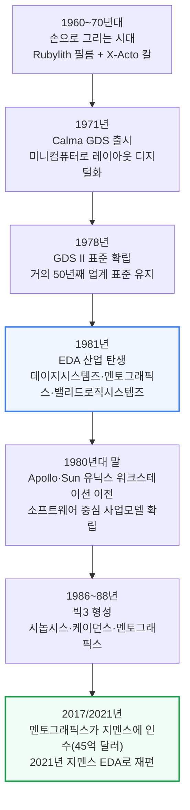
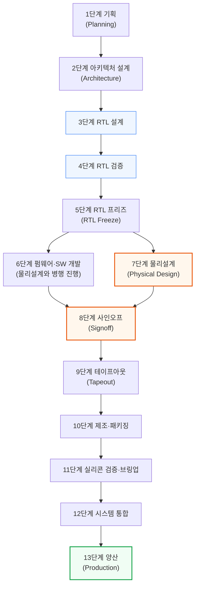
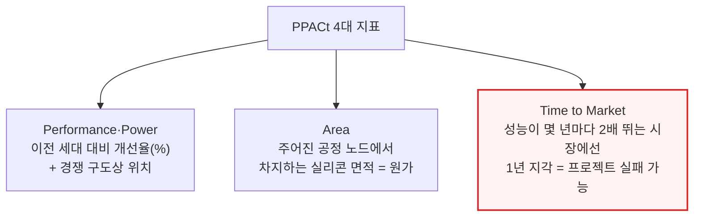
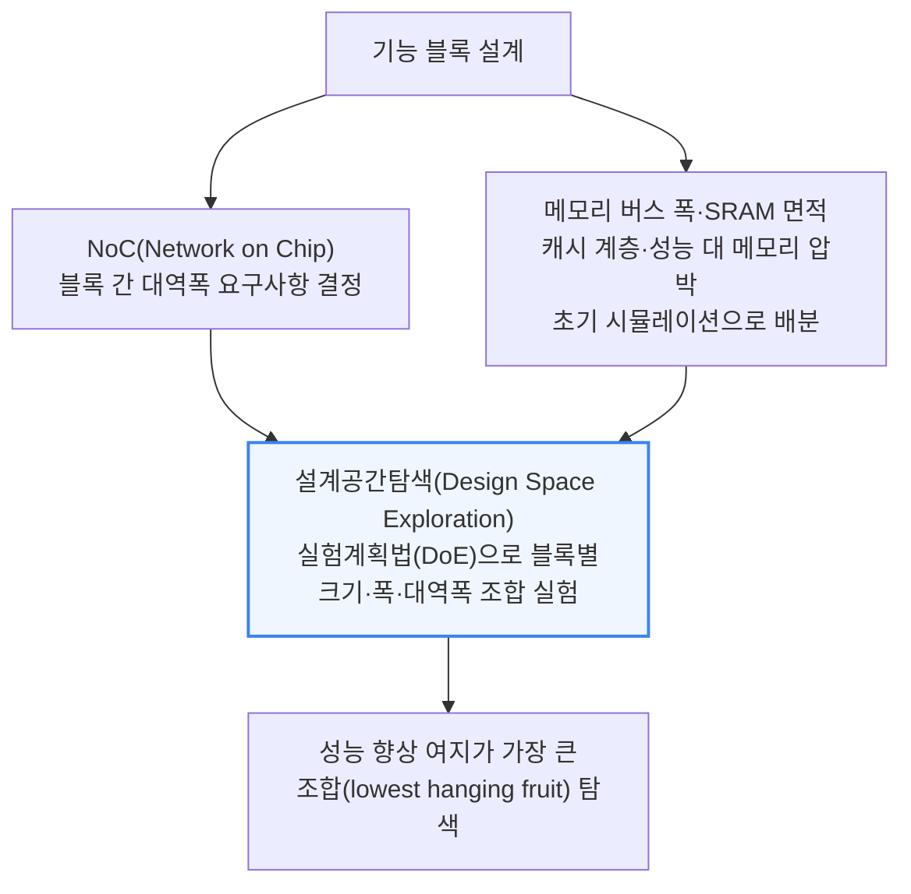

# The EDA Primer: From RTL to Silicon

> **출처**: [SemiAnalysis Newsletter](https://newsletter.semianalysis.com/p/the-eda-primer-from-rtl-to-silicon)
> **저자**: Gerald Wong, Dylan Patel, Sravan Kundojjala
> **발행일**: 2026-05-12

---

## 📑 목차

### 전체 섹션
 1. [EDA의 탄생 - 손으로 긋던 시절부터 빅3까지](#1-eda의-탄생---손으로-긋던-시절부터-빅3까지)
 2. [칩 설계 13단계 전체 흐름](#2-칩-설계-13단계-전체-흐름)
 3. [1단계 기획과 2단계 아키텍처 설계](#3-1단계-기획과-2단계-아키텍처-설계)
 4. [3단계 RTL 설계](#4-3단계-rtl-설계)
 5. [4단계 RTL 검증](#5-4단계-rtl-검증)
 6. [5단계 RTL 프리즈와 커버리지 마감](#6-5단계-rtl-프리즈와-커버리지-마감)
 7. [6단계 펌웨어·소프트웨어 병행 개발](#7-6단계-펌웨어소프트웨어-병행-개발)
 8. [7단계 물리설계 ① - 논리합성과 등가성 검증](#8-7단계-물리설계-①---논리합성과-등가성-검증)
 9. [7단계 물리설계 ② - 로직게이트와 표준셀 라이브러리](#9-7단계-물리설계-②---로직게이트와-표준셀-라이브러리)
10. [7단계 물리설계 ③ - 공정설계키트(PDK)](#10-7단계-물리설계-③---공정설계키트pdk)
11. [7단계 물리설계 ④ - 배치·배선 도구와 통합 플로우](#11-7단계-물리설계-④---배치배선-도구와-통합-플로우)
12. [8단계 사인오프](#12-8단계-사인오프)
13. [9단계 테이프아웃](#13-9단계-테이프아웃)
14. [10단계 제조와 패키징](#14-10단계-제조와-패키징)
15. [11단계 실리콘 검증과 브링업](#15-11단계-실리콘-검증과-브링업)
16. [12단계 시스템 통합과 13단계 양산](#16-12단계-시스템-통합과-13단계-양산)
17. [파운드리 안의 EDA - TCAD·DTCO·STCO](#17-파운드리-안의-eda---tcaddtcosto)
18. [칩 설계 현장의 민낯 - 일정 압축과 인력난](#18-칩-설계-현장의-민낯---일정-압축과-인력난)

---

## 🔑 용어 정리

본문을 순서대로 읽기 전에 알아두면 좋은 용어들입니다. 자세한 수치와 설명은 본문에서 처음 등장하는 위치에 나옵니다.

- **RTL (Register Transfer Level)**: 엔지니어가 "이 클럭에 어떤 레지스터가 어떤 값을 받는다"를 코드로 적는 설계 언어 수준 — 이 코드가 EDA 툴을 거쳐 실제 트랜지스터 배치로 변환됨
- **EDA (Electronic Design Automation, 전자설계자동화)**: 엔지니어가 작성한 회로 설계도를 실제 제조 가능한 칩 레이아웃으로 자동 변환해주는 소프트웨어 — 이 툴 없이는 1980년대 중반 이후 설계된 칩은 하나도 존재할 수 없음
- **논리합성 (Logic Synthesis)**: RTL 코드를 실제 논리 게이트들의 연결 지도(넷리스트)로 자동 변환하는 작업 — 수천 개 대안 구현 중 타이밍·면적·전력 균형이 가장 좋은 조합을 툴이 찾아냄
- **배치·배선 (Place and Route)**: 논리합성이 만든 수백만 개 게이트를 실제 칩 위 정확한 좌표에 배치하고, 그 사이를 금속 배선으로 연결하는 물리설계 단계
- **PDK (Process Design Kit, 공정설계키트)**: 파운드리의 제조 공정과 EDA 툴을 잇는 번역기 역할의 데이터 묶음 — 이게 없으면 설계도를 실제 웨이퍼로 만들 수 없음
- **사인오프 (Signoff)**: 물리설계가 끝난 레이아웃이 실제로 동작하고 제조 가능한지 마지막으로 전수 검증하는 관문 — 이걸 통과해야 파운드리로 설계도를 보낼 수 있음
- **테이프아웃 (Tapeout)**: 사인오프를 통과한 최종 레이아웃 파일(GDSII)을 파운드리에 보내는 milestone — 옛날에 이 파일을 자기테이프 릴에 담아 보내던 관행에서 유래한 이름
- **DTCO·STCO (설계-공정 공동최적화)**: DTCO는 칩 설계와 트랜지스터 공정을 동시에 조율해 성능·전력·면적을 끌어올리는 작업, STCO는 그 조율 범위를 칩 하나를 넘어 여러 다이·패키지 단위로 확장한 것

---

## 1. EDA의 탄생 - 손으로 긋던 시절부터 빅3까지

**📌 핵심:**
- 1960\~70년대엔 칩 회로를 사람이 직접 그렸음 — 붉은 셀로판 필름(Rubylith)을 칼로 오려 한 층씩 만들었고, 칼이 한 번 삐끗하면 몇 주 작업이 날아감
- 1978년 GDS II(마스크 데이터 교환 표준 파일 형식)가 나온 뒤 거의 50년이 지난 지금도 그대로 업계 표준으로 쓰임
- 1981년 세 회사(데이지시스템즈·멘토그래픽스·밸리드로직시스템즈)가 몇 달 간격으로 등장하며 EDA 산업이 시작됐고, 이후 시놉시스·케이던스·지멘스 EDA "빅3" 체제로 재편
- 결론: 1987년 시놉시스의 논리합성 툴 등장이 수천 개를 손으로 배치하던 방식에서 수십억 개 트랜지스터를 자동 설계하는 시대로의 도약을 열었음

---

칩 설계 자동화는 하루아침에 생긴 게 아니라, 손 작업의 한계가 임계점을 넘으면서 단계적으로 자동화된 결과입니다.

인텔 8080까지도 이 Rubylith 방식으로 설계됐습니다. 붉은 셀로판 필름을 라이트 테이블 위에서 칼로 오려 층별 도면을 만들고, 완성된 원판을 최대 100배 축소 인화해 실제 제조용 포토마스크를 만드는 방식이었습니다.

1971년 Calma가 인텔에 납품한 GDS(Graphic Design System)가 최초의 자동화 시도였습니다. 이후 1978년 나온 GDS II의 스트림 파일 형식이 마스크 데이터를 주고받는 사실상의 표준이 됐고, 후속 규격인 OASIS와 함께 거의 50년이 지난 지금도 그대로 쓰입니다.

1981년 세 회사가 몇 달 간격으로 등장하며 EDA 산업이 본격 시작됐습니다. 데이지시스템즈(Daisy Systems), 멘토그래픽스(Mentor Graphics), 밸리드로직시스템즈(Valid Logic Systems) — 흔히 "DMV"로 불리는 이 세 회사가 회로도 캡처·시뮬레이션·논리검증 같은 설계 전반부(프론트엔드) 작업을 컴퓨터로 옮겨왔습니다. 1980년대 말에는 셋 다 Apollo·Sun Microsystems의 표준 유닉스 워크스테이션으로 옮겨가며, 오늘날까지 이어지는 소프트웨어 중심 사업 모델을 확립했습니다.

### 빅3의 형성

오늘날 EDA 시장은 세 회사가 지배합니다. **시놉시스(Synopsys)**는 1986년 제너럴일렉트릭 연구그룹 출신 아트 드 지우스(Aart de Geus) 등이 창업했고, 1987년 세계 최초 상업용 **논리합성(Logic Synthesis, RTL 코드를 실제 논리 게이트 연결 지도로 자동 변환하는 작업)** 툴인 Design Compiler를 출시했습니다. 이 도약으로 손으로 배치하던 수천 개 트랜지스터가 오늘날 설계하는 수십억 개 트랜지스터로 뛰어올랐습니다.

**케이던스(Cadence Design Systems)**는 1988년 SDA Systems와 ECAD의 합병으로 출범해 빠르게 IC 레이아웃·배치배선 툴 시장 선두가 됐습니다. **멘토그래픽스**는 DMV 창립 3사 중 하나였다가 **2017년 지멘스에 45억 달러에 인수**되고 2021년 **지멘스 EDA**로 재편되며, 지멘스 디지털인더스트리 포트폴리오에 깊은 검증·물리설계 전문성을 더했습니다.

논리합성은 단순히 설계 속도만 높인 게 아니라 가능한 것의 범위 자체를 바꿨습니다. 수동으로 게이트를 배치하던 방식을 추상화로 걷어내면서, 오늘날의 수십억 트랜지스터급 SoC(System on Chip, 여러 기능을 한 칩에 통합한 시스템)를 만드는 수백만 배 규모의 설계 복잡도 증가를 감당할 수 있게 됐습니다.

---

## 2. 칩 설계 13단계 전체 흐름

**📌 핵심:**
- 칩 하나를 만드는 과정은 13개 구간으로 이어진 다년간의 릴레이 경주와 같음 — 한 구간에서 바통을 놓치면 전체 일정이 몇 달, 심하면 몇 분기씩 밀림
- 흐름은 기획 → 아키텍처 → RTL 설계·검증 → 물리설계 → 사인오프 → 테이프아웃 → 제조 → 실리콘 검증 → 양산 순으로 이어짐
- 이 글이 다루는 순서는 단순화한 "워터폴(waterfall, 폭포수형 순차 진행)" 그림일 뿐, 실제로는 각 단계가 크게 겹치고 되돌아가는 반복이 일어남
- 결론: 검증 단계에서 발견된 아키텍처 버그가 RTL을 다시 고치게 만들고, 물리설계에서 타이밍이 실패하면 다시 앞 단계로 돌아가는 식으로 수십 개 피드백 루프가 동시에 돌아가는데, 이걸 사람이 손으로 추적할 수 없기 때문에 EDA 툴이 필요함

---

아래는 이 문서 전체가 따라가는 뼈대입니다. 이후 모든 섹션은 이 13단계 중 어디에 해당하는지 제목에 표시합니다.

6단계(펌웨어·소프트웨어 개발)와 7단계(물리설계)가 5단계에서 동시에 갈라지는 이유는, 소프트웨어 팀이 실리콘이 나올 때까지 기다릴 여유가 없기 때문입니다. RTL이 얼어붙는(freeze) 순간부터 두 팀이 각자의 트랙을 병행해서 달리다가 8단계 사인오프에서 다시 합류합니다.

이 그림은 단순화한 워터폴(순서대로 한 방향으로만 흐르는) 뷰일 뿐입니다. 실제로는 각 단계가 크게 겹치고 서로 되돌아갑니다. 검증 중에 발견된 아키텍처 버그는 RTL을 다시 고치게 만들고, 물리설계에서 타이밍이 실패하면 엔지니어들이 임계 경로(critical path, 신호가 가장 늦게 도착하는 경로)를 다시 최적화하러 돌아갑니다. 현대 SoC 프로그램 하나가 이런 피드백 루프를 동시에 수십 개씩 관리하는데, 이게 바로 사람 손으로는 다 추적할 수 없어 EDA 툴이 반드시 필요한 이유입니다.

---

## 3. 1단계 기획과 2단계 아키텍처 설계

**📌 핵심:**
- 1단계 기획에서는 칩이 맡을 역할과 목표 시장을 정하고, PPACt(성능·전력·면적·시간, 아래 설명)라는 4대 지표로 기획을 관리 — 성장이 빠른 시장에서는 1년만 늦어도 프로젝트 자체가 실패할 수 있음
- 2단계 아키텍처 설계에서는 각 기능 블록에 면적을 미리 배분하는 플로어플랜(floorplan, 칩 내부 구역 배치도)을 그리고, 설계공간탐색(Design Space Exploration)으로 블록 크기·대역폭 조합을 실험
- AI 가속기라면 이 단계에서 데이터플로우 가속기를 추가하거나 행렬곱 엔진 폭을 두 배로 늘리는 식으로 설계 공간을 넓힘
- 결론: 두 단계 모두 아직 코드 한 줄 쓰기 전이지만, 여기서 정한 면적·전력·일정 목표가 이후 모든 단계의 제약 조건이 됨

---

### 1단계: 기획 - PPACt로 프로젝트를 관리한다

칩 설계 부서는 보통 CPU·가속기 같은 특정 칩 계열에 전문화돼 있습니다. 제품 요구사항과 상위 스펙은 현재 세대 제품과 목표 시장 내 경쟁사 분석을 기준으로 정해집니다. 초안 개념(strawman)은 여러 설계팀 IP 블록의 투입 일정에 맞춰 빠르게 수정되고, 이전 프로젝트의 사후분석(post-mortem)에서 얻은 교훈이 지식 기반으로 축적돼 무엇이 통했고 어떤 목표가 그 일정엔 과욕이었는지 판단하는 데 쓰입니다.

이 타당성 조사가 통과하려면 경영진의 승인(그린라이트)이 필요합니다. 각 회사는 정해진 R&D 예산과 유한한 엔지니어링 인력 안에서 움직여야 하고, 진행 중인 다른 프로젝트와 일정을 조율해 마감을 엄격히 지켜야 엔지니어를 다음 프로젝트에 투입할 수 있습니다. 웨이퍼·메모리·패키징 수요를 미리 공급사에 전달해 생산 능력(캐파)을 확보하는 일도 이 단계부터 갈수록 중요해지고 있습니다.

### 2단계: 아키텍처 설계 - 면적을 먼저 나눠주는 설계공간탐색

기획과 밀접하게 맞물려, 아키텍처 단계는 설계공간탐색(Design Space Exploration)과 함께 진행됩니다. 상위 플로어플랜(floorplan) 도면이 각 로직·IO 블록 설계팀이 작업할 면적 경계 상자를 초기에 정하고, 각 기능 블록은 더 작은 요소들로 쪼개져 설계 전반에 반복 배치됩니다. 이 면적 예산은 설계 도중 늘어날 수도 있는데, 명령어 집합(ISA)에 새 명령어를 지원하는 연산 요소가 추가되거나, AI 가속기라면 데이터플로우 가속기를 붙이고 행렬곱(Matrix Multiplication) 엔진 폭을 두 배로 늘리는 식의 기능 추가가 나중에 반영되기 때문입니다.

이 탐색 작업은 갈수록 AI로 가속되고 있습니다. PPA(성능·전력·면적) 개선이라는 목표를 다차원 입력 공간에서 검증 가능한 보상 함수로 정의할 수 있기 때문입니다. 시놉시스의 DSO.ai 같은 자체 AI 탐색 툴이, 팹리스 설계사들이 그동안 내부적으로 해오던 AI 기반 경로 탐색·기획 가속 시도들을 뒤따르고 있습니다. 이 부분의 심층 분석은 이 시리즈의 Part 3에서 다룰 예정입니다.

---

*작성 진행률: 약 20% 완료 (섹션 1~3)*
*업데이트: EDA 역사, 13단계 전체 흐름 다이어그램, 1~2단계(기획·아키텍처) 작성 완료*
