# Is SMIC N+3's Metal Pitch Smaller than Intel 18A's?

> **출처**: [SemiAnalysis Newsletter](https://newsletter.semianalysis.com/p/steel-smic-n3-teardown)
> **저자**: STEEL Team, Afzal Ahmad, Andrew Wagner
> **발행일**: 2026-06-14

---

## 📑 목차

### 전체 섹션
 1. [서론 - 헤드라인 뒤에 숨은 진실](#1-서론---헤드라인-뒤에-숨은-진실)
 2. [다이 샷과 플로어플랜 - 기린 9030 해부 개요](#2-다이-샷과-플로어플랜---기린-9030-해부-개요)
 3. [아키텍처와 PPA - CPU 코어 성능·효율](#3-아키텍처와-ppa---cpu-코어-성능효율)
 4. [GPU와 NPU 성능](#4-gpu와-npu-성능)
 5. [메모리와 패키징](#5-메모리와-패키징)
 6. [핀 프로파일 - FinFET 핀 형상 비교](#6-핀-프로파일---finfet-핀-형상-비교)
 7. [표준 셀 - 게이트 피치·셀 높이·트랜지스터 밀도](#7-표준-셀---게이트-피치셀-높이트랜지스터-밀도)
 8. [금속 배선 스택 - SMIC N+3 vs TSMC N6 vs 인텔 18A](#8-금속-배선-스택---smic-n3-vs-tsmc-n6-vs-인텔-18a)
 9. [SRAM 밀도](#9-sram-밀도)
10. [미래 로드맵 - 이론적 N+4·N+5](#10-미래-로드맵---이론적-n4n5)
11. [화웨이 τ 스케일링과 LogicFolding](#11-화웨이-τ-스케일링과-logicfolding)
12. [수출 통제와 확산 리스크](#12-수출-통제와-확산-리스크)
13. [공정 흐름 상세 - 재료 분석과 텅스텐 병목](#13-공정-흐름-상세---재료-분석과-텅스텐-병목)

---

## 🔑 용어 정리

본문을 순서대로 읽기 전에 알아두면 좋은 용어들입니다. 자세한 수치와 설명은 본문에서 처음 등장하는 위치에 나옵니다.

- **N+3**: SMIC(중국 최대 파운데리)가 붙인 공정 세대 이름 — TSMC·삼성처럼 "몇 나노"라는 이름 대신 EUV(극자외선 노광) 없이 기존 DUV(심자외선 노광) 장비를 몇 세대째 개량해왔는지를 세대 숫자로 표기함
- **금속 배선 간격 (Metal Pitch)**: 칩 위에서 신호를 나르는 금속 선과 선 사이의 최소 간격 — 이 간격이 좁을수록 같은 면적에 더 많은 배선을 욱여넣을 수 있어 칩이 촘촘해짐
- **게이트 피치 (CGP, Contacted Gate Pitch)**: 트랜지스터의 스위치 역할을 하는 게이트와 그다음 게이트 사이의 간격 — 이 값이 작을수록 트랜지스터를 촘촘히 배치할 수 있음
- **트랜지스터 밀도 (Bohr 밀도)**: 1제곱밀리미터에 들어가는 트랜지스터 개수를 실제 회로 구성(NAND2 게이트 60% + 스캔 플립플롭 40%)으로 가중 평균해 계산한 업계 표준 밀도 지표
- **DUV 다중 패터닝 (SAQP·SADP)**: 최신 EUV 장비 없이, 기존 DUV 장비로 같은 자리에 노광·식각을 2번(SADP) 또는 4번(SAQP) 반복해 선폭을 더 좁게 만드는 우회 기법 — 공정 단계가 늘어나 비용과 불량 위험이 커짐
- **DTCO (Design-Technology Co-Optimization, 설계-공정 공동 최적화)**: 공정 자체를 미세화하는 대신, 회로 설계 규칙을 공정에 맞춰 최적화해 밀도를 끌어올리는 기법 — 이 글에서는 핀 개수 줄이기(fin depopulation), 게이트 위 콘택(COAG), 단일 확산 분리(SDB) 세 가지가 등장
- **τ(타우) 스케일링과 LogicFolding**: 화웨이가 EUV 없이도 성능을 끌어올리기 위해 내놓은 개념 — 트랜지스터를 더 작게 만드는 대신, 같은 논리 회로 블록을 여러 층으로 쪼개 위아래로 쌓아(3D 적층) 신호가 이동하는 거리와 시간(τ)을 줄이는 접근
- **STEEL (SemiAnalysis Teardown Engineering & Evaluation Lab)**: 이 리포트를 낸 SemiAnalysis의 자체 칩 분해·역설계 연구소 — 오리건에 위치, 이 문서가 첫 공개 리포트

---

## 1. 서론 - 헤드라인 뒤에 숨은 진실

**📌 핵심:**
- 화웨이의 새 스마트폰 AP(모바일 프로세서) 기린 9030은 SMIC(중국 최대 파운드리)의 3세대 7나노급 공정 N+3으로 제조 — 최소 금속 배선 간격(Metal Pitch)이 32.5나노미터(nm)로, 인텔의 최신 팬더레이크 CPU가 쓰는 18A 공정의 36nm보다 약 10% 더 촘촘함
- 하지만 이 수치 하나만으로 "SMIC가 인텔을 앞섰다"고 보면 틀림 — SMIC는 EUV(극자외선 노광) 없이 기존 DUV(심자외선 노광) 장비를 4번씩 반복 노광하는 공격적 다중 패터닝과 설계 최적화(DTCO)로 이 밀도를 억지로 만들어냈고, 그 대가로 공정 복잡도·수율·원가가 나빠짐
- SemiAnalysis는 자체 칩 분해·역설계 연구소 STEEL(Teardown Engineering & Evaluation Lab, 오리건 소재)의 첫 공개 리포트로 기린 9030을 실제로 뜯어 분석 — 비교 대상은 TSMC N6 공정으로 만든 미디어텍 헬리오 G99(저가형 칩)로, 두 공정은 같은 7나노급 세대이면서 한쪽은 수출 통제 대상, 다른 한쪽은 서방 최신 장비를 자유롭게 쓸 수 있다는 차이가 있음
- 결론: SMIC N+3은 TSMC N6급 논리 밀도에 도달했지만 공정 성숙도·원가에서는 따라가지 못함 — 수출 통제가 중국의 첨단 반도체 생산을 막지는 못했지만, 다른(더 비싸고 어려운) 길로 우회하게 만들었음

---

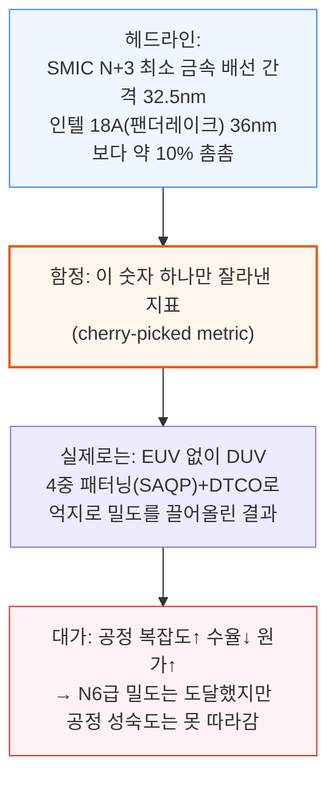

이 리포트는 SemiAnalysis가 지난 1년 반 동안 오리건에 구축해온 첨단 칩 분해·역설계 연구소 STEEL의 첫 공개 결과물입니다. SemiAnalysis는 이미 데이터센터용 첨단 칩 분해로 매출을 내고 있으며, 최근에는 TSMC 대형 고객사의 COUPE CPO(광학 엔진) 3D 스택도 역설계했습니다.

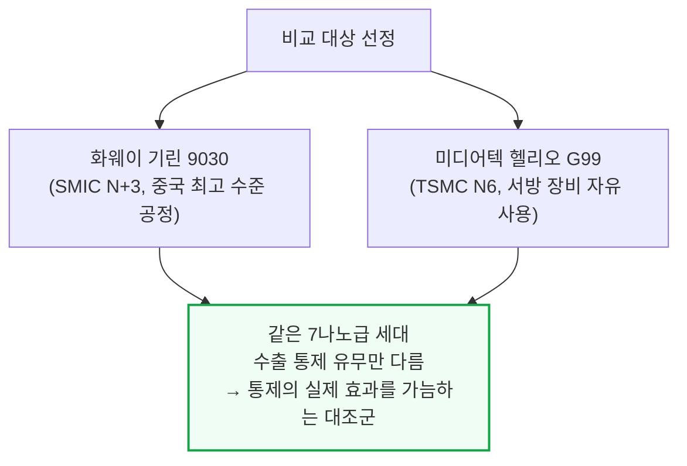

기린 9030 Pro는 3년 전 안드로이드 플래그십 수준의 성능을 내며, 애플·퀄컴·미디어텍·삼성의 현재 플래그십 SoC(시스템온칩)에는 크게 못 미칩니다. 효율 격차는 성능 격차보다도 더 큽니다.

수출 통제는 화웨이와 SMIC가 첨단 실리콘을 만드는 것 자체를 막지는 못했지만, 다른 길을 걷게 만들었습니다. EUV 없이 SMIC는 DUV 다중 패터닝과 DTCO, 점점 복잡해지는 통합 기술에 더 의존하고 있습니다. 로드맵은 더 촘촘한 설계 규칙과 후면 전력 배선(backside power)으로 이어지지만, 단계마다 원가와 공정 위험이 늘어납니다. 화웨이의 τ(타우) 스케일링과 LogicFolding(로직폴딩)은 또 다른 길을 보여줍니다 — 논리 회로를 위아래로 쌓아(3D 적층) 첨단 패키징과 시스템-기술 공동 최적화(STCO)로 밀도를 회복하는 방식입니다.

---

## 2. 다이 샷과 플로어플랜 - 기린 9030 해부 개요

**📌 핵심:**
- 화웨이의 칩 설계 자회사 하이실리콘(HiSilicon)은 2020년 말 수출 통제 전까지 TSMC 최대 고객 중 하나였음(TSMC 최초 EUV 공정 N7+의 유일한 고객, N5도 애플과 함께 최초 사용자) — 통제 이후 퀄컴 SoC(4G 전용)로 전환했다가, 2023년 말 자체 실리콘(기린 9000s, SMIC N+2)으로 복귀
- 기린 9030은 전작 9020과 총 다이 면적이 거의 동일하지만, 더 촘촘한 공정 덕분에 같은 면적에 CPU 미들 코어 1개 추가, GPU·NPU 코어 증설, 캐시 확대까지 담아냄
- 비교 기준인 헬리오 G99는 저가형 스마트폰용 소형 칩(약 29mm²)으로 기린 9030(약 140mm², 약 5배)보다 훨씬 작지만, 그 바탕이 되는 TSMC 공정 자체는 직접 비교 가능한 기준점
- 결론: 다이 면적 자체는 전작과 비슷하게 유지하면서 그 안에 담는 트랜지스터 수를 늘렸다는 것은, N+3가 실제로 밀도를 끌어올렸다는 1차 증거 — 정확한 수치는 이어지는 공정 분석에서 확인

---

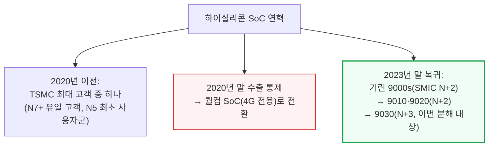

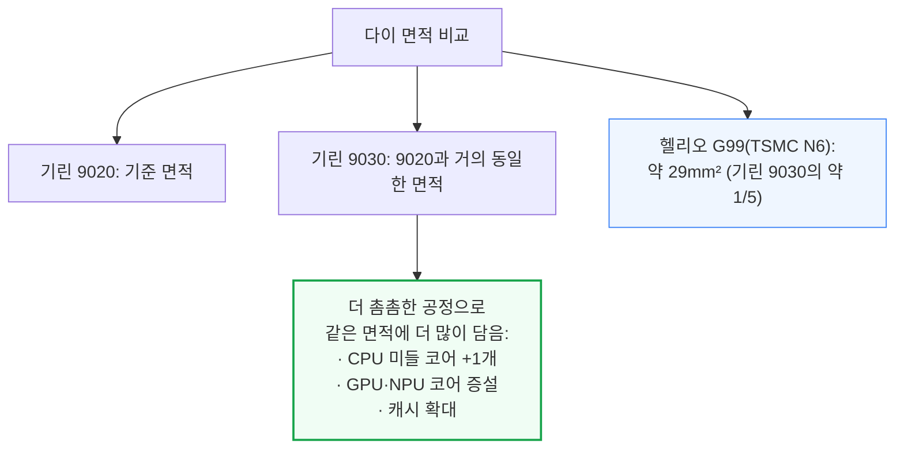

기린 9030은 완전히 새로 설계한 칩이 아니라 9020의 개선판입니다. CPU·GPU·NPU 코어군은 9020의 계열을 그대로 물려받았고, 개선의 원천은 SMIC N+2→N+3 공정 전환, DTCO·플로어플랜 최적화, 소폭의 마이크로아키텍처 개선 세 가지입니다. 면적 개선은 앞의 두 요인에서 나오고, 성능·효율은 더 어려운 시험대입니다.

---

## 3. 아키텍처와 PPA - CPU 코어 성능·효율

**📌 핵심:**
- 기린 9030의 프라임(최상위) 코어는 클럭이 2.5GHz→2.75GHz(10%↑)로 오르고 L2 캐시가 1MiB→2MiB(2배)로 늘었는데도 코어 크기는 7.6% 줄었음(L2 캐시를 빼고 계산하면 21% 감소) — 세대 개선치고는 큰 폭
- 미들 코어는 구조적으로 거의 그대로인데도 코어당 면적이 약 22% 줄었고(대부분 N+2→N+3 공정 전환 효과), 그 절감분을 미들 코어 개수 3개→4개 확대와 공유 L3 캐시 20% 증설에 재투자
- 성능 비교의 핵심은 애플과의 격차 — 애플의 저전력 코어는 1W만 쓰면서 화웨이 프라임 코어(4.5W)보다 정수 연산 성능이 20% 높음. 화웨이 프라임 코어는 클럭당 성능 기준으로 2021년산 Arm Cortex-X2급인데, 2020년산 애플 M1 파이어스톰 코어조차 클럭당 35% 높고 절대 성능은 57% 빠름 — 최신 애플 M5 P코어는 클럭당 60% 높고 2.7배 빠름
- 결론: 화웨이의 코어 설계 자체는 오래된 하이엔드 코어 수준을 클럭당 성능으로 따라잡는 성과지만, 첨단 공정의 전압-주파수 곡선과 트랜지스터 예산을 못 따라가는 한계는 설계로 메울 수 없음 — 이 격차를 메우려는 시도가 후반부의 LogicFolding

---

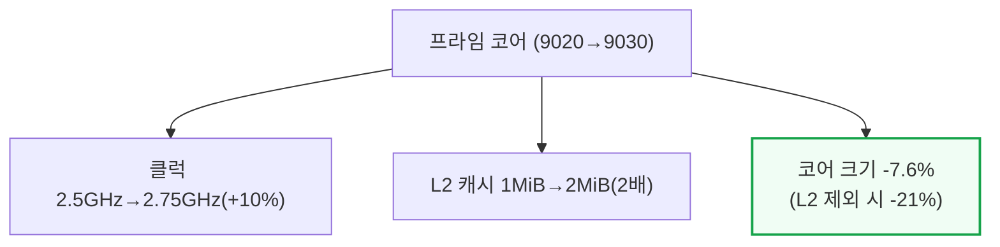

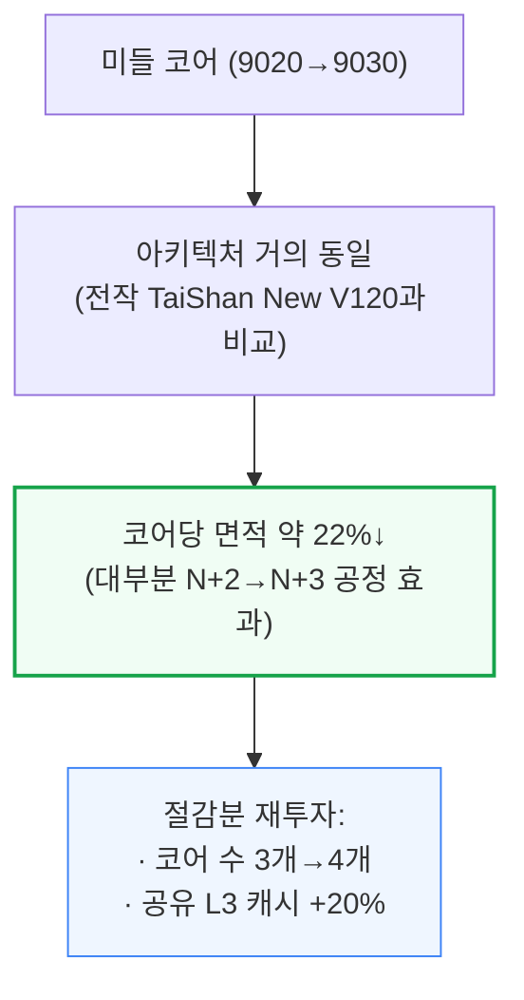

타이니(최소) 코어는 프라임·미들 코어보다 덜 줄었는데, 작은 코어일수록 공정과 무관한 고정 오버헤드가 차지하는 비중이 크기 때문으로 추정됩니다. 공유 L2 캐시가 2MiB→4MiB로 2배 늘면서 전체 타이니 코어 클러스터 면적은 소폭 늘었습니다.

클럭당 성능(per-clock) 개선치를 보면 미들·타이니 코어의 정수 연산 성능이 9020 대비 각각 17%·14% 올랐고(부동소수점은 미들 변화 없음, 타이니 +11%), 이는 같거나 더 낮은 주파수에서 나온 결과라 순수 마이크로아키텍처 튜닝의 성과입니다. 다만 두 코어 모두 설계상 최대 클럭을 실제로는 유지하지 못했는데, 열·전력·안정성 한계로 보입니다.

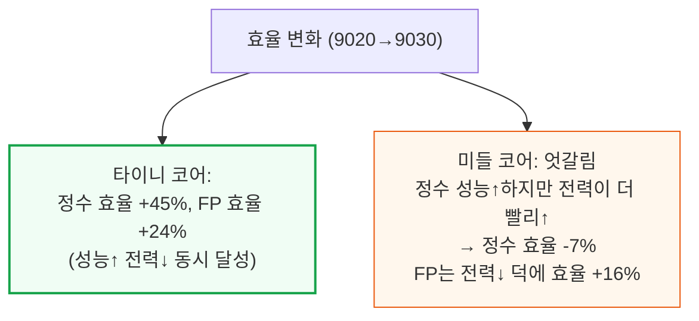

📌 용어 풀이: 클럭당 성능(Per-Clock)과 절대 성능의 차이
> - **클럭당 성능**: 같은 주파수(클럭 속도)에서 한 사이클에 얼마나 많은 일을 처리하는지 — 마이크로아키텍처(회로 설계) 자체의 우수성을 나타냄
> - **절대 성능**: 클럭당 성능 × 실제 도달 주파수 — 화웨이 프라임 코어는 클럭당 성능은 2021년 설계 수준을 따라잡았지만, 낮은 클럭으로 운용해 절대 성능은 훨씬 뒤처짐

가장 극명한 비교는 기린 9020 대 9030이 아니라 애플과의 격차입니다. 애플 저전력 코어는 1W만 쓰면서도 화웨이 프라임 코어(4.5W)보다 정수 성능이 20% 높습니다. N+3가 TSMC N6를 따라잡았다 해도, N6는 이미 몇 세대 전 공정입니다. 애플과 퀄컴은 더 촘촘하고 전압-주파수 곡선이 더 좋은 N4·N3P 공정을 쓰기 때문에 같은 면적에서 더 큰 트랜지스터 예산과 와트당 성능을 확보합니다.

프라임 코어는 클럭당 성능 기준 2021년산 Arm Cortex-X2급입니다. 2020년산 애플 M1 파이어스톰 코어조차 비슷한 4.5W에서 클럭당 35% 높고 절대 정수 성능은 57% 빠릅니다. 현재 최신 세대는 격차가 더 벌어져 애플 M5 P코어는 클럭당 60% 높고 2.7배 빠르며, Arm C1 Ultra는 클럭당 45% 높고 2배 빠릅니다.

오래된 하이엔드 코어를 클럭당 성능으로 따라잡은 것은 실질적인 설계 성과지만, 화웨이가 따라잡지 못하는 것은 첨단 공정의 전압-주파수 곡선과 트랜지스터 예산 자체 — 이 격차 때문에 애플·퀄컴 등은 같은 면적에 더 넓은 코어, 더 큰 캐시, 더 깊은 버퍼를 더 낮은 전압으로 넣을 수 있습니다. 화웨이의 LogicFolding 로드맵은 이 문제에 대한 한 가지 답으로, 활성 논리 회로를 3D로 쌓아 밀도와 신호 경로 단축을 회복하려는 시도입니다(11번 섹션에서 상세히 다룸).

---

## 4. GPU와 NPU 성능

**📌 핵심:**
- GPU(말레오온 935)는 9020(말레오온 920) 대비 컴퓨트 유닛(CU) 수가 4개→6개로 늘고 레이트레이싱(광선추적) 지원까지 추가됐는데도 CU 하나의 면적은 28% 줄었음 — 다만 CU 외곽 면적이 33% 늘어 상쇄되면서 GPU 클러스터 전체는 오히려 10% 커짐
- 3DMark 벤치마크에서 9020 대비 Wild Life Extreme 70%, Steel Nomad Light 79% 성능 향상 — 클럭 11%↑ × CU 수 50%↑에서 나오는 이론적 상승폭(약 67%)과 대체로 일치
- 최신 플래그십(스냅드래곤 8 엘리트 Gen5, 디멘시티 9500)과는 여전히 2.4\~3.2배 격차가 있지만, 스냅드래곤 8+ Gen1이나 애플 A16 등 구형 플래그십은 앞서기 시작
- 결론: NPU(신경망처리장치)는 9020의 "Lite 1개+Tiny 1개" 구성에서 9030 "Lite 1개+Tiny 2개"로 확대돼 화웨이 최초 플래그십(기린 9000 5G, TSMC N5, Lite 2개+Tiny 1개) 시절의 멀티코어 전략으로 되돌아감 — 다만 늘어난 면적은 Lite가 아니라 Tiny 코어에 배정돼 최적화 방향이 달라졌음

---

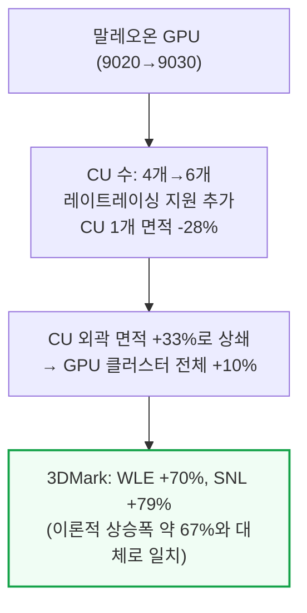

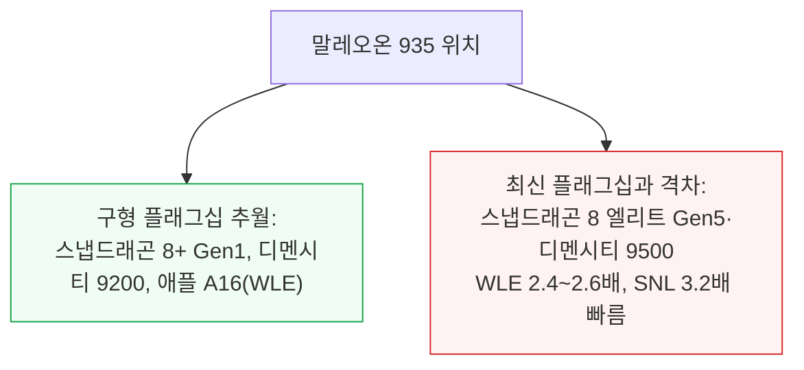

레이트레이싱은 화웨이의 첫 하드웨어 가속 지원으로, Exynos 2200보다 약간 앞서고 애플 A16과는 비슷한 수준이며, 최신 플래그십은 최대 3.7배 빠릅니다.

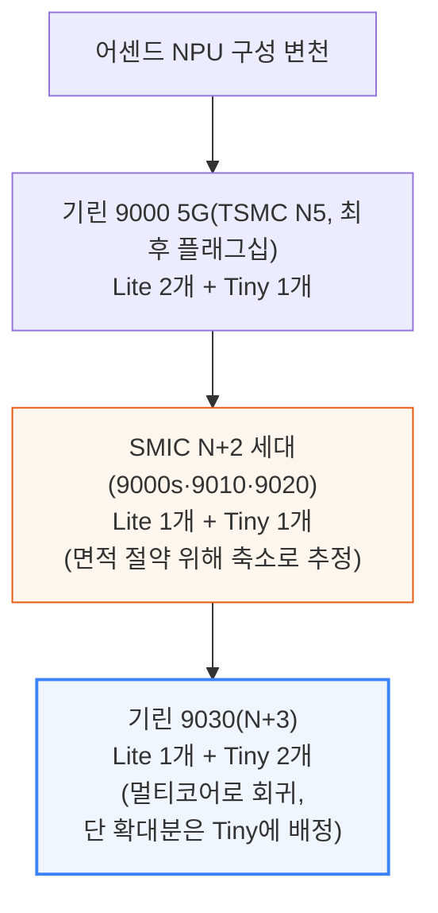

NPU는 이번 세대에서 구조적으로 가장 크게 바뀐 블록입니다. 코어 타입 자체가 바뀐 것은 아니지만, Lite·Tiny 두 코어 모두 레이아웃이 상당히 변경됐습니다.

---

## 5. 메모리와 패키징

**📌 핵심:**
- 기린 9030 Pro는 삼성 D램 12GB(K4L2E165YD, 12Gb LPDDR5X-9600, 삼성 1a 노드 — 10나노급 D램의 4세대째, 2022년부터 양산돼 최신 재고)를 4개씩 2스택으로 탑재
- 16GB Pro Max 모델은 삼성 또는 CXMT(중국 D램 업체) 패키지가 혼용됨 — CXMT 패키지(CXDD7JEDM)의 X선 단층촬영(CT) 추정 다이 밀도는 제곱밀리미터당 약 0.3Gib로, 다른 업체의 1z급(10나노급 3세대) 공정과 비슷한 수준
- 패키지는 iPoP(integrated Package-on-Package) 구조 — D램 패키지가 유기 RDL(재배선층) 인터포저 위에 얹히고, 그 아래 SoC와 패키지 기판이 있으며, 전체가 BGA(볼그리드어레이) 솔더범프로 인쇄회로기판(PCB)에 실장됨. 실리콘 인터포저는 아예 쓰지 않는 전면 유기 구조
- 결론: 전면 유기 패키지는 SoC의 대역폭 요구가 실리콘 인터포저까지는 필요 없는 수준이라는 판단 아래, 기판과 열팽창계수(CTE)를 맞춰 휘어짐(warpage)을 줄이면서 비용도 아끼는 선택

---

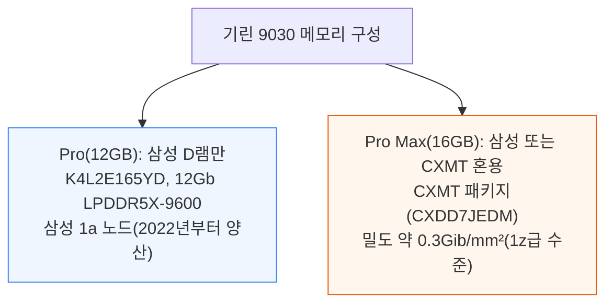

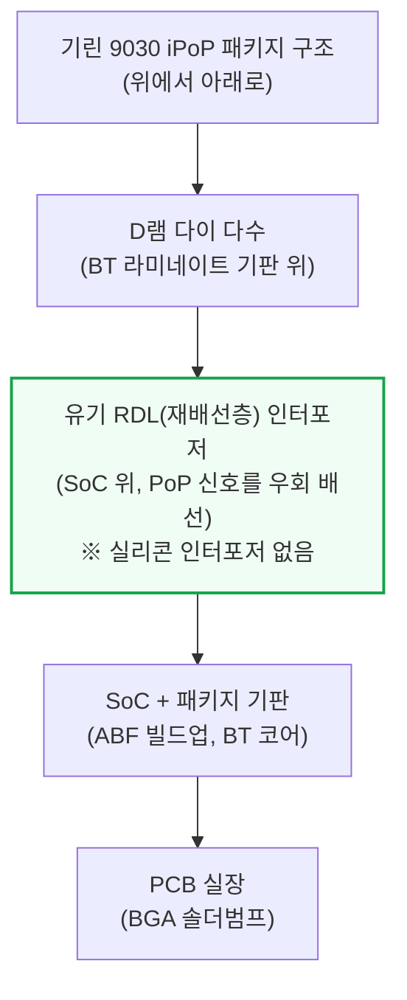

📌 용어 풀이: iPoP과 실리콘 인터포저를 안 쓰는 이유
> - **iPoP (integrated Package-on-Package)**: 메모리 패키지를 로직 칩(SoC) 위에 쌓아 올리는 방식 — 배선을 우회시키는 유기 RDL 인터포저가 둘 사이에 들어감
> - **실리콘 인터포저를 쓰지 않는 이유**: 전체를 유기(플라스틱계) 소재로 통일하면 패키지의 열팽창계수가 PCB와 비슷해져 기판 레벨 휘어짐이 줄고, SoC가 필요로 하지 않는 대역폭까지 위해 비싼 실리콘 인터포저를 쓸 필요가 없어짐

패키지 기판은 D램 스택을 받치는 얇은 BT(비스말레이미드-트리아진) 라미네이트이고, SoC 위 유기 RDL 인터포저는 PoP 신호를 다이 주변으로 우회시키며 열 방출용 더미 구리 기둥도 갖고 있을 수 있습니다. 패키지 기판 자체는 더 두꺼운 ABF(아지노모토 빌드업 필름) 위에 BT 코어를 얹은 구조로, 플립칩 범프를 BGA 피치까지 펼쳐내고 전력 배선층을 내장합니다.

---

## 6. 핀 프로파일 - FinFET 핀 형상 비교

**📌 핵심:**
- FinFET(핀펫) 트랜지스터의 핵심은 핀(전류가 흐르는 채널) 모양 — 이상적으로는 키가 크고 폭이 좁고 거의 수직이어야 하지만, 지나치면 구동 전류 약화·핀 부러짐·불량률 상승으로 이어짐
- N+3의 핀 피치는 30\~32nm로, 비교 대상인 N6 실측치 34nm보다 좁음(단, N6 자체는 밀도 개선을 피치 축소가 아니라 DTCO로 달성한 공정이라 이 수치는 참고용)
- N+3의 핀 종횡비(키/폭)는 약 9.5:1로 N6의 7.8:1보다 크고, 핀 상단 둥글림 정도(작을수록 좋음)도 N+3이 상대적 폭 대비 0.37로 N6의 0.44보다 우수 — 두 지표 모두 N+3이 N6보다 "더 이상적인 핀 모양"에 가까움을 시사
- 결론: 로직과 8T SRAM 핀 패턴을 종합하면, N+3은 128nm 피치의 단일 CD 만드렐(mandrel) 리소그래피에 SAQP(자기정렬 4중 패터닝)를 적용해 다이 전역에 걸쳐 약 32nm 격자(128nm÷4)를 만들어내는 것으로 역설계됨 — 이 정도의 미세 핀을 EUV 없이 만든다는 것 자체가 SMIC의 공정 한계를 시험하는 지점

---

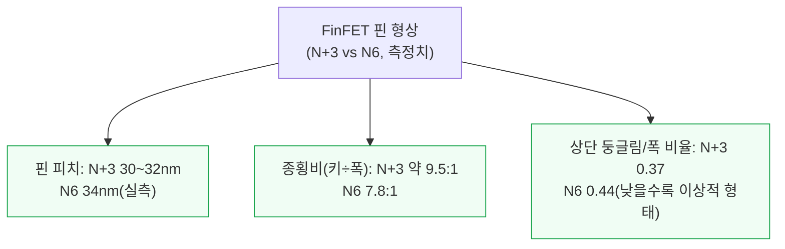

📌 용어 풀이: 핀 프로파일이 왜 중요한가
> - **핀(Fin)**: FinFET 트랜지스터에서 전류가 흐르는 수직으로 선 채널 구조물 — 평면(planar) 트랜지스터의 채널을 세워 옆면까지 게이트가 감싸게 만들어 전기적 제어력을 높임
> - **타협 관계**: 핀을 키우면 채널 폭이 늘어 전류가 세지지만, 너무 좁고 높으면 핀이 부러지거나 선폭 변동(line-edge variation)이 커져 불량률이 오름 — 공정마다 이 균형점을 어디에 두느냐가 다름

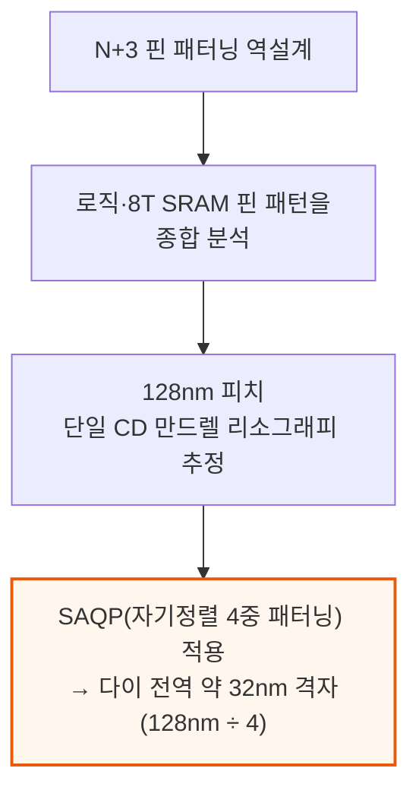

이 수치들은 몇 곳의 단면만 잘라 측정한 단일 자릿수 나노미터 값이라 절대 수치보다는 상대적 격차로 읽어야 합니다 — 중요한 결과는 N+3의 핀이 N6보다 일관되게 더 크고 좁고 덜 둥글다는 점입니다.

---

*작성 진행률: 약 45% 완료 (1~6번 섹션)*
*업데이트: GPU·NPU 성능, 메모리·패키징, 핀 프로파일 섹션 완료*
