# Is SMIC N+3's Metal Pitch Smaller than Intel 18A's?

> **출처**: [SemiAnalysis Newsletter](https://newsletter.semianalysis.com/p/steel-smic-n3-teardown)
> **저자**: STEEL Team, Afzal Ahmad, Andrew Wagner
> **발행일**: 2026-06-14

---

## 📑 목차

### 전체 섹션
 1. [서론 - 헤드라인 뒤에 숨은 진실](#1-서론---헤드라인-뒤에-숨은-진실)
 2. [다이 샷과 플로어플랜 - 기린 9030 해부 개요](#2-다이-샷과-플로어플랜---기린-9030-해부-개요)
 3. [아키텍처와 PPA - CPU 코어 성능·효율](#3-아키텍처와-ppa---cpu-코어-성능효율)
 4. [GPU와 NPU 성능](#4-gpu와-npu-성능)
 5. [메모리와 패키징](#5-메모리와-패키징)
 6. [핀 프로파일 - FinFET 핀 형상 비교](#6-핀-프로파일---finfet-핀-형상-비교)
 7. [표준 셀 - 게이트 피치·셀 높이·트랜지스터 밀도](#7-표준-셀---게이트-피치셀-높이트랜지스터-밀도)
 8. [금속 배선 스택 - SMIC N+3 vs TSMC N6 vs 인텔 18A](#8-금속-배선-스택---smic-n3-vs-tsmc-n6-vs-인텔-18a)
 9. [SRAM 밀도](#9-sram-밀도)
10. [미래 로드맵 - 이론적 N+4·N+5](#10-미래-로드맵---이론적-n4n5)
11. [화웨이 τ 스케일링과 LogicFolding](#11-화웨이-τ-스케일링과-logicfolding)
12. [수출 통제와 확산 리스크](#12-수출-통제와-확산-리스크)
13. [공정 흐름 상세 - 재료 분석과 텅스텐 병목](#13-공정-흐름-상세---재료-분석과-텅스텐-병목)

---

## 🔑 용어 정리

본문을 순서대로 읽기 전에 알아두면 좋은 용어들입니다. 자세한 수치와 설명은 본문에서 처음 등장하는 위치에 나옵니다.

- **N+3**: SMIC(중국 최대 파운데리)가 붙인 공정 세대 이름 — TSMC·삼성처럼 "몇 나노"라는 이름 대신 EUV(극자외선 노광) 없이 기존 DUV(심자외선 노광) 장비를 몇 세대째 개량해왔는지를 세대 숫자로 표기함
- **금속 배선 간격 (Metal Pitch)**: 칩 위에서 신호를 나르는 금속 선과 선 사이의 최소 간격 — 이 간격이 좁을수록 같은 면적에 더 많은 배선을 욱여넣을 수 있어 칩이 촘촘해짐
- **게이트 피치 (CGP, Contacted Gate Pitch)**: 트랜지스터의 스위치 역할을 하는 게이트와 그다음 게이트 사이의 간격 — 이 값이 작을수록 트랜지스터를 촘촘히 배치할 수 있음
- **트랜지스터 밀도 (Bohr 밀도)**: 1제곱밀리미터에 들어가는 트랜지스터 개수를 실제 회로 구성(NAND2 게이트 60% + 스캔 플립플롭 40%)으로 가중 평균해 계산한 업계 표준 밀도 지표
- **DUV 다중 패터닝 (SAQP·SADP)**: 최신 EUV 장비 없이, 기존 DUV 장비로 같은 자리에 노광·식각을 2번(SADP) 또는 4번(SAQP) 반복해 선폭을 더 좁게 만드는 우회 기법 — 공정 단계가 늘어나 비용과 불량 위험이 커짐
- **DTCO (Design-Technology Co-Optimization, 설계-공정 공동 최적화)**: 공정 자체를 미세화하는 대신, 회로 설계 규칙을 공정에 맞춰 최적화해 밀도를 끌어올리는 기법 — 이 글에서는 핀 개수 줄이기(fin depopulation), 게이트 위 콘택(COAG), 단일 확산 분리(SDB) 세 가지가 등장
- **τ(타우) 스케일링과 LogicFolding**: 화웨이가 EUV 없이도 성능을 끌어올리기 위해 내놓은 개념 — 트랜지스터를 더 작게 만드는 대신, 같은 논리 회로 블록을 여러 층으로 쪼개 위아래로 쌓아(3D 적층) 신호가 이동하는 거리와 시간(τ)을 줄이는 접근
- **STEEL (SemiAnalysis Teardown Engineering & Evaluation Lab)**: 이 리포트를 낸 SemiAnalysis의 자체 칩 분해·역설계 연구소 — 오리건에 위치, 이 문서가 첫 공개 리포트

---

## 1. 서론 - 헤드라인 뒤에 숨은 진실

**📌 핵심:**
- 화웨이의 새 스마트폰 AP(모바일 프로세서) 기린 9030은 SMIC(중국 최대 파운드리)의 3세대 7나노급 공정 N+3으로 제조 — 최소 금속 배선 간격(Metal Pitch)이 32.5나노미터(nm)로, 인텔의 최신 팬더레이크 CPU가 쓰는 18A 공정의 36nm보다 약 10% 더 촘촘함
- 하지만 이 수치 하나만으로 "SMIC가 인텔을 앞섰다"고 보면 틀림 — SMIC는 EUV(극자외선 노광) 없이 기존 DUV(심자외선 노광) 장비를 4번씩 반복 노광하는 공격적 다중 패터닝과 설계 최적화(DTCO)로 이 밀도를 억지로 만들어냈고, 그 대가로 공정 복잡도·수율·원가가 나빠짐
- SemiAnalysis는 자체 칩 분해·역설계 연구소 STEEL(Teardown Engineering & Evaluation Lab, 오리건 소재)의 첫 공개 리포트로 기린 9030을 실제로 뜯어 분석 — 비교 대상은 TSMC N6 공정으로 만든 미디어텍 헬리오 G99(저가형 칩)로, 두 공정은 같은 7나노급 세대이면서 한쪽은 수출 통제 대상, 다른 한쪽은 서방 최신 장비를 자유롭게 쓸 수 있다는 차이가 있음
- 결론: SMIC N+3은 TSMC N6급 논리 밀도에 도달했지만 공정 성숙도·원가에서는 따라가지 못함 — 수출 통제가 중국의 첨단 반도체 생산을 막지는 못했지만, 다른(더 비싸고 어려운) 길로 우회하게 만들었음

---

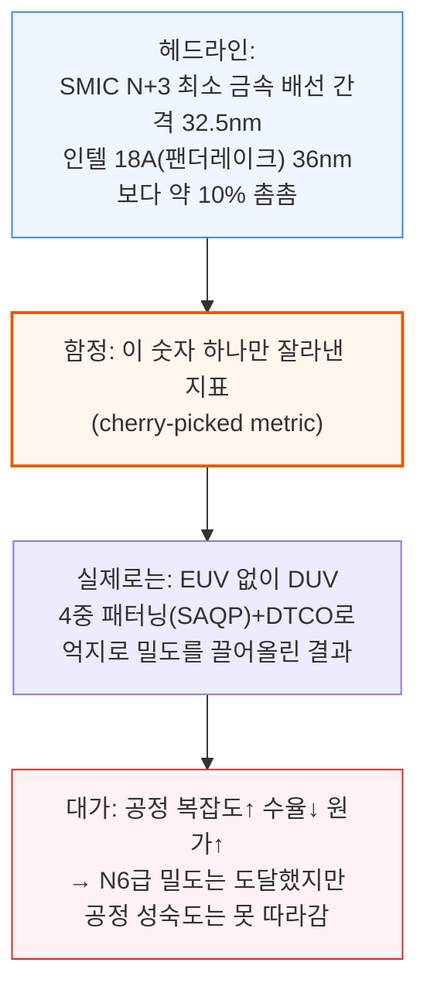

이 리포트는 SemiAnalysis가 지난 1년 반 동안 오리건에 구축해온 첨단 칩 분해·역설계 연구소 STEEL의 첫 공개 결과물입니다. SemiAnalysis는 이미 데이터센터용 첨단 칩 분해로 매출을 내고 있으며, 최근에는 TSMC 대형 고객사의 COUPE CPO(광학 엔진) 3D 스택도 역설계했습니다.

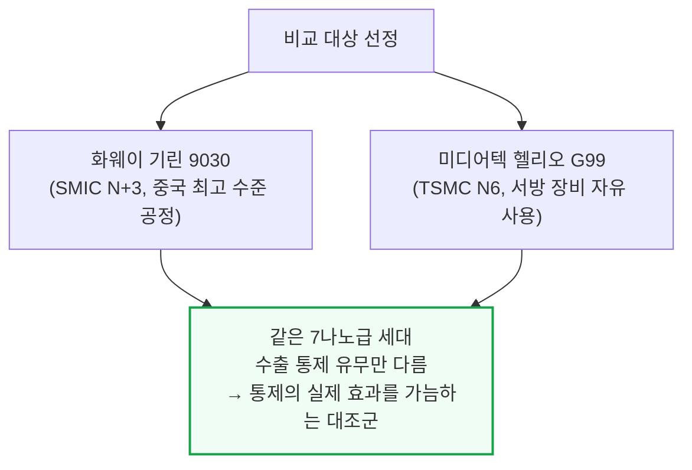

기린 9030 Pro는 3년 전 안드로이드 플래그십 수준의 성능을 내며, 애플·퀄컴·미디어텍·삼성의 현재 플래그십 SoC(시스템온칩)에는 크게 못 미칩니다. 효율 격차는 성능 격차보다도 더 큽니다.

수출 통제는 화웨이와 SMIC가 첨단 실리콘을 만드는 것 자체를 막지는 못했지만, 다른 길을 걷게 만들었습니다. EUV 없이 SMIC는 DUV 다중 패터닝과 DTCO, 점점 복잡해지는 통합 기술에 더 의존하고 있습니다.

로드맵은 더 촘촘한 설계 규칙과 후면 전력 배선(backside power)으로 이어지지만, 단계마다 원가와 공정 위험이 늘어납니다. 화웨이의 τ(타우) 스케일링과 LogicFolding(로직폴딩)은 또 다른 길을 보여줍니다 — 논리 회로를 위아래로 쌓아(3D 적층) 첨단 패키징과 시스템-기술 공동 최적화(STCO)로 밀도를 회복하는 방식입니다.

---

## 2. 다이 샷과 플로어플랜 - 기린 9030 해부 개요

**📌 핵심:**
- 화웨이의 칩 설계 자회사 하이실리콘(HiSilicon)은 2020년 말 수출 통제 전까지 TSMC 최대 고객 중 하나였음(TSMC 최초 EUV 공정 N7+의 유일한 고객, N5도 애플과 함께 최초 사용자) — 통제 이후 퀄컴 SoC(4G 전용)로 전환했다가, 2023년 말 자체 실리콘(기린 9000s, SMIC N+2)으로 복귀
- 기린 9030은 전작 9020과 총 다이 면적이 거의 동일하지만, 더 촘촘한 공정 덕분에 같은 면적에 CPU 미들 코어 1개 추가, GPU·NPU 코어 증설, 캐시 확대까지 담아냄
- 비교 기준인 헬리오 G99는 저가형 스마트폰용 소형 칩(약 29mm²)으로 기린 9030(약 140mm², 약 5배)보다 훨씬 작지만, 그 바탕이 되는 TSMC 공정 자체는 직접 비교 가능한 기준점
- 결론: 다이 면적 자체는 전작과 비슷하게 유지하면서 그 안에 담는 트랜지스터 수를 늘렸다는 것은, N+3가 실제로 밀도를 끌어올렸다는 1차 증거 — 정확한 수치는 이어지는 공정 분석에서 확인

---

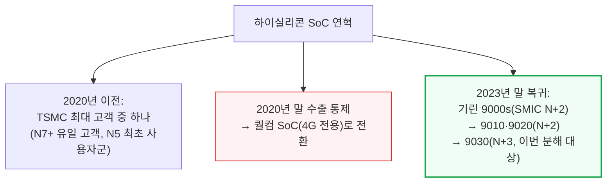

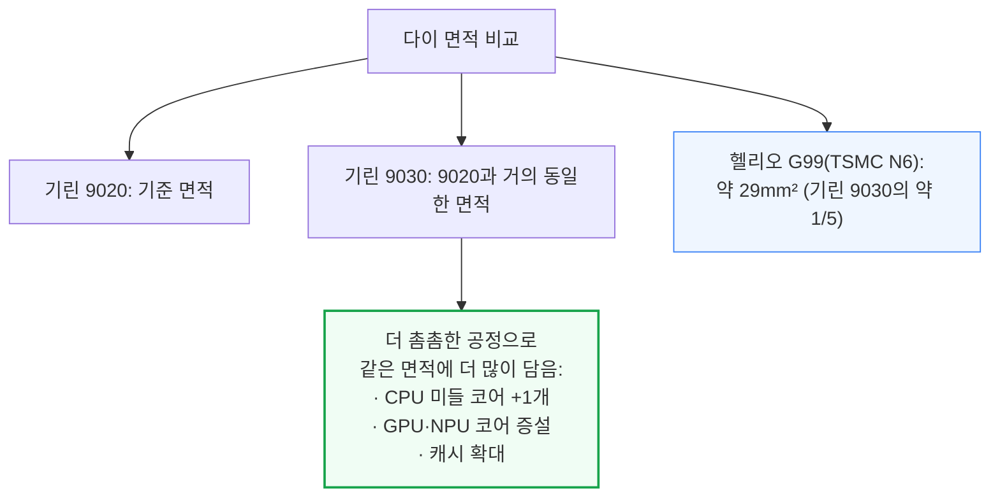

기린 9030은 완전히 새로 설계한 칩이 아니라 9020의 개선판입니다. CPU·GPU·NPU 코어군은 9020의 계열을 그대로 물려받았고, 개선의 원천은 SMIC N+2→N+3 공정 전환, DTCO·플로어플랜 최적화, 소폭의 마이크로아키텍처 개선 세 가지입니다. 면적 개선은 앞의 두 요인에서 나오고, 성능·효율은 더 어려운 시험대입니다.

---

## 3. 아키텍처와 PPA - CPU 코어 성능·효율

**📌 핵심:**
- 기린 9030의 프라임(최상위) 코어는 클럭이 2.5GHz→2.75GHz(10%↑)로 오르고 L2 캐시가 1MiB→2MiB(2배)로 늘었는데도 코어 크기는 7.6% 줄었음(L2 캐시를 빼고 계산하면 21% 감소) — 세대 개선치고는 큰 폭
- 미들 코어는 구조적으로 거의 그대로인데도 코어당 면적이 약 22% 줄었고(대부분 N+2→N+3 공정 전환 효과), 그 절감분을 미들 코어 개수 3개→4개 확대와 공유 L3 캐시 20% 증설에 재투자
- 성능 비교의 핵심은 애플과의 격차 — 애플의 저전력 코어는 1W만 쓰면서 화웨이 프라임 코어(4.5W)보다 정수 연산 성능이 20% 높음. 화웨이 프라임 코어는 클럭당 성능 기준으로 2021년산 Arm Cortex-X2급인데, 2020년산 애플 M1 파이어스톰 코어조차 클럭당 35% 높고 절대 성능은 57% 빠름 — 최신 애플 M5 P코어는 클럭당 60% 높고 2.7배 빠름
- 결론: 화웨이의 코어 설계 자체는 오래된 하이엔드 코어 수준을 클럭당 성능으로 따라잡는 성과지만, 첨단 공정의 전압-주파수 곡선과 트랜지스터 예산을 못 따라가는 한계는 설계로 메울 수 없음 — 이 격차를 메우려는 시도가 후반부의 LogicFolding

---

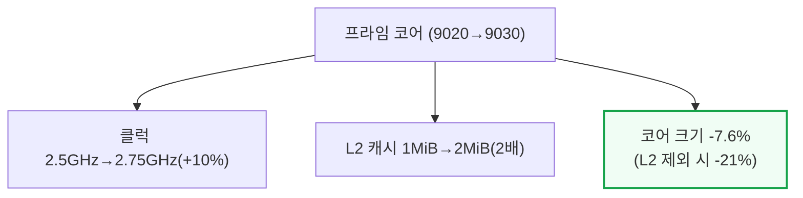

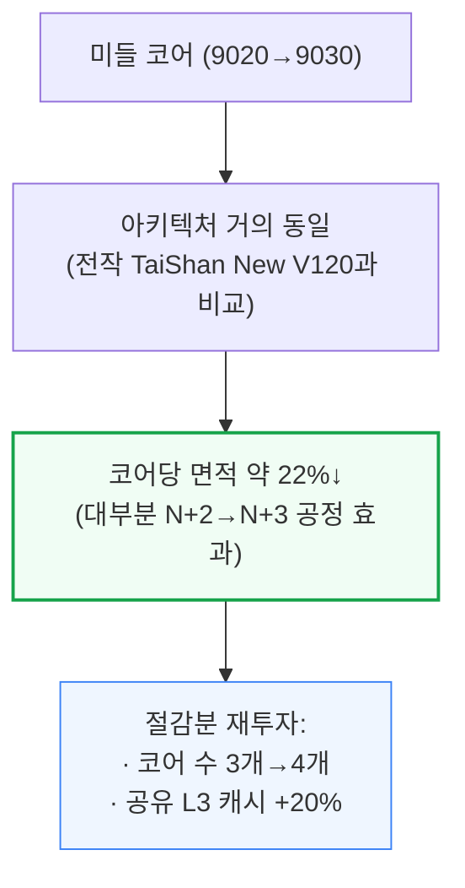

타이니(최소) 코어는 프라임·미들 코어보다 덜 줄었는데, 작은 코어일수록 공정과 무관한 고정 오버헤드가 차지하는 비중이 크기 때문으로 추정됩니다. 공유 L2 캐시가 2MiB→4MiB로 2배 늘면서 전체 타이니 코어 클러스터 면적은 소폭 늘었습니다.

클럭당 성능(per-clock) 개선치를 보면 미들·타이니 코어의 정수 연산 성능이 9020 대비 각각 17%·14% 올랐고(부동소수점은 미들 변화 없음, 타이니 +11%), 이는 같거나 더 낮은 주파수에서 나온 결과라 순수 마이크로아키텍처 튜닝의 성과입니다.

다만 두 코어 모두 설계상 최대 클럭을 실제로는 유지하지 못했는데, 열·전력·안정성 한계로 보입니다.

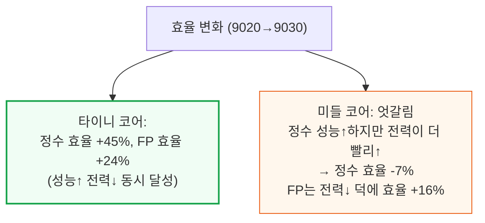

📌 용어 풀이: 클럭당 성능(Per-Clock)과 절대 성능의 차이
> - **클럭당 성능**: 같은 주파수(클럭 속도)에서 한 사이클에 얼마나 많은 일을 처리하는지 — 마이크로아키텍처(회로 설계) 자체의 우수성을 나타냄
> - **절대 성능**: 클럭당 성능 × 실제 도달 주파수 — 화웨이 프라임 코어는 클럭당 성능은 2021년 설계 수준을 따라잡았지만, 낮은 클럭으로 운용해 절대 성능은 훨씬 뒤처짐

가장 극명한 비교는 기린 9020 대 9030이 아니라 애플과의 격차입니다. 애플 저전력 코어는 1W만 쓰면서도 화웨이 프라임 코어(4.5W)보다 정수 성능이 20% 높습니다.

N+3가 TSMC N6를 따라잡았다 해도, N6는 이미 몇 세대 전 공정입니다. 애플과 퀄컴은 더 촘촘하고 전압-주파수 곡선이 더 좋은 N4·N3P 공정을 쓰기 때문에 같은 면적에서 더 큰 트랜지스터 예산과 와트당 성능을 확보합니다.

프라임 코어는 클럭당 성능 기준 2021년산 Arm Cortex-X2급입니다. 2020년산 애플 M1 파이어스톰 코어조차 비슷한 4.5W에서 클럭당 35% 높고 절대 정수 성능은 57% 빠릅니다. 현재 최신 세대는 격차가 더 벌어져 애플 M5 P코어는 클럭당 60% 높고 2.7배 빠르며, Arm C1 Ultra는 클럭당 45% 높고 2배 빠릅니다.

오래된 하이엔드 코어를 클럭당 성능으로 따라잡은 것은 실질적인 설계 성과지만, 화웨이가 따라잡지 못하는 것은 첨단 공정의 전압-주파수 곡선과 트랜지스터 예산 자체입니다.

이 격차 때문에 애플·퀄컴 등은 같은 면적에 더 넓은 코어, 더 큰 캐시, 더 깊은 버퍼를 더 낮은 전압으로 넣을 수 있습니다. 화웨이의 LogicFolding 로드맵은 이 문제에 대한 한 가지 답으로, 활성 논리 회로를 3D로 쌓아 밀도와 신호 경로 단축을 회복하려는 시도입니다(11번 섹션에서 상세히 다룸).

---

## 4. GPU와 NPU 성능

**📌 핵심:**
- GPU(말레오온 935)는 9020(말레오온 920) 대비 컴퓨트 유닛(CU) 수가 4개→6개로 늘고 레이트레이싱(광선추적) 지원까지 추가됐는데도 CU 하나의 면적은 28% 줄었음 — 다만 CU 외곽 면적이 33% 늘어 상쇄되면서 GPU 클러스터 전체는 오히려 10% 커짐
- 3DMark 벤치마크에서 9020 대비 Wild Life Extreme 70%, Steel Nomad Light 79% 성능 향상 — 클럭 11%↑ × CU 수 50%↑에서 나오는 이론적 상승폭(약 67%)과 대체로 일치
- 최신 플래그십(스냅드래곤 8 엘리트 Gen5, 디멘시티 9500)과는 여전히 2.4\~3.2배 격차가 있지만, 스냅드래곤 8+ Gen1이나 애플 A16 등 구형 플래그십은 앞서기 시작
- 결론: NPU(신경망처리장치)는 9020의 "Lite 1개+Tiny 1개" 구성에서 9030 "Lite 1개+Tiny 2개"로 확대돼 화웨이 최초 플래그십(기린 9000 5G, TSMC N5, Lite 2개+Tiny 1개) 시절의 멀티코어 전략으로 되돌아감 — 다만 늘어난 면적은 Lite가 아니라 Tiny 코어에 배정돼 최적화 방향이 달라졌음

---

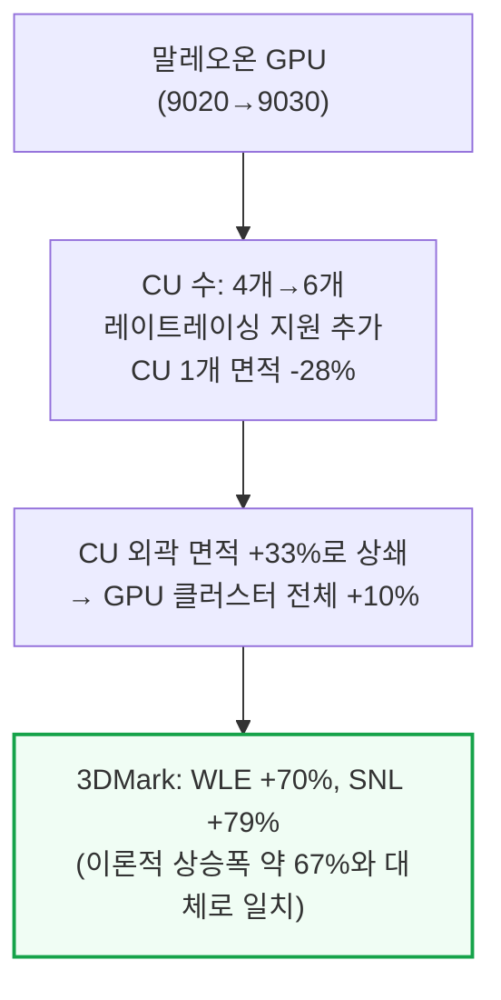

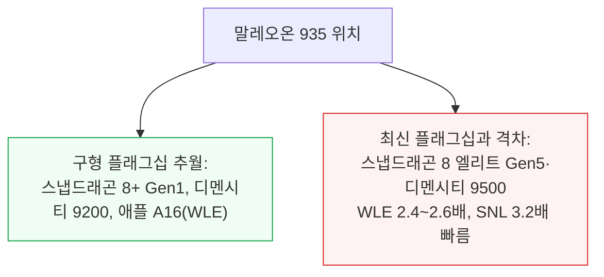

레이트레이싱은 화웨이의 첫 하드웨어 가속 지원으로, Exynos 2200보다 약간 앞서고 애플 A16과는 비슷한 수준이며, 최신 플래그십은 최대 3.7배 빠릅니다.

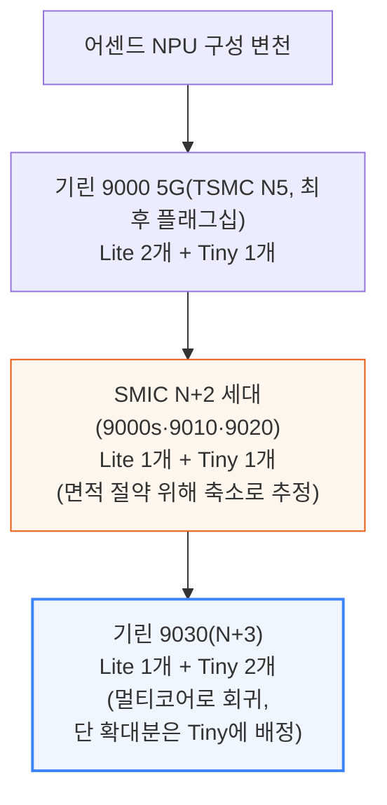

NPU는 이번 세대에서 구조적으로 가장 크게 바뀐 블록입니다. 코어 타입 자체가 바뀐 것은 아니지만, Lite·Tiny 두 코어 모두 레이아웃이 상당히 변경됐습니다.

---

## 5. 메모리와 패키징

**📌 핵심:**
- 기린 9030 Pro는 삼성 D램 12GB(K4L2E165YD, 12Gb LPDDR5X-9600, 삼성 1a 노드 — 10나노급 D램의 4세대째, 2022년부터 양산돼 최신 재고)를 4개씩 2스택으로 탑재
- 16GB Pro Max 모델은 삼성 또는 CXMT(중국 D램 업체) 패키지가 혼용됨 — CXMT 패키지(CXDD7JEDM)의 X선 단층촬영(CT) 추정 다이 밀도는 제곱밀리미터당 약 0.3Gib로, 다른 업체의 1z급(10나노급 3세대) 공정과 비슷한 수준
- 패키지는 iPoP(integrated Package-on-Package) 구조 — D램 패키지가 유기 RDL(재배선층) 인터포저 위에 얹히고, 그 아래 SoC와 패키지 기판이 있으며, 전체가 BGA(볼그리드어레이) 솔더범프로 인쇄회로기판(PCB)에 실장됨. 실리콘 인터포저는 아예 쓰지 않는 전면 유기 구조
- 결론: 전면 유기 패키지는 SoC의 대역폭 요구가 실리콘 인터포저까지는 필요 없는 수준이라는 판단 아래, 기판과 열팽창계수(CTE)를 맞춰 휘어짐(warpage)을 줄이면서 비용도 아끼는 선택

---

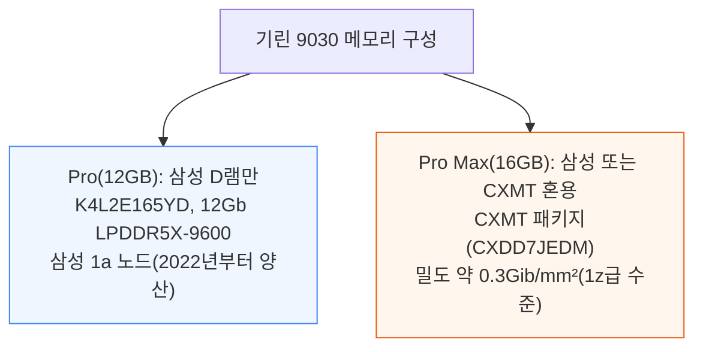

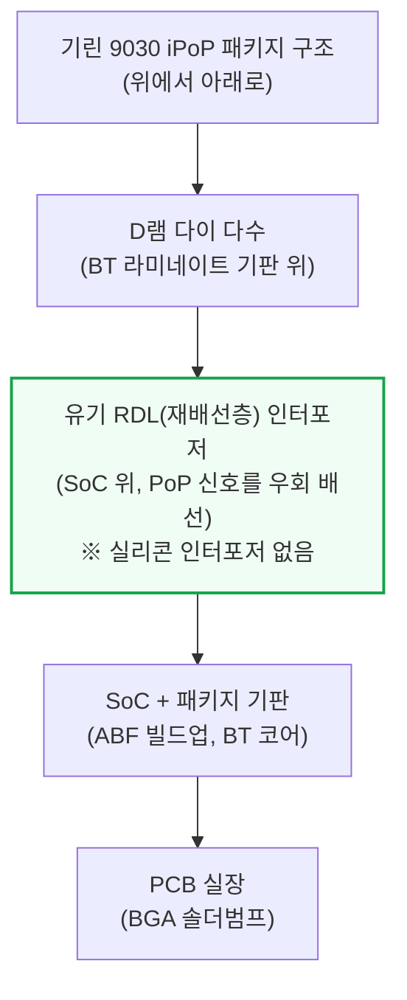

📌 용어 풀이: iPoP과 실리콘 인터포저를 안 쓰는 이유
> - **iPoP (integrated Package-on-Package)**: 메모리 패키지를 로직 칩(SoC) 위에 쌓아 올리는 방식 — 배선을 우회시키는 유기 RDL 인터포저가 둘 사이에 들어감
> - **실리콘 인터포저를 쓰지 않는 이유**: 전체를 유기(플라스틱계) 소재로 통일하면 패키지의 열팽창계수가 PCB와 비슷해져 기판 레벨 휘어짐이 줄고, SoC가 필요로 하지 않는 대역폭까지 위해 비싼 실리콘 인터포저를 쓸 필요가 없어짐

패키지 기판은 D램 스택을 받치는 얇은 BT(비스말레이미드-트리아진) 라미네이트이고, SoC 위 유기 RDL 인터포저는 PoP 신호를 다이 주변으로 우회시키며 열 방출용 더미 구리 기둥도 갖고 있을 수 있습니다.

패키지 기판 자체는 더 두꺼운 ABF(아지노모토 빌드업 필름) 위에 BT 코어를 얹은 구조로, 플립칩 범프를 BGA 피치까지 펼쳐내고 전력 배선층을 내장합니다.

### 보드·패키지 X선 분석 - Pro와 Pro Max의 차이

기린 9030 Pro(메이트 80 Pro)와 Pro Max(메이트 80 Pro Max)는 컴퓨트 패키지가 완전히 같지 않습니다.

Pro Max는 메모리 패키지와 RDL 인터포저 사이 언더필(underfill, 솔더범프 주변을 채워 강성을 보강하고 접합부를 기계적 스트레스에서 보호하는 소재)로 모세관 언더필(CUF)을 써 RDL 인터포저에 더 강하게 결합돼 있습니다.

앞서 5번 섹션에서 다룬 대로 Pro Max는 삼성·CXMT LPDDR5X 패키지가 혼용되는 것도 확인됐습니다.

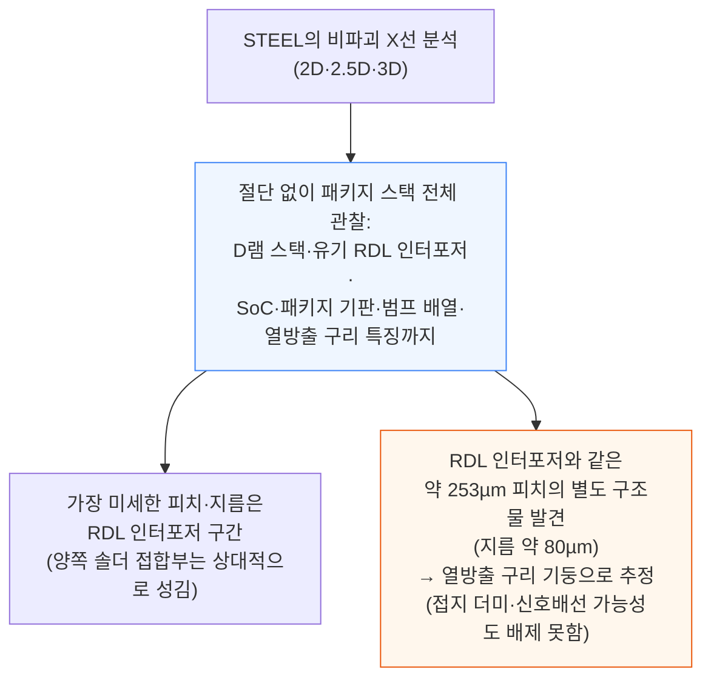

X선으로 얻은 이 수치들은 다이싱·시료 준비 과정에서 생기는 구리 재유동(reflow)·휘어짐·범프 박리 같은 인공산물의 영향을 받을 수 있지만, 코스(coarse)한 메모리 패키지 기판부터 미세한 유기 RDL 인터포저까지 피치와 배치를 추출하는 데는 무리가 없습니다.

패키지 기판에는 "F5P"라는 마킹이 있는데, 기판·패키지 공급사를 식별하는 표기로 추정되지만 STEEL은 아직 공급사를 특정하지 못했습니다.

---

## 6. 핀 프로파일 - FinFET 핀 형상 비교

**📌 핵심:**
- FinFET(핀펫) 트랜지스터의 핵심은 핀(전류가 흐르는 채널) 모양 — 이상적으로는 키가 크고 폭이 좁고 거의 수직이어야 하지만, 지나치면 구동 전류 약화·핀 부러짐·불량률 상승으로 이어짐
- N+3의 핀 피치는 30\~32nm로, 비교 대상인 N6 실측치 34nm보다 좁음(단, N6 자체는 밀도 개선을 피치 축소가 아니라 DTCO로 달성한 공정이라 이 수치는 참고용)
- N+3의 핀 종횡비(키/폭)는 약 9.5:1로 N6의 7.8:1보다 크고, 핀 상단 둥글림 정도(작을수록 좋음)도 N+3이 상대적 폭 대비 0.37로 N6의 0.44보다 우수 — 두 지표 모두 N+3이 N6보다 "더 이상적인 핀 모양"에 가까움을 시사
- 결론: 로직과 8T SRAM 핀 패턴을 종합하면, N+3은 128nm 피치의 단일 CD 만드렐(mandrel) 리소그래피에 SAQP(자기정렬 4중 패터닝)를 적용해 다이 전역에 걸쳐 약 32nm 격자(128nm÷4)를 만들어내는 것으로 역설계됨 — 이 정도의 미세 핀을 EUV 없이 만든다는 것 자체가 SMIC의 공정 한계를 시험하는 지점

---

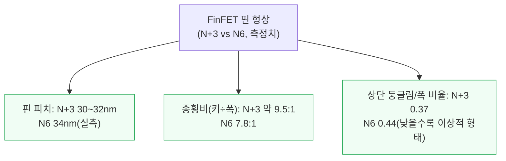

📌 용어 풀이: 핀 프로파일이 왜 중요한가
> - **핀(Fin)**: FinFET 트랜지스터에서 전류가 흐르는 수직으로 선 채널 구조물 — 평면(planar) 트랜지스터의 채널을 세워 옆면까지 게이트가 감싸게 만들어 전기적 제어력을 높임
> - **타협 관계**: 핀을 키우면 채널 폭이 늘어 전류가 세지지만, 너무 좁고 높으면 핀이 부러지거나 선폭 변동(line-edge variation)이 커져 불량률이 오름 — 공정마다 이 균형점을 어디에 두느냐가 다름

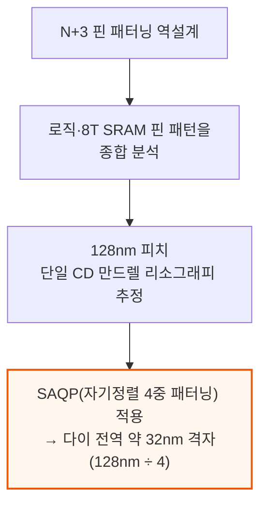

이 수치들은 몇 곳의 단면만 잘라 측정한 단일 자릿수 나노미터 값이라 절대 수치보다는 상대적 격차로 읽어야 합니다 — 중요한 결과는 N+3의 핀이 N6보다 일관되게 더 크고 좁고 덜 둥글다는 점입니다.

---

## 7. 표준 셀 - 게이트 피치·셀 높이·트랜지스터 밀도

**📌 핵심:**
- 표준 셀(칩 레이아웃의 기본 벽돌)의 핵심 치수는 게이트 피치(CGP)·셀 높이(CH)·핀 개수 — 밀도를 재는 업계 표준 지표는 Bohr 밀도(NAND2 게이트 면적 60% + 스캔 플립플롭 면적 40% 가중평균)
- 기린 9030의 셀 높이는 CPU 코어 3종 모두 228nm로, N6(헬리오 G99의 HD 셀 240nm)보다 5% 작고 SMIC 전작 N+2(252nm)보다는 9.5% 작음 — 게이트 피치(CGP)는 N+3·N6 HD 라이브러리 모두 57nm로 동일(N+3은 N+2 대비 9.5% 축소)
- SMIC는 EUV 없이 세 가지 DTCO(설계-공정 공동 최적화) 기법을 공격적으로 총동원해 이 밀도를 만듦 — 핀 개수 축소(fin depopulation, 3\~4개→2개), 게이트 위 콘택(COAG, N+3만 적용·N6는 미적용), 단일 확산 분리(SDB, 이전 세대의 2배 면적을 쓰는 이중 확산 분리 대신 사용)
- 결론: 이 조합의 결과로 SMIC N+3의 트랜지스터 밀도는 mm²당 113.4백만개(MTr/mm²)로, EUV를 쓰는 TSMC의 성숙 공정 N6(107.7 MTr/mm²)보다 오히려 높음 — EUV 없이 DUV 다중 패터닝만으로 EUV 공정을 밀도에서 앞선 사례

---

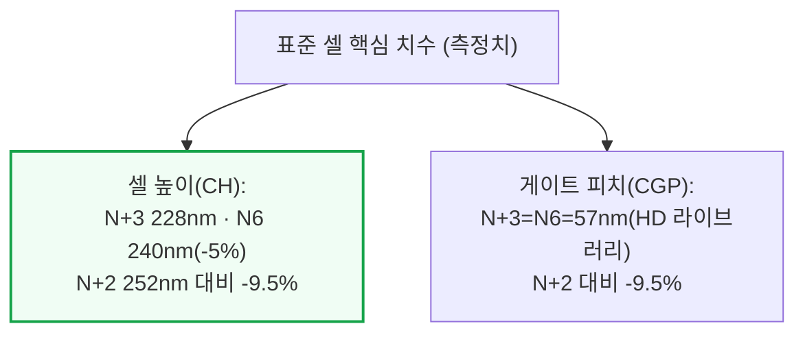

📌 용어 풀이: DTCO 3종 세트
> - **핀 개수 축소 (Fin Depopulation)**: 초기 FinFET은 트랜지스터 하나에 핀 3\~4개를 썼는데, N+3·N6 모두 2개로 줄여 구동력을 밀도와 맞바꿈
> - **게이트 위 콘택 (COAG, Contact Over Active Gate)**: 게이트 접점을 소자분리 영역이 아니라 게이트 바로 위에 얹어 셀 높이를 줄이는 기법 — N+3은 적용(단면에서 확인), N6는 미적용(오프-게이트 접점)
> - **단일 확산 분리 (SDB, Single Diffusion Break)**: 같은 행의 셀 사이를 전기적으로 분리하는 틈 — 예전엔 CGP 2칸을 쓰는 이중 분리를 썼지만, N+3·N6 모두 1칸만 쓰는 SDB로 면적을 아끼는 대신 국소 배치 효과(LLE, 인접 셀에 따라 전기 특성이 미세하게 흔들리는 현상) 관리 부담이 늘어남

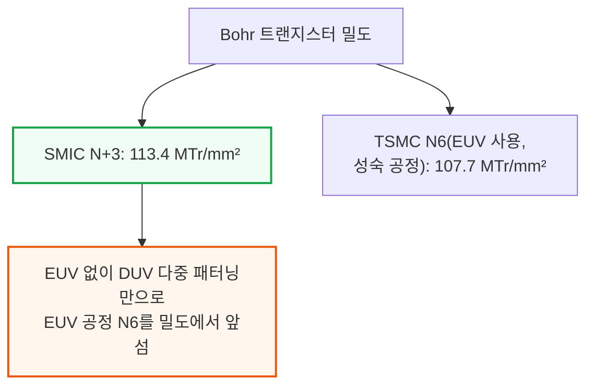

과거에는 CGP와 셀 높이만으로 트랜지스터 밀도를 비교해도 충분했지만, 지금은 이런 확장 booster와 DTCO까지 고려해야 합니다. SMIC의 밀도 개선은 EUV가 아니라 이 확장 기법들을 최대한 끌어쓴 결과입니다.

---

## 8. 금속 배선 스택 - SMIC N+3 vs TSMC N6 vs 인텔 18A

**📌 핵심:**
- 이 리포트의 헤드라인 수치인 최소 금속 배선 간격(M0 피치)은 SMIC N+3이 32.5nm로 인텔 18A의 팬더레이크 출하치 36nm보다 좁음 — 하지만 M0는 셀 안쪽의 국소 배선 층일 뿐이라, 이 층 하나의 우열이 전체 배선 스택의 우열을 뜻하지 않음
- M0가 32.5nm까지 좁아진 것은 SAQP(자기정렬 4중 패터닝) 때문 — 반면 인텔 18A는 전력 배선을 칩 뒷면으로 옮기는 PowerVia(백사이드 파워) 덕분에 32nm까지 설계는 가능하지만 실제로는 HP(고성능) 라이브러리를 많이 써 36nm로 여유 있게 출하함. 즉 인텔은 "더 좁게 만들 수 있는데 안 만든 것", SMIC는 "좁게 만들 수밖에 없었던 것"이라는 정반대 이유
- M1\~M13까지 전 층을 보면 N+3는 M1(38nm)에서 게이트 대비 3:2 비율(SMIC·N+2·삼성만 쓰는 접근, TSMC N3E·인텔 18A는 모두 1:1 비율로 회귀)을 유지해 국소 배선 유연성은 늘렸지만 패터닝은 더 복잡해짐 — M12·M13(1920nm·4600nm)처럼 상위 레이어는 N+2와 동일하게 유지
- 결론: 헤드라인 숫자(M0)만 보면 SMIC가 앞서지만, 그 방식(다중 패터닝 강행)과 나머지 층 전체를 보면 SMIC N+3은 TSMC N6와 동급 세대일 뿐 인텔 18A·TSMC N3P급 최선단 공정에는 못 미침

---

**금속 배선 층별 피치 비교표 (측정치·설계치 혼재, 출처별로 구분 표기)**

| 배선 층 | SMIC N+3 | TSMC N6 | 인텔 18A | 비고 |
|---|---|---|---|---|
| M0 (셀 내부 로컬 배선) | 32.5nm (SAQP, 실측) | 약 40nm (SADP, 실측) | 32nm 설계 가능, 팬더레이크는 36nm로 출하 | 18A는 PowerVia(후면 전력배선)로 전면을 신호 배선에 몰아줄 수 있는데도 HP 라이브러리 비중 때문에 36nm로 출하 |
| M1 (셀 내 배선, 게이트 대비 비율) | 38nm, 3:2 비율 (N+2 대비 -9.5%, N6 대비 -33%) | 약 57nm 추정, 1:1 비율 | 1:1 비율(수치 비공개) | SMIC·삼성만 3:2 비율 유지, TSMC·인텔은 1:1로 회귀 |
| M2 (셀 간 배선, 트랙 수 결정) | 40nm (N+2 대비 -5%, N6과 동일) | 약 40nm(실측 약 43nm) | 비공개 | N+3는 5.7트랙 셀 — 더블 패터닝 한계에 근접 |
| M3 (마지막 로컬 배선) | 44nm (N+2와 동일, N6 대비 +10%) | 약 40nm 추정 | 비공개 | |
| M4\~M6 (세미글로벌) | 80\~82nm | 비공개 | 비공개 | |
| M7\~M10 (세미글로벌) | 128nm | 비공개 | 비공개 | |
| M11 | 148nm | 헬리오 G99는 M9부터 850nm(배선층 자체가 적음) | 비공개 | 기린 9030은 고성능 설계라 M11까지 미세 피치 유지 |
| M12 / M13 (최상위 전력·글로벌) | 1920nm / 4600nm (N+2와 동일) | 비공개 | 비공개 | |

---

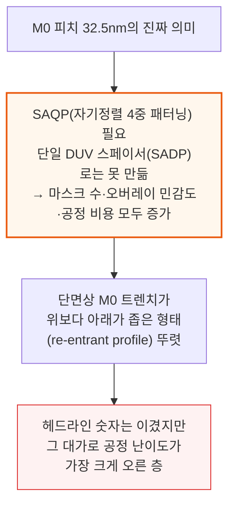

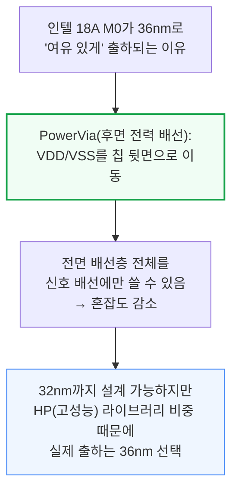

📌 용어 풀이: SADP와 SAQP, 왜 마스크 수가 늘어나는가
> - **SADP (Self-Aligned Double Patterning, 자기정렬 2중 패터닝)**: DUV 노광 1회로 만든 패턴 옆에 스페이서(측벽)를 씌워 선폭을 2배로 좁히는 기법 — 한 번의 "분열"만 거침
> - **SAQP (Self-Aligned Quadruple Patterning, 자기정렬 4중 패터닝)**: SADP를 두 번 반복해(스페이서에 또 스페이서를 씌워) 선폭을 4배로 좁히는 기법 — 노광·식각 단계가 늘어나 마스크 수·오버레이(정렬 오차) 민감도·공정 비용이 모두 커짐
> - **쉬운 비유**: SADP가 종이를 한 번 접어 두 겹으로 만드는 것이라면, SAQP는 두 번 접어 네 겹으로 만드는 것 — 접는 횟수가 늘수록 정확히 맞춰 접기가 어려워짐

M2는 M0와 다른 이유로 흥미롭습니다. M2는 셀을 가로질러 블록 단위 신호를 나르는 첫 진짜 셀-간 배선층으로, 그 피치가 VDD·VSS 전력 레일 사이에 몇 개의 신호 트랙(track)이 들어가는지 — 즉 라이브러리가 "6트랙" 셀인지 "7.5트랙" 셀인지를 결정합니다.

N+3는 5.7트랙 셀로, 이는 더블 패터닝으로 만들 수 있는 한계에 바짝 붙어 있는 값입니다. 앞으로 더 줄이려면 M2에도 마스크 수를 늘려야 합니다.

M1의 3:2 비율(게이트 대비 배선 트랙 수)은 최선단 공정에서는 인기가 없는 선택입니다. TSMC는 N7+·N5 계열·단명한 N3(B)에만 3:2 비율을 썼고 N3E부터는 1:1로 복귀했습니다.

인텔도 10나노/Intel 7 계열에만 3:2를 썼고 Intel 4·3·18A는 모두 1:1입니다. 최선단에서 3:2 비율을 아직 쓰는 곳은 삼성(SF4·SF3 계열)뿐입니다.

3:2 비율은 국소 배선 유연성을 늘려주지만 레이아웃과 패터닝을 더 복잡하게 만드는 트레이드오프입니다 — SMIC가 EUV 없이 밀도와 배선성을 회복하려고 공정 복잡도를 높이기로 한 DTCO 선택입니다.

낮은 층(M0\~M3)의 피치는 공정과 라이브러리가 거의 고정하지만, 상위 층(M4 이상)은 설계에 따라 피치와 개수가 크게 달라집니다.

실제로 같은 공정 위의 스마트폰 SoC 두 개도 금속 스택이 크게 다를 수 있습니다 — 헬리오 G99는 배선층 자체가 적어 M9부터 이미 850nm의 성긴 피치로 넘어가는 반면, 더 크고 고성능인 기린 9030은 M11까지 미세 피치를 유지합니다.

---

## 9. SRAM 밀도

**📌 핵심:**
- 기린 9030의 GPU 컴퓨트 유닛 영역을 살피다 발견한 SRAM(정적 메모리)은 일반적인 6T(6트랜지스터) 셀이 아니라 8T(8트랜지스터) 셀 — 읽기 전용 포트를 따로 둬 읽기 시 저장값이 흔들리는 문제(read-disturb)를 없애고 더 공격적으로 성능을 끌어올릴 수 있음
- 8T HCC(고전류 셀) 실측 결과: 셀 높이 406nm, 비트셀 크기 0.0463µm², 이론상 최대 밀도 21.6 Mib/mm² — 여기서 역산한 6T HCC는 292nm/0.0337µm²로 인텔 3·4의 6T HCC보다 약 12% 큼, 6T HDC(고밀도 셀)는 228nm/0.0260µm²로 이론 밀도 38.5 Mib/mm²(삼성 7LPP/5LPP 부근, TSMC N7/N6보다 약간 낮음)
- 실제 캐시 어레이 밀도(이론치 대비 달성률)는 SLC(시스템레벨캐시) 66%, L3 62%, 프라임 코어 전용 L2 59% — SLC 128KiB 어레이는 9020 대비 18% 축소, L3 64KiB 어레이는 9020의 128KiB 어레이 대비 정규화 기준 18% 축소(32KiB 어레이 대비로는 31% 축소)
- 결론: SRAM은 N+2→N+3에서 약 19% 줄어 로직의 이론적 축소폭에 근접했지만, N+2의 비트셀 자체가 비슷한 7나노급 공정보다 유난히 컸던 전례가 있어 이번 개선분의 일부는 순수 스케일링이 아니라 "뒤늦은 따라잡기"

---

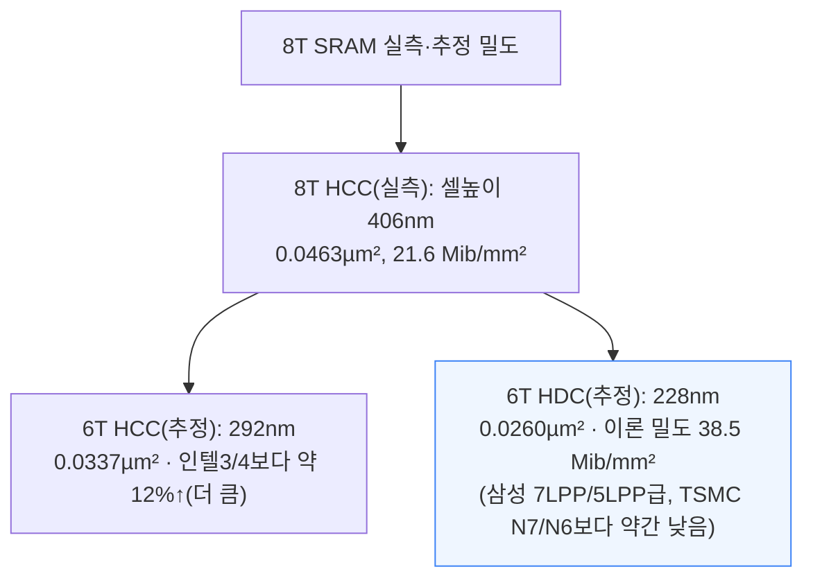

📌 용어 풀이: 6T·8T와 HCC·HDC란
> - **6T·8T**: 비트 하나를 저장하는 SRAM 셀에 들어가는 트랜지스터 개수 — 6T가 표준, 8T는 읽기 전용 포트 2개를 추가해 안정성을 높인 고성능 버전
> - **HCC (High-Current Cell, 고전류 셀) vs HDC (High-Density Cell, 고밀도 셀)**: 같은 6T라도 핀 개수 배분(1:2:2 vs 그보다 적은 배분)에 따라 속도 우선(HCC, L2처럼 지연시간이 중요한 곳)과 면적 우선(HDC, L3·SLC처럼 큰 캐시)으로 나뉨

```mermaid
flowchart TD
    Cache["캐시별 실제 달성 밀도<br/>(이론 최대치 대비 비율)"] --> SLC["SLC: 25.5 Mib/mm² (66%)<br/>128KiB 어레이 9020 대비 -18%"]
    Cache --> L3["L3: 23.8 Mib/mm² (62%)<br/>64KiB 어레이, 정규화 기준<br/>128KiB 대비 -18%·32KiB 대비 -31%"]
    Cache --> L2["프라임 코어 전용 L2: 17.6 Mib/mm² (59%)<br/>32KiB 어레이 -17%"]

    style SLC fill:#f0fdf4,stroke:#16a34a
```

두 기린 모두 SLC를 4개 뱅크로 나눠 총 대역폭을 늘리는 구조입니다. 기린 9030에서는 뱅크당 SLC 용량이 2MiB→3MiB로 늘고 어레이 개수도 16개→24개(50%↑)로 늘었습니다. L3도 마찬가지로 4개 뱅크 구조이며, 총 용량은 10MiB→12MiB로 늘었습니다.

SRAM은 N+2→N+3에서 약 19%(로직의 이론적 축소폭에 근접) 줄었지만, N+2의 비트셀 자체가 비슷한 7나노급 공정보다 유난히 컸던 전례가 있어 이번 개선분의 일부는 순수한 공정 스케일링이 아니라 뒤늦은 따라잡기 성격도 있습니다.

---

## 10. 미래 로드맵 - 이론적 N+4·N+5

**📌 핵심:**
- SemiAnalysis는 N+3 단면 데이터를 바탕으로 SMIC의 다음 두 세대를 이론적으로 추정 — 이미 N+3가 DUV 다중 패터닝의 실질적 한계에 근접했지만, 아직 몇 가지 확장 카드는 남아있음
- N+4(이론): M0 트랙 수를 5개→4개(N+2·N6와 동일)로 줄이면 셀 높이가 약 15% 줄고, 게이트 피치(CGP)도 57nm→54nm(EUV 없이 인텔이 10나노/Intel 7 세대에서 도달한 수준과 비슷)까지 축소 가능 — 다만 3:2 비율을 유지하려면 M1도 36nm로 줄여 또 SAQP가 필요해짐. 이 경로로 셀 높이 198nm, CGP 54nm, Bohr 밀도 137.8 MTr/mm²(TSMC N5나 삼성 SF4급)에 도달할 것으로 추정
- N+5(이론): 더 큰 통합 전환이 필요 — 후면 콘택(BSCon, 전력 배선과 소스/드레인 콘택을 칩 뒷면으로 이동)을 도입하면 전면 배선 부담이 줄어 셀 높이를 더 낮출 수 있음. 이 경로로 셀 높이 170nm, CGP 53nm, Bohr 밀도 163.6 MTr/mm²(인텔 18A의 HP 라이브러리급)에 도달할 것으로 추정
- 결론: 두 경로 모두 개별적으로는 실현 가능하지만, 합쳐놓으면 N+2→N+3보다 훨씬 어려운 전환 — 시간도 더 오래 걸리고 원가도 더 들고 공정 여유(margin)는 더 줄어들 전망

---

```mermaid
flowchart TD
    N3["N+3(현재)<br/>셀높이 228nm, CGP 57nm<br/>Bohr 밀도 113.4 MTr/mm²"] --> N4["N+4(이론)<br/>M0 트랙 5개→4개<br/>CGP 57→54nm<br/>셀높이 198nm<br/>Bohr 밀도 137.8 MTr/mm²<br/>(TSMC N5·삼성 SF4급)"]
    N4 --> N5["N+5(이론)<br/>후면 콘택(BSCon) 도입<br/>셀높이 170nm, CGP 53nm<br/>Bohr 밀도 163.6 MTr/mm²<br/>(인텔 18A HP 라이브러리급)"]

    style N4 fill:#fff7ed,stroke:#ea580c
    style N5 fill:#fef2f2,stroke:#dc2626,stroke-width:2px
```

📌 용어 풀이: 후면 콘택(BSCon)이란
> - 지금까지 SMIC는 인텔 18A의 PowerVia처럼 전력 배선을 칩 뒷면으로 옮기지 못하고 있음 — BSCon은 전력 배선뿐 아니라 소스/드레인 콘택까지 뒷면으로 옮기는 더 급진적인 접근
> - 뒷면으로 옮길수록 전면 배선 혼잡도가 줄어 셀을 더 좁힐 수 있지만, 웨이퍼를 얇게 갈아내고 뒷면에서 다시 정렬해 금속화하는 완전히 새로운 공정 흐름이 필요해 통합 난이도가 급격히 오름

N+4는 개별 스텝만 보면 충분히 그럴듯하지만, 여러 단계를 한꺼번에 쌓아야 하는 난이도는 누적됩니다. 게이트 피치를 57→54nm로 줄이는 것은 인텔이 EUV 없이 10나노/Intel 7 세대에서 이미 보여준 길입니다.

다만 3:2 비율을 유지하려면 M1도 36nm로 줄여야 해 또 다른 층이 SAQP 영역으로 들어갑니다. 1:1 비율로 전환하면 M1을 54nm로 여유 있게 둘 수 있지만 대신 배선 유연성을 포기해야 합니다.

N+5는 더 큰 통합 전환입니다. M0는 오히려 약 34nm로 다소 느슨해지고 M2·M4 피치도 더 여유로워질 수 있지만, CGP는 48nm 부근(EUV를 쓰는 공정에서도 수율·공정관리의 실질적 하한선으로 알려진 값)을 넘기 어려울 전망입니다.

밀도 자체는 인텔 18A HP급에 도달해도, 후면 정렬·웨이퍼 박막화·뒷면 금속화 같은 완전히 새로운 공정 흐름이 필요해 원가 경쟁력은 오히려 최선단과 더 벌어질 수 있습니다.

이 지점을 넘어서면 표준적인 밀도·배선 스케일링만으로는 매력이 떨어집니다. 바로 이 지점에서 화웨이의 로드맵은 일반적인 파운드리 로드맵이 아니라 패키징 로드맵의 모습을 띠기 시작합니다.

---

## 11. 화웨이 τ 스케일링과 LogicFolding

**📌 핵심:**
- 화웨이는 2026년 ISCAS(국제회로시스템학회)에서 τ(타우) 스케일링 법칙을 공개 — 공정 미세화 대신 "시간(τ)" 관점에서 스케일링을 재정의한 개념으로, 트랜지스터 스위칭 지연·회로 내 RC 신호 전달 지연·연산·메모리·네트워킹 지연을 모두 아우름(업계 용어로는 시스템-기술 공동 최적화, STCO)
- 이를 구현한 LogicFolding(로직폴딩)은 같은 논리 회로 블록을 여러 활성 다이로 쪼개 초미세 피치로 맞대어(face-to-face) 본딩하는 3D 적층 방식 — AMD의 V캐시(SRAM만 얹음)나 MI350X의 액티브 인터포저 다이(캐시·IO만 담당)와 달리, 논리 회로 자체를 쪼개 여러 층에 나눠 담는다는 점이 다름
- 화웨이 로드맵상 프라임 코어 클럭은 기린 9030의 2.75GHz에서 2031년까지 약 5GHz까지 목표(3.1GHz·3.39GHz 클럭은 이미 실험실 테스트 중) — 평면(2D) 스케일링만으로는 불가능한 수준으로, 배선 거리를 줄여 신호 지연을 낮추는 3D 적층 효과에 기댐
- 결론: 화웨이의 밀도 주장은 파운드리 간 밀도 비교와 직접 비교 불가 — 패키지 풋프린트(차지 면적) 기준으로 활성 층을 쌓아 늘린 숫자라, 각 층 자체의 전공정(front-end) 밀도는 여전히 TSMC·인텔에 뒤처짐

---

```mermaid
flowchart TD
    Tau["τ(타우) 스케일링 법칙<br/>(화웨이, ISCAS 2026 공개)"] --> Def["정의: 데이터 이동·처리의<br/>시간 비용 전체를 아우름<br/>(트랜지스터 스위칭+RC 지연<br/>+연산+메모리+네트워킹 지연)"]
    Def --> Why["배경: EUV 없이 평면 밀도로는<br/>TSMC·인텔·삼성을 못 따라감<br/>→ 대안으로 배선을 줄이고<br/>논리를 수직으로 쌓는 접근"]

    style Why fill:#fff7ed,stroke:#ea580c,stroke-width:2px
```

```mermaid
flowchart TD
    Compare3D["3D 적층 방식 비교"] --> VCache["AMD V캐시:<br/>SRAM만 CPU 다이 위/아래에 배치"]
    Compare3D --> MI350["AMD MI350X:<br/>액티브 인터포저 다이가<br/>캐시·IO·NoC·MIM 캐패시터만 담당"]
    Compare3D --> LF["화웨이 LogicFolding:<br/>같은 논리 블록 자체를<br/>여러 활성 다이로 쪼개<br/>초미세 피치로 맞대어 본딩"]

    style LF fill:#eff6ff,stroke:#3b82f6,stroke-width:2px
```

📌 용어 풀이: LogicFolding이 클럭을 어떻게 끌어올리나
> - 현대 코어의 지연·에너지 예산 상당 부분은 긴 배선과 그 위의 리피터 버퍼를 구동하는 데 쓰임
> - LogicFolding은 한 블록의 임계 경로(critical path) 게이트들을 여러 층에 나눠 초미세 피치로 본딩 — 본딩 접합부가 마치 하나의 금속 배선층처럼 작동해 가장 긴 경로가 물리적으로 짧아짐
> - 이 방식으로 화웨이는 공정 자체에서 얻을 수 없는 주파수·효율 개선을 회복하려 함

화웨이의 로드맵은 그 의지를 보여줍니다. 프라임 코어 클럭을 기린 9030의 2.75GHz에서 2031년까지 약 5GHz로 끌어올리는 것이 목표이며, 이는 평면 스케일링만으로는 나올 수 없는 수준입니다.

3.1GHz·3.39GHz 클럭의 프라임 코어가 이미 실험실 테스트 중이지만 전력 소비는 공개되지 않았습니다. 이보다 앞선 칩들은 아직 설계·시뮬레이션·경로탐색 단계라 주파수는 목표치일 뿐이지만, 방향성 자체가 중요합니다 — LogicFolding은 밀도뿐 아니라 성능에도 기여한다는 것입니다.

```mermaid
flowchart TD
    DensityRoad["Bohr 밀도 로드맵<br/>(정규화 기준, 평면 공정 대비)"] --> Now["N+3(현재): 약 114 MTr/mm²<br/>인텔 18A HD 라이브러리보다 38%↓"]
    Now --> Y2030["화웨이 3D 로드맵 2030년: 215 MTr/mm²<br/>(적층으로 밀도 회복)"]
    Y2030 --> Y2031["2031년: 295 MTr/mm²<br/>(3번째 활성층·부분 EUV 도입·<br/>공격적 평면 DUV 스케일링 중 하나 필요)"]

    style Now fill:#fef2f2,stroke:#dc2626
    style Y2031 fill:#fff7ed,stroke:#ea580c
```

이는 파운드리 대 파운드리 비교가 아닙니다 — 화웨이는 적층 논리를 패키지 풋프린트당 밀도로 측정합니다. 평면(Bohr) 밀도 기준으로 보면 SMIC N+3은 약 114 MTr/mm²로 인텔 18A HD 라이브러리보다 38% 낮습니다.

화웨이의 3D 로드맵은 활성 논리를 쌓아 이 격차를 좁혀, 2030년 215 MTr/mm², 2031년 295 MTr/mm²까지 도달할 계획입니다.

이 방법론을 다른 회사에 그대로 적용하면 다른 파운드리들도 훨씬 밀도가 높아 보입니다 — AMD MI450X(N2 상단 다이 + N3P 하단 다이 구성)에 같은 방식을 적용하면 2026년 시점에 이미 이론상 460.2 MTr/mm²로, 화웨이가 2031년에 목표로 하는 295 MTr/mm²를 훌쩍 뛰어넘습니다.

이번에 분해한 기린 9030 자체는 LogicFolding을 쓰지 않은 통상적인 모바일 SoC 패키지이며, 앞으로 이어질 기린·어센드 칩 분해에서 평면 밀도와 화웨이의 하이브리드 본딩 실물을 함께 확인할 예정입니다.

---

## 12. 수출 통제와 확산 리스크

**📌 핵심:**
- 수출 통제는 중국의 첨단 반도체 생산을 막지는 못했지만, 문제를 다른 형태로 바꿨을 뿐임 — EUV 제한은 최선단 제조의 비용과 복잡도를 끌어올렸지 완전히 얼려버리지는 못했음. SMIC는 DUV 이머전·SAQP·DTCO로 N6급 밀도에 도달했고, 화웨이는 그 부담의 상당 부분을 아키텍처·패키징·시스템 수준 통합으로 떠넘김
- 화웨이는 기린 9030 이전부터 이미 자체 EDA(전자설계자동화) 툴과 설계 흐름을 갖추고 있었음(9000s·9010·9020을 서방 EDA 스택 없이 출하한 전례) — 2022년 미국의 수출 통제는 첨단 칩용 EDA 툴을 제한했지만 성숙 공정용 툴은 대상이 아니었고, 2025년 잠시 시놉시스·케이던스 등 EDA 소프트웨어에 훨씬 넓은 제한을 걸었다가 희토류 연계 무역합의의 일환으로 2개월도 안 돼 해제됨(단 화웨이는 미국 무역 블랙리스트에 남아 여전히 접근 불가)
- SMIC는 정부 지시에 따라 N+2·N+3 공정을 HLMC·화훙(Hua Hong)에 라이선스하고 있음 — 같은 공정 학습이 어센드(Ascend) AI 학습·추론 가속기로 흘러들어가면 병목이 SMIC 한 곳이 아니라 생태계 전체로 확산되는 셈이라, 알리바바의 T-Head 반도체 부문과 캠브리콘(바이트댄스에 공급할 것으로 예상되는 중국 AI 칩 설계사)도 주요 수혜자가 될 수 있음
- 결론: 중국은 인텔·삼성·TSMC와의 격차를 좁히고 있지 않음 — 이 분해 결과가 여러 곳에서 정반대(EUV 없음, 후면 전력 배선 없음, 공정 복잡도 상승, 눈에 보이는 트레이드오프)를 보여줌. 다만 스마트폰·추론·네트워킹·보안 민감 워크로드에 "충분히 쓸만한" 수준까지만 도달해도 전략적으로는 의미가 있음

---

```mermaid
flowchart TD
    Control["수출 통제의 실제 효과"] --> NotStop["첨단 반도체 생산 자체를<br/>막지는 못함"]
    NotStop --> Reroute["대신 다른 경로로 우회시킴:<br/>DUV 다중 패터닝·DTCO·<br/>아키텍처·패키징 수준 부담 이전"]
    Reroute --> Cost["결과: 원가·수율·공정 복잡도<br/>모두 서방 대비 불리해짐<br/>(막지는 못했지만 비싸게는 만듦)"]

    style Reroute fill:#fff7ed,stroke:#ea580c,stroke-width:2px
    style Cost fill:#eff6ff,stroke:#3b82f6
```

```mermaid
flowchart TD
    EDA["EDA 툴 수출 통제 타임라인"] --> Y2022["2022년: 첨단 칩용 EDA 툴 제한<br/>(성숙 공정용은 제외)"]
    Y2022 --> Y2025["2025년: 시놉시스·케이던스 등<br/>EDA 소프트웨어 전면 제한 확대"]
    Y2025 --> Lift["2개월 내 해제<br/>(희토류 연계 무역합의 일환)"]
    Lift --> Huawei["단, 화웨이는 미국 무역 블랙리스트<br/>잔류 → 여전히 접근 불가"]

    style Y2025 fill:#fef2f2,stroke:#dc2626
    style Huawei fill:#fff7ed,stroke:#ea580c
```

📌 용어 풀이: 왜 SMIC 한 곳만 제재해선 부족한가
> - SMIC는 정부 지시로 N+2·N+3 공정을 HLMC·화훙에 라이선스하고 있음 — 공정 노하우가 SMIC 한 곳이 아니라 여러 파운드리로 퍼짐
> - 같은 공정 학습이 AI 가속기(어센드)로도 흘러가면, 알리바바 T-Head·캠브리콘 같은 다른 설계사도 수혜를 볼 수 있어 "SMIC 하나만 막으면 된다"는 전제가 무너짐 — 병목이 특정 기업이 아니라 생태계 전체로 옮겨감

베이징대 연구진은 최근 화웨이의 LogicFolding 아키텍처(다층 레이아웃·플로어플랜을 다루는 새로운 흐름이 필요)를 위한 시제품 EDA 툴을 발표했습니다. 이는 시놉시스·케이던스의 전체 스택을 대체하는 수준은 아니지만, 중국 국내 EDA가 아키텍처·공정·패키징을 더 긴밀히 공동 최적화하는 방향으로 향하고 있음을 보여줍니다.

중국은 인텔·삼성·TSMC와의 격차를 좁히고 있지 않습니다 — 이번 분해 결과는 여러 지점에서 그 반대를 보여줍니다(EUV 없음, 후면 전력 배선 없음, 더 높은 공정 복잡도, 눈에 보이는 트레이드오프).

하지만 중국은 여전히 전진하고 있습니다. 국내 칩이 스마트폰·추론·네트워킹·보안 민감 워크로드에 "충분히 쓸만한" 수준에 도달하면, 최선단에서 TSMC를 따라잡지 못해도 전략적으로는 의미를 가질 수 있습니다.

---

## 13. 공정 흐름 상세 - 재료 분석과 텅스텐 병목

**📌 핵심:**
- EDS(에너지 분산형 X선 분광법)로 M0 금속 스택 재료를 분석한 결과, SMIC N+3의 배선 구조(TaN 배리어 + Co 라이너·캡)는 인텔 4의 "인핸스드 구리(Enhanced Cu)"나 TSMC가 16FF부터 써온 Co 라이너+Ta 배리어 방식과 큰 틀에서 유사 — 다만 M0 단면에서 유전체와 만나는 지점에 배리어 층이 눈에 띄게 부풀어 오른(blowout) 형태가 관찰돼, 공정 관리의 한계인지 의도적으로 M0 하단 폭을 넓힌 것인지는 불명확
- eSiGe(실리콘-게르마늄 압축 스트레인) PMOS 소스/드레인은 1990년대 45나노 세대부터 업계 표준으로 쓰여온 검증된 기법 — SMIC는 2008년부터 IBM 라이선스 40/45나노 벌크 CMOS를 운영해온 만큼 N+3에서도 깔끔하게 통합돼 있음(정공 이동도를 높여 구동전류 회복)
- 소스/드레인 콘택은 코발트 콘택 위에 텅스텐 플러그를 얹는 구조 — 7나노급 이하 공정에서는 이 층 하나가 칩 전체에서 저항이 가장 큰 병목이 되는데, SMIC는 여전히 텅스텐을 쓰고 있어(파운드리마다 저항·갭필·라이너 두께·통합 리스크의 균형을 다르게 잡는 선택) 이 자체가 SMIC가 뒤처졌다는 증거는 아님
- 결론: EUV가 확실한 도구·공정 격차인 것은 분명하지만, STEEL의 단면·EDS 분석은 선폭 거칠기 제어·선택적 캡·도핑 모듈 같은 추가 과제도 함께 짚어냄 — 향후 분해에서 더 자세히 다룰 예정

---

```mermaid
flowchart TD
    M0Stack["M0 금속 스택 재료 (EDS 분석)"] --> Barrier["TaN 배리어(바닥·측벽)<br/>+ Co(코발트) 라이너·캡"]
    Barrier --> Similar["인텔4 '인핸스드 구리'와<br/>TSMC 16FF 이후 방식과<br/>큰 틀에서 유사"]
    Barrier --> Blowout["단, M0 하단에서<br/>배리어층 부풀어오름(blowout) 관찰<br/>→ 공정 한계인지 의도적 설계인지 불명확"]

    style Similar fill:#f0fdf4,stroke:#16a34a
    style Blowout fill:#fff7ed,stroke:#ea580c
```

📌 용어 풀이: AlOx 캡과 텅스텐 병목
> - **AlOx(산화알루미늄) 비아 가이딩 캡**: 유전체 위아래에 선택적으로 증착해 비아(층간 연결 구멍)가 아래 금속에 자동으로 정렬되도록 돕는 층 — 배치 오차로 인한 단락이나 시간 경과에 따른 절연파괴(TDDB)를 막아줌. 대신 유전율(k)이 높아지는 대가를 치름
> - **텅스텐 병목**: 소스/드레인 콘택은 트랜지스터와 그 위 배선을 잇는 수직 금속 기둥인데, 콘택이 좁아질수록 배리어·라이너가 차지하는 비중이 커져 실제 전도체 단면이 줄어듦 — 7나노급 이하에서는 이 층 하나가 칩 전체 저항의 최대 병목이 됨

이 M0 배리어 층은 산화된 것으로 보이는데, 이는 흔히 관찰되는 현상이지만 질소를 완전히 잃으면 배리어 역할 자체가 무너질 수 있습니다. Ta-O/N 비율을 더 정밀하게 살피려면 앞으로 STEEL이 도입할 EELS(전자에너지손실분광법) 분석이 필요합니다.

eSiGe는 45나노 세대부터 업계 표준으로 쓰여온 PMOS 스트레인 기법이고, SMIC는 2008년부터 IBM 라이선스 40/45나노 벌크 CMOS를 운영해온 만큼 N+3에서도 성숙하고 잘 이해된 방식으로 깔끔하게 통합돼 있습니다.

텅스텐 그 자체는 SMIC가 뒤처졌다는 신호가 아닙니다 — 콘택 금속화 방식은 각 파운드리가 저항·갭필(gap fill)·라이너 두께·통합 리스크의 균형을 어떻게 잡느냐에 따라 파운드리마다 오갔던 선택입니다.

SMIC N+3의 EDS 분석 결과 코발트 소스/드레인 콘택 위에 텅스텐 플러그를 얹고, 게이트 금속으로는 TiN/TiAlN/TiAlC를 쓰는 구조가 확인됐습니다.

EUV는 명백한 장비·공정 격차지만, 이번 단면·EDS 분석은 선폭 거칠기(line-edge-roughness) 제어, 선택적 캡, 도핑 모듈 같은 추가 과제도 함께 드러냈습니다. STEEL은 앞으로의 분해 작업에서 이 부분을 더 깊이 다룰 계획입니다.

STEEL은 TechInsights에 필적하거나 그 이상인 최신 장비진을 갖추고 있으며, 아직 운영 1년 반이 채 되지 않았지만 목표는 AI·데이터센터·반도체 시장 데이터·컨설팅·기술 분석에서 그랬던 것처럼 이 분야에서도 1위가 되는 것입니다.

모든 하이퍼스케일러와 세계 최대 반도체 기업을 포함한 SemiAnalysis의 주요 고객사들은 STEEL이 이 시장에 새로운 경쟁을 몰고 오기를 기대하고 있습니다.

---

*작성 진행률: 100% 완료*
*업데이트: 원문 전체 13개 섹션(서론\~공정 흐름 상세) 변환 완료. 페이월 뒤 후반부(보드·패키지 X선 분석, 상세 공정 흐름 재료 분석)까지 포함. 원문의 다이 사진·현미경 단면 이미지는 다이어그램·수치 표로 대체*
