# Intel Panther Lake Teardown

> **출처**: [SemiAnalysis Newsletter](https://newsletter.semianalysis.com/p/intel-panther-lake-teardown)
> **저자**: Adith Shankar, Daniel Sanchez, Allison Elliott (SemiAnalysis STEEL)
> **발행일**: 2026-09-26

---

## 📑 목차

### 전체 섹션
1. [서론 - 팬더레이크를 뜯어본 이유](#1-서론---팬더레이크를-뜯어본-이유)
2. [PowerVia - 후면 전력 배선](#2-powervia---후면-전력-배선)
3. [RibbonFET - 인텔의 첫 GAA 트랜지스터](#3-ribbonfet---인텔의-첫-gaa-트랜지스터)
4. [라이브러리 분석 - 셀 높이·게이트 피치·리본 치수](#4-라이브러리-분석---셀-높이게이트-피치리본-치수)
5. [플로어플랜 분석 - 컴퓨트·GPU·I/O 타일](#5-플로어플랜-분석---컴퓨트gpuio-타일)
6. [Foveros-S 패키징과 와일드캣 레이크](#6-foveros-s-패키징과-와일드캣-레이크)
7. [인텔의 제조 복귀](#7-인텔의-제조-복귀)
8. [부록 - 본드 스택과 패키지 X선](#8-부록---본드-스택과-패키지-x선)

---

## 🔑 용어 정리

본문을 순서대로 읽기 전에 알아두면 좋은 용어들입니다. 수치와 상세 설명은 본문에서 처음 등장하는 자리에 나옵니다.

- **BSPDN·PowerVia (후면 전력 공급망)**: 전력 배선을 트랜지스터 뒤쪽(웨이퍼 뒷면)으로 옮겨 신호 배선과 따로 깔는 기술 — PowerVia는 인텔이 붙인 이름
- **RibbonFET·GAAFET (게이트 올 어라운드)**: 게이트가 채널을 사방에서 감싸는 트랜지스터 — RibbonFET은 인텔 이름이고 실리콘 나노시트(얇은 판) 네 장을 쌓은 구조
- **나노-TSV**: 앞면 트랜지스터 접점과 뒷면 전력 배선을 잇는 아주 가는 수직 연결 통로
- **에치스톱 (Etch Stop)**: 배선 홈을 파는 식각 공정이 아래층 금속까지 깎지 않도록 멈춰 세우는 얇은 막 (이 글에서는 알루미늄 산화물 AlOx)
- **셀 높이·트랙**: 표준 논리 셀의 세로 길이와 그 안에 들어가는 배선 줄 수 — 5트랙 셀은 7트랙 셀보다 낮고 촘촘함
- **Bohr 밀도**: NAND2 게이트 60%와 스캔 플립플롭 40%를 가중 평균해 대표 셀 한 쌍으로 트랜지스터 밀도를 비교하는 업계 지표
- **타일 (Tile)**: 한 패키지 안에서 따로 만들어 붙이는 작은 실리콘 조각 — 칩렛과 같은 개념
- **Foveros-S**: 수동(능동 회로 없는) 실리콘 판 위에 타일을 나란히 얹어 이어 붙이는 인텔의 2.5D 패키징

---

## 1. 서론 - 팬더레이크를 뜯어본 이유

**📌 핵심:**
- 팬더레이크(Panther Lake)는 상용 칩 최초로 후면 전력 배선(PowerVia)을 쓰고, 인텔 최초의 GAA 트랜지스터(RibbonFET)를 도입한 소비자용 CPU
- SemiAnalysis STEEL 연구소가 실제 칩을 뜯어 측정한 결과, 18A 컴퓨트 로직의 밀도는 TSMC N3E GPU 로직과 비슷한 수준
- 18A는 최대 밀도에서 TSMC N3P·N2, 삼성 SF2를 앞서지 못하고, CPU 코어는 점진적 개선이며 고성능 GPU는 여전히 TSMC N3E 제조
- 결론: 인텔의 제조 복귀는 로드맵 약속에서 출하 실리콘으로 넘어왔지만, 공정 리더십 회복까지는 아직 증명이 더 필요함

---

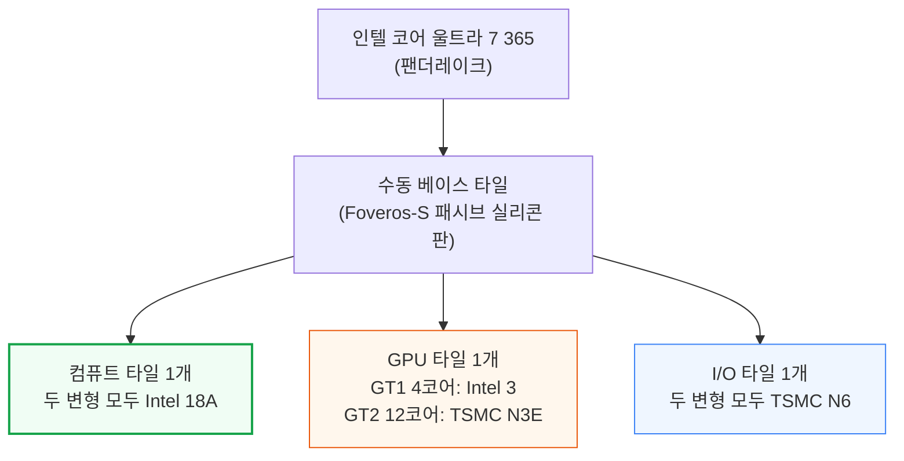
```mermaid
flowchart TD
    Chip["인텔 코어 울트라 7 365<br/>(팬더레이크)"] --> Base["수동 베이스 타일<br/>(Foveros-S 패시브 실리콘 판)"]
    Base --> Compute["컴퓨트 타일 1개<br/>두 변형 모두 Intel 18A"]
    Base --> Gpu["GPU 타일 1개<br/>GT1 4코어: Intel 3<br/>GT2 12코어: TSMC N3E"]
    Base --> Io["I/O 타일 1개<br/>두 변형 모두 TSMC N6"]

    style Compute fill:#f0fdf4,stroke:#16a34a,stroke-width:2px
    style Gpu fill:#fff7ed,stroke:#ea580c
    style Io fill:#eff6ff,stroke:#3b82f6
```

STEEL(SemiAnalysis의 칩 분해 연구소)은 이 칩에서 18A의 세 가지 변화를 차례로 확인했습니다. RibbonFET(4장짜리 나노시트), 게이트 스택, 그리고 접점과 앞뒤 배선, 접합된 캐리어까지입니다.

팬더레이크의 세 패키지 구성은 PTL-U(3xx), PTL-H(3x6H), Arc B390·B370 GPU를 얹은 X-tier PTL-H(3x8H)입니다. 이 글의 분석은 PTL-U의 컴퓨트 타일, 4코어·12코어 GPU 타일, 12레인 I/O 타일에 집중합니다.

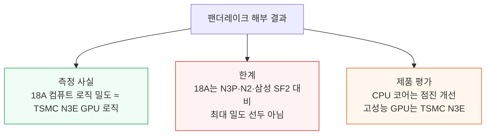
```mermaid
flowchart TD
    Teardown["팬더레이크 해부 결과"] --> A["측정 사실<br/>18A 컴퓨트 로직 밀도 ≈ TSMC N3E GPU 로직"]
    Teardown --> B["한계<br/>18A는 N3P·N2·삼성 SF2 대비<br/>최대 밀도 선두 아님"]
    Teardown --> C["제품 평가<br/>CPU 코어는 점진 개선<br/>고성능 GPU는 TSMC N3E"]

    style A fill:#f0fdf4,stroke:#16a34a
    style B fill:#fef2f2,stroke:#dc2626
    style C fill:#fff7ed,stroke:#ea580c
```

---

## 2. PowerVia - 후면 전력 배선

**📌 핵심:**
- 기존 칩은 전력선과 신호선이 같은 앞면 금속층을 나눠 써서, 트랜지스터 근처의 귀한 배선 자리를 전력이 차지함
- PowerVia는 주 전력망을 웨이퍼 뒷면으로 옮김 — 앞면은 M0\~M14(신호용 15층), 뒷면은 BM0\~BM5(전력용 6층)
- 나노-TSV로 뒷면 전력 배선을 트랜지스터 접점에 연결하며, 이 연결 길이는 접점에서 BM0까지 약 150nm
- 결론: 앞면 신호 배선은 한결 여유로워지지만, 열이 빠지던 실리콘 경로가 막혀 방열과 공정 복잡도가 대가로 따라옴

---

### 2.1 구조와 제조 순서

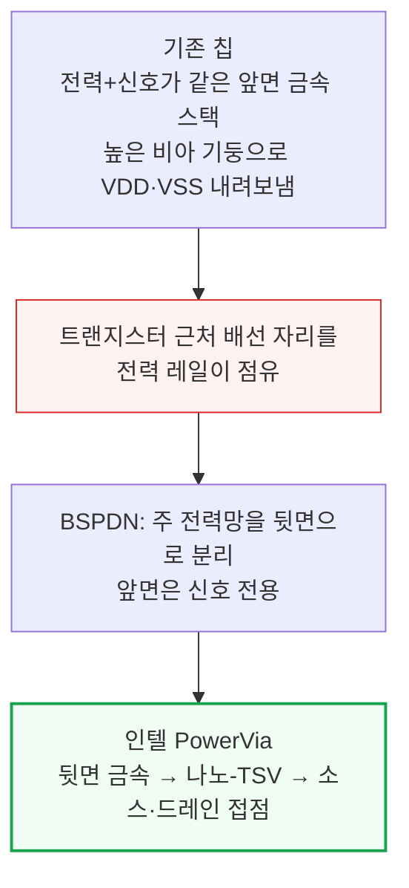
```mermaid
flowchart TD
    Conv["기존 칩<br/>전력+신호가 같은 앞면 금속 스택<br/>높은 비아 기둥으로 VDD·VSS 내려보냄"] --> Problem["트랜지스터 근처 배선 자리를<br/>전력 레일이 점유"]
    Problem --> Bspdn["BSPDN: 주 전력망을 뒷면으로 분리<br/>앞면은 신호 전용"]
    Bspdn --> Pv["인텔 PowerVia<br/>뒷면 금속 → 나노-TSV → 소스·드레인 접점"]

    style Problem fill:#fef2f2,stroke:#dc2626
    style Pv fill:#f0fdf4,stroke:#16a34a,stroke-width:2px
```

SemiAnalysis는 2024년에 후면 전력 배선과 그 영향을 이미 다룬 바 있습니다. 이번 해부는 그 구현이 실제 상용 칩에서 어떤 모양인지 보여줍니다.

PowerVia는 웨이퍼 양쪽에서 배선 스택을 쌓아야 하므로 제조 순서가 길어집니다. 앞면 신호 스택은 M0\~M14, 뒷면 전력 스택은 BM0\~BM5이고 M0·BM0이 트랜지스터에 가장 가깝습니다.

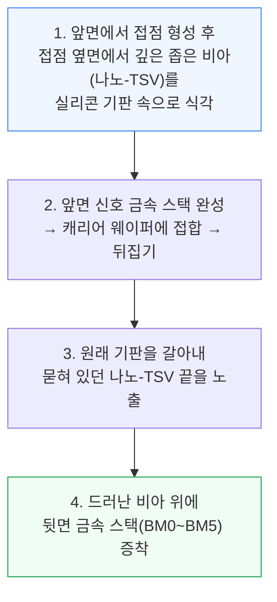
```mermaid
flowchart TD
    S1["1. 앞면에서 접점 형성 후<br/>접점 옆면에서 깊은 좁은 비아(나노-TSV)를<br/>실리콘 기판 속으로 식각"] --> S2["2. 앞면 신호 금속 스택 완성<br/>→ 캐리어 웨이퍼에 접합 → 뒤집기"]
    S2 --> S3["3. 원래 기판을 갈아내<br/>묻혀 있던 나노-TSV 끝을 노출"]
    S3 --> S4["4. 드러난 비아 위에<br/>뒷면 금속 스택(BM0~BM5) 증착"]

    style S1 fill:#eff6ff,stroke:#3b82f6
    style S4 fill:#f0fdf4,stroke:#16a34a
```

나노-TSV와 뒷면 비아는 웨이퍼 반대편에서 만들기 때문에 서로 반대 방향으로 가늘어집니다. 트랜지스터는 FEOL(전공정), 로컬 접점과 나노-TSV가 그 위의 배선을 이으며, M0가 앞면 배선 스택의 시작입니다.

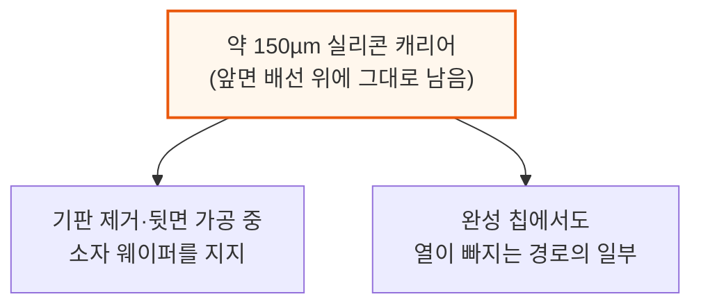
```mermaid
flowchart TD
    Carrier["약 150µm 실리콘 캐리어<br/>(앞면 배선 위에 그대로 남음)"] --> Role1["기판 제거·뒷면 가공 중<br/>소자 웨이퍼를 지지"]
    Carrier --> Role2["완성 칩에서도<br/>열이 빠지는 경로의 일부"]

    style Carrier fill:#fff7ed,stroke:#ea580c,stroke-width:2px
```

PowerVia는 혼잡한 앞면 금속에서 주 전력 분배를 빼내 더 짧고 넓은 뒷면 배선으로 공급합니다. 다만 나노-TSV가 표준 셀 안에서 옆으로 착지하는 면적은 그대로 차지하므로, 접점을 뒷면에 직접 붙이는 방식(direct backside contact)보다 회수하는 셀 면적이 적습니다.

---

### 2.2 후면 배선 (Backside Interconnects)

원문은 비교 기준으로 삼성 SF2 데이터를 함께 실었습니다. SF2는 현재 GAA 파운드리 노드지만 BSPDN이 없어 18A의 기준점으로 쓸 만합니다. 삼성 S26 제품(SF2) 전체 해부는 곧 공개될 예정입니다.

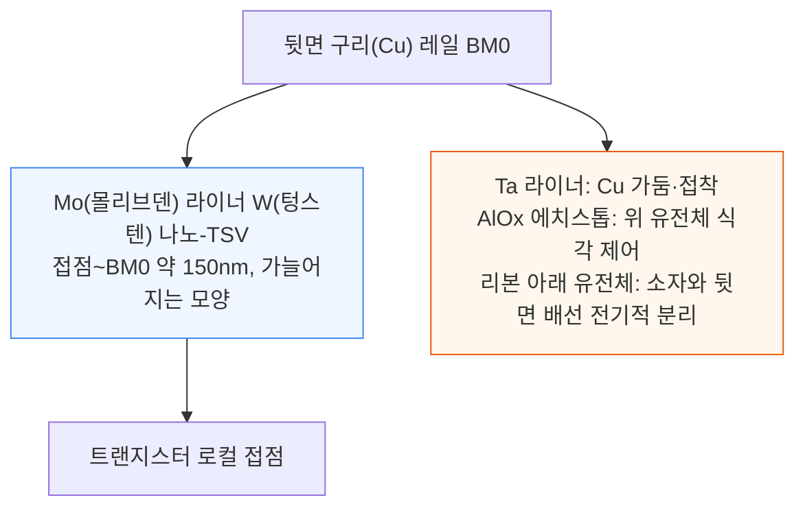
```mermaid
flowchart TD
    Rail["뒷면 구리(Cu) 레일 BM0"] --> Tsv["Mo(몰리브덴) 라이너 W(텅스텐) 나노-TSV<br/>접점~BM0 약 150nm, 가늘어지는 모양"]
    Tsv --> Contact["트랜지스터 로컬 접점"]
    Rail --> Layers["Ta 라이너: Cu 가둠·접착<br/>AlOx 에치스톱: 위 유전체 식각 제어<br/>리본 아래 유전체: 소자와 뒷면 배선 전기적 분리"]

    style Tsv fill:#eff6ff,stroke:#3b82f6
    style Layers fill:#fff7ed,stroke:#ea580c
```

AlOx(알루미늄 산화물)는 에치스톱 역할을 합니다. 알루미늄 플루오라이드 반응물은 휘발성이 낮아 불소 플라즈마에 잘 견디므로, 얇은 AlOx 막이 금속을 지키는 동안 주변 로우-k 유전체를 깎아낼 수 있습니다.

BM0와 M1 위 층에서는 AlOx가 이중층으로 보입니다. 앞서 SemiAnalysis가 해부한 SMIC N+3에서는 단일층이었습니다. SMIC는 더 단순한 국소 AlOx 구성에 나머지 캡·식각 순서로 착지 보호를 얻는 셈입니다.

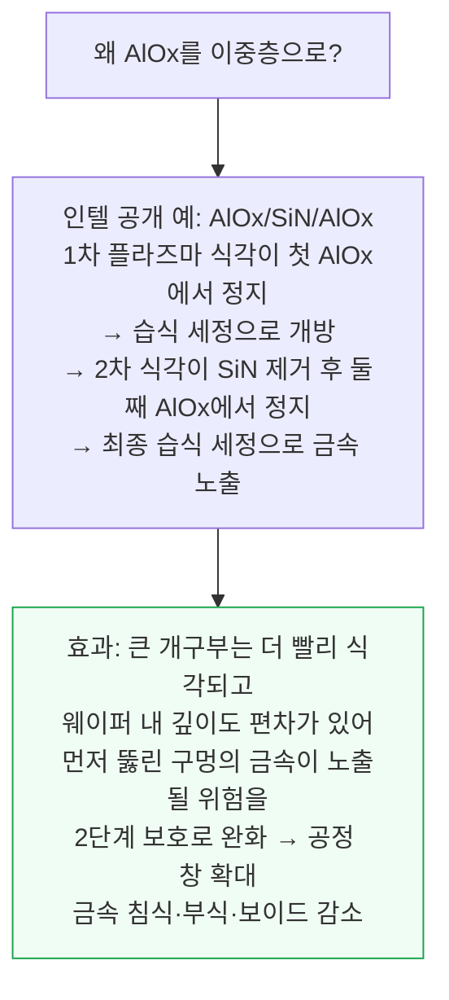
```mermaid
flowchart TD
    Why["왜 AlOx를 이중층으로?"] --> E1["인텔 공개 예: AlOx/SiN/AlOx<br/>1차 플라즈마 식각이 첫 AlOx에서 정지<br/>→ 습식 세정으로 개방<br/>→ 2차 식각이 SiN 제거 후 둘째 AlOx에서 정지<br/>→ 최종 습식 세정으로 금속 노출"]
    E1 --> E2["효과: 큰 개구부는 더 빨리 식각되고<br/>웨이퍼 내 깊이도 편차가 있어<br/>먼저 뚫린 구멍의 금속이 노출될 위험을<br/>2단계 보호로 완화 → 공정 창 확대<br/>금속 침식·부식·보이드 감소"]

    style E2 fill:#f0fdf4,stroke:#16a34a
```

TSMC는 Cu 위에 AlN/AlOx/SiOC/AlOx를 쓰고(AlN은 Cu 확산 차단), AlOx를 하나 뺀 AlN/SiOC/AlOx 변형도 문서화했습니다. 개구부 크기·종횡비·패턴 밀도·캡 재료가 다른 층은 필요한 식각 여유도 다르므로, 이중 AlOx는 추가 보호 지점이 정당화될 때만 의미가 있습니다.

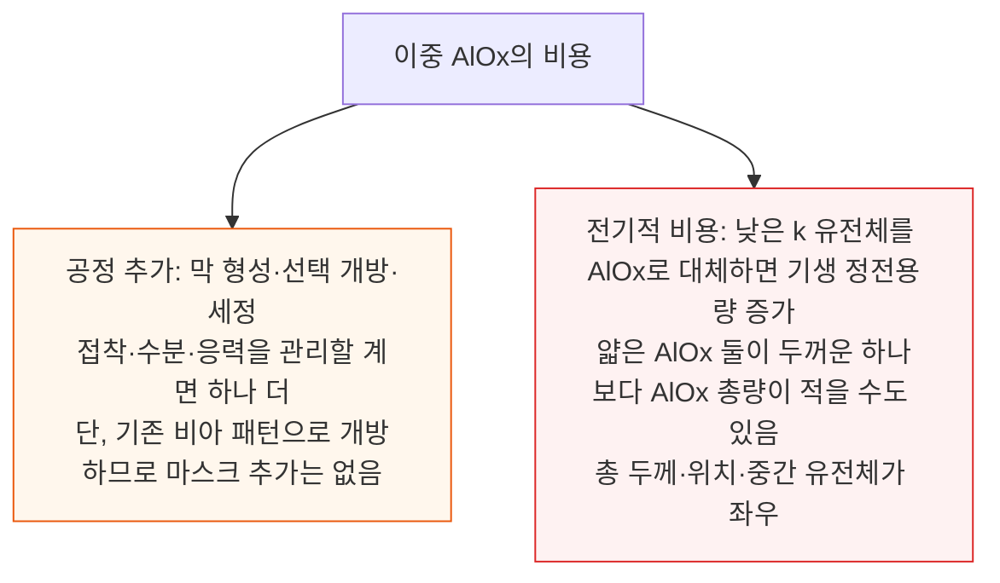
```mermaid
flowchart TD
    Cost["이중 AlOx의 비용"] --> C1["공정 추가: 막 형성·선택 개방·세정<br/>접착·수분·응력을 관리할 계면 하나 더<br/>단, 기존 비아 패턴으로 개방하므로 마스크 추가는 없음"]
    Cost --> C2["전기적 비용: 낮은 k 유전체를 AlOx로 대체하면 기생 정전용량 증가<br/>얇은 AlOx 둘이 두꺼운 하나보다 AlOx 총량이 적을 수도 있음<br/>총 두께·위치·중간 유전체가 좌우"]

    style C1 fill:#fff7ed,stroke:#ea580c
    style C2 fill:#fef2f2,stroke:#dc2626
```

증착 화학에 따라 AlOx의 유전율과 잔류 수산기 함량도 달라지며, 이 수산기가 아래 금속을 산화시킬 수 있습니다.

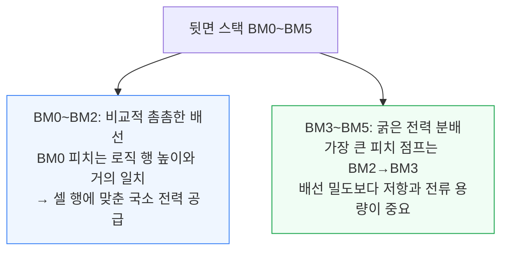
```mermaid
flowchart TD
    Back["뒷면 스택 BM0~BM5"] --> Fine["BM0~BM2: 비교적 촘촘한 배선<br/>BM0 피치는 로직 행 높이와 거의 일치<br/>→ 셀 행에 맞춘 국소 전력 공급"]
    Back --> Coarse["BM3~BM5: 굵은 전력 분배<br/>가장 큰 피치 점프는 BM2→BM3<br/>배선 밀도보다 저항과 전류 용량이 중요"]

    style Fine fill:#eff6ff,stroke:#3b82f6
    style Coarse fill:#f0fdf4,stroke:#16a34a
```

패키지에 가까워질수록 전류를 모으는 굵은 도체가 필요합니다. 이 위계 덕분에 앞면 신호 배선 자원을 소모하지 않고 넓은 전력 배선을 확보합니다. BM0\~BM5의 최소 피치 실측값은 원문에서 이미지 도표로만 제시되어 이 문서에서는 구조만 정리했습니다.

---

### 2.3 전면 배선 (Frontside Interconnects)

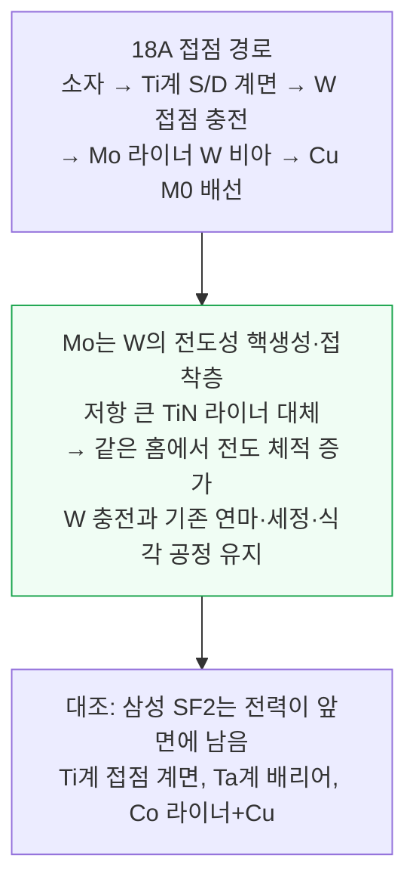
```mermaid
flowchart TD
    Path["18A 접점 경로<br/>소자 → Ti계 S/D 계면 → W 접점 충전<br/>→ Mo 라이너 W 비아 → Cu M0 배선"] --> Mo["Mo는 W의 전도성 핵생성·접착층<br/>저항 큰 TiN 라이너 대체<br/>→ 같은 홈에서 전도 체적 증가<br/>W 충전과 기존 연마·세정·식각 공정 유지"]
    Mo --> Sf2["대조: 삼성 SF2는 전력이 앞면에 남음<br/>Ti계 접점 계면, Ta계 배리어, Co 라이너+Cu"]

    style Mo fill:#f0fdf4,stroke:#16a34a
```

18A 표준셀 행에서는 뒷면 전력 레일이 셀 안의 나노-TSV로 소자에 전력을 공급해 앞면 라우팅 자원을 풉니다. 삼성의 M0는 전력과 신호 연결을 함께 수용합니다. 이 비교는 인텔의 Mo/W 특허가 설명하는 통합 트레이드오프와 일치합니다.

TiN에서 Mo로의 전환은 점진적 변화입니다. Co나 Mo 완전 충전은 매우 작은 구조에서 라이너로 낭비되는 체적을 줄이지만 새 통합 방식이 필요해 복잡도와 위험이 커집니다. Cu는 폭 넓은 배선에서 여전히 저항이 낮아 매력적이고, 배선·비아가 작아질수록 확산 배리어가 단면에서 차지하는 비중이 커집니다.

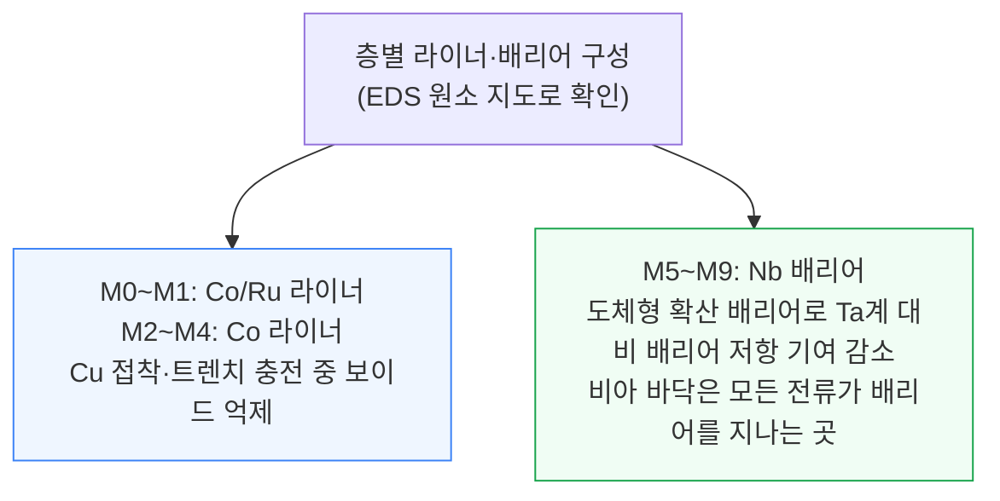
```mermaid
flowchart TD
    Liner["층별 라이너·배리어 구성<br/>(EDS 원소 지도로 확인)"] --> Low["M0~M1: Co/Ru 라이너<br/>M2~M4: Co 라이너<br/>Cu 접착·트렌치 충전 중 보이드 억제"]
    Liner --> Up["M5~M9: Nb 배리어<br/>도체형 확산 배리어로 Ta계 대비 배리어 저항 기여 감소<br/>비아 바닥은 모든 전류가 배리어를 지나는 곳"]

    style Low fill:#eff6ff,stroke:#3b82f6
    style Up fill:#f0fdf4,stroke:#16a34a
```

어플라이드 머티어리얼즈 Endura의 새 열 제어가 젖음(wetting) 공정을 돕습니다. 박막 연속성이 충분해 모세관 압력이 보이드 없이 Cu 원자를 비아 바닥까지 밀어 넣습니다. 인텔 Nb 특허는 굵은 층에서 Nb와 저비용 PVD 공정을 짝짓는 선택지를 제시합니다.

상위 금속층은 피복·균일도는 나쁘지만 두꺼운 배리어를 만드는 PVD를 쓸 수 있고, 하위 금속층은 컨포멀한 ALD로 더 얇은 배리어가 필요합니다. Co/Ru는 재료 계면이 하나 더 늘고 증착과 Cu 충전을 정밀하게 제어해야 합니다. 층마다 라이너와 배리어를 바꾸면 인텔은 배선 저항·공정 복잡도·신뢰성 사이에서 최적점을 고를 수 있습니다.

---

## 3. RibbonFET - 인텔의 첫 GAA 트랜지스터

**📌 핵심:**
- RibbonFET은 FinFET의 세로 핀을 가로로 누운 실리콘 나노시트 4장으로 바꿔, 게이트가 채널을 사방에서 감싸게 한 구조
- 삼성 SF2의 MBCFET은 시트가 3장이지만 폭이 훨씬 넓어 — 채널 둘레는 장수와 폭을 함께 봐야 함
- 후면 전력 공정 덕분에 인텔은 리본 아래 실리콘(서브핀)을 유전체로 바꿔 기생 전도 경로와 기판 정전용량을 줄임
- 결론: 인텔은 GAA와 후면 전력이라는 10년 만의 큰 변화 둘을 한 칩에서 동시에 도입했음

---

### 3.1 평면에서 GAA까지

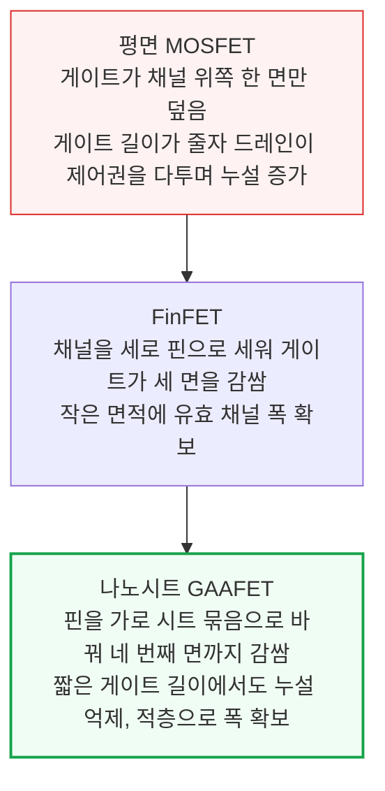
```mermaid
flowchart TD
    Planar["평면 MOSFET<br/>게이트가 채널 위쪽 한 면만 덮음<br/>게이트 길이가 줄자 드레인이 제어권을 다투며 누설 증가"] --> Fin["FinFET<br/>채널을 세로 핀으로 세워 게이트가 세 면을 감쌈<br/>작은 면적에 유효 채널 폭 확보"]
    Fin --> Gaa["나노시트 GAAFET<br/>핀을 가로 시트 묶음으로 바꿔 네 번째 면까지 감쌈<br/>짧은 게이트 길이에서도 누설 억제, 적층으로 폭 확보"]

    style Planar fill:#fef2f2,stroke:#dc2626
    style Gaa fill:#f0fdf4,stroke:#16a34a,stroke-width:2px
```

NMOS와 PMOS를 짝지으면 CMOS 인버터가 됩니다. 높은 입력에서는 NMOS가 출력을 낮추고, 낮은 입력에서는 PMOS가 출력을 높입니다. 깨끗한 스위칭을 하려면 게이트가 채널의 정전기적 제어를 유지해야 합니다.

FinFET은 핀 개수를 하나씩 더하거나 빼는 계단식으로만 채널 폭을 바꿉니다. 나노시트는 공정 설계 규칙 안에서 폭을 연속적으로 조절합니다. 넓은 시트는 구동 전류를, 좁은 시트는 정전용량을 줄이는 대신 구동 전류를 희생합니다.

인텔 18A는 시트 4장 묶음을 쓰고 로직과 SRAM에서 폭을 달리합니다. 시트를 더 얹으면 유효 채널 폭과 구동 전류가 늘지만 제조가 어려워집니다.

---

### 3.2 RibbonFET vs MBCFET

삼성은 2022년 SF3E로 GAAFET 양산을 시작해 SF3, 지금의 SF2로 이어왔습니다. 삼성의 MBCFET은 인텔 첫 RibbonFET과 구조를 견주기에 좋은 대상입니다. STEEL은 Exynos 2600의 SF2와 애플 A20 Pro의 TSMC N2(GAAFET)를 다음 뉴스레터에서 더 파고들 예정입니다.

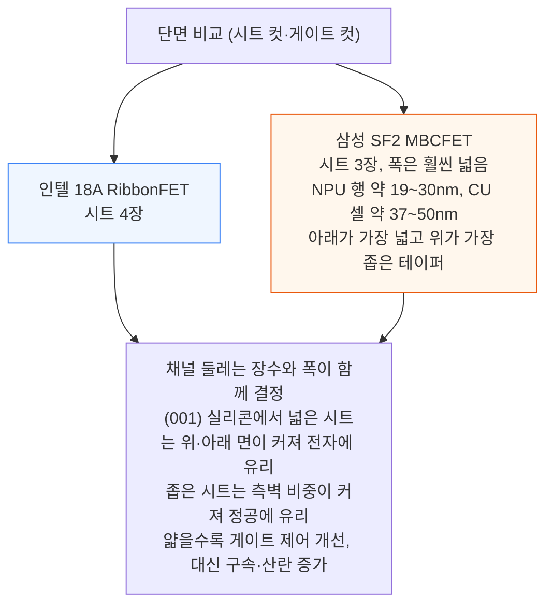
```mermaid
flowchart TD
    Cmp["단면 비교 (시트 컷·게이트 컷)"] --> I["인텔 18A RibbonFET<br/>시트 4장"]
    Cmp --> S["삼성 SF2 MBCFET<br/>시트 3장, 폭은 훨씬 넓음<br/>NPU 행 약 19~30nm, CU 셀 약 37~50nm<br/>아래가 가장 넓고 위가 가장 좁은 테이퍼"]
    I --> Note["채널 둘레는 장수와 폭이 함께 결정<br/>(001) 실리콘에서 넓은 시트는 위·아래 면이 커져 전자에 유리<br/>좁은 시트는 측벽 비중이 커져 정공에 유리<br/>얇을수록 게이트 제어 개선, 대신 구속·산란 증가"]
    S --> Note

    style I fill:#eff6ff,stroke:#3b82f6
    style S fill:#fff7ed,stroke:#ea580c
```

시트 폭과 두께는 변형(strain)·문턱 전압과 더불어 NMOS와 PMOS의 균형을 맞추는 설계 변수입니다.

---

### 3.3 게이트 스택과 문턱 전압 조절

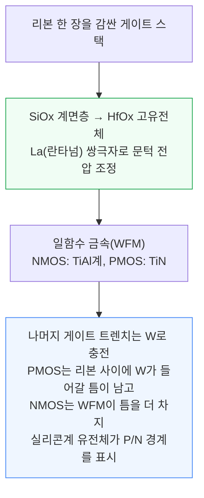
```mermaid
flowchart TD
    Stack["리본 한 장을 감싼 게이트 스택"] --> L1["SiOx 계면층 → HfOx 고유전체<br/>La(란타넘) 쌍극자로 문턱 전압 조정"]
    L1 --> Wfm["일함수 금속(WFM)<br/>NMOS: TiAl계, PMOS: TiN"]
    Wfm --> Fill["나머지 게이트 트렌치는 W로 충전<br/>PMOS는 리본 사이에 W가 들어갈 틈이 남고<br/>NMOS는 WFM이 틈을 더 차지<br/>실리콘계 유전체가 P/N 경계를 표시"]

    style L1 fill:#f0fdf4,stroke:#16a34a
    style Fill fill:#eff6ff,stroke:#3b82f6
```

NMOS와 PMOS가 같은 게이트 트렌치를 공유하므로 경계 유전체가 있어야 두 게이트를 순서대로 가공할 수 있습니다. 마스크를 쓰는 순차 WFM 공정이 서로 다른 게이트 높이와 리본 사이 충전 차이를 설명합니다.

빠른 논리 경로, 정보 유지 회로, SRAM에는 여러 문턱 전압 옵션이 필요합니다. 소자 치수·정전용량·공정 복잡도를 거의 바꾸지 않고 문턱을 바꾸는 것이 중요합니다. FinFET은 보통 WFM 스택을 달리해 해결하지만, 리본 4장 사이 좁은 틈에는 WFM이 많이 들어가지 못합니다.

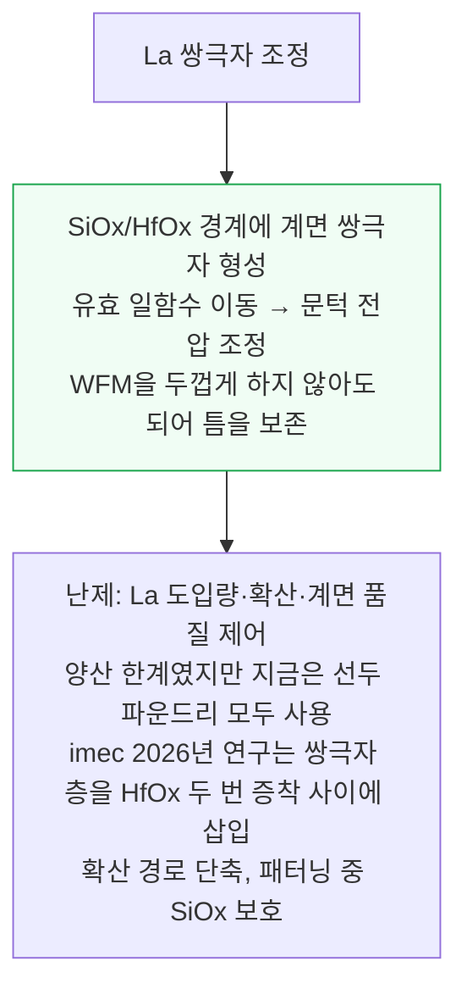
```mermaid
flowchart TD
    Dipole["La 쌍극자 조정"] --> D1["SiOx/HfOx 경계에 계면 쌍극자 형성<br/>유효 일함수 이동 → 문턱 전압 조정<br/>WFM을 두껍게 하지 않아도 되어 틈을 보존"]
    D1 --> D2["난제: La 도입량·확산·계면 품질 제어<br/>양산 한계였지만 지금은 선두 파운드리 모두 사용<br/>imec 2026년 연구는 쌍극자 층을 HfOx 두 번 증착 사이에 삽입<br/>확산 경로 단축, 패터닝 중 SiOx 보호"]

    style D1 fill:#f0fdf4,stroke:#16a34a
```

인텔 특허는 HfOx 위에 쌍극자 형성 산화물을 얹고 계면 산화물 쪽으로 어닐링한 뒤 일함수·충전 금속을 완성하는 방식을 설명합니다. 이로써 문턱 조절과 금속이 들어갈 공간이 분리됩니다.

리본 사이 W는 아래쪽 게이트에 가까운 전도 경로를 줍니다. WFM이 틈을 가득 채우면 게이트는 채널을 여전히 감싸지만 전압이 저항 큰 일함수 막을 통해 도달합니다. 더 얇은 WFM과 쌍극자 조절이 저저항 충전 공간을 지키고, Mo·Ru는 추가 미세화를 위해 개발 중인 대체 충전 금속입니다.

---

### 3.4 소스·드레인 접점과 서브핀 유전체

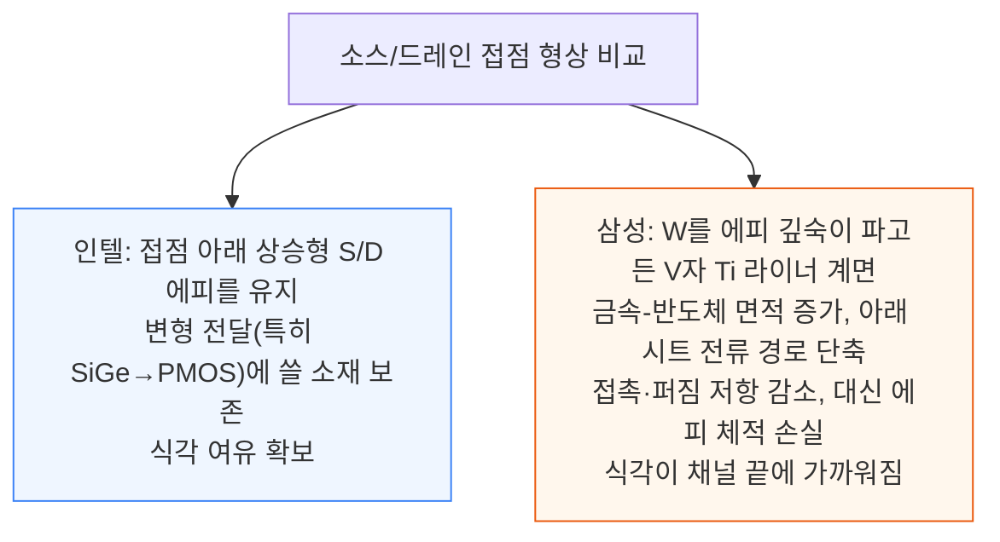
```mermaid
flowchart TD
    Sd["소스/드레인 접점 형상 비교"] --> In["인텔: 접점 아래 상승형 S/D 에피를 유지<br/>변형 전달(특히 SiGe→PMOS)에 쓸 소재 보존<br/>식각 여유 확보"]
    Sd --> Sam["삼성: W를 에피 깊숙이 파고든 V자 Ti 라이너 계면<br/>금속-반도체 면적 증가, 아래 시트 전류 경로 단축<br/>접촉·퍼짐 저항 감소, 대신 에피 체적 손실<br/>식각이 채널 끝에 가까워짐"]

    style In fill:#eff6ff,stroke:#3b82f6
    style Sam fill:#fff7ed,stroke:#ea580c
```

이 형상들은 접점 접근성과 응력 설계, 식각 여유 사이의 균형입니다. 한편 후면 전력 공정 덕에 인텔은 고밀도 로직의 서브핀(리본 아래 실리콘)을 유전체로 교체했습니다.

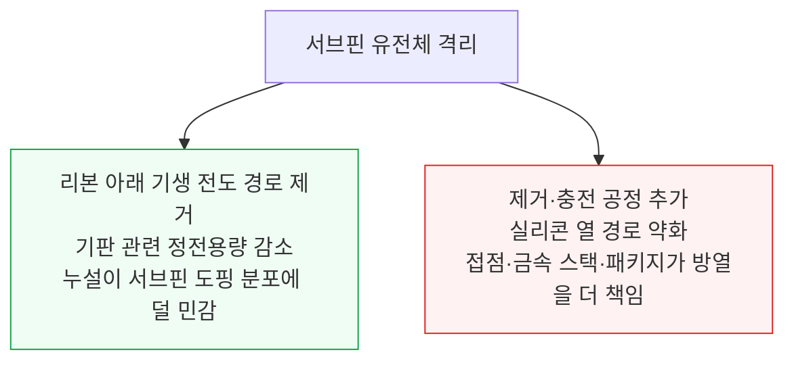
```mermaid
flowchart TD
    Sub["서브핀 유전체 격리"] --> Gain["리본 아래 기생 전도 경로 제거<br/>기판 관련 정전용량 감소<br/>누설이 서브핀 도핑 분포에 덜 민감"]
    Sub --> Lose["제거·충전 공정 추가<br/>실리콘 열 경로 약화<br/>접점·금속 스택·패키지가 방열을 더 책임"]

    style Gain fill:#f0fdf4,stroke:#16a34a
    style Lose fill:#fef2f2,stroke:#dc2626
```

기존 실리콘 몸체를 남기는 전통 구조(비SOI 평면·FinFET)는 누설을 막으려면 접합과 펀치스루 방지 도핑 설계가 필요했습니다.

원소 지도에서는 선택된 인텔 소자 구조 주변에 불소가 모여 있습니다. WF6는 W 핵생성·충전의 표준 전구체입니다.

배리어 막은 주변 유전체를 불소 공격에서 보호합니다. 저불소 W 공정은 잔류 불소 부담을 줄이며, 염화물 전구체는 불소를 들이지 않지만 염소 공격·핵생성·충전 품질 관리가 필요합니다. 목표는 얇은 보호 라이너와 최소한의 주변 화학 손상으로 이어지는 연속적 저저항 W 경로입니다.

---

## 4. 라이브러리 분석 - 셀 높이·게이트 피치·리본 치수

**📌 핵심:**
- 18A 로직 셀은 5트랙, TSMC N3E와 Intel 3 셀은 7트랙 — 후면 전력으로 전력 레일이 신호 배선 자리에서 빠져 낮은 셀 높이와 넓은 M0를 동시에 달성
- Bohr 대표 셀 모델에서 18A 컴퓨트 로직과 TSMC N3E GPU 로직의 밀도는 비슷하고, 18A는 Intel 3 GPU 예시보다 18.6% 더 조밀
- 18A P-core의 M0 금속 단면적은 N3E 벡터 엔진의 2.63배(피치 정규화 후 1.84배)
- 결론: 18A는 N3E급 밀도에 도달했지만 N3P·N2·SF2 같은 최상위 노드의 최대 밀도에는 못 미침

---

### 4.1 측정 방법과 결과

STEEL은 XTEM(단면 투과 전자현미경) 지점별로 셀 높이, 게이트 피치, 금속 형상, 리본 치수를 측정해 지점·소자 극성별 표로 정리했습니다. 시트 컷은 실리콘 채널을 가로질러 리본을 끝면으로 보여주고, 게이트 컷은 채널을 따라 연속된 게이트를 지나갑니다.

원문의 측정 라이브러리 표는 이미지로 제공되어 모든 수치를 옮기지 못했습니다. 본문에서 텍스트로 확인되는 값만 정리합니다. 인텔 18A PDK의 M0 피치는 32nm이지만 팬더레이크 HP 라이브러리는 36nm로 출하되었습니다(출처 제3자 공개 자료).

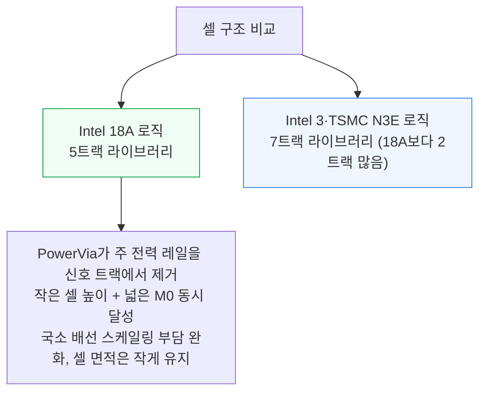
```mermaid
flowchart TD
    Track["셀 구조 비교"] --> A18["Intel 18A 로직<br/>5트랙 라이브러리"]
    Track --> A3["Intel 3·TSMC N3E 로직<br/>7트랙 라이브러리 (18A보다 2트랙 많음)"]
    A18 --> Why["PowerVia가 주 전력 레일을 신호 트랙에서 제거<br/>작은 셀 높이 + 넓은 M0 동시 달성<br/>국소 배선 스케일링 부담 완화, 셀 면적은 작게 유지"]

    style A18 fill:#f0fdf4,stroke:#16a34a
    style A3 fill:#eff6ff,stroke:#3b82f6
```

DDR-PHY는 코어 로직보다 훨씬 넓은 M0 배선과 간격을 씁니다. 배선 밀도를 희생해 배선 저항을 낮추고 이웃 신호 사이 결합을 줄이는 선택으로, 아날로그·클럭·I/O 회로의 전류 공급과 결합 요건에 맞습니다. 셀 높이와 게이트 피치가 기하학적 밀도를 정하고, 실제 블록이 그중 얼마를 쓸 수 있는지는 핀 접근성과 배선 가능성이 정합니다.

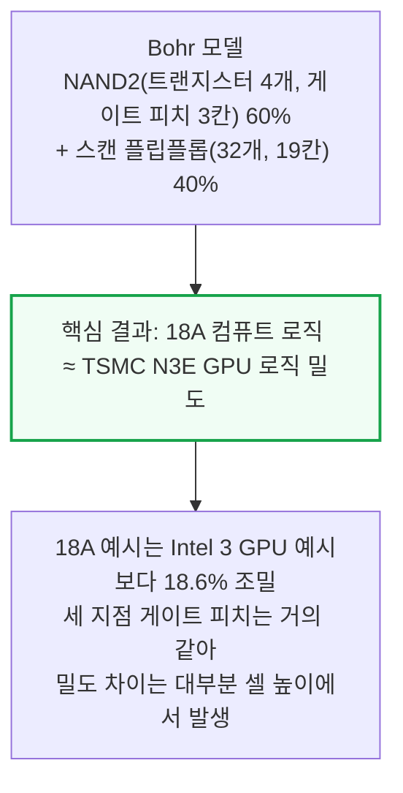
```mermaid
flowchart TD
    Bohr["Bohr 모델<br/>NAND2(트랜지스터 4개, 게이트 피치 3칸) 60%<br/>+ 스캔 플립플롭(32개, 19칸) 40%"] --> R1["핵심 결과: 18A 컴퓨트 로직 ≈ TSMC N3E GPU 로직 밀도"]
    R1 --> R2["18A 예시는 Intel 3 GPU 예시보다 18.6% 조밀<br/>세 지점 게이트 피치는 거의 같아<br/>밀도 차이는 대부분 셀 높이에서 발생"]

    style R1 fill:#f0fdf4,stroke:#16a34a,stroke-width:2px
```

민감도 열은 셀 높이와 게이트 피치를 각각 ±1nm 바꿨을 때 결과 변화를 보여줍니다. 이 비교는 대표 셀의 기하만 견주므로, 다이 전체 밀도는 셀 구성과 배치에도 좌우됩니다.

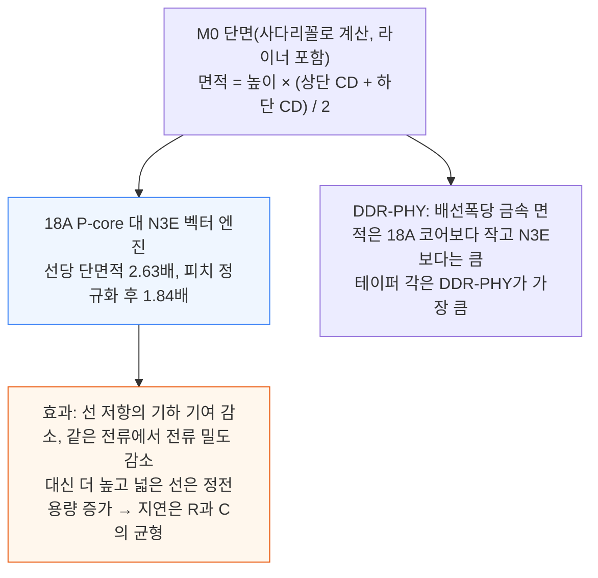
```mermaid
flowchart TD
    M0["M0 단면(사다리꼴로 계산, 라이너 포함)<br/>면적 = 높이 × (상단 CD + 하단 CD) / 2"] --> X1["18A P-core 대 N3E 벡터 엔진<br/>선당 단면적 2.63배, 피치 정규화 후 1.84배"]
    X1 --> X2["효과: 선 저항의 기하 기여 감소, 같은 전류에서 전류 밀도 감소<br/>대신 더 높고 넓은 선은 정전용량 증가 → 지연은 R과 C의 균형"]
    M0 --> X3["DDR-PHY: 배선폭당 금속 면적은 18A 코어보다 작고 N3E보다는 큼<br/>테이퍼 각은 DDR-PHY가 가장 큼"]

    style X1 fill:#eff6ff,stroke:#3b82f6
    style X2 fill:#fff7ed,stroke:#ea580c
```

---

### 4.2 컴퓨트 타일

측정은 컴퓨트 타일 안에서 리본 치수와 게이트 스택 기하가 위치와 극성(NMOS·PMOS)에 따라 달라짐을 보여줍니다. 폭은 주로 사용 가능한 채널 둘레를 바꾸고, 두께는 정전기적 제어와 캐리어 구속도 바꿉니다. 게이트 스택 두께는 저저항 충전에 남는 공간을 결정합니다.

```mermaid
flowchart TD
    Logic["P-core·LP E-core 로직"] --> L1["코어마다 여러 나노시트 폭 사용<br/>타이밍 임계 경로·버퍼·팬아웃이 다른 셀마다<br/>필요한 구동 세기가 다름<br/>LP E-core 안에서도 폭이 다양"]

    style L1 fill:#eff6ff,stroke:#3b82f6
```

GAA는 SRAM 설계자에게도 풀업(PU)·패스게이트(PG)·풀다운(PD) 균형을 맞추는 새 수단을 줍니다. FinFET 비트셀은 핀 수로 소자 세기를 정하고, GAA는 나노시트 폭이라는 조절 변수를 하나 더 얻습니다.

```mermaid
flowchart TD
    Sram["6T SRAM 균형"] --> W["쓰기: PG가 PU를 이기고<br/>'1' 저장 노드를 인버터 트립 점 아래로 끌어내림"]
    Sram --> R["읽기: PD가 '0' 저장 노드를 낮게 유지<br/>PD가 PG보다 강해야 읽기 교란 억제"]
    Sram --> F["FinFET 고전류 셀의 PU:PG:PD 핀 수 비는 1:2:2<br/>(소자 크기 비율이지 전류 비율은 아님)"]

    style W fill:#eff6ff,stroke:#3b82f6
    style R fill:#f0fdf4,stroke:#16a34a
```

```mermaid
flowchart TD
    L2["18A L2 SRAM"] --> S1["가장 좁은 리본은 PU, 가장 넓은 리본은 PD<br/>쓰기 용이성과 읽기 안정성을 각각 개선<br/>PG/PU = 1.49, PD/PG = 1.16<br/>(리본 4장 둘레 = 8 × (폭 + 두께), 모서리 둥글림 전)"]
    L2 --> S2["인텔 공개: HCC는 보조 회로 없이 동작<br/>더 조밀한 HDC는 음의 비트라인 쓰기 보조 사용"]
    S2 --> S3["선택된 비트라인을 접지 아래로 잠깐 낮춰<br/>PG 과구동을 키워 낮은 공급 전압에서 PU를 이김<br/>대가: 승압 회로·스위칭 에너지·전압 스트레스"]

    style S1 fill:#f0fdf4,stroke:#16a34a
    style S3 fill:#fff7ed,stroke:#ea580c
```

L3 구조는 L2와 레이아웃·셀 높이가 거의 같습니다. 고배율 이미지가 적어 표에 실린 L3 나노시트 폭은 더 적습니다.

DDR-PHY는 밀도를 내주고 제어된 아날로그 동작과 안정적인 칩 외부 신호 전송을 얻습니다. 구동 세기·샘플링 시점·전압 마진을 정하는 드라이버, 수신기, 지연 회로, 보정 로직이 들어 있습니다. 비슷한 폭의 4시트 소자가 반복되는 것은 정합과 프로그래머블 구동에 규칙적인 소자 단위를 쓰는 데 맞습니다.

---

### 4.3 Intel 3 GPU와 N3E GPU 소자

```mermaid
flowchart TD
    I3["Intel 3 GT1 GPU"] --> I3a["벡터 엔진(XVE) 로직: 2핀 PMOS·NMOS, M0에 전력 레일<br/>셀 높이와 M0 피치로 7트랙 (18A보다 2트랙 많음)<br/>2핀 소자 사이 1핀 그룹도 존재"]
    I3 --> I3b["L2 SRAM: HCC 표준 비율 PU 1핀 : PG 2핀 : PD 2핀"]

    style I3a fill:#eff6ff,stroke:#3b82f6
```

```mermaid
flowchart TD
    N3["TSMC N3E GT2 GPU"] --> N3a["벡터 엔진 로직: 반복되는 2핀 소자, 7트랙 셀<br/>N3E는 여전히 FinFET 공정<br/>→ 팬더레이크 안에서 FinFET 대 RibbonFET 직접 비교 가능"]
    N3 --> N3b["L2 SRAM: 같은 1:2:2 핀 수 비율"]

    style N3a fill:#fff7ed,stroke:#ea580c
```

---

## 5. 플로어플랜 분석 - 컴퓨트·GPU·I/O 타일

**📌 핵심:**
- 팬더레이크-U는 루나레이크(Lunar Lake)와 플로어플랜이 거의 같음 — 둘 다 P-코어 4개 + LP E-코어 4개 + NPU·미디어·디스플레이 엔진 구성이라 가장 직접적인 비교 대상
- P-코어는 L2가 2.5MiB→3MiB(+20%)로 커졌는데도 면적이 거의 그대로이고, NPU는 면적이 36.9% 줄었음
- GT1(Intel 3) Xe 코어는 루나레이크보다 약 69%, GT2(TSMC N3E)보다 약 55% 큼 — 같은 Xe3 설계라도 공정에 따라 면적이 크게 다름
- 결론: 면적 절감은 공정보다 구조 통합(별도 SoC 타일 제거, NPU 엔진 통합)에서 상당 부분 나옴

---

### 5.1 비교 기준과 컴퓨트 타일

```mermaid
flowchart TD
    Base["비교 기준 선정"] --> LL["루나레이크: 같은 4P+4LP E 구성, Xe2 GPU(Xe3의 직접 전작)<br/>TSMC N3B 컴퓨트 타일"]
    Base --> AL["애로레이크: 코어 수가 다르고 구형 Xe-LPG GPU<br/>→ 부품 단위 비교가 더 직접적일 때만 사용"]

    style LL fill:#eff6ff,stroke:#3b82f6
```

팬더레이크 컴퓨트 타일의 플로어플랜은 출시 몇 달이 지났는데도 공개된 것이 드뭅니다. 18A의 뒷면 금속·유전체 스택을 아래 구조를 해치지 않고 제거해야 깨끗한 트랜지스터 수준 이미지를 얻을 수 있고, 시중 다이 샷 대부분은 배경을 가리거나 가공이 심합니다. STEEL은 자체 다이 샷에 자부심을 보였습니다.

STEEL은 컴퓨트 타일의 주요 블록 면적을 재서 TSMC N3B의 루나레이크 전작과 비교했습니다. 타일 면적은 스크라이브 라인을 제외했고, 컴퓨트+GPU 소계는 PTL-U 컴퓨트 타일과 GT1 GPU를 합한 값입니다(I/O 타일과 수동 베이스 제외). 블록 면적은 서로 겹치지 않는 분할이 아닙니다.

```mermaid
flowchart TD
    Pcore["P-코어: 루나레이크 Lion Cove → 팬더레이크 Cougar Cove"] --> P1["L2 2.5MiB → 3MiB(+20%)에도 코어 면적 거의 불변<br/>(애로레이크도 Lion Cove에 3MiB L2)"]
    Pcore --> P2["공유 P-코어 L3 캐시는 14.8% 축소"]
    P1 --> P3["큰 사설 캐시는 공유 L3·DRAM 접근을 줄이지만<br/>저장 누설과 조회 에너지가 늘어 균형이 필요<br/>인텔 보고: RibbonFET은 누설, PowerVia는 전압 강하와 가드밴드 감소"]

    style P1 fill:#f0fdf4,stroke:#16a34a
```

```mermaid
flowchart TD
    Lpe["LP E-코어 4코어 클러스터<br/>루나레이크 Skymont → 팬더레이크 Darkmont"] --> E1["면적 5.0% 축소, 대부분 L2 영역<br/>1MiB 영역 -8.4%, 1.5MiB 영역 -14.9%<br/>태그 배열도 눈에 보이는 행 하나 감소<br/>(태그는 데이터 배열이 든 주소를 식별, 배치와 배선만 바뀜)"]
    E1 --> E2["4코어가 L2 하나를 공유<br/>용량 풀링과 회로 중복 회피, 대신 뱅크·대역폭 경합<br/>가벼운 작업을 성능 클러스터·L3와 분리해 큰 영역이 잠들 수 있음"]

    style E1 fill:#eff6ff,stroke:#3b82f6
```

캐시 면적은 저장 셀만이 아닙니다. 태그, 디코더, 센스 앰프, 뱅크 연결 배선이 함께 들어가며, 배열을 잘게 나누면 워드라인·비트라인이 짧아져 접근은 빨라지지만 주변 회로는 중복됩니다.

```mermaid
flowchart TD
    Soc["별도 SoC 타일 제거 (메테오레이크·애로레이크와의 차이)"] --> S1["NPU·LP E-코어·메모리 컨트롤러·PHY·미디어·디스플레이가<br/>모두 컴퓨트 타일 안에 함께 있음<br/>활성 다이 하나를 줄이고 CPU 메모리 트래픽이 한 다이에 머묾"]
    S1 --> S2["대가: PHY·I/O 회로가 18A로 이동<br/>드라이버·수신기·아날로그 회로는 외부 전압·부하·신호 무결성 요건 때문에<br/>밀집 디지털 로직만큼 줄지 않음"]

    style S1 fill:#f0fdf4,stroke:#16a34a
    style S2 fill:#fff7ed,stroke:#ea580c
```

---

### 5.2 NPU 통합

가장 큰 축소는 NPU에서 나왔습니다. NPU 5는 면적이 36.9% 줄었습니다.

```mermaid
flowchart TD
    Npu["루나레이크 NPU 4 → 팬더레이크 NPU 5"] --> N1["INT8 MAC 총수는 동일<br/>신경 컴퓨트 엔진(NCE) 수를 절반인 3개로 통합<br/>NCE 한 개의 MAC 배열은 커져 NCE 한 개가 NPU 4 엔진보다 22.6% 큼"]
    N1 --> N2["스크래치패드와 SHAVE DSP도 12개 → 6개로 절반<br/>스크래치패드: 가중치·활성화·중간 결과를 MAC 가까이에 저장해 DRAM 재접근 방지<br/>MAC: 행렬곱·합성곱, SHAVE: 배열에 안 맞는 벡터·맞춤 연산"]
    N2 --> N3["측정된 면적 절감 중 스크래치패드 절반이 가장 큼<br/>같은 MAC에 로컬 저장은 줄어 층이 안 들어가면<br/>작은 작업 타일·중간 데이터 이동 증가<br/>이득은 커진 배열을 계속 바쁘게 돌리는 데 달림"]

    style N1 fill:#eff6ff,stroke:#3b82f6
    style N3 fill:#fff7ed,stroke:#ea580c
```

NPU 5는 FP8을 기본 지원합니다. FP16 대비 피연산자 폭이 절반이라 저장·전송 수요가 줄어 작아진 로컬 메모리에 모델을 맞추기 쉽습니다. 다만 낮은 정밀도와 형식 의존 범위 때문에 스케일링과 모델 검증이 배포 과정에 들어가야 합니다. 하드웨어 활성화 함수는 프로그래머블 DSP가 맡을 일을 덜어줍니다.

마이크로소프트는 코파일럿+ PC에 NPU 40TOPS 이상을 요구하며 루나레이크와 팬더레이크 모두 이를 충족합니다. 팬더레이크는 훨씬 적은 실리콘으로 이를 달성합니다.

---

### 5.3 GPU 타일

팬더레이크는 인텔 최초로 Xe3 GPU를 쓴 제품입니다. 4개 Xe3 코어의 Intel 3 GT1 타일과 12개 Xe3 코어의 TSMC N3E GT2 타일 두 가지가 있습니다. 같은 GPU 아키텍처를 Intel 3과 N3E에서 비교할 수 있는 드문 기회입니다.

와일드캣 레이크는 Intel 18A의 세 번째 Xe3 구현을 더합니다. 세 공정의 차이는 향후 뉴스레터에서 다룰 예정입니다.

```mermaid
flowchart TD
    Gpu["GPU 타일 면적 비교"] --> G1["GT2(N3E)는 Xe 코어가 GT1(Intel 3)보다 훨씬 작음<br/>GT1의 Xe 코어는 루나레이크보다 약 69%, GT2보다 약 55% 큼<br/>블록 면적 격차가 로직·SRAM 밀도 격차보다 커서<br/>배선·타이밍 목표·셀 구성·플로어플랜 배분이 개입"]
    Gpu --> G2["배치 차이: GT2는 렌더 슬라이스를 세로로, GT1은 가로로 배열<br/>공유 캐시 뱅크·D2D 인터페이스까지의 거리와 배선 균형을 새로 잡아야 함"]

    style G1 fill:#fff7ed,stroke:#ea580c
```

```mermaid
flowchart TD
    Xe["Xe3 코어 (루나레이크 대비)"] --> X1["벡터/행렬 엔진 영역 면적 거의 동일<br/>코어당 512비트 벡터 엔진 8개, 2048비트 XMX 엔진 8개 유지<br/>이득은 엔진을 잘 먹이는 방식에서: 상주 스레드 증가로 지연 은닉<br/>가변 레지스터 할당으로 스레드당 레지스터와 활성 스레드 수 교환"]
    Xe --> X2["공유 L1/SLM 192KiB → 256KiB(+33%)인데 면적은 +5%<br/>실효 밀도 +27%"]

    style X2 fill:#f0fdf4,stroke:#16a34a
```

L1은 재사용 캐시 라인을 보존하고, 소프트웨어가 관리하는 SLM은 스레드 그룹이 데이터를 로컬에서 공유하게 합니다. 둘 다 먼 메모리 트래픽을 줄입니다. SLM을 그룹당 많이 배정하면 코어에 동시에 상주하는 그룹 수가 줄 수 있습니다.

```mermaid
flowchart TD
    L2c["GPU L2 캐시 비교"] --> A["GT1(Intel 3): 4MiB, 1MiB 뱅크 4개<br/>매크로 8KiB"]
    L2c --> B["GT2(N3E): 16MiB, 2MiB 뱅크 8개<br/>매크로 16KiB (두 배)"]
    A --> C["각 뱅크는 128개 매크로<br/>N3E 매크로는 54%만 더 큰데 비트는 두 배 → 밀도 30% 높음<br/>매크로 단위 약 23.7 vs 18.3 Mbit/mm²<br/>뱅크 회로 포함 시 약 16.9 vs 10.4 Mbit/mm²"]
    B --> C

    style C fill:#f0fdf4,stroke:#16a34a
```

큰 매크로는 디코더와 센스 앰프 부담을 더 많은 저장 공간에 나누고, 조밀한 뱅크 배치는 제어·배선 비중을 줄여 GT2가 밀도를 얻습니다. 타협점은 워드라인과 비트라인이 길어져 정전용량이 늘어난다는 것입니다.

---

### 5.4 I/O 타일

```mermaid
flowchart TD
    Io["팬더레이크 I/O 타일 두 변형<br/>모두 TSMC N6"] --> Small["소형: PCIe 5.0 4레인 + PCIe 4.0 8레인 = 12레인<br/>하위 모델·외장 GPU 없는 시스템<br/>10·12코어 Xe 대형 GPU SKU도 소형 사용"]
    Io --> Large["대형: PCIe 5.0 8레인 추가 = 총 20레인<br/>외장 GPU 연결용"]
    Small --> Reuse["루나레이크 I/O 레이아웃에 PCIe 4.0 블록과 썬더볼트 블록 추가<br/>PCIe 4.0 4레인과 썬더볼트 4 포트 1개 추가, N6 블록 면적·배치 거의 동일<br/>검증된 PHY를 18A로 옮겨 재인증하는 부담을 피함<br/>칩 외부 링크가 한계인 회로는 빠른 디지털 로직의 이득이 작음"]

    style Small fill:#eff6ff,stroke:#3b82f6
    style Reuse fill:#f0fdf4,stroke:#16a34a
```

---

## 6. Foveros-S 패키징과 와일드캣 레이크

**📌 핵심:**
- 팬더레이크는 컴퓨트·GPU·I/O를 별도 타일로 쪼개 수동 실리콘 베이스 위에 Foveros-S로 조립 — 새 18A 공정을 컴퓨트 타일에만 쓰고 GPU·I/O는 검증되고 값싼 공정에 맡김
- Foveros-S 공칭 피치는 36µm인데 실제 마이크로범프 간격은 약 25.24µm로 더 촘촘함(특징 폭 12.33µm)
- 와일드캣 레이크(Core Series 3)는 같은 18A를 쓰되 수동 베이스를 빼고 한 다이에 통합 — 같은 공정을 상용화하는 두 가지 길
- 결론: 패키지는 제품이 먹는 최첨단 웨이퍼 면적을 정하므로 인텔 공정 경제성의 일부임

---

### 6.1 Foveros-S 구조

```mermaid
flowchart TD
    Why["타일 분할의 이유"] --> W1["제품이 쓰는 최첨단 웨이퍼 면적을 결정<br/>어떤 기능을 다른 공정에 둘지 결정<br/>같은 타일 묶음으로 여러 구성 제공"]
    W1 --> W2["18A는 컴퓨트 타일에만 국한<br/>그래픽·I/O는 더 성숙하고 원가가 낮은 공정"]

    style W2 fill:#f0fdf4,stroke:#16a34a
```

인텔의 최신 기술 소개서는 Foveros-S의 공칭 피치를 36µm로 적습니다. 기능 타일들은 수동 베이스 위에 나란히 놓이는 2.5D 구성이고, 베이스의 TSV(실리콘 관통 전극)가 위쪽 미세 배선을 아래의 굵은 패키지 연결로 이어줍니다.

```mermaid
flowchart TD
    Tile["능동 타일(컴퓨트·GPU)"] --> Bump["마이크로범프로 수동 베이스에 연결"]
    Bump --> Rdl["베이스 상부 미세 RDL: 짧고 조밀한 타일 간 링크"]
    Rdl --> Tsv["TSV: 베이스를 관통해 패키지 기판으로"]
    Tsv --> Sub["패키지 기판이 훨씬 굵은 메인보드 솔더 접합으로 팬아웃"]

    style Rdl fill:#eff6ff,stroke:#3b82f6
```

베이스는 인터커넥트만 제공하고 연산은 위쪽 능동 타일에서 일어납니다. 컴퓨트 타일 가장자리를 고배율로 보면 국소 마이크로범프 간격은 약 25.24µm, 특징 폭은 12.33µm입니다. 이 값은 인텔 공칭값보다 촘촘하며, 각 타일의 모든 D2D 영역에서 X선 이미지로 일관되게 확인됩니다.

```mermaid
flowchart TD
    Mc["메모리 컨트롤러를 CPU 곁에 배치"] --> M1["메테오레이크·애로레이크에서 CPU 메모리 요청이 거치던 D2D 전송 제거<br/>송신기·수신기·링크 통과 생략 → 인터페이스 에너지·지연 절감"]
    Mc --> M2["별도 GPU는 여전히 D2D를 건너 DRAM에 접근<br/>→ 큰 로컬 캐시가 패키지 트래픽을 억제"]

    style M1 fill:#f0fdf4,stroke:#16a34a
```

```mermaid
flowchart TD
    Econ["타일 분할의 경제성"] --> Gain["이득: 작은 다이는 치명 결함 확률이 낮고<br/>조립 전 선별로 불량 타일이 양품 패키지를 못 버리게 함<br/>설계·인증 작업을 여러 제품에 분산"]
    Econ --> Cost["비용: 수동 베이스, D2D 회로, 추가 본딩·테스트, 조립 손실"]
    Gain --> Net["포트폴리오 전체의 양품당 비용이 웨이퍼 수율·재사용·테스트·조립 효과의 합"]
    Cost --> Net

    style Gain fill:#f0fdf4,stroke:#16a34a
    style Cost fill:#fef2f2,stroke:#dc2626
```

---

### 6.2 와일드캣 레이크 패키징

인텔은 2026년 4월 16일 와일드캣 레이크(Core Series 3)를 저가 모바일·엣지용으로 출시했습니다. 18A를 유지하되 수동 베이스를 빼고 더 많은 기능을 한 다이에 합쳐 패키지를 단순화했습니다.

```mermaid
flowchart TD
    Wcl["와일드캣 레이크 18A 다이<br/>Cougar Cove P-코어 최대 2개 + Darkmont LP E-코어 4개<br/>Xe3 코어 2개 + 더 작은 NPU"] --> Pch["별도 플랫폼 컨트롤러 다이가 I/O 제공<br/>UCIe로 연결 (인텔 프로세서 최초의 UCIe 구현)"]
    Pch --> Trade["그래픽 통합으로 타일 경계와 수동 베이스 제거<br/>중간 대역폭 가치 제품의 조립 복잡도 감소<br/>대가: CPU·그래픽 확장이 한 다이에 묶여<br/>팬더레이크처럼 훨씬 큰 GPU로 교체할 자유 상실"]

    style Wcl fill:#eff6ff,stroke:#3b82f6
    style Trade fill:#fff7ed,stroke:#ea580c
```

---

## 7. 인텔의 제조 복귀

**📌 핵심:**
- 2021년 7월 팻 겔싱어 CEO가 2025년 성능 리더십 회복을 목표로 "4년 5개 노드" 로드맵을 제시 — 5년과 CEO 한 명이 바뀐 지금, 복귀 서사는 그가 바랐던 만큼 단선적으로 긍정적이지 않음
- 소비자용 CPU와 첨단 패키징은 회복했지만 서버는 여전히 AMD·Arm 서버 CPU에 성능·효율·코어 수에서 뒤처짐
- GAA 나노시트와 후면 전력은 10년 만의 가장 큰 트랜지스터 통합 변화 둘이고, 인텔은 18A에서 둘을 한꺼번에 도입
- 결론: 공정 로드맵은 돌아왔지만 10나노 이전과 같은 공정 리더십은 아님 — 지속적 우위는 제품 성능·원가·수율·다음 구현에 달림

---

```mermaid
flowchart TD
    Lead["과거의 리더십<br/>고유전체 금속 게이트·FinFET을 업계보다 몇 년 먼저 양산<br/>22nm FinFET은 2012년 아이비브리지로 소비자에게<br/>IDM 구조로 설계와 공정을 함께 최적화, 샌디브리지 이후 x86 지배"] --> Stall["14nm에서 흔들리고 10nm에서 무너짐<br/>2.7배 밀도 목표, 수년 지연과 여러 차례 수정<br/>14nm를 6세대에 걸쳐 연장"]
    Stall --> Gap["2019년에도 대부분 제품은 14nm<br/>10nm는 아이스레이크 모바일 중심<br/>그동안 TSMC는 N7·N7+, AMD Zen 2는 N7로 코어 수·효율 개선"]

    style Lead fill:#f0fdf4,stroke:#16a34a
    style Stall fill:#fef2f2,stroke:#dc2626
```

공정 실패가 쇠락의 중심이었지만 잘못된 사업 결정이 하락을 더 키웠습니다. 제품 지연이 겹치며 클라이언트·서버·FPGA 로드맵이 모두 밀렸고, AI(네르바나·가우디)와 네트워킹(토피노) 진출 시도도 지속 가능한 사업으로 자리 잡지 못했습니다.

```mermaid
flowchart TD
    Rec["인텔의 회복 현황"] --> Done["소비자 로드맵 복원: 타이거레이크·앨더레이크·루나레이크·팬더레이크<br/>공정: Intel 4는 메테오레이크, Intel 3은 그래나이트래피즈·시에라포레스트, 18A는 팬더레이크<br/>첨단 패키징을 파운드리 서비스의 일부로 편입"]
    Rec --> Gap["서버는 여전히 추격 중<br/>여러 세대 Xeon이 수년 늦게 나와<br/>AMD·Arm 서버 CPU에 성능·효율·코어 수에서 뒤처짐"]

    style Done fill:#f0fdf4,stroke:#16a34a
    style Gap fill:#fef2f2,stroke:#dc2626
```

GAA 나노시트와 후면 전력 공급은 10년 만에 가장 큰 트랜지스터 통합 변화입니다. 인텔은 둘을 동시에 받아들였습니다. 18A가 팬더레이크에서 첫 RibbonFET과 PowerVia를 짝지었습니다.

팬더레이크는 의미 있는 제조 이정표입니다. 단면은 RibbonFET과 PowerVia가 국소 접점과 배선을 어떻게 바꾸는지, 플로어플랜은 구조 통합과 공정 선택이 어디서 면적을 아끼는지 보여줍니다. 지속적인 경쟁 우위는 제품 성능, 원가, 수율, 그리고 다음 구현에 달려 있습니다.

---

## 8. 부록 - 본드 스택과 패키지 X선

**📌 핵심:**
- PowerVia 앞면 금속(M14) 위에는 SiN 약 200nm, SiOx 180nm, SiON 500nm, 캐리어 계면 산화물 약 100nm의 접합 스택이 있고 약 150µm 실리콘 캐리어가 남음
- 기존 칩이 실리콘 아래 면에 Au나 NiV를 붙여 방열하던 경로를 PowerVia가 없애고 두꺼운 절연 유전체 스택이 열저항을 더 높임
- 결론: 접합 스택은 열저항을 낮추는 방향으로 추가 개선될 것

---

```mermaid
flowchart TD
    M14["앞면 M14 금속"] --> B1["SiN 약 200nm → SiOx 약 180nm → SiON 약 500nm<br/>→ 캐리어 계면 산화물 약 100nm"]
    B1 --> B2["약 150µm 실리콘 캐리어"]
    B1 --> Fn["각 층의 기능: 접합, 평탄화, 응력 제어<br/>질화막은 웨이퍼 휨 완화, 평탄화 산화막은 접착 산화막이 고르게 증착되도록 평면 제공"]

    style B2 fill:#fff7ed,stroke:#ea580c
```

기판을 갈아내는 동안 접합 계면은 박리를 견뎌야 하며, 이는 주로 열산화막과 접착 산화막의 접착력에 달려 있습니다.

```mermaid
flowchart TD
    Heat["방열 경로 변화"] --> Old["후면 전력이 없는 칩<br/>트랜지스터 아래 영역을 냉각 경로로 사용<br/>Au나 NiV 후면 금속으로 열을 분산"]
    Heat --> New["PowerVia<br/>이 경로를 없애고 배선 스택과 두꺼운 절연 유전체로 대체<br/>열저항 추가 상승 → 접합 스택의 추가 개선 예상"]

    style Old fill:#eff6ff,stroke:#3b82f6
    style New fill:#fef2f2,stroke:#dc2626
```

부록의 마지막은 다이 간(D2D) 영역을 낮은 배율로 찍은 X선 이미지 모음으로, 패키지 D2D 필드 전체를 보여줍니다. 원문은 이미지로만 제공해 이 문서에서는 6장의 25.24µm·12.33µm 측정값으로 갈음합니다.

원문 하단에는 STEEL의 해부 서비스 안내와 채용 공고, 참고문헌 46건이 있으나 변환에서는 생략했습니다.

---

*작성 진행률: 100% 완료*
*업데이트: 원문 전체 8개 섹션(서론\~부록) 변환 완료. 이미지 도표(BM0\~BM5·M0\~M14 최소 피치, 측정 라이브러리 표, 면적 비교표)는 수치가 텍스트로 제공되지 않아 구조와 본문 언급 값만 정리*
