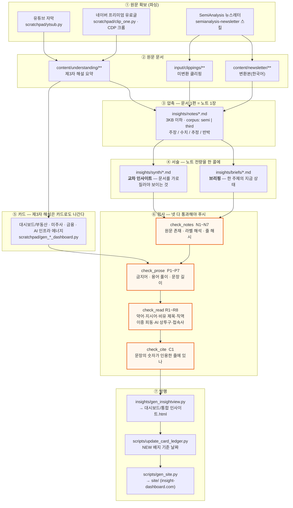

# 파이프라인 — 원문에서 인사이트까지

원문을 긁어오는 것부터 통합 인사이트가 화면에 뜨기까지, 무엇이 무엇을 만드는지 한 장에 담았다.

## 전체 그림



## 한 줄 요약

원문 → **노트**(문서당 한 장) → **브리핑·교차 인사이트**(노트 전량을 한 번에 읽고) → 검사 넷 → 발행.

## 층마다 무엇이 다른가

| 층 | 단위 | 무엇을 담나 | 근거 |
|---|---|---|---|
| 원문 | 문서 1편 | 있는 그대로 | — |
| 노트 | 문서 1편 = 3KB | 주장·수치·추정·반박 | 원문 줄 번호 |
| 브리핑 | 주제 1개 | 그 주제의 지금 상태 | 원문 줄 번호 |
| 교차 인사이트 | 판단 1개 | 문서를 가로질러야 보이는 것 | 원문 줄 번호 |
| 카드 | 해설 1편 | 제3자 해설 요약 | 자막·유료 텍스트 |

**노트는 근거가 아니라 찾아가는 길이다.** 서술을 쓸 때는 노트를 읽되 인용은 원문 줄에 달고,
쓰고 나서 그 줄을 열어 확인한다. 이 단계를 건너뛰어 사고가 났다 — 노트가 두 사실을 한 줄에
붙여 놓은 것을 그대로 옮겨 원인이 바뀌었다(Helios 건).

## 글쓰기 규칙

문장을 어떻게 쓰는지는 `docs/글쓰기 규칙 — 인사이트 문장.md`에 있다.
뜻이 통하게 쓰는 층과 한국말로 쓰는 층을 갈라 두고, 각 규칙이 어느 검사기에 걸리는지 표로 적었다.

## 명령

```bash
# 원문 확보
py -3.13 scratchpad/ytsub.py <영상ID>              # 유튜브 자막
py -3.13 scratchpad/clip_one.py <URL> <YYYYMMDD>   # 네이버 프리미엄(CDP 크롬 9222 필요)

# 전부 다시 만들고 전부 검사 — 푸시 전 이것 하나
py -3.13 scripts/build_all.py
py -3.13 scripts/build_all.py --check              # 검사만
```

`build_all.py`는 생성기 아홉과 검사기 넷을 순서대로 돌리고, 하나라도 실패하면 종료 코드 1을 낸다.

## 검사기가 잡는 것과 못 잡는 것

- 잡는다 — 인용 줄이 사라졌는지, 용어를 안 풀었는지, 제목이 비유인지, 숫자가 인용 줄에 없는지.
- 못 잡는다 — **숫자는 맞는데 뜻이 다른 경우.** 68,928달러가 배선 값인지 백플레인 값인지는
  기계가 모른다. 그건 원문 줄을 열어 읽어야 한다.
