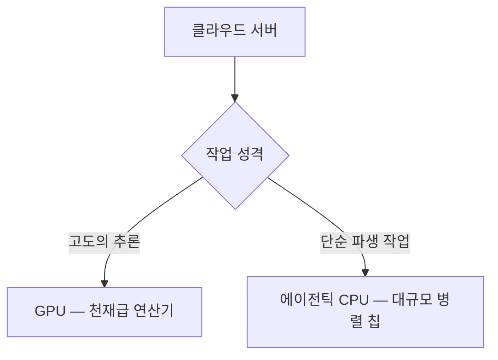

이 파일은 **미검증 원본**이다. `insights/check_frame.py` 로 원문과 대조한 뒤,
원문이 받쳐 주는 것만 카드로 옮긴다.

| 다루는 것 | 묻는 것 |
| --- | --- |
| **Grok bot** | ① 사용자에게 무엇을 파는가?<br>

<br>② 로컬 구동 방식의 한계를 어떻게 풀었는가? |
| **CPU 역할 분화** | ① 호스트 노드 CPU의 역할은 무엇인가?<br>

<br>② 에이전틱 CPU 수요는 왜 생기는가? |
| **밸류체인** | ① 돈과 서비스는 어떤 경로로 흐르는가?<br>

<br>② 각 단계를 쥐고 있는 플레이어는 누구인가? |
| **경쟁 구도와 다음 수** | ① 에이전틱 칩 시장의 핵심 경쟁 지표는 무엇인가?<br>

<br>② 클라우드와 칩 제조사의 다음 수는 무엇인가? |
| **한계** | ① 이 분석이 다루지 않은 것은 무엇인가?<br>

<br>② 원문에서 추측에 불과한 수치는 무엇인가? |

---

## 1. Grok bot

**① 사용자에게 무엇을 파는가?**
Grok bot은 월 200달러(2026년 8월 기준 공표치)의 구독료를 받고 '즉시 사용 가능한 샌드박스 환경'을 팝니다. 사용자가 캘린더, 드라이브, 디자인 툴 등의 연동을 지시하면, 클라우드 상의 가상 머신에 이 도구들이 모두 기본 설치된 상태로 제공됩니다. 복잡한 설정 없이 버튼 하나로 다수의 에이전트를 부릴 수 있는 편의성이 이 제품의 핵심 가치입니다.

**② 로컬 구동 방식의 한계를 어떻게 풀었는가?**
과거 사용자들은 보안 문제로 본인의 노트북을 내어주는 대신, Mac Mini 같은 별도의 장비를 사서 로컬 서버를 구축했습니다. 하지만 이 방식은 전력 유지, 네트워크 설정, 장비 고장 등의 관리 부담을 사용자에게 떠넘겼습니다. Grok bot은 이 전체 환경을 클라우드 가상 머신으로 옮겨 플랫폼이 보안과 구동을 모두 책임지는 방식으로 물리적 제약을 없앴습니다.

```mermaid
flowchart TD
    subgraph 구동 방식 — 로컬 인프라
        A1[장비 개별 구매] --> A2[환경 직접 설정] --> A3[유지보수 부담]
    end
    subgraph 구동 방식 — 클라우드 플랫폼
        B1[소프트웨어 구독] --> B2[통합 샌드박스] --> B3[즉시 사용]
    end

```

---

## 2. CPU 역할 분화

**① 호스트 노드 CPU의 역할은 무엇인가?**
추론을 담당하는 GPU 옆에 바짝 붙어 다음 작업물을 끊임없이 먹여주는 '비서' 역할입니다. GPU가 쉬는 시간은 곧 비용 손실이므로, 호스트 노드 CPU는 코어 수가 많기보다는 단일 코어의 속도가 극도로 빨라야 하며 GPU와의 통신 지연이 없어야 합니다.

**② 에이전틱 CPU 수요는 왜 생기는가?**
AI 모델이 텍스트만 뱉어내던 시절과 달리, 에이전틱 AI는 웹 검색, 기업 공시 긁어오기, 코드 컴파일 등 수많은 파생 작업을 만듭니다. 호스트 노드 CPU가 이 파생 작업까지 처리하려 들면 GPU에 데이터를 먹이는 본업이 멈춥니다. 따라서 이런 파편화된 잡무를 병렬로 넘겨받아 묵묵히 처리할, 코어 수가 매우 많은 새로운 CPU 랙(에이전틱 CPU)이 필요해집니다.



---

## 3. 밸류체인

본 밸류체인은 최종 사용자부터 칩 제조사까지 돈과 인프라가 도는 길을 단계 순서로 폈습니다. 단, 원문에는 각 플레이어가 쥐고 있는 마진율이나 기업 간 교섭력에 대한 정보가 없어 이 글에서는 다루지 않습니다.

**① 돈과 서비스는 어떤 경로로 흐르는가?**
최종 사용자의 지갑에서 나온 돈은 에이전틱 플랫폼을 거쳐 클라우드 사업자, 그리고 최종적으로 칩 제조사와 소프트웨어 기업으로 흘러 들어갑니다. 플랫폼이 대중화될수록 하단 인프라로 떨어지는 낙수 효과가 극대화되는 구조입니다.

**② 각 단계를 쥐고 있는 플레이어는 누구인가?**

* **1단계 (서비스 소비):** 최종 사용자가 Grok bot 같은 에이전틱 플랫폼에 구독료를 지불합니다.
* **2단계 (인프라 임대):** 에이전틱 플랫폼은 사용자마다 샌드박스를 띄우기 위해 클라우드 사업자로부터 대량의 가상 머신을 렌탈합니다.
* **3단계 (컴퓨팅 하드웨어 구매):** 클라우드 사업자는 가상 머신을 돌릴 서버를 채우기 위해 Intel, AMD, Nvidia, Cerebras 등의 칩 제조사로부터 GPU와 에이전틱 CPU를 대량 구매합니다.
* **4단계 (오케스트레이션 도입):** 클라우드 사업자는 이 복잡한 하드웨어 자원을 효율적으로 배분하기 위해 Modular, Gimlet Labs 같은 오케스트레이션 소프트웨어 기업의 솔루션을 도입하거나 자체 개발합니다.

---

## 4. 경쟁 구도와 다음 수

**① 에이전틱 칩 시장의 핵심 경쟁 지표는 무엇인가?**
에이전틱 CPU 시장에서는 단일 코어의 절대적인 성능보다 '코어당 비용'이 핵심 지표가 됩니다. 수많은 파생 작업을 병렬로 처리해야 하므로, 가장 능력 있는 직원을 비싸게 고용하는 것보다 적당한 성능의 직원을 가장 저렴한 비용으로 수백 명 채용하는 것이 전체 작업 효율(총소유비용) 면에서 유리하기 때문입니다.

**② 클라우드와 칩 제조사의 다음 수는 무엇인가?**
칩 제조사들은 이미 하나의 규격이 아닌, 작업 성격에 맞춘 랙 단위의 맞춤형 솔루션(Intel의 P-rack과 E-rack, Cerebras의 랙 스케일 솔루션)을 제안하며 클라우드 사업자를 공략하고 있습니다. 클라우드 생태계 전체의 다음 수는 '오케스트레이션 소프트웨어'의 확보입니다. 성격이 다른 칩들이 섞인 거대한 데이터센터 안에서, 어떤 작업을 빠르고 비싼 칩에 넣고 어떤 작업을 느리고 싼 칩에 넣을지 완벽하게 조율하는 소프트웨어를 쥐는 자가 다음 턴의 주도권을 잡게 됩니다.

---

## 5. 한계

**① 이 분석이 다루지 않은 것은 무엇인가?**
이 글은 칩의 내부 버스 구조, 메모리 대역폭 사양, 열 설계 전력 등 하드웨어의 기술적 상세 사양은 다루지 않았습니다. 또한 원문에 언급되지 않은 특정 칩의 시장 점유율, 제조 단가, 클라우드 사업자와 칩 제조사 간의 실제 공급 계약 단가나 마진율 등은 알 수 없어 배제했습니다.

**② 원문에서 추측에 불과한 수치는 무엇인가?**
"1천만 명의 사용자가 각각 100개의 에이전트를 돌려 10억 개의 클라우드 코어 수요가 발생할 것"이라는 언급은 2026년 8월 기준 팟캐스트 진행자(Austin)의 개인적 추정에 불과하며, 공표된 시장 예측치나 확정된 수요가 아닙니다.