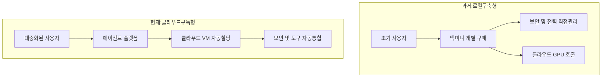

이 파일은 **미검증 원본**이다. `insights/check_frame.py` 로 원문과 대조한 뒤,
원문이 받쳐 주는 것만 카드로 옮긴다.

시니어 경영전략 컨설턴트로서, 제공해주신 팟캐스트 대담을 바탕으로 에이전틱 AI(Agentic AI) 시대의 도래가 불러온 비즈니스 지형 변화를 분석해 드리겠습니다.

기술적 사양은 배제하고, 철저히 **자본의 흐름, 시장의 경쟁 구도, 그리고 기업이 취해야 할 전략적 포지셔닝**에 집중하여 정리했습니다.

---

## 1. 돈이 도는 길: 가치 사슬과 수익 모델의 변화

과거 AI 시장의 돈이 주로 '초거대 모델 학습용 GPU'에 몰렸다면, 에이전틱 AI 시대에는 **실행(Inference & Action)과 인프라 확장**으로 자본의 흐름이 다변화되고 있습니다.

* **B2C/B2B SaaS (플랫폼 구독 모델):** Grok bot과 같은 플랫폼이 월 200달러라는 고가의 구독료를 받을 수 있는 이유는 '편의성(Easy button)' 때문입니다. 복잡한 로컬 서버 구축이나 보안 문제를 클라우드 VM(가상 머신) 기반으로 해결해 주면서, 소수의 개발자 전유물이었던 AI 에이전트를 대중화(Normies)하여 막대한 규모의 소프트웨어 매출을 창출합니다.
* **IaaS (클라우드 인프라 임대):** 수백만 명의 사용자가 각각 10~100개의 에이전트를 구동하기 위해 자신만의 클라우드 VM을 할당받게 됩니다. 이는 클라우드 서비스 제공자(CSP)에게 폭발적인 가상 머신 임대 수익을 안겨줍니다.
* **하드웨어 (에이전틱 CPU 시장의 폭발):** 비싼 GPU(천재)에게 단순 작업(웹 검색, 데이터 스크래핑 등)을 맡기는 것은 심각한 비용 낭비입니다. 따라서 이러한 잔무를 병렬로 처리할 '가성비 좋은 직원' 격인 **에이전틱 CPU**에 대한 대규모 수요가 발생하며, 칩 제조사들에게 새로운 캐시카우가 됩니다.

---

## 2. 경쟁 구도: 패권 전쟁의 3대 격전지

현재 시장은 하드웨어, 플랫폼, 그리고 이 둘을 잇는 오케스트레이션(조율) 소프트웨어 계층에서 치열한 경쟁이 벌어지고 있습니다.

### A. 인프라 접근성 경쟁 (과거 vs 현재)

초기 에이전트 사용자들은 보안과 통제를 위해 '맥 미니'를 사서 로컬 서버를 구축했습니다. 그러나 이는 유지보수, 전력, 네트워크 설정 등 진입 장벽이 너무 높았습니다. 현재는 Grok bot처럼 **격리된 보안 환경(Sandboxed VM)과 도구 통합(SaaS 연동)을 클라우드에서 턴키로 제공**하는 진영이 시장을 장악하고 있습니다.

### B. 프로세서 제조사 간의 TCO(총소유비용) 경쟁

인텔과 AMD 같은 칩 제조사들은 이제 단순히 '가장 빠른 칩'을 만드는 것을 넘어, '용도별 맞춤형 조직도'를 서버 랙(Rack) 단위로 파는 경쟁을 하고 있습니다.

* **호스트 노드 CPU (비서):** GPU(천재) 옆에 붙어서 데이터를 지연 없이 공급하는 고성능 정예 요원.
* **에이전틱 CPU (일반 실무자/인턴):** 속도는 조금 느려도 코어 수가 압도적으로 많아 저렴한 인건비(전력 및 도입비용)로 단순 병렬 작업을 처리하는 인프라.

### C. 오케스트레이션(Orchestration) 소프트웨어 경쟁

다양한 스펙의 하드웨어(GPU, 호스트 CPU, 에이전틱 CPU)가 혼재된 데이터센터에서, **어떤 작업을 누구에게 배분할지 결정하는 '중간 관리자' 소프트웨어**가 새로운 블루오션으로 떠올랐습니다. (예: Modular, Gimlet Labs 등). 이 스케줄링을 얼마나 효율적으로 하느냐가 곧 클라우드 업체의 마진율을 결정짓습니다.

---

## 3. 회사의 다음 수 (Next Strategic Moves)

이러한 지형 변화 속에서, 시장 참여자별로 고려해야 할 다음 전략은 다음과 같습니다.

1. **AI 소프트웨어 및 서비스 기업:**
* **'Easy Button' 확보:** 강력한 AI 모델 그 자체보다, 사용자의 기존 업무 도구(Google Drive, Figma, Calendar 등)와 얼마나 마찰 없이 연동되고 샌드박스 형태의 보안을 제공하느냐에 투자해야 합니다. 기술적 난이도를 사용자로부터 완벽히 숨기는 UX가 핵심 경쟁력입니다.

2. **클라우드(CSP) 및 데이터센터 사업자:**
* **랙 스케일(Rack-scale) 상품 다변화:** 범용 서버 위주의 투자에서 벗어나, 에이전트의 단순 병렬 처리에 특화된 '고밀도/저전력 CPU 랙(예: 인텔의 E-랙)'과 GPU 전용 랙을 분리하여 포트폴리오를 재구성해야 합니다.
* **오케스트레이션 역량 내재화:** 하드웨어 자원을 작업의 난이도에 따라 동적으로 할당하는 스케줄링 소프트웨어 기업을 인수하거나 자체 개발하여 인프라 가동률을 극대화해야 합니다.

3. **일반 엔터프라이즈 (도입 기업):**
* **Workload(작업 부하) 재평가:** 사내 AI 도입 시 맹목적으로 고가의 GPU 인스턴스만 고집할 필요가 없습니다. 문서 요약, 단순 검색, 데이터 스크래핑 등 에이전트의 후선 작업(Spillover tasks)은 저렴한 에이전틱 CPU 클러스터로 이관하여 IT 운영 비용(OpEx)을 대폭 절감하는 아키텍처 재설계가 필요합니다.

---

에이전틱 AI가 1,000만 명의 일반 사용자에게 보급된다면 수십억 개의 CPU 코어가 추가로 필요해지는 막대한 시장이 열립니다. 이 거대한 흐름 속에서 귀사가 현재 속한 산업군이나 집중하고자 하는 타깃(예: 서비스 개발, 인프라 투자, 엔터프라이즈 도입 등)은 어느 쪽이신가요?