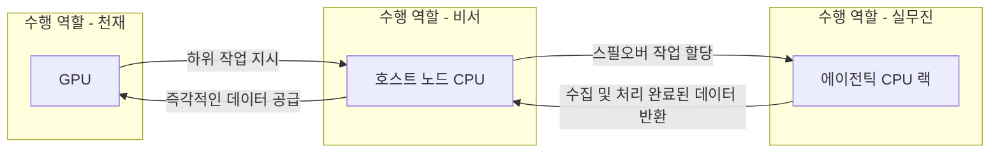

이 파일은 **미검증 원본**이다. `insights/check_frame.py` 로 원문과 대조한 뒤,
원문이 받쳐 주는 것만 카드로 옮긴다.

| 다루는 것 | 묻는 것 |
| --- | --- |
| 에이전틱 AI 생태계 밸류체인 | ① 최종 사용자는 어떤 서비스에 지갑을 여는가? 

 ② 플랫폼 제공자는 어디서 인프라를 조달하는가? 

 ③ 클라우드 사업자는 어떤 하드웨어를 구매하는가? |
| 에이전틱 AI 플랫폼 | ① 로컬 샌드박스 방식의 진입 장벽은 무엇인가? 

 ② 클라우드 가상 머신(VM) 방식이 제공하는 핵심 가치는 무엇인가? 

 ③ 사용자 경험의 차이가 어떻게 시장 수요를 폭발시키는가? |
| 서버 CPU | [축: 컴퓨팅 워크로드의 분화] 

 ① 호스트 노드 CPU는 인프라에서 어떤 병목을 해소하는가? 

 ② 에이전틱 CPU는 어떤 신규 수요를 흡수하는가? 

 ③ 데이터센터의 랙(Rack) 단위 구매 전략은 어떻게 달라지는가? 

 ④ 이질적인 칩을 묶는 오케스트레이션 소프트웨어의 사업 기회는 어디에 있는가? |
| 한계 | ① 본문에서 추정치로만 제시된 시장 규모는 무엇인가? 

 ② 밸류체인 분석에서 누락된 상업적 지표는 무엇인가? 

 ③ 본문이 명확한 답을 내리지 못하고 남겨둔 질문은 무엇인가? |

---

### 에이전틱 AI 생태계 밸류체인

에이전틱 AI 서비스가 대중화되면서 새로운 컴퓨팅 자원 구매 사슬이 형성되고 있습니다. 이 밸류체인은 사용자의 자금이 하드웨어 인프라로 흘러가는 단계를 보여줍니다.

1. **최종 사용자 (구매자)**: 턴키 방식의 에이전틱 AI 소프트웨어(예: Grok bot) 사용 권한을 구매합니다. (Grok bot 기준 월 200달러, 2026년 8월 팟캐스트 발언 기준)
2. **플랫폼 제공자 (중간 수요자이자 서비스 판매자)**: Grok bot과 같은 플랫폼 사업자는 사용자가 접속할 수 있는 독립된 샌드박스 환경(가상 머신, VM)을 클라우드 상에 구축합니다. 이를 위해 클라우드 서비스 제공업체(CSP)의 인프라 자원을 임대하거나 구매합니다.
3. **클라우드/데이터센터 (인프라 구매자)**: 플랫폼 제공자가 요구하는 방대한 수의 VM을 구동하기 위해 칩 제조사로부터 서버용 칩을 대량으로 사들입니다.
4. **칩 제조사 (핵심 부품 공급자)**: 인텔, AMD, 엔비디아, 세레브라스 등은 클라우드 사업자에게 GPU뿐만 아니라 특정 역할에 특화된 CPU(호스트 노드 CPU, 에이전틱 CPU 등)를 랙 단위로 공급합니다.

*주의: 원문에는 각 단계별 플레이어들이 취하는 마진율이나 플랫폼-클라우드-제조사 간의 가격 교섭력(Bargaining power)에 대한 언급이 없습니다. 본 밸류체인은 수익 구조가 누락된 절반의 그림입니다.*

### 에이전틱 AI 플랫폼

과거 에이전틱 AI(Open Claw, Hermes 등)는 사용자가 맥 미니(Mac Mini) 같은 별도의 기기를 구매해 로컬 환경에 직접 설치해야 했습니다. 이는 보안(개인 정보 유출 방지)을 위한 샌드박싱이 필수적이었기 때문입니다. 하지만 전력 유지, VPN 네트워크 설정(Tailscale 등)과 같은 진입 장벽이 높아 소수의 기술 숙련자만 접근할 수 있었습니다.

반면, Grok bot과 같은 클라우드 기반 플랫폼은 이 모든 복잡성을 클라우드 가상 머신(VM) 안으로 숨겼습니다. 사용자는 구글 드라이브나 캘린더 같은 도구를 쉽게 연동하는 '쉬운 버튼(Easy Button)'만 누르면 됩니다. 이러한 편의성은 일반 대중을 에이전틱 AI 시장으로 유입시키는 강력한 촉매가 되며, 뒷단에서는 기하급수적인 서버 컴퓨팅 수요를 창출합니다.

### 서버 CPU 시장의 다음 수

비즈니스 지시를 내리는 '천재'와 이를 실행하는 '비서/실무진'의 체계로 워크로드가 나뉘면서, 서버 CPU의 구매 패턴이 다변화됩니다.

**에이전틱 AI 컴퓨팅 작업 흐름도**

* **호스트 노드 CPU의 역할 (비서)**: 비싼 자원인 GPU가 연산을 멈추지 않도록 데이터를 즉각적으로 공급하는 병목 해소 역할을 맡습니다. 코어 수보다는 GPU와의 통신 속도와 단일 코어 성능이 핵심입니다.
* **에이전틱 CPU의 등장 (실무진)**: GPU가 지시한 넘쳐나는 작업(인터넷 검색, 코드 컴파일, 정보 스크래핑 등)을 처리하기 위한 전담 CPU입니다. 지연 시간이 조금 발생해도 상관없는 작업이므로, 단일 코어 성능보다는 저비용 고효율의 다코어(Intel 288코어, AMD 256코어 등) 구성이 유리합니다.
* **데이터센터의 랙(Rack) 스케일 전략**: 칩 구매 전략이 '범용 칩 일괄 도입'에서 '목적별 분할 도입'으로 바뀝니다. 연산이 빠른 P-코어 랙과 효율 중심의 E-코어 랙, 그리고 웨이퍼 스케일의 특수 GPU 랙(세레브라스 등)을 병렬로 갖추는 형태가 됩니다.
* **오케스트레이션 소프트웨어 기회**: 하드웨어가 극도로 파편화되면서, 특정 작업(Workload)을 가장 비용 효율적인 하드웨어(고속 천재, 저속 천재, 실무진 CPU 등)에 배분하고 스케줄링하는 상위 계층 소프트웨어(Modular, Gimlet Labs 등)가 새로운 격전지가 됩니다.

### 한계

* **비검증된 수요 추정치**: "1,000만 명의 사용자가 각각 100개의 에이전트를 돌릴 경우 10억 개의 CPU 코어가 필요할 것"이라는 수치는 진행자(Austin)의 즉흥적이고 파격적인 추정치일 뿐, 엄밀한 시장 조사에 기반한 데이터가 아닙니다.
* **누락된 상업 인프라 구조**: 플랫폼 이용료(월 200달러)가 발표되었으나, 이 중 얼마가 클라우드 인프라 유지비로 나가고 얼마가 칩 제조사의 수익으로 귀속되는지에 대한 마진 및 비용 구조가 완전히 빠져 있습니다.
* **남겨진 미해결 질문**: 오픈AI나 앤스로픽 같은 최전선의 프론티어 AI 기업들이 실제 인프라 환경에서 범용 CPU와 에이전틱 전용 CPU를 어떤 비율과 기준으로 배분하여 사용하고 있는지 원문에서는 명확한 답을 내리지 못하고 해당 업계의 답변을 과제로 남겼습니다.