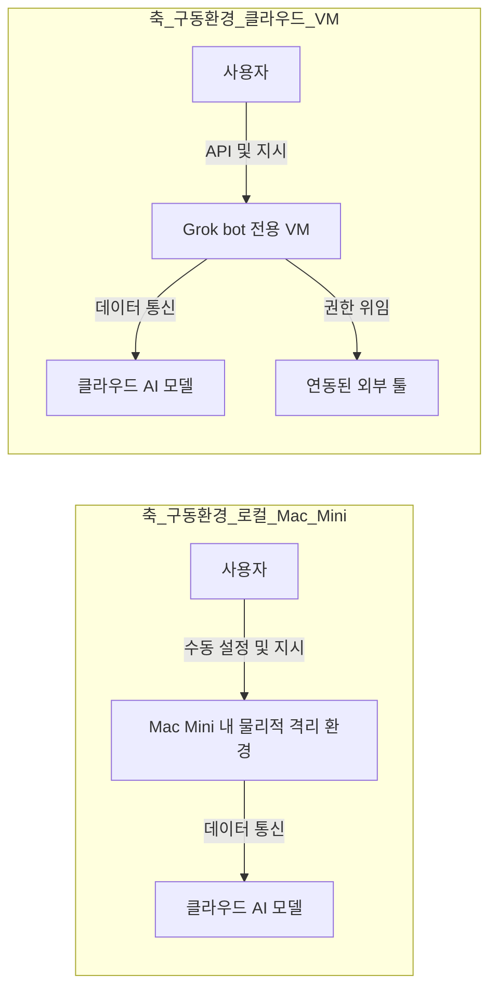
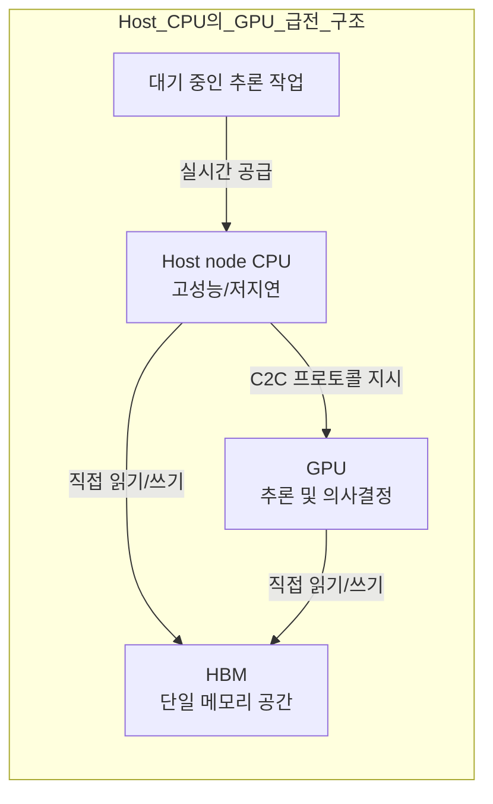
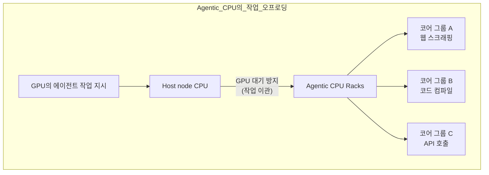

이 파일은 **미검증 원본**이다. `insights/check_frame.py` 로 원문과 대조한 뒤,
원문이 받쳐 주는 것만 카드로 옮긴다.

| 다루는 것 | 묻는 것 |
| --- | --- |
| **Grok bot과 Mac Mini** | ① 에이전트 구동 환경은 로컬에서 클라우드로 어떻게 변했는가? 

 ② 샌드박스 VM을 선택하여 해결한 기술적 과제는 무엇인가? |
| **GPU와 Host node CPU** | ① Host node CPU가 고성능 단일 코어를 요구받는 이유는 무엇인가? 

 ② 메모리 일관성(Coherency)과 C2C 프로토콜은 왜 필요한가? |
| **Agentic CPU** | ① Host node CPU와 별도의 Agentic CPU가 필요한 아키텍처 상의 이유는 무엇인가? 

 ② 다중 코어 아키텍처에서 코어 수와 단일 성능 간의 설계 절충(Trade-off)은 어떻게 이루어지는가? |
| **랙 스케일과 오케스트레이션** | ① 이기종 컴퓨팅 자원은 데이터센터 내에서 어떤 단위로 묶이는가? 

 ② 이 아키텍처가 요구하는 오케스트레이션 소프트웨어의 과제는 무엇인가? |
| **한계** | ① 원문에서 추측이나 미검증으로 남겨둔 부분은 무엇인가? 

 ② 이 글에서 다루지 않은 영역은 무엇인가? |

---

### Grok bot과 Mac Mini

에이전트 AI 초기에 개발자들은 시스템 제어권 상실과 보안 위협을 막기 위해 **Mac Mini**를 물리적 샌드박스로 활용했습니다. 그러나 이는 전원 관리, VPN(Tailscale 등)을 통한 원격 네트워크 설정 등 인프라 유지보수 책임을 사용자에게 전가하는 한계가 있었습니다.

Grok bot은 이 구동 환경을 클라우드 기반의 전용 가상 머신(VM)으로 이전했습니다. 로컬 하드웨어를 프로비저닝할 필요 없이, 보안이 격리된 클라우드 샌드박스 내에서 툴 연동(Google Drive, Canva 등)과 인증을 통합 처리합니다.

### GPU와 Host node CPU

이 시스템에서 GPU는 추론과 의사결정을 담당하는 'Genius(천재)'이며, Host node CPU는 이 GPU에 끊임없이 연산 거리를 밀어 넣는 'Assistant(조수)' 역할을 합니다.

Host node CPU는 코어 수가 많은 것보다 단일 코어의 클럭 속도와 응답성(Single-core performance)이 훨씬 중요합니다. 고가의 GPU가 다음 연산을 기다리며 유휴 상태(Idle)에 빠지는 것은 시스템 전체의 심각한 손실이기 때문입니다.

이를 위해 Grace Blackwell(원문 발췌)과 같은 시스템은 **C2C(Chip-to-Chip) 프로토콜**과 **메모리 일관성(Memory Coherency)** 기술을 채택합니다. CPU와 GPU가 서로 다른 메모리 공간을 오가며 데이터를 복사하는 지연 시간을 없애고, 공유 HBM(고대역폭 메모리)을 동일한 작업대처럼 활용하여 통신 병목을 극복합니다.

### Agentic CPU

LLM이 단순 챗봇을 넘어 코드를 컴파일하거나 수십 개의 SEC 웹 문서를 스크래핑하는 등 부가적인 '행동(Action)'을 지시하기 시작하면, Host node CPU만으로는 이를 감당할 수 없습니다. Host CPU가 웹 검색 지연 시간을 기다리느라 묶이게 되면 GPU 급전이 멈추기 때문입니다. 이 흘러넘치는(Spillover) 에이전트 작업들을 처리하기 위해 **Agentic CPU**라는 별도의 워커(Worker) 계층이 대두됩니다.

여기서 아키텍처 설계의 핵심 절충이 발생합니다. 원문은 AMD의 256코어, Intel의 288코어 칩(공표치 기준 발췌)을 언급하며 이를 부서의 '평면도(Floor plan)'에 비유합니다. 웹 스크래핑이나 API 호출 같은 작업은 I/O 대기 시간이 길기 때문에, 단일 코어의 절대 성능보다는 **코어당 비용(Cost per core)이 낮고 병렬 처리에 유리한 고집적 다중 코어 구조**를 선택하는 것이 유리합니다. 즉, 소수의 고급 인력(P-core) 대신 다수의 주니어 인력(E-core)으로 여러 워크로드를 동시에 쳐내는 사양을 고르게 됩니다.

### 랙 스케일과 오케스트레이션

데이터센터는 이제 단일 칩 단위가 아니라 랙 스케일(Rack Scale)로 컴퓨팅 자원을 재편하고 있습니다. 인텔이 제안한 P-rack(성능 중심)과 E-rack(효율성 중심), 세레브라스(Cerebras)의 랙 스케일 초고속 솔루션(원문 발췌)이 그 예입니다.

이러한 하드웨어의 파편화(Disaggregation)는 필연적으로 강력한 소프트웨어 계층을 요구합니다. 어떤 작업은 매우 빠른 토큰 생성 속도를 요하는 GPU 랙으로, 어떤 작업은 긴 컨텍스트를 소화하는 HBM 기반 GPU 랙으로, 또 어떤 백그라운드 스크래핑 작업은 Agentic CPU 랙으로 분배해야 합니다. Nvidia Dynamo나 Modular(Mojo)와 같은 오케스트레이션 소프트웨어가 이 복잡한 데이터 이동과 작업 스케줄링을 통제하는 층위로 부상하고 있습니다.

### 한계

1. **검증되지 않은 추측:** 기업들이 일반 범용(General Purpose) 서버 대신 에이전트 전용 CPU 랙을 직접 구매하여 온프레미스로 구축할 것인지, 아니면 여전히 클라우드 인스턴스(Gimlet Labs 등 네오클라우드 포함)에 의존할 것인지에 대한 채택 양상은 원문에서 추측 영역으로 남겨두었습니다. 또한, 1,000만 명의 사용자가 각각 100개의 에이전트를 가동해 10억 개의 코어 수요가 발생할 것이라는 계산은 단순 가정을 가미한 추정치입니다.
2. **이 글이 다루지 않은 영역:** 프롬프트 지시에 따라 해당 기술의 확산이 특정 벤더(CPU 제조사) 주가에 미치는 영향이나 칩 제조사 간 시장 점유율 등 투자와 관련된 시장 판도는 배제했습니다.