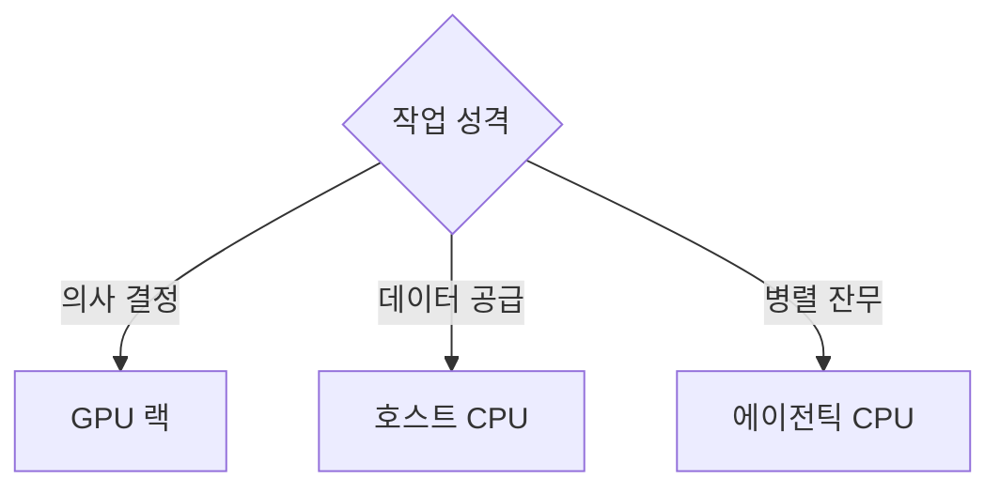

이 파일은 **미검증 원본**이다. `insights/check_frame.py` 로 원문과 대조한 뒤,
원문이 받쳐 주는 것만 카드로 옮긴다.

| 마디 | 꼴 | 절 |
| --- | --- | --- |
| 구동 환경 | 대비 | ① 로컬 구동은 왜 한계에 부딪히는가 

 ② 클라우드 VM은 어떤 장벽을 없애는가 |
| 호스트 노드 CPU | 인과 사슬 | ① GPU 병목은 왜 발생하는가 

 ② 단일 코어 속도는 왜 최우선인가 

 ③ 메모리 일관성은 왜 필수인가 |
| 에이전틱 CPU | 조건 갈림 | ① 대규모 병렬 코어는 언제 투입되는가 

 ② 코어 밀도와 성능은 어떻게 교환되는가 |
| 한계 | 부분 나눔 | ① 랙 스케일 오케스트레이션의 공백 

 ② 기업용 하드웨어 도입 비율 미검증 

 ③ 10억 코어 수요 예측의 비약 |

---

### 구동 환경

**① 로컬 구동은 왜 한계에 부딪히는가**
초기 에이전트 구동은 맥 미니(Mac Mini)와 같은 독립된 로컬 하드웨어를 구매해 샌드박스를 구축하는 방식이 주를 이루었습니다. 이는 에이전트(예: Open Claw)가 사용자의 메인 PC 내 민감한 데이터에 무단 접근하는 것을 물리적으로 격리하기 위함이었습니다. 그러나 로컬 서버 방식은 전력 공급의 불안정성, 하드웨어 장애 시 복구의 어려움, 그리고 외부 접속을 위한 복잡한 네트워킹(VPN, Tailscale 등) 설정 등 유지보수 오버헤드가 지나치게 커 일반 사용자 확장에 치명적인 한계로 작용합니다.

**② 클라우드 VM은 어떤 장벽을 없애는가**
Grok bot으로 대변되는 새로운 플랫폼은 클라우드 상에 사용자 전용 가상 머신(VM)을 할당하여 로컬 구동의 단점을 해소합니다. 네트워크 설정과 보안 격리가 클라우드 공급자 단에서 통제되므로 사용자는 보안 사고를 우려할 필요가 없습니다. 또한, Google Drive, Canva 등 외부 툴 연동 시 요구되는 복잡한 API 인증과 권한 부여가 VM 내에 네이티브로 사전 설치되어, 사용자는 초기 인프라 설정 없이 즉시 에이전트를 가동할 수 있습니다.

---

### 호스트 노드 CPU

**① GPU 병목은 왜 발생하는가**
AI 연산에서 GPU는 '천재(Genius)'로 비유되며 가장 비싸고 강력한 연산 자원입니다. GPU가 연산을 멈추고 데이터를 기다리거나 I/O 작업(예: 파일 탐색, 단순 웹 수집)을 직접 수행하게 되면 심각한 자원 낭비(병목)가 발생합니다. GPU의 가동률을 100%로 유지하려면 누군가 지속적으로 다음 연산 데이터를 준비해 주어야 합니다.

**② 단일 코어 속도는 왜 최우선인가**
GPU 곁에서 연산거리를 끊임없이 공급하는 '비서' 역할이 호스트 노드 CPU입니다. 이 CPU는 GPU가 한 작업을 마치는 즉시 다음 데이터를 넘겨주어야 하므로, 코어의 개수보다 단일 코어의 반응성(Clock Speed)과 낮은 지연 시간(Low Latency)이 압도적으로 중요합니다.

**③ 메모리 일관성은 왜 필수인가**
초고속 데이터 공급을 위해 호스트 CPU와 GPU는 물리적으로 가장 가까운 위치에서 메모리 일관성(Memory Coherency)을 유지해야 합니다. Grace Blackwell의 C2C 프로토콜처럼 칩 간 고속 통신이 열려 있고 HBM(고대역폭 메모리)을 공유 데스크처럼 함께 읽고 쓸 수 있어야, CPU가 메모리에서 데이터를 복사해 GPU로 넘기는 데 소모되는 시간을 원천적으로 제거할 수 있습니다.

---

### 에이전틱 CPU

호스트 노드 CPU가 GPU 피딩에 전념하는 동안, GPU가 쏟아내는 잔무(코드 컴파일, 수십 개의 SEC 공시 자료 수집 등)를 처리할 별도의 연산 자원이 요구되며 이것이 **에이전틱 CPU**입니다.

**① 대규모 병렬 코어는 언제 투입되는가**
에이전트가 외부 API를 호출하거나 웹을 스크래핑할 때는 필연적으로 '네트워크 대기 시간'이 발생합니다. 이런 작업은 높은 연산력을 요구하지 않으므로, 소수의 고성능 코어(호스트 노드)에 할당하는 대신 다수의 저성능 코어에 넓게 쪼개어 병렬 처리하는 것이 효율적입니다.

**② 코어 밀도와 성능은 어떻게 교환되는가**
에이전틱 CPU의 사양은 단일 코어의 성능(비용)과 멀티 코어 집적도 간의 상충 관계(Trade-off)를 통해 결정됩니다.

* **AMD 256코어 / Intel 288코어 사양** *(공표치, 2026년 8월 언급 기준)*
* **선택 이유:** 단일 스레드의 처리 속도를 의도적으로 타협(하향)하는 대신 칩 하나에 들어가는 코어의 밀도를 극대화한 설계입니다. 에이전트의 잔무는 개별 난이도가 낮고 대기 시간이 길어, 빠르고 비싼 코어(시니어) 소수보다 느리지만 저렴한 코어(주니어) 다수를 배치하는 것이 코어당 총소유비용(TCO)을 최적화하기 때문입니다.
* 이러한 맥락에서 인텔은 작업의 지연 시간 민감도에 따라 극단적 코어 밀도를 추구하는 **E코어 랙**과, 조금 더 복잡한 에이전트 연산을 위한 **P코어 랙**으로 나누어 하드웨어를 제안하고 있습니다.

---

### 한계

**① 랙 스케일 오케스트레이션의 공백**
원문은 Cerebras와 같은 초고속 추론 GPU 랙, HBM 기반 범용 GPU 랙, 그리고 P/E코어 기반의 CPU 랙이 혼재된 데이터센터를 묘사합니다. 그러나 이처럼 이기종 하드웨어로 분산된 환경에서 어떤 작업 조각(Slice)을 어느 하드웨어로 보낼지 실시간으로 통제하는 상위 소프트웨어(오케스트레이션 계층)에 대해서는 구체적인 해답을 내놓지 못하고 있습니다(Modular/Mojo 등이 언급되나 구동 여부는 미확인).

**② 기업용 하드웨어 도입 비율 미검증**
클라우드 하이퍼스케일러들은 워크로드에 맞춰 P랙, E랙 등 맞춤형 노드를 도입할 여력이 있으나, 일반 엔터프라이즈 기업들이 범용 CPU 대신 에이전트 전용 CPU 랙을 실제로 얼마나 별도 구매해 배치할지에 대한 실무적 판단 척도나 가동 비율은 원문이 다루지 않은 미지의 영역입니다.

**③ 10억 코어 수요 예측의 비약**

* **10억 개 클라우드 코어 수요** *(저자 추정치, 2026년 8월 기준)*
* **선택 이유 및 한계:** 1천만 명의 사용자가 각각 100개의 에이전트를 구동한다는 단순 산술에 기반해 도출된 값입니다. 에이전틱 AI가 서버 CPU 시장에 미칠 파급력을 강조하기 위해 극단적 동시 접속 환경을 가정한 것으로, 실제 리소스 공유나 시분할(Time-sharing) 최적화 기술이 적용될 경우 필요한 물리 코어 수는 이 추정치와 크게 다를 수밖에 없습니다.