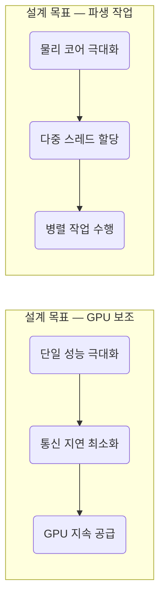

이 파일은 **미검증 원본**이다. `insights/check_frame.py` 로 원문과 대조한 뒤,
원문이 받쳐 주는 것만 카드로 옮긴다.

| 다루는 것 | 묻는 것 |
| --- | --- |
| host node CPU | ① GPU 연산을 어떻게 보조하는가? 

 ② 왜 단일 코어 성능을 높였는가? 

 ③ 메모리 일관성이 왜 필요한가? |
| agentic CPU | ① 왜 별도의 CPU가 필요한가? 

 ② 집적도와 성능을 어떻게 맞교환했는가? 

 ③ 랙 단위 물리 설계는 어떻게 나뉘는가? |
| Rack scale | ① 칩 단위를 넘어선 설계는 무엇인가? 

 ② 처리 속도와 문맥 크기를 어떻게 맞교환하는가? |
| 한계 | ① 여러 하드웨어를 묶는 스케줄링 구현 방식 (본문 미다룸) 

 ② 실제 데이터센터의 에이전틱 CPU 도입 비율 (원문 미확인) |

### 1. host node CPU

Host node CPU의 핵심 아키텍처 목표는 고비용 자원인 GPU(천재)가 유휴 상태에 빠지지 않도록 연산 파이프라인을 쉼 없이 공급하는 것입니다.

이러한 설계 목적을 달성하기 위해 코어의 수보다는 단일 코어의 클럭 속도와 응답성(Single-core performance)을 극대화하는 방향을 택합니다. 촘촘한 코어 집적도를 포기하고 단일 코어 성능을 취한 이유는 상충 관계(Trade-off) 때문입니다. GPU의 작업 완료 상태를 지연 없이 모니터링하고 다음 명령을 즉각 주입하려면 단일 스레드의 처리 속도가 절대적으로 중요하며, 여기서 발생하는 병목이 전체 클러스터의 연산 손실로 직결되기 때문입니다.

또한 Grace Blackwell과 같은 시스템 아키텍처에서 볼 수 있듯, **메모리 일관성(Memory Coherency)과 초고속 C2C(Chip-to-Chip) 프로토콜**을 도입합니다. CPU와 GPU가 물리적으로 분리된 메모리를 오가며 데이터를 복사하는 오버헤드를 없애기 위함입니다. CPU가 GPU의 메모리(HBM) 풀에 동일하게 접근할 수 있도록 설계하여, 별도의 데이터 전송 대기 시간 없이 즉각적인 I/O를 보장합니다.

### 2. agentic CPU

에이전틱 AI 워크로드가 폭증하면서, GPU가 하달하는 파생 작업(웹 스크래핑, SEC 문서 수집, 코드 컴파일 등)을 Host node CPU가 모두 감당할 수 없는 병목 현상이 발생합니다. GPU를 먹여 살려야 하는 Host node CPU가 외부 I/O 작업에 묶이면 시스템 전체가 멈추게 되므로, 이를 전담할 **agentic CPU** 계층이 별도로 필요해졌습니다.

* **설계 사양:** [2026년 기준, 제조사 공표치] AMD 256 코어 CPU, 인텔 288 코어 CPU.
* **아키텍처 선택 이유:** 이 CPU들은 단일 코어의 성능을 희생하는 대신 **물리적 코어 집적도를 극대화**하는 사양을 고릅니다. 에이전트의 파생 작업은 네트워크 지연이나 디스크 I/O 대기 시간이 길어, 높은 클럭 속도의 코어 하나가 기다리는 것보다 성능이 낮은 코어(인턴) 여러 개가 동시에 독립적인 병렬 스레드를 열어두는 것이 훨씬 유리하기 때문입니다.

이러한 설계 철학은 랙(Rack) 단위의 물리 인프라 구성으로도 이어집니다.

* **설계 사양:** [2026년 여름, 벤더 공표치] 인텔 P-rack(Performance) 및 E-rack(Efficiency).
* 이러한 분리 설계는 워크로드의 성격에 따라 비용 대비 효율을 최적화하기 위함입니다. 복잡한 추론 로직이 필요한 에이전트 작업은 단일 처리 속도가 높은 P-rack으로, 수천 개의 단순 정보 수집 봇을 띄워야 하는 작업은 저전력 고집적 스레드 기반의 E-rack으로 스케줄링하여 아키텍처 상의 낭비를 줄입니다.

### 3. Rack scale

칩 하나의 트랜지스터 집적도를 높이는 방식의 물리적 한계로 인해, 이제는 랙 단위 자체가 하나의 거대한 단일 컴퓨팅 노드로 설계되고 있습니다.

* **설계 사양:** [2026년 8월, 제조사 공표치] 세레브라스(Cerebras)의 새로운 Rack scale 솔루션. 기존 웨이퍼 스케일 칩을 랙 단위로 확장.
* **상충 관계 (토큰 생성 속도 vs 문맥 크기):** 하드웨어 아키텍처 단에서 무엇을 희생하고 무엇을 얻을지 명확히 갈립니다.
1. **극단적 속도 중심 (Cerebras):** 대용량 HBM과 컨텍스트 메모리를 덜어내는 대신, 토큰 처리 속도(대역폭)를 극한으로 끌어올렸습니다.
2. **대규모 문맥 중심:** 기존 범용 HBM 기반 가속기들은 토큰 속도는 상대적으로 느리더라도 긴 컨텍스트를 메모리에 상주시키는 아키텍처를 고릅니다.
이 두 가지 랙 스케일 설계는 실시간 챗봇 모델과, 밤새 연산해도 무방한 복잡도 높은 의료/기후 인퍼런싱 워크로드를 하드웨어 단에서 분리 수용하기 위해 고안되었습니다.

### 4. 한계

* **이기종 하드웨어 오케스트레이션 구현의 불확실성:** 원문에서는 Modular, Nvidia Dynamo, Gimlet Labs 등의 소프트웨어가 CPU(P-core/E-core), GPU, 세레브라스 등 다양한 이기종 랙에 워크로드를 어떻게 쪼개어 스케줄링(Disaggregated Hardware Orchestration)하는지, 그 구체적인 기술 스택이나 알고리즘까지는 다루지 않았습니다.
* **실제 배포 점유율 미검증:** 에이전틱 CPU라는 개념적 하드웨어를 두고, Anthropic이나 OpenAI 같은 하이퍼스케일러들이 랙 단위 데이터센터에 실제 어느 정도의 비율로 E-rack/P-rack을 도입 및 구성하고 있는지에 대한 정량적 수치는 추측 단계에 머물러 있습니다.