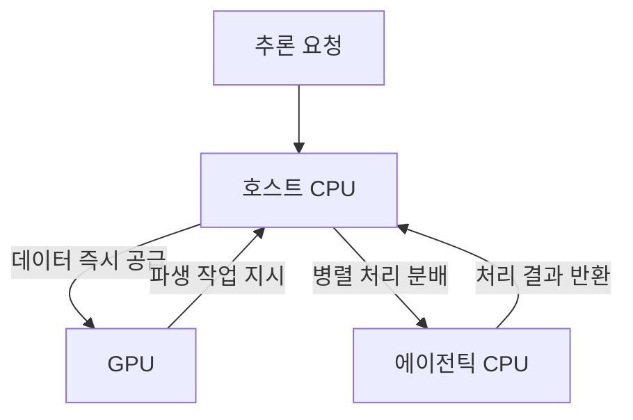

이 파일은 **미검증 원본**이다. `insights/check_frame.py` 로 원문과 대조한 뒤,
원문이 받쳐 주는 것만 카드로 옮긴다.

| 다루는 것 | 묻는 것 |
| --- | --- |
| Grok bot | ① 클라우드 가상머신을 택한 구조적 이유는 무엇인가? |
| 호스트 노드 CPU | ① 호스트 노드의 최우선 사양은 무엇인가? 

 ② 메모리 일관성은 왜 필요한가? |
| 에이전틱 CPU | 축: 코어 수와 단일 코어 성능의 상충 

 ① 파생 워크로드를 별도 노드로 빼는 이유는 무엇인가? 

 ② 다중 코어 랙과 단일 코어 성능 랙을 나누는 기준은 무엇인가? |
| 하드웨어 오케스트레이션 | ① 이기종 랙 스케일 구성에서 스케줄러의 역할은 무엇인가? |
| 한계점 | ① 원문에서 추정으로 남긴 수치는 무엇인가? 

 ② 이 글이 다루지 않은 영역은 무엇인가? |

---

### Grok bot 설계 사상

에이전틱 AI 플랫폼인 Grok bot은 로컬 하드웨어(Mac Mini 등)에 에이전트를 직접 구성하던 기존 방식 대신, 클라우드 상의 전용 가상머신을 프로비저닝하는 아키텍처를 취했습니다. 이 설계를 고른 이유는 **환경 격리와 가용성 확보**입니다. 로컬 장비에 권한을 열어줄 경우 보안 통제가 불가능해지는 문제를 샌드박스 환경으로 해결했으며, 무정전 전원 장치나 사설망 설정 없이도 항시 대기 상태를 유지할 수 있습니다.

### 호스트 노드 CPU

호스트 노드의 유일한 목적은 가속기(GPU)의 유휴 시간을 0으로 만드는 것입니다.

* **높은 단일 코어 성능과 C2C(칩 간 직접 연결 규격)**: 코어의 총량보다 GPU 상태를 지연 없이 묻고 데이터를 넘겨주는 응답성이 핵심입니다.
* **메모리 일관성**: 호스트 CPU가 HBM(대역폭 최적화 메모리)에 직접 접근하여 GPU와 같은 메모리 공간을 공유해야 합니다. 데이터를 주고받는 복사 과정을 생략하여 병목을 없애기 위함입니다.
이 사양은 호스트 CPU가 부수적인 외부 작업을 처리할 여력을 앗아갑니다. 호스트 노드가 외부 문서를 파싱하는 순간 GPU는 연산을 멈추고 대기해야 하므로, 철저히 GPU 보조에만 자원을 할당하는 상충 교환이 발생합니다.

### 에이전틱 CPU

가속기가 추론해 낸 계획에 따라 발생하는 대량의 병렬 파생 작업(웹 검색, 코드 컴파일, 문서 수집 등)을 처리하기 위한 전용 계층입니다. 여기서는 **총소유비용 대비 병렬 처리량과 단일 스레드 성능 사이의 상충**이 발생합니다.

* **고밀도 다중 코어 (최근 공표치: 인텔 288 코어, AMD 256 코어)**: 하나의 CPU를 거대한 사무실 평면도로 삼아 다수의 에이전트 작업을 쪼개어 할당합니다.
* **랙 스케일 이원화 (P-랙과 E-랙)**: 인텔이 성능 코어 랙과 효율 코어 랙을 나눈 것은 워크로드 성격이 갈리기 때문입니다. 외부 데이터를 단순 수집하며 대기 시간이 긴 작업에는 값싸고 코어가 많은 구성(인턴사원 비유)이 유리하지만, 복잡한 코드 컴파일이나 빠른 문서 파싱이 필요할 때는 코어 수가 적더라도 단일 속도가 높은 구성(숙련된 실무자 비유)을 배정해야 전체 병목이 풀립니다.

### 하드웨어 오케스트레이션

데이터센터의 컴퓨팅 단위가 단일 칩에서 랙 단위로 확장되었습니다. 초고속 처리에 특화된 가속기(Cerebras), 대용량 문맥을 담는 HBM 기반 가속기, 그리고 성격이 다른 에이전틱 CPU 랙들이 혼재합니다. Modular나 Nvidia Dynamo 같은 소프트웨어 계층은 단순히 연산 분산뿐만 아니라, 특정 워크로드가 요구하는 지연 시간과 컨텍스트 크기에 맞춰 이질적인 하드웨어 조각에 작업을 알맞게 스케줄링하는 중추 역할을 맡습니다.

### 한계점

* **원문의 추정치**: 10억 개 코어 수요 (저자 추정). 에이전트 AI 대중화로 1천만 명의 사용자가 각각 100개의 에이전트를 가상머신에 띄운다는 가정하에 산출된 짐작입니다.
* **다루지 않은 영역**: 특정 주식의 투자 가치 논의, 기업이 에이전틱 CPU 랙을 직접 사내망에 둘지 클라우드에 의존할지에 대한 시장 채택 시나리오는 본 기술 분석에서 제외했습니다. 또한, Modular 등 특정 오케스트레이션 소프트웨어의 세부적인 내부 동작 방식은 원문에서도 깊이 다루지 않아 한계로 남습니다. (가격 정보인 월 200달러는 Grok bot의 공표치로 언급되었습니다.)