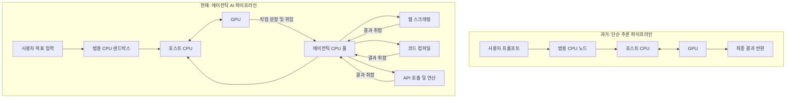

이 파일은 **미검증 원본**이다. `insights/check_frame.py` 로 원문과 대조한 뒤,
원문이 받쳐 주는 것만 카드로 옮긴다.

시니어 기술 전문가로서 해당 팟캐스트에서 다룬 **에이전틱 AI(Agentic AI) 시대를 맞이한 컴퓨팅 하드웨어 아키텍처의 변화와 CPU의 새로운 역할**을 기술적 관점에서 구조화해 드리겠습니다.

이 회차의 핵심은 단순히 "GPU가 AI를 구동한다"는 기존의 관점을 넘어, AI 모델이 스스로 계획을 세우고 여러 작업을 병렬로 수행하는 '에이전트' 형태로 진화함에 따라 **데이터센터의 CPU 토폴로지와 노드 아키텍처가 어떻게 재설계되어야 하는가**를 다루고 있습니다.

---

## 1. 에이전틱 AI 아키텍처의 구조적 변화

과거 단순 챗봇 형태의 AI와 현재의 에이전틱 AI는 컴퓨팅 자원을 활용하는 파이프라인 자체가 다릅니다. 이 전후 차이를 아키텍처 흐름도로 살펴보겠습니다.

단순 추론에서는 GPU가 모든 연산의 중심이었지만, 에이전틱 환경에서는 GPU가 생성한 복잡한 하위 작업(Task)들을 병렬로 처리하기 위한 '에이전틱 CPU 풀(Agentic CPU Pool)'이라는 새로운 인프라 계층이 필요해졌습니다.

---

## 2. 하드웨어 컴포넌트별 사양과 설계 이유

팟캐스트에서는 연산 노드를 역할에 따라 크게 4가지로 분류하고 있습니다. 각 컴포넌트가 왜 특정한 스펙(사양)을 가져야 하는지 아키텍처 관점에서 정리했습니다.

| 구분 | 역할 비유 | 주요 기술 사양 | 아키텍처 설계 이유 |
| --- | --- | --- | --- |
| **GPU** | 천재 (기획/추론) | 대규모 병렬 코어, HBM(고대역폭 메모리) | AI 모델의 가중치를 계산하고 전체 작업의 계획을 수립하는 데 최적화된 아키텍처입니다. |
| **호스트 CPU** | 수석 비서 | 높은 싱글코어 클럭, C2C(Chip-to-Chip) 인터페이스, 캐시 일관성 | GPU에 병목(Starvation)이 발생하지 않도록 데이터를 끊임없이 공급해야 합니다. 메모리 일관성(Coherency)을 통해 GPU와 동일한 데이터를 지연 없이 공유해야 하므로 싱글 스레드 성능과 빠른 I/O가 핵심입니다. |
| **에이전틱 CPU** | 실무 부서 | 초다코어 (128~288코어 이상), 고밀도 패키징 (P/E 코어 혼합) | GPU가 위임한 수많은 I/O 바운드 작업(웹 검색, 파일 읽기 등)을 병렬 처리합니다. GPU와 직접 통신하지 않으므로 캐시 일관성보다는 **전력 대비 동시 처리량(Throughput)**이 훨씬 중요합니다. |
| **범용 CPU** | 건물 관리인 | 가상화(VT-x/AMD-V) 최적화, 범용 x86/ARM | 사용자별로 격리된 가상머신(VM)과 OS 환경(보안 샌드박스)을 구동합니다. Grok bot과 같은 플랫폼이 이 위에서 실행되며 보안과 시스템 안정성을 담당합니다. |

---

## 3. 심층 분석: '에이전틱 CPU' 랙 스케일(Rack-Scale) 설계

### 호스트 CPU와 에이전틱 CPU를 분리하는 이유

기술적으로 호스트 CPU가 에이전트의 잔무(예: SEC 문서 스크래핑)를 처리할 수도 있습니다. 하지만 호스트 CPU가 네트워크 I/O 대기 상태에 빠지면, 수만 달러짜리 GPU가 데이터를 받지 못해 '유휴 상태(Idle)'가 되는 치명적인 리소스 낭비가 발생합니다. 따라서 연산 파이프라인에서 **GPU 피딩(Feeding) 노드와 태스크 워커(Worker) 노드를 물리적으로 분리**하는 아키텍처가 필수적입니다.

### P-Core vs E-Core의 랙(Rack) 단위 최적화

인텔이나 AMD가 초다코어 칩을 에이전틱 AI용으로 제안하는 이유는 작업의 성격(Workload Profile) 때문입니다.

* **P-Core 랙 (Performance):** 무거운 데이터 전처리나 복잡한 로직이 필요한 에이전트 작업에 할당. (예: 주니어 엔지니어보다는 숙련된 실무자가 필요한 작업)
* **E-Core 랙 (Efficiency):** 단순 웹 크롤링, 텍스트 파싱 등 가벼운 I/O 작업이 수만 개씩 동시다발적으로 일어날 때 전력 효율을 극대화하기 위해 사용. (예: 값싼 인스턴스를 대량 배포)

### 차세대 오케스트레이션(Orchestration)의 과제

단일 칩 내에서의 스케줄링을 넘어, 데이터센터 레벨에서 **이기종 컴퓨팅(Heterogeneous Computing)** 자원을 어떻게 할당할 것인가가 새로운 소프트웨어 과제로 떠오릅니다. Cerebras와 같은 초고속 웨이퍼 스케일 칩, 범용 HBM GPU, 호스트 CPU, 에이전틱 CPU(P/E 랙) 사이에서 네트워크 지연을 최소화하며 워크로드를 분배하는 Modular, Gimlet Labs와 같은 인프라스트럭처 소프트웨어가 시스템 아키텍처의 핵심으로 자리 잡게 될 것입니다.

---

에이전틱 AI는 하드웨어 관점에서 단순히 가속기(Accelerator)의 고도화를 넘어, 그 가속기를 보조하는 CPU 생태계의 전문화와 세분화를 강제하고 있습니다.