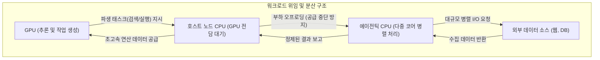

이 파일은 **미검증 원본**이다. `insights/check_frame.py` 로 원문과 대조한 뒤,
원문이 받쳐 주는 것만 카드로 옮긴다.

| 다루는 것 | 묻는 것 |
| --- | --- |
| 가상 머신<br>

<br>(Grok bot) | ① Grok bot은 로컬 Mac Mini 방식의 어떤 구동 한계를 극복하는가?<br>

<br>② 클라우드 VM 기반 샌드박스 환경은 도구 통합을 어떻게 처리하는가? |
| 호스트 노드 CPU | ① GPU를 보조하는 호스트 노드 CPU의 주된 역할은 무엇인가?<br>

<br>② 왜 코어 수보다 단일 코어 성능과 메모리 일관성이 우선되는가? |
| 에이전틱 CPU | ① 에이전틱 CPU는 호스트 노드 CPU의 어떤 부하를 넘겨받는가?<br>

<br>② 코어 수 확보와 코어 성능 사이의 설계 절충점은 무엇인가? |
| 랙 스케일 솔루션 | ① P-rack과 E-rack은 어떤 워크로드 차이를 겨냥하여 분리되는가?<br>

<br>② 분산된 하드웨어 자원을 묶는 오케스트레이션 계층의 요건은 무엇인가? |
| 한계 | ① 본문 대담자가 확정하지 못한 기술적 추정치는 무엇인가?<br>

<br>② 본 기술 해설에서 제외된 내용은 무엇인가? |

---

## 가상 머신 (Grok bot)

초기 에이전틱 AI 사용자들은 보안(개인 정보 접근 차단)을 위해 기존 노트북 대신 별도의 Mac Mini를 구매하여 오픈 소스 플랫폼(Open Claw, Hermes 등)을 로컬로 구동했습니다. 하지만 이 방식은 전원 유지, 네트워크 중단 대비, 원격 접속(VPN/Tailscale) 구축이라는 인프라 관리 부담을 사용자에게 전가했습니다.

Grok bot은 이러한 물리적 구동 한계를 클라우드 기반 전용 가상 머신(VM)을 통해 해결합니다. 사용자는 브라우저나 단순 클라이언트를 통해 클라우드 상의 샌드박스화된 VM에 접속합니다. 이 환경은 Google Drive, Canva, Figma 등의 도구 통합 환경이 사전에 연동(Native install)되어 있어, 개별 에이전트마다 API 키를 설정하거나 명령줄(Command line)을 제어할 필요 없이 모든 에이전트가 단일 VM 내의 자격 증명과 도구를 공유하여 사용할 수 있도록 설계되었습니다.

```mermaid
flowchart LR
    subgraph 구동 환경 — 로컬 하드웨어 (과거)
        L_User["사용자"] -- "전력/네트워크/보안 직접 유지" --> L_Mac["물리적 Mac Mini"]
        L_Mac -- "제한적 접근 허용" --> L_Agent["로컬 에이전트"]
    end
    
    subgraph 구동 환경 — 클라우드 샌드박스 (Grok bot)
        C_User["사용자"] -- "단순 인터페이스 접속" --> C_Cloud["클라우드 플랫폼"]
        C_Cloud -- "독립된 컴퓨팅 환경 제공" --> C_VM["전용 가상 머신 (VM)"]
        C_VM -- "사전 설정된 자격 증명 공유" --> C_Tools["외부 연동 도구군"]
    end

```

## 호스트 노드 CPU

호스트 노드 CPU는 아키텍처 상 '천재(GPU)'를 돕는 '비서'로 기능합니다. 이 CPU의 절대적인 임무는 **GPU가 쉬지 않고 연산할 수 있도록 다음 작업 데이터를 끊임없이 공급하는 것**입니다. GPU가 유휴 상태(Idle)에 빠지는 것은 곧 막대한 연산 비용의 낭비를 뜻하므로, 호스트 노드 CPU의 설계 지향점은 병렬 처리량(코어 수)보다 지연 시간 최소화에 맞춰집니다.

이러한 목적 때문에 호스트 노드 CPU는 극도로 높은 단일 코어 성능(Single-core performance)과 빠른 클럭 속도를 채택합니다. 또한, CPU와 GPU 간의 통신 병목을 없애기 위해 Grace Blackwell의 사례처럼 **칩 간 일관성 프로토콜(Coherent C2C)과 메모리 일관성**을 갖춘 사양을 요구합니다. 메모리 일관성이 확보되면 CPU(비서)와 GPU(천재)가 HBM(책상 위의 서류 더미)이라는 동일한 메모리 풀을 직접 공유할 수 있어, 데이터를 복사해 넘기는 오버헤드 없이 즉각적인 작업 인수인계가 가능해집니다.

## 에이전틱 CPU

대화형 챗봇 시절과 달리, 에이전틱 AI 환경에서 GPU는 코드 컴파일, 다수의 웹 검색, 문서 수집(SEC 공시 자료 등)과 같은 파생 워크로드를 무수히 생성합니다. 이 파생 작업을 호스트 노드 CPU가 직접 처리하게 되면, 본연의 임무인 'GPU 데이터 공급'이 중단되어 전체 시스템 병목을 유발합니다. **에이전틱 CPU**는 이처럼 호스트 CPU가 감당하기 벅찬 '대량의 파생 및 대기(Spillover) 작업'을 넘겨받아 처리하는 전용 워크포스 역할을 수행합니다.

이 설계에서는 호스트 CPU와 완전히 다른 사양 절충(Trade-off)이 일어납니다. 대담자가 인용한 [AMD의 256코어, Intel의 288코어 사양(대담자 언급 스펙)]처럼, 단일 코어의 절대적 속도보다는 **최저 비용으로 최대의 병렬 스레드를 확보하는 고밀도 멀티코어 구성**을 선택합니다. 웹 검색이나 API 호출처럼 I/O 대기 시간이 긴 작업은 코어의 연산 속도가 빠르더라도 어차피 응답을 기다려야 하므로, 차라리 속도는 약간 느리더라도 동시에 수백 개의 에이전트 요청을 독립적으로 비동기 처리할 수 있는 다코어 칩이 TCO(총 소유 비용) 측면에서 유리하기 때문입니다.



## 랙 스케일 솔루션

연산 자원의 단위가 단일 칩을 넘어 랙(Rack) 스케일로 확장되면서, 하드웨어 계층은 워크로드 특성에 따라 물리적으로 분리되고 있습니다. Intel이 제시한 [P-rack(성능형)과 E-rack(효율형) 솔루션(대담자 언급 사양)] 구성은 이러한 흐름을 대변합니다. P-rack은 빠른 응답 지연 시간이 필요한 작업에, E-rack은 속도보다는 에이전트 병렬 확장이 중요한 작업에 배정되도록 하드웨어를 분리 설계하여 전력 및 공간 효율을 극대화합니다. 이는 메모리 용량 부족은 감수하되 극단적인 토큰 생성 속도에 몰빵한 Cerebras의 랙 스케일 솔루션과, 방대한 HBM 문맥을 가진 기존 가속기 랙이 구분되는 것과 같은 맥락입니다.

이렇게 파편화된 이기종 하드웨어(고속 GPU, 대용량 GPU, P-코어 CPU, E-코어 CPU 등)가 혼재된 데이터센터에서는 작업을 적재적소에 스케줄링하는 **상위 오케스트레이션 소프트웨어**가 필수적입니다. Nvidia Dynamo가 GPU 내부의 추론 최적화에 머문다면, 향후 요구되는 오케스트레이션(예: Modular/Mojo 플랫폼 방식)은 분산된 랙 단위 자원 전체를 관장하며, 가장 적합한 칩셋으로 태스크를 라우팅하고 이종 아키텍처 간의 데이터 이동을 매끄럽게 조율할 수 있어야 합니다.

## 한계

본 해설은 대담 원문에 나타난 기술적 사실과 구조적 논증만을 다룹니다.

① **본문 대담자가 확정하지 못한 기술적 추정치:**

* Grok bot의 실제 내부 백엔드 인프라가 에이전틱 전용 CPU로 구동되는지, 단순 범용 CPU로 구동되는지 확인되지 않았습니다 [대담자 추정].
* "1,000만 명의 사용자가 각각 100개의 에이전트를 돌려 10억 개의 클라우드 코어가 필요해질 수 있다"는 수치는 시장 확장에 대한 [대담자의 단순 추산치]입니다.
* Anthropic이나 OpenAI 등 하이퍼스케일러들이 실제로 클러스터 내에 에이전틱 전용 CPU를 어느 비율로 도입하고 있는지에 대한 실증 데이터는 누락되어 있습니다.

② **본 기술 해설에서 제외된 내용:**

* 대중의 AI 수요 증가가 서버 CPU 주식 투자에 미치는 영향 등 금융적 판단.
* Grok bot과 관련된 Elon Musk 산하 조직의 보안 인력 감축 등 기업 내러티브 및 신뢰성 평가.