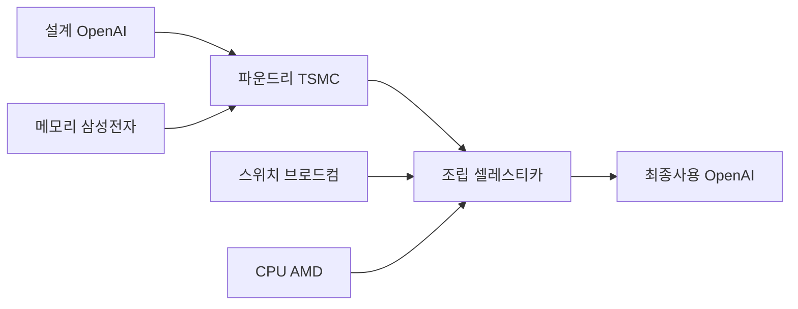

이 파일은 **미검증 원본**이다. `insights/check_frame.py` 로 원문과 대조한 뒤,
원문이 받쳐 주는 것만 카드로 옮긴다.

| 다루는 것 | 묻는 것 |
| --- | --- |
| 돈이 도는 길 | ① 밸류체인 단계별 참여자는 누구인가? 

 ② 칩의 최종 수요자는 누구인가? 

 ③ 거래의 마진과 교섭력 정보는 어떠한가? |
| 경쟁 구도 | ① 상용 실리콘 벤더와의 설계 철학 차이는? 

 ② AI 반도체 스타트업 대비 강점은? 

 ③ 9개월의 설계 주기가 시장에 주는 의미는? |
| 회사의 다음 수 | ① 세대별 칩 로드맵의 현주소는? 

 ② 범용성 유지와 전용 설계 중 어떤 길을 택할 것인가? 

 ③ 개발 비용 회수를 위한 외부 판매 가능성은? |
| 한계 | ① 본문에서 공식 발표가 아닌 추정치로 남은 것은? 

 ② 아직 검증되지 않은 성능 지표는? 

 ③ 본 분석에서 의도적으로 배제한 내용은? |

---

## 돈이 도는 길

OpenAI의 '할라페뇨(Jalapeño)' 칩은 설계부터 최종 사용까지 특수한 밸류체인을 형성한다. 일반적인 반도체 기업과 달리, 가치 사슬의 맨 앞(설계)과 맨 뒤(수요)를 모두 OpenAI가 쥐고 있는 수직 통합 구조다.

* **설계 및 발주:** OpenAI가 AI 툴(GPT-3 급 모델 등)을 활용해 직접 칩을 설계한다.
* **부품 및 위탁 생산:** 파운드리는 TSMC(N3 노드)가 맡으며, 핵심 부품인 메모리(삼성전자 HBM4 추정)와 네트워킹 스위치(브로드컴), CPU(AMD)가 공급된다.
* **시스템 조립:** 공급된 부품들은 셀레스티카(Celestica)를 통해 서버 및 랙 단위의 시스템으로 최종 조립된다.
* **최종 구매 및 사용:** 완성된 인프라는 OpenAI가 자사 모델 구동을 위해 전량 소비한다. 칩을 외부에 단품으로 팔지 않고 'AI 토큰' 형태로 가공해 고객에게 서비스한다.

> **주의:** 대담 원문에는 이 가치 사슬에 참여하는 각 기업의 **마진율(이익 크기)이나 기업 간 교섭력에 대한 데이터가 전혀 없다.** 따라서 본 밸류체인은 물건과 서비스의 흐름만 파악했을 뿐, 돈의 크기와 분배 구조를 설명하는 데는 절반의 한계가 있다.

---

## 경쟁 구도

OpenAI가 칩 시장에 직접 뛰어들면서, 기존의 상용 실리콘 벤더(엔비디아, AMD) 및 신생 AI 반도체 스타트업(그로크, 세레브라스 등)과의 경쟁 축이 크게 흔들리고 있다.

* **고객 정의의 차이 (vs 상용 벤더):** 엔비디아 등 상용 벤더는 칩을 사는 클라우드 기업의 '총 소유 비용(TCO)'을 중심에 둔다. 반면 OpenAI는 자신이 최종 사용자이므로, AI 서비스 이용자의 '엔드투엔드 지연 시간(Time to last token)'과 '요청당 에너지(Tokens per Joule)' 등 사용자 경험 자체를 최우선으로 두고 설계했다.
* **효율과 규모의 경제 (vs 스타트업):** 그로크나 세레브라스 같은 스타트업은 빠른 속도를 위해 막대한 양의 SRAM 랙을 구성해야 한다. 하지만 할라페뇨는 소형 모델 기준 사용자당 초당 1,000토큰 이상의 고속(SRAM 영역의 속도)을 달성하면서도, 칩당 700W 수준의 낮은 전력 소모(블랙웰 1200W 대비 저전력)로 이를 구현해 냈다.
* **진입 장벽의 붕괴:** 가장 큰 위협은 '속도'다. 통상 2~3년이 걸리던 칩 설계 주기를 AI EDA 툴을 활용해 단 9개월(RTL부터 테이프아웃까지)로 단축했다. 1년 안에 '루빈(Rubin)' 급의 성능을 내는 칩을 소규모 팀이 만들어 낼 수 있다는 사실은, 기존 선도 기업들이 쌓아온 하드웨어 해자에 대한 근본적인 위협이다.

---

## 회사의 다음 수

첫 칩인 할라페뇨가 성공적으로 데뷔함에 따라, OpenAI는 다음 단계의 전략적 선택 기로에 서 있다.

1. **지속적인 로드맵 전개:** 일회성 프로젝트가 아니다. 1세대 할라페뇨를 발표한 현재, 이미 2세대 칩의 테이프아웃이 임박했으며 3세대 칩 기획이 진행 중이다.
2. **전용 설계 vs 범용성 유지:** 할라페뇨는 딥시크(DeepSeek R1), 키미(Kimi K2.5) 등 타사 오픈소스 모델도 거뜬히 돌릴 수 있는 범용 추론 칩이다. 향후 OpenAI가 자사 모델 아키텍처에만 극단적으로 최적화하여 성능을 극한(세레브라스 급)으로 끌어올릴지, 아니면 미래의 알고리즘 변화에 대비해 범용성을 유지할지가 핵심 관건이다.
3. **B2B 클라우드 사업 진출 가능성:** 칩 개발에 들어간 막대한 매몰 비용(약 1억 달러 이상)을 상각하기 위해, 칩의 여유 컴퓨팅 자원을 엔터프라이즈나 신생 클라우드(네오클라우드)에 임대하거나 판매할 가능성이 제기된다. 이는 AWS가 트레이니엄(Trainium)을 통해 저렴한 추론 서비스를 제공하는 것과 유사한 비즈니스 모델이 될 수 있다.

---

## 한계

이 분석은 원문 팟캐스트 대담의 내용을 바탕으로 하였으며, 다음의 한계를 가진다.

* **추정에 불과한 공급망 데이터:** 본문의 밸류체인 중 메모리(삼성전자 HBM4), CPU(AMD 튜린 클래스), 조립(셀레스티카) 참여 여부는 2026년 8월 기준 '세미애널리시스(SemiAnalysis)' 및 팟캐스트 진행자의 추정치(Speculation)일 뿐, OpenAI의 공식 발표치(공표치)가 아니다.
* **검증되지 않은 엣지 케이스:** 인퍼런스 X(Inference X) 벤치마크를 통해 성능이 입증되었으나, 입력 시퀀스가 짧은(8K 입력/1K 출력) 조건에서 테스트되었다. 컨텍스트 길이가 100만 단위로 넘어가거나 에이전트 기반 작업(Agentic workloads)이 개입될 때의 성능 지표는 아직 검증되지 않았다.
* **기술적 세부 사항 배제:** NUMA 스타일의 로컬 HBM 분할, KV 캐시 지역성(Locality), 투기적 해독(Speculative decoding) 시의 드래프트/검증 모델 매커니즘, 다크 실리콘(Dark Silicon) 원리 등 칩 내부의 아키텍처 및 사양은 지시에 따라 분석에서 제외했다.