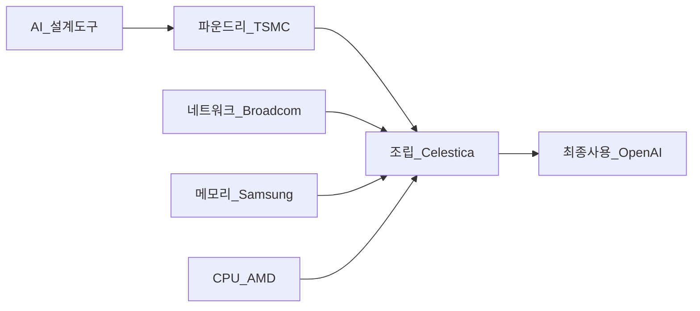

이 파일은 **미검증 원본**이다. `insights/check_frame.py` 로 원문과 대조한 뒤,
원문이 받쳐 주는 것만 카드로 옮긴다.

| 다루는 것 | 묻는 것 |
| --- | --- |
| 사용자 경험과 에너지<br>

<br>(설계 철학) | ① OpenAI는 칩 설계의 최우선 지표를 무엇으로 잡았는가?<br>

<br>② 실리콘 판매자와 AI 연구소의 설계 접근은 어떻게 다른가? |
| 범용성과 기회비용<br>

<br>(경쟁 구도) | ① 왜 자사 모델 전용이 아닌 범용 추론 칩으로 설계했는가?<br>

<br>② 이것이 기존 GPU 및 전용 가속기 시장에 던지는 위협은 무엇인가? |
| 가치사슬<br>

<br>(돈이 도는 길) | ① 할라피뇨 칩은 어떤 파트너들의 단계를 거쳐 완성되는가?<br>

<br>② 9개월 만의 칩 설계가 설계 도구 시장에 뜻하는 바는 무엇인가? |
| 회사의 다음 수<br>

<br>(전략적 선택지) | ① 막대한 개발비를 상각하기 위해 칩을 외부로 판매할 것인가?<br>

<br>② 칩 생태계의 주도권을 쥐기 위한 다음 세대 로드맵은 어떠한가? |
| 한계 | ① 원문에서 추정치로 남겨둔 밸류체인 정보는 무엇인가?<br>

<br>② 성능 검증에서 아직 확인되지 않은 영역은 어디인가?<br>

<br>③ 본문이 다루지 못한 비즈니스 지표는 무엇인가? |

---

## 1. 사용자 경험과 에너지 (설계 철학)

전통적인 실리콘 판매자(Merchant Silicon Vendor)의 칩 설계는 구매자인 하이퍼스케일러의 **총소유비용(TCO)** 절감에 맞춰져 있습니다. 반면, AI 연구소인 OpenAI가 수직 계열화를 통해 직접 칩을 설계하면서 우선순위가 완전히 뒤바뀌었습니다. 이들은 실리콘 구매자가 아닌 **최종 AI 사용자**와 밀착되어 있기 때문입니다.

이들이 칩을 설계하며 쥔 두 가지 핵심 지표는 다음과 같습니다.

* **종단간 지연 시간:** 첫 토큰이 나오는 시간이 아닌, 마지막 토큰이 완성되는 시간(사용자 대기 시간)
* **요청당 에너지:** 토큰당 투입되는 전력량(Tokens per Joule)

엔비디아의 블랙웰(Blackwell)이 1,200와트 이상을 소모하는 반면, 할라피뇨는 700와트 수준에서 구동되며 전력 대비 토큰 처리량이 압도적입니다. 이는 칩의 제조 원가를 낮추는 것보다, 구동 시 발생하는 막대한 전력 에너지를 통제하는 것이 궁극적인 경쟁력임을 보여줍니다.

## 2. 범용성과 기회비용 (경쟁 구도)

할라피뇨는 OpenAI의 자사 모델 구조에만 맞춰 최적화(Co-design)할 수 있었음에도, 다양한 오픈소스 모델(GPT OSS, Kimi 등)을 돌릴 수 있는 범용 추론 칩으로 설계되었습니다. 경영 관점에서 이는 **기회비용**을 최소화하기 위한 전략입니다. 특정 기능이나 모델에 묶여 향후 사용자의 새로운 수요를 감당하지 못하는 상황(후회 비용)이, 칩 면적을 조금 더 차지하는 한계비용보다 훨씬 치명적이라고 판단한 것입니다.

이러한 범용성은 기존 경쟁 구도를 직접적으로 타격합니다.

* **대 엔비디아(GPU):** "특정 모델에 종속되지 않는다"는 범용 GPU의 방어 논리를 무력화합니다.
* **대 구글(TPU) 및 AI ASIC 스타트업:** 복잡한 SRAM 랙을 거대하게 구축하지 않고도, HBM을 탑재한 단일 칩으로 초당 1,000토큰 이상의 처리 속도(소형 모델 기준)를 달성하며 기존 가속기들의 입지를 좁힙니다.

특히, 작업 부하(사전 채우기 vs 해독)의 비율이 변할 때 장비가 노는 방식을 다루는 철학에서 엔비디아의 분업화 방식과 크게 대비됩니다.

```mermaid
flowchart TD
    subgraph 축 — 칩 분업화
        direction TB
        사전채우기_전용랙 --> 작업량_변동1
        해독_전용랙 --> 작업량_변동1
        작업량_변동1 --> 랙_단위_방치
    end

    subgraph 축 — 단일 칩 통합
        direction TB
        단일칩_사전채우기 --> 작업량_변동2
        단일칩_해독 --> 작업량_변동2
        작업량_변동2 --> 일부_회로_차단
    end

```

*원문 논지: "어두운 실리콘(꺼진 회로)이 가속기를 통째로 놀리는 것보다 싸다."*

## 3. 가치사슬 (돈이 도는 길)

OpenAI는 칩 설계부터 완성까지 9개월이라는 이례적인 속도를 냈습니다. 이는 뛰어난 인재풀과 더불어 자사의 AI 모델(GPT-3 급 이상)을 설계 도구(EDA)로 활용했기 때문입니다. 이들이 구축한 할라피뇨의 공급망은 다음과 같이 펼쳐집니다.



* **설계(OpenAI):** AI 도구를 활용해 9개월 만에 테이프아웃 달성.
* **제조(TSMC):** N3 노드 공정으로 실리콘 양산.
* **주요 부품 조달:** Broadcom(네트워크 스위치, ESUN), AMD(Turin 급 X86 CPU), Samsung(HBM4).
* **시스템 조립(Celestica):** 칩과 부품을 모아 서버 랙 단위로 통합.
* **최종 소비(OpenAI):** 구축된 시스템을 자사 데이터센터에서 직접 소비.

*주의: 원문에는 이 밸류체인 단계별 마진율이나 기업 간 교섭력(Bargaining Power)에 대한 언급이 없습니다. 따라서 위 구조는 단계와 참여자만 식별된 절반의 그림입니다.*

여기서 AI가 칩 설계를 가속했다는 사실은 설계 도구(EDA) 생태계에 큰 시사점을 줍니다. 소규모 팀도 AI 도구를 쥐면 1년 안에 최상급 칩(Vera Rubin 급)을 설계할 수 있다는 것이 증명되었으며, 이는 반도체 설계의 진입 장벽이 낮아짐을 의미합니다.

## 4. 회사의 다음 수 (전략적 선택지)

OpenAI는 이미 2세대 칩 테이프아웃을 앞두고 있으며 3세대를 구상 중입니다. 짧은 설계 주기를 무기로 삼아, 첫 세대에서 넣지 못한 기능들을 빠르게 다음 세대로 넘기며 진화하는 방식을 택했습니다.

회사의 다음 핵심 전략 과제는 **'이 칩을 외부로 팔 것인가?'** 입니다.
칩 개발과 양산에 투입된 막대한 고정비(약 1억 달러 이상 추정)를 상각하려면 자사 캡티브(Captive) 물량만으로는 재무적 부담이 큽니다. 과거 인텔이 파운드리를 독점하려다 비용 문제로 외부 개방을 택했듯, OpenAI 역시 다음과 같은 수익화 카드를 만지작거릴 수 있습니다.

* 경쟁사(Anthropic 등)에는 직접 팔지 않되, 온프레미스를 원하는 엔터프라이즈 기업에 판매.
* 네오클라우드(Neocloud)와 파트너십을 맺어 렌탈 사업 전개.
* AWS가 Trainium을 통해 하듯, 저비용 'OpenAI 추론 서비스' 형태로 클라우드에서 대여.

## 5. 한계

이 분석은 대담 내용에 국한되어 있으며, 경영 전략을 완성하기에는 다음의 한계가 존재합니다.

* **추정된 밸류체인 파트너:** 시스템 조립 파트너인 Celestica와 메모리 공급사인 Samsung(HBM4)은 공식 발표가 아닌 대담자들의 추정치(Speculative)입니다.
* **미검증 벤치마크 구간:** 성능 벤치마크(Inference X) 결과는 긍정적이나, 에이전트 기반 작업(Agentic workloads)이나 100만 단위 이상의 초대형 입력 컨텍스트 길이(Large Context Length)에서의 성능은 아직 검증되지 않았습니다.
* **다루지 않은 영역:** 각 파트너 간의 단가 계약, 마진 구조, 그리고 구체적인 생산 수율 및 양산 스케일업(Scale-up) 시의 신뢰성 문제는 원문에서 다뤄지지 않아 본 분석에서 제외되었습니다. 칩 설계가 아닌 양산 단계에서의 병목 현상 여부는 아직 확인되지 않은 변수입니다.