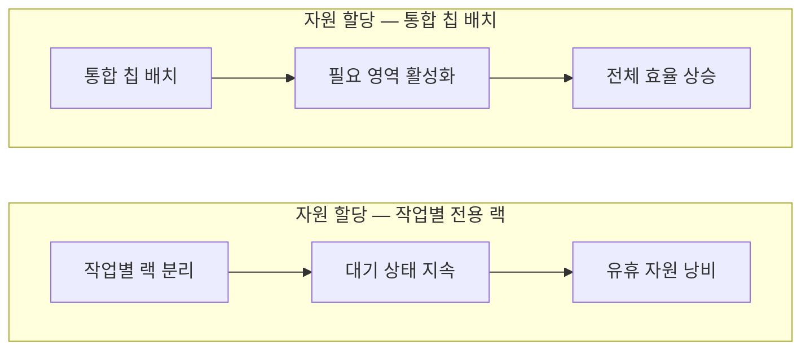

이 파일은 **미검증 원본**이다. `insights/check_frame.py` 로 원문과 대조한 뒤,
원문이 받쳐 주는 것만 카드로 옮긴다.

| 다루는 것 | 묻는 것 |
| --- | --- |
| 밸류체인 | ① 누가 어느 단계를 쥐고 있는가? 

 ② 누가 고객인가? |
| 경쟁 구도 | ① 실리콘 벤더의 방어 논리는 어떻게 무너지는가? 

 ② 칩 설계의 진입 장벽은 어떻게 낮아지는가? |
| 회사의 다음 수 | ① 막대한 개발 비용은 어떻게 회수할 것인가? 

 ② 기회비용은 어떻게 관리하는가? |
| 한계 | ① 추정으로 밝힌 것은 무엇인가? 

 ② 아직 검증되지 않은 것은 무엇인가? 

 ③ 원문에 없어 글에서 다루지 않은 것은 무엇인가? |

---

오픈AI가 처음으로 자체 설계한 추론 전용 칩 할라페뇨를 공개했습니다. 이 움직임은 단순한 부품 내재화를 넘어, AI 인프라 시장의 자본 흐름과 경쟁 규칙을 뒤흔드는 전략적 변곡점입니다. 경영 관점에서 이번 발표가 갖는 의미를 분석해 드립니다.

## 1. 밸류체인: 돈이 도는 길

오픈AI가 주도하는 새로운 하드웨어 밸류체인은 기존의 상용 실리콘 벤더(엔비디아 등)를 우회하여 직접 설계와 조립을 통제하는 구조를 띱니다.

* **1단계 (칩 설계 및 기획):** 오픈AI. AI 도구를 활용해 9개월 만에 설계를 완료하며 가장 핵심적인 부가가치를 쥡니다.
* **2단계 (핵심 IP 및 부품 조달):** AMD(튜린급 CPU 공급), 브로드컴(토마호크 6 스위치 및 네트워킹 프로토콜 제공).
* **3단계 (반도체 위탁 생산):** TSMC(N3 공정).
* **4단계 (메모리 공급):** 삼성전자(2026년 8월 기준 팟캐스트 진행자 추정치).
* **5단계 (시스템 통합 및 조립):** 셀레스티카(2026년 8월 기준 팟캐스트 진행자 추정치).
* **6단계 (최종 사용):** 오픈AI. 현재는 자체 모델 구동을 위한 내부 물량 소화에 집중하고 있습니다. 향후 신흥 클라우드나 엔터프라이즈 파트너가 새로운 고객층으로 편입될 잠재력이 있습니다.

> **주의:** 원문에는 이 밸류체인 내 각 공급사 간의 구체적인 마진율이나 교섭력 우위에 대한 정보가 없습니다. 따라서 이 글에서는 수익 분배 구조의 절반만 그려졌음을 밝힙니다.

---

## 2. 경쟁 구도: 게임의 법칙 변화

할라페뇨의 등장은 기존 하드웨어 강자들이 구축해 둔 두 가지 핵심 방어벽을 흔들고 있습니다.

**첫째, '범용성'에 대한 독점적 권위가 깨졌습니다.**
그동안 범용 GPU 진영은 특정 모델에 종속된 자체 칩은 빠르게 변하는 AI 트렌드에 대응할 수 없다고 주장해 왔습니다. 그러나 할라페뇨는 소형 오픈소스 모델부터 대형 모델까지 모두 높은 효율로 구동하며, 자체 설계 칩도 충분한 유연성을 가질 수 있음을 증명했습니다.

**둘째, AI가 칩 설계의 진입 장벽을 극적으로 낮췄습니다.**
통상 2~3년이 걸리던 칩 설계 주기를 AI 도구와 소수 정예 팀을 통해 9개월로 단축했습니다. 이는 자본력과 설계 노하우를 갖춘 다른 AI 기업(예: 앤스로픽)도 언제든 자체 칩 시장에 뛰어들어 1년 안에 상용 칩 수준의 결과물을 낼 수 있음을 시사합니다.

기존 상용 칩과 할라페뇨의 철학 차이는 자원 할당 방식에서 가장 뚜렷하게 나타납니다. 오픈AI는 "비활성 실리콘이 유휴 가속기보다 저렴하다"는 원칙 아래 칩을 설계했습니다.

---

## 3. 회사의 다음 수: 기회비용과 수익화

오픈AI 앞에는 개발 속도 유지와 막대한 투자비 회수라는 과제가 놓여 있습니다.

* **투자비 회수 모델 다각화:** 칩 하나를 테이프아웃(설계 완료 후 양산 위탁)하고 램프업하는 데 약 1억 달러(2026년 8월 기준 팟캐스트 진행자 추정치)가 듭니다. 이 막대한 고정비를 상각하기 위해 오픈AI는 이 칩을 온프레미스(기업 자체 서버) 환경을 원하는 엔터프라이즈나 신흥 클라우드 사업자에게 대여하거나 판매하는 B2B 비즈니스를 다음 수로 고려할 수 있습니다.
* **완벽함보다 시장 선점(기회비용 관리):** 오픈AI는 한계비용(기능을 추가하는 비용)보다 기회비용(수요를 놓치는 비용)을 더 치명적으로 봅니다. 모든 기능을 첫 칩에 우겨넣기보다 쳐낼 것은 과감히 쳐내고 빠르게 시장에 내놓았습니다. 이미 2세대 칩 테이프아웃이 임박했다는 점은, 이들이 완벽한 단일 제품이 아닌 '빠른 세대교체'를 핵심 전략으로 삼았음을 보여줍니다.

---

## 4. 한계

이 분석은 원문의 정보에 근거하며 다음과 같은 한계를 가집니다.

* **추정치 포함:** 삼성전자의 메모리 공급, 셀레스티카의 시스템 통합 참여, 테이프아웃 비용 1억 달러는 2026년 8월 기준 팟캐스트 진행자의 추정치이며 공식 발표가 아닙니다.
* **검증되지 않은 성능:** 벤치마크 결과는 소규모 입출력 환경에서만 측정되었습니다. 100만 토큰 이상의 긴 문맥이나 복잡한 에이전트 작업에서의 성능은 아직 검증되지 않았습니다.
* **다루지 않은 영역:** 원문에 기업 간 거래 마진과 교섭력에 대한 데이터가 존재하지 않아 본문에서 제외했습니다.